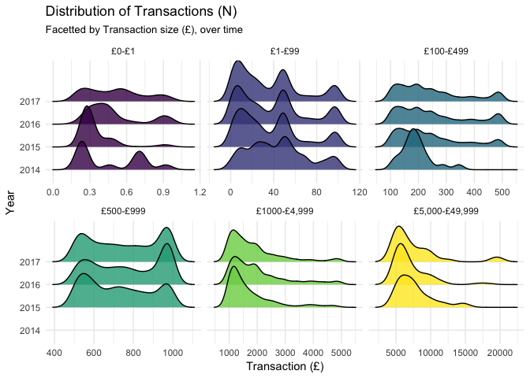

# Deep Dive: Property Partner July 2017 Open House Resale Data

As peer to peer lending matures platforms have begun to have increasingly divergent stances on sharing their data, making it increasingly important that their is external pressure on them to improve their data sharing. This blog series will focus on platforms sharing their data, exploring what their data is saying and suggesting possible changes to their releases that would make it easier for investors to gain insights on their own.

For the first post I will be focussing on data from [Property Partner](https://www.propertypartner.co/aboutus#/ourstory), which is a property crowd-funding site that started in 2014 and allows investors to buy small stakes in a range of properties. The data I will be using was released as part of Property Partner's [July 2017 open house data](https://resources.propertypartner.co/open-house-july-2017/) blog, and contains information on resale's of their property portfolio. This post will reproduce and update previous work, explore the underlying trends, and suggest possible changes for future releases. All code is available [here](https://github.com/seabbs/propertypartner) and the data can be downloaded from this [link](https://d2ofd11qqzygs0.cloudfront.net/files/purchases-on-resale-july-2017-open-house.zip).

As a starting point I have reproduced a graph of Transactions (£) over time first published [here](https://p2pblog.co.uk/property-partner-trading-analysis/). This shows the increase in transactions (£) over time on the resale market, with a continuous increase in volume until early 2016 from which point seasonal variation has dominated. I have also stratified by Transaction type, revealing the impact of the recently introduced bidding system, which has steadily increased it's share of transactions month on month.

<!--html_preserve-->

<!--/html_preserve-->

The plot naturally leads to the following question - is the increase in trading volume driven by an increasing number of trades or by changes in the size of trades being made? The following plot explores this by plotting the number of transactions over time. We see that the early growth in volumes was likely driven by an increasing number of trades but that variation since then is more strongly linked to changes in trade size.

<!--html_preserve-->

<!--/html_preserve-->

Now that we understand how transactions (N) have varied with time we need to explore the underlying trends. The most obvious question is which properties are being traded for the most, and if possible why do these properties have so much turn over? The following plot shows trades by property, stratified by year. It shows that for the first year of trading a few properties (as the portfolio was small) dominated the number of trades made, in 2016 trading was spread over more properties but with fewer trades per property. So far for 2017 there has been a greatly reduced number of trades, with trading becoming increasingly homogeneous across the  portfolio. Unfortunately the extract published by Property Partner has little detail about properties so establishing why properties are traded at different rates is difficult. Whilst I could in principle join the various data sets they produce, without a unique ID this would be difficult and prone to errors!

<!--html_preserve-->

<script type="application/json" data-for="112914dac0ef8">{"x":{"data":[{"orientation":"h","width":0.900000000000006,"base":0,"x":[77],"y":[43],"text":"`Property name`: 5 Cambridge Road, Hanwell Count:    77 Count:    77","type":"bar","marker":{"autocolorscale":false,"color":"rgba(68,2,85,0.8)","line":{"width":1.88976377952756,"color":"transparent"}},"showlegend":false,"xaxis":"x","yaxis":"y","hoverinfo":"text","frame":null},{"orientation":"h","width":0.899999999999999,"base":0,"x":[108],"y":[30],"text":"`Property name`: Flat 2, 17, 19 Garden Court, West Drayton Count:   108 Count:   108","type":"bar","marker":{"autocolorscale":false,"color":"rgba(68,3,85,0.8)","line":{"width":1.88976377952756,"color":"transparent"}},"showlegend":false,"xaxis":"x","yaxis":"y","hoverinfo":"text","frame":null},{"orientation":"h","width":0.899999999999999,"base":0,"x":[170],"y":[28],"text":"`Property name`: 2 Grebe Close, Forest Gate Count:   170 Count:   170","type":"bar","marker":{"autocolorscale":false,"color":"rgba(68,4,85,0.8)","line":{"width":1.88976377952756,"color":"transparent"}},"showlegend":false,"xaxis":"x","yaxis":"y","hoverinfo":"text","frame":null},{"orientation":"h","width":0.900000000000006,"base":0,"x":[174],"y":[64],"text":"`Property name`: 30 Cherington Road, Hanwell Count:   174 Count:   174","type":"bar","marker":{"autocolorscale":false,"color":"rgba(68,4,85,0.8)","line":{"width":1.88976377952756,"color":"transparent"}},"showlegend":false,"xaxis":"x","yaxis":"y","hoverinfo":"text","frame":null},{"orientation":"h","width":0.900000000000006,"base":0,"x":[182],"y":[48],"text":"`Property name`: 2-5 Finch Heights, Hastings Count:   182 Count:   182","type":"bar","marker":{"autocolorscale":false,"color":"rgba(68,4,86,0.8)","line":{"width":1.88976377952756,"color":"transparent"}},"showlegend":false,"xaxis":"x","yaxis":"y","hoverinfo":"text","frame":null},{"orientation":"h","width":0.899999999999999,"base":0,"x":[194],"y":[26],"text":"`Property name`: Flat 27, Cotton Avenue, Acton Count:   194 Count:   194","type":"bar","marker":{"autocolorscale":false,"color":"rgba(68,4,86,0.8)","line":{"width":1.88976377952756,"color":"transparent"}},"showlegend":false,"xaxis":"x","yaxis":"y","hoverinfo":"text","frame":null},{"orientation":"h","width":0.900000000000006,"base":0,"x":[202],"y":[45],"text":"`Property name`: Flat 128, Vantage Building, Hayes Count:   202 Count:   202","type":"bar","marker":{"autocolorscale":false,"color":"rgba(68,4,86,0.8)","line":{"width":1.88976377952756,"color":"transparent"}},"showlegend":false,"xaxis":"x","yaxis":"y","hoverinfo":"text","frame":null},{"orientation":"h","width":0.900000000000006,"base":0,"x":[210],"y":[54],"text":"`Property name`: Flats 1, 5-7 Tower Mint Apartments, Whitechapel Count:   210 Count:   210","type":"bar","marker":{"autocolorscale":false,"color":"rgba(68,5,86,0.8)","line":{"width":1.88976377952756,"color":"transparent"}},"showlegend":false,"xaxis":"x","yaxis":"y","hoverinfo":"text","frame":null},{"orientation":"h","width":0.900000000000006,"base":0,"x":[235],"y":[52],"text":"`Property name`: Ansteys Court, Torquay Count:   235 Count:   235","type":"bar","marker":{"autocolorscale":false,"color":"rgba(68,5,86,0.8)","line":{"width":1.88976377952756,"color":"transparent"}},"showlegend":false,"xaxis":"x","yaxis":"y","hoverinfo":"text","frame":null},{"orientation":"h","width":0.900000000000006,"base":0,"x":[256],"y":[36],"text":"`Property name`: Flat 4, Graveney Court, Romford Count:   256 Count:   256","type":"bar","marker":{"autocolorscale":false,"color":"rgba(68,5,86,0.8)","line":{"width":1.88976377952756,"color":"transparent"}},"showlegend":false,"xaxis":"x","yaxis":"y","hoverinfo":"text","frame":null},{"orientation":"h","width":0.900000000000006,"base":0,"x":[384],"y":[56],"text":"`Property name`: 129 Southwood Road, Hayling Island Count:   384 Count:   384","type":"bar","marker":{"autocolorscale":false,"color":"rgba(69,8,87,0.8)","line":{"width":1.88976377952756,"color":"transparent"}},"showlegend":false,"xaxis":"x","yaxis":"y","hoverinfo":"text","frame":null},{"orientation":"h","width":0.899999999999999,"base":0,"x":[487],"y":[31],"text":"`Property name`: Flat 9, Woodgate Court, Hornchurch Count:   487 Count:   487","type":"bar","marker":{"autocolorscale":false,"color":"rgba(69,10,88,0.8)","line":{"width":1.88976377952756,"color":"transparent"}},"showlegend":false,"xaxis":"x","yaxis":"y","hoverinfo":"text","frame":null},{"orientation":"h","width":0.900000000000006,"base":0,"x":[606],"y":[51],"text":"`Property name`: 11 Murray Court, Hanwell Count:   606 Count:   606","type":"bar","marker":{"autocolorscale":false,"color":"rgba(69,12,89,0.8)","line":{"width":1.88976377952756,"color":"transparent"}},"showlegend":false,"xaxis":"x","yaxis":"y","hoverinfo":"text","frame":null},{"orientation":"h","width":0.900000000000006,"base":0,"x":[611],"y":[44],"text":"`Property name`: Flat 3, 51 St James Road, Sutton Count:   611 Count:   611","type":"bar","marker":{"autocolorscale":false,"color":"rgba(69,12,90,0.8)","line":{"width":1.88976377952756,"color":"transparent"}},"showlegend":false,"xaxis":"x","yaxis":"y","hoverinfo":"text","frame":null},{"orientation":"h","width":0.900000000000006,"base":0,"x":[612],"y":[35],"text":"`Property name`: Flat 4, Richmond Court, Romford Count:   612 Count:   612","type":"bar","marker":{"autocolorscale":false,"color":"rgba(69,12,90,0.8)","line":{"width":1.88976377952756,"color":"transparent"}},"showlegend":false,"xaxis":"x","yaxis":"y","hoverinfo":"text","frame":null},{"orientation":"h","width":0.900000000000006,"base":0,"x":[656],"y":[37],"text":"`Property name`: 22 Rubicon Court, Romford Count:   656 Count:   656","type":"bar","marker":{"autocolorscale":false,"color":"rgba(69,13,90,0.8)","line":{"width":1.88976377952756,"color":"transparent"}},"showlegend":false,"xaxis":"x","yaxis":"y","hoverinfo":"text","frame":null},{"orientation":"h","width":0.900000000000006,"base":0,"x":[681],"y":[34],"text":"`Property name`: Flat 3, Tower Mint Apartments, Whitechapel Count:   681 Count:   681","type":"bar","marker":{"autocolorscale":false,"color":"rgba(69,14,90,0.8)","line":{"width":1.88976377952756,"color":"transparent"}},"showlegend":false,"xaxis":"x","yaxis":"y","hoverinfo":"text","frame":null},{"orientation":"h","width":0.900000000000006,"base":0,"x":[717],"y":[38],"text":"`Property name`: Flat 4, Tower Mint Apartments, Whitechapel Count:   717 Count:   717","type":"bar","marker":{"autocolorscale":false,"color":"rgba(69,14,91,0.8)","line":{"width":1.88976377952756,"color":"transparent"}},"showlegend":false,"xaxis":"x","yaxis":"y","hoverinfo":"text","frame":null},{"orientation":"h","width":0.899999999999999,"base":0,"x":[738],"y":[29],"text":"`Property name`: Flat 9, Chipping Lodge, Romford Count:   738 Count:   738","type":"bar","marker":{"autocolorscale":false,"color":"rgba(69,15,91,0.8)","line":{"width":1.88976377952756,"color":"transparent"}},"showlegend":false,"xaxis":"x","yaxis":"y","hoverinfo":"text","frame":null},{"orientation":"h","width":0.900000000000006,"base":0,"x":[785],"y":[69],"text":"`Property name`: 19, Philimore Close, Plumstead Count:   785 Count:   785","type":"bar","marker":{"autocolorscale":false,"color":"rgba(69,16,91,0.8)","line":{"width":1.88976377952756,"color":"transparent"}},"showlegend":false,"xaxis":"x","yaxis":"y","hoverinfo":"text","frame":null},{"orientation":"h","width":0.900000000000006,"base":0,"x":[827],"y":[41],"text":"`Property name`: 37 Kentlea Road, Thamesmead Count:   827 Count:   827","type":"bar","marker":{"autocolorscale":false,"color":"rgba(69,16,92,0.8)","line":{"width":1.88976377952756,"color":"transparent"}},"showlegend":false,"xaxis":"x","yaxis":"y","hoverinfo":"text","frame":null},{"orientation":"h","width":0.900000000000006,"base":0,"x":[944],"y":[46],"text":"`Property name`: Flat 6, 3A Grantham Road, Ilford Count:   944 Count:   944","type":"bar","marker":{"autocolorscale":false,"color":"rgba(69,18,93,0.8)","line":{"width":1.88976377952756,"color":"transparent"}},"showlegend":false,"xaxis":"x","yaxis":"y","hoverinfo":"text","frame":null},{"orientation":"h","width":0.900000000000006,"base":0,"x":[1094],"y":[50],"text":"`Property name`: Flat 35, Sherringham Court, Hayes Count:  1094 Count:  1094","type":"bar","marker":{"autocolorscale":false,"color":"rgba(69,20,94,0.8)","line":{"width":1.88976377952756,"color":"transparent"}},"showlegend":false,"xaxis":"x","yaxis":"y","hoverinfo":"text","frame":null},{"orientation":"h","width":0.900000000000006,"base":0,"x":[1157],"y":[57],"text":"`Property name`: 6 Ryeland Close, West Drayton Count:  1157 Count:  1157","type":"bar","marker":{"autocolorscale":false,"color":"rgba(69,21,95,0.8)","line":{"width":1.88976377952756,"color":"transparent"}},"showlegend":false,"xaxis":"x","yaxis":"y","hoverinfo":"text","frame":null},{"orientation":"h","width":0.900000000000006,"base":0,"x":[1325],"y":[66],"text":"`Property name`: 20, Philimore Close, Plumstead Count:  1325 Count:  1325","type":"bar","marker":{"autocolorscale":false,"color":"rgba(69,24,96,0.8)","line":{"width":1.88976377952756,"color":"transparent"}},"showlegend":false,"xaxis":"x","yaxis":"y","hoverinfo":"text","frame":null},{"orientation":"h","width":0.900000000000006,"base":0,"x":[1405],"y":[63],"text":"`Property name`: 37 Friars Close, Seven Kings Count:  1405 Count:  1405","type":"bar","marker":{"autocolorscale":false,"color":"rgba(69,25,97,0.8)","line":{"width":1.88976377952756,"color":"transparent"}},"showlegend":false,"xaxis":"x","yaxis":"y","hoverinfo":"text","frame":null},{"orientation":"h","width":0.900000000000006,"base":0,"x":[1478],"y":[58],"text":"`Property name`: Flat 34, Waterford House, West Drayton Count:  1478 Count:  1478","type":"bar","marker":{"autocolorscale":false,"color":"rgba(69,26,98,0.8)","line":{"width":1.88976377952756,"color":"transparent"}},"showlegend":false,"xaxis":"x","yaxis":"y","hoverinfo":"text","frame":null},{"orientation":"h","width":0.900000000000006,"base":0,"x":[1702],"y":[59],"text":"`Property name`: Flat 2, Tower Mint Apartments, Whitechapel Count:  1702 Count:  1702","type":"bar","marker":{"autocolorscale":false,"color":"rgba(70,29,100,0.8)","line":{"width":1.88976377952756,"color":"transparent"}},"showlegend":false,"xaxis":"x","yaxis":"y","hoverinfo":"text","frame":null},{"orientation":"h","width":0.900000000000006,"base":0,"x":[2049],"y":[73],"text":"`Property name`: 42 Flats in Sandars Maltings, Gainsborough Count:  2049 Count:  2049","type":"bar","marker":{"autocolorscale":false,"color":"rgba(70,33,103,0.8)","line":{"width":1.88976377952756,"color":"transparent"}},"showlegend":false,"xaxis":"x","yaxis":"y","hoverinfo":"text","frame":null},{"orientation":"h","width":0.900000000000006,"base":0,"x":[2111],"y":[61],"text":"`Property name`: Flat 20, Northfleet Lodge, Woking Count:  2111 Count:  2111","type":"bar","marker":{"autocolorscale":false,"color":"rgba(70,34,104,0.8)","line":{"width":1.88976377952756,"color":"transparent"}},"showlegend":false,"xaxis":"x","yaxis":"y","hoverinfo":"text","frame":null},{"orientation":"h","width":0.900000000000006,"base":0,"x":[2261],"y":[65],"text":"`Property name`: Flat 1, 7 Boyd Street, Whitechapel Count:  2261 Count:  2261","type":"bar","marker":{"autocolorscale":false,"color":"rgba(70,35,105,0.8)","line":{"width":1.88976377952756,"color":"transparent"}},"showlegend":false,"xaxis":"x","yaxis":"y","hoverinfo":"text","frame":null},{"orientation":"h","width":0.900000000000006,"base":0,"x":[2893],"y":[72],"text":"`Property name`: 5 Scholars Way, Romford Count:  2893 Count:  2893","type":"bar","marker":{"autocolorscale":false,"color":"rgba(69,43,111,0.8)","line":{"width":1.88976377952756,"color":"transparent"}},"showlegend":false,"xaxis":"x","yaxis":"y","hoverinfo":"text","frame":null},{"orientation":"h","width":0.900000000000006,"base":0,"x":[3080],"y":[70],"text":"`Property name`: 114 Fairholme Road, Croydon Count:  3080 Count:  3080","type":"bar","marker":{"autocolorscale":false,"color":"rgba(69,45,113,0.8)","line":{"width":1.88976377952756,"color":"transparent"}},"showlegend":false,"xaxis":"x","yaxis":"y","hoverinfo":"text","frame":null},{"orientation":"h","width":0.900000000000006,"base":0,"x":[3877],"y":[71],"text":"`Property name`: 80 Manordene Road, Thamesmead Count:  3877 Count:  3877","type":"bar","marker":{"autocolorscale":false,"color":"rgba(68,53,121,0.8)","line":{"width":1.88976377952756,"color":"transparent"}},"showlegend":false,"xaxis":"x","yaxis":"y","hoverinfo":"text","frame":null},{"orientation":"h","width":0.900000000000006,"base":0,"x":[5544],"y":[75],"text":"`Property name`: Flat 6, High Court, Byfleet Count:  5544 Count:  5544","type":"bar","marker":{"autocolorscale":false,"color":"rgba(65,70,135,0.8)","line":{"width":1.88976377952756,"color":"transparent"}},"showlegend":false,"xaxis":"x","yaxis":"y","hoverinfo":"text","frame":null},{"orientation":"h","width":0.900000000000006,"base":0,"x":[5566],"y":[77],"text":"`Property name`: 12 Kings Highway, Plumstead Count:  5566 Count:  5566","type":"bar","marker":{"autocolorscale":false,"color":"rgba(65,71,135,0.8)","line":{"width":1.88976377952756,"color":"transparent"}},"showlegend":false,"xaxis":"x","yaxis":"y","hoverinfo":"text","frame":null},{"orientation":"h","width":0.900000000000006,"base":0,"x":[10854],"y":[78],"text":"`Property name`: 22 Amhurst Walk, Thamesmead Count: 10854 Count: 10854","type":"bar","marker":{"autocolorscale":false,"color":"rgba(42,122,142,0.8)","line":{"width":1.88976377952756,"color":"transparent"}},"showlegend":false,"xaxis":"x","yaxis":"y","hoverinfo":"text","frame":null},{"orientation":"h","width":0.900000000000006,"base":0,"x":[26506],"y":[79],"text":"`Property name`: 15 Heathlands Way, Hounslow Count: 26506 Count: 26506","type":"bar","marker":{"autocolorscale":false,"color":"rgba(253,231,37,0.8)","line":{"width":1.88976377952756,"color":"transparent"}},"showlegend":false,"xaxis":"x","yaxis":"y","hoverinfo":"text","frame":null},{"orientation":"h","width":[0.899999999999999,0.899999999999999],"base":[0,0],"x":[26,26],"y":[8,9],"text":["`Property name`: 3 flats in The Heights, West Midlands Count:    26 Count:    26","`Property name`: 9 units in George Road, West Midlands Count:    26 Count:    26"],"type":"bar","marker":{"autocolorscale":false,"color":"rgba(68,1,84,0.8)","line":{"width":1.88976377952756,"color":"transparent"}},"showlegend":false,"xaxis":"x2","yaxis":"y","hoverinfo":"text","frame":null},{"orientation":"h","width":0.9,"base":0,"x":[33],"y":[6],"text":"`Property name`: 4 flats in Blanchmans Road, Surrey Count:    33 Count:    33","type":"bar","marker":{"autocolorscale":false,"color":"rgba(68,1,84,0.8)","line":{"width":1.88976377952756,"color":"transparent"}},"showlegend":false,"xaxis":"x2","yaxis":"y","hoverinfo":"text","frame":null},{"orientation":"h","width":0.9,"base":0,"x":[43],"y":[2],"text":"`Property name`: 5 Flats, Mulberry House, Torquay Count:    43 Count:    43","type":"bar","marker":{"autocolorscale":false,"color":"rgba(68,1,84,0.8)","line":{"width":1.88976377952756,"color":"transparent"}},"showlegend":false,"xaxis":"x2","yaxis":"y","hoverinfo":"text","frame":null},{"orientation":"h","width":0.899999999999999,"base":0,"x":[96],"y":[17],"text":"`Property name`: Stackyard Farm, Scarborough Count:    96 Count:    96","type":"bar","marker":{"autocolorscale":false,"color":"rgba(68,2,85,0.8)","line":{"width":1.88976377952756,"color":"transparent"}},"showlegend":false,"xaxis":"x2","yaxis":"y","hoverinfo":"text","frame":null},{"orientation":"h","width":0.899999999999999,"base":0,"x":[161],"y":[13],"text":"`Property name`: Stafford Vere Court, Lincolnshire Count:   161 Count:   161","type":"bar","marker":{"autocolorscale":false,"color":"rgba(68,4,85,0.8)","line":{"width":1.88976377952756,"color":"transparent"}},"showlegend":false,"xaxis":"x2","yaxis":"y","hoverinfo":"text","frame":null},{"orientation":"h","width":0.899999999999999,"base":0,"x":[199],"y":[11],"text":"`Property name`: 6 Flats, Lydan House, Redditch Count:   199 Count:   199","type":"bar","marker":{"autocolorscale":false,"color":"rgba(68,4,86,0.8)","line":{"width":1.88976377952756,"color":"transparent"}},"showlegend":false,"xaxis":"x2","yaxis":"y","hoverinfo":"text","frame":null},{"orientation":"h","width":0.899999999999999,"base":0,"x":[209],"y":[16],"text":"`Property name`: 5 Flats, Sandy House, Rugby Count:   209 Count:   209","type":"bar","marker":{"autocolorscale":false,"color":"rgba(68,5,86,0.8)","line":{"width":1.88976377952756,"color":"transparent"}},"showlegend":false,"xaxis":"x2","yaxis":"y","hoverinfo":"text","frame":null},{"orientation":"h","width":0.899999999999999,"base":0,"x":[275],"y":[21],"text":"`Property name`: 3 Flats, Osborne Mansions, Brighton & Hove Count:   275 Count:   275","type":"bar","marker":{"autocolorscale":false,"color":"rgba(68,6,86,0.8)","line":{"width":1.88976377952756,"color":"transparent"}},"showlegend":false,"xaxis":"x2","yaxis":"y","hoverinfo":"text","frame":null},{"orientation":"h","width":0.899999999999999,"base":0,"x":[326],"y":[18],"text":"`Property name`: Flats 15, 25, Anchor Point, Surrey Quays Count:   326 Count:   326","type":"bar","marker":{"autocolorscale":false,"color":"rgba(68,7,87,0.8)","line":{"width":1.88976377952756,"color":"transparent"}},"showlegend":false,"xaxis":"x2","yaxis":"y","hoverinfo":"text","frame":null},{"orientation":"h","width":0.899999999999999,"base":0,"x":[390],"y":[25],"text":"`Property name`: Flat 1, 3, 7 - 1 Graham Road, Hendon Count:   390 Count:   390","type":"bar","marker":{"autocolorscale":false,"color":"rgba(69,8,87,0.8)","line":{"width":1.88976377952756,"color":"transparent"}},"showlegend":false,"xaxis":"x2","yaxis":"y","hoverinfo":"text","frame":null},{"orientation":"h","width":0.899999999999999,"base":0,"x":[405],"y":[29],"text":"`Property name`: Flat 9, Chipping Lodge, Romford Count:   405 Count:   405","type":"bar","marker":{"autocolorscale":false,"color":"rgba(69,8,88,0.8)","line":{"width":1.88976377952756,"color":"transparent"}},"showlegend":false,"xaxis":"x2","yaxis":"y","hoverinfo":"text","frame":null},{"orientation":"h","width":0.900000000000006,"base":0,"x":[441],"y":[33],"text":"`Property name`: 5 Flats, Dutch Quarter, Colchester Count:   441 Count:   441","type":"bar","marker":{"autocolorscale":false,"color":"rgba(69,9,88,0.8)","line":{"width":1.88976377952756,"color":"transparent"}},"showlegend":false,"xaxis":"x2","yaxis":"y","hoverinfo":"text","frame":null},{"orientation":"h","width":0.899999999999999,"base":0,"x":[454],"y":[23],"text":"`Property name`: Flat 21, Anchor Point, Surrey Quays Count:   454 Count:   454","type":"bar","marker":{"autocolorscale":false,"color":"rgba(69,9,88,0.8)","line":{"width":1.88976377952756,"color":"transparent"}},"showlegend":false,"xaxis":"x2","yaxis":"y","hoverinfo":"text","frame":null},{"orientation":"h","width":0.900000000000006,"base":0,"x":[474],"y":[75],"text":"`Property name`: Flat 6, High Court, Byfleet Count:   474 Count:   474","type":"bar","marker":{"autocolorscale":false,"color":"rgba(69,10,88,0.8)","line":{"width":1.88976377952756,"color":"transparent"}},"showlegend":false,"xaxis":"x2","yaxis":"y","hoverinfo":"text","frame":null},{"orientation":"h","width":0.900000000000006,"base":0,"x":[527],"y":[34],"text":"`Property name`: Flat 3, Tower Mint Apartments, Whitechapel Count:   527 Count:   527","type":"bar","marker":{"autocolorscale":false,"color":"rgba(69,11,89,0.8)","line":{"width":1.88976377952756,"color":"transparent"}},"showlegend":false,"xaxis":"x2","yaxis":"y","hoverinfo":"text","frame":null},{"orientation":"h","width":0.900000000000006,"base":0,"x":[557],"y":[40],"text":"`Property name`: 9 Flats, Dutch Quarter, Colchester Count:   557 Count:   557","type":"bar","marker":{"autocolorscale":false,"color":"rgba(69,11,89,0.8)","line":{"width":1.88976377952756,"color":"transparent"}},"showlegend":false,"xaxis":"x2","yaxis":"y","hoverinfo":"text","frame":null},{"orientation":"h","width":[0.899999999999999,0.900000000000006],"base":[0,0],"x":[581,581],"y":[31,35],"text":["`Property name`: Flat 9, Woodgate Court, Hornchurch Count:   581 Count:   581","`Property name`: Flat 4, Richmond Court, Romford Count:   581 Count:   581"],"type":"bar","marker":{"autocolorscale":false,"color":"rgba(69,12,89,0.8)","line":{"width":1.88976377952756,"color":"transparent"}},"showlegend":false,"xaxis":"x2","yaxis":"y","hoverinfo":"text","frame":null},{"orientation":"h","width":0.900000000000006,"base":0,"x":[659],"y":[38],"text":"`Property name`: Flat 4, Tower Mint Apartments, Whitechapel Count:   659 Count:   659","type":"bar","marker":{"autocolorscale":false,"color":"rgba(69,13,90,0.8)","line":{"width":1.88976377952756,"color":"transparent"}},"showlegend":false,"xaxis":"x2","yaxis":"y","hoverinfo":"text","frame":null},{"orientation":"h","width":0.900000000000006,"base":0,"x":[666],"y":[41],"text":"`Property name`: 37 Kentlea Road, Thamesmead Count:   666 Count:   666","type":"bar","marker":{"autocolorscale":false,"color":"rgba(69,13,90,0.8)","line":{"width":1.88976377952756,"color":"transparent"}},"showlegend":false,"xaxis":"x2","yaxis":"y","hoverinfo":"text","frame":null},{"orientation":"h","width":0.900000000000006,"base":0,"x":[676],"y":[46],"text":"`Property name`: Flat 6, 3A Grantham Road, Ilford Count:   676 Count:   676","type":"bar","marker":{"autocolorscale":false,"color":"rgba(69,14,90,0.8)","line":{"width":1.88976377952756,"color":"transparent"}},"showlegend":false,"xaxis":"x2","yaxis":"y","hoverinfo":"text","frame":null},{"orientation":"h","width":0.900000000000006,"base":0,"x":[702],"y":[71],"text":"`Property name`: 80 Manordene Road, Thamesmead Count:   702 Count:   702","type":"bar","marker":{"autocolorscale":false,"color":"rgba(69,14,90,0.8)","line":{"width":1.88976377952756,"color":"transparent"}},"showlegend":false,"xaxis":"x2","yaxis":"y","hoverinfo":"text","frame":null},{"orientation":"h","width":[0.900000000000006,0.900000000000006],"base":[0,0],"x":[760,760],"y":[37,42],"text":["`Property name`: 22 Rubicon Court, Romford Count:   760 Count:   760","`Property name`: St David's Lodge, Hastings Count:   760 Count:   760"],"type":"bar","marker":{"autocolorscale":false,"color":"rgba(69,15,91,0.8)","line":{"width":1.88976377952756,"color":"transparent"}},"showlegend":false,"xaxis":"x2","yaxis":"y","hoverinfo":"text","frame":null},{"orientation":"h","width":0.900000000000006,"base":0,"x":[776],"y":[47],"text":"`Property name`: Compass Court, Eastbourne Count:   776 Count:   776","type":"bar","marker":{"autocolorscale":false,"color":"rgba(69,15,91,0.8)","line":{"width":1.88976377952756,"color":"transparent"}},"showlegend":false,"xaxis":"x2","yaxis":"y","hoverinfo":"text","frame":null},{"orientation":"h","width":0.900000000000006,"base":0,"x":[791],"y":[61],"text":"`Property name`: Flat 20, Northfleet Lodge, Woking Count:   791 Count:   791","type":"bar","marker":{"autocolorscale":false,"color":"rgba(69,16,91,0.8)","line":{"width":1.88976377952756,"color":"transparent"}},"showlegend":false,"xaxis":"x2","yaxis":"y","hoverinfo":"text","frame":null},{"orientation":"h","width":0.900000000000006,"base":0,"x":[796],"y":[50],"text":"`Property name`: Flat 35, Sherringham Court, Hayes Count:   796 Count:   796","type":"bar","marker":{"autocolorscale":false,"color":"rgba(69,16,91,0.8)","line":{"width":1.88976377952756,"color":"transparent"}},"showlegend":false,"xaxis":"x2","yaxis":"y","hoverinfo":"text","frame":null},{"orientation":"h","width":0.899999999999999,"base":0,"x":[799],"y":[28],"text":"`Property name`: 2 Grebe Close, Forest Gate Count:   799 Count:   799","type":"bar","marker":{"autocolorscale":false,"color":"rgba(69,16,91,0.8)","line":{"width":1.88976377952756,"color":"transparent"}},"showlegend":false,"xaxis":"x2","yaxis":"y","hoverinfo":"text","frame":null},{"orientation":"h","width":0.900000000000006,"base":0,"x":[840],"y":[77],"text":"`Property name`: 12 Kings Highway, Plumstead Count:   840 Count:   840","type":"bar","marker":{"autocolorscale":false,"color":"rgba(69,16,92,0.8)","line":{"width":1.88976377952756,"color":"transparent"}},"showlegend":false,"xaxis":"x2","yaxis":"y","hoverinfo":"text","frame":null},{"orientation":"h","width":0.900000000000006,"base":0,"x":[850],"y":[59],"text":"`Property name`: Flat 2, Tower Mint Apartments, Whitechapel Count:   850 Count:   850","type":"bar","marker":{"autocolorscale":false,"color":"rgba(69,17,92,0.8)","line":{"width":1.88976377952756,"color":"transparent"}},"showlegend":false,"xaxis":"x2","yaxis":"y","hoverinfo":"text","frame":null},{"orientation":"h","width":0.899999999999999,"base":0,"x":[854],"y":[26],"text":"`Property name`: Flat 27, Cotton Avenue, Acton Count:   854 Count:   854","type":"bar","marker":{"autocolorscale":false,"color":"rgba(69,17,92,0.8)","line":{"width":1.88976377952756,"color":"transparent"}},"showlegend":false,"xaxis":"x2","yaxis":"y","hoverinfo":"text","frame":null},{"orientation":"h","width":0.900000000000006,"base":0,"x":[874],"y":[65],"text":"`Property name`: Flat 1, 7 Boyd Street, Whitechapel Count:   874 Count:   874","type":"bar","marker":{"autocolorscale":false,"color":"rgba(69,17,92,0.8)","line":{"width":1.88976377952756,"color":"transparent"}},"showlegend":false,"xaxis":"x2","yaxis":"y","hoverinfo":"text","frame":null},{"orientation":"h","width":0.900000000000006,"base":0,"x":[875],"y":[49],"text":"`Property name`: Flats 1, 3, 4, 6, 10, Jubilee Mansions, Barons Court Count:   875 Count:   875","type":"bar","marker":{"autocolorscale":false,"color":"rgba(69,17,92,0.8)","line":{"width":1.88976377952756,"color":"transparent"}},"showlegend":false,"xaxis":"x2","yaxis":"y","hoverinfo":"text","frame":null},{"orientation":"h","width":0.900000000000006,"base":0,"x":[954],"y":[36],"text":"`Property name`: Flat 4, Graveney Court, Romford Count:   954 Count:   954","type":"bar","marker":{"autocolorscale":false,"color":"rgba(69,18,93,0.8)","line":{"width":1.88976377952756,"color":"transparent"}},"showlegend":false,"xaxis":"x2","yaxis":"y","hoverinfo":"text","frame":null},{"orientation":"h","width":0.900000000000006,"base":0,"x":[955],"y":[44],"text":"`Property name`: Flat 3, 51 St James Road, Sutton Count:   955 Count:   955","type":"bar","marker":{"autocolorscale":false,"color":"rgba(69,18,93,0.8)","line":{"width":1.88976377952756,"color":"transparent"}},"showlegend":false,"xaxis":"x2","yaxis":"y","hoverinfo":"text","frame":null},{"orientation":"h","width":0.900000000000006,"base":0,"x":[957],"y":[53],"text":"`Property name`: 8 Flats in Red Lion Court, Greenford Count:   957 Count:   957","type":"bar","marker":{"autocolorscale":false,"color":"rgba(69,18,93,0.8)","line":{"width":1.88976377952756,"color":"transparent"}},"showlegend":false,"xaxis":"x2","yaxis":"y","hoverinfo":"text","frame":null},{"orientation":"h","width":0.899999999999999,"base":0,"x":[1056],"y":[30],"text":"`Property name`: Flat 2, 17, 19 Garden Court, West Drayton Count:  1056 Count:  1056","type":"bar","marker":{"autocolorscale":false,"color":"rgba(69,20,94,0.8)","line":{"width":1.88976377952756,"color":"transparent"}},"showlegend":false,"xaxis":"x2","yaxis":"y","hoverinfo":"text","frame":null},{"orientation":"h","width":0.900000000000006,"base":0,"x":[1086],"y":[70],"text":"`Property name`: 114 Fairholme Road, Croydon Count:  1086 Count:  1086","type":"bar","marker":{"autocolorscale":false,"color":"rgba(69,20,94,0.8)","line":{"width":1.88976377952756,"color":"transparent"}},"showlegend":false,"xaxis":"x2","yaxis":"y","hoverinfo":"text","frame":null},{"orientation":"h","width":0.900000000000006,"base":0,"x":[1154],"y":[58],"text":"`Property name`: Flat 34, Waterford House, West Drayton Count:  1154 Count:  1154","type":"bar","marker":{"autocolorscale":false,"color":"rgba(69,21,95,0.8)","line":{"width":1.88976377952756,"color":"transparent"}},"showlegend":false,"xaxis":"x2","yaxis":"y","hoverinfo":"text","frame":null},{"orientation":"h","width":0.900000000000006,"base":0,"x":[1181],"y":[51],"text":"`Property name`: 11 Murray Court, Hanwell Count:  1181 Count:  1181","type":"bar","marker":{"autocolorscale":false,"color":"rgba(69,22,95,0.8)","line":{"width":1.88976377952756,"color":"transparent"}},"showlegend":false,"xaxis":"x2","yaxis":"y","hoverinfo":"text","frame":null},{"orientation":"h","width":0.900000000000006,"base":0,"x":[1243],"y":[60],"text":"`Property name`: 8-16 Bridgewater Street, Deansgate Count:  1243 Count:  1243","type":"bar","marker":{"autocolorscale":false,"color":"rgba(69,23,95,0.8)","line":{"width":1.88976377952756,"color":"transparent"}},"showlegend":false,"xaxis":"x2","yaxis":"y","hoverinfo":"text","frame":null},{"orientation":"h","width":0.900000000000006,"base":0,"x":[1344],"y":[55],"text":"`Property name`: Flats 5, 11, 13 Premier House, Edgware Count:  1344 Count:  1344","type":"bar","marker":{"autocolorscale":false,"color":"rgba(69,24,96,0.8)","line":{"width":1.88976377952756,"color":"transparent"}},"showlegend":false,"xaxis":"x2","yaxis":"y","hoverinfo":"text","frame":null},{"orientation":"h","width":0.900000000000006,"base":0,"x":[1352],"y":[43],"text":"`Property name`: 5 Cambridge Road, Hanwell Count:  1352 Count:  1352","type":"bar","marker":{"autocolorscale":false,"color":"rgba(69,24,96,0.8)","line":{"width":1.88976377952756,"color":"transparent"}},"showlegend":false,"xaxis":"x2","yaxis":"y","hoverinfo":"text","frame":null},{"orientation":"h","width":0.900000000000006,"base":0,"x":[1361],"y":[57],"text":"`Property name`: 6 Ryeland Close, West Drayton Count:  1361 Count:  1361","type":"bar","marker":{"autocolorscale":false,"color":"rgba(69,24,97,0.8)","line":{"width":1.88976377952756,"color":"transparent"}},"showlegend":false,"xaxis":"x2","yaxis":"y","hoverinfo":"text","frame":null},{"orientation":"h","width":0.900000000000006,"base":0,"x":[1380],"y":[45],"text":"`Property name`: Flat 128, Vantage Building, Hayes Count:  1380 Count:  1380","type":"bar","marker":{"autocolorscale":false,"color":"rgba(69,24,97,0.8)","line":{"width":1.88976377952756,"color":"transparent"}},"showlegend":false,"xaxis":"x2","yaxis":"y","hoverinfo":"text","frame":null},{"orientation":"h","width":0.900000000000006,"base":0,"x":[1497],"y":[62],"text":"`Property name`: Flats 3, 4, 5, 7 Falcon Heights, Clapham Junction Count:  1497 Count:  1497","type":"bar","marker":{"autocolorscale":false,"color":"rgba(70,26,98,0.8)","line":{"width":1.88976377952756,"color":"transparent"}},"showlegend":false,"xaxis":"x2","yaxis":"y","hoverinfo":"text","frame":null},{"orientation":"h","width":0.900000000000006,"base":0,"x":[1507],"y":[48],"text":"`Property name`: 2-5 Finch Heights, Hastings Count:  1507 Count:  1507","type":"bar","marker":{"autocolorscale":false,"color":"rgba(70,26,98,0.8)","line":{"width":1.88976377952756,"color":"transparent"}},"showlegend":false,"xaxis":"x2","yaxis":"y","hoverinfo":"text","frame":null},{"orientation":"h","width":0.900000000000006,"base":0,"x":[1541],"y":[63],"text":"`Property name`: 37 Friars Close, Seven Kings Count:  1541 Count:  1541","type":"bar","marker":{"autocolorscale":false,"color":"rgba(70,27,98,0.8)","line":{"width":1.88976377952756,"color":"transparent"}},"showlegend":false,"xaxis":"x2","yaxis":"y","hoverinfo":"text","frame":null},{"orientation":"h","width":0.900000000000006,"base":0,"x":[1667],"y":[52],"text":"`Property name`: Ansteys Court, Torquay Count:  1667 Count:  1667","type":"bar","marker":{"autocolorscale":false,"color":"rgba(70,28,99,0.8)","line":{"width":1.88976377952756,"color":"transparent"}},"showlegend":false,"xaxis":"x2","yaxis":"y","hoverinfo":"text","frame":null},{"orientation":"h","width":0.900000000000006,"base":0,"x":[1707],"y":[67],"text":"`Property name`: Thornwood, Eastbourne Count:  1707 Count:  1707","type":"bar","marker":{"autocolorscale":false,"color":"rgba(70,29,100,0.8)","line":{"width":1.88976377952756,"color":"transparent"}},"showlegend":false,"xaxis":"x2","yaxis":"y","hoverinfo":"text","frame":null},{"orientation":"h","width":0.900000000000006,"base":0,"x":[1727],"y":[68],"text":"`Property name`: St Catherines Mews, Lincoln Count:  1727 Count:  1727","type":"bar","marker":{"autocolorscale":false,"color":"rgba(70,29,100,0.8)","line":{"width":1.88976377952756,"color":"transparent"}},"showlegend":false,"xaxis":"x2","yaxis":"y","hoverinfo":"text","frame":null},{"orientation":"h","width":0.900000000000006,"base":0,"x":[1786],"y":[54],"text":"`Property name`: Flats 1, 5-7 Tower Mint Apartments, Whitechapel Count:  1786 Count:  1786","type":"bar","marker":{"autocolorscale":false,"color":"rgba(70,30,101,0.8)","line":{"width":1.88976377952756,"color":"transparent"}},"showlegend":false,"xaxis":"x2","yaxis":"y","hoverinfo":"text","frame":null},{"orientation":"h","width":0.900000000000006,"base":0,"x":[1809],"y":[79],"text":"`Property name`: 15 Heathlands Way, Hounslow Count:  1809 Count:  1809","type":"bar","marker":{"autocolorscale":false,"color":"rgba(70,30,101,0.8)","line":{"width":1.88976377952756,"color":"transparent"}},"showlegend":false,"xaxis":"x2","yaxis":"y","hoverinfo":"text","frame":null},{"orientation":"h","width":0.900000000000006,"base":0,"x":[1924],"y":[72],"text":"`Property name`: 5 Scholars Way, Romford Count:  1924 Count:  1924","type":"bar","marker":{"autocolorscale":false,"color":"rgba(70,31,102,0.8)","line":{"width":1.88976377952756,"color":"transparent"}},"showlegend":false,"xaxis":"x2","yaxis":"y","hoverinfo":"text","frame":null},{"orientation":"h","width":0.900000000000006,"base":0,"x":[1941],"y":[56],"text":"`Property name`: 129 Southwood Road, Hayling Island Count:  1941 Count:  1941","type":"bar","marker":{"autocolorscale":false,"color":"rgba(70,32,102,0.8)","line":{"width":1.88976377952756,"color":"transparent"}},"showlegend":false,"xaxis":"x2","yaxis":"y","hoverinfo":"text","frame":null},{"orientation":"h","width":0.900000000000006,"base":0,"x":[2077],"y":[66],"text":"`Property name`: 20, Philimore Close, Plumstead Count:  2077 Count:  2077","type":"bar","marker":{"autocolorscale":false,"color":"rgba(70,33,103,0.8)","line":{"width":1.88976377952756,"color":"transparent"}},"showlegend":false,"xaxis":"x2","yaxis":"y","hoverinfo":"text","frame":null},{"orientation":"h","width":0.900000000000006,"base":0,"x":[2578],"y":[73],"text":"`Property name`: 42 Flats in Sandars Maltings, Gainsborough Count:  2578 Count:  2578","type":"bar","marker":{"autocolorscale":false,"color":"rgba(70,39,108,0.8)","line":{"width":1.88976377952756,"color":"transparent"}},"showlegend":false,"xaxis":"x2","yaxis":"y","hoverinfo":"text","frame":null},{"orientation":"h","width":0.900000000000006,"base":0,"x":[2672],"y":[69],"text":"`Property name`: 19, Philimore Close, Plumstead Count:  2672 Count:  2672","type":"bar","marker":{"autocolorscale":false,"color":"rgba(70,40,109,0.8)","line":{"width":1.88976377952756,"color":"transparent"}},"showlegend":false,"xaxis":"x2","yaxis":"y","hoverinfo":"text","frame":null},{"orientation":"h","width":0.900000000000006,"base":0,"x":[2993],"y":[64],"text":"`Property name`: 30 Cherington Road, Hanwell Count:  2993 Count:  2993","type":"bar","marker":{"autocolorscale":false,"color":"rgba(69,44,112,0.8)","line":{"width":1.88976377952756,"color":"transparent"}},"showlegend":false,"xaxis":"x2","yaxis":"y","hoverinfo":"text","frame":null},{"orientation":"h","width":0.900000000000006,"base":0,"x":[3355],"y":[78],"text":"`Property name`: 22 Amhurst Walk, Thamesmead Count:  3355 Count:  3355","type":"bar","marker":{"autocolorscale":false,"color":"rgba(69,48,116,0.8)","line":{"width":1.88976377952756,"color":"transparent"}},"showlegend":false,"xaxis":"x2","yaxis":"y","hoverinfo":"text","frame":null},{"orientation":"h","width":0.900000000000006,"base":0,"x":[3489],"y":[74],"text":"`Property name`: Flat 4, 7, 9, Anchor Point, Surrey Quays Count:  3489 Count:  3489","type":"bar","marker":{"autocolorscale":false,"color":"rgba(69,49,117,0.8)","line":{"width":1.88976377952756,"color":"transparent"}},"showlegend":false,"xaxis":"x2","yaxis":"y","hoverinfo":"text","frame":null},{"orientation":"h","width":0.900000000000006,"base":0,"x":[4080],"y":[76],"text":"`Property name`: Prospect Court, Market Drayton Count:  4080 Count:  4080","type":"bar","marker":{"autocolorscale":false,"color":"rgba(68,55,123,0.8)","line":{"width":1.88976377952756,"color":"transparent"}},"showlegend":false,"xaxis":"x2","yaxis":"y","hoverinfo":"text","frame":null},{"orientation":"h","width":0.9,"base":0,"x":[16],"y":[1],"text":"`Property name`: 8 flats in Norman House, Derby Count:    16 Count:    16","type":"bar","marker":{"autocolorscale":false,"color":"rgba(68,1,84,0.8)","line":{"width":1.88976377952756,"color":"transparent"}},"showlegend":false,"xaxis":"x3","yaxis":"y","hoverinfo":"text","frame":null},{"orientation":"h","width":0.9,"base":0,"x":[133],"y":[3],"text":"`Property name`: 8 flats in Keogh House, Swindon Count:   133 Count:   133","type":"bar","marker":{"autocolorscale":false,"color":"rgba(68,3,85,0.8)","line":{"width":1.88976377952756,"color":"transparent"}},"showlegend":false,"xaxis":"x3","yaxis":"y","hoverinfo":"text","frame":null},{"orientation":"h","width":0.9,"base":0,"x":[134],"y":[4],"text":"`Property name`: 4 flats in Chadwick Road, Langley Count:   134 Count:   134","type":"bar","marker":{"autocolorscale":false,"color":"rgba(68,3,85,0.8)","line":{"width":1.88976377952756,"color":"transparent"}},"showlegend":false,"xaxis":"x3","yaxis":"y","hoverinfo":"text","frame":null},{"orientation":"h","width":[0.9,0.900000000000006],"base":[0,0],"x":[147,147],"y":[5,75],"text":["`Property name`: 4 flats on London Road, Brighton Count:   147 Count:   147","`Property name`: Flat 6, High Court, Byfleet Count:   147 Count:   147"],"type":"bar","marker":{"autocolorscale":false,"color":"rgba(68,3,85,0.8)","line":{"width":1.88976377952756,"color":"transparent"}},"showlegend":false,"xaxis":"x3","yaxis":"y","hoverinfo":"text","frame":null},{"orientation":"h","width":0.900000000000006,"base":0,"x":[159],"y":[64],"text":"`Property name`: 30 Cherington Road, Hanwell Count:   159 Count:   159","type":"bar","marker":{"autocolorscale":false,"color":"rgba(68,4,85,0.8)","line":{"width":1.88976377952756,"color":"transparent"}},"showlegend":false,"xaxis":"x3","yaxis":"y","hoverinfo":"text","frame":null},{"orientation":"h","width":0.899999999999999,"base":0,"x":[168],"y":[30],"text":"`Property name`: Flat 2, 17, 19 Garden Court, West Drayton Count:   168 Count:   168","type":"bar","marker":{"autocolorscale":false,"color":"rgba(68,4,85,0.8)","line":{"width":1.88976377952756,"color":"transparent"}},"showlegend":false,"xaxis":"x3","yaxis":"y","hoverinfo":"text","frame":null},{"orientation":"h","width":[0.899999999999999,0.900000000000006],"base":[0,0],"x":[173,173],"y":[26,58],"text":["`Property name`: Flat 27, Cotton Avenue, Acton Count:   173 Count:   173","`Property name`: Flat 34, Waterford House, West Drayton Count:   173 Count:   173"],"type":"bar","marker":{"autocolorscale":false,"color":"rgba(68,4,85,0.8)","line":{"width":1.88976377952756,"color":"transparent"}},"showlegend":false,"xaxis":"x3","yaxis":"y","hoverinfo":"text","frame":null},{"orientation":"h","width":0.900000000000006,"base":0,"x":[184],"y":[50],"text":"`Property name`: Flat 35, Sherringham Court, Hayes Count:   184 Count:   184","type":"bar","marker":{"autocolorscale":false,"color":"rgba(68,4,86,0.8)","line":{"width":1.88976377952756,"color":"transparent"}},"showlegend":false,"xaxis":"x3","yaxis":"y","hoverinfo":"text","frame":null},{"orientation":"h","width":0.899999999999999,"base":0,"x":[187],"y":[29],"text":"`Property name`: Flat 9, Chipping Lodge, Romford Count:   187 Count:   187","type":"bar","marker":{"autocolorscale":false,"color":"rgba(68,4,86,0.8)","line":{"width":1.88976377952756,"color":"transparent"}},"showlegend":false,"xaxis":"x3","yaxis":"y","hoverinfo":"text","frame":null},{"orientation":"h","width":0.9,"base":0,"x":[190],"y":[7],"text":"`Property name`: 3 flats in Leeds Road, Harrogate Count:   190 Count:   190","type":"bar","marker":{"autocolorscale":false,"color":"rgba(68,4,86,0.8)","line":{"width":1.88976377952756,"color":"transparent"}},"showlegend":false,"xaxis":"x3","yaxis":"y","hoverinfo":"text","frame":null},{"orientation":"h","width":0.900000000000006,"base":0,"x":[191],"y":[71],"text":"`Property name`: 80 Manordene Road, Thamesmead Count:   191 Count:   191","type":"bar","marker":{"autocolorscale":false,"color":"rgba(68,4,86,0.8)","line":{"width":1.88976377952756,"color":"transparent"}},"showlegend":false,"xaxis":"x3","yaxis":"y","hoverinfo":"text","frame":null},{"orientation":"h","width":0.9,"base":0,"x":[214],"y":[2],"text":"`Property name`: 5 Flats, Mulberry House, Torquay Count:   214 Count:   214","type":"bar","marker":{"autocolorscale":false,"color":"rgba(68,5,86,0.8)","line":{"width":1.88976377952756,"color":"transparent"}},"showlegend":false,"xaxis":"x3","yaxis":"y","hoverinfo":"text","frame":null},{"orientation":"h","width":0.899999999999999,"base":0,"x":[230],"y":[10],"text":"`Property name`: 12 flats in Blackfords Court, Cannock Count:   230 Count:   230","type":"bar","marker":{"autocolorscale":false,"color":"rgba(68,5,86,0.8)","line":{"width":1.88976377952756,"color":"transparent"}},"showlegend":false,"xaxis":"x3","yaxis":"y","hoverinfo":"text","frame":null},{"orientation":"h","width":[0.900000000000006,0.900000000000006],"base":[0,0],"x":[237,237],"y":[34,61],"text":["`Property name`: Flat 3, Tower Mint Apartments, Whitechapel Count:   237 Count:   237","`Property name`: Flat 20, Northfleet Lodge, Woking Count:   237 Count:   237"],"type":"bar","marker":{"autocolorscale":false,"color":"rgba(68,5,86,0.8)","line":{"width":1.88976377952756,"color":"transparent"}},"showlegend":false,"xaxis":"x3","yaxis":"y","hoverinfo":"text","frame":null},{"orientation":"h","width":[0.900000000000006,0.900000000000006],"base":[0,0],"x":[241,241],"y":[41,44],"text":["`Property name`: 37 Kentlea Road, Thamesmead Count:   241 Count:   241","`Property name`: Flat 3, 51 St James Road, Sutton Count:   241 Count:   241"],"type":"bar","marker":{"autocolorscale":false,"color":"rgba(68,5,86,0.8)","line":{"width":1.88976377952756,"color":"transparent"}},"showlegend":false,"xaxis":"x3","yaxis":"y","hoverinfo":"text","frame":null},{"orientation":"h","width":0.900000000000006,"base":0,"x":[242],"y":[45],"text":"`Property name`: Flat 128, Vantage Building, Hayes Count:   242 Count:   242","type":"bar","marker":{"autocolorscale":false,"color":"rgba(68,5,86,0.8)","line":{"width":1.88976377952756,"color":"transparent"}},"showlegend":false,"xaxis":"x3","yaxis":"y","hoverinfo":"text","frame":null},{"orientation":"h","width":0.899999999999999,"base":0,"x":[252],"y":[12],"text":"`Property name`: Hammonds Landing, Sowerby Bridge Count:   252 Count:   252","type":"bar","marker":{"autocolorscale":false,"color":"rgba(68,5,86,0.8)","line":{"width":1.88976377952756,"color":"transparent"}},"showlegend":false,"xaxis":"x3","yaxis":"y","hoverinfo":"text","frame":null},{"orientation":"h","width":0.900000000000006,"base":0,"x":[256],"y":[37],"text":"`Property name`: 22 Rubicon Court, Romford Count:   256 Count:   256","type":"bar","marker":{"autocolorscale":false,"color":"rgba(68,5,86,0.8)","line":{"width":1.88976377952756,"color":"transparent"}},"showlegend":false,"xaxis":"x3","yaxis":"y","hoverinfo":"text","frame":null},{"orientation":"h","width":0.900000000000006,"base":0,"x":[257],"y":[57],"text":"`Property name`: 6 Ryeland Close, West Drayton Count:   257 Count:   257","type":"bar","marker":{"autocolorscale":false,"color":"rgba(68,5,86,0.8)","line":{"width":1.88976377952756,"color":"transparent"}},"showlegend":false,"xaxis":"x3","yaxis":"y","hoverinfo":"text","frame":null},{"orientation":"h","width":0.900000000000006,"base":0,"x":[261],"y":[46],"text":"`Property name`: Flat 6, 3A Grantham Road, Ilford Count:   261 Count:   261","type":"bar","marker":{"autocolorscale":false,"color":"rgba(68,6,86,0.8)","line":{"width":1.88976377952756,"color":"transparent"}},"showlegend":false,"xaxis":"x3","yaxis":"y","hoverinfo":"text","frame":null},{"orientation":"h","width":0.900000000000006,"base":0,"x":[268],"y":[36],"text":"`Property name`: Flat 4, Graveney Court, Romford Count:   268 Count:   268","type":"bar","marker":{"autocolorscale":false,"color":"rgba(68,6,86,0.8)","line":{"width":1.88976377952756,"color":"transparent"}},"showlegend":false,"xaxis":"x3","yaxis":"y","hoverinfo":"text","frame":null},{"orientation":"h","width":0.899999999999999,"base":0,"x":[270],"y":[28],"text":"`Property name`: 2 Grebe Close, Forest Gate Count:   270 Count:   270","type":"bar","marker":{"autocolorscale":false,"color":"rgba(68,6,86,0.8)","line":{"width":1.88976377952756,"color":"transparent"}},"showlegend":false,"xaxis":"x3","yaxis":"y","hoverinfo":"text","frame":null},{"orientation":"h","width":0.899999999999999,"base":0,"x":[271],"y":[11],"text":"`Property name`: 6 Flats, Lydan House, Redditch Count:   271 Count:   271","type":"bar","marker":{"autocolorscale":false,"color":"rgba(68,6,86,0.8)","line":{"width":1.88976377952756,"color":"transparent"}},"showlegend":false,"xaxis":"x3","yaxis":"y","hoverinfo":"text","frame":null},{"orientation":"h","width":[0.900000000000006,0.900000000000006],"base":[0,0],"x":[275,275],"y":[35,59],"text":["`Property name`: Flat 4, Richmond Court, Romford Count:   275 Count:   275","`Property name`: Flat 2, Tower Mint Apartments, Whitechapel Count:   275 Count:   275"],"type":"bar","marker":{"autocolorscale":false,"color":"rgba(68,6,86,0.8)","line":{"width":1.88976377952756,"color":"transparent"}},"showlegend":false,"xaxis":"x3","yaxis":"y","hoverinfo":"text","frame":null},{"orientation":"h","width":0.900000000000006,"base":0,"x":[279],"y":[48],"text":"`Property name`: 2-5 Finch Heights, Hastings Count:   279 Count:   279","type":"bar","marker":{"autocolorscale":false,"color":"rgba(68,6,86,0.8)","line":{"width":1.88976377952756,"color":"transparent"}},"showlegend":false,"xaxis":"x3","yaxis":"y","hoverinfo":"text","frame":null},{"orientation":"h","width":0.899999999999999,"base":0,"x":[285],"y":[31],"text":"`Property name`: Flat 9, Woodgate Court, Hornchurch Count:   285 Count:   285","type":"bar","marker":{"autocolorscale":false,"color":"rgba(68,6,86,0.8)","line":{"width":1.88976377952756,"color":"transparent"}},"showlegend":false,"xaxis":"x3","yaxis":"y","hoverinfo":"text","frame":null},{"orientation":"h","width":0.899999999999999,"base":0,"x":[288],"y":[14],"text":"`Property name`: 2 houses in Woodland Way, Mitcham Count:   288 Count:   288","type":"bar","marker":{"autocolorscale":false,"color":"rgba(68,6,87,0.8)","line":{"width":1.88976377952756,"color":"transparent"}},"showlegend":false,"xaxis":"x3","yaxis":"y","hoverinfo":"text","frame":null},{"orientation":"h","width":0.899999999999999,"base":0,"x":[293],"y":[15],"text":"`Property name`: 3 flats in Devonshire Place, Brighton Count:   293 Count:   293","type":"bar","marker":{"autocolorscale":false,"color":"rgba(68,6,87,0.8)","line":{"width":1.88976377952756,"color":"transparent"}},"showlegend":false,"xaxis":"x3","yaxis":"y","hoverinfo":"text","frame":null},{"orientation":"h","width":0.900000000000006,"base":0,"x":[297],"y":[66],"text":"`Property name`: 20, Philimore Close, Plumstead Count:   297 Count:   297","type":"bar","marker":{"autocolorscale":false,"color":"rgba(68,6,87,0.8)","line":{"width":1.88976377952756,"color":"transparent"}},"showlegend":false,"xaxis":"x3","yaxis":"y","hoverinfo":"text","frame":null},{"orientation":"h","width":0.899999999999999,"base":0,"x":[304],"y":[23],"text":"`Property name`: Flat 21, Anchor Point, Surrey Quays Count:   304 Count:   304","type":"bar","marker":{"autocolorscale":false,"color":"rgba(68,6,87,0.8)","line":{"width":1.88976377952756,"color":"transparent"}},"showlegend":false,"xaxis":"x3","yaxis":"y","hoverinfo":"text","frame":null},{"orientation":"h","width":0.900000000000006,"base":0,"x":[305],"y":[72],"text":"`Property name`: 5 Scholars Way, Romford Count:   305 Count:   305","type":"bar","marker":{"autocolorscale":false,"color":"rgba(68,6,87,0.8)","line":{"width":1.88976377952756,"color":"transparent"}},"showlegend":false,"xaxis":"x3","yaxis":"y","hoverinfo":"text","frame":null},{"orientation":"h","width":0.899999999999999,"base":0,"x":[311],"y":[18],"text":"`Property name`: Flats 15, 25, Anchor Point, Surrey Quays Count:   311 Count:   311","type":"bar","marker":{"autocolorscale":false,"color":"rgba(68,7,87,0.8)","line":{"width":1.88976377952756,"color":"transparent"}},"showlegend":false,"xaxis":"x3","yaxis":"y","hoverinfo":"text","frame":null},{"orientation":"h","width":0.900000000000006,"base":0,"x":[312],"y":[77],"text":"`Property name`: 12 Kings Highway, Plumstead Count:   312 Count:   312","type":"bar","marker":{"autocolorscale":false,"color":"rgba(68,7,87,0.8)","line":{"width":1.88976377952756,"color":"transparent"}},"showlegend":false,"xaxis":"x3","yaxis":"y","hoverinfo":"text","frame":null},{"orientation":"h","width":0.900000000000006,"base":0,"x":[318],"y":[63],"text":"`Property name`: 37 Friars Close, Seven Kings Count:   318 Count:   318","type":"bar","marker":{"autocolorscale":false,"color":"rgba(68,7,87,0.8)","line":{"width":1.88976377952756,"color":"transparent"}},"showlegend":false,"xaxis":"x3","yaxis":"y","hoverinfo":"text","frame":null},{"orientation":"h","width":0.9,"base":0,"x":[320],"y":[6],"text":"`Property name`: 4 flats in Blanchmans Road, Surrey Count:   320 Count:   320","type":"bar","marker":{"autocolorscale":false,"color":"rgba(68,7,87,0.8)","line":{"width":1.88976377952756,"color":"transparent"}},"showlegend":false,"xaxis":"x3","yaxis":"y","hoverinfo":"text","frame":null},{"orientation":"h","width":0.900000000000006,"base":0,"x":[323],"y":[38],"text":"`Property name`: Flat 4, Tower Mint Apartments, Whitechapel Count:   323 Count:   323","type":"bar","marker":{"autocolorscale":false,"color":"rgba(68,7,87,0.8)","line":{"width":1.88976377952756,"color":"transparent"}},"showlegend":false,"xaxis":"x3","yaxis":"y","hoverinfo":"text","frame":null},{"orientation":"h","width":0.900000000000006,"base":0,"x":[336],"y":[78],"text":"`Property name`: 22 Amhurst Walk, Thamesmead Count:   336 Count:   336","type":"bar","marker":{"autocolorscale":false,"color":"rgba(68,7,87,0.8)","line":{"width":1.88976377952756,"color":"transparent"}},"showlegend":false,"xaxis":"x3","yaxis":"y","hoverinfo":"text","frame":null},{"orientation":"h","width":0.899999999999999,"base":0,"x":[351],"y":[19],"text":"`Property name`: 3 flats in Marco Island, Nottingham Count:   351 Count:   351","type":"bar","marker":{"autocolorscale":false,"color":"rgba(68,7,87,0.8)","line":{"width":1.88976377952756,"color":"transparent"}},"showlegend":false,"xaxis":"x3","yaxis":"y","hoverinfo":"text","frame":null},{"orientation":"h","width":[0.900000000000006,0.900000000000006],"base":[0,0],"x":[365,365],"y":[43,69],"text":["`Property name`: 5 Cambridge Road, Hanwell Count:   365 Count:   365","`Property name`: 19, Philimore Close, Plumstead Count:   365 Count:   365"],"type":"bar","marker":{"autocolorscale":false,"color":"rgba(68,8,87,0.8)","line":{"width":1.88976377952756,"color":"transparent"}},"showlegend":false,"xaxis":"x3","yaxis":"y","hoverinfo":"text","frame":null},{"orientation":"h","width":0.899999999999999,"base":0,"x":[369],"y":[20],"text":"`Property name`: 8 flats in Merrilocks Road, Liverpool Count:   369 Count:   369","type":"bar","marker":{"autocolorscale":false,"color":"rgba(68,8,87,0.8)","line":{"width":1.88976377952756,"color":"transparent"}},"showlegend":false,"xaxis":"x3","yaxis":"y","hoverinfo":"text","frame":null},{"orientation":"h","width":0.900000000000006,"base":0,"x":[372],"y":[65],"text":"`Property name`: Flat 1, 7 Boyd Street, Whitechapel Count:   372 Count:   372","type":"bar","marker":{"autocolorscale":false,"color":"rgba(68,8,87,0.8)","line":{"width":1.88976377952756,"color":"transparent"}},"showlegend":false,"xaxis":"x3","yaxis":"y","hoverinfo":"text","frame":null},{"orientation":"h","width":[0.899999999999999,0.899999999999999],"base":[0,0],"x":[373,373],"y":[8,22],"text":["`Property name`: 3 flats in The Heights, West Midlands Count:   373 Count:   373","`Property name`: 4 Flats in Vista Tower, Hertfordshire Count:   373 Count:   373"],"type":"bar","marker":{"autocolorscale":false,"color":"rgba(68,8,87,0.8)","line":{"width":1.88976377952756,"color":"transparent"}},"showlegend":false,"xaxis":"x3","yaxis":"y","hoverinfo":"text","frame":null},{"orientation":"h","width":[0.899999999999999,0.900000000000006],"base":[0,0],"x":[376,376],"y":[13,76],"text":["`Property name`: Stafford Vere Court, Lincolnshire Count:   376 Count:   376","`Property name`: Prospect Court, Market Drayton Count:   376 Count:   376"],"type":"bar","marker":{"autocolorscale":false,"color":"rgba(69,8,87,0.8)","line":{"width":1.88976377952756,"color":"transparent"}},"showlegend":false,"xaxis":"x3","yaxis":"y","hoverinfo":"text","frame":null},{"orientation":"h","width":[0.899999999999999,0.900000000000006],"base":[0,0],"x":[399,399],"y":[24,70],"text":["`Property name`: 8 flats in The Picture Works Nottingham, East Midlands Count:   399 Count:   399","`Property name`: 114 Fairholme Road, Croydon Count:   399 Count:   399"],"type":"bar","marker":{"autocolorscale":false,"color":"rgba(69,8,88,0.8)","line":{"width":1.88976377952756,"color":"transparent"}},"showlegend":false,"xaxis":"x3","yaxis":"y","hoverinfo":"text","frame":null},{"orientation":"h","width":0.900000000000006,"base":0,"x":[401],"y":[56],"text":"`Property name`: 129 Southwood Road, Hayling Island Count:   401 Count:   401","type":"bar","marker":{"autocolorscale":false,"color":"rgba(69,8,88,0.8)","line":{"width":1.88976377952756,"color":"transparent"}},"showlegend":false,"xaxis":"x3","yaxis":"y","hoverinfo":"text","frame":null},{"orientation":"h","width":0.899999999999999,"base":0,"x":[403],"y":[9],"text":"`Property name`: 9 units in George Road, West Midlands Count:   403 Count:   403","type":"bar","marker":{"autocolorscale":false,"color":"rgba(69,8,88,0.8)","line":{"width":1.88976377952756,"color":"transparent"}},"showlegend":false,"xaxis":"x3","yaxis":"y","hoverinfo":"text","frame":null},{"orientation":"h","width":0.899999999999999,"base":0,"x":[407],"y":[16],"text":"`Property name`: 5 Flats, Sandy House, Rugby Count:   407 Count:   407","type":"bar","marker":{"autocolorscale":false,"color":"rgba(69,8,88,0.8)","line":{"width":1.88976377952756,"color":"transparent"}},"showlegend":false,"xaxis":"x3","yaxis":"y","hoverinfo":"text","frame":null},{"orientation":"h","width":0.899999999999999,"base":0,"x":[411],"y":[27],"text":"`Property name`: 6 flats in Hamilton House, Liverpool Count:   411 Count:   411","type":"bar","marker":{"autocolorscale":false,"color":"rgba(69,9,88,0.8)","line":{"width":1.88976377952756,"color":"transparent"}},"showlegend":false,"xaxis":"x3","yaxis":"y","hoverinfo":"text","frame":null},{"orientation":"h","width":0.900000000000006,"base":0,"x":[413],"y":[79],"text":"`Property name`: 15 Heathlands Way, Hounslow Count:   413 Count:   413","type":"bar","marker":{"autocolorscale":false,"color":"rgba(69,9,88,0.8)","line":{"width":1.88976377952756,"color":"transparent"}},"showlegend":false,"xaxis":"x3","yaxis":"y","hoverinfo":"text","frame":null},{"orientation":"h","width":[0.899999999999999,0.900000000000006],"base":[0,0],"x":[419,419],"y":[25,51],"text":["`Property name`: Flat 1, 3, 7 - 1 Graham Road, Hendon Count:   419 Count:   419","`Property name`: 11 Murray Court, Hanwell Count:   419 Count:   419"],"type":"bar","marker":{"autocolorscale":false,"color":"rgba(69,9,88,0.8)","line":{"width":1.88976377952756,"color":"transparent"}},"showlegend":false,"xaxis":"x3","yaxis":"y","hoverinfo":"text","frame":null},{"orientation":"h","width":[0.900000000000006,0.900000000000006],"base":[0,0],"x":[429,429],"y":[42,55],"text":["`Property name`: St David's Lodge, Hastings Count:   429 Count:   429","`Property name`: Flats 5, 11, 13 Premier House, Edgware Count:   429 Count:   429"],"type":"bar","marker":{"autocolorscale":false,"color":"rgba(69,9,88,0.8)","line":{"width":1.88976377952756,"color":"transparent"}},"showlegend":false,"xaxis":"x3","yaxis":"y","hoverinfo":"text","frame":null},{"orientation":"h","width":0.900000000000002,"base":0,"x":[459],"y":[32],"text":"`Property name`: 10 flats in Agecroft Apartments Pendlebury, Manchester Count:   459 Count:   459","type":"bar","marker":{"autocolorscale":false,"color":"rgba(69,9,88,0.8)","line":{"width":1.88976377952756,"color":"transparent"}},"showlegend":false,"xaxis":"x3","yaxis":"y","hoverinfo":"text","frame":null},{"orientation":"h","width":0.899999999999999,"base":0,"x":[468],"y":[21],"text":"`Property name`: 3 Flats, Osborne Mansions, Brighton & Hove Count:   468 Count:   468","type":"bar","marker":{"autocolorscale":false,"color":"rgba(69,10,88,0.8)","line":{"width":1.88976377952756,"color":"transparent"}},"showlegend":false,"xaxis":"x3","yaxis":"y","hoverinfo":"text","frame":null},{"orientation":"h","width":0.900000000000006,"base":0,"x":[492],"y":[49],"text":"`Property name`: Flats 1, 3, 4, 6, 10, Jubilee Mansions, Barons Court Count:   492 Count:   492","type":"bar","marker":{"autocolorscale":false,"color":"rgba(69,10,88,0.8)","line":{"width":1.88976377952756,"color":"transparent"}},"showlegend":false,"xaxis":"x3","yaxis":"y","hoverinfo":"text","frame":null},{"orientation":"h","width":0.900000000000006,"base":0,"x":[520],"y":[52],"text":"`Property name`: Ansteys Court, Torquay Count:   520 Count:   520","type":"bar","marker":{"autocolorscale":false,"color":"rgba(69,11,89,0.8)","line":{"width":1.88976377952756,"color":"transparent"}},"showlegend":false,"xaxis":"x3","yaxis":"y","hoverinfo":"text","frame":null},{"orientation":"h","width":0.900000000000006,"base":0,"x":[521],"y":[33],"text":"`Property name`: 5 Flats, Dutch Quarter, Colchester Count:   521 Count:   521","type":"bar","marker":{"autocolorscale":false,"color":"rgba(69,11,89,0.8)","line":{"width":1.88976377952756,"color":"transparent"}},"showlegend":false,"xaxis":"x3","yaxis":"y","hoverinfo":"text","frame":null},{"orientation":"h","width":0.900000000000006,"base":0,"x":[523],"y":[47],"text":"`Property name`: Compass Court, Eastbourne Count:   523 Count:   523","type":"bar","marker":{"autocolorscale":false,"color":"rgba(69,11,89,0.8)","line":{"width":1.88976377952756,"color":"transparent"}},"showlegend":false,"xaxis":"x3","yaxis":"y","hoverinfo":"text","frame":null},{"orientation":"h","width":0.899999999999999,"base":0,"x":[529],"y":[17],"text":"`Property name`: Stackyard Farm, Scarborough Count:   529 Count:   529","type":"bar","marker":{"autocolorscale":false,"color":"rgba(69,11,89,0.8)","line":{"width":1.88976377952756,"color":"transparent"}},"showlegend":false,"xaxis":"x3","yaxis":"y","hoverinfo":"text","frame":null},{"orientation":"h","width":0.900000000000006,"base":0,"x":[564],"y":[74],"text":"`Property name`: Flat 4, 7, 9, Anchor Point, Surrey Quays Count:   564 Count:   564","type":"bar","marker":{"autocolorscale":false,"color":"rgba(69,12,89,0.8)","line":{"width":1.88976377952756,"color":"transparent"}},"showlegend":false,"xaxis":"x3","yaxis":"y","hoverinfo":"text","frame":null},{"orientation":"h","width":0.900000000000006,"base":0,"x":[571],"y":[39],"text":"`Property name`: Carlisle Mews, Gainsborough Count:   571 Count:   571","type":"bar","marker":{"autocolorscale":false,"color":"rgba(69,12,89,0.8)","line":{"width":1.88976377952756,"color":"transparent"}},"showlegend":false,"xaxis":"x3","yaxis":"y","hoverinfo":"text","frame":null},{"orientation":"h","width":0.900000000000006,"base":0,"x":[586],"y":[40],"text":"`Property name`: 9 Flats, Dutch Quarter, Colchester Count:   586 Count:   586","type":"bar","marker":{"autocolorscale":false,"color":"rgba(69,12,89,0.8)","line":{"width":1.88976377952756,"color":"transparent"}},"showlegend":false,"xaxis":"x3","yaxis":"y","hoverinfo":"text","frame":null},{"orientation":"h","width":0.900000000000006,"base":0,"x":[617],"y":[62],"text":"`Property name`: Flats 3, 4, 5, 7 Falcon Heights, Clapham Junction Count:   617 Count:   617","type":"bar","marker":{"autocolorscale":false,"color":"rgba(69,13,90,0.8)","line":{"width":1.88976377952756,"color":"transparent"}},"showlegend":false,"xaxis":"x3","yaxis":"y","hoverinfo":"text","frame":null},{"orientation":"h","width":0.900000000000006,"base":0,"x":[629],"y":[54],"text":"`Property name`: Flats 1, 5-7 Tower Mint Apartments, Whitechapel Count:   629 Count:   629","type":"bar","marker":{"autocolorscale":false,"color":"rgba(69,13,90,0.8)","line":{"width":1.88976377952756,"color":"transparent"}},"showlegend":false,"xaxis":"x3","yaxis":"y","hoverinfo":"text","frame":null},{"orientation":"h","width":0.900000000000006,"base":0,"x":[706],"y":[60],"text":"`Property name`: 8-16 Bridgewater Street, Deansgate Count:   706 Count:   706","type":"bar","marker":{"autocolorscale":false,"color":"rgba(69,14,90,0.8)","line":{"width":1.88976377952756,"color":"transparent"}},"showlegend":false,"xaxis":"x3","yaxis":"y","hoverinfo":"text","frame":null},{"orientation":"h","width":0.900000000000006,"base":0,"x":[765],"y":[68],"text":"`Property name`: St Catherines Mews, Lincoln Count:   765 Count:   765","type":"bar","marker":{"autocolorscale":false,"color":"rgba(69,15,91,0.8)","line":{"width":1.88976377952756,"color":"transparent"}},"showlegend":false,"xaxis":"x3","yaxis":"y","hoverinfo":"text","frame":null},{"orientation":"h","width":0.900000000000006,"base":0,"x":[766],"y":[67],"text":"`Property name`: Thornwood, Eastbourne Count:   766 Count:   766","type":"bar","marker":{"autocolorscale":false,"color":"rgba(69,15,91,0.8)","line":{"width":1.88976377952756,"color":"transparent"}},"showlegend":false,"xaxis":"x3","yaxis":"y","hoverinfo":"text","frame":null},{"orientation":"h","width":0.900000000000006,"base":0,"x":[773],"y":[53],"text":"`Property name`: 8 Flats in Red Lion Court, Greenford Count:   773 Count:   773","type":"bar","marker":{"autocolorscale":false,"color":"rgba(69,15,91,0.8)","line":{"width":1.88976377952756,"color":"transparent"}},"showlegend":false,"xaxis":"x3","yaxis":"y","hoverinfo":"text","frame":null},{"orientation":"h","width":0.900000000000006,"base":0,"x":[815],"y":[73],"text":"`Property name`: 42 Flats in Sandars Maltings, Gainsborough Count:   815 Count:   815","type":"bar","marker":{"autocolorscale":false,"color":"rgba(69,16,91,0.8)","line":{"width":1.88976377952756,"color":"transparent"}},"showlegend":false,"xaxis":"x3","yaxis":"y","hoverinfo":"text","frame":null}],"layout":{"margin":{"t":55.4520547945205,"r":7.30593607305936,"b":63.5616438356165,"l":151.817351598174},"font":{"color":"rgba(0,0,0,1)","family":"","size":14.6118721461187},"title":"Transactions (N) by property","titlefont":{"color":"rgba(0,0,0,1)","family":"","size":17.5342465753425},"xaxis":{"domain":[0,0.322461404653185],"type":"linear","autorange":false,"range":[-1325.3,27831.3],"tickmode":"array","ticktext":["0","10,000","20,000"],"tickvals":[0,10000,20000],"categoryorder":"array","categoryarray":["0","10,000","20,000"],"nticks":null,"ticks":"","tickcolor":null,"ticklen":3.65296803652968,"tickwidth":0,"showticklabels":true,"tickfont":{"color":"rgba(77,77,77,1)","family":"","size":11.689497716895},"tickangle":-90,"showline":false,"linecolor":null,"linewidth":0,"showgrid":true,"gridcolor":"rgba(235,235,235,1)","gridwidth":0.66417600664176,"zeroline":false,"anchor":"y","title":"","titlefont":{"color":"rgba(0,0,0,1)","family":"","size":14.6118721461187},"hoverformat":".2f"},"annotations":[{"text":"Count","x":0.5,"y":-0.0958904109589041,"showarrow":false,"ax":0,"ay":0,"font":{"color":"rgba(0,0,0,1)","family":"","size":14.6118721461187},"xref":"paper","yref":"paper","textangle":-0,"xanchor":"center","yanchor":"top","annotationType":"axis"},{"text":"Property name","x":-0.204174820613177,"y":0.5,"showarrow":false,"ax":0,"ay":0,"font":{"color":"rgba(0,0,0,1)","family":"","size":14.6118721461187},"xref":"paper","yref":"paper","textangle":-90,"xanchor":"right","yanchor":"center","annotationType":"axis"},{"text":"2015","x":0.161230702326593,"y":1,"showarrow":false,"ax":0,"ay":0,"font":{"color":"rgba(26,26,26,1)","family":"","size":11.689497716895},"xref":"paper","yref":"paper","textangle":-0,"xanchor":"center","yanchor":"bottom"},{"text":"2016","x":0.5,"y":1,"showarrow":false,"ax":0,"ay":0,"font":{"color":"rgba(26,26,26,1)","family":"","size":11.689497716895},"xref":"paper","yref":"paper","textangle":-0,"xanchor":"center","yanchor":"bottom"},{"text":"2017","x":0.838769297673407,"y":1,"showarrow":false,"ax":0,"ay":0,"font":{"color":"rgba(26,26,26,1)","family":"","size":11.689497716895},"xref":"paper","yref":"paper","textangle":-0,"xanchor":"center","yanchor":"bottom"}],"yaxis":{"domain":[0,1],"type":"linear","autorange":false,"range":[0.4,79.6],"tickmode":"array","ticktext":["8 flats in Norman House, Derby","5 Flats, Mulberry House, Torquay","8 flats in Keogh House, Swindon","4 flats in Chadwick Road, Langley","4 flats on London Road, Brighton","4 flats in Blanchmans Road, Surrey","3 flats in Leeds Road, Harrogate","3 flats in The Heights, West Midlands","9 units in George Road, West Midlands","12 flats in Blackfords Court, Cannock","6 Flats, Lydan House, Redditch","Hammonds Landing, Sowerby Bridge","Stafford Vere Court, Lincolnshire","2 houses in Woodland Way, Mitcham","3 flats in Devonshire Place, Brighton","5 Flats, Sandy House, Rugby","Stackyard Farm, Scarborough","Flats 15, 25, Anchor Point, Surrey Quays","3 flats in Marco Island, Nottingham","8 flats in Merrilocks Road, Liverpool","3 Flats, Osborne Mansions, Brighton & Hove","4 Flats in Vista Tower, Hertfordshire","Flat 21, Anchor Point, Surrey Quays","8 flats in The Picture Works Nottingham, East Midlands","Flat 1, 3, 7 - 1 Graham Road, Hendon","Flat 27, Cotton Avenue, Acton","6 flats in Hamilton House, Liverpool","2 Grebe Close, Forest Gate","Flat 9, Chipping Lodge, Romford","Flat 2, 17, 19 Garden Court, West Drayton","Flat 9, Woodgate Court, Hornchurch","10 flats in Agecroft Apartments Pendlebury, Manchester","5 Flats, Dutch Quarter, Colchester","Flat 3, Tower Mint Apartments, Whitechapel","Flat 4, Richmond Court, Romford","Flat 4, Graveney Court, Romford","22 Rubicon Court, Romford","Flat 4, Tower Mint Apartments, Whitechapel","Carlisle Mews, Gainsborough","9 Flats, Dutch Quarter, Colchester","37 Kentlea Road, Thamesmead","St David's Lodge, Hastings","5 Cambridge Road, Hanwell","Flat 3, 51 St James Road, Sutton","Flat 128, Vantage Building, Hayes","Flat 6, 3A Grantham Road, Ilford","Compass Court, Eastbourne","2-5 Finch Heights, Hastings","Flats 1, 3, 4, 6, 10, Jubilee Mansions, Barons Court","Flat 35, Sherringham Court, Hayes","11 Murray Court, Hanwell","Ansteys Court, Torquay","8 Flats in Red Lion Court, Greenford","Flats 1, 5-7 Tower Mint Apartments, Whitechapel","Flats 5, 11, 13 Premier House, Edgware","129 Southwood Road, Hayling Island","6 Ryeland Close, West Drayton","Flat 34, Waterford House, West Drayton","Flat 2, Tower Mint Apartments, Whitechapel","8-16 Bridgewater Street, Deansgate","Flat 20, Northfleet Lodge, Woking","Flats 3, 4, 5, 7 Falcon Heights, Clapham Junction","37 Friars Close, Seven Kings","30 Cherington Road, Hanwell","Flat 1, 7 Boyd Street, Whitechapel","20, Philimore Close, Plumstead","Thornwood, Eastbourne","St Catherines Mews, Lincoln","19, Philimore Close, Plumstead","114 Fairholme Road, Croydon","80 Manordene Road, Thamesmead","5 Scholars Way, Romford","42 Flats in Sandars Maltings, Gainsborough","Flat 4, 7, 9, Anchor Point, Surrey Quays","Flat 6, High Court, Byfleet","Prospect Court, Market Drayton","12 Kings Highway, Plumstead","22 Amhurst Walk, Thamesmead","15 Heathlands Way, Hounslow"],"tickvals":[1,2,3,4,5,6,7,8,9,10,11,12,13,14,15,16,17,18,19,20,21,22,23,24,25,26,27,28,29,30,31,32,33,34,35,36,37,38,39,40,41,42,43,44,45,46,47,48,49,50,51,52,53,54,55,56,57,58,59,60,61,62,63,64,65,66,67,68,69,70,71,72,73,74,75,76,77,78,79],"categoryorder":"array","categoryarray":["8 flats in Norman House, Derby","5 Flats, Mulberry House, Torquay","8 flats in Keogh House, Swindon","4 flats in Chadwick Road, Langley","4 flats on London Road, Brighton","4 flats in Blanchmans Road, Surrey","3 flats in Leeds Road, Harrogate","3 flats in The Heights, West Midlands","9 units in George Road, West Midlands","12 flats in Blackfords Court, Cannock","6 Flats, Lydan House, Redditch","Hammonds Landing, Sowerby Bridge","Stafford Vere Court, Lincolnshire","2 houses in Woodland Way, Mitcham","3 flats in Devonshire Place, Brighton","5 Flats, Sandy House, Rugby","Stackyard Farm, Scarborough","Flats 15, 25, Anchor Point, Surrey Quays","3 flats in Marco Island, Nottingham","8 flats in Merrilocks Road, Liverpool","3 Flats, Osborne Mansions, Brighton & Hove","4 Flats in Vista Tower, Hertfordshire","Flat 21, Anchor Point, Surrey Quays","8 flats in The Picture Works Nottingham, East Midlands","Flat 1, 3, 7 - 1 Graham Road, Hendon","Flat 27, Cotton Avenue, Acton","6 flats in Hamilton House, Liverpool","2 Grebe Close, Forest Gate","Flat 9, Chipping Lodge, Romford","Flat 2, 17, 19 Garden Court, West Drayton","Flat 9, Woodgate Court, Hornchurch","10 flats in Agecroft Apartments Pendlebury, Manchester","5 Flats, Dutch Quarter, Colchester","Flat 3, Tower Mint Apartments, Whitechapel","Flat 4, Richmond Court, Romford","Flat 4, Graveney Court, Romford","22 Rubicon Court, Romford","Flat 4, Tower Mint Apartments, Whitechapel","Carlisle Mews, Gainsborough","9 Flats, Dutch Quarter, Colchester","37 Kentlea Road, Thamesmead","St David's Lodge, Hastings","5 Cambridge Road, Hanwell","Flat 3, 51 St James Road, Sutton","Flat 128, Vantage Building, Hayes","Flat 6, 3A Grantham Road, Ilford","Compass Court, Eastbourne","2-5 Finch Heights, Hastings","Flats 1, 3, 4, 6, 10, Jubilee Mansions, Barons Court","Flat 35, Sherringham Court, Hayes","11 Murray Court, Hanwell","Ansteys Court, Torquay","8 Flats in Red Lion Court, Greenford","Flats 1, 5-7 Tower Mint Apartments, Whitechapel","Flats 5, 11, 13 Premier House, Edgware","129 Southwood Road, Hayling Island","6 Ryeland Close, West Drayton","Flat 34, Waterford House, West Drayton","Flat 2, Tower Mint Apartments, Whitechapel","8-16 Bridgewater Street, Deansgate","Flat 20, Northfleet Lodge, Woking","Flats 3, 4, 5, 7 Falcon Heights, Clapham Junction","37 Friars Close, Seven Kings","30 Cherington Road, Hanwell","Flat 1, 7 Boyd Street, Whitechapel","20, Philimore Close, Plumstead","Thornwood, Eastbourne","St Catherines Mews, Lincoln","19, Philimore Close, Plumstead","114 Fairholme Road, Croydon","80 Manordene Road, Thamesmead","5 Scholars Way, Romford","42 Flats in Sandars Maltings, Gainsborough","Flat 4, 7, 9, Anchor Point, Surrey Quays","Flat 6, High Court, Byfleet","Prospect Court, Market Drayton","12 Kings Highway, Plumstead","22 Amhurst Walk, Thamesmead","15 Heathlands Way, Hounslow"],"nticks":null,"ticks":"","tickcolor":null,"ticklen":3.65296803652968,"tickwidth":0,"showticklabels":true,"tickfont":{"color":"rgba(77,77,77,1)","family":"","size":4.67579908675799},"tickangle":-0,"showline":false,"linecolor":null,"linewidth":0,"showgrid":true,"gridcolor":"rgba(235,235,235,1)","gridwidth":0.66417600664176,"zeroline":false,"anchor":"x","title":"","titlefont":{"color":"rgba(0,0,0,1)","family":"","size":14.6118721461187},"hoverformat":".2f"},"shapes":[{"type":"rect","fillcolor":null,"line":{"color":null,"width":0,"linetype":[]},"yref":"paper","xref":"paper","x0":0,"x1":0.322461404653185,"y0":0,"y1":1},{"type":"rect","fillcolor":null,"line":{"color":null,"width":0,"linetype":[]},"yref":"paper","xref":"paper","x0":0,"x1":0.322461404653185,"y0":1,"y1":1.06929133858268},{"type":"rect","fillcolor":null,"line":{"color":null,"width":0,"linetype":[]},"yref":"paper","xref":"paper","x0":0.344205262013481,"x1":0.655794737986519,"y0":0,"y1":1},{"type":"rect","fillcolor":null,"line":{"color":null,"width":0,"linetype":[]},"yref":"paper","xref":"paper","x0":0.344205262013481,"x1":0.655794737986519,"y0":1,"y1":1.06929133858268},{"type":"rect","fillcolor":null,"line":{"color":null,"width":0,"linetype":[]},"yref":"paper","xref":"paper","x0":0.677538595346814,"x1":1,"y0":0,"y1":1},{"type":"rect","fillcolor":null,"line":{"color":null,"width":0,"linetype":[]},"yref":"paper","xref":"paper","x0":0.677538595346814,"x1":1,"y0":1,"y1":1.06929133858268}],"xaxis2":{"type":"linear","autorange":false,"range":[-204,4284],"tickmode":"array","ticktext":["0","1,000","2,000","3,000","4,000"],"tickvals":[0,1000,2000,3000,4000],"categoryorder":"array","categoryarray":["0","1,000","2,000","3,000","4,000"],"nticks":null,"ticks":"","tickcolor":null,"ticklen":3.65296803652968,"tickwidth":0,"showticklabels":true,"tickfont":{"color":"rgba(77,77,77,1)","family":"","size":11.689497716895},"tickangle":-90,"showline":false,"linecolor":null,"linewidth":0,"showgrid":true,"domain":[0.344205262013481,0.655794737986519],"gridcolor":"rgba(235,235,235,1)","gridwidth":0.66417600664176,"zeroline":false,"anchor":"y","title":"","titlefont":{"color":"rgba(0,0,0,1)","family":"","size":14.6118721461187},"hoverformat":".2f"},"xaxis3":{"type":"linear","autorange":false,"range":[-40.75,855.75],"tickmode":"array","ticktext":["0","200","400","600","800"],"tickvals":[0,200,400,600,800],"categoryorder":"array","categoryarray":["0","200","400","600","800"],"nticks":null,"ticks":"","tickcolor":null,"ticklen":3.65296803652968,"tickwidth":0,"showticklabels":true,"tickfont":{"color":"rgba(77,77,77,1)","family":"","size":11.689497716895},"tickangle":-90,"showline":false,"linecolor":null,"linewidth":0,"showgrid":true,"domain":[0.677538595346814,1],"gridcolor":"rgba(235,235,235,1)","gridwidth":0.66417600664176,"zeroline":false,"anchor":"y","title":"","titlefont":{"color":"rgba(0,0,0,1)","family":"","size":14.6118721461187},"hoverformat":".2f"},"showlegend":false,"legend":{"bgcolor":null,"bordercolor":null,"borderwidth":0,"font":{"color":"rgba(0,0,0,1)","family":"","size":11.689497716895}},"hovermode":"closest","barmode":"relative"},"config":{"doubleClick":"reset","modeBarButtonsToAdd":[{"name":"Collaborate","icon":{"width":1000,"ascent":500,"descent":-50,"path":"M487 375c7-10 9-23 5-36l-79-259c-3-12-11-23-22-31-11-8-22-12-35-12l-263 0c-15 0-29 5-43 15-13 10-23 23-28 37-5 13-5 25-1 37 0 0 0 3 1 7 1 5 1 8 1 11 0 2 0 4-1 6 0 3-1 5-1 6 1 2 2 4 3 6 1 2 2 4 4 6 2 3 4 5 5 7 5 7 9 16 13 26 4 10 7 19 9 26 0 2 0 5 0 9-1 4-1 6 0 8 0 2 2 5 4 8 3 3 5 5 5 7 4 6 8 15 12 26 4 11 7 19 7 26 1 1 0 4 0 9-1 4-1 7 0 8 1 2 3 5 6 8 4 4 6 6 6 7 4 5 8 13 13 24 4 11 7 20 7 28 1 1 0 4 0 7-1 3-1 6-1 7 0 2 1 4 3 6 1 1 3 4 5 6 2 3 3 5 5 6 1 2 3 5 4 9 2 3 3 7 5 10 1 3 2 6 4 10 2 4 4 7 6 9 2 3 4 5 7 7 3 2 7 3 11 3 3 0 8 0 13-1l0-1c7 2 12 2 14 2l218 0c14 0 25-5 32-16 8-10 10-23 6-37l-79-259c-7-22-13-37-20-43-7-7-19-10-37-10l-248 0c-5 0-9-2-11-5-2-3-2-7 0-12 4-13 18-20 41-20l264 0c5 0 10 2 16 5 5 3 8 6 10 11l85 282c2 5 2 10 2 17 7-3 13-7 17-13z m-304 0c-1-3-1-5 0-7 1-1 3-2 6-2l174 0c2 0 4 1 7 2 2 2 4 4 5 7l6 18c0 3 0 5-1 7-1 1-3 2-6 2l-173 0c-3 0-5-1-8-2-2-2-4-4-4-7z m-24-73c-1-3-1-5 0-7 2-2 3-2 6-2l174 0c2 0 5 0 7 2 3 2 4 4 5 7l6 18c1 2 0 5-1 6-1 2-3 3-5 3l-174 0c-3 0-5-1-7-3-3-1-4-4-5-6z"},"click":"function(gd) { \n        // is this being viewed in RStudio?\n        if (location.search == '?viewer_pane=1') {\n          alert('To learn about plotly for collaboration, visit:\\n https://cpsievert.github.io/plotly_book/plot-ly-for-collaboration.html');\n        } else {\n          window.open('https://cpsievert.github.io/plotly_book/plot-ly-for-collaboration.html', '_blank');\n        }\n      }"}],"cloud":false},"source":"A","attrs":{"1129113c0a951":{"x":{},"y":{},"fill":{},"type":"bar"}},"cur_data":"1129113c0a951","visdat":{"1129113c0a951":["function (y) ","x"]},"highlight":{"on":"plotly_click","persistent":false,"dynamic":false,"selectize":false,"opacityDim":0.2,"selected":{"opacity":1}},"base_url":"https://plot.ly"},"evals":["config.modeBarButtonsToAdd.0.click"],"jsHooks":{"render":[{"code":"function(el, x) { var ctConfig = crosstalk.var('plotlyCrosstalkOpts').set({\"on\":\"plotly_click\",\"persistent\":false,\"dynamic\":false,\"selectize\":false,\"opacityDim\":0.2,\"selected\":{\"opacity\":1}}); }","data":null}]}}</script><!--/html_preserve-->

As the number of transactions is relatively stable, but the volume of transactions has increased, therefore size of transactions must have changed over time. To explore this I have plotted transactions (£) over time stratified by binned transaction size. As transaction size increases there is greater seasonal variation, which indicates that both large and small traders are key drivers of Property Partner's trading volume with larger trades providing the year on year growth and smaller trades acting to smooth seasonal variability. Since January 2016 there has been little growth in small trades, with larger trades becoming increasingly common. However, the largest trades (£5,000-£49,999) peaked in early 2016 since when they have been decreasing year on year (although this trend is obscured by seasonal variation).

<!--html_preserve-->

<!--/html_preserve-->

Whilst the binned transaction sizes used above were helpful in quickly visualising the changes transactions (£) by size they are arbitrary and may be obscuring underlying changes. The following plot explores this by plotting the distribution of transactions sizes within each binned transaction size. This plot contains a large amount of condensed information, the salient points are that mid-size trades (£100-£499) have shifted from being primary around £200 to being relatively equally distributed across the range, large trades (£500-£999) have become increasingly bi-model, and very high value transactions (£20,000+) have become more common as a subset of high value transactions (£5,000-£49,999).

<!-- -->

Another approach to visualising changing transaction size over time, is to plot the proportion of trades (by number) for each binned transaction size. As indicated in the previous plots, this shows that larger trades have become increasingly common, with the large trades (£1000-£4,999) increasing to 2% of manual trades, and  5% of matched bids in 2017. The most common trade size is still small (£1-£99), but the proportion of very small trades  (£0-£1) has drastically reduced. Matched bids are more likely to be larger transactions with small trades (£1-£99) making up 54% of transactions compared to 68% of manual orders.

<!--html_preserve-->

<!--/html_preserve-->

The data released by Property Partner also contains information about the unit price each transaction was made at, and what premium this was against both the latest and original valuation. As this data is provided across all properties in the portfolio a single visualisation of the data may not indicate the underling relationship. A first step is to plot the monthly average (weighted by transaction size) premium on latest valuation for each property in the portfolio, by comparing premiums on latest valuation rather than raw share price properties can be compared against each other. This plot indicates a general
downward trend in premiums but is difficult to interpret due to the number of properties in the portfolio.

<!--html_preserve-->

<script type="application/json" data-for="1129156628093">{"x":{"data":[{"x":[1485907200,1488326400,1491004800,1493596800,1496275200,1498867200],"y":[-0.00142598134760133,0.022811398012125,0.0427170235924685,0.0388435244721939,0.0465187955387833,0.0417810463531044],"text":["`Last Transaction`: 2017-02-01 `Premium to latest share valuation`: -1.425981e-03 `Property name`: 10 flats in Agecroft Apartments Pendlebury, Manchester `Property name`: 10 flats in Agecroft Apartments Pendlebury, Manchester","`Last Transaction`: 2017-03-01 `Premium to latest share valuation`:  2.281140e-02 `Property name`: 10 flats in Agecroft Apartments Pendlebury, Manchester `Property name`: 10 flats in Agecroft Apartments Pendlebury, Manchester","`Last Transaction`: 2017-04-01 `Premium to latest share valuation`:  4.271702e-02 `Property name`: 10 flats in Agecroft Apartments Pendlebury, Manchester `Property name`: 10 flats in Agecroft Apartments Pendlebury, Manchester","`Last Transaction`: 2017-05-01 `Premium to latest share valuation`:  3.884352e-02 `Property name`: 10 flats in Agecroft Apartments Pendlebury, Manchester `Property name`: 10 flats in Agecroft Apartments Pendlebury, Manchester","`Last Transaction`: 2017-06-01 `Premium to latest share valuation`:  4.651880e-02 `Property name`: 10 flats in Agecroft Apartments Pendlebury, Manchester `Property name`: 10 flats in Agecroft Apartments Pendlebury, Manchester","`Last Transaction`: 2017-07-01 `Premium to latest share valuation`:  4.178105e-02 `Property name`: 10 flats in Agecroft Apartments Pendlebury, Manchester `Property name`: 10 flats in Agecroft Apartments Pendlebury, Manchester"],"type":"scatter","mode":"markers+lines","marker":{"autocolorscale":false,"color":"rgba(248,118,109,1)","opacity":0.8,"size":5.66929133858268,"symbol":"circle","line":{"width":1.88976377952756,"color":"rgba(248,118,109,1)"}},"hoveron":"points","name":"(10 flats in Agecroft Apartments Pendlebury, Manchester,1)","legendgroup":"(10 flats in Agecroft Apartments Pendlebury, Manchester,1)","showlegend":true,"xaxis":"x","yaxis":"y","hoverinfo":"text","line":{"width":1.88976377952756,"color":"rgba(248,118,109,1)","dash":"solid"},"frame":null},{"x":[1441065600,1443657600,1446336000,1448928000,1451606400,1454284800,1456790400,1459468800,1462060800,1464739200,1467331200,1470009600,1472688000,1475280000,1477958400,1480550400,1483228800,1485907200,1488326400,1491004800,1493596800,1496275200,1498867200],"y":[0.0137387976705297,0.00206549059897626,-0.0738863994524321,-0.0200318281175789,-0.0221198731711734,-0.0227315923839702,-0.0236318447507352,-0.0612930762861284,-0.0677653011034786,-0.0840509731344881,-0.0777268724409095,-0.0808437062175679,-0.0775392531794352,-0.0847728588719335,-0.0971250439390698,-0.0813149966348116,-0.111999627171138,-0.118063618264552,-0.128890302720364,-0.0586823554960755,-0.0463190419395111,-0.0663018519061066,-0.0823962038274373],"text":["`Last Transaction`: 2015-09-01 `Premium to latest share valuation`:  1.373880e-02 `Property name`: 11 Murray Court, Hanwell `Property name`: 11 Murray Court, Hanwell","`Last Transaction`: 2015-10-01 `Premium to latest share valuation`:  2.065491e-03 `Property name`: 11 Murray Court, Hanwell `Property name`: 11 Murray Court, Hanwell","`Last Transaction`: 2015-11-01 `Premium to latest share valuation`: -7.388640e-02 `Property name`: 11 Murray Court, Hanwell `Property name`: 11 Murray Court, Hanwell","`Last Transaction`: 2015-12-01 `Premium to latest share valuation`: -2.003183e-02 `Property name`: 11 Murray Court, Hanwell `Property name`: 11 Murray Court, Hanwell","`Last Transaction`: 2016-01-01 `Premium to latest share valuation`: -2.211987e-02 `Property name`: 11 Murray Court, Hanwell `Property name`: 11 Murray Court, Hanwell","`Last Transaction`: 2016-02-01 `Premium to latest share valuation`: -2.273159e-02 `Property name`: 11 Murray Court, Hanwell `Property name`: 11 Murray Court, Hanwell","`Last Transaction`: 2016-03-01 `Premium to latest share valuation`: -2.363184e-02 `Property name`: 11 Murray Court, Hanwell `Property name`: 11 Murray Court, Hanwell","`Last Transaction`: 2016-04-01 `Premium to latest share valuation`: -6.129308e-02 `Property name`: 11 Murray Court, Hanwell `Property name`: 11 Murray Court, Hanwell","`Last Transaction`: 2016-05-01 `Premium to latest share valuation`: -6.776530e-02 `Property name`: 11 Murray Court, Hanwell `Property name`: 11 Murray Court, Hanwell","`Last Transaction`: 2016-06-01 `Premium to latest share valuation`: -8.405097e-02 `Property name`: 11 Murray Court, Hanwell `Property name`: 11 Murray Court, Hanwell","`Last Transaction`: 2016-07-01 `Premium to latest share valuation`: -7.772687e-02 `Property name`: 11 Murray Court, Hanwell `Property name`: 11 Murray Court, Hanwell","`Last Transaction`: 2016-08-01 `Premium to latest share valuation`: -8.084371e-02 `Property name`: 11 Murray Court, Hanwell `Property name`: 11 Murray Court, Hanwell","`Last Transaction`: 2016-09-01 `Premium to latest share valuation`: -7.753925e-02 `Property name`: 11 Murray Court, Hanwell `Property name`: 11 Murray Court, Hanwell","`Last Transaction`: 2016-10-01 `Premium to latest share valuation`: -8.477286e-02 `Property name`: 11 Murray Court, Hanwell `Property name`: 11 Murray Court, Hanwell","`Last Transaction`: 2016-11-01 `Premium to latest share valuation`: -9.712504e-02 `Property name`: 11 Murray Court, Hanwell `Property name`: 11 Murray Court, Hanwell","`Last Transaction`: 2016-12-01 `Premium to latest share valuation`: -8.131500e-02 `Property name`: 11 Murray Court, Hanwell `Property name`: 11 Murray Court, Hanwell","`Last Transaction`: 2017-01-01 `Premium to latest share valuation`: -1.119996e-01 `Property name`: 11 Murray Court, Hanwell `Property name`: 11 Murray Court, Hanwell","`Last Transaction`: 2017-02-01 `Premium to latest share valuation`: -1.180636e-01 `Property name`: 11 Murray Court, Hanwell `Property name`: 11 Murray Court, Hanwell","`Last Transaction`: 2017-03-01 `Premium to latest share valuation`: -1.288903e-01 `Property name`: 11 Murray Court, Hanwell `Property name`: 11 Murray Court, Hanwell","`Last Transaction`: 2017-04-01 `Premium to latest share valuation`: -5.868236e-02 `Property name`: 11 Murray Court, Hanwell `Property name`: 11 Murray Court, Hanwell","`Last Transaction`: 2017-05-01 `Premium to latest share valuation`: -4.631904e-02 `Property name`: 11 Murray Court, Hanwell `Property name`: 11 Murray Court, Hanwell","`Last Transaction`: 2017-06-01 `Premium to latest share valuation`: -6.630185e-02 `Property name`: 11 Murray Court, Hanwell `Property name`: 11 Murray Court, Hanwell","`Last Transaction`: 2017-07-01 `Premium to latest share valuation`: -8.239620e-02 `Property name`: 11 Murray Court, Hanwell `Property name`: 11 Murray Court, Hanwell"],"type":"scatter","mode":"markers+lines","marker":{"autocolorscale":false,"color":"rgba(245,121,96,1)","opacity":0.8,"size":5.66929133858268,"symbol":"circle","line":{"width":1.88976377952756,"color":"rgba(245,121,96,1)"}},"hoveron":"points","name":"(11 Murray Court, Hanwell,1)","legendgroup":"(11 Murray Court, Hanwell,1)","showlegend":true,"xaxis":"x","yaxis":"y","hoverinfo":"text","line":{"width":1.88976377952756,"color":"rgba(245,121,96,1)","dash":"solid"},"frame":null},{"x":[1417392000,1420070400,1422748800,1425168000,1427846400,1430438400,1433116800,1435708800,1438387200,1441065600,1443657600,1446336000,1448928000,1451606400,1454284800,1456790400,1459468800,1462060800,1464739200,1467331200,1470009600,1472688000,1475280000,1477958400,1480550400,1483228800,1485907200,1488326400,1491004800,1493596800,1496275200,1498867200],"y":[0.0223316497627684,0.0989092192988631,0.189845912895015,0.247687436033773,0.275937727121953,0.303316168265467,0.257358027025404,0.142431428334159,0.0747678630644986,0.129987162347734,0.159149137276334,0.132085060348523,0.0503236336152945,0.0545904374470255,0.103164800850996,0.10588406774147,0.0993408645902099,0.0923357229105246,0.16057067194519,0.18478978422298,0.195478438110066,0.188723986586124,0.229997926059764,0.152996261555838,0.172907915889895,0.0655957107483262,0.0553255181895924,0.0568494274821876,0.136337817385388,0.0995156131956054,-0.0168284480742461,-0.0101953827481111],"text":["`Last Transaction`: 2014-12-01 `Premium to latest share valuation`:  2.233165e-02 `Property name`: 114 Fairholme Road, Croydon `Property name`: 114 Fairholme Road, Croydon","`Last Transaction`: 2015-01-01 `Premium to latest share valuation`:  9.890922e-02 `Property name`: 114 Fairholme Road, Croydon `Property name`: 114 Fairholme Road, Croydon","`Last Transaction`: 2015-02-01 `Premium to latest share valuation`:  1.898459e-01 `Property name`: 114 Fairholme Road, Croydon `Property name`: 114 Fairholme Road, Croydon","`Last Transaction`: 2015-03-01 `Premium to latest share valuation`:  2.476874e-01 `Property name`: 114 Fairholme Road, Croydon `Property name`: 114 Fairholme Road, Croydon","`Last Transaction`: 2015-04-01 `Premium to latest share valuation`:  2.759377e-01 `Property name`: 114 Fairholme Road, Croydon `Property name`: 114 Fairholme Road, Croydon","`Last Transaction`: 2015-05-01 `Premium to latest share valuation`:  3.033162e-01 `Property name`: 114 Fairholme Road, Croydon `Property name`: 114 Fairholme Road, Croydon","`Last Transaction`: 2015-06-01 `Premium to latest share valuation`:  2.573580e-01 `Property name`: 114 Fairholme Road, Croydon `Property name`: 114 Fairholme Road, Croydon","`Last Transaction`: 2015-07-01 `Premium to latest share valuation`:  1.424314e-01 `Property name`: 114 Fairholme Road, Croydon `Property name`: 114 Fairholme Road, Croydon","`Last Transaction`: 2015-08-01 `Premium to latest share valuation`:  7.476786e-02 `Property name`: 114 Fairholme Road, Croydon `Property name`: 114 Fairholme Road, Croydon","`Last Transaction`: 2015-09-01 `Premium to latest share valuation`:  1.299872e-01 `Property name`: 114 Fairholme Road, Croydon `Property name`: 114 Fairholme Road, Croydon","`Last Transaction`: 2015-10-01 `Premium to latest share valuation`:  1.591491e-01 `Property name`: 114 Fairholme Road, Croydon `Property name`: 114 Fairholme Road, Croydon","`Last Transaction`: 2015-11-01 `Premium to latest share valuation`:  1.320851e-01 `Property name`: 114 Fairholme Road, Croydon `Property name`: 114 Fairholme Road, Croydon","`Last Transaction`: 2015-12-01 `Premium to latest share valuation`:  5.032363e-02 `Property name`: 114 Fairholme Road, Croydon `Property name`: 114 Fairholme Road, Croydon","`Last Transaction`: 2016-01-01 `Premium to latest share valuation`:  5.459044e-02 `Property name`: 114 Fairholme Road, Croydon `Property name`: 114 Fairholme Road, Croydon","`Last Transaction`: 2016-02-01 `Premium to latest share valuation`:  1.031648e-01 `Property name`: 114 Fairholme Road, Croydon `Property name`: 114 Fairholme Road, Croydon","`Last Transaction`: 2016-03-01 `Premium to latest share valuation`:  1.058841e-01 `Property name`: 114 Fairholme Road, Croydon `Property name`: 114 Fairholme Road, Croydon","`Last Transaction`: 2016-04-01 `Premium to latest share valuation`:  9.934086e-02 `Property name`: 114 Fairholme Road, Croydon `Property name`: 114 Fairholme Road, Croydon","`Last Transaction`: 2016-05-01 `Premium to latest share valuation`:  9.233572e-02 `Property name`: 114 Fairholme Road, Croydon `Property name`: 114 Fairholme Road, Croydon","`Last Transaction`: 2016-06-01 `Premium to latest share valuation`:  1.605707e-01 `Property name`: 114 Fairholme Road, Croydon `Property name`: 114 Fairholme Road, Croydon","`Last Transaction`: 2016-07-01 `Premium to latest share valuation`:  1.847898e-01 `Property name`: 114 Fairholme Road, Croydon `Property name`: 114 Fairholme Road, Croydon","`Last Transaction`: 2016-08-01 `Premium to latest share valuation`:  1.954784e-01 `Property name`: 114 Fairholme Road, Croydon `Property name`: 114 Fairholme Road, Croydon","`Last Transaction`: 2016-09-01 `Premium to latest share valuation`:  1.887240e-01 `Property name`: 114 Fairholme Road, Croydon `Property name`: 114 Fairholme Road, Croydon","`Last Transaction`: 2016-10-01 `Premium to latest share valuation`:  2.299979e-01 `Property name`: 114 Fairholme Road, Croydon `Property name`: 114 Fairholme Road, Croydon","`Last Transaction`: 2016-11-01 `Premium to latest share valuation`:  1.529963e-01 `Property name`: 114 Fairholme Road, Croydon `Property name`: 114 Fairholme Road, Croydon","`Last Transaction`: 2016-12-01 `Premium to latest share valuation`:  1.729079e-01 `Property name`: 114 Fairholme Road, Croydon `Property name`: 114 Fairholme Road, Croydon","`Last Transaction`: 2017-01-01 `Premium to latest share valuation`:  6.559571e-02 `Property name`: 114 Fairholme Road, Croydon `Property name`: 114 Fairholme Road, Croydon","`Last Transaction`: 2017-02-01 `Premium to latest share valuation`:  5.532552e-02 `Property name`: 114 Fairholme Road, Croydon `Property name`: 114 Fairholme Road, Croydon","`Last Transaction`: 2017-03-01 `Premium to latest share valuation`:  5.684943e-02 `Property name`: 114 Fairholme Road, Croydon `Property name`: 114 Fairholme Road, Croydon","`Last Transaction`: 2017-04-01 `Premium to latest share valuation`:  1.363378e-01 `Property name`: 114 Fairholme Road, Croydon `Property name`: 114 Fairholme Road, Croydon","`Last Transaction`: 2017-05-01 `Premium to latest share valuation`:  9.951561e-02 `Property name`: 114 Fairholme Road, Croydon `Property name`: 114 Fairholme Road, Croydon","`Last Transaction`: 2017-06-01 `Premium to latest share valuation`: -1.682845e-02 `Property name`: 114 Fairholme Road, Croydon `Property name`: 114 Fairholme Road, Croydon","`Last Transaction`: 2017-07-01 `Premium to latest share valuation`: -1.019538e-02 `Property name`: 114 Fairholme Road, Croydon `Property name`: 114 Fairholme Road, Croydon"],"type":"scatter","mode":"markers+lines","marker":{"autocolorscale":false,"color":"rgba(242,125,83,1)","opacity":0.8,"size":5.66929133858268,"symbol":"circle","line":{"width":1.88976377952756,"color":"rgba(242,125,83,1)"}},"hoveron":"points","name":"(114 Fairholme Road, Croydon,1)","legendgroup":"(114 Fairholme Road, Croydon,1)","showlegend":true,"xaxis":"x","yaxis":"y","hoverinfo":"text","line":{"width":1.88976377952756,"color":"rgba(242,125,83,1)","dash":"solid"},"frame":null},{"x":[1496275200,1498867200],"y":[0.0883351037771686,0.0822557831362359],"text":["`Last Transaction`: 2017-06-01 `Premium to latest share valuation`:  8.833510e-02 `Property name`: 12 flats in Blackfords Court, Cannock `Property name`: 12 flats in Blackfords Court, Cannock","`Last Transaction`: 2017-07-01 `Premium to latest share valuation`:  8.225578e-02 `Property name`: 12 flats in Blackfords Court, Cannock `Property name`: 12 flats in Blackfords Court, Cannock"],"type":"scatter","mode":"markers+lines","marker":{"autocolorscale":false,"color":"rgba(238,128,67,1)","opacity":0.8,"size":5.66929133858268,"symbol":"circle","line":{"width":1.88976377952756,"color":"rgba(238,128,67,1)"}},"hoveron":"points","name":"(12 flats in Blackfords Court, Cannock,1)","legendgroup":"(12 flats in Blackfords Court, Cannock,1)","showlegend":true,"xaxis":"x","yaxis":"y","hoverinfo":"text","line":{"width":1.88976377952756,"color":"rgba(238,128,67,1)","dash":"solid"},"frame":null},{"x":[1433116800,1435708800,1438387200,1441065600,1443657600,1446336000,1448928000,1451606400,1454284800,1456790400,1459468800,1462060800,1464739200,1467331200,1470009600,1472688000,1475280000,1477958400,1480550400,1483228800,1485907200,1488326400,1491004800,1493596800,1496275200,1498867200],"y":[-0.0124937823682593,-0.00115107398851788,0.00680237369199035,0.0055292617920331,-0.0194522734062195,-0.0206211667233697,-0.00446484110252099,0.0120755693807002,-0.0700663077341068,-0.0415168520631719,-0.0264342143862909,-0.0549652382626144,-0.116220772272048,-0.0944030036025748,-0.0489073056248517,-0.0663829874365843,-0.115999613236981,-0.100486969350789,-0.0638763062741714,-0.0946954635049595,-0.0708981974668289,-0.0765860197903828,-0.0161833402636698,-0.0205072246161176,-0.0508805221065933,-0.0583299274611811],"text":["`Last Transaction`: 2015-06-01 `Premium to latest share valuation`: -1.249378e-02 `Property name`: 12 Kings Highway, Plumstead `Property name`: 12 Kings Highway, Plumstead","`Last Transaction`: 2015-07-01 `Premium to latest share valuation`: -1.151074e-03 `Property name`: 12 Kings Highway, Plumstead `Property name`: 12 Kings Highway, Plumstead","`Last Transaction`: 2015-08-01 `Premium to latest share valuation`:  6.802374e-03 `Property name`: 12 Kings Highway, Plumstead `Property name`: 12 Kings Highway, Plumstead","`Last Transaction`: 2015-09-01 `Premium to latest share valuation`:  5.529262e-03 `Property name`: 12 Kings Highway, Plumstead `Property name`: 12 Kings Highway, Plumstead","`Last Transaction`: 2015-10-01 `Premium to latest share valuation`: -1.945227e-02 `Property name`: 12 Kings Highway, Plumstead `Property name`: 12 Kings Highway, Plumstead","`Last Transaction`: 2015-11-01 `Premium to latest share valuation`: -2.062117e-02 `Property name`: 12 Kings Highway, Plumstead `Property name`: 12 Kings Highway, Plumstead","`Last Transaction`: 2015-12-01 `Premium to latest share valuation`: -4.464841e-03 `Property name`: 12 Kings Highway, Plumstead `Property name`: 12 Kings Highway, Plumstead","`Last Transaction`: 2016-01-01 `Premium to latest share valuation`:  1.207557e-02 `Property name`: 12 Kings Highway, Plumstead `Property name`: 12 Kings Highway, Plumstead","`Last Transaction`: 2016-02-01 `Premium to latest share valuation`: -7.006631e-02 `Property name`: 12 Kings Highway, Plumstead `Property name`: 12 Kings Highway, Plumstead","`Last Transaction`: 2016-03-01 `Premium to latest share valuation`: -4.151685e-02 `Property name`: 12 Kings Highway, Plumstead `Property name`: 12 Kings Highway, Plumstead","`Last Transaction`: 2016-04-01 `Premium to latest share valuation`: -2.643421e-02 `Property name`: 12 Kings Highway, Plumstead `Property name`: 12 Kings Highway, Plumstead","`Last Transaction`: 2016-05-01 `Premium to latest share valuation`: -5.496524e-02 `Property name`: 12 Kings Highway, Plumstead `Property name`: 12 Kings Highway, Plumstead","`Last Transaction`: 2016-06-01 `Premium to latest share valuation`: -1.162208e-01 `Property name`: 12 Kings Highway, Plumstead `Property name`: 12 Kings Highway, Plumstead","`Last Transaction`: 2016-07-01 `Premium to latest share valuation`: -9.440300e-02 `Property name`: 12 Kings Highway, Plumstead `Property name`: 12 Kings Highway, Plumstead","`Last Transaction`: 2016-08-01 `Premium to latest share valuation`: -4.890731e-02 `Property name`: 12 Kings Highway, Plumstead `Property name`: 12 Kings Highway, Plumstead","`Last Transaction`: 2016-09-01 `Premium to latest share valuation`: -6.638299e-02 `Property name`: 12 Kings Highway, Plumstead `Property name`: 12 Kings Highway, Plumstead","`Last Transaction`: 2016-10-01 `Premium to latest share valuation`: -1.159996e-01 `Property name`: 12 Kings Highway, Plumstead `Property name`: 12 Kings Highway, Plumstead","`Last Transaction`: 2016-11-01 `Premium to latest share valuation`: -1.004870e-01 `Property name`: 12 Kings Highway, Plumstead `Property name`: 12 Kings Highway, Plumstead","`Last Transaction`: 2016-12-01 `Premium to latest share valuation`: -6.387631e-02 `Property name`: 12 Kings Highway, Plumstead `Property name`: 12 Kings Highway, Plumstead","`Last Transaction`: 2017-01-01 `Premium to latest share valuation`: -9.469546e-02 `Property name`: 12 Kings Highway, Plumstead `Property name`: 12 Kings Highway, Plumstead","`Last Transaction`: 2017-02-01 `Premium to latest share valuation`: -7.089820e-02 `Property name`: 12 Kings Highway, Plumstead `Property name`: 12 Kings Highway, Plumstead","`Last Transaction`: 2017-03-01 `Premium to latest share valuation`: -7.658602e-02 `Property name`: 12 Kings Highway, Plumstead `Property name`: 12 Kings Highway, Plumstead","`Last Transaction`: 2017-04-01 `Premium to latest share valuation`: -1.618334e-02 `Property name`: 12 Kings Highway, Plumstead `Property name`: 12 Kings Highway, Plumstead","`Last Transaction`: 2017-05-01 `Premium to latest share valuation`: -2.050722e-02 `Property name`: 12 Kings Highway, Plumstead `Property name`: 12 Kings Highway, Plumstead","`Last Transaction`: 2017-06-01 `Premium to latest share valuation`: -5.088052e-02 `Property name`: 12 Kings Highway, Plumstead `Property name`: 12 Kings Highway, Plumstead","`Last Transaction`: 2017-07-01 `Premium to latest share valuation`: -5.832993e-02 `Property name`: 12 Kings Highway, Plumstead `Property name`: 12 Kings Highway, Plumstead"],"type":"scatter","mode":"markers+lines","marker":{"autocolorscale":false,"color":"rgba(234,131,48,1)","opacity":0.8,"size":5.66929133858268,"symbol":"circle","line":{"width":1.88976377952756,"color":"rgba(234,131,48,1)"}},"hoveron":"points","name":"(12 Kings Highway, Plumstead,1)","legendgroup":"(12 Kings Highway, Plumstead,1)","showlegend":true,"xaxis":"x","yaxis":"y","hoverinfo":"text","line":{"width":1.88976377952756,"color":"rgba(234,131,48,1)","dash":"solid"},"frame":null},{"x":[1448928000,1451606400,1454284800,1456790400,1459468800,1462060800,1464739200,1467331200,1470009600,1472688000,1475280000,1477958400,1480550400,1483228800,1485907200,1488326400,1491004800,1493596800,1496275200,1498867200],"y":[0.0124661555240651,-0.00111185887197264,-0.0331476241304571,-0.054070281482295,-0.0629999383790241,-0.0543940980662015,-0.0502286073941898,-0.0618911459421479,-0.0192425654905376,-0.0163262156808314,-0.032535215155369,-0.0401795136510255,-0.0344790423837729,-0.0244949076012615,-0.0397359649882468,-0.039466240896361,-0.0323429095043355,-0.031946110643047,-0.0168575406995736,-0.0387283228848743],"text":["`Last Transaction`: 2015-12-01 `Premium to latest share valuation`:  1.246616e-02 `Property name`: 129 Southwood Road, Hayling Island `Property name`: 129 Southwood Road, Hayling Island","`Last Transaction`: 2016-01-01 `Premium to latest share valuation`: -1.111859e-03 `Property name`: 129 Southwood Road, Hayling Island `Property name`: 129 Southwood Road, Hayling Island","`Last Transaction`: 2016-02-01 `Premium to latest share valuation`: -3.314762e-02 `Property name`: 129 Southwood Road, Hayling Island `Property name`: 129 Southwood Road, Hayling Island","`Last Transaction`: 2016-03-01 `Premium to latest share valuation`: -5.407028e-02 `Property name`: 129 Southwood Road, Hayling Island `Property name`: 129 Southwood Road, Hayling Island","`Last Transaction`: 2016-04-01 `Premium to latest share valuation`: -6.299994e-02 `Property name`: 129 Southwood Road, Hayling Island `Property name`: 129 Southwood Road, Hayling Island","`Last Transaction`: 2016-05-01 `Premium to latest share valuation`: -5.439410e-02 `Property name`: 129 Southwood Road, Hayling Island `Property name`: 129 Southwood Road, Hayling Island","`Last Transaction`: 2016-06-01 `Premium to latest share valuation`: -5.022861e-02 `Property name`: 129 Southwood Road, Hayling Island `Property name`: 129 Southwood Road, Hayling Island","`Last Transaction`: 2016-07-01 `Premium to latest share valuation`: -6.189115e-02 `Property name`: 129 Southwood Road, Hayling Island `Property name`: 129 Southwood Road, Hayling Island","`Last Transaction`: 2016-08-01 `Premium to latest share valuation`: -1.924257e-02 `Property name`: 129 Southwood Road, Hayling Island `Property name`: 129 Southwood Road, Hayling Island","`Last Transaction`: 2016-09-01 `Premium to latest share valuation`: -1.632622e-02 `Property name`: 129 Southwood Road, Hayling Island `Property name`: 129 Southwood Road, Hayling Island","`Last Transaction`: 2016-10-01 `Premium to latest share valuation`: -3.253522e-02 `Property name`: 129 Southwood Road, Hayling Island `Property name`: 129 Southwood Road, Hayling Island","`Last Transaction`: 2016-11-01 `Premium to latest share valuation`: -4.017951e-02 `Property name`: 129 Southwood Road, Hayling Island `Property name`: 129 Southwood Road, Hayling Island","`Last Transaction`: 2016-12-01 `Premium to latest share valuation`: -3.447904e-02 `Property name`: 129 Southwood Road, Hayling Island `Property name`: 129 Southwood Road, Hayling Island","`Last Transaction`: 2017-01-01 `Premium to latest share valuation`: -2.449491e-02 `Property name`: 129 Southwood Road, Hayling Island `Property name`: 129 Southwood Road, Hayling Island","`Last Transaction`: 2017-02-01 `Premium to latest share valuation`: -3.973596e-02 `Property name`: 129 Southwood Road, Hayling Island `Property name`: 129 Southwood Road, Hayling Island","`Last Transaction`: 2017-03-01 `Premium to latest share valuation`: -3.946624e-02 `Property name`: 129 Southwood Road, Hayling Island `Property name`: 129 Southwood Road, Hayling Island","`Last Transaction`: 2017-04-01 `Premium to latest share valuation`: -3.234291e-02 `Property name`: 129 Southwood Road, Hayling Island `Property name`: 129 Southwood Road, Hayling Island","`Last Transaction`: 2017-05-01 `Premium to latest share valuation`: -3.194611e-02 `Property name`: 129 Southwood Road, Hayling Island `Property name`: 129 Southwood Road, Hayling Island","`Last Transaction`: 2017-06-01 `Premium to latest share valuation`: -1.685754e-02 `Property name`: 129 Southwood Road, Hayling Island `Property name`: 129 Southwood Road, Hayling Island","`Last Transaction`: 2017-07-01 `Premium to latest share valuation`: -3.872832e-02 `Property name`: 129 Southwood Road, Hayling Island `Property name`: 129 Southwood Road, Hayling Island"],"type":"scatter","mode":"markers+lines","marker":{"autocolorscale":false,"color":"rgba(230,135,15,1)","opacity":0.8,"size":5.66929133858268,"symbol":"circle","line":{"width":1.88976377952756,"color":"rgba(230,135,15,1)"}},"hoveron":"points","name":"(129 Southwood Road, Hayling Island,1)","legendgroup":"(129 Southwood Road, Hayling Island,1)","showlegend":true,"xaxis":"x","yaxis":"y","hoverinfo":"text","line":{"width":1.88976377952756,"color":"rgba(230,135,15,1)","dash":"solid"},"frame":null},{"x":[1422748800,1425168000,1427846400,1430438400,1433116800,1435708800,1438387200,1441065600,1443657600,1446336000,1448928000,1451606400,1454284800,1456790400,1459468800,1462060800,1464739200,1467331200,1470009600,1472688000,1475280000,1477958400,1480550400,1483228800,1485907200,1488326400,1491004800,1493596800,1496275200,1498867200],"y":[0.0493738573059566,0.0414961248468171,0.0401855807163422,0.0364605424877388,0.0138170942952863,-0.00594537604522528,-0.0069847556844534,-0.0120923238361428,-0.00557805435361258,-0.0219756092938465,-0.0229524682264184,-0.00411535157244085,-0.00923852381678292,-0.00662838592618792,-0.00441761633757657,-0.0134279671131845,-0.0232015882765867,-0.0231856807188164,-0.0093453914582034,-0.0172795737595633,-0.0287470791657749,-0.0335581909388582,-0.010771991682558,-0.042369551558358,-0.073266361380023,-0.129498579926695,-0.0951820120892794,-0.0761642701901023,-0.114564920411871,-0.125262227459041],"text":["`Last Transaction`: 2015-02-01 `Premium to latest share valuation`:  4.937386e-02 `Property name`: 15 Heathlands Way, Hounslow `Property name`: 15 Heathlands Way, Hounslow","`Last Transaction`: 2015-03-01 `Premium to latest share valuation`:  4.149612e-02 `Property name`: 15 Heathlands Way, Hounslow `Property name`: 15 Heathlands Way, Hounslow","`Last Transaction`: 2015-04-01 `Premium to latest share valuation`:  4.018558e-02 `Property name`: 15 Heathlands Way, Hounslow `Property name`: 15 Heathlands Way, Hounslow","`Last Transaction`: 2015-05-01 `Premium to latest share valuation`:  3.646054e-02 `Property name`: 15 Heathlands Way, Hounslow `Property name`: 15 Heathlands Way, Hounslow","`Last Transaction`: 2015-06-01 `Premium to latest share valuation`:  1.381709e-02 `Property name`: 15 Heathlands Way, Hounslow `Property name`: 15 Heathlands Way, Hounslow","`Last Transaction`: 2015-07-01 `Premium to latest share valuation`: -5.945376e-03 `Property name`: 15 Heathlands Way, Hounslow `Property name`: 15 Heathlands Way, Hounslow","`Last Transaction`: 2015-08-01 `Premium to latest share valuation`: -6.984756e-03 `Property name`: 15 Heathlands Way, Hounslow `Property name`: 15 Heathlands Way, Hounslow","`Last Transaction`: 2015-09-01 `Premium to latest share valuation`: -1.209232e-02 `Property name`: 15 Heathlands Way, Hounslow `Property name`: 15 Heathlands Way, Hounslow","`Last Transaction`: 2015-10-01 `Premium to latest share valuation`: -5.578054e-03 `Property name`: 15 Heathlands Way, Hounslow `Property name`: 15 Heathlands Way, Hounslow","`Last Transaction`: 2015-11-01 `Premium to latest share valuation`: -2.197561e-02 `Property name`: 15 Heathlands Way, Hounslow `Property name`: 15 Heathlands Way, Hounslow","`Last Transaction`: 2015-12-01 `Premium to latest share valuation`: -2.295247e-02 `Property name`: 15 Heathlands Way, Hounslow `Property name`: 15 Heathlands Way, Hounslow","`Last Transaction`: 2016-01-01 `Premium to latest share valuation`: -4.115352e-03 `Property name`: 15 Heathlands Way, Hounslow `Property name`: 15 Heathlands Way, Hounslow","`Last Transaction`: 2016-02-01 `Premium to latest share valuation`: -9.238524e-03 `Property name`: 15 Heathlands Way, Hounslow `Property name`: 15 Heathlands Way, Hounslow","`Last Transaction`: 2016-03-01 `Premium to latest share valuation`: -6.628386e-03 `Property name`: 15 Heathlands Way, Hounslow `Property name`: 15 Heathlands Way, Hounslow","`Last Transaction`: 2016-04-01 `Premium to latest share valuation`: -4.417616e-03 `Property name`: 15 Heathlands Way, Hounslow `Property name`: 15 Heathlands Way, Hounslow","`Last Transaction`: 2016-05-01 `Premium to latest share valuation`: -1.342797e-02 `Property name`: 15 Heathlands Way, Hounslow `Property name`: 15 Heathlands Way, Hounslow","`Last Transaction`: 2016-06-01 `Premium to latest share valuation`: -2.320159e-02 `Property name`: 15 Heathlands Way, Hounslow `Property name`: 15 Heathlands Way, Hounslow","`Last Transaction`: 2016-07-01 `Premium to latest share valuation`: -2.318568e-02 `Property name`: 15 Heathlands Way, Hounslow `Property name`: 15 Heathlands Way, Hounslow","`Last Transaction`: 2016-08-01 `Premium to latest share valuation`: -9.345391e-03 `Property name`: 15 Heathlands Way, Hounslow `Property name`: 15 Heathlands Way, Hounslow","`Last Transaction`: 2016-09-01 `Premium to latest share valuation`: -1.727957e-02 `Property name`: 15 Heathlands Way, Hounslow `Property name`: 15 Heathlands Way, Hounslow","`Last Transaction`: 2016-10-01 `Premium to latest share valuation`: -2.874708e-02 `Property name`: 15 Heathlands Way, Hounslow `Property name`: 15 Heathlands Way, Hounslow","`Last Transaction`: 2016-11-01 `Premium to latest share valuation`: -3.355819e-02 `Property name`: 15 Heathlands Way, Hounslow `Property name`: 15 Heathlands Way, Hounslow","`Last Transaction`: 2016-12-01 `Premium to latest share valuation`: -1.077199e-02 `Property name`: 15 Heathlands Way, Hounslow `Property name`: 15 Heathlands Way, Hounslow","`Last Transaction`: 2017-01-01 `Premium to latest share valuation`: -4.236955e-02 `Property name`: 15 Heathlands Way, Hounslow `Property name`: 15 Heathlands Way, Hounslow","`Last Transaction`: 2017-02-01 `Premium to latest share valuation`: -7.326636e-02 `Property name`: 15 Heathlands Way, Hounslow `Property name`: 15 Heathlands Way, Hounslow","`Last Transaction`: 2017-03-01 `Premium to latest share valuation`: -1.294986e-01 `Property name`: 15 Heathlands Way, Hounslow `Property name`: 15 Heathlands Way, Hounslow","`Last Transaction`: 2017-04-01 `Premium to latest share valuation`: -9.518201e-02 `Property name`: 15 Heathlands Way, Hounslow `Property name`: 15 Heathlands Way, Hounslow","`Last Transaction`: 2017-05-01 `Premium to latest share valuation`: -7.616427e-02 `Property name`: 15 Heathlands Way, Hounslow `Property name`: 15 Heathlands Way, Hounslow","`Last Transaction`: 2017-06-01 `Premium to latest share valuation`: -1.145649e-01 `Property name`: 15 Heathlands Way, Hounslow `Property name`: 15 Heathlands Way, Hounslow","`Last Transaction`: 2017-07-01 `Premium to latest share valuation`: -1.252622e-01 `Property name`: 15 Heathlands Way, Hounslow `Property name`: 15 Heathlands Way, Hounslow"],"type":"scatter","mode":"markers+lines","marker":{"autocolorscale":false,"color":"rgba(225,138,0,1)","opacity":0.8,"size":5.66929133858268,"symbol":"circle","line":{"width":1.88976377952756,"color":"rgba(225,138,0,1)"}},"hoveron":"points","name":"(15 Heathlands Way, Hounslow,1)","legendgroup":"(15 Heathlands Way, Hounslow,1)","showlegend":true,"xaxis":"x","yaxis":"y","hoverinfo":"text","line":{"width":1.88976377952756,"color":"rgba(225,138,0,1)","dash":"solid"},"frame":null},{"x":[1433116800,1435708800,1438387200,1441065600,1443657600,1446336000,1448928000,1451606400,1454284800,1456790400,1459468800,1462060800,1464739200,1467331200,1470009600,1472688000,1475280000,1477958400,1480550400,1483228800,1485907200,1488326400,1491004800,1493596800,1496275200,1498867200],"y":[0.0272029840117036,0.0169039463291557,0.0178299417608323,0.0216942682300022,0.016412853285475,0.024745106969862,0.0521541496453469,0.0288752720568216,0.027563947377022,0.0017090931146967,0.0199377018491745,0.00696586577304618,0.0295426537255983,0.0219424992445781,-0.00111049767159608,0.0324837667471013,0.040431541651001,0.00680978779838924,0.00140107661385239,0.00686235141936903,-0.0127604488115375,-0.0430232731276606,-0.0381967832989326,-0.00367316461922183,-0.0871173574534894,-0.0503105928692128],"text":["`Last Transaction`: 2015-06-01 `Premium to latest share valuation`:  2.720298e-02 `Property name`: 19, Philimore Close, Plumstead `Property name`: 19, Philimore Close, Plumstead","`Last Transaction`: 2015-07-01 `Premium to latest share valuation`:  1.690395e-02 `Property name`: 19, Philimore Close, Plumstead `Property name`: 19, Philimore Close, Plumstead","`Last Transaction`: 2015-08-01 `Premium to latest share valuation`:  1.782994e-02 `Property name`: 19, Philimore Close, Plumstead `Property name`: 19, Philimore Close, Plumstead","`Last Transaction`: 2015-09-01 `Premium to latest share valuation`:  2.169427e-02 `Property name`: 19, Philimore Close, Plumstead `Property name`: 19, Philimore Close, Plumstead","`Last Transaction`: 2015-10-01 `Premium to latest share valuation`:  1.641285e-02 `Property name`: 19, Philimore Close, Plumstead `Property name`: 19, Philimore Close, Plumstead","`Last Transaction`: 2015-11-01 `Premium to latest share valuation`:  2.474511e-02 `Property name`: 19, Philimore Close, Plumstead `Property name`: 19, Philimore Close, Plumstead","`Last Transaction`: 2015-12-01 `Premium to latest share valuation`:  5.215415e-02 `Property name`: 19, Philimore Close, Plumstead `Property name`: 19, Philimore Close, Plumstead","`Last Transaction`: 2016-01-01 `Premium to latest share valuation`:  2.887527e-02 `Property name`: 19, Philimore Close, Plumstead `Property name`: 19, Philimore Close, Plumstead","`Last Transaction`: 2016-02-01 `Premium to latest share valuation`:  2.756395e-02 `Property name`: 19, Philimore Close, Plumstead `Property name`: 19, Philimore Close, Plumstead","`Last Transaction`: 2016-03-01 `Premium to latest share valuation`:  1.709093e-03 `Property name`: 19, Philimore Close, Plumstead `Property name`: 19, Philimore Close, Plumstead","`Last Transaction`: 2016-04-01 `Premium to latest share valuation`:  1.993770e-02 `Property name`: 19, Philimore Close, Plumstead `Property name`: 19, Philimore Close, Plumstead","`Last Transaction`: 2016-05-01 `Premium to latest share valuation`:  6.965866e-03 `Property name`: 19, Philimore Close, Plumstead `Property name`: 19, Philimore Close, Plumstead","`Last Transaction`: 2016-06-01 `Premium to latest share valuation`:  2.954265e-02 `Property name`: 19, Philimore Close, Plumstead `Property name`: 19, Philimore Close, Plumstead","`Last Transaction`: 2016-07-01 `Premium to latest share valuation`:  2.194250e-02 `Property name`: 19, Philimore Close, Plumstead `Property name`: 19, Philimore Close, Plumstead","`Last Transaction`: 2016-08-01 `Premium to latest share valuation`: -1.110498e-03 `Property name`: 19, Philimore Close, Plumstead `Property name`: 19, Philimore Close, Plumstead","`Last Transaction`: 2016-09-01 `Premium to latest share valuation`:  3.248377e-02 `Property name`: 19, Philimore Close, Plumstead `Property name`: 19, Philimore Close, Plumstead","`Last Transaction`: 2016-10-01 `Premium to latest share valuation`:  4.043154e-02 `Property name`: 19, Philimore Close, Plumstead `Property name`: 19, Philimore Close, Plumstead","`Last Transaction`: 2016-11-01 `Premium to latest share valuation`:  6.809788e-03 `Property name`: 19, Philimore Close, Plumstead `Property name`: 19, Philimore Close, Plumstead","`Last Transaction`: 2016-12-01 `Premium to latest share valuation`:  1.401077e-03 `Property name`: 19, Philimore Close, Plumstead `Property name`: 19, Philimore Close, Plumstead","`Last Transaction`: 2017-01-01 `Premium to latest share valuation`:  6.862351e-03 `Property name`: 19, Philimore Close, Plumstead `Property name`: 19, Philimore Close, Plumstead","`Last Transaction`: 2017-02-01 `Premium to latest share valuation`: -1.276045e-02 `Property name`: 19, Philimore Close, Plumstead `Property name`: 19, Philimore Close, Plumstead","`Last Transaction`: 2017-03-01 `Premium to latest share valuation`: -4.302327e-02 `Property name`: 19, Philimore Close, Plumstead `Property name`: 19, Philimore Close, Plumstead","`Last Transaction`: 2017-04-01 `Premium to latest share valuation`: -3.819678e-02 `Property name`: 19, Philimore Close, Plumstead `Property name`: 19, Philimore Close, Plumstead","`Last Transaction`: 2017-05-01 `Premium to latest share valuation`: -3.673165e-03 `Property name`: 19, Philimore Close, Plumstead `Property name`: 19, Philimore Close, Plumstead","`Last Transaction`: 2017-06-01 `Premium to latest share valuation`: -8.711736e-02 `Property name`: 19, Philimore Close, Plumstead `Property name`: 19, Philimore Close, Plumstead","`Last Transaction`: 2017-07-01 `Premium to latest share valuation`: -5.031059e-02 `Property name`: 19, Philimore Close, Plumstead `Property name`: 19, Philimore Close, Plumstead"],"type":"scatter","mode":"markers+lines","marker":{"autocolorscale":false,"color":"rgba(220,141,0,1)","opacity":0.8,"size":5.66929133858268,"symbol":"circle","line":{"width":1.88976377952756,"color":"rgba(220,141,0,1)"}},"hoveron":"points","name":"(19, Philimore Close, Plumstead,1)","legendgroup":"(19, Philimore Close, Plumstead,1)","showlegend":true,"xaxis":"x","yaxis":"y","hoverinfo":"text","line":{"width":1.88976377952756,"color":"rgba(220,141,0,1)","dash":"solid"},"frame":null},{"x":[1443657600,1446336000,1448928000,1451606400,1454284800,1456790400,1459468800,1462060800,1464739200,1467331200,1470009600,1472688000,1475280000,1477958400,1480550400,1483228800,1485907200,1488326400,1491004800,1493596800,1496275200,1498867200],"y":[0.0364192470189298,0.0300248540041041,0.014719331567566,0.009881681333069,-0.0199876672288483,-0.013561277355598,-0.0199343171876562,-0.0117279615567291,0.00642749802179674,0.00606048678824648,-0.00325159516944054,-0.00320240301343331,-0.00386448834826522,-0.00603945247542865,-0.00366676901455583,0.00265573927302212,-0.0241191150570418,-0.0272654603959756,-0.0107892397087477,-0.0518812780321166,-0.103562194965345,-0.0675367853811873],"text":["`Last Transaction`: 2015-10-01 `Premium to latest share valuation`:  3.641925e-02 `Property name`: 2 Grebe Close, Forest Gate `Property name`: 2 Grebe Close, Forest Gate","`Last Transaction`: 2015-11-01 `Premium to latest share valuation`:  3.002485e-02 `Property name`: 2 Grebe Close, Forest Gate `Property name`: 2 Grebe Close, Forest Gate","`Last Transaction`: 2015-12-01 `Premium to latest share valuation`:  1.471933e-02 `Property name`: 2 Grebe Close, Forest Gate `Property name`: 2 Grebe Close, Forest Gate","`Last Transaction`: 2016-01-01 `Premium to latest share valuation`:  9.881681e-03 `Property name`: 2 Grebe Close, Forest Gate `Property name`: 2 Grebe Close, Forest Gate","`Last Transaction`: 2016-02-01 `Premium to latest share valuation`: -1.998767e-02 `Property name`: 2 Grebe Close, Forest Gate `Property name`: 2 Grebe Close, Forest Gate","`Last Transaction`: 2016-03-01 `Premium to latest share valuation`: -1.356128e-02 `Property name`: 2 Grebe Close, Forest Gate `Property name`: 2 Grebe Close, Forest Gate","`Last Transaction`: 2016-04-01 `Premium to latest share valuation`: -1.993432e-02 `Property name`: 2 Grebe Close, Forest Gate `Property name`: 2 Grebe Close, Forest Gate","`Last Transaction`: 2016-05-01 `Premium to latest share valuation`: -1.172796e-02 `Property name`: 2 Grebe Close, Forest Gate `Property name`: 2 Grebe Close, Forest Gate","`Last Transaction`: 2016-06-01 `Premium to latest share valuation`:  6.427498e-03 `Property name`: 2 Grebe Close, Forest Gate `Property name`: 2 Grebe Close, Forest Gate","`Last Transaction`: 2016-07-01 `Premium to latest share valuation`:  6.060487e-03 `Property name`: 2 Grebe Close, Forest Gate `Property name`: 2 Grebe Close, Forest Gate","`Last Transaction`: 2016-08-01 `Premium to latest share valuation`: -3.251595e-03 `Property name`: 2 Grebe Close, Forest Gate `Property name`: 2 Grebe Close, Forest Gate","`Last Transaction`: 2016-09-01 `Premium to latest share valuation`: -3.202403e-03 `Property name`: 2 Grebe Close, Forest Gate `Property name`: 2 Grebe Close, Forest Gate","`Last Transaction`: 2016-10-01 `Premium to latest share valuation`: -3.864488e-03 `Property name`: 2 Grebe Close, Forest Gate `Property name`: 2 Grebe Close, Forest Gate","`Last Transaction`: 2016-11-01 `Premium to latest share valuation`: -6.039452e-03 `Property name`: 2 Grebe Close, Forest Gate `Property name`: 2 Grebe Close, Forest Gate","`Last Transaction`: 2016-12-01 `Premium to latest share valuation`: -3.666769e-03 `Property name`: 2 Grebe Close, Forest Gate `Property name`: 2 Grebe Close, Forest Gate","`Last Transaction`: 2017-01-01 `Premium to latest share valuation`:  2.655739e-03 `Property name`: 2 Grebe Close, Forest Gate `Property name`: 2 Grebe Close, Forest Gate","`Last Transaction`: 2017-02-01 `Premium to latest share valuation`: -2.411912e-02 `Property name`: 2 Grebe Close, Forest Gate `Property name`: 2 Grebe Close, Forest Gate","`Last Transaction`: 2017-03-01 `Premium to latest share valuation`: -2.726546e-02 `Property name`: 2 Grebe Close, Forest Gate `Property name`: 2 Grebe Close, Forest Gate","`Last Transaction`: 2017-04-01 `Premium to latest share valuation`: -1.078924e-02 `Property name`: 2 Grebe Close, Forest Gate `Property name`: 2 Grebe Close, Forest Gate","`Last Transaction`: 2017-05-01 `Premium to latest share valuation`: -5.188128e-02 `Property name`: 2 Grebe Close, Forest Gate `Property name`: 2 Grebe Close, Forest Gate","`Last Transaction`: 2017-06-01 `Premium to latest share valuation`: -1.035622e-01 `Property name`: 2 Grebe Close, Forest Gate `Property name`: 2 Grebe Close, Forest Gate","`Last Transaction`: 2017-07-01 `Premium to latest share valuation`: -6.753679e-02 `Property name`: 2 Grebe Close, Forest Gate `Property name`: 2 Grebe Close, Forest Gate"],"type":"scatter","mode":"markers+lines","marker":{"autocolorscale":false,"color":"rgba(215,144,0,1)","opacity":0.8,"size":5.66929133858268,"symbol":"circle","line":{"width":1.88976377952756,"color":"rgba(215,144,0,1)"}},"hoveron":"points","name":"(2 Grebe Close, Forest Gate,1)","legendgroup":"(2 Grebe Close, Forest Gate,1)","showlegend":true,"xaxis":"x","yaxis":"y","hoverinfo":"text","line":{"width":1.88976377952756,"color":"rgba(215,144,0,1)","dash":"solid"},"frame":null},{"x":[1491004800,1493596800,1496275200,1498867200],"y":[0.0180009754150948,0.0407162800460153,0.0493035861336923,0.0233682509736884],"text":["`Last Transaction`: 2017-04-01 `Premium to latest share valuation`:  1.800098e-02 `Property name`: 2 houses in Woodland Way, Mitcham `Property name`: 2 houses in Woodland Way, Mitcham","`Last Transaction`: 2017-05-01 `Premium to latest share valuation`:  4.071628e-02 `Property name`: 2 houses in Woodland Way, Mitcham `Property name`: 2 houses in Woodland Way, Mitcham","`Last Transaction`: 2017-06-01 `Premium to latest share valuation`:  4.930359e-02 `Property name`: 2 houses in Woodland Way, Mitcham `Property name`: 2 houses in Woodland Way, Mitcham","`Last Transaction`: 2017-07-01 `Premium to latest share valuation`:  2.336825e-02 `Property name`: 2 houses in Woodland Way, Mitcham `Property name`: 2 houses in Woodland Way, Mitcham"],"type":"scatter","mode":"markers+lines","marker":{"autocolorscale":false,"color":"rgba(210,147,0,1)","opacity":0.8,"size":5.66929133858268,"symbol":"circle","line":{"width":1.88976377952756,"color":"rgba(210,147,0,1)"}},"hoveron":"points","name":"(2 houses in Woodland Way, Mitcham,1)","legendgroup":"(2 houses in Woodland Way, Mitcham,1)","showlegend":true,"xaxis":"x","yaxis":"y","hoverinfo":"text","line":{"width":1.88976377952756,"color":"rgba(210,147,0,1)","dash":"solid"},"frame":null},{"x":[1446336000,1448928000,1451606400,1454284800,1456790400,1459468800,1462060800,1464739200,1467331200,1470009600,1472688000,1475280000,1477958400,1480550400,1483228800,1485907200,1488326400,1491004800,1493596800,1496275200,1498867200],"y":[0.0471173395105565,0.039666637679261,-0.0802781401635041,-0.0499818421456183,-0.0614101173771748,-0.0474486928481214,-0.0530790602123562,-0.122148653896835,-0.133590573207629,-0.0671227194134622,-0.0753712472215608,-0.0522531030237834,-0.0860142540377686,-0.078273304684782,-0.10811459191035,-0.118956545327936,-0.0948494412418113,-0.0879478993220635,-0.0816900008053633,-0.0699848614212989,-0.133907955680192],"text":["`Last Transaction`: 2015-11-01 `Premium to latest share valuation`:  4.711734e-02 `Property name`: 2-5 Finch Heights, Hastings `Property name`: 2-5 Finch Heights, Hastings","`Last Transaction`: 2015-12-01 `Premium to latest share valuation`:  3.966664e-02 `Property name`: 2-5 Finch Heights, Hastings `Property name`: 2-5 Finch Heights, Hastings","`Last Transaction`: 2016-01-01 `Premium to latest share valuation`: -8.027814e-02 `Property name`: 2-5 Finch Heights, Hastings `Property name`: 2-5 Finch Heights, Hastings","`Last Transaction`: 2016-02-01 `Premium to latest share valuation`: -4.998184e-02 `Property name`: 2-5 Finch Heights, Hastings `Property name`: 2-5 Finch Heights, Hastings","`Last Transaction`: 2016-03-01 `Premium to latest share valuation`: -6.141012e-02 `Property name`: 2-5 Finch Heights, Hastings `Property name`: 2-5 Finch Heights, Hastings","`Last Transaction`: 2016-04-01 `Premium to latest share valuation`: -4.744869e-02 `Property name`: 2-5 Finch Heights, Hastings `Property name`: 2-5 Finch Heights, Hastings","`Last Transaction`: 2016-05-01 `Premium to latest share valuation`: -5.307906e-02 `Property name`: 2-5 Finch Heights, Hastings `Property name`: 2-5 Finch Heights, Hastings","`Last Transaction`: 2016-06-01 `Premium to latest share valuation`: -1.221487e-01 `Property name`: 2-5 Finch Heights, Hastings `Property name`: 2-5 Finch Heights, Hastings","`Last Transaction`: 2016-07-01 `Premium to latest share valuation`: -1.335906e-01 `Property name`: 2-5 Finch Heights, Hastings `Property name`: 2-5 Finch Heights, Hastings","`Last Transaction`: 2016-08-01 `Premium to latest share valuation`: -6.712272e-02 `Property name`: 2-5 Finch Heights, Hastings `Property name`: 2-5 Finch Heights, Hastings","`Last Transaction`: 2016-09-01 `Premium to latest share valuation`: -7.537125e-02 `Property name`: 2-5 Finch Heights, Hastings `Property name`: 2-5 Finch Heights, Hastings","`Last Transaction`: 2016-10-01 `Premium to latest share valuation`: -5.225310e-02 `Property name`: 2-5 Finch Heights, Hastings `Property name`: 2-5 Finch Heights, Hastings","`Last Transaction`: 2016-11-01 `Premium to latest share valuation`: -8.601425e-02 `Property name`: 2-5 Finch Heights, Hastings `Property name`: 2-5 Finch Heights, Hastings","`Last Transaction`: 2016-12-01 `Premium to latest share valuation`: -7.827330e-02 `Property name`: 2-5 Finch Heights, Hastings `Property name`: 2-5 Finch Heights, Hastings","`Last Transaction`: 2017-01-01 `Premium to latest share valuation`: -1.081146e-01 `Property name`: 2-5 Finch Heights, Hastings `Property name`: 2-5 Finch Heights, Hastings","`Last Transaction`: 2017-02-01 `Premium to latest share valuation`: -1.189565e-01 `Property name`: 2-5 Finch Heights, Hastings `Property name`: 2-5 Finch Heights, Hastings","`Last Transaction`: 2017-03-01 `Premium to latest share valuation`: -9.484944e-02 `Property name`: 2-5 Finch Heights, Hastings `Property name`: 2-5 Finch Heights, Hastings","`Last Transaction`: 2017-04-01 `Premium to latest share valuation`: -8.794790e-02 `Property name`: 2-5 Finch Heights, Hastings `Property name`: 2-5 Finch Heights, Hastings","`Last Transaction`: 2017-05-01 `Premium to latest share valuation`: -8.169000e-02 `Property name`: 2-5 Finch Heights, Hastings `Property name`: 2-5 Finch Heights, Hastings","`Last Transaction`: 2017-06-01 `Premium to latest share valuation`: -6.998486e-02 `Property name`: 2-5 Finch Heights, Hastings `Property name`: 2-5 Finch Heights, Hastings","`Last Transaction`: 2017-07-01 `Premium to latest share valuation`: -1.339080e-01 `Property name`: 2-5 Finch Heights, Hastings `Property name`: 2-5 Finch Heights, Hastings"],"type":"scatter","mode":"markers+lines","marker":{"autocolorscale":false,"color":"rgba(204,150,0,1)","opacity":0.8,"size":5.66929133858268,"symbol":"circle","line":{"width":1.88976377952756,"color":"rgba(204,150,0,1)"}},"hoveron":"points","name":"(2-5 Finch Heights, Hastings,1)","legendgroup":"(2-5 Finch Heights, Hastings,1)","showlegend":true,"xaxis":"x","yaxis":"y","hoverinfo":"text","line":{"width":1.88976377952756,"color":"rgba(204,150,0,1)","dash":"solid"},"frame":null},{"x":[1435708800,1438387200,1441065600,1443657600,1446336000,1448928000,1451606400,1454284800,1456790400,1459468800,1462060800,1464739200,1467331200,1470009600,1472688000,1475280000,1477958400,1480550400,1483228800,1485907200,1488326400,1491004800,1493596800,1496275200,1498867200],"y":[0.0538202196069144,0.0194015499438732,0.00757448124214405,0.00359745424755046,0.0106291895209393,0.00944106554654561,0.0378327052350294,0.0113141436293789,0.0229368429134084,0.0125477597825179,0.00109701935449767,-0.00198035021101867,0.00624165919419518,0.00174099487217823,0.00101096395081142,-0.00481872367547334,0.00629140419185788,0.00833526027876108,-0.00773656333661983,-0.0130068774408652,-0.0242475472561741,-0.0421538662186005,-0.056728498444436,-0.0694516777557616,-0.059085928998211],"text":["`Last Transaction`: 2015-07-01 `Premium to latest share valuation`:  5.382022e-02 `Property name`: 20, Philimore Close, Plumstead `Property name`: 20, Philimore Close, Plumstead","`Last Transaction`: 2015-08-01 `Premium to latest share valuation`:  1.940155e-02 `Property name`: 20, Philimore Close, Plumstead `Property name`: 20, Philimore Close, Plumstead","`Last Transaction`: 2015-09-01 `Premium to latest share valuation`:  7.574481e-03 `Property name`: 20, Philimore Close, Plumstead `Property name`: 20, Philimore Close, Plumstead","`Last Transaction`: 2015-10-01 `Premium to latest share valuation`:  3.597454e-03 `Property name`: 20, Philimore Close, Plumstead `Property name`: 20, Philimore Close, Plumstead","`Last Transaction`: 2015-11-01 `Premium to latest share valuation`:  1.062919e-02 `Property name`: 20, Philimore Close, Plumstead `Property name`: 20, Philimore Close, Plumstead","`Last Transaction`: 2015-12-01 `Premium to latest share valuation`:  9.441066e-03 `Property name`: 20, Philimore Close, Plumstead `Property name`: 20, Philimore Close, Plumstead","`Last Transaction`: 2016-01-01 `Premium to latest share valuation`:  3.783271e-02 `Property name`: 20, Philimore Close, Plumstead `Property name`: 20, Philimore Close, Plumstead","`Last Transaction`: 2016-02-01 `Premium to latest share valuation`:  1.131414e-02 `Property name`: 20, Philimore Close, Plumstead `Property name`: 20, Philimore Close, Plumstead","`Last Transaction`: 2016-03-01 `Premium to latest share valuation`:  2.293684e-02 `Property name`: 20, Philimore Close, Plumstead `Property name`: 20, Philimore Close, Plumstead","`Last Transaction`: 2016-04-01 `Premium to latest share valuation`:  1.254776e-02 `Property name`: 20, Philimore Close, Plumstead `Property name`: 20, Philimore Close, Plumstead","`Last Transaction`: 2016-05-01 `Premium to latest share valuation`:  1.097019e-03 `Property name`: 20, Philimore Close, Plumstead `Property name`: 20, Philimore Close, Plumstead","`Last Transaction`: 2016-06-01 `Premium to latest share valuation`: -1.980350e-03 `Property name`: 20, Philimore Close, Plumstead `Property name`: 20, Philimore Close, Plumstead","`Last Transaction`: 2016-07-01 `Premium to latest share valuation`:  6.241659e-03 `Property name`: 20, Philimore Close, Plumstead `Property name`: 20, Philimore Close, Plumstead","`Last Transaction`: 2016-08-01 `Premium to latest share valuation`:  1.740995e-03 `Property name`: 20, Philimore Close, Plumstead `Property name`: 20, Philimore Close, Plumstead","`Last Transaction`: 2016-09-01 `Premium to latest share valuation`:  1.010964e-03 `Property name`: 20, Philimore Close, Plumstead `Property name`: 20, Philimore Close, Plumstead","`Last Transaction`: 2016-10-01 `Premium to latest share valuation`: -4.818724e-03 `Property name`: 20, Philimore Close, Plumstead `Property name`: 20, Philimore Close, Plumstead","`Last Transaction`: 2016-11-01 `Premium to latest share valuation`:  6.291404e-03 `Property name`: 20, Philimore Close, Plumstead `Property name`: 20, Philimore Close, Plumstead","`Last Transaction`: 2016-12-01 `Premium to latest share valuation`:  8.335260e-03 `Property name`: 20, Philimore Close, Plumstead `Property name`: 20, Philimore Close, Plumstead","`Last Transaction`: 2017-01-01 `Premium to latest share valuation`: -7.736563e-03 `Property name`: 20, Philimore Close, Plumstead `Property name`: 20, Philimore Close, Plumstead","`Last Transaction`: 2017-02-01 `Premium to latest share valuation`: -1.300688e-02 `Property name`: 20, Philimore Close, Plumstead `Property name`: 20, Philimore Close, Plumstead","`Last Transaction`: 2017-03-01 `Premium to latest share valuation`: -2.424755e-02 `Property name`: 20, Philimore Close, Plumstead `Property name`: 20, Philimore Close, Plumstead","`Last Transaction`: 2017-04-01 `Premium to latest share valuation`: -4.215387e-02 `Property name`: 20, Philimore Close, Plumstead `Property name`: 20, Philimore Close, Plumstead","`Last Transaction`: 2017-05-01 `Premium to latest share valuation`: -5.672850e-02 `Property name`: 20, Philimore Close, Plumstead `Property name`: 20, Philimore Close, Plumstead","`Last Transaction`: 2017-06-01 `Premium to latest share valuation`: -6.945168e-02 `Property name`: 20, Philimore Close, Plumstead `Property name`: 20, Philimore Close, Plumstead","`Last Transaction`: 2017-07-01 `Premium to latest share valuation`: -5.908593e-02 `Property name`: 20, Philimore Close, Plumstead `Property name`: 20, Philimore Close, Plumstead"],"type":"scatter","mode":"markers+lines","marker":{"autocolorscale":false,"color":"rgba(198,153,0,1)","opacity":0.8,"size":5.66929133858268,"symbol":"circle","line":{"width":1.88976377952756,"color":"rgba(198,153,0,1)"}},"hoveron":"points","name":"(20, Philimore Close, Plumstead,1)","legendgroup":"(20, Philimore Close, Plumstead,1)","showlegend":true,"xaxis":"x","yaxis":"y","hoverinfo":"text","line":{"width":1.88976377952756,"color":"rgba(198,153,0,1)","dash":"solid"},"frame":null},{"x":[1443657600,1446336000,1448928000,1451606400,1454284800,1456790400,1459468800,1462060800,1464739200,1467331200,1470009600,1472688000,1475280000,1477958400,1480550400,1483228800,1485907200,1488326400,1491004800,1493596800,1496275200,1498867200],"y":[-0.000596257303538104,-0.0164374200911363,-0.00610317576370293,0.00547448682406753,-0.0103989647524608,-0.0387312917020059,-0.0269110774831407,-0.0467044449913423,-0.124330693696081,-0.108897348311526,-0.0772175477729289,-0.0627750845941041,-0.0369785716689465,-0.0593535234416624,-0.04636779569439,-0.0379088798910372,-0.0764450329279992,-0.110229844003199,-0.0717166194830503,-0.115544030669009,-0.0990166578087019,-0.116518560352013],"text":["`Last Transaction`: 2015-10-01 `Premium to latest share valuation`: -5.962573e-04 `Property name`: 22 Amhurst Walk, Thamesmead `Property name`: 22 Amhurst Walk, Thamesmead","`Last Transaction`: 2015-11-01 `Premium to latest share valuation`: -1.643742e-02 `Property name`: 22 Amhurst Walk, Thamesmead `Property name`: 22 Amhurst Walk, Thamesmead","`Last Transaction`: 2015-12-01 `Premium to latest share valuation`: -6.103176e-03 `Property name`: 22 Amhurst Walk, Thamesmead `Property name`: 22 Amhurst Walk, Thamesmead","`Last Transaction`: 2016-01-01 `Premium to latest share valuation`:  5.474487e-03 `Property name`: 22 Amhurst Walk, Thamesmead `Property name`: 22 Amhurst Walk, Thamesmead","`Last Transaction`: 2016-02-01 `Premium to latest share valuation`: -1.039896e-02 `Property name`: 22 Amhurst Walk, Thamesmead `Property name`: 22 Amhurst Walk, Thamesmead","`Last Transaction`: 2016-03-01 `Premium to latest share valuation`: -3.873129e-02 `Property name`: 22 Amhurst Walk, Thamesmead `Property name`: 22 Amhurst Walk, Thamesmead","`Last Transaction`: 2016-04-01 `Premium to latest share valuation`: -2.691108e-02 `Property name`: 22 Amhurst Walk, Thamesmead `Property name`: 22 Amhurst Walk, Thamesmead","`Last Transaction`: 2016-05-01 `Premium to latest share valuation`: -4.670444e-02 `Property name`: 22 Amhurst Walk, Thamesmead `Property name`: 22 Amhurst Walk, Thamesmead","`Last Transaction`: 2016-06-01 `Premium to latest share valuation`: -1.243307e-01 `Property name`: 22 Amhurst Walk, Thamesmead `Property name`: 22 Amhurst Walk, Thamesmead","`Last Transaction`: 2016-07-01 `Premium to latest share valuation`: -1.088973e-01 `Property name`: 22 Amhurst Walk, Thamesmead `Property name`: 22 Amhurst Walk, Thamesmead","`Last Transaction`: 2016-08-01 `Premium to latest share valuation`: -7.721755e-02 `Property name`: 22 Amhurst Walk, Thamesmead `Property name`: 22 Amhurst Walk, Thamesmead","`Last Transaction`: 2016-09-01 `Premium to latest share valuation`: -6.277508e-02 `Property name`: 22 Amhurst Walk, Thamesmead `Property name`: 22 Amhurst Walk, Thamesmead","`Last Transaction`: 2016-10-01 `Premium to latest share valuation`: -3.697857e-02 `Property name`: 22 Amhurst Walk, Thamesmead `Property name`: 22 Amhurst Walk, Thamesmead","`Last Transaction`: 2016-11-01 `Premium to latest share valuation`: -5.935352e-02 `Property name`: 22 Amhurst Walk, Thamesmead `Property name`: 22 Amhurst Walk, Thamesmead","`Last Transaction`: 2016-12-01 `Premium to latest share valuation`: -4.636780e-02 `Property name`: 22 Amhurst Walk, Thamesmead `Property name`: 22 Amhurst Walk, Thamesmead","`Last Transaction`: 2017-01-01 `Premium to latest share valuation`: -3.790888e-02 `Property name`: 22 Amhurst Walk, Thamesmead `Property name`: 22 Amhurst Walk, Thamesmead","`Last Transaction`: 2017-02-01 `Premium to latest share valuation`: -7.644503e-02 `Property name`: 22 Amhurst Walk, Thamesmead `Property name`: 22 Amhurst Walk, Thamesmead","`Last Transaction`: 2017-03-01 `Premium to latest share valuation`: -1.102298e-01 `Property name`: 22 Amhurst Walk, Thamesmead `Property name`: 22 Amhurst Walk, Thamesmead","`Last Transaction`: 2017-04-01 `Premium to latest share valuation`: -7.171662e-02 `Property name`: 22 Amhurst Walk, Thamesmead `Property name`: 22 Amhurst Walk, Thamesmead","`Last Transaction`: 2017-05-01 `Premium to latest share valuation`: -1.155440e-01 `Property name`: 22 Amhurst Walk, Thamesmead `Property name`: 22 Amhurst Walk, Thamesmead","`Last Transaction`: 2017-06-01 `Premium to latest share valuation`: -9.901666e-02 `Property name`: 22 Amhurst Walk, Thamesmead `Property name`: 22 Amhurst Walk, Thamesmead","`Last Transaction`: 2017-07-01 `Premium to latest share valuation`: -1.165186e-01 `Property name`: 22 Amhurst Walk, Thamesmead `Property name`: 22 Amhurst Walk, Thamesmead"],"type":"scatter","mode":"markers+lines","marker":{"autocolorscale":false,"color":"rgba(191,156,0,1)","opacity":0.8,"size":5.66929133858268,"symbol":"circle","line":{"width":1.88976377952756,"color":"rgba(191,156,0,1)"}},"hoveron":"points","name":"(22 Amhurst Walk, Thamesmead,1)","legendgroup":"(22 Amhurst Walk, Thamesmead,1)","showlegend":true,"xaxis":"x","yaxis":"y","hoverinfo":"text","line":{"width":1.88976377952756,"color":"rgba(191,156,0,1)","dash":"solid"},"frame":null},{"x":[1435708800,1438387200,1441065600,1443657600,1446336000,1448928000,1451606400,1454284800,1456790400,1459468800,1462060800,1464739200,1467331200,1470009600,1472688000,1475280000,1477958400,1480550400,1483228800,1485907200,1488326400,1491004800,1493596800,1496275200,1498867200],"y":[0.0338489814672998,0.0264201579439646,0.0295982179051768,0.0301889391631531,0.0115471776526391,0.0134492658871124,-0.00524131958053315,0.00416001029968871,0.0259354241859556,0.0140923312123365,0.0426730282538387,0.0395581828899823,0.0519623326727265,0.0169268474728971,0.0101788756703492,-0.023902183366365,0.0269317936097244,0.0344985244097333,0.0262261355373193,0.00472378698067648,-0.0681786833895886,-0.012030072481829,0.0187807065629505,0.0388929049584987,0.0117640104429171],"text":["`Last Transaction`: 2015-07-01 `Premium to latest share valuation`:  3.384898e-02 `Property name`: 22 Rubicon Court, Romford `Property name`: 22 Rubicon Court, Romford","`Last Transaction`: 2015-08-01 `Premium to latest share valuation`:  2.642016e-02 `Property name`: 22 Rubicon Court, Romford `Property name`: 22 Rubicon Court, Romford","`Last Transaction`: 2015-09-01 `Premium to latest share valuation`:  2.959822e-02 `Property name`: 22 Rubicon Court, Romford `Property name`: 22 Rubicon Court, Romford","`Last Transaction`: 2015-10-01 `Premium to latest share valuation`:  3.018894e-02 `Property name`: 22 Rubicon Court, Romford `Property name`: 22 Rubicon Court, Romford","`Last Transaction`: 2015-11-01 `Premium to latest share valuation`:  1.154718e-02 `Property name`: 22 Rubicon Court, Romford `Property name`: 22 Rubicon Court, Romford","`Last Transaction`: 2015-12-01 `Premium to latest share valuation`:  1.344927e-02 `Property name`: 22 Rubicon Court, Romford `Property name`: 22 Rubicon Court, Romford","`Last Transaction`: 2016-01-01 `Premium to latest share valuation`: -5.241320e-03 `Property name`: 22 Rubicon Court, Romford `Property name`: 22 Rubicon Court, Romford","`Last Transaction`: 2016-02-01 `Premium to latest share valuation`:  4.160010e-03 `Property name`: 22 Rubicon Court, Romford `Property name`: 22 Rubicon Court, Romford","`Last Transaction`: 2016-03-01 `Premium to latest share valuation`:  2.593542e-02 `Property name`: 22 Rubicon Court, Romford `Property name`: 22 Rubicon Court, Romford","`Last Transaction`: 2016-04-01 `Premium to latest share valuation`:  1.409233e-02 `Property name`: 22 Rubicon Court, Romford `Property name`: 22 Rubicon Court, Romford","`Last Transaction`: 2016-05-01 `Premium to latest share valuation`:  4.267303e-02 `Property name`: 22 Rubicon Court, Romford `Property name`: 22 Rubicon Court, Romford","`Last Transaction`: 2016-06-01 `Premium to latest share valuation`:  3.955818e-02 `Property name`: 22 Rubicon Court, Romford `Property name`: 22 Rubicon Court, Romford","`Last Transaction`: 2016-07-01 `Premium to latest share valuation`:  5.196233e-02 `Property name`: 22 Rubicon Court, Romford `Property name`: 22 Rubicon Court, Romford","`Last Transaction`: 2016-08-01 `Premium to latest share valuation`:  1.692685e-02 `Property name`: 22 Rubicon Court, Romford `Property name`: 22 Rubicon Court, Romford","`Last Transaction`: 2016-09-01 `Premium to latest share valuation`:  1.017888e-02 `Property name`: 22 Rubicon Court, Romford `Property name`: 22 Rubicon Court, Romford","`Last Transaction`: 2016-10-01 `Premium to latest share valuation`: -2.390218e-02 `Property name`: 22 Rubicon Court, Romford `Property name`: 22 Rubicon Court, Romford","`Last Transaction`: 2016-11-01 `Premium to latest share valuation`:  2.693179e-02 `Property name`: 22 Rubicon Court, Romford `Property name`: 22 Rubicon Court, Romford","`Last Transaction`: 2016-12-01 `Premium to latest share valuation`:  3.449852e-02 `Property name`: 22 Rubicon Court, Romford `Property name`: 22 Rubicon Court, Romford","`Last Transaction`: 2017-01-01 `Premium to latest share valuation`:  2.622614e-02 `Property name`: 22 Rubicon Court, Romford `Property name`: 22 Rubicon Court, Romford","`Last Transaction`: 2017-02-01 `Premium to latest share valuation`:  4.723787e-03 `Property name`: 22 Rubicon Court, Romford `Property name`: 22 Rubicon Court, Romford","`Last Transaction`: 2017-03-01 `Premium to latest share valuation`: -6.817868e-02 `Property name`: 22 Rubicon Court, Romford `Property name`: 22 Rubicon Court, Romford","`Last Transaction`: 2017-04-01 `Premium to latest share valuation`: -1.203007e-02 `Property name`: 22 Rubicon Court, Romford `Property name`: 22 Rubicon Court, Romford","`Last Transaction`: 2017-05-01 `Premium to latest share valuation`:  1.878071e-02 `Property name`: 22 Rubicon Court, Romford `Property name`: 22 Rubicon Court, Romford","`Last Transaction`: 2017-06-01 `Premium to latest share valuation`:  3.889290e-02 `Property name`: 22 Rubicon Court, Romford `Property name`: 22 Rubicon Court, Romford","`Last Transaction`: 2017-07-01 `Premium to latest share valuation`:  1.176401e-02 `Property name`: 22 Rubicon Court, Romford `Property name`: 22 Rubicon Court, Romford"],"type":"scatter","mode":"markers+lines","marker":{"autocolorscale":false,"color":"rgba(184,158,0,1)","opacity":0.8,"size":5.66929133858268,"symbol":"circle","line":{"width":1.88976377952756,"color":"rgba(184,158,0,1)"}},"hoveron":"points","name":"(22 Rubicon Court, Romford,1)","legendgroup":"(22 Rubicon Court, Romford,1)","showlegend":true,"xaxis":"x","yaxis":"y","hoverinfo":"text","line":{"width":1.88976377952756,"color":"rgba(184,158,0,1)","dash":"solid"},"frame":null},{"x":[1488326400,1491004800,1493596800,1496275200,1498867200],"y":[0.032512592403301,0.0623651593420905,0.0726929529959248,0.0469049151261399,0.0160420525216483],"text":["`Last Transaction`: 2017-03-01 `Premium to latest share valuation`:  3.251259e-02 `Property name`: 3 flats in Devonshire Place, Brighton `Property name`: 3 flats in Devonshire Place, Brighton","`Last Transaction`: 2017-04-01 `Premium to latest share valuation`:  6.236516e-02 `Property name`: 3 flats in Devonshire Place, Brighton `Property name`: 3 flats in Devonshire Place, Brighton","`Last Transaction`: 2017-05-01 `Premium to latest share valuation`:  7.269295e-02 `Property name`: 3 flats in Devonshire Place, Brighton `Property name`: 3 flats in Devonshire Place, Brighton","`Last Transaction`: 2017-06-01 `Premium to latest share valuation`:  4.690492e-02 `Property name`: 3 flats in Devonshire Place, Brighton `Property name`: 3 flats in Devonshire Place, Brighton","`Last Transaction`: 2017-07-01 `Premium to latest share valuation`:  1.604205e-02 `Property name`: 3 flats in Devonshire Place, Brighton `Property name`: 3 flats in Devonshire Place, Brighton"],"type":"scatter","mode":"markers+lines","marker":{"autocolorscale":false,"color":"rgba(177,161,0,1)","opacity":0.8,"size":5.66929133858268,"symbol":"circle","line":{"width":1.88976377952756,"color":"rgba(177,161,0,1)"}},"hoveron":"points","name":"(3 flats in Devonshire Place, Brighton,1)","legendgroup":"(3 flats in Devonshire Place, Brighton,1)","showlegend":true,"xaxis":"x","yaxis":"y","hoverinfo":"text","line":{"width":1.88976377952756,"color":"rgba(177,161,0,1)","dash":"solid"},"frame":null},{"x":[1491004800,1493596800,1496275200,1498867200],"y":[0.0119931113268436,0.00325275580107482,0.0173115775151617,0.00199392256701139],"text":["`Last Transaction`: 2017-04-01 `Premium to latest share valuation`:  1.199311e-02 `Property name`: 3 flats in Leeds Road, Harrogate `Property name`: 3 flats in Leeds Road, Harrogate","`Last Transaction`: 2017-05-01 `Premium to latest share valuation`:  3.252756e-03 `Property name`: 3 flats in Leeds Road, Harrogate `Property name`: 3 flats in Leeds Road, Harrogate","`Last Transaction`: 2017-06-01 `Premium to latest share valuation`:  1.731158e-02 `Property name`: 3 flats in Leeds Road, Harrogate `Property name`: 3 flats in Leeds Road, Harrogate","`Last Transaction`: 2017-07-01 `Premium to latest share valuation`:  1.993923e-03 `Property name`: 3 flats in Leeds Road, Harrogate `Property name`: 3 flats in Leeds Road, Harrogate"],"type":"scatter","mode":"markers+lines","marker":{"autocolorscale":false,"color":"rgba(169,163,0,1)","opacity":0.8,"size":5.66929133858268,"symbol":"circle","line":{"width":1.88976377952756,"color":"rgba(169,163,0,1)"}},"hoveron":"points","name":"(3 flats in Leeds Road, Harrogate,1)","legendgroup":"(3 flats in Leeds Road, Harrogate,1)","showlegend":true,"xaxis":"x","yaxis":"y","hoverinfo":"text","line":{"width":1.88976377952756,"color":"rgba(169,163,0,1)","dash":"solid"},"frame":null},{"x":[1485907200,1488326400,1491004800,1493596800,1496275200,1498867200],"y":[0.0309278350515464,0.00788186717027797,0.0248476789697487,0.0288099349964616,0.0231529232639671,0.00173487488663511],"text":["`Last Transaction`: 2017-02-01 `Premium to latest share valuation`:  3.092784e-02 `Property name`: 3 flats in Marco Island, Nottingham `Property name`: 3 flats in Marco Island, Nottingham","`Last Transaction`: 2017-03-01 `Premium to latest share valuation`:  7.881867e-03 `Property name`: 3 flats in Marco Island, Nottingham `Property name`: 3 flats in Marco Island, Nottingham","`Last Transaction`: 2017-04-01 `Premium to latest share valuation`:  2.484768e-02 `Property name`: 3 flats in Marco Island, Nottingham `Property name`: 3 flats in Marco Island, Nottingham","`Last Transaction`: 2017-05-01 `Premium to latest share valuation`:  2.880993e-02 `Property name`: 3 flats in Marco Island, Nottingham `Property name`: 3 flats in Marco Island, Nottingham","`Last Transaction`: 2017-06-01 `Premium to latest share valuation`:  2.315292e-02 `Property name`: 3 flats in Marco Island, Nottingham `Property name`: 3 flats in Marco Island, Nottingham","`Last Transaction`: 2017-07-01 `Premium to latest share valuation`:  1.734875e-03 `Property name`: 3 flats in Marco Island, Nottingham `Property name`: 3 flats in Marco Island, Nottingham"],"type":"scatter","mode":"markers+lines","marker":{"autocolorscale":false,"color":"rgba(161,166,0,1)","opacity":0.8,"size":5.66929133858268,"symbol":"circle","line":{"width":1.88976377952756,"color":"rgba(161,166,0,1)"}},"hoveron":"points","name":"(3 flats in Marco Island, Nottingham,1)","legendgroup":"(3 flats in Marco Island, Nottingham,1)","showlegend":true,"xaxis":"x","yaxis":"y","hoverinfo":"text","line":{"width":1.88976377952756,"color":"rgba(161,166,0,1)","dash":"solid"},"frame":null},{"x":[1480550400,1483228800,1485907200,1488326400,1491004800,1493596800,1496275200,1498867200],"y":[0.0411606191134206,0.00965491375736079,0.0126058594951447,0.0124183711403217,0.0133259154013577,0.00195337963670424,-0.0269938885426603,-0.0247638339150442],"text":["`Last Transaction`: 2016-12-01 `Premium to latest share valuation`:  4.116062e-02 `Property name`: 3 flats in The Heights, West Midlands `Property name`: 3 flats in The Heights, West Midlands","`Last Transaction`: 2017-01-01 `Premium to latest share valuation`:  9.654914e-03 `Property name`: 3 flats in The Heights, West Midlands `Property name`: 3 flats in The Heights, West Midlands","`Last Transaction`: 2017-02-01 `Premium to latest share valuation`:  1.260586e-02 `Property name`: 3 flats in The Heights, West Midlands `Property name`: 3 flats in The Heights, West Midlands","`Last Transaction`: 2017-03-01 `Premium to latest share valuation`:  1.241837e-02 `Property name`: 3 flats in The Heights, West Midlands `Property name`: 3 flats in The Heights, West Midlands","`Last Transaction`: 2017-04-01 `Premium to latest share valuation`:  1.332592e-02 `Property name`: 3 flats in The Heights, West Midlands `Property name`: 3 flats in The Heights, West Midlands","`Last Transaction`: 2017-05-01 `Premium to latest share valuation`:  1.953380e-03 `Property name`: 3 flats in The Heights, West Midlands `Property name`: 3 flats in The Heights, West Midlands","`Last Transaction`: 2017-06-01 `Premium to latest share valuation`: -2.699389e-02 `Property name`: 3 flats in The Heights, West Midlands `Property name`: 3 flats in The Heights, West Midlands","`Last Transaction`: 2017-07-01 `Premium to latest share valuation`: -2.476383e-02 `Property name`: 3 flats in The Heights, West Midlands `Property name`: 3 flats in The Heights, West Midlands"],"type":"scatter","mode":"markers+lines","marker":{"autocolorscale":false,"color":"rgba(152,168,0,1)","opacity":0.8,"size":5.66929133858268,"symbol":"circle","line":{"width":1.88976377952756,"color":"rgba(152,168,0,1)"}},"hoveron":"points","name":"(3 flats in The Heights, West Midlands,1)","legendgroup":"(3 flats in The Heights, West Midlands,1)","showlegend":true,"xaxis":"x","yaxis":"y","hoverinfo":"text","line":{"width":1.88976377952756,"color":"rgba(152,168,0,1)","dash":"solid"},"frame":null},{"x":[1475280000,1477958400,1480550400,1483228800,1485907200,1488326400,1491004800,1493596800,1496275200,1498867200],"y":[0.0166358595194085,0.027398004041566,0.0161352899017488,0.0159561903346055,0.0238632009199545,0.0273750956222951,0.0437431864521078,0.0243004426161739,0.0412776020904465,0.0195914502355659],"text":["`Last Transaction`: 2016-10-01 `Premium to latest share valuation`:  1.663586e-02 `Property name`: 3 Flats, Osborne Mansions, Brighton & Hove `Property name`: 3 Flats, Osborne Mansions, Brighton & Hove","`Last Transaction`: 2016-11-01 `Premium to latest share valuation`:  2.739800e-02 `Property name`: 3 Flats, Osborne Mansions, Brighton & Hove `Property name`: 3 Flats, Osborne Mansions, Brighton & Hove","`Last Transaction`: 2016-12-01 `Premium to latest share valuation`:  1.613529e-02 `Property name`: 3 Flats, Osborne Mansions, Brighton & Hove `Property name`: 3 Flats, Osborne Mansions, Brighton & Hove","`Last Transaction`: 2017-01-01 `Premium to latest share valuation`:  1.595619e-02 `Property name`: 3 Flats, Osborne Mansions, Brighton & Hove `Property name`: 3 Flats, Osborne Mansions, Brighton & Hove","`Last Transaction`: 2017-02-01 `Premium to latest share valuation`:  2.386320e-02 `Property name`: 3 Flats, Osborne Mansions, Brighton & Hove `Property name`: 3 Flats, Osborne Mansions, Brighton & Hove","`Last Transaction`: 2017-03-01 `Premium to latest share valuation`:  2.737510e-02 `Property name`: 3 Flats, Osborne Mansions, Brighton & Hove `Property name`: 3 Flats, Osborne Mansions, Brighton & Hove","`Last Transaction`: 2017-04-01 `Premium to latest share valuation`:  4.374319e-02 `Property name`: 3 Flats, Osborne Mansions, Brighton & Hove `Property name`: 3 Flats, Osborne Mansions, Brighton & Hove","`Last Transaction`: 2017-05-01 `Premium to latest share valuation`:  2.430044e-02 `Property name`: 3 Flats, Osborne Mansions, Brighton & Hove `Property name`: 3 Flats, Osborne Mansions, Brighton & Hove","`Last Transaction`: 2017-06-01 `Premium to latest share valuation`:  4.127760e-02 `Property name`: 3 Flats, Osborne Mansions, Brighton & Hove `Property name`: 3 Flats, Osborne Mansions, Brighton & Hove","`Last Transaction`: 2017-07-01 `Premium to latest share valuation`:  1.959145e-02 `Property name`: 3 Flats, Osborne Mansions, Brighton & Hove `Property name`: 3 Flats, Osborne Mansions, Brighton & Hove"],"type":"scatter","mode":"markers+lines","marker":{"autocolorscale":false,"color":"rgba(143,171,0,1)","opacity":0.8,"size":5.66929133858268,"symbol":"circle","line":{"width":1.88976377952756,"color":"rgba(143,171,0,1)"}},"hoveron":"points","name":"(3 Flats, Osborne Mansions, Brighton & Hove,1)","legendgroup":"(3 Flats, Osborne Mansions, Brighton & Hove,1)","showlegend":true,"xaxis":"x","yaxis":"y","hoverinfo":"text","line":{"width":1.88976377952756,"color":"rgba(143,171,0,1)","dash":"solid"},"frame":null},{"x":[1448928000,1451606400,1454284800,1456790400,1459468800,1462060800,1464739200,1467331200,1470009600,1472688000,1475280000,1477958400,1480550400,1483228800,1485907200,1488326400,1491004800,1493596800,1496275200,1498867200],"y":[0.0526013496883397,0.0221228201118873,-0.0850013622167145,-0.0617118837033351,-0.0742787909388186,-0.101636477264803,-0.0862745437364373,-0.090065730940459,-0.097310875393433,-0.0614620721204489,-0.0824695397943149,-0.114114964413084,-0.0990101688273839,-0.0844602560607964,-0.103612986036756,-0.0898033304021277,-0.0624939784021424,-0.091831176841622,-0.0605918109881105,-0.088107144498826],"text":["`Last Transaction`: 2015-12-01 `Premium to latest share valuation`:  5.260135e-02 `Property name`: 30 Cherington Road, Hanwell `Property name`: 30 Cherington Road, Hanwell","`Last Transaction`: 2016-01-01 `Premium to latest share valuation`:  2.212282e-02 `Property name`: 30 Cherington Road, Hanwell `Property name`: 30 Cherington Road, Hanwell","`Last Transaction`: 2016-02-01 `Premium to latest share valuation`: -8.500136e-02 `Property name`: 30 Cherington Road, Hanwell `Property name`: 30 Cherington Road, Hanwell","`Last Transaction`: 2016-03-01 `Premium to latest share valuation`: -6.171188e-02 `Property name`: 30 Cherington Road, Hanwell `Property name`: 30 Cherington Road, Hanwell","`Last Transaction`: 2016-04-01 `Premium to latest share valuation`: -7.427879e-02 `Property name`: 30 Cherington Road, Hanwell `Property name`: 30 Cherington Road, Hanwell","`Last Transaction`: 2016-05-01 `Premium to latest share valuation`: -1.016365e-01 `Property name`: 30 Cherington Road, Hanwell `Property name`: 30 Cherington Road, Hanwell","`Last Transaction`: 2016-06-01 `Premium to latest share valuation`: -8.627454e-02 `Property name`: 30 Cherington Road, Hanwell `Property name`: 30 Cherington Road, Hanwell","`Last Transaction`: 2016-07-01 `Premium to latest share valuation`: -9.006573e-02 `Property name`: 30 Cherington Road, Hanwell `Property name`: 30 Cherington Road, Hanwell","`Last Transaction`: 2016-08-01 `Premium to latest share valuation`: -9.731088e-02 `Property name`: 30 Cherington Road, Hanwell `Property name`: 30 Cherington Road, Hanwell","`Last Transaction`: 2016-09-01 `Premium to latest share valuation`: -6.146207e-02 `Property name`: 30 Cherington Road, Hanwell `Property name`: 30 Cherington Road, Hanwell","`Last Transaction`: 2016-10-01 `Premium to latest share valuation`: -8.246954e-02 `Property name`: 30 Cherington Road, Hanwell `Property name`: 30 Cherington Road, Hanwell","`Last Transaction`: 2016-11-01 `Premium to latest share valuation`: -1.141150e-01 `Property name`: 30 Cherington Road, Hanwell `Property name`: 30 Cherington Road, Hanwell","`Last Transaction`: 2016-12-01 `Premium to latest share valuation`: -9.901017e-02 `Property name`: 30 Cherington Road, Hanwell `Property name`: 30 Cherington Road, Hanwell","`Last Transaction`: 2017-01-01 `Premium to latest share valuation`: -8.446026e-02 `Property name`: 30 Cherington Road, Hanwell `Property name`: 30 Cherington Road, Hanwell","`Last Transaction`: 2017-02-01 `Premium to latest share valuation`: -1.036130e-01 `Property name`: 30 Cherington Road, Hanwell `Property name`: 30 Cherington Road, Hanwell","`Last Transaction`: 2017-03-01 `Premium to latest share valuation`: -8.980333e-02 `Property name`: 30 Cherington Road, Hanwell `Property name`: 30 Cherington Road, Hanwell","`Last Transaction`: 2017-04-01 `Premium to latest share valuation`: -6.249398e-02 `Property name`: 30 Cherington Road, Hanwell `Property name`: 30 Cherington Road, Hanwell","`Last Transaction`: 2017-05-01 `Premium to latest share valuation`: -9.183118e-02 `Property name`: 30 Cherington Road, Hanwell `Property name`: 30 Cherington Road, Hanwell","`Last Transaction`: 2017-06-01 `Premium to latest share valuation`: -6.059181e-02 `Property name`: 30 Cherington Road, Hanwell `Property name`: 30 Cherington Road, Hanwell","`Last Transaction`: 2017-07-01 `Premium to latest share valuation`: -8.810714e-02 `Property name`: 30 Cherington Road, Hanwell `Property name`: 30 Cherington Road, Hanwell"],"type":"scatter","mode":"markers+lines","marker":{"autocolorscale":false,"color":"rgba(132,173,0,1)","opacity":0.8,"size":5.66929133858268,"symbol":"circle","line":{"width":1.88976377952756,"color":"rgba(132,173,0,1)"}},"hoveron":"points","name":"(30 Cherington Road, Hanwell,1)","legendgroup":"(30 Cherington Road, Hanwell,1)","showlegend":true,"xaxis":"x","yaxis":"y","hoverinfo":"text","line":{"width":1.88976377952756,"color":"rgba(132,173,0,1)","dash":"solid"},"frame":null},{"x":[1433116800,1435708800,1438387200,1441065600,1443657600,1446336000,1448928000,1451606400,1454284800,1456790400,1459468800,1462060800,1464739200,1467331200,1470009600,1472688000,1475280000,1477958400,1480550400,1483228800,1485907200,1488326400,1491004800,1493596800,1496275200,1498867200],"y":[0.0650988411724609,0.0192712222217261,0.0153210114349147,0.0138507488087187,0.030230346458766,0.024709683424503,0.0214171623894451,0.00951253291961365,-0.000471435854660443,0.00245627013074383,0.00572981175842031,-0.0314145912421191,-0.0141107248436408,0.00148042973424568,-0.0050195341266558,-0.0115646153442605,-0.0123663660050767,-0.0896854326245359,-0.0108547959224082,-0.0272270485662436,-0.0297486614082109,-0.111673729202858,-0.0435797834274556,-0.0405596298807712,-0.0643269728986287,-0.0537556237739063],"text":["`Last Transaction`: 2015-06-01 `Premium to latest share valuation`:  6.509884e-02 `Property name`: 37 Friars Close, Seven Kings `Property name`: 37 Friars Close, Seven Kings","`Last Transaction`: 2015-07-01 `Premium to latest share valuation`:  1.927122e-02 `Property name`: 37 Friars Close, Seven Kings `Property name`: 37 Friars Close, Seven Kings","`Last Transaction`: 2015-08-01 `Premium to latest share valuation`:  1.532101e-02 `Property name`: 37 Friars Close, Seven Kings `Property name`: 37 Friars Close, Seven Kings","`Last Transaction`: 2015-09-01 `Premium to latest share valuation`:  1.385075e-02 `Property name`: 37 Friars Close, Seven Kings `Property name`: 37 Friars Close, Seven Kings","`Last Transaction`: 2015-10-01 `Premium to latest share valuation`:  3.023035e-02 `Property name`: 37 Friars Close, Seven Kings `Property name`: 37 Friars Close, Seven Kings","`Last Transaction`: 2015-11-01 `Premium to latest share valuation`:  2.470968e-02 `Property name`: 37 Friars Close, Seven Kings `Property name`: 37 Friars Close, Seven Kings","`Last Transaction`: 2015-12-01 `Premium to latest share valuation`:  2.141716e-02 `Property name`: 37 Friars Close, Seven Kings `Property name`: 37 Friars Close, Seven Kings","`Last Transaction`: 2016-01-01 `Premium to latest share valuation`:  9.512533e-03 `Property name`: 37 Friars Close, Seven Kings `Property name`: 37 Friars Close, Seven Kings","`Last Transaction`: 2016-02-01 `Premium to latest share valuation`: -4.714359e-04 `Property name`: 37 Friars Close, Seven Kings `Property name`: 37 Friars Close, Seven Kings","`Last Transaction`: 2016-03-01 `Premium to latest share valuation`:  2.456270e-03 `Property name`: 37 Friars Close, Seven Kings `Property name`: 37 Friars Close, Seven Kings","`Last Transaction`: 2016-04-01 `Premium to latest share valuation`:  5.729812e-03 `Property name`: 37 Friars Close, Seven Kings `Property name`: 37 Friars Close, Seven Kings","`Last Transaction`: 2016-05-01 `Premium to latest share valuation`: -3.141459e-02 `Property name`: 37 Friars Close, Seven Kings `Property name`: 37 Friars Close, Seven Kings","`Last Transaction`: 2016-06-01 `Premium to latest share valuation`: -1.411072e-02 `Property name`: 37 Friars Close, Seven Kings `Property name`: 37 Friars Close, Seven Kings","`Last Transaction`: 2016-07-01 `Premium to latest share valuation`:  1.480430e-03 `Property name`: 37 Friars Close, Seven Kings `Property name`: 37 Friars Close, Seven Kings","`Last Transaction`: 2016-08-01 `Premium to latest share valuation`: -5.019534e-03 `Property name`: 37 Friars Close, Seven Kings `Property name`: 37 Friars Close, Seven Kings","`Last Transaction`: 2016-09-01 `Premium to latest share valuation`: -1.156462e-02 `Property name`: 37 Friars Close, Seven Kings `Property name`: 37 Friars Close, Seven Kings","`Last Transaction`: 2016-10-01 `Premium to latest share valuation`: -1.236637e-02 `Property name`: 37 Friars Close, Seven Kings `Property name`: 37 Friars Close, Seven Kings","`Last Transaction`: 2016-11-01 `Premium to latest share valuation`: -8.968543e-02 `Property name`: 37 Friars Close, Seven Kings `Property name`: 37 Friars Close, Seven Kings","`Last Transaction`: 2016-12-01 `Premium to latest share valuation`: -1.085480e-02 `Property name`: 37 Friars Close, Seven Kings `Property name`: 37 Friars Close, Seven Kings","`Last Transaction`: 2017-01-01 `Premium to latest share valuation`: -2.722705e-02 `Property name`: 37 Friars Close, Seven Kings `Property name`: 37 Friars Close, Seven Kings","`Last Transaction`: 2017-02-01 `Premium to latest share valuation`: -2.974866e-02 `Property name`: 37 Friars Close, Seven Kings `Property name`: 37 Friars Close, Seven Kings","`Last Transaction`: 2017-03-01 `Premium to latest share valuation`: -1.116737e-01 `Property name`: 37 Friars Close, Seven Kings `Property name`: 37 Friars Close, Seven Kings","`Last Transaction`: 2017-04-01 `Premium to latest share valuation`: -4.357978e-02 `Property name`: 37 Friars Close, Seven Kings `Property name`: 37 Friars Close, Seven Kings","`Last Transaction`: 2017-05-01 `Premium to latest share valuation`: -4.055963e-02 `Property name`: 37 Friars Close, Seven Kings `Property name`: 37 Friars Close, Seven Kings","`Last Transaction`: 2017-06-01 `Premium to latest share valuation`: -6.432697e-02 `Property name`: 37 Friars Close, Seven Kings `Property name`: 37 Friars Close, Seven Kings","`Last Transaction`: 2017-07-01 `Premium to latest share valuation`: -5.375562e-02 `Property name`: 37 Friars Close, Seven Kings `Property name`: 37 Friars Close, Seven Kings"],"type":"scatter","mode":"markers+lines","marker":{"autocolorscale":false,"color":"rgba(121,175,0,1)","opacity":0.8,"size":5.66929133858268,"symbol":"circle","line":{"width":1.88976377952756,"color":"rgba(121,175,0,1)"}},"hoveron":"points","name":"(37 Friars Close, Seven Kings,1)","legendgroup":"(37 Friars Close, Seven Kings,1)","showlegend":true,"xaxis":"x","yaxis":"y","hoverinfo":"text","line":{"width":1.88976377952756,"color":"rgba(121,175,0,1)","dash":"solid"},"frame":null},{"x":[1430438400,1433116800,1435708800,1438387200,1441065600,1443657600,1446336000,1448928000,1451606400,1454284800,1456790400,1459468800,1462060800,1464739200,1467331200,1470009600,1472688000,1475280000,1477958400,1480550400,1483228800,1485907200,1488326400,1491004800,1493596800,1496275200,1498867200],"y":[0.0610042809413597,0.0589636351237967,0.0121509818037963,0.0108175357695991,0.0112292743368988,0.0136400227153386,0.00890537515723093,0.0141894142843655,0.0163319599530076,-0.00585127893919038,-0.00730152263391741,-0.0197202431320588,-0.00467985023434047,-0.0216084350696541,-0.0297407798762277,-0.037218182327314,-0.0214612139848341,0.00231989010892313,-0.0179562503456047,-0.0332881055549988,-0.0471171549139113,-0.0395132011145795,-0.0438796177149099,-0.0494096475046052,-0.0392825993149313,-0.0507737997531555,-0.0549274089768991],"text":["`Last Transaction`: 2015-05-01 `Premium to latest share valuation`:  6.100428e-02 `Property name`: 37 Kentlea Road, Thamesmead `Property name`: 37 Kentlea Road, Thamesmead","`Last Transaction`: 2015-06-01 `Premium to latest share valuation`:  5.896364e-02 `Property name`: 37 Kentlea Road, Thamesmead `Property name`: 37 Kentlea Road, Thamesmead","`Last Transaction`: 2015-07-01 `Premium to latest share valuation`:  1.215098e-02 `Property name`: 37 Kentlea Road, Thamesmead `Property name`: 37 Kentlea Road, Thamesmead","`Last Transaction`: 2015-08-01 `Premium to latest share valuation`:  1.081754e-02 `Property name`: 37 Kentlea Road, Thamesmead `Property name`: 37 Kentlea Road, Thamesmead","`Last Transaction`: 2015-09-01 `Premium to latest share valuation`:  1.122927e-02 `Property name`: 37 Kentlea Road, Thamesmead `Property name`: 37 Kentlea Road, Thamesmead","`Last Transaction`: 2015-10-01 `Premium to latest share valuation`:  1.364002e-02 `Property name`: 37 Kentlea Road, Thamesmead `Property name`: 37 Kentlea Road, Thamesmead","`Last Transaction`: 2015-11-01 `Premium to latest share valuation`:  8.905375e-03 `Property name`: 37 Kentlea Road, Thamesmead `Property name`: 37 Kentlea Road, Thamesmead","`Last Transaction`: 2015-12-01 `Premium to latest share valuation`:  1.418941e-02 `Property name`: 37 Kentlea Road, Thamesmead `Property name`: 37 Kentlea Road, Thamesmead","`Last Transaction`: 2016-01-01 `Premium to latest share valuation`:  1.633196e-02 `Property name`: 37 Kentlea Road, Thamesmead `Property name`: 37 Kentlea Road, Thamesmead","`Last Transaction`: 2016-02-01 `Premium to latest share valuation`: -5.851279e-03 `Property name`: 37 Kentlea Road, Thamesmead `Property name`: 37 Kentlea Road, Thamesmead","`Last Transaction`: 2016-03-01 `Premium to latest share valuation`: -7.301523e-03 `Property name`: 37 Kentlea Road, Thamesmead `Property name`: 37 Kentlea Road, Thamesmead","`Last Transaction`: 2016-04-01 `Premium to latest share valuation`: -1.972024e-02 `Property name`: 37 Kentlea Road, Thamesmead `Property name`: 37 Kentlea Road, Thamesmead","`Last Transaction`: 2016-05-01 `Premium to latest share valuation`: -4.679850e-03 `Property name`: 37 Kentlea Road, Thamesmead `Property name`: 37 Kentlea Road, Thamesmead","`Last Transaction`: 2016-06-01 `Premium to latest share valuation`: -2.160844e-02 `Property name`: 37 Kentlea Road, Thamesmead `Property name`: 37 Kentlea Road, Thamesmead","`Last Transaction`: 2016-07-01 `Premium to latest share valuation`: -2.974078e-02 `Property name`: 37 Kentlea Road, Thamesmead `Property name`: 37 Kentlea Road, Thamesmead","`Last Transaction`: 2016-08-01 `Premium to latest share valuation`: -3.721818e-02 `Property name`: 37 Kentlea Road, Thamesmead `Property name`: 37 Kentlea Road, Thamesmead","`Last Transaction`: 2016-09-01 `Premium to latest share valuation`: -2.146121e-02 `Property name`: 37 Kentlea Road, Thamesmead `Property name`: 37 Kentlea Road, Thamesmead","`Last Transaction`: 2016-10-01 `Premium to latest share valuation`:  2.319890e-03 `Property name`: 37 Kentlea Road, Thamesmead `Property name`: 37 Kentlea Road, Thamesmead","`Last Transaction`: 2016-11-01 `Premium to latest share valuation`: -1.795625e-02 `Property name`: 37 Kentlea Road, Thamesmead `Property name`: 37 Kentlea Road, Thamesmead","`Last Transaction`: 2016-12-01 `Premium to latest share valuation`: -3.328811e-02 `Property name`: 37 Kentlea Road, Thamesmead `Property name`: 37 Kentlea Road, Thamesmead","`Last Transaction`: 2017-01-01 `Premium to latest share valuation`: -4.711715e-02 `Property name`: 37 Kentlea Road, Thamesmead `Property name`: 37 Kentlea Road, Thamesmead","`Last Transaction`: 2017-02-01 `Premium to latest share valuation`: -3.951320e-02 `Property name`: 37 Kentlea Road, Thamesmead `Property name`: 37 Kentlea Road, Thamesmead","`Last Transaction`: 2017-03-01 `Premium to latest share valuation`: -4.387962e-02 `Property name`: 37 Kentlea Road, Thamesmead `Property name`: 37 Kentlea Road, Thamesmead","`Last Transaction`: 2017-04-01 `Premium to latest share valuation`: -4.940965e-02 `Property name`: 37 Kentlea Road, Thamesmead `Property name`: 37 Kentlea Road, Thamesmead","`Last Transaction`: 2017-05-01 `Premium to latest share valuation`: -3.928260e-02 `Property name`: 37 Kentlea Road, Thamesmead `Property name`: 37 Kentlea Road, Thamesmead","`Last Transaction`: 2017-06-01 `Premium to latest share valuation`: -5.077380e-02 `Property name`: 37 Kentlea Road, Thamesmead `Property name`: 37 Kentlea Road, Thamesmead","`Last Transaction`: 2017-07-01 `Premium to latest share valuation`: -5.492741e-02 `Property name`: 37 Kentlea Road, Thamesmead `Property name`: 37 Kentlea Road, Thamesmead"],"type":"scatter","mode":"markers+lines","marker":{"autocolorscale":false,"color":"rgba(108,177,0,1)","opacity":0.8,"size":5.66929133858268,"symbol":"circle","line":{"width":1.88976377952756,"color":"rgba(108,177,0,1)"}},"hoveron":"points","name":"(37 Kentlea Road, Thamesmead,1)","legendgroup":"(37 Kentlea Road, Thamesmead,1)","showlegend":true,"xaxis":"x","yaxis":"y","hoverinfo":"text","line":{"width":1.88976377952756,"color":"rgba(108,177,0,1)","dash":"solid"},"frame":null},{"x":[1480550400,1483228800,1485907200,1488326400,1491004800,1493596800,1496275200,1498867200],"y":[0.0378837521435969,0.0327933649924437,0.0297833923366322,0.0359071613460932,0.0230544010717304,0.00476605580073918,0.023938818157561,0.01316617404277],"text":["`Last Transaction`: 2016-12-01 `Premium to latest share valuation`:  3.788375e-02 `Property name`: 4 flats in Blanchmans Road, Surrey `Property name`: 4 flats in Blanchmans Road, Surrey","`Last Transaction`: 2017-01-01 `Premium to latest share valuation`:  3.279336e-02 `Property name`: 4 flats in Blanchmans Road, Surrey `Property name`: 4 flats in Blanchmans Road, Surrey","`Last Transaction`: 2017-02-01 `Premium to latest share valuation`:  2.978339e-02 `Property name`: 4 flats in Blanchmans Road, Surrey `Property name`: 4 flats in Blanchmans Road, Surrey","`Last Transaction`: 2017-03-01 `Premium to latest share valuation`:  3.590716e-02 `Property name`: 4 flats in Blanchmans Road, Surrey `Property name`: 4 flats in Blanchmans Road, Surrey","`Last Transaction`: 2017-04-01 `Premium to latest share valuation`:  2.305440e-02 `Property name`: 4 flats in Blanchmans Road, Surrey `Property name`: 4 flats in Blanchmans Road, Surrey","`Last Transaction`: 2017-05-01 `Premium to latest share valuation`:  4.766056e-03 `Property name`: 4 flats in Blanchmans Road, Surrey `Property name`: 4 flats in Blanchmans Road, Surrey","`Last Transaction`: 2017-06-01 `Premium to latest share valuation`:  2.393882e-02 `Property name`: 4 flats in Blanchmans Road, Surrey `Property name`: 4 flats in Blanchmans Road, Surrey","`Last Transaction`: 2017-07-01 `Premium to latest share valuation`:  1.316617e-02 `Property name`: 4 flats in Blanchmans Road, Surrey `Property name`: 4 flats in Blanchmans Road, Surrey"],"type":"scatter","mode":"markers+lines","marker":{"autocolorscale":false,"color":"rgba(93,179,0,1)","opacity":0.8,"size":5.66929133858268,"symbol":"circle","line":{"width":1.88976377952756,"color":"rgba(93,179,0,1)"}},"hoveron":"points","name":"(4 flats in Blanchmans Road, Surrey,1)","legendgroup":"(4 flats in Blanchmans Road, Surrey,1)","showlegend":true,"xaxis":"x","yaxis":"y","hoverinfo":"text","line":{"width":1.88976377952756,"color":"rgba(93,179,0,1)","dash":"solid"},"frame":null},{"x":[1493596800,1496275200,1498867200],"y":[0.0336726703210651,0.0126973212155969,0.00150230204879575],"text":["`Last Transaction`: 2017-05-01 `Premium to latest share valuation`:  3.367267e-02 `Property name`: 4 flats in Chadwick Road, Langley `Property name`: 4 flats in Chadwick Road, Langley","`Last Transaction`: 2017-06-01 `Premium to latest share valuation`:  1.269732e-02 `Property name`: 4 flats in Chadwick Road, Langley `Property name`: 4 flats in Chadwick Road, Langley","`Last Transaction`: 2017-07-01 `Premium to latest share valuation`:  1.502302e-03 `Property name`: 4 flats in Chadwick Road, Langley `Property name`: 4 flats in Chadwick Road, Langley"],"type":"scatter","mode":"markers+lines","marker":{"autocolorscale":false,"color":"rgba(74,180,0,1)","opacity":0.8,"size":5.66929133858268,"symbol":"circle","line":{"width":1.88976377952756,"color":"rgba(74,180,0,1)"}},"hoveron":"points","name":"(4 flats in Chadwick Road, Langley,1)","legendgroup":"(4 flats in Chadwick Road, Langley,1)","showlegend":true,"xaxis":"x","yaxis":"y","hoverinfo":"text","line":{"width":1.88976377952756,"color":"rgba(74,180,0,1)","dash":"solid"},"frame":null},{"x":[1483228800,1485907200,1488326400,1491004800,1493596800,1496275200,1498867200],"y":[0.0103227376683364,0.00381229687660695,0.0233360477558316,0.0271983664630737,-0.00155440025590787,0.00600528095168735,0.00154651303495404],"text":["`Last Transaction`: 2017-01-01 `Premium to latest share valuation`:  1.032274e-02 `Property name`: 4 Flats in Vista Tower, Hertfordshire `Property name`: 4 Flats in Vista Tower, Hertfordshire","`Last Transaction`: 2017-02-01 `Premium to latest share valuation`:  3.812297e-03 `Property name`: 4 Flats in Vista Tower, Hertfordshire `Property name`: 4 Flats in Vista Tower, Hertfordshire","`Last Transaction`: 2017-03-01 `Premium to latest share valuation`:  2.333605e-02 `Property name`: 4 Flats in Vista Tower, Hertfordshire `Property name`: 4 Flats in Vista Tower, Hertfordshire","`Last Transaction`: 2017-04-01 `Premium to latest share valuation`:  2.719837e-02 `Property name`: 4 Flats in Vista Tower, Hertfordshire `Property name`: 4 Flats in Vista Tower, Hertfordshire","`Last Transaction`: 2017-05-01 `Premium to latest share valuation`: -1.554400e-03 `Property name`: 4 Flats in Vista Tower, Hertfordshire `Property name`: 4 Flats in Vista Tower, Hertfordshire","`Last Transaction`: 2017-06-01 `Premium to latest share valuation`:  6.005281e-03 `Property name`: 4 Flats in Vista Tower, Hertfordshire `Property name`: 4 Flats in Vista Tower, Hertfordshire","`Last Transaction`: 2017-07-01 `Premium to latest share valuation`:  1.546513e-03 `Property name`: 4 Flats in Vista Tower, Hertfordshire `Property name`: 4 Flats in Vista Tower, Hertfordshire"],"type":"scatter","mode":"markers+lines","marker":{"autocolorscale":false,"color":"rgba(48,182,0,1)","opacity":0.8,"size":5.66929133858268,"symbol":"circle","line":{"width":1.88976377952756,"color":"rgba(48,182,0,1)"}},"hoveron":"points","name":"(4 Flats in Vista Tower, Hertfordshire,1)","legendgroup":"(4 Flats in Vista Tower, Hertfordshire,1)","showlegend":true,"xaxis":"x","yaxis":"y","hoverinfo":"text","line":{"width":1.88976377952756,"color":"rgba(48,182,0,1)","dash":"solid"},"frame":null},{"x":[1496275200,1498867200],"y":[-0.00800851919351245,0.0132739391676125],"text":["`Last Transaction`: 2017-06-01 `Premium to latest share valuation`: -8.008519e-03 `Property name`: 4 flats on London Road, Brighton `Property name`: 4 flats on London Road, Brighton","`Last Transaction`: 2017-07-01 `Premium to latest share valuation`:  1.327394e-02 `Property name`: 4 flats on London Road, Brighton `Property name`: 4 flats on London Road, Brighton"],"type":"scatter","mode":"markers+lines","marker":{"autocolorscale":false,"color":"rgba(0,184,21,1)","opacity":0.8,"size":5.66929133858268,"symbol":"circle","line":{"width":1.88976377952756,"color":"rgba(0,184,21,1)"}},"hoveron":"points","name":"(4 flats on London Road, Brighton,1)","legendgroup":"(4 flats on London Road, Brighton,1)","showlegend":true,"xaxis":"x","yaxis":"y","hoverinfo":"text","line":{"width":1.88976377952756,"color":"rgba(0,184,21,1)","dash":"solid"},"frame":null},{"x":[1446336000,1448928000,1451606400,1454284800,1456790400,1459468800,1462060800,1464739200,1467331200,1470009600,1472688000,1475280000,1477958400,1480550400,1483228800,1485907200,1488326400,1491004800,1493596800,1496275200,1498867200],"y":[0.0862177742247576,0.0936668008545833,-0.0128359731955262,-0.0117907024635608,-0.00110096817049611,0.0451906368043351,0.0214246280047887,0.0191142912262589,0.000656301097978162,0.0378660853778657,0.0706234783506198,0.0632080283811057,0.0408651613341051,0.0636471450736824,0.0653488979332377,0.0645135114473046,-0.0558033184682121,-0.0164765368193598,-0.00488699201164098,0.0166008092345037,0.00670902529443983],"text":["`Last Transaction`: 2015-11-01 `Premium to latest share valuation`:  8.621777e-02 `Property name`: 42 Flats in Sandars Maltings, Gainsborough `Property name`: 42 Flats in Sandars Maltings, Gainsborough","`Last Transaction`: 2015-12-01 `Premium to latest share valuation`:  9.366680e-02 `Property name`: 42 Flats in Sandars Maltings, Gainsborough `Property name`: 42 Flats in Sandars Maltings, Gainsborough","`Last Transaction`: 2016-01-01 `Premium to latest share valuation`: -1.283597e-02 `Property name`: 42 Flats in Sandars Maltings, Gainsborough `Property name`: 42 Flats in Sandars Maltings, Gainsborough","`Last Transaction`: 2016-02-01 `Premium to latest share valuation`: -1.179070e-02 `Property name`: 42 Flats in Sandars Maltings, Gainsborough `Property name`: 42 Flats in Sandars Maltings, Gainsborough","`Last Transaction`: 2016-03-01 `Premium to latest share valuation`: -1.100968e-03 `Property name`: 42 Flats in Sandars Maltings, Gainsborough `Property name`: 42 Flats in Sandars Maltings, Gainsborough","`Last Transaction`: 2016-04-01 `Premium to latest share valuation`:  4.519064e-02 `Property name`: 42 Flats in Sandars Maltings, Gainsborough `Property name`: 42 Flats in Sandars Maltings, Gainsborough","`Last Transaction`: 2016-05-01 `Premium to latest share valuation`:  2.142463e-02 `Property name`: 42 Flats in Sandars Maltings, Gainsborough `Property name`: 42 Flats in Sandars Maltings, Gainsborough","`Last Transaction`: 2016-06-01 `Premium to latest share valuation`:  1.911429e-02 `Property name`: 42 Flats in Sandars Maltings, Gainsborough `Property name`: 42 Flats in Sandars Maltings, Gainsborough","`Last Transaction`: 2016-07-01 `Premium to latest share valuation`:  6.563011e-04 `Property name`: 42 Flats in Sandars Maltings, Gainsborough `Property name`: 42 Flats in Sandars Maltings, Gainsborough","`Last Transaction`: 2016-08-01 `Premium to latest share valuation`:  3.786609e-02 `Property name`: 42 Flats in Sandars Maltings, Gainsborough `Property name`: 42 Flats in Sandars Maltings, Gainsborough","`Last Transaction`: 2016-09-01 `Premium to latest share valuation`:  7.062348e-02 `Property name`: 42 Flats in Sandars Maltings, Gainsborough `Property name`: 42 Flats in Sandars Maltings, Gainsborough","`Last Transaction`: 2016-10-01 `Premium to latest share valuation`:  6.320803e-02 `Property name`: 42 Flats in Sandars Maltings, Gainsborough `Property name`: 42 Flats in Sandars Maltings, Gainsborough","`Last Transaction`: 2016-11-01 `Premium to latest share valuation`:  4.086516e-02 `Property name`: 42 Flats in Sandars Maltings, Gainsborough `Property name`: 42 Flats in Sandars Maltings, Gainsborough","`Last Transaction`: 2016-12-01 `Premium to latest share valuation`:  6.364715e-02 `Property name`: 42 Flats in Sandars Maltings, Gainsborough `Property name`: 42 Flats in Sandars Maltings, Gainsborough","`Last Transaction`: 2017-01-01 `Premium to latest share valuation`:  6.534890e-02 `Property name`: 42 Flats in Sandars Maltings, Gainsborough `Property name`: 42 Flats in Sandars Maltings, Gainsborough","`Last Transaction`: 2017-02-01 `Premium to latest share valuation`:  6.451351e-02 `Property name`: 42 Flats in Sandars Maltings, Gainsborough `Property name`: 42 Flats in Sandars Maltings, Gainsborough","`Last Transaction`: 2017-03-01 `Premium to latest share valuation`: -5.580332e-02 `Property name`: 42 Flats in Sandars Maltings, Gainsborough `Property name`: 42 Flats in Sandars Maltings, Gainsborough","`Last Transaction`: 2017-04-01 `Premium to latest share valuation`: -1.647654e-02 `Property name`: 42 Flats in Sandars Maltings, Gainsborough `Property name`: 42 Flats in Sandars Maltings, Gainsborough","`Last Transaction`: 2017-05-01 `Premium to latest share valuation`: -4.886992e-03 `Property name`: 42 Flats in Sandars Maltings, Gainsborough `Property name`: 42 Flats in Sandars Maltings, Gainsborough","`Last Transaction`: 2017-06-01 `Premium to latest share valuation`:  1.660081e-02 `Property name`: 42 Flats in Sandars Maltings, Gainsborough `Property name`: 42 Flats in Sandars Maltings, Gainsborough","`Last Transaction`: 2017-07-01 `Premium to latest share valuation`:  6.709025e-03 `Property name`: 42 Flats in Sandars Maltings, Gainsborough `Property name`: 42 Flats in Sandars Maltings, Gainsborough"],"type":"scatter","mode":"markers+lines","marker":{"autocolorscale":false,"color":"rgba(0,185,50,1)","opacity":0.8,"size":5.66929133858268,"symbol":"circle","line":{"width":1.88976377952756,"color":"rgba(0,185,50,1)"}},"hoveron":"points","name":"(42 Flats in Sandars Maltings, Gainsborough,1)","legendgroup":"(42 Flats in Sandars Maltings, Gainsborough,1)","showlegend":true,"xaxis":"x","yaxis":"y","hoverinfo":"text","line":{"width":1.88976377952756,"color":"rgba(0,185,50,1)","dash":"solid"},"frame":null},{"x":[1448928000,1451606400,1454284800,1456790400,1459468800,1462060800,1464739200,1467331200,1470009600,1472688000,1475280000,1477958400,1480550400,1483228800,1485907200,1488326400,1491004800,1493596800,1496275200,1498867200],"y":[0.0144339358514614,0.00852422602137421,-0.0615039776186244,-0.0672169079131049,-0.0797666448398139,-0.0831671987933073,-0.0843585258168663,-0.0902521235519204,-0.0826820318609238,-0.0633080096920188,-0.0651027813822665,-0.0585938621252157,-0.0789408109299212,-0.0724128866679412,-0.0819496311476466,-0.0640603464910621,-0.0322485968316,-0.0272821681371463,-0.0512800427109047,-0.0396133846067021],"text":["`Last Transaction`: 2015-12-01 `Premium to latest share valuation`:  1.443394e-02 `Property name`: 5 Cambridge Road, Hanwell `Property name`: 5 Cambridge Road, Hanwell","`Last Transaction`: 2016-01-01 `Premium to latest share valuation`:  8.524226e-03 `Property name`: 5 Cambridge Road, Hanwell `Property name`: 5 Cambridge Road, Hanwell","`Last Transaction`: 2016-02-01 `Premium to latest share valuation`: -6.150398e-02 `Property name`: 5 Cambridge Road, Hanwell `Property name`: 5 Cambridge Road, Hanwell","`Last Transaction`: 2016-03-01 `Premium to latest share valuation`: -6.721691e-02 `Property name`: 5 Cambridge Road, Hanwell `Property name`: 5 Cambridge Road, Hanwell","`Last Transaction`: 2016-04-01 `Premium to latest share valuation`: -7.976664e-02 `Property name`: 5 Cambridge Road, Hanwell `Property name`: 5 Cambridge Road, Hanwell","`Last Transaction`: 2016-05-01 `Premium to latest share valuation`: -8.316720e-02 `Property name`: 5 Cambridge Road, Hanwell `Property name`: 5 Cambridge Road, Hanwell","`Last Transaction`: 2016-06-01 `Premium to latest share valuation`: -8.435853e-02 `Property name`: 5 Cambridge Road, Hanwell `Property name`: 5 Cambridge Road, Hanwell","`Last Transaction`: 2016-07-01 `Premium to latest share valuation`: -9.025212e-02 `Property name`: 5 Cambridge Road, Hanwell `Property name`: 5 Cambridge Road, Hanwell","`Last Transaction`: 2016-08-01 `Premium to latest share valuation`: -8.268203e-02 `Property name`: 5 Cambridge Road, Hanwell `Property name`: 5 Cambridge Road, Hanwell","`Last Transaction`: 2016-09-01 `Premium to latest share valuation`: -6.330801e-02 `Property name`: 5 Cambridge Road, Hanwell `Property name`: 5 Cambridge Road, Hanwell","`Last Transaction`: 2016-10-01 `Premium to latest share valuation`: -6.510278e-02 `Property name`: 5 Cambridge Road, Hanwell `Property name`: 5 Cambridge Road, Hanwell","`Last Transaction`: 2016-11-01 `Premium to latest share valuation`: -5.859386e-02 `Property name`: 5 Cambridge Road, Hanwell `Property name`: 5 Cambridge Road, Hanwell","`Last Transaction`: 2016-12-01 `Premium to latest share valuation`: -7.894081e-02 `Property name`: 5 Cambridge Road, Hanwell `Property name`: 5 Cambridge Road, Hanwell","`Last Transaction`: 2017-01-01 `Premium to latest share valuation`: -7.241289e-02 `Property name`: 5 Cambridge Road, Hanwell `Property name`: 5 Cambridge Road, Hanwell","`Last Transaction`: 2017-02-01 `Premium to latest share valuation`: -8.194963e-02 `Property name`: 5 Cambridge Road, Hanwell `Property name`: 5 Cambridge Road, Hanwell","`Last Transaction`: 2017-03-01 `Premium to latest share valuation`: -6.406035e-02 `Property name`: 5 Cambridge Road, Hanwell `Property name`: 5 Cambridge Road, Hanwell","`Last Transaction`: 2017-04-01 `Premium to latest share valuation`: -3.224860e-02 `Property name`: 5 Cambridge Road, Hanwell `Property name`: 5 Cambridge Road, Hanwell","`Last Transaction`: 2017-05-01 `Premium to latest share valuation`: -2.728217e-02 `Property name`: 5 Cambridge Road, Hanwell `Property name`: 5 Cambridge Road, Hanwell","`Last Transaction`: 2017-06-01 `Premium to latest share valuation`: -5.128004e-02 `Property name`: 5 Cambridge Road, Hanwell `Property name`: 5 Cambridge Road, Hanwell","`Last Transaction`: 2017-07-01 `Premium to latest share valuation`: -3.961338e-02 `Property name`: 5 Cambridge Road, Hanwell `Property name`: 5 Cambridge Road, Hanwell"],"type":"scatter","mode":"markers+lines","marker":{"autocolorscale":false,"color":"rgba(0,187,68,1)","opacity":0.8,"size":5.66929133858268,"symbol":"circle","line":{"width":1.88976377952756,"color":"rgba(0,187,68,1)"}},"hoveron":"points","name":"(5 Cambridge Road, Hanwell,1)","legendgroup":"(5 Cambridge Road, Hanwell,1)","showlegend":true,"xaxis":"x","yaxis":"y","hoverinfo":"text","line":{"width":1.88976377952756,"color":"rgba(0,187,68,1)","dash":"solid"},"frame":null},{"x":[1467331200,1470009600,1472688000,1475280000,1477958400,1480550400,1483228800,1485907200,1488326400,1491004800,1493596800,1496275200,1498867200],"y":[-0.114199705789769,-0.126525842969252,-0.130481431366363,-0.119281626074901,-0.134370060021468,-0.124866535998617,-0.100605636737189,-0.132664734269841,-0.175816171408756,-0.140243633066824,-0.134263629080319,-0.108272357561642,-0.124339082414379],"text":["`Last Transaction`: 2016-07-01 `Premium to latest share valuation`: -1.141997e-01 `Property name`: 5 Flats, Dutch Quarter, Colchester `Property name`: 5 Flats, Dutch Quarter, Colchester","`Last Transaction`: 2016-08-01 `Premium to latest share valuation`: -1.265258e-01 `Property name`: 5 Flats, Dutch Quarter, Colchester `Property name`: 5 Flats, Dutch Quarter, Colchester","`Last Transaction`: 2016-09-01 `Premium to latest share valuation`: -1.304814e-01 `Property name`: 5 Flats, Dutch Quarter, Colchester `Property name`: 5 Flats, Dutch Quarter, Colchester","`Last Transaction`: 2016-10-01 `Premium to latest share valuation`: -1.192816e-01 `Property name`: 5 Flats, Dutch Quarter, Colchester `Property name`: 5 Flats, Dutch Quarter, Colchester","`Last Transaction`: 2016-11-01 `Premium to latest share valuation`: -1.343701e-01 `Property name`: 5 Flats, Dutch Quarter, Colchester `Property name`: 5 Flats, Dutch Quarter, Colchester","`Last Transaction`: 2016-12-01 `Premium to latest share valuation`: -1.248665e-01 `Property name`: 5 Flats, Dutch Quarter, Colchester `Property name`: 5 Flats, Dutch Quarter, Colchester","`Last Transaction`: 2017-01-01 `Premium to latest share valuation`: -1.006056e-01 `Property name`: 5 Flats, Dutch Quarter, Colchester `Property name`: 5 Flats, Dutch Quarter, Colchester","`Last Transaction`: 2017-02-01 `Premium to latest share valuation`: -1.326647e-01 `Property name`: 5 Flats, Dutch Quarter, Colchester `Property name`: 5 Flats, Dutch Quarter, Colchester","`Last Transaction`: 2017-03-01 `Premium to latest share valuation`: -1.758162e-01 `Property name`: 5 Flats, Dutch Quarter, Colchester `Property name`: 5 Flats, Dutch Quarter, Colchester","`Last Transaction`: 2017-04-01 `Premium to latest share valuation`: -1.402436e-01 `Property name`: 5 Flats, Dutch Quarter, Colchester `Property name`: 5 Flats, Dutch Quarter, Colchester","`Last Transaction`: 2017-05-01 `Premium to latest share valuation`: -1.342636e-01 `Property name`: 5 Flats, Dutch Quarter, Colchester `Property name`: 5 Flats, Dutch Quarter, Colchester","`Last Transaction`: 2017-06-01 `Premium to latest share valuation`: -1.082724e-01 `Property name`: 5 Flats, Dutch Quarter, Colchester `Property name`: 5 Flats, Dutch Quarter, Colchester","`Last Transaction`: 2017-07-01 `Premium to latest share valuation`: -1.243391e-01 `Property name`: 5 Flats, Dutch Quarter, Colchester `Property name`: 5 Flats, Dutch Quarter, Colchester"],"type":"scatter","mode":"markers+lines","marker":{"autocolorscale":false,"color":"rgba(0,188,83,1)","opacity":0.8,"size":5.66929133858268,"symbol":"circle","line":{"width":1.88976377952756,"color":"rgba(0,188,83,1)"}},"hoveron":"points","name":"(5 Flats, Dutch Quarter, Colchester,1)","legendgroup":"(5 Flats, Dutch Quarter, Colchester,1)","showlegend":true,"xaxis":"x","yaxis":"y","hoverinfo":"text","line":{"width":1.88976377952756,"color":"rgba(0,188,83,1)","dash":"solid"},"frame":null},{"x":[1477958400,1480550400,1483228800,1485907200,1488326400,1491004800,1493596800,1496275200,1498867200],"y":[0.0116293697997871,0.0195751071956443,0.00748115787120275,0.0154949193633342,0.00964049303401284,0.0272273666821889,0.0023087627432687,0.00203559070700332,-0.0180133250128931],"text":["`Last Transaction`: 2016-11-01 `Premium to latest share valuation`:  1.162937e-02 `Property name`: 5 Flats, Mulberry House, Torquay `Property name`: 5 Flats, Mulberry House, Torquay","`Last Transaction`: 2016-12-01 `Premium to latest share valuation`:  1.957511e-02 `Property name`: 5 Flats, Mulberry House, Torquay `Property name`: 5 Flats, Mulberry House, Torquay","`Last Transaction`: 2017-01-01 `Premium to latest share valuation`:  7.481158e-03 `Property name`: 5 Flats, Mulberry House, Torquay `Property name`: 5 Flats, Mulberry House, Torquay","`Last Transaction`: 2017-02-01 `Premium to latest share valuation`:  1.549492e-02 `Property name`: 5 Flats, Mulberry House, Torquay `Property name`: 5 Flats, Mulberry House, Torquay","`Last Transaction`: 2017-03-01 `Premium to latest share valuation`:  9.640493e-03 `Property name`: 5 Flats, Mulberry House, Torquay `Property name`: 5 Flats, Mulberry House, Torquay","`Last Transaction`: 2017-04-01 `Premium to latest share valuation`:  2.722737e-02 `Property name`: 5 Flats, Mulberry House, Torquay `Property name`: 5 Flats, Mulberry House, Torquay","`Last Transaction`: 2017-05-01 `Premium to latest share valuation`:  2.308763e-03 `Property name`: 5 Flats, Mulberry House, Torquay `Property name`: 5 Flats, Mulberry House, Torquay","`Last Transaction`: 2017-06-01 `Premium to latest share valuation`:  2.035591e-03 `Property name`: 5 Flats, Mulberry House, Torquay `Property name`: 5 Flats, Mulberry House, Torquay","`Last Transaction`: 2017-07-01 `Premium to latest share valuation`: -1.801333e-02 `Property name`: 5 Flats, Mulberry House, Torquay `Property name`: 5 Flats, Mulberry House, Torquay"],"type":"scatter","mode":"markers+lines","marker":{"autocolorscale":false,"color":"rgba(0,189,96,1)","opacity":0.8,"size":5.66929133858268,"symbol":"circle","line":{"width":1.88976377952756,"color":"rgba(0,189,96,1)"}},"hoveron":"points","name":"(5 Flats, Mulberry House, Torquay,1)","legendgroup":"(5 Flats, Mulberry House, Torquay,1)","showlegend":true,"xaxis":"x","yaxis":"y","hoverinfo":"text","line":{"width":1.88976377952756,"color":"rgba(0,189,96,1)","dash":"solid"},"frame":null},{"x":[1475280000,1477958400,1480550400,1483228800,1485907200,1488326400,1491004800,1493596800,1496275200,1498867200],"y":[0.024591797482589,0.0280998784063709,0.038594283605668,0.0409308066332224,0.0330297306682263,0.0297742362988999,0.036198221948537,0.0435701585906514,0.0637431593637985,0.0496464095013631],"text":["`Last Transaction`: 2016-10-01 `Premium to latest share valuation`:  2.459180e-02 `Property name`: 5 Flats, Sandy House, Rugby `Property name`: 5 Flats, Sandy House, Rugby","`Last Transaction`: 2016-11-01 `Premium to latest share valuation`:  2.809988e-02 `Property name`: 5 Flats, Sandy House, Rugby `Property name`: 5 Flats, Sandy House, Rugby","`Last Transaction`: 2016-12-01 `Premium to latest share valuation`:  3.859428e-02 `Property name`: 5 Flats, Sandy House, Rugby `Property name`: 5 Flats, Sandy House, Rugby","`Last Transaction`: 2017-01-01 `Premium to latest share valuation`:  4.093081e-02 `Property name`: 5 Flats, Sandy House, Rugby `Property name`: 5 Flats, Sandy House, Rugby","`Last Transaction`: 2017-02-01 `Premium to latest share valuation`:  3.302973e-02 `Property name`: 5 Flats, Sandy House, Rugby `Property name`: 5 Flats, Sandy House, Rugby","`Last Transaction`: 2017-03-01 `Premium to latest share valuation`:  2.977424e-02 `Property name`: 5 Flats, Sandy House, Rugby `Property name`: 5 Flats, Sandy House, Rugby","`Last Transaction`: 2017-04-01 `Premium to latest share valuation`:  3.619822e-02 `Property name`: 5 Flats, Sandy House, Rugby `Property name`: 5 Flats, Sandy House, Rugby","`Last Transaction`: 2017-05-01 `Premium to latest share valuation`:  4.357016e-02 `Property name`: 5 Flats, Sandy House, Rugby `Property name`: 5 Flats, Sandy House, Rugby","`Last Transaction`: 2017-06-01 `Premium to latest share valuation`:  6.374316e-02 `Property name`: 5 Flats, Sandy House, Rugby `Property name`: 5 Flats, Sandy House, Rugby","`Last Transaction`: 2017-07-01 `Premium to latest share valuation`:  4.964641e-02 `Property name`: 5 Flats, Sandy House, Rugby `Property name`: 5 Flats, Sandy House, Rugby"],"type":"scatter","mode":"markers+lines","marker":{"autocolorscale":false,"color":"rgba(0,190,108,1)","opacity":0.8,"size":5.66929133858268,"symbol":"circle","line":{"width":1.88976377952756,"color":"rgba(0,190,108,1)"}},"hoveron":"points","name":"(5 Flats, Sandy House, Rugby,1)","legendgroup":"(5 Flats, Sandy House, Rugby,1)","showlegend":true,"xaxis":"x","yaxis":"y","hoverinfo":"text","line":{"width":1.88976377952756,"color":"rgba(0,190,108,1)","dash":"solid"},"frame":null},{"x":[1438387200,1441065600,1443657600,1446336000,1448928000,1451606400,1454284800,1456790400,1459468800,1462060800,1464739200,1467331200,1470009600,1472688000,1475280000,1477958400,1480550400,1483228800,1485907200,1488326400,1491004800,1493596800,1496275200,1498867200],"y":[0.0144966227941373,0.0085141766348099,0.00327493185138904,-0.00766423536716736,0.000544218910153873,-0.00197486549790786,-0.02167042114105,-0.0133728050229997,0.00770039924752641,-1.20458815040354e-05,-0.00189466096629514,-0.0207356128955458,-0.0416204934200622,-0.0191338712981219,-0.0449946690964266,-0.0459248740410099,-0.00962896647629392,-0.0205583865664296,-0.035194865351328,-0.0562799368111647,-0.0413125109448403,-0.0397490243254828,-0.098504352160419,-0.0895986618706272],"text":["`Last Transaction`: 2015-08-01 `Premium to latest share valuation`:  1.449662e-02 `Property name`: 5 Scholars Way, Romford `Property name`: 5 Scholars Way, Romford","`Last Transaction`: 2015-09-01 `Premium to latest share valuation`:  8.514177e-03 `Property name`: 5 Scholars Way, Romford `Property name`: 5 Scholars Way, Romford","`Last Transaction`: 2015-10-01 `Premium to latest share valuation`:  3.274932e-03 `Property name`: 5 Scholars Way, Romford `Property name`: 5 Scholars Way, Romford","`Last Transaction`: 2015-11-01 `Premium to latest share valuation`: -7.664235e-03 `Property name`: 5 Scholars Way, Romford `Property name`: 5 Scholars Way, Romford","`Last Transaction`: 2015-12-01 `Premium to latest share valuation`:  5.442189e-04 `Property name`: 5 Scholars Way, Romford `Property name`: 5 Scholars Way, Romford","`Last Transaction`: 2016-01-01 `Premium to latest share valuation`: -1.974865e-03 `Property name`: 5 Scholars Way, Romford `Property name`: 5 Scholars Way, Romford","`Last Transaction`: 2016-02-01 `Premium to latest share valuation`: -2.167042e-02 `Property name`: 5 Scholars Way, Romford `Property name`: 5 Scholars Way, Romford","`Last Transaction`: 2016-03-01 `Premium to latest share valuation`: -1.337281e-02 `Property name`: 5 Scholars Way, Romford `Property name`: 5 Scholars Way, Romford","`Last Transaction`: 2016-04-01 `Premium to latest share valuation`:  7.700399e-03 `Property name`: 5 Scholars Way, Romford `Property name`: 5 Scholars Way, Romford","`Last Transaction`: 2016-05-01 `Premium to latest share valuation`: -1.204588e-05 `Property name`: 5 Scholars Way, Romford `Property name`: 5 Scholars Way, Romford","`Last Transaction`: 2016-06-01 `Premium to latest share valuation`: -1.894661e-03 `Property name`: 5 Scholars Way, Romford `Property name`: 5 Scholars Way, Romford","`Last Transaction`: 2016-07-01 `Premium to latest share valuation`: -2.073561e-02 `Property name`: 5 Scholars Way, Romford `Property name`: 5 Scholars Way, Romford","`Last Transaction`: 2016-08-01 `Premium to latest share valuation`: -4.162049e-02 `Property name`: 5 Scholars Way, Romford `Property name`: 5 Scholars Way, Romford","`Last Transaction`: 2016-09-01 `Premium to latest share valuation`: -1.913387e-02 `Property name`: 5 Scholars Way, Romford `Property name`: 5 Scholars Way, Romford","`Last Transaction`: 2016-10-01 `Premium to latest share valuation`: -4.499467e-02 `Property name`: 5 Scholars Way, Romford `Property name`: 5 Scholars Way, Romford","`Last Transaction`: 2016-11-01 `Premium to latest share valuation`: -4.592487e-02 `Property name`: 5 Scholars Way, Romford `Property name`: 5 Scholars Way, Romford","`Last Transaction`: 2016-12-01 `Premium to latest share valuation`: -9.628966e-03 `Property name`: 5 Scholars Way, Romford `Property name`: 5 Scholars Way, Romford","`Last Transaction`: 2017-01-01 `Premium to latest share valuation`: -2.055839e-02 `Property name`: 5 Scholars Way, Romford `Property name`: 5 Scholars Way, Romford","`Last Transaction`: 2017-02-01 `Premium to latest share valuation`: -3.519487e-02 `Property name`: 5 Scholars Way, Romford `Property name`: 5 Scholars Way, Romford","`Last Transaction`: 2017-03-01 `Premium to latest share valuation`: -5.627994e-02 `Property name`: 5 Scholars Way, Romford `Property name`: 5 Scholars Way, Romford","`Last Transaction`: 2017-04-01 `Premium to latest share valuation`: -4.131251e-02 `Property name`: 5 Scholars Way, Romford `Property name`: 5 Scholars Way, Romford","`Last Transaction`: 2017-05-01 `Premium to latest share valuation`: -3.974902e-02 `Property name`: 5 Scholars Way, Romford `Property name`: 5 Scholars Way, Romford","`Last Transaction`: 2017-06-01 `Premium to latest share valuation`: -9.850435e-02 `Property name`: 5 Scholars Way, Romford `Property name`: 5 Scholars Way, Romford","`Last Transaction`: 2017-07-01 `Premium to latest share valuation`: -8.959866e-02 `Property name`: 5 Scholars Way, Romford `Property name`: 5 Scholars Way, Romford"],"type":"scatter","mode":"markers+lines","marker":{"autocolorscale":false,"color":"rgba(0,191,119,1)","opacity":0.8,"size":5.66929133858268,"symbol":"circle","line":{"width":1.88976377952756,"color":"rgba(0,191,119,1)"}},"hoveron":"points","name":"(5 Scholars Way, Romford,1)","legendgroup":"(5 Scholars Way, Romford,1)","showlegend":true,"xaxis":"x","yaxis":"y","hoverinfo":"text","line":{"width":1.88976377952756,"color":"rgba(0,191,119,1)","dash":"solid"},"frame":null},{"x":[1488326400,1491004800,1493596800,1496275200,1498867200],"y":[0.00754884473614755,0.0224339480700533,0.0254794156558791,0.0300527136872028,-0.00489511473552975],"text":["`Last Transaction`: 2017-03-01 `Premium to latest share valuation`:  7.548845e-03 `Property name`: 6 flats in Hamilton House, Liverpool `Property name`: 6 flats in Hamilton House, Liverpool","`Last Transaction`: 2017-04-01 `Premium to latest share valuation`:  2.243395e-02 `Property name`: 6 flats in Hamilton House, Liverpool `Property name`: 6 flats in Hamilton House, Liverpool","`Last Transaction`: 2017-05-01 `Premium to latest share valuation`:  2.547942e-02 `Property name`: 6 flats in Hamilton House, Liverpool `Property name`: 6 flats in Hamilton House, Liverpool","`Last Transaction`: 2017-06-01 `Premium to latest share valuation`:  3.005271e-02 `Property name`: 6 flats in Hamilton House, Liverpool `Property name`: 6 flats in Hamilton House, Liverpool","`Last Transaction`: 2017-07-01 `Premium to latest share valuation`: -4.895115e-03 `Property name`: 6 flats in Hamilton House, Liverpool `Property name`: 6 flats in Hamilton House, Liverpool"],"type":"scatter","mode":"markers+lines","marker":{"autocolorscale":false,"color":"rgba(0,191,129,1)","opacity":0.8,"size":5.66929133858268,"symbol":"circle","line":{"width":1.88976377952756,"color":"rgba(0,191,129,1)"}},"hoveron":"points","name":"(6 flats in Hamilton House, Liverpool,1)","legendgroup":"(6 flats in Hamilton House, Liverpool,1)","showlegend":true,"xaxis":"x","yaxis":"y","hoverinfo":"text","line":{"width":1.88976377952756,"color":"rgba(0,191,129,1)","dash":"solid"},"frame":null},{"x":[1472688000,1475280000,1477958400,1480550400,1483228800,1485907200,1488326400,1491004800,1493596800,1496275200,1498867200],"y":[0.0740313940450979,0.0720213887977703,0.0324675267089327,0.0389243649671028,0.0262008882622117,0.0244119709073574,0.0155411007714524,0.0448791646527398,0.0256955706734694,0.0484704110512063,0.0293058309551509],"text":["`Last Transaction`: 2016-09-01 `Premium to latest share valuation`:  7.403139e-02 `Property name`: 6 Flats, Lydan House, Redditch `Property name`: 6 Flats, Lydan House, Redditch","`Last Transaction`: 2016-10-01 `Premium to latest share valuation`:  7.202139e-02 `Property name`: 6 Flats, Lydan House, Redditch `Property name`: 6 Flats, Lydan House, Redditch","`Last Transaction`: 2016-11-01 `Premium to latest share valuation`:  3.246753e-02 `Property name`: 6 Flats, Lydan House, Redditch `Property name`: 6 Flats, Lydan House, Redditch","`Last Transaction`: 2016-12-01 `Premium to latest share valuation`:  3.892436e-02 `Property name`: 6 Flats, Lydan House, Redditch `Property name`: 6 Flats, Lydan House, Redditch","`Last Transaction`: 2017-01-01 `Premium to latest share valuation`:  2.620089e-02 `Property name`: 6 Flats, Lydan House, Redditch `Property name`: 6 Flats, Lydan House, Redditch","`Last Transaction`: 2017-02-01 `Premium to latest share valuation`:  2.441197e-02 `Property name`: 6 Flats, Lydan House, Redditch `Property name`: 6 Flats, Lydan House, Redditch","`Last Transaction`: 2017-03-01 `Premium to latest share valuation`:  1.554110e-02 `Property name`: 6 Flats, Lydan House, Redditch `Property name`: 6 Flats, Lydan House, Redditch","`Last Transaction`: 2017-04-01 `Premium to latest share valuation`:  4.487916e-02 `Property name`: 6 Flats, Lydan House, Redditch `Property name`: 6 Flats, Lydan House, Redditch","`Last Transaction`: 2017-05-01 `Premium to latest share valuation`:  2.569557e-02 `Property name`: 6 Flats, Lydan House, Redditch `Property name`: 6 Flats, Lydan House, Redditch","`Last Transaction`: 2017-06-01 `Premium to latest share valuation`:  4.847041e-02 `Property name`: 6 Flats, Lydan House, Redditch `Property name`: 6 Flats, Lydan House, Redditch","`Last Transaction`: 2017-07-01 `Premium to latest share valuation`:  2.930583e-02 `Property name`: 6 Flats, Lydan House, Redditch `Property name`: 6 Flats, Lydan House, Redditch"],"type":"scatter","mode":"markers+lines","marker":{"autocolorscale":false,"color":"rgba(0,192,140,1)","opacity":0.8,"size":5.66929133858268,"symbol":"circle","line":{"width":1.88976377952756,"color":"rgba(0,192,140,1)"}},"hoveron":"points","name":"(6 Flats, Lydan House, Redditch,1)","legendgroup":"(6 Flats, Lydan House, Redditch,1)","showlegend":true,"xaxis":"x","yaxis":"y","hoverinfo":"text","line":{"width":1.88976377952756,"color":"rgba(0,192,140,1)","dash":"solid"},"frame":null},{"x":[1435708800,1438387200,1441065600,1443657600,1446336000,1448928000,1451606400,1454284800,1456790400,1459468800,1462060800,1464739200,1467331200,1470009600,1472688000,1475280000,1477958400,1480550400,1483228800,1485907200,1488326400,1491004800,1493596800,1496275200,1498867200],"y":[0.0162454087484212,0.02280784823952,0.0182110520228027,0.00394372294222938,0.0172219500688582,0.0236306008458359,-0.0111158173353745,-0.00944224986240613,0.0226442016846903,0.0209133315884045,0.0424644562539197,0.0544610512808436,0.0104070923170707,0.0223780229713182,0.00664083029018049,-0.0130681359537892,-0.00462028878779778,0.0203353587256989,-0.00655464785683211,0.00387123615368879,-0.0682137604647186,-0.0304313449673691,-0.0243547900161621,-0.0452061812053601,-0.0568235219467862],"text":["`Last Transaction`: 2015-07-01 `Premium to latest share valuation`:  1.624541e-02 `Property name`: 6 Ryeland Close, West Drayton `Property name`: 6 Ryeland Close, West Drayton","`Last Transaction`: 2015-08-01 `Premium to latest share valuation`:  2.280785e-02 `Property name`: 6 Ryeland Close, West Drayton `Property name`: 6 Ryeland Close, West Drayton","`Last Transaction`: 2015-09-01 `Premium to latest share valuation`:  1.821105e-02 `Property name`: 6 Ryeland Close, West Drayton `Property name`: 6 Ryeland Close, West Drayton","`Last Transaction`: 2015-10-01 `Premium to latest share valuation`:  3.943723e-03 `Property name`: 6 Ryeland Close, West Drayton `Property name`: 6 Ryeland Close, West Drayton","`Last Transaction`: 2015-11-01 `Premium to latest share valuation`:  1.722195e-02 `Property name`: 6 Ryeland Close, West Drayton `Property name`: 6 Ryeland Close, West Drayton","`Last Transaction`: 2015-12-01 `Premium to latest share valuation`:  2.363060e-02 `Property name`: 6 Ryeland Close, West Drayton `Property name`: 6 Ryeland Close, West Drayton","`Last Transaction`: 2016-01-01 `Premium to latest share valuation`: -1.111582e-02 `Property name`: 6 Ryeland Close, West Drayton `Property name`: 6 Ryeland Close, West Drayton","`Last Transaction`: 2016-02-01 `Premium to latest share valuation`: -9.442250e-03 `Property name`: 6 Ryeland Close, West Drayton `Property name`: 6 Ryeland Close, West Drayton","`Last Transaction`: 2016-03-01 `Premium to latest share valuation`:  2.264420e-02 `Property name`: 6 Ryeland Close, West Drayton `Property name`: 6 Ryeland Close, West Drayton","`Last Transaction`: 2016-04-01 `Premium to latest share valuation`:  2.091333e-02 `Property name`: 6 Ryeland Close, West Drayton `Property name`: 6 Ryeland Close, West Drayton","`Last Transaction`: 2016-05-01 `Premium to latest share valuation`:  4.246446e-02 `Property name`: 6 Ryeland Close, West Drayton `Property name`: 6 Ryeland Close, West Drayton","`Last Transaction`: 2016-06-01 `Premium to latest share valuation`:  5.446105e-02 `Property name`: 6 Ryeland Close, West Drayton `Property name`: 6 Ryeland Close, West Drayton","`Last Transaction`: 2016-07-01 `Premium to latest share valuation`:  1.040709e-02 `Property name`: 6 Ryeland Close, West Drayton `Property name`: 6 Ryeland Close, West Drayton","`Last Transaction`: 2016-08-01 `Premium to latest share valuation`:  2.237802e-02 `Property name`: 6 Ryeland Close, West Drayton `Property name`: 6 Ryeland Close, West Drayton","`Last Transaction`: 2016-09-01 `Premium to latest share valuation`:  6.640830e-03 `Property name`: 6 Ryeland Close, West Drayton `Property name`: 6 Ryeland Close, West Drayton","`Last Transaction`: 2016-10-01 `Premium to latest share valuation`: -1.306814e-02 `Property name`: 6 Ryeland Close, West Drayton `Property name`: 6 Ryeland Close, West Drayton","`Last Transaction`: 2016-11-01 `Premium to latest share valuation`: -4.620289e-03 `Property name`: 6 Ryeland Close, West Drayton `Property name`: 6 Ryeland Close, West Drayton","`Last Transaction`: 2016-12-01 `Premium to latest share valuation`:  2.033536e-02 `Property name`: 6 Ryeland Close, West Drayton `Property name`: 6 Ryeland Close, West Drayton","`Last Transaction`: 2017-01-01 `Premium to latest share valuation`: -6.554648e-03 `Property name`: 6 Ryeland Close, West Drayton `Property name`: 6 Ryeland Close, West Drayton","`Last Transaction`: 2017-02-01 `Premium to latest share valuation`:  3.871236e-03 `Property name`: 6 Ryeland Close, West Drayton `Property name`: 6 Ryeland Close, West Drayton","`Last Transaction`: 2017-03-01 `Premium to latest share valuation`: -6.821376e-02 `Property name`: 6 Ryeland Close, West Drayton `Property name`: 6 Ryeland Close, West Drayton","`Last Transaction`: 2017-04-01 `Premium to latest share valuation`: -3.043134e-02 `Property name`: 6 Ryeland Close, West Drayton `Property name`: 6 Ryeland Close, West Drayton","`Last Transaction`: 2017-05-01 `Premium to latest share valuation`: -2.435479e-02 `Property name`: 6 Ryeland Close, West Drayton `Property name`: 6 Ryeland Close, West Drayton","`Last Transaction`: 2017-06-01 `Premium to latest share valuation`: -4.520618e-02 `Property name`: 6 Ryeland Close, West Drayton `Property name`: 6 Ryeland Close, West Drayton","`Last Transaction`: 2017-07-01 `Premium to latest share valuation`: -5.682352e-02 `Property name`: 6 Ryeland Close, West Drayton `Property name`: 6 Ryeland Close, West Drayton"],"type":"scatter","mode":"markers+lines","marker":{"autocolorscale":false,"color":"rgba(0,192,149,1)","opacity":0.8,"size":5.66929133858268,"symbol":"circle","line":{"width":1.88976377952756,"color":"rgba(0,192,149,1)"}},"hoveron":"points","name":"(6 Ryeland Close, West Drayton,1)","legendgroup":"(6 Ryeland Close, West Drayton,1)","showlegend":true,"xaxis":"x","yaxis":"y","hoverinfo":"text","line":{"width":1.88976377952756,"color":"rgba(0,192,149,1)","dash":"solid"},"frame":null},{"x":[1491004800,1493596800,1496275200,1498867200],"y":[0.0307656488938182,0.0237711911599749,0.0220034322562589,0.0202501190405431],"text":["`Last Transaction`: 2017-04-01 `Premium to latest share valuation`:  3.076565e-02 `Property name`: 8 flats in Keogh House, Swindon `Property name`: 8 flats in Keogh House, Swindon","`Last Transaction`: 2017-05-01 `Premium to latest share valuation`:  2.377119e-02 `Property name`: 8 flats in Keogh House, Swindon `Property name`: 8 flats in Keogh House, Swindon","`Last Transaction`: 2017-06-01 `Premium to latest share valuation`:  2.200343e-02 `Property name`: 8 flats in Keogh House, Swindon `Property name`: 8 flats in Keogh House, Swindon","`Last Transaction`: 2017-07-01 `Premium to latest share valuation`:  2.025012e-02 `Property name`: 8 flats in Keogh House, Swindon `Property name`: 8 flats in Keogh House, Swindon"],"type":"scatter","mode":"markers+lines","marker":{"autocolorscale":false,"color":"rgba(0,193,158,1)","opacity":0.8,"size":5.66929133858268,"symbol":"circle","line":{"width":1.88976377952756,"color":"rgba(0,193,158,1)"}},"hoveron":"points","name":"(8 flats in Keogh House, Swindon,1)","legendgroup":"(8 flats in Keogh House, Swindon,1)","showlegend":true,"xaxis":"x","yaxis":"y","hoverinfo":"text","line":{"width":1.88976377952756,"color":"rgba(0,193,158,1)","dash":"solid"},"frame":null},{"x":[1485907200,1488326400,1491004800,1493596800,1496275200,1498867200],"y":[0.0117140513634295,0.0165536529181158,0.02820129110502,0.00451583797619311,0.0157619094022792,0.00184287201211104],"text":["`Last Transaction`: 2017-02-01 `Premium to latest share valuation`:  1.171405e-02 `Property name`: 8 flats in Merrilocks Road, Liverpool `Property name`: 8 flats in Merrilocks Road, Liverpool","`Last Transaction`: 2017-03-01 `Premium to latest share valuation`:  1.655365e-02 `Property name`: 8 flats in Merrilocks Road, Liverpool `Property name`: 8 flats in Merrilocks Road, Liverpool","`Last Transaction`: 2017-04-01 `Premium to latest share valuation`:  2.820129e-02 `Property name`: 8 flats in Merrilocks Road, Liverpool `Property name`: 8 flats in Merrilocks Road, Liverpool","`Last Transaction`: 2017-05-01 `Premium to latest share valuation`:  4.515838e-03 `Property name`: 8 flats in Merrilocks Road, Liverpool `Property name`: 8 flats in Merrilocks Road, Liverpool","`Last Transaction`: 2017-06-01 `Premium to latest share valuation`:  1.576191e-02 `Property name`: 8 flats in Merrilocks Road, Liverpool `Property name`: 8 flats in Merrilocks Road, Liverpool","`Last Transaction`: 2017-07-01 `Premium to latest share valuation`:  1.842872e-03 `Property name`: 8 flats in Merrilocks Road, Liverpool `Property name`: 8 flats in Merrilocks Road, Liverpool"],"type":"scatter","mode":"markers+lines","marker":{"autocolorscale":false,"color":"rgba(0,193,167,1)","opacity":0.8,"size":5.66929133858268,"symbol":"circle","line":{"width":1.88976377952756,"color":"rgba(0,193,167,1)"}},"hoveron":"points","name":"(8 flats in Merrilocks Road, Liverpool,1)","legendgroup":"(8 flats in Merrilocks Road, Liverpool,1)","showlegend":true,"xaxis":"x","yaxis":"y","hoverinfo":"text","line":{"width":1.88976377952756,"color":"rgba(0,193,167,1)","dash":"solid"},"frame":null},{"x":[1498867200],"y":[0.00960289197454471],"text":"`Last Transaction`: 2017-07-01 `Premium to latest share valuation`:  9.602892e-03 `Property name`: 8 flats in Norman House, Derby `Property name`: 8 flats in Norman House, Derby","type":"scatter","mode":"markers+lines","marker":{"autocolorscale":false,"color":"rgba(0,192,176,1)","opacity":0.8,"size":5.66929133858268,"symbol":"circle","line":{"width":1.88976377952756,"color":"rgba(0,192,176,1)"}},"hoveron":"points","name":"(8 flats in Norman House, Derby,1)","legendgroup":"(8 flats in Norman House, Derby,1)","showlegend":true,"xaxis":"x","yaxis":"y","hoverinfo":"text","line":{"width":1.88976377952756,"color":"rgba(0,192,176,1)","dash":"solid"},"frame":null},{"x":[1459468800,1462060800,1464739200,1467331200,1470009600,1472688000,1475280000,1477958400,1480550400,1483228800,1485907200,1488326400,1491004800,1493596800,1496275200,1498867200],"y":[-0.0490272185344233,-0.0549587827241636,-0.0863726159129447,-0.0773372716278179,-0.0930680803498709,-0.0843321815418949,-0.0921835268009736,-0.0920620765636788,-0.0853821895025733,-0.074896246634956,-0.0907808451349674,-0.093579481039248,-0.0920329563428916,-0.0881512949321472,-0.152355779753739,-0.160778869037127],"text":["`Last Transaction`: 2016-04-01 `Premium to latest share valuation`: -4.902722e-02 `Property name`: 8 Flats in Red Lion Court, Greenford `Property name`: 8 Flats in Red Lion Court, Greenford","`Last Transaction`: 2016-05-01 `Premium to latest share valuation`: -5.495878e-02 `Property name`: 8 Flats in Red Lion Court, Greenford `Property name`: 8 Flats in Red Lion Court, Greenford","`Last Transaction`: 2016-06-01 `Premium to latest share valuation`: -8.637262e-02 `Property name`: 8 Flats in Red Lion Court, Greenford `Property name`: 8 Flats in Red Lion Court, Greenford","`Last Transaction`: 2016-07-01 `Premium to latest share valuation`: -7.733727e-02 `Property name`: 8 Flats in Red Lion Court, Greenford `Property name`: 8 Flats in Red Lion Court, Greenford","`Last Transaction`: 2016-08-01 `Premium to latest share valuation`: -9.306808e-02 `Property name`: 8 Flats in Red Lion Court, Greenford `Property name`: 8 Flats in Red Lion Court, Greenford","`Last Transaction`: 2016-09-01 `Premium to latest share valuation`: -8.433218e-02 `Property name`: 8 Flats in Red Lion Court, Greenford `Property name`: 8 Flats in Red Lion Court, Greenford","`Last Transaction`: 2016-10-01 `Premium to latest share valuation`: -9.218353e-02 `Property name`: 8 Flats in Red Lion Court, Greenford `Property name`: 8 Flats in Red Lion Court, Greenford","`Last Transaction`: 2016-11-01 `Premium to latest share valuation`: -9.206208e-02 `Property name`: 8 Flats in Red Lion Court, Greenford `Property name`: 8 Flats in Red Lion Court, Greenford","`Last Transaction`: 2016-12-01 `Premium to latest share valuation`: -8.538219e-02 `Property name`: 8 Flats in Red Lion Court, Greenford `Property name`: 8 Flats in Red Lion Court, Greenford","`Last Transaction`: 2017-01-01 `Premium to latest share valuation`: -7.489625e-02 `Property name`: 8 Flats in Red Lion Court, Greenford `Property name`: 8 Flats in Red Lion Court, Greenford","`Last Transaction`: 2017-02-01 `Premium to latest share valuation`: -9.078085e-02 `Property name`: 8 Flats in Red Lion Court, Greenford `Property name`: 8 Flats in Red Lion Court, Greenford","`Last Transaction`: 2017-03-01 `Premium to latest share valuation`: -9.357948e-02 `Property name`: 8 Flats in Red Lion Court, Greenford `Property name`: 8 Flats in Red Lion Court, Greenford","`Last Transaction`: 2017-04-01 `Premium to latest share valuation`: -9.203296e-02 `Property name`: 8 Flats in Red Lion Court, Greenford `Property name`: 8 Flats in Red Lion Court, Greenford","`Last Transaction`: 2017-05-01 `Premium to latest share valuation`: -8.815129e-02 `Property name`: 8 Flats in Red Lion Court, Greenford `Property name`: 8 Flats in Red Lion Court, Greenford","`Last Transaction`: 2017-06-01 `Premium to latest share valuation`: -1.523558e-01 `Property name`: 8 Flats in Red Lion Court, Greenford `Property name`: 8 Flats in Red Lion Court, Greenford","`Last Transaction`: 2017-07-01 `Premium to latest share valuation`: -1.607789e-01 `Property name`: 8 Flats in Red Lion Court, Greenford `Property name`: 8 Flats in Red Lion Court, Greenford"],"type":"scatter","mode":"markers+lines","marker":{"autocolorscale":false,"color":"rgba(0,192,184,1)","opacity":0.8,"size":5.66929133858268,"symbol":"circle","line":{"width":1.88976377952756,"color":"rgba(0,192,184,1)"}},"hoveron":"points","name":"(8 Flats in Red Lion Court, Greenford,1)","legendgroup":"(8 Flats in Red Lion Court, Greenford,1)","showlegend":true,"xaxis":"x","yaxis":"y","hoverinfo":"text","line":{"width":1.88976377952756,"color":"rgba(0,192,184,1)","dash":"solid"},"frame":null},{"x":[1483228800,1485907200,1488326400,1491004800,1493596800,1496275200,1498867200],"y":[0.0057592747525364,0.00959333628489291,0.0260293858880907,0.0318626013215231,0.0167363553903676,0.0363125960129905,7.18620692868671e-05],"text":["`Last Transaction`: 2017-01-01 `Premium to latest share valuation`:  5.759275e-03 `Property name`: 8 flats in The Picture Works Nottingham, East Midlands `Property name`: 8 flats in The Picture Works Nottingham, East Midlands","`Last Transaction`: 2017-02-01 `Premium to latest share valuation`:  9.593336e-03 `Property name`: 8 flats in The Picture Works Nottingham, East Midlands `Property name`: 8 flats in The Picture Works Nottingham, East Midlands","`Last Transaction`: 2017-03-01 `Premium to latest share valuation`:  2.602939e-02 `Property name`: 8 flats in The Picture Works Nottingham, East Midlands `Property name`: 8 flats in The Picture Works Nottingham, East Midlands","`Last Transaction`: 2017-04-01 `Premium to latest share valuation`:  3.186260e-02 `Property name`: 8 flats in The Picture Works Nottingham, East Midlands `Property name`: 8 flats in The Picture Works Nottingham, East Midlands","`Last Transaction`: 2017-05-01 `Premium to latest share valuation`:  1.673636e-02 `Property name`: 8 flats in The Picture Works Nottingham, East Midlands `Property name`: 8 flats in The Picture Works Nottingham, East Midlands","`Last Transaction`: 2017-06-01 `Premium to latest share valuation`:  3.631260e-02 `Property name`: 8 flats in The Picture Works Nottingham, East Midlands `Property name`: 8 flats in The Picture Works Nottingham, East Midlands","`Last Transaction`: 2017-07-01 `Premium to latest share valuation`:  7.186207e-05 `Property name`: 8 flats in The Picture Works Nottingham, East Midlands `Property name`: 8 flats in The Picture Works Nottingham, East Midlands"],"type":"scatter","mode":"markers+lines","marker":{"autocolorscale":false,"color":"rgba(0,191,192,1)","opacity":0.8,"size":5.66929133858268,"symbol":"circle","line":{"width":1.88976377952756,"color":"rgba(0,191,192,1)"}},"hoveron":"points","name":"(8 flats in The Picture Works Nottingham, East Midlands,1)","legendgroup":"(8 flats in The Picture Works Nottingham, East Midlands,1)","showlegend":true,"xaxis":"x","yaxis":"y","hoverinfo":"text","line":{"width":1.88976377952756,"color":"rgba(0,191,192,1)","dash":"solid"},"frame":null},{"x":[1462060800,1464739200,1467331200,1470009600,1472688000,1475280000,1477958400,1480550400,1483228800,1485907200,1488326400,1491004800,1493596800,1496275200,1498867200],"y":[0.00562662385372734,-0.00782703555739617,-0.00939154950887324,-0.00691857263600585,-0.0142116331525096,-0.00586894065040612,-0.00597030903004433,0.0026161071503468,0.00963709248855865,0.0135646884642203,-0.0298937052989078,-0.0151615512510459,-0.00690320985353145,-0.0428913788857463,-0.0406046769771625],"text":["`Last Transaction`: 2016-05-01 `Premium to latest share valuation`:  5.626624e-03 `Property name`: 8-16 Bridgewater Street, Deansgate `Property name`: 8-16 Bridgewater Street, Deansgate","`Last Transaction`: 2016-06-01 `Premium to latest share valuation`: -7.827036e-03 `Property name`: 8-16 Bridgewater Street, Deansgate `Property name`: 8-16 Bridgewater Street, Deansgate","`Last Transaction`: 2016-07-01 `Premium to latest share valuation`: -9.391550e-03 `Property name`: 8-16 Bridgewater Street, Deansgate `Property name`: 8-16 Bridgewater Street, Deansgate","`Last Transaction`: 2016-08-01 `Premium to latest share valuation`: -6.918573e-03 `Property name`: 8-16 Bridgewater Street, Deansgate `Property name`: 8-16 Bridgewater Street, Deansgate","`Last Transaction`: 2016-09-01 `Premium to latest share valuation`: -1.421163e-02 `Property name`: 8-16 Bridgewater Street, Deansgate `Property name`: 8-16 Bridgewater Street, Deansgate","`Last Transaction`: 2016-10-01 `Premium to latest share valuation`: -5.868941e-03 `Property name`: 8-16 Bridgewater Street, Deansgate `Property name`: 8-16 Bridgewater Street, Deansgate","`Last Transaction`: 2016-11-01 `Premium to latest share valuation`: -5.970309e-03 `Property name`: 8-16 Bridgewater Street, Deansgate `Property name`: 8-16 Bridgewater Street, Deansgate","`Last Transaction`: 2016-12-01 `Premium to latest share valuation`:  2.616107e-03 `Property name`: 8-16 Bridgewater Street, Deansgate `Property name`: 8-16 Bridgewater Street, Deansgate","`Last Transaction`: 2017-01-01 `Premium to latest share valuation`:  9.637092e-03 `Property name`: 8-16 Bridgewater Street, Deansgate `Property name`: 8-16 Bridgewater Street, Deansgate","`Last Transaction`: 2017-02-01 `Premium to latest share valuation`:  1.356469e-02 `Property name`: 8-16 Bridgewater Street, Deansgate `Property name`: 8-16 Bridgewater Street, Deansgate","`Last Transaction`: 2017-03-01 `Premium to latest share valuation`: -2.989371e-02 `Property name`: 8-16 Bridgewater Street, Deansgate `Property name`: 8-16 Bridgewater Street, Deansgate","`Last Transaction`: 2017-04-01 `Premium to latest share valuation`: -1.516155e-02 `Property name`: 8-16 Bridgewater Street, Deansgate `Property name`: 8-16 Bridgewater Street, Deansgate","`Last Transaction`: 2017-05-01 `Premium to latest share valuation`: -6.903210e-03 `Property name`: 8-16 Bridgewater Street, Deansgate `Property name`: 8-16 Bridgewater Street, Deansgate","`Last Transaction`: 2017-06-01 `Premium to latest share valuation`: -4.289138e-02 `Property name`: 8-16 Bridgewater Street, Deansgate `Property name`: 8-16 Bridgewater Street, Deansgate","`Last Transaction`: 2017-07-01 `Premium to latest share valuation`: -4.060468e-02 `Property name`: 8-16 Bridgewater Street, Deansgate `Property name`: 8-16 Bridgewater Street, Deansgate"],"type":"scatter","mode":"markers+lines","marker":{"autocolorscale":false,"color":"rgba(0,191,200,1)","opacity":0.8,"size":5.66929133858268,"symbol":"circle","line":{"width":1.88976377952756,"color":"rgba(0,191,200,1)"}},"hoveron":"points","name":"(8-16 Bridgewater Street, Deansgate,1)","legendgroup":"(8-16 Bridgewater Street, Deansgate,1)","showlegend":true,"xaxis":"x","yaxis":"y","hoverinfo":"text","line":{"width":1.88976377952756,"color":"rgba(0,191,200,1)","dash":"solid"},"frame":null},{"x":[1433116800,1435708800,1438387200,1441065600,1443657600,1446336000,1448928000,1451606400,1454284800,1456790400,1459468800,1462060800,1464739200,1467331200,1470009600,1472688000,1475280000,1477958400,1480550400,1483228800,1485907200,1488326400,1491004800,1493596800,1496275200,1498867200],"y":[0.0177564674049581,-0.00171610052323428,0.00810548629796293,0.000923691211901,-0.0081324222404654,0.000913268344605204,0.0122506052570988,0.00201825558288436,-0.0233331540418178,-0.0270593669782415,-0.0158563972800851,-0.0260421344474164,-0.0226214586089461,-0.0301277316512143,-0.0271887905948383,-0.00233781479529302,-0.00546793377340439,-0.0253269873759611,0.00879750501682673,-0.0605933741939274,-0.0451039734159543,-0.0864246083233029,-0.0247080846839614,0.0100631135193059,-0.0122799820420071,-0.0636238451029006],"text":["`Last Transaction`: 2015-06-01 `Premium to latest share valuation`:  1.775647e-02 `Property name`: 80 Manordene Road, Thamesmead `Property name`: 80 Manordene Road, Thamesmead","`Last Transaction`: 2015-07-01 `Premium to latest share valuation`: -1.716101e-03 `Property name`: 80 Manordene Road, Thamesmead `Property name`: 80 Manordene Road, Thamesmead","`Last Transaction`: 2015-08-01 `Premium to latest share valuation`:  8.105486e-03 `Property name`: 80 Manordene Road, Thamesmead `Property name`: 80 Manordene Road, Thamesmead","`Last Transaction`: 2015-09-01 `Premium to latest share valuation`:  9.236912e-04 `Property name`: 80 Manordene Road, Thamesmead `Property name`: 80 Manordene Road, Thamesmead","`Last Transaction`: 2015-10-01 `Premium to latest share valuation`: -8.132422e-03 `Property name`: 80 Manordene Road, Thamesmead `Property name`: 80 Manordene Road, Thamesmead","`Last Transaction`: 2015-11-01 `Premium to latest share valuation`:  9.132683e-04 `Property name`: 80 Manordene Road, Thamesmead `Property name`: 80 Manordene Road, Thamesmead","`Last Transaction`: 2015-12-01 `Premium to latest share valuation`:  1.225061e-02 `Property name`: 80 Manordene Road, Thamesmead `Property name`: 80 Manordene Road, Thamesmead","`Last Transaction`: 2016-01-01 `Premium to latest share valuation`:  2.018256e-03 `Property name`: 80 Manordene Road, Thamesmead `Property name`: 80 Manordene Road, Thamesmead","`Last Transaction`: 2016-02-01 `Premium to latest share valuation`: -2.333315e-02 `Property name`: 80 Manordene Road, Thamesmead `Property name`: 80 Manordene Road, Thamesmead","`Last Transaction`: 2016-03-01 `Premium to latest share valuation`: -2.705937e-02 `Property name`: 80 Manordene Road, Thamesmead `Property name`: 80 Manordene Road, Thamesmead","`Last Transaction`: 2016-04-01 `Premium to latest share valuation`: -1.585640e-02 `Property name`: 80 Manordene Road, Thamesmead `Property name`: 80 Manordene Road, Thamesmead","`Last Transaction`: 2016-05-01 `Premium to latest share valuation`: -2.604213e-02 `Property name`: 80 Manordene Road, Thamesmead `Property name`: 80 Manordene Road, Thamesmead","`Last Transaction`: 2016-06-01 `Premium to latest share valuation`: -2.262146e-02 `Property name`: 80 Manordene Road, Thamesmead `Property name`: 80 Manordene Road, Thamesmead","`Last Transaction`: 2016-07-01 `Premium to latest share valuation`: -3.012773e-02 `Property name`: 80 Manordene Road, Thamesmead `Property name`: 80 Manordene Road, Thamesmead","`Last Transaction`: 2016-08-01 `Premium to latest share valuation`: -2.718879e-02 `Property name`: 80 Manordene Road, Thamesmead `Property name`: 80 Manordene Road, Thamesmead","`Last Transaction`: 2016-09-01 `Premium to latest share valuation`: -2.337815e-03 `Property name`: 80 Manordene Road, Thamesmead `Property name`: 80 Manordene Road, Thamesmead","`Last Transaction`: 2016-10-01 `Premium to latest share valuation`: -5.467934e-03 `Property name`: 80 Manordene Road, Thamesmead `Property name`: 80 Manordene Road, Thamesmead","`Last Transaction`: 2016-11-01 `Premium to latest share valuation`: -2.532699e-02 `Property name`: 80 Manordene Road, Thamesmead `Property name`: 80 Manordene Road, Thamesmead","`Last Transaction`: 2016-12-01 `Premium to latest share valuation`:  8.797505e-03 `Property name`: 80 Manordene Road, Thamesmead `Property name`: 80 Manordene Road, Thamesmead","`Last Transaction`: 2017-01-01 `Premium to latest share valuation`: -6.059337e-02 `Property name`: 80 Manordene Road, Thamesmead `Property name`: 80 Manordene Road, Thamesmead","`Last Transaction`: 2017-02-01 `Premium to latest share valuation`: -4.510397e-02 `Property name`: 80 Manordene Road, Thamesmead `Property name`: 80 Manordene Road, Thamesmead","`Last Transaction`: 2017-03-01 `Premium to latest share valuation`: -8.642461e-02 `Property name`: 80 Manordene Road, Thamesmead `Property name`: 80 Manordene Road, Thamesmead","`Last Transaction`: 2017-04-01 `Premium to latest share valuation`: -2.470808e-02 `Property name`: 80 Manordene Road, Thamesmead `Property name`: 80 Manordene Road, Thamesmead","`Last Transaction`: 2017-05-01 `Premium to latest share valuation`:  1.006311e-02 `Property name`: 80 Manordene Road, Thamesmead `Property name`: 80 Manordene Road, Thamesmead","`Last Transaction`: 2017-06-01 `Premium to latest share valuation`: -1.227998e-02 `Property name`: 80 Manordene Road, Thamesmead `Property name`: 80 Manordene Road, Thamesmead","`Last Transaction`: 2017-07-01 `Premium to latest share valuation`: -6.362385e-02 `Property name`: 80 Manordene Road, Thamesmead `Property name`: 80 Manordene Road, Thamesmead"],"type":"scatter","mode":"markers+lines","marker":{"autocolorscale":false,"color":"rgba(0,189,208,1)","opacity":0.8,"size":5.66929133858268,"symbol":"circle","line":{"width":1.88976377952756,"color":"rgba(0,189,208,1)"}},"hoveron":"points","name":"(80 Manordene Road, Thamesmead,1)","legendgroup":"(80 Manordene Road, Thamesmead,1)","showlegend":true,"xaxis":"x","yaxis":"y","hoverinfo":"text","line":{"width":1.88976377952756,"color":"rgba(0,189,208,1)","dash":"solid"},"frame":null},{"x":[1462060800,1464739200,1467331200,1470009600,1472688000,1475280000,1477958400,1480550400,1483228800,1485907200,1488326400,1491004800,1493596800,1496275200,1498867200],"y":[0.056665118439387,-0.146186518627379,-0.166209675495836,-0.131947867225448,-0.104403131284706,-0.10056365253812,-0.109335545808569,-0.108467281720412,-0.109677974426953,-0.121734639877299,-0.149510217080817,-0.116929375842646,-0.10436825184983,-0.151024601831514,-0.149934260978634],"text":["`Last Transaction`: 2016-05-01 `Premium to latest share valuation`:  5.666512e-02 `Property name`: 9 Flats, Dutch Quarter, Colchester `Property name`: 9 Flats, Dutch Quarter, Colchester","`Last Transaction`: 2016-06-01 `Premium to latest share valuation`: -1.461865e-01 `Property name`: 9 Flats, Dutch Quarter, Colchester `Property name`: 9 Flats, Dutch Quarter, Colchester","`Last Transaction`: 2016-07-01 `Premium to latest share valuation`: -1.662097e-01 `Property name`: 9 Flats, Dutch Quarter, Colchester `Property name`: 9 Flats, Dutch Quarter, Colchester","`Last Transaction`: 2016-08-01 `Premium to latest share valuation`: -1.319479e-01 `Property name`: 9 Flats, Dutch Quarter, Colchester `Property name`: 9 Flats, Dutch Quarter, Colchester","`Last Transaction`: 2016-09-01 `Premium to latest share valuation`: -1.044031e-01 `Property name`: 9 Flats, Dutch Quarter, Colchester `Property name`: 9 Flats, Dutch Quarter, Colchester","`Last Transaction`: 2016-10-01 `Premium to latest share valuation`: -1.005637e-01 `Property name`: 9 Flats, Dutch Quarter, Colchester `Property name`: 9 Flats, Dutch Quarter, Colchester","`Last Transaction`: 2016-11-01 `Premium to latest share valuation`: -1.093355e-01 `Property name`: 9 Flats, Dutch Quarter, Colchester `Property name`: 9 Flats, Dutch Quarter, Colchester","`Last Transaction`: 2016-12-01 `Premium to latest share valuation`: -1.084673e-01 `Property name`: 9 Flats, Dutch Quarter, Colchester `Property name`: 9 Flats, Dutch Quarter, Colchester","`Last Transaction`: 2017-01-01 `Premium to latest share valuation`: -1.096780e-01 `Property name`: 9 Flats, Dutch Quarter, Colchester `Property name`: 9 Flats, Dutch Quarter, Colchester","`Last Transaction`: 2017-02-01 `Premium to latest share valuation`: -1.217346e-01 `Property name`: 9 Flats, Dutch Quarter, Colchester `Property name`: 9 Flats, Dutch Quarter, Colchester","`Last Transaction`: 2017-03-01 `Premium to latest share valuation`: -1.495102e-01 `Property name`: 9 Flats, Dutch Quarter, Colchester `Property name`: 9 Flats, Dutch Quarter, Colchester","`Last Transaction`: 2017-04-01 `Premium to latest share valuation`: -1.169294e-01 `Property name`: 9 Flats, Dutch Quarter, Colchester `Property name`: 9 Flats, Dutch Quarter, Colchester","`Last Transaction`: 2017-05-01 `Premium to latest share valuation`: -1.043683e-01 `Property name`: 9 Flats, Dutch Quarter, Colchester `Property name`: 9 Flats, Dutch Quarter, Colchester","`Last Transaction`: 2017-06-01 `Premium to latest share valuation`: -1.510246e-01 `Property name`: 9 Flats, Dutch Quarter, Colchester `Property name`: 9 Flats, Dutch Quarter, Colchester","`Last Transaction`: 2017-07-01 `Premium to latest share valuation`: -1.499343e-01 `Property name`: 9 Flats, Dutch Quarter, Colchester `Property name`: 9 Flats, Dutch Quarter, Colchester"],"type":"scatter","mode":"markers+lines","marker":{"autocolorscale":false,"color":"rgba(0,188,215,1)","opacity":0.8,"size":5.66929133858268,"symbol":"circle","line":{"width":1.88976377952756,"color":"rgba(0,188,215,1)"}},"hoveron":"points","name":"(9 Flats, Dutch Quarter, Colchester,1)","legendgroup":"(9 Flats, Dutch Quarter, Colchester,1)","showlegend":true,"xaxis":"x","yaxis":"y","hoverinfo":"text","line":{"width":1.88976377952756,"color":"rgba(0,188,215,1)","dash":"solid"},"frame":null},{"x":[1480550400,1483228800,1485907200,1488326400,1491004800,1493596800,1496275200,1498867200],"y":[0.00953814632940518,0.0196198383457787,-0.0051875467788418,0.0142859423545667,0.0203452277136135,0.00471207727586712,0.0294478703853053,0.017411396663798],"text":["`Last Transaction`: 2016-12-01 `Premium to latest share valuation`:  9.538146e-03 `Property name`: 9 units in George Road, West Midlands `Property name`: 9 units in George Road, West Midlands","`Last Transaction`: 2017-01-01 `Premium to latest share valuation`:  1.961984e-02 `Property name`: 9 units in George Road, West Midlands `Property name`: 9 units in George Road, West Midlands","`Last Transaction`: 2017-02-01 `Premium to latest share valuation`: -5.187547e-03 `Property name`: 9 units in George Road, West Midlands `Property name`: 9 units in George Road, West Midlands","`Last Transaction`: 2017-03-01 `Premium to latest share valuation`:  1.428594e-02 `Property name`: 9 units in George Road, West Midlands `Property name`: 9 units in George Road, West Midlands","`Last Transaction`: 2017-04-01 `Premium to latest share valuation`:  2.034523e-02 `Property name`: 9 units in George Road, West Midlands `Property name`: 9 units in George Road, West Midlands","`Last Transaction`: 2017-05-01 `Premium to latest share valuation`:  4.712077e-03 `Property name`: 9 units in George Road, West Midlands `Property name`: 9 units in George Road, West Midlands","`Last Transaction`: 2017-06-01 `Premium to latest share valuation`:  2.944787e-02 `Property name`: 9 units in George Road, West Midlands `Property name`: 9 units in George Road, West Midlands","`Last Transaction`: 2017-07-01 `Premium to latest share valuation`:  1.741140e-02 `Property name`: 9 units in George Road, West Midlands `Property name`: 9 units in George Road, West Midlands"],"type":"scatter","mode":"markers+lines","marker":{"autocolorscale":false,"color":"rgba(0,187,222,1)","opacity":0.8,"size":5.66929133858268,"symbol":"circle","line":{"width":1.88976377952756,"color":"rgba(0,187,222,1)"}},"hoveron":"points","name":"(9 units in George Road, West Midlands,1)","legendgroup":"(9 units in George Road, West Midlands,1)","showlegend":true,"xaxis":"x","yaxis":"y","hoverinfo":"text","line":{"width":1.88976377952756,"color":"rgba(0,187,222,1)","dash":"solid"},"frame":null},{"x":[1448928000,1451606400,1454284800,1456790400,1459468800,1462060800,1464739200,1467331200,1470009600,1472688000,1475280000,1477958400,1480550400,1483228800,1485907200,1488326400,1491004800,1493596800,1496275200,1498867200],"y":[0.0586391444454017,0.0527826908557835,-0.100007251696537,-0.0705011322321715,-0.102741072000229,-0.107713674174934,-0.140736186084442,-0.146703336766487,-0.114051831149639,-0.110055161639111,-0.125445552967396,-0.122129233116621,-0.134071076274357,-0.127114409074575,-0.152532275543868,-0.125512035757281,-0.119251238145515,-0.117402406454629,-0.168027466116397,-0.142808050245124],"text":["`Last Transaction`: 2015-12-01 `Premium to latest share valuation`:  5.863914e-02 `Property name`: Ansteys Court, Torquay `Property name`: Ansteys Court, Torquay","`Last Transaction`: 2016-01-01 `Premium to latest share valuation`:  5.278269e-02 `Property name`: Ansteys Court, Torquay `Property name`: Ansteys Court, Torquay","`Last Transaction`: 2016-02-01 `Premium to latest share valuation`: -1.000073e-01 `Property name`: Ansteys Court, Torquay `Property name`: Ansteys Court, Torquay","`Last Transaction`: 2016-03-01 `Premium to latest share valuation`: -7.050113e-02 `Property name`: Ansteys Court, Torquay `Property name`: Ansteys Court, Torquay","`Last Transaction`: 2016-04-01 `Premium to latest share valuation`: -1.027411e-01 `Property name`: Ansteys Court, Torquay `Property name`: Ansteys Court, Torquay","`Last Transaction`: 2016-05-01 `Premium to latest share valuation`: -1.077137e-01 `Property name`: Ansteys Court, Torquay `Property name`: Ansteys Court, Torquay","`Last Transaction`: 2016-06-01 `Premium to latest share valuation`: -1.407362e-01 `Property name`: Ansteys Court, Torquay `Property name`: Ansteys Court, Torquay","`Last Transaction`: 2016-07-01 `Premium to latest share valuation`: -1.467033e-01 `Property name`: Ansteys Court, Torquay `Property name`: Ansteys Court, Torquay","`Last Transaction`: 2016-08-01 `Premium to latest share valuation`: -1.140518e-01 `Property name`: Ansteys Court, Torquay `Property name`: Ansteys Court, Torquay","`Last Transaction`: 2016-09-01 `Premium to latest share valuation`: -1.100552e-01 `Property name`: Ansteys Court, Torquay `Property name`: Ansteys Court, Torquay","`Last Transaction`: 2016-10-01 `Premium to latest share valuation`: -1.254456e-01 `Property name`: Ansteys Court, Torquay `Property name`: Ansteys Court, Torquay","`Last Transaction`: 2016-11-01 `Premium to latest share valuation`: -1.221292e-01 `Property name`: Ansteys Court, Torquay `Property name`: Ansteys Court, Torquay","`Last Transaction`: 2016-12-01 `Premium to latest share valuation`: -1.340711e-01 `Property name`: Ansteys Court, Torquay `Property name`: Ansteys Court, Torquay","`Last Transaction`: 2017-01-01 `Premium to latest share valuation`: -1.271144e-01 `Property name`: Ansteys Court, Torquay `Property name`: Ansteys Court, Torquay","`Last Transaction`: 2017-02-01 `Premium to latest share valuation`: -1.525323e-01 `Property name`: Ansteys Court, Torquay `Property name`: Ansteys Court, Torquay","`Last Transaction`: 2017-03-01 `Premium to latest share valuation`: -1.255120e-01 `Property name`: Ansteys Court, Torquay `Property name`: Ansteys Court, Torquay","`Last Transaction`: 2017-04-01 `Premium to latest share valuation`: -1.192512e-01 `Property name`: Ansteys Court, Torquay `Property name`: Ansteys Court, Torquay","`Last Transaction`: 2017-05-01 `Premium to latest share valuation`: -1.174024e-01 `Property name`: Ansteys Court, Torquay `Property name`: Ansteys Court, Torquay","`Last Transaction`: 2017-06-01 `Premium to latest share valuation`: -1.680275e-01 `Property name`: Ansteys Court, Torquay `Property name`: Ansteys Court, Torquay","`Last Transaction`: 2017-07-01 `Premium to latest share valuation`: -1.428081e-01 `Property name`: Ansteys Court, Torquay `Property name`: Ansteys Court, Torquay"],"type":"scatter","mode":"markers+lines","marker":{"autocolorscale":false,"color":"rgba(0,185,228,1)","opacity":0.8,"size":5.66929133858268,"symbol":"circle","line":{"width":1.88976377952756,"color":"rgba(0,185,228,1)"}},"hoveron":"points","name":"(Ansteys Court, Torquay,1)","legendgroup":"(Ansteys Court, Torquay,1)","showlegend":true,"xaxis":"x","yaxis":"y","hoverinfo":"text","line":{"width":1.88976377952756,"color":"rgba(0,185,228,1)","dash":"solid"},"frame":null},{"x":[1488326400,1491004800,1493596800,1496275200,1498867200],"y":[0.0433799689159075,0.0580663057700902,0.044839146576829,-0.0390048743081454,-0.011500128996853],"text":["`Last Transaction`: 2017-03-01 `Premium to latest share valuation`:  4.337997e-02 `Property name`: Carlisle Mews, Gainsborough `Property name`: Carlisle Mews, Gainsborough","`Last Transaction`: 2017-04-01 `Premium to latest share valuation`:  5.806631e-02 `Property name`: Carlisle Mews, Gainsborough `Property name`: Carlisle Mews, Gainsborough","`Last Transaction`: 2017-05-01 `Premium to latest share valuation`:  4.483915e-02 `Property name`: Carlisle Mews, Gainsborough `Property name`: Carlisle Mews, Gainsborough","`Last Transaction`: 2017-06-01 `Premium to latest share valuation`: -3.900487e-02 `Property name`: Carlisle Mews, Gainsborough `Property name`: Carlisle Mews, Gainsborough","`Last Transaction`: 2017-07-01 `Premium to latest share valuation`: -1.150013e-02 `Property name`: Carlisle Mews, Gainsborough `Property name`: Carlisle Mews, Gainsborough"],"type":"scatter","mode":"markers+lines","marker":{"autocolorscale":false,"color":"rgba(0,182,234,1)","opacity":0.8,"size":5.66929133858268,"symbol":"circle","line":{"width":1.88976377952756,"color":"rgba(0,182,234,1)"}},"hoveron":"points","name":"(Carlisle Mews, Gainsborough,1)","legendgroup":"(Carlisle Mews, Gainsborough,1)","showlegend":true,"xaxis":"x","yaxis":"y","hoverinfo":"text","line":{"width":1.88976377952756,"color":"rgba(0,182,234,1)","dash":"solid"},"frame":null},{"x":[1462060800,1464739200,1467331200,1470009600,1472688000,1475280000,1477958400,1480550400,1483228800,1485907200,1488326400,1491004800,1493596800,1496275200,1498867200],"y":[0.0452521000775925,0.00579218170892996,0.000448834925086292,0.0452051012228946,0.0356115273745771,0.0444986908654701,0.0207504023995189,0.0255878809927928,0.0599348791984278,0.0327631689857072,0.0242061180957396,0.0396006807032697,0.0496762045106325,0.0665835127885173,0.0240664542040785],"text":["`Last Transaction`: 2016-05-01 `Premium to latest share valuation`:  4.525210e-02 `Property name`: Compass Court, Eastbourne `Property name`: Compass Court, Eastbourne","`Last Transaction`: 2016-06-01 `Premium to latest share valuation`:  5.792182e-03 `Property name`: Compass Court, Eastbourne `Property name`: Compass Court, Eastbourne","`Last Transaction`: 2016-07-01 `Premium to latest share valuation`:  4.488349e-04 `Property name`: Compass Court, Eastbourne `Property name`: Compass Court, Eastbourne","`Last Transaction`: 2016-08-01 `Premium to latest share valuation`:  4.520510e-02 `Property name`: Compass Court, Eastbourne `Property name`: Compass Court, Eastbourne","`Last Transaction`: 2016-09-01 `Premium to latest share valuation`:  3.561153e-02 `Property name`: Compass Court, Eastbourne `Property name`: Compass Court, Eastbourne","`Last Transaction`: 2016-10-01 `Premium to latest share valuation`:  4.449869e-02 `Property name`: Compass Court, Eastbourne `Property name`: Compass Court, Eastbourne","`Last Transaction`: 2016-11-01 `Premium to latest share valuation`:  2.075040e-02 `Property name`: Compass Court, Eastbourne `Property name`: Compass Court, Eastbourne","`Last Transaction`: 2016-12-01 `Premium to latest share valuation`:  2.558788e-02 `Property name`: Compass Court, Eastbourne `Property name`: Compass Court, Eastbourne","`Last Transaction`: 2017-01-01 `Premium to latest share valuation`:  5.993488e-02 `Property name`: Compass Court, Eastbourne `Property name`: Compass Court, Eastbourne","`Last Transaction`: 2017-02-01 `Premium to latest share valuation`:  3.276317e-02 `Property name`: Compass Court, Eastbourne `Property name`: Compass Court, Eastbourne","`Last Transaction`: 2017-03-01 `Premium to latest share valuation`:  2.420612e-02 `Property name`: Compass Court, Eastbourne `Property name`: Compass Court, Eastbourne","`Last Transaction`: 2017-04-01 `Premium to latest share valuation`:  3.960068e-02 `Property name`: Compass Court, Eastbourne `Property name`: Compass Court, Eastbourne","`Last Transaction`: 2017-05-01 `Premium to latest share valuation`:  4.967620e-02 `Property name`: Compass Court, Eastbourne `Property name`: Compass Court, Eastbourne","`Last Transaction`: 2017-06-01 `Premium to latest share valuation`:  6.658351e-02 `Property name`: Compass Court, Eastbourne `Property name`: Compass Court, Eastbourne","`Last Transaction`: 2017-07-01 `Premium to latest share valuation`:  2.406645e-02 `Property name`: Compass Court, Eastbourne `Property name`: Compass Court, Eastbourne"],"type":"scatter","mode":"markers+lines","marker":{"autocolorscale":false,"color":"rgba(0,180,239,1)","opacity":0.8,"size":5.66929133858268,"symbol":"circle","line":{"width":1.88976377952756,"color":"rgba(0,180,239,1)"}},"hoveron":"points","name":"(Compass Court, Eastbourne,1)","legendgroup":"(Compass Court, Eastbourne,1)","showlegend":true,"xaxis":"x","yaxis":"y","hoverinfo":"text","line":{"width":1.88976377952756,"color":"rgba(0,180,239,1)","dash":"solid"},"frame":null},{"x":[1462060800,1464739200,1467331200,1470009600,1472688000,1475280000,1477958400,1480550400,1483228800,1485907200,1488326400,1491004800,1493596800,1496275200,1498867200],"y":[0.0764670413916652,-0.0609348008511669,-0.105783648116839,-0.0573655536282488,-0.0513622385071443,-0.064912934478632,-0.0676807599153696,-0.0525988772969685,-0.0704608035411325,-0.100610351208151,-0.0867137416526598,-0.0688092783178373,-0.0879045703335615,-0.120745841806446,-0.123871986320129],"text":["`Last Transaction`: 2016-05-01 `Premium to latest share valuation`:  7.646704e-02 `Property name`: Flat 1, 3, 7 - 1 Graham Road, Hendon `Property name`: Flat 1, 3, 7 - 1 Graham Road, Hendon","`Last Transaction`: 2016-06-01 `Premium to latest share valuation`: -6.093480e-02 `Property name`: Flat 1, 3, 7 - 1 Graham Road, Hendon `Property name`: Flat 1, 3, 7 - 1 Graham Road, Hendon","`Last Transaction`: 2016-07-01 `Premium to latest share valuation`: -1.057836e-01 `Property name`: Flat 1, 3, 7 - 1 Graham Road, Hendon `Property name`: Flat 1, 3, 7 - 1 Graham Road, Hendon","`Last Transaction`: 2016-08-01 `Premium to latest share valuation`: -5.736555e-02 `Property name`: Flat 1, 3, 7 - 1 Graham Road, Hendon `Property name`: Flat 1, 3, 7 - 1 Graham Road, Hendon","`Last Transaction`: 2016-09-01 `Premium to latest share valuation`: -5.136224e-02 `Property name`: Flat 1, 3, 7 - 1 Graham Road, Hendon `Property name`: Flat 1, 3, 7 - 1 Graham Road, Hendon","`Last Transaction`: 2016-10-01 `Premium to latest share valuation`: -6.491293e-02 `Property name`: Flat 1, 3, 7 - 1 Graham Road, Hendon `Property name`: Flat 1, 3, 7 - 1 Graham Road, Hendon","`Last Transaction`: 2016-11-01 `Premium to latest share valuation`: -6.768076e-02 `Property name`: Flat 1, 3, 7 - 1 Graham Road, Hendon `Property name`: Flat 1, 3, 7 - 1 Graham Road, Hendon","`Last Transaction`: 2016-12-01 `Premium to latest share valuation`: -5.259888e-02 `Property name`: Flat 1, 3, 7 - 1 Graham Road, Hendon `Property name`: Flat 1, 3, 7 - 1 Graham Road, Hendon","`Last Transaction`: 2017-01-01 `Premium to latest share valuation`: -7.046080e-02 `Property name`: Flat 1, 3, 7 - 1 Graham Road, Hendon `Property name`: Flat 1, 3, 7 - 1 Graham Road, Hendon","`Last Transaction`: 2017-02-01 `Premium to latest share valuation`: -1.006104e-01 `Property name`: Flat 1, 3, 7 - 1 Graham Road, Hendon `Property name`: Flat 1, 3, 7 - 1 Graham Road, Hendon","`Last Transaction`: 2017-03-01 `Premium to latest share valuation`: -8.671374e-02 `Property name`: Flat 1, 3, 7 - 1 Graham Road, Hendon `Property name`: Flat 1, 3, 7 - 1 Graham Road, Hendon","`Last Transaction`: 2017-04-01 `Premium to latest share valuation`: -6.880928e-02 `Property name`: Flat 1, 3, 7 - 1 Graham Road, Hendon `Property name`: Flat 1, 3, 7 - 1 Graham Road, Hendon","`Last Transaction`: 2017-05-01 `Premium to latest share valuation`: -8.790457e-02 `Property name`: Flat 1, 3, 7 - 1 Graham Road, Hendon `Property name`: Flat 1, 3, 7 - 1 Graham Road, Hendon","`Last Transaction`: 2017-06-01 `Premium to latest share valuation`: -1.207458e-01 `Property name`: Flat 1, 3, 7 - 1 Graham Road, Hendon `Property name`: Flat 1, 3, 7 - 1 Graham Road, Hendon","`Last Transaction`: 2017-07-01 `Premium to latest share valuation`: -1.238720e-01 `Property name`: Flat 1, 3, 7 - 1 Graham Road, Hendon `Property name`: Flat 1, 3, 7 - 1 Graham Road, Hendon"],"type":"scatter","mode":"markers+lines","marker":{"autocolorscale":false,"color":"rgba(0,177,245,1)","opacity":0.8,"size":5.66929133858268,"symbol":"circle","line":{"width":1.88976377952756,"color":"rgba(0,177,245,1)"}},"hoveron":"points","name":"(Flat 1, 3, 7 - 1 Graham Road, Hendon,1)","legendgroup":"(Flat 1, 3, 7 - 1 Graham Road, Hendon,1)","showlegend":true,"xaxis":"x","yaxis":"y","hoverinfo":"text","line":{"width":1.88976377952756,"color":"rgba(0,177,245,1)","dash":"solid"},"frame":null},{"x":[1422748800,1425168000,1427846400,1430438400,1433116800,1435708800,1438387200,1441065600,1443657600,1446336000,1448928000,1451606400,1454284800,1456790400,1459468800,1462060800,1464739200,1467331200,1470009600,1472688000,1475280000,1477958400,1480550400,1483228800,1485907200,1488326400,1491004800,1493596800,1496275200,1498867200],"y":[0.0612360285968528,0.0930233626366558,-0.0419994759314356,-0.00294288357174445,0.0221297410502301,0.0131700301561522,0.00675861453214169,-5.49390165713089e-06,-0.0630308321571957,-0.0211891848282202,-0.00857689306111935,-0.00200254175925051,-0.00677486282328127,0.00705961831883525,0.0340292871569068,0.0086515073433996,0.0105011714155174,-0.0383895209589874,-0.0376994240906642,-0.0348696947289363,-0.0350466806682891,-0.0637226093991713,-0.0329875555270497,-0.0398485269049162,-0.0551555329932323,-0.0637277364420513,-0.0511111478900494,-0.0428427365211568,-0.0648770290391365,-0.0726957840435128],"text":["`Last Transaction`: 2015-02-01 `Premium to latest share valuation`:  6.123603e-02 `Property name`: Flat 1, 7 Boyd Street, Whitechapel `Property name`: Flat 1, 7 Boyd Street, Whitechapel","`Last Transaction`: 2015-03-01 `Premium to latest share valuation`:  9.302336e-02 `Property name`: Flat 1, 7 Boyd Street, Whitechapel `Property name`: Flat 1, 7 Boyd Street, Whitechapel","`Last Transaction`: 2015-04-01 `Premium to latest share valuation`: -4.199948e-02 `Property name`: Flat 1, 7 Boyd Street, Whitechapel `Property name`: Flat 1, 7 Boyd Street, Whitechapel","`Last Transaction`: 2015-05-01 `Premium to latest share valuation`: -2.942884e-03 `Property name`: Flat 1, 7 Boyd Street, Whitechapel `Property name`: Flat 1, 7 Boyd Street, Whitechapel","`Last Transaction`: 2015-06-01 `Premium to latest share valuation`:  2.212974e-02 `Property name`: Flat 1, 7 Boyd Street, Whitechapel `Property name`: Flat 1, 7 Boyd Street, Whitechapel","`Last Transaction`: 2015-07-01 `Premium to latest share valuation`:  1.317003e-02 `Property name`: Flat 1, 7 Boyd Street, Whitechapel `Property name`: Flat 1, 7 Boyd Street, Whitechapel","`Last Transaction`: 2015-08-01 `Premium to latest share valuation`:  6.758615e-03 `Property name`: Flat 1, 7 Boyd Street, Whitechapel `Property name`: Flat 1, 7 Boyd Street, Whitechapel","`Last Transaction`: 2015-09-01 `Premium to latest share valuation`: -5.493902e-06 `Property name`: Flat 1, 7 Boyd Street, Whitechapel `Property name`: Flat 1, 7 Boyd Street, Whitechapel","`Last Transaction`: 2015-10-01 `Premium to latest share valuation`: -6.303083e-02 `Property name`: Flat 1, 7 Boyd Street, Whitechapel `Property name`: Flat 1, 7 Boyd Street, Whitechapel","`Last Transaction`: 2015-11-01 `Premium to latest share valuation`: -2.118918e-02 `Property name`: Flat 1, 7 Boyd Street, Whitechapel `Property name`: Flat 1, 7 Boyd Street, Whitechapel","`Last Transaction`: 2015-12-01 `Premium to latest share valuation`: -8.576893e-03 `Property name`: Flat 1, 7 Boyd Street, Whitechapel `Property name`: Flat 1, 7 Boyd Street, Whitechapel","`Last Transaction`: 2016-01-01 `Premium to latest share valuation`: -2.002542e-03 `Property name`: Flat 1, 7 Boyd Street, Whitechapel `Property name`: Flat 1, 7 Boyd Street, Whitechapel","`Last Transaction`: 2016-02-01 `Premium to latest share valuation`: -6.774863e-03 `Property name`: Flat 1, 7 Boyd Street, Whitechapel `Property name`: Flat 1, 7 Boyd Street, Whitechapel","`Last Transaction`: 2016-03-01 `Premium to latest share valuation`:  7.059618e-03 `Property name`: Flat 1, 7 Boyd Street, Whitechapel `Property name`: Flat 1, 7 Boyd Street, Whitechapel","`Last Transaction`: 2016-04-01 `Premium to latest share valuation`:  3.402929e-02 `Property name`: Flat 1, 7 Boyd Street, Whitechapel `Property name`: Flat 1, 7 Boyd Street, Whitechapel","`Last Transaction`: 2016-05-01 `Premium to latest share valuation`:  8.651507e-03 `Property name`: Flat 1, 7 Boyd Street, Whitechapel `Property name`: Flat 1, 7 Boyd Street, Whitechapel","`Last Transaction`: 2016-06-01 `Premium to latest share valuation`:  1.050117e-02 `Property name`: Flat 1, 7 Boyd Street, Whitechapel `Property name`: Flat 1, 7 Boyd Street, Whitechapel","`Last Transaction`: 2016-07-01 `Premium to latest share valuation`: -3.838952e-02 `Property name`: Flat 1, 7 Boyd Street, Whitechapel `Property name`: Flat 1, 7 Boyd Street, Whitechapel","`Last Transaction`: 2016-08-01 `Premium to latest share valuation`: -3.769942e-02 `Property name`: Flat 1, 7 Boyd Street, Whitechapel `Property name`: Flat 1, 7 Boyd Street, Whitechapel","`Last Transaction`: 2016-09-01 `Premium to latest share valuation`: -3.486969e-02 `Property name`: Flat 1, 7 Boyd Street, Whitechapel `Property name`: Flat 1, 7 Boyd Street, Whitechapel","`Last Transaction`: 2016-10-01 `Premium to latest share valuation`: -3.504668e-02 `Property name`: Flat 1, 7 Boyd Street, Whitechapel `Property name`: Flat 1, 7 Boyd Street, Whitechapel","`Last Transaction`: 2016-11-01 `Premium to latest share valuation`: -6.372261e-02 `Property name`: Flat 1, 7 Boyd Street, Whitechapel `Property name`: Flat 1, 7 Boyd Street, Whitechapel","`Last Transaction`: 2016-12-01 `Premium to latest share valuation`: -3.298756e-02 `Property name`: Flat 1, 7 Boyd Street, Whitechapel `Property name`: Flat 1, 7 Boyd Street, Whitechapel","`Last Transaction`: 2017-01-01 `Premium to latest share valuation`: -3.984853e-02 `Property name`: Flat 1, 7 Boyd Street, Whitechapel `Property name`: Flat 1, 7 Boyd Street, Whitechapel","`Last Transaction`: 2017-02-01 `Premium to latest share valuation`: -5.515553e-02 `Property name`: Flat 1, 7 Boyd Street, Whitechapel `Property name`: Flat 1, 7 Boyd Street, Whitechapel","`Last Transaction`: 2017-03-01 `Premium to latest share valuation`: -6.372774e-02 `Property name`: Flat 1, 7 Boyd Street, Whitechapel `Property name`: Flat 1, 7 Boyd Street, Whitechapel","`Last Transaction`: 2017-04-01 `Premium to latest share valuation`: -5.111115e-02 `Property name`: Flat 1, 7 Boyd Street, Whitechapel `Property name`: Flat 1, 7 Boyd Street, Whitechapel","`Last Transaction`: 2017-05-01 `Premium to latest share valuation`: -4.284274e-02 `Property name`: Flat 1, 7 Boyd Street, Whitechapel `Property name`: Flat 1, 7 Boyd Street, Whitechapel","`Last Transaction`: 2017-06-01 `Premium to latest share valuation`: -6.487703e-02 `Property name`: Flat 1, 7 Boyd Street, Whitechapel `Property name`: Flat 1, 7 Boyd Street, Whitechapel","`Last Transaction`: 2017-07-01 `Premium to latest share valuation`: -7.269578e-02 `Property name`: Flat 1, 7 Boyd Street, Whitechapel `Property name`: Flat 1, 7 Boyd Street, Whitechapel"],"type":"scatter","mode":"markers+lines","marker":{"autocolorscale":false,"color":"rgba(0,174,249,1)","opacity":0.8,"size":5.66929133858268,"symbol":"circle","line":{"width":1.88976377952756,"color":"rgba(0,174,249,1)"}},"hoveron":"points","name":"(Flat 1, 7 Boyd Street, Whitechapel,1)","legendgroup":"(Flat 1, 7 Boyd Street, Whitechapel,1)","showlegend":true,"xaxis":"x","yaxis":"y","hoverinfo":"text","line":{"width":1.88976377952756,"color":"rgba(0,174,249,1)","dash":"solid"},"frame":null},{"x":[1443657600,1446336000,1448928000,1451606400,1454284800,1456790400,1459468800,1462060800,1464739200,1467331200,1470009600,1472688000,1475280000,1477958400,1480550400,1483228800,1485907200,1488326400,1491004800,1493596800,1496275200,1498867200],"y":[0.105151579160366,0.0559737406460718,0.00713822010137544,0.00539964129612118,-0.0428825605216711,0.0229307294573525,0.0259322886869185,0.0485431807293536,0.0696981846933856,0.0453650087343126,0.0313014417822058,-0.00540532475797989,-0.0155588799497416,-0.00218813208514295,0.00187780408630716,-0.00114300745791322,-0.0314452942311401,-0.0951393713059439,-0.0433398413740629,-0.025099366027233,-0.0853593171920123,-0.123110006454618],"text":["`Last Transaction`: 2015-10-01 `Premium to latest share valuation`:  1.051516e-01 `Property name`: Flat 128, Vantage Building, Hayes `Property name`: Flat 128, Vantage Building, Hayes","`Last Transaction`: 2015-11-01 `Premium to latest share valuation`:  5.597374e-02 `Property name`: Flat 128, Vantage Building, Hayes `Property name`: Flat 128, Vantage Building, Hayes","`Last Transaction`: 2015-12-01 `Premium to latest share valuation`:  7.138220e-03 `Property name`: Flat 128, Vantage Building, Hayes `Property name`: Flat 128, Vantage Building, Hayes","`Last Transaction`: 2016-01-01 `Premium to latest share valuation`:  5.399641e-03 `Property name`: Flat 128, Vantage Building, Hayes `Property name`: Flat 128, Vantage Building, Hayes","`Last Transaction`: 2016-02-01 `Premium to latest share valuation`: -4.288256e-02 `Property name`: Flat 128, Vantage Building, Hayes `Property name`: Flat 128, Vantage Building, Hayes","`Last Transaction`: 2016-03-01 `Premium to latest share valuation`:  2.293073e-02 `Property name`: Flat 128, Vantage Building, Hayes `Property name`: Flat 128, Vantage Building, Hayes","`Last Transaction`: 2016-04-01 `Premium to latest share valuation`:  2.593229e-02 `Property name`: Flat 128, Vantage Building, Hayes `Property name`: Flat 128, Vantage Building, Hayes","`Last Transaction`: 2016-05-01 `Premium to latest share valuation`:  4.854318e-02 `Property name`: Flat 128, Vantage Building, Hayes `Property name`: Flat 128, Vantage Building, Hayes","`Last Transaction`: 2016-06-01 `Premium to latest share valuation`:  6.969818e-02 `Property name`: Flat 128, Vantage Building, Hayes `Property name`: Flat 128, Vantage Building, Hayes","`Last Transaction`: 2016-07-01 `Premium to latest share valuation`:  4.536501e-02 `Property name`: Flat 128, Vantage Building, Hayes `Property name`: Flat 128, Vantage Building, Hayes","`Last Transaction`: 2016-08-01 `Premium to latest share valuation`:  3.130144e-02 `Property name`: Flat 128, Vantage Building, Hayes `Property name`: Flat 128, Vantage Building, Hayes","`Last Transaction`: 2016-09-01 `Premium to latest share valuation`: -5.405325e-03 `Property name`: Flat 128, Vantage Building, Hayes `Property name`: Flat 128, Vantage Building, Hayes","`Last Transaction`: 2016-10-01 `Premium to latest share valuation`: -1.555888e-02 `Property name`: Flat 128, Vantage Building, Hayes `Property name`: Flat 128, Vantage Building, Hayes","`Last Transaction`: 2016-11-01 `Premium to latest share valuation`: -2.188132e-03 `Property name`: Flat 128, Vantage Building, Hayes `Property name`: Flat 128, Vantage Building, Hayes","`Last Transaction`: 2016-12-01 `Premium to latest share valuation`:  1.877804e-03 `Property name`: Flat 128, Vantage Building, Hayes `Property name`: Flat 128, Vantage Building, Hayes","`Last Transaction`: 2017-01-01 `Premium to latest share valuation`: -1.143007e-03 `Property name`: Flat 128, Vantage Building, Hayes `Property name`: Flat 128, Vantage Building, Hayes","`Last Transaction`: 2017-02-01 `Premium to latest share valuation`: -3.144529e-02 `Property name`: Flat 128, Vantage Building, Hayes `Property name`: Flat 128, Vantage Building, Hayes","`Last Transaction`: 2017-03-01 `Premium to latest share valuation`: -9.513937e-02 `Property name`: Flat 128, Vantage Building, Hayes `Property name`: Flat 128, Vantage Building, Hayes","`Last Transaction`: 2017-04-01 `Premium to latest share valuation`: -4.333984e-02 `Property name`: Flat 128, Vantage Building, Hayes `Property name`: Flat 128, Vantage Building, Hayes","`Last Transaction`: 2017-05-01 `Premium to latest share valuation`: -2.509937e-02 `Property name`: Flat 128, Vantage Building, Hayes `Property name`: Flat 128, Vantage Building, Hayes","`Last Transaction`: 2017-06-01 `Premium to latest share valuation`: -8.535932e-02 `Property name`: Flat 128, Vantage Building, Hayes `Property name`: Flat 128, Vantage Building, Hayes","`Last Transaction`: 2017-07-01 `Premium to latest share valuation`: -1.231100e-01 `Property name`: Flat 128, Vantage Building, Hayes `Property name`: Flat 128, Vantage Building, Hayes"],"type":"scatter","mode":"markers+lines","marker":{"autocolorscale":false,"color":"rgba(0,171,253,1)","opacity":0.8,"size":5.66929133858268,"symbol":"circle","line":{"width":1.88976377952756,"color":"rgba(0,171,253,1)"}},"hoveron":"points","name":"(Flat 128, Vantage Building, Hayes,1)","legendgroup":"(Flat 128, Vantage Building, Hayes,1)","showlegend":true,"xaxis":"x","yaxis":"y","hoverinfo":"text","line":{"width":1.88976377952756,"color":"rgba(0,171,253,1)","dash":"solid"},"frame":null},{"x":[1446336000,1448928000,1451606400,1454284800,1456790400,1459468800,1462060800,1464739200,1467331200,1470009600,1472688000,1475280000,1477958400,1480550400,1483228800,1485907200,1488326400,1491004800,1493596800,1496275200,1498867200],"y":[0.0547111608210256,0.0435683406852548,-0.0499408062778564,-0.0534339442799937,-0.0528723916286556,0.0153693785409069,-0.00274365585743857,-0.032316149727125,-0.0321810786468969,-0.0338516418293411,-0.0334633010392301,-0.0240895013026953,-0.0427815441893444,-0.0451389050168276,-0.0120421126703384,-0.0642514624285084,-0.124770245944541,-0.0770417478711148,-0.0434869203723891,-0.0886138850048464,-0.0881397406495125],"text":["`Last Transaction`: 2015-11-01 `Premium to latest share valuation`:  5.471116e-02 `Property name`: Flat 2, 17, 19 Garden Court, West Drayton `Property name`: Flat 2, 17, 19 Garden Court, West Drayton","`Last Transaction`: 2015-12-01 `Premium to latest share valuation`:  4.356834e-02 `Property name`: Flat 2, 17, 19 Garden Court, West Drayton `Property name`: Flat 2, 17, 19 Garden Court, West Drayton","`Last Transaction`: 2016-01-01 `Premium to latest share valuation`: -4.994081e-02 `Property name`: Flat 2, 17, 19 Garden Court, West Drayton `Property name`: Flat 2, 17, 19 Garden Court, West Drayton","`Last Transaction`: 2016-02-01 `Premium to latest share valuation`: -5.343394e-02 `Property name`: Flat 2, 17, 19 Garden Court, West Drayton `Property name`: Flat 2, 17, 19 Garden Court, West Drayton","`Last Transaction`: 2016-03-01 `Premium to latest share valuation`: -5.287239e-02 `Property name`: Flat 2, 17, 19 Garden Court, West Drayton `Property name`: Flat 2, 17, 19 Garden Court, West Drayton","`Last Transaction`: 2016-04-01 `Premium to latest share valuation`:  1.536938e-02 `Property name`: Flat 2, 17, 19 Garden Court, West Drayton `Property name`: Flat 2, 17, 19 Garden Court, West Drayton","`Last Transaction`: 2016-05-01 `Premium to latest share valuation`: -2.743656e-03 `Property name`: Flat 2, 17, 19 Garden Court, West Drayton `Property name`: Flat 2, 17, 19 Garden Court, West Drayton","`Last Transaction`: 2016-06-01 `Premium to latest share valuation`: -3.231615e-02 `Property name`: Flat 2, 17, 19 Garden Court, West Drayton `Property name`: Flat 2, 17, 19 Garden Court, West Drayton","`Last Transaction`: 2016-07-01 `Premium to latest share valuation`: -3.218108e-02 `Property name`: Flat 2, 17, 19 Garden Court, West Drayton `Property name`: Flat 2, 17, 19 Garden Court, West Drayton","`Last Transaction`: 2016-08-01 `Premium to latest share valuation`: -3.385164e-02 `Property name`: Flat 2, 17, 19 Garden Court, West Drayton `Property name`: Flat 2, 17, 19 Garden Court, West Drayton","`Last Transaction`: 2016-09-01 `Premium to latest share valuation`: -3.346330e-02 `Property name`: Flat 2, 17, 19 Garden Court, West Drayton `Property name`: Flat 2, 17, 19 Garden Court, West Drayton","`Last Transaction`: 2016-10-01 `Premium to latest share valuation`: -2.408950e-02 `Property name`: Flat 2, 17, 19 Garden Court, West Drayton `Property name`: Flat 2, 17, 19 Garden Court, West Drayton","`Last Transaction`: 2016-11-01 `Premium to latest share valuation`: -4.278154e-02 `Property name`: Flat 2, 17, 19 Garden Court, West Drayton `Property name`: Flat 2, 17, 19 Garden Court, West Drayton","`Last Transaction`: 2016-12-01 `Premium to latest share valuation`: -4.513891e-02 `Property name`: Flat 2, 17, 19 Garden Court, West Drayton `Property name`: Flat 2, 17, 19 Garden Court, West Drayton","`Last Transaction`: 2017-01-01 `Premium to latest share valuation`: -1.204211e-02 `Property name`: Flat 2, 17, 19 Garden Court, West Drayton `Property name`: Flat 2, 17, 19 Garden Court, West Drayton","`Last Transaction`: 2017-02-01 `Premium to latest share valuation`: -6.425146e-02 `Property name`: Flat 2, 17, 19 Garden Court, West Drayton `Property name`: Flat 2, 17, 19 Garden Court, West Drayton","`Last Transaction`: 2017-03-01 `Premium to latest share valuation`: -1.247702e-01 `Property name`: Flat 2, 17, 19 Garden Court, West Drayton `Property name`: Flat 2, 17, 19 Garden Court, West Drayton","`Last Transaction`: 2017-04-01 `Premium to latest share valuation`: -7.704175e-02 `Property name`: Flat 2, 17, 19 Garden Court, West Drayton `Property name`: Flat 2, 17, 19 Garden Court, West Drayton","`Last Transaction`: 2017-05-01 `Premium to latest share valuation`: -4.348692e-02 `Property name`: Flat 2, 17, 19 Garden Court, West Drayton `Property name`: Flat 2, 17, 19 Garden Court, West Drayton","`Last Transaction`: 2017-06-01 `Premium to latest share valuation`: -8.861389e-02 `Property name`: Flat 2, 17, 19 Garden Court, West Drayton `Property name`: Flat 2, 17, 19 Garden Court, West Drayton","`Last Transaction`: 2017-07-01 `Premium to latest share valuation`: -8.813974e-02 `Property name`: Flat 2, 17, 19 Garden Court, West Drayton `Property name`: Flat 2, 17, 19 Garden Court, West Drayton"],"type":"scatter","mode":"markers+lines","marker":{"autocolorscale":false,"color":"rgba(0,167,255,1)","opacity":0.8,"size":5.66929133858268,"symbol":"circle","line":{"width":1.88976377952756,"color":"rgba(0,167,255,1)"}},"hoveron":"points","name":"(Flat 2, 17, 19 Garden Court, West Drayton,1)","legendgroup":"(Flat 2, 17, 19 Garden Court, West Drayton,1)","showlegend":true,"xaxis":"x","yaxis":"y","hoverinfo":"text","line":{"width":1.88976377952756,"color":"rgba(0,167,255,1)","dash":"solid"},"frame":null},{"x":[1435708800,1438387200,1441065600,1443657600,1446336000,1448928000,1451606400,1454284800,1456790400,1459468800,1462060800,1464739200,1467331200,1470009600,1472688000,1475280000,1477958400,1480550400,1483228800,1485907200,1488326400,1491004800,1493596800,1496275200,1498867200],"y":[-0.00121874937521235,0.00381028228686852,-0.0607693240233536,-0.016454845985943,-0.0249645911760466,-0.012113950659138,-0.0114175289730726,-0.0214879088619454,-0.00427154920325711,-0.0209197252192351,-0.0360578607924001,-0.0661482818727768,-0.0549694313019606,-0.0939503498093252,-0.0629617148695324,-0.0886488758013806,-0.0623257565103294,-0.0798889737793324,-0.0853711295956017,-0.0623352397692798,-0.044875831390796,-0.0557908260552128,-0.0393569848315352,-0.0604133467190593,-0.0631730887193093],"text":["`Last Transaction`: 2015-07-01 `Premium to latest share valuation`: -1.218749e-03 `Property name`: Flat 2, Tower Mint Apartments, Whitechapel `Property name`: Flat 2, Tower Mint Apartments, Whitechapel","`Last Transaction`: 2015-08-01 `Premium to latest share valuation`:  3.810282e-03 `Property name`: Flat 2, Tower Mint Apartments, Whitechapel `Property name`: Flat 2, Tower Mint Apartments, Whitechapel","`Last Transaction`: 2015-09-01 `Premium to latest share valuation`: -6.076932e-02 `Property name`: Flat 2, Tower Mint Apartments, Whitechapel `Property name`: Flat 2, Tower Mint Apartments, Whitechapel","`Last Transaction`: 2015-10-01 `Premium to latest share valuation`: -1.645485e-02 `Property name`: Flat 2, Tower Mint Apartments, Whitechapel `Property name`: Flat 2, Tower Mint Apartments, Whitechapel","`Last Transaction`: 2015-11-01 `Premium to latest share valuation`: -2.496459e-02 `Property name`: Flat 2, Tower Mint Apartments, Whitechapel `Property name`: Flat 2, Tower Mint Apartments, Whitechapel","`Last Transaction`: 2015-12-01 `Premium to latest share valuation`: -1.211395e-02 `Property name`: Flat 2, Tower Mint Apartments, Whitechapel `Property name`: Flat 2, Tower Mint Apartments, Whitechapel","`Last Transaction`: 2016-01-01 `Premium to latest share valuation`: -1.141753e-02 `Property name`: Flat 2, Tower Mint Apartments, Whitechapel `Property name`: Flat 2, Tower Mint Apartments, Whitechapel","`Last Transaction`: 2016-02-01 `Premium to latest share valuation`: -2.148791e-02 `Property name`: Flat 2, Tower Mint Apartments, Whitechapel `Property name`: Flat 2, Tower Mint Apartments, Whitechapel","`Last Transaction`: 2016-03-01 `Premium to latest share valuation`: -4.271549e-03 `Property name`: Flat 2, Tower Mint Apartments, Whitechapel `Property name`: Flat 2, Tower Mint Apartments, Whitechapel","`Last Transaction`: 2016-04-01 `Premium to latest share valuation`: -2.091973e-02 `Property name`: Flat 2, Tower Mint Apartments, Whitechapel `Property name`: Flat 2, Tower Mint Apartments, Whitechapel","`Last Transaction`: 2016-05-01 `Premium to latest share valuation`: -3.605786e-02 `Property name`: Flat 2, Tower Mint Apartments, Whitechapel `Property name`: Flat 2, Tower Mint Apartments, Whitechapel","`Last Transaction`: 2016-06-01 `Premium to latest share valuation`: -6.614828e-02 `Property name`: Flat 2, Tower Mint Apartments, Whitechapel `Property name`: Flat 2, Tower Mint Apartments, Whitechapel","`Last Transaction`: 2016-07-01 `Premium to latest share valuation`: -5.496943e-02 `Property name`: Flat 2, Tower Mint Apartments, Whitechapel `Property name`: Flat 2, Tower Mint Apartments, Whitechapel","`Last Transaction`: 2016-08-01 `Premium to latest share valuation`: -9.395035e-02 `Property name`: Flat 2, Tower Mint Apartments, Whitechapel `Property name`: Flat 2, Tower Mint Apartments, Whitechapel","`Last Transaction`: 2016-09-01 `Premium to latest share valuation`: -6.296171e-02 `Property name`: Flat 2, Tower Mint Apartments, Whitechapel `Property name`: Flat 2, Tower Mint Apartments, Whitechapel","`Last Transaction`: 2016-10-01 `Premium to latest share valuation`: -8.864888e-02 `Property name`: Flat 2, Tower Mint Apartments, Whitechapel `Property name`: Flat 2, Tower Mint Apartments, Whitechapel","`Last Transaction`: 2016-11-01 `Premium to latest share valuation`: -6.232576e-02 `Property name`: Flat 2, Tower Mint Apartments, Whitechapel `Property name`: Flat 2, Tower Mint Apartments, Whitechapel","`Last Transaction`: 2016-12-01 `Premium to latest share valuation`: -7.988897e-02 `Property name`: Flat 2, Tower Mint Apartments, Whitechapel `Property name`: Flat 2, Tower Mint Apartments, Whitechapel","`Last Transaction`: 2017-01-01 `Premium to latest share valuation`: -8.537113e-02 `Property name`: Flat 2, Tower Mint Apartments, Whitechapel `Property name`: Flat 2, Tower Mint Apartments, Whitechapel","`Last Transaction`: 2017-02-01 `Premium to latest share valuation`: -6.233524e-02 `Property name`: Flat 2, Tower Mint Apartments, Whitechapel `Property name`: Flat 2, Tower Mint Apartments, Whitechapel","`Last Transaction`: 2017-03-01 `Premium to latest share valuation`: -4.487583e-02 `Property name`: Flat 2, Tower Mint Apartments, Whitechapel `Property name`: Flat 2, Tower Mint Apartments, Whitechapel","`Last Transaction`: 2017-04-01 `Premium to latest share valuation`: -5.579083e-02 `Property name`: Flat 2, Tower Mint Apartments, Whitechapel `Property name`: Flat 2, Tower Mint Apartments, Whitechapel","`Last Transaction`: 2017-05-01 `Premium to latest share valuation`: -3.935698e-02 `Property name`: Flat 2, Tower Mint Apartments, Whitechapel `Property name`: Flat 2, Tower Mint Apartments, Whitechapel","`Last Transaction`: 2017-06-01 `Premium to latest share valuation`: -6.041335e-02 `Property name`: Flat 2, Tower Mint Apartments, Whitechapel `Property name`: Flat 2, Tower Mint Apartments, Whitechapel","`Last Transaction`: 2017-07-01 `Premium to latest share valuation`: -6.317309e-02 `Property name`: Flat 2, Tower Mint Apartments, Whitechapel `Property name`: Flat 2, Tower Mint Apartments, Whitechapel"],"type":"scatter","mode":"markers+lines","marker":{"autocolorscale":false,"color":"rgba(32,163,255,1)","opacity":0.8,"size":5.66929133858268,"symbol":"circle","line":{"width":1.88976377952756,"color":"rgba(32,163,255,1)"}},"hoveron":"points","name":"(Flat 2, Tower Mint Apartments, Whitechapel,1)","legendgroup":"(Flat 2, Tower Mint Apartments, Whitechapel,1)","showlegend":true,"xaxis":"x","yaxis":"y","hoverinfo":"text","line":{"width":1.88976377952756,"color":"rgba(32,163,255,1)","dash":"solid"},"frame":null},{"x":[1425168000,1427846400,1430438400,1433116800,1435708800,1438387200,1441065600,1443657600,1446336000,1448928000,1451606400,1454284800,1456790400,1459468800,1462060800,1464739200,1467331200,1470009600,1472688000,1475280000,1477958400,1480550400,1483228800,1485907200,1488326400,1491004800,1493596800,1496275200,1498867200],"y":[0.035531658141567,0.0547623481169916,-0.0220373557119355,0.0129902146244183,-0.019582915188115,-0.037146155013827,-0.0110506690511011,-0.0165469968075184,0.00637517473507108,0.0154055706889127,0.00663229580463467,-0.0231747081249204,-0.00800273142884014,0.000654139375505526,0.00285248116201967,-0.0186775500233251,-0.029959619817523,-0.0196410516045016,-0.0184859830927309,-0.0236890311208179,-0.107633001348935,-0.0423587482184996,-0.0741346940891182,-0.0686267992290358,-0.0818628415250431,-0.060221441178402,-0.0787446999925781,-0.144980225326627,-0.104801492654574],"text":["`Last Transaction`: 2015-03-01 `Premium to latest share valuation`:  3.553166e-02 `Property name`: Flat 20, Northfleet Lodge, Woking `Property name`: Flat 20, Northfleet Lodge, Woking","`Last Transaction`: 2015-04-01 `Premium to latest share valuation`:  5.476235e-02 `Property name`: Flat 20, Northfleet Lodge, Woking `Property name`: Flat 20, Northfleet Lodge, Woking","`Last Transaction`: 2015-05-01 `Premium to latest share valuation`: -2.203736e-02 `Property name`: Flat 20, Northfleet Lodge, Woking `Property name`: Flat 20, Northfleet Lodge, Woking","`Last Transaction`: 2015-06-01 `Premium to latest share valuation`:  1.299021e-02 `Property name`: Flat 20, Northfleet Lodge, Woking `Property name`: Flat 20, Northfleet Lodge, Woking","`Last Transaction`: 2015-07-01 `Premium to latest share valuation`: -1.958292e-02 `Property name`: Flat 20, Northfleet Lodge, Woking `Property name`: Flat 20, Northfleet Lodge, Woking","`Last Transaction`: 2015-08-01 `Premium to latest share valuation`: -3.714616e-02 `Property name`: Flat 20, Northfleet Lodge, Woking `Property name`: Flat 20, Northfleet Lodge, Woking","`Last Transaction`: 2015-09-01 `Premium to latest share valuation`: -1.105067e-02 `Property name`: Flat 20, Northfleet Lodge, Woking `Property name`: Flat 20, Northfleet Lodge, Woking","`Last Transaction`: 2015-10-01 `Premium to latest share valuation`: -1.654700e-02 `Property name`: Flat 20, Northfleet Lodge, Woking `Property name`: Flat 20, Northfleet Lodge, Woking","`Last Transaction`: 2015-11-01 `Premium to latest share valuation`:  6.375175e-03 `Property name`: Flat 20, Northfleet Lodge, Woking `Property name`: Flat 20, Northfleet Lodge, Woking","`Last Transaction`: 2015-12-01 `Premium to latest share valuation`:  1.540557e-02 `Property name`: Flat 20, Northfleet Lodge, Woking `Property name`: Flat 20, Northfleet Lodge, Woking","`Last Transaction`: 2016-01-01 `Premium to latest share valuation`:  6.632296e-03 `Property name`: Flat 20, Northfleet Lodge, Woking `Property name`: Flat 20, Northfleet Lodge, Woking","`Last Transaction`: 2016-02-01 `Premium to latest share valuation`: -2.317471e-02 `Property name`: Flat 20, Northfleet Lodge, Woking `Property name`: Flat 20, Northfleet Lodge, Woking","`Last Transaction`: 2016-03-01 `Premium to latest share valuation`: -8.002731e-03 `Property name`: Flat 20, Northfleet Lodge, Woking `Property name`: Flat 20, Northfleet Lodge, Woking","`Last Transaction`: 2016-04-01 `Premium to latest share valuation`:  6.541394e-04 `Property name`: Flat 20, Northfleet Lodge, Woking `Property name`: Flat 20, Northfleet Lodge, Woking","`Last Transaction`: 2016-05-01 `Premium to latest share valuation`:  2.852481e-03 `Property name`: Flat 20, Northfleet Lodge, Woking `Property name`: Flat 20, Northfleet Lodge, Woking","`Last Transaction`: 2016-06-01 `Premium to latest share valuation`: -1.867755e-02 `Property name`: Flat 20, Northfleet Lodge, Woking `Property name`: Flat 20, Northfleet Lodge, Woking","`Last Transaction`: 2016-07-01 `Premium to latest share valuation`: -2.995962e-02 `Property name`: Flat 20, Northfleet Lodge, Woking `Property name`: Flat 20, Northfleet Lodge, Woking","`Last Transaction`: 2016-08-01 `Premium to latest share valuation`: -1.964105e-02 `Property name`: Flat 20, Northfleet Lodge, Woking `Property name`: Flat 20, Northfleet Lodge, Woking","`Last Transaction`: 2016-09-01 `Premium to latest share valuation`: -1.848598e-02 `Property name`: Flat 20, Northfleet Lodge, Woking `Property name`: Flat 20, Northfleet Lodge, Woking","`Last Transaction`: 2016-10-01 `Premium to latest share valuation`: -2.368903e-02 `Property name`: Flat 20, Northfleet Lodge, Woking `Property name`: Flat 20, Northfleet Lodge, Woking","`Last Transaction`: 2016-11-01 `Premium to latest share valuation`: -1.076330e-01 `Property name`: Flat 20, Northfleet Lodge, Woking `Property name`: Flat 20, Northfleet Lodge, Woking","`Last Transaction`: 2016-12-01 `Premium to latest share valuation`: -4.235875e-02 `Property name`: Flat 20, Northfleet Lodge, Woking `Property name`: Flat 20, Northfleet Lodge, Woking","`Last Transaction`: 2017-01-01 `Premium to latest share valuation`: -7.413469e-02 `Property name`: Flat 20, Northfleet Lodge, Woking `Property name`: Flat 20, Northfleet Lodge, Woking","`Last Transaction`: 2017-02-01 `Premium to latest share valuation`: -6.862680e-02 `Property name`: Flat 20, Northfleet Lodge, Woking `Property name`: Flat 20, Northfleet Lodge, Woking","`Last Transaction`: 2017-03-01 `Premium to latest share valuation`: -8.186284e-02 `Property name`: Flat 20, Northfleet Lodge, Woking `Property name`: Flat 20, Northfleet Lodge, Woking","`Last Transaction`: 2017-04-01 `Premium to latest share valuation`: -6.022144e-02 `Property name`: Flat 20, Northfleet Lodge, Woking `Property name`: Flat 20, Northfleet Lodge, Woking","`Last Transaction`: 2017-05-01 `Premium to latest share valuation`: -7.874470e-02 `Property name`: Flat 20, Northfleet Lodge, Woking `Property name`: Flat 20, Northfleet Lodge, Woking","`Last Transaction`: 2017-06-01 `Premium to latest share valuation`: -1.449802e-01 `Property name`: Flat 20, Northfleet Lodge, Woking `Property name`: Flat 20, Northfleet Lodge, Woking","`Last Transaction`: 2017-07-01 `Premium to latest share valuation`: -1.048015e-01 `Property name`: Flat 20, Northfleet Lodge, Woking `Property name`: Flat 20, Northfleet Lodge, Woking"],"type":"scatter","mode":"markers+lines","marker":{"autocolorscale":false,"color":"rgba(78,159,255,1)","opacity":0.8,"size":5.66929133858268,"symbol":"circle","line":{"width":1.88976377952756,"color":"rgba(78,159,255,1)"}},"hoveron":"points","name":"(Flat 20, Northfleet Lodge, Woking,1)","legendgroup":"(Flat 20, Northfleet Lodge, Woking,1)","showlegend":true,"xaxis":"x","yaxis":"y","hoverinfo":"text","line":{"width":1.88976377952756,"color":"rgba(78,159,255,1)","dash":"solid"},"frame":null},{"x":[1459468800,1462060800,1464739200,1467331200,1470009600,1472688000,1475280000,1477958400,1480550400,1483228800,1485907200,1488326400,1491004800,1493596800,1496275200,1498867200],"y":[0.0159107003503086,0.00811225868189198,-0.0824416692675688,-0.0951671014033447,-0.0834708953408465,-0.0961495832721151,-0.0725529629882819,-0.0850645713822212,-0.0848226243920536,-0.062397407841096,-0.0760428097585066,-0.0771341053386639,-0.0569040020464514,-0.0570078158949204,-0.0805358112302303,-0.0812601619277779],"text":["`Last Transaction`: 2016-04-01 `Premium to latest share valuation`:  1.591070e-02 `Property name`: Flat 21, Anchor Point, Surrey Quays `Property name`: Flat 21, Anchor Point, Surrey Quays","`Last Transaction`: 2016-05-01 `Premium to latest share valuation`:  8.112259e-03 `Property name`: Flat 21, Anchor Point, Surrey Quays `Property name`: Flat 21, Anchor Point, Surrey Quays","`Last Transaction`: 2016-06-01 `Premium to latest share valuation`: -8.244167e-02 `Property name`: Flat 21, Anchor Point, Surrey Quays `Property name`: Flat 21, Anchor Point, Surrey Quays","`Last Transaction`: 2016-07-01 `Premium to latest share valuation`: -9.516710e-02 `Property name`: Flat 21, Anchor Point, Surrey Quays `Property name`: Flat 21, Anchor Point, Surrey Quays","`Last Transaction`: 2016-08-01 `Premium to latest share valuation`: -8.347090e-02 `Property name`: Flat 21, Anchor Point, Surrey Quays `Property name`: Flat 21, Anchor Point, Surrey Quays","`Last Transaction`: 2016-09-01 `Premium to latest share valuation`: -9.614958e-02 `Property name`: Flat 21, Anchor Point, Surrey Quays `Property name`: Flat 21, Anchor Point, Surrey Quays","`Last Transaction`: 2016-10-01 `Premium to latest share valuation`: -7.255296e-02 `Property name`: Flat 21, Anchor Point, Surrey Quays `Property name`: Flat 21, Anchor Point, Surrey Quays","`Last Transaction`: 2016-11-01 `Premium to latest share valuation`: -8.506457e-02 `Property name`: Flat 21, Anchor Point, Surrey Quays `Property name`: Flat 21, Anchor Point, Surrey Quays","`Last Transaction`: 2016-12-01 `Premium to latest share valuation`: -8.482262e-02 `Property name`: Flat 21, Anchor Point, Surrey Quays `Property name`: Flat 21, Anchor Point, Surrey Quays","`Last Transaction`: 2017-01-01 `Premium to latest share valuation`: -6.239741e-02 `Property name`: Flat 21, Anchor Point, Surrey Quays `Property name`: Flat 21, Anchor Point, Surrey Quays","`Last Transaction`: 2017-02-01 `Premium to latest share valuation`: -7.604281e-02 `Property name`: Flat 21, Anchor Point, Surrey Quays `Property name`: Flat 21, Anchor Point, Surrey Quays","`Last Transaction`: 2017-03-01 `Premium to latest share valuation`: -7.713411e-02 `Property name`: Flat 21, Anchor Point, Surrey Quays `Property name`: Flat 21, Anchor Point, Surrey Quays","`Last Transaction`: 2017-04-01 `Premium to latest share valuation`: -5.690400e-02 `Property name`: Flat 21, Anchor Point, Surrey Quays `Property name`: Flat 21, Anchor Point, Surrey Quays","`Last Transaction`: 2017-05-01 `Premium to latest share valuation`: -5.700782e-02 `Property name`: Flat 21, Anchor Point, Surrey Quays `Property name`: Flat 21, Anchor Point, Surrey Quays","`Last Transaction`: 2017-06-01 `Premium to latest share valuation`: -8.053581e-02 `Property name`: Flat 21, Anchor Point, Surrey Quays `Property name`: Flat 21, Anchor Point, Surrey Quays","`Last Transaction`: 2017-07-01 `Premium to latest share valuation`: -8.126016e-02 `Property name`: Flat 21, Anchor Point, Surrey Quays `Property name`: Flat 21, Anchor Point, Surrey Quays"],"type":"scatter","mode":"markers+lines","marker":{"autocolorscale":false,"color":"rgba(105,154,255,1)","opacity":0.8,"size":5.66929133858268,"symbol":"circle","line":{"width":1.88976377952756,"color":"rgba(105,154,255,1)"}},"hoveron":"points","name":"(Flat 21, Anchor Point, Surrey Quays,1)","legendgroup":"(Flat 21, Anchor Point, Surrey Quays,1)","showlegend":true,"xaxis":"x","yaxis":"y","hoverinfo":"text","line":{"width":1.88976377952756,"color":"rgba(105,154,255,1)","dash":"solid"},"frame":null},{"x":[1448928000,1451606400,1454284800,1456790400,1459468800,1462060800,1464739200,1467331200,1470009600,1472688000,1475280000,1477958400,1480550400,1483228800,1485907200,1488326400,1491004800,1493596800,1496275200,1498867200],"y":[0.0164264500953337,0.0138047148448489,-0.0243657735663559,-0.0414038164351937,-0.0472590063780764,-0.0482977166611669,-0.0535390272505097,-0.0711412303395348,-0.0596273630687938,-0.0187516285794115,-0.0307142211051124,-0.0223495059964837,-0.0462942565297186,-0.0440566804270997,-0.0385144152479792,-0.0279850898502519,-0.0184944417771829,-0.0233494534269364,-0.0651980784608072,-0.057234102762349],"text":["`Last Transaction`: 2015-12-01 `Premium to latest share valuation`:  1.642645e-02 `Property name`: Flat 27, Cotton Avenue, Acton `Property name`: Flat 27, Cotton Avenue, Acton","`Last Transaction`: 2016-01-01 `Premium to latest share valuation`:  1.380471e-02 `Property name`: Flat 27, Cotton Avenue, Acton `Property name`: Flat 27, Cotton Avenue, Acton","`Last Transaction`: 2016-02-01 `Premium to latest share valuation`: -2.436577e-02 `Property name`: Flat 27, Cotton Avenue, Acton `Property name`: Flat 27, Cotton Avenue, Acton","`Last Transaction`: 2016-03-01 `Premium to latest share valuation`: -4.140382e-02 `Property name`: Flat 27, Cotton Avenue, Acton `Property name`: Flat 27, Cotton Avenue, Acton","`Last Transaction`: 2016-04-01 `Premium to latest share valuation`: -4.725901e-02 `Property name`: Flat 27, Cotton Avenue, Acton `Property name`: Flat 27, Cotton Avenue, Acton","`Last Transaction`: 2016-05-01 `Premium to latest share valuation`: -4.829772e-02 `Property name`: Flat 27, Cotton Avenue, Acton `Property name`: Flat 27, Cotton Avenue, Acton","`Last Transaction`: 2016-06-01 `Premium to latest share valuation`: -5.353903e-02 `Property name`: Flat 27, Cotton Avenue, Acton `Property name`: Flat 27, Cotton Avenue, Acton","`Last Transaction`: 2016-07-01 `Premium to latest share valuation`: -7.114123e-02 `Property name`: Flat 27, Cotton Avenue, Acton `Property name`: Flat 27, Cotton Avenue, Acton","`Last Transaction`: 2016-08-01 `Premium to latest share valuation`: -5.962736e-02 `Property name`: Flat 27, Cotton Avenue, Acton `Property name`: Flat 27, Cotton Avenue, Acton","`Last Transaction`: 2016-09-01 `Premium to latest share valuation`: -1.875163e-02 `Property name`: Flat 27, Cotton Avenue, Acton `Property name`: Flat 27, Cotton Avenue, Acton","`Last Transaction`: 2016-10-01 `Premium to latest share valuation`: -3.071422e-02 `Property name`: Flat 27, Cotton Avenue, Acton `Property name`: Flat 27, Cotton Avenue, Acton","`Last Transaction`: 2016-11-01 `Premium to latest share valuation`: -2.234951e-02 `Property name`: Flat 27, Cotton Avenue, Acton `Property name`: Flat 27, Cotton Avenue, Acton","`Last Transaction`: 2016-12-01 `Premium to latest share valuation`: -4.629426e-02 `Property name`: Flat 27, Cotton Avenue, Acton `Property name`: Flat 27, Cotton Avenue, Acton","`Last Transaction`: 2017-01-01 `Premium to latest share valuation`: -4.405668e-02 `Property name`: Flat 27, Cotton Avenue, Acton `Property name`: Flat 27, Cotton Avenue, Acton","`Last Transaction`: 2017-02-01 `Premium to latest share valuation`: -3.851442e-02 `Property name`: Flat 27, Cotton Avenue, Acton `Property name`: Flat 27, Cotton Avenue, Acton","`Last Transaction`: 2017-03-01 `Premium to latest share valuation`: -2.798509e-02 `Property name`: Flat 27, Cotton Avenue, Acton `Property name`: Flat 27, Cotton Avenue, Acton","`Last Transaction`: 2017-04-01 `Premium to latest share valuation`: -1.849444e-02 `Property name`: Flat 27, Cotton Avenue, Acton `Property name`: Flat 27, Cotton Avenue, Acton","`Last Transaction`: 2017-05-01 `Premium to latest share valuation`: -2.334945e-02 `Property name`: Flat 27, Cotton Avenue, Acton `Property name`: Flat 27, Cotton Avenue, Acton","`Last Transaction`: 2017-06-01 `Premium to latest share valuation`: -6.519808e-02 `Property name`: Flat 27, Cotton Avenue, Acton `Property name`: Flat 27, Cotton Avenue, Acton","`Last Transaction`: 2017-07-01 `Premium to latest share valuation`: -5.723410e-02 `Property name`: Flat 27, Cotton Avenue, Acton `Property name`: Flat 27, Cotton Avenue, Acton"],"type":"scatter","mode":"markers+lines","marker":{"autocolorscale":false,"color":"rgba(126,150,255,1)","opacity":0.8,"size":5.66929133858268,"symbol":"circle","line":{"width":1.88976377952756,"color":"rgba(126,150,255,1)"}},"hoveron":"points","name":"(Flat 27, Cotton Avenue, Acton,1)","legendgroup":"(Flat 27, Cotton Avenue, Acton,1)","showlegend":true,"xaxis":"x","yaxis":"y","hoverinfo":"text","line":{"width":1.88976377952756,"color":"rgba(126,150,255,1)","dash":"solid"},"frame":null},{"x":[1427846400,1430438400,1433116800,1435708800,1438387200,1441065600,1443657600,1446336000,1448928000,1451606400,1454284800,1456790400,1459468800,1462060800,1464739200,1467331200,1470009600,1472688000,1475280000,1477958400,1480550400,1483228800,1485907200,1488326400,1491004800,1493596800,1496275200,1498867200],"y":[0.040043930074428,0.0427417090538373,0.0419862586235291,0.0149464093566638,0.0127780795412883,0.00255215012973237,0.0239935541001252,-0.00222536357782836,0.0166372983173642,-0.000940069241884948,-0.0168648582233386,-0.00127687858421778,-0.0315858965293594,-0.0149140743550637,-0.0204615795677354,-0.0139370055589953,-0.0243602696982762,-0.00743980956383041,-0.0349203106878425,-0.0352824145115213,-0.00849955211531507,-0.0408634998383902,-0.0382615832638036,-0.030492491266341,-0.0461569813120049,-0.0814613756132958,-0.101069055184812,-0.091693798422648],"text":["`Last Transaction`: 2015-04-01 `Premium to latest share valuation`:  4.004393e-02 `Property name`: Flat 3, 51 St James Road, Sutton `Property name`: Flat 3, 51 St James Road, Sutton","`Last Transaction`: 2015-05-01 `Premium to latest share valuation`:  4.274171e-02 `Property name`: Flat 3, 51 St James Road, Sutton `Property name`: Flat 3, 51 St James Road, Sutton","`Last Transaction`: 2015-06-01 `Premium to latest share valuation`:  4.198626e-02 `Property name`: Flat 3, 51 St James Road, Sutton `Property name`: Flat 3, 51 St James Road, Sutton","`Last Transaction`: 2015-07-01 `Premium to latest share valuation`:  1.494641e-02 `Property name`: Flat 3, 51 St James Road, Sutton `Property name`: Flat 3, 51 St James Road, Sutton","`Last Transaction`: 2015-08-01 `Premium to latest share valuation`:  1.277808e-02 `Property name`: Flat 3, 51 St James Road, Sutton `Property name`: Flat 3, 51 St James Road, Sutton","`Last Transaction`: 2015-09-01 `Premium to latest share valuation`:  2.552150e-03 `Property name`: Flat 3, 51 St James Road, Sutton `Property name`: Flat 3, 51 St James Road, Sutton","`Last Transaction`: 2015-10-01 `Premium to latest share valuation`:  2.399355e-02 `Property name`: Flat 3, 51 St James Road, Sutton `Property name`: Flat 3, 51 St James Road, Sutton","`Last Transaction`: 2015-11-01 `Premium to latest share valuation`: -2.225364e-03 `Property name`: Flat 3, 51 St James Road, Sutton `Property name`: Flat 3, 51 St James Road, Sutton","`Last Transaction`: 2015-12-01 `Premium to latest share valuation`:  1.663730e-02 `Property name`: Flat 3, 51 St James Road, Sutton `Property name`: Flat 3, 51 St James Road, Sutton","`Last Transaction`: 2016-01-01 `Premium to latest share valuation`: -9.400692e-04 `Property name`: Flat 3, 51 St James Road, Sutton `Property name`: Flat 3, 51 St James Road, Sutton","`Last Transaction`: 2016-02-01 `Premium to latest share valuation`: -1.686486e-02 `Property name`: Flat 3, 51 St James Road, Sutton `Property name`: Flat 3, 51 St James Road, Sutton","`Last Transaction`: 2016-03-01 `Premium to latest share valuation`: -1.276879e-03 `Property name`: Flat 3, 51 St James Road, Sutton `Property name`: Flat 3, 51 St James Road, Sutton","`Last Transaction`: 2016-04-01 `Premium to latest share valuation`: -3.158590e-02 `Property name`: Flat 3, 51 St James Road, Sutton `Property name`: Flat 3, 51 St James Road, Sutton","`Last Transaction`: 2016-05-01 `Premium to latest share valuation`: -1.491407e-02 `Property name`: Flat 3, 51 St James Road, Sutton `Property name`: Flat 3, 51 St James Road, Sutton","`Last Transaction`: 2016-06-01 `Premium to latest share valuation`: -2.046158e-02 `Property name`: Flat 3, 51 St James Road, Sutton `Property name`: Flat 3, 51 St James Road, Sutton","`Last Transaction`: 2016-07-01 `Premium to latest share valuation`: -1.393701e-02 `Property name`: Flat 3, 51 St James Road, Sutton `Property name`: Flat 3, 51 St James Road, Sutton","`Last Transaction`: 2016-08-01 `Premium to latest share valuation`: -2.436027e-02 `Property name`: Flat 3, 51 St James Road, Sutton `Property name`: Flat 3, 51 St James Road, Sutton","`Last Transaction`: 2016-09-01 `Premium to latest share valuation`: -7.439810e-03 `Property name`: Flat 3, 51 St James Road, Sutton `Property name`: Flat 3, 51 St James Road, Sutton","`Last Transaction`: 2016-10-01 `Premium to latest share valuation`: -3.492031e-02 `Property name`: Flat 3, 51 St James Road, Sutton `Property name`: Flat 3, 51 St James Road, Sutton","`Last Transaction`: 2016-11-01 `Premium to latest share valuation`: -3.528241e-02 `Property name`: Flat 3, 51 St James Road, Sutton `Property name`: Flat 3, 51 St James Road, Sutton","`Last Transaction`: 2016-12-01 `Premium to latest share valuation`: -8.499552e-03 `Property name`: Flat 3, 51 St James Road, Sutton `Property name`: Flat 3, 51 St James Road, Sutton","`Last Transaction`: 2017-01-01 `Premium to latest share valuation`: -4.086350e-02 `Property name`: Flat 3, 51 St James Road, Sutton `Property name`: Flat 3, 51 St James Road, Sutton","`Last Transaction`: 2017-02-01 `Premium to latest share valuation`: -3.826158e-02 `Property name`: Flat 3, 51 St James Road, Sutton `Property name`: Flat 3, 51 St James Road, Sutton","`Last Transaction`: 2017-03-01 `Premium to latest share valuation`: -3.049249e-02 `Property name`: Flat 3, 51 St James Road, Sutton `Property name`: Flat 3, 51 St James Road, Sutton","`Last Transaction`: 2017-04-01 `Premium to latest share valuation`: -4.615698e-02 `Property name`: Flat 3, 51 St James Road, Sutton `Property name`: Flat 3, 51 St James Road, Sutton","`Last Transaction`: 2017-05-01 `Premium to latest share valuation`: -8.146138e-02 `Property name`: Flat 3, 51 St James Road, Sutton `Property name`: Flat 3, 51 St James Road, Sutton","`Last Transaction`: 2017-06-01 `Premium to latest share valuation`: -1.010691e-01 `Property name`: Flat 3, 51 St James Road, Sutton `Property name`: Flat 3, 51 St James Road, Sutton","`Last Transaction`: 2017-07-01 `Premium to latest share valuation`: -9.169380e-02 `Property name`: Flat 3, 51 St James Road, Sutton `Property name`: Flat 3, 51 St James Road, Sutton"],"type":"scatter","mode":"markers+lines","marker":{"autocolorscale":false,"color":"rgba(144,145,255,1)","opacity":0.8,"size":5.66929133858268,"symbol":"circle","line":{"width":1.88976377952756,"color":"rgba(144,145,255,1)"}},"hoveron":"points","name":"(Flat 3, 51 St James Road, Sutton,1)","legendgroup":"(Flat 3, 51 St James Road, Sutton,1)","showlegend":true,"xaxis":"x","yaxis":"y","hoverinfo":"text","line":{"width":1.88976377952756,"color":"rgba(144,145,255,1)","dash":"solid"},"frame":null},{"x":[1438387200,1441065600,1443657600,1446336000,1448928000,1451606400,1454284800,1456790400,1459468800,1462060800,1464739200,1467331200,1470009600,1472688000,1475280000,1477958400,1480550400,1483228800,1485907200,1488326400,1491004800,1493596800,1496275200,1498867200],"y":[0.0263012276206361,-0.0622475700706474,-0.0010791909565401,-0.00328938863033944,0.00416906257748381,-0.00881047903931579,-0.0104642776693698,0.0188831639887389,-0.043244317627702,-0.0344904945850798,-0.0532244488322351,-0.0427264701306032,-0.0562014372851915,-0.0671368432768624,-0.0854912832223977,-0.0619165660402559,-0.0813434944357123,-0.0710743279558824,-0.0763680331096436,-0.0536212976622909,-0.0343618727731748,-0.0133691899237903,-0.0449134989376179,-0.066132800691815],"text":["`Last Transaction`: 2015-08-01 `Premium to latest share valuation`:  2.630123e-02 `Property name`: Flat 3, Tower Mint Apartments, Whitechapel `Property name`: Flat 3, Tower Mint Apartments, Whitechapel","`Last Transaction`: 2015-09-01 `Premium to latest share valuation`: -6.224757e-02 `Property name`: Flat 3, Tower Mint Apartments, Whitechapel `Property name`: Flat 3, Tower Mint Apartments, Whitechapel","`Last Transaction`: 2015-10-01 `Premium to latest share valuation`: -1.079191e-03 `Property name`: Flat 3, Tower Mint Apartments, Whitechapel `Property name`: Flat 3, Tower Mint Apartments, Whitechapel","`Last Transaction`: 2015-11-01 `Premium to latest share valuation`: -3.289389e-03 `Property name`: Flat 3, Tower Mint Apartments, Whitechapel `Property name`: Flat 3, Tower Mint Apartments, Whitechapel","`Last Transaction`: 2015-12-01 `Premium to latest share valuation`:  4.169063e-03 `Property name`: Flat 3, Tower Mint Apartments, Whitechapel `Property name`: Flat 3, Tower Mint Apartments, Whitechapel","`Last Transaction`: 2016-01-01 `Premium to latest share valuation`: -8.810479e-03 `Property name`: Flat 3, Tower Mint Apartments, Whitechapel `Property name`: Flat 3, Tower Mint Apartments, Whitechapel","`Last Transaction`: 2016-02-01 `Premium to latest share valuation`: -1.046428e-02 `Property name`: Flat 3, Tower Mint Apartments, Whitechapel `Property name`: Flat 3, Tower Mint Apartments, Whitechapel","`Last Transaction`: 2016-03-01 `Premium to latest share valuation`:  1.888316e-02 `Property name`: Flat 3, Tower Mint Apartments, Whitechapel `Property name`: Flat 3, Tower Mint Apartments, Whitechapel","`Last Transaction`: 2016-04-01 `Premium to latest share valuation`: -4.324432e-02 `Property name`: Flat 3, Tower Mint Apartments, Whitechapel `Property name`: Flat 3, Tower Mint Apartments, Whitechapel","`Last Transaction`: 2016-05-01 `Premium to latest share valuation`: -3.449049e-02 `Property name`: Flat 3, Tower Mint Apartments, Whitechapel `Property name`: Flat 3, Tower Mint Apartments, Whitechapel","`Last Transaction`: 2016-06-01 `Premium to latest share valuation`: -5.322445e-02 `Property name`: Flat 3, Tower Mint Apartments, Whitechapel `Property name`: Flat 3, Tower Mint Apartments, Whitechapel","`Last Transaction`: 2016-07-01 `Premium to latest share valuation`: -4.272647e-02 `Property name`: Flat 3, Tower Mint Apartments, Whitechapel `Property name`: Flat 3, Tower Mint Apartments, Whitechapel","`Last Transaction`: 2016-08-01 `Premium to latest share valuation`: -5.620144e-02 `Property name`: Flat 3, Tower Mint Apartments, Whitechapel `Property name`: Flat 3, Tower Mint Apartments, Whitechapel","`Last Transaction`: 2016-09-01 `Premium to latest share valuation`: -6.713684e-02 `Property name`: Flat 3, Tower Mint Apartments, Whitechapel `Property name`: Flat 3, Tower Mint Apartments, Whitechapel","`Last Transaction`: 2016-10-01 `Premium to latest share valuation`: -8.549128e-02 `Property name`: Flat 3, Tower Mint Apartments, Whitechapel `Property name`: Flat 3, Tower Mint Apartments, Whitechapel","`Last Transaction`: 2016-11-01 `Premium to latest share valuation`: -6.191657e-02 `Property name`: Flat 3, Tower Mint Apartments, Whitechapel `Property name`: Flat 3, Tower Mint Apartments, Whitechapel","`Last Transaction`: 2016-12-01 `Premium to latest share valuation`: -8.134349e-02 `Property name`: Flat 3, Tower Mint Apartments, Whitechapel `Property name`: Flat 3, Tower Mint Apartments, Whitechapel","`Last Transaction`: 2017-01-01 `Premium to latest share valuation`: -7.107433e-02 `Property name`: Flat 3, Tower Mint Apartments, Whitechapel `Property name`: Flat 3, Tower Mint Apartments, Whitechapel","`Last Transaction`: 2017-02-01 `Premium to latest share valuation`: -7.636803e-02 `Property name`: Flat 3, Tower Mint Apartments, Whitechapel `Property name`: Flat 3, Tower Mint Apartments, Whitechapel","`Last Transaction`: 2017-03-01 `Premium to latest share valuation`: -5.362130e-02 `Property name`: Flat 3, Tower Mint Apartments, Whitechapel `Property name`: Flat 3, Tower Mint Apartments, Whitechapel","`Last Transaction`: 2017-04-01 `Premium to latest share valuation`: -3.436187e-02 `Property name`: Flat 3, Tower Mint Apartments, Whitechapel `Property name`: Flat 3, Tower Mint Apartments, Whitechapel","`Last Transaction`: 2017-05-01 `Premium to latest share valuation`: -1.336919e-02 `Property name`: Flat 3, Tower Mint Apartments, Whitechapel `Property name`: Flat 3, Tower Mint Apartments, Whitechapel","`Last Transaction`: 2017-06-01 `Premium to latest share valuation`: -4.491350e-02 `Property name`: Flat 3, Tower Mint Apartments, Whitechapel `Property name`: Flat 3, Tower Mint Apartments, Whitechapel","`Last Transaction`: 2017-07-01 `Premium to latest share valuation`: -6.613280e-02 `Property name`: Flat 3, Tower Mint Apartments, Whitechapel `Property name`: Flat 3, Tower Mint Apartments, Whitechapel"],"type":"scatter","mode":"markers+lines","marker":{"autocolorscale":false,"color":"rgba(159,140,255,1)","opacity":0.8,"size":5.66929133858268,"symbol":"circle","line":{"width":1.88976377952756,"color":"rgba(159,140,255,1)"}},"hoveron":"points","name":"(Flat 3, Tower Mint Apartments, Whitechapel,1)","legendgroup":"(Flat 3, Tower Mint Apartments, Whitechapel,1)","showlegend":true,"xaxis":"x","yaxis":"y","hoverinfo":"text","line":{"width":1.88976377952756,"color":"rgba(159,140,255,1)","dash":"solid"},"frame":null},{"x":[1433116800,1435708800,1438387200,1441065600,1443657600,1446336000,1448928000,1451606400,1454284800,1456790400,1459468800,1462060800,1464739200,1467331200,1470009600,1472688000,1475280000,1477958400,1480550400,1483228800,1485907200,1488326400,1491004800,1493596800,1496275200,1498867200],"y":[0.0271346977105903,-0.00910750415513718,-0.00209606544666547,0.00158216106057184,0.00932899519184641,-0.00357140762156989,0.000767231232903657,-0.00329833383632362,0.0256297266070952,0.00393753870713961,-0.0134958362752075,0.000792188839449663,0.0227623079907264,0.0124949465600227,0.0330471792646769,0.0498628453515498,-0.00995233354612002,-0.0474511753618096,0.00178940314078237,-0.042941963512205,-0.0334383024607596,-0.0384643656368281,-0.0394371429378345,-0.0324082250197371,-0.0907700967570996,-0.0673973516504658],"text":["`Last Transaction`: 2015-06-01 `Premium to latest share valuation`:  2.713470e-02 `Property name`: Flat 34, Waterford House, West Drayton `Property name`: Flat 34, Waterford House, West Drayton","`Last Transaction`: 2015-07-01 `Premium to latest share valuation`: -9.107504e-03 `Property name`: Flat 34, Waterford House, West Drayton `Property name`: Flat 34, Waterford House, West Drayton","`Last Transaction`: 2015-08-01 `Premium to latest share valuation`: -2.096065e-03 `Property name`: Flat 34, Waterford House, West Drayton `Property name`: Flat 34, Waterford House, West Drayton","`Last Transaction`: 2015-09-01 `Premium to latest share valuation`:  1.582161e-03 `Property name`: Flat 34, Waterford House, West Drayton `Property name`: Flat 34, Waterford House, West Drayton","`Last Transaction`: 2015-10-01 `Premium to latest share valuation`:  9.328995e-03 `Property name`: Flat 34, Waterford House, West Drayton `Property name`: Flat 34, Waterford House, West Drayton","`Last Transaction`: 2015-11-01 `Premium to latest share valuation`: -3.571408e-03 `Property name`: Flat 34, Waterford House, West Drayton `Property name`: Flat 34, Waterford House, West Drayton","`Last Transaction`: 2015-12-01 `Premium to latest share valuation`:  7.672312e-04 `Property name`: Flat 34, Waterford House, West Drayton `Property name`: Flat 34, Waterford House, West Drayton","`Last Transaction`: 2016-01-01 `Premium to latest share valuation`: -3.298334e-03 `Property name`: Flat 34, Waterford House, West Drayton `Property name`: Flat 34, Waterford House, West Drayton","`Last Transaction`: 2016-02-01 `Premium to latest share valuation`:  2.562973e-02 `Property name`: Flat 34, Waterford House, West Drayton `Property name`: Flat 34, Waterford House, West Drayton","`Last Transaction`: 2016-03-01 `Premium to latest share valuation`:  3.937539e-03 `Property name`: Flat 34, Waterford House, West Drayton `Property name`: Flat 34, Waterford House, West Drayton","`Last Transaction`: 2016-04-01 `Premium to latest share valuation`: -1.349584e-02 `Property name`: Flat 34, Waterford House, West Drayton `Property name`: Flat 34, Waterford House, West Drayton","`Last Transaction`: 2016-05-01 `Premium to latest share valuation`:  7.921888e-04 `Property name`: Flat 34, Waterford House, West Drayton `Property name`: Flat 34, Waterford House, West Drayton","`Last Transaction`: 2016-06-01 `Premium to latest share valuation`:  2.276231e-02 `Property name`: Flat 34, Waterford House, West Drayton `Property name`: Flat 34, Waterford House, West Drayton","`Last Transaction`: 2016-07-01 `Premium to latest share valuation`:  1.249495e-02 `Property name`: Flat 34, Waterford House, West Drayton `Property name`: Flat 34, Waterford House, West Drayton","`Last Transaction`: 2016-08-01 `Premium to latest share valuation`:  3.304718e-02 `Property name`: Flat 34, Waterford House, West Drayton `Property name`: Flat 34, Waterford House, West Drayton","`Last Transaction`: 2016-09-01 `Premium to latest share valuation`:  4.986285e-02 `Property name`: Flat 34, Waterford House, West Drayton `Property name`: Flat 34, Waterford House, West Drayton","`Last Transaction`: 2016-10-01 `Premium to latest share valuation`: -9.952334e-03 `Property name`: Flat 34, Waterford House, West Drayton `Property name`: Flat 34, Waterford House, West Drayton","`Last Transaction`: 2016-11-01 `Premium to latest share valuation`: -4.745118e-02 `Property name`: Flat 34, Waterford House, West Drayton `Property name`: Flat 34, Waterford House, West Drayton","`Last Transaction`: 2016-12-01 `Premium to latest share valuation`:  1.789403e-03 `Property name`: Flat 34, Waterford House, West Drayton `Property name`: Flat 34, Waterford House, West Drayton","`Last Transaction`: 2017-01-01 `Premium to latest share valuation`: -4.294196e-02 `Property name`: Flat 34, Waterford House, West Drayton `Property name`: Flat 34, Waterford House, West Drayton","`Last Transaction`: 2017-02-01 `Premium to latest share valuation`: -3.343830e-02 `Property name`: Flat 34, Waterford House, West Drayton `Property name`: Flat 34, Waterford House, West Drayton","`Last Transaction`: 2017-03-01 `Premium to latest share valuation`: -3.846437e-02 `Property name`: Flat 34, Waterford House, West Drayton `Property name`: Flat 34, Waterford House, West Drayton","`Last Transaction`: 2017-04-01 `Premium to latest share valuation`: -3.943714e-02 `Property name`: Flat 34, Waterford House, West Drayton `Property name`: Flat 34, Waterford House, West Drayton","`Last Transaction`: 2017-05-01 `Premium to latest share valuation`: -3.240823e-02 `Property name`: Flat 34, Waterford House, West Drayton `Property name`: Flat 34, Waterford House, West Drayton","`Last Transaction`: 2017-06-01 `Premium to latest share valuation`: -9.077010e-02 `Property name`: Flat 34, Waterford House, West Drayton `Property name`: Flat 34, Waterford House, West Drayton","`Last Transaction`: 2017-07-01 `Premium to latest share valuation`: -6.739735e-02 `Property name`: Flat 34, Waterford House, West Drayton `Property name`: Flat 34, Waterford House, West Drayton"],"type":"scatter","mode":"markers+lines","marker":{"autocolorscale":false,"color":"rgba(173,135,255,1)","opacity":0.8,"size":5.66929133858268,"symbol":"circle","line":{"width":1.88976377952756,"color":"rgba(173,135,255,1)"}},"hoveron":"points","name":"(Flat 34, Waterford House, West Drayton,1)","legendgroup":"(Flat 34, Waterford House, West Drayton,1)","showlegend":true,"xaxis":"x","yaxis":"y","hoverinfo":"text","line":{"width":1.88976377952756,"color":"rgba(173,135,255,1)","dash":"solid"},"frame":null},{"x":[1430438400,1433116800,1435708800,1438387200,1441065600,1443657600,1446336000,1448928000,1451606400,1454284800,1456790400,1459468800,1462060800,1464739200,1467331200,1470009600,1472688000,1475280000,1477958400,1480550400,1483228800,1485907200,1488326400,1491004800,1493596800,1496275200,1498867200],"y":[0.109739754717199,0.195632323323981,-0.0452993318817085,0.00831714624201989,0.0268782112536352,0.0243887311646941,0.00931238908390139,0.062202594455646,-0.000326335669330994,0.00481325944515293,-0.000537506430242386,0.033190750769066,0.0637906841945967,0.0411018634080291,-0.00659075881714004,-0.0253638309616446,-0.0486888432450862,0.00798446359460628,-0.0604283604807444,-0.0154756069781993,-0.020759225727172,-0.056161107706096,-0.0905333529260727,-0.0310988165695419,-0.0705451213854836,-0.0986899177819115,-0.12202444486537],"text":["`Last Transaction`: 2015-05-01 `Premium to latest share valuation`:  1.097398e-01 `Property name`: Flat 35, Sherringham Court, Hayes `Property name`: Flat 35, Sherringham Court, Hayes","`Last Transaction`: 2015-06-01 `Premium to latest share valuation`:  1.956323e-01 `Property name`: Flat 35, Sherringham Court, Hayes `Property name`: Flat 35, Sherringham Court, Hayes","`Last Transaction`: 2015-07-01 `Premium to latest share valuation`: -4.529933e-02 `Property name`: Flat 35, Sherringham Court, Hayes `Property name`: Flat 35, Sherringham Court, Hayes","`Last Transaction`: 2015-08-01 `Premium to latest share valuation`:  8.317146e-03 `Property name`: Flat 35, Sherringham Court, Hayes `Property name`: Flat 35, Sherringham Court, Hayes","`Last Transaction`: 2015-09-01 `Premium to latest share valuation`:  2.687821e-02 `Property name`: Flat 35, Sherringham Court, Hayes `Property name`: Flat 35, Sherringham Court, Hayes","`Last Transaction`: 2015-10-01 `Premium to latest share valuation`:  2.438873e-02 `Property name`: Flat 35, Sherringham Court, Hayes `Property name`: Flat 35, Sherringham Court, Hayes","`Last Transaction`: 2015-11-01 `Premium to latest share valuation`:  9.312389e-03 `Property name`: Flat 35, Sherringham Court, Hayes `Property name`: Flat 35, Sherringham Court, Hayes","`Last Transaction`: 2015-12-01 `Premium to latest share valuation`:  6.220259e-02 `Property name`: Flat 35, Sherringham Court, Hayes `Property name`: Flat 35, Sherringham Court, Hayes","`Last Transaction`: 2016-01-01 `Premium to latest share valuation`: -3.263357e-04 `Property name`: Flat 35, Sherringham Court, Hayes `Property name`: Flat 35, Sherringham Court, Hayes","`Last Transaction`: 2016-02-01 `Premium to latest share valuation`:  4.813259e-03 `Property name`: Flat 35, Sherringham Court, Hayes `Property name`: Flat 35, Sherringham Court, Hayes","`Last Transaction`: 2016-03-01 `Premium to latest share valuation`: -5.375064e-04 `Property name`: Flat 35, Sherringham Court, Hayes `Property name`: Flat 35, Sherringham Court, Hayes","`Last Transaction`: 2016-04-01 `Premium to latest share valuation`:  3.319075e-02 `Property name`: Flat 35, Sherringham Court, Hayes `Property name`: Flat 35, Sherringham Court, Hayes","`Last Transaction`: 2016-05-01 `Premium to latest share valuation`:  6.379068e-02 `Property name`: Flat 35, Sherringham Court, Hayes `Property name`: Flat 35, Sherringham Court, Hayes","`Last Transaction`: 2016-06-01 `Premium to latest share valuation`:  4.110186e-02 `Property name`: Flat 35, Sherringham Court, Hayes `Property name`: Flat 35, Sherringham Court, Hayes","`Last Transaction`: 2016-07-01 `Premium to latest share valuation`: -6.590759e-03 `Property name`: Flat 35, Sherringham Court, Hayes `Property name`: Flat 35, Sherringham Court, Hayes","`Last Transaction`: 2016-08-01 `Premium to latest share valuation`: -2.536383e-02 `Property name`: Flat 35, Sherringham Court, Hayes `Property name`: Flat 35, Sherringham Court, Hayes","`Last Transaction`: 2016-09-01 `Premium to latest share valuation`: -4.868884e-02 `Property name`: Flat 35, Sherringham Court, Hayes `Property name`: Flat 35, Sherringham Court, Hayes","`Last Transaction`: 2016-10-01 `Premium to latest share valuation`:  7.984464e-03 `Property name`: Flat 35, Sherringham Court, Hayes `Property name`: Flat 35, Sherringham Court, Hayes","`Last Transaction`: 2016-11-01 `Premium to latest share valuation`: -6.042836e-02 `Property name`: Flat 35, Sherringham Court, Hayes `Property name`: Flat 35, Sherringham Court, Hayes","`Last Transaction`: 2016-12-01 `Premium to latest share valuation`: -1.547561e-02 `Property name`: Flat 35, Sherringham Court, Hayes `Property name`: Flat 35, Sherringham Court, Hayes","`Last Transaction`: 2017-01-01 `Premium to latest share valuation`: -2.075923e-02 `Property name`: Flat 35, Sherringham Court, Hayes `Property name`: Flat 35, Sherringham Court, Hayes","`Last Transaction`: 2017-02-01 `Premium to latest share valuation`: -5.616111e-02 `Property name`: Flat 35, Sherringham Court, Hayes `Property name`: Flat 35, Sherringham Court, Hayes","`Last Transaction`: 2017-03-01 `Premium to latest share valuation`: -9.053335e-02 `Property name`: Flat 35, Sherringham Court, Hayes `Property name`: Flat 35, Sherringham Court, Hayes","`Last Transaction`: 2017-04-01 `Premium to latest share valuation`: -3.109882e-02 `Property name`: Flat 35, Sherringham Court, Hayes `Property name`: Flat 35, Sherringham Court, Hayes","`Last Transaction`: 2017-05-01 `Premium to latest share valuation`: -7.054512e-02 `Property name`: Flat 35, Sherringham Court, Hayes `Property name`: Flat 35, Sherringham Court, Hayes","`Last Transaction`: 2017-06-01 `Premium to latest share valuation`: -9.868992e-02 `Property name`: Flat 35, Sherringham Court, Hayes `Property name`: Flat 35, Sherringham Court, Hayes","`Last Transaction`: 2017-07-01 `Premium to latest share valuation`: -1.220244e-01 `Property name`: Flat 35, Sherringham Court, Hayes `Property name`: Flat 35, Sherringham Court, Hayes"],"type":"scatter","mode":"markers+lines","marker":{"autocolorscale":false,"color":"rgba(185,130,255,1)","opacity":0.8,"size":5.66929133858268,"symbol":"circle","line":{"width":1.88976377952756,"color":"rgba(185,130,255,1)"}},"hoveron":"points","name":"(Flat 35, Sherringham Court, Hayes,1)","legendgroup":"(Flat 35, Sherringham Court, Hayes,1)","showlegend":true,"xaxis":"x","yaxis":"y","hoverinfo":"text","line":{"width":1.88976377952756,"color":"rgba(185,130,255,1)","dash":"solid"},"frame":null},{"x":[1451606400,1454284800,1456790400,1459468800,1462060800,1464739200,1467331200,1470009600,1472688000,1475280000,1477958400,1480550400,1483228800,1485907200,1488326400,1491004800,1493596800,1496275200,1498867200],"y":[0.0691559581696909,0.0363316148349135,-0.128265854347666,-0.106271975400383,-0.112836775487787,-0.125438323075987,-0.140263310036965,-0.142699855882828,-0.099626976526272,-0.113008968209281,-0.125971550792857,-0.118128298548147,-0.110018724446048,-0.116326083413455,-0.123396646880347,-0.114336871163084,-0.0986439219173091,-0.15607403264119,-0.141945698493402],"text":["`Last Transaction`: 2016-01-01 `Premium to latest share valuation`:  6.915596e-02 `Property name`: Flat 4, 7, 9, Anchor Point, Surrey Quays `Property name`: Flat 4, 7, 9, Anchor Point, Surrey Quays","`Last Transaction`: 2016-02-01 `Premium to latest share valuation`:  3.633161e-02 `Property name`: Flat 4, 7, 9, Anchor Point, Surrey Quays `Property name`: Flat 4, 7, 9, Anchor Point, Surrey Quays","`Last Transaction`: 2016-03-01 `Premium to latest share valuation`: -1.282659e-01 `Property name`: Flat 4, 7, 9, Anchor Point, Surrey Quays `Property name`: Flat 4, 7, 9, Anchor Point, Surrey Quays","`Last Transaction`: 2016-04-01 `Premium to latest share valuation`: -1.062720e-01 `Property name`: Flat 4, 7, 9, Anchor Point, Surrey Quays `Property name`: Flat 4, 7, 9, Anchor Point, Surrey Quays","`Last Transaction`: 2016-05-01 `Premium to latest share valuation`: -1.128368e-01 `Property name`: Flat 4, 7, 9, Anchor Point, Surrey Quays `Property name`: Flat 4, 7, 9, Anchor Point, Surrey Quays","`Last Transaction`: 2016-06-01 `Premium to latest share valuation`: -1.254383e-01 `Property name`: Flat 4, 7, 9, Anchor Point, Surrey Quays `Property name`: Flat 4, 7, 9, Anchor Point, Surrey Quays","`Last Transaction`: 2016-07-01 `Premium to latest share valuation`: -1.402633e-01 `Property name`: Flat 4, 7, 9, Anchor Point, Surrey Quays `Property name`: Flat 4, 7, 9, Anchor Point, Surrey Quays","`Last Transaction`: 2016-08-01 `Premium to latest share valuation`: -1.426999e-01 `Property name`: Flat 4, 7, 9, Anchor Point, Surrey Quays `Property name`: Flat 4, 7, 9, Anchor Point, Surrey Quays","`Last Transaction`: 2016-09-01 `Premium to latest share valuation`: -9.962698e-02 `Property name`: Flat 4, 7, 9, Anchor Point, Surrey Quays `Property name`: Flat 4, 7, 9, Anchor Point, Surrey Quays","`Last Transaction`: 2016-10-01 `Premium to latest share valuation`: -1.130090e-01 `Property name`: Flat 4, 7, 9, Anchor Point, Surrey Quays `Property name`: Flat 4, 7, 9, Anchor Point, Surrey Quays","`Last Transaction`: 2016-11-01 `Premium to latest share valuation`: -1.259716e-01 `Property name`: Flat 4, 7, 9, Anchor Point, Surrey Quays `Property name`: Flat 4, 7, 9, Anchor Point, Surrey Quays","`Last Transaction`: 2016-12-01 `Premium to latest share valuation`: -1.181283e-01 `Property name`: Flat 4, 7, 9, Anchor Point, Surrey Quays `Property name`: Flat 4, 7, 9, Anchor Point, Surrey Quays","`Last Transaction`: 2017-01-01 `Premium to latest share valuation`: -1.100187e-01 `Property name`: Flat 4, 7, 9, Anchor Point, Surrey Quays `Property name`: Flat 4, 7, 9, Anchor Point, Surrey Quays","`Last Transaction`: 2017-02-01 `Premium to latest share valuation`: -1.163261e-01 `Property name`: Flat 4, 7, 9, Anchor Point, Surrey Quays `Property name`: Flat 4, 7, 9, Anchor Point, Surrey Quays","`Last Transaction`: 2017-03-01 `Premium to latest share valuation`: -1.233966e-01 `Property name`: Flat 4, 7, 9, Anchor Point, Surrey Quays `Property name`: Flat 4, 7, 9, Anchor Point, Surrey Quays","`Last Transaction`: 2017-04-01 `Premium to latest share valuation`: -1.143369e-01 `Property name`: Flat 4, 7, 9, Anchor Point, Surrey Quays `Property name`: Flat 4, 7, 9, Anchor Point, Surrey Quays","`Last Transaction`: 2017-05-01 `Premium to latest share valuation`: -9.864392e-02 `Property name`: Flat 4, 7, 9, Anchor Point, Surrey Quays `Property name`: Flat 4, 7, 9, Anchor Point, Surrey Quays","`Last Transaction`: 2017-06-01 `Premium to latest share valuation`: -1.560740e-01 `Property name`: Flat 4, 7, 9, Anchor Point, Surrey Quays `Property name`: Flat 4, 7, 9, Anchor Point, Surrey Quays","`Last Transaction`: 2017-07-01 `Premium to latest share valuation`: -1.419457e-01 `Property name`: Flat 4, 7, 9, Anchor Point, Surrey Quays `Property name`: Flat 4, 7, 9, Anchor Point, Surrey Quays"],"type":"scatter","mode":"markers+lines","marker":{"autocolorscale":false,"color":"rgba(196,125,255,1)","opacity":0.8,"size":5.66929133858268,"symbol":"circle","line":{"width":1.88976377952756,"color":"rgba(196,125,255,1)"}},"hoveron":"points","name":"(Flat 4, 7, 9, Anchor Point, Surrey Quays,1)","legendgroup":"(Flat 4, 7, 9, Anchor Point, Surrey Quays,1)","showlegend":true,"xaxis":"x","yaxis":"y","hoverinfo":"text","line":{"width":1.88976377952756,"color":"rgba(196,125,255,1)","dash":"solid"},"frame":null},{"x":[1446336000,1448928000,1451606400,1454284800,1456790400,1459468800,1462060800,1464739200,1467331200,1470009600,1472688000,1475280000,1477958400,1480550400,1483228800,1485907200,1488326400,1491004800,1493596800,1496275200,1498867200],"y":[0.0352140849814761,0.0280626408719985,0.0244697433222619,-0.0151410507459261,-0.0189551904957173,0.00143462339388192,0.0118596359340387,-0.0239811822848478,-0.00942040880210383,-0.104087692675321,-0.0182196285604938,-0.0163235333767364,-0.0281436329182852,-0.0242249829204869,-0.0175980879962355,-0.032122130648964,-0.0558878091025173,-0.0504272105643657,-0.0753842639534519,-0.0963729511733098,-0.120938412412165],"text":["`Last Transaction`: 2015-11-01 `Premium to latest share valuation`:  3.521408e-02 `Property name`: Flat 4, Graveney Court, Romford `Property name`: Flat 4, Graveney Court, Romford","`Last Transaction`: 2015-12-01 `Premium to latest share valuation`:  2.806264e-02 `Property name`: Flat 4, Graveney Court, Romford `Property name`: Flat 4, Graveney Court, Romford","`Last Transaction`: 2016-01-01 `Premium to latest share valuation`:  2.446974e-02 `Property name`: Flat 4, Graveney Court, Romford `Property name`: Flat 4, Graveney Court, Romford","`Last Transaction`: 2016-02-01 `Premium to latest share valuation`: -1.514105e-02 `Property name`: Flat 4, Graveney Court, Romford `Property name`: Flat 4, Graveney Court, Romford","`Last Transaction`: 2016-03-01 `Premium to latest share valuation`: -1.895519e-02 `Property name`: Flat 4, Graveney Court, Romford `Property name`: Flat 4, Graveney Court, Romford","`Last Transaction`: 2016-04-01 `Premium to latest share valuation`:  1.434623e-03 `Property name`: Flat 4, Graveney Court, Romford `Property name`: Flat 4, Graveney Court, Romford","`Last Transaction`: 2016-05-01 `Premium to latest share valuation`:  1.185964e-02 `Property name`: Flat 4, Graveney Court, Romford `Property name`: Flat 4, Graveney Court, Romford","`Last Transaction`: 2016-06-01 `Premium to latest share valuation`: -2.398118e-02 `Property name`: Flat 4, Graveney Court, Romford `Property name`: Flat 4, Graveney Court, Romford","`Last Transaction`: 2016-07-01 `Premium to latest share valuation`: -9.420409e-03 `Property name`: Flat 4, Graveney Court, Romford `Property name`: Flat 4, Graveney Court, Romford","`Last Transaction`: 2016-08-01 `Premium to latest share valuation`: -1.040877e-01 `Property name`: Flat 4, Graveney Court, Romford `Property name`: Flat 4, Graveney Court, Romford","`Last Transaction`: 2016-09-01 `Premium to latest share valuation`: -1.821963e-02 `Property name`: Flat 4, Graveney Court, Romford `Property name`: Flat 4, Graveney Court, Romford","`Last Transaction`: 2016-10-01 `Premium to latest share valuation`: -1.632353e-02 `Property name`: Flat 4, Graveney Court, Romford `Property name`: Flat 4, Graveney Court, Romford","`Last Transaction`: 2016-11-01 `Premium to latest share valuation`: -2.814363e-02 `Property name`: Flat 4, Graveney Court, Romford `Property name`: Flat 4, Graveney Court, Romford","`Last Transaction`: 2016-12-01 `Premium to latest share valuation`: -2.422498e-02 `Property name`: Flat 4, Graveney Court, Romford `Property name`: Flat 4, Graveney Court, Romford","`Last Transaction`: 2017-01-01 `Premium to latest share valuation`: -1.759809e-02 `Property name`: Flat 4, Graveney Court, Romford `Property name`: Flat 4, Graveney Court, Romford","`Last Transaction`: 2017-02-01 `Premium to latest share valuation`: -3.212213e-02 `Property name`: Flat 4, Graveney Court, Romford `Property name`: Flat 4, Graveney Court, Romford","`Last Transaction`: 2017-03-01 `Premium to latest share valuation`: -5.588781e-02 `Property name`: Flat 4, Graveney Court, Romford `Property name`: Flat 4, Graveney Court, Romford","`Last Transaction`: 2017-04-01 `Premium to latest share valuation`: -5.042721e-02 `Property name`: Flat 4, Graveney Court, Romford `Property name`: Flat 4, Graveney Court, Romford","`Last Transaction`: 2017-05-01 `Premium to latest share valuation`: -7.538426e-02 `Property name`: Flat 4, Graveney Court, Romford `Property name`: Flat 4, Graveney Court, Romford","`Last Transaction`: 2017-06-01 `Premium to latest share valuation`: -9.637295e-02 `Property name`: Flat 4, Graveney Court, Romford `Property name`: Flat 4, Graveney Court, Romford","`Last Transaction`: 2017-07-01 `Premium to latest share valuation`: -1.209384e-01 `Property name`: Flat 4, Graveney Court, Romford `Property name`: Flat 4, Graveney Court, Romford"],"type":"scatter","mode":"markers+lines","marker":{"autocolorscale":false,"color":"rgba(206,121,255,1)","opacity":0.8,"size":5.66929133858268,"symbol":"circle","line":{"width":1.88976377952756,"color":"rgba(206,121,255,1)"}},"hoveron":"points","name":"(Flat 4, Graveney Court, Romford,1)","legendgroup":"(Flat 4, Graveney Court, Romford,1)","showlegend":true,"xaxis":"x","yaxis":"y","hoverinfo":"text","line":{"width":1.88976377952756,"color":"rgba(206,121,255,1)","dash":"solid"},"frame":null},{"x":[1433116800,1435708800,1438387200,1441065600,1443657600,1446336000,1448928000,1451606400,1454284800,1456790400,1459468800,1462060800,1464739200,1467331200,1470009600,1472688000,1475280000,1477958400,1480550400,1483228800,1485907200,1488326400,1491004800,1493596800,1496275200,1498867200],"y":[0.0561427550404213,-0.00960015383331336,-0.00508792326555348,0.0131590630012283,-0.0125862029572549,0.00250403647829665,0.0167767267132967,-0.0122841986359602,-0.0544120997169326,-0.0298991074065919,0.00753156699897389,-0.0147128667351969,-0.0166202281008969,0.0155190841185125,0.0156517276770442,-0.00467279927917358,-0.0106490133470615,-0.0591055627931091,-0.0739158644925405,-0.0490244159192466,-0.0621077125335876,-0.0703042147030381,-0.0412866714459402,-0.0373614895429586,-0.10428103803047,-0.0746047381475352],"text":["`Last Transaction`: 2015-06-01 `Premium to latest share valuation`:  5.614276e-02 `Property name`: Flat 4, Richmond Court, Romford `Property name`: Flat 4, Richmond Court, Romford","`Last Transaction`: 2015-07-01 `Premium to latest share valuation`: -9.600154e-03 `Property name`: Flat 4, Richmond Court, Romford `Property name`: Flat 4, Richmond Court, Romford","`Last Transaction`: 2015-08-01 `Premium to latest share valuation`: -5.087923e-03 `Property name`: Flat 4, Richmond Court, Romford `Property name`: Flat 4, Richmond Court, Romford","`Last Transaction`: 2015-09-01 `Premium to latest share valuation`:  1.315906e-02 `Property name`: Flat 4, Richmond Court, Romford `Property name`: Flat 4, Richmond Court, Romford","`Last Transaction`: 2015-10-01 `Premium to latest share valuation`: -1.258620e-02 `Property name`: Flat 4, Richmond Court, Romford `Property name`: Flat 4, Richmond Court, Romford","`Last Transaction`: 2015-11-01 `Premium to latest share valuation`:  2.504036e-03 `Property name`: Flat 4, Richmond Court, Romford `Property name`: Flat 4, Richmond Court, Romford","`Last Transaction`: 2015-12-01 `Premium to latest share valuation`:  1.677673e-02 `Property name`: Flat 4, Richmond Court, Romford `Property name`: Flat 4, Richmond Court, Romford","`Last Transaction`: 2016-01-01 `Premium to latest share valuation`: -1.228420e-02 `Property name`: Flat 4, Richmond Court, Romford `Property name`: Flat 4, Richmond Court, Romford","`Last Transaction`: 2016-02-01 `Premium to latest share valuation`: -5.441210e-02 `Property name`: Flat 4, Richmond Court, Romford `Property name`: Flat 4, Richmond Court, Romford","`Last Transaction`: 2016-03-01 `Premium to latest share valuation`: -2.989911e-02 `Property name`: Flat 4, Richmond Court, Romford `Property name`: Flat 4, Richmond Court, Romford","`Last Transaction`: 2016-04-01 `Premium to latest share valuation`:  7.531567e-03 `Property name`: Flat 4, Richmond Court, Romford `Property name`: Flat 4, Richmond Court, Romford","`Last Transaction`: 2016-05-01 `Premium to latest share valuation`: -1.471287e-02 `Property name`: Flat 4, Richmond Court, Romford `Property name`: Flat 4, Richmond Court, Romford","`Last Transaction`: 2016-06-01 `Premium to latest share valuation`: -1.662023e-02 `Property name`: Flat 4, Richmond Court, Romford `Property name`: Flat 4, Richmond Court, Romford","`Last Transaction`: 2016-07-01 `Premium to latest share valuation`:  1.551908e-02 `Property name`: Flat 4, Richmond Court, Romford `Property name`: Flat 4, Richmond Court, Romford","`Last Transaction`: 2016-08-01 `Premium to latest share valuation`:  1.565173e-02 `Property name`: Flat 4, Richmond Court, Romford `Property name`: Flat 4, Richmond Court, Romford","`Last Transaction`: 2016-09-01 `Premium to latest share valuation`: -4.672799e-03 `Property name`: Flat 4, Richmond Court, Romford `Property name`: Flat 4, Richmond Court, Romford","`Last Transaction`: 2016-10-01 `Premium to latest share valuation`: -1.064901e-02 `Property name`: Flat 4, Richmond Court, Romford `Property name`: Flat 4, Richmond Court, Romford","`Last Transaction`: 2016-11-01 `Premium to latest share valuation`: -5.910556e-02 `Property name`: Flat 4, Richmond Court, Romford `Property name`: Flat 4, Richmond Court, Romford","`Last Transaction`: 2016-12-01 `Premium to latest share valuation`: -7.391586e-02 `Property name`: Flat 4, Richmond Court, Romford `Property name`: Flat 4, Richmond Court, Romford","`Last Transaction`: 2017-01-01 `Premium to latest share valuation`: -4.902442e-02 `Property name`: Flat 4, Richmond Court, Romford `Property name`: Flat 4, Richmond Court, Romford","`Last Transaction`: 2017-02-01 `Premium to latest share valuation`: -6.210771e-02 `Property name`: Flat 4, Richmond Court, Romford `Property name`: Flat 4, Richmond Court, Romford","`Last Transaction`: 2017-03-01 `Premium to latest share valuation`: -7.030421e-02 `Property name`: Flat 4, Richmond Court, Romford `Property name`: Flat 4, Richmond Court, Romford","`Last Transaction`: 2017-04-01 `Premium to latest share valuation`: -4.128667e-02 `Property name`: Flat 4, Richmond Court, Romford `Property name`: Flat 4, Richmond Court, Romford","`Last Transaction`: 2017-05-01 `Premium to latest share valuation`: -3.736149e-02 `Property name`: Flat 4, Richmond Court, Romford `Property name`: Flat 4, Richmond Court, Romford","`Last Transaction`: 2017-06-01 `Premium to latest share valuation`: -1.042810e-01 `Property name`: Flat 4, Richmond Court, Romford `Property name`: Flat 4, Richmond Court, Romford","`Last Transaction`: 2017-07-01 `Premium to latest share valuation`: -7.460474e-02 `Property name`: Flat 4, Richmond Court, Romford `Property name`: Flat 4, Richmond Court, Romford"],"type":"scatter","mode":"markers+lines","marker":{"autocolorscale":false,"color":"rgba(215,116,253,1)","opacity":0.8,"size":5.66929133858268,"symbol":"circle","line":{"width":1.88976377952756,"color":"rgba(215,116,253,1)"}},"hoveron":"points","name":"(Flat 4, Richmond Court, Romford,1)","legendgroup":"(Flat 4, Richmond Court, Romford,1)","showlegend":true,"xaxis":"x","yaxis":"y","hoverinfo":"text","line":{"width":1.88976377952756,"color":"rgba(215,116,253,1)","dash":"solid"},"frame":null},{"x":[1435708800,1438387200,1441065600,1443657600,1446336000,1448928000,1451606400,1454284800,1456790400,1459468800,1462060800,1464739200,1467331200,1470009600,1472688000,1475280000,1477958400,1480550400,1483228800,1485907200,1488326400,1491004800,1493596800,1496275200,1498867200],"y":[0.0174598788246459,0.0217191650918471,-0.0560609789680554,-0.0212351002971063,-0.0175266354801205,-0.00229775217477709,-0.0119323504113386,-0.0253574859087406,-0.00692150546738993,-0.00621021613136282,-0.0309296468151799,-0.0607408195054011,-0.0838501045167939,-0.0690392817463544,-0.0659129576269253,-0.0865619811945099,-0.12373577346247,-0.0818724820528624,-0.0854759228490756,-0.08071368162307,-0.0683064038568575,-0.0465012938697175,-0.0375398443077761,-0.0581588326656113,-0.0612118424273327],"text":["`Last Transaction`: 2015-07-01 `Premium to latest share valuation`:  1.745988e-02 `Property name`: Flat 4, Tower Mint Apartments, Whitechapel `Property name`: Flat 4, Tower Mint Apartments, Whitechapel","`Last Transaction`: 2015-08-01 `Premium to latest share valuation`:  2.171917e-02 `Property name`: Flat 4, Tower Mint Apartments, Whitechapel `Property name`: Flat 4, Tower Mint Apartments, Whitechapel","`Last Transaction`: 2015-09-01 `Premium to latest share valuation`: -5.606098e-02 `Property name`: Flat 4, Tower Mint Apartments, Whitechapel `Property name`: Flat 4, Tower Mint Apartments, Whitechapel","`Last Transaction`: 2015-10-01 `Premium to latest share valuation`: -2.123510e-02 `Property name`: Flat 4, Tower Mint Apartments, Whitechapel `Property name`: Flat 4, Tower Mint Apartments, Whitechapel","`Last Transaction`: 2015-11-01 `Premium to latest share valuation`: -1.752664e-02 `Property name`: Flat 4, Tower Mint Apartments, Whitechapel `Property name`: Flat 4, Tower Mint Apartments, Whitechapel","`Last Transaction`: 2015-12-01 `Premium to latest share valuation`: -2.297752e-03 `Property name`: Flat 4, Tower Mint Apartments, Whitechapel `Property name`: Flat 4, Tower Mint Apartments, Whitechapel","`Last Transaction`: 2016-01-01 `Premium to latest share valuation`: -1.193235e-02 `Property name`: Flat 4, Tower Mint Apartments, Whitechapel `Property name`: Flat 4, Tower Mint Apartments, Whitechapel","`Last Transaction`: 2016-02-01 `Premium to latest share valuation`: -2.535749e-02 `Property name`: Flat 4, Tower Mint Apartments, Whitechapel `Property name`: Flat 4, Tower Mint Apartments, Whitechapel","`Last Transaction`: 2016-03-01 `Premium to latest share valuation`: -6.921505e-03 `Property name`: Flat 4, Tower Mint Apartments, Whitechapel `Property name`: Flat 4, Tower Mint Apartments, Whitechapel","`Last Transaction`: 2016-04-01 `Premium to latest share valuation`: -6.210216e-03 `Property name`: Flat 4, Tower Mint Apartments, Whitechapel `Property name`: Flat 4, Tower Mint Apartments, Whitechapel","`Last Transaction`: 2016-05-01 `Premium to latest share valuation`: -3.092965e-02 `Property name`: Flat 4, Tower Mint Apartments, Whitechapel `Property name`: Flat 4, Tower Mint Apartments, Whitechapel","`Last Transaction`: 2016-06-01 `Premium to latest share valuation`: -6.074082e-02 `Property name`: Flat 4, Tower Mint Apartments, Whitechapel `Property name`: Flat 4, Tower Mint Apartments, Whitechapel","`Last Transaction`: 2016-07-01 `Premium to latest share valuation`: -8.385010e-02 `Property name`: Flat 4, Tower Mint Apartments, Whitechapel `Property name`: Flat 4, Tower Mint Apartments, Whitechapel","`Last Transaction`: 2016-08-01 `Premium to latest share valuation`: -6.903928e-02 `Property name`: Flat 4, Tower Mint Apartments, Whitechapel `Property name`: Flat 4, Tower Mint Apartments, Whitechapel","`Last Transaction`: 2016-09-01 `Premium to latest share valuation`: -6.591296e-02 `Property name`: Flat 4, Tower Mint Apartments, Whitechapel `Property name`: Flat 4, Tower Mint Apartments, Whitechapel","`Last Transaction`: 2016-10-01 `Premium to latest share valuation`: -8.656198e-02 `Property name`: Flat 4, Tower Mint Apartments, Whitechapel `Property name`: Flat 4, Tower Mint Apartments, Whitechapel","`Last Transaction`: 2016-11-01 `Premium to latest share valuation`: -1.237358e-01 `Property name`: Flat 4, Tower Mint Apartments, Whitechapel `Property name`: Flat 4, Tower Mint Apartments, Whitechapel","`Last Transaction`: 2016-12-01 `Premium to latest share valuation`: -8.187248e-02 `Property name`: Flat 4, Tower Mint Apartments, Whitechapel `Property name`: Flat 4, Tower Mint Apartments, Whitechapel","`Last Transaction`: 2017-01-01 `Premium to latest share valuation`: -8.547592e-02 `Property name`: Flat 4, Tower Mint Apartments, Whitechapel `Property name`: Flat 4, Tower Mint Apartments, Whitechapel","`Last Transaction`: 2017-02-01 `Premium to latest share valuation`: -8.071368e-02 `Property name`: Flat 4, Tower Mint Apartments, Whitechapel `Property name`: Flat 4, Tower Mint Apartments, Whitechapel","`Last Transaction`: 2017-03-01 `Premium to latest share valuation`: -6.830640e-02 `Property name`: Flat 4, Tower Mint Apartments, Whitechapel `Property name`: Flat 4, Tower Mint Apartments, Whitechapel","`Last Transaction`: 2017-04-01 `Premium to latest share valuation`: -4.650129e-02 `Property name`: Flat 4, Tower Mint Apartments, Whitechapel `Property name`: Flat 4, Tower Mint Apartments, Whitechapel","`Last Transaction`: 2017-05-01 `Premium to latest share valuation`: -3.753984e-02 `Property name`: Flat 4, Tower Mint Apartments, Whitechapel `Property name`: Flat 4, Tower Mint Apartments, Whitechapel","`Last Transaction`: 2017-06-01 `Premium to latest share valuation`: -5.815883e-02 `Property name`: Flat 4, Tower Mint Apartments, Whitechapel `Property name`: Flat 4, Tower Mint Apartments, Whitechapel","`Last Transaction`: 2017-07-01 `Premium to latest share valuation`: -6.121184e-02 `Property name`: Flat 4, Tower Mint Apartments, Whitechapel `Property name`: Flat 4, Tower Mint Apartments, Whitechapel"],"type":"scatter","mode":"markers+lines","marker":{"autocolorscale":false,"color":"rgba(223,112,249,1)","opacity":0.8,"size":5.66929133858268,"symbol":"circle","line":{"width":1.88976377952756,"color":"rgba(223,112,249,1)"}},"hoveron":"points","name":"(Flat 4, Tower Mint Apartments, Whitechapel,1)","legendgroup":"(Flat 4, Tower Mint Apartments, Whitechapel,1)","showlegend":true,"xaxis":"x","yaxis":"y","hoverinfo":"text","line":{"width":1.88976377952756,"color":"rgba(223,112,249,1)","dash":"solid"},"frame":null},{"x":[1425168000,1427846400,1430438400,1433116800,1435708800,1438387200,1441065600,1443657600,1446336000,1448928000,1451606400,1454284800,1456790400,1459468800,1462060800,1464739200,1467331200,1470009600,1472688000,1475280000,1477958400,1480550400,1483228800,1485907200,1488326400,1491004800,1493596800,1496275200,1498867200],"y":[0.135461949911075,0.258140751885221,0.364547092070882,0.340277053171476,0.128413249749701,0.141088273801481,0.18509615501214,0.171072157858296,0.28079076229445,0.290429916612797,0.324639392982562,0.27351626425561,0.193409935054246,0.109928820960508,0.142473899856512,0.123993117837291,0.13174845239464,0.110950845620331,-0.0288568676767478,-0.0627381358231563,0.00975380730753276,0.01379392264866,0.0183187738451855,0.0606145839032642,-0.0268932173661804,0.0109685094619684,-0.0364974009868464,-0.015756393954678,-0.0648504748079614],"text":["`Last Transaction`: 2015-03-01 `Premium to latest share valuation`:  1.354619e-01 `Property name`: Flat 6, 3A Grantham Road, Ilford `Property name`: Flat 6, 3A Grantham Road, Ilford","`Last Transaction`: 2015-04-01 `Premium to latest share valuation`:  2.581408e-01 `Property name`: Flat 6, 3A Grantham Road, Ilford `Property name`: Flat 6, 3A Grantham Road, Ilford","`Last Transaction`: 2015-05-01 `Premium to latest share valuation`:  3.645471e-01 `Property name`: Flat 6, 3A Grantham Road, Ilford `Property name`: Flat 6, 3A Grantham Road, Ilford","`Last Transaction`: 2015-06-01 `Premium to latest share valuation`:  3.402771e-01 `Property name`: Flat 6, 3A Grantham Road, Ilford `Property name`: Flat 6, 3A Grantham Road, Ilford","`Last Transaction`: 2015-07-01 `Premium to latest share valuation`:  1.284132e-01 `Property name`: Flat 6, 3A Grantham Road, Ilford `Property name`: Flat 6, 3A Grantham Road, Ilford","`Last Transaction`: 2015-08-01 `Premium to latest share valuation`:  1.410883e-01 `Property name`: Flat 6, 3A Grantham Road, Ilford `Property name`: Flat 6, 3A Grantham Road, Ilford","`Last Transaction`: 2015-09-01 `Premium to latest share valuation`:  1.850962e-01 `Property name`: Flat 6, 3A Grantham Road, Ilford `Property name`: Flat 6, 3A Grantham Road, Ilford","`Last Transaction`: 2015-10-01 `Premium to latest share valuation`:  1.710722e-01 `Property name`: Flat 6, 3A Grantham Road, Ilford `Property name`: Flat 6, 3A Grantham Road, Ilford","`Last Transaction`: 2015-11-01 `Premium to latest share valuation`:  2.807908e-01 `Property name`: Flat 6, 3A Grantham Road, Ilford `Property name`: Flat 6, 3A Grantham Road, Ilford","`Last Transaction`: 2015-12-01 `Premium to latest share valuation`:  2.904299e-01 `Property name`: Flat 6, 3A Grantham Road, Ilford `Property name`: Flat 6, 3A Grantham Road, Ilford","`Last Transaction`: 2016-01-01 `Premium to latest share valuation`:  3.246394e-01 `Property name`: Flat 6, 3A Grantham Road, Ilford `Property name`: Flat 6, 3A Grantham Road, Ilford","`Last Transaction`: 2016-02-01 `Premium to latest share valuation`:  2.735163e-01 `Property name`: Flat 6, 3A Grantham Road, Ilford `Property name`: Flat 6, 3A Grantham Road, Ilford","`Last Transaction`: 2016-03-01 `Premium to latest share valuation`:  1.934099e-01 `Property name`: Flat 6, 3A Grantham Road, Ilford `Property name`: Flat 6, 3A Grantham Road, Ilford","`Last Transaction`: 2016-04-01 `Premium to latest share valuation`:  1.099288e-01 `Property name`: Flat 6, 3A Grantham Road, Ilford `Property name`: Flat 6, 3A Grantham Road, Ilford","`Last Transaction`: 2016-05-01 `Premium to latest share valuation`:  1.424739e-01 `Property name`: Flat 6, 3A Grantham Road, Ilford `Property name`: Flat 6, 3A Grantham Road, Ilford","`Last Transaction`: 2016-06-01 `Premium to latest share valuation`:  1.239931e-01 `Property name`: Flat 6, 3A Grantham Road, Ilford `Property name`: Flat 6, 3A Grantham Road, Ilford","`Last Transaction`: 2016-07-01 `Premium to latest share valuation`:  1.317485e-01 `Property name`: Flat 6, 3A Grantham Road, Ilford `Property name`: Flat 6, 3A Grantham Road, Ilford","`Last Transaction`: 2016-08-01 `Premium to latest share valuation`:  1.109508e-01 `Property name`: Flat 6, 3A Grantham Road, Ilford `Property name`: Flat 6, 3A Grantham Road, Ilford","`Last Transaction`: 2016-09-01 `Premium to latest share valuation`: -2.885687e-02 `Property name`: Flat 6, 3A Grantham Road, Ilford `Property name`: Flat 6, 3A Grantham Road, Ilford","`Last Transaction`: 2016-10-01 `Premium to latest share valuation`: -6.273814e-02 `Property name`: Flat 6, 3A Grantham Road, Ilford `Property name`: Flat 6, 3A Grantham Road, Ilford","`Last Transaction`: 2016-11-01 `Premium to latest share valuation`:  9.753807e-03 `Property name`: Flat 6, 3A Grantham Road, Ilford `Property name`: Flat 6, 3A Grantham Road, Ilford","`Last Transaction`: 2016-12-01 `Premium to latest share valuation`:  1.379392e-02 `Property name`: Flat 6, 3A Grantham Road, Ilford `Property name`: Flat 6, 3A Grantham Road, Ilford","`Last Transaction`: 2017-01-01 `Premium to latest share valuation`:  1.831877e-02 `Property name`: Flat 6, 3A Grantham Road, Ilford `Property name`: Flat 6, 3A Grantham Road, Ilford","`Last Transaction`: 2017-02-01 `Premium to latest share valuation`:  6.061458e-02 `Property name`: Flat 6, 3A Grantham Road, Ilford `Property name`: Flat 6, 3A Grantham Road, Ilford","`Last Transaction`: 2017-03-01 `Premium to latest share valuation`: -2.689322e-02 `Property name`: Flat 6, 3A Grantham Road, Ilford `Property name`: Flat 6, 3A Grantham Road, Ilford","`Last Transaction`: 2017-04-01 `Premium to latest share valuation`:  1.096851e-02 `Property name`: Flat 6, 3A Grantham Road, Ilford `Property name`: Flat 6, 3A Grantham Road, Ilford","`Last Transaction`: 2017-05-01 `Premium to latest share valuation`: -3.649740e-02 `Property name`: Flat 6, 3A Grantham Road, Ilford `Property name`: Flat 6, 3A Grantham Road, Ilford","`Last Transaction`: 2017-06-01 `Premium to latest share valuation`: -1.575639e-02 `Property name`: Flat 6, 3A Grantham Road, Ilford `Property name`: Flat 6, 3A Grantham Road, Ilford","`Last Transaction`: 2017-07-01 `Premium to latest share valuation`: -6.485047e-02 `Property name`: Flat 6, 3A Grantham Road, Ilford `Property name`: Flat 6, 3A Grantham Road, Ilford"],"type":"scatter","mode":"markers+lines","marker":{"autocolorscale":false,"color":"rgba(230,108,244,1)","opacity":0.8,"size":5.66929133858268,"symbol":"circle","line":{"width":1.88976377952756,"color":"rgba(230,108,244,1)"}},"hoveron":"points","name":"(Flat 6, 3A Grantham Road, Ilford,1)","legendgroup":"(Flat 6, 3A Grantham Road, Ilford,1)","showlegend":true,"xaxis":"x","yaxis":"y","hoverinfo":"text","line":{"width":1.88976377952756,"color":"rgba(230,108,244,1)","dash":"solid"},"frame":null},{"x":[1433116800,1435708800,1438387200,1441065600,1443657600,1446336000,1448928000,1451606400,1454284800,1456790400,1459468800,1462060800,1464739200,1467331200,1470009600,1472688000,1475280000,1477958400,1480550400,1483228800,1485907200,1488326400,1491004800,1493596800,1496275200,1498867200],"y":[0.151161940953454,0.11005751050939,0.112607491152497,0.121978245431326,0.164491618238622,0.174126393099628,0.140493013358925,0.179069653295734,0.184726367825735,0.132987011918197,0.163340096021509,0.16986600237728,0.0765787304062822,0.120455097405433,0.154737845154076,0.132853999057602,0.175840574203575,0.126545952227878,0.133780588564532,0.0972356444701036,0.119695501771197,0.0889614092216963,0.0636463129992815,0.0898962424776628,0.0407442184727589,0.0386926567378054],"text":["`Last Transaction`: 2015-06-01 `Premium to latest share valuation`:  1.511619e-01 `Property name`: Flat 6, High Court, Byfleet `Property name`: Flat 6, High Court, Byfleet","`Last Transaction`: 2015-07-01 `Premium to latest share valuation`:  1.100575e-01 `Property name`: Flat 6, High Court, Byfleet `Property name`: Flat 6, High Court, Byfleet","`Last Transaction`: 2015-08-01 `Premium to latest share valuation`:  1.126075e-01 `Property name`: Flat 6, High Court, Byfleet `Property name`: Flat 6, High Court, Byfleet","`Last Transaction`: 2015-09-01 `Premium to latest share valuation`:  1.219782e-01 `Property name`: Flat 6, High Court, Byfleet `Property name`: Flat 6, High Court, Byfleet","`Last Transaction`: 2015-10-01 `Premium to latest share valuation`:  1.644916e-01 `Property name`: Flat 6, High Court, Byfleet `Property name`: Flat 6, High Court, Byfleet","`Last Transaction`: 2015-11-01 `Premium to latest share valuation`:  1.741264e-01 `Property name`: Flat 6, High Court, Byfleet `Property name`: Flat 6, High Court, Byfleet","`Last Transaction`: 2015-12-01 `Premium to latest share valuation`:  1.404930e-01 `Property name`: Flat 6, High Court, Byfleet `Property name`: Flat 6, High Court, Byfleet","`Last Transaction`: 2016-01-01 `Premium to latest share valuation`:  1.790697e-01 `Property name`: Flat 6, High Court, Byfleet `Property name`: Flat 6, High Court, Byfleet","`Last Transaction`: 2016-02-01 `Premium to latest share valuation`:  1.847264e-01 `Property name`: Flat 6, High Court, Byfleet `Property name`: Flat 6, High Court, Byfleet","`Last Transaction`: 2016-03-01 `Premium to latest share valuation`:  1.329870e-01 `Property name`: Flat 6, High Court, Byfleet `Property name`: Flat 6, High Court, Byfleet","`Last Transaction`: 2016-04-01 `Premium to latest share valuation`:  1.633401e-01 `Property name`: Flat 6, High Court, Byfleet `Property name`: Flat 6, High Court, Byfleet","`Last Transaction`: 2016-05-01 `Premium to latest share valuation`:  1.698660e-01 `Property name`: Flat 6, High Court, Byfleet `Property name`: Flat 6, High Court, Byfleet","`Last Transaction`: 2016-06-01 `Premium to latest share valuation`:  7.657873e-02 `Property name`: Flat 6, High Court, Byfleet `Property name`: Flat 6, High Court, Byfleet","`Last Transaction`: 2016-07-01 `Premium to latest share valuation`:  1.204551e-01 `Property name`: Flat 6, High Court, Byfleet `Property name`: Flat 6, High Court, Byfleet","`Last Transaction`: 2016-08-01 `Premium to latest share valuation`:  1.547378e-01 `Property name`: Flat 6, High Court, Byfleet `Property name`: Flat 6, High Court, Byfleet","`Last Transaction`: 2016-09-01 `Premium to latest share valuation`:  1.328540e-01 `Property name`: Flat 6, High Court, Byfleet `Property name`: Flat 6, High Court, Byfleet","`Last Transaction`: 2016-10-01 `Premium to latest share valuation`:  1.758406e-01 `Property name`: Flat 6, High Court, Byfleet `Property name`: Flat 6, High Court, Byfleet","`Last Transaction`: 2016-11-01 `Premium to latest share valuation`:  1.265460e-01 `Property name`: Flat 6, High Court, Byfleet `Property name`: Flat 6, High Court, Byfleet","`Last Transaction`: 2016-12-01 `Premium to latest share valuation`:  1.337806e-01 `Property name`: Flat 6, High Court, Byfleet `Property name`: Flat 6, High Court, Byfleet","`Last Transaction`: 2017-01-01 `Premium to latest share valuation`:  9.723564e-02 `Property name`: Flat 6, High Court, Byfleet `Property name`: Flat 6, High Court, Byfleet","`Last Transaction`: 2017-02-01 `Premium to latest share valuation`:  1.196955e-01 `Property name`: Flat 6, High Court, Byfleet `Property name`: Flat 6, High Court, Byfleet","`Last Transaction`: 2017-03-01 `Premium to latest share valuation`:  8.896141e-02 `Property name`: Flat 6, High Court, Byfleet `Property name`: Flat 6, High Court, Byfleet","`Last Transaction`: 2017-04-01 `Premium to latest share valuation`:  6.364631e-02 `Property name`: Flat 6, High Court, Byfleet `Property name`: Flat 6, High Court, Byfleet","`Last Transaction`: 2017-05-01 `Premium to latest share valuation`:  8.989624e-02 `Property name`: Flat 6, High Court, Byfleet `Property name`: Flat 6, High Court, Byfleet","`Last Transaction`: 2017-06-01 `Premium to latest share valuation`:  4.074422e-02 `Property name`: Flat 6, High Court, Byfleet `Property name`: Flat 6, High Court, Byfleet","`Last Transaction`: 2017-07-01 `Premium to latest share valuation`:  3.869266e-02 `Property name`: Flat 6, High Court, Byfleet `Property name`: Flat 6, High Court, Byfleet"],"type":"scatter","mode":"markers+lines","marker":{"autocolorscale":false,"color":"rgba(236,105,239,1)","opacity":0.8,"size":5.66929133858268,"symbol":"circle","line":{"width":1.88976377952756,"color":"rgba(236,105,239,1)"}},"hoveron":"points","name":"(Flat 6, High Court, Byfleet,1)","legendgroup":"(Flat 6, High Court, Byfleet,1)","showlegend":true,"xaxis":"x","yaxis":"y","hoverinfo":"text","line":{"width":1.88976377952756,"color":"rgba(236,105,239,1)","dash":"solid"},"frame":null},{"x":[1430438400,1433116800,1435708800,1438387200,1441065600,1443657600,1446336000,1448928000,1451606400,1454284800,1456790400,1459468800,1462060800,1464739200,1467331200,1470009600,1472688000,1475280000,1477958400,1480550400,1483228800,1485907200,1488326400,1491004800,1493596800,1496275200,1498867200],"y":[0.0505948078124466,0.0559498231741475,0.0647554602300429,0.0173547758646621,0.0118357694458367,0.0116524203801498,0.0369455315348624,-0.0158928630840536,0.0198516004891041,-0.00202050305853047,0.0142449644189452,0.00631564627386739,0.00203194462754992,0.00620583546689824,0.00283696128973013,0.0168715583092618,0.0326089515186711,-0.0107119750669589,-0.0325315785576036,0.0320715464697744,-0.00700701997116349,0.0223829158262132,-0.0716220611361442,-0.0465519883805469,0.00113959377484447,-0.0307035048807831,-0.0240188135681335],"text":["`Last Transaction`: 2015-05-01 `Premium to latest share valuation`:  5.059481e-02 `Property name`: Flat 9, Chipping Lodge, Romford `Property name`: Flat 9, Chipping Lodge, Romford","`Last Transaction`: 2015-06-01 `Premium to latest share valuation`:  5.594982e-02 `Property name`: Flat 9, Chipping Lodge, Romford `Property name`: Flat 9, Chipping Lodge, Romford","`Last Transaction`: 2015-07-01 `Premium to latest share valuation`:  6.475546e-02 `Property name`: Flat 9, Chipping Lodge, Romford `Property name`: Flat 9, Chipping Lodge, Romford","`Last Transaction`: 2015-08-01 `Premium to latest share valuation`:  1.735478e-02 `Property name`: Flat 9, Chipping Lodge, Romford `Property name`: Flat 9, Chipping Lodge, Romford","`Last Transaction`: 2015-09-01 `Premium to latest share valuation`:  1.183577e-02 `Property name`: Flat 9, Chipping Lodge, Romford `Property name`: Flat 9, Chipping Lodge, Romford","`Last Transaction`: 2015-10-01 `Premium to latest share valuation`:  1.165242e-02 `Property name`: Flat 9, Chipping Lodge, Romford `Property name`: Flat 9, Chipping Lodge, Romford","`Last Transaction`: 2015-11-01 `Premium to latest share valuation`:  3.694553e-02 `Property name`: Flat 9, Chipping Lodge, Romford `Property name`: Flat 9, Chipping Lodge, Romford","`Last Transaction`: 2015-12-01 `Premium to latest share valuation`: -1.589286e-02 `Property name`: Flat 9, Chipping Lodge, Romford `Property name`: Flat 9, Chipping Lodge, Romford","`Last Transaction`: 2016-01-01 `Premium to latest share valuation`:  1.985160e-02 `Property name`: Flat 9, Chipping Lodge, Romford `Property name`: Flat 9, Chipping Lodge, Romford","`Last Transaction`: 2016-02-01 `Premium to latest share valuation`: -2.020503e-03 `Property name`: Flat 9, Chipping Lodge, Romford `Property name`: Flat 9, Chipping Lodge, Romford","`Last Transaction`: 2016-03-01 `Premium to latest share valuation`:  1.424496e-02 `Property name`: Flat 9, Chipping Lodge, Romford `Property name`: Flat 9, Chipping Lodge, Romford","`Last Transaction`: 2016-04-01 `Premium to latest share valuation`:  6.315646e-03 `Property name`: Flat 9, Chipping Lodge, Romford `Property name`: Flat 9, Chipping Lodge, Romford","`Last Transaction`: 2016-05-01 `Premium to latest share valuation`:  2.031945e-03 `Property name`: Flat 9, Chipping Lodge, Romford `Property name`: Flat 9, Chipping Lodge, Romford","`Last Transaction`: 2016-06-01 `Premium to latest share valuation`:  6.205835e-03 `Property name`: Flat 9, Chipping Lodge, Romford `Property name`: Flat 9, Chipping Lodge, Romford","`Last Transaction`: 2016-07-01 `Premium to latest share valuation`:  2.836961e-03 `Property name`: Flat 9, Chipping Lodge, Romford `Property name`: Flat 9, Chipping Lodge, Romford","`Last Transaction`: 2016-08-01 `Premium to latest share valuation`:  1.687156e-02 `Property name`: Flat 9, Chipping Lodge, Romford `Property name`: Flat 9, Chipping Lodge, Romford","`Last Transaction`: 2016-09-01 `Premium to latest share valuation`:  3.260895e-02 `Property name`: Flat 9, Chipping Lodge, Romford `Property name`: Flat 9, Chipping Lodge, Romford","`Last Transaction`: 2016-10-01 `Premium to latest share valuation`: -1.071198e-02 `Property name`: Flat 9, Chipping Lodge, Romford `Property name`: Flat 9, Chipping Lodge, Romford","`Last Transaction`: 2016-11-01 `Premium to latest share valuation`: -3.253158e-02 `Property name`: Flat 9, Chipping Lodge, Romford `Property name`: Flat 9, Chipping Lodge, Romford","`Last Transaction`: 2016-12-01 `Premium to latest share valuation`:  3.207155e-02 `Property name`: Flat 9, Chipping Lodge, Romford `Property name`: Flat 9, Chipping Lodge, Romford","`Last Transaction`: 2017-01-01 `Premium to latest share valuation`: -7.007020e-03 `Property name`: Flat 9, Chipping Lodge, Romford `Property name`: Flat 9, Chipping Lodge, Romford","`Last Transaction`: 2017-02-01 `Premium to latest share valuation`:  2.238292e-02 `Property name`: Flat 9, Chipping Lodge, Romford `Property name`: Flat 9, Chipping Lodge, Romford","`Last Transaction`: 2017-03-01 `Premium to latest share valuation`: -7.162206e-02 `Property name`: Flat 9, Chipping Lodge, Romford `Property name`: Flat 9, Chipping Lodge, Romford","`Last Transaction`: 2017-04-01 `Premium to latest share valuation`: -4.655199e-02 `Property name`: Flat 9, Chipping Lodge, Romford `Property name`: Flat 9, Chipping Lodge, Romford","`Last Transaction`: 2017-05-01 `Premium to latest share valuation`:  1.139594e-03 `Property name`: Flat 9, Chipping Lodge, Romford `Property name`: Flat 9, Chipping Lodge, Romford","`Last Transaction`: 2017-06-01 `Premium to latest share valuation`: -3.070350e-02 `Property name`: Flat 9, Chipping Lodge, Romford `Property name`: Flat 9, Chipping Lodge, Romford","`Last Transaction`: 2017-07-01 `Premium to latest share valuation`: -2.401881e-02 `Property name`: Flat 9, Chipping Lodge, Romford `Property name`: Flat 9, Chipping Lodge, Romford"],"type":"scatter","mode":"markers+lines","marker":{"autocolorscale":false,"color":"rgba(241,102,233,1)","opacity":0.8,"size":5.66929133858268,"symbol":"circle","line":{"width":1.88976377952756,"color":"rgba(241,102,233,1)"}},"hoveron":"points","name":"(Flat 9, Chipping Lodge, Romford,1)","legendgroup":"(Flat 9, Chipping Lodge, Romford,1)","showlegend":true,"xaxis":"x","yaxis":"y","hoverinfo":"text","line":{"width":1.88976377952756,"color":"rgba(241,102,233,1)","dash":"solid"},"frame":null},{"x":[1430438400,1433116800,1435708800,1438387200,1441065600,1443657600,1446336000,1448928000,1451606400,1454284800,1456790400,1459468800,1462060800,1464739200,1467331200,1470009600,1472688000,1475280000,1477958400,1480550400,1483228800,1485907200,1488326400,1491004800,1493596800,1496275200,1498867200],"y":[0.0518012631688157,0.0377212005886235,-0.00180382969802594,0.0142339029856049,0.00530408449551061,0.00913679728280161,0.0135216465749634,0.00602004917287401,-0.00234153792207238,-0.0150445845267464,-0.00203029265238188,0.0109988899421115,0.0211692588986422,0.00505256488036008,0.0139843781522106,0.00645144958641282,-0.023666867926847,0.00449323958836833,0.0240242236441114,0.0256540708400215,-0.0185707758429187,-0.0323691954476247,-0.134622181130219,-0.110795806592902,-0.0853687115371816,-0.115439246268876,-0.108686125308762],"text":["`Last Transaction`: 2015-05-01 `Premium to latest share valuation`:  5.180126e-02 `Property name`: Flat 9, Woodgate Court, Hornchurch `Property name`: Flat 9, Woodgate Court, Hornchurch","`Last Transaction`: 2015-06-01 `Premium to latest share valuation`:  3.772120e-02 `Property name`: Flat 9, Woodgate Court, Hornchurch `Property name`: Flat 9, Woodgate Court, Hornchurch","`Last Transaction`: 2015-07-01 `Premium to latest share valuation`: -1.803830e-03 `Property name`: Flat 9, Woodgate Court, Hornchurch `Property name`: Flat 9, Woodgate Court, Hornchurch","`Last Transaction`: 2015-08-01 `Premium to latest share valuation`:  1.423390e-02 `Property name`: Flat 9, Woodgate Court, Hornchurch `Property name`: Flat 9, Woodgate Court, Hornchurch","`Last Transaction`: 2015-09-01 `Premium to latest share valuation`:  5.304084e-03 `Property name`: Flat 9, Woodgate Court, Hornchurch `Property name`: Flat 9, Woodgate Court, Hornchurch","`Last Transaction`: 2015-10-01 `Premium to latest share valuation`:  9.136797e-03 `Property name`: Flat 9, Woodgate Court, Hornchurch `Property name`: Flat 9, Woodgate Court, Hornchurch","`Last Transaction`: 2015-11-01 `Premium to latest share valuation`:  1.352165e-02 `Property name`: Flat 9, Woodgate Court, Hornchurch `Property name`: Flat 9, Woodgate Court, Hornchurch","`Last Transaction`: 2015-12-01 `Premium to latest share valuation`:  6.020049e-03 `Property name`: Flat 9, Woodgate Court, Hornchurch `Property name`: Flat 9, Woodgate Court, Hornchurch","`Last Transaction`: 2016-01-01 `Premium to latest share valuation`: -2.341538e-03 `Property name`: Flat 9, Woodgate Court, Hornchurch `Property name`: Flat 9, Woodgate Court, Hornchurch","`Last Transaction`: 2016-02-01 `Premium to latest share valuation`: -1.504458e-02 `Property name`: Flat 9, Woodgate Court, Hornchurch `Property name`: Flat 9, Woodgate Court, Hornchurch","`Last Transaction`: 2016-03-01 `Premium to latest share valuation`: -2.030293e-03 `Property name`: Flat 9, Woodgate Court, Hornchurch `Property name`: Flat 9, Woodgate Court, Hornchurch","`Last Transaction`: 2016-04-01 `Premium to latest share valuation`:  1.099889e-02 `Property name`: Flat 9, Woodgate Court, Hornchurch `Property name`: Flat 9, Woodgate Court, Hornchurch","`Last Transaction`: 2016-05-01 `Premium to latest share valuation`:  2.116926e-02 `Property name`: Flat 9, Woodgate Court, Hornchurch `Property name`: Flat 9, Woodgate Court, Hornchurch","`Last Transaction`: 2016-06-01 `Premium to latest share valuation`:  5.052565e-03 `Property name`: Flat 9, Woodgate Court, Hornchurch `Property name`: Flat 9, Woodgate Court, Hornchurch","`Last Transaction`: 2016-07-01 `Premium to latest share valuation`:  1.398438e-02 `Property name`: Flat 9, Woodgate Court, Hornchurch `Property name`: Flat 9, Woodgate Court, Hornchurch","`Last Transaction`: 2016-08-01 `Premium to latest share valuation`:  6.451450e-03 `Property name`: Flat 9, Woodgate Court, Hornchurch `Property name`: Flat 9, Woodgate Court, Hornchurch","`Last Transaction`: 2016-09-01 `Premium to latest share valuation`: -2.366687e-02 `Property name`: Flat 9, Woodgate Court, Hornchurch `Property name`: Flat 9, Woodgate Court, Hornchurch","`Last Transaction`: 2016-10-01 `Premium to latest share valuation`:  4.493240e-03 `Property name`: Flat 9, Woodgate Court, Hornchurch `Property name`: Flat 9, Woodgate Court, Hornchurch","`Last Transaction`: 2016-11-01 `Premium to latest share valuation`:  2.402422e-02 `Property name`: Flat 9, Woodgate Court, Hornchurch `Property name`: Flat 9, Woodgate Court, Hornchurch","`Last Transaction`: 2016-12-01 `Premium to latest share valuation`:  2.565407e-02 `Property name`: Flat 9, Woodgate Court, Hornchurch `Property name`: Flat 9, Woodgate Court, Hornchurch","`Last Transaction`: 2017-01-01 `Premium to latest share valuation`: -1.857078e-02 `Property name`: Flat 9, Woodgate Court, Hornchurch `Property name`: Flat 9, Woodgate Court, Hornchurch","`Last Transaction`: 2017-02-01 `Premium to latest share valuation`: -3.236920e-02 `Property name`: Flat 9, Woodgate Court, Hornchurch `Property name`: Flat 9, Woodgate Court, Hornchurch","`Last Transaction`: 2017-03-01 `Premium to latest share valuation`: -1.346222e-01 `Property name`: Flat 9, Woodgate Court, Hornchurch `Property name`: Flat 9, Woodgate Court, Hornchurch","`Last Transaction`: 2017-04-01 `Premium to latest share valuation`: -1.107958e-01 `Property name`: Flat 9, Woodgate Court, Hornchurch `Property name`: Flat 9, Woodgate Court, Hornchurch","`Last Transaction`: 2017-05-01 `Premium to latest share valuation`: -8.536871e-02 `Property name`: Flat 9, Woodgate Court, Hornchurch `Property name`: Flat 9, Woodgate Court, Hornchurch","`Last Transaction`: 2017-06-01 `Premium to latest share valuation`: -1.154392e-01 `Property name`: Flat 9, Woodgate Court, Hornchurch `Property name`: Flat 9, Woodgate Court, Hornchurch","`Last Transaction`: 2017-07-01 `Premium to latest share valuation`: -1.086861e-01 `Property name`: Flat 9, Woodgate Court, Hornchurch `Property name`: Flat 9, Woodgate Court, Hornchurch"],"type":"scatter","mode":"markers+lines","marker":{"autocolorscale":false,"color":"rgba(245,100,226,1)","opacity":0.8,"size":5.66929133858268,"symbol":"circle","line":{"width":1.88976377952756,"color":"rgba(245,100,226,1)"}},"hoveron":"points","name":"(Flat 9, Woodgate Court, Hornchurch,1)","legendgroup":"(Flat 9, Woodgate Court, Hornchurch,1)","showlegend":true,"xaxis":"x","yaxis":"y","hoverinfo":"text","line":{"width":1.88976377952756,"color":"rgba(245,100,226,1)","dash":"solid"},"frame":null},{"x":[1459468800,1462060800,1464739200,1467331200,1470009600,1472688000,1475280000,1477958400,1480550400,1483228800,1485907200,1488326400,1491004800,1493596800,1496275200,1498867200],"y":[0.056794865915962,0.0509941398371568,-0.144205043900945,-0.144869981643962,-0.150835733877097,-0.126956780586803,-0.125631143460556,-0.137580985684864,-0.140721439979741,-0.124493843680535,-0.132691441183011,-0.137164381674461,-0.119145995886363,-0.118565756893392,-0.126131304112069,-0.138417536474714],"text":["`Last Transaction`: 2016-04-01 `Premium to latest share valuation`:  5.679487e-02 `Property name`: Flats 1, 3, 4, 6, 10, Jubilee Mansions, Barons Court `Property name`: Flats 1, 3, 4, 6, 10, Jubilee Mansions, Barons Court","`Last Transaction`: 2016-05-01 `Premium to latest share valuation`:  5.099414e-02 `Property name`: Flats 1, 3, 4, 6, 10, Jubilee Mansions, Barons Court `Property name`: Flats 1, 3, 4, 6, 10, Jubilee Mansions, Barons Court","`Last Transaction`: 2016-06-01 `Premium to latest share valuation`: -1.442050e-01 `Property name`: Flats 1, 3, 4, 6, 10, Jubilee Mansions, Barons Court `Property name`: Flats 1, 3, 4, 6, 10, Jubilee Mansions, Barons Court","`Last Transaction`: 2016-07-01 `Premium to latest share valuation`: -1.448700e-01 `Property name`: Flats 1, 3, 4, 6, 10, Jubilee Mansions, Barons Court `Property name`: Flats 1, 3, 4, 6, 10, Jubilee Mansions, Barons Court","`Last Transaction`: 2016-08-01 `Premium to latest share valuation`: -1.508357e-01 `Property name`: Flats 1, 3, 4, 6, 10, Jubilee Mansions, Barons Court `Property name`: Flats 1, 3, 4, 6, 10, Jubilee Mansions, Barons Court","`Last Transaction`: 2016-09-01 `Premium to latest share valuation`: -1.269568e-01 `Property name`: Flats 1, 3, 4, 6, 10, Jubilee Mansions, Barons Court `Property name`: Flats 1, 3, 4, 6, 10, Jubilee Mansions, Barons Court","`Last Transaction`: 2016-10-01 `Premium to latest share valuation`: -1.256311e-01 `Property name`: Flats 1, 3, 4, 6, 10, Jubilee Mansions, Barons Court `Property name`: Flats 1, 3, 4, 6, 10, Jubilee Mansions, Barons Court","`Last Transaction`: 2016-11-01 `Premium to latest share valuation`: -1.375810e-01 `Property name`: Flats 1, 3, 4, 6, 10, Jubilee Mansions, Barons Court `Property name`: Flats 1, 3, 4, 6, 10, Jubilee Mansions, Barons Court","`Last Transaction`: 2016-12-01 `Premium to latest share valuation`: -1.407214e-01 `Property name`: Flats 1, 3, 4, 6, 10, Jubilee Mansions, Barons Court `Property name`: Flats 1, 3, 4, 6, 10, Jubilee Mansions, Barons Court","`Last Transaction`: 2017-01-01 `Premium to latest share valuation`: -1.244938e-01 `Property name`: Flats 1, 3, 4, 6, 10, Jubilee Mansions, Barons Court `Property name`: Flats 1, 3, 4, 6, 10, Jubilee Mansions, Barons Court","`Last Transaction`: 2017-02-01 `Premium to latest share valuation`: -1.326914e-01 `Property name`: Flats 1, 3, 4, 6, 10, Jubilee Mansions, Barons Court `Property name`: Flats 1, 3, 4, 6, 10, Jubilee Mansions, Barons Court","`Last Transaction`: 2017-03-01 `Premium to latest share valuation`: -1.371644e-01 `Property name`: Flats 1, 3, 4, 6, 10, Jubilee Mansions, Barons Court `Property name`: Flats 1, 3, 4, 6, 10, Jubilee Mansions, Barons Court","`Last Transaction`: 2017-04-01 `Premium to latest share valuation`: -1.191460e-01 `Property name`: Flats 1, 3, 4, 6, 10, Jubilee Mansions, Barons Court `Property name`: Flats 1, 3, 4, 6, 10, Jubilee Mansions, Barons Court","`Last Transaction`: 2017-05-01 `Premium to latest share valuation`: -1.185658e-01 `Property name`: Flats 1, 3, 4, 6, 10, Jubilee Mansions, Barons Court `Property name`: Flats 1, 3, 4, 6, 10, Jubilee Mansions, Barons Court","`Last Transaction`: 2017-06-01 `Premium to latest share valuation`: -1.261313e-01 `Property name`: Flats 1, 3, 4, 6, 10, Jubilee Mansions, Barons Court `Property name`: Flats 1, 3, 4, 6, 10, Jubilee Mansions, Barons Court","`Last Transaction`: 2017-07-01 `Premium to latest share valuation`: -1.384175e-01 `Property name`: Flats 1, 3, 4, 6, 10, Jubilee Mansions, Barons Court `Property name`: Flats 1, 3, 4, 6, 10, Jubilee Mansions, Barons Court"],"type":"scatter","mode":"markers+lines","marker":{"autocolorscale":false,"color":"rgba(249,98,220,1)","opacity":0.8,"size":5.66929133858268,"symbol":"circle","line":{"width":1.88976377952756,"color":"rgba(249,98,220,1)"}},"hoveron":"points","name":"(Flats 1, 3, 4, 6, 10, Jubilee Mansions, Barons Court,1)","legendgroup":"(Flats 1, 3, 4, 6, 10, Jubilee Mansions, Barons Court,1)","showlegend":true,"xaxis":"x","yaxis":"y","hoverinfo":"text","line":{"width":1.88976377952756,"color":"rgba(249,98,220,1)","dash":"solid"},"frame":null},{"x":[1446336000,1448928000,1451606400,1454284800,1456790400,1459468800,1462060800,1464739200,1467331200,1470009600,1472688000,1475280000,1477958400,1480550400,1483228800,1485907200,1488326400,1491004800,1493596800,1496275200,1498867200],"y":[0.0844319103442453,0.0573816550481212,-0.0768039570240236,-0.0635950729518001,-0.0620982761974653,-0.0385107323821092,-0.0366891609687704,-0.0685310146387829,-0.0842291269998413,-0.143838835626225,-0.131152347183406,-0.140902294325631,-0.148538467175682,-0.129504738828021,-0.120114103821258,-0.118533064155287,-0.151155127689953,-0.123921388536119,-0.105363130199992,-0.122612690090383,-0.151012506965805],"text":["`Last Transaction`: 2015-11-01 `Premium to latest share valuation`:  8.443191e-02 `Property name`: Flats 1, 5-7 Tower Mint Apartments, Whitechapel `Property name`: Flats 1, 5-7 Tower Mint Apartments, Whitechapel","`Last Transaction`: 2015-12-01 `Premium to latest share valuation`:  5.738166e-02 `Property name`: Flats 1, 5-7 Tower Mint Apartments, Whitechapel `Property name`: Flats 1, 5-7 Tower Mint Apartments, Whitechapel","`Last Transaction`: 2016-01-01 `Premium to latest share valuation`: -7.680396e-02 `Property name`: Flats 1, 5-7 Tower Mint Apartments, Whitechapel `Property name`: Flats 1, 5-7 Tower Mint Apartments, Whitechapel","`Last Transaction`: 2016-02-01 `Premium to latest share valuation`: -6.359507e-02 `Property name`: Flats 1, 5-7 Tower Mint Apartments, Whitechapel `Property name`: Flats 1, 5-7 Tower Mint Apartments, Whitechapel","`Last Transaction`: 2016-03-01 `Premium to latest share valuation`: -6.209828e-02 `Property name`: Flats 1, 5-7 Tower Mint Apartments, Whitechapel `Property name`: Flats 1, 5-7 Tower Mint Apartments, Whitechapel","`Last Transaction`: 2016-04-01 `Premium to latest share valuation`: -3.851073e-02 `Property name`: Flats 1, 5-7 Tower Mint Apartments, Whitechapel `Property name`: Flats 1, 5-7 Tower Mint Apartments, Whitechapel","`Last Transaction`: 2016-05-01 `Premium to latest share valuation`: -3.668916e-02 `Property name`: Flats 1, 5-7 Tower Mint Apartments, Whitechapel `Property name`: Flats 1, 5-7 Tower Mint Apartments, Whitechapel","`Last Transaction`: 2016-06-01 `Premium to latest share valuation`: -6.853101e-02 `Property name`: Flats 1, 5-7 Tower Mint Apartments, Whitechapel `Property name`: Flats 1, 5-7 Tower Mint Apartments, Whitechapel","`Last Transaction`: 2016-07-01 `Premium to latest share valuation`: -8.422913e-02 `Property name`: Flats 1, 5-7 Tower Mint Apartments, Whitechapel `Property name`: Flats 1, 5-7 Tower Mint Apartments, Whitechapel","`Last Transaction`: 2016-08-01 `Premium to latest share valuation`: -1.438388e-01 `Property name`: Flats 1, 5-7 Tower Mint Apartments, Whitechapel `Property name`: Flats 1, 5-7 Tower Mint Apartments, Whitechapel","`Last Transaction`: 2016-09-01 `Premium to latest share valuation`: -1.311523e-01 `Property name`: Flats 1, 5-7 Tower Mint Apartments, Whitechapel `Property name`: Flats 1, 5-7 Tower Mint Apartments, Whitechapel","`Last Transaction`: 2016-10-01 `Premium to latest share valuation`: -1.409023e-01 `Property name`: Flats 1, 5-7 Tower Mint Apartments, Whitechapel `Property name`: Flats 1, 5-7 Tower Mint Apartments, Whitechapel","`Last Transaction`: 2016-11-01 `Premium to latest share valuation`: -1.485385e-01 `Property name`: Flats 1, 5-7 Tower Mint Apartments, Whitechapel `Property name`: Flats 1, 5-7 Tower Mint Apartments, Whitechapel","`Last Transaction`: 2016-12-01 `Premium to latest share valuation`: -1.295047e-01 `Property name`: Flats 1, 5-7 Tower Mint Apartments, Whitechapel `Property name`: Flats 1, 5-7 Tower Mint Apartments, Whitechapel","`Last Transaction`: 2017-01-01 `Premium to latest share valuation`: -1.201141e-01 `Property name`: Flats 1, 5-7 Tower Mint Apartments, Whitechapel `Property name`: Flats 1, 5-7 Tower Mint Apartments, Whitechapel","`Last Transaction`: 2017-02-01 `Premium to latest share valuation`: -1.185331e-01 `Property name`: Flats 1, 5-7 Tower Mint Apartments, Whitechapel `Property name`: Flats 1, 5-7 Tower Mint Apartments, Whitechapel","`Last Transaction`: 2017-03-01 `Premium to latest share valuation`: -1.511551e-01 `Property name`: Flats 1, 5-7 Tower Mint Apartments, Whitechapel `Property name`: Flats 1, 5-7 Tower Mint Apartments, Whitechapel","`Last Transaction`: 2017-04-01 `Premium to latest share valuation`: -1.239214e-01 `Property name`: Flats 1, 5-7 Tower Mint Apartments, Whitechapel `Property name`: Flats 1, 5-7 Tower Mint Apartments, Whitechapel","`Last Transaction`: 2017-05-01 `Premium to latest share valuation`: -1.053631e-01 `Property name`: Flats 1, 5-7 Tower Mint Apartments, Whitechapel `Property name`: Flats 1, 5-7 Tower Mint Apartments, Whitechapel","`Last Transaction`: 2017-06-01 `Premium to latest share valuation`: -1.226127e-01 `Property name`: Flats 1, 5-7 Tower Mint Apartments, Whitechapel `Property name`: Flats 1, 5-7 Tower Mint Apartments, Whitechapel","`Last Transaction`: 2017-07-01 `Premium to latest share valuation`: -1.510125e-01 `Property name`: Flats 1, 5-7 Tower Mint Apartments, Whitechapel `Property name`: Flats 1, 5-7 Tower Mint Apartments, Whitechapel"],"type":"scatter","mode":"markers+lines","marker":{"autocolorscale":false,"color":"rgba(252,97,212,1)","opacity":0.8,"size":5.66929133858268,"symbol":"circle","line":{"width":1.88976377952756,"color":"rgba(252,97,212,1)"}},"hoveron":"points","name":"(Flats 1, 5-7 Tower Mint Apartments, Whitechapel,1)","legendgroup":"(Flats 1, 5-7 Tower Mint Apartments, Whitechapel,1)","showlegend":true,"xaxis":"x","yaxis":"y","hoverinfo":"text","line":{"width":1.88976377952756,"color":"rgba(252,97,212,1)","dash":"solid"},"frame":null},{"x":[1464739200,1467331200,1470009600,1472688000,1475280000,1477958400,1480550400,1483228800,1485907200,1488326400,1491004800,1493596800,1496275200,1498867200],"y":[-0.137870039878158,-0.122870643548639,-0.105984955913475,-0.0881998505027299,-0.112062439447607,-0.115836168119737,-0.12255468890373,-0.116221547248847,-0.124874633453221,-0.118731771319287,-0.112836026146467,-0.103595136318663,-0.157188096435523,-0.16005708343721],"text":["`Last Transaction`: 2016-06-01 `Premium to latest share valuation`: -1.378700e-01 `Property name`: Flats 15, 25, Anchor Point, Surrey Quays `Property name`: Flats 15, 25, Anchor Point, Surrey Quays","`Last Transaction`: 2016-07-01 `Premium to latest share valuation`: -1.228706e-01 `Property name`: Flats 15, 25, Anchor Point, Surrey Quays `Property name`: Flats 15, 25, Anchor Point, Surrey Quays","`Last Transaction`: 2016-08-01 `Premium to latest share valuation`: -1.059850e-01 `Property name`: Flats 15, 25, Anchor Point, Surrey Quays `Property name`: Flats 15, 25, Anchor Point, Surrey Quays","`Last Transaction`: 2016-09-01 `Premium to latest share valuation`: -8.819985e-02 `Property name`: Flats 15, 25, Anchor Point, Surrey Quays `Property name`: Flats 15, 25, Anchor Point, Surrey Quays","`Last Transaction`: 2016-10-01 `Premium to latest share valuation`: -1.120624e-01 `Property name`: Flats 15, 25, Anchor Point, Surrey Quays `Property name`: Flats 15, 25, Anchor Point, Surrey Quays","`Last Transaction`: 2016-11-01 `Premium to latest share valuation`: -1.158362e-01 `Property name`: Flats 15, 25, Anchor Point, Surrey Quays `Property name`: Flats 15, 25, Anchor Point, Surrey Quays","`Last Transaction`: 2016-12-01 `Premium to latest share valuation`: -1.225547e-01 `Property name`: Flats 15, 25, Anchor Point, Surrey Quays `Property name`: Flats 15, 25, Anchor Point, Surrey Quays","`Last Transaction`: 2017-01-01 `Premium to latest share valuation`: -1.162215e-01 `Property name`: Flats 15, 25, Anchor Point, Surrey Quays `Property name`: Flats 15, 25, Anchor Point, Surrey Quays","`Last Transaction`: 2017-02-01 `Premium to latest share valuation`: -1.248746e-01 `Property name`: Flats 15, 25, Anchor Point, Surrey Quays `Property name`: Flats 15, 25, Anchor Point, Surrey Quays","`Last Transaction`: 2017-03-01 `Premium to latest share valuation`: -1.187318e-01 `Property name`: Flats 15, 25, Anchor Point, Surrey Quays `Property name`: Flats 15, 25, Anchor Point, Surrey Quays","`Last Transaction`: 2017-04-01 `Premium to latest share valuation`: -1.128360e-01 `Property name`: Flats 15, 25, Anchor Point, Surrey Quays `Property name`: Flats 15, 25, Anchor Point, Surrey Quays","`Last Transaction`: 2017-05-01 `Premium to latest share valuation`: -1.035951e-01 `Property name`: Flats 15, 25, Anchor Point, Surrey Quays `Property name`: Flats 15, 25, Anchor Point, Surrey Quays","`Last Transaction`: 2017-06-01 `Premium to latest share valuation`: -1.571881e-01 `Property name`: Flats 15, 25, Anchor Point, Surrey Quays `Property name`: Flats 15, 25, Anchor Point, Surrey Quays","`Last Transaction`: 2017-07-01 `Premium to latest share valuation`: -1.600571e-01 `Property name`: Flats 15, 25, Anchor Point, Surrey Quays `Property name`: Flats 15, 25, Anchor Point, Surrey Quays"],"type":"scatter","mode":"markers+lines","marker":{"autocolorscale":false,"color":"rgba(254,97,205,1)","opacity":0.8,"size":5.66929133858268,"symbol":"circle","line":{"width":1.88976377952756,"color":"rgba(254,97,205,1)"}},"hoveron":"points","name":"(Flats 15, 25, Anchor Point, Surrey Quays,1)","legendgroup":"(Flats 15, 25, Anchor Point, Surrey Quays,1)","showlegend":true,"xaxis":"x","yaxis":"y","hoverinfo":"text","line":{"width":1.88976377952756,"color":"rgba(254,97,205,1)","dash":"solid"},"frame":null},{"x":[1459468800,1462060800,1464739200,1467331200,1470009600,1472688000,1475280000,1477958400,1480550400,1483228800,1485907200,1488326400,1491004800,1493596800,1496275200,1498867200],"y":[0.00707263569468522,0.000682997480999048,-0.167482285082197,-0.161306434020911,-0.162257154975151,-0.144525069211675,-0.137691657622035,-0.14462347642448,-0.140985869869528,-0.130785337933372,-0.142114857211995,-0.139950225373683,-0.125977263682525,-0.126715526478963,-0.147484414069809,-0.159823095615439],"text":["`Last Transaction`: 2016-04-01 `Premium to latest share valuation`:  7.072636e-03 `Property name`: Flats 3, 4, 5, 7 Falcon Heights, Clapham Junction `Property name`: Flats 3, 4, 5, 7 Falcon Heights, Clapham Junction","`Last Transaction`: 2016-05-01 `Premium to latest share valuation`:  6.829975e-04 `Property name`: Flats 3, 4, 5, 7 Falcon Heights, Clapham Junction `Property name`: Flats 3, 4, 5, 7 Falcon Heights, Clapham Junction","`Last Transaction`: 2016-06-01 `Premium to latest share valuation`: -1.674823e-01 `Property name`: Flats 3, 4, 5, 7 Falcon Heights, Clapham Junction `Property name`: Flats 3, 4, 5, 7 Falcon Heights, Clapham Junction","`Last Transaction`: 2016-07-01 `Premium to latest share valuation`: -1.613064e-01 `Property name`: Flats 3, 4, 5, 7 Falcon Heights, Clapham Junction `Property name`: Flats 3, 4, 5, 7 Falcon Heights, Clapham Junction","`Last Transaction`: 2016-08-01 `Premium to latest share valuation`: -1.622572e-01 `Property name`: Flats 3, 4, 5, 7 Falcon Heights, Clapham Junction `Property name`: Flats 3, 4, 5, 7 Falcon Heights, Clapham Junction","`Last Transaction`: 2016-09-01 `Premium to latest share valuation`: -1.445251e-01 `Property name`: Flats 3, 4, 5, 7 Falcon Heights, Clapham Junction `Property name`: Flats 3, 4, 5, 7 Falcon Heights, Clapham Junction","`Last Transaction`: 2016-10-01 `Premium to latest share valuation`: -1.376917e-01 `Property name`: Flats 3, 4, 5, 7 Falcon Heights, Clapham Junction `Property name`: Flats 3, 4, 5, 7 Falcon Heights, Clapham Junction","`Last Transaction`: 2016-11-01 `Premium to latest share valuation`: -1.446235e-01 `Property name`: Flats 3, 4, 5, 7 Falcon Heights, Clapham Junction `Property name`: Flats 3, 4, 5, 7 Falcon Heights, Clapham Junction","`Last Transaction`: 2016-12-01 `Premium to latest share valuation`: -1.409859e-01 `Property name`: Flats 3, 4, 5, 7 Falcon Heights, Clapham Junction `Property name`: Flats 3, 4, 5, 7 Falcon Heights, Clapham Junction","`Last Transaction`: 2017-01-01 `Premium to latest share valuation`: -1.307853e-01 `Property name`: Flats 3, 4, 5, 7 Falcon Heights, Clapham Junction `Property name`: Flats 3, 4, 5, 7 Falcon Heights, Clapham Junction","`Last Transaction`: 2017-02-01 `Premium to latest share valuation`: -1.421149e-01 `Property name`: Flats 3, 4, 5, 7 Falcon Heights, Clapham Junction `Property name`: Flats 3, 4, 5, 7 Falcon Heights, Clapham Junction","`Last Transaction`: 2017-03-01 `Premium to latest share valuation`: -1.399502e-01 `Property name`: Flats 3, 4, 5, 7 Falcon Heights, Clapham Junction `Property name`: Flats 3, 4, 5, 7 Falcon Heights, Clapham Junction","`Last Transaction`: 2017-04-01 `Premium to latest share valuation`: -1.259773e-01 `Property name`: Flats 3, 4, 5, 7 Falcon Heights, Clapham Junction `Property name`: Flats 3, 4, 5, 7 Falcon Heights, Clapham Junction","`Last Transaction`: 2017-05-01 `Premium to latest share valuation`: -1.267155e-01 `Property name`: Flats 3, 4, 5, 7 Falcon Heights, Clapham Junction `Property name`: Flats 3, 4, 5, 7 Falcon Heights, Clapham Junction","`Last Transaction`: 2017-06-01 `Premium to latest share valuation`: -1.474844e-01 `Property name`: Flats 3, 4, 5, 7 Falcon Heights, Clapham Junction `Property name`: Flats 3, 4, 5, 7 Falcon Heights, Clapham Junction","`Last Transaction`: 2017-07-01 `Premium to latest share valuation`: -1.598231e-01 `Property name`: Flats 3, 4, 5, 7 Falcon Heights, Clapham Junction `Property name`: Flats 3, 4, 5, 7 Falcon Heights, Clapham Junction"],"type":"scatter","mode":"markers+lines","marker":{"autocolorscale":false,"color":"rgba(255,97,197,1)","opacity":0.8,"size":5.66929133858268,"symbol":"circle","line":{"width":1.88976377952756,"color":"rgba(255,97,197,1)"}},"hoveron":"points","name":"(Flats 3, 4, 5, 7 Falcon Heights, Clapham Junction,1)","legendgroup":"(Flats 3, 4, 5, 7 Falcon Heights, Clapham Junction,1)","showlegend":true,"xaxis":"x","yaxis":"y","hoverinfo":"text","line":{"width":1.88976377952756,"color":"rgba(255,97,197,1)","dash":"solid"},"frame":null},{"x":[1456790400,1459468800,1462060800,1464739200,1467331200,1470009600,1472688000,1475280000,1477958400,1480550400,1483228800,1485907200,1488326400,1491004800,1493596800,1496275200,1498867200],"y":[-0.0285314369209602,-0.0103208908378902,0.0111805078305939,-0.144849313872234,-0.143149711658326,-0.13348935393248,-0.12386375862682,-0.121394971045336,-0.115132507270218,-0.120935803605581,-0.121723354505949,-0.118294267648345,-0.100357586639552,-0.10022225531659,-0.105043916206986,-0.103123784266617,-0.125410025786106],"text":["`Last Transaction`: 2016-03-01 `Premium to latest share valuation`: -2.853144e-02 `Property name`: Flats 5, 11, 13 Premier House, Edgware `Property name`: Flats 5, 11, 13 Premier House, Edgware","`Last Transaction`: 2016-04-01 `Premium to latest share valuation`: -1.032089e-02 `Property name`: Flats 5, 11, 13 Premier House, Edgware `Property name`: Flats 5, 11, 13 Premier House, Edgware","`Last Transaction`: 2016-05-01 `Premium to latest share valuation`:  1.118051e-02 `Property name`: Flats 5, 11, 13 Premier House, Edgware `Property name`: Flats 5, 11, 13 Premier House, Edgware","`Last Transaction`: 2016-06-01 `Premium to latest share valuation`: -1.448493e-01 `Property name`: Flats 5, 11, 13 Premier House, Edgware `Property name`: Flats 5, 11, 13 Premier House, Edgware","`Last Transaction`: 2016-07-01 `Premium to latest share valuation`: -1.431497e-01 `Property name`: Flats 5, 11, 13 Premier House, Edgware `Property name`: Flats 5, 11, 13 Premier House, Edgware","`Last Transaction`: 2016-08-01 `Premium to latest share valuation`: -1.334894e-01 `Property name`: Flats 5, 11, 13 Premier House, Edgware `Property name`: Flats 5, 11, 13 Premier House, Edgware","`Last Transaction`: 2016-09-01 `Premium to latest share valuation`: -1.238638e-01 `Property name`: Flats 5, 11, 13 Premier House, Edgware `Property name`: Flats 5, 11, 13 Premier House, Edgware","`Last Transaction`: 2016-10-01 `Premium to latest share valuation`: -1.213950e-01 `Property name`: Flats 5, 11, 13 Premier House, Edgware `Property name`: Flats 5, 11, 13 Premier House, Edgware","`Last Transaction`: 2016-11-01 `Premium to latest share valuation`: -1.151325e-01 `Property name`: Flats 5, 11, 13 Premier House, Edgware `Property name`: Flats 5, 11, 13 Premier House, Edgware","`Last Transaction`: 2016-12-01 `Premium to latest share valuation`: -1.209358e-01 `Property name`: Flats 5, 11, 13 Premier House, Edgware `Property name`: Flats 5, 11, 13 Premier House, Edgware","`Last Transaction`: 2017-01-01 `Premium to latest share valuation`: -1.217234e-01 `Property name`: Flats 5, 11, 13 Premier House, Edgware `Property name`: Flats 5, 11, 13 Premier House, Edgware","`Last Transaction`: 2017-02-01 `Premium to latest share valuation`: -1.182943e-01 `Property name`: Flats 5, 11, 13 Premier House, Edgware `Property name`: Flats 5, 11, 13 Premier House, Edgware","`Last Transaction`: 2017-03-01 `Premium to latest share valuation`: -1.003576e-01 `Property name`: Flats 5, 11, 13 Premier House, Edgware `Property name`: Flats 5, 11, 13 Premier House, Edgware","`Last Transaction`: 2017-04-01 `Premium to latest share valuation`: -1.002223e-01 `Property name`: Flats 5, 11, 13 Premier House, Edgware `Property name`: Flats 5, 11, 13 Premier House, Edgware","`Last Transaction`: 2017-05-01 `Premium to latest share valuation`: -1.050439e-01 `Property name`: Flats 5, 11, 13 Premier House, Edgware `Property name`: Flats 5, 11, 13 Premier House, Edgware","`Last Transaction`: 2017-06-01 `Premium to latest share valuation`: -1.031238e-01 `Property name`: Flats 5, 11, 13 Premier House, Edgware `Property name`: Flats 5, 11, 13 Premier House, Edgware","`Last Transaction`: 2017-07-01 `Premium to latest share valuation`: -1.254100e-01 `Property name`: Flats 5, 11, 13 Premier House, Edgware `Property name`: Flats 5, 11, 13 Premier House, Edgware"],"type":"scatter","mode":"markers+lines","marker":{"autocolorscale":false,"color":"rgba(255,98,189,1)","opacity":0.8,"size":5.66929133858268,"symbol":"circle","line":{"width":1.88976377952756,"color":"rgba(255,98,189,1)"}},"hoveron":"points","name":"(Flats 5, 11, 13 Premier House, Edgware,1)","legendgroup":"(Flats 5, 11, 13 Premier House, Edgware,1)","showlegend":true,"xaxis":"x","yaxis":"y","hoverinfo":"text","line":{"width":1.88976377952756,"color":"rgba(255,98,189,1)","dash":"solid"},"frame":null},{"x":[1493596800,1496275200,1498867200],"y":[0.0154197728279233,0.043919127173255,0.0389435434113309],"text":["`Last Transaction`: 2017-05-01 `Premium to latest share valuation`:  1.541977e-02 `Property name`: Hammonds Landing, Sowerby Bridge `Property name`: Hammonds Landing, Sowerby Bridge","`Last Transaction`: 2017-06-01 `Premium to latest share valuation`:  4.391913e-02 `Property name`: Hammonds Landing, Sowerby Bridge `Property name`: Hammonds Landing, Sowerby Bridge","`Last Transaction`: 2017-07-01 `Premium to latest share valuation`:  3.894354e-02 `Property name`: Hammonds Landing, Sowerby Bridge `Property name`: Hammonds Landing, Sowerby Bridge"],"type":"scatter","mode":"markers+lines","marker":{"autocolorscale":false,"color":"rgba(255,99,180,1)","opacity":0.8,"size":5.66929133858268,"symbol":"circle","line":{"width":1.88976377952756,"color":"rgba(255,99,180,1)"}},"hoveron":"points","name":"(Hammonds Landing, Sowerby Bridge,1)","legendgroup":"(Hammonds Landing, Sowerby Bridge,1)","showlegend":true,"xaxis":"x","yaxis":"y","hoverinfo":"text","line":{"width":1.88976377952756,"color":"rgba(255,99,180,1)","dash":"solid"},"frame":null},{"x":[1454284800,1456790400,1459468800,1462060800,1464739200,1467331200,1470009600,1472688000,1475280000,1477958400,1480550400,1483228800,1485907200,1488326400,1491004800,1493596800,1496275200,1498867200],"y":[0.0250530935896297,-0.00269009766321971,0.0132326809897961,0.00513491919325528,-0.0344397192077816,-0.0278735122744548,0.00745680608183716,0.028076051157426,0.0206240549143746,0.0226665757118832,0.00914278143086975,0.0065257494000195,0.0118978826911305,-0.0145933846000899,0.00485948748012677,0.0152204485132616,-0.00419013834125334,-0.00975757330150174],"text":["`Last Transaction`: 2016-02-01 `Premium to latest share valuation`:  2.505309e-02 `Property name`: Prospect Court, Market Drayton `Property name`: Prospect Court, Market Drayton","`Last Transaction`: 2016-03-01 `Premium to latest share valuation`: -2.690098e-03 `Property name`: Prospect Court, Market Drayton `Property name`: Prospect Court, Market Drayton","`Last Transaction`: 2016-04-01 `Premium to latest share valuation`:  1.323268e-02 `Property name`: Prospect Court, Market Drayton `Property name`: Prospect Court, Market Drayton","`Last Transaction`: 2016-05-01 `Premium to latest share valuation`:  5.134919e-03 `Property name`: Prospect Court, Market Drayton `Property name`: Prospect Court, Market Drayton","`Last Transaction`: 2016-06-01 `Premium to latest share valuation`: -3.443972e-02 `Property name`: Prospect Court, Market Drayton `Property name`: Prospect Court, Market Drayton","`Last Transaction`: 2016-07-01 `Premium to latest share valuation`: -2.787351e-02 `Property name`: Prospect Court, Market Drayton `Property name`: Prospect Court, Market Drayton","`Last Transaction`: 2016-08-01 `Premium to latest share valuation`:  7.456806e-03 `Property name`: Prospect Court, Market Drayton `Property name`: Prospect Court, Market Drayton","`Last Transaction`: 2016-09-01 `Premium to latest share valuation`:  2.807605e-02 `Property name`: Prospect Court, Market Drayton `Property name`: Prospect Court, Market Drayton","`Last Transaction`: 2016-10-01 `Premium to latest share valuation`:  2.062405e-02 `Property name`: Prospect Court, Market Drayton `Property name`: Prospect Court, Market Drayton","`Last Transaction`: 2016-11-01 `Premium to latest share valuation`:  2.266658e-02 `Property name`: Prospect Court, Market Drayton `Property name`: Prospect Court, Market Drayton","`Last Transaction`: 2016-12-01 `Premium to latest share valuation`:  9.142781e-03 `Property name`: Prospect Court, Market Drayton `Property name`: Prospect Court, Market Drayton","`Last Transaction`: 2017-01-01 `Premium to latest share valuation`:  6.525749e-03 `Property name`: Prospect Court, Market Drayton `Property name`: Prospect Court, Market Drayton","`Last Transaction`: 2017-02-01 `Premium to latest share valuation`:  1.189788e-02 `Property name`: Prospect Court, Market Drayton `Property name`: Prospect Court, Market Drayton","`Last Transaction`: 2017-03-01 `Premium to latest share valuation`: -1.459338e-02 `Property name`: Prospect Court, Market Drayton `Property name`: Prospect Court, Market Drayton","`Last Transaction`: 2017-04-01 `Premium to latest share valuation`:  4.859487e-03 `Property name`: Prospect Court, Market Drayton `Property name`: Prospect Court, Market Drayton","`Last Transaction`: 2017-05-01 `Premium to latest share valuation`:  1.522045e-02 `Property name`: Prospect Court, Market Drayton `Property name`: Prospect Court, Market Drayton","`Last Transaction`: 2017-06-01 `Premium to latest share valuation`: -4.190138e-03 `Property name`: Prospect Court, Market Drayton `Property name`: Prospect Court, Market Drayton","`Last Transaction`: 2017-07-01 `Premium to latest share valuation`: -9.757573e-03 `Property name`: Prospect Court, Market Drayton `Property name`: Prospect Court, Market Drayton"],"type":"scatter","mode":"markers+lines","marker":{"autocolorscale":false,"color":"rgba(255,101,171,1)","opacity":0.8,"size":5.66929133858268,"symbol":"circle","line":{"width":1.88976377952756,"color":"rgba(255,101,171,1)"}},"hoveron":"points","name":"(Prospect Court, Market Drayton,1)","legendgroup":"(Prospect Court, Market Drayton,1)","showlegend":true,"xaxis":"x","yaxis":"y","hoverinfo":"text","line":{"width":1.88976377952756,"color":"rgba(255,101,171,1)","dash":"solid"},"frame":null},{"x":[1451606400,1454284800,1456790400,1459468800,1462060800,1464739200,1467331200,1470009600,1472688000,1475280000,1477958400,1480550400,1483228800,1485907200,1488326400,1491004800,1493596800,1496275200,1498867200],"y":[0.0301801696628267,0.0180433058592161,-0.0109713658936142,0.00602984827838136,0.00188609846417168,0.00951524846798172,-0.00374538986104464,0.0306220589341582,0.0543891683082996,0.0542805202987489,0.018194871992161,0.0413250974779401,0.0473163987245774,0.0343921820595162,-0.00716013323322869,0.0154225611712556,0.0233788909702716,0.043555771709351,0.0454698636481791],"text":["`Last Transaction`: 2016-01-01 `Premium to latest share valuation`:  3.018017e-02 `Property name`: St Catherines Mews, Lincoln `Property name`: St Catherines Mews, Lincoln","`Last Transaction`: 2016-02-01 `Premium to latest share valuation`:  1.804331e-02 `Property name`: St Catherines Mews, Lincoln `Property name`: St Catherines Mews, Lincoln","`Last Transaction`: 2016-03-01 `Premium to latest share valuation`: -1.097137e-02 `Property name`: St Catherines Mews, Lincoln `Property name`: St Catherines Mews, Lincoln","`Last Transaction`: 2016-04-01 `Premium to latest share valuation`:  6.029848e-03 `Property name`: St Catherines Mews, Lincoln `Property name`: St Catherines Mews, Lincoln","`Last Transaction`: 2016-05-01 `Premium to latest share valuation`:  1.886098e-03 `Property name`: St Catherines Mews, Lincoln `Property name`: St Catherines Mews, Lincoln","`Last Transaction`: 2016-06-01 `Premium to latest share valuation`:  9.515248e-03 `Property name`: St Catherines Mews, Lincoln `Property name`: St Catherines Mews, Lincoln","`Last Transaction`: 2016-07-01 `Premium to latest share valuation`: -3.745390e-03 `Property name`: St Catherines Mews, Lincoln `Property name`: St Catherines Mews, Lincoln","`Last Transaction`: 2016-08-01 `Premium to latest share valuation`:  3.062206e-02 `Property name`: St Catherines Mews, Lincoln `Property name`: St Catherines Mews, Lincoln","`Last Transaction`: 2016-09-01 `Premium to latest share valuation`:  5.438917e-02 `Property name`: St Catherines Mews, Lincoln `Property name`: St Catherines Mews, Lincoln","`Last Transaction`: 2016-10-01 `Premium to latest share valuation`:  5.428052e-02 `Property name`: St Catherines Mews, Lincoln `Property name`: St Catherines Mews, Lincoln","`Last Transaction`: 2016-11-01 `Premium to latest share valuation`:  1.819487e-02 `Property name`: St Catherines Mews, Lincoln `Property name`: St Catherines Mews, Lincoln","`Last Transaction`: 2016-12-01 `Premium to latest share valuation`:  4.132510e-02 `Property name`: St Catherines Mews, Lincoln `Property name`: St Catherines Mews, Lincoln","`Last Transaction`: 2017-01-01 `Premium to latest share valuation`:  4.731640e-02 `Property name`: St Catherines Mews, Lincoln `Property name`: St Catherines Mews, Lincoln","`Last Transaction`: 2017-02-01 `Premium to latest share valuation`:  3.439218e-02 `Property name`: St Catherines Mews, Lincoln `Property name`: St Catherines Mews, Lincoln","`Last Transaction`: 2017-03-01 `Premium to latest share valuation`: -7.160133e-03 `Property name`: St Catherines Mews, Lincoln `Property name`: St Catherines Mews, Lincoln","`Last Transaction`: 2017-04-01 `Premium to latest share valuation`:  1.542256e-02 `Property name`: St Catherines Mews, Lincoln `Property name`: St Catherines Mews, Lincoln","`Last Transaction`: 2017-05-01 `Premium to latest share valuation`:  2.337889e-02 `Property name`: St Catherines Mews, Lincoln `Property name`: St Catherines Mews, Lincoln","`Last Transaction`: 2017-06-01 `Premium to latest share valuation`:  4.355577e-02 `Property name`: St Catherines Mews, Lincoln `Property name`: St Catherines Mews, Lincoln","`Last Transaction`: 2017-07-01 `Premium to latest share valuation`:  4.546986e-02 `Property name`: St Catherines Mews, Lincoln `Property name`: St Catherines Mews, Lincoln"],"type":"scatter","mode":"markers+lines","marker":{"autocolorscale":false,"color":"rgba(255,104,162,1)","opacity":0.8,"size":5.66929133858268,"symbol":"circle","line":{"width":1.88976377952756,"color":"rgba(255,104,162,1)"}},"hoveron":"points","name":"(St Catherines Mews, Lincoln,1)","legendgroup":"(St Catherines Mews, Lincoln,1)","showlegend":true,"xaxis":"x","yaxis":"y","hoverinfo":"text","line":{"width":1.88976377952756,"color":"rgba(255,104,162,1)","dash":"solid"},"frame":null},{"x":[1454284800,1456790400,1459468800,1462060800,1464739200,1467331200,1470009600,1472688000,1475280000,1477958400,1480550400,1483228800,1485907200,1488326400,1491004800,1493596800,1496275200,1498867200],"y":[0.0102599777095575,-0.0257054254773785,-0.0289389911295988,-0.0323899341854066,-0.0655251386628004,-0.0652178391728416,-0.0555493508516213,-0.0505866358979115,-0.0491581965305989,-0.0499435752635373,-0.0637040275201765,-0.0554483492661331,-0.0521369185959915,-0.0533512146978824,-0.0513748727299693,-0.0608471376049829,-0.0666239356788712,-0.0729601403493767],"text":["`Last Transaction`: 2016-02-01 `Premium to latest share valuation`:  1.025998e-02 `Property name`: St David's Lodge, Hastings `Property name`: St David's Lodge, Hastings","`Last Transaction`: 2016-03-01 `Premium to latest share valuation`: -2.570543e-02 `Property name`: St David's Lodge, Hastings `Property name`: St David's Lodge, Hastings","`Last Transaction`: 2016-04-01 `Premium to latest share valuation`: -2.893899e-02 `Property name`: St David's Lodge, Hastings `Property name`: St David's Lodge, Hastings","`Last Transaction`: 2016-05-01 `Premium to latest share valuation`: -3.238993e-02 `Property name`: St David's Lodge, Hastings `Property name`: St David's Lodge, Hastings","`Last Transaction`: 2016-06-01 `Premium to latest share valuation`: -6.552514e-02 `Property name`: St David's Lodge, Hastings `Property name`: St David's Lodge, Hastings","`Last Transaction`: 2016-07-01 `Premium to latest share valuation`: -6.521784e-02 `Property name`: St David's Lodge, Hastings `Property name`: St David's Lodge, Hastings","`Last Transaction`: 2016-08-01 `Premium to latest share valuation`: -5.554935e-02 `Property name`: St David's Lodge, Hastings `Property name`: St David's Lodge, Hastings","`Last Transaction`: 2016-09-01 `Premium to latest share valuation`: -5.058664e-02 `Property name`: St David's Lodge, Hastings `Property name`: St David's Lodge, Hastings","`Last Transaction`: 2016-10-01 `Premium to latest share valuation`: -4.915820e-02 `Property name`: St David's Lodge, Hastings `Property name`: St David's Lodge, Hastings","`Last Transaction`: 2016-11-01 `Premium to latest share valuation`: -4.994358e-02 `Property name`: St David's Lodge, Hastings `Property name`: St David's Lodge, Hastings","`Last Transaction`: 2016-12-01 `Premium to latest share valuation`: -6.370403e-02 `Property name`: St David's Lodge, Hastings `Property name`: St David's Lodge, Hastings","`Last Transaction`: 2017-01-01 `Premium to latest share valuation`: -5.544835e-02 `Property name`: St David's Lodge, Hastings `Property name`: St David's Lodge, Hastings","`Last Transaction`: 2017-02-01 `Premium to latest share valuation`: -5.213692e-02 `Property name`: St David's Lodge, Hastings `Property name`: St David's Lodge, Hastings","`Last Transaction`: 2017-03-01 `Premium to latest share valuation`: -5.335121e-02 `Property name`: St David's Lodge, Hastings `Property name`: St David's Lodge, Hastings","`Last Transaction`: 2017-04-01 `Premium to latest share valuation`: -5.137487e-02 `Property name`: St David's Lodge, Hastings `Property name`: St David's Lodge, Hastings","`Last Transaction`: 2017-05-01 `Premium to latest share valuation`: -6.084714e-02 `Property name`: St David's Lodge, Hastings `Property name`: St David's Lodge, Hastings","`Last Transaction`: 2017-06-01 `Premium to latest share valuation`: -6.662394e-02 `Property name`: St David's Lodge, Hastings `Property name`: St David's Lodge, Hastings","`Last Transaction`: 2017-07-01 `Premium to latest share valuation`: -7.296014e-02 `Property name`: St David's Lodge, Hastings `Property name`: St David's Lodge, Hastings"],"type":"scatter","mode":"markers+lines","marker":{"autocolorscale":false,"color":"rgba(255,106,152,1)","opacity":0.8,"size":5.66929133858268,"symbol":"circle","line":{"width":1.88976377952756,"color":"rgba(255,106,152,1)"}},"hoveron":"points","name":"(St David's Lodge, Hastings,1)","legendgroup":"(St David's Lodge, Hastings,1)","showlegend":true,"xaxis":"x","yaxis":"y","hoverinfo":"text","line":{"width":1.88976377952756,"color":"rgba(255,106,152,1)","dash":"solid"},"frame":null},{"x":[1477958400,1480550400,1483228800,1485907200,1488326400,1491004800,1493596800,1496275200,1498867200],"y":[0.0253477628213015,0.0322937542168834,0.0147272233465373,0.0223668978830383,0.0156407603033593,0.0264682020399227,-0.00375000304391652,0.0112454979072926,0.011327241610366],"text":["`Last Transaction`: 2016-11-01 `Premium to latest share valuation`:  2.534776e-02 `Property name`: Stackyard Farm, Scarborough `Property name`: Stackyard Farm, Scarborough","`Last Transaction`: 2016-12-01 `Premium to latest share valuation`:  3.229375e-02 `Property name`: Stackyard Farm, Scarborough `Property name`: Stackyard Farm, Scarborough","`Last Transaction`: 2017-01-01 `Premium to latest share valuation`:  1.472722e-02 `Property name`: Stackyard Farm, Scarborough `Property name`: Stackyard Farm, Scarborough","`Last Transaction`: 2017-02-01 `Premium to latest share valuation`:  2.236690e-02 `Property name`: Stackyard Farm, Scarborough `Property name`: Stackyard Farm, Scarborough","`Last Transaction`: 2017-03-01 `Premium to latest share valuation`:  1.564076e-02 `Property name`: Stackyard Farm, Scarborough `Property name`: Stackyard Farm, Scarborough","`Last Transaction`: 2017-04-01 `Premium to latest share valuation`:  2.646820e-02 `Property name`: Stackyard Farm, Scarborough `Property name`: Stackyard Farm, Scarborough","`Last Transaction`: 2017-05-01 `Premium to latest share valuation`: -3.750003e-03 `Property name`: Stackyard Farm, Scarborough `Property name`: Stackyard Farm, Scarborough","`Last Transaction`: 2017-06-01 `Premium to latest share valuation`:  1.124550e-02 `Property name`: Stackyard Farm, Scarborough `Property name`: Stackyard Farm, Scarborough","`Last Transaction`: 2017-07-01 `Premium to latest share valuation`:  1.132724e-02 `Property name`: Stackyard Farm, Scarborough `Property name`: Stackyard Farm, Scarborough"],"type":"scatter","mode":"markers+lines","marker":{"autocolorscale":false,"color":"rgba(255,109,142,1)","opacity":0.8,"size":5.66929133858268,"symbol":"circle","line":{"width":1.88976377952756,"color":"rgba(255,109,142,1)"}},"hoveron":"points","name":"(Stackyard Farm, Scarborough,1)","legendgroup":"(Stackyard Farm, Scarborough,1)","showlegend":true,"xaxis":"x","yaxis":"y","hoverinfo":"text","line":{"width":1.88976377952756,"color":"rgba(255,109,142,1)","dash":"solid"},"frame":null},{"x":[1477958400,1480550400,1483228800,1485907200,1488326400,1491004800,1493596800,1496275200,1498867200],"y":[0.0123833778584874,0.0126438904850764,0.0112880392297592,0.0129380939589572,0.00870726061855671,0.0192056412331725,0.00486121571698186,0.0149421977914837,0.013491258292474],"text":["`Last Transaction`: 2016-11-01 `Premium to latest share valuation`:  1.238338e-02 `Property name`: Stafford Vere Court, Lincolnshire `Property name`: Stafford Vere Court, Lincolnshire","`Last Transaction`: 2016-12-01 `Premium to latest share valuation`:  1.264389e-02 `Property name`: Stafford Vere Court, Lincolnshire `Property name`: Stafford Vere Court, Lincolnshire","`Last Transaction`: 2017-01-01 `Premium to latest share valuation`:  1.128804e-02 `Property name`: Stafford Vere Court, Lincolnshire `Property name`: Stafford Vere Court, Lincolnshire","`Last Transaction`: 2017-02-01 `Premium to latest share valuation`:  1.293809e-02 `Property name`: Stafford Vere Court, Lincolnshire `Property name`: Stafford Vere Court, Lincolnshire","`Last Transaction`: 2017-03-01 `Premium to latest share valuation`:  8.707261e-03 `Property name`: Stafford Vere Court, Lincolnshire `Property name`: Stafford Vere Court, Lincolnshire","`Last Transaction`: 2017-04-01 `Premium to latest share valuation`:  1.920564e-02 `Property name`: Stafford Vere Court, Lincolnshire `Property name`: Stafford Vere Court, Lincolnshire","`Last Transaction`: 2017-05-01 `Premium to latest share valuation`:  4.861216e-03 `Property name`: Stafford Vere Court, Lincolnshire `Property name`: Stafford Vere Court, Lincolnshire","`Last Transaction`: 2017-06-01 `Premium to latest share valuation`:  1.494220e-02 `Property name`: Stafford Vere Court, Lincolnshire `Property name`: Stafford Vere Court, Lincolnshire","`Last Transaction`: 2017-07-01 `Premium to latest share valuation`:  1.349126e-02 `Property name`: Stafford Vere Court, Lincolnshire `Property name`: Stafford Vere Court, Lincolnshire"],"type":"scatter","mode":"markers+lines","marker":{"autocolorscale":false,"color":"rgba(253,112,132,1)","opacity":0.8,"size":5.66929133858268,"symbol":"circle","line":{"width":1.88976377952756,"color":"rgba(253,112,132,1)"}},"hoveron":"points","name":"(Stafford Vere Court, Lincolnshire,1)","legendgroup":"(Stafford Vere Court, Lincolnshire,1)","showlegend":true,"xaxis":"x","yaxis":"y","hoverinfo":"text","line":{"width":1.88976377952756,"color":"rgba(253,112,132,1)","dash":"solid"},"frame":null},{"x":[1454284800,1456790400,1459468800,1462060800,1464739200,1467331200,1470009600,1472688000,1475280000,1477958400,1480550400,1483228800,1485907200,1488326400,1491004800,1493596800,1496275200,1498867200],"y":[0.116148461695054,0.104931758863316,-0.14360866794588,-0.132601929844556,-0.166989797692119,-0.172481054748535,-0.15260303232461,-0.136497583848199,-0.12423965621627,-0.126426711385745,-0.134870020680294,-0.126520135741702,-0.144883508123615,-0.123401398842245,-0.116583846979001,-0.128682196658924,-0.140074168430586,-0.142161988918106],"text":["`Last Transaction`: 2016-02-01 `Premium to latest share valuation`:  1.161485e-01 `Property name`: Thornwood, Eastbourne `Property name`: Thornwood, Eastbourne","`Last Transaction`: 2016-03-01 `Premium to latest share valuation`:  1.049318e-01 `Property name`: Thornwood, Eastbourne `Property name`: Thornwood, Eastbourne","`Last Transaction`: 2016-04-01 `Premium to latest share valuation`: -1.436087e-01 `Property name`: Thornwood, Eastbourne `Property name`: Thornwood, Eastbourne","`Last Transaction`: 2016-05-01 `Premium to latest share valuation`: -1.326019e-01 `Property name`: Thornwood, Eastbourne `Property name`: Thornwood, Eastbourne","`Last Transaction`: 2016-06-01 `Premium to latest share valuation`: -1.669898e-01 `Property name`: Thornwood, Eastbourne `Property name`: Thornwood, Eastbourne","`Last Transaction`: 2016-07-01 `Premium to latest share valuation`: -1.724811e-01 `Property name`: Thornwood, Eastbourne `Property name`: Thornwood, Eastbourne","`Last Transaction`: 2016-08-01 `Premium to latest share valuation`: -1.526030e-01 `Property name`: Thornwood, Eastbourne `Property name`: Thornwood, Eastbourne","`Last Transaction`: 2016-09-01 `Premium to latest share valuation`: -1.364976e-01 `Property name`: Thornwood, Eastbourne `Property name`: Thornwood, Eastbourne","`Last Transaction`: 2016-10-01 `Premium to latest share valuation`: -1.242397e-01 `Property name`: Thornwood, Eastbourne `Property name`: Thornwood, Eastbourne","`Last Transaction`: 2016-11-01 `Premium to latest share valuation`: -1.264267e-01 `Property name`: Thornwood, Eastbourne `Property name`: Thornwood, Eastbourne","`Last Transaction`: 2016-12-01 `Premium to latest share valuation`: -1.348700e-01 `Property name`: Thornwood, Eastbourne `Property name`: Thornwood, Eastbourne","`Last Transaction`: 2017-01-01 `Premium to latest share valuation`: -1.265201e-01 `Property name`: Thornwood, Eastbourne `Property name`: Thornwood, Eastbourne","`Last Transaction`: 2017-02-01 `Premium to latest share valuation`: -1.448835e-01 `Property name`: Thornwood, Eastbourne `Property name`: Thornwood, Eastbourne","`Last Transaction`: 2017-03-01 `Premium to latest share valuation`: -1.234014e-01 `Property name`: Thornwood, Eastbourne `Property name`: Thornwood, Eastbourne","`Last Transaction`: 2017-04-01 `Premium to latest share valuation`: -1.165838e-01 `Property name`: Thornwood, Eastbourne `Property name`: Thornwood, Eastbourne","`Last Transaction`: 2017-05-01 `Premium to latest share valuation`: -1.286822e-01 `Property name`: Thornwood, Eastbourne `Property name`: Thornwood, Eastbourne","`Last Transaction`: 2017-06-01 `Premium to latest share valuation`: -1.400742e-01 `Property name`: Thornwood, Eastbourne `Property name`: Thornwood, Eastbourne","`Last Transaction`: 2017-07-01 `Premium to latest share valuation`: -1.421620e-01 `Property name`: Thornwood, Eastbourne `Property name`: Thornwood, Eastbourne"],"type":"scatter","mode":"markers+lines","marker":{"autocolorscale":false,"color":"rgba(250,115,121,1)","opacity":0.8,"size":5.66929133858268,"symbol":"circle","line":{"width":1.88976377952756,"color":"rgba(250,115,121,1)"}},"hoveron":"points","name":"(Thornwood, Eastbourne,1)","legendgroup":"(Thornwood, Eastbourne,1)","showlegend":true,"xaxis":"x","yaxis":"y","hoverinfo":"text","line":{"width":1.88976377952756,"color":"rgba(250,115,121,1)","dash":"solid"},"frame":null}],"layout":{"margin":{"t":43.7625570776256,"r":7.30593607305936,"b":51.8721461187215,"l":48.9497716894977},"font":{"color":"rgba(0,0,0,1)","family":"","size":14.6118721461187},"title":"Average Premium over Latest Valuation, for each property","titlefont":{"color":"rgba(0,0,0,1)","family":"","size":17.5342465753425},"xaxis":{"domain":[0,1],"type":"linear","autorange":false,"range":[1413318240,1502940960],"tickmode":"array","ticktext":["2015","2016","2017"],"tickvals":[1420070400,1451606400,1483228800],"categoryorder":"array","categoryarray":["2015","2016","2017"],"nticks":null,"ticks":"","tickcolor":null,"ticklen":3.65296803652968,"tickwidth":0,"showticklabels":true,"tickfont":{"color":"rgba(77,77,77,1)","family":"","size":11.689497716895},"tickangle":-90,"showline":false,"linecolor":null,"linewidth":0,"showgrid":true,"gridcolor":"rgba(235,235,235,1)","gridwidth":0.66417600664176,"zeroline":false,"anchor":"y","title":"Last Transaction","titlefont":{"color":"rgba(0,0,0,1)","family":"","size":14.6118721461187},"hoverformat":".2f"},"yaxis":{"domain":[0,1],"type":"linear","autorange":false,"range":[-0.202834334582738,0.391565255244863],"tickmode":"array","ticktext":["-20%","-10%","0%","10%","20%","30%"],"tickvals":[-0.2,-0.1,0,0.1,0.2,0.3],"categoryorder":"array","categoryarray":["-20%","-10%","0%","10%","20%","30%"],"nticks":null,"ticks":"","tickcolor":null,"ticklen":3.65296803652968,"tickwidth":0,"showticklabels":true,"tickfont":{"color":"rgba(77,77,77,1)","family":"","size":11.689497716895},"tickangle":-0,"showline":false,"linecolor":null,"linewidth":0,"showgrid":true,"gridcolor":"rgba(235,235,235,1)","gridwidth":0.66417600664176,"zeroline":false,"anchor":"x","title":"Premium to latest share valuation","titlefont":{"color":"rgba(0,0,0,1)","family":"","size":14.6118721461187},"hoverformat":".2f"},"shapes":[{"type":"rect","fillcolor":null,"line":{"color":null,"width":0,"linetype":[]},"yref":"paper","xref":"paper","x0":0,"x1":1,"y0":0,"y1":1}],"showlegend":false,"legend":{"bgcolor":null,"bordercolor":null,"borderwidth":0,"font":{"color":"rgba(0,0,0,1)","family":"","size":11.689497716895}},"hovermode":"closest","barmode":"relative"},"config":{"doubleClick":"reset","modeBarButtonsToAdd":[{"name":"Collaborate","icon":{"width":1000,"ascent":500,"descent":-50,"path":"M487 375c7-10 9-23 5-36l-79-259c-3-12-11-23-22-31-11-8-22-12-35-12l-263 0c-15 0-29 5-43 15-13 10-23 23-28 37-5 13-5 25-1 37 0 0 0 3 1 7 1 5 1 8 1 11 0 2 0 4-1 6 0 3-1 5-1 6 1 2 2 4 3 6 1 2 2 4 4 6 2 3 4 5 5 7 5 7 9 16 13 26 4 10 7 19 9 26 0 2 0 5 0 9-1 4-1 6 0 8 0 2 2 5 4 8 3 3 5 5 5 7 4 6 8 15 12 26 4 11 7 19 7 26 1 1 0 4 0 9-1 4-1 7 0 8 1 2 3 5 6 8 4 4 6 6 6 7 4 5 8 13 13 24 4 11 7 20 7 28 1 1 0 4 0 7-1 3-1 6-1 7 0 2 1 4 3 6 1 1 3 4 5 6 2 3 3 5 5 6 1 2 3 5 4 9 2 3 3 7 5 10 1 3 2 6 4 10 2 4 4 7 6 9 2 3 4 5 7 7 3 2 7 3 11 3 3 0 8 0 13-1l0-1c7 2 12 2 14 2l218 0c14 0 25-5 32-16 8-10 10-23 6-37l-79-259c-7-22-13-37-20-43-7-7-19-10-37-10l-248 0c-5 0-9-2-11-5-2-3-2-7 0-12 4-13 18-20 41-20l264 0c5 0 10 2 16 5 5 3 8 6 10 11l85 282c2 5 2 10 2 17 7-3 13-7 17-13z m-304 0c-1-3-1-5 0-7 1-1 3-2 6-2l174 0c2 0 4 1 7 2 2 2 4 4 5 7l6 18c0 3 0 5-1 7-1 1-3 2-6 2l-173 0c-3 0-5-1-8-2-2-2-4-4-4-7z m-24-73c-1-3-1-5 0-7 2-2 3-2 6-2l174 0c2 0 5 0 7 2 3 2 4 4 5 7l6 18c1 2 0 5-1 6-1 2-3 3-5 3l-174 0c-3 0-5-1-7-3-3-1-4-4-5-6z"},"click":"function(gd) { \n        // is this being viewed in RStudio?\n        if (location.search == '?viewer_pane=1') {\n          alert('To learn about plotly for collaboration, visit:\\n https://cpsievert.github.io/plotly_book/plot-ly-for-collaboration.html');\n        } else {\n          window.open('https://cpsievert.github.io/plotly_book/plot-ly-for-collaboration.html', '_blank');\n        }\n      }"}],"cloud":false},"source":"A","attrs":{"112914d590490":{"x":{},"y":{},"colour":{},"type":"scatter"},"11291f3ab19c":{"x":{},"y":{},"colour":{}}},"cur_data":"112914d590490","visdat":{"112914d590490":["function (y) ","x"],"11291f3ab19c":["function (y) ","x"]},"highlight":{"on":"plotly_click","persistent":false,"dynamic":false,"selectize":false,"opacityDim":0.2,"selected":{"opacity":1}},"base_url":"https://plot.ly"},"evals":["config.modeBarButtonsToAdd.0.click"],"jsHooks":{"render":[{"code":"function(el, x) { var ctConfig = crosstalk.var('plotlyCrosstalkOpts').set({\"on\":\"plotly_click\",\"persistent\":false,\"dynamic\":false,\"selectize\":false,\"opacityDim\":0.2,\"selected\":{\"opacity\":1}}); }","data":null}]}}</script><!--/html_preserve-->

To explore this apparent trend a first step is to look at the trends in premiums across the Property Partner portfolio, using the mean premium across all properties. This indicates that premiums were originally high but have decreased over time, and since the beginning of 2016 have been negative on average. As with transactions (£) seasonal dynamics now appear to dominate with premiums being relatively stable year on year.

<!--html_preserve-->

<!--/html_preserve-->

As we have averaged across all properties in the Property Partner portfolio the relationship we have identified between year and premium may be confounded by a variety of factors. An obvious question is whether the quality of property purchased by Property Partner has changed over time (if we assume that premium over latest valuation is a good proxy of property quality). The plot below looks at the average weighted premium for properties made available for resale in each year (this is confounded by the rate properties are made available in a given year). From this plot we see that across all years of trading (except 2014) properties start with a small positive premium, which then gradually declines with time. Properties from 2014 have bucked this trend, which is likely due to the novelty of owning a property from the early days of Property Partner. Properties from 2015 have a linear relationship between premium and time, trading increasingly below their valuation. Properties from 2016 suffered a rapid reduction in premium, indicating a possible reduction in property quality, although this has now stabilised. So far properties from 2017 have held positive premiums, with little reduction over time.

<!--html_preserve-->

<!--/html_preserve-->

As a final plot for this blog post I have reproduced another plot from [this post](https://p2pblog.co.uk/property-partner-trading-analysis/) (from the [p2pblog.co.uk](https://p2pblog.co.uk/)), which is well worth a read.

<!--html_preserve-->

<script type="application/json" data-for="11291446fd082">{"x":{"data":[{"x":[1485907200,1488326400,1491004800,1493596800,1496275200,1498867200],"y":[51.7660771269404,53.0225428729486,54.0544505030336,53.8536483086385,53.8010704727922,53.5575048732943],"text":["`Last Transaction`: 2017-02-01 `Share price (pence)`:  51.76608 `Property name`: 10 flats in Agecroft Apartments Pendlebury, Manchester","`Last Transaction`: 2017-03-01 `Share price (pence)`:  53.02254 `Property name`: 10 flats in Agecroft Apartments Pendlebury, Manchester","`Last Transaction`: 2017-04-01 `Share price (pence)`:  54.05445 `Property name`: 10 flats in Agecroft Apartments Pendlebury, Manchester","`Last Transaction`: 2017-05-01 `Share price (pence)`:  53.85365 `Property name`: 10 flats in Agecroft Apartments Pendlebury, Manchester","`Last Transaction`: 2017-06-01 `Share price (pence)`:  53.80107 `Property name`: 10 flats in Agecroft Apartments Pendlebury, Manchester","`Last Transaction`: 2017-07-01 `Share price (pence)`:  53.55750 `Property name`: 10 flats in Agecroft Apartments Pendlebury, Manchester"],"type":"scatter","mode":"markers","marker":{"autocolorscale":false,"color":"rgba(248,118,109,1)","opacity":0.8,"size":5.66929133858268,"symbol":"circle","line":{"width":1.88976377952756,"color":"rgba(248,118,109,1)"}},"hoveron":"points","name":"(10 flats in Agecroft Apartments Pendlebury, Manchester,1)","legendgroup":"(10 flats in Agecroft Apartments Pendlebury, Manchester,1)","showlegend":true,"xaxis":"x","yaxis":"y","hoverinfo":"text","frame":null},{"x":[1441065600,1443657600,1446336000,1448928000,1451606400,1454284800,1456790400,1459468800,1462060800,1464739200,1467331200,1470009600,1472688000,1475280000,1477958400,1480550400,1483228800,1485907200,1488326400,1491004800,1493596800,1496275200,1498867200],"y":[59.596588802373,59.6619772447724,60.2302610684114,64.0622833386632,64.140624338893,63.8370291954535,63.9142310844032,62.6557771664374,62.2237762237762,60.4894569240038,60.9071017986278,60.7012654726506,60.8046458492003,60.3278376664553,59.5136347412255,60.4413887933998,58.4226101288583,58.0236528780332,58.6519030288076,63.3790111362137,64.2114342743085,62.7497131382674,61.6680830972616],"text":["`Last Transaction`: 2015-09-01 `Share price (pence)`:  59.59659 `Property name`: 11 Murray Court, Hanwell","`Last Transaction`: 2015-10-01 `Share price (pence)`:  59.66198 `Property name`: 11 Murray Court, Hanwell","`Last Transaction`: 2015-11-01 `Share price (pence)`:  60.23026 `Property name`: 11 Murray Court, Hanwell","`Last Transaction`: 2015-12-01 `Share price (pence)`:  64.06228 `Property name`: 11 Murray Court, Hanwell","`Last Transaction`: 2016-01-01 `Share price (pence)`:  64.14062 `Property name`: 11 Murray Court, Hanwell","`Last Transaction`: 2016-02-01 `Share price (pence)`:  63.83703 `Property name`: 11 Murray Court, Hanwell","`Last Transaction`: 2016-03-01 `Share price (pence)`:  63.91423 `Property name`: 11 Murray Court, Hanwell","`Last Transaction`: 2016-04-01 `Share price (pence)`:  62.65578 `Property name`: 11 Murray Court, Hanwell","`Last Transaction`: 2016-05-01 `Share price (pence)`:  62.22378 `Property name`: 11 Murray Court, Hanwell","`Last Transaction`: 2016-06-01 `Share price (pence)`:  60.48946 `Property name`: 11 Murray Court, Hanwell","`Last Transaction`: 2016-07-01 `Share price (pence)`:  60.90710 `Property name`: 11 Murray Court, Hanwell","`Last Transaction`: 2016-08-01 `Share price (pence)`:  60.70127 `Property name`: 11 Murray Court, Hanwell","`Last Transaction`: 2016-09-01 `Share price (pence)`:  60.80465 `Property name`: 11 Murray Court, Hanwell","`Last Transaction`: 2016-10-01 `Share price (pence)`:  60.32784 `Property name`: 11 Murray Court, Hanwell","`Last Transaction`: 2016-11-01 `Share price (pence)`:  59.51363 `Property name`: 11 Murray Court, Hanwell","`Last Transaction`: 2016-12-01 `Share price (pence)`:  60.44139 `Property name`: 11 Murray Court, Hanwell","`Last Transaction`: 2017-01-01 `Share price (pence)`:  58.42261 `Property name`: 11 Murray Court, Hanwell","`Last Transaction`: 2017-02-01 `Share price (pence)`:  58.02365 `Property name`: 11 Murray Court, Hanwell","`Last Transaction`: 2017-03-01 `Share price (pence)`:  58.65190 `Property name`: 11 Murray Court, Hanwell","`Last Transaction`: 2017-04-01 `Share price (pence)`:  63.37901 `Property name`: 11 Murray Court, Hanwell","`Last Transaction`: 2017-05-01 `Share price (pence)`:  64.21143 `Property name`: 11 Murray Court, Hanwell","`Last Transaction`: 2017-06-01 `Share price (pence)`:  62.74971 `Property name`: 11 Murray Court, Hanwell","`Last Transaction`: 2017-07-01 `Share price (pence)`:  61.66808 `Property name`: 11 Murray Court, Hanwell"],"type":"scatter","mode":"markers","marker":{"autocolorscale":false,"color":"rgba(245,121,96,1)","opacity":0.8,"size":5.66929133858268,"symbol":"circle","line":{"width":1.88976377952756,"color":"rgba(245,121,96,1)"}},"hoveron":"points","name":"(11 Murray Court, Hanwell,1)","legendgroup":"(11 Murray Court, Hanwell,1)","showlegend":true,"xaxis":"x","yaxis":"y","hoverinfo":"text","frame":null},{"x":[1417392000,1420070400,1422748800,1425168000,1427846400,1430438400,1433116800,1435708800,1438387200,1441065600,1443657600,1446336000,1448928000,1451606400,1454284800,1456790400,1459468800,1462060800,1464739200,1467331200,1470009600,1472688000,1475280000,1477958400,1480550400,1483228800,1485907200,1488326400,1491004800,1493596800,1496275200,1498867200],"y":[23.3016985935478,24.8440297389868,28.6187688199073,29.9916610498926,30.8626369311712,31.7930946086678,31.0426608576248,28.3291006146878,26.9409910698652,28.2923925734301,29.13208386277,28.8035269819414,26.7665525114155,27.0534084918285,28.548912197703,28.4148064133629,28.6578375263105,28.4752260919761,30.0317391067241,30.6584498094028,30.9350368994427,30.7364795039614,31.8036873747495,29.8126784361708,30.3045391136388,27.5319029381756,27.2665509460163,27.6479208175333,29.7273927392739,28.7640981021263,26.7283753198189,26.9087009803922],"text":["`Last Transaction`: 2014-12-01 `Share price (pence)`:  23.30170 `Property name`: 114 Fairholme Road, Croydon","`Last Transaction`: 2015-01-01 `Share price (pence)`:  24.84403 `Property name`: 114 Fairholme Road, Croydon","`Last Transaction`: 2015-02-01 `Share price (pence)`:  28.61877 `Property name`: 114 Fairholme Road, Croydon","`Last Transaction`: 2015-03-01 `Share price (pence)`:  29.99166 `Property name`: 114 Fairholme Road, Croydon","`Last Transaction`: 2015-04-01 `Share price (pence)`:  30.86264 `Property name`: 114 Fairholme Road, Croydon","`Last Transaction`: 2015-05-01 `Share price (pence)`:  31.79309 `Property name`: 114 Fairholme Road, Croydon","`Last Transaction`: 2015-06-01 `Share price (pence)`:  31.04266 `Property name`: 114 Fairholme Road, Croydon","`Last Transaction`: 2015-07-01 `Share price (pence)`:  28.32910 `Property name`: 114 Fairholme Road, Croydon","`Last Transaction`: 2015-08-01 `Share price (pence)`:  26.94099 `Property name`: 114 Fairholme Road, Croydon","`Last Transaction`: 2015-09-01 `Share price (pence)`:  28.29239 `Property name`: 114 Fairholme Road, Croydon","`Last Transaction`: 2015-10-01 `Share price (pence)`:  29.13208 `Property name`: 114 Fairholme Road, Croydon","`Last Transaction`: 2015-11-01 `Share price (pence)`:  28.80353 `Property name`: 114 Fairholme Road, Croydon","`Last Transaction`: 2015-12-01 `Share price (pence)`:  26.76655 `Property name`: 114 Fairholme Road, Croydon","`Last Transaction`: 2016-01-01 `Share price (pence)`:  27.05341 `Property name`: 114 Fairholme Road, Croydon","`Last Transaction`: 2016-02-01 `Share price (pence)`:  28.54891 `Property name`: 114 Fairholme Road, Croydon","`Last Transaction`: 2016-03-01 `Share price (pence)`:  28.41481 `Property name`: 114 Fairholme Road, Croydon","`Last Transaction`: 2016-04-01 `Share price (pence)`:  28.65784 `Property name`: 114 Fairholme Road, Croydon","`Last Transaction`: 2016-05-01 `Share price (pence)`:  28.47523 `Property name`: 114 Fairholme Road, Croydon","`Last Transaction`: 2016-06-01 `Share price (pence)`:  30.03174 `Property name`: 114 Fairholme Road, Croydon","`Last Transaction`: 2016-07-01 `Share price (pence)`:  30.65845 `Property name`: 114 Fairholme Road, Croydon","`Last Transaction`: 2016-08-01 `Share price (pence)`:  30.93504 `Property name`: 114 Fairholme Road, Croydon","`Last Transaction`: 2016-09-01 `Share price (pence)`:  30.73648 `Property name`: 114 Fairholme Road, Croydon","`Last Transaction`: 2016-10-01 `Share price (pence)`:  31.80369 `Property name`: 114 Fairholme Road, Croydon","`Last Transaction`: 2016-11-01 `Share price (pence)`:  29.81268 `Property name`: 114 Fairholme Road, Croydon","`Last Transaction`: 2016-12-01 `Share price (pence)`:  30.30454 `Property name`: 114 Fairholme Road, Croydon","`Last Transaction`: 2017-01-01 `Share price (pence)`:  27.53190 `Property name`: 114 Fairholme Road, Croydon","`Last Transaction`: 2017-02-01 `Share price (pence)`:  27.26655 `Property name`: 114 Fairholme Road, Croydon","`Last Transaction`: 2017-03-01 `Share price (pence)`:  27.64792 `Property name`: 114 Fairholme Road, Croydon","`Last Transaction`: 2017-04-01 `Share price (pence)`:  29.72739 `Property name`: 114 Fairholme Road, Croydon","`Last Transaction`: 2017-05-01 `Share price (pence)`:  28.76410 `Property name`: 114 Fairholme Road, Croydon","`Last Transaction`: 2017-06-01 `Share price (pence)`:  26.72838 `Property name`: 114 Fairholme Road, Croydon","`Last Transaction`: 2017-07-01 `Share price (pence)`:  26.90870 `Property name`: 114 Fairholme Road, Croydon"],"type":"scatter","mode":"markers","marker":{"autocolorscale":false,"color":"rgba(242,125,83,1)","opacity":0.8,"size":5.66929133858268,"symbol":"circle","line":{"width":1.88976377952756,"color":"rgba(242,125,83,1)"}},"hoveron":"points","name":"(114 Fairholme Road, Croydon,1)","legendgroup":"(114 Fairholme Road, Croydon,1)","showlegend":true,"xaxis":"x","yaxis":"y","hoverinfo":"text","frame":null},{"x":[1496275200,1498867200],"y":[57.7361772553788,57.4136692953773],"text":["`Last Transaction`: 2017-06-01 `Share price (pence)`:  57.73618 `Property name`: 12 flats in Blackfords Court, Cannock","`Last Transaction`: 2017-07-01 `Share price (pence)`:  57.41367 `Property name`: 12 flats in Blackfords Court, Cannock"],"type":"scatter","mode":"markers","marker":{"autocolorscale":false,"color":"rgba(238,128,67,1)","opacity":0.8,"size":5.66929133858268,"symbol":"circle","line":{"width":1.88976377952756,"color":"rgba(238,128,67,1)"}},"hoveron":"points","name":"(12 flats in Blackfords Court, Cannock,1)","legendgroup":"(12 flats in Blackfords Court, Cannock,1)","showlegend":true,"xaxis":"x","yaxis":"y","hoverinfo":"text","frame":null},{"x":[1433116800,1435708800,1438387200,1441065600,1443657600,1446336000,1448928000,1451606400,1454284800,1456790400,1459468800,1462060800,1464739200,1467331200,1470009600,1472688000,1475280000,1477958400,1480550400,1483228800,1485907200,1488326400,1491004800,1493596800,1496275200,1498867200],"y":[27,27.3498819826908,27.2668259657507,27.2601999459606,27.0612542133078,27.5362152764057,28.0164499952087,28.4531889348982,28.0189021479714,28.9603766182817,29.6462464508802,28.7774425366175,27.7111628191782,28.3952655011402,29.8217967599411,29.2360300250208,27.6822953114066,28.1680706521739,29.2766132346897,28.3127656657068,29.0570085029632,29.2257754494403,31.1375021356569,31.0006524930673,30.0008912655971,29.7654216485028],"text":["`Last Transaction`: 2015-06-01 `Share price (pence)`:  27.00000 `Property name`: 12 Kings Highway, Plumstead","`Last Transaction`: 2015-07-01 `Share price (pence)`:  27.34988 `Property name`: 12 Kings Highway, Plumstead","`Last Transaction`: 2015-08-01 `Share price (pence)`:  27.26683 `Property name`: 12 Kings Highway, Plumstead","`Last Transaction`: 2015-09-01 `Share price (pence)`:  27.26020 `Property name`: 12 Kings Highway, Plumstead","`Last Transaction`: 2015-10-01 `Share price (pence)`:  27.06125 `Property name`: 12 Kings Highway, Plumstead","`Last Transaction`: 2015-11-01 `Share price (pence)`:  27.53622 `Property name`: 12 Kings Highway, Plumstead","`Last Transaction`: 2015-12-01 `Share price (pence)`:  28.01645 `Property name`: 12 Kings Highway, Plumstead","`Last Transaction`: 2016-01-01 `Share price (pence)`:  28.45319 `Property name`: 12 Kings Highway, Plumstead","`Last Transaction`: 2016-02-01 `Share price (pence)`:  28.01890 `Property name`: 12 Kings Highway, Plumstead","`Last Transaction`: 2016-03-01 `Share price (pence)`:  28.96038 `Property name`: 12 Kings Highway, Plumstead","`Last Transaction`: 2016-04-01 `Share price (pence)`:  29.64625 `Property name`: 12 Kings Highway, Plumstead","`Last Transaction`: 2016-05-01 `Share price (pence)`:  28.77744 `Property name`: 12 Kings Highway, Plumstead","`Last Transaction`: 2016-06-01 `Share price (pence)`:  27.71116 `Property name`: 12 Kings Highway, Plumstead","`Last Transaction`: 2016-07-01 `Share price (pence)`:  28.39527 `Property name`: 12 Kings Highway, Plumstead","`Last Transaction`: 2016-08-01 `Share price (pence)`:  29.82180 `Property name`: 12 Kings Highway, Plumstead","`Last Transaction`: 2016-09-01 `Share price (pence)`:  29.23603 `Property name`: 12 Kings Highway, Plumstead","`Last Transaction`: 2016-10-01 `Share price (pence)`:  27.68230 `Property name`: 12 Kings Highway, Plumstead","`Last Transaction`: 2016-11-01 `Share price (pence)`:  28.16807 `Property name`: 12 Kings Highway, Plumstead","`Last Transaction`: 2016-12-01 `Share price (pence)`:  29.27661 `Property name`: 12 Kings Highway, Plumstead","`Last Transaction`: 2017-01-01 `Share price (pence)`:  28.31277 `Property name`: 12 Kings Highway, Plumstead","`Last Transaction`: 2017-02-01 `Share price (pence)`:  29.05701 `Property name`: 12 Kings Highway, Plumstead","`Last Transaction`: 2017-03-01 `Share price (pence)`:  29.22578 `Property name`: 12 Kings Highway, Plumstead","`Last Transaction`: 2017-04-01 `Share price (pence)`:  31.13750 `Property name`: 12 Kings Highway, Plumstead","`Last Transaction`: 2017-05-01 `Share price (pence)`:  31.00065 `Property name`: 12 Kings Highway, Plumstead","`Last Transaction`: 2017-06-01 `Share price (pence)`:  30.00089 `Property name`: 12 Kings Highway, Plumstead","`Last Transaction`: 2017-07-01 `Share price (pence)`:  29.76542 `Property name`: 12 Kings Highway, Plumstead"],"type":"scatter","mode":"markers","marker":{"autocolorscale":false,"color":"rgba(234,131,48,1)","opacity":0.8,"size":5.66929133858268,"symbol":"circle","line":{"width":1.88976377952756,"color":"rgba(234,131,48,1)"}},"hoveron":"points","name":"(12 Kings Highway, Plumstead,1)","legendgroup":"(12 Kings Highway, Plumstead,1)","showlegend":true,"xaxis":"x","yaxis":"y","hoverinfo":"text","frame":null},{"x":[1448928000,1451606400,1454284800,1456790400,1459468800,1462060800,1464739200,1467331200,1470009600,1472688000,1475280000,1477958400,1480550400,1483228800,1485907200,1488326400,1491004800,1493596800,1496275200,1498867200],"y":[88.7064122433165,88.7161503654716,88.2424892703863,87.5828758937795,87.9301471826479,88.7377381704519,87.5648383812675,86.4896024760615,90.421618204804,91.2789267747345,89.7748304983942,89.0654862282181,89.6024690128926,90.5290186858062,89.1146150299677,89.1075641915337,89.7683870967742,89.8051976509773,90.9677975228864,88.9441468640436],"text":["`Last Transaction`: 2015-12-01 `Share price (pence)`:  88.70641 `Property name`: 129 Southwood Road, Hayling Island","`Last Transaction`: 2016-01-01 `Share price (pence)`:  88.71615 `Property name`: 129 Southwood Road, Hayling Island","`Last Transaction`: 2016-02-01 `Share price (pence)`:  88.24249 `Property name`: 129 Southwood Road, Hayling Island","`Last Transaction`: 2016-03-01 `Share price (pence)`:  87.58288 `Property name`: 129 Southwood Road, Hayling Island","`Last Transaction`: 2016-04-01 `Share price (pence)`:  87.93015 `Property name`: 129 Southwood Road, Hayling Island","`Last Transaction`: 2016-05-01 `Share price (pence)`:  88.73774 `Property name`: 129 Southwood Road, Hayling Island","`Last Transaction`: 2016-06-01 `Share price (pence)`:  87.56484 `Property name`: 129 Southwood Road, Hayling Island","`Last Transaction`: 2016-07-01 `Share price (pence)`:  86.48960 `Property name`: 129 Southwood Road, Hayling Island","`Last Transaction`: 2016-08-01 `Share price (pence)`:  90.42162 `Property name`: 129 Southwood Road, Hayling Island","`Last Transaction`: 2016-09-01 `Share price (pence)`:  91.27893 `Property name`: 129 Southwood Road, Hayling Island","`Last Transaction`: 2016-10-01 `Share price (pence)`:  89.77483 `Property name`: 129 Southwood Road, Hayling Island","`Last Transaction`: 2016-11-01 `Share price (pence)`:  89.06549 `Property name`: 129 Southwood Road, Hayling Island","`Last Transaction`: 2016-12-01 `Share price (pence)`:  89.60247 `Property name`: 129 Southwood Road, Hayling Island","`Last Transaction`: 2017-01-01 `Share price (pence)`:  90.52902 `Property name`: 129 Southwood Road, Hayling Island","`Last Transaction`: 2017-02-01 `Share price (pence)`:  89.11462 `Property name`: 129 Southwood Road, Hayling Island","`Last Transaction`: 2017-03-01 `Share price (pence)`:  89.10756 `Property name`: 129 Southwood Road, Hayling Island","`Last Transaction`: 2017-04-01 `Share price (pence)`:  89.76839 `Property name`: 129 Southwood Road, Hayling Island","`Last Transaction`: 2017-05-01 `Share price (pence)`:  89.80520 `Property name`: 129 Southwood Road, Hayling Island","`Last Transaction`: 2017-06-01 `Share price (pence)`:  90.96780 `Property name`: 129 Southwood Road, Hayling Island","`Last Transaction`: 2017-07-01 `Share price (pence)`:  88.94415 `Property name`: 129 Southwood Road, Hayling Island"],"type":"scatter","mode":"markers","marker":{"autocolorscale":false,"color":"rgba(230,135,15,1)","opacity":0.8,"size":5.66929133858268,"symbol":"circle","line":{"width":1.88976377952756,"color":"rgba(230,135,15,1)"}},"hoveron":"points","name":"(129 Southwood Road, Hayling Island,1)","legendgroup":"(129 Southwood Road, Hayling Island,1)","showlegend":true,"xaxis":"x","yaxis":"y","hoverinfo":"text","frame":null},{"x":[1422748800,1425168000,1427846400,1430438400,1433116800,1435708800,1438387200,1441065600,1443657600,1446336000,1448928000,1451606400,1454284800,1456790400,1459468800,1462060800,1464739200,1467331200,1470009600,1472688000,1475280000,1477958400,1480550400,1483228800,1485907200,1488326400,1491004800,1493596800,1496275200,1498867200],"y":[27.6285445394656,27.8380457714181,27.9700701726721,28.0181196147998,27.6194190998865,27.1136351120656,27.1464549399518,27.094849880308,27.2667514230403,27.2439452299497,27.5530335102745,28.104960251739,28.1027511196417,28.0653308637818,28.1758774817919,27.9208764455265,27.7934312878133,27.7938839150991,28.1876899696049,27.9416898792943,27.6156342980795,27.4788399570354,28.1064407863193,27.2086751163482,26.3308195072901,26.8875255623722,27.9474751197936,28.5348837209302,27.6018971585544,27.2684272342243],"text":["`Last Transaction`: 2015-02-01 `Share price (pence)`:  27.62854 `Property name`: 15 Heathlands Way, Hounslow","`Last Transaction`: 2015-03-01 `Share price (pence)`:  27.83805 `Property name`: 15 Heathlands Way, Hounslow","`Last Transaction`: 2015-04-01 `Share price (pence)`:  27.97007 `Property name`: 15 Heathlands Way, Hounslow","`Last Transaction`: 2015-05-01 `Share price (pence)`:  28.01812 `Property name`: 15 Heathlands Way, Hounslow","`Last Transaction`: 2015-06-01 `Share price (pence)`:  27.61942 `Property name`: 15 Heathlands Way, Hounslow","`Last Transaction`: 2015-07-01 `Share price (pence)`:  27.11364 `Property name`: 15 Heathlands Way, Hounslow","`Last Transaction`: 2015-08-01 `Share price (pence)`:  27.14645 `Property name`: 15 Heathlands Way, Hounslow","`Last Transaction`: 2015-09-01 `Share price (pence)`:  27.09485 `Property name`: 15 Heathlands Way, Hounslow","`Last Transaction`: 2015-10-01 `Share price (pence)`:  27.26675 `Property name`: 15 Heathlands Way, Hounslow","`Last Transaction`: 2015-11-01 `Share price (pence)`:  27.24395 `Property name`: 15 Heathlands Way, Hounslow","`Last Transaction`: 2015-12-01 `Share price (pence)`:  27.55303 `Property name`: 15 Heathlands Way, Hounslow","`Last Transaction`: 2016-01-01 `Share price (pence)`:  28.10496 `Property name`: 15 Heathlands Way, Hounslow","`Last Transaction`: 2016-02-01 `Share price (pence)`:  28.10275 `Property name`: 15 Heathlands Way, Hounslow","`Last Transaction`: 2016-03-01 `Share price (pence)`:  28.06533 `Property name`: 15 Heathlands Way, Hounslow","`Last Transaction`: 2016-04-01 `Share price (pence)`:  28.17588 `Property name`: 15 Heathlands Way, Hounslow","`Last Transaction`: 2016-05-01 `Share price (pence)`:  27.92088 `Property name`: 15 Heathlands Way, Hounslow","`Last Transaction`: 2016-06-01 `Share price (pence)`:  27.79343 `Property name`: 15 Heathlands Way, Hounslow","`Last Transaction`: 2016-07-01 `Share price (pence)`:  27.79388 `Property name`: 15 Heathlands Way, Hounslow","`Last Transaction`: 2016-08-01 `Share price (pence)`:  28.18769 `Property name`: 15 Heathlands Way, Hounslow","`Last Transaction`: 2016-09-01 `Share price (pence)`:  27.94169 `Property name`: 15 Heathlands Way, Hounslow","`Last Transaction`: 2016-10-01 `Share price (pence)`:  27.61563 `Property name`: 15 Heathlands Way, Hounslow","`Last Transaction`: 2016-11-01 `Share price (pence)`:  27.47884 `Property name`: 15 Heathlands Way, Hounslow","`Last Transaction`: 2016-12-01 `Share price (pence)`:  28.10644 `Property name`: 15 Heathlands Way, Hounslow","`Last Transaction`: 2017-01-01 `Share price (pence)`:  27.20868 `Property name`: 15 Heathlands Way, Hounslow","`Last Transaction`: 2017-02-01 `Share price (pence)`:  26.33082 `Property name`: 15 Heathlands Way, Hounslow","`Last Transaction`: 2017-03-01 `Share price (pence)`:  26.88753 `Property name`: 15 Heathlands Way, Hounslow","`Last Transaction`: 2017-04-01 `Share price (pence)`:  27.94748 `Property name`: 15 Heathlands Way, Hounslow","`Last Transaction`: 2017-05-01 `Share price (pence)`:  28.53488 `Property name`: 15 Heathlands Way, Hounslow","`Last Transaction`: 2017-06-01 `Share price (pence)`:  27.60190 `Property name`: 15 Heathlands Way, Hounslow","`Last Transaction`: 2017-07-01 `Share price (pence)`:  27.26843 `Property name`: 15 Heathlands Way, Hounslow"],"type":"scatter","mode":"markers","marker":{"autocolorscale":false,"color":"rgba(225,138,0,1)","opacity":0.8,"size":5.66929133858268,"symbol":"circle","line":{"width":1.88976377952756,"color":"rgba(225,138,0,1)"}},"hoveron":"points","name":"(15 Heathlands Way, Hounslow,1)","legendgroup":"(15 Heathlands Way, Hounslow,1)","showlegend":true,"xaxis":"x","yaxis":"y","hoverinfo":"text","frame":null},{"x":[1433116800,1435708800,1438387200,1441065600,1443657600,1446336000,1448928000,1451606400,1454284800,1456790400,1459468800,1462060800,1464739200,1467331200,1470009600,1472688000,1475280000,1477958400,1480550400,1483228800,1485907200,1488326400,1491004800,1493596800,1496275200,1498867200],"y":[18.1001383406734,17.9397109691658,17.8699385045008,17.951270462228,18.1483564192681,18.3229548851746,18.8251420454545,18.3855895615466,18.4171313852331,17.9819804432299,18.4428195061473,18.208258874668,18.572743564679,18.4356382978723,18.0197668441039,18.5848110498245,18.7278717928722,18.1226768613498,17.9857641766308,18.0838519489027,17.7314146830755,17.9459931636916,18.0365033621518,18.6839178785287,17.2728768458898,17.9693066848737],"text":["`Last Transaction`: 2015-06-01 `Share price (pence)`:  18.10014 `Property name`: 19, Philimore Close, Plumstead","`Last Transaction`: 2015-07-01 `Share price (pence)`:  17.93971 `Property name`: 19, Philimore Close, Plumstead","`Last Transaction`: 2015-08-01 `Share price (pence)`:  17.86994 `Property name`: 19, Philimore Close, Plumstead","`Last Transaction`: 2015-09-01 `Share price (pence)`:  17.95127 `Property name`: 19, Philimore Close, Plumstead","`Last Transaction`: 2015-10-01 `Share price (pence)`:  18.14836 `Property name`: 19, Philimore Close, Plumstead","`Last Transaction`: 2015-11-01 `Share price (pence)`:  18.32295 `Property name`: 19, Philimore Close, Plumstead","`Last Transaction`: 2015-12-01 `Share price (pence)`:  18.82514 `Property name`: 19, Philimore Close, Plumstead","`Last Transaction`: 2016-01-01 `Share price (pence)`:  18.38559 `Property name`: 19, Philimore Close, Plumstead","`Last Transaction`: 2016-02-01 `Share price (pence)`:  18.41713 `Property name`: 19, Philimore Close, Plumstead","`Last Transaction`: 2016-03-01 `Share price (pence)`:  17.98198 `Property name`: 19, Philimore Close, Plumstead","`Last Transaction`: 2016-04-01 `Share price (pence)`:  18.44282 `Property name`: 19, Philimore Close, Plumstead","`Last Transaction`: 2016-05-01 `Share price (pence)`:  18.20826 `Property name`: 19, Philimore Close, Plumstead","`Last Transaction`: 2016-06-01 `Share price (pence)`:  18.57274 `Property name`: 19, Philimore Close, Plumstead","`Last Transaction`: 2016-07-01 `Share price (pence)`:  18.43564 `Property name`: 19, Philimore Close, Plumstead","`Last Transaction`: 2016-08-01 `Share price (pence)`:  18.01977 `Property name`: 19, Philimore Close, Plumstead","`Last Transaction`: 2016-09-01 `Share price (pence)`:  18.58481 `Property name`: 19, Philimore Close, Plumstead","`Last Transaction`: 2016-10-01 `Share price (pence)`:  18.72787 `Property name`: 19, Philimore Close, Plumstead","`Last Transaction`: 2016-11-01 `Share price (pence)`:  18.12268 `Property name`: 19, Philimore Close, Plumstead","`Last Transaction`: 2016-12-01 `Share price (pence)`:  17.98576 `Property name`: 19, Philimore Close, Plumstead","`Last Transaction`: 2017-01-01 `Share price (pence)`:  18.08385 `Property name`: 19, Philimore Close, Plumstead","`Last Transaction`: 2017-02-01 `Share price (pence)`:  17.73141 `Property name`: 19, Philimore Close, Plumstead","`Last Transaction`: 2017-03-01 `Share price (pence)`:  17.94599 `Property name`: 19, Philimore Close, Plumstead","`Last Transaction`: 2017-04-01 `Share price (pence)`:  18.03650 `Property name`: 19, Philimore Close, Plumstead","`Last Transaction`: 2017-05-01 `Share price (pence)`:  18.68392 `Property name`: 19, Philimore Close, Plumstead","`Last Transaction`: 2017-06-01 `Share price (pence)`:  17.27288 `Property name`: 19, Philimore Close, Plumstead","`Last Transaction`: 2017-07-01 `Share price (pence)`:  17.96931 `Property name`: 19, Philimore Close, Plumstead"],"type":"scatter","mode":"markers","marker":{"autocolorscale":false,"color":"rgba(220,141,0,1)","opacity":0.8,"size":5.66929133858268,"symbol":"circle","line":{"width":1.88976377952756,"color":"rgba(220,141,0,1)"}},"hoveron":"points","name":"(19, Philimore Close, Plumstead,1)","legendgroup":"(19, Philimore Close, Plumstead,1)","showlegend":true,"xaxis":"x","yaxis":"y","hoverinfo":"text","frame":null},{"x":[1443657600,1446336000,1448928000,1451606400,1454284800,1456790400,1459468800,1462060800,1464739200,1467331200,1470009600,1472688000,1475280000,1477958400,1480550400,1483228800,1485907200,1488326400,1491004800,1493596800,1496275200,1498867200],"y":[37.2694288389513,37.2385915492958,36.9643987542096,36.8149337284926,35.9185300096288,36.3544099720813,36.6683734698776,36.9754077007242,37.4642636138614,37.4506016206925,37.1039593698176,37.8610640870617,37.8359162984144,37.7533052884615,37.7696975534579,38.0093756233792,36.9943757030371,37.2076797805777,37.8379051075966,36.2661099865047,35.117609980302,36.528891695611],"text":["`Last Transaction`: 2015-10-01 `Share price (pence)`:  37.26943 `Property name`: 2 Grebe Close, Forest Gate","`Last Transaction`: 2015-11-01 `Share price (pence)`:  37.23859 `Property name`: 2 Grebe Close, Forest Gate","`Last Transaction`: 2015-12-01 `Share price (pence)`:  36.96440 `Property name`: 2 Grebe Close, Forest Gate","`Last Transaction`: 2016-01-01 `Share price (pence)`:  36.81493 `Property name`: 2 Grebe Close, Forest Gate","`Last Transaction`: 2016-02-01 `Share price (pence)`:  35.91853 `Property name`: 2 Grebe Close, Forest Gate","`Last Transaction`: 2016-03-01 `Share price (pence)`:  36.35441 `Property name`: 2 Grebe Close, Forest Gate","`Last Transaction`: 2016-04-01 `Share price (pence)`:  36.66837 `Property name`: 2 Grebe Close, Forest Gate","`Last Transaction`: 2016-05-01 `Share price (pence)`:  36.97541 `Property name`: 2 Grebe Close, Forest Gate","`Last Transaction`: 2016-06-01 `Share price (pence)`:  37.46426 `Property name`: 2 Grebe Close, Forest Gate","`Last Transaction`: 2016-07-01 `Share price (pence)`:  37.45060 `Property name`: 2 Grebe Close, Forest Gate","`Last Transaction`: 2016-08-01 `Share price (pence)`:  37.10396 `Property name`: 2 Grebe Close, Forest Gate","`Last Transaction`: 2016-09-01 `Share price (pence)`:  37.86106 `Property name`: 2 Grebe Close, Forest Gate","`Last Transaction`: 2016-10-01 `Share price (pence)`:  37.83592 `Property name`: 2 Grebe Close, Forest Gate","`Last Transaction`: 2016-11-01 `Share price (pence)`:  37.75331 `Property name`: 2 Grebe Close, Forest Gate","`Last Transaction`: 2016-12-01 `Share price (pence)`:  37.76970 `Property name`: 2 Grebe Close, Forest Gate","`Last Transaction`: 2017-01-01 `Share price (pence)`:  38.00938 `Property name`: 2 Grebe Close, Forest Gate","`Last Transaction`: 2017-02-01 `Share price (pence)`:  36.99438 `Property name`: 2 Grebe Close, Forest Gate","`Last Transaction`: 2017-03-01 `Share price (pence)`:  37.20768 `Property name`: 2 Grebe Close, Forest Gate","`Last Transaction`: 2017-04-01 `Share price (pence)`:  37.83791 `Property name`: 2 Grebe Close, Forest Gate","`Last Transaction`: 2017-05-01 `Share price (pence)`:  36.26611 `Property name`: 2 Grebe Close, Forest Gate","`Last Transaction`: 2017-06-01 `Share price (pence)`:  35.11761 `Property name`: 2 Grebe Close, Forest Gate","`Last Transaction`: 2017-07-01 `Share price (pence)`:  36.52889 `Property name`: 2 Grebe Close, Forest Gate"],"type":"scatter","mode":"markers","marker":{"autocolorscale":false,"color":"rgba(215,144,0,1)","opacity":0.8,"size":5.66929133858268,"symbol":"circle","line":{"width":1.88976377952756,"color":"rgba(215,144,0,1)"}},"hoveron":"points","name":"(2 Grebe Close, Forest Gate,1)","legendgroup":"(2 Grebe Close, Forest Gate,1)","showlegend":true,"xaxis":"x","yaxis":"y","hoverinfo":"text","frame":null},{"x":[1491004800,1493596800,1496275200,1498867200],"y":[69.1731662794557,70.7166712291267,71.3001786777844,69.5378726536621],"text":["`Last Transaction`: 2017-04-01 `Share price (pence)`:  69.17317 `Property name`: 2 houses in Woodland Way, Mitcham","`Last Transaction`: 2017-05-01 `Share price (pence)`:  70.71667 `Property name`: 2 houses in Woodland Way, Mitcham","`Last Transaction`: 2017-06-01 `Share price (pence)`:  71.30018 `Property name`: 2 houses in Woodland Way, Mitcham","`Last Transaction`: 2017-07-01 `Share price (pence)`:  69.53787 `Property name`: 2 houses in Woodland Way, Mitcham"],"type":"scatter","mode":"markers","marker":{"autocolorscale":false,"color":"rgba(210,147,0,1)","opacity":0.8,"size":5.66929133858268,"symbol":"circle","line":{"width":1.88976377952756,"color":"rgba(210,147,0,1)"}},"hoveron":"points","name":"(2 houses in Woodland Way, Mitcham,1)","legendgroup":"(2 houses in Woodland Way, Mitcham,1)","showlegend":true,"xaxis":"x","yaxis":"y","hoverinfo":"text","frame":null},{"x":[1446336000,1448928000,1451606400,1454284800,1456790400,1459468800,1462060800,1464739200,1467331200,1470009600,1472688000,1475280000,1477958400,1480550400,1483228800,1485907200,1488326400,1491004800,1493596800,1496275200,1498867200],"y":[58.3910324735309,58.719332029487,59.5649585026368,61.8753476337664,61.7574309558049,62.0155670867309,61.6490037085926,57.0614787034557,56.3177390737589,60.6382359785897,60.5738165376447,62.0883208412574,59.8765771966047,60.3940217391304,58.4387400286357,57.7283459674413,59.3933547290919,59.8462138953942,60.2568390481544,60.8806300762983,56.6960979181923],"text":["`Last Transaction`: 2015-11-01 `Share price (pence)`:  58.39103 `Property name`: 2-5 Finch Heights, Hastings","`Last Transaction`: 2015-12-01 `Share price (pence)`:  58.71933 `Property name`: 2-5 Finch Heights, Hastings","`Last Transaction`: 2016-01-01 `Share price (pence)`:  59.56496 `Property name`: 2-5 Finch Heights, Hastings","`Last Transaction`: 2016-02-01 `Share price (pence)`:  61.87535 `Property name`: 2-5 Finch Heights, Hastings","`Last Transaction`: 2016-03-01 `Share price (pence)`:  61.75743 `Property name`: 2-5 Finch Heights, Hastings","`Last Transaction`: 2016-04-01 `Share price (pence)`:  62.01557 `Property name`: 2-5 Finch Heights, Hastings","`Last Transaction`: 2016-05-01 `Share price (pence)`:  61.64900 `Property name`: 2-5 Finch Heights, Hastings","`Last Transaction`: 2016-06-01 `Share price (pence)`:  57.06148 `Property name`: 2-5 Finch Heights, Hastings","`Last Transaction`: 2016-07-01 `Share price (pence)`:  56.31774 `Property name`: 2-5 Finch Heights, Hastings","`Last Transaction`: 2016-08-01 `Share price (pence)`:  60.63824 `Property name`: 2-5 Finch Heights, Hastings","`Last Transaction`: 2016-09-01 `Share price (pence)`:  60.57382 `Property name`: 2-5 Finch Heights, Hastings","`Last Transaction`: 2016-10-01 `Share price (pence)`:  62.08832 `Property name`: 2-5 Finch Heights, Hastings","`Last Transaction`: 2016-11-01 `Share price (pence)`:  59.87658 `Property name`: 2-5 Finch Heights, Hastings","`Last Transaction`: 2016-12-01 `Share price (pence)`:  60.39402 `Property name`: 2-5 Finch Heights, Hastings","`Last Transaction`: 2017-01-01 `Share price (pence)`:  58.43874 `Property name`: 2-5 Finch Heights, Hastings","`Last Transaction`: 2017-02-01 `Share price (pence)`:  57.72835 `Property name`: 2-5 Finch Heights, Hastings","`Last Transaction`: 2017-03-01 `Share price (pence)`:  59.39335 `Property name`: 2-5 Finch Heights, Hastings","`Last Transaction`: 2017-04-01 `Share price (pence)`:  59.84621 `Property name`: 2-5 Finch Heights, Hastings","`Last Transaction`: 2017-05-01 `Share price (pence)`:  60.25684 `Property name`: 2-5 Finch Heights, Hastings","`Last Transaction`: 2017-06-01 `Share price (pence)`:  60.88063 `Property name`: 2-5 Finch Heights, Hastings","`Last Transaction`: 2017-07-01 `Share price (pence)`:  56.69610 `Property name`: 2-5 Finch Heights, Hastings"],"type":"scatter","mode":"markers","marker":{"autocolorscale":false,"color":"rgba(204,150,0,1)","opacity":0.8,"size":5.66929133858268,"symbol":"circle","line":{"width":1.88976377952756,"color":"rgba(204,150,0,1)"}},"hoveron":"points","name":"(2-5 Finch Heights, Hastings,1)","legendgroup":"(2-5 Finch Heights, Hastings,1)","showlegend":true,"xaxis":"x","yaxis":"y","hoverinfo":"text","frame":null},{"x":[1435708800,1438387200,1441065600,1443657600,1446336000,1448928000,1451606400,1454284800,1456790400,1459468800,1462060800,1464739200,1467331200,1470009600,1472688000,1475280000,1477958400,1480550400,1483228800,1485907200,1488326400,1491004800,1493596800,1496275200,1498867200],"y":[18.2479509227133,17.8969194312796,17.6893806224796,17.9102001685018,18.0833902139361,18.0738403903978,18.5588357848244,18.1388293487222,18.3761397397808,18.3220517132647,18.1148505652196,18.0168495297806,18.1652781767691,18.0840294840295,18.0313105947424,17.9262998485613,18.1264276928484,18.1234146341463,17.8345461052129,17.7398195876289,18.3107753777001,17.974748977315,17.7012443438914,17.6192012908431,17.8154685985409],"text":["`Last Transaction`: 2015-07-01 `Share price (pence)`:  18.24795 `Property name`: 20, Philimore Close, Plumstead","`Last Transaction`: 2015-08-01 `Share price (pence)`:  17.89692 `Property name`: 20, Philimore Close, Plumstead","`Last Transaction`: 2015-09-01 `Share price (pence)`:  17.68938 `Property name`: 20, Philimore Close, Plumstead","`Last Transaction`: 2015-10-01 `Share price (pence)`:  17.91020 `Property name`: 20, Philimore Close, Plumstead","`Last Transaction`: 2015-11-01 `Share price (pence)`:  18.08339 `Property name`: 20, Philimore Close, Plumstead","`Last Transaction`: 2015-12-01 `Share price (pence)`:  18.07384 `Property name`: 20, Philimore Close, Plumstead","`Last Transaction`: 2016-01-01 `Share price (pence)`:  18.55884 `Property name`: 20, Philimore Close, Plumstead","`Last Transaction`: 2016-02-01 `Share price (pence)`:  18.13883 `Property name`: 20, Philimore Close, Plumstead","`Last Transaction`: 2016-03-01 `Share price (pence)`:  18.37614 `Property name`: 20, Philimore Close, Plumstead","`Last Transaction`: 2016-04-01 `Share price (pence)`:  18.32205 `Property name`: 20, Philimore Close, Plumstead","`Last Transaction`: 2016-05-01 `Share price (pence)`:  18.11485 `Property name`: 20, Philimore Close, Plumstead","`Last Transaction`: 2016-06-01 `Share price (pence)`:  18.01685 `Property name`: 20, Philimore Close, Plumstead","`Last Transaction`: 2016-07-01 `Share price (pence)`:  18.16528 `Property name`: 20, Philimore Close, Plumstead","`Last Transaction`: 2016-08-01 `Share price (pence)`:  18.08403 `Property name`: 20, Philimore Close, Plumstead","`Last Transaction`: 2016-09-01 `Share price (pence)`:  18.03131 `Property name`: 20, Philimore Close, Plumstead","`Last Transaction`: 2016-10-01 `Share price (pence)`:  17.92630 `Property name`: 20, Philimore Close, Plumstead","`Last Transaction`: 2016-11-01 `Share price (pence)`:  18.12643 `Property name`: 20, Philimore Close, Plumstead","`Last Transaction`: 2016-12-01 `Share price (pence)`:  18.12341 `Property name`: 20, Philimore Close, Plumstead","`Last Transaction`: 2017-01-01 `Share price (pence)`:  17.83455 `Property name`: 20, Philimore Close, Plumstead","`Last Transaction`: 2017-02-01 `Share price (pence)`:  17.73982 `Property name`: 20, Philimore Close, Plumstead","`Last Transaction`: 2017-03-01 `Share price (pence)`:  18.31078 `Property name`: 20, Philimore Close, Plumstead","`Last Transaction`: 2017-04-01 `Share price (pence)`:  17.97475 `Property name`: 20, Philimore Close, Plumstead","`Last Transaction`: 2017-05-01 `Share price (pence)`:  17.70124 `Property name`: 20, Philimore Close, Plumstead","`Last Transaction`: 2017-06-01 `Share price (pence)`:  17.61920 `Property name`: 20, Philimore Close, Plumstead","`Last Transaction`: 2017-07-01 `Share price (pence)`:  17.81547 `Property name`: 20, Philimore Close, Plumstead"],"type":"scatter","mode":"markers","marker":{"autocolorscale":false,"color":"rgba(198,153,0,1)","opacity":0.8,"size":5.66929133858268,"symbol":"circle","line":{"width":1.88976377952756,"color":"rgba(198,153,0,1)"}},"hoveron":"points","name":"(20, Philimore Close, Plumstead,1)","legendgroup":"(20, Philimore Close, Plumstead,1)","showlegend":true,"xaxis":"x","yaxis":"y","hoverinfo":"text","frame":null},{"x":[1443657600,1446336000,1448928000,1451606400,1454284800,1456790400,1459468800,1462060800,1464739200,1467331200,1470009600,1472688000,1475280000,1477958400,1480550400,1483228800,1485907200,1488326400,1491004800,1493596800,1496275200,1498867200],"y":[29.1774923276489,29.1622370692658,29.8352918183373,30.1472420858947,30.1523518631643,30.0037918114928,30.6002408019264,29.9778086705798,29.8294122184511,30.3551444989724,31.4343074003795,31.481197463501,32.3476971733544,31.5961270182992,31.9760507161305,32.2596849301496,30.9675368898978,30.5222305462363,31.8433689435632,30.3399353439457,30.8537555960869,30.2544110818759],"text":["`Last Transaction`: 2015-10-01 `Share price (pence)`:  29.17749 `Property name`: 22 Amhurst Walk, Thamesmead","`Last Transaction`: 2015-11-01 `Share price (pence)`:  29.16224 `Property name`: 22 Amhurst Walk, Thamesmead","`Last Transaction`: 2015-12-01 `Share price (pence)`:  29.83529 `Property name`: 22 Amhurst Walk, Thamesmead","`Last Transaction`: 2016-01-01 `Share price (pence)`:  30.14724 `Property name`: 22 Amhurst Walk, Thamesmead","`Last Transaction`: 2016-02-01 `Share price (pence)`:  30.15235 `Property name`: 22 Amhurst Walk, Thamesmead","`Last Transaction`: 2016-03-01 `Share price (pence)`:  30.00379 `Property name`: 22 Amhurst Walk, Thamesmead","`Last Transaction`: 2016-04-01 `Share price (pence)`:  30.60024 `Property name`: 22 Amhurst Walk, Thamesmead","`Last Transaction`: 2016-05-01 `Share price (pence)`:  29.97781 `Property name`: 22 Amhurst Walk, Thamesmead","`Last Transaction`: 2016-06-01 `Share price (pence)`:  29.82941 `Property name`: 22 Amhurst Walk, Thamesmead","`Last Transaction`: 2016-07-01 `Share price (pence)`:  30.35514 `Property name`: 22 Amhurst Walk, Thamesmead","`Last Transaction`: 2016-08-01 `Share price (pence)`:  31.43431 `Property name`: 22 Amhurst Walk, Thamesmead","`Last Transaction`: 2016-09-01 `Share price (pence)`:  31.48120 `Property name`: 22 Amhurst Walk, Thamesmead","`Last Transaction`: 2016-10-01 `Share price (pence)`:  32.34770 `Property name`: 22 Amhurst Walk, Thamesmead","`Last Transaction`: 2016-11-01 `Share price (pence)`:  31.59613 `Property name`: 22 Amhurst Walk, Thamesmead","`Last Transaction`: 2016-12-01 `Share price (pence)`:  31.97605 `Property name`: 22 Amhurst Walk, Thamesmead","`Last Transaction`: 2017-01-01 `Share price (pence)`:  32.25968 `Property name`: 22 Amhurst Walk, Thamesmead","`Last Transaction`: 2017-02-01 `Share price (pence)`:  30.96754 `Property name`: 22 Amhurst Walk, Thamesmead","`Last Transaction`: 2017-03-01 `Share price (pence)`:  30.52223 `Property name`: 22 Amhurst Walk, Thamesmead","`Last Transaction`: 2017-04-01 `Share price (pence)`:  31.84337 `Property name`: 22 Amhurst Walk, Thamesmead","`Last Transaction`: 2017-05-01 `Share price (pence)`:  30.33994 `Property name`: 22 Amhurst Walk, Thamesmead","`Last Transaction`: 2017-06-01 `Share price (pence)`:  30.85376 `Property name`: 22 Amhurst Walk, Thamesmead","`Last Transaction`: 2017-07-01 `Share price (pence)`:  30.25441 `Property name`: 22 Amhurst Walk, Thamesmead"],"type":"scatter","mode":"markers","marker":{"autocolorscale":false,"color":"rgba(191,156,0,1)","opacity":0.8,"size":5.66929133858268,"symbol":"circle","line":{"width":1.88976377952756,"color":"rgba(191,156,0,1)"}},"hoveron":"points","name":"(22 Amhurst Walk, Thamesmead,1)","legendgroup":"(22 Amhurst Walk, Thamesmead,1)","showlegend":true,"xaxis":"x","yaxis":"y","hoverinfo":"text","frame":null},{"x":[1435708800,1438387200,1441065600,1443657600,1446336000,1448928000,1451606400,1454284800,1456790400,1459468800,1462060800,1464739200,1467331200,1470009600,1472688000,1475280000,1477958400,1480550400,1483228800,1485907200,1488326400,1491004800,1493596800,1496275200,1498867200],"y":[27,27.0492504222973,27.0925386264915,27.1758691206544,26.9786713110202,26.9923090925639,26.9468189421469,27.4999260420673,27.5026612903226,27.3604139145751,28.1315268368942,27.8726339996462,28.2052140636211,27.2658426344433,27.0475393960736,26.1350190403656,27.4960987739004,27.6604215456675,27.4392344119968,26.8643046162893,26.1980631343701,27.7766757151806,28.6429176869467,29.1699341457876,28.4082116788321],"text":["`Last Transaction`: 2015-07-01 `Share price (pence)`:  27.00000 `Property name`: 22 Rubicon Court, Romford","`Last Transaction`: 2015-08-01 `Share price (pence)`:  27.04925 `Property name`: 22 Rubicon Court, Romford","`Last Transaction`: 2015-09-01 `Share price (pence)`:  27.09254 `Property name`: 22 Rubicon Court, Romford","`Last Transaction`: 2015-10-01 `Share price (pence)`:  27.17587 `Property name`: 22 Rubicon Court, Romford","`Last Transaction`: 2015-11-01 `Share price (pence)`:  26.97867 `Property name`: 22 Rubicon Court, Romford","`Last Transaction`: 2015-12-01 `Share price (pence)`:  26.99231 `Property name`: 22 Rubicon Court, Romford","`Last Transaction`: 2016-01-01 `Share price (pence)`:  26.94682 `Property name`: 22 Rubicon Court, Romford","`Last Transaction`: 2016-02-01 `Share price (pence)`:  27.49993 `Property name`: 22 Rubicon Court, Romford","`Last Transaction`: 2016-03-01 `Share price (pence)`:  27.50266 `Property name`: 22 Rubicon Court, Romford","`Last Transaction`: 2016-04-01 `Share price (pence)`:  27.36041 `Property name`: 22 Rubicon Court, Romford","`Last Transaction`: 2016-05-01 `Share price (pence)`:  28.13153 `Property name`: 22 Rubicon Court, Romford","`Last Transaction`: 2016-06-01 `Share price (pence)`:  27.87263 `Property name`: 22 Rubicon Court, Romford","`Last Transaction`: 2016-07-01 `Share price (pence)`:  28.20521 `Property name`: 22 Rubicon Court, Romford","`Last Transaction`: 2016-08-01 `Share price (pence)`:  27.26584 `Property name`: 22 Rubicon Court, Romford","`Last Transaction`: 2016-09-01 `Share price (pence)`:  27.04754 `Property name`: 22 Rubicon Court, Romford","`Last Transaction`: 2016-10-01 `Share price (pence)`:  26.13502 `Property name`: 22 Rubicon Court, Romford","`Last Transaction`: 2016-11-01 `Share price (pence)`:  27.49610 `Property name`: 22 Rubicon Court, Romford","`Last Transaction`: 2016-12-01 `Share price (pence)`:  27.66042 `Property name`: 22 Rubicon Court, Romford","`Last Transaction`: 2017-01-01 `Share price (pence)`:  27.43923 `Property name`: 22 Rubicon Court, Romford","`Last Transaction`: 2017-02-01 `Share price (pence)`:  26.86430 `Property name`: 22 Rubicon Court, Romford","`Last Transaction`: 2017-03-01 `Share price (pence)`:  26.19806 `Property name`: 22 Rubicon Court, Romford","`Last Transaction`: 2017-04-01 `Share price (pence)`:  27.77668 `Property name`: 22 Rubicon Court, Romford","`Last Transaction`: 2017-05-01 `Share price (pence)`:  28.64292 `Property name`: 22 Rubicon Court, Romford","`Last Transaction`: 2017-06-01 `Share price (pence)`:  29.16993 `Property name`: 22 Rubicon Court, Romford","`Last Transaction`: 2017-07-01 `Share price (pence)`:  28.40821 `Property name`: 22 Rubicon Court, Romford"],"type":"scatter","mode":"markers","marker":{"autocolorscale":false,"color":"rgba(184,158,0,1)","opacity":0.8,"size":5.66929133858268,"symbol":"circle","line":{"width":1.88976377952756,"color":"rgba(184,158,0,1)"}},"hoveron":"points","name":"(22 Rubicon Court, Romford,1)","legendgroup":"(22 Rubicon Court, Romford,1)","showlegend":true,"xaxis":"x","yaxis":"y","hoverinfo":"text","frame":null},{"x":[1488326400,1491004800,1493596800,1496275200,1498867200],"y":[42.1678142737508,43.386993107531,43.8087802003536,42.751736271877,41.4914107699154],"text":["`Last Transaction`: 2017-03-01 `Share price (pence)`:  42.16781 `Property name`: 3 flats in Devonshire Place, Brighton","`Last Transaction`: 2017-04-01 `Share price (pence)`:  43.38699 `Property name`: 3 flats in Devonshire Place, Brighton","`Last Transaction`: 2017-05-01 `Share price (pence)`:  43.80878 `Property name`: 3 flats in Devonshire Place, Brighton","`Last Transaction`: 2017-06-01 `Share price (pence)`:  42.75174 `Property name`: 3 flats in Devonshire Place, Brighton","`Last Transaction`: 2017-07-01 `Share price (pence)`:  41.49141 `Property name`: 3 flats in Devonshire Place, Brighton"],"type":"scatter","mode":"markers","marker":{"autocolorscale":false,"color":"rgba(177,161,0,1)","opacity":0.8,"size":5.66929133858268,"symbol":"circle","line":{"width":1.88976377952756,"color":"rgba(177,161,0,1)"}},"hoveron":"points","name":"(3 flats in Devonshire Place, Brighton,1)","legendgroup":"(3 flats in Devonshire Place, Brighton,1)","showlegend":true,"xaxis":"x","yaxis":"y","hoverinfo":"text","frame":null},{"x":[1491004800,1493596800,1496275200,1498867200],"y":[49.0816658993519,48.6577586563521,49.3396115094853,48.5967052445001],"text":["`Last Transaction`: 2017-04-01 `Share price (pence)`:  49.08167 `Property name`: 3 flats in Leeds Road, Harrogate","`Last Transaction`: 2017-05-01 `Share price (pence)`:  48.65776 `Property name`: 3 flats in Leeds Road, Harrogate","`Last Transaction`: 2017-06-01 `Share price (pence)`:  49.33961 `Property name`: 3 flats in Leeds Road, Harrogate","`Last Transaction`: 2017-07-01 `Share price (pence)`:  48.59671 `Property name`: 3 flats in Leeds Road, Harrogate"],"type":"scatter","mode":"markers","marker":{"autocolorscale":false,"color":"rgba(169,163,0,1)","opacity":0.8,"size":5.66929133858268,"symbol":"circle","line":{"width":1.88976377952756,"color":"rgba(169,163,0,1)"}},"hoveron":"points","name":"(3 flats in Leeds Road, Harrogate,1)","legendgroup":"(3 flats in Leeds Road, Harrogate,1)","showlegend":true,"xaxis":"x","yaxis":"y","hoverinfo":"text","frame":null},{"x":[1485907200,1488326400,1491004800,1493596800,1496275200,1498867200],"y":[44,43.0163980908275,43.7404989384289,43.909608025649,43.3053885291397,42.3988603988604],"text":["`Last Transaction`: 2017-02-01 `Share price (pence)`:  44.00000 `Property name`: 3 flats in Marco Island, Nottingham","`Last Transaction`: 2017-03-01 `Share price (pence)`:  43.01640 `Property name`: 3 flats in Marco Island, Nottingham","`Last Transaction`: 2017-04-01 `Share price (pence)`:  43.74050 `Property name`: 3 flats in Marco Island, Nottingham","`Last Transaction`: 2017-05-01 `Share price (pence)`:  43.90961 `Property name`: 3 flats in Marco Island, Nottingham","`Last Transaction`: 2017-06-01 `Share price (pence)`:  43.30539 `Property name`: 3 flats in Marco Island, Nottingham","`Last Transaction`: 2017-07-01 `Share price (pence)`:  42.39886 `Property name`: 3 flats in Marco Island, Nottingham"],"type":"scatter","mode":"markers","marker":{"autocolorscale":false,"color":"rgba(161,166,0,1)","opacity":0.8,"size":5.66929133858268,"symbol":"circle","line":{"width":1.88976377952756,"color":"rgba(161,166,0,1)"}},"hoveron":"points","name":"(3 flats in Marco Island, Nottingham,1)","legendgroup":"(3 flats in Marco Island, Nottingham,1)","showlegend":true,"xaxis":"x","yaxis":"y","hoverinfo":"text","frame":null},{"x":[1480550400,1483228800,1485907200,1488326400,1491004800,1493596800,1496275200,1498867200],"y":[33.0289465522589,32.0294847601075,32.1230982019364,32.0290700730694,32.0577813248204,31.6979975088627,31.6705328582945,31.7431192660551],"text":["`Last Transaction`: 2016-12-01 `Share price (pence)`:  33.02895 `Property name`: 3 flats in The Heights, West Midlands","`Last Transaction`: 2017-01-01 `Share price (pence)`:  32.02948 `Property name`: 3 flats in The Heights, West Midlands","`Last Transaction`: 2017-02-01 `Share price (pence)`:  32.12310 `Property name`: 3 flats in The Heights, West Midlands","`Last Transaction`: 2017-03-01 `Share price (pence)`:  32.02907 `Property name`: 3 flats in The Heights, West Midlands","`Last Transaction`: 2017-04-01 `Share price (pence)`:  32.05778 `Property name`: 3 flats in The Heights, West Midlands","`Last Transaction`: 2017-05-01 `Share price (pence)`:  31.69800 `Property name`: 3 flats in The Heights, West Midlands","`Last Transaction`: 2017-06-01 `Share price (pence)`:  31.67053 `Property name`: 3 flats in The Heights, West Midlands","`Last Transaction`: 2017-07-01 `Share price (pence)`:  31.74312 `Property name`: 3 flats in The Heights, West Midlands"],"type":"scatter","mode":"markers","marker":{"autocolorscale":false,"color":"rgba(152,168,0,1)","opacity":0.8,"size":5.66929133858268,"symbol":"circle","line":{"width":1.88976377952756,"color":"rgba(152,168,0,1)"}},"hoveron":"points","name":"(3 flats in The Heights, West Midlands,1)","legendgroup":"(3 flats in The Heights, West Midlands,1)","showlegend":true,"xaxis":"x","yaxis":"y","hoverinfo":"text","frame":null},{"x":[1475280000,1477958400,1480550400,1483228800,1485907200,1488326400,1491004800,1493596800,1496275200,1498867200],"y":[44,44.465785614919,44.0928537941196,44.0850821803324,44.4281887185593,44.6047226265567,45.315362931642,44.4712328767123,45.3286468915075,44.3846105289736],"text":["`Last Transaction`: 2016-10-01 `Share price (pence)`:  44.00000 `Property name`: 3 Flats, Osborne Mansions, Brighton & Hove","`Last Transaction`: 2016-11-01 `Share price (pence)`:  44.46579 `Property name`: 3 Flats, Osborne Mansions, Brighton & Hove","`Last Transaction`: 2016-12-01 `Share price (pence)`:  44.09285 `Property name`: 3 Flats, Osborne Mansions, Brighton & Hove","`Last Transaction`: 2017-01-01 `Share price (pence)`:  44.08508 `Property name`: 3 Flats, Osborne Mansions, Brighton & Hove","`Last Transaction`: 2017-02-01 `Share price (pence)`:  44.42819 `Property name`: 3 Flats, Osborne Mansions, Brighton & Hove","`Last Transaction`: 2017-03-01 `Share price (pence)`:  44.60472 `Property name`: 3 Flats, Osborne Mansions, Brighton & Hove","`Last Transaction`: 2017-04-01 `Share price (pence)`:  45.31536 `Property name`: 3 Flats, Osborne Mansions, Brighton & Hove","`Last Transaction`: 2017-05-01 `Share price (pence)`:  44.47123 `Property name`: 3 Flats, Osborne Mansions, Brighton & Hove","`Last Transaction`: 2017-06-01 `Share price (pence)`:  45.32865 `Property name`: 3 Flats, Osborne Mansions, Brighton & Hove","`Last Transaction`: 2017-07-01 `Share price (pence)`:  44.38461 `Property name`: 3 Flats, Osborne Mansions, Brighton & Hove"],"type":"scatter","mode":"markers","marker":{"autocolorscale":false,"color":"rgba(143,171,0,1)","opacity":0.8,"size":5.66929133858268,"symbol":"circle","line":{"width":1.88976377952756,"color":"rgba(143,171,0,1)"}},"hoveron":"points","name":"(3 Flats, Osborne Mansions, Brighton & Hove,1)","legendgroup":"(3 Flats, Osborne Mansions, Brighton & Hove,1)","showlegend":true,"xaxis":"x","yaxis":"y","hoverinfo":"text","frame":null},{"x":[1448928000,1451606400,1454284800,1456790400,1459468800,1462060800,1464739200,1467331200,1470009600,1472688000,1475280000,1477958400,1480550400,1483228800,1485907200,1488326400,1491004800,1493596800,1496275200,1498867200],"y":[45.5427973368304,44.57988679918,44.062216901773,45.3186592154475,46.3141098056936,44.9453965514987,44.5912642263919,44.4062482249361,44.0526735833998,45.6548020865296,44.6329022245215,43.0935232021113,43.6868345379653,44.3923248882265,43.4636549782442,44.3689019545527,45.70013728182,44.2700515380899,45.6453428863869,44.3083875059458],"text":["`Last Transaction`: 2015-12-01 `Share price (pence)`:  45.54280 `Property name`: 30 Cherington Road, Hanwell","`Last Transaction`: 2016-01-01 `Share price (pence)`:  44.57989 `Property name`: 30 Cherington Road, Hanwell","`Last Transaction`: 2016-02-01 `Share price (pence)`:  44.06222 `Property name`: 30 Cherington Road, Hanwell","`Last Transaction`: 2016-03-01 `Share price (pence)`:  45.31866 `Property name`: 30 Cherington Road, Hanwell","`Last Transaction`: 2016-04-01 `Share price (pence)`:  46.31411 `Property name`: 30 Cherington Road, Hanwell","`Last Transaction`: 2016-05-01 `Share price (pence)`:  44.94540 `Property name`: 30 Cherington Road, Hanwell","`Last Transaction`: 2016-06-01 `Share price (pence)`:  44.59126 `Property name`: 30 Cherington Road, Hanwell","`Last Transaction`: 2016-07-01 `Share price (pence)`:  44.40625 `Property name`: 30 Cherington Road, Hanwell","`Last Transaction`: 2016-08-01 `Share price (pence)`:  44.05267 `Property name`: 30 Cherington Road, Hanwell","`Last Transaction`: 2016-09-01 `Share price (pence)`:  45.65480 `Property name`: 30 Cherington Road, Hanwell","`Last Transaction`: 2016-10-01 `Share price (pence)`:  44.63290 `Property name`: 30 Cherington Road, Hanwell","`Last Transaction`: 2016-11-01 `Share price (pence)`:  43.09352 `Property name`: 30 Cherington Road, Hanwell","`Last Transaction`: 2016-12-01 `Share price (pence)`:  43.68683 `Property name`: 30 Cherington Road, Hanwell","`Last Transaction`: 2017-01-01 `Share price (pence)`:  44.39232 `Property name`: 30 Cherington Road, Hanwell","`Last Transaction`: 2017-02-01 `Share price (pence)`:  43.46365 `Property name`: 30 Cherington Road, Hanwell","`Last Transaction`: 2017-03-01 `Share price (pence)`:  44.36890 `Property name`: 30 Cherington Road, Hanwell","`Last Transaction`: 2017-04-01 `Share price (pence)`:  45.70014 `Property name`: 30 Cherington Road, Hanwell","`Last Transaction`: 2017-05-01 `Share price (pence)`:  44.27005 `Property name`: 30 Cherington Road, Hanwell","`Last Transaction`: 2017-06-01 `Share price (pence)`:  45.64534 `Property name`: 30 Cherington Road, Hanwell","`Last Transaction`: 2017-07-01 `Share price (pence)`:  44.30839 `Property name`: 30 Cherington Road, Hanwell"],"type":"scatter","mode":"markers","marker":{"autocolorscale":false,"color":"rgba(132,173,0,1)","opacity":0.8,"size":5.66929133858268,"symbol":"circle","line":{"width":1.88976377952756,"color":"rgba(132,173,0,1)"}},"hoveron":"points","name":"(30 Cherington Road, Hanwell,1)","legendgroup":"(30 Cherington Road, Hanwell,1)","showlegend":true,"xaxis":"x","yaxis":"y","hoverinfo":"text","frame":null},{"x":[1433116800,1435708800,1438387200,1441065600,1443657600,1446336000,1448928000,1451606400,1454284800,1456790400,1459468800,1462060800,1464739200,1467331200,1470009600,1472688000,1475280000,1477958400,1480550400,1483228800,1485907200,1488326400,1491004800,1493596800,1496275200,1498867200],"y":[20,19.2884847550795,19.9457782054366,19.9968880142785,20.4948873972775,20.5154051589369,20.4780862635973,20.2923123754704,20.3869843114468,20.785930761161,20.9799261652054,20.2050790608529,20.4842158256337,20.8081594807603,20.6731071316368,20.9136123991615,20.8966487181548,19.2607087109003,20.8940108892922,20.5481748850207,20.4949101004759,19.4721118558733,20.9647311472702,21.0309329130135,20.8662833455907,21.1020331853237],"text":["`Last Transaction`: 2015-06-01 `Share price (pence)`:  20.00000 `Property name`: 37 Friars Close, Seven Kings","`Last Transaction`: 2015-07-01 `Share price (pence)`:  19.28848 `Property name`: 37 Friars Close, Seven Kings","`Last Transaction`: 2015-08-01 `Share price (pence)`:  19.94578 `Property name`: 37 Friars Close, Seven Kings","`Last Transaction`: 2015-09-01 `Share price (pence)`:  19.99689 `Property name`: 37 Friars Close, Seven Kings","`Last Transaction`: 2015-10-01 `Share price (pence)`:  20.49489 `Property name`: 37 Friars Close, Seven Kings","`Last Transaction`: 2015-11-01 `Share price (pence)`:  20.51541 `Property name`: 37 Friars Close, Seven Kings","`Last Transaction`: 2015-12-01 `Share price (pence)`:  20.47809 `Property name`: 37 Friars Close, Seven Kings","`Last Transaction`: 2016-01-01 `Share price (pence)`:  20.29231 `Property name`: 37 Friars Close, Seven Kings","`Last Transaction`: 2016-02-01 `Share price (pence)`:  20.38698 `Property name`: 37 Friars Close, Seven Kings","`Last Transaction`: 2016-03-01 `Share price (pence)`:  20.78593 `Property name`: 37 Friars Close, Seven Kings","`Last Transaction`: 2016-04-01 `Share price (pence)`:  20.97993 `Property name`: 37 Friars Close, Seven Kings","`Last Transaction`: 2016-05-01 `Share price (pence)`:  20.20508 `Property name`: 37 Friars Close, Seven Kings","`Last Transaction`: 2016-06-01 `Share price (pence)`:  20.48422 `Property name`: 37 Friars Close, Seven Kings","`Last Transaction`: 2016-07-01 `Share price (pence)`:  20.80816 `Property name`: 37 Friars Close, Seven Kings","`Last Transaction`: 2016-08-01 `Share price (pence)`:  20.67311 `Property name`: 37 Friars Close, Seven Kings","`Last Transaction`: 2016-09-01 `Share price (pence)`:  20.91361 `Property name`: 37 Friars Close, Seven Kings","`Last Transaction`: 2016-10-01 `Share price (pence)`:  20.89665 `Property name`: 37 Friars Close, Seven Kings","`Last Transaction`: 2016-11-01 `Share price (pence)`:  19.26071 `Property name`: 37 Friars Close, Seven Kings","`Last Transaction`: 2016-12-01 `Share price (pence)`:  20.89401 `Property name`: 37 Friars Close, Seven Kings","`Last Transaction`: 2017-01-01 `Share price (pence)`:  20.54817 `Property name`: 37 Friars Close, Seven Kings","`Last Transaction`: 2017-02-01 `Share price (pence)`:  20.49491 `Property name`: 37 Friars Close, Seven Kings","`Last Transaction`: 2017-03-01 `Share price (pence)`:  19.47211 `Property name`: 37 Friars Close, Seven Kings","`Last Transaction`: 2017-04-01 `Share price (pence)`:  20.96473 `Property name`: 37 Friars Close, Seven Kings","`Last Transaction`: 2017-05-01 `Share price (pence)`:  21.03093 `Property name`: 37 Friars Close, Seven Kings","`Last Transaction`: 2017-06-01 `Share price (pence)`:  20.86628 `Property name`: 37 Friars Close, Seven Kings","`Last Transaction`: 2017-07-01 `Share price (pence)`:  21.10203 `Property name`: 37 Friars Close, Seven Kings"],"type":"scatter","mode":"markers","marker":{"autocolorscale":false,"color":"rgba(121,175,0,1)","opacity":0.8,"size":5.66929133858268,"symbol":"circle","line":{"width":1.88976377952756,"color":"rgba(121,175,0,1)"}},"hoveron":"points","name":"(37 Friars Close, Seven Kings,1)","legendgroup":"(37 Friars Close, Seven Kings,1)","showlegend":true,"xaxis":"x","yaxis":"y","hoverinfo":"text","frame":null},{"x":[1430438400,1433116800,1435708800,1438387200,1441065600,1443657600,1446336000,1448928000,1451606400,1454284800,1456790400,1459468800,1462060800,1464739200,1467331200,1470009600,1472688000,1475280000,1477958400,1480550400,1483228800,1485907200,1488326400,1491004800,1493596800,1496275200,1498867200],"y":[27.4153957156719,27.8794415182677,26.620785402618,26.8887572690071,26.9145749969686,26.9790428445915,27.2089672815403,27.3710453316479,27.4959464777647,27.3338208409506,27.3509277182381,27.4555774023816,27.8768272226216,27.3667861409797,27.1393146979261,26.9301627784862,27.3170844581566,27.9809625162587,27.414929724102,26.9337534335111,26.5484595235125,26.7603148011065,27.3812798958422,27.2229114557279,27.5129288490789,27.1316334661355,27.0129112869638],"text":["`Last Transaction`: 2015-05-01 `Share price (pence)`:  27.41540 `Property name`: 37 Kentlea Road, Thamesmead","`Last Transaction`: 2015-06-01 `Share price (pence)`:  27.87944 `Property name`: 37 Kentlea Road, Thamesmead","`Last Transaction`: 2015-07-01 `Share price (pence)`:  26.62079 `Property name`: 37 Kentlea Road, Thamesmead","`Last Transaction`: 2015-08-01 `Share price (pence)`:  26.88876 `Property name`: 37 Kentlea Road, Thamesmead","`Last Transaction`: 2015-09-01 `Share price (pence)`:  26.91457 `Property name`: 37 Kentlea Road, Thamesmead","`Last Transaction`: 2015-10-01 `Share price (pence)`:  26.97904 `Property name`: 37 Kentlea Road, Thamesmead","`Last Transaction`: 2015-11-01 `Share price (pence)`:  27.20897 `Property name`: 37 Kentlea Road, Thamesmead","`Last Transaction`: 2015-12-01 `Share price (pence)`:  27.37105 `Property name`: 37 Kentlea Road, Thamesmead","`Last Transaction`: 2016-01-01 `Share price (pence)`:  27.49595 `Property name`: 37 Kentlea Road, Thamesmead","`Last Transaction`: 2016-02-01 `Share price (pence)`:  27.33382 `Property name`: 37 Kentlea Road, Thamesmead","`Last Transaction`: 2016-03-01 `Share price (pence)`:  27.35093 `Property name`: 37 Kentlea Road, Thamesmead","`Last Transaction`: 2016-04-01 `Share price (pence)`:  27.45558 `Property name`: 37 Kentlea Road, Thamesmead","`Last Transaction`: 2016-05-01 `Share price (pence)`:  27.87683 `Property name`: 37 Kentlea Road, Thamesmead","`Last Transaction`: 2016-06-01 `Share price (pence)`:  27.36679 `Property name`: 37 Kentlea Road, Thamesmead","`Last Transaction`: 2016-07-01 `Share price (pence)`:  27.13931 `Property name`: 37 Kentlea Road, Thamesmead","`Last Transaction`: 2016-08-01 `Share price (pence)`:  26.93016 `Property name`: 37 Kentlea Road, Thamesmead","`Last Transaction`: 2016-09-01 `Share price (pence)`:  27.31708 `Property name`: 37 Kentlea Road, Thamesmead","`Last Transaction`: 2016-10-01 `Share price (pence)`:  27.98096 `Property name`: 37 Kentlea Road, Thamesmead","`Last Transaction`: 2016-11-01 `Share price (pence)`:  27.41493 `Property name`: 37 Kentlea Road, Thamesmead","`Last Transaction`: 2016-12-01 `Share price (pence)`:  26.93375 `Property name`: 37 Kentlea Road, Thamesmead","`Last Transaction`: 2017-01-01 `Share price (pence)`:  26.54846 `Property name`: 37 Kentlea Road, Thamesmead","`Last Transaction`: 2017-02-01 `Share price (pence)`:  26.76031 `Property name`: 37 Kentlea Road, Thamesmead","`Last Transaction`: 2017-03-01 `Share price (pence)`:  27.38128 `Property name`: 37 Kentlea Road, Thamesmead","`Last Transaction`: 2017-04-01 `Share price (pence)`:  27.22291 `Property name`: 37 Kentlea Road, Thamesmead","`Last Transaction`: 2017-05-01 `Share price (pence)`:  27.51293 `Property name`: 37 Kentlea Road, Thamesmead","`Last Transaction`: 2017-06-01 `Share price (pence)`:  27.13163 `Property name`: 37 Kentlea Road, Thamesmead","`Last Transaction`: 2017-07-01 `Share price (pence)`:  27.01291 `Property name`: 37 Kentlea Road, Thamesmead"],"type":"scatter","mode":"markers","marker":{"autocolorscale":false,"color":"rgba(108,177,0,1)","opacity":0.8,"size":5.66929133858268,"symbol":"circle","line":{"width":1.88976377952756,"color":"rgba(108,177,0,1)"}},"hoveron":"points","name":"(37 Kentlea Road, Thamesmead,1)","legendgroup":"(37 Kentlea Road, Thamesmead,1)","showlegend":true,"xaxis":"x","yaxis":"y","hoverinfo":"text","frame":null},{"x":[1480550400,1483228800,1485907200,1488326400,1491004800,1493596800,1496275200,1498867200],"y":[49.6170706549768,49.3737196068288,49.229824854045,50.2332100679948,49.6099540167704,48.7231155778894,49.3313023610053,48.8122981445127],"text":["`Last Transaction`: 2016-12-01 `Share price (pence)`:  49.61707 `Property name`: 4 flats in Blanchmans Road, Surrey","`Last Transaction`: 2017-01-01 `Share price (pence)`:  49.37372 `Property name`: 4 flats in Blanchmans Road, Surrey","`Last Transaction`: 2017-02-01 `Share price (pence)`:  49.22982 `Property name`: 4 flats in Blanchmans Road, Surrey","`Last Transaction`: 2017-03-01 `Share price (pence)`:  50.23321 `Property name`: 4 flats in Blanchmans Road, Surrey","`Last Transaction`: 2017-04-01 `Share price (pence)`:  49.60995 `Property name`: 4 flats in Blanchmans Road, Surrey","`Last Transaction`: 2017-05-01 `Share price (pence)`:  48.72312 `Property name`: 4 flats in Blanchmans Road, Surrey","`Last Transaction`: 2017-06-01 `Share price (pence)`:  49.33130 `Property name`: 4 flats in Blanchmans Road, Surrey","`Last Transaction`: 2017-07-01 `Share price (pence)`:  48.81230 `Property name`: 4 flats in Blanchmans Road, Surrey"],"type":"scatter","mode":"markers","marker":{"autocolorscale":false,"color":"rgba(93,179,0,1)","opacity":0.8,"size":5.66929133858268,"symbol":"circle","line":{"width":1.88976377952756,"color":"rgba(93,179,0,1)"}},"hoveron":"points","name":"(4 flats in Blanchmans Road, Surrey,1)","legendgroup":"(4 flats in Blanchmans Road, Surrey,1)","showlegend":true,"xaxis":"x","yaxis":"y","hoverinfo":"text","frame":null},{"x":[1493596800,1496275200,1498867200],"y":[66,64.6607239596159,63.9459219858156],"text":["`Last Transaction`: 2017-05-01 `Share price (pence)`:  66.00000 `Property name`: 4 flats in Chadwick Road, Langley","`Last Transaction`: 2017-06-01 `Share price (pence)`:  64.66072 `Property name`: 4 flats in Chadwick Road, Langley","`Last Transaction`: 2017-07-01 `Share price (pence)`:  63.94592 `Property name`: 4 flats in Chadwick Road, Langley"],"type":"scatter","mode":"markers","marker":{"autocolorscale":false,"color":"rgba(74,180,0,1)","opacity":0.8,"size":5.66929133858268,"symbol":"circle","line":{"width":1.88976377952756,"color":"rgba(74,180,0,1)"}},"hoveron":"points","name":"(4 flats in Chadwick Road, Langley,1)","legendgroup":"(4 flats in Chadwick Road, Langley,1)","showlegend":true,"xaxis":"x","yaxis":"y","hoverinfo":"text","frame":null},{"x":[1483228800,1485907200,1488326400,1491004800,1493596800,1496275200,1498867200],"y":[52.9409114538208,52.5997643563342,53.4749368435049,53.6767642387112,52.1742740374274,52.2561735891831,52.0245663057399],"text":["`Last Transaction`: 2017-01-01 `Share price (pence)`:  52.94091 `Property name`: 4 Flats in Vista Tower, Hertfordshire","`Last Transaction`: 2017-02-01 `Share price (pence)`:  52.59976 `Property name`: 4 Flats in Vista Tower, Hertfordshire","`Last Transaction`: 2017-03-01 `Share price (pence)`:  53.47494 `Property name`: 4 Flats in Vista Tower, Hertfordshire","`Last Transaction`: 2017-04-01 `Share price (pence)`:  53.67676 `Property name`: 4 Flats in Vista Tower, Hertfordshire","`Last Transaction`: 2017-05-01 `Share price (pence)`:  52.17427 `Property name`: 4 Flats in Vista Tower, Hertfordshire","`Last Transaction`: 2017-06-01 `Share price (pence)`:  52.25617 `Property name`: 4 Flats in Vista Tower, Hertfordshire","`Last Transaction`: 2017-07-01 `Share price (pence)`:  52.02457 `Property name`: 4 Flats in Vista Tower, Hertfordshire"],"type":"scatter","mode":"markers","marker":{"autocolorscale":false,"color":"rgba(48,182,0,1)","opacity":0.8,"size":5.66929133858268,"symbol":"circle","line":{"width":1.88976377952756,"color":"rgba(48,182,0,1)"}},"hoveron":"points","name":"(4 Flats in Vista Tower, Hertfordshire,1)","legendgroup":"(4 Flats in Vista Tower, Hertfordshire,1)","showlegend":true,"xaxis":"x","yaxis":"y","hoverinfo":"text","frame":null},{"x":[1496275200,1498867200],"y":[63.4279352827668,64.7887356703772],"text":["`Last Transaction`: 2017-06-01 `Share price (pence)`:  63.42794 `Property name`: 4 flats on London Road, Brighton","`Last Transaction`: 2017-07-01 `Share price (pence)`:  64.78874 `Property name`: 4 flats on London Road, Brighton"],"type":"scatter","mode":"markers","marker":{"autocolorscale":false,"color":"rgba(0,184,21,1)","opacity":0.8,"size":5.66929133858268,"symbol":"circle","line":{"width":1.88976377952756,"color":"rgba(0,184,21,1)"}},"hoveron":"points","name":"(4 flats on London Road, Brighton,1)","legendgroup":"(4 flats on London Road, Brighton,1)","showlegend":true,"xaxis":"x","yaxis":"y","hoverinfo":"text","frame":null},{"x":[1446336000,1448928000,1451606400,1454284800,1456790400,1459468800,1462060800,1464739200,1467331200,1470009600,1472688000,1475280000,1477958400,1480550400,1483228800,1485907200,1488326400,1491004800,1493596800,1496275200,1498867200],"y":[92.7210699127092,93.7982238086133,94.5160197463943,95.0965665530886,95.9967940962981,99.5348630907047,97.2715951769124,96.6605446485117,94.9098485840206,98.4391073194857,100.929923613417,100.230853572346,98.1245445758049,99.6601210931108,99.8195695500914,99.7412966766735,99.7039593010396,103.856733732101,105.080550259344,106.764522821577,105.725676912129],"text":["`Last Transaction`: 2015-11-01 `Share price (pence)`:  92.72107 `Property name`: 42 Flats in Sandars Maltings, Gainsborough","`Last Transaction`: 2015-12-01 `Share price (pence)`:  93.79822 `Property name`: 42 Flats in Sandars Maltings, Gainsborough","`Last Transaction`: 2016-01-01 `Share price (pence)`:  94.51602 `Property name`: 42 Flats in Sandars Maltings, Gainsborough","`Last Transaction`: 2016-02-01 `Share price (pence)`:  95.09657 `Property name`: 42 Flats in Sandars Maltings, Gainsborough","`Last Transaction`: 2016-03-01 `Share price (pence)`:  95.99679 `Property name`: 42 Flats in Sandars Maltings, Gainsborough","`Last Transaction`: 2016-04-01 `Share price (pence)`:  99.53486 `Property name`: 42 Flats in Sandars Maltings, Gainsborough","`Last Transaction`: 2016-05-01 `Share price (pence)`:  97.27160 `Property name`: 42 Flats in Sandars Maltings, Gainsborough","`Last Transaction`: 2016-06-01 `Share price (pence)`:  96.66054 `Property name`: 42 Flats in Sandars Maltings, Gainsborough","`Last Transaction`: 2016-07-01 `Share price (pence)`:  94.90985 `Property name`: 42 Flats in Sandars Maltings, Gainsborough","`Last Transaction`: 2016-08-01 `Share price (pence)`:  98.43911 `Property name`: 42 Flats in Sandars Maltings, Gainsborough","`Last Transaction`: 2016-09-01 `Share price (pence)`: 100.92992 `Property name`: 42 Flats in Sandars Maltings, Gainsborough","`Last Transaction`: 2016-10-01 `Share price (pence)`: 100.23085 `Property name`: 42 Flats in Sandars Maltings, Gainsborough","`Last Transaction`: 2016-11-01 `Share price (pence)`:  98.12454 `Property name`: 42 Flats in Sandars Maltings, Gainsborough","`Last Transaction`: 2016-12-01 `Share price (pence)`:  99.66012 `Property name`: 42 Flats in Sandars Maltings, Gainsborough","`Last Transaction`: 2017-01-01 `Share price (pence)`:  99.81957 `Property name`: 42 Flats in Sandars Maltings, Gainsborough","`Last Transaction`: 2017-02-01 `Share price (pence)`:  99.74130 `Property name`: 42 Flats in Sandars Maltings, Gainsborough","`Last Transaction`: 2017-03-01 `Share price (pence)`:  99.70396 `Property name`: 42 Flats in Sandars Maltings, Gainsborough","`Last Transaction`: 2017-04-01 `Share price (pence)`: 103.85673 `Property name`: 42 Flats in Sandars Maltings, Gainsborough","`Last Transaction`: 2017-05-01 `Share price (pence)`: 105.08055 `Property name`: 42 Flats in Sandars Maltings, Gainsborough","`Last Transaction`: 2017-06-01 `Share price (pence)`: 106.76452 `Property name`: 42 Flats in Sandars Maltings, Gainsborough","`Last Transaction`: 2017-07-01 `Share price (pence)`: 105.72568 `Property name`: 42 Flats in Sandars Maltings, Gainsborough"],"type":"scatter","mode":"markers","marker":{"autocolorscale":false,"color":"rgba(0,185,50,1)","opacity":0.8,"size":5.66929133858268,"symbol":"circle","line":{"width":1.88976377952756,"color":"rgba(0,185,50,1)"}},"hoveron":"points","name":"(42 Flats in Sandars Maltings, Gainsborough,1)","legendgroup":"(42 Flats in Sandars Maltings, Gainsborough,1)","showlegend":true,"xaxis":"x","yaxis":"y","hoverinfo":"text","frame":null},{"x":[1448928000,1451606400,1454284800,1456790400,1459468800,1462060800,1464739200,1467331200,1470009600,1472688000,1475280000,1477958400,1480550400,1483228800,1485907200,1488326400,1491004800,1493596800,1496275200,1498867200],"y":[60.2524050632911,60.1331561241018,59.9480288728484,59.677410108917,60.0016993865031,59.7799740872396,59.0907394081137,58.7103972570015,59.1989316102617,60.3100378263677,60.1944792973651,60.6135638744334,59.1639606921598,59.5832799487508,58.9706900281203,60.2115249472944,62.2580606946117,62.5775644618834,60.8900282599919,61.6388089051197],"text":["`Last Transaction`: 2015-12-01 `Share price (pence)`:  60.25241 `Property name`: 5 Cambridge Road, Hanwell","`Last Transaction`: 2016-01-01 `Share price (pence)`:  60.13316 `Property name`: 5 Cambridge Road, Hanwell","`Last Transaction`: 2016-02-01 `Share price (pence)`:  59.94803 `Property name`: 5 Cambridge Road, Hanwell","`Last Transaction`: 2016-03-01 `Share price (pence)`:  59.67741 `Property name`: 5 Cambridge Road, Hanwell","`Last Transaction`: 2016-04-01 `Share price (pence)`:  60.00170 `Property name`: 5 Cambridge Road, Hanwell","`Last Transaction`: 2016-05-01 `Share price (pence)`:  59.77997 `Property name`: 5 Cambridge Road, Hanwell","`Last Transaction`: 2016-06-01 `Share price (pence)`:  59.09074 `Property name`: 5 Cambridge Road, Hanwell","`Last Transaction`: 2016-07-01 `Share price (pence)`:  58.71040 `Property name`: 5 Cambridge Road, Hanwell","`Last Transaction`: 2016-08-01 `Share price (pence)`:  59.19893 `Property name`: 5 Cambridge Road, Hanwell","`Last Transaction`: 2016-09-01 `Share price (pence)`:  60.31004 `Property name`: 5 Cambridge Road, Hanwell","`Last Transaction`: 2016-10-01 `Share price (pence)`:  60.19448 `Property name`: 5 Cambridge Road, Hanwell","`Last Transaction`: 2016-11-01 `Share price (pence)`:  60.61356 `Property name`: 5 Cambridge Road, Hanwell","`Last Transaction`: 2016-12-01 `Share price (pence)`:  59.16396 `Property name`: 5 Cambridge Road, Hanwell","`Last Transaction`: 2017-01-01 `Share price (pence)`:  59.58328 `Property name`: 5 Cambridge Road, Hanwell","`Last Transaction`: 2017-02-01 `Share price (pence)`:  58.97069 `Property name`: 5 Cambridge Road, Hanwell","`Last Transaction`: 2017-03-01 `Share price (pence)`:  60.21152 `Property name`: 5 Cambridge Road, Hanwell","`Last Transaction`: 2017-04-01 `Share price (pence)`:  62.25806 `Property name`: 5 Cambridge Road, Hanwell","`Last Transaction`: 2017-05-01 `Share price (pence)`:  62.57756 `Property name`: 5 Cambridge Road, Hanwell","`Last Transaction`: 2017-06-01 `Share price (pence)`:  60.89003 `Property name`: 5 Cambridge Road, Hanwell","`Last Transaction`: 2017-07-01 `Share price (pence)`:  61.63881 `Property name`: 5 Cambridge Road, Hanwell"],"type":"scatter","mode":"markers","marker":{"autocolorscale":false,"color":"rgba(0,187,68,1)","opacity":0.8,"size":5.66929133858268,"symbol":"circle","line":{"width":1.88976377952756,"color":"rgba(0,187,68,1)"}},"hoveron":"points","name":"(5 Cambridge Road, Hanwell,1)","legendgroup":"(5 Cambridge Road, Hanwell,1)","showlegend":true,"xaxis":"x","yaxis":"y","hoverinfo":"text","frame":null},{"x":[1467331200,1470009600,1472688000,1475280000,1477958400,1480550400,1483228800,1485907200,1488326400,1491004800,1493596800,1496275200,1498867200],"y":[59.3114160997287,58.4860826064649,57.9492389103025,58.695652173913,57.6900804758572,58.0308001047029,59.6395597434476,57.5136953387794,59.1749977803427,61.7290455599782,62.1583996802025,63.72638017061,62.5781885397412],"text":["`Last Transaction`: 2016-07-01 `Share price (pence)`:  59.31142 `Property name`: 5 Flats, Dutch Quarter, Colchester","`Last Transaction`: 2016-08-01 `Share price (pence)`:  58.48608 `Property name`: 5 Flats, Dutch Quarter, Colchester","`Last Transaction`: 2016-09-01 `Share price (pence)`:  57.94924 `Property name`: 5 Flats, Dutch Quarter, Colchester","`Last Transaction`: 2016-10-01 `Share price (pence)`:  58.69565 `Property name`: 5 Flats, Dutch Quarter, Colchester","`Last Transaction`: 2016-11-01 `Share price (pence)`:  57.69008 `Property name`: 5 Flats, Dutch Quarter, Colchester","`Last Transaction`: 2016-12-01 `Share price (pence)`:  58.03080 `Property name`: 5 Flats, Dutch Quarter, Colchester","`Last Transaction`: 2017-01-01 `Share price (pence)`:  59.63956 `Property name`: 5 Flats, Dutch Quarter, Colchester","`Last Transaction`: 2017-02-01 `Share price (pence)`:  57.51370 `Property name`: 5 Flats, Dutch Quarter, Colchester","`Last Transaction`: 2017-03-01 `Share price (pence)`:  59.17500 `Property name`: 5 Flats, Dutch Quarter, Colchester","`Last Transaction`: 2017-04-01 `Share price (pence)`:  61.72905 `Property name`: 5 Flats, Dutch Quarter, Colchester","`Last Transaction`: 2017-05-01 `Share price (pence)`:  62.15840 `Property name`: 5 Flats, Dutch Quarter, Colchester","`Last Transaction`: 2017-06-01 `Share price (pence)`:  63.72638 `Property name`: 5 Flats, Dutch Quarter, Colchester","`Last Transaction`: 2017-07-01 `Share price (pence)`:  62.57819 `Property name`: 5 Flats, Dutch Quarter, Colchester"],"type":"scatter","mode":"markers","marker":{"autocolorscale":false,"color":"rgba(0,188,83,1)","opacity":0.8,"size":5.66929133858268,"symbol":"circle","line":{"width":1.88976377952756,"color":"rgba(0,188,83,1)"}},"hoveron":"points","name":"(5 Flats, Dutch Quarter, Colchester,1)","legendgroup":"(5 Flats, Dutch Quarter, Colchester,1)","showlegend":true,"xaxis":"x","yaxis":"y","hoverinfo":"text","frame":null},{"x":[1477958400,1480550400,1483228800,1485907200,1488326400,1491004800,1493596800,1496275200,1498867200],"y":[37.1369141653502,37.4931412894376,37.0484068627451,37.3430993182237,37.141240961045,37.788202247191,36.8715315315315,37.1253874612539,36.3825757575758],"text":["`Last Transaction`: 2016-11-01 `Share price (pence)`:  37.13691 `Property name`: 5 Flats, Mulberry House, Torquay","`Last Transaction`: 2016-12-01 `Share price (pence)`:  37.49314 `Property name`: 5 Flats, Mulberry House, Torquay","`Last Transaction`: 2017-01-01 `Share price (pence)`:  37.04841 `Property name`: 5 Flats, Mulberry House, Torquay","`Last Transaction`: 2017-02-01 `Share price (pence)`:  37.34310 `Property name`: 5 Flats, Mulberry House, Torquay","`Last Transaction`: 2017-03-01 `Share price (pence)`:  37.14124 `Property name`: 5 Flats, Mulberry House, Torquay","`Last Transaction`: 2017-04-01 `Share price (pence)`:  37.78820 `Property name`: 5 Flats, Mulberry House, Torquay","`Last Transaction`: 2017-05-01 `Share price (pence)`:  36.87153 `Property name`: 5 Flats, Mulberry House, Torquay","`Last Transaction`: 2017-06-01 `Share price (pence)`:  37.12539 `Property name`: 5 Flats, Mulberry House, Torquay","`Last Transaction`: 2017-07-01 `Share price (pence)`:  36.38258 `Property name`: 5 Flats, Mulberry House, Torquay"],"type":"scatter","mode":"markers","marker":{"autocolorscale":false,"color":"rgba(0,189,96,1)","opacity":0.8,"size":5.66929133858268,"symbol":"circle","line":{"width":1.88976377952756,"color":"rgba(0,189,96,1)"}},"hoveron":"points","name":"(5 Flats, Mulberry House, Torquay,1)","legendgroup":"(5 Flats, Mulberry House, Torquay,1)","showlegend":true,"xaxis":"x","yaxis":"y","hoverinfo":"text","frame":null},{"x":[1475280000,1477958400,1480550400,1483228800,1485907200,1488326400,1491004800,1493596800,1496275200,1498867200],"y":[39.0881770739608,39.2220103612031,39.6129207115754,39.7020378027171,39.4006836544438,39.3254304454769,39.5707521790595,39.8522746443232,40.3540975840834,39.8193241149808],"text":["`Last Transaction`: 2016-10-01 `Share price (pence)`:  39.08818 `Property name`: 5 Flats, Sandy House, Rugby","`Last Transaction`: 2016-11-01 `Share price (pence)`:  39.22201 `Property name`: 5 Flats, Sandy House, Rugby","`Last Transaction`: 2016-12-01 `Share price (pence)`:  39.61292 `Property name`: 5 Flats, Sandy House, Rugby","`Last Transaction`: 2017-01-01 `Share price (pence)`:  39.70204 `Property name`: 5 Flats, Sandy House, Rugby","`Last Transaction`: 2017-02-01 `Share price (pence)`:  39.40068 `Property name`: 5 Flats, Sandy House, Rugby","`Last Transaction`: 2017-03-01 `Share price (pence)`:  39.32543 `Property name`: 5 Flats, Sandy House, Rugby","`Last Transaction`: 2017-04-01 `Share price (pence)`:  39.57075 `Property name`: 5 Flats, Sandy House, Rugby","`Last Transaction`: 2017-05-01 `Share price (pence)`:  39.85227 `Property name`: 5 Flats, Sandy House, Rugby","`Last Transaction`: 2017-06-01 `Share price (pence)`:  40.35410 `Property name`: 5 Flats, Sandy House, Rugby","`Last Transaction`: 2017-07-01 `Share price (pence)`:  39.81932 `Property name`: 5 Flats, Sandy House, Rugby"],"type":"scatter","mode":"markers","marker":{"autocolorscale":false,"color":"rgba(0,190,108,1)","opacity":0.8,"size":5.66929133858268,"symbol":"circle","line":{"width":1.88976377952756,"color":"rgba(0,190,108,1)"}},"hoveron":"points","name":"(5 Flats, Sandy House, Rugby,1)","legendgroup":"(5 Flats, Sandy House, Rugby,1)","showlegend":true,"xaxis":"x","yaxis":"y","hoverinfo":"text","frame":null},{"x":[1438387200,1441065600,1443657600,1446336000,1448928000,1451606400,1454284800,1456790400,1459468800,1462060800,1464739200,1467331200,1470009600,1472688000,1475280000,1477958400,1480550400,1483228800,1485907200,1488326400,1491004800,1493596800,1496275200,1498867200],"y":[38,38.0771586987709,37.9831862999481,38.041489237929,38.4522150402018,38.6371458470602,38.279199264972,39.0667864004678,39.364002235886,39.0627294493216,39.357289728777,38.6143533123028,37.7908207034601,39.0163043478261,37.9876290494838,37.9506279153211,39.3245635910224,38.8905902004454,38.3094210009814,38.1905578891321,38.7962611758331,38.8595325086939,37.9177657826801,38.2923476005188],"text":["`Last Transaction`: 2015-08-01 `Share price (pence)`:  38.00000 `Property name`: 5 Scholars Way, Romford","`Last Transaction`: 2015-09-01 `Share price (pence)`:  38.07716 `Property name`: 5 Scholars Way, Romford","`Last Transaction`: 2015-10-01 `Share price (pence)`:  37.98319 `Property name`: 5 Scholars Way, Romford","`Last Transaction`: 2015-11-01 `Share price (pence)`:  38.04149 `Property name`: 5 Scholars Way, Romford","`Last Transaction`: 2015-12-01 `Share price (pence)`:  38.45222 `Property name`: 5 Scholars Way, Romford","`Last Transaction`: 2016-01-01 `Share price (pence)`:  38.63715 `Property name`: 5 Scholars Way, Romford","`Last Transaction`: 2016-02-01 `Share price (pence)`:  38.27920 `Property name`: 5 Scholars Way, Romford","`Last Transaction`: 2016-03-01 `Share price (pence)`:  39.06679 `Property name`: 5 Scholars Way, Romford","`Last Transaction`: 2016-04-01 `Share price (pence)`:  39.36400 `Property name`: 5 Scholars Way, Romford","`Last Transaction`: 2016-05-01 `Share price (pence)`:  39.06273 `Property name`: 5 Scholars Way, Romford","`Last Transaction`: 2016-06-01 `Share price (pence)`:  39.35729 `Property name`: 5 Scholars Way, Romford","`Last Transaction`: 2016-07-01 `Share price (pence)`:  38.61435 `Property name`: 5 Scholars Way, Romford","`Last Transaction`: 2016-08-01 `Share price (pence)`:  37.79082 `Property name`: 5 Scholars Way, Romford","`Last Transaction`: 2016-09-01 `Share price (pence)`:  39.01630 `Property name`: 5 Scholars Way, Romford","`Last Transaction`: 2016-10-01 `Share price (pence)`:  37.98763 `Property name`: 5 Scholars Way, Romford","`Last Transaction`: 2016-11-01 `Share price (pence)`:  37.95063 `Property name`: 5 Scholars Way, Romford","`Last Transaction`: 2016-12-01 `Share price (pence)`:  39.32456 `Property name`: 5 Scholars Way, Romford","`Last Transaction`: 2017-01-01 `Share price (pence)`:  38.89059 `Property name`: 5 Scholars Way, Romford","`Last Transaction`: 2017-02-01 `Share price (pence)`:  38.30942 `Property name`: 5 Scholars Way, Romford","`Last Transaction`: 2017-03-01 `Share price (pence)`:  38.19056 `Property name`: 5 Scholars Way, Romford","`Last Transaction`: 2017-04-01 `Share price (pence)`:  38.79626 `Property name`: 5 Scholars Way, Romford","`Last Transaction`: 2017-05-01 `Share price (pence)`:  38.85953 `Property name`: 5 Scholars Way, Romford","`Last Transaction`: 2017-06-01 `Share price (pence)`:  37.91777 `Property name`: 5 Scholars Way, Romford","`Last Transaction`: 2017-07-01 `Share price (pence)`:  38.29235 `Property name`: 5 Scholars Way, Romford"],"type":"scatter","mode":"markers","marker":{"autocolorscale":false,"color":"rgba(0,191,119,1)","opacity":0.8,"size":5.66929133858268,"symbol":"circle","line":{"width":1.88976377952756,"color":"rgba(0,191,119,1)"}},"hoveron":"points","name":"(5 Scholars Way, Romford,1)","legendgroup":"(5 Scholars Way, Romford,1)","showlegend":true,"xaxis":"x","yaxis":"y","hoverinfo":"text","frame":null},{"x":[1488326400,1491004800,1493596800,1496275200,1498867200],"y":[40.7956527233666,41.3983505573565,41.5216615399065,41.4499522445081,40.0436302185352],"text":["`Last Transaction`: 2017-03-01 `Share price (pence)`:  40.79565 `Property name`: 6 flats in Hamilton House, Liverpool","`Last Transaction`: 2017-04-01 `Share price (pence)`:  41.39835 `Property name`: 6 flats in Hamilton House, Liverpool","`Last Transaction`: 2017-05-01 `Share price (pence)`:  41.52166 `Property name`: 6 flats in Hamilton House, Liverpool","`Last Transaction`: 2017-06-01 `Share price (pence)`:  41.44995 `Property name`: 6 flats in Hamilton House, Liverpool","`Last Transaction`: 2017-07-01 `Share price (pence)`:  40.04363 `Property name`: 6 flats in Hamilton House, Liverpool"],"type":"scatter","mode":"markers","marker":{"autocolorscale":false,"color":"rgba(0,191,129,1)","opacity":0.8,"size":5.66929133858268,"symbol":"circle","line":{"width":1.88976377952756,"color":"rgba(0,191,129,1)"}},"hoveron":"points","name":"(6 flats in Hamilton House, Liverpool,1)","legendgroup":"(6 flats in Hamilton House, Liverpool,1)","showlegend":true,"xaxis":"x","yaxis":"y","hoverinfo":"text","frame":null},{"x":[1472688000,1475280000,1477958400,1480550400,1483228800,1485907200,1488326400,1491004800,1493596800,1496275200,1498867200],"y":[37.4836956521739,37.4135464690422,36.0331166821418,36.3212113689959,35.8763935340022,35.8138522677096,35.5221043933342,36.5483058608059,35.877292518802,36.4308300395257,35.7649251623835],"text":["`Last Transaction`: 2016-09-01 `Share price (pence)`:  37.48370 `Property name`: 6 Flats, Lydan House, Redditch","`Last Transaction`: 2016-10-01 `Share price (pence)`:  37.41355 `Property name`: 6 Flats, Lydan House, Redditch","`Last Transaction`: 2016-11-01 `Share price (pence)`:  36.03312 `Property name`: 6 Flats, Lydan House, Redditch","`Last Transaction`: 2016-12-01 `Share price (pence)`:  36.32121 `Property name`: 6 Flats, Lydan House, Redditch","`Last Transaction`: 2017-01-01 `Share price (pence)`:  35.87639 `Property name`: 6 Flats, Lydan House, Redditch","`Last Transaction`: 2017-02-01 `Share price (pence)`:  35.81385 `Property name`: 6 Flats, Lydan House, Redditch","`Last Transaction`: 2017-03-01 `Share price (pence)`:  35.52210 `Property name`: 6 Flats, Lydan House, Redditch","`Last Transaction`: 2017-04-01 `Share price (pence)`:  36.54831 `Property name`: 6 Flats, Lydan House, Redditch","`Last Transaction`: 2017-05-01 `Share price (pence)`:  35.87729 `Property name`: 6 Flats, Lydan House, Redditch","`Last Transaction`: 2017-06-01 `Share price (pence)`:  36.43083 `Property name`: 6 Flats, Lydan House, Redditch","`Last Transaction`: 2017-07-01 `Share price (pence)`:  35.76493 `Property name`: 6 Flats, Lydan House, Redditch"],"type":"scatter","mode":"markers","marker":{"autocolorscale":false,"color":"rgba(0,192,140,1)","opacity":0.8,"size":5.66929133858268,"symbol":"circle","line":{"width":1.88976377952756,"color":"rgba(0,192,140,1)"}},"hoveron":"points","name":"(6 Flats, Lydan House, Redditch,1)","legendgroup":"(6 Flats, Lydan House, Redditch,1)","showlegend":true,"xaxis":"x","yaxis":"y","hoverinfo":"text","frame":null},{"x":[1435708800,1438387200,1441065600,1443657600,1446336000,1448928000,1451606400,1454284800,1456790400,1459468800,1462060800,1464739200,1467331200,1470009600,1472688000,1475280000,1477958400,1480550400,1483228800,1485907200,1488326400,1491004800,1493596800,1496275200,1498867200],"y":[21,21.4009245742092,21.0221890222732,20.7992040800556,21.2769263630053,21.3556981362664,20.8615007174929,21.2466712942513,21.5268649743031,21.7594404754758,22.2187746812592,22.3805140290154,21.4454863715929,21.699564586357,21.3318264987622,20.9141718241897,21.0931909982689,21.5878473857748,21.0189193825043,21.2395060660453,20.6519238558121,21.4893257564122,21.6240053050398,21.9239344262295,21.6571775499191],"text":["`Last Transaction`: 2015-07-01 `Share price (pence)`:  21.00000 `Property name`: 6 Ryeland Close, West Drayton","`Last Transaction`: 2015-08-01 `Share price (pence)`:  21.40092 `Property name`: 6 Ryeland Close, West Drayton","`Last Transaction`: 2015-09-01 `Share price (pence)`:  21.02219 `Property name`: 6 Ryeland Close, West Drayton","`Last Transaction`: 2015-10-01 `Share price (pence)`:  20.79920 `Property name`: 6 Ryeland Close, West Drayton","`Last Transaction`: 2015-11-01 `Share price (pence)`:  21.27693 `Property name`: 6 Ryeland Close, West Drayton","`Last Transaction`: 2015-12-01 `Share price (pence)`:  21.35570 `Property name`: 6 Ryeland Close, West Drayton","`Last Transaction`: 2016-01-01 `Share price (pence)`:  20.86150 `Property name`: 6 Ryeland Close, West Drayton","`Last Transaction`: 2016-02-01 `Share price (pence)`:  21.24667 `Property name`: 6 Ryeland Close, West Drayton","`Last Transaction`: 2016-03-01 `Share price (pence)`:  21.52686 `Property name`: 6 Ryeland Close, West Drayton","`Last Transaction`: 2016-04-01 `Share price (pence)`:  21.75944 `Property name`: 6 Ryeland Close, West Drayton","`Last Transaction`: 2016-05-01 `Share price (pence)`:  22.21877 `Property name`: 6 Ryeland Close, West Drayton","`Last Transaction`: 2016-06-01 `Share price (pence)`:  22.38051 `Property name`: 6 Ryeland Close, West Drayton","`Last Transaction`: 2016-07-01 `Share price (pence)`:  21.44549 `Property name`: 6 Ryeland Close, West Drayton","`Last Transaction`: 2016-08-01 `Share price (pence)`:  21.69956 `Property name`: 6 Ryeland Close, West Drayton","`Last Transaction`: 2016-09-01 `Share price (pence)`:  21.33183 `Property name`: 6 Ryeland Close, West Drayton","`Last Transaction`: 2016-10-01 `Share price (pence)`:  20.91417 `Property name`: 6 Ryeland Close, West Drayton","`Last Transaction`: 2016-11-01 `Share price (pence)`:  21.09319 `Property name`: 6 Ryeland Close, West Drayton","`Last Transaction`: 2016-12-01 `Share price (pence)`:  21.58785 `Property name`: 6 Ryeland Close, West Drayton","`Last Transaction`: 2017-01-01 `Share price (pence)`:  21.01892 `Property name`: 6 Ryeland Close, West Drayton","`Last Transaction`: 2017-02-01 `Share price (pence)`:  21.23951 `Property name`: 6 Ryeland Close, West Drayton","`Last Transaction`: 2017-03-01 `Share price (pence)`:  20.65192 `Property name`: 6 Ryeland Close, West Drayton","`Last Transaction`: 2017-04-01 `Share price (pence)`:  21.48933 `Property name`: 6 Ryeland Close, West Drayton","`Last Transaction`: 2017-05-01 `Share price (pence)`:  21.62401 `Property name`: 6 Ryeland Close, West Drayton","`Last Transaction`: 2017-06-01 `Share price (pence)`:  21.92393 `Property name`: 6 Ryeland Close, West Drayton","`Last Transaction`: 2017-07-01 `Share price (pence)`:  21.65718 `Property name`: 6 Ryeland Close, West Drayton"],"type":"scatter","mode":"markers","marker":{"autocolorscale":false,"color":"rgba(0,192,149,1)","opacity":0.8,"size":5.66929133858268,"symbol":"circle","line":{"width":1.88976377952756,"color":"rgba(0,192,149,1)"}},"hoveron":"points","name":"(6 Ryeland Close, West Drayton,1)","legendgroup":"(6 Ryeland Close, West Drayton,1)","showlegend":true,"xaxis":"x","yaxis":"y","hoverinfo":"text","frame":null},{"x":[1491004800,1493596800,1496275200,1498867200],"y":[55.5788837883547,55.2017426273459,55.1064250672575,55.0118864186661],"text":["`Last Transaction`: 2017-04-01 `Share price (pence)`:  55.57888 `Property name`: 8 flats in Keogh House, Swindon","`Last Transaction`: 2017-05-01 `Share price (pence)`:  55.20174 `Property name`: 8 flats in Keogh House, Swindon","`Last Transaction`: 2017-06-01 `Share price (pence)`:  55.10643 `Property name`: 8 flats in Keogh House, Swindon","`Last Transaction`: 2017-07-01 `Share price (pence)`:  55.01189 `Property name`: 8 flats in Keogh House, Swindon"],"type":"scatter","mode":"markers","marker":{"autocolorscale":false,"color":"rgba(0,193,158,1)","opacity":0.8,"size":5.66929133858268,"symbol":"circle","line":{"width":1.88976377952756,"color":"rgba(0,193,158,1)"}},"hoveron":"points","name":"(8 flats in Keogh House, Swindon,1)","legendgroup":"(8 flats in Keogh House, Swindon,1)","showlegend":true,"xaxis":"x","yaxis":"y","hoverinfo":"text","frame":null},{"x":[1485907200,1488326400,1491004800,1493596800,1496275200,1498867200],"y":[71.457363447799,71.7991845056065,72.6218571907476,70.9489536362585,71.0959210147016,70.1216899732222],"text":["`Last Transaction`: 2017-02-01 `Share price (pence)`:  71.45736 `Property name`: 8 flats in Merrilocks Road, Liverpool","`Last Transaction`: 2017-03-01 `Share price (pence)`:  71.79918 `Property name`: 8 flats in Merrilocks Road, Liverpool","`Last Transaction`: 2017-04-01 `Share price (pence)`:  72.62186 `Property name`: 8 flats in Merrilocks Road, Liverpool","`Last Transaction`: 2017-05-01 `Share price (pence)`:  70.94895 `Property name`: 8 flats in Merrilocks Road, Liverpool","`Last Transaction`: 2017-06-01 `Share price (pence)`:  71.09592 `Property name`: 8 flats in Merrilocks Road, Liverpool","`Last Transaction`: 2017-07-01 `Share price (pence)`:  70.12169 `Property name`: 8 flats in Merrilocks Road, Liverpool"],"type":"scatter","mode":"markers","marker":{"autocolorscale":false,"color":"rgba(0,193,167,1)","opacity":0.8,"size":5.66929133858268,"symbol":"circle","line":{"width":1.88976377952756,"color":"rgba(0,193,167,1)"}},"hoveron":"points","name":"(8 flats in Merrilocks Road, Liverpool,1)","legendgroup":"(8 flats in Merrilocks Road, Liverpool,1)","showlegend":true,"xaxis":"x","yaxis":"y","hoverinfo":"text","frame":null},{"x":[1498867200],"y":[58.264182895851],"text":"`Last Transaction`: 2017-07-01 `Share price (pence)`:  58.26418 `Property name`: 8 flats in Norman House, Derby","type":"scatter","mode":"markers","marker":{"autocolorscale":false,"color":"rgba(0,192,176,1)","opacity":0.8,"size":5.66929133858268,"symbol":"circle","line":{"width":1.88976377952756,"color":"rgba(0,192,176,1)"}},"hoveron":"points","name":"(8 flats in Norman House, Derby,1)","legendgroup":"(8 flats in Norman House, Derby,1)","showlegend":true,"xaxis":"x","yaxis":"y","hoverinfo":"text","frame":null},{"x":[1459468800,1462060800,1464739200,1467331200,1470009600,1472688000,1475280000,1477958400,1480550400,1483228800,1485907200,1488326400,1491004800,1493596800,1496275200,1498867200],"y":[145.657933310572,144.749411638853,145.396854609336,146.834760983697,144.331322329729,145.194332702319,143.949371579161,143.968629530358,144.501291036518,146.157974587521,143.648352574366,143.815126873714,144.060502657655,144.676377537569,139.451280878317,138.065545493747],"text":["`Last Transaction`: 2016-04-01 `Share price (pence)`: 145.65793 `Property name`: 8 Flats in Red Lion Court, Greenford","`Last Transaction`: 2016-05-01 `Share price (pence)`: 144.74941 `Property name`: 8 Flats in Red Lion Court, Greenford","`Last Transaction`: 2016-06-01 `Share price (pence)`: 145.39685 `Property name`: 8 Flats in Red Lion Court, Greenford","`Last Transaction`: 2016-07-01 `Share price (pence)`: 146.83476 `Property name`: 8 Flats in Red Lion Court, Greenford","`Last Transaction`: 2016-08-01 `Share price (pence)`: 144.33132 `Property name`: 8 Flats in Red Lion Court, Greenford","`Last Transaction`: 2016-09-01 `Share price (pence)`: 145.19433 `Property name`: 8 Flats in Red Lion Court, Greenford","`Last Transaction`: 2016-10-01 `Share price (pence)`: 143.94937 `Property name`: 8 Flats in Red Lion Court, Greenford","`Last Transaction`: 2016-11-01 `Share price (pence)`: 143.96863 `Property name`: 8 Flats in Red Lion Court, Greenford","`Last Transaction`: 2016-12-01 `Share price (pence)`: 144.50129 `Property name`: 8 Flats in Red Lion Court, Greenford","`Last Transaction`: 2017-01-01 `Share price (pence)`: 146.15797 `Property name`: 8 Flats in Red Lion Court, Greenford","`Last Transaction`: 2017-02-01 `Share price (pence)`: 143.64835 `Property name`: 8 Flats in Red Lion Court, Greenford","`Last Transaction`: 2017-03-01 `Share price (pence)`: 143.81513 `Property name`: 8 Flats in Red Lion Court, Greenford","`Last Transaction`: 2017-04-01 `Share price (pence)`: 144.06050 `Property name`: 8 Flats in Red Lion Court, Greenford","`Last Transaction`: 2017-05-01 `Share price (pence)`: 144.67638 `Property name`: 8 Flats in Red Lion Court, Greenford","`Last Transaction`: 2017-06-01 `Share price (pence)`: 139.45128 `Property name`: 8 Flats in Red Lion Court, Greenford","`Last Transaction`: 2017-07-01 `Share price (pence)`: 138.06555 `Property name`: 8 Flats in Red Lion Court, Greenford"],"type":"scatter","mode":"markers","marker":{"autocolorscale":false,"color":"rgba(0,192,184,1)","opacity":0.8,"size":5.66929133858268,"symbol":"circle","line":{"width":1.88976377952756,"color":"rgba(0,192,184,1)"}},"hoveron":"points","name":"(8 Flats in Red Lion Court, Greenford,1)","legendgroup":"(8 Flats in Red Lion Court, Greenford,1)","showlegend":true,"xaxis":"x","yaxis":"y","hoverinfo":"text","frame":null},{"x":[1483228800,1485907200,1488326400,1491004800,1493596800,1496275200,1498867200],"y":[64.4188815478999,64.6644531890474,65.7171821661322,66.0907996146435,65.121963562753,65.7184002184002,63.4201718009479],"text":["`Last Transaction`: 2017-01-01 `Share price (pence)`:  64.41888 `Property name`: 8 flats in The Picture Works Nottingham, East Midlands","`Last Transaction`: 2017-02-01 `Share price (pence)`:  64.66445 `Property name`: 8 flats in The Picture Works Nottingham, East Midlands","`Last Transaction`: 2017-03-01 `Share price (pence)`:  65.71718 `Property name`: 8 flats in The Picture Works Nottingham, East Midlands","`Last Transaction`: 2017-04-01 `Share price (pence)`:  66.09080 `Property name`: 8 flats in The Picture Works Nottingham, East Midlands","`Last Transaction`: 2017-05-01 `Share price (pence)`:  65.12196 `Property name`: 8 flats in The Picture Works Nottingham, East Midlands","`Last Transaction`: 2017-06-01 `Share price (pence)`:  65.71840 `Property name`: 8 flats in The Picture Works Nottingham, East Midlands","`Last Transaction`: 2017-07-01 `Share price (pence)`:  63.42017 `Property name`: 8 flats in The Picture Works Nottingham, East Midlands"],"type":"scatter","mode":"markers","marker":{"autocolorscale":false,"color":"rgba(0,191,192,1)","opacity":0.8,"size":5.66929133858268,"symbol":"circle","line":{"width":1.88976377952756,"color":"rgba(0,191,192,1)"}},"hoveron":"points","name":"(8 flats in The Picture Works Nottingham, East Midlands,1)","legendgroup":"(8 flats in The Picture Works Nottingham, East Midlands,1)","showlegend":true,"xaxis":"x","yaxis":"y","hoverinfo":"text","frame":null},{"x":[1462060800,1464739200,1467331200,1470009600,1472688000,1475280000,1477958400,1480550400,1483228800,1485907200,1488326400,1491004800,1493596800,1496275200,1498867200],"y":[107.612105018587,107.81715404816,107.647141915435,107.915874624362,106.753190980322,107.656639505298,107.645662100457,108.199021650512,108.95670321896,109.380556415587,108.246303564708,109.890145304461,110.811626728444,110.416751787538,110.680556951845],"text":["`Last Transaction`: 2016-05-01 `Share price (pence)`: 107.61211 `Property name`: 8-16 Bridgewater Street, Deansgate","`Last Transaction`: 2016-06-01 `Share price (pence)`: 107.81715 `Property name`: 8-16 Bridgewater Street, Deansgate","`Last Transaction`: 2016-07-01 `Share price (pence)`: 107.64714 `Property name`: 8-16 Bridgewater Street, Deansgate","`Last Transaction`: 2016-08-01 `Share price (pence)`: 107.91587 `Property name`: 8-16 Bridgewater Street, Deansgate","`Last Transaction`: 2016-09-01 `Share price (pence)`: 106.75319 `Property name`: 8-16 Bridgewater Street, Deansgate","`Last Transaction`: 2016-10-01 `Share price (pence)`: 107.65664 `Property name`: 8-16 Bridgewater Street, Deansgate","`Last Transaction`: 2016-11-01 `Share price (pence)`: 107.64566 `Property name`: 8-16 Bridgewater Street, Deansgate","`Last Transaction`: 2016-12-01 `Share price (pence)`: 108.19902 `Property name`: 8-16 Bridgewater Street, Deansgate","`Last Transaction`: 2017-01-01 `Share price (pence)`: 108.95670 `Property name`: 8-16 Bridgewater Street, Deansgate","`Last Transaction`: 2017-02-01 `Share price (pence)`: 109.38056 `Property name`: 8-16 Bridgewater Street, Deansgate","`Last Transaction`: 2017-03-01 `Share price (pence)`: 108.24630 `Property name`: 8-16 Bridgewater Street, Deansgate","`Last Transaction`: 2017-04-01 `Share price (pence)`: 109.89015 `Property name`: 8-16 Bridgewater Street, Deansgate","`Last Transaction`: 2017-05-01 `Share price (pence)`: 110.81163 `Property name`: 8-16 Bridgewater Street, Deansgate","`Last Transaction`: 2017-06-01 `Share price (pence)`: 110.41675 `Property name`: 8-16 Bridgewater Street, Deansgate","`Last Transaction`: 2017-07-01 `Share price (pence)`: 110.68056 `Property name`: 8-16 Bridgewater Street, Deansgate"],"type":"scatter","mode":"markers","marker":{"autocolorscale":false,"color":"rgba(0,191,200,1)","opacity":0.8,"size":5.66929133858268,"symbol":"circle","line":{"width":1.88976377952756,"color":"rgba(0,191,200,1)"}},"hoveron":"points","name":"(8-16 Bridgewater Street, Deansgate,1)","legendgroup":"(8-16 Bridgewater Street, Deansgate,1)","showlegend":true,"xaxis":"x","yaxis":"y","hoverinfo":"text","frame":null},{"x":[1433116800,1435708800,1438387200,1441065600,1443657600,1446336000,1448928000,1451606400,1454284800,1456790400,1459468800,1462060800,1464739200,1467331200,1470009600,1472688000,1475280000,1477958400,1480550400,1483228800,1485907200,1488326400,1491004800,1493596800,1496275200,1498867200],"y":[24.2860101521573,23.9965487188426,24.1838457529964,24.1879215523503,24.2202160077945,24.6645047585478,24.9594680740664,24.9854254047848,24.8320475585406,24.9801534587703,25.6991387265457,25.4331565347477,25.2192985035134,25.0256141402037,25.1014476362814,25.7040678382696,25.6234225138819,25.1117678991495,25.9521228545619,24.1669869741619,24.5654642006958,24.0751782242385,25.701575256749,26.6178902116402,26.5660728529646,25.1851098454028],"text":["`Last Transaction`: 2015-06-01 `Share price (pence)`:  24.28601 `Property name`: 80 Manordene Road, Thamesmead","`Last Transaction`: 2015-07-01 `Share price (pence)`:  23.99655 `Property name`: 80 Manordene Road, Thamesmead","`Last Transaction`: 2015-08-01 `Share price (pence)`:  24.18385 `Property name`: 80 Manordene Road, Thamesmead","`Last Transaction`: 2015-09-01 `Share price (pence)`:  24.18792 `Property name`: 80 Manordene Road, Thamesmead","`Last Transaction`: 2015-10-01 `Share price (pence)`:  24.22022 `Property name`: 80 Manordene Road, Thamesmead","`Last Transaction`: 2015-11-01 `Share price (pence)`:  24.66450 `Property name`: 80 Manordene Road, Thamesmead","`Last Transaction`: 2015-12-01 `Share price (pence)`:  24.95947 `Property name`: 80 Manordene Road, Thamesmead","`Last Transaction`: 2016-01-01 `Share price (pence)`:  24.98543 `Property name`: 80 Manordene Road, Thamesmead","`Last Transaction`: 2016-02-01 `Share price (pence)`:  24.83205 `Property name`: 80 Manordene Road, Thamesmead","`Last Transaction`: 2016-03-01 `Share price (pence)`:  24.98015 `Property name`: 80 Manordene Road, Thamesmead","`Last Transaction`: 2016-04-01 `Share price (pence)`:  25.69914 `Property name`: 80 Manordene Road, Thamesmead","`Last Transaction`: 2016-05-01 `Share price (pence)`:  25.43316 `Property name`: 80 Manordene Road, Thamesmead","`Last Transaction`: 2016-06-01 `Share price (pence)`:  25.21930 `Property name`: 80 Manordene Road, Thamesmead","`Last Transaction`: 2016-07-01 `Share price (pence)`:  25.02561 `Property name`: 80 Manordene Road, Thamesmead","`Last Transaction`: 2016-08-01 `Share price (pence)`:  25.10145 `Property name`: 80 Manordene Road, Thamesmead","`Last Transaction`: 2016-09-01 `Share price (pence)`:  25.70407 `Property name`: 80 Manordene Road, Thamesmead","`Last Transaction`: 2016-10-01 `Share price (pence)`:  25.62342 `Property name`: 80 Manordene Road, Thamesmead","`Last Transaction`: 2016-11-01 `Share price (pence)`:  25.11177 `Property name`: 80 Manordene Road, Thamesmead","`Last Transaction`: 2016-12-01 `Share price (pence)`:  25.95212 `Property name`: 80 Manordene Road, Thamesmead","`Last Transaction`: 2017-01-01 `Share price (pence)`:  24.16699 `Property name`: 80 Manordene Road, Thamesmead","`Last Transaction`: 2017-02-01 `Share price (pence)`:  24.56546 `Property name`: 80 Manordene Road, Thamesmead","`Last Transaction`: 2017-03-01 `Share price (pence)`:  24.07518 `Property name`: 80 Manordene Road, Thamesmead","`Last Transaction`: 2017-04-01 `Share price (pence)`:  25.70158 `Property name`: 80 Manordene Road, Thamesmead","`Last Transaction`: 2017-05-01 `Share price (pence)`:  26.61789 `Property name`: 80 Manordene Road, Thamesmead","`Last Transaction`: 2017-06-01 `Share price (pence)`:  26.56607 `Property name`: 80 Manordene Road, Thamesmead","`Last Transaction`: 2017-07-01 `Share price (pence)`:  25.18511 `Property name`: 80 Manordene Road, Thamesmead"],"type":"scatter","mode":"markers","marker":{"autocolorscale":false,"color":"rgba(0,189,208,1)","opacity":0.8,"size":5.66929133858268,"symbol":"circle","line":{"width":1.88976377952756,"color":"rgba(0,189,208,1)"}},"hoveron":"points","name":"(80 Manordene Road, Thamesmead,1)","legendgroup":"(80 Manordene Road, Thamesmead,1)","showlegend":true,"xaxis":"x","yaxis":"y","hoverinfo":"text","frame":null},{"x":[1462060800,1464739200,1467331200,1470009600,1472688000,1475280000,1477958400,1480550400,1483228800,1485907200,1488326400,1491004800,1493596800,1496275200,1498867200],"y":[91,87.4812170133499,85.429656374502,88.9401006928009,91.252633632462,91.6438392737952,90.7500684369012,90.3311648553498,90.2084960174918,88.9869002060642,89.2254784688995,92.6435573297849,93.9613536406581,92.627800407332,92.7467624822217],"text":["`Last Transaction`: 2016-05-01 `Share price (pence)`:  91.00000 `Property name`: 9 Flats, Dutch Quarter, Colchester","`Last Transaction`: 2016-06-01 `Share price (pence)`:  87.48122 `Property name`: 9 Flats, Dutch Quarter, Colchester","`Last Transaction`: 2016-07-01 `Share price (pence)`:  85.42966 `Property name`: 9 Flats, Dutch Quarter, Colchester","`Last Transaction`: 2016-08-01 `Share price (pence)`:  88.94010 `Property name`: 9 Flats, Dutch Quarter, Colchester","`Last Transaction`: 2016-09-01 `Share price (pence)`:  91.25263 `Property name`: 9 Flats, Dutch Quarter, Colchester","`Last Transaction`: 2016-10-01 `Share price (pence)`:  91.64384 `Property name`: 9 Flats, Dutch Quarter, Colchester","`Last Transaction`: 2016-11-01 `Share price (pence)`:  90.75007 `Property name`: 9 Flats, Dutch Quarter, Colchester","`Last Transaction`: 2016-12-01 `Share price (pence)`:  90.33116 `Property name`: 9 Flats, Dutch Quarter, Colchester","`Last Transaction`: 2017-01-01 `Share price (pence)`:  90.20850 `Property name`: 9 Flats, Dutch Quarter, Colchester","`Last Transaction`: 2017-02-01 `Share price (pence)`:  88.98690 `Property name`: 9 Flats, Dutch Quarter, Colchester","`Last Transaction`: 2017-03-01 `Share price (pence)`:  89.22548 `Property name`: 9 Flats, Dutch Quarter, Colchester","`Last Transaction`: 2017-04-01 `Share price (pence)`:  92.64356 `Property name`: 9 Flats, Dutch Quarter, Colchester","`Last Transaction`: 2017-05-01 `Share price (pence)`:  93.96135 `Property name`: 9 Flats, Dutch Quarter, Colchester","`Last Transaction`: 2017-06-01 `Share price (pence)`:  92.62780 `Property name`: 9 Flats, Dutch Quarter, Colchester","`Last Transaction`: 2017-07-01 `Share price (pence)`:  92.74676 `Property name`: 9 Flats, Dutch Quarter, Colchester"],"type":"scatter","mode":"markers","marker":{"autocolorscale":false,"color":"rgba(0,188,215,1)","opacity":0.8,"size":5.66929133858268,"symbol":"circle","line":{"width":1.88976377952756,"color":"rgba(0,188,215,1)"}},"hoveron":"points","name":"(9 Flats, Dutch Quarter, Colchester,1)","legendgroup":"(9 Flats, Dutch Quarter, Colchester,1)","showlegend":true,"xaxis":"x","yaxis":"y","hoverinfo":"text","frame":null},{"x":[1480550400,1483228800,1485907200,1488326400,1491004800,1493596800,1496275200,1498867200],"y":[69.2451300410656,69.9366423699915,68.2350814976471,69.2015855604308,69.6149918166939,68.5483904250929,70.1701112877583,69.3496708119971],"text":["`Last Transaction`: 2016-12-01 `Share price (pence)`:  69.24513 `Property name`: 9 units in George Road, West Midlands","`Last Transaction`: 2017-01-01 `Share price (pence)`:  69.93664 `Property name`: 9 units in George Road, West Midlands","`Last Transaction`: 2017-02-01 `Share price (pence)`:  68.23508 `Property name`: 9 units in George Road, West Midlands","`Last Transaction`: 2017-03-01 `Share price (pence)`:  69.20159 `Property name`: 9 units in George Road, West Midlands","`Last Transaction`: 2017-04-01 `Share price (pence)`:  69.61499 `Property name`: 9 units in George Road, West Midlands","`Last Transaction`: 2017-05-01 `Share price (pence)`:  68.54839 `Property name`: 9 units in George Road, West Midlands","`Last Transaction`: 2017-06-01 `Share price (pence)`:  70.17011 `Property name`: 9 units in George Road, West Midlands","`Last Transaction`: 2017-07-01 `Share price (pence)`:  69.34967 `Property name`: 9 units in George Road, West Midlands"],"type":"scatter","mode":"markers","marker":{"autocolorscale":false,"color":"rgba(0,187,222,1)","opacity":0.8,"size":5.66929133858268,"symbol":"circle","line":{"width":1.88976377952756,"color":"rgba(0,187,222,1)"}},"hoveron":"points","name":"(9 units in George Road, West Midlands,1)","legendgroup":"(9 units in George Road, West Midlands,1)","showlegend":true,"xaxis":"x","yaxis":"y","hoverinfo":"text","frame":null},{"x":[1448928000,1451606400,1454284800,1456790400,1459468800,1462060800,1464739200,1467331200,1470009600,1472688000,1475280000,1477958400,1480550400,1483228800,1485907200,1488326400,1491004800,1493596800,1496275200,1498867200],"y":[69.5902793436052,69.0527536411144,68.8164155113522,70.7017736774392,68.6633675464321,68.2828356841912,65.4858700806069,65.0311039796872,67.5195274651561,68.3445597846982,67.1626331360947,67.4173145618828,67.3643344709898,67.9055235261298,65.9281583966577,67.9937128885784,68.480506180967,68.6242576518958,64.8263239722118,66.7913912756114],"text":["`Last Transaction`: 2015-12-01 `Share price (pence)`:  69.59028 `Property name`: Ansteys Court, Torquay","`Last Transaction`: 2016-01-01 `Share price (pence)`:  69.05275 `Property name`: Ansteys Court, Torquay","`Last Transaction`: 2016-02-01 `Share price (pence)`:  68.81642 `Property name`: Ansteys Court, Torquay","`Last Transaction`: 2016-03-01 `Share price (pence)`:  70.70177 `Property name`: Ansteys Court, Torquay","`Last Transaction`: 2016-04-01 `Share price (pence)`:  68.66337 `Property name`: Ansteys Court, Torquay","`Last Transaction`: 2016-05-01 `Share price (pence)`:  68.28284 `Property name`: Ansteys Court, Torquay","`Last Transaction`: 2016-06-01 `Share price (pence)`:  65.48587 `Property name`: Ansteys Court, Torquay","`Last Transaction`: 2016-07-01 `Share price (pence)`:  65.03110 `Property name`: Ansteys Court, Torquay","`Last Transaction`: 2016-08-01 `Share price (pence)`:  67.51953 `Property name`: Ansteys Court, Torquay","`Last Transaction`: 2016-09-01 `Share price (pence)`:  68.34456 `Property name`: Ansteys Court, Torquay","`Last Transaction`: 2016-10-01 `Share price (pence)`:  67.16263 `Property name`: Ansteys Court, Torquay","`Last Transaction`: 2016-11-01 `Share price (pence)`:  67.41731 `Property name`: Ansteys Court, Torquay","`Last Transaction`: 2016-12-01 `Share price (pence)`:  67.36433 `Property name`: Ansteys Court, Torquay","`Last Transaction`: 2017-01-01 `Share price (pence)`:  67.90552 `Property name`: Ansteys Court, Torquay","`Last Transaction`: 2017-02-01 `Share price (pence)`:  65.92816 `Property name`: Ansteys Court, Torquay","`Last Transaction`: 2017-03-01 `Share price (pence)`:  67.99371 `Property name`: Ansteys Court, Torquay","`Last Transaction`: 2017-04-01 `Share price (pence)`:  68.48051 `Property name`: Ansteys Court, Torquay","`Last Transaction`: 2017-05-01 `Share price (pence)`:  68.62426 `Property name`: Ansteys Court, Torquay","`Last Transaction`: 2017-06-01 `Share price (pence)`:  64.82632 `Property name`: Ansteys Court, Torquay","`Last Transaction`: 2017-07-01 `Share price (pence)`:  66.79139 `Property name`: Ansteys Court, Torquay"],"type":"scatter","mode":"markers","marker":{"autocolorscale":false,"color":"rgba(0,185,228,1)","opacity":0.8,"size":5.66929133858268,"symbol":"circle","line":{"width":1.88976377952756,"color":"rgba(0,185,228,1)"}},"hoveron":"points","name":"(Ansteys Court, Torquay,1)","legendgroup":"(Ansteys Court, Torquay,1)","showlegend":true,"xaxis":"x","yaxis":"y","hoverinfo":"text","frame":null},{"x":[1488326400,1491004800,1493596800,1496275200,1498867200],"y":[69.3639003335295,70.3402480075956,69.4609064644276,70.3045372050817,72.3167309596149],"text":["`Last Transaction`: 2017-03-01 `Share price (pence)`:  69.36390 `Property name`: Carlisle Mews, Gainsborough","`Last Transaction`: 2017-04-01 `Share price (pence)`:  70.34025 `Property name`: Carlisle Mews, Gainsborough","`Last Transaction`: 2017-05-01 `Share price (pence)`:  69.46091 `Property name`: Carlisle Mews, Gainsborough","`Last Transaction`: 2017-06-01 `Share price (pence)`:  70.30454 `Property name`: Carlisle Mews, Gainsborough","`Last Transaction`: 2017-07-01 `Share price (pence)`:  72.31673 `Property name`: Carlisle Mews, Gainsborough"],"type":"scatter","mode":"markers","marker":{"autocolorscale":false,"color":"rgba(0,182,234,1)","opacity":0.8,"size":5.66929133858268,"symbol":"circle","line":{"width":1.88976377952756,"color":"rgba(0,182,234,1)"}},"hoveron":"points","name":"(Carlisle Mews, Gainsborough,1)","legendgroup":"(Carlisle Mews, Gainsborough,1)","showlegend":true,"xaxis":"x","yaxis":"y","hoverinfo":"text","frame":null},{"x":[1462060800,1464739200,1467331200,1470009600,1472688000,1475280000,1477958400,1480550400,1483228800,1485907200,1488326400,1491004800,1493596800,1496275200,1498867200],"y":[101.588051606541,100.540294013461,100.006166122597,104.480060684872,102.993430498151,103.877274904215,101.515464869356,101.474023797553,104.872394798115,102.183963294735,101.378789346247,102.902586257916,103.899889815835,105.029987908102,100.843193254454],"text":["`Last Transaction`: 2016-05-01 `Share price (pence)`: 101.58805 `Property name`: Compass Court, Eastbourne","`Last Transaction`: 2016-06-01 `Share price (pence)`: 100.54029 `Property name`: Compass Court, Eastbourne","`Last Transaction`: 2016-07-01 `Share price (pence)`: 100.00617 `Property name`: Compass Court, Eastbourne","`Last Transaction`: 2016-08-01 `Share price (pence)`: 104.48006 `Property name`: Compass Court, Eastbourne","`Last Transaction`: 2016-09-01 `Share price (pence)`: 102.99343 `Property name`: Compass Court, Eastbourne","`Last Transaction`: 2016-10-01 `Share price (pence)`: 103.87727 `Property name`: Compass Court, Eastbourne","`Last Transaction`: 2016-11-01 `Share price (pence)`: 101.51546 `Property name`: Compass Court, Eastbourne","`Last Transaction`: 2016-12-01 `Share price (pence)`: 101.47402 `Property name`: Compass Court, Eastbourne","`Last Transaction`: 2017-01-01 `Share price (pence)`: 104.87239 `Property name`: Compass Court, Eastbourne","`Last Transaction`: 2017-02-01 `Share price (pence)`: 102.18396 `Property name`: Compass Court, Eastbourne","`Last Transaction`: 2017-03-01 `Share price (pence)`: 101.37879 `Property name`: Compass Court, Eastbourne","`Last Transaction`: 2017-04-01 `Share price (pence)`: 102.90259 `Property name`: Compass Court, Eastbourne","`Last Transaction`: 2017-05-01 `Share price (pence)`: 103.89989 `Property name`: Compass Court, Eastbourne","`Last Transaction`: 2017-06-01 `Share price (pence)`: 105.02999 `Property name`: Compass Court, Eastbourne","`Last Transaction`: 2017-07-01 `Share price (pence)`: 100.84319 `Property name`: Compass Court, Eastbourne"],"type":"scatter","mode":"markers","marker":{"autocolorscale":false,"color":"rgba(0,180,239,1)","opacity":0.8,"size":5.66929133858268,"symbol":"circle","line":{"width":1.88976377952756,"color":"rgba(0,180,239,1)"}},"hoveron":"points","name":"(Compass Court, Eastbourne,1)","legendgroup":"(Compass Court, Eastbourne,1)","showlegend":true,"xaxis":"x","yaxis":"y","hoverinfo":"text","frame":null},{"x":[1462060800,1464739200,1467331200,1470009600,1472688000,1475280000,1477958400,1480550400,1483228800,1485907200,1488326400,1491004800,1493596800,1496275200,1498867200],"y":[99.0026737967914,97.439471007121,92.785855947371,97.8098239513149,98.0855397148676,96.6844492440605,96.3982666116385,97.6109271523179,95.7706093189964,92.6642953929539,93.761803084223,95.5999504889219,93.6395476103612,92.2471192774836,91.9191392239974],"text":["`Last Transaction`: 2016-05-01 `Share price (pence)`:  99.00267 `Property name`: Flat 1, 3, 7 - 1 Graham Road, Hendon","`Last Transaction`: 2016-06-01 `Share price (pence)`:  97.43947 `Property name`: Flat 1, 3, 7 - 1 Graham Road, Hendon","`Last Transaction`: 2016-07-01 `Share price (pence)`:  92.78586 `Property name`: Flat 1, 3, 7 - 1 Graham Road, Hendon","`Last Transaction`: 2016-08-01 `Share price (pence)`:  97.80982 `Property name`: Flat 1, 3, 7 - 1 Graham Road, Hendon","`Last Transaction`: 2016-09-01 `Share price (pence)`:  98.08554 `Property name`: Flat 1, 3, 7 - 1 Graham Road, Hendon","`Last Transaction`: 2016-10-01 `Share price (pence)`:  96.68445 `Property name`: Flat 1, 3, 7 - 1 Graham Road, Hendon","`Last Transaction`: 2016-11-01 `Share price (pence)`:  96.39827 `Property name`: Flat 1, 3, 7 - 1 Graham Road, Hendon","`Last Transaction`: 2016-12-01 `Share price (pence)`:  97.61093 `Property name`: Flat 1, 3, 7 - 1 Graham Road, Hendon","`Last Transaction`: 2017-01-01 `Share price (pence)`:  95.77061 `Property name`: Flat 1, 3, 7 - 1 Graham Road, Hendon","`Last Transaction`: 2017-02-01 `Share price (pence)`:  92.66430 `Property name`: Flat 1, 3, 7 - 1 Graham Road, Hendon","`Last Transaction`: 2017-03-01 `Share price (pence)`:  93.76180 `Property name`: Flat 1, 3, 7 - 1 Graham Road, Hendon","`Last Transaction`: 2017-04-01 `Share price (pence)`:  95.59995 `Property name`: Flat 1, 3, 7 - 1 Graham Road, Hendon","`Last Transaction`: 2017-05-01 `Share price (pence)`:  93.63955 `Property name`: Flat 1, 3, 7 - 1 Graham Road, Hendon","`Last Transaction`: 2017-06-01 `Share price (pence)`:  92.24712 `Property name`: Flat 1, 3, 7 - 1 Graham Road, Hendon","`Last Transaction`: 2017-07-01 `Share price (pence)`:  91.91914 `Property name`: Flat 1, 3, 7 - 1 Graham Road, Hendon"],"type":"scatter","mode":"markers","marker":{"autocolorscale":false,"color":"rgba(0,177,245,1)","opacity":0.8,"size":5.66929133858268,"symbol":"circle","line":{"width":1.88976377952756,"color":"rgba(0,177,245,1)"}},"hoveron":"points","name":"(Flat 1, 3, 7 - 1 Graham Road, Hendon,1)","legendgroup":"(Flat 1, 3, 7 - 1 Graham Road, Hendon,1)","showlegend":true,"xaxis":"x","yaxis":"y","hoverinfo":"text","frame":null},{"x":[1422748800,1425168000,1427846400,1430438400,1433116800,1435708800,1438387200,1441065600,1443657600,1446336000,1448928000,1451606400,1454284800,1456790400,1459468800,1462060800,1464739200,1467331200,1470009600,1472688000,1475280000,1477958400,1480550400,1483228800,1485907200,1488326400,1491004800,1493596800,1496275200,1498867200],"y":[48.3198804832633,49.6073025226097,51.2664400450051,53.8917347886403,55.2730967289287,56.1768333940561,55.650998638939,55.4488953675482,54.9652348993289,57.9132995012687,59.5416001064963,60.1147760961148,60.7577667364017,62.1346720966156,63.2391631439421,61.6871088861076,61.7524339360222,58.7646895015316,58.8068618042226,58.9103956773794,58.8995926680244,57.1492483894059,58.9566213121379,58.5383229813665,57.6050884955752,58.1848270732614,58.9688874921433,59.4827295703454,57.697171692001,57.2147538026814],"text":["`Last Transaction`: 2015-02-01 `Share price (pence)`:  48.31988 `Property name`: Flat 1, 7 Boyd Street, Whitechapel","`Last Transaction`: 2015-03-01 `Share price (pence)`:  49.60730 `Property name`: Flat 1, 7 Boyd Street, Whitechapel","`Last Transaction`: 2015-04-01 `Share price (pence)`:  51.26644 `Property name`: Flat 1, 7 Boyd Street, Whitechapel","`Last Transaction`: 2015-05-01 `Share price (pence)`:  53.89173 `Property name`: Flat 1, 7 Boyd Street, Whitechapel","`Last Transaction`: 2015-06-01 `Share price (pence)`:  55.27310 `Property name`: Flat 1, 7 Boyd Street, Whitechapel","`Last Transaction`: 2015-07-01 `Share price (pence)`:  56.17683 `Property name`: Flat 1, 7 Boyd Street, Whitechapel","`Last Transaction`: 2015-08-01 `Share price (pence)`:  55.65100 `Property name`: Flat 1, 7 Boyd Street, Whitechapel","`Last Transaction`: 2015-09-01 `Share price (pence)`:  55.44890 `Property name`: Flat 1, 7 Boyd Street, Whitechapel","`Last Transaction`: 2015-10-01 `Share price (pence)`:  54.96523 `Property name`: Flat 1, 7 Boyd Street, Whitechapel","`Last Transaction`: 2015-11-01 `Share price (pence)`:  57.91330 `Property name`: Flat 1, 7 Boyd Street, Whitechapel","`Last Transaction`: 2015-12-01 `Share price (pence)`:  59.54160 `Property name`: Flat 1, 7 Boyd Street, Whitechapel","`Last Transaction`: 2016-01-01 `Share price (pence)`:  60.11478 `Property name`: Flat 1, 7 Boyd Street, Whitechapel","`Last Transaction`: 2016-02-01 `Share price (pence)`:  60.75777 `Property name`: Flat 1, 7 Boyd Street, Whitechapel","`Last Transaction`: 2016-03-01 `Share price (pence)`:  62.13467 `Property name`: Flat 1, 7 Boyd Street, Whitechapel","`Last Transaction`: 2016-04-01 `Share price (pence)`:  63.23916 `Property name`: Flat 1, 7 Boyd Street, Whitechapel","`Last Transaction`: 2016-05-01 `Share price (pence)`:  61.68711 `Property name`: Flat 1, 7 Boyd Street, Whitechapel","`Last Transaction`: 2016-06-01 `Share price (pence)`:  61.75243 `Property name`: Flat 1, 7 Boyd Street, Whitechapel","`Last Transaction`: 2016-07-01 `Share price (pence)`:  58.76469 `Property name`: Flat 1, 7 Boyd Street, Whitechapel","`Last Transaction`: 2016-08-01 `Share price (pence)`:  58.80686 `Property name`: Flat 1, 7 Boyd Street, Whitechapel","`Last Transaction`: 2016-09-01 `Share price (pence)`:  58.91040 `Property name`: Flat 1, 7 Boyd Street, Whitechapel","`Last Transaction`: 2016-10-01 `Share price (pence)`:  58.89959 `Property name`: Flat 1, 7 Boyd Street, Whitechapel","`Last Transaction`: 2016-11-01 `Share price (pence)`:  57.14925 `Property name`: Flat 1, 7 Boyd Street, Whitechapel","`Last Transaction`: 2016-12-01 `Share price (pence)`:  58.95662 `Property name`: Flat 1, 7 Boyd Street, Whitechapel","`Last Transaction`: 2017-01-01 `Share price (pence)`:  58.53832 `Property name`: Flat 1, 7 Boyd Street, Whitechapel","`Last Transaction`: 2017-02-01 `Share price (pence)`:  57.60509 `Property name`: Flat 1, 7 Boyd Street, Whitechapel","`Last Transaction`: 2017-03-01 `Share price (pence)`:  58.18483 `Property name`: Flat 1, 7 Boyd Street, Whitechapel","`Last Transaction`: 2017-04-01 `Share price (pence)`:  58.96889 `Property name`: Flat 1, 7 Boyd Street, Whitechapel","`Last Transaction`: 2017-05-01 `Share price (pence)`:  59.48273 `Property name`: Flat 1, 7 Boyd Street, Whitechapel","`Last Transaction`: 2017-06-01 `Share price (pence)`:  57.69717 `Property name`: Flat 1, 7 Boyd Street, Whitechapel","`Last Transaction`: 2017-07-01 `Share price (pence)`:  57.21475 `Property name`: Flat 1, 7 Boyd Street, Whitechapel"],"type":"scatter","mode":"markers","marker":{"autocolorscale":false,"color":"rgba(0,174,249,1)","opacity":0.8,"size":5.66929133858268,"symbol":"circle","line":{"width":1.88976377952756,"color":"rgba(0,174,249,1)"}},"hoveron":"points","name":"(Flat 1, 7 Boyd Street, Whitechapel,1)","legendgroup":"(Flat 1, 7 Boyd Street, Whitechapel,1)","showlegend":true,"xaxis":"x","yaxis":"y","hoverinfo":"text","frame":null},{"x":[1443657600,1446336000,1448928000,1451606400,1454284800,1456790400,1459468800,1462060800,1464739200,1467331200,1470009600,1472688000,1475280000,1477958400,1480550400,1483228800,1485907200,1488326400,1491004800,1493596800,1496275200,1498867200],"y":[23.4991695731606,22.6949876339654,22.8273920415297,23.0307901231344,22.3462994182203,23.629392971246,24.0244615906393,24.5539453717754,24.89572767128,24.3294070672789,24.0020972354623,23.1139824147544,22.87801785352,23.1887486855941,23.2491755705052,23.1790758261346,22.4758930801899,21.719641128732,22.963000785546,23.4008323874385,23.0643729625702,22.1124188311688],"text":["`Last Transaction`: 2015-10-01 `Share price (pence)`:  23.49917 `Property name`: Flat 128, Vantage Building, Hayes","`Last Transaction`: 2015-11-01 `Share price (pence)`:  22.69499 `Property name`: Flat 128, Vantage Building, Hayes","`Last Transaction`: 2015-12-01 `Share price (pence)`:  22.82739 `Property name`: Flat 128, Vantage Building, Hayes","`Last Transaction`: 2016-01-01 `Share price (pence)`:  23.03079 `Property name`: Flat 128, Vantage Building, Hayes","`Last Transaction`: 2016-02-01 `Share price (pence)`:  22.34630 `Property name`: Flat 128, Vantage Building, Hayes","`Last Transaction`: 2016-03-01 `Share price (pence)`:  23.62939 `Property name`: Flat 128, Vantage Building, Hayes","`Last Transaction`: 2016-04-01 `Share price (pence)`:  24.02446 `Property name`: Flat 128, Vantage Building, Hayes","`Last Transaction`: 2016-05-01 `Share price (pence)`:  24.55395 `Property name`: Flat 128, Vantage Building, Hayes","`Last Transaction`: 2016-06-01 `Share price (pence)`:  24.89573 `Property name`: Flat 128, Vantage Building, Hayes","`Last Transaction`: 2016-07-01 `Share price (pence)`:  24.32941 `Property name`: Flat 128, Vantage Building, Hayes","`Last Transaction`: 2016-08-01 `Share price (pence)`:  24.00210 `Property name`: Flat 128, Vantage Building, Hayes","`Last Transaction`: 2016-09-01 `Share price (pence)`:  23.11398 `Property name`: Flat 128, Vantage Building, Hayes","`Last Transaction`: 2016-10-01 `Share price (pence)`:  22.87802 `Property name`: Flat 128, Vantage Building, Hayes","`Last Transaction`: 2016-11-01 `Share price (pence)`:  23.18875 `Property name`: Flat 128, Vantage Building, Hayes","`Last Transaction`: 2016-12-01 `Share price (pence)`:  23.24918 `Property name`: Flat 128, Vantage Building, Hayes","`Last Transaction`: 2017-01-01 `Share price (pence)`:  23.17908 `Property name`: Flat 128, Vantage Building, Hayes","`Last Transaction`: 2017-02-01 `Share price (pence)`:  22.47589 `Property name`: Flat 128, Vantage Building, Hayes","`Last Transaction`: 2017-03-01 `Share price (pence)`:  21.71964 `Property name`: Flat 128, Vantage Building, Hayes","`Last Transaction`: 2017-04-01 `Share price (pence)`:  22.96300 `Property name`: Flat 128, Vantage Building, Hayes","`Last Transaction`: 2017-05-01 `Share price (pence)`:  23.40083 `Property name`: Flat 128, Vantage Building, Hayes","`Last Transaction`: 2017-06-01 `Share price (pence)`:  23.06437 `Property name`: Flat 128, Vantage Building, Hayes","`Last Transaction`: 2017-07-01 `Share price (pence)`:  22.11242 `Property name`: Flat 128, Vantage Building, Hayes"],"type":"scatter","mode":"markers","marker":{"autocolorscale":false,"color":"rgba(0,171,253,1)","opacity":0.8,"size":5.66929133858268,"symbol":"circle","line":{"width":1.88976377952756,"color":"rgba(0,171,253,1)"}},"hoveron":"points","name":"(Flat 128, Vantage Building, Hayes,1)","legendgroup":"(Flat 128, Vantage Building, Hayes,1)","showlegend":true,"xaxis":"x","yaxis":"y","hoverinfo":"text","frame":null},{"x":[1446336000,1448928000,1451606400,1454284800,1456790400,1459468800,1462060800,1464739200,1467331200,1470009600,1472688000,1475280000,1477958400,1480550400,1483228800,1485907200,1488326400,1491004800,1493596800,1496275200,1498867200],"y":[50.2385293678075,51.0726520204726,50.5859017697355,52.1789805385375,53.3282094148702,54.5974268535231,53.6234708808897,52.144128113879,52.1514064865726,52.061387354205,51.9469015003262,52.4507001166861,51.446088794926,51.1856154549015,52.9597789376727,50.1610810810811,48.2501910194218,50.8813962983125,52.7312269615587,50.873695976155,50.9001627780792],"text":["`Last Transaction`: 2015-11-01 `Share price (pence)`:  50.23853 `Property name`: Flat 2, 17, 19 Garden Court, West Drayton","`Last Transaction`: 2015-12-01 `Share price (pence)`:  51.07265 `Property name`: Flat 2, 17, 19 Garden Court, West Drayton","`Last Transaction`: 2016-01-01 `Share price (pence)`:  50.58590 `Property name`: Flat 2, 17, 19 Garden Court, West Drayton","`Last Transaction`: 2016-02-01 `Share price (pence)`:  52.17898 `Property name`: Flat 2, 17, 19 Garden Court, West Drayton","`Last Transaction`: 2016-03-01 `Share price (pence)`:  53.32821 `Property name`: Flat 2, 17, 19 Garden Court, West Drayton","`Last Transaction`: 2016-04-01 `Share price (pence)`:  54.59743 `Property name`: Flat 2, 17, 19 Garden Court, West Drayton","`Last Transaction`: 2016-05-01 `Share price (pence)`:  53.62347 `Property name`: Flat 2, 17, 19 Garden Court, West Drayton","`Last Transaction`: 2016-06-01 `Share price (pence)`:  52.14413 `Property name`: Flat 2, 17, 19 Garden Court, West Drayton","`Last Transaction`: 2016-07-01 `Share price (pence)`:  52.15141 `Property name`: Flat 2, 17, 19 Garden Court, West Drayton","`Last Transaction`: 2016-08-01 `Share price (pence)`:  52.06139 `Property name`: Flat 2, 17, 19 Garden Court, West Drayton","`Last Transaction`: 2016-09-01 `Share price (pence)`:  51.94690 `Property name`: Flat 2, 17, 19 Garden Court, West Drayton","`Last Transaction`: 2016-10-01 `Share price (pence)`:  52.45070 `Property name`: Flat 2, 17, 19 Garden Court, West Drayton","`Last Transaction`: 2016-11-01 `Share price (pence)`:  51.44609 `Property name`: Flat 2, 17, 19 Garden Court, West Drayton","`Last Transaction`: 2016-12-01 `Share price (pence)`:  51.18562 `Property name`: Flat 2, 17, 19 Garden Court, West Drayton","`Last Transaction`: 2017-01-01 `Share price (pence)`:  52.95978 `Property name`: Flat 2, 17, 19 Garden Court, West Drayton","`Last Transaction`: 2017-02-01 `Share price (pence)`:  50.16108 `Property name`: Flat 2, 17, 19 Garden Court, West Drayton","`Last Transaction`: 2017-03-01 `Share price (pence)`:  48.25019 `Property name`: Flat 2, 17, 19 Garden Court, West Drayton","`Last Transaction`: 2017-04-01 `Share price (pence)`:  50.88140 `Property name`: Flat 2, 17, 19 Garden Court, West Drayton","`Last Transaction`: 2017-05-01 `Share price (pence)`:  52.73123 `Property name`: Flat 2, 17, 19 Garden Court, West Drayton","`Last Transaction`: 2017-06-01 `Share price (pence)`:  50.87370 `Property name`: Flat 2, 17, 19 Garden Court, West Drayton","`Last Transaction`: 2017-07-01 `Share price (pence)`:  50.90016 `Property name`: Flat 2, 17, 19 Garden Court, West Drayton"],"type":"scatter","mode":"markers","marker":{"autocolorscale":false,"color":"rgba(0,167,255,1)","opacity":0.8,"size":5.66929133858268,"symbol":"circle","line":{"width":1.88976377952756,"color":"rgba(0,167,255,1)"}},"hoveron":"points","name":"(Flat 2, 17, 19 Garden Court, West Drayton,1)","legendgroup":"(Flat 2, 17, 19 Garden Court, West Drayton,1)","showlegend":true,"xaxis":"x","yaxis":"y","hoverinfo":"text","frame":null},{"x":[1435708800,1438387200,1441065600,1443657600,1446336000,1448928000,1451606400,1454284800,1456790400,1459468800,1462060800,1464739200,1467331200,1470009600,1472688000,1475280000,1477958400,1480550400,1483228800,1485907200,1488326400,1491004800,1493596800,1496275200,1498867200],"y":[51.0122529850357,51.0802915485625,52.0060478364353,54.503646482266,54.4642103908746,55.1716576607983,55.3965039212062,55.6335006440723,55.9605363718474,54.9575381679389,54.1078073695732,53.0128009494744,53.6474008207934,51.4345359370592,53.1018659145151,51.6461770732233,53.1379056111353,52.052428964253,51.7422929936306,53.0454770492963,54.7339635566516,54.1084732384104,55.050224370038,53.7515075899355,53.5936293436293],"text":["`Last Transaction`: 2015-07-01 `Share price (pence)`:  51.01225 `Property name`: Flat 2, Tower Mint Apartments, Whitechapel","`Last Transaction`: 2015-08-01 `Share price (pence)`:  51.08029 `Property name`: Flat 2, Tower Mint Apartments, Whitechapel","`Last Transaction`: 2015-09-01 `Share price (pence)`:  52.00605 `Property name`: Flat 2, Tower Mint Apartments, Whitechapel","`Last Transaction`: 2015-10-01 `Share price (pence)`:  54.50365 `Property name`: Flat 2, Tower Mint Apartments, Whitechapel","`Last Transaction`: 2015-11-01 `Share price (pence)`:  54.46421 `Property name`: Flat 2, Tower Mint Apartments, Whitechapel","`Last Transaction`: 2015-12-01 `Share price (pence)`:  55.17166 `Property name`: Flat 2, Tower Mint Apartments, Whitechapel","`Last Transaction`: 2016-01-01 `Share price (pence)`:  55.39650 `Property name`: Flat 2, Tower Mint Apartments, Whitechapel","`Last Transaction`: 2016-02-01 `Share price (pence)`:  55.63350 `Property name`: Flat 2, Tower Mint Apartments, Whitechapel","`Last Transaction`: 2016-03-01 `Share price (pence)`:  55.96054 `Property name`: Flat 2, Tower Mint Apartments, Whitechapel","`Last Transaction`: 2016-04-01 `Share price (pence)`:  54.95754 `Property name`: Flat 2, Tower Mint Apartments, Whitechapel","`Last Transaction`: 2016-05-01 `Share price (pence)`:  54.10781 `Property name`: Flat 2, Tower Mint Apartments, Whitechapel","`Last Transaction`: 2016-06-01 `Share price (pence)`:  53.01280 `Property name`: Flat 2, Tower Mint Apartments, Whitechapel","`Last Transaction`: 2016-07-01 `Share price (pence)`:  53.64740 `Property name`: Flat 2, Tower Mint Apartments, Whitechapel","`Last Transaction`: 2016-08-01 `Share price (pence)`:  51.43454 `Property name`: Flat 2, Tower Mint Apartments, Whitechapel","`Last Transaction`: 2016-09-01 `Share price (pence)`:  53.10187 `Property name`: Flat 2, Tower Mint Apartments, Whitechapel","`Last Transaction`: 2016-10-01 `Share price (pence)`:  51.64618 `Property name`: Flat 2, Tower Mint Apartments, Whitechapel","`Last Transaction`: 2016-11-01 `Share price (pence)`:  53.13791 `Property name`: Flat 2, Tower Mint Apartments, Whitechapel","`Last Transaction`: 2016-12-01 `Share price (pence)`:  52.05243 `Property name`: Flat 2, Tower Mint Apartments, Whitechapel","`Last Transaction`: 2017-01-01 `Share price (pence)`:  51.74229 `Property name`: Flat 2, Tower Mint Apartments, Whitechapel","`Last Transaction`: 2017-02-01 `Share price (pence)`:  53.04548 `Property name`: Flat 2, Tower Mint Apartments, Whitechapel","`Last Transaction`: 2017-03-01 `Share price (pence)`:  54.73396 `Property name`: Flat 2, Tower Mint Apartments, Whitechapel","`Last Transaction`: 2017-04-01 `Share price (pence)`:  54.10847 `Property name`: Flat 2, Tower Mint Apartments, Whitechapel","`Last Transaction`: 2017-05-01 `Share price (pence)`:  55.05022 `Property name`: Flat 2, Tower Mint Apartments, Whitechapel","`Last Transaction`: 2017-06-01 `Share price (pence)`:  53.75151 `Property name`: Flat 2, Tower Mint Apartments, Whitechapel","`Last Transaction`: 2017-07-01 `Share price (pence)`:  53.59363 `Property name`: Flat 2, Tower Mint Apartments, Whitechapel"],"type":"scatter","mode":"markers","marker":{"autocolorscale":false,"color":"rgba(32,163,255,1)","opacity":0.8,"size":5.66929133858268,"symbol":"circle","line":{"width":1.88976377952756,"color":"rgba(32,163,255,1)"}},"hoveron":"points","name":"(Flat 2, Tower Mint Apartments, Whitechapel,1)","legendgroup":"(Flat 2, Tower Mint Apartments, Whitechapel,1)","showlegend":true,"xaxis":"x","yaxis":"y","hoverinfo":"text","frame":null},{"x":[1425168000,1427846400,1430438400,1433116800,1435708800,1438387200,1441065600,1443657600,1446336000,1448928000,1451606400,1454284800,1456790400,1459468800,1462060800,1464739200,1467331200,1470009600,1472688000,1475280000,1477958400,1480550400,1483228800,1485907200,1488326400,1491004800,1493596800,1496275200,1498867200],"y":[30.0229622581668,30.5729195175799,30.0052630744598,31.0632436324363,30.176257453425,30.3064024832468,31.2626662499566,31.3144221105528,32.0455015015015,32.4753102051152,32.1812291910375,31.4629565561212,32.2035049288061,32.6809639303483,32.7527608937591,31.9858127280097,31.6180781758958,31.9544077793719,32.3570818383735,32.1855555555556,29.4182166610303,31.5279441117764,30.481800533851,30.6631342023821,30.3396587743733,31.0547945205479,30.4426971376853,28.3167404397359,29.6473888972018],"text":["`Last Transaction`: 2015-03-01 `Share price (pence)`:  30.02296 `Property name`: Flat 20, Northfleet Lodge, Woking","`Last Transaction`: 2015-04-01 `Share price (pence)`:  30.57292 `Property name`: Flat 20, Northfleet Lodge, Woking","`Last Transaction`: 2015-05-01 `Share price (pence)`:  30.00526 `Property name`: Flat 20, Northfleet Lodge, Woking","`Last Transaction`: 2015-06-01 `Share price (pence)`:  31.06324 `Property name`: Flat 20, Northfleet Lodge, Woking","`Last Transaction`: 2015-07-01 `Share price (pence)`:  30.17626 `Property name`: Flat 20, Northfleet Lodge, Woking","`Last Transaction`: 2015-08-01 `Share price (pence)`:  30.30640 `Property name`: Flat 20, Northfleet Lodge, Woking","`Last Transaction`: 2015-09-01 `Share price (pence)`:  31.26267 `Property name`: Flat 20, Northfleet Lodge, Woking","`Last Transaction`: 2015-10-01 `Share price (pence)`:  31.31442 `Property name`: Flat 20, Northfleet Lodge, Woking","`Last Transaction`: 2015-11-01 `Share price (pence)`:  32.04550 `Property name`: Flat 20, Northfleet Lodge, Woking","`Last Transaction`: 2015-12-01 `Share price (pence)`:  32.47531 `Property name`: Flat 20, Northfleet Lodge, Woking","`Last Transaction`: 2016-01-01 `Share price (pence)`:  32.18123 `Property name`: Flat 20, Northfleet Lodge, Woking","`Last Transaction`: 2016-02-01 `Share price (pence)`:  31.46296 `Property name`: Flat 20, Northfleet Lodge, Woking","`Last Transaction`: 2016-03-01 `Share price (pence)`:  32.20350 `Property name`: Flat 20, Northfleet Lodge, Woking","`Last Transaction`: 2016-04-01 `Share price (pence)`:  32.68096 `Property name`: Flat 20, Northfleet Lodge, Woking","`Last Transaction`: 2016-05-01 `Share price (pence)`:  32.75276 `Property name`: Flat 20, Northfleet Lodge, Woking","`Last Transaction`: 2016-06-01 `Share price (pence)`:  31.98581 `Property name`: Flat 20, Northfleet Lodge, Woking","`Last Transaction`: 2016-07-01 `Share price (pence)`:  31.61808 `Property name`: Flat 20, Northfleet Lodge, Woking","`Last Transaction`: 2016-08-01 `Share price (pence)`:  31.95441 `Property name`: Flat 20, Northfleet Lodge, Woking","`Last Transaction`: 2016-09-01 `Share price (pence)`:  32.35708 `Property name`: Flat 20, Northfleet Lodge, Woking","`Last Transaction`: 2016-10-01 `Share price (pence)`:  32.18556 `Property name`: Flat 20, Northfleet Lodge, Woking","`Last Transaction`: 2016-11-01 `Share price (pence)`:  29.41822 `Property name`: Flat 20, Northfleet Lodge, Woking","`Last Transaction`: 2016-12-01 `Share price (pence)`:  31.52794 `Property name`: Flat 20, Northfleet Lodge, Woking","`Last Transaction`: 2017-01-01 `Share price (pence)`:  30.48180 `Property name`: Flat 20, Northfleet Lodge, Woking","`Last Transaction`: 2017-02-01 `Share price (pence)`:  30.66313 `Property name`: Flat 20, Northfleet Lodge, Woking","`Last Transaction`: 2017-03-01 `Share price (pence)`:  30.33966 `Property name`: Flat 20, Northfleet Lodge, Woking","`Last Transaction`: 2017-04-01 `Share price (pence)`:  31.05479 `Property name`: Flat 20, Northfleet Lodge, Woking","`Last Transaction`: 2017-05-01 `Share price (pence)`:  30.44270 `Property name`: Flat 20, Northfleet Lodge, Woking","`Last Transaction`: 2017-06-01 `Share price (pence)`:  28.31674 `Property name`: Flat 20, Northfleet Lodge, Woking","`Last Transaction`: 2017-07-01 `Share price (pence)`:  29.64739 `Property name`: Flat 20, Northfleet Lodge, Woking"],"type":"scatter","mode":"markers","marker":{"autocolorscale":false,"color":"rgba(78,159,255,1)","opacity":0.8,"size":5.66929133858268,"symbol":"circle","line":{"width":1.88976377952756,"color":"rgba(78,159,255,1)"}},"hoveron":"points","name":"(Flat 20, Northfleet Lodge, Woking,1)","legendgroup":"(Flat 20, Northfleet Lodge, Woking,1)","showlegend":true,"xaxis":"x","yaxis":"y","hoverinfo":"text","frame":null},{"x":[1459468800,1462060800,1464739200,1467331200,1470009600,1472688000,1475280000,1477958400,1480550400,1483228800,1485907200,1488326400,1491004800,1493596800,1496275200,1498867200],"y":[54.1500721500722,53.7343996122622,53.6020143205602,52.8586187535093,53.5418888888889,51.5742470887431,52.9206844001108,52.2067645181876,52.1199006472979,53.3970301850049,52.6199163585672,52.5713325491514,53.7237464522233,53.7178326652011,52.2764426340801,52.2352594339623],"text":["`Last Transaction`: 2016-04-01 `Share price (pence)`:  54.15007 `Property name`: Flat 21, Anchor Point, Surrey Quays","`Last Transaction`: 2016-05-01 `Share price (pence)`:  53.73440 `Property name`: Flat 21, Anchor Point, Surrey Quays","`Last Transaction`: 2016-06-01 `Share price (pence)`:  53.60201 `Property name`: Flat 21, Anchor Point, Surrey Quays","`Last Transaction`: 2016-07-01 `Share price (pence)`:  52.85862 `Property name`: Flat 21, Anchor Point, Surrey Quays","`Last Transaction`: 2016-08-01 `Share price (pence)`:  53.54189 `Property name`: Flat 21, Anchor Point, Surrey Quays","`Last Transaction`: 2016-09-01 `Share price (pence)`:  51.57425 `Property name`: Flat 21, Anchor Point, Surrey Quays","`Last Transaction`: 2016-10-01 `Share price (pence)`:  52.92068 `Property name`: Flat 21, Anchor Point, Surrey Quays","`Last Transaction`: 2016-11-01 `Share price (pence)`:  52.20676 `Property name`: Flat 21, Anchor Point, Surrey Quays","`Last Transaction`: 2016-12-01 `Share price (pence)`:  52.11990 `Property name`: Flat 21, Anchor Point, Surrey Quays","`Last Transaction`: 2017-01-01 `Share price (pence)`:  53.39703 `Property name`: Flat 21, Anchor Point, Surrey Quays","`Last Transaction`: 2017-02-01 `Share price (pence)`:  52.61992 `Property name`: Flat 21, Anchor Point, Surrey Quays","`Last Transaction`: 2017-03-01 `Share price (pence)`:  52.57133 `Property name`: Flat 21, Anchor Point, Surrey Quays","`Last Transaction`: 2017-04-01 `Share price (pence)`:  53.72375 `Property name`: Flat 21, Anchor Point, Surrey Quays","`Last Transaction`: 2017-05-01 `Share price (pence)`:  53.71783 `Property name`: Flat 21, Anchor Point, Surrey Quays","`Last Transaction`: 2017-06-01 `Share price (pence)`:  52.27644 `Property name`: Flat 21, Anchor Point, Surrey Quays","`Last Transaction`: 2017-07-01 `Share price (pence)`:  52.23526 `Property name`: Flat 21, Anchor Point, Surrey Quays"],"type":"scatter","mode":"markers","marker":{"autocolorscale":false,"color":"rgba(105,154,255,1)","opacity":0.8,"size":5.66929133858268,"symbol":"circle","line":{"width":1.88976377952756,"color":"rgba(105,154,255,1)"}},"hoveron":"points","name":"(Flat 21, Anchor Point, Surrey Quays,1)","legendgroup":"(Flat 21, Anchor Point, Surrey Quays,1)","showlegend":true,"xaxis":"x","yaxis":"y","hoverinfo":"text","frame":null},{"x":[1448928000,1451606400,1454284800,1456790400,1459468800,1462060800,1464739200,1467331200,1470009600,1472688000,1475280000,1477958400,1480550400,1483228800,1485907200,1488326400,1491004800,1493596800,1496275200,1498867200],"y":[36.1880341880342,36.2330763671404,36.6656025538707,36.076096351133,36.5373312831027,36.4974970553592,35.8562007221281,35.1893500592019,35.6255471638203,37.0826515788669,36.6305696559504,36.9466831140351,35.952608376194,36.0369600725953,36.2458912768647,36.6328119262686,36.9904907255224,36.8075174739723,35.1429458808914,35.4423436041083],"text":["`Last Transaction`: 2015-12-01 `Share price (pence)`:  36.18803 `Property name`: Flat 27, Cotton Avenue, Acton","`Last Transaction`: 2016-01-01 `Share price (pence)`:  36.23308 `Property name`: Flat 27, Cotton Avenue, Acton","`Last Transaction`: 2016-02-01 `Share price (pence)`:  36.66560 `Property name`: Flat 27, Cotton Avenue, Acton","`Last Transaction`: 2016-03-01 `Share price (pence)`:  36.07610 `Property name`: Flat 27, Cotton Avenue, Acton","`Last Transaction`: 2016-04-01 `Share price (pence)`:  36.53733 `Property name`: Flat 27, Cotton Avenue, Acton","`Last Transaction`: 2016-05-01 `Share price (pence)`:  36.49750 `Property name`: Flat 27, Cotton Avenue, Acton","`Last Transaction`: 2016-06-01 `Share price (pence)`:  35.85620 `Property name`: Flat 27, Cotton Avenue, Acton","`Last Transaction`: 2016-07-01 `Share price (pence)`:  35.18935 `Property name`: Flat 27, Cotton Avenue, Acton","`Last Transaction`: 2016-08-01 `Share price (pence)`:  35.62555 `Property name`: Flat 27, Cotton Avenue, Acton","`Last Transaction`: 2016-09-01 `Share price (pence)`:  37.08265 `Property name`: Flat 27, Cotton Avenue, Acton","`Last Transaction`: 2016-10-01 `Share price (pence)`:  36.63057 `Property name`: Flat 27, Cotton Avenue, Acton","`Last Transaction`: 2016-11-01 `Share price (pence)`:  36.94668 `Property name`: Flat 27, Cotton Avenue, Acton","`Last Transaction`: 2016-12-01 `Share price (pence)`:  35.95261 `Property name`: Flat 27, Cotton Avenue, Acton","`Last Transaction`: 2017-01-01 `Share price (pence)`:  36.03696 `Property name`: Flat 27, Cotton Avenue, Acton","`Last Transaction`: 2017-02-01 `Share price (pence)`:  36.24589 `Property name`: Flat 27, Cotton Avenue, Acton","`Last Transaction`: 2017-03-01 `Share price (pence)`:  36.63281 `Property name`: Flat 27, Cotton Avenue, Acton","`Last Transaction`: 2017-04-01 `Share price (pence)`:  36.99049 `Property name`: Flat 27, Cotton Avenue, Acton","`Last Transaction`: 2017-05-01 `Share price (pence)`:  36.80752 `Property name`: Flat 27, Cotton Avenue, Acton","`Last Transaction`: 2017-06-01 `Share price (pence)`:  35.14295 `Property name`: Flat 27, Cotton Avenue, Acton","`Last Transaction`: 2017-07-01 `Share price (pence)`:  35.44234 `Property name`: Flat 27, Cotton Avenue, Acton"],"type":"scatter","mode":"markers","marker":{"autocolorscale":false,"color":"rgba(126,150,255,1)","opacity":0.8,"size":5.66929133858268,"symbol":"circle","line":{"width":1.88976377952756,"color":"rgba(126,150,255,1)"}},"hoveron":"points","name":"(Flat 27, Cotton Avenue, Acton,1)","legendgroup":"(Flat 27, Cotton Avenue, Acton,1)","showlegend":true,"xaxis":"x","yaxis":"y","hoverinfo":"text","frame":null},{"x":[1427846400,1430438400,1433116800,1435708800,1438387200,1441065600,1443657600,1446336000,1448928000,1451606400,1454284800,1456790400,1459468800,1462060800,1464739200,1467331200,1470009600,1472688000,1475280000,1477958400,1480550400,1483228800,1485907200,1488326400,1491004800,1493596800,1496275200,1498867200],"y":[28.4277287495104,28.7089732820121,28.6726484744212,27.6094856790884,27.6909731395861,27.7980642322921,28.4878078731317,28.2193615996828,28.7953365012709,28.6596326096857,28.3667914997387,28.9160305343511,28.1088972431078,28.5928085519922,28.7286864251738,28.9200443513613,28.6143425220732,29.0706983936088,28.2658329883881,28.2552274743379,29,28.0533998386269,28.1295022557503,28.7211751924803,28.2571225071225,27.2112474781439,26.9681981236203,27.2494586401039],"text":["`Last Transaction`: 2015-04-01 `Share price (pence)`:  28.42773 `Property name`: Flat 3, 51 St James Road, Sutton","`Last Transaction`: 2015-05-01 `Share price (pence)`:  28.70897 `Property name`: Flat 3, 51 St James Road, Sutton","`Last Transaction`: 2015-06-01 `Share price (pence)`:  28.67265 `Property name`: Flat 3, 51 St James Road, Sutton","`Last Transaction`: 2015-07-01 `Share price (pence)`:  27.60949 `Property name`: Flat 3, 51 St James Road, Sutton","`Last Transaction`: 2015-08-01 `Share price (pence)`:  27.69097 `Property name`: Flat 3, 51 St James Road, Sutton","`Last Transaction`: 2015-09-01 `Share price (pence)`:  27.79806 `Property name`: Flat 3, 51 St James Road, Sutton","`Last Transaction`: 2015-10-01 `Share price (pence)`:  28.48781 `Property name`: Flat 3, 51 St James Road, Sutton","`Last Transaction`: 2015-11-01 `Share price (pence)`:  28.21936 `Property name`: Flat 3, 51 St James Road, Sutton","`Last Transaction`: 2015-12-01 `Share price (pence)`:  28.79534 `Property name`: Flat 3, 51 St James Road, Sutton","`Last Transaction`: 2016-01-01 `Share price (pence)`:  28.65963 `Property name`: Flat 3, 51 St James Road, Sutton","`Last Transaction`: 2016-02-01 `Share price (pence)`:  28.36679 `Property name`: Flat 3, 51 St James Road, Sutton","`Last Transaction`: 2016-03-01 `Share price (pence)`:  28.91603 `Property name`: Flat 3, 51 St James Road, Sutton","`Last Transaction`: 2016-04-01 `Share price (pence)`:  28.10890 `Property name`: Flat 3, 51 St James Road, Sutton","`Last Transaction`: 2016-05-01 `Share price (pence)`:  28.59281 `Property name`: Flat 3, 51 St James Road, Sutton","`Last Transaction`: 2016-06-01 `Share price (pence)`:  28.72869 `Property name`: Flat 3, 51 St James Road, Sutton","`Last Transaction`: 2016-07-01 `Share price (pence)`:  28.92004 `Property name`: Flat 3, 51 St James Road, Sutton","`Last Transaction`: 2016-08-01 `Share price (pence)`:  28.61434 `Property name`: Flat 3, 51 St James Road, Sutton","`Last Transaction`: 2016-09-01 `Share price (pence)`:  29.07070 `Property name`: Flat 3, 51 St James Road, Sutton","`Last Transaction`: 2016-10-01 `Share price (pence)`:  28.26583 `Property name`: Flat 3, 51 St James Road, Sutton","`Last Transaction`: 2016-11-01 `Share price (pence)`:  28.25523 `Property name`: Flat 3, 51 St James Road, Sutton","`Last Transaction`: 2016-12-01 `Share price (pence)`:  29.00000 `Property name`: Flat 3, 51 St James Road, Sutton","`Last Transaction`: 2017-01-01 `Share price (pence)`:  28.05340 `Property name`: Flat 3, 51 St James Road, Sutton","`Last Transaction`: 2017-02-01 `Share price (pence)`:  28.12950 `Property name`: Flat 3, 51 St James Road, Sutton","`Last Transaction`: 2017-03-01 `Share price (pence)`:  28.72118 `Property name`: Flat 3, 51 St James Road, Sutton","`Last Transaction`: 2017-04-01 `Share price (pence)`:  28.25712 `Property name`: Flat 3, 51 St James Road, Sutton","`Last Transaction`: 2017-05-01 `Share price (pence)`:  27.21125 `Property name`: Flat 3, 51 St James Road, Sutton","`Last Transaction`: 2017-06-01 `Share price (pence)`:  26.96820 `Property name`: Flat 3, 51 St James Road, Sutton","`Last Transaction`: 2017-07-01 `Share price (pence)`:  27.24946 `Property name`: Flat 3, 51 St James Road, Sutton"],"type":"scatter","mode":"markers","marker":{"autocolorscale":false,"color":"rgba(144,145,255,1)","opacity":0.8,"size":5.66929133858268,"symbol":"circle","line":{"width":1.88976377952756,"color":"rgba(144,145,255,1)"}},"hoveron":"points","name":"(Flat 3, 51 St James Road, Sutton,1)","legendgroup":"(Flat 3, 51 St James Road, Sutton,1)","showlegend":true,"xaxis":"x","yaxis":"y","hoverinfo":"text","frame":null},{"x":[1438387200,1441065600,1443657600,1446336000,1448928000,1451606400,1454284800,1456790400,1459468800,1462060800,1464739200,1467331200,1470009600,1472688000,1475280000,1477958400,1480550400,1483228800,1485907200,1488326400,1491004800,1493596800,1496275200,1498867200],"y":[52.127173542448,51.9677077351239,55.4020460190875,55.721206399682,56.1276280851434,55.5885845471818,56.3060669041964,57.3090194365582,53.7487163998792,54.2404895461499,53.7903901967107,54.3868255080589,53.6212546816479,52.9085466556565,51.8675507333735,53.204621465491,52.0127696289905,52.5941923774955,52.2944717909883,54.2767113364723,55.3812778727129,56.5852502194908,54.6825,53.4676105979582],"text":["`Last Transaction`: 2015-08-01 `Share price (pence)`:  52.12717 `Property name`: Flat 3, Tower Mint Apartments, Whitechapel","`Last Transaction`: 2015-09-01 `Share price (pence)`:  51.96771 `Property name`: Flat 3, Tower Mint Apartments, Whitechapel","`Last Transaction`: 2015-10-01 `Share price (pence)`:  55.40205 `Property name`: Flat 3, Tower Mint Apartments, Whitechapel","`Last Transaction`: 2015-11-01 `Share price (pence)`:  55.72121 `Property name`: Flat 3, Tower Mint Apartments, Whitechapel","`Last Transaction`: 2015-12-01 `Share price (pence)`:  56.12763 `Property name`: Flat 3, Tower Mint Apartments, Whitechapel","`Last Transaction`: 2016-01-01 `Share price (pence)`:  55.58858 `Property name`: Flat 3, Tower Mint Apartments, Whitechapel","`Last Transaction`: 2016-02-01 `Share price (pence)`:  56.30607 `Property name`: Flat 3, Tower Mint Apartments, Whitechapel","`Last Transaction`: 2016-03-01 `Share price (pence)`:  57.30902 `Property name`: Flat 3, Tower Mint Apartments, Whitechapel","`Last Transaction`: 2016-04-01 `Share price (pence)`:  53.74872 `Property name`: Flat 3, Tower Mint Apartments, Whitechapel","`Last Transaction`: 2016-05-01 `Share price (pence)`:  54.24049 `Property name`: Flat 3, Tower Mint Apartments, Whitechapel","`Last Transaction`: 2016-06-01 `Share price (pence)`:  53.79039 `Property name`: Flat 3, Tower Mint Apartments, Whitechapel","`Last Transaction`: 2016-07-01 `Share price (pence)`:  54.38683 `Property name`: Flat 3, Tower Mint Apartments, Whitechapel","`Last Transaction`: 2016-08-01 `Share price (pence)`:  53.62125 `Property name`: Flat 3, Tower Mint Apartments, Whitechapel","`Last Transaction`: 2016-09-01 `Share price (pence)`:  52.90855 `Property name`: Flat 3, Tower Mint Apartments, Whitechapel","`Last Transaction`: 2016-10-01 `Share price (pence)`:  51.86755 `Property name`: Flat 3, Tower Mint Apartments, Whitechapel","`Last Transaction`: 2016-11-01 `Share price (pence)`:  53.20462 `Property name`: Flat 3, Tower Mint Apartments, Whitechapel","`Last Transaction`: 2016-12-01 `Share price (pence)`:  52.01277 `Property name`: Flat 3, Tower Mint Apartments, Whitechapel","`Last Transaction`: 2017-01-01 `Share price (pence)`:  52.59419 `Property name`: Flat 3, Tower Mint Apartments, Whitechapel","`Last Transaction`: 2017-02-01 `Share price (pence)`:  52.29447 `Property name`: Flat 3, Tower Mint Apartments, Whitechapel","`Last Transaction`: 2017-03-01 `Share price (pence)`:  54.27671 `Property name`: Flat 3, Tower Mint Apartments, Whitechapel","`Last Transaction`: 2017-04-01 `Share price (pence)`:  55.38128 `Property name`: Flat 3, Tower Mint Apartments, Whitechapel","`Last Transaction`: 2017-05-01 `Share price (pence)`:  56.58525 `Property name`: Flat 3, Tower Mint Apartments, Whitechapel","`Last Transaction`: 2017-06-01 `Share price (pence)`:  54.68250 `Property name`: Flat 3, Tower Mint Apartments, Whitechapel","`Last Transaction`: 2017-07-01 `Share price (pence)`:  53.46761 `Property name`: Flat 3, Tower Mint Apartments, Whitechapel"],"type":"scatter","mode":"markers","marker":{"autocolorscale":false,"color":"rgba(159,140,255,1)","opacity":0.8,"size":5.66929133858268,"symbol":"circle","line":{"width":1.88976377952756,"color":"rgba(159,140,255,1)"}},"hoveron":"points","name":"(Flat 3, Tower Mint Apartments, Whitechapel,1)","legendgroup":"(Flat 3, Tower Mint Apartments, Whitechapel,1)","showlegend":true,"xaxis":"x","yaxis":"y","hoverinfo":"text","frame":null},{"x":[1433116800,1435708800,1438387200,1441065600,1443657600,1446336000,1448928000,1451606400,1454284800,1456790400,1459468800,1462060800,1464739200,1467331200,1470009600,1472688000,1475280000,1477958400,1480550400,1483228800,1485907200,1488326400,1491004800,1493596800,1496275200,1498867200],"y":[28,27.3216806094312,27.5779733449225,27.9157975184319,28.2285096059275,28.2133773788991,28.6630743464647,28.8482340149416,29.4144451812555,29.1154937413074,28.9996709985195,29.4196875,29.7013242527431,29.403156996587,30,30.4399333106919,28.7056400506971,27.6183911313246,29,27.705107451856,27.9802213327054,28.5902043985911,28.5612799356007,28.7702770780856,27.3712326294893,28.0748399803053],"text":["`Last Transaction`: 2015-06-01 `Share price (pence)`:  28.00000 `Property name`: Flat 34, Waterford House, West Drayton","`Last Transaction`: 2015-07-01 `Share price (pence)`:  27.32168 `Property name`: Flat 34, Waterford House, West Drayton","`Last Transaction`: 2015-08-01 `Share price (pence)`:  27.57797 `Property name`: Flat 34, Waterford House, West Drayton","`Last Transaction`: 2015-09-01 `Share price (pence)`:  27.91580 `Property name`: Flat 34, Waterford House, West Drayton","`Last Transaction`: 2015-10-01 `Share price (pence)`:  28.22851 `Property name`: Flat 34, Waterford House, West Drayton","`Last Transaction`: 2015-11-01 `Share price (pence)`:  28.21338 `Property name`: Flat 34, Waterford House, West Drayton","`Last Transaction`: 2015-12-01 `Share price (pence)`:  28.66307 `Property name`: Flat 34, Waterford House, West Drayton","`Last Transaction`: 2016-01-01 `Share price (pence)`:  28.84823 `Property name`: Flat 34, Waterford House, West Drayton","`Last Transaction`: 2016-02-01 `Share price (pence)`:  29.41445 `Property name`: Flat 34, Waterford House, West Drayton","`Last Transaction`: 2016-03-01 `Share price (pence)`:  29.11549 `Property name`: Flat 34, Waterford House, West Drayton","`Last Transaction`: 2016-04-01 `Share price (pence)`:  28.99967 `Property name`: Flat 34, Waterford House, West Drayton","`Last Transaction`: 2016-05-01 `Share price (pence)`:  29.41969 `Property name`: Flat 34, Waterford House, West Drayton","`Last Transaction`: 2016-06-01 `Share price (pence)`:  29.70132 `Property name`: Flat 34, Waterford House, West Drayton","`Last Transaction`: 2016-07-01 `Share price (pence)`:  29.40316 `Property name`: Flat 34, Waterford House, West Drayton","`Last Transaction`: 2016-08-01 `Share price (pence)`:  30.00000 `Property name`: Flat 34, Waterford House, West Drayton","`Last Transaction`: 2016-09-01 `Share price (pence)`:  30.43993 `Property name`: Flat 34, Waterford House, West Drayton","`Last Transaction`: 2016-10-01 `Share price (pence)`:  28.70564 `Property name`: Flat 34, Waterford House, West Drayton","`Last Transaction`: 2016-11-01 `Share price (pence)`:  27.61839 `Property name`: Flat 34, Waterford House, West Drayton","`Last Transaction`: 2016-12-01 `Share price (pence)`:  29.00000 `Property name`: Flat 34, Waterford House, West Drayton","`Last Transaction`: 2017-01-01 `Share price (pence)`:  27.70511 `Property name`: Flat 34, Waterford House, West Drayton","`Last Transaction`: 2017-02-01 `Share price (pence)`:  27.98022 `Property name`: Flat 34, Waterford House, West Drayton","`Last Transaction`: 2017-03-01 `Share price (pence)`:  28.59020 `Property name`: Flat 34, Waterford House, West Drayton","`Last Transaction`: 2017-04-01 `Share price (pence)`:  28.56128 `Property name`: Flat 34, Waterford House, West Drayton","`Last Transaction`: 2017-05-01 `Share price (pence)`:  28.77028 `Property name`: Flat 34, Waterford House, West Drayton","`Last Transaction`: 2017-06-01 `Share price (pence)`:  27.37123 `Property name`: Flat 34, Waterford House, West Drayton","`Last Transaction`: 2017-07-01 `Share price (pence)`:  28.07484 `Property name`: Flat 34, Waterford House, West Drayton"],"type":"scatter","mode":"markers","marker":{"autocolorscale":false,"color":"rgba(173,135,255,1)","opacity":0.8,"size":5.66929133858268,"symbol":"circle","line":{"width":1.88976377952756,"color":"rgba(173,135,255,1)"}},"hoveron":"points","name":"(Flat 34, Waterford House, West Drayton,1)","legendgroup":"(Flat 34, Waterford House, West Drayton,1)","showlegend":true,"xaxis":"x","yaxis":"y","hoverinfo":"text","frame":null},{"x":[1430438400,1433116800,1435708800,1438387200,1441065600,1443657600,1446336000,1448928000,1451606400,1454284800,1456790400,1459468800,1462060800,1464739200,1467331200,1470009600,1472688000,1475280000,1477958400,1480550400,1483228800,1485907200,1488326400,1491004800,1493596800,1496275200,1498867200],"y":[20.6082001670248,22.0646771475501,19.3778458709974,20.6805846694238,21.2118124585818,22.0251772310259,21.8990509059534,23.3235259082787,22.0396053427654,22.5907141054757,22.7706540447504,22.9574984820886,23.6374290028039,23.1996015936255,22.1368335077465,21.7185,21.1708590068866,22.4320894466198,20.9096030945173,21.8812515397881,21.7638220563685,20.9770081490105,20.5646779303062,21.9085997794928,21.0166478242557,20.9535432263358,20.4110650808499],"text":["`Last Transaction`: 2015-05-01 `Share price (pence)`:  20.60820 `Property name`: Flat 35, Sherringham Court, Hayes","`Last Transaction`: 2015-06-01 `Share price (pence)`:  22.06468 `Property name`: Flat 35, Sherringham Court, Hayes","`Last Transaction`: 2015-07-01 `Share price (pence)`:  19.37785 `Property name`: Flat 35, Sherringham Court, Hayes","`Last Transaction`: 2015-08-01 `Share price (pence)`:  20.68058 `Property name`: Flat 35, Sherringham Court, Hayes","`Last Transaction`: 2015-09-01 `Share price (pence)`:  21.21181 `Property name`: Flat 35, Sherringham Court, Hayes","`Last Transaction`: 2015-10-01 `Share price (pence)`:  22.02518 `Property name`: Flat 35, Sherringham Court, Hayes","`Last Transaction`: 2015-11-01 `Share price (pence)`:  21.89905 `Property name`: Flat 35, Sherringham Court, Hayes","`Last Transaction`: 2015-12-01 `Share price (pence)`:  23.32353 `Property name`: Flat 35, Sherringham Court, Hayes","`Last Transaction`: 2016-01-01 `Share price (pence)`:  22.03961 `Property name`: Flat 35, Sherringham Court, Hayes","`Last Transaction`: 2016-02-01 `Share price (pence)`:  22.59071 `Property name`: Flat 35, Sherringham Court, Hayes","`Last Transaction`: 2016-03-01 `Share price (pence)`:  22.77065 `Property name`: Flat 35, Sherringham Court, Hayes","`Last Transaction`: 2016-04-01 `Share price (pence)`:  22.95750 `Property name`: Flat 35, Sherringham Court, Hayes","`Last Transaction`: 2016-05-01 `Share price (pence)`:  23.63743 `Property name`: Flat 35, Sherringham Court, Hayes","`Last Transaction`: 2016-06-01 `Share price (pence)`:  23.19960 `Property name`: Flat 35, Sherringham Court, Hayes","`Last Transaction`: 2016-07-01 `Share price (pence)`:  22.13683 `Property name`: Flat 35, Sherringham Court, Hayes","`Last Transaction`: 2016-08-01 `Share price (pence)`:  21.71850 `Property name`: Flat 35, Sherringham Court, Hayes","`Last Transaction`: 2016-09-01 `Share price (pence)`:  21.17086 `Property name`: Flat 35, Sherringham Court, Hayes","`Last Transaction`: 2016-10-01 `Share price (pence)`:  22.43209 `Property name`: Flat 35, Sherringham Court, Hayes","`Last Transaction`: 2016-11-01 `Share price (pence)`:  20.90960 `Property name`: Flat 35, Sherringham Court, Hayes","`Last Transaction`: 2016-12-01 `Share price (pence)`:  21.88125 `Property name`: Flat 35, Sherringham Court, Hayes","`Last Transaction`: 2017-01-01 `Share price (pence)`:  21.76382 `Property name`: Flat 35, Sherringham Court, Hayes","`Last Transaction`: 2017-02-01 `Share price (pence)`:  20.97701 `Property name`: Flat 35, Sherringham Court, Hayes","`Last Transaction`: 2017-03-01 `Share price (pence)`:  20.56468 `Property name`: Flat 35, Sherringham Court, Hayes","`Last Transaction`: 2017-04-01 `Share price (pence)`:  21.90860 `Property name`: Flat 35, Sherringham Court, Hayes","`Last Transaction`: 2017-05-01 `Share price (pence)`:  21.01665 `Property name`: Flat 35, Sherringham Court, Hayes","`Last Transaction`: 2017-06-01 `Share price (pence)`:  20.95354 `Property name`: Flat 35, Sherringham Court, Hayes","`Last Transaction`: 2017-07-01 `Share price (pence)`:  20.41107 `Property name`: Flat 35, Sherringham Court, Hayes"],"type":"scatter","mode":"markers","marker":{"autocolorscale":false,"color":"rgba(185,130,255,1)","opacity":0.8,"size":5.66929133858268,"symbol":"circle","line":{"width":1.88976377952756,"color":"rgba(185,130,255,1)"}},"hoveron":"points","name":"(Flat 35, Sherringham Court, Hayes,1)","legendgroup":"(Flat 35, Sherringham Court, Hayes,1)","showlegend":true,"xaxis":"x","yaxis":"y","hoverinfo":"text","frame":null},{"x":[1451606400,1454284800,1456790400,1459468800,1462060800,1464739200,1467331200,1470009600,1472688000,1475280000,1477958400,1480550400,1483228800,1485907200,1488326400,1491004800,1493596800,1496275200,1498867200],"y":[91.3951933501988,90.2629291546987,88.8216023144182,92.2652638387759,91.5875375110327,88.7413360766412,87.2370520622042,86.9898169734973,87.6078258181336,86.305735277991,85.0444539562187,85.4361713725063,86.2218309663046,85.6107708758628,84.8846584546472,85.7619491525424,87.281553922628,81.3649390243902,82.7270858132237],"text":["`Last Transaction`: 2016-01-01 `Share price (pence)`:  91.39519 `Property name`: Flat 4, 7, 9, Anchor Point, Surrey Quays","`Last Transaction`: 2016-02-01 `Share price (pence)`:  90.26293 `Property name`: Flat 4, 7, 9, Anchor Point, Surrey Quays","`Last Transaction`: 2016-03-01 `Share price (pence)`:  88.82160 `Property name`: Flat 4, 7, 9, Anchor Point, Surrey Quays","`Last Transaction`: 2016-04-01 `Share price (pence)`:  92.26526 `Property name`: Flat 4, 7, 9, Anchor Point, Surrey Quays","`Last Transaction`: 2016-05-01 `Share price (pence)`:  91.58754 `Property name`: Flat 4, 7, 9, Anchor Point, Surrey Quays","`Last Transaction`: 2016-06-01 `Share price (pence)`:  88.74134 `Property name`: Flat 4, 7, 9, Anchor Point, Surrey Quays","`Last Transaction`: 2016-07-01 `Share price (pence)`:  87.23705 `Property name`: Flat 4, 7, 9, Anchor Point, Surrey Quays","`Last Transaction`: 2016-08-01 `Share price (pence)`:  86.98982 `Property name`: Flat 4, 7, 9, Anchor Point, Surrey Quays","`Last Transaction`: 2016-09-01 `Share price (pence)`:  87.60783 `Property name`: Flat 4, 7, 9, Anchor Point, Surrey Quays","`Last Transaction`: 2016-10-01 `Share price (pence)`:  86.30574 `Property name`: Flat 4, 7, 9, Anchor Point, Surrey Quays","`Last Transaction`: 2016-11-01 `Share price (pence)`:  85.04445 `Property name`: Flat 4, 7, 9, Anchor Point, Surrey Quays","`Last Transaction`: 2016-12-01 `Share price (pence)`:  85.43617 `Property name`: Flat 4, 7, 9, Anchor Point, Surrey Quays","`Last Transaction`: 2017-01-01 `Share price (pence)`:  86.22183 `Property name`: Flat 4, 7, 9, Anchor Point, Surrey Quays","`Last Transaction`: 2017-02-01 `Share price (pence)`:  85.61077 `Property name`: Flat 4, 7, 9, Anchor Point, Surrey Quays","`Last Transaction`: 2017-03-01 `Share price (pence)`:  84.88466 `Property name`: Flat 4, 7, 9, Anchor Point, Surrey Quays","`Last Transaction`: 2017-04-01 `Share price (pence)`:  85.76195 `Property name`: Flat 4, 7, 9, Anchor Point, Surrey Quays","`Last Transaction`: 2017-05-01 `Share price (pence)`:  87.28155 `Property name`: Flat 4, 7, 9, Anchor Point, Surrey Quays","`Last Transaction`: 2017-06-01 `Share price (pence)`:  81.36494 `Property name`: Flat 4, 7, 9, Anchor Point, Surrey Quays","`Last Transaction`: 2017-07-01 `Share price (pence)`:  82.72709 `Property name`: Flat 4, 7, 9, Anchor Point, Surrey Quays"],"type":"scatter","mode":"markers","marker":{"autocolorscale":false,"color":"rgba(196,125,255,1)","opacity":0.8,"size":5.66929133858268,"symbol":"circle","line":{"width":1.88976377952756,"color":"rgba(196,125,255,1)"}},"hoveron":"points","name":"(Flat 4, 7, 9, Anchor Point, Surrey Quays,1)","legendgroup":"(Flat 4, 7, 9, Anchor Point, Surrey Quays,1)","showlegend":true,"xaxis":"x","yaxis":"y","hoverinfo":"text","frame":null},{"x":[1446336000,1448928000,1451606400,1454284800,1456790400,1459468800,1462060800,1464739200,1467331200,1470009600,1472688000,1475280000,1477958400,1480550400,1483228800,1485907200,1488326400,1491004800,1493596800,1496275200,1498867200],"y":[24.9040417209909,24.8022168235651,24.8096862210095,24.1429307679093,24.3356013356013,24.6644334830303,24.921192159383,24.0140645929454,24.3723193197922,22.0431160006471,24.935552407932,24.9837100022376,24.6834995680515,24.7464350531501,24.9144984099451,24.5461570690378,24.3006925039485,24.4412439418417,23.7988693532493,24.727839433294,24.0556032691509],"text":["`Last Transaction`: 2015-11-01 `Share price (pence)`:  24.90404 `Property name`: Flat 4, Graveney Court, Romford","`Last Transaction`: 2015-12-01 `Share price (pence)`:  24.80222 `Property name`: Flat 4, Graveney Court, Romford","`Last Transaction`: 2016-01-01 `Share price (pence)`:  24.80969 `Property name`: Flat 4, Graveney Court, Romford","`Last Transaction`: 2016-02-01 `Share price (pence)`:  24.14293 `Property name`: Flat 4, Graveney Court, Romford","`Last Transaction`: 2016-03-01 `Share price (pence)`:  24.33560 `Property name`: Flat 4, Graveney Court, Romford","`Last Transaction`: 2016-04-01 `Share price (pence)`:  24.66443 `Property name`: Flat 4, Graveney Court, Romford","`Last Transaction`: 2016-05-01 `Share price (pence)`:  24.92119 `Property name`: Flat 4, Graveney Court, Romford","`Last Transaction`: 2016-06-01 `Share price (pence)`:  24.01406 `Property name`: Flat 4, Graveney Court, Romford","`Last Transaction`: 2016-07-01 `Share price (pence)`:  24.37232 `Property name`: Flat 4, Graveney Court, Romford","`Last Transaction`: 2016-08-01 `Share price (pence)`:  22.04312 `Property name`: Flat 4, Graveney Court, Romford","`Last Transaction`: 2016-09-01 `Share price (pence)`:  24.93555 `Property name`: Flat 4, Graveney Court, Romford","`Last Transaction`: 2016-10-01 `Share price (pence)`:  24.98371 `Property name`: Flat 4, Graveney Court, Romford","`Last Transaction`: 2016-11-01 `Share price (pence)`:  24.68350 `Property name`: Flat 4, Graveney Court, Romford","`Last Transaction`: 2016-12-01 `Share price (pence)`:  24.74644 `Property name`: Flat 4, Graveney Court, Romford","`Last Transaction`: 2017-01-01 `Share price (pence)`:  24.91450 `Property name`: Flat 4, Graveney Court, Romford","`Last Transaction`: 2017-02-01 `Share price (pence)`:  24.54616 `Property name`: Flat 4, Graveney Court, Romford","`Last Transaction`: 2017-03-01 `Share price (pence)`:  24.30069 `Property name`: Flat 4, Graveney Court, Romford","`Last Transaction`: 2017-04-01 `Share price (pence)`:  24.44124 `Property name`: Flat 4, Graveney Court, Romford","`Last Transaction`: 2017-05-01 `Share price (pence)`:  23.79887 `Property name`: Flat 4, Graveney Court, Romford","`Last Transaction`: 2017-06-01 `Share price (pence)`:  24.72784 `Property name`: Flat 4, Graveney Court, Romford","`Last Transaction`: 2017-07-01 `Share price (pence)`:  24.05560 `Property name`: Flat 4, Graveney Court, Romford"],"type":"scatter","mode":"markers","marker":{"autocolorscale":false,"color":"rgba(206,121,255,1)","opacity":0.8,"size":5.66929133858268,"symbol":"circle","line":{"width":1.88976377952756,"color":"rgba(206,121,255,1)"}},"hoveron":"points","name":"(Flat 4, Graveney Court, Romford,1)","legendgroup":"(Flat 4, Graveney Court, Romford,1)","showlegend":true,"xaxis":"x","yaxis":"y","hoverinfo":"text","frame":null},{"x":[1433116800,1435708800,1438387200,1441065600,1443657600,1446336000,1448928000,1451606400,1454284800,1456790400,1459468800,1462060800,1464739200,1467331200,1470009600,1472688000,1475280000,1477958400,1480550400,1483228800,1485907200,1488326400,1491004800,1493596800,1496275200,1498867200],"y":[17.9122867397611,17.0300243948208,17.1505928523714,17.5777018476335,17.1614492753623,17.5778055252068,17.865885542752,17.6469255934905,17.3252506265664,17.9988639208211,18.8119241469079,18.3965916513271,18.3962820688709,18.9975186104218,19,19,18.8859188544153,17.9609220907298,17.6471814609895,18.1215054375676,17.8721940622737,18.0715196441809,18.6355655517667,18.711863630115,18.3122578013461,18.9189660180076],"text":["`Last Transaction`: 2015-06-01 `Share price (pence)`:  17.91229 `Property name`: Flat 4, Richmond Court, Romford","`Last Transaction`: 2015-07-01 `Share price (pence)`:  17.03002 `Property name`: Flat 4, Richmond Court, Romford","`Last Transaction`: 2015-08-01 `Share price (pence)`:  17.15059 `Property name`: Flat 4, Richmond Court, Romford","`Last Transaction`: 2015-09-01 `Share price (pence)`:  17.57770 `Property name`: Flat 4, Richmond Court, Romford","`Last Transaction`: 2015-10-01 `Share price (pence)`:  17.16145 `Property name`: Flat 4, Richmond Court, Romford","`Last Transaction`: 2015-11-01 `Share price (pence)`:  17.57781 `Property name`: Flat 4, Richmond Court, Romford","`Last Transaction`: 2015-12-01 `Share price (pence)`:  17.86589 `Property name`: Flat 4, Richmond Court, Romford","`Last Transaction`: 2016-01-01 `Share price (pence)`:  17.64693 `Property name`: Flat 4, Richmond Court, Romford","`Last Transaction`: 2016-02-01 `Share price (pence)`:  17.32525 `Property name`: Flat 4, Richmond Court, Romford","`Last Transaction`: 2016-03-01 `Share price (pence)`:  17.99886 `Property name`: Flat 4, Richmond Court, Romford","`Last Transaction`: 2016-04-01 `Share price (pence)`:  18.81192 `Property name`: Flat 4, Richmond Court, Romford","`Last Transaction`: 2016-05-01 `Share price (pence)`:  18.39659 `Property name`: Flat 4, Richmond Court, Romford","`Last Transaction`: 2016-06-01 `Share price (pence)`:  18.39628 `Property name`: Flat 4, Richmond Court, Romford","`Last Transaction`: 2016-07-01 `Share price (pence)`:  18.99752 `Property name`: Flat 4, Richmond Court, Romford","`Last Transaction`: 2016-08-01 `Share price (pence)`:  19.00000 `Property name`: Flat 4, Richmond Court, Romford","`Last Transaction`: 2016-09-01 `Share price (pence)`:  19.00000 `Property name`: Flat 4, Richmond Court, Romford","`Last Transaction`: 2016-10-01 `Share price (pence)`:  18.88592 `Property name`: Flat 4, Richmond Court, Romford","`Last Transaction`: 2016-11-01 `Share price (pence)`:  17.96092 `Property name`: Flat 4, Richmond Court, Romford","`Last Transaction`: 2016-12-01 `Share price (pence)`:  17.64718 `Property name`: Flat 4, Richmond Court, Romford","`Last Transaction`: 2017-01-01 `Share price (pence)`:  18.12151 `Property name`: Flat 4, Richmond Court, Romford","`Last Transaction`: 2017-02-01 `Share price (pence)`:  17.87219 `Property name`: Flat 4, Richmond Court, Romford","`Last Transaction`: 2017-03-01 `Share price (pence)`:  18.07152 `Property name`: Flat 4, Richmond Court, Romford","`Last Transaction`: 2017-04-01 `Share price (pence)`:  18.63557 `Property name`: Flat 4, Richmond Court, Romford","`Last Transaction`: 2017-05-01 `Share price (pence)`:  18.71186 `Property name`: Flat 4, Richmond Court, Romford","`Last Transaction`: 2017-06-01 `Share price (pence)`:  18.31226 `Property name`: Flat 4, Richmond Court, Romford","`Last Transaction`: 2017-07-01 `Share price (pence)`:  18.91897 `Property name`: Flat 4, Richmond Court, Romford"],"type":"scatter","mode":"markers","marker":{"autocolorscale":false,"color":"rgba(215,116,253,1)","opacity":0.8,"size":5.66929133858268,"symbol":"circle","line":{"width":1.88976377952756,"color":"rgba(215,116,253,1)"}},"hoveron":"points","name":"(Flat 4, Richmond Court, Romford,1)","legendgroup":"(Flat 4, Richmond Court, Romford,1)","showlegend":true,"xaxis":"x","yaxis":"y","hoverinfo":"text","frame":null},{"x":[1435708800,1438387200,1441065600,1443657600,1446336000,1448928000,1451606400,1454284800,1456790400,1459468800,1462060800,1464739200,1467331200,1470009600,1472688000,1475280000,1477958400,1480550400,1483228800,1485907200,1488326400,1491004800,1493596800,1496275200,1498867200],"y":[51.976937909757,52.0023381737632,52.2767588932806,54.2490233309326,54.8900991443705,55.7303505505948,55.3780299429658,55.4237288135593,55.822034564022,55.7936441828882,54.4058384896081,53.3296334537945,52.0175252257037,52.8584600452928,52.9444271965228,51.7740322811027,49.6670068658378,51.9498584714921,51.7459671429845,52.0154261809308,53.4010433259,54.6508271904339,55.1644625296711,53.8904077303795,53.7157201646091],"text":["`Last Transaction`: 2015-07-01 `Share price (pence)`:  51.97694 `Property name`: Flat 4, Tower Mint Apartments, Whitechapel","`Last Transaction`: 2015-08-01 `Share price (pence)`:  52.00234 `Property name`: Flat 4, Tower Mint Apartments, Whitechapel","`Last Transaction`: 2015-09-01 `Share price (pence)`:  52.27676 `Property name`: Flat 4, Tower Mint Apartments, Whitechapel","`Last Transaction`: 2015-10-01 `Share price (pence)`:  54.24902 `Property name`: Flat 4, Tower Mint Apartments, Whitechapel","`Last Transaction`: 2015-11-01 `Share price (pence)`:  54.89010 `Property name`: Flat 4, Tower Mint Apartments, Whitechapel","`Last Transaction`: 2015-12-01 `Share price (pence)`:  55.73035 `Property name`: Flat 4, Tower Mint Apartments, Whitechapel","`Last Transaction`: 2016-01-01 `Share price (pence)`:  55.37803 `Property name`: Flat 4, Tower Mint Apartments, Whitechapel","`Last Transaction`: 2016-02-01 `Share price (pence)`:  55.42373 `Property name`: Flat 4, Tower Mint Apartments, Whitechapel","`Last Transaction`: 2016-03-01 `Share price (pence)`:  55.82203 `Property name`: Flat 4, Tower Mint Apartments, Whitechapel","`Last Transaction`: 2016-04-01 `Share price (pence)`:  55.79364 `Property name`: Flat 4, Tower Mint Apartments, Whitechapel","`Last Transaction`: 2016-05-01 `Share price (pence)`:  54.40584 `Property name`: Flat 4, Tower Mint Apartments, Whitechapel","`Last Transaction`: 2016-06-01 `Share price (pence)`:  53.32963 `Property name`: Flat 4, Tower Mint Apartments, Whitechapel","`Last Transaction`: 2016-07-01 `Share price (pence)`:  52.01753 `Property name`: Flat 4, Tower Mint Apartments, Whitechapel","`Last Transaction`: 2016-08-01 `Share price (pence)`:  52.85846 `Property name`: Flat 4, Tower Mint Apartments, Whitechapel","`Last Transaction`: 2016-09-01 `Share price (pence)`:  52.94443 `Property name`: Flat 4, Tower Mint Apartments, Whitechapel","`Last Transaction`: 2016-10-01 `Share price (pence)`:  51.77403 `Property name`: Flat 4, Tower Mint Apartments, Whitechapel","`Last Transaction`: 2016-11-01 `Share price (pence)`:  49.66701 `Property name`: Flat 4, Tower Mint Apartments, Whitechapel","`Last Transaction`: 2016-12-01 `Share price (pence)`:  51.94986 `Property name`: Flat 4, Tower Mint Apartments, Whitechapel","`Last Transaction`: 2017-01-01 `Share price (pence)`:  51.74597 `Property name`: Flat 4, Tower Mint Apartments, Whitechapel","`Last Transaction`: 2017-02-01 `Share price (pence)`:  52.01543 `Property name`: Flat 4, Tower Mint Apartments, Whitechapel","`Last Transaction`: 2017-03-01 `Share price (pence)`:  53.40104 `Property name`: Flat 4, Tower Mint Apartments, Whitechapel","`Last Transaction`: 2017-04-01 `Share price (pence)`:  54.65083 `Property name`: Flat 4, Tower Mint Apartments, Whitechapel","`Last Transaction`: 2017-05-01 `Share price (pence)`:  55.16446 `Property name`: Flat 4, Tower Mint Apartments, Whitechapel","`Last Transaction`: 2017-06-01 `Share price (pence)`:  53.89041 `Property name`: Flat 4, Tower Mint Apartments, Whitechapel","`Last Transaction`: 2017-07-01 `Share price (pence)`:  53.71572 `Property name`: Flat 4, Tower Mint Apartments, Whitechapel"],"type":"scatter","mode":"markers","marker":{"autocolorscale":false,"color":"rgba(223,112,249,1)","opacity":0.8,"size":5.66929133858268,"symbol":"circle","line":{"width":1.88976377952756,"color":"rgba(223,112,249,1)"}},"hoveron":"points","name":"(Flat 4, Tower Mint Apartments, Whitechapel,1)","legendgroup":"(Flat 4, Tower Mint Apartments, Whitechapel,1)","showlegend":true,"xaxis":"x","yaxis":"y","hoverinfo":"text","frame":null},{"x":[1425168000,1427846400,1430438400,1433116800,1435708800,1438387200,1441065600,1443657600,1446336000,1448928000,1451606400,1454284800,1456790400,1459468800,1462060800,1464739200,1467331200,1470009600,1472688000,1475280000,1477958400,1480550400,1483228800,1485907200,1488326400,1491004800,1493596800,1496275200,1498867200],"y":[19.6747169370842,21.9166860837654,23.8603339972422,23.7569468782857,20.2169903064906,20.4297021276596,21.4398115595556,21.2669046011382,23.4245103306794,23.8373375916382,24.487018890797,23.7822794768414,22.5654724159797,21.3037518037518,21.9284155390659,21.4338743612864,21.5817639380944,21.1851660554723,19.302052440804,18.6286419076333,20.0694627725216,20.1239107439682,20.2137294927043,21.0533055519382,20.100785634119,20.8828688219993,19.9023987359954,20.196157115189,19.1887725975262],"text":["`Last Transaction`: 2015-03-01 `Share price (pence)`:  19.67472 `Property name`: Flat 6, 3A Grantham Road, Ilford","`Last Transaction`: 2015-04-01 `Share price (pence)`:  21.91669 `Property name`: Flat 6, 3A Grantham Road, Ilford","`Last Transaction`: 2015-05-01 `Share price (pence)`:  23.86033 `Property name`: Flat 6, 3A Grantham Road, Ilford","`Last Transaction`: 2015-06-01 `Share price (pence)`:  23.75695 `Property name`: Flat 6, 3A Grantham Road, Ilford","`Last Transaction`: 2015-07-01 `Share price (pence)`:  20.21699 `Property name`: Flat 6, 3A Grantham Road, Ilford","`Last Transaction`: 2015-08-01 `Share price (pence)`:  20.42970 `Property name`: Flat 6, 3A Grantham Road, Ilford","`Last Transaction`: 2015-09-01 `Share price (pence)`:  21.43981 `Property name`: Flat 6, 3A Grantham Road, Ilford","`Last Transaction`: 2015-10-01 `Share price (pence)`:  21.26690 `Property name`: Flat 6, 3A Grantham Road, Ilford","`Last Transaction`: 2015-11-01 `Share price (pence)`:  23.42451 `Property name`: Flat 6, 3A Grantham Road, Ilford","`Last Transaction`: 2015-12-01 `Share price (pence)`:  23.83734 `Property name`: Flat 6, 3A Grantham Road, Ilford","`Last Transaction`: 2016-01-01 `Share price (pence)`:  24.48702 `Property name`: Flat 6, 3A Grantham Road, Ilford","`Last Transaction`: 2016-02-01 `Share price (pence)`:  23.78228 `Property name`: Flat 6, 3A Grantham Road, Ilford","`Last Transaction`: 2016-03-01 `Share price (pence)`:  22.56547 `Property name`: Flat 6, 3A Grantham Road, Ilford","`Last Transaction`: 2016-04-01 `Share price (pence)`:  21.30375 `Property name`: Flat 6, 3A Grantham Road, Ilford","`Last Transaction`: 2016-05-01 `Share price (pence)`:  21.92842 `Property name`: Flat 6, 3A Grantham Road, Ilford","`Last Transaction`: 2016-06-01 `Share price (pence)`:  21.43387 `Property name`: Flat 6, 3A Grantham Road, Ilford","`Last Transaction`: 2016-07-01 `Share price (pence)`:  21.58176 `Property name`: Flat 6, 3A Grantham Road, Ilford","`Last Transaction`: 2016-08-01 `Share price (pence)`:  21.18517 `Property name`: Flat 6, 3A Grantham Road, Ilford","`Last Transaction`: 2016-09-01 `Share price (pence)`:  19.30205 `Property name`: Flat 6, 3A Grantham Road, Ilford","`Last Transaction`: 2016-10-01 `Share price (pence)`:  18.62864 `Property name`: Flat 6, 3A Grantham Road, Ilford","`Last Transaction`: 2016-11-01 `Share price (pence)`:  20.06946 `Property name`: Flat 6, 3A Grantham Road, Ilford","`Last Transaction`: 2016-12-01 `Share price (pence)`:  20.12391 `Property name`: Flat 6, 3A Grantham Road, Ilford","`Last Transaction`: 2017-01-01 `Share price (pence)`:  20.21373 `Property name`: Flat 6, 3A Grantham Road, Ilford","`Last Transaction`: 2017-02-01 `Share price (pence)`:  21.05331 `Property name`: Flat 6, 3A Grantham Road, Ilford","`Last Transaction`: 2017-03-01 `Share price (pence)`:  20.10079 `Property name`: Flat 6, 3A Grantham Road, Ilford","`Last Transaction`: 2017-04-01 `Share price (pence)`:  20.88287 `Property name`: Flat 6, 3A Grantham Road, Ilford","`Last Transaction`: 2017-05-01 `Share price (pence)`:  19.90240 `Property name`: Flat 6, 3A Grantham Road, Ilford","`Last Transaction`: 2017-06-01 `Share price (pence)`:  20.19616 `Property name`: Flat 6, 3A Grantham Road, Ilford","`Last Transaction`: 2017-07-01 `Share price (pence)`:  19.18877 `Property name`: Flat 6, 3A Grantham Road, Ilford"],"type":"scatter","mode":"markers","marker":{"autocolorscale":false,"color":"rgba(230,108,244,1)","opacity":0.8,"size":5.66929133858268,"symbol":"circle","line":{"width":1.88976377952756,"color":"rgba(230,108,244,1)"}},"hoveron":"points","name":"(Flat 6, 3A Grantham Road, Ilford,1)","legendgroup":"(Flat 6, 3A Grantham Road, Ilford,1)","showlegend":true,"xaxis":"x","yaxis":"y","hoverinfo":"text","frame":null},{"x":[1433116800,1435708800,1438387200,1441065600,1443657600,1446336000,1448928000,1451606400,1454284800,1456790400,1459468800,1462060800,1464739200,1467331200,1470009600,1472688000,1475280000,1477958400,1480550400,1483228800,1485907200,1488326400,1491004800,1493596800,1496275200,1498867200],"y":[24.4929272690844,23.7064992001896,23.8213714285714,24.1435132699631,25.2719135481764,25.3719320537685,24.7713942008545,25.5941828710558,25.8330769230769,24.8689516129032,25.6808489536844,25.8249089890787,23.9178113640712,24.8925906715078,25.6542333368655,25.120244431303,26.0734416445623,24.9803679084866,25.0933988764045,24.2845679012346,24.781660692951,24.2012961508248,23.6386883893586,24.2220720720721,23.0861693210394,23.0406608274585],"text":["`Last Transaction`: 2015-06-01 `Share price (pence)`:  24.49293 `Property name`: Flat 6, High Court, Byfleet","`Last Transaction`: 2015-07-01 `Share price (pence)`:  23.70650 `Property name`: Flat 6, High Court, Byfleet","`Last Transaction`: 2015-08-01 `Share price (pence)`:  23.82137 `Property name`: Flat 6, High Court, Byfleet","`Last Transaction`: 2015-09-01 `Share price (pence)`:  24.14351 `Property name`: Flat 6, High Court, Byfleet","`Last Transaction`: 2015-10-01 `Share price (pence)`:  25.27191 `Property name`: Flat 6, High Court, Byfleet","`Last Transaction`: 2015-11-01 `Share price (pence)`:  25.37193 `Property name`: Flat 6, High Court, Byfleet","`Last Transaction`: 2015-12-01 `Share price (pence)`:  24.77139 `Property name`: Flat 6, High Court, Byfleet","`Last Transaction`: 2016-01-01 `Share price (pence)`:  25.59418 `Property name`: Flat 6, High Court, Byfleet","`Last Transaction`: 2016-02-01 `Share price (pence)`:  25.83308 `Property name`: Flat 6, High Court, Byfleet","`Last Transaction`: 2016-03-01 `Share price (pence)`:  24.86895 `Property name`: Flat 6, High Court, Byfleet","`Last Transaction`: 2016-04-01 `Share price (pence)`:  25.68085 `Property name`: Flat 6, High Court, Byfleet","`Last Transaction`: 2016-05-01 `Share price (pence)`:  25.82491 `Property name`: Flat 6, High Court, Byfleet","`Last Transaction`: 2016-06-01 `Share price (pence)`:  23.91781 `Property name`: Flat 6, High Court, Byfleet","`Last Transaction`: 2016-07-01 `Share price (pence)`:  24.89259 `Property name`: Flat 6, High Court, Byfleet","`Last Transaction`: 2016-08-01 `Share price (pence)`:  25.65423 `Property name`: Flat 6, High Court, Byfleet","`Last Transaction`: 2016-09-01 `Share price (pence)`:  25.12024 `Property name`: Flat 6, High Court, Byfleet","`Last Transaction`: 2016-10-01 `Share price (pence)`:  26.07344 `Property name`: Flat 6, High Court, Byfleet","`Last Transaction`: 2016-11-01 `Share price (pence)`:  24.98037 `Property name`: Flat 6, High Court, Byfleet","`Last Transaction`: 2016-12-01 `Share price (pence)`:  25.09340 `Property name`: Flat 6, High Court, Byfleet","`Last Transaction`: 2017-01-01 `Share price (pence)`:  24.28457 `Property name`: Flat 6, High Court, Byfleet","`Last Transaction`: 2017-02-01 `Share price (pence)`:  24.78166 `Property name`: Flat 6, High Court, Byfleet","`Last Transaction`: 2017-03-01 `Share price (pence)`:  24.20130 `Property name`: Flat 6, High Court, Byfleet","`Last Transaction`: 2017-04-01 `Share price (pence)`:  23.63869 `Property name`: Flat 6, High Court, Byfleet","`Last Transaction`: 2017-05-01 `Share price (pence)`:  24.22207 `Property name`: Flat 6, High Court, Byfleet","`Last Transaction`: 2017-06-01 `Share price (pence)`:  23.08617 `Property name`: Flat 6, High Court, Byfleet","`Last Transaction`: 2017-07-01 `Share price (pence)`:  23.04066 `Property name`: Flat 6, High Court, Byfleet"],"type":"scatter","mode":"markers","marker":{"autocolorscale":false,"color":"rgba(236,105,239,1)","opacity":0.8,"size":5.66929133858268,"symbol":"circle","line":{"width":1.88976377952756,"color":"rgba(236,105,239,1)"}},"hoveron":"points","name":"(Flat 6, High Court, Byfleet,1)","legendgroup":"(Flat 6, High Court, Byfleet,1)","showlegend":true,"xaxis":"x","yaxis":"y","hoverinfo":"text","frame":null},{"x":[1430438400,1433116800,1435708800,1438387200,1441065600,1443657600,1446336000,1448928000,1451606400,1454284800,1456790400,1459468800,1462060800,1464739200,1467331200,1470009600,1472688000,1475280000,1477958400,1480550400,1483228800,1485907200,1488326400,1491004800,1493596800,1496275200,1498867200],"y":[20.1776188193651,20.5116141251932,20.6332572105219,19.8909136357955,19.9305338850824,19.9960182455079,20.7085281266233,19.6970027560864,20.4596508980521,20.2378266225767,20.8212320255636,20.3279785809906,20.2414460942544,20.3872395353126,20.3189810911719,20.6033430786831,20.8881301757954,20.011812812358,19.5704349631475,20.8432009167303,20.0539897281724,20.6475341765683,21.1120570321152,21.6821705426357,22.766715274115,23.6229307173513,23.7858447488584],"text":["`Last Transaction`: 2015-05-01 `Share price (pence)`:  20.17762 `Property name`: Flat 9, Chipping Lodge, Romford","`Last Transaction`: 2015-06-01 `Share price (pence)`:  20.51161 `Property name`: Flat 9, Chipping Lodge, Romford","`Last Transaction`: 2015-07-01 `Share price (pence)`:  20.63326 `Property name`: Flat 9, Chipping Lodge, Romford","`Last Transaction`: 2015-08-01 `Share price (pence)`:  19.89091 `Property name`: Flat 9, Chipping Lodge, Romford","`Last Transaction`: 2015-09-01 `Share price (pence)`:  19.93053 `Property name`: Flat 9, Chipping Lodge, Romford","`Last Transaction`: 2015-10-01 `Share price (pence)`:  19.99602 `Property name`: Flat 9, Chipping Lodge, Romford","`Last Transaction`: 2015-11-01 `Share price (pence)`:  20.70853 `Property name`: Flat 9, Chipping Lodge, Romford","`Last Transaction`: 2015-12-01 `Share price (pence)`:  19.69700 `Property name`: Flat 9, Chipping Lodge, Romford","`Last Transaction`: 2016-01-01 `Share price (pence)`:  20.45965 `Property name`: Flat 9, Chipping Lodge, Romford","`Last Transaction`: 2016-02-01 `Share price (pence)`:  20.23783 `Property name`: Flat 9, Chipping Lodge, Romford","`Last Transaction`: 2016-03-01 `Share price (pence)`:  20.82123 `Property name`: Flat 9, Chipping Lodge, Romford","`Last Transaction`: 2016-04-01 `Share price (pence)`:  20.32798 `Property name`: Flat 9, Chipping Lodge, Romford","`Last Transaction`: 2016-05-01 `Share price (pence)`:  20.24145 `Property name`: Flat 9, Chipping Lodge, Romford","`Last Transaction`: 2016-06-01 `Share price (pence)`:  20.38724 `Property name`: Flat 9, Chipping Lodge, Romford","`Last Transaction`: 2016-07-01 `Share price (pence)`:  20.31898 `Property name`: Flat 9, Chipping Lodge, Romford","`Last Transaction`: 2016-08-01 `Share price (pence)`:  20.60334 `Property name`: Flat 9, Chipping Lodge, Romford","`Last Transaction`: 2016-09-01 `Share price (pence)`:  20.88813 `Property name`: Flat 9, Chipping Lodge, Romford","`Last Transaction`: 2016-10-01 `Share price (pence)`:  20.01181 `Property name`: Flat 9, Chipping Lodge, Romford","`Last Transaction`: 2016-11-01 `Share price (pence)`:  19.57043 `Property name`: Flat 9, Chipping Lodge, Romford","`Last Transaction`: 2016-12-01 `Share price (pence)`:  20.84320 `Property name`: Flat 9, Chipping Lodge, Romford","`Last Transaction`: 2017-01-01 `Share price (pence)`:  20.05399 `Property name`: Flat 9, Chipping Lodge, Romford","`Last Transaction`: 2017-02-01 `Share price (pence)`:  20.64753 `Property name`: Flat 9, Chipping Lodge, Romford","`Last Transaction`: 2017-03-01 `Share price (pence)`:  21.11206 `Property name`: Flat 9, Chipping Lodge, Romford","`Last Transaction`: 2017-04-01 `Share price (pence)`:  21.68217 `Property name`: Flat 9, Chipping Lodge, Romford","`Last Transaction`: 2017-05-01 `Share price (pence)`:  22.76672 `Property name`: Flat 9, Chipping Lodge, Romford","`Last Transaction`: 2017-06-01 `Share price (pence)`:  23.62293 `Property name`: Flat 9, Chipping Lodge, Romford","`Last Transaction`: 2017-07-01 `Share price (pence)`:  23.78584 `Property name`: Flat 9, Chipping Lodge, Romford"],"type":"scatter","mode":"markers","marker":{"autocolorscale":false,"color":"rgba(241,102,233,1)","opacity":0.8,"size":5.66929133858268,"symbol":"circle","line":{"width":1.88976377952756,"color":"rgba(241,102,233,1)"}},"hoveron":"points","name":"(Flat 9, Chipping Lodge, Romford,1)","legendgroup":"(Flat 9, Chipping Lodge, Romford,1)","showlegend":true,"xaxis":"x","yaxis":"y","hoverinfo":"text","frame":null},{"x":[1430438400,1433116800,1435708800,1438387200,1441065600,1443657600,1446336000,1448928000,1451606400,1454284800,1456790400,1459468800,1462060800,1464739200,1467331200,1470009600,1472688000,1475280000,1477958400,1480550400,1483228800,1485907200,1488326400,1491004800,1493596800,1496275200,1498867200],"y":[24.3899039512427,24.3426563791678,23.3080802157852,23.8985963028304,23.8838133786274,23.9818332463866,24.3398236946624,24.2165122156698,24.0875656742557,24.0424662050775,24.6630249716232,24.5091405894216,24.7556957588503,24.4693112603467,24.6867678658072,24.5033689270657,23.7393448397323,24.4240522219433,24.8989441930618,24.9062654984295,23.8323402789736,23.4972691161867,23.5059980806142,24.153186744259,24.843855299129,25.1027395897579,25.2943848059455],"text":["`Last Transaction`: 2015-05-01 `Share price (pence)`:  24.38990 `Property name`: Flat 9, Woodgate Court, Hornchurch","`Last Transaction`: 2015-06-01 `Share price (pence)`:  24.34266 `Property name`: Flat 9, Woodgate Court, Hornchurch","`Last Transaction`: 2015-07-01 `Share price (pence)`:  23.30808 `Property name`: Flat 9, Woodgate Court, Hornchurch","`Last Transaction`: 2015-08-01 `Share price (pence)`:  23.89860 `Property name`: Flat 9, Woodgate Court, Hornchurch","`Last Transaction`: 2015-09-01 `Share price (pence)`:  23.88381 `Property name`: Flat 9, Woodgate Court, Hornchurch","`Last Transaction`: 2015-10-01 `Share price (pence)`:  23.98183 `Property name`: Flat 9, Woodgate Court, Hornchurch","`Last Transaction`: 2015-11-01 `Share price (pence)`:  24.33982 `Property name`: Flat 9, Woodgate Court, Hornchurch","`Last Transaction`: 2015-12-01 `Share price (pence)`:  24.21651 `Property name`: Flat 9, Woodgate Court, Hornchurch","`Last Transaction`: 2016-01-01 `Share price (pence)`:  24.08757 `Property name`: Flat 9, Woodgate Court, Hornchurch","`Last Transaction`: 2016-02-01 `Share price (pence)`:  24.04247 `Property name`: Flat 9, Woodgate Court, Hornchurch","`Last Transaction`: 2016-03-01 `Share price (pence)`:  24.66302 `Property name`: Flat 9, Woodgate Court, Hornchurch","`Last Transaction`: 2016-04-01 `Share price (pence)`:  24.50914 `Property name`: Flat 9, Woodgate Court, Hornchurch","`Last Transaction`: 2016-05-01 `Share price (pence)`:  24.75570 `Property name`: Flat 9, Woodgate Court, Hornchurch","`Last Transaction`: 2016-06-01 `Share price (pence)`:  24.46931 `Property name`: Flat 9, Woodgate Court, Hornchurch","`Last Transaction`: 2016-07-01 `Share price (pence)`:  24.68677 `Property name`: Flat 9, Woodgate Court, Hornchurch","`Last Transaction`: 2016-08-01 `Share price (pence)`:  24.50337 `Property name`: Flat 9, Woodgate Court, Hornchurch","`Last Transaction`: 2016-09-01 `Share price (pence)`:  23.73934 `Property name`: Flat 9, Woodgate Court, Hornchurch","`Last Transaction`: 2016-10-01 `Share price (pence)`:  24.42405 `Property name`: Flat 9, Woodgate Court, Hornchurch","`Last Transaction`: 2016-11-01 `Share price (pence)`:  24.89894 `Property name`: Flat 9, Woodgate Court, Hornchurch","`Last Transaction`: 2016-12-01 `Share price (pence)`:  24.90627 `Property name`: Flat 9, Woodgate Court, Hornchurch","`Last Transaction`: 2017-01-01 `Share price (pence)`:  23.83234 `Property name`: Flat 9, Woodgate Court, Hornchurch","`Last Transaction`: 2017-02-01 `Share price (pence)`:  23.49727 `Property name`: Flat 9, Woodgate Court, Hornchurch","`Last Transaction`: 2017-03-01 `Share price (pence)`:  23.50600 `Property name`: Flat 9, Woodgate Court, Hornchurch","`Last Transaction`: 2017-04-01 `Share price (pence)`:  24.15319 `Property name`: Flat 9, Woodgate Court, Hornchurch","`Last Transaction`: 2017-05-01 `Share price (pence)`:  24.84386 `Property name`: Flat 9, Woodgate Court, Hornchurch","`Last Transaction`: 2017-06-01 `Share price (pence)`:  25.10274 `Property name`: Flat 9, Woodgate Court, Hornchurch","`Last Transaction`: 2017-07-01 `Share price (pence)`:  25.29438 `Property name`: Flat 9, Woodgate Court, Hornchurch"],"type":"scatter","mode":"markers","marker":{"autocolorscale":false,"color":"rgba(245,100,226,1)","opacity":0.8,"size":5.66929133858268,"symbol":"circle","line":{"width":1.88976377952756,"color":"rgba(245,100,226,1)"}},"hoveron":"points","name":"(Flat 9, Woodgate Court, Hornchurch,1)","legendgroup":"(Flat 9, Woodgate Court, Hornchurch,1)","showlegend":true,"xaxis":"x","yaxis":"y","hoverinfo":"text","frame":null},{"x":[1459468800,1462060800,1464739200,1467331200,1470009600,1472688000,1475280000,1477958400,1480550400,1483228800,1485907200,1488326400,1491004800,1493596800,1496275200,1498867200],"y":[130.303652403331,129.588418237233,127.353158063482,127.254206882612,126.366427185268,129.477984219903,129.674584822367,127.902345546528,127.001543026706,129.399985005248,128.188378454863,130.822187331338,133.554115164305,133.642090362156,132.052604435276,130.195999444367],"text":["`Last Transaction`: 2016-04-01 `Share price (pence)`: 130.30365 `Property name`: Flats 1, 3, 4, 6, 10, Jubilee Mansions, Barons Court","`Last Transaction`: 2016-05-01 `Share price (pence)`: 129.58842 `Property name`: Flats 1, 3, 4, 6, 10, Jubilee Mansions, Barons Court","`Last Transaction`: 2016-06-01 `Share price (pence)`: 127.35316 `Property name`: Flats 1, 3, 4, 6, 10, Jubilee Mansions, Barons Court","`Last Transaction`: 2016-07-01 `Share price (pence)`: 127.25421 `Property name`: Flats 1, 3, 4, 6, 10, Jubilee Mansions, Barons Court","`Last Transaction`: 2016-08-01 `Share price (pence)`: 126.36643 `Property name`: Flats 1, 3, 4, 6, 10, Jubilee Mansions, Barons Court","`Last Transaction`: 2016-09-01 `Share price (pence)`: 129.47798 `Property name`: Flats 1, 3, 4, 6, 10, Jubilee Mansions, Barons Court","`Last Transaction`: 2016-10-01 `Share price (pence)`: 129.67458 `Property name`: Flats 1, 3, 4, 6, 10, Jubilee Mansions, Barons Court","`Last Transaction`: 2016-11-01 `Share price (pence)`: 127.90235 `Property name`: Flats 1, 3, 4, 6, 10, Jubilee Mansions, Barons Court","`Last Transaction`: 2016-12-01 `Share price (pence)`: 127.00154 `Property name`: Flats 1, 3, 4, 6, 10, Jubilee Mansions, Barons Court","`Last Transaction`: 2017-01-01 `Share price (pence)`: 129.39999 `Property name`: Flats 1, 3, 4, 6, 10, Jubilee Mansions, Barons Court","`Last Transaction`: 2017-02-01 `Share price (pence)`: 128.18838 `Property name`: Flats 1, 3, 4, 6, 10, Jubilee Mansions, Barons Court","`Last Transaction`: 2017-03-01 `Share price (pence)`: 130.82219 `Property name`: Flats 1, 3, 4, 6, 10, Jubilee Mansions, Barons Court","`Last Transaction`: 2017-04-01 `Share price (pence)`: 133.55412 `Property name`: Flats 1, 3, 4, 6, 10, Jubilee Mansions, Barons Court","`Last Transaction`: 2017-05-01 `Share price (pence)`: 133.64209 `Property name`: Flats 1, 3, 4, 6, 10, Jubilee Mansions, Barons Court","`Last Transaction`: 2017-06-01 `Share price (pence)`: 132.05260 `Property name`: Flats 1, 3, 4, 6, 10, Jubilee Mansions, Barons Court","`Last Transaction`: 2017-07-01 `Share price (pence)`: 130.19600 `Property name`: Flats 1, 3, 4, 6, 10, Jubilee Mansions, Barons Court"],"type":"scatter","mode":"markers","marker":{"autocolorscale":false,"color":"rgba(249,98,220,1)","opacity":0.8,"size":5.66929133858268,"symbol":"circle","line":{"width":1.88976377952756,"color":"rgba(249,98,220,1)"}},"hoveron":"points","name":"(Flats 1, 3, 4, 6, 10, Jubilee Mansions, Barons Court,1)","legendgroup":"(Flats 1, 3, 4, 6, 10, Jubilee Mansions, Barons Court,1)","showlegend":true,"xaxis":"x","yaxis":"y","hoverinfo":"text","frame":null},{"x":[1446336000,1448928000,1451606400,1454284800,1456790400,1459468800,1462060800,1464739200,1467331200,1470009600,1472688000,1475280000,1477958400,1480550400,1483228800,1485907200,1488326400,1491004800,1493596800,1496275200,1498867200],"y":[127.073080594992,127.906700593723,128.041290386489,133.205380041968,134.830219479198,135.845549558222,136.10291318987,131.307133634603,129.094205270912,120.691155787209,122.063972320377,120.694207121339,119.621405015722,121.879173160528,123.193968175651,123.415331594635,121.618843271633,125.520776312516,128.179723766405,125.288652482269,121.233231635766],"text":["`Last Transaction`: 2015-11-01 `Share price (pence)`: 127.07308 `Property name`: Flats 1, 5-7 Tower Mint Apartments, Whitechapel","`Last Transaction`: 2015-12-01 `Share price (pence)`: 127.90670 `Property name`: Flats 1, 5-7 Tower Mint Apartments, Whitechapel","`Last Transaction`: 2016-01-01 `Share price (pence)`: 128.04129 `Property name`: Flats 1, 5-7 Tower Mint Apartments, Whitechapel","`Last Transaction`: 2016-02-01 `Share price (pence)`: 133.20538 `Property name`: Flats 1, 5-7 Tower Mint Apartments, Whitechapel","`Last Transaction`: 2016-03-01 `Share price (pence)`: 134.83022 `Property name`: Flats 1, 5-7 Tower Mint Apartments, Whitechapel","`Last Transaction`: 2016-04-01 `Share price (pence)`: 135.84555 `Property name`: Flats 1, 5-7 Tower Mint Apartments, Whitechapel","`Last Transaction`: 2016-05-01 `Share price (pence)`: 136.10291 `Property name`: Flats 1, 5-7 Tower Mint Apartments, Whitechapel","`Last Transaction`: 2016-06-01 `Share price (pence)`: 131.30713 `Property name`: Flats 1, 5-7 Tower Mint Apartments, Whitechapel","`Last Transaction`: 2016-07-01 `Share price (pence)`: 129.09421 `Property name`: Flats 1, 5-7 Tower Mint Apartments, Whitechapel","`Last Transaction`: 2016-08-01 `Share price (pence)`: 120.69116 `Property name`: Flats 1, 5-7 Tower Mint Apartments, Whitechapel","`Last Transaction`: 2016-09-01 `Share price (pence)`: 122.06397 `Property name`: Flats 1, 5-7 Tower Mint Apartments, Whitechapel","`Last Transaction`: 2016-10-01 `Share price (pence)`: 120.69421 `Property name`: Flats 1, 5-7 Tower Mint Apartments, Whitechapel","`Last Transaction`: 2016-11-01 `Share price (pence)`: 119.62141 `Property name`: Flats 1, 5-7 Tower Mint Apartments, Whitechapel","`Last Transaction`: 2016-12-01 `Share price (pence)`: 121.87917 `Property name`: Flats 1, 5-7 Tower Mint Apartments, Whitechapel","`Last Transaction`: 2017-01-01 `Share price (pence)`: 123.19397 `Property name`: Flats 1, 5-7 Tower Mint Apartments, Whitechapel","`Last Transaction`: 2017-02-01 `Share price (pence)`: 123.41533 `Property name`: Flats 1, 5-7 Tower Mint Apartments, Whitechapel","`Last Transaction`: 2017-03-01 `Share price (pence)`: 121.61884 `Property name`: Flats 1, 5-7 Tower Mint Apartments, Whitechapel","`Last Transaction`: 2017-04-01 `Share price (pence)`: 125.52078 `Property name`: Flats 1, 5-7 Tower Mint Apartments, Whitechapel","`Last Transaction`: 2017-05-01 `Share price (pence)`: 128.17972 `Property name`: Flats 1, 5-7 Tower Mint Apartments, Whitechapel","`Last Transaction`: 2017-06-01 `Share price (pence)`: 125.28865 `Property name`: Flats 1, 5-7 Tower Mint Apartments, Whitechapel","`Last Transaction`: 2017-07-01 `Share price (pence)`: 121.23323 `Property name`: Flats 1, 5-7 Tower Mint Apartments, Whitechapel"],"type":"scatter","mode":"markers","marker":{"autocolorscale":false,"color":"rgba(252,97,212,1)","opacity":0.8,"size":5.66929133858268,"symbol":"circle","line":{"width":1.88976377952756,"color":"rgba(252,97,212,1)"}},"hoveron":"points","name":"(Flats 1, 5-7 Tower Mint Apartments, Whitechapel,1)","legendgroup":"(Flats 1, 5-7 Tower Mint Apartments, Whitechapel,1)","showlegend":true,"xaxis":"x","yaxis":"y","hoverinfo":"text","frame":null},{"x":[1464739200,1467331200,1470009600,1472688000,1475280000,1477958400,1480550400,1483228800,1485907200,1488326400,1491004800,1493596800,1496275200,1498867200],"y":[60.7048120300752,61.7609585240671,62.9499236932469,61.653008348527,60.039496444359,59.7843289874813,59.0661963062876,59.4925187032419,58.9100266869996,59.3150800336984,59.7119020061728,60.3338739573679,56.4732914197838,56.2810526315789],"text":["`Last Transaction`: 2016-06-01 `Share price (pence)`:  60.70481 `Property name`: Flats 15, 25, Anchor Point, Surrey Quays","`Last Transaction`: 2016-07-01 `Share price (pence)`:  61.76096 `Property name`: Flats 15, 25, Anchor Point, Surrey Quays","`Last Transaction`: 2016-08-01 `Share price (pence)`:  62.94992 `Property name`: Flats 15, 25, Anchor Point, Surrey Quays","`Last Transaction`: 2016-09-01 `Share price (pence)`:  61.65301 `Property name`: Flats 15, 25, Anchor Point, Surrey Quays","`Last Transaction`: 2016-10-01 `Share price (pence)`:  60.03950 `Property name`: Flats 15, 25, Anchor Point, Surrey Quays","`Last Transaction`: 2016-11-01 `Share price (pence)`:  59.78433 `Property name`: Flats 15, 25, Anchor Point, Surrey Quays","`Last Transaction`: 2016-12-01 `Share price (pence)`:  59.06620 `Property name`: Flats 15, 25, Anchor Point, Surrey Quays","`Last Transaction`: 2017-01-01 `Share price (pence)`:  59.49252 `Property name`: Flats 15, 25, Anchor Point, Surrey Quays","`Last Transaction`: 2017-02-01 `Share price (pence)`:  58.91003 `Property name`: Flats 15, 25, Anchor Point, Surrey Quays","`Last Transaction`: 2017-03-01 `Share price (pence)`:  59.31508 `Property name`: Flats 15, 25, Anchor Point, Surrey Quays","`Last Transaction`: 2017-04-01 `Share price (pence)`:  59.71190 `Property name`: Flats 15, 25, Anchor Point, Surrey Quays","`Last Transaction`: 2017-05-01 `Share price (pence)`:  60.33387 `Property name`: Flats 15, 25, Anchor Point, Surrey Quays","`Last Transaction`: 2017-06-01 `Share price (pence)`:  56.47329 `Property name`: Flats 15, 25, Anchor Point, Surrey Quays","`Last Transaction`: 2017-07-01 `Share price (pence)`:  56.28105 `Property name`: Flats 15, 25, Anchor Point, Surrey Quays"],"type":"scatter","mode":"markers","marker":{"autocolorscale":false,"color":"rgba(254,97,205,1)","opacity":0.8,"size":5.66929133858268,"symbol":"circle","line":{"width":1.88976377952756,"color":"rgba(254,97,205,1)"}},"hoveron":"points","name":"(Flats 15, 25, Anchor Point, Surrey Quays,1)","legendgroup":"(Flats 15, 25, Anchor Point, Surrey Quays,1)","showlegend":true,"xaxis":"x","yaxis":"y","hoverinfo":"text","frame":null},{"x":[1459468800,1462060800,1464739200,1467331200,1470009600,1472688000,1475280000,1477958400,1480550400,1483228800,1485907200,1488326400,1491004800,1493596800,1496275200,1498867200],"y":[106.678197226502,106.001349240165,103.234194692323,104.000015045965,103.882123365909,105.646962125197,106.490854972801,105.634809316611,105.648343935073,106.902885936784,105.509492152697,107.485322618766,109.231603287192,109.139338377423,106.255240068243,104.71738012598],"text":["`Last Transaction`: 2016-04-01 `Share price (pence)`: 106.67820 `Property name`: Flats 3, 4, 5, 7 Falcon Heights, Clapham Junction","`Last Transaction`: 2016-05-01 `Share price (pence)`: 106.00135 `Property name`: Flats 3, 4, 5, 7 Falcon Heights, Clapham Junction","`Last Transaction`: 2016-06-01 `Share price (pence)`: 103.23419 `Property name`: Flats 3, 4, 5, 7 Falcon Heights, Clapham Junction","`Last Transaction`: 2016-07-01 `Share price (pence)`: 104.00002 `Property name`: Flats 3, 4, 5, 7 Falcon Heights, Clapham Junction","`Last Transaction`: 2016-08-01 `Share price (pence)`: 103.88212 `Property name`: Flats 3, 4, 5, 7 Falcon Heights, Clapham Junction","`Last Transaction`: 2016-09-01 `Share price (pence)`: 105.64696 `Property name`: Flats 3, 4, 5, 7 Falcon Heights, Clapham Junction","`Last Transaction`: 2016-10-01 `Share price (pence)`: 106.49085 `Property name`: Flats 3, 4, 5, 7 Falcon Heights, Clapham Junction","`Last Transaction`: 2016-11-01 `Share price (pence)`: 105.63481 `Property name`: Flats 3, 4, 5, 7 Falcon Heights, Clapham Junction","`Last Transaction`: 2016-12-01 `Share price (pence)`: 105.64834 `Property name`: Flats 3, 4, 5, 7 Falcon Heights, Clapham Junction","`Last Transaction`: 2017-01-01 `Share price (pence)`: 106.90289 `Property name`: Flats 3, 4, 5, 7 Falcon Heights, Clapham Junction","`Last Transaction`: 2017-02-01 `Share price (pence)`: 105.50949 `Property name`: Flats 3, 4, 5, 7 Falcon Heights, Clapham Junction","`Last Transaction`: 2017-03-01 `Share price (pence)`: 107.48532 `Property name`: Flats 3, 4, 5, 7 Falcon Heights, Clapham Junction","`Last Transaction`: 2017-04-01 `Share price (pence)`: 109.23160 `Property name`: Flats 3, 4, 5, 7 Falcon Heights, Clapham Junction","`Last Transaction`: 2017-05-01 `Share price (pence)`: 109.13934 `Property name`: Flats 3, 4, 5, 7 Falcon Heights, Clapham Junction","`Last Transaction`: 2017-06-01 `Share price (pence)`: 106.25524 `Property name`: Flats 3, 4, 5, 7 Falcon Heights, Clapham Junction","`Last Transaction`: 2017-07-01 `Share price (pence)`: 104.71738 `Property name`: Flats 3, 4, 5, 7 Falcon Heights, Clapham Junction"],"type":"scatter","mode":"markers","marker":{"autocolorscale":false,"color":"rgba(255,97,197,1)","opacity":0.8,"size":5.66929133858268,"symbol":"circle","line":{"width":1.88976377952756,"color":"rgba(255,97,197,1)"}},"hoveron":"points","name":"(Flats 3, 4, 5, 7 Falcon Heights, Clapham Junction,1)","legendgroup":"(Flats 3, 4, 5, 7 Falcon Heights, Clapham Junction,1)","showlegend":true,"xaxis":"x","yaxis":"y","hoverinfo":"text","frame":null},{"x":[1456790400,1459468800,1462060800,1464739200,1467331200,1470009600,1472688000,1475280000,1477958400,1480550400,1483228800,1485907200,1488326400,1491004800,1493596800,1496275200,1498867200],"y":[49,50.1084429759868,51.1970802919708,48.2452072894074,48.3410940874299,48.8861044213205,49.2013581340419,49.3399983320128,49.6916807627249,49.5028299979786,49.458480565371,49.651583076492,50.6522969067093,50.6599164255866,50.3884438989729,50.4901846904402,49.2355673523557],"text":["`Last Transaction`: 2016-03-01 `Share price (pence)`:  49.00000 `Property name`: Flats 5, 11, 13 Premier House, Edgware","`Last Transaction`: 2016-04-01 `Share price (pence)`:  50.10844 `Property name`: Flats 5, 11, 13 Premier House, Edgware","`Last Transaction`: 2016-05-01 `Share price (pence)`:  51.19708 `Property name`: Flats 5, 11, 13 Premier House, Edgware","`Last Transaction`: 2016-06-01 `Share price (pence)`:  48.24521 `Property name`: Flats 5, 11, 13 Premier House, Edgware","`Last Transaction`: 2016-07-01 `Share price (pence)`:  48.34109 `Property name`: Flats 5, 11, 13 Premier House, Edgware","`Last Transaction`: 2016-08-01 `Share price (pence)`:  48.88610 `Property name`: Flats 5, 11, 13 Premier House, Edgware","`Last Transaction`: 2016-09-01 `Share price (pence)`:  49.20136 `Property name`: Flats 5, 11, 13 Premier House, Edgware","`Last Transaction`: 2016-10-01 `Share price (pence)`:  49.34000 `Property name`: Flats 5, 11, 13 Premier House, Edgware","`Last Transaction`: 2016-11-01 `Share price (pence)`:  49.69168 `Property name`: Flats 5, 11, 13 Premier House, Edgware","`Last Transaction`: 2016-12-01 `Share price (pence)`:  49.50283 `Property name`: Flats 5, 11, 13 Premier House, Edgware","`Last Transaction`: 2017-01-01 `Share price (pence)`:  49.45848 `Property name`: Flats 5, 11, 13 Premier House, Edgware","`Last Transaction`: 2017-02-01 `Share price (pence)`:  49.65158 `Property name`: Flats 5, 11, 13 Premier House, Edgware","`Last Transaction`: 2017-03-01 `Share price (pence)`:  50.65230 `Property name`: Flats 5, 11, 13 Premier House, Edgware","`Last Transaction`: 2017-04-01 `Share price (pence)`:  50.65992 `Property name`: Flats 5, 11, 13 Premier House, Edgware","`Last Transaction`: 2017-05-01 `Share price (pence)`:  50.38844 `Property name`: Flats 5, 11, 13 Premier House, Edgware","`Last Transaction`: 2017-06-01 `Share price (pence)`:  50.49018 `Property name`: Flats 5, 11, 13 Premier House, Edgware","`Last Transaction`: 2017-07-01 `Share price (pence)`:  49.23557 `Property name`: Flats 5, 11, 13 Premier House, Edgware"],"type":"scatter","mode":"markers","marker":{"autocolorscale":false,"color":"rgba(255,98,189,1)","opacity":0.8,"size":5.66929133858268,"symbol":"circle","line":{"width":1.88976377952756,"color":"rgba(255,98,189,1)"}},"hoveron":"points","name":"(Flats 5, 11, 13 Premier House, Edgware,1)","legendgroup":"(Flats 5, 11, 13 Premier House, Edgware,1)","showlegend":true,"xaxis":"x","yaxis":"y","hoverinfo":"text","frame":null},{"x":[1493596800,1496275200,1498867200],"y":[48.6995323048272,50.0663613392293,49.8277323420074],"text":["`Last Transaction`: 2017-05-01 `Share price (pence)`:  48.69953 `Property name`: Hammonds Landing, Sowerby Bridge","`Last Transaction`: 2017-06-01 `Share price (pence)`:  50.06636 `Property name`: Hammonds Landing, Sowerby Bridge","`Last Transaction`: 2017-07-01 `Share price (pence)`:  49.82773 `Property name`: Hammonds Landing, Sowerby Bridge"],"type":"scatter","mode":"markers","marker":{"autocolorscale":false,"color":"rgba(255,99,180,1)","opacity":0.8,"size":5.66929133858268,"symbol":"circle","line":{"width":1.88976377952756,"color":"rgba(255,99,180,1)"}},"hoveron":"points","name":"(Hammonds Landing, Sowerby Bridge,1)","legendgroup":"(Hammonds Landing, Sowerby Bridge,1)","showlegend":true,"xaxis":"x","yaxis":"y","hoverinfo":"text","frame":null},{"x":[1454284800,1456790400,1459468800,1462060800,1464739200,1467331200,1470009600,1472688000,1475280000,1477958400,1480550400,1483228800,1485907200,1488326400,1491004800,1493596800,1496275200,1498867200],"y":[47.3703685928201,45.9705012932627,46.3729240806643,46.0023113871935,45.7875444073635,46.0989185364868,47.774306964165,48.5209745028208,48.1692708333333,48.2656694406405,47.4053903862184,47.2824529512404,47.5348137475103,47.7487644151565,48.6913708393883,49.1934205311137,49.3666386337172,49.0906365972024],"text":["`Last Transaction`: 2016-02-01 `Share price (pence)`:  47.37037 `Property name`: Prospect Court, Market Drayton","`Last Transaction`: 2016-03-01 `Share price (pence)`:  45.97050 `Property name`: Prospect Court, Market Drayton","`Last Transaction`: 2016-04-01 `Share price (pence)`:  46.37292 `Property name`: Prospect Court, Market Drayton","`Last Transaction`: 2016-05-01 `Share price (pence)`:  46.00231 `Property name`: Prospect Court, Market Drayton","`Last Transaction`: 2016-06-01 `Share price (pence)`:  45.78754 `Property name`: Prospect Court, Market Drayton","`Last Transaction`: 2016-07-01 `Share price (pence)`:  46.09892 `Property name`: Prospect Court, Market Drayton","`Last Transaction`: 2016-08-01 `Share price (pence)`:  47.77431 `Property name`: Prospect Court, Market Drayton","`Last Transaction`: 2016-09-01 `Share price (pence)`:  48.52097 `Property name`: Prospect Court, Market Drayton","`Last Transaction`: 2016-10-01 `Share price (pence)`:  48.16927 `Property name`: Prospect Court, Market Drayton","`Last Transaction`: 2016-11-01 `Share price (pence)`:  48.26567 `Property name`: Prospect Court, Market Drayton","`Last Transaction`: 2016-12-01 `Share price (pence)`:  47.40539 `Property name`: Prospect Court, Market Drayton","`Last Transaction`: 2017-01-01 `Share price (pence)`:  47.28245 `Property name`: Prospect Court, Market Drayton","`Last Transaction`: 2017-02-01 `Share price (pence)`:  47.53481 `Property name`: Prospect Court, Market Drayton","`Last Transaction`: 2017-03-01 `Share price (pence)`:  47.74876 `Property name`: Prospect Court, Market Drayton","`Last Transaction`: 2017-04-01 `Share price (pence)`:  48.69137 `Property name`: Prospect Court, Market Drayton","`Last Transaction`: 2017-05-01 `Share price (pence)`:  49.19342 `Property name`: Prospect Court, Market Drayton","`Last Transaction`: 2017-06-01 `Share price (pence)`:  49.36664 `Property name`: Prospect Court, Market Drayton","`Last Transaction`: 2017-07-01 `Share price (pence)`:  49.09064 `Property name`: Prospect Court, Market Drayton"],"type":"scatter","mode":"markers","marker":{"autocolorscale":false,"color":"rgba(255,101,171,1)","opacity":0.8,"size":5.66929133858268,"symbol":"circle","line":{"width":1.88976377952756,"color":"rgba(255,101,171,1)"}},"hoveron":"points","name":"(Prospect Court, Market Drayton,1)","legendgroup":"(Prospect Court, Market Drayton,1)","showlegend":true,"xaxis":"x","yaxis":"y","hoverinfo":"text","frame":null},{"x":[1451606400,1454284800,1456790400,1459468800,1462060800,1464739200,1467331200,1470009600,1472688000,1475280000,1477958400,1480550400,1483228800,1485907200,1488326400,1491004800,1493596800,1496275200,1498867200],"y":[101.038937842343,100.548268755153,98.5552198457502,101.117569095233,100.701074585782,100.2917056804,98.9743090007087,102.388591315696,104.428073935173,104.417313295064,100.843343775437,102.819607064894,103.411183356946,102.135056542811,101.703636715974,104.016942440956,104.831965792211,106.583530872559,106.779026583268],"text":["`Last Transaction`: 2016-01-01 `Share price (pence)`: 101.03894 `Property name`: St Catherines Mews, Lincoln","`Last Transaction`: 2016-02-01 `Share price (pence)`: 100.54827 `Property name`: St Catherines Mews, Lincoln","`Last Transaction`: 2016-03-01 `Share price (pence)`:  98.55522 `Property name`: St Catherines Mews, Lincoln","`Last Transaction`: 2016-04-01 `Share price (pence)`: 101.11757 `Property name`: St Catherines Mews, Lincoln","`Last Transaction`: 2016-05-01 `Share price (pence)`: 100.70107 `Property name`: St Catherines Mews, Lincoln","`Last Transaction`: 2016-06-01 `Share price (pence)`: 100.29171 `Property name`: St Catherines Mews, Lincoln","`Last Transaction`: 2016-07-01 `Share price (pence)`:  98.97431 `Property name`: St Catherines Mews, Lincoln","`Last Transaction`: 2016-08-01 `Share price (pence)`: 102.38859 `Property name`: St Catherines Mews, Lincoln","`Last Transaction`: 2016-09-01 `Share price (pence)`: 104.42807 `Property name`: St Catherines Mews, Lincoln","`Last Transaction`: 2016-10-01 `Share price (pence)`: 104.41731 `Property name`: St Catherines Mews, Lincoln","`Last Transaction`: 2016-11-01 `Share price (pence)`: 100.84334 `Property name`: St Catherines Mews, Lincoln","`Last Transaction`: 2016-12-01 `Share price (pence)`: 102.81961 `Property name`: St Catherines Mews, Lincoln","`Last Transaction`: 2017-01-01 `Share price (pence)`: 103.41118 `Property name`: St Catherines Mews, Lincoln","`Last Transaction`: 2017-02-01 `Share price (pence)`: 102.13506 `Property name`: St Catherines Mews, Lincoln","`Last Transaction`: 2017-03-01 `Share price (pence)`: 101.70364 `Property name`: St Catherines Mews, Lincoln","`Last Transaction`: 2017-04-01 `Share price (pence)`: 104.01694 `Property name`: St Catherines Mews, Lincoln","`Last Transaction`: 2017-05-01 `Share price (pence)`: 104.83197 `Property name`: St Catherines Mews, Lincoln","`Last Transaction`: 2017-06-01 `Share price (pence)`: 106.58353 `Property name`: St Catherines Mews, Lincoln","`Last Transaction`: 2017-07-01 `Share price (pence)`: 106.77903 `Property name`: St Catherines Mews, Lincoln"],"type":"scatter","mode":"markers","marker":{"autocolorscale":false,"color":"rgba(255,104,162,1)","opacity":0.8,"size":5.66929133858268,"symbol":"circle","line":{"width":1.88976377952756,"color":"rgba(255,104,162,1)"}},"hoveron":"points","name":"(St Catherines Mews, Lincoln,1)","legendgroup":"(St Catherines Mews, Lincoln,1)","showlegend":true,"xaxis":"x","yaxis":"y","hoverinfo":"text","frame":null},{"x":[1454284800,1456790400,1459468800,1462060800,1464739200,1467331200,1470009600,1472688000,1475280000,1477958400,1480550400,1483228800,1485907200,1488326400,1491004800,1493596800,1496275200,1498867200],"y":[122.246407576747,119.212735549439,121.15491230222,120.724353666391,120.705183364065,120.744876931883,121.993745899847,122.27542186939,122.459391289726,122.358241970021,120.231638418079,121.291766574037,121.716994009252,121.51761263897,121.771307949657,120.555390249485,119.460596379127,118.649640519369],"text":["`Last Transaction`: 2016-02-01 `Share price (pence)`: 122.24641 `Property name`: St David's Lodge, Hastings","`Last Transaction`: 2016-03-01 `Share price (pence)`: 119.21274 `Property name`: St David's Lodge, Hastings","`Last Transaction`: 2016-04-01 `Share price (pence)`: 121.15491 `Property name`: St David's Lodge, Hastings","`Last Transaction`: 2016-05-01 `Share price (pence)`: 120.72435 `Property name`: St David's Lodge, Hastings","`Last Transaction`: 2016-06-01 `Share price (pence)`: 120.70518 `Property name`: St David's Lodge, Hastings","`Last Transaction`: 2016-07-01 `Share price (pence)`: 120.74488 `Property name`: St David's Lodge, Hastings","`Last Transaction`: 2016-08-01 `Share price (pence)`: 121.99375 `Property name`: St David's Lodge, Hastings","`Last Transaction`: 2016-09-01 `Share price (pence)`: 122.27542 `Property name`: St David's Lodge, Hastings","`Last Transaction`: 2016-10-01 `Share price (pence)`: 122.45939 `Property name`: St David's Lodge, Hastings","`Last Transaction`: 2016-11-01 `Share price (pence)`: 122.35824 `Property name`: St David's Lodge, Hastings","`Last Transaction`: 2016-12-01 `Share price (pence)`: 120.23164 `Property name`: St David's Lodge, Hastings","`Last Transaction`: 2017-01-01 `Share price (pence)`: 121.29177 `Property name`: St David's Lodge, Hastings","`Last Transaction`: 2017-02-01 `Share price (pence)`: 121.71699 `Property name`: St David's Lodge, Hastings","`Last Transaction`: 2017-03-01 `Share price (pence)`: 121.51761 `Property name`: St David's Lodge, Hastings","`Last Transaction`: 2017-04-01 `Share price (pence)`: 121.77131 `Property name`: St David's Lodge, Hastings","`Last Transaction`: 2017-05-01 `Share price (pence)`: 120.55539 `Property name`: St David's Lodge, Hastings","`Last Transaction`: 2017-06-01 `Share price (pence)`: 119.46060 `Property name`: St David's Lodge, Hastings","`Last Transaction`: 2017-07-01 `Share price (pence)`: 118.64964 `Property name`: St David's Lodge, Hastings"],"type":"scatter","mode":"markers","marker":{"autocolorscale":false,"color":"rgba(255,106,152,1)","opacity":0.8,"size":5.66929133858268,"symbol":"circle","line":{"width":1.88976377952756,"color":"rgba(255,106,152,1)"}},"hoveron":"points","name":"(St David's Lodge, Hastings,1)","legendgroup":"(St David's Lodge, Hastings,1)","showlegend":true,"xaxis":"x","yaxis":"y","hoverinfo":"text","frame":null},{"x":[1477958400,1480550400,1483228800,1485907200,1488326400,1491004800,1493596800,1496275200,1498867200],"y":[67.7652336448598,68.0325972660358,66.8748873455972,67.3783747481531,67.0979005731373,67.8132111804867,65.8168575489049,66.8685568632387,66.8739621614264],"text":["`Last Transaction`: 2016-11-01 `Share price (pence)`:  67.76523 `Property name`: Stackyard Farm, Scarborough","`Last Transaction`: 2016-12-01 `Share price (pence)`:  68.03260 `Property name`: Stackyard Farm, Scarborough","`Last Transaction`: 2017-01-01 `Share price (pence)`:  66.87489 `Property name`: Stackyard Farm, Scarborough","`Last Transaction`: 2017-02-01 `Share price (pence)`:  67.37837 `Property name`: Stackyard Farm, Scarborough","`Last Transaction`: 2017-03-01 `Share price (pence)`:  67.09790 `Property name`: Stackyard Farm, Scarborough","`Last Transaction`: 2017-04-01 `Share price (pence)`:  67.81321 `Property name`: Stackyard Farm, Scarborough","`Last Transaction`: 2017-05-01 `Share price (pence)`:  65.81686 `Property name`: Stackyard Farm, Scarborough","`Last Transaction`: 2017-06-01 `Share price (pence)`:  66.86856 `Property name`: Stackyard Farm, Scarborough","`Last Transaction`: 2017-07-01 `Share price (pence)`:  66.87396 `Property name`: Stackyard Farm, Scarborough"],"type":"scatter","mode":"markers","marker":{"autocolorscale":false,"color":"rgba(255,109,142,1)","opacity":0.8,"size":5.66929133858268,"symbol":"circle","line":{"width":1.88976377952756,"color":"rgba(255,109,142,1)"}},"hoveron":"points","name":"(Stackyard Farm, Scarborough,1)","legendgroup":"(Stackyard Farm, Scarborough,1)","showlegend":true,"xaxis":"x","yaxis":"y","hoverinfo":"text","frame":null},{"x":[1477958400,1480550400,1483228800,1485907200,1488326400,1491004800,1493596800,1496275200,1498867200],"y":[63.162598944591,63.2152062430323,63.130566008153,63.2335721596725,62.9991145741101,63.6547940849102,62.7589086859688,63.0124567474048,62.9223754968436],"text":["`Last Transaction`: 2016-11-01 `Share price (pence)`:  63.16260 `Property name`: Stafford Vere Court, Lincolnshire","`Last Transaction`: 2016-12-01 `Share price (pence)`:  63.21521 `Property name`: Stafford Vere Court, Lincolnshire","`Last Transaction`: 2017-01-01 `Share price (pence)`:  63.13057 `Property name`: Stafford Vere Court, Lincolnshire","`Last Transaction`: 2017-02-01 `Share price (pence)`:  63.23357 `Property name`: Stafford Vere Court, Lincolnshire","`Last Transaction`: 2017-03-01 `Share price (pence)`:  62.99911 `Property name`: Stafford Vere Court, Lincolnshire","`Last Transaction`: 2017-04-01 `Share price (pence)`:  63.65479 `Property name`: Stafford Vere Court, Lincolnshire","`Last Transaction`: 2017-05-01 `Share price (pence)`:  62.75891 `Property name`: Stafford Vere Court, Lincolnshire","`Last Transaction`: 2017-06-01 `Share price (pence)`:  63.01246 `Property name`: Stafford Vere Court, Lincolnshire","`Last Transaction`: 2017-07-01 `Share price (pence)`:  62.92238 `Property name`: Stafford Vere Court, Lincolnshire"],"type":"scatter","mode":"markers","marker":{"autocolorscale":false,"color":"rgba(253,112,132,1)","opacity":0.8,"size":5.66929133858268,"symbol":"circle","line":{"width":1.88976377952756,"color":"rgba(253,112,132,1)"}},"hoveron":"points","name":"(Stafford Vere Court, Lincolnshire,1)","legendgroup":"(Stafford Vere Court, Lincolnshire,1)","showlegend":true,"xaxis":"x","yaxis":"y","hoverinfo":"text","frame":null},{"x":[1454284800,1456790400,1459468800,1462060800,1464739200,1467331200,1470009600,1472688000,1475280000,1477958400,1480550400,1483228800,1485907200,1488326400,1491004800,1493596800,1496275200,1498867200],"y":[58.2131694790902,58.1885792443153,57.1400568181818,57.8744472971046,55.4119219585405,55.046642990022,56.3689310294637,57.6817023482154,58.50052823665,58.3544336074457,57.960334607501,58.5197443338354,57.2894700013995,58.7186066591117,59.1752776436504,58.3648745296806,57.3415101028004,57.2022902129182],"text":["`Last Transaction`: 2016-02-01 `Share price (pence)`:  58.21317 `Property name`: Thornwood, Eastbourne","`Last Transaction`: 2016-03-01 `Share price (pence)`:  58.18858 `Property name`: Thornwood, Eastbourne","`Last Transaction`: 2016-04-01 `Share price (pence)`:  57.14006 `Property name`: Thornwood, Eastbourne","`Last Transaction`: 2016-05-01 `Share price (pence)`:  57.87445 `Property name`: Thornwood, Eastbourne","`Last Transaction`: 2016-06-01 `Share price (pence)`:  55.41192 `Property name`: Thornwood, Eastbourne","`Last Transaction`: 2016-07-01 `Share price (pence)`:  55.04664 `Property name`: Thornwood, Eastbourne","`Last Transaction`: 2016-08-01 `Share price (pence)`:  56.36893 `Property name`: Thornwood, Eastbourne","`Last Transaction`: 2016-09-01 `Share price (pence)`:  57.68170 `Property name`: Thornwood, Eastbourne","`Last Transaction`: 2016-10-01 `Share price (pence)`:  58.50053 `Property name`: Thornwood, Eastbourne","`Last Transaction`: 2016-11-01 `Share price (pence)`:  58.35443 `Property name`: Thornwood, Eastbourne","`Last Transaction`: 2016-12-01 `Share price (pence)`:  57.96033 `Property name`: Thornwood, Eastbourne","`Last Transaction`: 2017-01-01 `Share price (pence)`:  58.51974 `Property name`: Thornwood, Eastbourne","`Last Transaction`: 2017-02-01 `Share price (pence)`:  57.28947 `Property name`: Thornwood, Eastbourne","`Last Transaction`: 2017-03-01 `Share price (pence)`:  58.71861 `Property name`: Thornwood, Eastbourne","`Last Transaction`: 2017-04-01 `Share price (pence)`:  59.17528 `Property name`: Thornwood, Eastbourne","`Last Transaction`: 2017-05-01 `Share price (pence)`:  58.36487 `Property name`: Thornwood, Eastbourne","`Last Transaction`: 2017-06-01 `Share price (pence)`:  57.34151 `Property name`: Thornwood, Eastbourne","`Last Transaction`: 2017-07-01 `Share price (pence)`:  57.20229 `Property name`: Thornwood, Eastbourne"],"type":"scatter","mode":"markers","marker":{"autocolorscale":false,"color":"rgba(250,115,121,1)","opacity":0.8,"size":5.66929133858268,"symbol":"circle","line":{"width":1.88976377952756,"color":"rgba(250,115,121,1)"}},"hoveron":"points","name":"(Thornwood, Eastbourne,1)","legendgroup":"(Thornwood, Eastbourne,1)","showlegend":true,"xaxis":"x","yaxis":"y","hoverinfo":"text","frame":null},{"x":[1485907200,1488326400,1491004800,1493596800,1496275200,1498867200],"y":[51.7660771269404,53.0225428729486,54.0544505030336,53.8536483086385,53.8010704727922,53.5575048732943],"text":["`Property name`: 10 flats in Agecroft Apartments Pendlebury, Manchester `Last Transaction`: 2017-02-01 `Share price (pence)`:  51.76608 `Property name`: 10 flats in Agecroft Apartments Pendlebury, Manchester","`Property name`: 10 flats in Agecroft Apartments Pendlebury, Manchester `Last Transaction`: 2017-03-01 `Share price (pence)`:  53.02254 `Property name`: 10 flats in Agecroft Apartments Pendlebury, Manchester","`Property name`: 10 flats in Agecroft Apartments Pendlebury, Manchester `Last Transaction`: 2017-04-01 `Share price (pence)`:  54.05445 `Property name`: 10 flats in Agecroft Apartments Pendlebury, Manchester","`Property name`: 10 flats in Agecroft Apartments Pendlebury, Manchester `Last Transaction`: 2017-05-01 `Share price (pence)`:  53.85365 `Property name`: 10 flats in Agecroft Apartments Pendlebury, Manchester","`Property name`: 10 flats in Agecroft Apartments Pendlebury, Manchester `Last Transaction`: 2017-06-01 `Share price (pence)`:  53.80107 `Property name`: 10 flats in Agecroft Apartments Pendlebury, Manchester","`Property name`: 10 flats in Agecroft Apartments Pendlebury, Manchester `Last Transaction`: 2017-07-01 `Share price (pence)`:  53.55750 `Property name`: 10 flats in Agecroft Apartments Pendlebury, Manchester"],"type":"scatter","mode":"lines","line":{"width":1.88976377952756,"color":"rgba(248,118,109,1)","dash":"solid"},"hoveron":"points","name":"(10 flats in Agecroft Apartments Pendlebury, Manchester,1)","legendgroup":"(10 flats in Agecroft Apartments Pendlebury, Manchester,1)","showlegend":false,"xaxis":"x","yaxis":"y","hoverinfo":"text","frame":null},{"x":[1441065600,1443657600,1446336000,1448928000,1451606400,1454284800,1456790400,1459468800,1462060800,1464739200,1467331200,1470009600,1472688000,1475280000,1477958400,1480550400,1483228800,1485907200,1488326400,1491004800,1493596800,1496275200,1498867200],"y":[59.596588802373,59.6619772447724,60.2302610684114,64.0622833386632,64.140624338893,63.8370291954535,63.9142310844032,62.6557771664374,62.2237762237762,60.4894569240038,60.9071017986278,60.7012654726506,60.8046458492003,60.3278376664553,59.5136347412255,60.4413887933998,58.4226101288583,58.0236528780332,58.6519030288076,63.3790111362137,64.2114342743085,62.7497131382674,61.6680830972616],"text":["`Property name`: 11 Murray Court, Hanwell `Last Transaction`: 2015-09-01 `Share price (pence)`:  59.59659 `Property name`: 11 Murray Court, Hanwell","`Property name`: 11 Murray Court, Hanwell `Last Transaction`: 2015-10-01 `Share price (pence)`:  59.66198 `Property name`: 11 Murray Court, Hanwell","`Property name`: 11 Murray Court, Hanwell `Last Transaction`: 2015-11-01 `Share price (pence)`:  60.23026 `Property name`: 11 Murray Court, Hanwell","`Property name`: 11 Murray Court, Hanwell `Last Transaction`: 2015-12-01 `Share price (pence)`:  64.06228 `Property name`: 11 Murray Court, Hanwell","`Property name`: 11 Murray Court, Hanwell `Last Transaction`: 2016-01-01 `Share price (pence)`:  64.14062 `Property name`: 11 Murray Court, Hanwell","`Property name`: 11 Murray Court, Hanwell `Last Transaction`: 2016-02-01 `Share price (pence)`:  63.83703 `Property name`: 11 Murray Court, Hanwell","`Property name`: 11 Murray Court, Hanwell `Last Transaction`: 2016-03-01 `Share price (pence)`:  63.91423 `Property name`: 11 Murray Court, Hanwell","`Property name`: 11 Murray Court, Hanwell `Last Transaction`: 2016-04-01 `Share price (pence)`:  62.65578 `Property name`: 11 Murray Court, Hanwell","`Property name`: 11 Murray Court, Hanwell `Last Transaction`: 2016-05-01 `Share price (pence)`:  62.22378 `Property name`: 11 Murray Court, Hanwell","`Property name`: 11 Murray Court, Hanwell `Last Transaction`: 2016-06-01 `Share price (pence)`:  60.48946 `Property name`: 11 Murray Court, Hanwell","`Property name`: 11 Murray Court, Hanwell `Last Transaction`: 2016-07-01 `Share price (pence)`:  60.90710 `Property name`: 11 Murray Court, Hanwell","`Property name`: 11 Murray Court, Hanwell `Last Transaction`: 2016-08-01 `Share price (pence)`:  60.70127 `Property name`: 11 Murray Court, Hanwell","`Property name`: 11 Murray Court, Hanwell `Last Transaction`: 2016-09-01 `Share price (pence)`:  60.80465 `Property name`: 11 Murray Court, Hanwell","`Property name`: 11 Murray Court, Hanwell `Last Transaction`: 2016-10-01 `Share price (pence)`:  60.32784 `Property name`: 11 Murray Court, Hanwell","`Property name`: 11 Murray Court, Hanwell `Last Transaction`: 2016-11-01 `Share price (pence)`:  59.51363 `Property name`: 11 Murray Court, Hanwell","`Property name`: 11 Murray Court, Hanwell `Last Transaction`: 2016-12-01 `Share price (pence)`:  60.44139 `Property name`: 11 Murray Court, Hanwell","`Property name`: 11 Murray Court, Hanwell `Last Transaction`: 2017-01-01 `Share price (pence)`:  58.42261 `Property name`: 11 Murray Court, Hanwell","`Property name`: 11 Murray Court, Hanwell `Last Transaction`: 2017-02-01 `Share price (pence)`:  58.02365 `Property name`: 11 Murray Court, Hanwell","`Property name`: 11 Murray Court, Hanwell `Last Transaction`: 2017-03-01 `Share price (pence)`:  58.65190 `Property name`: 11 Murray Court, Hanwell","`Property name`: 11 Murray Court, Hanwell `Last Transaction`: 2017-04-01 `Share price (pence)`:  63.37901 `Property name`: 11 Murray Court, Hanwell","`Property name`: 11 Murray Court, Hanwell `Last Transaction`: 2017-05-01 `Share price (pence)`:  64.21143 `Property name`: 11 Murray Court, Hanwell","`Property name`: 11 Murray Court, Hanwell `Last Transaction`: 2017-06-01 `Share price (pence)`:  62.74971 `Property name`: 11 Murray Court, Hanwell","`Property name`: 11 Murray Court, Hanwell `Last Transaction`: 2017-07-01 `Share price (pence)`:  61.66808 `Property name`: 11 Murray Court, Hanwell"],"type":"scatter","mode":"lines","line":{"width":1.88976377952756,"color":"rgba(245,121,96,1)","dash":"solid"},"hoveron":"points","name":"(11 Murray Court, Hanwell,1)","legendgroup":"(11 Murray Court, Hanwell,1)","showlegend":false,"xaxis":"x","yaxis":"y","hoverinfo":"text","frame":null},{"x":[1417392000,1420070400,1422748800,1425168000,1427846400,1430438400,1433116800,1435708800,1438387200,1441065600,1443657600,1446336000,1448928000,1451606400,1454284800,1456790400,1459468800,1462060800,1464739200,1467331200,1470009600,1472688000,1475280000,1477958400,1480550400,1483228800,1485907200,1488326400,1491004800,1493596800,1496275200,1498867200],"y":[23.3016985935478,24.8440297389868,28.6187688199073,29.9916610498926,30.8626369311712,31.7930946086678,31.0426608576248,28.3291006146878,26.9409910698652,28.2923925734301,29.13208386277,28.8035269819414,26.7665525114155,27.0534084918285,28.548912197703,28.4148064133629,28.6578375263105,28.4752260919761,30.0317391067241,30.6584498094028,30.9350368994427,30.7364795039614,31.8036873747495,29.8126784361708,30.3045391136388,27.5319029381756,27.2665509460163,27.6479208175333,29.7273927392739,28.7640981021263,26.7283753198189,26.9087009803922],"text":["`Property name`: 114 Fairholme Road, Croydon `Last Transaction`: 2014-12-01 `Share price (pence)`:  23.30170 `Property name`: 114 Fairholme Road, Croydon","`Property name`: 114 Fairholme Road, Croydon `Last Transaction`: 2015-01-01 `Share price (pence)`:  24.84403 `Property name`: 114 Fairholme Road, Croydon","`Property name`: 114 Fairholme Road, Croydon `Last Transaction`: 2015-02-01 `Share price (pence)`:  28.61877 `Property name`: 114 Fairholme Road, Croydon","`Property name`: 114 Fairholme Road, Croydon `Last Transaction`: 2015-03-01 `Share price (pence)`:  29.99166 `Property name`: 114 Fairholme Road, Croydon","`Property name`: 114 Fairholme Road, Croydon `Last Transaction`: 2015-04-01 `Share price (pence)`:  30.86264 `Property name`: 114 Fairholme Road, Croydon","`Property name`: 114 Fairholme Road, Croydon `Last Transaction`: 2015-05-01 `Share price (pence)`:  31.79309 `Property name`: 114 Fairholme Road, Croydon","`Property name`: 114 Fairholme Road, Croydon `Last Transaction`: 2015-06-01 `Share price (pence)`:  31.04266 `Property name`: 114 Fairholme Road, Croydon","`Property name`: 114 Fairholme Road, Croydon `Last Transaction`: 2015-07-01 `Share price (pence)`:  28.32910 `Property name`: 114 Fairholme Road, Croydon","`Property name`: 114 Fairholme Road, Croydon `Last Transaction`: 2015-08-01 `Share price (pence)`:  26.94099 `Property name`: 114 Fairholme Road, Croydon","`Property name`: 114 Fairholme Road, Croydon `Last Transaction`: 2015-09-01 `Share price (pence)`:  28.29239 `Property name`: 114 Fairholme Road, Croydon","`Property name`: 114 Fairholme Road, Croydon `Last Transaction`: 2015-10-01 `Share price (pence)`:  29.13208 `Property name`: 114 Fairholme Road, Croydon","`Property name`: 114 Fairholme Road, Croydon `Last Transaction`: 2015-11-01 `Share price (pence)`:  28.80353 `Property name`: 114 Fairholme Road, Croydon","`Property name`: 114 Fairholme Road, Croydon `Last Transaction`: 2015-12-01 `Share price (pence)`:  26.76655 `Property name`: 114 Fairholme Road, Croydon","`Property name`: 114 Fairholme Road, Croydon `Last Transaction`: 2016-01-01 `Share price (pence)`:  27.05341 `Property name`: 114 Fairholme Road, Croydon","`Property name`: 114 Fairholme Road, Croydon `Last Transaction`: 2016-02-01 `Share price (pence)`:  28.54891 `Property name`: 114 Fairholme Road, Croydon","`Property name`: 114 Fairholme Road, Croydon `Last Transaction`: 2016-03-01 `Share price (pence)`:  28.41481 `Property name`: 114 Fairholme Road, Croydon","`Property name`: 114 Fairholme Road, Croydon `Last Transaction`: 2016-04-01 `Share price (pence)`:  28.65784 `Property name`: 114 Fairholme Road, Croydon","`Property name`: 114 Fairholme Road, Croydon `Last Transaction`: 2016-05-01 `Share price (pence)`:  28.47523 `Property name`: 114 Fairholme Road, Croydon","`Property name`: 114 Fairholme Road, Croydon `Last Transaction`: 2016-06-01 `Share price (pence)`:  30.03174 `Property name`: 114 Fairholme Road, Croydon","`Property name`: 114 Fairholme Road, Croydon `Last Transaction`: 2016-07-01 `Share price (pence)`:  30.65845 `Property name`: 114 Fairholme Road, Croydon","`Property name`: 114 Fairholme Road, Croydon `Last Transaction`: 2016-08-01 `Share price (pence)`:  30.93504 `Property name`: 114 Fairholme Road, Croydon","`Property name`: 114 Fairholme Road, Croydon `Last Transaction`: 2016-09-01 `Share price (pence)`:  30.73648 `Property name`: 114 Fairholme Road, Croydon","`Property name`: 114 Fairholme Road, Croydon `Last Transaction`: 2016-10-01 `Share price (pence)`:  31.80369 `Property name`: 114 Fairholme Road, Croydon","`Property name`: 114 Fairholme Road, Croydon `Last Transaction`: 2016-11-01 `Share price (pence)`:  29.81268 `Property name`: 114 Fairholme Road, Croydon","`Property name`: 114 Fairholme Road, Croydon `Last Transaction`: 2016-12-01 `Share price (pence)`:  30.30454 `Property name`: 114 Fairholme Road, Croydon","`Property name`: 114 Fairholme Road, Croydon `Last Transaction`: 2017-01-01 `Share price (pence)`:  27.53190 `Property name`: 114 Fairholme Road, Croydon","`Property name`: 114 Fairholme Road, Croydon `Last Transaction`: 2017-02-01 `Share price (pence)`:  27.26655 `Property name`: 114 Fairholme Road, Croydon","`Property name`: 114 Fairholme Road, Croydon `Last Transaction`: 2017-03-01 `Share price (pence)`:  27.64792 `Property name`: 114 Fairholme Road, Croydon","`Property name`: 114 Fairholme Road, Croydon `Last Transaction`: 2017-04-01 `Share price (pence)`:  29.72739 `Property name`: 114 Fairholme Road, Croydon","`Property name`: 114 Fairholme Road, Croydon `Last Transaction`: 2017-05-01 `Share price (pence)`:  28.76410 `Property name`: 114 Fairholme Road, Croydon","`Property name`: 114 Fairholme Road, Croydon `Last Transaction`: 2017-06-01 `Share price (pence)`:  26.72838 `Property name`: 114 Fairholme Road, Croydon","`Property name`: 114 Fairholme Road, Croydon `Last Transaction`: 2017-07-01 `Share price (pence)`:  26.90870 `Property name`: 114 Fairholme Road, Croydon"],"type":"scatter","mode":"lines","line":{"width":1.88976377952756,"color":"rgba(242,125,83,1)","dash":"solid"},"hoveron":"points","name":"(114 Fairholme Road, Croydon,1)","legendgroup":"(114 Fairholme Road, Croydon,1)","showlegend":false,"xaxis":"x","yaxis":"y","hoverinfo":"text","frame":null},{"x":[1496275200,1498867200],"y":[57.7361772553788,57.4136692953773],"text":["`Property name`: 12 flats in Blackfords Court, Cannock `Last Transaction`: 2017-06-01 `Share price (pence)`:  57.73618 `Property name`: 12 flats in Blackfords Court, Cannock","`Property name`: 12 flats in Blackfords Court, Cannock `Last Transaction`: 2017-07-01 `Share price (pence)`:  57.41367 `Property name`: 12 flats in Blackfords Court, Cannock"],"type":"scatter","mode":"lines","line":{"width":1.88976377952756,"color":"rgba(238,128,67,1)","dash":"solid"},"hoveron":"points","name":"(12 flats in Blackfords Court, Cannock,1)","legendgroup":"(12 flats in Blackfords Court, Cannock,1)","showlegend":false,"xaxis":"x","yaxis":"y","hoverinfo":"text","frame":null},{"x":[1433116800,1435708800,1438387200,1441065600,1443657600,1446336000,1448928000,1451606400,1454284800,1456790400,1459468800,1462060800,1464739200,1467331200,1470009600,1472688000,1475280000,1477958400,1480550400,1483228800,1485907200,1488326400,1491004800,1493596800,1496275200,1498867200],"y":[27,27.3498819826908,27.2668259657507,27.2601999459606,27.0612542133078,27.5362152764057,28.0164499952087,28.4531889348982,28.0189021479714,28.9603766182817,29.6462464508802,28.7774425366175,27.7111628191782,28.3952655011402,29.8217967599411,29.2360300250208,27.6822953114066,28.1680706521739,29.2766132346897,28.3127656657068,29.0570085029632,29.2257754494403,31.1375021356569,31.0006524930673,30.0008912655971,29.7654216485028],"text":["`Property name`: 12 Kings Highway, Plumstead `Last Transaction`: 2015-06-01 `Share price (pence)`:  27.00000 `Property name`: 12 Kings Highway, Plumstead","`Property name`: 12 Kings Highway, Plumstead `Last Transaction`: 2015-07-01 `Share price (pence)`:  27.34988 `Property name`: 12 Kings Highway, Plumstead","`Property name`: 12 Kings Highway, Plumstead `Last Transaction`: 2015-08-01 `Share price (pence)`:  27.26683 `Property name`: 12 Kings Highway, Plumstead","`Property name`: 12 Kings Highway, Plumstead `Last Transaction`: 2015-09-01 `Share price (pence)`:  27.26020 `Property name`: 12 Kings Highway, Plumstead","`Property name`: 12 Kings Highway, Plumstead `Last Transaction`: 2015-10-01 `Share price (pence)`:  27.06125 `Property name`: 12 Kings Highway, Plumstead","`Property name`: 12 Kings Highway, Plumstead `Last Transaction`: 2015-11-01 `Share price (pence)`:  27.53622 `Property name`: 12 Kings Highway, Plumstead","`Property name`: 12 Kings Highway, Plumstead `Last Transaction`: 2015-12-01 `Share price (pence)`:  28.01645 `Property name`: 12 Kings Highway, Plumstead","`Property name`: 12 Kings Highway, Plumstead `Last Transaction`: 2016-01-01 `Share price (pence)`:  28.45319 `Property name`: 12 Kings Highway, Plumstead","`Property name`: 12 Kings Highway, Plumstead `Last Transaction`: 2016-02-01 `Share price (pence)`:  28.01890 `Property name`: 12 Kings Highway, Plumstead","`Property name`: 12 Kings Highway, Plumstead `Last Transaction`: 2016-03-01 `Share price (pence)`:  28.96038 `Property name`: 12 Kings Highway, Plumstead","`Property name`: 12 Kings Highway, Plumstead `Last Transaction`: 2016-04-01 `Share price (pence)`:  29.64625 `Property name`: 12 Kings Highway, Plumstead","`Property name`: 12 Kings Highway, Plumstead `Last Transaction`: 2016-05-01 `Share price (pence)`:  28.77744 `Property name`: 12 Kings Highway, Plumstead","`Property name`: 12 Kings Highway, Plumstead `Last Transaction`: 2016-06-01 `Share price (pence)`:  27.71116 `Property name`: 12 Kings Highway, Plumstead","`Property name`: 12 Kings Highway, Plumstead `Last Transaction`: 2016-07-01 `Share price (pence)`:  28.39527 `Property name`: 12 Kings Highway, Plumstead","`Property name`: 12 Kings Highway, Plumstead `Last Transaction`: 2016-08-01 `Share price (pence)`:  29.82180 `Property name`: 12 Kings Highway, Plumstead","`Property name`: 12 Kings Highway, Plumstead `Last Transaction`: 2016-09-01 `Share price (pence)`:  29.23603 `Property name`: 12 Kings Highway, Plumstead","`Property name`: 12 Kings Highway, Plumstead `Last Transaction`: 2016-10-01 `Share price (pence)`:  27.68230 `Property name`: 12 Kings Highway, Plumstead","`Property name`: 12 Kings Highway, Plumstead `Last Transaction`: 2016-11-01 `Share price (pence)`:  28.16807 `Property name`: 12 Kings Highway, Plumstead","`Property name`: 12 Kings Highway, Plumstead `Last Transaction`: 2016-12-01 `Share price (pence)`:  29.27661 `Property name`: 12 Kings Highway, Plumstead","`Property name`: 12 Kings Highway, Plumstead `Last Transaction`: 2017-01-01 `Share price (pence)`:  28.31277 `Property name`: 12 Kings Highway, Plumstead","`Property name`: 12 Kings Highway, Plumstead `Last Transaction`: 2017-02-01 `Share price (pence)`:  29.05701 `Property name`: 12 Kings Highway, Plumstead","`Property name`: 12 Kings Highway, Plumstead `Last Transaction`: 2017-03-01 `Share price (pence)`:  29.22578 `Property name`: 12 Kings Highway, Plumstead","`Property name`: 12 Kings Highway, Plumstead `Last Transaction`: 2017-04-01 `Share price (pence)`:  31.13750 `Property name`: 12 Kings Highway, Plumstead","`Property name`: 12 Kings Highway, Plumstead `Last Transaction`: 2017-05-01 `Share price (pence)`:  31.00065 `Property name`: 12 Kings Highway, Plumstead","`Property name`: 12 Kings Highway, Plumstead `Last Transaction`: 2017-06-01 `Share price (pence)`:  30.00089 `Property name`: 12 Kings Highway, Plumstead","`Property name`: 12 Kings Highway, Plumstead `Last Transaction`: 2017-07-01 `Share price (pence)`:  29.76542 `Property name`: 12 Kings Highway, Plumstead"],"type":"scatter","mode":"lines","line":{"width":1.88976377952756,"color":"rgba(234,131,48,1)","dash":"solid"},"hoveron":"points","name":"(12 Kings Highway, Plumstead,1)","legendgroup":"(12 Kings Highway, Plumstead,1)","showlegend":false,"xaxis":"x","yaxis":"y","hoverinfo":"text","frame":null},{"x":[1448928000,1451606400,1454284800,1456790400,1459468800,1462060800,1464739200,1467331200,1470009600,1472688000,1475280000,1477958400,1480550400,1483228800,1485907200,1488326400,1491004800,1493596800,1496275200,1498867200],"y":[88.7064122433165,88.7161503654716,88.2424892703863,87.5828758937795,87.9301471826479,88.7377381704519,87.5648383812675,86.4896024760615,90.421618204804,91.2789267747345,89.7748304983942,89.0654862282181,89.6024690128926,90.5290186858062,89.1146150299677,89.1075641915337,89.7683870967742,89.8051976509773,90.9677975228864,88.9441468640436],"text":["`Property name`: 129 Southwood Road, Hayling Island `Last Transaction`: 2015-12-01 `Share price (pence)`:  88.70641 `Property name`: 129 Southwood Road, Hayling Island","`Property name`: 129 Southwood Road, Hayling Island `Last Transaction`: 2016-01-01 `Share price (pence)`:  88.71615 `Property name`: 129 Southwood Road, Hayling Island","`Property name`: 129 Southwood Road, Hayling Island `Last Transaction`: 2016-02-01 `Share price (pence)`:  88.24249 `Property name`: 129 Southwood Road, Hayling Island","`Property name`: 129 Southwood Road, Hayling Island `Last Transaction`: 2016-03-01 `Share price (pence)`:  87.58288 `Property name`: 129 Southwood Road, Hayling Island","`Property name`: 129 Southwood Road, Hayling Island `Last Transaction`: 2016-04-01 `Share price (pence)`:  87.93015 `Property name`: 129 Southwood Road, Hayling Island","`Property name`: 129 Southwood Road, Hayling Island `Last Transaction`: 2016-05-01 `Share price (pence)`:  88.73774 `Property name`: 129 Southwood Road, Hayling Island","`Property name`: 129 Southwood Road, Hayling Island `Last Transaction`: 2016-06-01 `Share price (pence)`:  87.56484 `Property name`: 129 Southwood Road, Hayling Island","`Property name`: 129 Southwood Road, Hayling Island `Last Transaction`: 2016-07-01 `Share price (pence)`:  86.48960 `Property name`: 129 Southwood Road, Hayling Island","`Property name`: 129 Southwood Road, Hayling Island `Last Transaction`: 2016-08-01 `Share price (pence)`:  90.42162 `Property name`: 129 Southwood Road, Hayling Island","`Property name`: 129 Southwood Road, Hayling Island `Last Transaction`: 2016-09-01 `Share price (pence)`:  91.27893 `Property name`: 129 Southwood Road, Hayling Island","`Property name`: 129 Southwood Road, Hayling Island `Last Transaction`: 2016-10-01 `Share price (pence)`:  89.77483 `Property name`: 129 Southwood Road, Hayling Island","`Property name`: 129 Southwood Road, Hayling Island `Last Transaction`: 2016-11-01 `Share price (pence)`:  89.06549 `Property name`: 129 Southwood Road, Hayling Island","`Property name`: 129 Southwood Road, Hayling Island `Last Transaction`: 2016-12-01 `Share price (pence)`:  89.60247 `Property name`: 129 Southwood Road, Hayling Island","`Property name`: 129 Southwood Road, Hayling Island `Last Transaction`: 2017-01-01 `Share price (pence)`:  90.52902 `Property name`: 129 Southwood Road, Hayling Island","`Property name`: 129 Southwood Road, Hayling Island `Last Transaction`: 2017-02-01 `Share price (pence)`:  89.11462 `Property name`: 129 Southwood Road, Hayling Island","`Property name`: 129 Southwood Road, Hayling Island `Last Transaction`: 2017-03-01 `Share price (pence)`:  89.10756 `Property name`: 129 Southwood Road, Hayling Island","`Property name`: 129 Southwood Road, Hayling Island `Last Transaction`: 2017-04-01 `Share price (pence)`:  89.76839 `Property name`: 129 Southwood Road, Hayling Island","`Property name`: 129 Southwood Road, Hayling Island `Last Transaction`: 2017-05-01 `Share price (pence)`:  89.80520 `Property name`: 129 Southwood Road, Hayling Island","`Property name`: 129 Southwood Road, Hayling Island `Last Transaction`: 2017-06-01 `Share price (pence)`:  90.96780 `Property name`: 129 Southwood Road, Hayling Island","`Property name`: 129 Southwood Road, Hayling Island `Last Transaction`: 2017-07-01 `Share price (pence)`:  88.94415 `Property name`: 129 Southwood Road, Hayling Island"],"type":"scatter","mode":"lines","line":{"width":1.88976377952756,"color":"rgba(230,135,15,1)","dash":"solid"},"hoveron":"points","name":"(129 Southwood Road, Hayling Island,1)","legendgroup":"(129 Southwood Road, Hayling Island,1)","showlegend":false,"xaxis":"x","yaxis":"y","hoverinfo":"text","frame":null},{"x":[1422748800,1425168000,1427846400,1430438400,1433116800,1435708800,1438387200,1441065600,1443657600,1446336000,1448928000,1451606400,1454284800,1456790400,1459468800,1462060800,1464739200,1467331200,1470009600,1472688000,1475280000,1477958400,1480550400,1483228800,1485907200,1488326400,1491004800,1493596800,1496275200,1498867200],"y":[27.6285445394656,27.8380457714181,27.9700701726721,28.0181196147998,27.6194190998865,27.1136351120656,27.1464549399518,27.094849880308,27.2667514230403,27.2439452299497,27.5530335102745,28.104960251739,28.1027511196417,28.0653308637818,28.1758774817919,27.9208764455265,27.7934312878133,27.7938839150991,28.1876899696049,27.9416898792943,27.6156342980795,27.4788399570354,28.1064407863193,27.2086751163482,26.3308195072901,26.8875255623722,27.9474751197936,28.5348837209302,27.6018971585544,27.2684272342243],"text":["`Property name`: 15 Heathlands Way, Hounslow `Last Transaction`: 2015-02-01 `Share price (pence)`:  27.62854 `Property name`: 15 Heathlands Way, Hounslow","`Property name`: 15 Heathlands Way, Hounslow `Last Transaction`: 2015-03-01 `Share price (pence)`:  27.83805 `Property name`: 15 Heathlands Way, Hounslow","`Property name`: 15 Heathlands Way, Hounslow `Last Transaction`: 2015-04-01 `Share price (pence)`:  27.97007 `Property name`: 15 Heathlands Way, Hounslow","`Property name`: 15 Heathlands Way, Hounslow `Last Transaction`: 2015-05-01 `Share price (pence)`:  28.01812 `Property name`: 15 Heathlands Way, Hounslow","`Property name`: 15 Heathlands Way, Hounslow `Last Transaction`: 2015-06-01 `Share price (pence)`:  27.61942 `Property name`: 15 Heathlands Way, Hounslow","`Property name`: 15 Heathlands Way, Hounslow `Last Transaction`: 2015-07-01 `Share price (pence)`:  27.11364 `Property name`: 15 Heathlands Way, Hounslow","`Property name`: 15 Heathlands Way, Hounslow `Last Transaction`: 2015-08-01 `Share price (pence)`:  27.14645 `Property name`: 15 Heathlands Way, Hounslow","`Property name`: 15 Heathlands Way, Hounslow `Last Transaction`: 2015-09-01 `Share price (pence)`:  27.09485 `Property name`: 15 Heathlands Way, Hounslow","`Property name`: 15 Heathlands Way, Hounslow `Last Transaction`: 2015-10-01 `Share price (pence)`:  27.26675 `Property name`: 15 Heathlands Way, Hounslow","`Property name`: 15 Heathlands Way, Hounslow `Last Transaction`: 2015-11-01 `Share price (pence)`:  27.24395 `Property name`: 15 Heathlands Way, Hounslow","`Property name`: 15 Heathlands Way, Hounslow `Last Transaction`: 2015-12-01 `Share price (pence)`:  27.55303 `Property name`: 15 Heathlands Way, Hounslow","`Property name`: 15 Heathlands Way, Hounslow `Last Transaction`: 2016-01-01 `Share price (pence)`:  28.10496 `Property name`: 15 Heathlands Way, Hounslow","`Property name`: 15 Heathlands Way, Hounslow `Last Transaction`: 2016-02-01 `Share price (pence)`:  28.10275 `Property name`: 15 Heathlands Way, Hounslow","`Property name`: 15 Heathlands Way, Hounslow `Last Transaction`: 2016-03-01 `Share price (pence)`:  28.06533 `Property name`: 15 Heathlands Way, Hounslow","`Property name`: 15 Heathlands Way, Hounslow `Last Transaction`: 2016-04-01 `Share price (pence)`:  28.17588 `Property name`: 15 Heathlands Way, Hounslow","`Property name`: 15 Heathlands Way, Hounslow `Last Transaction`: 2016-05-01 `Share price (pence)`:  27.92088 `Property name`: 15 Heathlands Way, Hounslow","`Property name`: 15 Heathlands Way, Hounslow `Last Transaction`: 2016-06-01 `Share price (pence)`:  27.79343 `Property name`: 15 Heathlands Way, Hounslow","`Property name`: 15 Heathlands Way, Hounslow `Last Transaction`: 2016-07-01 `Share price (pence)`:  27.79388 `Property name`: 15 Heathlands Way, Hounslow","`Property name`: 15 Heathlands Way, Hounslow `Last Transaction`: 2016-08-01 `Share price (pence)`:  28.18769 `Property name`: 15 Heathlands Way, Hounslow","`Property name`: 15 Heathlands Way, Hounslow `Last Transaction`: 2016-09-01 `Share price (pence)`:  27.94169 `Property name`: 15 Heathlands Way, Hounslow","`Property name`: 15 Heathlands Way, Hounslow `Last Transaction`: 2016-10-01 `Share price (pence)`:  27.61563 `Property name`: 15 Heathlands Way, Hounslow","`Property name`: 15 Heathlands Way, Hounslow `Last Transaction`: 2016-11-01 `Share price (pence)`:  27.47884 `Property name`: 15 Heathlands Way, Hounslow","`Property name`: 15 Heathlands Way, Hounslow `Last Transaction`: 2016-12-01 `Share price (pence)`:  28.10644 `Property name`: 15 Heathlands Way, Hounslow","`Property name`: 15 Heathlands Way, Hounslow `Last Transaction`: 2017-01-01 `Share price (pence)`:  27.20868 `Property name`: 15 Heathlands Way, Hounslow","`Property name`: 15 Heathlands Way, Hounslow `Last Transaction`: 2017-02-01 `Share price (pence)`:  26.33082 `Property name`: 15 Heathlands Way, Hounslow","`Property name`: 15 Heathlands Way, Hounslow `Last Transaction`: 2017-03-01 `Share price (pence)`:  26.88753 `Property name`: 15 Heathlands Way, Hounslow","`Property name`: 15 Heathlands Way, Hounslow `Last Transaction`: 2017-04-01 `Share price (pence)`:  27.94748 `Property name`: 15 Heathlands Way, Hounslow","`Property name`: 15 Heathlands Way, Hounslow `Last Transaction`: 2017-05-01 `Share price (pence)`:  28.53488 `Property name`: 15 Heathlands Way, Hounslow","`Property name`: 15 Heathlands Way, Hounslow `Last Transaction`: 2017-06-01 `Share price (pence)`:  27.60190 `Property name`: 15 Heathlands Way, Hounslow","`Property name`: 15 Heathlands Way, Hounslow `Last Transaction`: 2017-07-01 `Share price (pence)`:  27.26843 `Property name`: 15 Heathlands Way, Hounslow"],"type":"scatter","mode":"lines","line":{"width":1.88976377952756,"color":"rgba(225,138,0,1)","dash":"solid"},"hoveron":"points","name":"(15 Heathlands Way, Hounslow,1)","legendgroup":"(15 Heathlands Way, Hounslow,1)","showlegend":false,"xaxis":"x","yaxis":"y","hoverinfo":"text","frame":null},{"x":[1433116800,1435708800,1438387200,1441065600,1443657600,1446336000,1448928000,1451606400,1454284800,1456790400,1459468800,1462060800,1464739200,1467331200,1470009600,1472688000,1475280000,1477958400,1480550400,1483228800,1485907200,1488326400,1491004800,1493596800,1496275200,1498867200],"y":[18.1001383406734,17.9397109691658,17.8699385045008,17.951270462228,18.1483564192681,18.3229548851746,18.8251420454545,18.3855895615466,18.4171313852331,17.9819804432299,18.4428195061473,18.208258874668,18.572743564679,18.4356382978723,18.0197668441039,18.5848110498245,18.7278717928722,18.1226768613498,17.9857641766308,18.0838519489027,17.7314146830755,17.9459931636916,18.0365033621518,18.6839178785287,17.2728768458898,17.9693066848737],"text":["`Property name`: 19, Philimore Close, Plumstead `Last Transaction`: 2015-06-01 `Share price (pence)`:  18.10014 `Property name`: 19, Philimore Close, Plumstead","`Property name`: 19, Philimore Close, Plumstead `Last Transaction`: 2015-07-01 `Share price (pence)`:  17.93971 `Property name`: 19, Philimore Close, Plumstead","`Property name`: 19, Philimore Close, Plumstead `Last Transaction`: 2015-08-01 `Share price (pence)`:  17.86994 `Property name`: 19, Philimore Close, Plumstead","`Property name`: 19, Philimore Close, Plumstead `Last Transaction`: 2015-09-01 `Share price (pence)`:  17.95127 `Property name`: 19, Philimore Close, Plumstead","`Property name`: 19, Philimore Close, Plumstead `Last Transaction`: 2015-10-01 `Share price (pence)`:  18.14836 `Property name`: 19, Philimore Close, Plumstead","`Property name`: 19, Philimore Close, Plumstead `Last Transaction`: 2015-11-01 `Share price (pence)`:  18.32295 `Property name`: 19, Philimore Close, Plumstead","`Property name`: 19, Philimore Close, Plumstead `Last Transaction`: 2015-12-01 `Share price (pence)`:  18.82514 `Property name`: 19, Philimore Close, Plumstead","`Property name`: 19, Philimore Close, Plumstead `Last Transaction`: 2016-01-01 `Share price (pence)`:  18.38559 `Property name`: 19, Philimore Close, Plumstead","`Property name`: 19, Philimore Close, Plumstead `Last Transaction`: 2016-02-01 `Share price (pence)`:  18.41713 `Property name`: 19, Philimore Close, Plumstead","`Property name`: 19, Philimore Close, Plumstead `Last Transaction`: 2016-03-01 `Share price (pence)`:  17.98198 `Property name`: 19, Philimore Close, Plumstead","`Property name`: 19, Philimore Close, Plumstead `Last Transaction`: 2016-04-01 `Share price (pence)`:  18.44282 `Property name`: 19, Philimore Close, Plumstead","`Property name`: 19, Philimore Close, Plumstead `Last Transaction`: 2016-05-01 `Share price (pence)`:  18.20826 `Property name`: 19, Philimore Close, Plumstead","`Property name`: 19, Philimore Close, Plumstead `Last Transaction`: 2016-06-01 `Share price (pence)`:  18.57274 `Property name`: 19, Philimore Close, Plumstead","`Property name`: 19, Philimore Close, Plumstead `Last Transaction`: 2016-07-01 `Share price (pence)`:  18.43564 `Property name`: 19, Philimore Close, Plumstead","`Property name`: 19, Philimore Close, Plumstead `Last Transaction`: 2016-08-01 `Share price (pence)`:  18.01977 `Property name`: 19, Philimore Close, Plumstead","`Property name`: 19, Philimore Close, Plumstead `Last Transaction`: 2016-09-01 `Share price (pence)`:  18.58481 `Property name`: 19, Philimore Close, Plumstead","`Property name`: 19, Philimore Close, Plumstead `Last Transaction`: 2016-10-01 `Share price (pence)`:  18.72787 `Property name`: 19, Philimore Close, Plumstead","`Property name`: 19, Philimore Close, Plumstead `Last Transaction`: 2016-11-01 `Share price (pence)`:  18.12268 `Property name`: 19, Philimore Close, Plumstead","`Property name`: 19, Philimore Close, Plumstead `Last Transaction`: 2016-12-01 `Share price (pence)`:  17.98576 `Property name`: 19, Philimore Close, Plumstead","`Property name`: 19, Philimore Close, Plumstead `Last Transaction`: 2017-01-01 `Share price (pence)`:  18.08385 `Property name`: 19, Philimore Close, Plumstead","`Property name`: 19, Philimore Close, Plumstead `Last Transaction`: 2017-02-01 `Share price (pence)`:  17.73141 `Property name`: 19, Philimore Close, Plumstead","`Property name`: 19, Philimore Close, Plumstead `Last Transaction`: 2017-03-01 `Share price (pence)`:  17.94599 `Property name`: 19, Philimore Close, Plumstead","`Property name`: 19, Philimore Close, Plumstead `Last Transaction`: 2017-04-01 `Share price (pence)`:  18.03650 `Property name`: 19, Philimore Close, Plumstead","`Property name`: 19, Philimore Close, Plumstead `Last Transaction`: 2017-05-01 `Share price (pence)`:  18.68392 `Property name`: 19, Philimore Close, Plumstead","`Property name`: 19, Philimore Close, Plumstead `Last Transaction`: 2017-06-01 `Share price (pence)`:  17.27288 `Property name`: 19, Philimore Close, Plumstead","`Property name`: 19, Philimore Close, Plumstead `Last Transaction`: 2017-07-01 `Share price (pence)`:  17.96931 `Property name`: 19, Philimore Close, Plumstead"],"type":"scatter","mode":"lines","line":{"width":1.88976377952756,"color":"rgba(220,141,0,1)","dash":"solid"},"hoveron":"points","name":"(19, Philimore Close, Plumstead,1)","legendgroup":"(19, Philimore Close, Plumstead,1)","showlegend":false,"xaxis":"x","yaxis":"y","hoverinfo":"text","frame":null},{"x":[1443657600,1446336000,1448928000,1451606400,1454284800,1456790400,1459468800,1462060800,1464739200,1467331200,1470009600,1472688000,1475280000,1477958400,1480550400,1483228800,1485907200,1488326400,1491004800,1493596800,1496275200,1498867200],"y":[37.2694288389513,37.2385915492958,36.9643987542096,36.8149337284926,35.9185300096288,36.3544099720813,36.6683734698776,36.9754077007242,37.4642636138614,37.4506016206925,37.1039593698176,37.8610640870617,37.8359162984144,37.7533052884615,37.7696975534579,38.0093756233792,36.9943757030371,37.2076797805777,37.8379051075966,36.2661099865047,35.117609980302,36.528891695611],"text":["`Property name`: 2 Grebe Close, Forest Gate `Last Transaction`: 2015-10-01 `Share price (pence)`:  37.26943 `Property name`: 2 Grebe Close, Forest Gate","`Property name`: 2 Grebe Close, Forest Gate `Last Transaction`: 2015-11-01 `Share price (pence)`:  37.23859 `Property name`: 2 Grebe Close, Forest Gate","`Property name`: 2 Grebe Close, Forest Gate `Last Transaction`: 2015-12-01 `Share price (pence)`:  36.96440 `Property name`: 2 Grebe Close, Forest Gate","`Property name`: 2 Grebe Close, Forest Gate `Last Transaction`: 2016-01-01 `Share price (pence)`:  36.81493 `Property name`: 2 Grebe Close, Forest Gate","`Property name`: 2 Grebe Close, Forest Gate `Last Transaction`: 2016-02-01 `Share price (pence)`:  35.91853 `Property name`: 2 Grebe Close, Forest Gate","`Property name`: 2 Grebe Close, Forest Gate `Last Transaction`: 2016-03-01 `Share price (pence)`:  36.35441 `Property name`: 2 Grebe Close, Forest Gate","`Property name`: 2 Grebe Close, Forest Gate `Last Transaction`: 2016-04-01 `Share price (pence)`:  36.66837 `Property name`: 2 Grebe Close, Forest Gate","`Property name`: 2 Grebe Close, Forest Gate `Last Transaction`: 2016-05-01 `Share price (pence)`:  36.97541 `Property name`: 2 Grebe Close, Forest Gate","`Property name`: 2 Grebe Close, Forest Gate `Last Transaction`: 2016-06-01 `Share price (pence)`:  37.46426 `Property name`: 2 Grebe Close, Forest Gate","`Property name`: 2 Grebe Close, Forest Gate `Last Transaction`: 2016-07-01 `Share price (pence)`:  37.45060 `Property name`: 2 Grebe Close, Forest Gate","`Property name`: 2 Grebe Close, Forest Gate `Last Transaction`: 2016-08-01 `Share price (pence)`:  37.10396 `Property name`: 2 Grebe Close, Forest Gate","`Property name`: 2 Grebe Close, Forest Gate `Last Transaction`: 2016-09-01 `Share price (pence)`:  37.86106 `Property name`: 2 Grebe Close, Forest Gate","`Property name`: 2 Grebe Close, Forest Gate `Last Transaction`: 2016-10-01 `Share price (pence)`:  37.83592 `Property name`: 2 Grebe Close, Forest Gate","`Property name`: 2 Grebe Close, Forest Gate `Last Transaction`: 2016-11-01 `Share price (pence)`:  37.75331 `Property name`: 2 Grebe Close, Forest Gate","`Property name`: 2 Grebe Close, Forest Gate `Last Transaction`: 2016-12-01 `Share price (pence)`:  37.76970 `Property name`: 2 Grebe Close, Forest Gate","`Property name`: 2 Grebe Close, Forest Gate `Last Transaction`: 2017-01-01 `Share price (pence)`:  38.00938 `Property name`: 2 Grebe Close, Forest Gate","`Property name`: 2 Grebe Close, Forest Gate `Last Transaction`: 2017-02-01 `Share price (pence)`:  36.99438 `Property name`: 2 Grebe Close, Forest Gate","`Property name`: 2 Grebe Close, Forest Gate `Last Transaction`: 2017-03-01 `Share price (pence)`:  37.20768 `Property name`: 2 Grebe Close, Forest Gate","`Property name`: 2 Grebe Close, Forest Gate `Last Transaction`: 2017-04-01 `Share price (pence)`:  37.83791 `Property name`: 2 Grebe Close, Forest Gate","`Property name`: 2 Grebe Close, Forest Gate `Last Transaction`: 2017-05-01 `Share price (pence)`:  36.26611 `Property name`: 2 Grebe Close, Forest Gate","`Property name`: 2 Grebe Close, Forest Gate `Last Transaction`: 2017-06-01 `Share price (pence)`:  35.11761 `Property name`: 2 Grebe Close, Forest Gate","`Property name`: 2 Grebe Close, Forest Gate `Last Transaction`: 2017-07-01 `Share price (pence)`:  36.52889 `Property name`: 2 Grebe Close, Forest Gate"],"type":"scatter","mode":"lines","line":{"width":1.88976377952756,"color":"rgba(215,144,0,1)","dash":"solid"},"hoveron":"points","name":"(2 Grebe Close, Forest Gate,1)","legendgroup":"(2 Grebe Close, Forest Gate,1)","showlegend":false,"xaxis":"x","yaxis":"y","hoverinfo":"text","frame":null},{"x":[1491004800,1493596800,1496275200,1498867200],"y":[69.1731662794557,70.7166712291267,71.3001786777844,69.5378726536621],"text":["`Property name`: 2 houses in Woodland Way, Mitcham `Last Transaction`: 2017-04-01 `Share price (pence)`:  69.17317 `Property name`: 2 houses in Woodland Way, Mitcham","`Property name`: 2 houses in Woodland Way, Mitcham `Last Transaction`: 2017-05-01 `Share price (pence)`:  70.71667 `Property name`: 2 houses in Woodland Way, Mitcham","`Property name`: 2 houses in Woodland Way, Mitcham `Last Transaction`: 2017-06-01 `Share price (pence)`:  71.30018 `Property name`: 2 houses in Woodland Way, Mitcham","`Property name`: 2 houses in Woodland Way, Mitcham `Last Transaction`: 2017-07-01 `Share price (pence)`:  69.53787 `Property name`: 2 houses in Woodland Way, Mitcham"],"type":"scatter","mode":"lines","line":{"width":1.88976377952756,"color":"rgba(210,147,0,1)","dash":"solid"},"hoveron":"points","name":"(2 houses in Woodland Way, Mitcham,1)","legendgroup":"(2 houses in Woodland Way, Mitcham,1)","showlegend":false,"xaxis":"x","yaxis":"y","hoverinfo":"text","frame":null},{"x":[1446336000,1448928000,1451606400,1454284800,1456790400,1459468800,1462060800,1464739200,1467331200,1470009600,1472688000,1475280000,1477958400,1480550400,1483228800,1485907200,1488326400,1491004800,1493596800,1496275200,1498867200],"y":[58.3910324735309,58.719332029487,59.5649585026368,61.8753476337664,61.7574309558049,62.0155670867309,61.6490037085926,57.0614787034557,56.3177390737589,60.6382359785897,60.5738165376447,62.0883208412574,59.8765771966047,60.3940217391304,58.4387400286357,57.7283459674413,59.3933547290919,59.8462138953942,60.2568390481544,60.8806300762983,56.6960979181923],"text":["`Property name`: 2-5 Finch Heights, Hastings `Last Transaction`: 2015-11-01 `Share price (pence)`:  58.39103 `Property name`: 2-5 Finch Heights, Hastings","`Property name`: 2-5 Finch Heights, Hastings `Last Transaction`: 2015-12-01 `Share price (pence)`:  58.71933 `Property name`: 2-5 Finch Heights, Hastings","`Property name`: 2-5 Finch Heights, Hastings `Last Transaction`: 2016-01-01 `Share price (pence)`:  59.56496 `Property name`: 2-5 Finch Heights, Hastings","`Property name`: 2-5 Finch Heights, Hastings `Last Transaction`: 2016-02-01 `Share price (pence)`:  61.87535 `Property name`: 2-5 Finch Heights, Hastings","`Property name`: 2-5 Finch Heights, Hastings `Last Transaction`: 2016-03-01 `Share price (pence)`:  61.75743 `Property name`: 2-5 Finch Heights, Hastings","`Property name`: 2-5 Finch Heights, Hastings `Last Transaction`: 2016-04-01 `Share price (pence)`:  62.01557 `Property name`: 2-5 Finch Heights, Hastings","`Property name`: 2-5 Finch Heights, Hastings `Last Transaction`: 2016-05-01 `Share price (pence)`:  61.64900 `Property name`: 2-5 Finch Heights, Hastings","`Property name`: 2-5 Finch Heights, Hastings `Last Transaction`: 2016-06-01 `Share price (pence)`:  57.06148 `Property name`: 2-5 Finch Heights, Hastings","`Property name`: 2-5 Finch Heights, Hastings `Last Transaction`: 2016-07-01 `Share price (pence)`:  56.31774 `Property name`: 2-5 Finch Heights, Hastings","`Property name`: 2-5 Finch Heights, Hastings `Last Transaction`: 2016-08-01 `Share price (pence)`:  60.63824 `Property name`: 2-5 Finch Heights, Hastings","`Property name`: 2-5 Finch Heights, Hastings `Last Transaction`: 2016-09-01 `Share price (pence)`:  60.57382 `Property name`: 2-5 Finch Heights, Hastings","`Property name`: 2-5 Finch Heights, Hastings `Last Transaction`: 2016-10-01 `Share price (pence)`:  62.08832 `Property name`: 2-5 Finch Heights, Hastings","`Property name`: 2-5 Finch Heights, Hastings `Last Transaction`: 2016-11-01 `Share price (pence)`:  59.87658 `Property name`: 2-5 Finch Heights, Hastings","`Property name`: 2-5 Finch Heights, Hastings `Last Transaction`: 2016-12-01 `Share price (pence)`:  60.39402 `Property name`: 2-5 Finch Heights, Hastings","`Property name`: 2-5 Finch Heights, Hastings `Last Transaction`: 2017-01-01 `Share price (pence)`:  58.43874 `Property name`: 2-5 Finch Heights, Hastings","`Property name`: 2-5 Finch Heights, Hastings `Last Transaction`: 2017-02-01 `Share price (pence)`:  57.72835 `Property name`: 2-5 Finch Heights, Hastings","`Property name`: 2-5 Finch Heights, Hastings `Last Transaction`: 2017-03-01 `Share price (pence)`:  59.39335 `Property name`: 2-5 Finch Heights, Hastings","`Property name`: 2-5 Finch Heights, Hastings `Last Transaction`: 2017-04-01 `Share price (pence)`:  59.84621 `Property name`: 2-5 Finch Heights, Hastings","`Property name`: 2-5 Finch Heights, Hastings `Last Transaction`: 2017-05-01 `Share price (pence)`:  60.25684 `Property name`: 2-5 Finch Heights, Hastings","`Property name`: 2-5 Finch Heights, Hastings `Last Transaction`: 2017-06-01 `Share price (pence)`:  60.88063 `Property name`: 2-5 Finch Heights, Hastings","`Property name`: 2-5 Finch Heights, Hastings `Last Transaction`: 2017-07-01 `Share price (pence)`:  56.69610 `Property name`: 2-5 Finch Heights, Hastings"],"type":"scatter","mode":"lines","line":{"width":1.88976377952756,"color":"rgba(204,150,0,1)","dash":"solid"},"hoveron":"points","name":"(2-5 Finch Heights, Hastings,1)","legendgroup":"(2-5 Finch Heights, Hastings,1)","showlegend":false,"xaxis":"x","yaxis":"y","hoverinfo":"text","frame":null},{"x":[1435708800,1438387200,1441065600,1443657600,1446336000,1448928000,1451606400,1454284800,1456790400,1459468800,1462060800,1464739200,1467331200,1470009600,1472688000,1475280000,1477958400,1480550400,1483228800,1485907200,1488326400,1491004800,1493596800,1496275200,1498867200],"y":[18.2479509227133,17.8969194312796,17.6893806224796,17.9102001685018,18.0833902139361,18.0738403903978,18.5588357848244,18.1388293487222,18.3761397397808,18.3220517132647,18.1148505652196,18.0168495297806,18.1652781767691,18.0840294840295,18.0313105947424,17.9262998485613,18.1264276928484,18.1234146341463,17.8345461052129,17.7398195876289,18.3107753777001,17.974748977315,17.7012443438914,17.6192012908431,17.8154685985409],"text":["`Property name`: 20, Philimore Close, Plumstead `Last Transaction`: 2015-07-01 `Share price (pence)`:  18.24795 `Property name`: 20, Philimore Close, Plumstead","`Property name`: 20, Philimore Close, Plumstead `Last Transaction`: 2015-08-01 `Share price (pence)`:  17.89692 `Property name`: 20, Philimore Close, Plumstead","`Property name`: 20, Philimore Close, Plumstead `Last Transaction`: 2015-09-01 `Share price (pence)`:  17.68938 `Property name`: 20, Philimore Close, Plumstead","`Property name`: 20, Philimore Close, Plumstead `Last Transaction`: 2015-10-01 `Share price (pence)`:  17.91020 `Property name`: 20, Philimore Close, Plumstead","`Property name`: 20, Philimore Close, Plumstead `Last Transaction`: 2015-11-01 `Share price (pence)`:  18.08339 `Property name`: 20, Philimore Close, Plumstead","`Property name`: 20, Philimore Close, Plumstead `Last Transaction`: 2015-12-01 `Share price (pence)`:  18.07384 `Property name`: 20, Philimore Close, Plumstead","`Property name`: 20, Philimore Close, Plumstead `Last Transaction`: 2016-01-01 `Share price (pence)`:  18.55884 `Property name`: 20, Philimore Close, Plumstead","`Property name`: 20, Philimore Close, Plumstead `Last Transaction`: 2016-02-01 `Share price (pence)`:  18.13883 `Property name`: 20, Philimore Close, Plumstead","`Property name`: 20, Philimore Close, Plumstead `Last Transaction`: 2016-03-01 `Share price (pence)`:  18.37614 `Property name`: 20, Philimore Close, Plumstead","`Property name`: 20, Philimore Close, Plumstead `Last Transaction`: 2016-04-01 `Share price (pence)`:  18.32205 `Property name`: 20, Philimore Close, Plumstead","`Property name`: 20, Philimore Close, Plumstead `Last Transaction`: 2016-05-01 `Share price (pence)`:  18.11485 `Property name`: 20, Philimore Close, Plumstead","`Property name`: 20, Philimore Close, Plumstead `Last Transaction`: 2016-06-01 `Share price (pence)`:  18.01685 `Property name`: 20, Philimore Close, Plumstead","`Property name`: 20, Philimore Close, Plumstead `Last Transaction`: 2016-07-01 `Share price (pence)`:  18.16528 `Property name`: 20, Philimore Close, Plumstead","`Property name`: 20, Philimore Close, Plumstead `Last Transaction`: 2016-08-01 `Share price (pence)`:  18.08403 `Property name`: 20, Philimore Close, Plumstead","`Property name`: 20, Philimore Close, Plumstead `Last Transaction`: 2016-09-01 `Share price (pence)`:  18.03131 `Property name`: 20, Philimore Close, Plumstead","`Property name`: 20, Philimore Close, Plumstead `Last Transaction`: 2016-10-01 `Share price (pence)`:  17.92630 `Property name`: 20, Philimore Close, Plumstead","`Property name`: 20, Philimore Close, Plumstead `Last Transaction`: 2016-11-01 `Share price (pence)`:  18.12643 `Property name`: 20, Philimore Close, Plumstead","`Property name`: 20, Philimore Close, Plumstead `Last Transaction`: 2016-12-01 `Share price (pence)`:  18.12341 `Property name`: 20, Philimore Close, Plumstead","`Property name`: 20, Philimore Close, Plumstead `Last Transaction`: 2017-01-01 `Share price (pence)`:  17.83455 `Property name`: 20, Philimore Close, Plumstead","`Property name`: 20, Philimore Close, Plumstead `Last Transaction`: 2017-02-01 `Share price (pence)`:  17.73982 `Property name`: 20, Philimore Close, Plumstead","`Property name`: 20, Philimore Close, Plumstead `Last Transaction`: 2017-03-01 `Share price (pence)`:  18.31078 `Property name`: 20, Philimore Close, Plumstead","`Property name`: 20, Philimore Close, Plumstead `Last Transaction`: 2017-04-01 `Share price (pence)`:  17.97475 `Property name`: 20, Philimore Close, Plumstead","`Property name`: 20, Philimore Close, Plumstead `Last Transaction`: 2017-05-01 `Share price (pence)`:  17.70124 `Property name`: 20, Philimore Close, Plumstead","`Property name`: 20, Philimore Close, Plumstead `Last Transaction`: 2017-06-01 `Share price (pence)`:  17.61920 `Property name`: 20, Philimore Close, Plumstead","`Property name`: 20, Philimore Close, Plumstead `Last Transaction`: 2017-07-01 `Share price (pence)`:  17.81547 `Property name`: 20, Philimore Close, Plumstead"],"type":"scatter","mode":"lines","line":{"width":1.88976377952756,"color":"rgba(198,153,0,1)","dash":"solid"},"hoveron":"points","name":"(20, Philimore Close, Plumstead,1)","legendgroup":"(20, Philimore Close, Plumstead,1)","showlegend":false,"xaxis":"x","yaxis":"y","hoverinfo":"text","frame":null},{"x":[1443657600,1446336000,1448928000,1451606400,1454284800,1456790400,1459468800,1462060800,1464739200,1467331200,1470009600,1472688000,1475280000,1477958400,1480550400,1483228800,1485907200,1488326400,1491004800,1493596800,1496275200,1498867200],"y":[29.1774923276489,29.1622370692658,29.8352918183373,30.1472420858947,30.1523518631643,30.0037918114928,30.6002408019264,29.9778086705798,29.8294122184511,30.3551444989724,31.4343074003795,31.481197463501,32.3476971733544,31.5961270182992,31.9760507161305,32.2596849301496,30.9675368898978,30.5222305462363,31.8433689435632,30.3399353439457,30.8537555960869,30.2544110818759],"text":["`Property name`: 22 Amhurst Walk, Thamesmead `Last Transaction`: 2015-10-01 `Share price (pence)`:  29.17749 `Property name`: 22 Amhurst Walk, Thamesmead","`Property name`: 22 Amhurst Walk, Thamesmead `Last Transaction`: 2015-11-01 `Share price (pence)`:  29.16224 `Property name`: 22 Amhurst Walk, Thamesmead","`Property name`: 22 Amhurst Walk, Thamesmead `Last Transaction`: 2015-12-01 `Share price (pence)`:  29.83529 `Property name`: 22 Amhurst Walk, Thamesmead","`Property name`: 22 Amhurst Walk, Thamesmead `Last Transaction`: 2016-01-01 `Share price (pence)`:  30.14724 `Property name`: 22 Amhurst Walk, Thamesmead","`Property name`: 22 Amhurst Walk, Thamesmead `Last Transaction`: 2016-02-01 `Share price (pence)`:  30.15235 `Property name`: 22 Amhurst Walk, Thamesmead","`Property name`: 22 Amhurst Walk, Thamesmead `Last Transaction`: 2016-03-01 `Share price (pence)`:  30.00379 `Property name`: 22 Amhurst Walk, Thamesmead","`Property name`: 22 Amhurst Walk, Thamesmead `Last Transaction`: 2016-04-01 `Share price (pence)`:  30.60024 `Property name`: 22 Amhurst Walk, Thamesmead","`Property name`: 22 Amhurst Walk, Thamesmead `Last Transaction`: 2016-05-01 `Share price (pence)`:  29.97781 `Property name`: 22 Amhurst Walk, Thamesmead","`Property name`: 22 Amhurst Walk, Thamesmead `Last Transaction`: 2016-06-01 `Share price (pence)`:  29.82941 `Property name`: 22 Amhurst Walk, Thamesmead","`Property name`: 22 Amhurst Walk, Thamesmead `Last Transaction`: 2016-07-01 `Share price (pence)`:  30.35514 `Property name`: 22 Amhurst Walk, Thamesmead","`Property name`: 22 Amhurst Walk, Thamesmead `Last Transaction`: 2016-08-01 `Share price (pence)`:  31.43431 `Property name`: 22 Amhurst Walk, Thamesmead","`Property name`: 22 Amhurst Walk, Thamesmead `Last Transaction`: 2016-09-01 `Share price (pence)`:  31.48120 `Property name`: 22 Amhurst Walk, Thamesmead","`Property name`: 22 Amhurst Walk, Thamesmead `Last Transaction`: 2016-10-01 `Share price (pence)`:  32.34770 `Property name`: 22 Amhurst Walk, Thamesmead","`Property name`: 22 Amhurst Walk, Thamesmead `Last Transaction`: 2016-11-01 `Share price (pence)`:  31.59613 `Property name`: 22 Amhurst Walk, Thamesmead","`Property name`: 22 Amhurst Walk, Thamesmead `Last Transaction`: 2016-12-01 `Share price (pence)`:  31.97605 `Property name`: 22 Amhurst Walk, Thamesmead","`Property name`: 22 Amhurst Walk, Thamesmead `Last Transaction`: 2017-01-01 `Share price (pence)`:  32.25968 `Property name`: 22 Amhurst Walk, Thamesmead","`Property name`: 22 Amhurst Walk, Thamesmead `Last Transaction`: 2017-02-01 `Share price (pence)`:  30.96754 `Property name`: 22 Amhurst Walk, Thamesmead","`Property name`: 22 Amhurst Walk, Thamesmead `Last Transaction`: 2017-03-01 `Share price (pence)`:  30.52223 `Property name`: 22 Amhurst Walk, Thamesmead","`Property name`: 22 Amhurst Walk, Thamesmead `Last Transaction`: 2017-04-01 `Share price (pence)`:  31.84337 `Property name`: 22 Amhurst Walk, Thamesmead","`Property name`: 22 Amhurst Walk, Thamesmead `Last Transaction`: 2017-05-01 `Share price (pence)`:  30.33994 `Property name`: 22 Amhurst Walk, Thamesmead","`Property name`: 22 Amhurst Walk, Thamesmead `Last Transaction`: 2017-06-01 `Share price (pence)`:  30.85376 `Property name`: 22 Amhurst Walk, Thamesmead","`Property name`: 22 Amhurst Walk, Thamesmead `Last Transaction`: 2017-07-01 `Share price (pence)`:  30.25441 `Property name`: 22 Amhurst Walk, Thamesmead"],"type":"scatter","mode":"lines","line":{"width":1.88976377952756,"color":"rgba(191,156,0,1)","dash":"solid"},"hoveron":"points","name":"(22 Amhurst Walk, Thamesmead,1)","legendgroup":"(22 Amhurst Walk, Thamesmead,1)","showlegend":false,"xaxis":"x","yaxis":"y","hoverinfo":"text","frame":null},{"x":[1435708800,1438387200,1441065600,1443657600,1446336000,1448928000,1451606400,1454284800,1456790400,1459468800,1462060800,1464739200,1467331200,1470009600,1472688000,1475280000,1477958400,1480550400,1483228800,1485907200,1488326400,1491004800,1493596800,1496275200,1498867200],"y":[27,27.0492504222973,27.0925386264915,27.1758691206544,26.9786713110202,26.9923090925639,26.9468189421469,27.4999260420673,27.5026612903226,27.3604139145751,28.1315268368942,27.8726339996462,28.2052140636211,27.2658426344433,27.0475393960736,26.1350190403656,27.4960987739004,27.6604215456675,27.4392344119968,26.8643046162893,26.1980631343701,27.7766757151806,28.6429176869467,29.1699341457876,28.4082116788321],"text":["`Property name`: 22 Rubicon Court, Romford `Last Transaction`: 2015-07-01 `Share price (pence)`:  27.00000 `Property name`: 22 Rubicon Court, Romford","`Property name`: 22 Rubicon Court, Romford `Last Transaction`: 2015-08-01 `Share price (pence)`:  27.04925 `Property name`: 22 Rubicon Court, Romford","`Property name`: 22 Rubicon Court, Romford `Last Transaction`: 2015-09-01 `Share price (pence)`:  27.09254 `Property name`: 22 Rubicon Court, Romford","`Property name`: 22 Rubicon Court, Romford `Last Transaction`: 2015-10-01 `Share price (pence)`:  27.17587 `Property name`: 22 Rubicon Court, Romford","`Property name`: 22 Rubicon Court, Romford `Last Transaction`: 2015-11-01 `Share price (pence)`:  26.97867 `Property name`: 22 Rubicon Court, Romford","`Property name`: 22 Rubicon Court, Romford `Last Transaction`: 2015-12-01 `Share price (pence)`:  26.99231 `Property name`: 22 Rubicon Court, Romford","`Property name`: 22 Rubicon Court, Romford `Last Transaction`: 2016-01-01 `Share price (pence)`:  26.94682 `Property name`: 22 Rubicon Court, Romford","`Property name`: 22 Rubicon Court, Romford `Last Transaction`: 2016-02-01 `Share price (pence)`:  27.49993 `Property name`: 22 Rubicon Court, Romford","`Property name`: 22 Rubicon Court, Romford `Last Transaction`: 2016-03-01 `Share price (pence)`:  27.50266 `Property name`: 22 Rubicon Court, Romford","`Property name`: 22 Rubicon Court, Romford `Last Transaction`: 2016-04-01 `Share price (pence)`:  27.36041 `Property name`: 22 Rubicon Court, Romford","`Property name`: 22 Rubicon Court, Romford `Last Transaction`: 2016-05-01 `Share price (pence)`:  28.13153 `Property name`: 22 Rubicon Court, Romford","`Property name`: 22 Rubicon Court, Romford `Last Transaction`: 2016-06-01 `Share price (pence)`:  27.87263 `Property name`: 22 Rubicon Court, Romford","`Property name`: 22 Rubicon Court, Romford `Last Transaction`: 2016-07-01 `Share price (pence)`:  28.20521 `Property name`: 22 Rubicon Court, Romford","`Property name`: 22 Rubicon Court, Romford `Last Transaction`: 2016-08-01 `Share price (pence)`:  27.26584 `Property name`: 22 Rubicon Court, Romford","`Property name`: 22 Rubicon Court, Romford `Last Transaction`: 2016-09-01 `Share price (pence)`:  27.04754 `Property name`: 22 Rubicon Court, Romford","`Property name`: 22 Rubicon Court, Romford `Last Transaction`: 2016-10-01 `Share price (pence)`:  26.13502 `Property name`: 22 Rubicon Court, Romford","`Property name`: 22 Rubicon Court, Romford `Last Transaction`: 2016-11-01 `Share price (pence)`:  27.49610 `Property name`: 22 Rubicon Court, Romford","`Property name`: 22 Rubicon Court, Romford `Last Transaction`: 2016-12-01 `Share price (pence)`:  27.66042 `Property name`: 22 Rubicon Court, Romford","`Property name`: 22 Rubicon Court, Romford `Last Transaction`: 2017-01-01 `Share price (pence)`:  27.43923 `Property name`: 22 Rubicon Court, Romford","`Property name`: 22 Rubicon Court, Romford `Last Transaction`: 2017-02-01 `Share price (pence)`:  26.86430 `Property name`: 22 Rubicon Court, Romford","`Property name`: 22 Rubicon Court, Romford `Last Transaction`: 2017-03-01 `Share price (pence)`:  26.19806 `Property name`: 22 Rubicon Court, Romford","`Property name`: 22 Rubicon Court, Romford `Last Transaction`: 2017-04-01 `Share price (pence)`:  27.77668 `Property name`: 22 Rubicon Court, Romford","`Property name`: 22 Rubicon Court, Romford `Last Transaction`: 2017-05-01 `Share price (pence)`:  28.64292 `Property name`: 22 Rubicon Court, Romford","`Property name`: 22 Rubicon Court, Romford `Last Transaction`: 2017-06-01 `Share price (pence)`:  29.16993 `Property name`: 22 Rubicon Court, Romford","`Property name`: 22 Rubicon Court, Romford `Last Transaction`: 2017-07-01 `Share price (pence)`:  28.40821 `Property name`: 22 Rubicon Court, Romford"],"type":"scatter","mode":"lines","line":{"width":1.88976377952756,"color":"rgba(184,158,0,1)","dash":"solid"},"hoveron":"points","name":"(22 Rubicon Court, Romford,1)","legendgroup":"(22 Rubicon Court, Romford,1)","showlegend":false,"xaxis":"x","yaxis":"y","hoverinfo":"text","frame":null},{"x":[1488326400,1491004800,1493596800,1496275200,1498867200],"y":[42.1678142737508,43.386993107531,43.8087802003536,42.751736271877,41.4914107699154],"text":["`Property name`: 3 flats in Devonshire Place, Brighton `Last Transaction`: 2017-03-01 `Share price (pence)`:  42.16781 `Property name`: 3 flats in Devonshire Place, Brighton","`Property name`: 3 flats in Devonshire Place, Brighton `Last Transaction`: 2017-04-01 `Share price (pence)`:  43.38699 `Property name`: 3 flats in Devonshire Place, Brighton","`Property name`: 3 flats in Devonshire Place, Brighton `Last Transaction`: 2017-05-01 `Share price (pence)`:  43.80878 `Property name`: 3 flats in Devonshire Place, Brighton","`Property name`: 3 flats in Devonshire Place, Brighton `Last Transaction`: 2017-06-01 `Share price (pence)`:  42.75174 `Property name`: 3 flats in Devonshire Place, Brighton","`Property name`: 3 flats in Devonshire Place, Brighton `Last Transaction`: 2017-07-01 `Share price (pence)`:  41.49141 `Property name`: 3 flats in Devonshire Place, Brighton"],"type":"scatter","mode":"lines","line":{"width":1.88976377952756,"color":"rgba(177,161,0,1)","dash":"solid"},"hoveron":"points","name":"(3 flats in Devonshire Place, Brighton,1)","legendgroup":"(3 flats in Devonshire Place, Brighton,1)","showlegend":false,"xaxis":"x","yaxis":"y","hoverinfo":"text","frame":null},{"x":[1491004800,1493596800,1496275200,1498867200],"y":[49.0816658993519,48.6577586563521,49.3396115094853,48.5967052445001],"text":["`Property name`: 3 flats in Leeds Road, Harrogate `Last Transaction`: 2017-04-01 `Share price (pence)`:  49.08167 `Property name`: 3 flats in Leeds Road, Harrogate","`Property name`: 3 flats in Leeds Road, Harrogate `Last Transaction`: 2017-05-01 `Share price (pence)`:  48.65776 `Property name`: 3 flats in Leeds Road, Harrogate","`Property name`: 3 flats in Leeds Road, Harrogate `Last Transaction`: 2017-06-01 `Share price (pence)`:  49.33961 `Property name`: 3 flats in Leeds Road, Harrogate","`Property name`: 3 flats in Leeds Road, Harrogate `Last Transaction`: 2017-07-01 `Share price (pence)`:  48.59671 `Property name`: 3 flats in Leeds Road, Harrogate"],"type":"scatter","mode":"lines","line":{"width":1.88976377952756,"color":"rgba(169,163,0,1)","dash":"solid"},"hoveron":"points","name":"(3 flats in Leeds Road, Harrogate,1)","legendgroup":"(3 flats in Leeds Road, Harrogate,1)","showlegend":false,"xaxis":"x","yaxis":"y","hoverinfo":"text","frame":null},{"x":[1485907200,1488326400,1491004800,1493596800,1496275200,1498867200],"y":[44,43.0163980908275,43.7404989384289,43.909608025649,43.3053885291397,42.3988603988604],"text":["`Property name`: 3 flats in Marco Island, Nottingham `Last Transaction`: 2017-02-01 `Share price (pence)`:  44.00000 `Property name`: 3 flats in Marco Island, Nottingham","`Property name`: 3 flats in Marco Island, Nottingham `Last Transaction`: 2017-03-01 `Share price (pence)`:  43.01640 `Property name`: 3 flats in Marco Island, Nottingham","`Property name`: 3 flats in Marco Island, Nottingham `Last Transaction`: 2017-04-01 `Share price (pence)`:  43.74050 `Property name`: 3 flats in Marco Island, Nottingham","`Property name`: 3 flats in Marco Island, Nottingham `Last Transaction`: 2017-05-01 `Share price (pence)`:  43.90961 `Property name`: 3 flats in Marco Island, Nottingham","`Property name`: 3 flats in Marco Island, Nottingham `Last Transaction`: 2017-06-01 `Share price (pence)`:  43.30539 `Property name`: 3 flats in Marco Island, Nottingham","`Property name`: 3 flats in Marco Island, Nottingham `Last Transaction`: 2017-07-01 `Share price (pence)`:  42.39886 `Property name`: 3 flats in Marco Island, Nottingham"],"type":"scatter","mode":"lines","line":{"width":1.88976377952756,"color":"rgba(161,166,0,1)","dash":"solid"},"hoveron":"points","name":"(3 flats in Marco Island, Nottingham,1)","legendgroup":"(3 flats in Marco Island, Nottingham,1)","showlegend":false,"xaxis":"x","yaxis":"y","hoverinfo":"text","frame":null},{"x":[1480550400,1483228800,1485907200,1488326400,1491004800,1493596800,1496275200,1498867200],"y":[33.0289465522589,32.0294847601075,32.1230982019364,32.0290700730694,32.0577813248204,31.6979975088627,31.6705328582945,31.7431192660551],"text":["`Property name`: 3 flats in The Heights, West Midlands `Last Transaction`: 2016-12-01 `Share price (pence)`:  33.02895 `Property name`: 3 flats in The Heights, West Midlands","`Property name`: 3 flats in The Heights, West Midlands `Last Transaction`: 2017-01-01 `Share price (pence)`:  32.02948 `Property name`: 3 flats in The Heights, West Midlands","`Property name`: 3 flats in The Heights, West Midlands `Last Transaction`: 2017-02-01 `Share price (pence)`:  32.12310 `Property name`: 3 flats in The Heights, West Midlands","`Property name`: 3 flats in The Heights, West Midlands `Last Transaction`: 2017-03-01 `Share price (pence)`:  32.02907 `Property name`: 3 flats in The Heights, West Midlands","`Property name`: 3 flats in The Heights, West Midlands `Last Transaction`: 2017-04-01 `Share price (pence)`:  32.05778 `Property name`: 3 flats in The Heights, West Midlands","`Property name`: 3 flats in The Heights, West Midlands `Last Transaction`: 2017-05-01 `Share price (pence)`:  31.69800 `Property name`: 3 flats in The Heights, West Midlands","`Property name`: 3 flats in The Heights, West Midlands `Last Transaction`: 2017-06-01 `Share price (pence)`:  31.67053 `Property name`: 3 flats in The Heights, West Midlands","`Property name`: 3 flats in The Heights, West Midlands `Last Transaction`: 2017-07-01 `Share price (pence)`:  31.74312 `Property name`: 3 flats in The Heights, West Midlands"],"type":"scatter","mode":"lines","line":{"width":1.88976377952756,"color":"rgba(152,168,0,1)","dash":"solid"},"hoveron":"points","name":"(3 flats in The Heights, West Midlands,1)","legendgroup":"(3 flats in The Heights, West Midlands,1)","showlegend":false,"xaxis":"x","yaxis":"y","hoverinfo":"text","frame":null},{"x":[1475280000,1477958400,1480550400,1483228800,1485907200,1488326400,1491004800,1493596800,1496275200,1498867200],"y":[44,44.465785614919,44.0928537941196,44.0850821803324,44.4281887185593,44.6047226265567,45.315362931642,44.4712328767123,45.3286468915075,44.3846105289736],"text":["`Property name`: 3 Flats, Osborne Mansions, Brighton & Hove `Last Transaction`: 2016-10-01 `Share price (pence)`:  44.00000 `Property name`: 3 Flats, Osborne Mansions, Brighton & Hove","`Property name`: 3 Flats, Osborne Mansions, Brighton & Hove `Last Transaction`: 2016-11-01 `Share price (pence)`:  44.46579 `Property name`: 3 Flats, Osborne Mansions, Brighton & Hove","`Property name`: 3 Flats, Osborne Mansions, Brighton & Hove `Last Transaction`: 2016-12-01 `Share price (pence)`:  44.09285 `Property name`: 3 Flats, Osborne Mansions, Brighton & Hove","`Property name`: 3 Flats, Osborne Mansions, Brighton & Hove `Last Transaction`: 2017-01-01 `Share price (pence)`:  44.08508 `Property name`: 3 Flats, Osborne Mansions, Brighton & Hove","`Property name`: 3 Flats, Osborne Mansions, Brighton & Hove `Last Transaction`: 2017-02-01 `Share price (pence)`:  44.42819 `Property name`: 3 Flats, Osborne Mansions, Brighton & Hove","`Property name`: 3 Flats, Osborne Mansions, Brighton & Hove `Last Transaction`: 2017-03-01 `Share price (pence)`:  44.60472 `Property name`: 3 Flats, Osborne Mansions, Brighton & Hove","`Property name`: 3 Flats, Osborne Mansions, Brighton & Hove `Last Transaction`: 2017-04-01 `Share price (pence)`:  45.31536 `Property name`: 3 Flats, Osborne Mansions, Brighton & Hove","`Property name`: 3 Flats, Osborne Mansions, Brighton & Hove `Last Transaction`: 2017-05-01 `Share price (pence)`:  44.47123 `Property name`: 3 Flats, Osborne Mansions, Brighton & Hove","`Property name`: 3 Flats, Osborne Mansions, Brighton & Hove `Last Transaction`: 2017-06-01 `Share price (pence)`:  45.32865 `Property name`: 3 Flats, Osborne Mansions, Brighton & Hove","`Property name`: 3 Flats, Osborne Mansions, Brighton & Hove `Last Transaction`: 2017-07-01 `Share price (pence)`:  44.38461 `Property name`: 3 Flats, Osborne Mansions, Brighton & Hove"],"type":"scatter","mode":"lines","line":{"width":1.88976377952756,"color":"rgba(143,171,0,1)","dash":"solid"},"hoveron":"points","name":"(3 Flats, Osborne Mansions, Brighton & Hove,1)","legendgroup":"(3 Flats, Osborne Mansions, Brighton & Hove,1)","showlegend":false,"xaxis":"x","yaxis":"y","hoverinfo":"text","frame":null},{"x":[1448928000,1451606400,1454284800,1456790400,1459468800,1462060800,1464739200,1467331200,1470009600,1472688000,1475280000,1477958400,1480550400,1483228800,1485907200,1488326400,1491004800,1493596800,1496275200,1498867200],"y":[45.5427973368304,44.57988679918,44.062216901773,45.3186592154475,46.3141098056936,44.9453965514987,44.5912642263919,44.4062482249361,44.0526735833998,45.6548020865296,44.6329022245215,43.0935232021113,43.6868345379653,44.3923248882265,43.4636549782442,44.3689019545527,45.70013728182,44.2700515380899,45.6453428863869,44.3083875059458],"text":["`Property name`: 30 Cherington Road, Hanwell `Last Transaction`: 2015-12-01 `Share price (pence)`:  45.54280 `Property name`: 30 Cherington Road, Hanwell","`Property name`: 30 Cherington Road, Hanwell `Last Transaction`: 2016-01-01 `Share price (pence)`:  44.57989 `Property name`: 30 Cherington Road, Hanwell","`Property name`: 30 Cherington Road, Hanwell `Last Transaction`: 2016-02-01 `Share price (pence)`:  44.06222 `Property name`: 30 Cherington Road, Hanwell","`Property name`: 30 Cherington Road, Hanwell `Last Transaction`: 2016-03-01 `Share price (pence)`:  45.31866 `Property name`: 30 Cherington Road, Hanwell","`Property name`: 30 Cherington Road, Hanwell `Last Transaction`: 2016-04-01 `Share price (pence)`:  46.31411 `Property name`: 30 Cherington Road, Hanwell","`Property name`: 30 Cherington Road, Hanwell `Last Transaction`: 2016-05-01 `Share price (pence)`:  44.94540 `Property name`: 30 Cherington Road, Hanwell","`Property name`: 30 Cherington Road, Hanwell `Last Transaction`: 2016-06-01 `Share price (pence)`:  44.59126 `Property name`: 30 Cherington Road, Hanwell","`Property name`: 30 Cherington Road, Hanwell `Last Transaction`: 2016-07-01 `Share price (pence)`:  44.40625 `Property name`: 30 Cherington Road, Hanwell","`Property name`: 30 Cherington Road, Hanwell `Last Transaction`: 2016-08-01 `Share price (pence)`:  44.05267 `Property name`: 30 Cherington Road, Hanwell","`Property name`: 30 Cherington Road, Hanwell `Last Transaction`: 2016-09-01 `Share price (pence)`:  45.65480 `Property name`: 30 Cherington Road, Hanwell","`Property name`: 30 Cherington Road, Hanwell `Last Transaction`: 2016-10-01 `Share price (pence)`:  44.63290 `Property name`: 30 Cherington Road, Hanwell","`Property name`: 30 Cherington Road, Hanwell `Last Transaction`: 2016-11-01 `Share price (pence)`:  43.09352 `Property name`: 30 Cherington Road, Hanwell","`Property name`: 30 Cherington Road, Hanwell `Last Transaction`: 2016-12-01 `Share price (pence)`:  43.68683 `Property name`: 30 Cherington Road, Hanwell","`Property name`: 30 Cherington Road, Hanwell `Last Transaction`: 2017-01-01 `Share price (pence)`:  44.39232 `Property name`: 30 Cherington Road, Hanwell","`Property name`: 30 Cherington Road, Hanwell `Last Transaction`: 2017-02-01 `Share price (pence)`:  43.46365 `Property name`: 30 Cherington Road, Hanwell","`Property name`: 30 Cherington Road, Hanwell `Last Transaction`: 2017-03-01 `Share price (pence)`:  44.36890 `Property name`: 30 Cherington Road, Hanwell","`Property name`: 30 Cherington Road, Hanwell `Last Transaction`: 2017-04-01 `Share price (pence)`:  45.70014 `Property name`: 30 Cherington Road, Hanwell","`Property name`: 30 Cherington Road, Hanwell `Last Transaction`: 2017-05-01 `Share price (pence)`:  44.27005 `Property name`: 30 Cherington Road, Hanwell","`Property name`: 30 Cherington Road, Hanwell `Last Transaction`: 2017-06-01 `Share price (pence)`:  45.64534 `Property name`: 30 Cherington Road, Hanwell","`Property name`: 30 Cherington Road, Hanwell `Last Transaction`: 2017-07-01 `Share price (pence)`:  44.30839 `Property name`: 30 Cherington Road, Hanwell"],"type":"scatter","mode":"lines","line":{"width":1.88976377952756,"color":"rgba(132,173,0,1)","dash":"solid"},"hoveron":"points","name":"(30 Cherington Road, Hanwell,1)","legendgroup":"(30 Cherington Road, Hanwell,1)","showlegend":false,"xaxis":"x","yaxis":"y","hoverinfo":"text","frame":null},{"x":[1433116800,1435708800,1438387200,1441065600,1443657600,1446336000,1448928000,1451606400,1454284800,1456790400,1459468800,1462060800,1464739200,1467331200,1470009600,1472688000,1475280000,1477958400,1480550400,1483228800,1485907200,1488326400,1491004800,1493596800,1496275200,1498867200],"y":[20,19.2884847550795,19.9457782054366,19.9968880142785,20.4948873972775,20.5154051589369,20.4780862635973,20.2923123754704,20.3869843114468,20.785930761161,20.9799261652054,20.2050790608529,20.4842158256337,20.8081594807603,20.6731071316368,20.9136123991615,20.8966487181548,19.2607087109003,20.8940108892922,20.5481748850207,20.4949101004759,19.4721118558733,20.9647311472702,21.0309329130135,20.8662833455907,21.1020331853237],"text":["`Property name`: 37 Friars Close, Seven Kings `Last Transaction`: 2015-06-01 `Share price (pence)`:  20.00000 `Property name`: 37 Friars Close, Seven Kings","`Property name`: 37 Friars Close, Seven Kings `Last Transaction`: 2015-07-01 `Share price (pence)`:  19.28848 `Property name`: 37 Friars Close, Seven Kings","`Property name`: 37 Friars Close, Seven Kings `Last Transaction`: 2015-08-01 `Share price (pence)`:  19.94578 `Property name`: 37 Friars Close, Seven Kings","`Property name`: 37 Friars Close, Seven Kings `Last Transaction`: 2015-09-01 `Share price (pence)`:  19.99689 `Property name`: 37 Friars Close, Seven Kings","`Property name`: 37 Friars Close, Seven Kings `Last Transaction`: 2015-10-01 `Share price (pence)`:  20.49489 `Property name`: 37 Friars Close, Seven Kings","`Property name`: 37 Friars Close, Seven Kings `Last Transaction`: 2015-11-01 `Share price (pence)`:  20.51541 `Property name`: 37 Friars Close, Seven Kings","`Property name`: 37 Friars Close, Seven Kings `Last Transaction`: 2015-12-01 `Share price (pence)`:  20.47809 `Property name`: 37 Friars Close, Seven Kings","`Property name`: 37 Friars Close, Seven Kings `Last Transaction`: 2016-01-01 `Share price (pence)`:  20.29231 `Property name`: 37 Friars Close, Seven Kings","`Property name`: 37 Friars Close, Seven Kings `Last Transaction`: 2016-02-01 `Share price (pence)`:  20.38698 `Property name`: 37 Friars Close, Seven Kings","`Property name`: 37 Friars Close, Seven Kings `Last Transaction`: 2016-03-01 `Share price (pence)`:  20.78593 `Property name`: 37 Friars Close, Seven Kings","`Property name`: 37 Friars Close, Seven Kings `Last Transaction`: 2016-04-01 `Share price (pence)`:  20.97993 `Property name`: 37 Friars Close, Seven Kings","`Property name`: 37 Friars Close, Seven Kings `Last Transaction`: 2016-05-01 `Share price (pence)`:  20.20508 `Property name`: 37 Friars Close, Seven Kings","`Property name`: 37 Friars Close, Seven Kings `Last Transaction`: 2016-06-01 `Share price (pence)`:  20.48422 `Property name`: 37 Friars Close, Seven Kings","`Property name`: 37 Friars Close, Seven Kings `Last Transaction`: 2016-07-01 `Share price (pence)`:  20.80816 `Property name`: 37 Friars Close, Seven Kings","`Property name`: 37 Friars Close, Seven Kings `Last Transaction`: 2016-08-01 `Share price (pence)`:  20.67311 `Property name`: 37 Friars Close, Seven Kings","`Property name`: 37 Friars Close, Seven Kings `Last Transaction`: 2016-09-01 `Share price (pence)`:  20.91361 `Property name`: 37 Friars Close, Seven Kings","`Property name`: 37 Friars Close, Seven Kings `Last Transaction`: 2016-10-01 `Share price (pence)`:  20.89665 `Property name`: 37 Friars Close, Seven Kings","`Property name`: 37 Friars Close, Seven Kings `Last Transaction`: 2016-11-01 `Share price (pence)`:  19.26071 `Property name`: 37 Friars Close, Seven Kings","`Property name`: 37 Friars Close, Seven Kings `Last Transaction`: 2016-12-01 `Share price (pence)`:  20.89401 `Property name`: 37 Friars Close, Seven Kings","`Property name`: 37 Friars Close, Seven Kings `Last Transaction`: 2017-01-01 `Share price (pence)`:  20.54817 `Property name`: 37 Friars Close, Seven Kings","`Property name`: 37 Friars Close, Seven Kings `Last Transaction`: 2017-02-01 `Share price (pence)`:  20.49491 `Property name`: 37 Friars Close, Seven Kings","`Property name`: 37 Friars Close, Seven Kings `Last Transaction`: 2017-03-01 `Share price (pence)`:  19.47211 `Property name`: 37 Friars Close, Seven Kings","`Property name`: 37 Friars Close, Seven Kings `Last Transaction`: 2017-04-01 `Share price (pence)`:  20.96473 `Property name`: 37 Friars Close, Seven Kings","`Property name`: 37 Friars Close, Seven Kings `Last Transaction`: 2017-05-01 `Share price (pence)`:  21.03093 `Property name`: 37 Friars Close, Seven Kings","`Property name`: 37 Friars Close, Seven Kings `Last Transaction`: 2017-06-01 `Share price (pence)`:  20.86628 `Property name`: 37 Friars Close, Seven Kings","`Property name`: 37 Friars Close, Seven Kings `Last Transaction`: 2017-07-01 `Share price (pence)`:  21.10203 `Property name`: 37 Friars Close, Seven Kings"],"type":"scatter","mode":"lines","line":{"width":1.88976377952756,"color":"rgba(121,175,0,1)","dash":"solid"},"hoveron":"points","name":"(37 Friars Close, Seven Kings,1)","legendgroup":"(37 Friars Close, Seven Kings,1)","showlegend":false,"xaxis":"x","yaxis":"y","hoverinfo":"text","frame":null},{"x":[1430438400,1433116800,1435708800,1438387200,1441065600,1443657600,1446336000,1448928000,1451606400,1454284800,1456790400,1459468800,1462060800,1464739200,1467331200,1470009600,1472688000,1475280000,1477958400,1480550400,1483228800,1485907200,1488326400,1491004800,1493596800,1496275200,1498867200],"y":[27.4153957156719,27.8794415182677,26.620785402618,26.8887572690071,26.9145749969686,26.9790428445915,27.2089672815403,27.3710453316479,27.4959464777647,27.3338208409506,27.3509277182381,27.4555774023816,27.8768272226216,27.3667861409797,27.1393146979261,26.9301627784862,27.3170844581566,27.9809625162587,27.414929724102,26.9337534335111,26.5484595235125,26.7603148011065,27.3812798958422,27.2229114557279,27.5129288490789,27.1316334661355,27.0129112869638],"text":["`Property name`: 37 Kentlea Road, Thamesmead `Last Transaction`: 2015-05-01 `Share price (pence)`:  27.41540 `Property name`: 37 Kentlea Road, Thamesmead","`Property name`: 37 Kentlea Road, Thamesmead `Last Transaction`: 2015-06-01 `Share price (pence)`:  27.87944 `Property name`: 37 Kentlea Road, Thamesmead","`Property name`: 37 Kentlea Road, Thamesmead `Last Transaction`: 2015-07-01 `Share price (pence)`:  26.62079 `Property name`: 37 Kentlea Road, Thamesmead","`Property name`: 37 Kentlea Road, Thamesmead `Last Transaction`: 2015-08-01 `Share price (pence)`:  26.88876 `Property name`: 37 Kentlea Road, Thamesmead","`Property name`: 37 Kentlea Road, Thamesmead `Last Transaction`: 2015-09-01 `Share price (pence)`:  26.91457 `Property name`: 37 Kentlea Road, Thamesmead","`Property name`: 37 Kentlea Road, Thamesmead `Last Transaction`: 2015-10-01 `Share price (pence)`:  26.97904 `Property name`: 37 Kentlea Road, Thamesmead","`Property name`: 37 Kentlea Road, Thamesmead `Last Transaction`: 2015-11-01 `Share price (pence)`:  27.20897 `Property name`: 37 Kentlea Road, Thamesmead","`Property name`: 37 Kentlea Road, Thamesmead `Last Transaction`: 2015-12-01 `Share price (pence)`:  27.37105 `Property name`: 37 Kentlea Road, Thamesmead","`Property name`: 37 Kentlea Road, Thamesmead `Last Transaction`: 2016-01-01 `Share price (pence)`:  27.49595 `Property name`: 37 Kentlea Road, Thamesmead","`Property name`: 37 Kentlea Road, Thamesmead `Last Transaction`: 2016-02-01 `Share price (pence)`:  27.33382 `Property name`: 37 Kentlea Road, Thamesmead","`Property name`: 37 Kentlea Road, Thamesmead `Last Transaction`: 2016-03-01 `Share price (pence)`:  27.35093 `Property name`: 37 Kentlea Road, Thamesmead","`Property name`: 37 Kentlea Road, Thamesmead `Last Transaction`: 2016-04-01 `Share price (pence)`:  27.45558 `Property name`: 37 Kentlea Road, Thamesmead","`Property name`: 37 Kentlea Road, Thamesmead `Last Transaction`: 2016-05-01 `Share price (pence)`:  27.87683 `Property name`: 37 Kentlea Road, Thamesmead","`Property name`: 37 Kentlea Road, Thamesmead `Last Transaction`: 2016-06-01 `Share price (pence)`:  27.36679 `Property name`: 37 Kentlea Road, Thamesmead","`Property name`: 37 Kentlea Road, Thamesmead `Last Transaction`: 2016-07-01 `Share price (pence)`:  27.13931 `Property name`: 37 Kentlea Road, Thamesmead","`Property name`: 37 Kentlea Road, Thamesmead `Last Transaction`: 2016-08-01 `Share price (pence)`:  26.93016 `Property name`: 37 Kentlea Road, Thamesmead","`Property name`: 37 Kentlea Road, Thamesmead `Last Transaction`: 2016-09-01 `Share price (pence)`:  27.31708 `Property name`: 37 Kentlea Road, Thamesmead","`Property name`: 37 Kentlea Road, Thamesmead `Last Transaction`: 2016-10-01 `Share price (pence)`:  27.98096 `Property name`: 37 Kentlea Road, Thamesmead","`Property name`: 37 Kentlea Road, Thamesmead `Last Transaction`: 2016-11-01 `Share price (pence)`:  27.41493 `Property name`: 37 Kentlea Road, Thamesmead","`Property name`: 37 Kentlea Road, Thamesmead `Last Transaction`: 2016-12-01 `Share price (pence)`:  26.93375 `Property name`: 37 Kentlea Road, Thamesmead","`Property name`: 37 Kentlea Road, Thamesmead `Last Transaction`: 2017-01-01 `Share price (pence)`:  26.54846 `Property name`: 37 Kentlea Road, Thamesmead","`Property name`: 37 Kentlea Road, Thamesmead `Last Transaction`: 2017-02-01 `Share price (pence)`:  26.76031 `Property name`: 37 Kentlea Road, Thamesmead","`Property name`: 37 Kentlea Road, Thamesmead `Last Transaction`: 2017-03-01 `Share price (pence)`:  27.38128 `Property name`: 37 Kentlea Road, Thamesmead","`Property name`: 37 Kentlea Road, Thamesmead `Last Transaction`: 2017-04-01 `Share price (pence)`:  27.22291 `Property name`: 37 Kentlea Road, Thamesmead","`Property name`: 37 Kentlea Road, Thamesmead `Last Transaction`: 2017-05-01 `Share price (pence)`:  27.51293 `Property name`: 37 Kentlea Road, Thamesmead","`Property name`: 37 Kentlea Road, Thamesmead `Last Transaction`: 2017-06-01 `Share price (pence)`:  27.13163 `Property name`: 37 Kentlea Road, Thamesmead","`Property name`: 37 Kentlea Road, Thamesmead `Last Transaction`: 2017-07-01 `Share price (pence)`:  27.01291 `Property name`: 37 Kentlea Road, Thamesmead"],"type":"scatter","mode":"lines","line":{"width":1.88976377952756,"color":"rgba(108,177,0,1)","dash":"solid"},"hoveron":"points","name":"(37 Kentlea Road, Thamesmead,1)","legendgroup":"(37 Kentlea Road, Thamesmead,1)","showlegend":false,"xaxis":"x","yaxis":"y","hoverinfo":"text","frame":null},{"x":[1480550400,1483228800,1485907200,1488326400,1491004800,1493596800,1496275200,1498867200],"y":[49.6170706549768,49.3737196068288,49.229824854045,50.2332100679948,49.6099540167704,48.7231155778894,49.3313023610053,48.8122981445127],"text":["`Property name`: 4 flats in Blanchmans Road, Surrey `Last Transaction`: 2016-12-01 `Share price (pence)`:  49.61707 `Property name`: 4 flats in Blanchmans Road, Surrey","`Property name`: 4 flats in Blanchmans Road, Surrey `Last Transaction`: 2017-01-01 `Share price (pence)`:  49.37372 `Property name`: 4 flats in Blanchmans Road, Surrey","`Property name`: 4 flats in Blanchmans Road, Surrey `Last Transaction`: 2017-02-01 `Share price (pence)`:  49.22982 `Property name`: 4 flats in Blanchmans Road, Surrey","`Property name`: 4 flats in Blanchmans Road, Surrey `Last Transaction`: 2017-03-01 `Share price (pence)`:  50.23321 `Property name`: 4 flats in Blanchmans Road, Surrey","`Property name`: 4 flats in Blanchmans Road, Surrey `Last Transaction`: 2017-04-01 `Share price (pence)`:  49.60995 `Property name`: 4 flats in Blanchmans Road, Surrey","`Property name`: 4 flats in Blanchmans Road, Surrey `Last Transaction`: 2017-05-01 `Share price (pence)`:  48.72312 `Property name`: 4 flats in Blanchmans Road, Surrey","`Property name`: 4 flats in Blanchmans Road, Surrey `Last Transaction`: 2017-06-01 `Share price (pence)`:  49.33130 `Property name`: 4 flats in Blanchmans Road, Surrey","`Property name`: 4 flats in Blanchmans Road, Surrey `Last Transaction`: 2017-07-01 `Share price (pence)`:  48.81230 `Property name`: 4 flats in Blanchmans Road, Surrey"],"type":"scatter","mode":"lines","line":{"width":1.88976377952756,"color":"rgba(93,179,0,1)","dash":"solid"},"hoveron":"points","name":"(4 flats in Blanchmans Road, Surrey,1)","legendgroup":"(4 flats in Blanchmans Road, Surrey,1)","showlegend":false,"xaxis":"x","yaxis":"y","hoverinfo":"text","frame":null},{"x":[1493596800,1496275200,1498867200],"y":[66,64.6607239596159,63.9459219858156],"text":["`Property name`: 4 flats in Chadwick Road, Langley `Last Transaction`: 2017-05-01 `Share price (pence)`:  66.00000 `Property name`: 4 flats in Chadwick Road, Langley","`Property name`: 4 flats in Chadwick Road, Langley `Last Transaction`: 2017-06-01 `Share price (pence)`:  64.66072 `Property name`: 4 flats in Chadwick Road, Langley","`Property name`: 4 flats in Chadwick Road, Langley `Last Transaction`: 2017-07-01 `Share price (pence)`:  63.94592 `Property name`: 4 flats in Chadwick Road, Langley"],"type":"scatter","mode":"lines","line":{"width":1.88976377952756,"color":"rgba(74,180,0,1)","dash":"solid"},"hoveron":"points","name":"(4 flats in Chadwick Road, Langley,1)","legendgroup":"(4 flats in Chadwick Road, Langley,1)","showlegend":false,"xaxis":"x","yaxis":"y","hoverinfo":"text","frame":null},{"x":[1483228800,1485907200,1488326400,1491004800,1493596800,1496275200,1498867200],"y":[52.9409114538208,52.5997643563342,53.4749368435049,53.6767642387112,52.1742740374274,52.2561735891831,52.0245663057399],"text":["`Property name`: 4 Flats in Vista Tower, Hertfordshire `Last Transaction`: 2017-01-01 `Share price (pence)`:  52.94091 `Property name`: 4 Flats in Vista Tower, Hertfordshire","`Property name`: 4 Flats in Vista Tower, Hertfordshire `Last Transaction`: 2017-02-01 `Share price (pence)`:  52.59976 `Property name`: 4 Flats in Vista Tower, Hertfordshire","`Property name`: 4 Flats in Vista Tower, Hertfordshire `Last Transaction`: 2017-03-01 `Share price (pence)`:  53.47494 `Property name`: 4 Flats in Vista Tower, Hertfordshire","`Property name`: 4 Flats in Vista Tower, Hertfordshire `Last Transaction`: 2017-04-01 `Share price (pence)`:  53.67676 `Property name`: 4 Flats in Vista Tower, Hertfordshire","`Property name`: 4 Flats in Vista Tower, Hertfordshire `Last Transaction`: 2017-05-01 `Share price (pence)`:  52.17427 `Property name`: 4 Flats in Vista Tower, Hertfordshire","`Property name`: 4 Flats in Vista Tower, Hertfordshire `Last Transaction`: 2017-06-01 `Share price (pence)`:  52.25617 `Property name`: 4 Flats in Vista Tower, Hertfordshire","`Property name`: 4 Flats in Vista Tower, Hertfordshire `Last Transaction`: 2017-07-01 `Share price (pence)`:  52.02457 `Property name`: 4 Flats in Vista Tower, Hertfordshire"],"type":"scatter","mode":"lines","line":{"width":1.88976377952756,"color":"rgba(48,182,0,1)","dash":"solid"},"hoveron":"points","name":"(4 Flats in Vista Tower, Hertfordshire,1)","legendgroup":"(4 Flats in Vista Tower, Hertfordshire,1)","showlegend":false,"xaxis":"x","yaxis":"y","hoverinfo":"text","frame":null},{"x":[1496275200,1498867200],"y":[63.4279352827668,64.7887356703772],"text":["`Property name`: 4 flats on London Road, Brighton `Last Transaction`: 2017-06-01 `Share price (pence)`:  63.42794 `Property name`: 4 flats on London Road, Brighton","`Property name`: 4 flats on London Road, Brighton `Last Transaction`: 2017-07-01 `Share price (pence)`:  64.78874 `Property name`: 4 flats on London Road, Brighton"],"type":"scatter","mode":"lines","line":{"width":1.88976377952756,"color":"rgba(0,184,21,1)","dash":"solid"},"hoveron":"points","name":"(4 flats on London Road, Brighton,1)","legendgroup":"(4 flats on London Road, Brighton,1)","showlegend":false,"xaxis":"x","yaxis":"y","hoverinfo":"text","frame":null},{"x":[1446336000,1448928000,1451606400,1454284800,1456790400,1459468800,1462060800,1464739200,1467331200,1470009600,1472688000,1475280000,1477958400,1480550400,1483228800,1485907200,1488326400,1491004800,1493596800,1496275200,1498867200],"y":[92.7210699127092,93.7982238086133,94.5160197463943,95.0965665530886,95.9967940962981,99.5348630907047,97.2715951769124,96.6605446485117,94.9098485840206,98.4391073194857,100.929923613417,100.230853572346,98.1245445758049,99.6601210931108,99.8195695500914,99.7412966766735,99.7039593010396,103.856733732101,105.080550259344,106.764522821577,105.725676912129],"text":["`Property name`: 42 Flats in Sandars Maltings, Gainsborough `Last Transaction`: 2015-11-01 `Share price (pence)`:  92.72107 `Property name`: 42 Flats in Sandars Maltings, Gainsborough","`Property name`: 42 Flats in Sandars Maltings, Gainsborough `Last Transaction`: 2015-12-01 `Share price (pence)`:  93.79822 `Property name`: 42 Flats in Sandars Maltings, Gainsborough","`Property name`: 42 Flats in Sandars Maltings, Gainsborough `Last Transaction`: 2016-01-01 `Share price (pence)`:  94.51602 `Property name`: 42 Flats in Sandars Maltings, Gainsborough","`Property name`: 42 Flats in Sandars Maltings, Gainsborough `Last Transaction`: 2016-02-01 `Share price (pence)`:  95.09657 `Property name`: 42 Flats in Sandars Maltings, Gainsborough","`Property name`: 42 Flats in Sandars Maltings, Gainsborough `Last Transaction`: 2016-03-01 `Share price (pence)`:  95.99679 `Property name`: 42 Flats in Sandars Maltings, Gainsborough","`Property name`: 42 Flats in Sandars Maltings, Gainsborough `Last Transaction`: 2016-04-01 `Share price (pence)`:  99.53486 `Property name`: 42 Flats in Sandars Maltings, Gainsborough","`Property name`: 42 Flats in Sandars Maltings, Gainsborough `Last Transaction`: 2016-05-01 `Share price (pence)`:  97.27160 `Property name`: 42 Flats in Sandars Maltings, Gainsborough","`Property name`: 42 Flats in Sandars Maltings, Gainsborough `Last Transaction`: 2016-06-01 `Share price (pence)`:  96.66054 `Property name`: 42 Flats in Sandars Maltings, Gainsborough","`Property name`: 42 Flats in Sandars Maltings, Gainsborough `Last Transaction`: 2016-07-01 `Share price (pence)`:  94.90985 `Property name`: 42 Flats in Sandars Maltings, Gainsborough","`Property name`: 42 Flats in Sandars Maltings, Gainsborough `Last Transaction`: 2016-08-01 `Share price (pence)`:  98.43911 `Property name`: 42 Flats in Sandars Maltings, Gainsborough","`Property name`: 42 Flats in Sandars Maltings, Gainsborough `Last Transaction`: 2016-09-01 `Share price (pence)`: 100.92992 `Property name`: 42 Flats in Sandars Maltings, Gainsborough","`Property name`: 42 Flats in Sandars Maltings, Gainsborough `Last Transaction`: 2016-10-01 `Share price (pence)`: 100.23085 `Property name`: 42 Flats in Sandars Maltings, Gainsborough","`Property name`: 42 Flats in Sandars Maltings, Gainsborough `Last Transaction`: 2016-11-01 `Share price (pence)`:  98.12454 `Property name`: 42 Flats in Sandars Maltings, Gainsborough","`Property name`: 42 Flats in Sandars Maltings, Gainsborough `Last Transaction`: 2016-12-01 `Share price (pence)`:  99.66012 `Property name`: 42 Flats in Sandars Maltings, Gainsborough","`Property name`: 42 Flats in Sandars Maltings, Gainsborough `Last Transaction`: 2017-01-01 `Share price (pence)`:  99.81957 `Property name`: 42 Flats in Sandars Maltings, Gainsborough","`Property name`: 42 Flats in Sandars Maltings, Gainsborough `Last Transaction`: 2017-02-01 `Share price (pence)`:  99.74130 `Property name`: 42 Flats in Sandars Maltings, Gainsborough","`Property name`: 42 Flats in Sandars Maltings, Gainsborough `Last Transaction`: 2017-03-01 `Share price (pence)`:  99.70396 `Property name`: 42 Flats in Sandars Maltings, Gainsborough","`Property name`: 42 Flats in Sandars Maltings, Gainsborough `Last Transaction`: 2017-04-01 `Share price (pence)`: 103.85673 `Property name`: 42 Flats in Sandars Maltings, Gainsborough","`Property name`: 42 Flats in Sandars Maltings, Gainsborough `Last Transaction`: 2017-05-01 `Share price (pence)`: 105.08055 `Property name`: 42 Flats in Sandars Maltings, Gainsborough","`Property name`: 42 Flats in Sandars Maltings, Gainsborough `Last Transaction`: 2017-06-01 `Share price (pence)`: 106.76452 `Property name`: 42 Flats in Sandars Maltings, Gainsborough","`Property name`: 42 Flats in Sandars Maltings, Gainsborough `Last Transaction`: 2017-07-01 `Share price (pence)`: 105.72568 `Property name`: 42 Flats in Sandars Maltings, Gainsborough"],"type":"scatter","mode":"lines","line":{"width":1.88976377952756,"color":"rgba(0,185,50,1)","dash":"solid"},"hoveron":"points","name":"(42 Flats in Sandars Maltings, Gainsborough,1)","legendgroup":"(42 Flats in Sandars Maltings, Gainsborough,1)","showlegend":false,"xaxis":"x","yaxis":"y","hoverinfo":"text","frame":null},{"x":[1448928000,1451606400,1454284800,1456790400,1459468800,1462060800,1464739200,1467331200,1470009600,1472688000,1475280000,1477958400,1480550400,1483228800,1485907200,1488326400,1491004800,1493596800,1496275200,1498867200],"y":[60.2524050632911,60.1331561241018,59.9480288728484,59.677410108917,60.0016993865031,59.7799740872396,59.0907394081137,58.7103972570015,59.1989316102617,60.3100378263677,60.1944792973651,60.6135638744334,59.1639606921598,59.5832799487508,58.9706900281203,60.2115249472944,62.2580606946117,62.5775644618834,60.8900282599919,61.6388089051197],"text":["`Property name`: 5 Cambridge Road, Hanwell `Last Transaction`: 2015-12-01 `Share price (pence)`:  60.25241 `Property name`: 5 Cambridge Road, Hanwell","`Property name`: 5 Cambridge Road, Hanwell `Last Transaction`: 2016-01-01 `Share price (pence)`:  60.13316 `Property name`: 5 Cambridge Road, Hanwell","`Property name`: 5 Cambridge Road, Hanwell `Last Transaction`: 2016-02-01 `Share price (pence)`:  59.94803 `Property name`: 5 Cambridge Road, Hanwell","`Property name`: 5 Cambridge Road, Hanwell `Last Transaction`: 2016-03-01 `Share price (pence)`:  59.67741 `Property name`: 5 Cambridge Road, Hanwell","`Property name`: 5 Cambridge Road, Hanwell `Last Transaction`: 2016-04-01 `Share price (pence)`:  60.00170 `Property name`: 5 Cambridge Road, Hanwell","`Property name`: 5 Cambridge Road, Hanwell `Last Transaction`: 2016-05-01 `Share price (pence)`:  59.77997 `Property name`: 5 Cambridge Road, Hanwell","`Property name`: 5 Cambridge Road, Hanwell `Last Transaction`: 2016-06-01 `Share price (pence)`:  59.09074 `Property name`: 5 Cambridge Road, Hanwell","`Property name`: 5 Cambridge Road, Hanwell `Last Transaction`: 2016-07-01 `Share price (pence)`:  58.71040 `Property name`: 5 Cambridge Road, Hanwell","`Property name`: 5 Cambridge Road, Hanwell `Last Transaction`: 2016-08-01 `Share price (pence)`:  59.19893 `Property name`: 5 Cambridge Road, Hanwell","`Property name`: 5 Cambridge Road, Hanwell `Last Transaction`: 2016-09-01 `Share price (pence)`:  60.31004 `Property name`: 5 Cambridge Road, Hanwell","`Property name`: 5 Cambridge Road, Hanwell `Last Transaction`: 2016-10-01 `Share price (pence)`:  60.19448 `Property name`: 5 Cambridge Road, Hanwell","`Property name`: 5 Cambridge Road, Hanwell `Last Transaction`: 2016-11-01 `Share price (pence)`:  60.61356 `Property name`: 5 Cambridge Road, Hanwell","`Property name`: 5 Cambridge Road, Hanwell `Last Transaction`: 2016-12-01 `Share price (pence)`:  59.16396 `Property name`: 5 Cambridge Road, Hanwell","`Property name`: 5 Cambridge Road, Hanwell `Last Transaction`: 2017-01-01 `Share price (pence)`:  59.58328 `Property name`: 5 Cambridge Road, Hanwell","`Property name`: 5 Cambridge Road, Hanwell `Last Transaction`: 2017-02-01 `Share price (pence)`:  58.97069 `Property name`: 5 Cambridge Road, Hanwell","`Property name`: 5 Cambridge Road, Hanwell `Last Transaction`: 2017-03-01 `Share price (pence)`:  60.21152 `Property name`: 5 Cambridge Road, Hanwell","`Property name`: 5 Cambridge Road, Hanwell `Last Transaction`: 2017-04-01 `Share price (pence)`:  62.25806 `Property name`: 5 Cambridge Road, Hanwell","`Property name`: 5 Cambridge Road, Hanwell `Last Transaction`: 2017-05-01 `Share price (pence)`:  62.57756 `Property name`: 5 Cambridge Road, Hanwell","`Property name`: 5 Cambridge Road, Hanwell `Last Transaction`: 2017-06-01 `Share price (pence)`:  60.89003 `Property name`: 5 Cambridge Road, Hanwell","`Property name`: 5 Cambridge Road, Hanwell `Last Transaction`: 2017-07-01 `Share price (pence)`:  61.63881 `Property name`: 5 Cambridge Road, Hanwell"],"type":"scatter","mode":"lines","line":{"width":1.88976377952756,"color":"rgba(0,187,68,1)","dash":"solid"},"hoveron":"points","name":"(5 Cambridge Road, Hanwell,1)","legendgroup":"(5 Cambridge Road, Hanwell,1)","showlegend":false,"xaxis":"x","yaxis":"y","hoverinfo":"text","frame":null},{"x":[1467331200,1470009600,1472688000,1475280000,1477958400,1480550400,1483228800,1485907200,1488326400,1491004800,1493596800,1496275200,1498867200],"y":[59.3114160997287,58.4860826064649,57.9492389103025,58.695652173913,57.6900804758572,58.0308001047029,59.6395597434476,57.5136953387794,59.1749977803427,61.7290455599782,62.1583996802025,63.72638017061,62.5781885397412],"text":["`Property name`: 5 Flats, Dutch Quarter, Colchester `Last Transaction`: 2016-07-01 `Share price (pence)`:  59.31142 `Property name`: 5 Flats, Dutch Quarter, Colchester","`Property name`: 5 Flats, Dutch Quarter, Colchester `Last Transaction`: 2016-08-01 `Share price (pence)`:  58.48608 `Property name`: 5 Flats, Dutch Quarter, Colchester","`Property name`: 5 Flats, Dutch Quarter, Colchester `Last Transaction`: 2016-09-01 `Share price (pence)`:  57.94924 `Property name`: 5 Flats, Dutch Quarter, Colchester","`Property name`: 5 Flats, Dutch Quarter, Colchester `Last Transaction`: 2016-10-01 `Share price (pence)`:  58.69565 `Property name`: 5 Flats, Dutch Quarter, Colchester","`Property name`: 5 Flats, Dutch Quarter, Colchester `Last Transaction`: 2016-11-01 `Share price (pence)`:  57.69008 `Property name`: 5 Flats, Dutch Quarter, Colchester","`Property name`: 5 Flats, Dutch Quarter, Colchester `Last Transaction`: 2016-12-01 `Share price (pence)`:  58.03080 `Property name`: 5 Flats, Dutch Quarter, Colchester","`Property name`: 5 Flats, Dutch Quarter, Colchester `Last Transaction`: 2017-01-01 `Share price (pence)`:  59.63956 `Property name`: 5 Flats, Dutch Quarter, Colchester","`Property name`: 5 Flats, Dutch Quarter, Colchester `Last Transaction`: 2017-02-01 `Share price (pence)`:  57.51370 `Property name`: 5 Flats, Dutch Quarter, Colchester","`Property name`: 5 Flats, Dutch Quarter, Colchester `Last Transaction`: 2017-03-01 `Share price (pence)`:  59.17500 `Property name`: 5 Flats, Dutch Quarter, Colchester","`Property name`: 5 Flats, Dutch Quarter, Colchester `Last Transaction`: 2017-04-01 `Share price (pence)`:  61.72905 `Property name`: 5 Flats, Dutch Quarter, Colchester","`Property name`: 5 Flats, Dutch Quarter, Colchester `Last Transaction`: 2017-05-01 `Share price (pence)`:  62.15840 `Property name`: 5 Flats, Dutch Quarter, Colchester","`Property name`: 5 Flats, Dutch Quarter, Colchester `Last Transaction`: 2017-06-01 `Share price (pence)`:  63.72638 `Property name`: 5 Flats, Dutch Quarter, Colchester","`Property name`: 5 Flats, Dutch Quarter, Colchester `Last Transaction`: 2017-07-01 `Share price (pence)`:  62.57819 `Property name`: 5 Flats, Dutch Quarter, Colchester"],"type":"scatter","mode":"lines","line":{"width":1.88976377952756,"color":"rgba(0,188,83,1)","dash":"solid"},"hoveron":"points","name":"(5 Flats, Dutch Quarter, Colchester,1)","legendgroup":"(5 Flats, Dutch Quarter, Colchester,1)","showlegend":false,"xaxis":"x","yaxis":"y","hoverinfo":"text","frame":null},{"x":[1477958400,1480550400,1483228800,1485907200,1488326400,1491004800,1493596800,1496275200,1498867200],"y":[37.1369141653502,37.4931412894376,37.0484068627451,37.3430993182237,37.141240961045,37.788202247191,36.8715315315315,37.1253874612539,36.3825757575758],"text":["`Property name`: 5 Flats, Mulberry House, Torquay `Last Transaction`: 2016-11-01 `Share price (pence)`:  37.13691 `Property name`: 5 Flats, Mulberry House, Torquay","`Property name`: 5 Flats, Mulberry House, Torquay `Last Transaction`: 2016-12-01 `Share price (pence)`:  37.49314 `Property name`: 5 Flats, Mulberry House, Torquay","`Property name`: 5 Flats, Mulberry House, Torquay `Last Transaction`: 2017-01-01 `Share price (pence)`:  37.04841 `Property name`: 5 Flats, Mulberry House, Torquay","`Property name`: 5 Flats, Mulberry House, Torquay `Last Transaction`: 2017-02-01 `Share price (pence)`:  37.34310 `Property name`: 5 Flats, Mulberry House, Torquay","`Property name`: 5 Flats, Mulberry House, Torquay `Last Transaction`: 2017-03-01 `Share price (pence)`:  37.14124 `Property name`: 5 Flats, Mulberry House, Torquay","`Property name`: 5 Flats, Mulberry House, Torquay `Last Transaction`: 2017-04-01 `Share price (pence)`:  37.78820 `Property name`: 5 Flats, Mulberry House, Torquay","`Property name`: 5 Flats, Mulberry House, Torquay `Last Transaction`: 2017-05-01 `Share price (pence)`:  36.87153 `Property name`: 5 Flats, Mulberry House, Torquay","`Property name`: 5 Flats, Mulberry House, Torquay `Last Transaction`: 2017-06-01 `Share price (pence)`:  37.12539 `Property name`: 5 Flats, Mulberry House, Torquay","`Property name`: 5 Flats, Mulberry House, Torquay `Last Transaction`: 2017-07-01 `Share price (pence)`:  36.38258 `Property name`: 5 Flats, Mulberry House, Torquay"],"type":"scatter","mode":"lines","line":{"width":1.88976377952756,"color":"rgba(0,189,96,1)","dash":"solid"},"hoveron":"points","name":"(5 Flats, Mulberry House, Torquay,1)","legendgroup":"(5 Flats, Mulberry House, Torquay,1)","showlegend":false,"xaxis":"x","yaxis":"y","hoverinfo":"text","frame":null},{"x":[1475280000,1477958400,1480550400,1483228800,1485907200,1488326400,1491004800,1493596800,1496275200,1498867200],"y":[39.0881770739608,39.2220103612031,39.6129207115754,39.7020378027171,39.4006836544438,39.3254304454769,39.5707521790595,39.8522746443232,40.3540975840834,39.8193241149808],"text":["`Property name`: 5 Flats, Sandy House, Rugby `Last Transaction`: 2016-10-01 `Share price (pence)`:  39.08818 `Property name`: 5 Flats, Sandy House, Rugby","`Property name`: 5 Flats, Sandy House, Rugby `Last Transaction`: 2016-11-01 `Share price (pence)`:  39.22201 `Property name`: 5 Flats, Sandy House, Rugby","`Property name`: 5 Flats, Sandy House, Rugby `Last Transaction`: 2016-12-01 `Share price (pence)`:  39.61292 `Property name`: 5 Flats, Sandy House, Rugby","`Property name`: 5 Flats, Sandy House, Rugby `Last Transaction`: 2017-01-01 `Share price (pence)`:  39.70204 `Property name`: 5 Flats, Sandy House, Rugby","`Property name`: 5 Flats, Sandy House, Rugby `Last Transaction`: 2017-02-01 `Share price (pence)`:  39.40068 `Property name`: 5 Flats, Sandy House, Rugby","`Property name`: 5 Flats, Sandy House, Rugby `Last Transaction`: 2017-03-01 `Share price (pence)`:  39.32543 `Property name`: 5 Flats, Sandy House, Rugby","`Property name`: 5 Flats, Sandy House, Rugby `Last Transaction`: 2017-04-01 `Share price (pence)`:  39.57075 `Property name`: 5 Flats, Sandy House, Rugby","`Property name`: 5 Flats, Sandy House, Rugby `Last Transaction`: 2017-05-01 `Share price (pence)`:  39.85227 `Property name`: 5 Flats, Sandy House, Rugby","`Property name`: 5 Flats, Sandy House, Rugby `Last Transaction`: 2017-06-01 `Share price (pence)`:  40.35410 `Property name`: 5 Flats, Sandy House, Rugby","`Property name`: 5 Flats, Sandy House, Rugby `Last Transaction`: 2017-07-01 `Share price (pence)`:  39.81932 `Property name`: 5 Flats, Sandy House, Rugby"],"type":"scatter","mode":"lines","line":{"width":1.88976377952756,"color":"rgba(0,190,108,1)","dash":"solid"},"hoveron":"points","name":"(5 Flats, Sandy House, Rugby,1)","legendgroup":"(5 Flats, Sandy House, Rugby,1)","showlegend":false,"xaxis":"x","yaxis":"y","hoverinfo":"text","frame":null},{"x":[1438387200,1441065600,1443657600,1446336000,1448928000,1451606400,1454284800,1456790400,1459468800,1462060800,1464739200,1467331200,1470009600,1472688000,1475280000,1477958400,1480550400,1483228800,1485907200,1488326400,1491004800,1493596800,1496275200,1498867200],"y":[38,38.0771586987709,37.9831862999481,38.041489237929,38.4522150402018,38.6371458470602,38.279199264972,39.0667864004678,39.364002235886,39.0627294493216,39.357289728777,38.6143533123028,37.7908207034601,39.0163043478261,37.9876290494838,37.9506279153211,39.3245635910224,38.8905902004454,38.3094210009814,38.1905578891321,38.7962611758331,38.8595325086939,37.9177657826801,38.2923476005188],"text":["`Property name`: 5 Scholars Way, Romford `Last Transaction`: 2015-08-01 `Share price (pence)`:  38.00000 `Property name`: 5 Scholars Way, Romford","`Property name`: 5 Scholars Way, Romford `Last Transaction`: 2015-09-01 `Share price (pence)`:  38.07716 `Property name`: 5 Scholars Way, Romford","`Property name`: 5 Scholars Way, Romford `Last Transaction`: 2015-10-01 `Share price (pence)`:  37.98319 `Property name`: 5 Scholars Way, Romford","`Property name`: 5 Scholars Way, Romford `Last Transaction`: 2015-11-01 `Share price (pence)`:  38.04149 `Property name`: 5 Scholars Way, Romford","`Property name`: 5 Scholars Way, Romford `Last Transaction`: 2015-12-01 `Share price (pence)`:  38.45222 `Property name`: 5 Scholars Way, Romford","`Property name`: 5 Scholars Way, Romford `Last Transaction`: 2016-01-01 `Share price (pence)`:  38.63715 `Property name`: 5 Scholars Way, Romford","`Property name`: 5 Scholars Way, Romford `Last Transaction`: 2016-02-01 `Share price (pence)`:  38.27920 `Property name`: 5 Scholars Way, Romford","`Property name`: 5 Scholars Way, Romford `Last Transaction`: 2016-03-01 `Share price (pence)`:  39.06679 `Property name`: 5 Scholars Way, Romford","`Property name`: 5 Scholars Way, Romford `Last Transaction`: 2016-04-01 `Share price (pence)`:  39.36400 `Property name`: 5 Scholars Way, Romford","`Property name`: 5 Scholars Way, Romford `Last Transaction`: 2016-05-01 `Share price (pence)`:  39.06273 `Property name`: 5 Scholars Way, Romford","`Property name`: 5 Scholars Way, Romford `Last Transaction`: 2016-06-01 `Share price (pence)`:  39.35729 `Property name`: 5 Scholars Way, Romford","`Property name`: 5 Scholars Way, Romford `Last Transaction`: 2016-07-01 `Share price (pence)`:  38.61435 `Property name`: 5 Scholars Way, Romford","`Property name`: 5 Scholars Way, Romford `Last Transaction`: 2016-08-01 `Share price (pence)`:  37.79082 `Property name`: 5 Scholars Way, Romford","`Property name`: 5 Scholars Way, Romford `Last Transaction`: 2016-09-01 `Share price (pence)`:  39.01630 `Property name`: 5 Scholars Way, Romford","`Property name`: 5 Scholars Way, Romford `Last Transaction`: 2016-10-01 `Share price (pence)`:  37.98763 `Property name`: 5 Scholars Way, Romford","`Property name`: 5 Scholars Way, Romford `Last Transaction`: 2016-11-01 `Share price (pence)`:  37.95063 `Property name`: 5 Scholars Way, Romford","`Property name`: 5 Scholars Way, Romford `Last Transaction`: 2016-12-01 `Share price (pence)`:  39.32456 `Property name`: 5 Scholars Way, Romford","`Property name`: 5 Scholars Way, Romford `Last Transaction`: 2017-01-01 `Share price (pence)`:  38.89059 `Property name`: 5 Scholars Way, Romford","`Property name`: 5 Scholars Way, Romford `Last Transaction`: 2017-02-01 `Share price (pence)`:  38.30942 `Property name`: 5 Scholars Way, Romford","`Property name`: 5 Scholars Way, Romford `Last Transaction`: 2017-03-01 `Share price (pence)`:  38.19056 `Property name`: 5 Scholars Way, Romford","`Property name`: 5 Scholars Way, Romford `Last Transaction`: 2017-04-01 `Share price (pence)`:  38.79626 `Property name`: 5 Scholars Way, Romford","`Property name`: 5 Scholars Way, Romford `Last Transaction`: 2017-05-01 `Share price (pence)`:  38.85953 `Property name`: 5 Scholars Way, Romford","`Property name`: 5 Scholars Way, Romford `Last Transaction`: 2017-06-01 `Share price (pence)`:  37.91777 `Property name`: 5 Scholars Way, Romford","`Property name`: 5 Scholars Way, Romford `Last Transaction`: 2017-07-01 `Share price (pence)`:  38.29235 `Property name`: 5 Scholars Way, Romford"],"type":"scatter","mode":"lines","line":{"width":1.88976377952756,"color":"rgba(0,191,119,1)","dash":"solid"},"hoveron":"points","name":"(5 Scholars Way, Romford,1)","legendgroup":"(5 Scholars Way, Romford,1)","showlegend":false,"xaxis":"x","yaxis":"y","hoverinfo":"text","frame":null},{"x":[1488326400,1491004800,1493596800,1496275200,1498867200],"y":[40.7956527233666,41.3983505573565,41.5216615399065,41.4499522445081,40.0436302185352],"text":["`Property name`: 6 flats in Hamilton House, Liverpool `Last Transaction`: 2017-03-01 `Share price (pence)`:  40.79565 `Property name`: 6 flats in Hamilton House, Liverpool","`Property name`: 6 flats in Hamilton House, Liverpool `Last Transaction`: 2017-04-01 `Share price (pence)`:  41.39835 `Property name`: 6 flats in Hamilton House, Liverpool","`Property name`: 6 flats in Hamilton House, Liverpool `Last Transaction`: 2017-05-01 `Share price (pence)`:  41.52166 `Property name`: 6 flats in Hamilton House, Liverpool","`Property name`: 6 flats in Hamilton House, Liverpool `Last Transaction`: 2017-06-01 `Share price (pence)`:  41.44995 `Property name`: 6 flats in Hamilton House, Liverpool","`Property name`: 6 flats in Hamilton House, Liverpool `Last Transaction`: 2017-07-01 `Share price (pence)`:  40.04363 `Property name`: 6 flats in Hamilton House, Liverpool"],"type":"scatter","mode":"lines","line":{"width":1.88976377952756,"color":"rgba(0,191,129,1)","dash":"solid"},"hoveron":"points","name":"(6 flats in Hamilton House, Liverpool,1)","legendgroup":"(6 flats in Hamilton House, Liverpool,1)","showlegend":false,"xaxis":"x","yaxis":"y","hoverinfo":"text","frame":null},{"x":[1472688000,1475280000,1477958400,1480550400,1483228800,1485907200,1488326400,1491004800,1493596800,1496275200,1498867200],"y":[37.4836956521739,37.4135464690422,36.0331166821418,36.3212113689959,35.8763935340022,35.8138522677096,35.5221043933342,36.5483058608059,35.877292518802,36.4308300395257,35.7649251623835],"text":["`Property name`: 6 Flats, Lydan House, Redditch `Last Transaction`: 2016-09-01 `Share price (pence)`:  37.48370 `Property name`: 6 Flats, Lydan House, Redditch","`Property name`: 6 Flats, Lydan House, Redditch `Last Transaction`: 2016-10-01 `Share price (pence)`:  37.41355 `Property name`: 6 Flats, Lydan House, Redditch","`Property name`: 6 Flats, Lydan House, Redditch `Last Transaction`: 2016-11-01 `Share price (pence)`:  36.03312 `Property name`: 6 Flats, Lydan House, Redditch","`Property name`: 6 Flats, Lydan House, Redditch `Last Transaction`: 2016-12-01 `Share price (pence)`:  36.32121 `Property name`: 6 Flats, Lydan House, Redditch","`Property name`: 6 Flats, Lydan House, Redditch `Last Transaction`: 2017-01-01 `Share price (pence)`:  35.87639 `Property name`: 6 Flats, Lydan House, Redditch","`Property name`: 6 Flats, Lydan House, Redditch `Last Transaction`: 2017-02-01 `Share price (pence)`:  35.81385 `Property name`: 6 Flats, Lydan House, Redditch","`Property name`: 6 Flats, Lydan House, Redditch `Last Transaction`: 2017-03-01 `Share price (pence)`:  35.52210 `Property name`: 6 Flats, Lydan House, Redditch","`Property name`: 6 Flats, Lydan House, Redditch `Last Transaction`: 2017-04-01 `Share price (pence)`:  36.54831 `Property name`: 6 Flats, Lydan House, Redditch","`Property name`: 6 Flats, Lydan House, Redditch `Last Transaction`: 2017-05-01 `Share price (pence)`:  35.87729 `Property name`: 6 Flats, Lydan House, Redditch","`Property name`: 6 Flats, Lydan House, Redditch `Last Transaction`: 2017-06-01 `Share price (pence)`:  36.43083 `Property name`: 6 Flats, Lydan House, Redditch","`Property name`: 6 Flats, Lydan House, Redditch `Last Transaction`: 2017-07-01 `Share price (pence)`:  35.76493 `Property name`: 6 Flats, Lydan House, Redditch"],"type":"scatter","mode":"lines","line":{"width":1.88976377952756,"color":"rgba(0,192,140,1)","dash":"solid"},"hoveron":"points","name":"(6 Flats, Lydan House, Redditch,1)","legendgroup":"(6 Flats, Lydan House, Redditch,1)","showlegend":false,"xaxis":"x","yaxis":"y","hoverinfo":"text","frame":null},{"x":[1435708800,1438387200,1441065600,1443657600,1446336000,1448928000,1451606400,1454284800,1456790400,1459468800,1462060800,1464739200,1467331200,1470009600,1472688000,1475280000,1477958400,1480550400,1483228800,1485907200,1488326400,1491004800,1493596800,1496275200,1498867200],"y":[21,21.4009245742092,21.0221890222732,20.7992040800556,21.2769263630053,21.3556981362664,20.8615007174929,21.2466712942513,21.5268649743031,21.7594404754758,22.2187746812592,22.3805140290154,21.4454863715929,21.699564586357,21.3318264987622,20.9141718241897,21.0931909982689,21.5878473857748,21.0189193825043,21.2395060660453,20.6519238558121,21.4893257564122,21.6240053050398,21.9239344262295,21.6571775499191],"text":["`Property name`: 6 Ryeland Close, West Drayton `Last Transaction`: 2015-07-01 `Share price (pence)`:  21.00000 `Property name`: 6 Ryeland Close, West Drayton","`Property name`: 6 Ryeland Close, West Drayton `Last Transaction`: 2015-08-01 `Share price (pence)`:  21.40092 `Property name`: 6 Ryeland Close, West Drayton","`Property name`: 6 Ryeland Close, West Drayton `Last Transaction`: 2015-09-01 `Share price (pence)`:  21.02219 `Property name`: 6 Ryeland Close, West Drayton","`Property name`: 6 Ryeland Close, West Drayton `Last Transaction`: 2015-10-01 `Share price (pence)`:  20.79920 `Property name`: 6 Ryeland Close, West Drayton","`Property name`: 6 Ryeland Close, West Drayton `Last Transaction`: 2015-11-01 `Share price (pence)`:  21.27693 `Property name`: 6 Ryeland Close, West Drayton","`Property name`: 6 Ryeland Close, West Drayton `Last Transaction`: 2015-12-01 `Share price (pence)`:  21.35570 `Property name`: 6 Ryeland Close, West Drayton","`Property name`: 6 Ryeland Close, West Drayton `Last Transaction`: 2016-01-01 `Share price (pence)`:  20.86150 `Property name`: 6 Ryeland Close, West Drayton","`Property name`: 6 Ryeland Close, West Drayton `Last Transaction`: 2016-02-01 `Share price (pence)`:  21.24667 `Property name`: 6 Ryeland Close, West Drayton","`Property name`: 6 Ryeland Close, West Drayton `Last Transaction`: 2016-03-01 `Share price (pence)`:  21.52686 `Property name`: 6 Ryeland Close, West Drayton","`Property name`: 6 Ryeland Close, West Drayton `Last Transaction`: 2016-04-01 `Share price (pence)`:  21.75944 `Property name`: 6 Ryeland Close, West Drayton","`Property name`: 6 Ryeland Close, West Drayton `Last Transaction`: 2016-05-01 `Share price (pence)`:  22.21877 `Property name`: 6 Ryeland Close, West Drayton","`Property name`: 6 Ryeland Close, West Drayton `Last Transaction`: 2016-06-01 `Share price (pence)`:  22.38051 `Property name`: 6 Ryeland Close, West Drayton","`Property name`: 6 Ryeland Close, West Drayton `Last Transaction`: 2016-07-01 `Share price (pence)`:  21.44549 `Property name`: 6 Ryeland Close, West Drayton","`Property name`: 6 Ryeland Close, West Drayton `Last Transaction`: 2016-08-01 `Share price (pence)`:  21.69956 `Property name`: 6 Ryeland Close, West Drayton","`Property name`: 6 Ryeland Close, West Drayton `Last Transaction`: 2016-09-01 `Share price (pence)`:  21.33183 `Property name`: 6 Ryeland Close, West Drayton","`Property name`: 6 Ryeland Close, West Drayton `Last Transaction`: 2016-10-01 `Share price (pence)`:  20.91417 `Property name`: 6 Ryeland Close, West Drayton","`Property name`: 6 Ryeland Close, West Drayton `Last Transaction`: 2016-11-01 `Share price (pence)`:  21.09319 `Property name`: 6 Ryeland Close, West Drayton","`Property name`: 6 Ryeland Close, West Drayton `Last Transaction`: 2016-12-01 `Share price (pence)`:  21.58785 `Property name`: 6 Ryeland Close, West Drayton","`Property name`: 6 Ryeland Close, West Drayton `Last Transaction`: 2017-01-01 `Share price (pence)`:  21.01892 `Property name`: 6 Ryeland Close, West Drayton","`Property name`: 6 Ryeland Close, West Drayton `Last Transaction`: 2017-02-01 `Share price (pence)`:  21.23951 `Property name`: 6 Ryeland Close, West Drayton","`Property name`: 6 Ryeland Close, West Drayton `Last Transaction`: 2017-03-01 `Share price (pence)`:  20.65192 `Property name`: 6 Ryeland Close, West Drayton","`Property name`: 6 Ryeland Close, West Drayton `Last Transaction`: 2017-04-01 `Share price (pence)`:  21.48933 `Property name`: 6 Ryeland Close, West Drayton","`Property name`: 6 Ryeland Close, West Drayton `Last Transaction`: 2017-05-01 `Share price (pence)`:  21.62401 `Property name`: 6 Ryeland Close, West Drayton","`Property name`: 6 Ryeland Close, West Drayton `Last Transaction`: 2017-06-01 `Share price (pence)`:  21.92393 `Property name`: 6 Ryeland Close, West Drayton","`Property name`: 6 Ryeland Close, West Drayton `Last Transaction`: 2017-07-01 `Share price (pence)`:  21.65718 `Property name`: 6 Ryeland Close, West Drayton"],"type":"scatter","mode":"lines","line":{"width":1.88976377952756,"color":"rgba(0,192,149,1)","dash":"solid"},"hoveron":"points","name":"(6 Ryeland Close, West Drayton,1)","legendgroup":"(6 Ryeland Close, West Drayton,1)","showlegend":false,"xaxis":"x","yaxis":"y","hoverinfo":"text","frame":null},{"x":[1491004800,1493596800,1496275200,1498867200],"y":[55.5788837883547,55.2017426273459,55.1064250672575,55.0118864186661],"text":["`Property name`: 8 flats in Keogh House, Swindon `Last Transaction`: 2017-04-01 `Share price (pence)`:  55.57888 `Property name`: 8 flats in Keogh House, Swindon","`Property name`: 8 flats in Keogh House, Swindon `Last Transaction`: 2017-05-01 `Share price (pence)`:  55.20174 `Property name`: 8 flats in Keogh House, Swindon","`Property name`: 8 flats in Keogh House, Swindon `Last Transaction`: 2017-06-01 `Share price (pence)`:  55.10643 `Property name`: 8 flats in Keogh House, Swindon","`Property name`: 8 flats in Keogh House, Swindon `Last Transaction`: 2017-07-01 `Share price (pence)`:  55.01189 `Property name`: 8 flats in Keogh House, Swindon"],"type":"scatter","mode":"lines","line":{"width":1.88976377952756,"color":"rgba(0,193,158,1)","dash":"solid"},"hoveron":"points","name":"(8 flats in Keogh House, Swindon,1)","legendgroup":"(8 flats in Keogh House, Swindon,1)","showlegend":false,"xaxis":"x","yaxis":"y","hoverinfo":"text","frame":null},{"x":[1485907200,1488326400,1491004800,1493596800,1496275200,1498867200],"y":[71.457363447799,71.7991845056065,72.6218571907476,70.9489536362585,71.0959210147016,70.1216899732222],"text":["`Property name`: 8 flats in Merrilocks Road, Liverpool `Last Transaction`: 2017-02-01 `Share price (pence)`:  71.45736 `Property name`: 8 flats in Merrilocks Road, Liverpool","`Property name`: 8 flats in Merrilocks Road, Liverpool `Last Transaction`: 2017-03-01 `Share price (pence)`:  71.79918 `Property name`: 8 flats in Merrilocks Road, Liverpool","`Property name`: 8 flats in Merrilocks Road, Liverpool `Last Transaction`: 2017-04-01 `Share price (pence)`:  72.62186 `Property name`: 8 flats in Merrilocks Road, Liverpool","`Property name`: 8 flats in Merrilocks Road, Liverpool `Last Transaction`: 2017-05-01 `Share price (pence)`:  70.94895 `Property name`: 8 flats in Merrilocks Road, Liverpool","`Property name`: 8 flats in Merrilocks Road, Liverpool `Last Transaction`: 2017-06-01 `Share price (pence)`:  71.09592 `Property name`: 8 flats in Merrilocks Road, Liverpool","`Property name`: 8 flats in Merrilocks Road, Liverpool `Last Transaction`: 2017-07-01 `Share price (pence)`:  70.12169 `Property name`: 8 flats in Merrilocks Road, Liverpool"],"type":"scatter","mode":"lines","line":{"width":1.88976377952756,"color":"rgba(0,193,167,1)","dash":"solid"},"hoveron":"points","name":"(8 flats in Merrilocks Road, Liverpool,1)","legendgroup":"(8 flats in Merrilocks Road, Liverpool,1)","showlegend":false,"xaxis":"x","yaxis":"y","hoverinfo":"text","frame":null},{"x":[1498867200],"y":[58.264182895851],"text":"`Property name`: 8 flats in Norman House, Derby `Last Transaction`: 2017-07-01 `Share price (pence)`:  58.26418 `Property name`: 8 flats in Norman House, Derby","type":"scatter","mode":"lines","line":{"width":1.88976377952756,"color":"rgba(0,192,176,1)","dash":"solid"},"hoveron":"points","name":"(8 flats in Norman House, Derby,1)","legendgroup":"(8 flats in Norman House, Derby,1)","showlegend":false,"xaxis":"x","yaxis":"y","hoverinfo":"text","frame":null},{"x":[1459468800,1462060800,1464739200,1467331200,1470009600,1472688000,1475280000,1477958400,1480550400,1483228800,1485907200,1488326400,1491004800,1493596800,1496275200,1498867200],"y":[145.657933310572,144.749411638853,145.396854609336,146.834760983697,144.331322329729,145.194332702319,143.949371579161,143.968629530358,144.501291036518,146.157974587521,143.648352574366,143.815126873714,144.060502657655,144.676377537569,139.451280878317,138.065545493747],"text":["`Property name`: 8 Flats in Red Lion Court, Greenford `Last Transaction`: 2016-04-01 `Share price (pence)`: 145.65793 `Property name`: 8 Flats in Red Lion Court, Greenford","`Property name`: 8 Flats in Red Lion Court, Greenford `Last Transaction`: 2016-05-01 `Share price (pence)`: 144.74941 `Property name`: 8 Flats in Red Lion Court, Greenford","`Property name`: 8 Flats in Red Lion Court, Greenford `Last Transaction`: 2016-06-01 `Share price (pence)`: 145.39685 `Property name`: 8 Flats in Red Lion Court, Greenford","`Property name`: 8 Flats in Red Lion Court, Greenford `Last Transaction`: 2016-07-01 `Share price (pence)`: 146.83476 `Property name`: 8 Flats in Red Lion Court, Greenford","`Property name`: 8 Flats in Red Lion Court, Greenford `Last Transaction`: 2016-08-01 `Share price (pence)`: 144.33132 `Property name`: 8 Flats in Red Lion Court, Greenford","`Property name`: 8 Flats in Red Lion Court, Greenford `Last Transaction`: 2016-09-01 `Share price (pence)`: 145.19433 `Property name`: 8 Flats in Red Lion Court, Greenford","`Property name`: 8 Flats in Red Lion Court, Greenford `Last Transaction`: 2016-10-01 `Share price (pence)`: 143.94937 `Property name`: 8 Flats in Red Lion Court, Greenford","`Property name`: 8 Flats in Red Lion Court, Greenford `Last Transaction`: 2016-11-01 `Share price (pence)`: 143.96863 `Property name`: 8 Flats in Red Lion Court, Greenford","`Property name`: 8 Flats in Red Lion Court, Greenford `Last Transaction`: 2016-12-01 `Share price (pence)`: 144.50129 `Property name`: 8 Flats in Red Lion Court, Greenford","`Property name`: 8 Flats in Red Lion Court, Greenford `Last Transaction`: 2017-01-01 `Share price (pence)`: 146.15797 `Property name`: 8 Flats in Red Lion Court, Greenford","`Property name`: 8 Flats in Red Lion Court, Greenford `Last Transaction`: 2017-02-01 `Share price (pence)`: 143.64835 `Property name`: 8 Flats in Red Lion Court, Greenford","`Property name`: 8 Flats in Red Lion Court, Greenford `Last Transaction`: 2017-03-01 `Share price (pence)`: 143.81513 `Property name`: 8 Flats in Red Lion Court, Greenford","`Property name`: 8 Flats in Red Lion Court, Greenford `Last Transaction`: 2017-04-01 `Share price (pence)`: 144.06050 `Property name`: 8 Flats in Red Lion Court, Greenford","`Property name`: 8 Flats in Red Lion Court, Greenford `Last Transaction`: 2017-05-01 `Share price (pence)`: 144.67638 `Property name`: 8 Flats in Red Lion Court, Greenford","`Property name`: 8 Flats in Red Lion Court, Greenford `Last Transaction`: 2017-06-01 `Share price (pence)`: 139.45128 `Property name`: 8 Flats in Red Lion Court, Greenford","`Property name`: 8 Flats in Red Lion Court, Greenford `Last Transaction`: 2017-07-01 `Share price (pence)`: 138.06555 `Property name`: 8 Flats in Red Lion Court, Greenford"],"type":"scatter","mode":"lines","line":{"width":1.88976377952756,"color":"rgba(0,192,184,1)","dash":"solid"},"hoveron":"points","name":"(8 Flats in Red Lion Court, Greenford,1)","legendgroup":"(8 Flats in Red Lion Court, Greenford,1)","showlegend":false,"xaxis":"x","yaxis":"y","hoverinfo":"text","frame":null},{"x":[1483228800,1485907200,1488326400,1491004800,1493596800,1496275200,1498867200],"y":[64.4188815478999,64.6644531890474,65.7171821661322,66.0907996146435,65.121963562753,65.7184002184002,63.4201718009479],"text":["`Property name`: 8 flats in The Picture Works Nottingham, East Midlands `Last Transaction`: 2017-01-01 `Share price (pence)`:  64.41888 `Property name`: 8 flats in The Picture Works Nottingham, East Midlands","`Property name`: 8 flats in The Picture Works Nottingham, East Midlands `Last Transaction`: 2017-02-01 `Share price (pence)`:  64.66445 `Property name`: 8 flats in The Picture Works Nottingham, East Midlands","`Property name`: 8 flats in The Picture Works Nottingham, East Midlands `Last Transaction`: 2017-03-01 `Share price (pence)`:  65.71718 `Property name`: 8 flats in The Picture Works Nottingham, East Midlands","`Property name`: 8 flats in The Picture Works Nottingham, East Midlands `Last Transaction`: 2017-04-01 `Share price (pence)`:  66.09080 `Property name`: 8 flats in The Picture Works Nottingham, East Midlands","`Property name`: 8 flats in The Picture Works Nottingham, East Midlands `Last Transaction`: 2017-05-01 `Share price (pence)`:  65.12196 `Property name`: 8 flats in The Picture Works Nottingham, East Midlands","`Property name`: 8 flats in The Picture Works Nottingham, East Midlands `Last Transaction`: 2017-06-01 `Share price (pence)`:  65.71840 `Property name`: 8 flats in The Picture Works Nottingham, East Midlands","`Property name`: 8 flats in The Picture Works Nottingham, East Midlands `Last Transaction`: 2017-07-01 `Share price (pence)`:  63.42017 `Property name`: 8 flats in The Picture Works Nottingham, East Midlands"],"type":"scatter","mode":"lines","line":{"width":1.88976377952756,"color":"rgba(0,191,192,1)","dash":"solid"},"hoveron":"points","name":"(8 flats in The Picture Works Nottingham, East Midlands,1)","legendgroup":"(8 flats in The Picture Works Nottingham, East Midlands,1)","showlegend":false,"xaxis":"x","yaxis":"y","hoverinfo":"text","frame":null},{"x":[1462060800,1464739200,1467331200,1470009600,1472688000,1475280000,1477958400,1480550400,1483228800,1485907200,1488326400,1491004800,1493596800,1496275200,1498867200],"y":[107.612105018587,107.81715404816,107.647141915435,107.915874624362,106.753190980322,107.656639505298,107.645662100457,108.199021650512,108.95670321896,109.380556415587,108.246303564708,109.890145304461,110.811626728444,110.416751787538,110.680556951845],"text":["`Property name`: 8-16 Bridgewater Street, Deansgate `Last Transaction`: 2016-05-01 `Share price (pence)`: 107.61211 `Property name`: 8-16 Bridgewater Street, Deansgate","`Property name`: 8-16 Bridgewater Street, Deansgate `Last Transaction`: 2016-06-01 `Share price (pence)`: 107.81715 `Property name`: 8-16 Bridgewater Street, Deansgate","`Property name`: 8-16 Bridgewater Street, Deansgate `Last Transaction`: 2016-07-01 `Share price (pence)`: 107.64714 `Property name`: 8-16 Bridgewater Street, Deansgate","`Property name`: 8-16 Bridgewater Street, Deansgate `Last Transaction`: 2016-08-01 `Share price (pence)`: 107.91587 `Property name`: 8-16 Bridgewater Street, Deansgate","`Property name`: 8-16 Bridgewater Street, Deansgate `Last Transaction`: 2016-09-01 `Share price (pence)`: 106.75319 `Property name`: 8-16 Bridgewater Street, Deansgate","`Property name`: 8-16 Bridgewater Street, Deansgate `Last Transaction`: 2016-10-01 `Share price (pence)`: 107.65664 `Property name`: 8-16 Bridgewater Street, Deansgate","`Property name`: 8-16 Bridgewater Street, Deansgate `Last Transaction`: 2016-11-01 `Share price (pence)`: 107.64566 `Property name`: 8-16 Bridgewater Street, Deansgate","`Property name`: 8-16 Bridgewater Street, Deansgate `Last Transaction`: 2016-12-01 `Share price (pence)`: 108.19902 `Property name`: 8-16 Bridgewater Street, Deansgate","`Property name`: 8-16 Bridgewater Street, Deansgate `Last Transaction`: 2017-01-01 `Share price (pence)`: 108.95670 `Property name`: 8-16 Bridgewater Street, Deansgate","`Property name`: 8-16 Bridgewater Street, Deansgate `Last Transaction`: 2017-02-01 `Share price (pence)`: 109.38056 `Property name`: 8-16 Bridgewater Street, Deansgate","`Property name`: 8-16 Bridgewater Street, Deansgate `Last Transaction`: 2017-03-01 `Share price (pence)`: 108.24630 `Property name`: 8-16 Bridgewater Street, Deansgate","`Property name`: 8-16 Bridgewater Street, Deansgate `Last Transaction`: 2017-04-01 `Share price (pence)`: 109.89015 `Property name`: 8-16 Bridgewater Street, Deansgate","`Property name`: 8-16 Bridgewater Street, Deansgate `Last Transaction`: 2017-05-01 `Share price (pence)`: 110.81163 `Property name`: 8-16 Bridgewater Street, Deansgate","`Property name`: 8-16 Bridgewater Street, Deansgate `Last Transaction`: 2017-06-01 `Share price (pence)`: 110.41675 `Property name`: 8-16 Bridgewater Street, Deansgate","`Property name`: 8-16 Bridgewater Street, Deansgate `Last Transaction`: 2017-07-01 `Share price (pence)`: 110.68056 `Property name`: 8-16 Bridgewater Street, Deansgate"],"type":"scatter","mode":"lines","line":{"width":1.88976377952756,"color":"rgba(0,191,200,1)","dash":"solid"},"hoveron":"points","name":"(8-16 Bridgewater Street, Deansgate,1)","legendgroup":"(8-16 Bridgewater Street, Deansgate,1)","showlegend":false,"xaxis":"x","yaxis":"y","hoverinfo":"text","frame":null},{"x":[1433116800,1435708800,1438387200,1441065600,1443657600,1446336000,1448928000,1451606400,1454284800,1456790400,1459468800,1462060800,1464739200,1467331200,1470009600,1472688000,1475280000,1477958400,1480550400,1483228800,1485907200,1488326400,1491004800,1493596800,1496275200,1498867200],"y":[24.2860101521573,23.9965487188426,24.1838457529964,24.1879215523503,24.2202160077945,24.6645047585478,24.9594680740664,24.9854254047848,24.8320475585406,24.9801534587703,25.6991387265457,25.4331565347477,25.2192985035134,25.0256141402037,25.1014476362814,25.7040678382696,25.6234225138819,25.1117678991495,25.9521228545619,24.1669869741619,24.5654642006958,24.0751782242385,25.701575256749,26.6178902116402,26.5660728529646,25.1851098454028],"text":["`Property name`: 80 Manordene Road, Thamesmead `Last Transaction`: 2015-06-01 `Share price (pence)`:  24.28601 `Property name`: 80 Manordene Road, Thamesmead","`Property name`: 80 Manordene Road, Thamesmead `Last Transaction`: 2015-07-01 `Share price (pence)`:  23.99655 `Property name`: 80 Manordene Road, Thamesmead","`Property name`: 80 Manordene Road, Thamesmead `Last Transaction`: 2015-08-01 `Share price (pence)`:  24.18385 `Property name`: 80 Manordene Road, Thamesmead","`Property name`: 80 Manordene Road, Thamesmead `Last Transaction`: 2015-09-01 `Share price (pence)`:  24.18792 `Property name`: 80 Manordene Road, Thamesmead","`Property name`: 80 Manordene Road, Thamesmead `Last Transaction`: 2015-10-01 `Share price (pence)`:  24.22022 `Property name`: 80 Manordene Road, Thamesmead","`Property name`: 80 Manordene Road, Thamesmead `Last Transaction`: 2015-11-01 `Share price (pence)`:  24.66450 `Property name`: 80 Manordene Road, Thamesmead","`Property name`: 80 Manordene Road, Thamesmead `Last Transaction`: 2015-12-01 `Share price (pence)`:  24.95947 `Property name`: 80 Manordene Road, Thamesmead","`Property name`: 80 Manordene Road, Thamesmead `Last Transaction`: 2016-01-01 `Share price (pence)`:  24.98543 `Property name`: 80 Manordene Road, Thamesmead","`Property name`: 80 Manordene Road, Thamesmead `Last Transaction`: 2016-02-01 `Share price (pence)`:  24.83205 `Property name`: 80 Manordene Road, Thamesmead","`Property name`: 80 Manordene Road, Thamesmead `Last Transaction`: 2016-03-01 `Share price (pence)`:  24.98015 `Property name`: 80 Manordene Road, Thamesmead","`Property name`: 80 Manordene Road, Thamesmead `Last Transaction`: 2016-04-01 `Share price (pence)`:  25.69914 `Property name`: 80 Manordene Road, Thamesmead","`Property name`: 80 Manordene Road, Thamesmead `Last Transaction`: 2016-05-01 `Share price (pence)`:  25.43316 `Property name`: 80 Manordene Road, Thamesmead","`Property name`: 80 Manordene Road, Thamesmead `Last Transaction`: 2016-06-01 `Share price (pence)`:  25.21930 `Property name`: 80 Manordene Road, Thamesmead","`Property name`: 80 Manordene Road, Thamesmead `Last Transaction`: 2016-07-01 `Share price (pence)`:  25.02561 `Property name`: 80 Manordene Road, Thamesmead","`Property name`: 80 Manordene Road, Thamesmead `Last Transaction`: 2016-08-01 `Share price (pence)`:  25.10145 `Property name`: 80 Manordene Road, Thamesmead","`Property name`: 80 Manordene Road, Thamesmead `Last Transaction`: 2016-09-01 `Share price (pence)`:  25.70407 `Property name`: 80 Manordene Road, Thamesmead","`Property name`: 80 Manordene Road, Thamesmead `Last Transaction`: 2016-10-01 `Share price (pence)`:  25.62342 `Property name`: 80 Manordene Road, Thamesmead","`Property name`: 80 Manordene Road, Thamesmead `Last Transaction`: 2016-11-01 `Share price (pence)`:  25.11177 `Property name`: 80 Manordene Road, Thamesmead","`Property name`: 80 Manordene Road, Thamesmead `Last Transaction`: 2016-12-01 `Share price (pence)`:  25.95212 `Property name`: 80 Manordene Road, Thamesmead","`Property name`: 80 Manordene Road, Thamesmead `Last Transaction`: 2017-01-01 `Share price (pence)`:  24.16699 `Property name`: 80 Manordene Road, Thamesmead","`Property name`: 80 Manordene Road, Thamesmead `Last Transaction`: 2017-02-01 `Share price (pence)`:  24.56546 `Property name`: 80 Manordene Road, Thamesmead","`Property name`: 80 Manordene Road, Thamesmead `Last Transaction`: 2017-03-01 `Share price (pence)`:  24.07518 `Property name`: 80 Manordene Road, Thamesmead","`Property name`: 80 Manordene Road, Thamesmead `Last Transaction`: 2017-04-01 `Share price (pence)`:  25.70158 `Property name`: 80 Manordene Road, Thamesmead","`Property name`: 80 Manordene Road, Thamesmead `Last Transaction`: 2017-05-01 `Share price (pence)`:  26.61789 `Property name`: 80 Manordene Road, Thamesmead","`Property name`: 80 Manordene Road, Thamesmead `Last Transaction`: 2017-06-01 `Share price (pence)`:  26.56607 `Property name`: 80 Manordene Road, Thamesmead","`Property name`: 80 Manordene Road, Thamesmead `Last Transaction`: 2017-07-01 `Share price (pence)`:  25.18511 `Property name`: 80 Manordene Road, Thamesmead"],"type":"scatter","mode":"lines","line":{"width":1.88976377952756,"color":"rgba(0,189,208,1)","dash":"solid"},"hoveron":"points","name":"(80 Manordene Road, Thamesmead,1)","legendgroup":"(80 Manordene Road, Thamesmead,1)","showlegend":false,"xaxis":"x","yaxis":"y","hoverinfo":"text","frame":null},{"x":[1462060800,1464739200,1467331200,1470009600,1472688000,1475280000,1477958400,1480550400,1483228800,1485907200,1488326400,1491004800,1493596800,1496275200,1498867200],"y":[91,87.4812170133499,85.429656374502,88.9401006928009,91.252633632462,91.6438392737952,90.7500684369012,90.3311648553498,90.2084960174918,88.9869002060642,89.2254784688995,92.6435573297849,93.9613536406581,92.627800407332,92.7467624822217],"text":["`Property name`: 9 Flats, Dutch Quarter, Colchester `Last Transaction`: 2016-05-01 `Share price (pence)`:  91.00000 `Property name`: 9 Flats, Dutch Quarter, Colchester","`Property name`: 9 Flats, Dutch Quarter, Colchester `Last Transaction`: 2016-06-01 `Share price (pence)`:  87.48122 `Property name`: 9 Flats, Dutch Quarter, Colchester","`Property name`: 9 Flats, Dutch Quarter, Colchester `Last Transaction`: 2016-07-01 `Share price (pence)`:  85.42966 `Property name`: 9 Flats, Dutch Quarter, Colchester","`Property name`: 9 Flats, Dutch Quarter, Colchester `Last Transaction`: 2016-08-01 `Share price (pence)`:  88.94010 `Property name`: 9 Flats, Dutch Quarter, Colchester","`Property name`: 9 Flats, Dutch Quarter, Colchester `Last Transaction`: 2016-09-01 `Share price (pence)`:  91.25263 `Property name`: 9 Flats, Dutch Quarter, Colchester","`Property name`: 9 Flats, Dutch Quarter, Colchester `Last Transaction`: 2016-10-01 `Share price (pence)`:  91.64384 `Property name`: 9 Flats, Dutch Quarter, Colchester","`Property name`: 9 Flats, Dutch Quarter, Colchester `Last Transaction`: 2016-11-01 `Share price (pence)`:  90.75007 `Property name`: 9 Flats, Dutch Quarter, Colchester","`Property name`: 9 Flats, Dutch Quarter, Colchester `Last Transaction`: 2016-12-01 `Share price (pence)`:  90.33116 `Property name`: 9 Flats, Dutch Quarter, Colchester","`Property name`: 9 Flats, Dutch Quarter, Colchester `Last Transaction`: 2017-01-01 `Share price (pence)`:  90.20850 `Property name`: 9 Flats, Dutch Quarter, Colchester","`Property name`: 9 Flats, Dutch Quarter, Colchester `Last Transaction`: 2017-02-01 `Share price (pence)`:  88.98690 `Property name`: 9 Flats, Dutch Quarter, Colchester","`Property name`: 9 Flats, Dutch Quarter, Colchester `Last Transaction`: 2017-03-01 `Share price (pence)`:  89.22548 `Property name`: 9 Flats, Dutch Quarter, Colchester","`Property name`: 9 Flats, Dutch Quarter, Colchester `Last Transaction`: 2017-04-01 `Share price (pence)`:  92.64356 `Property name`: 9 Flats, Dutch Quarter, Colchester","`Property name`: 9 Flats, Dutch Quarter, Colchester `Last Transaction`: 2017-05-01 `Share price (pence)`:  93.96135 `Property name`: 9 Flats, Dutch Quarter, Colchester","`Property name`: 9 Flats, Dutch Quarter, Colchester `Last Transaction`: 2017-06-01 `Share price (pence)`:  92.62780 `Property name`: 9 Flats, Dutch Quarter, Colchester","`Property name`: 9 Flats, Dutch Quarter, Colchester `Last Transaction`: 2017-07-01 `Share price (pence)`:  92.74676 `Property name`: 9 Flats, Dutch Quarter, Colchester"],"type":"scatter","mode":"lines","line":{"width":1.88976377952756,"color":"rgba(0,188,215,1)","dash":"solid"},"hoveron":"points","name":"(9 Flats, Dutch Quarter, Colchester,1)","legendgroup":"(9 Flats, Dutch Quarter, Colchester,1)","showlegend":false,"xaxis":"x","yaxis":"y","hoverinfo":"text","frame":null},{"x":[1480550400,1483228800,1485907200,1488326400,1491004800,1493596800,1496275200,1498867200],"y":[69.2451300410656,69.9366423699915,68.2350814976471,69.2015855604308,69.6149918166939,68.5483904250929,70.1701112877583,69.3496708119971],"text":["`Property name`: 9 units in George Road, West Midlands `Last Transaction`: 2016-12-01 `Share price (pence)`:  69.24513 `Property name`: 9 units in George Road, West Midlands","`Property name`: 9 units in George Road, West Midlands `Last Transaction`: 2017-01-01 `Share price (pence)`:  69.93664 `Property name`: 9 units in George Road, West Midlands","`Property name`: 9 units in George Road, West Midlands `Last Transaction`: 2017-02-01 `Share price (pence)`:  68.23508 `Property name`: 9 units in George Road, West Midlands","`Property name`: 9 units in George Road, West Midlands `Last Transaction`: 2017-03-01 `Share price (pence)`:  69.20159 `Property name`: 9 units in George Road, West Midlands","`Property name`: 9 units in George Road, West Midlands `Last Transaction`: 2017-04-01 `Share price (pence)`:  69.61499 `Property name`: 9 units in George Road, West Midlands","`Property name`: 9 units in George Road, West Midlands `Last Transaction`: 2017-05-01 `Share price (pence)`:  68.54839 `Property name`: 9 units in George Road, West Midlands","`Property name`: 9 units in George Road, West Midlands `Last Transaction`: 2017-06-01 `Share price (pence)`:  70.17011 `Property name`: 9 units in George Road, West Midlands","`Property name`: 9 units in George Road, West Midlands `Last Transaction`: 2017-07-01 `Share price (pence)`:  69.34967 `Property name`: 9 units in George Road, West Midlands"],"type":"scatter","mode":"lines","line":{"width":1.88976377952756,"color":"rgba(0,187,222,1)","dash":"solid"},"hoveron":"points","name":"(9 units in George Road, West Midlands,1)","legendgroup":"(9 units in George Road, West Midlands,1)","showlegend":false,"xaxis":"x","yaxis":"y","hoverinfo":"text","frame":null},{"x":[1448928000,1451606400,1454284800,1456790400,1459468800,1462060800,1464739200,1467331200,1470009600,1472688000,1475280000,1477958400,1480550400,1483228800,1485907200,1488326400,1491004800,1493596800,1496275200,1498867200],"y":[69.5902793436052,69.0527536411144,68.8164155113522,70.7017736774392,68.6633675464321,68.2828356841912,65.4858700806069,65.0311039796872,67.5195274651561,68.3445597846982,67.1626331360947,67.4173145618828,67.3643344709898,67.9055235261298,65.9281583966577,67.9937128885784,68.480506180967,68.6242576518958,64.8263239722118,66.7913912756114],"text":["`Property name`: Ansteys Court, Torquay `Last Transaction`: 2015-12-01 `Share price (pence)`:  69.59028 `Property name`: Ansteys Court, Torquay","`Property name`: Ansteys Court, Torquay `Last Transaction`: 2016-01-01 `Share price (pence)`:  69.05275 `Property name`: Ansteys Court, Torquay","`Property name`: Ansteys Court, Torquay `Last Transaction`: 2016-02-01 `Share price (pence)`:  68.81642 `Property name`: Ansteys Court, Torquay","`Property name`: Ansteys Court, Torquay `Last Transaction`: 2016-03-01 `Share price (pence)`:  70.70177 `Property name`: Ansteys Court, Torquay","`Property name`: Ansteys Court, Torquay `Last Transaction`: 2016-04-01 `Share price (pence)`:  68.66337 `Property name`: Ansteys Court, Torquay","`Property name`: Ansteys Court, Torquay `Last Transaction`: 2016-05-01 `Share price (pence)`:  68.28284 `Property name`: Ansteys Court, Torquay","`Property name`: Ansteys Court, Torquay `Last Transaction`: 2016-06-01 `Share price (pence)`:  65.48587 `Property name`: Ansteys Court, Torquay","`Property name`: Ansteys Court, Torquay `Last Transaction`: 2016-07-01 `Share price (pence)`:  65.03110 `Property name`: Ansteys Court, Torquay","`Property name`: Ansteys Court, Torquay `Last Transaction`: 2016-08-01 `Share price (pence)`:  67.51953 `Property name`: Ansteys Court, Torquay","`Property name`: Ansteys Court, Torquay `Last Transaction`: 2016-09-01 `Share price (pence)`:  68.34456 `Property name`: Ansteys Court, Torquay","`Property name`: Ansteys Court, Torquay `Last Transaction`: 2016-10-01 `Share price (pence)`:  67.16263 `Property name`: Ansteys Court, Torquay","`Property name`: Ansteys Court, Torquay `Last Transaction`: 2016-11-01 `Share price (pence)`:  67.41731 `Property name`: Ansteys Court, Torquay","`Property name`: Ansteys Court, Torquay `Last Transaction`: 2016-12-01 `Share price (pence)`:  67.36433 `Property name`: Ansteys Court, Torquay","`Property name`: Ansteys Court, Torquay `Last Transaction`: 2017-01-01 `Share price (pence)`:  67.90552 `Property name`: Ansteys Court, Torquay","`Property name`: Ansteys Court, Torquay `Last Transaction`: 2017-02-01 `Share price (pence)`:  65.92816 `Property name`: Ansteys Court, Torquay","`Property name`: Ansteys Court, Torquay `Last Transaction`: 2017-03-01 `Share price (pence)`:  67.99371 `Property name`: Ansteys Court, Torquay","`Property name`: Ansteys Court, Torquay `Last Transaction`: 2017-04-01 `Share price (pence)`:  68.48051 `Property name`: Ansteys Court, Torquay","`Property name`: Ansteys Court, Torquay `Last Transaction`: 2017-05-01 `Share price (pence)`:  68.62426 `Property name`: Ansteys Court, Torquay","`Property name`: Ansteys Court, Torquay `Last Transaction`: 2017-06-01 `Share price (pence)`:  64.82632 `Property name`: Ansteys Court, Torquay","`Property name`: Ansteys Court, Torquay `Last Transaction`: 2017-07-01 `Share price (pence)`:  66.79139 `Property name`: Ansteys Court, Torquay"],"type":"scatter","mode":"lines","line":{"width":1.88976377952756,"color":"rgba(0,185,228,1)","dash":"solid"},"hoveron":"points","name":"(Ansteys Court, Torquay,1)","legendgroup":"(Ansteys Court, Torquay,1)","showlegend":false,"xaxis":"x","yaxis":"y","hoverinfo":"text","frame":null},{"x":[1488326400,1491004800,1493596800,1496275200,1498867200],"y":[69.3639003335295,70.3402480075956,69.4609064644276,70.3045372050817,72.3167309596149],"text":["`Property name`: Carlisle Mews, Gainsborough `Last Transaction`: 2017-03-01 `Share price (pence)`:  69.36390 `Property name`: Carlisle Mews, Gainsborough","`Property name`: Carlisle Mews, Gainsborough `Last Transaction`: 2017-04-01 `Share price (pence)`:  70.34025 `Property name`: Carlisle Mews, Gainsborough","`Property name`: Carlisle Mews, Gainsborough `Last Transaction`: 2017-05-01 `Share price (pence)`:  69.46091 `Property name`: Carlisle Mews, Gainsborough","`Property name`: Carlisle Mews, Gainsborough `Last Transaction`: 2017-06-01 `Share price (pence)`:  70.30454 `Property name`: Carlisle Mews, Gainsborough","`Property name`: Carlisle Mews, Gainsborough `Last Transaction`: 2017-07-01 `Share price (pence)`:  72.31673 `Property name`: Carlisle Mews, Gainsborough"],"type":"scatter","mode":"lines","line":{"width":1.88976377952756,"color":"rgba(0,182,234,1)","dash":"solid"},"hoveron":"points","name":"(Carlisle Mews, Gainsborough,1)","legendgroup":"(Carlisle Mews, Gainsborough,1)","showlegend":false,"xaxis":"x","yaxis":"y","hoverinfo":"text","frame":null},{"x":[1462060800,1464739200,1467331200,1470009600,1472688000,1475280000,1477958400,1480550400,1483228800,1485907200,1488326400,1491004800,1493596800,1496275200,1498867200],"y":[101.588051606541,100.540294013461,100.006166122597,104.480060684872,102.993430498151,103.877274904215,101.515464869356,101.474023797553,104.872394798115,102.183963294735,101.378789346247,102.902586257916,103.899889815835,105.029987908102,100.843193254454],"text":["`Property name`: Compass Court, Eastbourne `Last Transaction`: 2016-05-01 `Share price (pence)`: 101.58805 `Property name`: Compass Court, Eastbourne","`Property name`: Compass Court, Eastbourne `Last Transaction`: 2016-06-01 `Share price (pence)`: 100.54029 `Property name`: Compass Court, Eastbourne","`Property name`: Compass Court, Eastbourne `Last Transaction`: 2016-07-01 `Share price (pence)`: 100.00617 `Property name`: Compass Court, Eastbourne","`Property name`: Compass Court, Eastbourne `Last Transaction`: 2016-08-01 `Share price (pence)`: 104.48006 `Property name`: Compass Court, Eastbourne","`Property name`: Compass Court, Eastbourne `Last Transaction`: 2016-09-01 `Share price (pence)`: 102.99343 `Property name`: Compass Court, Eastbourne","`Property name`: Compass Court, Eastbourne `Last Transaction`: 2016-10-01 `Share price (pence)`: 103.87727 `Property name`: Compass Court, Eastbourne","`Property name`: Compass Court, Eastbourne `Last Transaction`: 2016-11-01 `Share price (pence)`: 101.51546 `Property name`: Compass Court, Eastbourne","`Property name`: Compass Court, Eastbourne `Last Transaction`: 2016-12-01 `Share price (pence)`: 101.47402 `Property name`: Compass Court, Eastbourne","`Property name`: Compass Court, Eastbourne `Last Transaction`: 2017-01-01 `Share price (pence)`: 104.87239 `Property name`: Compass Court, Eastbourne","`Property name`: Compass Court, Eastbourne `Last Transaction`: 2017-02-01 `Share price (pence)`: 102.18396 `Property name`: Compass Court, Eastbourne","`Property name`: Compass Court, Eastbourne `Last Transaction`: 2017-03-01 `Share price (pence)`: 101.37879 `Property name`: Compass Court, Eastbourne","`Property name`: Compass Court, Eastbourne `Last Transaction`: 2017-04-01 `Share price (pence)`: 102.90259 `Property name`: Compass Court, Eastbourne","`Property name`: Compass Court, Eastbourne `Last Transaction`: 2017-05-01 `Share price (pence)`: 103.89989 `Property name`: Compass Court, Eastbourne","`Property name`: Compass Court, Eastbourne `Last Transaction`: 2017-06-01 `Share price (pence)`: 105.02999 `Property name`: Compass Court, Eastbourne","`Property name`: Compass Court, Eastbourne `Last Transaction`: 2017-07-01 `Share price (pence)`: 100.84319 `Property name`: Compass Court, Eastbourne"],"type":"scatter","mode":"lines","line":{"width":1.88976377952756,"color":"rgba(0,180,239,1)","dash":"solid"},"hoveron":"points","name":"(Compass Court, Eastbourne,1)","legendgroup":"(Compass Court, Eastbourne,1)","showlegend":false,"xaxis":"x","yaxis":"y","hoverinfo":"text","frame":null},{"x":[1462060800,1464739200,1467331200,1470009600,1472688000,1475280000,1477958400,1480550400,1483228800,1485907200,1488326400,1491004800,1493596800,1496275200,1498867200],"y":[99.0026737967914,97.439471007121,92.785855947371,97.8098239513149,98.0855397148676,96.6844492440605,96.3982666116385,97.6109271523179,95.7706093189964,92.6642953929539,93.761803084223,95.5999504889219,93.6395476103612,92.2471192774836,91.9191392239974],"text":["`Property name`: Flat 1, 3, 7 - 1 Graham Road, Hendon `Last Transaction`: 2016-05-01 `Share price (pence)`:  99.00267 `Property name`: Flat 1, 3, 7 - 1 Graham Road, Hendon","`Property name`: Flat 1, 3, 7 - 1 Graham Road, Hendon `Last Transaction`: 2016-06-01 `Share price (pence)`:  97.43947 `Property name`: Flat 1, 3, 7 - 1 Graham Road, Hendon","`Property name`: Flat 1, 3, 7 - 1 Graham Road, Hendon `Last Transaction`: 2016-07-01 `Share price (pence)`:  92.78586 `Property name`: Flat 1, 3, 7 - 1 Graham Road, Hendon","`Property name`: Flat 1, 3, 7 - 1 Graham Road, Hendon `Last Transaction`: 2016-08-01 `Share price (pence)`:  97.80982 `Property name`: Flat 1, 3, 7 - 1 Graham Road, Hendon","`Property name`: Flat 1, 3, 7 - 1 Graham Road, Hendon `Last Transaction`: 2016-09-01 `Share price (pence)`:  98.08554 `Property name`: Flat 1, 3, 7 - 1 Graham Road, Hendon","`Property name`: Flat 1, 3, 7 - 1 Graham Road, Hendon `Last Transaction`: 2016-10-01 `Share price (pence)`:  96.68445 `Property name`: Flat 1, 3, 7 - 1 Graham Road, Hendon","`Property name`: Flat 1, 3, 7 - 1 Graham Road, Hendon `Last Transaction`: 2016-11-01 `Share price (pence)`:  96.39827 `Property name`: Flat 1, 3, 7 - 1 Graham Road, Hendon","`Property name`: Flat 1, 3, 7 - 1 Graham Road, Hendon `Last Transaction`: 2016-12-01 `Share price (pence)`:  97.61093 `Property name`: Flat 1, 3, 7 - 1 Graham Road, Hendon","`Property name`: Flat 1, 3, 7 - 1 Graham Road, Hendon `Last Transaction`: 2017-01-01 `Share price (pence)`:  95.77061 `Property name`: Flat 1, 3, 7 - 1 Graham Road, Hendon","`Property name`: Flat 1, 3, 7 - 1 Graham Road, Hendon `Last Transaction`: 2017-02-01 `Share price (pence)`:  92.66430 `Property name`: Flat 1, 3, 7 - 1 Graham Road, Hendon","`Property name`: Flat 1, 3, 7 - 1 Graham Road, Hendon `Last Transaction`: 2017-03-01 `Share price (pence)`:  93.76180 `Property name`: Flat 1, 3, 7 - 1 Graham Road, Hendon","`Property name`: Flat 1, 3, 7 - 1 Graham Road, Hendon `Last Transaction`: 2017-04-01 `Share price (pence)`:  95.59995 `Property name`: Flat 1, 3, 7 - 1 Graham Road, Hendon","`Property name`: Flat 1, 3, 7 - 1 Graham Road, Hendon `Last Transaction`: 2017-05-01 `Share price (pence)`:  93.63955 `Property name`: Flat 1, 3, 7 - 1 Graham Road, Hendon","`Property name`: Flat 1, 3, 7 - 1 Graham Road, Hendon `Last Transaction`: 2017-06-01 `Share price (pence)`:  92.24712 `Property name`: Flat 1, 3, 7 - 1 Graham Road, Hendon","`Property name`: Flat 1, 3, 7 - 1 Graham Road, Hendon `Last Transaction`: 2017-07-01 `Share price (pence)`:  91.91914 `Property name`: Flat 1, 3, 7 - 1 Graham Road, Hendon"],"type":"scatter","mode":"lines","line":{"width":1.88976377952756,"color":"rgba(0,177,245,1)","dash":"solid"},"hoveron":"points","name":"(Flat 1, 3, 7 - 1 Graham Road, Hendon,1)","legendgroup":"(Flat 1, 3, 7 - 1 Graham Road, Hendon,1)","showlegend":false,"xaxis":"x","yaxis":"y","hoverinfo":"text","frame":null},{"x":[1422748800,1425168000,1427846400,1430438400,1433116800,1435708800,1438387200,1441065600,1443657600,1446336000,1448928000,1451606400,1454284800,1456790400,1459468800,1462060800,1464739200,1467331200,1470009600,1472688000,1475280000,1477958400,1480550400,1483228800,1485907200,1488326400,1491004800,1493596800,1496275200,1498867200],"y":[48.3198804832633,49.6073025226097,51.2664400450051,53.8917347886403,55.2730967289287,56.1768333940561,55.650998638939,55.4488953675482,54.9652348993289,57.9132995012687,59.5416001064963,60.1147760961148,60.7577667364017,62.1346720966156,63.2391631439421,61.6871088861076,61.7524339360222,58.7646895015316,58.8068618042226,58.9103956773794,58.8995926680244,57.1492483894059,58.9566213121379,58.5383229813665,57.6050884955752,58.1848270732614,58.9688874921433,59.4827295703454,57.697171692001,57.2147538026814],"text":["`Property name`: Flat 1, 7 Boyd Street, Whitechapel `Last Transaction`: 2015-02-01 `Share price (pence)`:  48.31988 `Property name`: Flat 1, 7 Boyd Street, Whitechapel","`Property name`: Flat 1, 7 Boyd Street, Whitechapel `Last Transaction`: 2015-03-01 `Share price (pence)`:  49.60730 `Property name`: Flat 1, 7 Boyd Street, Whitechapel","`Property name`: Flat 1, 7 Boyd Street, Whitechapel `Last Transaction`: 2015-04-01 `Share price (pence)`:  51.26644 `Property name`: Flat 1, 7 Boyd Street, Whitechapel","`Property name`: Flat 1, 7 Boyd Street, Whitechapel `Last Transaction`: 2015-05-01 `Share price (pence)`:  53.89173 `Property name`: Flat 1, 7 Boyd Street, Whitechapel","`Property name`: Flat 1, 7 Boyd Street, Whitechapel `Last Transaction`: 2015-06-01 `Share price (pence)`:  55.27310 `Property name`: Flat 1, 7 Boyd Street, Whitechapel","`Property name`: Flat 1, 7 Boyd Street, Whitechapel `Last Transaction`: 2015-07-01 `Share price (pence)`:  56.17683 `Property name`: Flat 1, 7 Boyd Street, Whitechapel","`Property name`: Flat 1, 7 Boyd Street, Whitechapel `Last Transaction`: 2015-08-01 `Share price (pence)`:  55.65100 `Property name`: Flat 1, 7 Boyd Street, Whitechapel","`Property name`: Flat 1, 7 Boyd Street, Whitechapel `Last Transaction`: 2015-09-01 `Share price (pence)`:  55.44890 `Property name`: Flat 1, 7 Boyd Street, Whitechapel","`Property name`: Flat 1, 7 Boyd Street, Whitechapel `Last Transaction`: 2015-10-01 `Share price (pence)`:  54.96523 `Property name`: Flat 1, 7 Boyd Street, Whitechapel","`Property name`: Flat 1, 7 Boyd Street, Whitechapel `Last Transaction`: 2015-11-01 `Share price (pence)`:  57.91330 `Property name`: Flat 1, 7 Boyd Street, Whitechapel","`Property name`: Flat 1, 7 Boyd Street, Whitechapel `Last Transaction`: 2015-12-01 `Share price (pence)`:  59.54160 `Property name`: Flat 1, 7 Boyd Street, Whitechapel","`Property name`: Flat 1, 7 Boyd Street, Whitechapel `Last Transaction`: 2016-01-01 `Share price (pence)`:  60.11478 `Property name`: Flat 1, 7 Boyd Street, Whitechapel","`Property name`: Flat 1, 7 Boyd Street, Whitechapel `Last Transaction`: 2016-02-01 `Share price (pence)`:  60.75777 `Property name`: Flat 1, 7 Boyd Street, Whitechapel","`Property name`: Flat 1, 7 Boyd Street, Whitechapel `Last Transaction`: 2016-03-01 `Share price (pence)`:  62.13467 `Property name`: Flat 1, 7 Boyd Street, Whitechapel","`Property name`: Flat 1, 7 Boyd Street, Whitechapel `Last Transaction`: 2016-04-01 `Share price (pence)`:  63.23916 `Property name`: Flat 1, 7 Boyd Street, Whitechapel","`Property name`: Flat 1, 7 Boyd Street, Whitechapel `Last Transaction`: 2016-05-01 `Share price (pence)`:  61.68711 `Property name`: Flat 1, 7 Boyd Street, Whitechapel","`Property name`: Flat 1, 7 Boyd Street, Whitechapel `Last Transaction`: 2016-06-01 `Share price (pence)`:  61.75243 `Property name`: Flat 1, 7 Boyd Street, Whitechapel","`Property name`: Flat 1, 7 Boyd Street, Whitechapel `Last Transaction`: 2016-07-01 `Share price (pence)`:  58.76469 `Property name`: Flat 1, 7 Boyd Street, Whitechapel","`Property name`: Flat 1, 7 Boyd Street, Whitechapel `Last Transaction`: 2016-08-01 `Share price (pence)`:  58.80686 `Property name`: Flat 1, 7 Boyd Street, Whitechapel","`Property name`: Flat 1, 7 Boyd Street, Whitechapel `Last Transaction`: 2016-09-01 `Share price (pence)`:  58.91040 `Property name`: Flat 1, 7 Boyd Street, Whitechapel","`Property name`: Flat 1, 7 Boyd Street, Whitechapel `Last Transaction`: 2016-10-01 `Share price (pence)`:  58.89959 `Property name`: Flat 1, 7 Boyd Street, Whitechapel","`Property name`: Flat 1, 7 Boyd Street, Whitechapel `Last Transaction`: 2016-11-01 `Share price (pence)`:  57.14925 `Property name`: Flat 1, 7 Boyd Street, Whitechapel","`Property name`: Flat 1, 7 Boyd Street, Whitechapel `Last Transaction`: 2016-12-01 `Share price (pence)`:  58.95662 `Property name`: Flat 1, 7 Boyd Street, Whitechapel","`Property name`: Flat 1, 7 Boyd Street, Whitechapel `Last Transaction`: 2017-01-01 `Share price (pence)`:  58.53832 `Property name`: Flat 1, 7 Boyd Street, Whitechapel","`Property name`: Flat 1, 7 Boyd Street, Whitechapel `Last Transaction`: 2017-02-01 `Share price (pence)`:  57.60509 `Property name`: Flat 1, 7 Boyd Street, Whitechapel","`Property name`: Flat 1, 7 Boyd Street, Whitechapel `Last Transaction`: 2017-03-01 `Share price (pence)`:  58.18483 `Property name`: Flat 1, 7 Boyd Street, Whitechapel","`Property name`: Flat 1, 7 Boyd Street, Whitechapel `Last Transaction`: 2017-04-01 `Share price (pence)`:  58.96889 `Property name`: Flat 1, 7 Boyd Street, Whitechapel","`Property name`: Flat 1, 7 Boyd Street, Whitechapel `Last Transaction`: 2017-05-01 `Share price (pence)`:  59.48273 `Property name`: Flat 1, 7 Boyd Street, Whitechapel","`Property name`: Flat 1, 7 Boyd Street, Whitechapel `Last Transaction`: 2017-06-01 `Share price (pence)`:  57.69717 `Property name`: Flat 1, 7 Boyd Street, Whitechapel","`Property name`: Flat 1, 7 Boyd Street, Whitechapel `Last Transaction`: 2017-07-01 `Share price (pence)`:  57.21475 `Property name`: Flat 1, 7 Boyd Street, Whitechapel"],"type":"scatter","mode":"lines","line":{"width":1.88976377952756,"color":"rgba(0,174,249,1)","dash":"solid"},"hoveron":"points","name":"(Flat 1, 7 Boyd Street, Whitechapel,1)","legendgroup":"(Flat 1, 7 Boyd Street, Whitechapel,1)","showlegend":false,"xaxis":"x","yaxis":"y","hoverinfo":"text","frame":null},{"x":[1443657600,1446336000,1448928000,1451606400,1454284800,1456790400,1459468800,1462060800,1464739200,1467331200,1470009600,1472688000,1475280000,1477958400,1480550400,1483228800,1485907200,1488326400,1491004800,1493596800,1496275200,1498867200],"y":[23.4991695731606,22.6949876339654,22.8273920415297,23.0307901231344,22.3462994182203,23.629392971246,24.0244615906393,24.5539453717754,24.89572767128,24.3294070672789,24.0020972354623,23.1139824147544,22.87801785352,23.1887486855941,23.2491755705052,23.1790758261346,22.4758930801899,21.719641128732,22.963000785546,23.4008323874385,23.0643729625702,22.1124188311688],"text":["`Property name`: Flat 128, Vantage Building, Hayes `Last Transaction`: 2015-10-01 `Share price (pence)`:  23.49917 `Property name`: Flat 128, Vantage Building, Hayes","`Property name`: Flat 128, Vantage Building, Hayes `Last Transaction`: 2015-11-01 `Share price (pence)`:  22.69499 `Property name`: Flat 128, Vantage Building, Hayes","`Property name`: Flat 128, Vantage Building, Hayes `Last Transaction`: 2015-12-01 `Share price (pence)`:  22.82739 `Property name`: Flat 128, Vantage Building, Hayes","`Property name`: Flat 128, Vantage Building, Hayes `Last Transaction`: 2016-01-01 `Share price (pence)`:  23.03079 `Property name`: Flat 128, Vantage Building, Hayes","`Property name`: Flat 128, Vantage Building, Hayes `Last Transaction`: 2016-02-01 `Share price (pence)`:  22.34630 `Property name`: Flat 128, Vantage Building, Hayes","`Property name`: Flat 128, Vantage Building, Hayes `Last Transaction`: 2016-03-01 `Share price (pence)`:  23.62939 `Property name`: Flat 128, Vantage Building, Hayes","`Property name`: Flat 128, Vantage Building, Hayes `Last Transaction`: 2016-04-01 `Share price (pence)`:  24.02446 `Property name`: Flat 128, Vantage Building, Hayes","`Property name`: Flat 128, Vantage Building, Hayes `Last Transaction`: 2016-05-01 `Share price (pence)`:  24.55395 `Property name`: Flat 128, Vantage Building, Hayes","`Property name`: Flat 128, Vantage Building, Hayes `Last Transaction`: 2016-06-01 `Share price (pence)`:  24.89573 `Property name`: Flat 128, Vantage Building, Hayes","`Property name`: Flat 128, Vantage Building, Hayes `Last Transaction`: 2016-07-01 `Share price (pence)`:  24.32941 `Property name`: Flat 128, Vantage Building, Hayes","`Property name`: Flat 128, Vantage Building, Hayes `Last Transaction`: 2016-08-01 `Share price (pence)`:  24.00210 `Property name`: Flat 128, Vantage Building, Hayes","`Property name`: Flat 128, Vantage Building, Hayes `Last Transaction`: 2016-09-01 `Share price (pence)`:  23.11398 `Property name`: Flat 128, Vantage Building, Hayes","`Property name`: Flat 128, Vantage Building, Hayes `Last Transaction`: 2016-10-01 `Share price (pence)`:  22.87802 `Property name`: Flat 128, Vantage Building, Hayes","`Property name`: Flat 128, Vantage Building, Hayes `Last Transaction`: 2016-11-01 `Share price (pence)`:  23.18875 `Property name`: Flat 128, Vantage Building, Hayes","`Property name`: Flat 128, Vantage Building, Hayes `Last Transaction`: 2016-12-01 `Share price (pence)`:  23.24918 `Property name`: Flat 128, Vantage Building, Hayes","`Property name`: Flat 128, Vantage Building, Hayes `Last Transaction`: 2017-01-01 `Share price (pence)`:  23.17908 `Property name`: Flat 128, Vantage Building, Hayes","`Property name`: Flat 128, Vantage Building, Hayes `Last Transaction`: 2017-02-01 `Share price (pence)`:  22.47589 `Property name`: Flat 128, Vantage Building, Hayes","`Property name`: Flat 128, Vantage Building, Hayes `Last Transaction`: 2017-03-01 `Share price (pence)`:  21.71964 `Property name`: Flat 128, Vantage Building, Hayes","`Property name`: Flat 128, Vantage Building, Hayes `Last Transaction`: 2017-04-01 `Share price (pence)`:  22.96300 `Property name`: Flat 128, Vantage Building, Hayes","`Property name`: Flat 128, Vantage Building, Hayes `Last Transaction`: 2017-05-01 `Share price (pence)`:  23.40083 `Property name`: Flat 128, Vantage Building, Hayes","`Property name`: Flat 128, Vantage Building, Hayes `Last Transaction`: 2017-06-01 `Share price (pence)`:  23.06437 `Property name`: Flat 128, Vantage Building, Hayes","`Property name`: Flat 128, Vantage Building, Hayes `Last Transaction`: 2017-07-01 `Share price (pence)`:  22.11242 `Property name`: Flat 128, Vantage Building, Hayes"],"type":"scatter","mode":"lines","line":{"width":1.88976377952756,"color":"rgba(0,171,253,1)","dash":"solid"},"hoveron":"points","name":"(Flat 128, Vantage Building, Hayes,1)","legendgroup":"(Flat 128, Vantage Building, Hayes,1)","showlegend":false,"xaxis":"x","yaxis":"y","hoverinfo":"text","frame":null},{"x":[1446336000,1448928000,1451606400,1454284800,1456790400,1459468800,1462060800,1464739200,1467331200,1470009600,1472688000,1475280000,1477958400,1480550400,1483228800,1485907200,1488326400,1491004800,1493596800,1496275200,1498867200],"y":[50.2385293678075,51.0726520204726,50.5859017697355,52.1789805385375,53.3282094148702,54.5974268535231,53.6234708808897,52.144128113879,52.1514064865726,52.061387354205,51.9469015003262,52.4507001166861,51.446088794926,51.1856154549015,52.9597789376727,50.1610810810811,48.2501910194218,50.8813962983125,52.7312269615587,50.873695976155,50.9001627780792],"text":["`Property name`: Flat 2, 17, 19 Garden Court, West Drayton `Last Transaction`: 2015-11-01 `Share price (pence)`:  50.23853 `Property name`: Flat 2, 17, 19 Garden Court, West Drayton","`Property name`: Flat 2, 17, 19 Garden Court, West Drayton `Last Transaction`: 2015-12-01 `Share price (pence)`:  51.07265 `Property name`: Flat 2, 17, 19 Garden Court, West Drayton","`Property name`: Flat 2, 17, 19 Garden Court, West Drayton `Last Transaction`: 2016-01-01 `Share price (pence)`:  50.58590 `Property name`: Flat 2, 17, 19 Garden Court, West Drayton","`Property name`: Flat 2, 17, 19 Garden Court, West Drayton `Last Transaction`: 2016-02-01 `Share price (pence)`:  52.17898 `Property name`: Flat 2, 17, 19 Garden Court, West Drayton","`Property name`: Flat 2, 17, 19 Garden Court, West Drayton `Last Transaction`: 2016-03-01 `Share price (pence)`:  53.32821 `Property name`: Flat 2, 17, 19 Garden Court, West Drayton","`Property name`: Flat 2, 17, 19 Garden Court, West Drayton `Last Transaction`: 2016-04-01 `Share price (pence)`:  54.59743 `Property name`: Flat 2, 17, 19 Garden Court, West Drayton","`Property name`: Flat 2, 17, 19 Garden Court, West Drayton `Last Transaction`: 2016-05-01 `Share price (pence)`:  53.62347 `Property name`: Flat 2, 17, 19 Garden Court, West Drayton","`Property name`: Flat 2, 17, 19 Garden Court, West Drayton `Last Transaction`: 2016-06-01 `Share price (pence)`:  52.14413 `Property name`: Flat 2, 17, 19 Garden Court, West Drayton","`Property name`: Flat 2, 17, 19 Garden Court, West Drayton `Last Transaction`: 2016-07-01 `Share price (pence)`:  52.15141 `Property name`: Flat 2, 17, 19 Garden Court, West Drayton","`Property name`: Flat 2, 17, 19 Garden Court, West Drayton `Last Transaction`: 2016-08-01 `Share price (pence)`:  52.06139 `Property name`: Flat 2, 17, 19 Garden Court, West Drayton","`Property name`: Flat 2, 17, 19 Garden Court, West Drayton `Last Transaction`: 2016-09-01 `Share price (pence)`:  51.94690 `Property name`: Flat 2, 17, 19 Garden Court, West Drayton","`Property name`: Flat 2, 17, 19 Garden Court, West Drayton `Last Transaction`: 2016-10-01 `Share price (pence)`:  52.45070 `Property name`: Flat 2, 17, 19 Garden Court, West Drayton","`Property name`: Flat 2, 17, 19 Garden Court, West Drayton `Last Transaction`: 2016-11-01 `Share price (pence)`:  51.44609 `Property name`: Flat 2, 17, 19 Garden Court, West Drayton","`Property name`: Flat 2, 17, 19 Garden Court, West Drayton `Last Transaction`: 2016-12-01 `Share price (pence)`:  51.18562 `Property name`: Flat 2, 17, 19 Garden Court, West Drayton","`Property name`: Flat 2, 17, 19 Garden Court, West Drayton `Last Transaction`: 2017-01-01 `Share price (pence)`:  52.95978 `Property name`: Flat 2, 17, 19 Garden Court, West Drayton","`Property name`: Flat 2, 17, 19 Garden Court, West Drayton `Last Transaction`: 2017-02-01 `Share price (pence)`:  50.16108 `Property name`: Flat 2, 17, 19 Garden Court, West Drayton","`Property name`: Flat 2, 17, 19 Garden Court, West Drayton `Last Transaction`: 2017-03-01 `Share price (pence)`:  48.25019 `Property name`: Flat 2, 17, 19 Garden Court, West Drayton","`Property name`: Flat 2, 17, 19 Garden Court, West Drayton `Last Transaction`: 2017-04-01 `Share price (pence)`:  50.88140 `Property name`: Flat 2, 17, 19 Garden Court, West Drayton","`Property name`: Flat 2, 17, 19 Garden Court, West Drayton `Last Transaction`: 2017-05-01 `Share price (pence)`:  52.73123 `Property name`: Flat 2, 17, 19 Garden Court, West Drayton","`Property name`: Flat 2, 17, 19 Garden Court, West Drayton `Last Transaction`: 2017-06-01 `Share price (pence)`:  50.87370 `Property name`: Flat 2, 17, 19 Garden Court, West Drayton","`Property name`: Flat 2, 17, 19 Garden Court, West Drayton `Last Transaction`: 2017-07-01 `Share price (pence)`:  50.90016 `Property name`: Flat 2, 17, 19 Garden Court, West Drayton"],"type":"scatter","mode":"lines","line":{"width":1.88976377952756,"color":"rgba(0,167,255,1)","dash":"solid"},"hoveron":"points","name":"(Flat 2, 17, 19 Garden Court, West Drayton,1)","legendgroup":"(Flat 2, 17, 19 Garden Court, West Drayton,1)","showlegend":false,"xaxis":"x","yaxis":"y","hoverinfo":"text","frame":null},{"x":[1435708800,1438387200,1441065600,1443657600,1446336000,1448928000,1451606400,1454284800,1456790400,1459468800,1462060800,1464739200,1467331200,1470009600,1472688000,1475280000,1477958400,1480550400,1483228800,1485907200,1488326400,1491004800,1493596800,1496275200,1498867200],"y":[51.0122529850357,51.0802915485625,52.0060478364353,54.503646482266,54.4642103908746,55.1716576607983,55.3965039212062,55.6335006440723,55.9605363718474,54.9575381679389,54.1078073695732,53.0128009494744,53.6474008207934,51.4345359370592,53.1018659145151,51.6461770732233,53.1379056111353,52.052428964253,51.7422929936306,53.0454770492963,54.7339635566516,54.1084732384104,55.050224370038,53.7515075899355,53.5936293436293],"text":["`Property name`: Flat 2, Tower Mint Apartments, Whitechapel `Last Transaction`: 2015-07-01 `Share price (pence)`:  51.01225 `Property name`: Flat 2, Tower Mint Apartments, Whitechapel","`Property name`: Flat 2, Tower Mint Apartments, Whitechapel `Last Transaction`: 2015-08-01 `Share price (pence)`:  51.08029 `Property name`: Flat 2, Tower Mint Apartments, Whitechapel","`Property name`: Flat 2, Tower Mint Apartments, Whitechapel `Last Transaction`: 2015-09-01 `Share price (pence)`:  52.00605 `Property name`: Flat 2, Tower Mint Apartments, Whitechapel","`Property name`: Flat 2, Tower Mint Apartments, Whitechapel `Last Transaction`: 2015-10-01 `Share price (pence)`:  54.50365 `Property name`: Flat 2, Tower Mint Apartments, Whitechapel","`Property name`: Flat 2, Tower Mint Apartments, Whitechapel `Last Transaction`: 2015-11-01 `Share price (pence)`:  54.46421 `Property name`: Flat 2, Tower Mint Apartments, Whitechapel","`Property name`: Flat 2, Tower Mint Apartments, Whitechapel `Last Transaction`: 2015-12-01 `Share price (pence)`:  55.17166 `Property name`: Flat 2, Tower Mint Apartments, Whitechapel","`Property name`: Flat 2, Tower Mint Apartments, Whitechapel `Last Transaction`: 2016-01-01 `Share price (pence)`:  55.39650 `Property name`: Flat 2, Tower Mint Apartments, Whitechapel","`Property name`: Flat 2, Tower Mint Apartments, Whitechapel `Last Transaction`: 2016-02-01 `Share price (pence)`:  55.63350 `Property name`: Flat 2, Tower Mint Apartments, Whitechapel","`Property name`: Flat 2, Tower Mint Apartments, Whitechapel `Last Transaction`: 2016-03-01 `Share price (pence)`:  55.96054 `Property name`: Flat 2, Tower Mint Apartments, Whitechapel","`Property name`: Flat 2, Tower Mint Apartments, Whitechapel `Last Transaction`: 2016-04-01 `Share price (pence)`:  54.95754 `Property name`: Flat 2, Tower Mint Apartments, Whitechapel","`Property name`: Flat 2, Tower Mint Apartments, Whitechapel `Last Transaction`: 2016-05-01 `Share price (pence)`:  54.10781 `Property name`: Flat 2, Tower Mint Apartments, Whitechapel","`Property name`: Flat 2, Tower Mint Apartments, Whitechapel `Last Transaction`: 2016-06-01 `Share price (pence)`:  53.01280 `Property name`: Flat 2, Tower Mint Apartments, Whitechapel","`Property name`: Flat 2, Tower Mint Apartments, Whitechapel `Last Transaction`: 2016-07-01 `Share price (pence)`:  53.64740 `Property name`: Flat 2, Tower Mint Apartments, Whitechapel","`Property name`: Flat 2, Tower Mint Apartments, Whitechapel `Last Transaction`: 2016-08-01 `Share price (pence)`:  51.43454 `Property name`: Flat 2, Tower Mint Apartments, Whitechapel","`Property name`: Flat 2, Tower Mint Apartments, Whitechapel `Last Transaction`: 2016-09-01 `Share price (pence)`:  53.10187 `Property name`: Flat 2, Tower Mint Apartments, Whitechapel","`Property name`: Flat 2, Tower Mint Apartments, Whitechapel `Last Transaction`: 2016-10-01 `Share price (pence)`:  51.64618 `Property name`: Flat 2, Tower Mint Apartments, Whitechapel","`Property name`: Flat 2, Tower Mint Apartments, Whitechapel `Last Transaction`: 2016-11-01 `Share price (pence)`:  53.13791 `Property name`: Flat 2, Tower Mint Apartments, Whitechapel","`Property name`: Flat 2, Tower Mint Apartments, Whitechapel `Last Transaction`: 2016-12-01 `Share price (pence)`:  52.05243 `Property name`: Flat 2, Tower Mint Apartments, Whitechapel","`Property name`: Flat 2, Tower Mint Apartments, Whitechapel `Last Transaction`: 2017-01-01 `Share price (pence)`:  51.74229 `Property name`: Flat 2, Tower Mint Apartments, Whitechapel","`Property name`: Flat 2, Tower Mint Apartments, Whitechapel `Last Transaction`: 2017-02-01 `Share price (pence)`:  53.04548 `Property name`: Flat 2, Tower Mint Apartments, Whitechapel","`Property name`: Flat 2, Tower Mint Apartments, Whitechapel `Last Transaction`: 2017-03-01 `Share price (pence)`:  54.73396 `Property name`: Flat 2, Tower Mint Apartments, Whitechapel","`Property name`: Flat 2, Tower Mint Apartments, Whitechapel `Last Transaction`: 2017-04-01 `Share price (pence)`:  54.10847 `Property name`: Flat 2, Tower Mint Apartments, Whitechapel","`Property name`: Flat 2, Tower Mint Apartments, Whitechapel `Last Transaction`: 2017-05-01 `Share price (pence)`:  55.05022 `Property name`: Flat 2, Tower Mint Apartments, Whitechapel","`Property name`: Flat 2, Tower Mint Apartments, Whitechapel `Last Transaction`: 2017-06-01 `Share price (pence)`:  53.75151 `Property name`: Flat 2, Tower Mint Apartments, Whitechapel","`Property name`: Flat 2, Tower Mint Apartments, Whitechapel `Last Transaction`: 2017-07-01 `Share price (pence)`:  53.59363 `Property name`: Flat 2, Tower Mint Apartments, Whitechapel"],"type":"scatter","mode":"lines","line":{"width":1.88976377952756,"color":"rgba(32,163,255,1)","dash":"solid"},"hoveron":"points","name":"(Flat 2, Tower Mint Apartments, Whitechapel,1)","legendgroup":"(Flat 2, Tower Mint Apartments, Whitechapel,1)","showlegend":false,"xaxis":"x","yaxis":"y","hoverinfo":"text","frame":null},{"x":[1425168000,1427846400,1430438400,1433116800,1435708800,1438387200,1441065600,1443657600,1446336000,1448928000,1451606400,1454284800,1456790400,1459468800,1462060800,1464739200,1467331200,1470009600,1472688000,1475280000,1477958400,1480550400,1483228800,1485907200,1488326400,1491004800,1493596800,1496275200,1498867200],"y":[30.0229622581668,30.5729195175799,30.0052630744598,31.0632436324363,30.176257453425,30.3064024832468,31.2626662499566,31.3144221105528,32.0455015015015,32.4753102051152,32.1812291910375,31.4629565561212,32.2035049288061,32.6809639303483,32.7527608937591,31.9858127280097,31.6180781758958,31.9544077793719,32.3570818383735,32.1855555555556,29.4182166610303,31.5279441117764,30.481800533851,30.6631342023821,30.3396587743733,31.0547945205479,30.4426971376853,28.3167404397359,29.6473888972018],"text":["`Property name`: Flat 20, Northfleet Lodge, Woking `Last Transaction`: 2015-03-01 `Share price (pence)`:  30.02296 `Property name`: Flat 20, Northfleet Lodge, Woking","`Property name`: Flat 20, Northfleet Lodge, Woking `Last Transaction`: 2015-04-01 `Share price (pence)`:  30.57292 `Property name`: Flat 20, Northfleet Lodge, Woking","`Property name`: Flat 20, Northfleet Lodge, Woking `Last Transaction`: 2015-05-01 `Share price (pence)`:  30.00526 `Property name`: Flat 20, Northfleet Lodge, Woking","`Property name`: Flat 20, Northfleet Lodge, Woking `Last Transaction`: 2015-06-01 `Share price (pence)`:  31.06324 `Property name`: Flat 20, Northfleet Lodge, Woking","`Property name`: Flat 20, Northfleet Lodge, Woking `Last Transaction`: 2015-07-01 `Share price (pence)`:  30.17626 `Property name`: Flat 20, Northfleet Lodge, Woking","`Property name`: Flat 20, Northfleet Lodge, Woking `Last Transaction`: 2015-08-01 `Share price (pence)`:  30.30640 `Property name`: Flat 20, Northfleet Lodge, Woking","`Property name`: Flat 20, Northfleet Lodge, Woking `Last Transaction`: 2015-09-01 `Share price (pence)`:  31.26267 `Property name`: Flat 20, Northfleet Lodge, Woking","`Property name`: Flat 20, Northfleet Lodge, Woking `Last Transaction`: 2015-10-01 `Share price (pence)`:  31.31442 `Property name`: Flat 20, Northfleet Lodge, Woking","`Property name`: Flat 20, Northfleet Lodge, Woking `Last Transaction`: 2015-11-01 `Share price (pence)`:  32.04550 `Property name`: Flat 20, Northfleet Lodge, Woking","`Property name`: Flat 20, Northfleet Lodge, Woking `Last Transaction`: 2015-12-01 `Share price (pence)`:  32.47531 `Property name`: Flat 20, Northfleet Lodge, Woking","`Property name`: Flat 20, Northfleet Lodge, Woking `Last Transaction`: 2016-01-01 `Share price (pence)`:  32.18123 `Property name`: Flat 20, Northfleet Lodge, Woking","`Property name`: Flat 20, Northfleet Lodge, Woking `Last Transaction`: 2016-02-01 `Share price (pence)`:  31.46296 `Property name`: Flat 20, Northfleet Lodge, Woking","`Property name`: Flat 20, Northfleet Lodge, Woking `Last Transaction`: 2016-03-01 `Share price (pence)`:  32.20350 `Property name`: Flat 20, Northfleet Lodge, Woking","`Property name`: Flat 20, Northfleet Lodge, Woking `Last Transaction`: 2016-04-01 `Share price (pence)`:  32.68096 `Property name`: Flat 20, Northfleet Lodge, Woking","`Property name`: Flat 20, Northfleet Lodge, Woking `Last Transaction`: 2016-05-01 `Share price (pence)`:  32.75276 `Property name`: Flat 20, Northfleet Lodge, Woking","`Property name`: Flat 20, Northfleet Lodge, Woking `Last Transaction`: 2016-06-01 `Share price (pence)`:  31.98581 `Property name`: Flat 20, Northfleet Lodge, Woking","`Property name`: Flat 20, Northfleet Lodge, Woking `Last Transaction`: 2016-07-01 `Share price (pence)`:  31.61808 `Property name`: Flat 20, Northfleet Lodge, Woking","`Property name`: Flat 20, Northfleet Lodge, Woking `Last Transaction`: 2016-08-01 `Share price (pence)`:  31.95441 `Property name`: Flat 20, Northfleet Lodge, Woking","`Property name`: Flat 20, Northfleet Lodge, Woking `Last Transaction`: 2016-09-01 `Share price (pence)`:  32.35708 `Property name`: Flat 20, Northfleet Lodge, Woking","`Property name`: Flat 20, Northfleet Lodge, Woking `Last Transaction`: 2016-10-01 `Share price (pence)`:  32.18556 `Property name`: Flat 20, Northfleet Lodge, Woking","`Property name`: Flat 20, Northfleet Lodge, Woking `Last Transaction`: 2016-11-01 `Share price (pence)`:  29.41822 `Property name`: Flat 20, Northfleet Lodge, Woking","`Property name`: Flat 20, Northfleet Lodge, Woking `Last Transaction`: 2016-12-01 `Share price (pence)`:  31.52794 `Property name`: Flat 20, Northfleet Lodge, Woking","`Property name`: Flat 20, Northfleet Lodge, Woking `Last Transaction`: 2017-01-01 `Share price (pence)`:  30.48180 `Property name`: Flat 20, Northfleet Lodge, Woking","`Property name`: Flat 20, Northfleet Lodge, Woking `Last Transaction`: 2017-02-01 `Share price (pence)`:  30.66313 `Property name`: Flat 20, Northfleet Lodge, Woking","`Property name`: Flat 20, Northfleet Lodge, Woking `Last Transaction`: 2017-03-01 `Share price (pence)`:  30.33966 `Property name`: Flat 20, Northfleet Lodge, Woking","`Property name`: Flat 20, Northfleet Lodge, Woking `Last Transaction`: 2017-04-01 `Share price (pence)`:  31.05479 `Property name`: Flat 20, Northfleet Lodge, Woking","`Property name`: Flat 20, Northfleet Lodge, Woking `Last Transaction`: 2017-05-01 `Share price (pence)`:  30.44270 `Property name`: Flat 20, Northfleet Lodge, Woking","`Property name`: Flat 20, Northfleet Lodge, Woking `Last Transaction`: 2017-06-01 `Share price (pence)`:  28.31674 `Property name`: Flat 20, Northfleet Lodge, Woking","`Property name`: Flat 20, Northfleet Lodge, Woking `Last Transaction`: 2017-07-01 `Share price (pence)`:  29.64739 `Property name`: Flat 20, Northfleet Lodge, Woking"],"type":"scatter","mode":"lines","line":{"width":1.88976377952756,"color":"rgba(78,159,255,1)","dash":"solid"},"hoveron":"points","name":"(Flat 20, Northfleet Lodge, Woking,1)","legendgroup":"(Flat 20, Northfleet Lodge, Woking,1)","showlegend":false,"xaxis":"x","yaxis":"y","hoverinfo":"text","frame":null},{"x":[1459468800,1462060800,1464739200,1467331200,1470009600,1472688000,1475280000,1477958400,1480550400,1483228800,1485907200,1488326400,1491004800,1493596800,1496275200,1498867200],"y":[54.1500721500722,53.7343996122622,53.6020143205602,52.8586187535093,53.5418888888889,51.5742470887431,52.9206844001108,52.2067645181876,52.1199006472979,53.3970301850049,52.6199163585672,52.5713325491514,53.7237464522233,53.7178326652011,52.2764426340801,52.2352594339623],"text":["`Property name`: Flat 21, Anchor Point, Surrey Quays `Last Transaction`: 2016-04-01 `Share price (pence)`:  54.15007 `Property name`: Flat 21, Anchor Point, Surrey Quays","`Property name`: Flat 21, Anchor Point, Surrey Quays `Last Transaction`: 2016-05-01 `Share price (pence)`:  53.73440 `Property name`: Flat 21, Anchor Point, Surrey Quays","`Property name`: Flat 21, Anchor Point, Surrey Quays `Last Transaction`: 2016-06-01 `Share price (pence)`:  53.60201 `Property name`: Flat 21, Anchor Point, Surrey Quays","`Property name`: Flat 21, Anchor Point, Surrey Quays `Last Transaction`: 2016-07-01 `Share price (pence)`:  52.85862 `Property name`: Flat 21, Anchor Point, Surrey Quays","`Property name`: Flat 21, Anchor Point, Surrey Quays `Last Transaction`: 2016-08-01 `Share price (pence)`:  53.54189 `Property name`: Flat 21, Anchor Point, Surrey Quays","`Property name`: Flat 21, Anchor Point, Surrey Quays `Last Transaction`: 2016-09-01 `Share price (pence)`:  51.57425 `Property name`: Flat 21, Anchor Point, Surrey Quays","`Property name`: Flat 21, Anchor Point, Surrey Quays `Last Transaction`: 2016-10-01 `Share price (pence)`:  52.92068 `Property name`: Flat 21, Anchor Point, Surrey Quays","`Property name`: Flat 21, Anchor Point, Surrey Quays `Last Transaction`: 2016-11-01 `Share price (pence)`:  52.20676 `Property name`: Flat 21, Anchor Point, Surrey Quays","`Property name`: Flat 21, Anchor Point, Surrey Quays `Last Transaction`: 2016-12-01 `Share price (pence)`:  52.11990 `Property name`: Flat 21, Anchor Point, Surrey Quays","`Property name`: Flat 21, Anchor Point, Surrey Quays `Last Transaction`: 2017-01-01 `Share price (pence)`:  53.39703 `Property name`: Flat 21, Anchor Point, Surrey Quays","`Property name`: Flat 21, Anchor Point, Surrey Quays `Last Transaction`: 2017-02-01 `Share price (pence)`:  52.61992 `Property name`: Flat 21, Anchor Point, Surrey Quays","`Property name`: Flat 21, Anchor Point, Surrey Quays `Last Transaction`: 2017-03-01 `Share price (pence)`:  52.57133 `Property name`: Flat 21, Anchor Point, Surrey Quays","`Property name`: Flat 21, Anchor Point, Surrey Quays `Last Transaction`: 2017-04-01 `Share price (pence)`:  53.72375 `Property name`: Flat 21, Anchor Point, Surrey Quays","`Property name`: Flat 21, Anchor Point, Surrey Quays `Last Transaction`: 2017-05-01 `Share price (pence)`:  53.71783 `Property name`: Flat 21, Anchor Point, Surrey Quays","`Property name`: Flat 21, Anchor Point, Surrey Quays `Last Transaction`: 2017-06-01 `Share price (pence)`:  52.27644 `Property name`: Flat 21, Anchor Point, Surrey Quays","`Property name`: Flat 21, Anchor Point, Surrey Quays `Last Transaction`: 2017-07-01 `Share price (pence)`:  52.23526 `Property name`: Flat 21, Anchor Point, Surrey Quays"],"type":"scatter","mode":"lines","line":{"width":1.88976377952756,"color":"rgba(105,154,255,1)","dash":"solid"},"hoveron":"points","name":"(Flat 21, Anchor Point, Surrey Quays,1)","legendgroup":"(Flat 21, Anchor Point, Surrey Quays,1)","showlegend":false,"xaxis":"x","yaxis":"y","hoverinfo":"text","frame":null},{"x":[1448928000,1451606400,1454284800,1456790400,1459468800,1462060800,1464739200,1467331200,1470009600,1472688000,1475280000,1477958400,1480550400,1483228800,1485907200,1488326400,1491004800,1493596800,1496275200,1498867200],"y":[36.1880341880342,36.2330763671404,36.6656025538707,36.076096351133,36.5373312831027,36.4974970553592,35.8562007221281,35.1893500592019,35.6255471638203,37.0826515788669,36.6305696559504,36.9466831140351,35.952608376194,36.0369600725953,36.2458912768647,36.6328119262686,36.9904907255224,36.8075174739723,35.1429458808914,35.4423436041083],"text":["`Property name`: Flat 27, Cotton Avenue, Acton `Last Transaction`: 2015-12-01 `Share price (pence)`:  36.18803 `Property name`: Flat 27, Cotton Avenue, Acton","`Property name`: Flat 27, Cotton Avenue, Acton `Last Transaction`: 2016-01-01 `Share price (pence)`:  36.23308 `Property name`: Flat 27, Cotton Avenue, Acton","`Property name`: Flat 27, Cotton Avenue, Acton `Last Transaction`: 2016-02-01 `Share price (pence)`:  36.66560 `Property name`: Flat 27, Cotton Avenue, Acton","`Property name`: Flat 27, Cotton Avenue, Acton `Last Transaction`: 2016-03-01 `Share price (pence)`:  36.07610 `Property name`: Flat 27, Cotton Avenue, Acton","`Property name`: Flat 27, Cotton Avenue, Acton `Last Transaction`: 2016-04-01 `Share price (pence)`:  36.53733 `Property name`: Flat 27, Cotton Avenue, Acton","`Property name`: Flat 27, Cotton Avenue, Acton `Last Transaction`: 2016-05-01 `Share price (pence)`:  36.49750 `Property name`: Flat 27, Cotton Avenue, Acton","`Property name`: Flat 27, Cotton Avenue, Acton `Last Transaction`: 2016-06-01 `Share price (pence)`:  35.85620 `Property name`: Flat 27, Cotton Avenue, Acton","`Property name`: Flat 27, Cotton Avenue, Acton `Last Transaction`: 2016-07-01 `Share price (pence)`:  35.18935 `Property name`: Flat 27, Cotton Avenue, Acton","`Property name`: Flat 27, Cotton Avenue, Acton `Last Transaction`: 2016-08-01 `Share price (pence)`:  35.62555 `Property name`: Flat 27, Cotton Avenue, Acton","`Property name`: Flat 27, Cotton Avenue, Acton `Last Transaction`: 2016-09-01 `Share price (pence)`:  37.08265 `Property name`: Flat 27, Cotton Avenue, Acton","`Property name`: Flat 27, Cotton Avenue, Acton `Last Transaction`: 2016-10-01 `Share price (pence)`:  36.63057 `Property name`: Flat 27, Cotton Avenue, Acton","`Property name`: Flat 27, Cotton Avenue, Acton `Last Transaction`: 2016-11-01 `Share price (pence)`:  36.94668 `Property name`: Flat 27, Cotton Avenue, Acton","`Property name`: Flat 27, Cotton Avenue, Acton `Last Transaction`: 2016-12-01 `Share price (pence)`:  35.95261 `Property name`: Flat 27, Cotton Avenue, Acton","`Property name`: Flat 27, Cotton Avenue, Acton `Last Transaction`: 2017-01-01 `Share price (pence)`:  36.03696 `Property name`: Flat 27, Cotton Avenue, Acton","`Property name`: Flat 27, Cotton Avenue, Acton `Last Transaction`: 2017-02-01 `Share price (pence)`:  36.24589 `Property name`: Flat 27, Cotton Avenue, Acton","`Property name`: Flat 27, Cotton Avenue, Acton `Last Transaction`: 2017-03-01 `Share price (pence)`:  36.63281 `Property name`: Flat 27, Cotton Avenue, Acton","`Property name`: Flat 27, Cotton Avenue, Acton `Last Transaction`: 2017-04-01 `Share price (pence)`:  36.99049 `Property name`: Flat 27, Cotton Avenue, Acton","`Property name`: Flat 27, Cotton Avenue, Acton `Last Transaction`: 2017-05-01 `Share price (pence)`:  36.80752 `Property name`: Flat 27, Cotton Avenue, Acton","`Property name`: Flat 27, Cotton Avenue, Acton `Last Transaction`: 2017-06-01 `Share price (pence)`:  35.14295 `Property name`: Flat 27, Cotton Avenue, Acton","`Property name`: Flat 27, Cotton Avenue, Acton `Last Transaction`: 2017-07-01 `Share price (pence)`:  35.44234 `Property name`: Flat 27, Cotton Avenue, Acton"],"type":"scatter","mode":"lines","line":{"width":1.88976377952756,"color":"rgba(126,150,255,1)","dash":"solid"},"hoveron":"points","name":"(Flat 27, Cotton Avenue, Acton,1)","legendgroup":"(Flat 27, Cotton Avenue, Acton,1)","showlegend":false,"xaxis":"x","yaxis":"y","hoverinfo":"text","frame":null},{"x":[1427846400,1430438400,1433116800,1435708800,1438387200,1441065600,1443657600,1446336000,1448928000,1451606400,1454284800,1456790400,1459468800,1462060800,1464739200,1467331200,1470009600,1472688000,1475280000,1477958400,1480550400,1483228800,1485907200,1488326400,1491004800,1493596800,1496275200,1498867200],"y":[28.4277287495104,28.7089732820121,28.6726484744212,27.6094856790884,27.6909731395861,27.7980642322921,28.4878078731317,28.2193615996828,28.7953365012709,28.6596326096857,28.3667914997387,28.9160305343511,28.1088972431078,28.5928085519922,28.7286864251738,28.9200443513613,28.6143425220732,29.0706983936088,28.2658329883881,28.2552274743379,29,28.0533998386269,28.1295022557503,28.7211751924803,28.2571225071225,27.2112474781439,26.9681981236203,27.2494586401039],"text":["`Property name`: Flat 3, 51 St James Road, Sutton `Last Transaction`: 2015-04-01 `Share price (pence)`:  28.42773 `Property name`: Flat 3, 51 St James Road, Sutton","`Property name`: Flat 3, 51 St James Road, Sutton `Last Transaction`: 2015-05-01 `Share price (pence)`:  28.70897 `Property name`: Flat 3, 51 St James Road, Sutton","`Property name`: Flat 3, 51 St James Road, Sutton `Last Transaction`: 2015-06-01 `Share price (pence)`:  28.67265 `Property name`: Flat 3, 51 St James Road, Sutton","`Property name`: Flat 3, 51 St James Road, Sutton `Last Transaction`: 2015-07-01 `Share price (pence)`:  27.60949 `Property name`: Flat 3, 51 St James Road, Sutton","`Property name`: Flat 3, 51 St James Road, Sutton `Last Transaction`: 2015-08-01 `Share price (pence)`:  27.69097 `Property name`: Flat 3, 51 St James Road, Sutton","`Property name`: Flat 3, 51 St James Road, Sutton `Last Transaction`: 2015-09-01 `Share price (pence)`:  27.79806 `Property name`: Flat 3, 51 St James Road, Sutton","`Property name`: Flat 3, 51 St James Road, Sutton `Last Transaction`: 2015-10-01 `Share price (pence)`:  28.48781 `Property name`: Flat 3, 51 St James Road, Sutton","`Property name`: Flat 3, 51 St James Road, Sutton `Last Transaction`: 2015-11-01 `Share price (pence)`:  28.21936 `Property name`: Flat 3, 51 St James Road, Sutton","`Property name`: Flat 3, 51 St James Road, Sutton `Last Transaction`: 2015-12-01 `Share price (pence)`:  28.79534 `Property name`: Flat 3, 51 St James Road, Sutton","`Property name`: Flat 3, 51 St James Road, Sutton `Last Transaction`: 2016-01-01 `Share price (pence)`:  28.65963 `Property name`: Flat 3, 51 St James Road, Sutton","`Property name`: Flat 3, 51 St James Road, Sutton `Last Transaction`: 2016-02-01 `Share price (pence)`:  28.36679 `Property name`: Flat 3, 51 St James Road, Sutton","`Property name`: Flat 3, 51 St James Road, Sutton `Last Transaction`: 2016-03-01 `Share price (pence)`:  28.91603 `Property name`: Flat 3, 51 St James Road, Sutton","`Property name`: Flat 3, 51 St James Road, Sutton `Last Transaction`: 2016-04-01 `Share price (pence)`:  28.10890 `Property name`: Flat 3, 51 St James Road, Sutton","`Property name`: Flat 3, 51 St James Road, Sutton `Last Transaction`: 2016-05-01 `Share price (pence)`:  28.59281 `Property name`: Flat 3, 51 St James Road, Sutton","`Property name`: Flat 3, 51 St James Road, Sutton `Last Transaction`: 2016-06-01 `Share price (pence)`:  28.72869 `Property name`: Flat 3, 51 St James Road, Sutton","`Property name`: Flat 3, 51 St James Road, Sutton `Last Transaction`: 2016-07-01 `Share price (pence)`:  28.92004 `Property name`: Flat 3, 51 St James Road, Sutton","`Property name`: Flat 3, 51 St James Road, Sutton `Last Transaction`: 2016-08-01 `Share price (pence)`:  28.61434 `Property name`: Flat 3, 51 St James Road, Sutton","`Property name`: Flat 3, 51 St James Road, Sutton `Last Transaction`: 2016-09-01 `Share price (pence)`:  29.07070 `Property name`: Flat 3, 51 St James Road, Sutton","`Property name`: Flat 3, 51 St James Road, Sutton `Last Transaction`: 2016-10-01 `Share price (pence)`:  28.26583 `Property name`: Flat 3, 51 St James Road, Sutton","`Property name`: Flat 3, 51 St James Road, Sutton `Last Transaction`: 2016-11-01 `Share price (pence)`:  28.25523 `Property name`: Flat 3, 51 St James Road, Sutton","`Property name`: Flat 3, 51 St James Road, Sutton `Last Transaction`: 2016-12-01 `Share price (pence)`:  29.00000 `Property name`: Flat 3, 51 St James Road, Sutton","`Property name`: Flat 3, 51 St James Road, Sutton `Last Transaction`: 2017-01-01 `Share price (pence)`:  28.05340 `Property name`: Flat 3, 51 St James Road, Sutton","`Property name`: Flat 3, 51 St James Road, Sutton `Last Transaction`: 2017-02-01 `Share price (pence)`:  28.12950 `Property name`: Flat 3, 51 St James Road, Sutton","`Property name`: Flat 3, 51 St James Road, Sutton `Last Transaction`: 2017-03-01 `Share price (pence)`:  28.72118 `Property name`: Flat 3, 51 St James Road, Sutton","`Property name`: Flat 3, 51 St James Road, Sutton `Last Transaction`: 2017-04-01 `Share price (pence)`:  28.25712 `Property name`: Flat 3, 51 St James Road, Sutton","`Property name`: Flat 3, 51 St James Road, Sutton `Last Transaction`: 2017-05-01 `Share price (pence)`:  27.21125 `Property name`: Flat 3, 51 St James Road, Sutton","`Property name`: Flat 3, 51 St James Road, Sutton `Last Transaction`: 2017-06-01 `Share price (pence)`:  26.96820 `Property name`: Flat 3, 51 St James Road, Sutton","`Property name`: Flat 3, 51 St James Road, Sutton `Last Transaction`: 2017-07-01 `Share price (pence)`:  27.24946 `Property name`: Flat 3, 51 St James Road, Sutton"],"type":"scatter","mode":"lines","line":{"width":1.88976377952756,"color":"rgba(144,145,255,1)","dash":"solid"},"hoveron":"points","name":"(Flat 3, 51 St James Road, Sutton,1)","legendgroup":"(Flat 3, 51 St James Road, Sutton,1)","showlegend":false,"xaxis":"x","yaxis":"y","hoverinfo":"text","frame":null},{"x":[1438387200,1441065600,1443657600,1446336000,1448928000,1451606400,1454284800,1456790400,1459468800,1462060800,1464739200,1467331200,1470009600,1472688000,1475280000,1477958400,1480550400,1483228800,1485907200,1488326400,1491004800,1493596800,1496275200,1498867200],"y":[52.127173542448,51.9677077351239,55.4020460190875,55.721206399682,56.1276280851434,55.5885845471818,56.3060669041964,57.3090194365582,53.7487163998792,54.2404895461499,53.7903901967107,54.3868255080589,53.6212546816479,52.9085466556565,51.8675507333735,53.204621465491,52.0127696289905,52.5941923774955,52.2944717909883,54.2767113364723,55.3812778727129,56.5852502194908,54.6825,53.4676105979582],"text":["`Property name`: Flat 3, Tower Mint Apartments, Whitechapel `Last Transaction`: 2015-08-01 `Share price (pence)`:  52.12717 `Property name`: Flat 3, Tower Mint Apartments, Whitechapel","`Property name`: Flat 3, Tower Mint Apartments, Whitechapel `Last Transaction`: 2015-09-01 `Share price (pence)`:  51.96771 `Property name`: Flat 3, Tower Mint Apartments, Whitechapel","`Property name`: Flat 3, Tower Mint Apartments, Whitechapel `Last Transaction`: 2015-10-01 `Share price (pence)`:  55.40205 `Property name`: Flat 3, Tower Mint Apartments, Whitechapel","`Property name`: Flat 3, Tower Mint Apartments, Whitechapel `Last Transaction`: 2015-11-01 `Share price (pence)`:  55.72121 `Property name`: Flat 3, Tower Mint Apartments, Whitechapel","`Property name`: Flat 3, Tower Mint Apartments, Whitechapel `Last Transaction`: 2015-12-01 `Share price (pence)`:  56.12763 `Property name`: Flat 3, Tower Mint Apartments, Whitechapel","`Property name`: Flat 3, Tower Mint Apartments, Whitechapel `Last Transaction`: 2016-01-01 `Share price (pence)`:  55.58858 `Property name`: Flat 3, Tower Mint Apartments, Whitechapel","`Property name`: Flat 3, Tower Mint Apartments, Whitechapel `Last Transaction`: 2016-02-01 `Share price (pence)`:  56.30607 `Property name`: Flat 3, Tower Mint Apartments, Whitechapel","`Property name`: Flat 3, Tower Mint Apartments, Whitechapel `Last Transaction`: 2016-03-01 `Share price (pence)`:  57.30902 `Property name`: Flat 3, Tower Mint Apartments, Whitechapel","`Property name`: Flat 3, Tower Mint Apartments, Whitechapel `Last Transaction`: 2016-04-01 `Share price (pence)`:  53.74872 `Property name`: Flat 3, Tower Mint Apartments, Whitechapel","`Property name`: Flat 3, Tower Mint Apartments, Whitechapel `Last Transaction`: 2016-05-01 `Share price (pence)`:  54.24049 `Property name`: Flat 3, Tower Mint Apartments, Whitechapel","`Property name`: Flat 3, Tower Mint Apartments, Whitechapel `Last Transaction`: 2016-06-01 `Share price (pence)`:  53.79039 `Property name`: Flat 3, Tower Mint Apartments, Whitechapel","`Property name`: Flat 3, Tower Mint Apartments, Whitechapel `Last Transaction`: 2016-07-01 `Share price (pence)`:  54.38683 `Property name`: Flat 3, Tower Mint Apartments, Whitechapel","`Property name`: Flat 3, Tower Mint Apartments, Whitechapel `Last Transaction`: 2016-08-01 `Share price (pence)`:  53.62125 `Property name`: Flat 3, Tower Mint Apartments, Whitechapel","`Property name`: Flat 3, Tower Mint Apartments, Whitechapel `Last Transaction`: 2016-09-01 `Share price (pence)`:  52.90855 `Property name`: Flat 3, Tower Mint Apartments, Whitechapel","`Property name`: Flat 3, Tower Mint Apartments, Whitechapel `Last Transaction`: 2016-10-01 `Share price (pence)`:  51.86755 `Property name`: Flat 3, Tower Mint Apartments, Whitechapel","`Property name`: Flat 3, Tower Mint Apartments, Whitechapel `Last Transaction`: 2016-11-01 `Share price (pence)`:  53.20462 `Property name`: Flat 3, Tower Mint Apartments, Whitechapel","`Property name`: Flat 3, Tower Mint Apartments, Whitechapel `Last Transaction`: 2016-12-01 `Share price (pence)`:  52.01277 `Property name`: Flat 3, Tower Mint Apartments, Whitechapel","`Property name`: Flat 3, Tower Mint Apartments, Whitechapel `Last Transaction`: 2017-01-01 `Share price (pence)`:  52.59419 `Property name`: Flat 3, Tower Mint Apartments, Whitechapel","`Property name`: Flat 3, Tower Mint Apartments, Whitechapel `Last Transaction`: 2017-02-01 `Share price (pence)`:  52.29447 `Property name`: Flat 3, Tower Mint Apartments, Whitechapel","`Property name`: Flat 3, Tower Mint Apartments, Whitechapel `Last Transaction`: 2017-03-01 `Share price (pence)`:  54.27671 `Property name`: Flat 3, Tower Mint Apartments, Whitechapel","`Property name`: Flat 3, Tower Mint Apartments, Whitechapel `Last Transaction`: 2017-04-01 `Share price (pence)`:  55.38128 `Property name`: Flat 3, Tower Mint Apartments, Whitechapel","`Property name`: Flat 3, Tower Mint Apartments, Whitechapel `Last Transaction`: 2017-05-01 `Share price (pence)`:  56.58525 `Property name`: Flat 3, Tower Mint Apartments, Whitechapel","`Property name`: Flat 3, Tower Mint Apartments, Whitechapel `Last Transaction`: 2017-06-01 `Share price (pence)`:  54.68250 `Property name`: Flat 3, Tower Mint Apartments, Whitechapel","`Property name`: Flat 3, Tower Mint Apartments, Whitechapel `Last Transaction`: 2017-07-01 `Share price (pence)`:  53.46761 `Property name`: Flat 3, Tower Mint Apartments, Whitechapel"],"type":"scatter","mode":"lines","line":{"width":1.88976377952756,"color":"rgba(159,140,255,1)","dash":"solid"},"hoveron":"points","name":"(Flat 3, Tower Mint Apartments, Whitechapel,1)","legendgroup":"(Flat 3, Tower Mint Apartments, Whitechapel,1)","showlegend":false,"xaxis":"x","yaxis":"y","hoverinfo":"text","frame":null},{"x":[1433116800,1435708800,1438387200,1441065600,1443657600,1446336000,1448928000,1451606400,1454284800,1456790400,1459468800,1462060800,1464739200,1467331200,1470009600,1472688000,1475280000,1477958400,1480550400,1483228800,1485907200,1488326400,1491004800,1493596800,1496275200,1498867200],"y":[28,27.3216806094312,27.5779733449225,27.9157975184319,28.2285096059275,28.2133773788991,28.6630743464647,28.8482340149416,29.4144451812555,29.1154937413074,28.9996709985195,29.4196875,29.7013242527431,29.403156996587,30,30.4399333106919,28.7056400506971,27.6183911313246,29,27.705107451856,27.9802213327054,28.5902043985911,28.5612799356007,28.7702770780856,27.3712326294893,28.0748399803053],"text":["`Property name`: Flat 34, Waterford House, West Drayton `Last Transaction`: 2015-06-01 `Share price (pence)`:  28.00000 `Property name`: Flat 34, Waterford House, West Drayton","`Property name`: Flat 34, Waterford House, West Drayton `Last Transaction`: 2015-07-01 `Share price (pence)`:  27.32168 `Property name`: Flat 34, Waterford House, West Drayton","`Property name`: Flat 34, Waterford House, West Drayton `Last Transaction`: 2015-08-01 `Share price (pence)`:  27.57797 `Property name`: Flat 34, Waterford House, West Drayton","`Property name`: Flat 34, Waterford House, West Drayton `Last Transaction`: 2015-09-01 `Share price (pence)`:  27.91580 `Property name`: Flat 34, Waterford House, West Drayton","`Property name`: Flat 34, Waterford House, West Drayton `Last Transaction`: 2015-10-01 `Share price (pence)`:  28.22851 `Property name`: Flat 34, Waterford House, West Drayton","`Property name`: Flat 34, Waterford House, West Drayton `Last Transaction`: 2015-11-01 `Share price (pence)`:  28.21338 `Property name`: Flat 34, Waterford House, West Drayton","`Property name`: Flat 34, Waterford House, West Drayton `Last Transaction`: 2015-12-01 `Share price (pence)`:  28.66307 `Property name`: Flat 34, Waterford House, West Drayton","`Property name`: Flat 34, Waterford House, West Drayton `Last Transaction`: 2016-01-01 `Share price (pence)`:  28.84823 `Property name`: Flat 34, Waterford House, West Drayton","`Property name`: Flat 34, Waterford House, West Drayton `Last Transaction`: 2016-02-01 `Share price (pence)`:  29.41445 `Property name`: Flat 34, Waterford House, West Drayton","`Property name`: Flat 34, Waterford House, West Drayton `Last Transaction`: 2016-03-01 `Share price (pence)`:  29.11549 `Property name`: Flat 34, Waterford House, West Drayton","`Property name`: Flat 34, Waterford House, West Drayton `Last Transaction`: 2016-04-01 `Share price (pence)`:  28.99967 `Property name`: Flat 34, Waterford House, West Drayton","`Property name`: Flat 34, Waterford House, West Drayton `Last Transaction`: 2016-05-01 `Share price (pence)`:  29.41969 `Property name`: Flat 34, Waterford House, West Drayton","`Property name`: Flat 34, Waterford House, West Drayton `Last Transaction`: 2016-06-01 `Share price (pence)`:  29.70132 `Property name`: Flat 34, Waterford House, West Drayton","`Property name`: Flat 34, Waterford House, West Drayton `Last Transaction`: 2016-07-01 `Share price (pence)`:  29.40316 `Property name`: Flat 34, Waterford House, West Drayton","`Property name`: Flat 34, Waterford House, West Drayton `Last Transaction`: 2016-08-01 `Share price (pence)`:  30.00000 `Property name`: Flat 34, Waterford House, West Drayton","`Property name`: Flat 34, Waterford House, West Drayton `Last Transaction`: 2016-09-01 `Share price (pence)`:  30.43993 `Property name`: Flat 34, Waterford House, West Drayton","`Property name`: Flat 34, Waterford House, West Drayton `Last Transaction`: 2016-10-01 `Share price (pence)`:  28.70564 `Property name`: Flat 34, Waterford House, West Drayton","`Property name`: Flat 34, Waterford House, West Drayton `Last Transaction`: 2016-11-01 `Share price (pence)`:  27.61839 `Property name`: Flat 34, Waterford House, West Drayton","`Property name`: Flat 34, Waterford House, West Drayton `Last Transaction`: 2016-12-01 `Share price (pence)`:  29.00000 `Property name`: Flat 34, Waterford House, West Drayton","`Property name`: Flat 34, Waterford House, West Drayton `Last Transaction`: 2017-01-01 `Share price (pence)`:  27.70511 `Property name`: Flat 34, Waterford House, West Drayton","`Property name`: Flat 34, Waterford House, West Drayton `Last Transaction`: 2017-02-01 `Share price (pence)`:  27.98022 `Property name`: Flat 34, Waterford House, West Drayton","`Property name`: Flat 34, Waterford House, West Drayton `Last Transaction`: 2017-03-01 `Share price (pence)`:  28.59020 `Property name`: Flat 34, Waterford House, West Drayton","`Property name`: Flat 34, Waterford House, West Drayton `Last Transaction`: 2017-04-01 `Share price (pence)`:  28.56128 `Property name`: Flat 34, Waterford House, West Drayton","`Property name`: Flat 34, Waterford House, West Drayton `Last Transaction`: 2017-05-01 `Share price (pence)`:  28.77028 `Property name`: Flat 34, Waterford House, West Drayton","`Property name`: Flat 34, Waterford House, West Drayton `Last Transaction`: 2017-06-01 `Share price (pence)`:  27.37123 `Property name`: Flat 34, Waterford House, West Drayton","`Property name`: Flat 34, Waterford House, West Drayton `Last Transaction`: 2017-07-01 `Share price (pence)`:  28.07484 `Property name`: Flat 34, Waterford House, West Drayton"],"type":"scatter","mode":"lines","line":{"width":1.88976377952756,"color":"rgba(173,135,255,1)","dash":"solid"},"hoveron":"points","name":"(Flat 34, Waterford House, West Drayton,1)","legendgroup":"(Flat 34, Waterford House, West Drayton,1)","showlegend":false,"xaxis":"x","yaxis":"y","hoverinfo":"text","frame":null},{"x":[1430438400,1433116800,1435708800,1438387200,1441065600,1443657600,1446336000,1448928000,1451606400,1454284800,1456790400,1459468800,1462060800,1464739200,1467331200,1470009600,1472688000,1475280000,1477958400,1480550400,1483228800,1485907200,1488326400,1491004800,1493596800,1496275200,1498867200],"y":[20.6082001670248,22.0646771475501,19.3778458709974,20.6805846694238,21.2118124585818,22.0251772310259,21.8990509059534,23.3235259082787,22.0396053427654,22.5907141054757,22.7706540447504,22.9574984820886,23.6374290028039,23.1996015936255,22.1368335077465,21.7185,21.1708590068866,22.4320894466198,20.9096030945173,21.8812515397881,21.7638220563685,20.9770081490105,20.5646779303062,21.9085997794928,21.0166478242557,20.9535432263358,20.4110650808499],"text":["`Property name`: Flat 35, Sherringham Court, Hayes `Last Transaction`: 2015-05-01 `Share price (pence)`:  20.60820 `Property name`: Flat 35, Sherringham Court, Hayes","`Property name`: Flat 35, Sherringham Court, Hayes `Last Transaction`: 2015-06-01 `Share price (pence)`:  22.06468 `Property name`: Flat 35, Sherringham Court, Hayes","`Property name`: Flat 35, Sherringham Court, Hayes `Last Transaction`: 2015-07-01 `Share price (pence)`:  19.37785 `Property name`: Flat 35, Sherringham Court, Hayes","`Property name`: Flat 35, Sherringham Court, Hayes `Last Transaction`: 2015-08-01 `Share price (pence)`:  20.68058 `Property name`: Flat 35, Sherringham Court, Hayes","`Property name`: Flat 35, Sherringham Court, Hayes `Last Transaction`: 2015-09-01 `Share price (pence)`:  21.21181 `Property name`: Flat 35, Sherringham Court, Hayes","`Property name`: Flat 35, Sherringham Court, Hayes `Last Transaction`: 2015-10-01 `Share price (pence)`:  22.02518 `Property name`: Flat 35, Sherringham Court, Hayes","`Property name`: Flat 35, Sherringham Court, Hayes `Last Transaction`: 2015-11-01 `Share price (pence)`:  21.89905 `Property name`: Flat 35, Sherringham Court, Hayes","`Property name`: Flat 35, Sherringham Court, Hayes `Last Transaction`: 2015-12-01 `Share price (pence)`:  23.32353 `Property name`: Flat 35, Sherringham Court, Hayes","`Property name`: Flat 35, Sherringham Court, Hayes `Last Transaction`: 2016-01-01 `Share price (pence)`:  22.03961 `Property name`: Flat 35, Sherringham Court, Hayes","`Property name`: Flat 35, Sherringham Court, Hayes `Last Transaction`: 2016-02-01 `Share price (pence)`:  22.59071 `Property name`: Flat 35, Sherringham Court, Hayes","`Property name`: Flat 35, Sherringham Court, Hayes `Last Transaction`: 2016-03-01 `Share price (pence)`:  22.77065 `Property name`: Flat 35, Sherringham Court, Hayes","`Property name`: Flat 35, Sherringham Court, Hayes `Last Transaction`: 2016-04-01 `Share price (pence)`:  22.95750 `Property name`: Flat 35, Sherringham Court, Hayes","`Property name`: Flat 35, Sherringham Court, Hayes `Last Transaction`: 2016-05-01 `Share price (pence)`:  23.63743 `Property name`: Flat 35, Sherringham Court, Hayes","`Property name`: Flat 35, Sherringham Court, Hayes `Last Transaction`: 2016-06-01 `Share price (pence)`:  23.19960 `Property name`: Flat 35, Sherringham Court, Hayes","`Property name`: Flat 35, Sherringham Court, Hayes `Last Transaction`: 2016-07-01 `Share price (pence)`:  22.13683 `Property name`: Flat 35, Sherringham Court, Hayes","`Property name`: Flat 35, Sherringham Court, Hayes `Last Transaction`: 2016-08-01 `Share price (pence)`:  21.71850 `Property name`: Flat 35, Sherringham Court, Hayes","`Property name`: Flat 35, Sherringham Court, Hayes `Last Transaction`: 2016-09-01 `Share price (pence)`:  21.17086 `Property name`: Flat 35, Sherringham Court, Hayes","`Property name`: Flat 35, Sherringham Court, Hayes `Last Transaction`: 2016-10-01 `Share price (pence)`:  22.43209 `Property name`: Flat 35, Sherringham Court, Hayes","`Property name`: Flat 35, Sherringham Court, Hayes `Last Transaction`: 2016-11-01 `Share price (pence)`:  20.90960 `Property name`: Flat 35, Sherringham Court, Hayes","`Property name`: Flat 35, Sherringham Court, Hayes `Last Transaction`: 2016-12-01 `Share price (pence)`:  21.88125 `Property name`: Flat 35, Sherringham Court, Hayes","`Property name`: Flat 35, Sherringham Court, Hayes `Last Transaction`: 2017-01-01 `Share price (pence)`:  21.76382 `Property name`: Flat 35, Sherringham Court, Hayes","`Property name`: Flat 35, Sherringham Court, Hayes `Last Transaction`: 2017-02-01 `Share price (pence)`:  20.97701 `Property name`: Flat 35, Sherringham Court, Hayes","`Property name`: Flat 35, Sherringham Court, Hayes `Last Transaction`: 2017-03-01 `Share price (pence)`:  20.56468 `Property name`: Flat 35, Sherringham Court, Hayes","`Property name`: Flat 35, Sherringham Court, Hayes `Last Transaction`: 2017-04-01 `Share price (pence)`:  21.90860 `Property name`: Flat 35, Sherringham Court, Hayes","`Property name`: Flat 35, Sherringham Court, Hayes `Last Transaction`: 2017-05-01 `Share price (pence)`:  21.01665 `Property name`: Flat 35, Sherringham Court, Hayes","`Property name`: Flat 35, Sherringham Court, Hayes `Last Transaction`: 2017-06-01 `Share price (pence)`:  20.95354 `Property name`: Flat 35, Sherringham Court, Hayes","`Property name`: Flat 35, Sherringham Court, Hayes `Last Transaction`: 2017-07-01 `Share price (pence)`:  20.41107 `Property name`: Flat 35, Sherringham Court, Hayes"],"type":"scatter","mode":"lines","line":{"width":1.88976377952756,"color":"rgba(185,130,255,1)","dash":"solid"},"hoveron":"points","name":"(Flat 35, Sherringham Court, Hayes,1)","legendgroup":"(Flat 35, Sherringham Court, Hayes,1)","showlegend":false,"xaxis":"x","yaxis":"y","hoverinfo":"text","frame":null},{"x":[1451606400,1454284800,1456790400,1459468800,1462060800,1464739200,1467331200,1470009600,1472688000,1475280000,1477958400,1480550400,1483228800,1485907200,1488326400,1491004800,1493596800,1496275200,1498867200],"y":[91.3951933501988,90.2629291546987,88.8216023144182,92.2652638387759,91.5875375110327,88.7413360766412,87.2370520622042,86.9898169734973,87.6078258181336,86.305735277991,85.0444539562187,85.4361713725063,86.2218309663046,85.6107708758628,84.8846584546472,85.7619491525424,87.281553922628,81.3649390243902,82.7270858132237],"text":["`Property name`: Flat 4, 7, 9, Anchor Point, Surrey Quays `Last Transaction`: 2016-01-01 `Share price (pence)`:  91.39519 `Property name`: Flat 4, 7, 9, Anchor Point, Surrey Quays","`Property name`: Flat 4, 7, 9, Anchor Point, Surrey Quays `Last Transaction`: 2016-02-01 `Share price (pence)`:  90.26293 `Property name`: Flat 4, 7, 9, Anchor Point, Surrey Quays","`Property name`: Flat 4, 7, 9, Anchor Point, Surrey Quays `Last Transaction`: 2016-03-01 `Share price (pence)`:  88.82160 `Property name`: Flat 4, 7, 9, Anchor Point, Surrey Quays","`Property name`: Flat 4, 7, 9, Anchor Point, Surrey Quays `Last Transaction`: 2016-04-01 `Share price (pence)`:  92.26526 `Property name`: Flat 4, 7, 9, Anchor Point, Surrey Quays","`Property name`: Flat 4, 7, 9, Anchor Point, Surrey Quays `Last Transaction`: 2016-05-01 `Share price (pence)`:  91.58754 `Property name`: Flat 4, 7, 9, Anchor Point, Surrey Quays","`Property name`: Flat 4, 7, 9, Anchor Point, Surrey Quays `Last Transaction`: 2016-06-01 `Share price (pence)`:  88.74134 `Property name`: Flat 4, 7, 9, Anchor Point, Surrey Quays","`Property name`: Flat 4, 7, 9, Anchor Point, Surrey Quays `Last Transaction`: 2016-07-01 `Share price (pence)`:  87.23705 `Property name`: Flat 4, 7, 9, Anchor Point, Surrey Quays","`Property name`: Flat 4, 7, 9, Anchor Point, Surrey Quays `Last Transaction`: 2016-08-01 `Share price (pence)`:  86.98982 `Property name`: Flat 4, 7, 9, Anchor Point, Surrey Quays","`Property name`: Flat 4, 7, 9, Anchor Point, Surrey Quays `Last Transaction`: 2016-09-01 `Share price (pence)`:  87.60783 `Property name`: Flat 4, 7, 9, Anchor Point, Surrey Quays","`Property name`: Flat 4, 7, 9, Anchor Point, Surrey Quays `Last Transaction`: 2016-10-01 `Share price (pence)`:  86.30574 `Property name`: Flat 4, 7, 9, Anchor Point, Surrey Quays","`Property name`: Flat 4, 7, 9, Anchor Point, Surrey Quays `Last Transaction`: 2016-11-01 `Share price (pence)`:  85.04445 `Property name`: Flat 4, 7, 9, Anchor Point, Surrey Quays","`Property name`: Flat 4, 7, 9, Anchor Point, Surrey Quays `Last Transaction`: 2016-12-01 `Share price (pence)`:  85.43617 `Property name`: Flat 4, 7, 9, Anchor Point, Surrey Quays","`Property name`: Flat 4, 7, 9, Anchor Point, Surrey Quays `Last Transaction`: 2017-01-01 `Share price (pence)`:  86.22183 `Property name`: Flat 4, 7, 9, Anchor Point, Surrey Quays","`Property name`: Flat 4, 7, 9, Anchor Point, Surrey Quays `Last Transaction`: 2017-02-01 `Share price (pence)`:  85.61077 `Property name`: Flat 4, 7, 9, Anchor Point, Surrey Quays","`Property name`: Flat 4, 7, 9, Anchor Point, Surrey Quays `Last Transaction`: 2017-03-01 `Share price (pence)`:  84.88466 `Property name`: Flat 4, 7, 9, Anchor Point, Surrey Quays","`Property name`: Flat 4, 7, 9, Anchor Point, Surrey Quays `Last Transaction`: 2017-04-01 `Share price (pence)`:  85.76195 `Property name`: Flat 4, 7, 9, Anchor Point, Surrey Quays","`Property name`: Flat 4, 7, 9, Anchor Point, Surrey Quays `Last Transaction`: 2017-05-01 `Share price (pence)`:  87.28155 `Property name`: Flat 4, 7, 9, Anchor Point, Surrey Quays","`Property name`: Flat 4, 7, 9, Anchor Point, Surrey Quays `Last Transaction`: 2017-06-01 `Share price (pence)`:  81.36494 `Property name`: Flat 4, 7, 9, Anchor Point, Surrey Quays","`Property name`: Flat 4, 7, 9, Anchor Point, Surrey Quays `Last Transaction`: 2017-07-01 `Share price (pence)`:  82.72709 `Property name`: Flat 4, 7, 9, Anchor Point, Surrey Quays"],"type":"scatter","mode":"lines","line":{"width":1.88976377952756,"color":"rgba(196,125,255,1)","dash":"solid"},"hoveron":"points","name":"(Flat 4, 7, 9, Anchor Point, Surrey Quays,1)","legendgroup":"(Flat 4, 7, 9, Anchor Point, Surrey Quays,1)","showlegend":false,"xaxis":"x","yaxis":"y","hoverinfo":"text","frame":null},{"x":[1446336000,1448928000,1451606400,1454284800,1456790400,1459468800,1462060800,1464739200,1467331200,1470009600,1472688000,1475280000,1477958400,1480550400,1483228800,1485907200,1488326400,1491004800,1493596800,1496275200,1498867200],"y":[24.9040417209909,24.8022168235651,24.8096862210095,24.1429307679093,24.3356013356013,24.6644334830303,24.921192159383,24.0140645929454,24.3723193197922,22.0431160006471,24.935552407932,24.9837100022376,24.6834995680515,24.7464350531501,24.9144984099451,24.5461570690378,24.3006925039485,24.4412439418417,23.7988693532493,24.727839433294,24.0556032691509],"text":["`Property name`: Flat 4, Graveney Court, Romford `Last Transaction`: 2015-11-01 `Share price (pence)`:  24.90404 `Property name`: Flat 4, Graveney Court, Romford","`Property name`: Flat 4, Graveney Court, Romford `Last Transaction`: 2015-12-01 `Share price (pence)`:  24.80222 `Property name`: Flat 4, Graveney Court, Romford","`Property name`: Flat 4, Graveney Court, Romford `Last Transaction`: 2016-01-01 `Share price (pence)`:  24.80969 `Property name`: Flat 4, Graveney Court, Romford","`Property name`: Flat 4, Graveney Court, Romford `Last Transaction`: 2016-02-01 `Share price (pence)`:  24.14293 `Property name`: Flat 4, Graveney Court, Romford","`Property name`: Flat 4, Graveney Court, Romford `Last Transaction`: 2016-03-01 `Share price (pence)`:  24.33560 `Property name`: Flat 4, Graveney Court, Romford","`Property name`: Flat 4, Graveney Court, Romford `Last Transaction`: 2016-04-01 `Share price (pence)`:  24.66443 `Property name`: Flat 4, Graveney Court, Romford","`Property name`: Flat 4, Graveney Court, Romford `Last Transaction`: 2016-05-01 `Share price (pence)`:  24.92119 `Property name`: Flat 4, Graveney Court, Romford","`Property name`: Flat 4, Graveney Court, Romford `Last Transaction`: 2016-06-01 `Share price (pence)`:  24.01406 `Property name`: Flat 4, Graveney Court, Romford","`Property name`: Flat 4, Graveney Court, Romford `Last Transaction`: 2016-07-01 `Share price (pence)`:  24.37232 `Property name`: Flat 4, Graveney Court, Romford","`Property name`: Flat 4, Graveney Court, Romford `Last Transaction`: 2016-08-01 `Share price (pence)`:  22.04312 `Property name`: Flat 4, Graveney Court, Romford","`Property name`: Flat 4, Graveney Court, Romford `Last Transaction`: 2016-09-01 `Share price (pence)`:  24.93555 `Property name`: Flat 4, Graveney Court, Romford","`Property name`: Flat 4, Graveney Court, Romford `Last Transaction`: 2016-10-01 `Share price (pence)`:  24.98371 `Property name`: Flat 4, Graveney Court, Romford","`Property name`: Flat 4, Graveney Court, Romford `Last Transaction`: 2016-11-01 `Share price (pence)`:  24.68350 `Property name`: Flat 4, Graveney Court, Romford","`Property name`: Flat 4, Graveney Court, Romford `Last Transaction`: 2016-12-01 `Share price (pence)`:  24.74644 `Property name`: Flat 4, Graveney Court, Romford","`Property name`: Flat 4, Graveney Court, Romford `Last Transaction`: 2017-01-01 `Share price (pence)`:  24.91450 `Property name`: Flat 4, Graveney Court, Romford","`Property name`: Flat 4, Graveney Court, Romford `Last Transaction`: 2017-02-01 `Share price (pence)`:  24.54616 `Property name`: Flat 4, Graveney Court, Romford","`Property name`: Flat 4, Graveney Court, Romford `Last Transaction`: 2017-03-01 `Share price (pence)`:  24.30069 `Property name`: Flat 4, Graveney Court, Romford","`Property name`: Flat 4, Graveney Court, Romford `Last Transaction`: 2017-04-01 `Share price (pence)`:  24.44124 `Property name`: Flat 4, Graveney Court, Romford","`Property name`: Flat 4, Graveney Court, Romford `Last Transaction`: 2017-05-01 `Share price (pence)`:  23.79887 `Property name`: Flat 4, Graveney Court, Romford","`Property name`: Flat 4, Graveney Court, Romford `Last Transaction`: 2017-06-01 `Share price (pence)`:  24.72784 `Property name`: Flat 4, Graveney Court, Romford","`Property name`: Flat 4, Graveney Court, Romford `Last Transaction`: 2017-07-01 `Share price (pence)`:  24.05560 `Property name`: Flat 4, Graveney Court, Romford"],"type":"scatter","mode":"lines","line":{"width":1.88976377952756,"color":"rgba(206,121,255,1)","dash":"solid"},"hoveron":"points","name":"(Flat 4, Graveney Court, Romford,1)","legendgroup":"(Flat 4, Graveney Court, Romford,1)","showlegend":false,"xaxis":"x","yaxis":"y","hoverinfo":"text","frame":null},{"x":[1433116800,1435708800,1438387200,1441065600,1443657600,1446336000,1448928000,1451606400,1454284800,1456790400,1459468800,1462060800,1464739200,1467331200,1470009600,1472688000,1475280000,1477958400,1480550400,1483228800,1485907200,1488326400,1491004800,1493596800,1496275200,1498867200],"y":[17.9122867397611,17.0300243948208,17.1505928523714,17.5777018476335,17.1614492753623,17.5778055252068,17.865885542752,17.6469255934905,17.3252506265664,17.9988639208211,18.8119241469079,18.3965916513271,18.3962820688709,18.9975186104218,19,19,18.8859188544153,17.9609220907298,17.6471814609895,18.1215054375676,17.8721940622737,18.0715196441809,18.6355655517667,18.711863630115,18.3122578013461,18.9189660180076],"text":["`Property name`: Flat 4, Richmond Court, Romford `Last Transaction`: 2015-06-01 `Share price (pence)`:  17.91229 `Property name`: Flat 4, Richmond Court, Romford","`Property name`: Flat 4, Richmond Court, Romford `Last Transaction`: 2015-07-01 `Share price (pence)`:  17.03002 `Property name`: Flat 4, Richmond Court, Romford","`Property name`: Flat 4, Richmond Court, Romford `Last Transaction`: 2015-08-01 `Share price (pence)`:  17.15059 `Property name`: Flat 4, Richmond Court, Romford","`Property name`: Flat 4, Richmond Court, Romford `Last Transaction`: 2015-09-01 `Share price (pence)`:  17.57770 `Property name`: Flat 4, Richmond Court, Romford","`Property name`: Flat 4, Richmond Court, Romford `Last Transaction`: 2015-10-01 `Share price (pence)`:  17.16145 `Property name`: Flat 4, Richmond Court, Romford","`Property name`: Flat 4, Richmond Court, Romford `Last Transaction`: 2015-11-01 `Share price (pence)`:  17.57781 `Property name`: Flat 4, Richmond Court, Romford","`Property name`: Flat 4, Richmond Court, Romford `Last Transaction`: 2015-12-01 `Share price (pence)`:  17.86589 `Property name`: Flat 4, Richmond Court, Romford","`Property name`: Flat 4, Richmond Court, Romford `Last Transaction`: 2016-01-01 `Share price (pence)`:  17.64693 `Property name`: Flat 4, Richmond Court, Romford","`Property name`: Flat 4, Richmond Court, Romford `Last Transaction`: 2016-02-01 `Share price (pence)`:  17.32525 `Property name`: Flat 4, Richmond Court, Romford","`Property name`: Flat 4, Richmond Court, Romford `Last Transaction`: 2016-03-01 `Share price (pence)`:  17.99886 `Property name`: Flat 4, Richmond Court, Romford","`Property name`: Flat 4, Richmond Court, Romford `Last Transaction`: 2016-04-01 `Share price (pence)`:  18.81192 `Property name`: Flat 4, Richmond Court, Romford","`Property name`: Flat 4, Richmond Court, Romford `Last Transaction`: 2016-05-01 `Share price (pence)`:  18.39659 `Property name`: Flat 4, Richmond Court, Romford","`Property name`: Flat 4, Richmond Court, Romford `Last Transaction`: 2016-06-01 `Share price (pence)`:  18.39628 `Property name`: Flat 4, Richmond Court, Romford","`Property name`: Flat 4, Richmond Court, Romford `Last Transaction`: 2016-07-01 `Share price (pence)`:  18.99752 `Property name`: Flat 4, Richmond Court, Romford","`Property name`: Flat 4, Richmond Court, Romford `Last Transaction`: 2016-08-01 `Share price (pence)`:  19.00000 `Property name`: Flat 4, Richmond Court, Romford","`Property name`: Flat 4, Richmond Court, Romford `Last Transaction`: 2016-09-01 `Share price (pence)`:  19.00000 `Property name`: Flat 4, Richmond Court, Romford","`Property name`: Flat 4, Richmond Court, Romford `Last Transaction`: 2016-10-01 `Share price (pence)`:  18.88592 `Property name`: Flat 4, Richmond Court, Romford","`Property name`: Flat 4, Richmond Court, Romford `Last Transaction`: 2016-11-01 `Share price (pence)`:  17.96092 `Property name`: Flat 4, Richmond Court, Romford","`Property name`: Flat 4, Richmond Court, Romford `Last Transaction`: 2016-12-01 `Share price (pence)`:  17.64718 `Property name`: Flat 4, Richmond Court, Romford","`Property name`: Flat 4, Richmond Court, Romford `Last Transaction`: 2017-01-01 `Share price (pence)`:  18.12151 `Property name`: Flat 4, Richmond Court, Romford","`Property name`: Flat 4, Richmond Court, Romford `Last Transaction`: 2017-02-01 `Share price (pence)`:  17.87219 `Property name`: Flat 4, Richmond Court, Romford","`Property name`: Flat 4, Richmond Court, Romford `Last Transaction`: 2017-03-01 `Share price (pence)`:  18.07152 `Property name`: Flat 4, Richmond Court, Romford","`Property name`: Flat 4, Richmond Court, Romford `Last Transaction`: 2017-04-01 `Share price (pence)`:  18.63557 `Property name`: Flat 4, Richmond Court, Romford","`Property name`: Flat 4, Richmond Court, Romford `Last Transaction`: 2017-05-01 `Share price (pence)`:  18.71186 `Property name`: Flat 4, Richmond Court, Romford","`Property name`: Flat 4, Richmond Court, Romford `Last Transaction`: 2017-06-01 `Share price (pence)`:  18.31226 `Property name`: Flat 4, Richmond Court, Romford","`Property name`: Flat 4, Richmond Court, Romford `Last Transaction`: 2017-07-01 `Share price (pence)`:  18.91897 `Property name`: Flat 4, Richmond Court, Romford"],"type":"scatter","mode":"lines","line":{"width":1.88976377952756,"color":"rgba(215,116,253,1)","dash":"solid"},"hoveron":"points","name":"(Flat 4, Richmond Court, Romford,1)","legendgroup":"(Flat 4, Richmond Court, Romford,1)","showlegend":false,"xaxis":"x","yaxis":"y","hoverinfo":"text","frame":null},{"x":[1435708800,1438387200,1441065600,1443657600,1446336000,1448928000,1451606400,1454284800,1456790400,1459468800,1462060800,1464739200,1467331200,1470009600,1472688000,1475280000,1477958400,1480550400,1483228800,1485907200,1488326400,1491004800,1493596800,1496275200,1498867200],"y":[51.976937909757,52.0023381737632,52.2767588932806,54.2490233309326,54.8900991443705,55.7303505505948,55.3780299429658,55.4237288135593,55.822034564022,55.7936441828882,54.4058384896081,53.3296334537945,52.0175252257037,52.8584600452928,52.9444271965228,51.7740322811027,49.6670068658378,51.9498584714921,51.7459671429845,52.0154261809308,53.4010433259,54.6508271904339,55.1644625296711,53.8904077303795,53.7157201646091],"text":["`Property name`: Flat 4, Tower Mint Apartments, Whitechapel `Last Transaction`: 2015-07-01 `Share price (pence)`:  51.97694 `Property name`: Flat 4, Tower Mint Apartments, Whitechapel","`Property name`: Flat 4, Tower Mint Apartments, Whitechapel `Last Transaction`: 2015-08-01 `Share price (pence)`:  52.00234 `Property name`: Flat 4, Tower Mint Apartments, Whitechapel","`Property name`: Flat 4, Tower Mint Apartments, Whitechapel `Last Transaction`: 2015-09-01 `Share price (pence)`:  52.27676 `Property name`: Flat 4, Tower Mint Apartments, Whitechapel","`Property name`: Flat 4, Tower Mint Apartments, Whitechapel `Last Transaction`: 2015-10-01 `Share price (pence)`:  54.24902 `Property name`: Flat 4, Tower Mint Apartments, Whitechapel","`Property name`: Flat 4, Tower Mint Apartments, Whitechapel `Last Transaction`: 2015-11-01 `Share price (pence)`:  54.89010 `Property name`: Flat 4, Tower Mint Apartments, Whitechapel","`Property name`: Flat 4, Tower Mint Apartments, Whitechapel `Last Transaction`: 2015-12-01 `Share price (pence)`:  55.73035 `Property name`: Flat 4, Tower Mint Apartments, Whitechapel","`Property name`: Flat 4, Tower Mint Apartments, Whitechapel `Last Transaction`: 2016-01-01 `Share price (pence)`:  55.37803 `Property name`: Flat 4, Tower Mint Apartments, Whitechapel","`Property name`: Flat 4, Tower Mint Apartments, Whitechapel `Last Transaction`: 2016-02-01 `Share price (pence)`:  55.42373 `Property name`: Flat 4, Tower Mint Apartments, Whitechapel","`Property name`: Flat 4, Tower Mint Apartments, Whitechapel `Last Transaction`: 2016-03-01 `Share price (pence)`:  55.82203 `Property name`: Flat 4, Tower Mint Apartments, Whitechapel","`Property name`: Flat 4, Tower Mint Apartments, Whitechapel `Last Transaction`: 2016-04-01 `Share price (pence)`:  55.79364 `Property name`: Flat 4, Tower Mint Apartments, Whitechapel","`Property name`: Flat 4, Tower Mint Apartments, Whitechapel `Last Transaction`: 2016-05-01 `Share price (pence)`:  54.40584 `Property name`: Flat 4, Tower Mint Apartments, Whitechapel","`Property name`: Flat 4, Tower Mint Apartments, Whitechapel `Last Transaction`: 2016-06-01 `Share price (pence)`:  53.32963 `Property name`: Flat 4, Tower Mint Apartments, Whitechapel","`Property name`: Flat 4, Tower Mint Apartments, Whitechapel `Last Transaction`: 2016-07-01 `Share price (pence)`:  52.01753 `Property name`: Flat 4, Tower Mint Apartments, Whitechapel","`Property name`: Flat 4, Tower Mint Apartments, Whitechapel `Last Transaction`: 2016-08-01 `Share price (pence)`:  52.85846 `Property name`: Flat 4, Tower Mint Apartments, Whitechapel","`Property name`: Flat 4, Tower Mint Apartments, Whitechapel `Last Transaction`: 2016-09-01 `Share price (pence)`:  52.94443 `Property name`: Flat 4, Tower Mint Apartments, Whitechapel","`Property name`: Flat 4, Tower Mint Apartments, Whitechapel `Last Transaction`: 2016-10-01 `Share price (pence)`:  51.77403 `Property name`: Flat 4, Tower Mint Apartments, Whitechapel","`Property name`: Flat 4, Tower Mint Apartments, Whitechapel `Last Transaction`: 2016-11-01 `Share price (pence)`:  49.66701 `Property name`: Flat 4, Tower Mint Apartments, Whitechapel","`Property name`: Flat 4, Tower Mint Apartments, Whitechapel `Last Transaction`: 2016-12-01 `Share price (pence)`:  51.94986 `Property name`: Flat 4, Tower Mint Apartments, Whitechapel","`Property name`: Flat 4, Tower Mint Apartments, Whitechapel `Last Transaction`: 2017-01-01 `Share price (pence)`:  51.74597 `Property name`: Flat 4, Tower Mint Apartments, Whitechapel","`Property name`: Flat 4, Tower Mint Apartments, Whitechapel `Last Transaction`: 2017-02-01 `Share price (pence)`:  52.01543 `Property name`: Flat 4, Tower Mint Apartments, Whitechapel","`Property name`: Flat 4, Tower Mint Apartments, Whitechapel `Last Transaction`: 2017-03-01 `Share price (pence)`:  53.40104 `Property name`: Flat 4, Tower Mint Apartments, Whitechapel","`Property name`: Flat 4, Tower Mint Apartments, Whitechapel `Last Transaction`: 2017-04-01 `Share price (pence)`:  54.65083 `Property name`: Flat 4, Tower Mint Apartments, Whitechapel","`Property name`: Flat 4, Tower Mint Apartments, Whitechapel `Last Transaction`: 2017-05-01 `Share price (pence)`:  55.16446 `Property name`: Flat 4, Tower Mint Apartments, Whitechapel","`Property name`: Flat 4, Tower Mint Apartments, Whitechapel `Last Transaction`: 2017-06-01 `Share price (pence)`:  53.89041 `Property name`: Flat 4, Tower Mint Apartments, Whitechapel","`Property name`: Flat 4, Tower Mint Apartments, Whitechapel `Last Transaction`: 2017-07-01 `Share price (pence)`:  53.71572 `Property name`: Flat 4, Tower Mint Apartments, Whitechapel"],"type":"scatter","mode":"lines","line":{"width":1.88976377952756,"color":"rgba(223,112,249,1)","dash":"solid"},"hoveron":"points","name":"(Flat 4, Tower Mint Apartments, Whitechapel,1)","legendgroup":"(Flat 4, Tower Mint Apartments, Whitechapel,1)","showlegend":false,"xaxis":"x","yaxis":"y","hoverinfo":"text","frame":null},{"x":[1425168000,1427846400,1430438400,1433116800,1435708800,1438387200,1441065600,1443657600,1446336000,1448928000,1451606400,1454284800,1456790400,1459468800,1462060800,1464739200,1467331200,1470009600,1472688000,1475280000,1477958400,1480550400,1483228800,1485907200,1488326400,1491004800,1493596800,1496275200,1498867200],"y":[19.6747169370842,21.9166860837654,23.8603339972422,23.7569468782857,20.2169903064906,20.4297021276596,21.4398115595556,21.2669046011382,23.4245103306794,23.8373375916382,24.487018890797,23.7822794768414,22.5654724159797,21.3037518037518,21.9284155390659,21.4338743612864,21.5817639380944,21.1851660554723,19.302052440804,18.6286419076333,20.0694627725216,20.1239107439682,20.2137294927043,21.0533055519382,20.100785634119,20.8828688219993,19.9023987359954,20.196157115189,19.1887725975262],"text":["`Property name`: Flat 6, 3A Grantham Road, Ilford `Last Transaction`: 2015-03-01 `Share price (pence)`:  19.67472 `Property name`: Flat 6, 3A Grantham Road, Ilford","`Property name`: Flat 6, 3A Grantham Road, Ilford `Last Transaction`: 2015-04-01 `Share price (pence)`:  21.91669 `Property name`: Flat 6, 3A Grantham Road, Ilford","`Property name`: Flat 6, 3A Grantham Road, Ilford `Last Transaction`: 2015-05-01 `Share price (pence)`:  23.86033 `Property name`: Flat 6, 3A Grantham Road, Ilford","`Property name`: Flat 6, 3A Grantham Road, Ilford `Last Transaction`: 2015-06-01 `Share price (pence)`:  23.75695 `Property name`: Flat 6, 3A Grantham Road, Ilford","`Property name`: Flat 6, 3A Grantham Road, Ilford `Last Transaction`: 2015-07-01 `Share price (pence)`:  20.21699 `Property name`: Flat 6, 3A Grantham Road, Ilford","`Property name`: Flat 6, 3A Grantham Road, Ilford `Last Transaction`: 2015-08-01 `Share price (pence)`:  20.42970 `Property name`: Flat 6, 3A Grantham Road, Ilford","`Property name`: Flat 6, 3A Grantham Road, Ilford `Last Transaction`: 2015-09-01 `Share price (pence)`:  21.43981 `Property name`: Flat 6, 3A Grantham Road, Ilford","`Property name`: Flat 6, 3A Grantham Road, Ilford `Last Transaction`: 2015-10-01 `Share price (pence)`:  21.26690 `Property name`: Flat 6, 3A Grantham Road, Ilford","`Property name`: Flat 6, 3A Grantham Road, Ilford `Last Transaction`: 2015-11-01 `Share price (pence)`:  23.42451 `Property name`: Flat 6, 3A Grantham Road, Ilford","`Property name`: Flat 6, 3A Grantham Road, Ilford `Last Transaction`: 2015-12-01 `Share price (pence)`:  23.83734 `Property name`: Flat 6, 3A Grantham Road, Ilford","`Property name`: Flat 6, 3A Grantham Road, Ilford `Last Transaction`: 2016-01-01 `Share price (pence)`:  24.48702 `Property name`: Flat 6, 3A Grantham Road, Ilford","`Property name`: Flat 6, 3A Grantham Road, Ilford `Last Transaction`: 2016-02-01 `Share price (pence)`:  23.78228 `Property name`: Flat 6, 3A Grantham Road, Ilford","`Property name`: Flat 6, 3A Grantham Road, Ilford `Last Transaction`: 2016-03-01 `Share price (pence)`:  22.56547 `Property name`: Flat 6, 3A Grantham Road, Ilford","`Property name`: Flat 6, 3A Grantham Road, Ilford `Last Transaction`: 2016-04-01 `Share price (pence)`:  21.30375 `Property name`: Flat 6, 3A Grantham Road, Ilford","`Property name`: Flat 6, 3A Grantham Road, Ilford `Last Transaction`: 2016-05-01 `Share price (pence)`:  21.92842 `Property name`: Flat 6, 3A Grantham Road, Ilford","`Property name`: Flat 6, 3A Grantham Road, Ilford `Last Transaction`: 2016-06-01 `Share price (pence)`:  21.43387 `Property name`: Flat 6, 3A Grantham Road, Ilford","`Property name`: Flat 6, 3A Grantham Road, Ilford `Last Transaction`: 2016-07-01 `Share price (pence)`:  21.58176 `Property name`: Flat 6, 3A Grantham Road, Ilford","`Property name`: Flat 6, 3A Grantham Road, Ilford `Last Transaction`: 2016-08-01 `Share price (pence)`:  21.18517 `Property name`: Flat 6, 3A Grantham Road, Ilford","`Property name`: Flat 6, 3A Grantham Road, Ilford `Last Transaction`: 2016-09-01 `Share price (pence)`:  19.30205 `Property name`: Flat 6, 3A Grantham Road, Ilford","`Property name`: Flat 6, 3A Grantham Road, Ilford `Last Transaction`: 2016-10-01 `Share price (pence)`:  18.62864 `Property name`: Flat 6, 3A Grantham Road, Ilford","`Property name`: Flat 6, 3A Grantham Road, Ilford `Last Transaction`: 2016-11-01 `Share price (pence)`:  20.06946 `Property name`: Flat 6, 3A Grantham Road, Ilford","`Property name`: Flat 6, 3A Grantham Road, Ilford `Last Transaction`: 2016-12-01 `Share price (pence)`:  20.12391 `Property name`: Flat 6, 3A Grantham Road, Ilford","`Property name`: Flat 6, 3A Grantham Road, Ilford `Last Transaction`: 2017-01-01 `Share price (pence)`:  20.21373 `Property name`: Flat 6, 3A Grantham Road, Ilford","`Property name`: Flat 6, 3A Grantham Road, Ilford `Last Transaction`: 2017-02-01 `Share price (pence)`:  21.05331 `Property name`: Flat 6, 3A Grantham Road, Ilford","`Property name`: Flat 6, 3A Grantham Road, Ilford `Last Transaction`: 2017-03-01 `Share price (pence)`:  20.10079 `Property name`: Flat 6, 3A Grantham Road, Ilford","`Property name`: Flat 6, 3A Grantham Road, Ilford `Last Transaction`: 2017-04-01 `Share price (pence)`:  20.88287 `Property name`: Flat 6, 3A Grantham Road, Ilford","`Property name`: Flat 6, 3A Grantham Road, Ilford `Last Transaction`: 2017-05-01 `Share price (pence)`:  19.90240 `Property name`: Flat 6, 3A Grantham Road, Ilford","`Property name`: Flat 6, 3A Grantham Road, Ilford `Last Transaction`: 2017-06-01 `Share price (pence)`:  20.19616 `Property name`: Flat 6, 3A Grantham Road, Ilford","`Property name`: Flat 6, 3A Grantham Road, Ilford `Last Transaction`: 2017-07-01 `Share price (pence)`:  19.18877 `Property name`: Flat 6, 3A Grantham Road, Ilford"],"type":"scatter","mode":"lines","line":{"width":1.88976377952756,"color":"rgba(230,108,244,1)","dash":"solid"},"hoveron":"points","name":"(Flat 6, 3A Grantham Road, Ilford,1)","legendgroup":"(Flat 6, 3A Grantham Road, Ilford,1)","showlegend":false,"xaxis":"x","yaxis":"y","hoverinfo":"text","frame":null},{"x":[1433116800,1435708800,1438387200,1441065600,1443657600,1446336000,1448928000,1451606400,1454284800,1456790400,1459468800,1462060800,1464739200,1467331200,1470009600,1472688000,1475280000,1477958400,1480550400,1483228800,1485907200,1488326400,1491004800,1493596800,1496275200,1498867200],"y":[24.4929272690844,23.7064992001896,23.8213714285714,24.1435132699631,25.2719135481764,25.3719320537685,24.7713942008545,25.5941828710558,25.8330769230769,24.8689516129032,25.6808489536844,25.8249089890787,23.9178113640712,24.8925906715078,25.6542333368655,25.120244431303,26.0734416445623,24.9803679084866,25.0933988764045,24.2845679012346,24.781660692951,24.2012961508248,23.6386883893586,24.2220720720721,23.0861693210394,23.0406608274585],"text":["`Property name`: Flat 6, High Court, Byfleet `Last Transaction`: 2015-06-01 `Share price (pence)`:  24.49293 `Property name`: Flat 6, High Court, Byfleet","`Property name`: Flat 6, High Court, Byfleet `Last Transaction`: 2015-07-01 `Share price (pence)`:  23.70650 `Property name`: Flat 6, High Court, Byfleet","`Property name`: Flat 6, High Court, Byfleet `Last Transaction`: 2015-08-01 `Share price (pence)`:  23.82137 `Property name`: Flat 6, High Court, Byfleet","`Property name`: Flat 6, High Court, Byfleet `Last Transaction`: 2015-09-01 `Share price (pence)`:  24.14351 `Property name`: Flat 6, High Court, Byfleet","`Property name`: Flat 6, High Court, Byfleet `Last Transaction`: 2015-10-01 `Share price (pence)`:  25.27191 `Property name`: Flat 6, High Court, Byfleet","`Property name`: Flat 6, High Court, Byfleet `Last Transaction`: 2015-11-01 `Share price (pence)`:  25.37193 `Property name`: Flat 6, High Court, Byfleet","`Property name`: Flat 6, High Court, Byfleet `Last Transaction`: 2015-12-01 `Share price (pence)`:  24.77139 `Property name`: Flat 6, High Court, Byfleet","`Property name`: Flat 6, High Court, Byfleet `Last Transaction`: 2016-01-01 `Share price (pence)`:  25.59418 `Property name`: Flat 6, High Court, Byfleet","`Property name`: Flat 6, High Court, Byfleet `Last Transaction`: 2016-02-01 `Share price (pence)`:  25.83308 `Property name`: Flat 6, High Court, Byfleet","`Property name`: Flat 6, High Court, Byfleet `Last Transaction`: 2016-03-01 `Share price (pence)`:  24.86895 `Property name`: Flat 6, High Court, Byfleet","`Property name`: Flat 6, High Court, Byfleet `Last Transaction`: 2016-04-01 `Share price (pence)`:  25.68085 `Property name`: Flat 6, High Court, Byfleet","`Property name`: Flat 6, High Court, Byfleet `Last Transaction`: 2016-05-01 `Share price (pence)`:  25.82491 `Property name`: Flat 6, High Court, Byfleet","`Property name`: Flat 6, High Court, Byfleet `Last Transaction`: 2016-06-01 `Share price (pence)`:  23.91781 `Property name`: Flat 6, High Court, Byfleet","`Property name`: Flat 6, High Court, Byfleet `Last Transaction`: 2016-07-01 `Share price (pence)`:  24.89259 `Property name`: Flat 6, High Court, Byfleet","`Property name`: Flat 6, High Court, Byfleet `Last Transaction`: 2016-08-01 `Share price (pence)`:  25.65423 `Property name`: Flat 6, High Court, Byfleet","`Property name`: Flat 6, High Court, Byfleet `Last Transaction`: 2016-09-01 `Share price (pence)`:  25.12024 `Property name`: Flat 6, High Court, Byfleet","`Property name`: Flat 6, High Court, Byfleet `Last Transaction`: 2016-10-01 `Share price (pence)`:  26.07344 `Property name`: Flat 6, High Court, Byfleet","`Property name`: Flat 6, High Court, Byfleet `Last Transaction`: 2016-11-01 `Share price (pence)`:  24.98037 `Property name`: Flat 6, High Court, Byfleet","`Property name`: Flat 6, High Court, Byfleet `Last Transaction`: 2016-12-01 `Share price (pence)`:  25.09340 `Property name`: Flat 6, High Court, Byfleet","`Property name`: Flat 6, High Court, Byfleet `Last Transaction`: 2017-01-01 `Share price (pence)`:  24.28457 `Property name`: Flat 6, High Court, Byfleet","`Property name`: Flat 6, High Court, Byfleet `Last Transaction`: 2017-02-01 `Share price (pence)`:  24.78166 `Property name`: Flat 6, High Court, Byfleet","`Property name`: Flat 6, High Court, Byfleet `Last Transaction`: 2017-03-01 `Share price (pence)`:  24.20130 `Property name`: Flat 6, High Court, Byfleet","`Property name`: Flat 6, High Court, Byfleet `Last Transaction`: 2017-04-01 `Share price (pence)`:  23.63869 `Property name`: Flat 6, High Court, Byfleet","`Property name`: Flat 6, High Court, Byfleet `Last Transaction`: 2017-05-01 `Share price (pence)`:  24.22207 `Property name`: Flat 6, High Court, Byfleet","`Property name`: Flat 6, High Court, Byfleet `Last Transaction`: 2017-06-01 `Share price (pence)`:  23.08617 `Property name`: Flat 6, High Court, Byfleet","`Property name`: Flat 6, High Court, Byfleet `Last Transaction`: 2017-07-01 `Share price (pence)`:  23.04066 `Property name`: Flat 6, High Court, Byfleet"],"type":"scatter","mode":"lines","line":{"width":1.88976377952756,"color":"rgba(236,105,239,1)","dash":"solid"},"hoveron":"points","name":"(Flat 6, High Court, Byfleet,1)","legendgroup":"(Flat 6, High Court, Byfleet,1)","showlegend":false,"xaxis":"x","yaxis":"y","hoverinfo":"text","frame":null},{"x":[1430438400,1433116800,1435708800,1438387200,1441065600,1443657600,1446336000,1448928000,1451606400,1454284800,1456790400,1459468800,1462060800,1464739200,1467331200,1470009600,1472688000,1475280000,1477958400,1480550400,1483228800,1485907200,1488326400,1491004800,1493596800,1496275200,1498867200],"y":[20.1776188193651,20.5116141251932,20.6332572105219,19.8909136357955,19.9305338850824,19.9960182455079,20.7085281266233,19.6970027560864,20.4596508980521,20.2378266225767,20.8212320255636,20.3279785809906,20.2414460942544,20.3872395353126,20.3189810911719,20.6033430786831,20.8881301757954,20.011812812358,19.5704349631475,20.8432009167303,20.0539897281724,20.6475341765683,21.1120570321152,21.6821705426357,22.766715274115,23.6229307173513,23.7858447488584],"text":["`Property name`: Flat 9, Chipping Lodge, Romford `Last Transaction`: 2015-05-01 `Share price (pence)`:  20.17762 `Property name`: Flat 9, Chipping Lodge, Romford","`Property name`: Flat 9, Chipping Lodge, Romford `Last Transaction`: 2015-06-01 `Share price (pence)`:  20.51161 `Property name`: Flat 9, Chipping Lodge, Romford","`Property name`: Flat 9, Chipping Lodge, Romford `Last Transaction`: 2015-07-01 `Share price (pence)`:  20.63326 `Property name`: Flat 9, Chipping Lodge, Romford","`Property name`: Flat 9, Chipping Lodge, Romford `Last Transaction`: 2015-08-01 `Share price (pence)`:  19.89091 `Property name`: Flat 9, Chipping Lodge, Romford","`Property name`: Flat 9, Chipping Lodge, Romford `Last Transaction`: 2015-09-01 `Share price (pence)`:  19.93053 `Property name`: Flat 9, Chipping Lodge, Romford","`Property name`: Flat 9, Chipping Lodge, Romford `Last Transaction`: 2015-10-01 `Share price (pence)`:  19.99602 `Property name`: Flat 9, Chipping Lodge, Romford","`Property name`: Flat 9, Chipping Lodge, Romford `Last Transaction`: 2015-11-01 `Share price (pence)`:  20.70853 `Property name`: Flat 9, Chipping Lodge, Romford","`Property name`: Flat 9, Chipping Lodge, Romford `Last Transaction`: 2015-12-01 `Share price (pence)`:  19.69700 `Property name`: Flat 9, Chipping Lodge, Romford","`Property name`: Flat 9, Chipping Lodge, Romford `Last Transaction`: 2016-01-01 `Share price (pence)`:  20.45965 `Property name`: Flat 9, Chipping Lodge, Romford","`Property name`: Flat 9, Chipping Lodge, Romford `Last Transaction`: 2016-02-01 `Share price (pence)`:  20.23783 `Property name`: Flat 9, Chipping Lodge, Romford","`Property name`: Flat 9, Chipping Lodge, Romford `Last Transaction`: 2016-03-01 `Share price (pence)`:  20.82123 `Property name`: Flat 9, Chipping Lodge, Romford","`Property name`: Flat 9, Chipping Lodge, Romford `Last Transaction`: 2016-04-01 `Share price (pence)`:  20.32798 `Property name`: Flat 9, Chipping Lodge, Romford","`Property name`: Flat 9, Chipping Lodge, Romford `Last Transaction`: 2016-05-01 `Share price (pence)`:  20.24145 `Property name`: Flat 9, Chipping Lodge, Romford","`Property name`: Flat 9, Chipping Lodge, Romford `Last Transaction`: 2016-06-01 `Share price (pence)`:  20.38724 `Property name`: Flat 9, Chipping Lodge, Romford","`Property name`: Flat 9, Chipping Lodge, Romford `Last Transaction`: 2016-07-01 `Share price (pence)`:  20.31898 `Property name`: Flat 9, Chipping Lodge, Romford","`Property name`: Flat 9, Chipping Lodge, Romford `Last Transaction`: 2016-08-01 `Share price (pence)`:  20.60334 `Property name`: Flat 9, Chipping Lodge, Romford","`Property name`: Flat 9, Chipping Lodge, Romford `Last Transaction`: 2016-09-01 `Share price (pence)`:  20.88813 `Property name`: Flat 9, Chipping Lodge, Romford","`Property name`: Flat 9, Chipping Lodge, Romford `Last Transaction`: 2016-10-01 `Share price (pence)`:  20.01181 `Property name`: Flat 9, Chipping Lodge, Romford","`Property name`: Flat 9, Chipping Lodge, Romford `Last Transaction`: 2016-11-01 `Share price (pence)`:  19.57043 `Property name`: Flat 9, Chipping Lodge, Romford","`Property name`: Flat 9, Chipping Lodge, Romford `Last Transaction`: 2016-12-01 `Share price (pence)`:  20.84320 `Property name`: Flat 9, Chipping Lodge, Romford","`Property name`: Flat 9, Chipping Lodge, Romford `Last Transaction`: 2017-01-01 `Share price (pence)`:  20.05399 `Property name`: Flat 9, Chipping Lodge, Romford","`Property name`: Flat 9, Chipping Lodge, Romford `Last Transaction`: 2017-02-01 `Share price (pence)`:  20.64753 `Property name`: Flat 9, Chipping Lodge, Romford","`Property name`: Flat 9, Chipping Lodge, Romford `Last Transaction`: 2017-03-01 `Share price (pence)`:  21.11206 `Property name`: Flat 9, Chipping Lodge, Romford","`Property name`: Flat 9, Chipping Lodge, Romford `Last Transaction`: 2017-04-01 `Share price (pence)`:  21.68217 `Property name`: Flat 9, Chipping Lodge, Romford","`Property name`: Flat 9, Chipping Lodge, Romford `Last Transaction`: 2017-05-01 `Share price (pence)`:  22.76672 `Property name`: Flat 9, Chipping Lodge, Romford","`Property name`: Flat 9, Chipping Lodge, Romford `Last Transaction`: 2017-06-01 `Share price (pence)`:  23.62293 `Property name`: Flat 9, Chipping Lodge, Romford","`Property name`: Flat 9, Chipping Lodge, Romford `Last Transaction`: 2017-07-01 `Share price (pence)`:  23.78584 `Property name`: Flat 9, Chipping Lodge, Romford"],"type":"scatter","mode":"lines","line":{"width":1.88976377952756,"color":"rgba(241,102,233,1)","dash":"solid"},"hoveron":"points","name":"(Flat 9, Chipping Lodge, Romford,1)","legendgroup":"(Flat 9, Chipping Lodge, Romford,1)","showlegend":false,"xaxis":"x","yaxis":"y","hoverinfo":"text","frame":null},{"x":[1430438400,1433116800,1435708800,1438387200,1441065600,1443657600,1446336000,1448928000,1451606400,1454284800,1456790400,1459468800,1462060800,1464739200,1467331200,1470009600,1472688000,1475280000,1477958400,1480550400,1483228800,1485907200,1488326400,1491004800,1493596800,1496275200,1498867200],"y":[24.3899039512427,24.3426563791678,23.3080802157852,23.8985963028304,23.8838133786274,23.9818332463866,24.3398236946624,24.2165122156698,24.0875656742557,24.0424662050775,24.6630249716232,24.5091405894216,24.7556957588503,24.4693112603467,24.6867678658072,24.5033689270657,23.7393448397323,24.4240522219433,24.8989441930618,24.9062654984295,23.8323402789736,23.4972691161867,23.5059980806142,24.153186744259,24.843855299129,25.1027395897579,25.2943848059455],"text":["`Property name`: Flat 9, Woodgate Court, Hornchurch `Last Transaction`: 2015-05-01 `Share price (pence)`:  24.38990 `Property name`: Flat 9, Woodgate Court, Hornchurch","`Property name`: Flat 9, Woodgate Court, Hornchurch `Last Transaction`: 2015-06-01 `Share price (pence)`:  24.34266 `Property name`: Flat 9, Woodgate Court, Hornchurch","`Property name`: Flat 9, Woodgate Court, Hornchurch `Last Transaction`: 2015-07-01 `Share price (pence)`:  23.30808 `Property name`: Flat 9, Woodgate Court, Hornchurch","`Property name`: Flat 9, Woodgate Court, Hornchurch `Last Transaction`: 2015-08-01 `Share price (pence)`:  23.89860 `Property name`: Flat 9, Woodgate Court, Hornchurch","`Property name`: Flat 9, Woodgate Court, Hornchurch `Last Transaction`: 2015-09-01 `Share price (pence)`:  23.88381 `Property name`: Flat 9, Woodgate Court, Hornchurch","`Property name`: Flat 9, Woodgate Court, Hornchurch `Last Transaction`: 2015-10-01 `Share price (pence)`:  23.98183 `Property name`: Flat 9, Woodgate Court, Hornchurch","`Property name`: Flat 9, Woodgate Court, Hornchurch `Last Transaction`: 2015-11-01 `Share price (pence)`:  24.33982 `Property name`: Flat 9, Woodgate Court, Hornchurch","`Property name`: Flat 9, Woodgate Court, Hornchurch `Last Transaction`: 2015-12-01 `Share price (pence)`:  24.21651 `Property name`: Flat 9, Woodgate Court, Hornchurch","`Property name`: Flat 9, Woodgate Court, Hornchurch `Last Transaction`: 2016-01-01 `Share price (pence)`:  24.08757 `Property name`: Flat 9, Woodgate Court, Hornchurch","`Property name`: Flat 9, Woodgate Court, Hornchurch `Last Transaction`: 2016-02-01 `Share price (pence)`:  24.04247 `Property name`: Flat 9, Woodgate Court, Hornchurch","`Property name`: Flat 9, Woodgate Court, Hornchurch `Last Transaction`: 2016-03-01 `Share price (pence)`:  24.66302 `Property name`: Flat 9, Woodgate Court, Hornchurch","`Property name`: Flat 9, Woodgate Court, Hornchurch `Last Transaction`: 2016-04-01 `Share price (pence)`:  24.50914 `Property name`: Flat 9, Woodgate Court, Hornchurch","`Property name`: Flat 9, Woodgate Court, Hornchurch `Last Transaction`: 2016-05-01 `Share price (pence)`:  24.75570 `Property name`: Flat 9, Woodgate Court, Hornchurch","`Property name`: Flat 9, Woodgate Court, Hornchurch `Last Transaction`: 2016-06-01 `Share price (pence)`:  24.46931 `Property name`: Flat 9, Woodgate Court, Hornchurch","`Property name`: Flat 9, Woodgate Court, Hornchurch `Last Transaction`: 2016-07-01 `Share price (pence)`:  24.68677 `Property name`: Flat 9, Woodgate Court, Hornchurch","`Property name`: Flat 9, Woodgate Court, Hornchurch `Last Transaction`: 2016-08-01 `Share price (pence)`:  24.50337 `Property name`: Flat 9, Woodgate Court, Hornchurch","`Property name`: Flat 9, Woodgate Court, Hornchurch `Last Transaction`: 2016-09-01 `Share price (pence)`:  23.73934 `Property name`: Flat 9, Woodgate Court, Hornchurch","`Property name`: Flat 9, Woodgate Court, Hornchurch `Last Transaction`: 2016-10-01 `Share price (pence)`:  24.42405 `Property name`: Flat 9, Woodgate Court, Hornchurch","`Property name`: Flat 9, Woodgate Court, Hornchurch `Last Transaction`: 2016-11-01 `Share price (pence)`:  24.89894 `Property name`: Flat 9, Woodgate Court, Hornchurch","`Property name`: Flat 9, Woodgate Court, Hornchurch `Last Transaction`: 2016-12-01 `Share price (pence)`:  24.90627 `Property name`: Flat 9, Woodgate Court, Hornchurch","`Property name`: Flat 9, Woodgate Court, Hornchurch `Last Transaction`: 2017-01-01 `Share price (pence)`:  23.83234 `Property name`: Flat 9, Woodgate Court, Hornchurch","`Property name`: Flat 9, Woodgate Court, Hornchurch `Last Transaction`: 2017-02-01 `Share price (pence)`:  23.49727 `Property name`: Flat 9, Woodgate Court, Hornchurch","`Property name`: Flat 9, Woodgate Court, Hornchurch `Last Transaction`: 2017-03-01 `Share price (pence)`:  23.50600 `Property name`: Flat 9, Woodgate Court, Hornchurch","`Property name`: Flat 9, Woodgate Court, Hornchurch `Last Transaction`: 2017-04-01 `Share price (pence)`:  24.15319 `Property name`: Flat 9, Woodgate Court, Hornchurch","`Property name`: Flat 9, Woodgate Court, Hornchurch `Last Transaction`: 2017-05-01 `Share price (pence)`:  24.84386 `Property name`: Flat 9, Woodgate Court, Hornchurch","`Property name`: Flat 9, Woodgate Court, Hornchurch `Last Transaction`: 2017-06-01 `Share price (pence)`:  25.10274 `Property name`: Flat 9, Woodgate Court, Hornchurch","`Property name`: Flat 9, Woodgate Court, Hornchurch `Last Transaction`: 2017-07-01 `Share price (pence)`:  25.29438 `Property name`: Flat 9, Woodgate Court, Hornchurch"],"type":"scatter","mode":"lines","line":{"width":1.88976377952756,"color":"rgba(245,100,226,1)","dash":"solid"},"hoveron":"points","name":"(Flat 9, Woodgate Court, Hornchurch,1)","legendgroup":"(Flat 9, Woodgate Court, Hornchurch,1)","showlegend":false,"xaxis":"x","yaxis":"y","hoverinfo":"text","frame":null},{"x":[1459468800,1462060800,1464739200,1467331200,1470009600,1472688000,1475280000,1477958400,1480550400,1483228800,1485907200,1488326400,1491004800,1493596800,1496275200,1498867200],"y":[130.303652403331,129.588418237233,127.353158063482,127.254206882612,126.366427185268,129.477984219903,129.674584822367,127.902345546528,127.001543026706,129.399985005248,128.188378454863,130.822187331338,133.554115164305,133.642090362156,132.052604435276,130.195999444367],"text":["`Property name`: Flats 1, 3, 4, 6, 10, Jubilee Mansions, Barons Court `Last Transaction`: 2016-04-01 `Share price (pence)`: 130.30365 `Property name`: Flats 1, 3, 4, 6, 10, Jubilee Mansions, Barons Court","`Property name`: Flats 1, 3, 4, 6, 10, Jubilee Mansions, Barons Court `Last Transaction`: 2016-05-01 `Share price (pence)`: 129.58842 `Property name`: Flats 1, 3, 4, 6, 10, Jubilee Mansions, Barons Court","`Property name`: Flats 1, 3, 4, 6, 10, Jubilee Mansions, Barons Court `Last Transaction`: 2016-06-01 `Share price (pence)`: 127.35316 `Property name`: Flats 1, 3, 4, 6, 10, Jubilee Mansions, Barons Court","`Property name`: Flats 1, 3, 4, 6, 10, Jubilee Mansions, Barons Court `Last Transaction`: 2016-07-01 `Share price (pence)`: 127.25421 `Property name`: Flats 1, 3, 4, 6, 10, Jubilee Mansions, Barons Court","`Property name`: Flats 1, 3, 4, 6, 10, Jubilee Mansions, Barons Court `Last Transaction`: 2016-08-01 `Share price (pence)`: 126.36643 `Property name`: Flats 1, 3, 4, 6, 10, Jubilee Mansions, Barons Court","`Property name`: Flats 1, 3, 4, 6, 10, Jubilee Mansions, Barons Court `Last Transaction`: 2016-09-01 `Share price (pence)`: 129.47798 `Property name`: Flats 1, 3, 4, 6, 10, Jubilee Mansions, Barons Court","`Property name`: Flats 1, 3, 4, 6, 10, Jubilee Mansions, Barons Court `Last Transaction`: 2016-10-01 `Share price (pence)`: 129.67458 `Property name`: Flats 1, 3, 4, 6, 10, Jubilee Mansions, Barons Court","`Property name`: Flats 1, 3, 4, 6, 10, Jubilee Mansions, Barons Court `Last Transaction`: 2016-11-01 `Share price (pence)`: 127.90235 `Property name`: Flats 1, 3, 4, 6, 10, Jubilee Mansions, Barons Court","`Property name`: Flats 1, 3, 4, 6, 10, Jubilee Mansions, Barons Court `Last Transaction`: 2016-12-01 `Share price (pence)`: 127.00154 `Property name`: Flats 1, 3, 4, 6, 10, Jubilee Mansions, Barons Court","`Property name`: Flats 1, 3, 4, 6, 10, Jubilee Mansions, Barons Court `Last Transaction`: 2017-01-01 `Share price (pence)`: 129.39999 `Property name`: Flats 1, 3, 4, 6, 10, Jubilee Mansions, Barons Court","`Property name`: Flats 1, 3, 4, 6, 10, Jubilee Mansions, Barons Court `Last Transaction`: 2017-02-01 `Share price (pence)`: 128.18838 `Property name`: Flats 1, 3, 4, 6, 10, Jubilee Mansions, Barons Court","`Property name`: Flats 1, 3, 4, 6, 10, Jubilee Mansions, Barons Court `Last Transaction`: 2017-03-01 `Share price (pence)`: 130.82219 `Property name`: Flats 1, 3, 4, 6, 10, Jubilee Mansions, Barons Court","`Property name`: Flats 1, 3, 4, 6, 10, Jubilee Mansions, Barons Court `Last Transaction`: 2017-04-01 `Share price (pence)`: 133.55412 `Property name`: Flats 1, 3, 4, 6, 10, Jubilee Mansions, Barons Court","`Property name`: Flats 1, 3, 4, 6, 10, Jubilee Mansions, Barons Court `Last Transaction`: 2017-05-01 `Share price (pence)`: 133.64209 `Property name`: Flats 1, 3, 4, 6, 10, Jubilee Mansions, Barons Court","`Property name`: Flats 1, 3, 4, 6, 10, Jubilee Mansions, Barons Court `Last Transaction`: 2017-06-01 `Share price (pence)`: 132.05260 `Property name`: Flats 1, 3, 4, 6, 10, Jubilee Mansions, Barons Court","`Property name`: Flats 1, 3, 4, 6, 10, Jubilee Mansions, Barons Court `Last Transaction`: 2017-07-01 `Share price (pence)`: 130.19600 `Property name`: Flats 1, 3, 4, 6, 10, Jubilee Mansions, Barons Court"],"type":"scatter","mode":"lines","line":{"width":1.88976377952756,"color":"rgba(249,98,220,1)","dash":"solid"},"hoveron":"points","name":"(Flats 1, 3, 4, 6, 10, Jubilee Mansions, Barons Court,1)","legendgroup":"(Flats 1, 3, 4, 6, 10, Jubilee Mansions, Barons Court,1)","showlegend":false,"xaxis":"x","yaxis":"y","hoverinfo":"text","frame":null},{"x":[1446336000,1448928000,1451606400,1454284800,1456790400,1459468800,1462060800,1464739200,1467331200,1470009600,1472688000,1475280000,1477958400,1480550400,1483228800,1485907200,1488326400,1491004800,1493596800,1496275200,1498867200],"y":[127.073080594992,127.906700593723,128.041290386489,133.205380041968,134.830219479198,135.845549558222,136.10291318987,131.307133634603,129.094205270912,120.691155787209,122.063972320377,120.694207121339,119.621405015722,121.879173160528,123.193968175651,123.415331594635,121.618843271633,125.520776312516,128.179723766405,125.288652482269,121.233231635766],"text":["`Property name`: Flats 1, 5-7 Tower Mint Apartments, Whitechapel `Last Transaction`: 2015-11-01 `Share price (pence)`: 127.07308 `Property name`: Flats 1, 5-7 Tower Mint Apartments, Whitechapel","`Property name`: Flats 1, 5-7 Tower Mint Apartments, Whitechapel `Last Transaction`: 2015-12-01 `Share price (pence)`: 127.90670 `Property name`: Flats 1, 5-7 Tower Mint Apartments, Whitechapel","`Property name`: Flats 1, 5-7 Tower Mint Apartments, Whitechapel `Last Transaction`: 2016-01-01 `Share price (pence)`: 128.04129 `Property name`: Flats 1, 5-7 Tower Mint Apartments, Whitechapel","`Property name`: Flats 1, 5-7 Tower Mint Apartments, Whitechapel `Last Transaction`: 2016-02-01 `Share price (pence)`: 133.20538 `Property name`: Flats 1, 5-7 Tower Mint Apartments, Whitechapel","`Property name`: Flats 1, 5-7 Tower Mint Apartments, Whitechapel `Last Transaction`: 2016-03-01 `Share price (pence)`: 134.83022 `Property name`: Flats 1, 5-7 Tower Mint Apartments, Whitechapel","`Property name`: Flats 1, 5-7 Tower Mint Apartments, Whitechapel `Last Transaction`: 2016-04-01 `Share price (pence)`: 135.84555 `Property name`: Flats 1, 5-7 Tower Mint Apartments, Whitechapel","`Property name`: Flats 1, 5-7 Tower Mint Apartments, Whitechapel `Last Transaction`: 2016-05-01 `Share price (pence)`: 136.10291 `Property name`: Flats 1, 5-7 Tower Mint Apartments, Whitechapel","`Property name`: Flats 1, 5-7 Tower Mint Apartments, Whitechapel `Last Transaction`: 2016-06-01 `Share price (pence)`: 131.30713 `Property name`: Flats 1, 5-7 Tower Mint Apartments, Whitechapel","`Property name`: Flats 1, 5-7 Tower Mint Apartments, Whitechapel `Last Transaction`: 2016-07-01 `Share price (pence)`: 129.09421 `Property name`: Flats 1, 5-7 Tower Mint Apartments, Whitechapel","`Property name`: Flats 1, 5-7 Tower Mint Apartments, Whitechapel `Last Transaction`: 2016-08-01 `Share price (pence)`: 120.69116 `Property name`: Flats 1, 5-7 Tower Mint Apartments, Whitechapel","`Property name`: Flats 1, 5-7 Tower Mint Apartments, Whitechapel `Last Transaction`: 2016-09-01 `Share price (pence)`: 122.06397 `Property name`: Flats 1, 5-7 Tower Mint Apartments, Whitechapel","`Property name`: Flats 1, 5-7 Tower Mint Apartments, Whitechapel `Last Transaction`: 2016-10-01 `Share price (pence)`: 120.69421 `Property name`: Flats 1, 5-7 Tower Mint Apartments, Whitechapel","`Property name`: Flats 1, 5-7 Tower Mint Apartments, Whitechapel `Last Transaction`: 2016-11-01 `Share price (pence)`: 119.62141 `Property name`: Flats 1, 5-7 Tower Mint Apartments, Whitechapel","`Property name`: Flats 1, 5-7 Tower Mint Apartments, Whitechapel `Last Transaction`: 2016-12-01 `Share price (pence)`: 121.87917 `Property name`: Flats 1, 5-7 Tower Mint Apartments, Whitechapel","`Property name`: Flats 1, 5-7 Tower Mint Apartments, Whitechapel `Last Transaction`: 2017-01-01 `Share price (pence)`: 123.19397 `Property name`: Flats 1, 5-7 Tower Mint Apartments, Whitechapel","`Property name`: Flats 1, 5-7 Tower Mint Apartments, Whitechapel `Last Transaction`: 2017-02-01 `Share price (pence)`: 123.41533 `Property name`: Flats 1, 5-7 Tower Mint Apartments, Whitechapel","`Property name`: Flats 1, 5-7 Tower Mint Apartments, Whitechapel `Last Transaction`: 2017-03-01 `Share price (pence)`: 121.61884 `Property name`: Flats 1, 5-7 Tower Mint Apartments, Whitechapel","`Property name`: Flats 1, 5-7 Tower Mint Apartments, Whitechapel `Last Transaction`: 2017-04-01 `Share price (pence)`: 125.52078 `Property name`: Flats 1, 5-7 Tower Mint Apartments, Whitechapel","`Property name`: Flats 1, 5-7 Tower Mint Apartments, Whitechapel `Last Transaction`: 2017-05-01 `Share price (pence)`: 128.17972 `Property name`: Flats 1, 5-7 Tower Mint Apartments, Whitechapel","`Property name`: Flats 1, 5-7 Tower Mint Apartments, Whitechapel `Last Transaction`: 2017-06-01 `Share price (pence)`: 125.28865 `Property name`: Flats 1, 5-7 Tower Mint Apartments, Whitechapel","`Property name`: Flats 1, 5-7 Tower Mint Apartments, Whitechapel `Last Transaction`: 2017-07-01 `Share price (pence)`: 121.23323 `Property name`: Flats 1, 5-7 Tower Mint Apartments, Whitechapel"],"type":"scatter","mode":"lines","line":{"width":1.88976377952756,"color":"rgba(252,97,212,1)","dash":"solid"},"hoveron":"points","name":"(Flats 1, 5-7 Tower Mint Apartments, Whitechapel,1)","legendgroup":"(Flats 1, 5-7 Tower Mint Apartments, Whitechapel,1)","showlegend":false,"xaxis":"x","yaxis":"y","hoverinfo":"text","frame":null},{"x":[1464739200,1467331200,1470009600,1472688000,1475280000,1477958400,1480550400,1483228800,1485907200,1488326400,1491004800,1493596800,1496275200,1498867200],"y":[60.7048120300752,61.7609585240671,62.9499236932469,61.653008348527,60.039496444359,59.7843289874813,59.0661963062876,59.4925187032419,58.9100266869996,59.3150800336984,59.7119020061728,60.3338739573679,56.4732914197838,56.2810526315789],"text":["`Property name`: Flats 15, 25, Anchor Point, Surrey Quays `Last Transaction`: 2016-06-01 `Share price (pence)`:  60.70481 `Property name`: Flats 15, 25, Anchor Point, Surrey Quays","`Property name`: Flats 15, 25, Anchor Point, Surrey Quays `Last Transaction`: 2016-07-01 `Share price (pence)`:  61.76096 `Property name`: Flats 15, 25, Anchor Point, Surrey Quays","`Property name`: Flats 15, 25, Anchor Point, Surrey Quays `Last Transaction`: 2016-08-01 `Share price (pence)`:  62.94992 `Property name`: Flats 15, 25, Anchor Point, Surrey Quays","`Property name`: Flats 15, 25, Anchor Point, Surrey Quays `Last Transaction`: 2016-09-01 `Share price (pence)`:  61.65301 `Property name`: Flats 15, 25, Anchor Point, Surrey Quays","`Property name`: Flats 15, 25, Anchor Point, Surrey Quays `Last Transaction`: 2016-10-01 `Share price (pence)`:  60.03950 `Property name`: Flats 15, 25, Anchor Point, Surrey Quays","`Property name`: Flats 15, 25, Anchor Point, Surrey Quays `Last Transaction`: 2016-11-01 `Share price (pence)`:  59.78433 `Property name`: Flats 15, 25, Anchor Point, Surrey Quays","`Property name`: Flats 15, 25, Anchor Point, Surrey Quays `Last Transaction`: 2016-12-01 `Share price (pence)`:  59.06620 `Property name`: Flats 15, 25, Anchor Point, Surrey Quays","`Property name`: Flats 15, 25, Anchor Point, Surrey Quays `Last Transaction`: 2017-01-01 `Share price (pence)`:  59.49252 `Property name`: Flats 15, 25, Anchor Point, Surrey Quays","`Property name`: Flats 15, 25, Anchor Point, Surrey Quays `Last Transaction`: 2017-02-01 `Share price (pence)`:  58.91003 `Property name`: Flats 15, 25, Anchor Point, Surrey Quays","`Property name`: Flats 15, 25, Anchor Point, Surrey Quays `Last Transaction`: 2017-03-01 `Share price (pence)`:  59.31508 `Property name`: Flats 15, 25, Anchor Point, Surrey Quays","`Property name`: Flats 15, 25, Anchor Point, Surrey Quays `Last Transaction`: 2017-04-01 `Share price (pence)`:  59.71190 `Property name`: Flats 15, 25, Anchor Point, Surrey Quays","`Property name`: Flats 15, 25, Anchor Point, Surrey Quays `Last Transaction`: 2017-05-01 `Share price (pence)`:  60.33387 `Property name`: Flats 15, 25, Anchor Point, Surrey Quays","`Property name`: Flats 15, 25, Anchor Point, Surrey Quays `Last Transaction`: 2017-06-01 `Share price (pence)`:  56.47329 `Property name`: Flats 15, 25, Anchor Point, Surrey Quays","`Property name`: Flats 15, 25, Anchor Point, Surrey Quays `Last Transaction`: 2017-07-01 `Share price (pence)`:  56.28105 `Property name`: Flats 15, 25, Anchor Point, Surrey Quays"],"type":"scatter","mode":"lines","line":{"width":1.88976377952756,"color":"rgba(254,97,205,1)","dash":"solid"},"hoveron":"points","name":"(Flats 15, 25, Anchor Point, Surrey Quays,1)","legendgroup":"(Flats 15, 25, Anchor Point, Surrey Quays,1)","showlegend":false,"xaxis":"x","yaxis":"y","hoverinfo":"text","frame":null},{"x":[1459468800,1462060800,1464739200,1467331200,1470009600,1472688000,1475280000,1477958400,1480550400,1483228800,1485907200,1488326400,1491004800,1493596800,1496275200,1498867200],"y":[106.678197226502,106.001349240165,103.234194692323,104.000015045965,103.882123365909,105.646962125197,106.490854972801,105.634809316611,105.648343935073,106.902885936784,105.509492152697,107.485322618766,109.231603287192,109.139338377423,106.255240068243,104.71738012598],"text":["`Property name`: Flats 3, 4, 5, 7 Falcon Heights, Clapham Junction `Last Transaction`: 2016-04-01 `Share price (pence)`: 106.67820 `Property name`: Flats 3, 4, 5, 7 Falcon Heights, Clapham Junction","`Property name`: Flats 3, 4, 5, 7 Falcon Heights, Clapham Junction `Last Transaction`: 2016-05-01 `Share price (pence)`: 106.00135 `Property name`: Flats 3, 4, 5, 7 Falcon Heights, Clapham Junction","`Property name`: Flats 3, 4, 5, 7 Falcon Heights, Clapham Junction `Last Transaction`: 2016-06-01 `Share price (pence)`: 103.23419 `Property name`: Flats 3, 4, 5, 7 Falcon Heights, Clapham Junction","`Property name`: Flats 3, 4, 5, 7 Falcon Heights, Clapham Junction `Last Transaction`: 2016-07-01 `Share price (pence)`: 104.00002 `Property name`: Flats 3, 4, 5, 7 Falcon Heights, Clapham Junction","`Property name`: Flats 3, 4, 5, 7 Falcon Heights, Clapham Junction `Last Transaction`: 2016-08-01 `Share price (pence)`: 103.88212 `Property name`: Flats 3, 4, 5, 7 Falcon Heights, Clapham Junction","`Property name`: Flats 3, 4, 5, 7 Falcon Heights, Clapham Junction `Last Transaction`: 2016-09-01 `Share price (pence)`: 105.64696 `Property name`: Flats 3, 4, 5, 7 Falcon Heights, Clapham Junction","`Property name`: Flats 3, 4, 5, 7 Falcon Heights, Clapham Junction `Last Transaction`: 2016-10-01 `Share price (pence)`: 106.49085 `Property name`: Flats 3, 4, 5, 7 Falcon Heights, Clapham Junction","`Property name`: Flats 3, 4, 5, 7 Falcon Heights, Clapham Junction `Last Transaction`: 2016-11-01 `Share price (pence)`: 105.63481 `Property name`: Flats 3, 4, 5, 7 Falcon Heights, Clapham Junction","`Property name`: Flats 3, 4, 5, 7 Falcon Heights, Clapham Junction `Last Transaction`: 2016-12-01 `Share price (pence)`: 105.64834 `Property name`: Flats 3, 4, 5, 7 Falcon Heights, Clapham Junction","`Property name`: Flats 3, 4, 5, 7 Falcon Heights, Clapham Junction `Last Transaction`: 2017-01-01 `Share price (pence)`: 106.90289 `Property name`: Flats 3, 4, 5, 7 Falcon Heights, Clapham Junction","`Property name`: Flats 3, 4, 5, 7 Falcon Heights, Clapham Junction `Last Transaction`: 2017-02-01 `Share price (pence)`: 105.50949 `Property name`: Flats 3, 4, 5, 7 Falcon Heights, Clapham Junction","`Property name`: Flats 3, 4, 5, 7 Falcon Heights, Clapham Junction `Last Transaction`: 2017-03-01 `Share price (pence)`: 107.48532 `Property name`: Flats 3, 4, 5, 7 Falcon Heights, Clapham Junction","`Property name`: Flats 3, 4, 5, 7 Falcon Heights, Clapham Junction `Last Transaction`: 2017-04-01 `Share price (pence)`: 109.23160 `Property name`: Flats 3, 4, 5, 7 Falcon Heights, Clapham Junction","`Property name`: Flats 3, 4, 5, 7 Falcon Heights, Clapham Junction `Last Transaction`: 2017-05-01 `Share price (pence)`: 109.13934 `Property name`: Flats 3, 4, 5, 7 Falcon Heights, Clapham Junction","`Property name`: Flats 3, 4, 5, 7 Falcon Heights, Clapham Junction `Last Transaction`: 2017-06-01 `Share price (pence)`: 106.25524 `Property name`: Flats 3, 4, 5, 7 Falcon Heights, Clapham Junction","`Property name`: Flats 3, 4, 5, 7 Falcon Heights, Clapham Junction `Last Transaction`: 2017-07-01 `Share price (pence)`: 104.71738 `Property name`: Flats 3, 4, 5, 7 Falcon Heights, Clapham Junction"],"type":"scatter","mode":"lines","line":{"width":1.88976377952756,"color":"rgba(255,97,197,1)","dash":"solid"},"hoveron":"points","name":"(Flats 3, 4, 5, 7 Falcon Heights, Clapham Junction,1)","legendgroup":"(Flats 3, 4, 5, 7 Falcon Heights, Clapham Junction,1)","showlegend":false,"xaxis":"x","yaxis":"y","hoverinfo":"text","frame":null},{"x":[1456790400,1459468800,1462060800,1464739200,1467331200,1470009600,1472688000,1475280000,1477958400,1480550400,1483228800,1485907200,1488326400,1491004800,1493596800,1496275200,1498867200],"y":[49,50.1084429759868,51.1970802919708,48.2452072894074,48.3410940874299,48.8861044213205,49.2013581340419,49.3399983320128,49.6916807627249,49.5028299979786,49.458480565371,49.651583076492,50.6522969067093,50.6599164255866,50.3884438989729,50.4901846904402,49.2355673523557],"text":["`Property name`: Flats 5, 11, 13 Premier House, Edgware `Last Transaction`: 2016-03-01 `Share price (pence)`:  49.00000 `Property name`: Flats 5, 11, 13 Premier House, Edgware","`Property name`: Flats 5, 11, 13 Premier House, Edgware `Last Transaction`: 2016-04-01 `Share price (pence)`:  50.10844 `Property name`: Flats 5, 11, 13 Premier House, Edgware","`Property name`: Flats 5, 11, 13 Premier House, Edgware `Last Transaction`: 2016-05-01 `Share price (pence)`:  51.19708 `Property name`: Flats 5, 11, 13 Premier House, Edgware","`Property name`: Flats 5, 11, 13 Premier House, Edgware `Last Transaction`: 2016-06-01 `Share price (pence)`:  48.24521 `Property name`: Flats 5, 11, 13 Premier House, Edgware","`Property name`: Flats 5, 11, 13 Premier House, Edgware `Last Transaction`: 2016-07-01 `Share price (pence)`:  48.34109 `Property name`: Flats 5, 11, 13 Premier House, Edgware","`Property name`: Flats 5, 11, 13 Premier House, Edgware `Last Transaction`: 2016-08-01 `Share price (pence)`:  48.88610 `Property name`: Flats 5, 11, 13 Premier House, Edgware","`Property name`: Flats 5, 11, 13 Premier House, Edgware `Last Transaction`: 2016-09-01 `Share price (pence)`:  49.20136 `Property name`: Flats 5, 11, 13 Premier House, Edgware","`Property name`: Flats 5, 11, 13 Premier House, Edgware `Last Transaction`: 2016-10-01 `Share price (pence)`:  49.34000 `Property name`: Flats 5, 11, 13 Premier House, Edgware","`Property name`: Flats 5, 11, 13 Premier House, Edgware `Last Transaction`: 2016-11-01 `Share price (pence)`:  49.69168 `Property name`: Flats 5, 11, 13 Premier House, Edgware","`Property name`: Flats 5, 11, 13 Premier House, Edgware `Last Transaction`: 2016-12-01 `Share price (pence)`:  49.50283 `Property name`: Flats 5, 11, 13 Premier House, Edgware","`Property name`: Flats 5, 11, 13 Premier House, Edgware `Last Transaction`: 2017-01-01 `Share price (pence)`:  49.45848 `Property name`: Flats 5, 11, 13 Premier House, Edgware","`Property name`: Flats 5, 11, 13 Premier House, Edgware `Last Transaction`: 2017-02-01 `Share price (pence)`:  49.65158 `Property name`: Flats 5, 11, 13 Premier House, Edgware","`Property name`: Flats 5, 11, 13 Premier House, Edgware `Last Transaction`: 2017-03-01 `Share price (pence)`:  50.65230 `Property name`: Flats 5, 11, 13 Premier House, Edgware","`Property name`: Flats 5, 11, 13 Premier House, Edgware `Last Transaction`: 2017-04-01 `Share price (pence)`:  50.65992 `Property name`: Flats 5, 11, 13 Premier House, Edgware","`Property name`: Flats 5, 11, 13 Premier House, Edgware `Last Transaction`: 2017-05-01 `Share price (pence)`:  50.38844 `Property name`: Flats 5, 11, 13 Premier House, Edgware","`Property name`: Flats 5, 11, 13 Premier House, Edgware `Last Transaction`: 2017-06-01 `Share price (pence)`:  50.49018 `Property name`: Flats 5, 11, 13 Premier House, Edgware","`Property name`: Flats 5, 11, 13 Premier House, Edgware `Last Transaction`: 2017-07-01 `Share price (pence)`:  49.23557 `Property name`: Flats 5, 11, 13 Premier House, Edgware"],"type":"scatter","mode":"lines","line":{"width":1.88976377952756,"color":"rgba(255,98,189,1)","dash":"solid"},"hoveron":"points","name":"(Flats 5, 11, 13 Premier House, Edgware,1)","legendgroup":"(Flats 5, 11, 13 Premier House, Edgware,1)","showlegend":false,"xaxis":"x","yaxis":"y","hoverinfo":"text","frame":null},{"x":[1493596800,1496275200,1498867200],"y":[48.6995323048272,50.0663613392293,49.8277323420074],"text":["`Property name`: Hammonds Landing, Sowerby Bridge `Last Transaction`: 2017-05-01 `Share price (pence)`:  48.69953 `Property name`: Hammonds Landing, Sowerby Bridge","`Property name`: Hammonds Landing, Sowerby Bridge `Last Transaction`: 2017-06-01 `Share price (pence)`:  50.06636 `Property name`: Hammonds Landing, Sowerby Bridge","`Property name`: Hammonds Landing, Sowerby Bridge `Last Transaction`: 2017-07-01 `Share price (pence)`:  49.82773 `Property name`: Hammonds Landing, Sowerby Bridge"],"type":"scatter","mode":"lines","line":{"width":1.88976377952756,"color":"rgba(255,99,180,1)","dash":"solid"},"hoveron":"points","name":"(Hammonds Landing, Sowerby Bridge,1)","legendgroup":"(Hammonds Landing, Sowerby Bridge,1)","showlegend":false,"xaxis":"x","yaxis":"y","hoverinfo":"text","frame":null},{"x":[1454284800,1456790400,1459468800,1462060800,1464739200,1467331200,1470009600,1472688000,1475280000,1477958400,1480550400,1483228800,1485907200,1488326400,1491004800,1493596800,1496275200,1498867200],"y":[47.3703685928201,45.9705012932627,46.3729240806643,46.0023113871935,45.7875444073635,46.0989185364868,47.774306964165,48.5209745028208,48.1692708333333,48.2656694406405,47.4053903862184,47.2824529512404,47.5348137475103,47.7487644151565,48.6913708393883,49.1934205311137,49.3666386337172,49.0906365972024],"text":["`Property name`: Prospect Court, Market Drayton `Last Transaction`: 2016-02-01 `Share price (pence)`:  47.37037 `Property name`: Prospect Court, Market Drayton","`Property name`: Prospect Court, Market Drayton `Last Transaction`: 2016-03-01 `Share price (pence)`:  45.97050 `Property name`: Prospect Court, Market Drayton","`Property name`: Prospect Court, Market Drayton `Last Transaction`: 2016-04-01 `Share price (pence)`:  46.37292 `Property name`: Prospect Court, Market Drayton","`Property name`: Prospect Court, Market Drayton `Last Transaction`: 2016-05-01 `Share price (pence)`:  46.00231 `Property name`: Prospect Court, Market Drayton","`Property name`: Prospect Court, Market Drayton `Last Transaction`: 2016-06-01 `Share price (pence)`:  45.78754 `Property name`: Prospect Court, Market Drayton","`Property name`: Prospect Court, Market Drayton `Last Transaction`: 2016-07-01 `Share price (pence)`:  46.09892 `Property name`: Prospect Court, Market Drayton","`Property name`: Prospect Court, Market Drayton `Last Transaction`: 2016-08-01 `Share price (pence)`:  47.77431 `Property name`: Prospect Court, Market Drayton","`Property name`: Prospect Court, Market Drayton `Last Transaction`: 2016-09-01 `Share price (pence)`:  48.52097 `Property name`: Prospect Court, Market Drayton","`Property name`: Prospect Court, Market Drayton `Last Transaction`: 2016-10-01 `Share price (pence)`:  48.16927 `Property name`: Prospect Court, Market Drayton","`Property name`: Prospect Court, Market Drayton `Last Transaction`: 2016-11-01 `Share price (pence)`:  48.26567 `Property name`: Prospect Court, Market Drayton","`Property name`: Prospect Court, Market Drayton `Last Transaction`: 2016-12-01 `Share price (pence)`:  47.40539 `Property name`: Prospect Court, Market Drayton","`Property name`: Prospect Court, Market Drayton `Last Transaction`: 2017-01-01 `Share price (pence)`:  47.28245 `Property name`: Prospect Court, Market Drayton","`Property name`: Prospect Court, Market Drayton `Last Transaction`: 2017-02-01 `Share price (pence)`:  47.53481 `Property name`: Prospect Court, Market Drayton","`Property name`: Prospect Court, Market Drayton `Last Transaction`: 2017-03-01 `Share price (pence)`:  47.74876 `Property name`: Prospect Court, Market Drayton","`Property name`: Prospect Court, Market Drayton `Last Transaction`: 2017-04-01 `Share price (pence)`:  48.69137 `Property name`: Prospect Court, Market Drayton","`Property name`: Prospect Court, Market Drayton `Last Transaction`: 2017-05-01 `Share price (pence)`:  49.19342 `Property name`: Prospect Court, Market Drayton","`Property name`: Prospect Court, Market Drayton `Last Transaction`: 2017-06-01 `Share price (pence)`:  49.36664 `Property name`: Prospect Court, Market Drayton","`Property name`: Prospect Court, Market Drayton `Last Transaction`: 2017-07-01 `Share price (pence)`:  49.09064 `Property name`: Prospect Court, Market Drayton"],"type":"scatter","mode":"lines","line":{"width":1.88976377952756,"color":"rgba(255,101,171,1)","dash":"solid"},"hoveron":"points","name":"(Prospect Court, Market Drayton,1)","legendgroup":"(Prospect Court, Market Drayton,1)","showlegend":false,"xaxis":"x","yaxis":"y","hoverinfo":"text","frame":null},{"x":[1451606400,1454284800,1456790400,1459468800,1462060800,1464739200,1467331200,1470009600,1472688000,1475280000,1477958400,1480550400,1483228800,1485907200,1488326400,1491004800,1493596800,1496275200,1498867200],"y":[101.038937842343,100.548268755153,98.5552198457502,101.117569095233,100.701074585782,100.2917056804,98.9743090007087,102.388591315696,104.428073935173,104.417313295064,100.843343775437,102.819607064894,103.411183356946,102.135056542811,101.703636715974,104.016942440956,104.831965792211,106.583530872559,106.779026583268],"text":["`Property name`: St Catherines Mews, Lincoln `Last Transaction`: 2016-01-01 `Share price (pence)`: 101.03894 `Property name`: St Catherines Mews, Lincoln","`Property name`: St Catherines Mews, Lincoln `Last Transaction`: 2016-02-01 `Share price (pence)`: 100.54827 `Property name`: St Catherines Mews, Lincoln","`Property name`: St Catherines Mews, Lincoln `Last Transaction`: 2016-03-01 `Share price (pence)`:  98.55522 `Property name`: St Catherines Mews, Lincoln","`Property name`: St Catherines Mews, Lincoln `Last Transaction`: 2016-04-01 `Share price (pence)`: 101.11757 `Property name`: St Catherines Mews, Lincoln","`Property name`: St Catherines Mews, Lincoln `Last Transaction`: 2016-05-01 `Share price (pence)`: 100.70107 `Property name`: St Catherines Mews, Lincoln","`Property name`: St Catherines Mews, Lincoln `Last Transaction`: 2016-06-01 `Share price (pence)`: 100.29171 `Property name`: St Catherines Mews, Lincoln","`Property name`: St Catherines Mews, Lincoln `Last Transaction`: 2016-07-01 `Share price (pence)`:  98.97431 `Property name`: St Catherines Mews, Lincoln","`Property name`: St Catherines Mews, Lincoln `Last Transaction`: 2016-08-01 `Share price (pence)`: 102.38859 `Property name`: St Catherines Mews, Lincoln","`Property name`: St Catherines Mews, Lincoln `Last Transaction`: 2016-09-01 `Share price (pence)`: 104.42807 `Property name`: St Catherines Mews, Lincoln","`Property name`: St Catherines Mews, Lincoln `Last Transaction`: 2016-10-01 `Share price (pence)`: 104.41731 `Property name`: St Catherines Mews, Lincoln","`Property name`: St Catherines Mews, Lincoln `Last Transaction`: 2016-11-01 `Share price (pence)`: 100.84334 `Property name`: St Catherines Mews, Lincoln","`Property name`: St Catherines Mews, Lincoln `Last Transaction`: 2016-12-01 `Share price (pence)`: 102.81961 `Property name`: St Catherines Mews, Lincoln","`Property name`: St Catherines Mews, Lincoln `Last Transaction`: 2017-01-01 `Share price (pence)`: 103.41118 `Property name`: St Catherines Mews, Lincoln","`Property name`: St Catherines Mews, Lincoln `Last Transaction`: 2017-02-01 `Share price (pence)`: 102.13506 `Property name`: St Catherines Mews, Lincoln","`Property name`: St Catherines Mews, Lincoln `Last Transaction`: 2017-03-01 `Share price (pence)`: 101.70364 `Property name`: St Catherines Mews, Lincoln","`Property name`: St Catherines Mews, Lincoln `Last Transaction`: 2017-04-01 `Share price (pence)`: 104.01694 `Property name`: St Catherines Mews, Lincoln","`Property name`: St Catherines Mews, Lincoln `Last Transaction`: 2017-05-01 `Share price (pence)`: 104.83197 `Property name`: St Catherines Mews, Lincoln","`Property name`: St Catherines Mews, Lincoln `Last Transaction`: 2017-06-01 `Share price (pence)`: 106.58353 `Property name`: St Catherines Mews, Lincoln","`Property name`: St Catherines Mews, Lincoln `Last Transaction`: 2017-07-01 `Share price (pence)`: 106.77903 `Property name`: St Catherines Mews, Lincoln"],"type":"scatter","mode":"lines","line":{"width":1.88976377952756,"color":"rgba(255,104,162,1)","dash":"solid"},"hoveron":"points","name":"(St Catherines Mews, Lincoln,1)","legendgroup":"(St Catherines Mews, Lincoln,1)","showlegend":false,"xaxis":"x","yaxis":"y","hoverinfo":"text","frame":null},{"x":[1454284800,1456790400,1459468800,1462060800,1464739200,1467331200,1470009600,1472688000,1475280000,1477958400,1480550400,1483228800,1485907200,1488326400,1491004800,1493596800,1496275200,1498867200],"y":[122.246407576747,119.212735549439,121.15491230222,120.724353666391,120.705183364065,120.744876931883,121.993745899847,122.27542186939,122.459391289726,122.358241970021,120.231638418079,121.291766574037,121.716994009252,121.51761263897,121.771307949657,120.555390249485,119.460596379127,118.649640519369],"text":["`Property name`: St David's Lodge, Hastings `Last Transaction`: 2016-02-01 `Share price (pence)`: 122.24641 `Property name`: St David's Lodge, Hastings","`Property name`: St David's Lodge, Hastings `Last Transaction`: 2016-03-01 `Share price (pence)`: 119.21274 `Property name`: St David's Lodge, Hastings","`Property name`: St David's Lodge, Hastings `Last Transaction`: 2016-04-01 `Share price (pence)`: 121.15491 `Property name`: St David's Lodge, Hastings","`Property name`: St David's Lodge, Hastings `Last Transaction`: 2016-05-01 `Share price (pence)`: 120.72435 `Property name`: St David's Lodge, Hastings","`Property name`: St David's Lodge, Hastings `Last Transaction`: 2016-06-01 `Share price (pence)`: 120.70518 `Property name`: St David's Lodge, Hastings","`Property name`: St David's Lodge, Hastings `Last Transaction`: 2016-07-01 `Share price (pence)`: 120.74488 `Property name`: St David's Lodge, Hastings","`Property name`: St David's Lodge, Hastings `Last Transaction`: 2016-08-01 `Share price (pence)`: 121.99375 `Property name`: St David's Lodge, Hastings","`Property name`: St David's Lodge, Hastings `Last Transaction`: 2016-09-01 `Share price (pence)`: 122.27542 `Property name`: St David's Lodge, Hastings","`Property name`: St David's Lodge, Hastings `Last Transaction`: 2016-10-01 `Share price (pence)`: 122.45939 `Property name`: St David's Lodge, Hastings","`Property name`: St David's Lodge, Hastings `Last Transaction`: 2016-11-01 `Share price (pence)`: 122.35824 `Property name`: St David's Lodge, Hastings","`Property name`: St David's Lodge, Hastings `Last Transaction`: 2016-12-01 `Share price (pence)`: 120.23164 `Property name`: St David's Lodge, Hastings","`Property name`: St David's Lodge, Hastings `Last Transaction`: 2017-01-01 `Share price (pence)`: 121.29177 `Property name`: St David's Lodge, Hastings","`Property name`: St David's Lodge, Hastings `Last Transaction`: 2017-02-01 `Share price (pence)`: 121.71699 `Property name`: St David's Lodge, Hastings","`Property name`: St David's Lodge, Hastings `Last Transaction`: 2017-03-01 `Share price (pence)`: 121.51761 `Property name`: St David's Lodge, Hastings","`Property name`: St David's Lodge, Hastings `Last Transaction`: 2017-04-01 `Share price (pence)`: 121.77131 `Property name`: St David's Lodge, Hastings","`Property name`: St David's Lodge, Hastings `Last Transaction`: 2017-05-01 `Share price (pence)`: 120.55539 `Property name`: St David's Lodge, Hastings","`Property name`: St David's Lodge, Hastings `Last Transaction`: 2017-06-01 `Share price (pence)`: 119.46060 `Property name`: St David's Lodge, Hastings","`Property name`: St David's Lodge, Hastings `Last Transaction`: 2017-07-01 `Share price (pence)`: 118.64964 `Property name`: St David's Lodge, Hastings"],"type":"scatter","mode":"lines","line":{"width":1.88976377952756,"color":"rgba(255,106,152,1)","dash":"solid"},"hoveron":"points","name":"(St David's Lodge, Hastings,1)","legendgroup":"(St David's Lodge, Hastings,1)","showlegend":false,"xaxis":"x","yaxis":"y","hoverinfo":"text","frame":null},{"x":[1477958400,1480550400,1483228800,1485907200,1488326400,1491004800,1493596800,1496275200,1498867200],"y":[67.7652336448598,68.0325972660358,66.8748873455972,67.3783747481531,67.0979005731373,67.8132111804867,65.8168575489049,66.8685568632387,66.8739621614264],"text":["`Property name`: Stackyard Farm, Scarborough `Last Transaction`: 2016-11-01 `Share price (pence)`:  67.76523 `Property name`: Stackyard Farm, Scarborough","`Property name`: Stackyard Farm, Scarborough `Last Transaction`: 2016-12-01 `Share price (pence)`:  68.03260 `Property name`: Stackyard Farm, Scarborough","`Property name`: Stackyard Farm, Scarborough `Last Transaction`: 2017-01-01 `Share price (pence)`:  66.87489 `Property name`: Stackyard Farm, Scarborough","`Property name`: Stackyard Farm, Scarborough `Last Transaction`: 2017-02-01 `Share price (pence)`:  67.37837 `Property name`: Stackyard Farm, Scarborough","`Property name`: Stackyard Farm, Scarborough `Last Transaction`: 2017-03-01 `Share price (pence)`:  67.09790 `Property name`: Stackyard Farm, Scarborough","`Property name`: Stackyard Farm, Scarborough `Last Transaction`: 2017-04-01 `Share price (pence)`:  67.81321 `Property name`: Stackyard Farm, Scarborough","`Property name`: Stackyard Farm, Scarborough `Last Transaction`: 2017-05-01 `Share price (pence)`:  65.81686 `Property name`: Stackyard Farm, Scarborough","`Property name`: Stackyard Farm, Scarborough `Last Transaction`: 2017-06-01 `Share price (pence)`:  66.86856 `Property name`: Stackyard Farm, Scarborough","`Property name`: Stackyard Farm, Scarborough `Last Transaction`: 2017-07-01 `Share price (pence)`:  66.87396 `Property name`: Stackyard Farm, Scarborough"],"type":"scatter","mode":"lines","line":{"width":1.88976377952756,"color":"rgba(255,109,142,1)","dash":"solid"},"hoveron":"points","name":"(Stackyard Farm, Scarborough,1)","legendgroup":"(Stackyard Farm, Scarborough,1)","showlegend":false,"xaxis":"x","yaxis":"y","hoverinfo":"text","frame":null},{"x":[1477958400,1480550400,1483228800,1485907200,1488326400,1491004800,1493596800,1496275200,1498867200],"y":[63.162598944591,63.2152062430323,63.130566008153,63.2335721596725,62.9991145741101,63.6547940849102,62.7589086859688,63.0124567474048,62.9223754968436],"text":["`Property name`: Stafford Vere Court, Lincolnshire `Last Transaction`: 2016-11-01 `Share price (pence)`:  63.16260 `Property name`: Stafford Vere Court, Lincolnshire","`Property name`: Stafford Vere Court, Lincolnshire `Last Transaction`: 2016-12-01 `Share price (pence)`:  63.21521 `Property name`: Stafford Vere Court, Lincolnshire","`Property name`: Stafford Vere Court, Lincolnshire `Last Transaction`: 2017-01-01 `Share price (pence)`:  63.13057 `Property name`: Stafford Vere Court, Lincolnshire","`Property name`: Stafford Vere Court, Lincolnshire `Last Transaction`: 2017-02-01 `Share price (pence)`:  63.23357 `Property name`: Stafford Vere Court, Lincolnshire","`Property name`: Stafford Vere Court, Lincolnshire `Last Transaction`: 2017-03-01 `Share price (pence)`:  62.99911 `Property name`: Stafford Vere Court, Lincolnshire","`Property name`: Stafford Vere Court, Lincolnshire `Last Transaction`: 2017-04-01 `Share price (pence)`:  63.65479 `Property name`: Stafford Vere Court, Lincolnshire","`Property name`: Stafford Vere Court, Lincolnshire `Last Transaction`: 2017-05-01 `Share price (pence)`:  62.75891 `Property name`: Stafford Vere Court, Lincolnshire","`Property name`: Stafford Vere Court, Lincolnshire `Last Transaction`: 2017-06-01 `Share price (pence)`:  63.01246 `Property name`: Stafford Vere Court, Lincolnshire","`Property name`: Stafford Vere Court, Lincolnshire `Last Transaction`: 2017-07-01 `Share price (pence)`:  62.92238 `Property name`: Stafford Vere Court, Lincolnshire"],"type":"scatter","mode":"lines","line":{"width":1.88976377952756,"color":"rgba(253,112,132,1)","dash":"solid"},"hoveron":"points","name":"(Stafford Vere Court, Lincolnshire,1)","legendgroup":"(Stafford Vere Court, Lincolnshire,1)","showlegend":false,"xaxis":"x","yaxis":"y","hoverinfo":"text","frame":null},{"x":[1454284800,1456790400,1459468800,1462060800,1464739200,1467331200,1470009600,1472688000,1475280000,1477958400,1480550400,1483228800,1485907200,1488326400,1491004800,1493596800,1496275200,1498867200],"y":[58.2131694790902,58.1885792443153,57.1400568181818,57.8744472971046,55.4119219585405,55.046642990022,56.3689310294637,57.6817023482154,58.50052823665,58.3544336074457,57.960334607501,58.5197443338354,57.2894700013995,58.7186066591117,59.1752776436504,58.3648745296806,57.3415101028004,57.2022902129182],"text":["`Property name`: Thornwood, Eastbourne `Last Transaction`: 2016-02-01 `Share price (pence)`:  58.21317 `Property name`: Thornwood, Eastbourne","`Property name`: Thornwood, Eastbourne `Last Transaction`: 2016-03-01 `Share price (pence)`:  58.18858 `Property name`: Thornwood, Eastbourne","`Property name`: Thornwood, Eastbourne `Last Transaction`: 2016-04-01 `Share price (pence)`:  57.14006 `Property name`: Thornwood, Eastbourne","`Property name`: Thornwood, Eastbourne `Last Transaction`: 2016-05-01 `Share price (pence)`:  57.87445 `Property name`: Thornwood, Eastbourne","`Property name`: Thornwood, Eastbourne `Last Transaction`: 2016-06-01 `Share price (pence)`:  55.41192 `Property name`: Thornwood, Eastbourne","`Property name`: Thornwood, Eastbourne `Last Transaction`: 2016-07-01 `Share price (pence)`:  55.04664 `Property name`: Thornwood, Eastbourne","`Property name`: Thornwood, Eastbourne `Last Transaction`: 2016-08-01 `Share price (pence)`:  56.36893 `Property name`: Thornwood, Eastbourne","`Property name`: Thornwood, Eastbourne `Last Transaction`: 2016-09-01 `Share price (pence)`:  57.68170 `Property name`: Thornwood, Eastbourne","`Property name`: Thornwood, Eastbourne `Last Transaction`: 2016-10-01 `Share price (pence)`:  58.50053 `Property name`: Thornwood, Eastbourne","`Property name`: Thornwood, Eastbourne `Last Transaction`: 2016-11-01 `Share price (pence)`:  58.35443 `Property name`: Thornwood, Eastbourne","`Property name`: Thornwood, Eastbourne `Last Transaction`: 2016-12-01 `Share price (pence)`:  57.96033 `Property name`: Thornwood, Eastbourne","`Property name`: Thornwood, Eastbourne `Last Transaction`: 2017-01-01 `Share price (pence)`:  58.51974 `Property name`: Thornwood, Eastbourne","`Property name`: Thornwood, Eastbourne `Last Transaction`: 2017-02-01 `Share price (pence)`:  57.28947 `Property name`: Thornwood, Eastbourne","`Property name`: Thornwood, Eastbourne `Last Transaction`: 2017-03-01 `Share price (pence)`:  58.71861 `Property name`: Thornwood, Eastbourne","`Property name`: Thornwood, Eastbourne `Last Transaction`: 2017-04-01 `Share price (pence)`:  59.17528 `Property name`: Thornwood, Eastbourne","`Property name`: Thornwood, Eastbourne `Last Transaction`: 2017-05-01 `Share price (pence)`:  58.36487 `Property name`: Thornwood, Eastbourne","`Property name`: Thornwood, Eastbourne `Last Transaction`: 2017-06-01 `Share price (pence)`:  57.34151 `Property name`: Thornwood, Eastbourne","`Property name`: Thornwood, Eastbourne `Last Transaction`: 2017-07-01 `Share price (pence)`:  57.20229 `Property name`: Thornwood, Eastbourne"],"type":"scatter","mode":"lines","line":{"width":1.88976377952756,"color":"rgba(250,115,121,1)","dash":"solid"},"hoveron":"points","name":"(Thornwood, Eastbourne,1)","legendgroup":"(Thornwood, Eastbourne,1)","showlegend":false,"xaxis":"x","yaxis":"y","hoverinfo":"text","frame":null}],"layout":{"margin":{"t":43.7625570776256,"r":7.30593607305936,"b":51.8721461187215,"l":43.1050228310502},"font":{"color":"rgba(0,0,0,1)","family":"","size":14.6118721461187},"title":"Average share price over time for each property","titlefont":{"color":"rgba(0,0,0,1)","family":"","size":17.5342465753425},"xaxis":{"domain":[0,1],"type":"linear","autorange":false,"range":[1413318240,1502940960],"tickmode":"array","ticktext":["2015","2016","2017"],"tickvals":[1420070400,1451606400,1483228800],"categoryorder":"array","categoryarray":["2015","2016","2017"],"nticks":null,"ticks":"","tickcolor":null,"ticklen":3.65296803652968,"tickwidth":0,"showticklabels":true,"tickfont":{"color":"rgba(77,77,77,1)","family":"","size":11.689497716895},"tickangle":-90,"showline":false,"linecolor":null,"linewidth":0,"showgrid":true,"gridcolor":"rgba(235,235,235,1)","gridwidth":0.66417600664176,"zeroline":false,"anchor":"y","title":"Last Transaction","titlefont":{"color":"rgba(0,0,0,1)","family":"","size":14.6118721461187},"hoverformat":".2f"},"yaxis":{"domain":[0,1],"type":"linear","autorange":false,"range":[10.539787565377,153.324997813141],"tickmode":"array","ticktext":["50","100","150"],"tickvals":[50,100,150],"categoryorder":"array","categoryarray":["50","100","150"],"nticks":null,"ticks":"","tickcolor":null,"ticklen":3.65296803652968,"tickwidth":0,"showticklabels":true,"tickfont":{"color":"rgba(77,77,77,1)","family":"","size":11.689497716895},"tickangle":-0,"showline":false,"linecolor":null,"linewidth":0,"showgrid":true,"gridcolor":"rgba(235,235,235,1)","gridwidth":0.66417600664176,"zeroline":false,"anchor":"x","title":"Share price (pence)","titlefont":{"color":"rgba(0,0,0,1)","family":"","size":14.6118721461187},"hoverformat":".2f"},"shapes":[{"type":"rect","fillcolor":null,"line":{"color":null,"width":0,"linetype":[]},"yref":"paper","xref":"paper","x0":0,"x1":1,"y0":0,"y1":1}],"showlegend":false,"legend":{"bgcolor":null,"bordercolor":null,"borderwidth":0,"font":{"color":"rgba(0,0,0,1)","family":"","size":11.689497716895}},"hovermode":"closest","barmode":"relative"},"config":{"doubleClick":"reset","modeBarButtonsToAdd":[{"name":"Collaborate","icon":{"width":1000,"ascent":500,"descent":-50,"path":"M487 375c7-10 9-23 5-36l-79-259c-3-12-11-23-22-31-11-8-22-12-35-12l-263 0c-15 0-29 5-43 15-13 10-23 23-28 37-5 13-5 25-1 37 0 0 0 3 1 7 1 5 1 8 1 11 0 2 0 4-1 6 0 3-1 5-1 6 1 2 2 4 3 6 1 2 2 4 4 6 2 3 4 5 5 7 5 7 9 16 13 26 4 10 7 19 9 26 0 2 0 5 0 9-1 4-1 6 0 8 0 2 2 5 4 8 3 3 5 5 5 7 4 6 8 15 12 26 4 11 7 19 7 26 1 1 0 4 0 9-1 4-1 7 0 8 1 2 3 5 6 8 4 4 6 6 6 7 4 5 8 13 13 24 4 11 7 20 7 28 1 1 0 4 0 7-1 3-1 6-1 7 0 2 1 4 3 6 1 1 3 4 5 6 2 3 3 5 5 6 1 2 3 5 4 9 2 3 3 7 5 10 1 3 2 6 4 10 2 4 4 7 6 9 2 3 4 5 7 7 3 2 7 3 11 3 3 0 8 0 13-1l0-1c7 2 12 2 14 2l218 0c14 0 25-5 32-16 8-10 10-23 6-37l-79-259c-7-22-13-37-20-43-7-7-19-10-37-10l-248 0c-5 0-9-2-11-5-2-3-2-7 0-12 4-13 18-20 41-20l264 0c5 0 10 2 16 5 5 3 8 6 10 11l85 282c2 5 2 10 2 17 7-3 13-7 17-13z m-304 0c-1-3-1-5 0-7 1-1 3-2 6-2l174 0c2 0 4 1 7 2 2 2 4 4 5 7l6 18c0 3 0 5-1 7-1 1-3 2-6 2l-173 0c-3 0-5-1-8-2-2-2-4-4-4-7z m-24-73c-1-3-1-5 0-7 2-2 3-2 6-2l174 0c2 0 5 0 7 2 3 2 4 4 5 7l6 18c1 2 0 5-1 6-1 2-3 3-5 3l-174 0c-3 0-5-1-7-3-3-1-4-4-5-6z"},"click":"function(gd) { \n        // is this being viewed in RStudio?\n        if (location.search == '?viewer_pane=1') {\n          alert('To learn about plotly for collaboration, visit:\\n https://cpsievert.github.io/plotly_book/plot-ly-for-collaboration.html');\n        } else {\n          window.open('https://cpsievert.github.io/plotly_book/plot-ly-for-collaboration.html', '_blank');\n        }\n      }"}],"cloud":false},"source":"A","attrs":{"1129173e02c36":{"x":{},"y":{},"colour":{},"type":"scatter"},"11291276c8a9":{"x":{},"y":{},"colour":{}}},"cur_data":"1129173e02c36","visdat":{"1129173e02c36":["function (y) ","x"],"11291276c8a9":["function (y) ","x"]},"highlight":{"on":"plotly_click","persistent":false,"dynamic":false,"selectize":false,"opacityDim":0.2,"selected":{"opacity":1}},"base_url":"https://plot.ly"},"evals":["config.modeBarButtonsToAdd.0.click"],"jsHooks":{"render":[{"code":"function(el, x) { var ctConfig = crosstalk.var('plotlyCrosstalkOpts').set({\"on\":\"plotly_click\",\"persistent\":false,\"dynamic\":false,\"selectize\":false,\"opacityDim\":0.2,\"selected\":{\"opacity\":1}}); }","data":null}]}}</script><!--/html_preserve-->

If you are interested in exploring Property Partners current property portfolio then click on the Tableau dashboard below, 

<noscript></noscript><object class='tableauViz'  style='display:none;'><param name='host_url' value='https%3A%2F%2Fpublic.tableau.com%2F' /> <param name='site_root' value='' /><param name='name' value='PropertyPartnerPortfolioVisualisation&#47;PropertyPartnerPortfolio' /><param name='tabs' value='no' /><param name='toolbar' value='yes' /><param name='static_image' value='https:&#47;&#47;public.tableau.com&#47;static&#47;images&#47;Pr&#47;PropertyPartnerPortfolioVisualisation&#47;PropertyPartnerPortfolio&#47;1.png' /> <param name='animate_transition' value='yes' /><param name='display_static_image' value='yes' /><param name='display_spinner' value='yes' /><param name='display_overlay' value='yes' /><param name='display_count' value='yes' /></object>
                

As a final note whilst it is great that Property Partner releases data this analysis was limited by the quality of the data published. If their is interest in more of these deep data dives then I would suggest contacting the peer to peer platforms that you invest in and asking that a live data extract be made available, without a login or extensive user agreement. This would ideally contain a unique ID for each loan/property etc, information on both primary and secondary market transactions, and metadata about each loan/property; such as location, type, value, etc. If you want to know more about analysis ready data then see [here](http://vita.had.co.nz/papers/tidy-data.html). 

