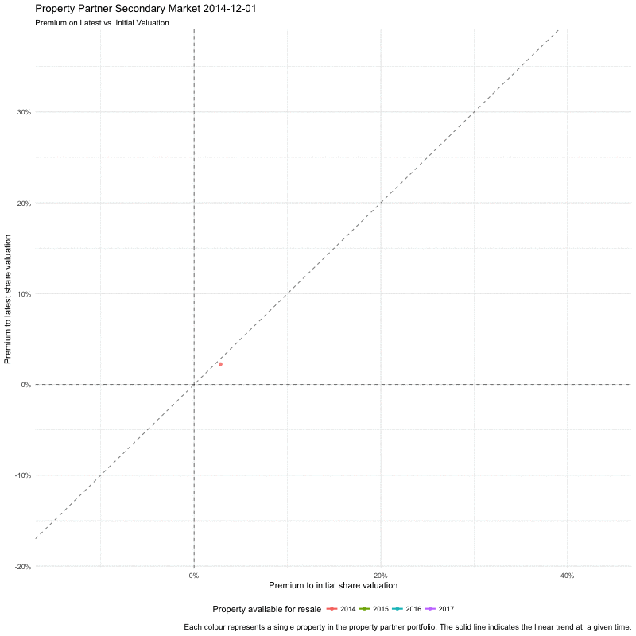
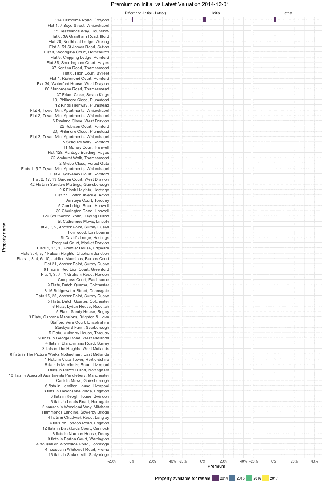

```{r setup, include=FALSE}
knitr::opts_chunk$set(echo = FALSE, warning = FALSE, message = FALSE, cache = TRUE)
```

Previously I have looked at visualising the [Property Partner](https://www.propertypartner.co/aboutus#/ourstory) portfolio using [tableau](https://public.tableau.com/views/PropertyPartnerPortfolioVisualisation/PropertyPartnerPortfolio?:embed=y&:display_count=yes), and [explored their resale date from July 2017](https://www.samabbott.co.uk/post/deep-dive-pp-open-house/). In this post I will be exploring the [August Open House resale](https://resources.propertypartner.co/open-house-august-2017/) data focussing on property premiums over both initial and latest valuation. The code for this post is available [here](https://github.com/seabbs/propertypartner/blob/master/report/17-09-18-premium/latest_initial_premium.Rmd).

Property Partner advertises returns by combining both projected capital and rental returns. Properties are held for 5 years at which point any capital gain can be realised. However, Property Partner provides a secondary market which allows capital returns to be realised by selling shares to other investors. The sale price of shares is set by the market, and may or may not depend on the underlying value of the property. This post will explore the premium that sales on the secondary market set on both the initial and latest valuations of properties in the Property Partner Portfolio, and how this has changed over time. A first step is to look at premiums over time, for each property, averaged over each month (as are all premiums in this post).

```{r packages, include = FALSE}
#install.packages("readxl")
library(readxl)

#install.packages("tidyverse")
library(tidyverse)
library(broom)
library(lubridate)
library(stringr)

#install.packages("scales")
library(scales)

#install.packages("plotly")
library(plotly)

#install.packages("ggjoy")
library(ggjoy)

#install.packages("fifer")

#install.packages("viridis")
library(viridis)

#devtools::install_github("dgrtwo/gganimate")
library(gganimate)
```
```{r read-in-the-data, include = FALSE}
#save data from above link into data subfolder of property partner folder
pp_resale <- read_excel("../../data/Purchases-on-Resale-August-2017-Open-House.xlsx")

##Look at data
glimpse(pp_resale)

summary(pp_resale)
```

```{r add-var-resales}
pp_resale <- pp_resale %>% 
  mutate(`Transaction (£)` = `Unit Count` * `Unit Price`) %>% 
  mutate(Year = year(`Last Transaction`), 
         Month = month(`Last Transaction`),
         Week = week(`Last Transaction`), 
         Day = day(`Last Transaction`)) %>% 
  mutate(`Transaction size (£)` = case_when(`Transaction (£)` < 1 ~ "£0-£1",
                                            `Transaction (£)` < 100 ~ "£1-£99",
                                            `Transaction (£)` < 500 ~ "£100-£499",
                                            `Transaction (£)` < 1000 ~ "£500-£999",
                                            `Transaction (£)` < 5000 ~ "£1000-£4,999",
                                            `Transaction (£)` < 50000 ~ "£5,000-£49,999",
                                            `Transaction (£)` >= 50000 ~ "£50,000+") %>% 
           factor(levels = c("£0-£1", "£1-£99", "£100-£499", "£500-£999", "£1000-£4,999", "£5,000-£49,999", "50,000+"))) %>% 
  rowwise() %>% 
  mutate(Area = `Property name` %>% 
           str_split(pattern = ", ") %>% 
           last %>% 
           last) %>% 
  ungroup
```

```{r summarise-premiums}
pp_resale_30_day_premium <- pp_resale %>% 
  mutate(`Transaction Date` = floor_date(`Last Transaction`, unit = "month")) %>% 
  mutate(`Premium to latest share valuation` = `Unit Count` * `Premium to latest share valuation`,
         `Premium to initial share valuation` = `Unit Count` * `Premium to initial share valuation`) %>% 
  group_by(`Transaction Date`, `Property name`, Area) %>% 
  summarise(`Premium to latest share valuation` = sum(`Premium to latest share valuation`)/sum(`Unit Count`),
            `Premium to initial share valuation` = sum(`Premium to initial share valuation`)/sum(`Unit Count`)) %>% 
  group_by(`Property name`) %>% 
  mutate(`Property available for resale` = min(`Transaction Date`))

pp_resale_yearly_premium <- pp_resale %>% 
  mutate(`Transaction Date` = floor_date(`Last Transaction`, unit = "year")) %>% 
  mutate(`Premium to latest share valuation` = `Unit Count` * `Premium to latest share valuation`,
         `Premium to initial share valuation` = `Unit Count` * `Premium to initial share valuation`) %>% 
  group_by(`Transaction Date`, `Property name`, Area) %>% 
  summarise(`Premium to latest share valuation` = sum(`Premium to latest share valuation`)/sum(`Unit Count`),
            `Premium to initial share valuation` = sum(`Premium to initial share valuation`)/sum(`Unit Count`)) %>% 
  group_by(`Property name`) %>% 
  mutate(`Property available for resale` = min(`Transaction Date`))
```


```{r prem-prop-initial}
premium_prop_initial <- pp_resale_30_day_premium %>% 
  ggplot(aes(x = `Transaction Date`, 
             y = `Premium to initial share valuation`,
             colour = `Property name`,
             group = `Property name`)) + 
  geom_point(alpha = 0.8) +
  geom_line() +
  geom_hline(yintercept = 0, linetype = 2, alpha = 0.4) + 
  scale_y_continuous(label = percent) + 
  scale_fill_viridis_d() +
  labs(title = "Average Premium over initial Valuation, for each property") +
  theme_minimal() +
  theme(legend.position = "none") 

fig1 <- ggplotly(premium_prop_initial)


fig1

htmlwidgets::saveWidget(fig1, file = "fig1.html", selfcontained = TRUE)
```

From the above plot we see that in the first year of operation all properties had premiums above 0% over initial valuation, but since then several have traded with premiums that are continuously negative. The majority of these properties have maintained steady premiums over initial valuation but several devalued in the second half of 2017. A single property (5 flats, Dutch Quarter, Colchester) has consistently traded with a negative premium although this appears to be improving over time.

```{r prem-prop-latest}
premium_prop_initial <- pp_resale_30_day_premium %>% 
  ggplot(aes(x = `Transaction Date`, 
             y = `Premium to latest share valuation`,
             colour = `Property name`,
             group = `Property name`)) + 
  geom_point(alpha = 0.8) +
  geom_line() +
  geom_hline(yintercept = 0, linetype = 2, alpha = 0.4) + 
  scale_y_continuous(label = percent) + 
  scale_fill_viridis_d() +
  labs(title = "Average Premium over latest Valuation, for each property") +
  theme_minimal() +
  theme(legend.position = "none") 

fig2 <- ggplotly(premium_prop_initial)


fig2

htmlwidgets::saveWidget(fig2, file = "fig2.html", selfcontained = TRUE)
```

Unlike premiums over initial valuation, premiums over latest valuation appear to have decreased continuously over time for the majority of properties. This indicates that premiums are not completely adjusting for increases in property value, making it unlikely that those exiting early will fully realise capital gains. Both plots indicate a relationship between premiums and the date a property was made available for resale, with properties available earlier having higher premiums over both initial and latest valuation. The above plots are hard to interpret due to the number of properties in the portfolio, therefore the next step is to summarise the data by averaging premiums across all properties.  

```{r avg-premium-to-val}
premium_to_share <- pp_resale %>% 
  mutate(`Transaction Date` = floor_date(`Last Transaction`, unit = "month")) %>% 
  mutate(`Premium to latest share valuation` = `Unit Count` * `Premium to latest share valuation`,
         `Premium to initial share valuation` = `Unit Count` * `Premium to initial share valuation`) %>% 
  group_by(`Transaction Date`) %>% 
  summarise(`Premium to latest share valuation` = sum(`Premium to latest share valuation`)/sum(`Unit Count`),
            `Premium to initial share valuation` = sum(`Premium to initial share valuation`)/sum(`Unit Count`)) %>% 
  mutate(`Difference between premium based on initial vs. latest share valuation` = 
           `Premium to initial share valuation` -
           `Premium to latest share valuation`
           ) %>% 
   gather(key = "Share Valuation", value = "Premium",
         `Premium to initial share valuation`,
         `Premium to latest share valuation`)

plot_premium_to_share <- premium_to_share %>% 
  ggplot(aes(x = `Transaction Date`, 
             y = Premium,
             fill = Premium)) + 
  geom_bar(stat = "identity") +
  scale_y_continuous(label = percent) + 
  scale_fill_viridis_c() +
  labs(title = "Average Premium over Share Valuation") + 
  theme_minimal() +
  theme(legend.position = "none") + 
  facet_wrap(~`Share Valuation`, ncol = 1)

fig3 <- ggplotly(plot_premium_to_share)


fig3

htmlwidgets::saveWidget(fig3, file = "fig3.html", selfcontained = TRUE)
```

As we saw in the previous plots premiums over both initial and latest valuation were highest in 2015 and have since decreased. Since 2016 premiums over initial valuation appear to have stabilised between 5% to 10% and premiums over latest valuation appear to have stabilised between 0% to -8%. The relationship between premiums over latest and initial valuation is summarised in the following plot.

```{r difference-premium-initial-latest}
plot_diff_latest_initial_premium <- premium_to_share %>% 
  ggplot(aes(x = `Transaction Date`, 
             y = `Difference between premium based on initial vs. latest share valuation`,
             fill = `Difference between premium based on initial vs. latest share valuation`)) + 
  geom_bar(stat = "identity") +
  scale_y_continuous(label = percent) + 
  scale_fill_viridis_c() +
  labs(title = "Difference in Premiums",
       y = "Difference in Premiums (Initial - Latest)") + 
  theme_minimal() +
  theme(legend.position = "none")

fig4 <- ggplotly(plot_diff_latest_initial_premium)


fig4

htmlwidgets::saveWidget(fig4, file = "fig4.html", selfcontained = TRUE)
```

In the plots above there was some evidence that properties acquired at different dates traded differently. To investigate this the following plot shows the average monthly premium for properties launched in each year Property Partner has been operating, for both initial and latest valuation.


```{r prem-resale-entry-date}
premium_prop_year_entry <- pp_resale_30_day_premium %>%
  mutate(`Property available for resale` = year(`Property available for resale`) %>% 
           as.character %>% 
           factor) %>% 
  group_by(`Property available for resale`,
           `Transaction Date`) %>% 
  summarise(`Premium to latest share valuation` = 
              mean(`Premium to latest share valuation`),
            `Premium to initial share valuation` = 
              mean(`Premium to initial share valuation`)) %>% 
  gather(key = "Share Valuation", value = "Premium",
         `Premium to initial share valuation`,
         `Premium to latest share valuation`) %>% 
  ggplot(aes(x = `Transaction Date`, 
             y = Premium,
             colour = `Property available for resale`)) + 
  geom_point(alpha = 0.8) +
  geom_line(aes(group = `Property available for resale`)) +
  geom_hline(yintercept = 0, linetype = 2) +
  scale_y_continuous(label = percent) + 
  scale_fill_viridis_d() +
  labs(title = "Average Premium to Latest Valuation by Year Available for Resale") +
  theme_minimal() +
  theme(legend.position = "none") +
    facet_wrap(~`Share Valuation`)

fig5 <- ggplotly(premium_prop_year_entry)

fig5 

htmlwidgets::saveWidget(fig5, file = "fig5.html", selfcontained = TRUE)
```

We see that properties acquired earlier consistently trade at a higher premium over both initial and latest valuation. Whilst the trend in initial valuation may be driven by increased valuation this cannot be the case for latest valuation. Instead, it is likely that this is a function of scarcity due to the lower supply of earlier properties. It may also be the case that previous performance on the platform is valued. This plot also indicates that premiums over latest valuation have constantly fallen for all years. Properties appear to start trading with a slightly positive  premium, which then decreases over time. This indicates that premiums do not adjust fully as properties are revalued, meaning that realising potential capital gains early is unlikely. To explore this further the following plot compares premiums on initial and latest valuations over time, for individual properties.

```{r plot-latest-initial, fig.show = "animate"}
premium_initial_latest <- pp_resale_30_day_premium %>% 
  ggplot(aes(x = `Premium to initial share valuation`, 
             y = `Premium to latest share valuation`,
             colour = `Property name`,
             group = `Property name`,
             frame = `Transaction Date`)) + 
  geom_point(alpha = 0.8) + 
  geom_smooth(aes(group = `Transaction Date`), alpha = 0.2, method = "lm", colour = "#440154CC") +
  geom_hline(yintercept = 0, linetype = 2, alpha = 0.5) +
  geom_vline(xintercept = 0, linetype = 2, alpha = 0.5) +
  geom_abline(intercept = 0, slope = 1, linetype = 2, alpha = 0.5) +
  scale_y_continuous(label = percent) + 
  scale_x_continuous(label = percent) + 
  scale_fill_viridis_d() +
  labs(title = "Property Partner Secondary Market",
    subtitle = "Premium on Latest vs. Initial Valuation",
    caption = "Each colour represents a single property in the property partner portfolio. The solid line indicates the linear trend at  a given time.") +
  theme_minimal() +
  theme(legend.position = "none")

gganimate(premium_initial_latest, "gif1.gif", title_frame = TRUE, ani.height = 800, ani.width = 800)
```


From the plot we see that properties enter the market trading at a small premium to both valuations. Over time the relationship between premiums for initial and latest valuation weakens, with several properties trading at negative premiums for both valuations. To get a better idea of the relationship the following plot stratifies by the year a property was made available for resale.

```{r plot-latest-initial-year, fig.show = "animate"}
premium_initial_latest_year <- pp_resale_30_day_premium %>%
  mutate(`Property available for resale` = year(`Property available for resale`) %>% 
           factor(ordered = TRUE)) %>% 
  ggplot(aes(x = `Premium to initial share valuation`, 
             y = `Premium to latest share valuation`,
             colour = `Property available for resale`,
             group = `Property available for resale`,
             text = `Property name`,
             frame = `Transaction Date`)) + 
  geom_point(alpha = 0.8) + 
  geom_smooth(aes(group = interaction(`Property available for resale`, `Transaction Date`)), 
              alpha = 0.2, method = "lm", se = FALSE) +
  geom_hline(yintercept = 0, linetype = 2, alpha = 0.5) +
  geom_vline(xintercept = 0, linetype = 2, alpha = 0.5) +
  geom_abline(intercept = 0, slope = 1, 
              linetype = 2, alpha = 0.5) +
  scale_y_continuous(label = percent) + 
  scale_x_continuous(label = percent) + 
  scale_fill_viridis_d() +
  labs(title = "Property Partner Secondary Market",
    subtitle = "Premium on Latest vs. Initial Valuation",
    caption = "Each colour represents a single property in the property partner portfolio. The solid line indicates the linear trend at  a given time.") +
  theme_minimal() +
  theme(legend.position = "bottom")

gganimate(premium_initial_latest_year, "gif2.gif", title_frame = TRUE, ani.height = 800, ani.width = 800)
```



Here we clearly see that when properties enter the market there is a strong correlation between premiums on latest and initial valuations. As properties are revalued we see that premiums on latest valuation do not adjust fully, although this effect varies wildly. This is likely to be driven by external factors such as dividend yield - with high dividend yields commanding a premium. The following interactive plot allows the figures above to be explored in detail.

```{r plot-latest-initial-area}
premium_initial_latest_area <- pp_resale_yearly_premium %>%
  mutate(`Transaction Date` = year(`Transaction Date`)) %>%
  ggplot(aes(x = `Premium to initial share valuation`, 
             y = `Premium to latest share valuation`,
             colour = Area,
             text = `Property name`)) + 
  geom_point(alpha = 0.8) + 
  geom_hline(yintercept = 0, linetype = 2, alpha = 0.5) +
  geom_vline(xintercept = 0, linetype = 2, alpha = 0.5) +
  geom_abline(intercept = 0, slope = 1, linetype = 2, alpha = 0.5) +
  scale_y_continuous(label = percent) + 
  scale_x_continuous(label = percent) + 
  scale_fill_viridis_d() +
  labs(title = "Property Partner Secondary Market",
    subtitle = "Premium on Latest vs. Initial Valuation",
    caption = "Each colour represents a single property in the property partner portfolio. The solid line indicates the linear trend at  a given time.") +
  theme_minimal() +
  theme(legend.position = "none") +
  facet_wrap(~`Transaction Date`)

fig6 <- ggplotly(premium_initial_latest_area)

fig6

htmlwidgets::saveWidget(fig6, file = "fig6.html", selfcontained = TRUE)
```

For a final visualisation of this relationship the following plot shows premiums for individual properties over time, stratified by year available for resale.

```{r premium_by_property, fig.show = "animate", fig.height = 15}
order_properties_by_resale <- pp_resale_30_day_premium %>% 
                    group_by(`Property name`) %>%
                    filter(`Transaction Date` == min(`Transaction Date`)) %>%
                    arrange(desc(`Transaction Date`)) %>% 
                    pull(`Property name`)

premium_property_year <- pp_resale_30_day_premium %>%
   mutate(`Difference (initial - latest)` = 
           `Premium to initial share valuation` -
           `Premium to latest share valuation`
           ) %>%
  ungroup %>% 
  mutate(`Property name` = `Property name` %>% 
           factor(levels = order_properties_by_resale)
  ) %>%
  rename(`Difference (Initial - Latest)` = 
           `Difference (initial - latest)`,
         Initial = `Premium to initial share valuation`,
         Latest = `Premium to latest share valuation`) %>% 
   gather(key = "Share Valuation", value = "Premium",
         Initial,
         Latest,
         `Difference (Initial - Latest)`) %>% 
  mutate(`Property available for resale` = `Property available for resale` %>% 
           year %>% 
           factor(ordered = TRUE)) %>% 
  ggplot(aes(x = `Property name`, 
             y = Premium,
             text = Area,
             fill = `Property available for resale`,
             frame = `Transaction Date`)) + 
  geom_bar(stat = "identity", position = "dodge", alpha = 0.8) +
  scale_y_continuous(label = percent) + 
  scale_fill_viridis_d() +
  labs(title = "Premium on Initial vs Latest Valuation") + 
  theme_minimal() +
  coord_flip() +
    theme(legend.position = "bottom",
        axis.text.y = element_text(size = 10) 
        ) +
  facet_wrap(~`Share Valuation`, nrow = 1)

gganimate(premium_property_year, "gif3.gif", title_frame = TRUE, ani.height = 1200, ani.width = 800)
```



Unfortunately this dataset was limited by having little additional information about each property, something which is key to understanding premiums. For example, as commented on above, it is likely that much of the variation is drive by dividend yield. However, it is clear that properties are not valued at their latest valuation and that therefore this should not be used to summarise the performance of a portfolio over the short term. 

In a future post I will be exploring premiums further by joining the resale data used above with data on the Property Partner portfolio. The two datasets do not contain a common unique ID by which to link them, meaning that joining them will be less trivial that it should be. Hopefully Property Partner will improve the quality of the data they provide to investors so that analysis can be done more easily. 

If you have any comments, ideas for further projects, or any similar analysis to share please comment below.

**Bonus Plot!!**

```{r current-prem-property}
premium_property_current <- pp_resale_30_day_premium %>%
  filter(`Transaction Date` == max(`Transaction Date`)) %>% 
   mutate(`Difference (initial - latest)` = 
           `Premium to initial share valuation` -
           `Premium to latest share valuation`
           ) %>%
  ungroup %>% 
  mutate(`Property name` = `Property name` %>% 
           factor(levels = order_properties_by_resale)
  ) %>%
  rename(`Difference (Initial - Latest)` = 
           `Difference (initial - latest)`,
         Initial = `Premium to initial share valuation`,
         Latest = `Premium to latest share valuation`) %>% 
   gather(key = "Share Valuation", value = "Premium",
         Initial,
         Latest,
         `Difference (Initial - Latest)`) %>% 
  mutate(`Property available for resale` = `Property available for resale` %>% 
           year %>% 
           factor(ordered = TRUE)) %>% 
  ggplot(aes(x = `Property name`, 
             y = Premium,
             text = Area,
             fill = `Property available for resale`)) + 
  geom_bar(stat = "identity", position = "dodge", alpha = 0.8) +
  scale_y_continuous(label = percent) + 
  scale_fill_viridis_d() +
  labs(title = "Current Premium on Initial vs Latest Valuation - August 2017") +
  coord_flip() +
  theme_minimal() +
    theme(legend.position = "bottom",
        axis.text.y = element_text(size = 5) 
        ) +
  facet_wrap(~`Share Valuation`, nrow = 1)
  
  fig7 <- ggplotly(premium_property_current)

fig7

htmlwidgets::saveWidget(fig7, file = "fig7.html", selfcontained = TRUE, knitrOptions = list(fig.length = 20))
```
