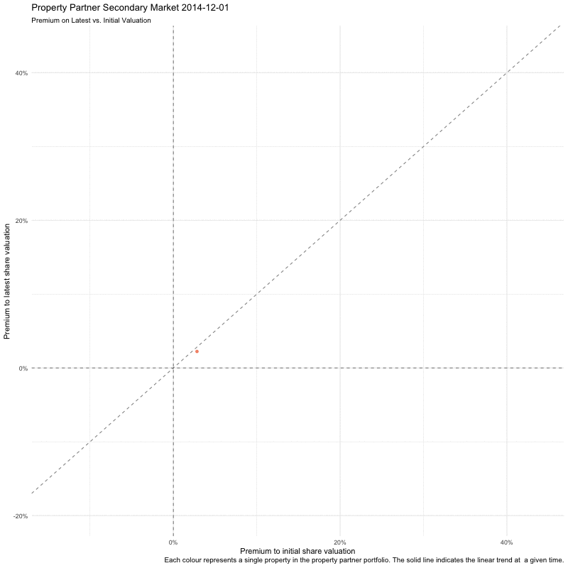
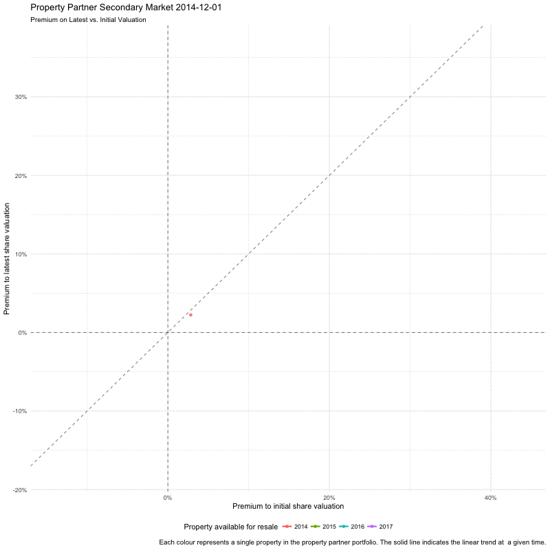
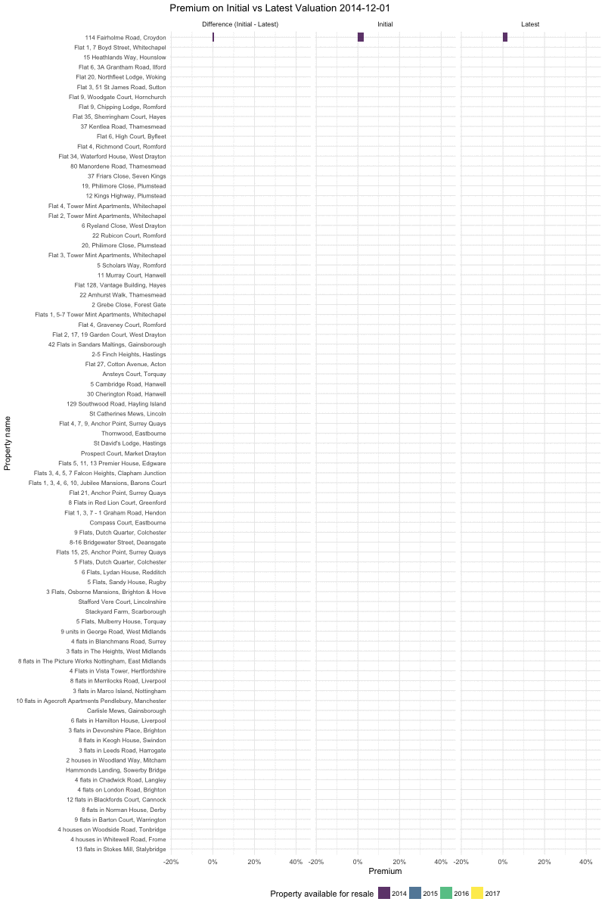

# Deep Dive: Premiums on Valuation in the Property Partner Portfolio

Previously I have looked at visualising the [Property Partner](https://www.propertypartner.co/aboutus#/ourstory) portfolio using [tableau](https://public.tableau.com/views/PropertyPartnerPortfolioVisualisation/PropertyPartnerPortfolio?:embed=y&:display_count=yes), and [explored their resale date from July 2017](https://www.samabbott.co.uk/post/deep-dive-pp-open-house/). In this post I will be exploring the [August Open House resale](https://resources.propertypartner.co/open-house-august-2017/) data focussing on property premiums over both initial and latest valuation. The code for this post is available [here](https://github.com/seabbs/propertypartner/blob/master/report/17-09-18-premium/latest_initial_premium.Rmd).

Property Partner advertises returns by combining both projected capital and rental returns. Properties are held for 5 years at which point any captial gain can be realised. However, Property Partner provides a secondary market which allows capital returns to be realised by selling shares to other investors. The sale price of shares is set by the market, and may or may not depend on the underlying value of the property. This post will explore the premium that sales on the secondary market set on both the initial and latest valuations of properties in the Property Partner Portfolio, and how this has changed over time. A first step is to look at premiums over time, for each property, averaged over each month.

<!--html_preserve-->

<script type="application/json" data-for="95a22fcffac4">{"x":{"data":[{"x":[1485907200,1488326400,1491004800,1493596800,1496275200,1498867200,1501545600],"y":[-0.00142598134760133,0.022811398012125,0.0427170235924685,0.0388435244721939,0.0378543954969511,0.0331308810434867,0.0200910298484139],"text":["`Transaction Date`: 2017-02-01 `Premium to initial share valuation`: -1.425981e-03 `Property name`: 10 flats in Agecroft Apartments Pendlebury, Manchester `Property name`: 10 flats in Agecroft Apartments Pendlebury, Manchester","`Transaction Date`: 2017-03-01 `Premium to initial share valuation`:  2.281140e-02 `Property name`: 10 flats in Agecroft Apartments Pendlebury, Manchester `Property name`: 10 flats in Agecroft Apartments Pendlebury, Manchester","`Transaction Date`: 2017-04-01 `Premium to initial share valuation`:  4.271702e-02 `Property name`: 10 flats in Agecroft Apartments Pendlebury, Manchester `Property name`: 10 flats in Agecroft Apartments Pendlebury, Manchester","`Transaction Date`: 2017-05-01 `Premium to initial share valuation`:  3.884352e-02 `Property name`: 10 flats in Agecroft Apartments Pendlebury, Manchester `Property name`: 10 flats in Agecroft Apartments Pendlebury, Manchester","`Transaction Date`: 2017-06-01 `Premium to initial share valuation`:  3.785440e-02 `Property name`: 10 flats in Agecroft Apartments Pendlebury, Manchester `Property name`: 10 flats in Agecroft Apartments Pendlebury, Manchester","`Transaction Date`: 2017-07-01 `Premium to initial share valuation`:  3.313088e-02 `Property name`: 10 flats in Agecroft Apartments Pendlebury, Manchester `Property name`: 10 flats in Agecroft Apartments Pendlebury, Manchester","`Transaction Date`: 2017-08-01 `Premium to initial share valuation`:  2.009103e-02 `Property name`: 10 flats in Agecroft Apartments Pendlebury, Manchester `Property name`: 10 flats in Agecroft Apartments Pendlebury, Manchester"],"type":"scatter","mode":"markers+lines","marker":{"autocolorscale":false,"color":"rgba(248,118,109,1)","opacity":0.8,"size":5.66929133858268,"symbol":"circle","line":{"width":1.88976377952756,"color":"rgba(248,118,109,1)"}},"hoveron":"points","name":"(10 flats in Agecroft Apartments Pendlebury, Manchester,1)","legendgroup":"(10 flats in Agecroft Apartments Pendlebury, Manchester,1)","showlegend":true,"xaxis":"x","yaxis":"y","hoverinfo":"text","line":{"width":1.88976377952756,"color":"rgba(248,118,109,1)","dash":"solid"},"frame":null},{"x":[1441065600,1443657600,1446336000,1448928000,1451606400,1454284800,1456790400,1459468800,1462060800,1464739200,1467331200,1470009600,1472688000,1475280000,1477958400,1480550400,1483228800,1485907200,1488326400,1491004800,1493596800,1496275200,1498867200,1501545600],"y":[0.0189192819691059,0.020037224222473,0.0297531384580502,0.0952689919415842,0.0966083832944603,0.09141783544971,0.0927377514857783,0.0712220408007765,0.0638361467563041,0.0341845943580747,0.0413250435737366,0.0378058723311776,0.0395733603898154,0.0314213996658454,0.0175059033261125,0.0333627764301555,-0.00115216055978364,-0.00797310859919325,0.00276804631232003,0.0835295245894467,0.0978190164867247,0.0728280584419107,0.054335494909584,0.046018608180618],"text":["`Transaction Date`: 2015-09-01 `Premium to initial share valuation`:  1.891928e-02 `Property name`: 11 Murray Court, Hanwell `Property name`: 11 Murray Court, Hanwell","`Transaction Date`: 2015-10-01 `Premium to initial share valuation`:  2.003722e-02 `Property name`: 11 Murray Court, Hanwell `Property name`: 11 Murray Court, Hanwell","`Transaction Date`: 2015-11-01 `Premium to initial share valuation`:  2.975314e-02 `Property name`: 11 Murray Court, Hanwell `Property name`: 11 Murray Court, Hanwell","`Transaction Date`: 2015-12-01 `Premium to initial share valuation`:  9.526899e-02 `Property name`: 11 Murray Court, Hanwell `Property name`: 11 Murray Court, Hanwell","`Transaction Date`: 2016-01-01 `Premium to initial share valuation`:  9.660838e-02 `Property name`: 11 Murray Court, Hanwell `Property name`: 11 Murray Court, Hanwell","`Transaction Date`: 2016-02-01 `Premium to initial share valuation`:  9.141784e-02 `Property name`: 11 Murray Court, Hanwell `Property name`: 11 Murray Court, Hanwell","`Transaction Date`: 2016-03-01 `Premium to initial share valuation`:  9.273775e-02 `Property name`: 11 Murray Court, Hanwell `Property name`: 11 Murray Court, Hanwell","`Transaction Date`: 2016-04-01 `Premium to initial share valuation`:  7.122204e-02 `Property name`: 11 Murray Court, Hanwell `Property name`: 11 Murray Court, Hanwell","`Transaction Date`: 2016-05-01 `Premium to initial share valuation`:  6.383615e-02 `Property name`: 11 Murray Court, Hanwell `Property name`: 11 Murray Court, Hanwell","`Transaction Date`: 2016-06-01 `Premium to initial share valuation`:  3.418459e-02 `Property name`: 11 Murray Court, Hanwell `Property name`: 11 Murray Court, Hanwell","`Transaction Date`: 2016-07-01 `Premium to initial share valuation`:  4.132504e-02 `Property name`: 11 Murray Court, Hanwell `Property name`: 11 Murray Court, Hanwell","`Transaction Date`: 2016-08-01 `Premium to initial share valuation`:  3.780587e-02 `Property name`: 11 Murray Court, Hanwell `Property name`: 11 Murray Court, Hanwell","`Transaction Date`: 2016-09-01 `Premium to initial share valuation`:  3.957336e-02 `Property name`: 11 Murray Court, Hanwell `Property name`: 11 Murray Court, Hanwell","`Transaction Date`: 2016-10-01 `Premium to initial share valuation`:  3.142140e-02 `Property name`: 11 Murray Court, Hanwell `Property name`: 11 Murray Court, Hanwell","`Transaction Date`: 2016-11-01 `Premium to initial share valuation`:  1.750590e-02 `Property name`: 11 Murray Court, Hanwell `Property name`: 11 Murray Court, Hanwell","`Transaction Date`: 2016-12-01 `Premium to initial share valuation`:  3.336278e-02 `Property name`: 11 Murray Court, Hanwell `Property name`: 11 Murray Court, Hanwell","`Transaction Date`: 2017-01-01 `Premium to initial share valuation`: -1.152161e-03 `Property name`: 11 Murray Court, Hanwell `Property name`: 11 Murray Court, Hanwell","`Transaction Date`: 2017-02-01 `Premium to initial share valuation`: -7.973109e-03 `Property name`: 11 Murray Court, Hanwell `Property name`: 11 Murray Court, Hanwell","`Transaction Date`: 2017-03-01 `Premium to initial share valuation`:  2.768046e-03 `Property name`: 11 Murray Court, Hanwell `Property name`: 11 Murray Court, Hanwell","`Transaction Date`: 2017-04-01 `Premium to initial share valuation`:  8.352952e-02 `Property name`: 11 Murray Court, Hanwell `Property name`: 11 Murray Court, Hanwell","`Transaction Date`: 2017-05-01 `Premium to initial share valuation`:  9.781902e-02 `Property name`: 11 Murray Court, Hanwell `Property name`: 11 Murray Court, Hanwell","`Transaction Date`: 2017-06-01 `Premium to initial share valuation`:  7.282806e-02 `Property name`: 11 Murray Court, Hanwell `Property name`: 11 Murray Court, Hanwell","`Transaction Date`: 2017-07-01 `Premium to initial share valuation`:  5.433549e-02 `Property name`: 11 Murray Court, Hanwell `Property name`: 11 Murray Court, Hanwell","`Transaction Date`: 2017-08-01 `Premium to initial share valuation`:  4.601861e-02 `Property name`: 11 Murray Court, Hanwell `Property name`: 11 Murray Court, Hanwell"],"type":"scatter","mode":"markers+lines","marker":{"autocolorscale":false,"color":"rgba(245,121,97,1)","opacity":0.8,"size":5.66929133858268,"symbol":"circle","line":{"width":1.88976377952756,"color":"rgba(245,121,97,1)"}},"hoveron":"points","name":"(11 Murray Court, Hanwell,1)","legendgroup":"(11 Murray Court, Hanwell,1)","showlegend":true,"xaxis":"x","yaxis":"y","hoverinfo":"text","line":{"width":1.88976377952756,"color":"rgba(245,121,97,1)","dash":"solid"},"frame":null},{"x":[1417392000,1420070400,1422748800,1425168000,1427846400,1430438400,1433116800,1435708800,1438387200,1441065600,1443657600,1446336000,1448928000,1451606400,1454284800,1456790400,1459468800,1462060800,1464739200,1467331200,1470009600,1472688000,1475280000,1477958400,1480550400,1483228800,1485907200,1488326400,1491004800,1493596800,1496275200,1498867200,1501545600],"y":[0.0283185610568336,0.0963826010144205,0.262964202114181,0.323550796553073,0.3619875079952,0.403049188378985,0.369932076682471,0.250180962695843,0.188922818617175,0.248561013831867,0.285617116627097,0.271117695584353,0.181224735720014,0.193883869895346,0.259881385600309,0.253963213299333,0.264715995952208,0.256629571578823,0.325319466316157,0.352976602356699,0.365182563964817,0.356420101675261,0.403516653784179,0.315652181649198,0.337358301572763,0.215010570612063,0.203289979965416,0.220120071382756,0.311888470400438,0.269377674409809,0.179539952330933,0.187497836733988,0.196301258980468],"text":["`Transaction Date`: 2014-12-01 `Premium to initial share valuation`:  2.831856e-02 `Property name`: 114 Fairholme Road, Croydon `Property name`: 114 Fairholme Road, Croydon","`Transaction Date`: 2015-01-01 `Premium to initial share valuation`:  9.638260e-02 `Property name`: 114 Fairholme Road, Croydon `Property name`: 114 Fairholme Road, Croydon","`Transaction Date`: 2015-02-01 `Premium to initial share valuation`:  2.629642e-01 `Property name`: 114 Fairholme Road, Croydon `Property name`: 114 Fairholme Road, Croydon","`Transaction Date`: 2015-03-01 `Premium to initial share valuation`:  3.235508e-01 `Property name`: 114 Fairholme Road, Croydon `Property name`: 114 Fairholme Road, Croydon","`Transaction Date`: 2015-04-01 `Premium to initial share valuation`:  3.619875e-01 `Property name`: 114 Fairholme Road, Croydon `Property name`: 114 Fairholme Road, Croydon","`Transaction Date`: 2015-05-01 `Premium to initial share valuation`:  4.030492e-01 `Property name`: 114 Fairholme Road, Croydon `Property name`: 114 Fairholme Road, Croydon","`Transaction Date`: 2015-06-01 `Premium to initial share valuation`:  3.699321e-01 `Property name`: 114 Fairholme Road, Croydon `Property name`: 114 Fairholme Road, Croydon","`Transaction Date`: 2015-07-01 `Premium to initial share valuation`:  2.501810e-01 `Property name`: 114 Fairholme Road, Croydon `Property name`: 114 Fairholme Road, Croydon","`Transaction Date`: 2015-08-01 `Premium to initial share valuation`:  1.889228e-01 `Property name`: 114 Fairholme Road, Croydon `Property name`: 114 Fairholme Road, Croydon","`Transaction Date`: 2015-09-01 `Premium to initial share valuation`:  2.485610e-01 `Property name`: 114 Fairholme Road, Croydon `Property name`: 114 Fairholme Road, Croydon","`Transaction Date`: 2015-10-01 `Premium to initial share valuation`:  2.856171e-01 `Property name`: 114 Fairholme Road, Croydon `Property name`: 114 Fairholme Road, Croydon","`Transaction Date`: 2015-11-01 `Premium to initial share valuation`:  2.711177e-01 `Property name`: 114 Fairholme Road, Croydon `Property name`: 114 Fairholme Road, Croydon","`Transaction Date`: 2015-12-01 `Premium to initial share valuation`:  1.812247e-01 `Property name`: 114 Fairholme Road, Croydon `Property name`: 114 Fairholme Road, Croydon","`Transaction Date`: 2016-01-01 `Premium to initial share valuation`:  1.938839e-01 `Property name`: 114 Fairholme Road, Croydon `Property name`: 114 Fairholme Road, Croydon","`Transaction Date`: 2016-02-01 `Premium to initial share valuation`:  2.598814e-01 `Property name`: 114 Fairholme Road, Croydon `Property name`: 114 Fairholme Road, Croydon","`Transaction Date`: 2016-03-01 `Premium to initial share valuation`:  2.539632e-01 `Property name`: 114 Fairholme Road, Croydon `Property name`: 114 Fairholme Road, Croydon","`Transaction Date`: 2016-04-01 `Premium to initial share valuation`:  2.647160e-01 `Property name`: 114 Fairholme Road, Croydon `Property name`: 114 Fairholme Road, Croydon","`Transaction Date`: 2016-05-01 `Premium to initial share valuation`:  2.566296e-01 `Property name`: 114 Fairholme Road, Croydon `Property name`: 114 Fairholme Road, Croydon","`Transaction Date`: 2016-06-01 `Premium to initial share valuation`:  3.253195e-01 `Property name`: 114 Fairholme Road, Croydon `Property name`: 114 Fairholme Road, Croydon","`Transaction Date`: 2016-07-01 `Premium to initial share valuation`:  3.529766e-01 `Property name`: 114 Fairholme Road, Croydon `Property name`: 114 Fairholme Road, Croydon","`Transaction Date`: 2016-08-01 `Premium to initial share valuation`:  3.651826e-01 `Property name`: 114 Fairholme Road, Croydon `Property name`: 114 Fairholme Road, Croydon","`Transaction Date`: 2016-09-01 `Premium to initial share valuation`:  3.564201e-01 `Property name`: 114 Fairholme Road, Croydon `Property name`: 114 Fairholme Road, Croydon","`Transaction Date`: 2016-10-01 `Premium to initial share valuation`:  4.035167e-01 `Property name`: 114 Fairholme Road, Croydon `Property name`: 114 Fairholme Road, Croydon","`Transaction Date`: 2016-11-01 `Premium to initial share valuation`:  3.156522e-01 `Property name`: 114 Fairholme Road, Croydon `Property name`: 114 Fairholme Road, Croydon","`Transaction Date`: 2016-12-01 `Premium to initial share valuation`:  3.373583e-01 `Property name`: 114 Fairholme Road, Croydon `Property name`: 114 Fairholme Road, Croydon","`Transaction Date`: 2017-01-01 `Premium to initial share valuation`:  2.150106e-01 `Property name`: 114 Fairholme Road, Croydon `Property name`: 114 Fairholme Road, Croydon","`Transaction Date`: 2017-02-01 `Premium to initial share valuation`:  2.032900e-01 `Property name`: 114 Fairholme Road, Croydon `Property name`: 114 Fairholme Road, Croydon","`Transaction Date`: 2017-03-01 `Premium to initial share valuation`:  2.201201e-01 `Property name`: 114 Fairholme Road, Croydon `Property name`: 114 Fairholme Road, Croydon","`Transaction Date`: 2017-04-01 `Premium to initial share valuation`:  3.118885e-01 `Property name`: 114 Fairholme Road, Croydon `Property name`: 114 Fairholme Road, Croydon","`Transaction Date`: 2017-05-01 `Premium to initial share valuation`:  2.693777e-01 `Property name`: 114 Fairholme Road, Croydon `Property name`: 114 Fairholme Road, Croydon","`Transaction Date`: 2017-06-01 `Premium to initial share valuation`:  1.795400e-01 `Property name`: 114 Fairholme Road, Croydon `Property name`: 114 Fairholme Road, Croydon","`Transaction Date`: 2017-07-01 `Premium to initial share valuation`:  1.874978e-01 `Property name`: 114 Fairholme Road, Croydon `Property name`: 114 Fairholme Road, Croydon","`Transaction Date`: 2017-08-01 `Premium to initial share valuation`:  1.963013e-01 `Property name`: 114 Fairholme Road, Croydon `Property name`: 114 Fairholme Road, Croydon"],"type":"scatter","mode":"markers+lines","marker":{"autocolorscale":false,"color":"rgba(242,124,84,1)","opacity":0.8,"size":5.66929133858268,"symbol":"circle","line":{"width":1.88976377952756,"color":"rgba(242,124,84,1)"}},"hoveron":"points","name":"(114 Fairholme Road, Croydon,1)","legendgroup":"(114 Fairholme Road, Croydon,1)","showlegend":true,"xaxis":"x","yaxis":"y","hoverinfo":"text","line":{"width":1.88976377952756,"color":"rgba(242,124,84,1)","dash":"solid"},"frame":null},{"x":[1496275200,1498867200,1501545600],"y":[0.0883351037771686,0.0822557831362359,0.0962820766779443],"text":["`Transaction Date`: 2017-06-01 `Premium to initial share valuation`:  8.833510e-02 `Property name`: 12 flats in Blackfords Court, Cannock `Property name`: 12 flats in Blackfords Court, Cannock","`Transaction Date`: 2017-07-01 `Premium to initial share valuation`:  8.225578e-02 `Property name`: 12 flats in Blackfords Court, Cannock `Property name`: 12 flats in Blackfords Court, Cannock","`Transaction Date`: 2017-08-01 `Premium to initial share valuation`:  9.628208e-02 `Property name`: 12 flats in Blackfords Court, Cannock `Property name`: 12 flats in Blackfords Court, Cannock"],"type":"scatter","mode":"markers+lines","marker":{"autocolorscale":false,"color":"rgba(239,128,70,1)","opacity":0.8,"size":5.66929133858268,"symbol":"circle","line":{"width":1.88976377952756,"color":"rgba(239,128,70,1)"}},"hoveron":"points","name":"(12 flats in Blackfords Court, Cannock,1)","legendgroup":"(12 flats in Blackfords Court, Cannock,1)","showlegend":true,"xaxis":"x","yaxis":"y","hoverinfo":"text","line":{"width":1.88976377952756,"color":"rgba(239,128,70,1)","dash":"solid"},"frame":null},{"x":[1433116800,1435708800,1438387200,1441065600,1443657600,1446336000,1448928000,1451606400,1454284800,1456790400,1459468800,1462060800,1464739200,1467331200,1470009600,1472688000,1475280000,1477958400,1480550400,1483228800,1485907200,1488326400,1491004800,1493596800,1496275200,1498867200,1501545600],"y":[0.00708690787019773,0.0201373361689965,0.0170393870104699,0.0167922396852127,0.00937166032479717,0.0270874776727243,0.0449999998212884,0.0612901504997462,0.0450914639303007,0.0802080051578395,0.105790617339805,0.0733846526153479,0.0336129361871783,0.0591296345072805,0.112338558744539,0.0904897435666113,0.0325361921449675,0.0506553768061885,0.0920034776087162,0.0560524306492668,0.0838123276002668,0.0901072528698366,0.161413731281497,0.156309305970431,0.119018086185702,0.110235794423827,0.0896452488377065],"text":["`Transaction Date`: 2015-06-01 `Premium to initial share valuation`:  7.086908e-03 `Property name`: 12 Kings Highway, Plumstead `Property name`: 12 Kings Highway, Plumstead","`Transaction Date`: 2015-07-01 `Premium to initial share valuation`:  2.013734e-02 `Property name`: 12 Kings Highway, Plumstead `Property name`: 12 Kings Highway, Plumstead","`Transaction Date`: 2015-08-01 `Premium to initial share valuation`:  1.703939e-02 `Property name`: 12 Kings Highway, Plumstead `Property name`: 12 Kings Highway, Plumstead","`Transaction Date`: 2015-09-01 `Premium to initial share valuation`:  1.679224e-02 `Property name`: 12 Kings Highway, Plumstead `Property name`: 12 Kings Highway, Plumstead","`Transaction Date`: 2015-10-01 `Premium to initial share valuation`:  9.371660e-03 `Property name`: 12 Kings Highway, Plumstead `Property name`: 12 Kings Highway, Plumstead","`Transaction Date`: 2015-11-01 `Premium to initial share valuation`:  2.708748e-02 `Property name`: 12 Kings Highway, Plumstead `Property name`: 12 Kings Highway, Plumstead","`Transaction Date`: 2015-12-01 `Premium to initial share valuation`:  4.500000e-02 `Property name`: 12 Kings Highway, Plumstead `Property name`: 12 Kings Highway, Plumstead","`Transaction Date`: 2016-01-01 `Premium to initial share valuation`:  6.129015e-02 `Property name`: 12 Kings Highway, Plumstead `Property name`: 12 Kings Highway, Plumstead","`Transaction Date`: 2016-02-01 `Premium to initial share valuation`:  4.509146e-02 `Property name`: 12 Kings Highway, Plumstead `Property name`: 12 Kings Highway, Plumstead","`Transaction Date`: 2016-03-01 `Premium to initial share valuation`:  8.020801e-02 `Property name`: 12 Kings Highway, Plumstead `Property name`: 12 Kings Highway, Plumstead","`Transaction Date`: 2016-04-01 `Premium to initial share valuation`:  1.057906e-01 `Property name`: 12 Kings Highway, Plumstead `Property name`: 12 Kings Highway, Plumstead","`Transaction Date`: 2016-05-01 `Premium to initial share valuation`:  7.338465e-02 `Property name`: 12 Kings Highway, Plumstead `Property name`: 12 Kings Highway, Plumstead","`Transaction Date`: 2016-06-01 `Premium to initial share valuation`:  3.361294e-02 `Property name`: 12 Kings Highway, Plumstead `Property name`: 12 Kings Highway, Plumstead","`Transaction Date`: 2016-07-01 `Premium to initial share valuation`:  5.912963e-02 `Property name`: 12 Kings Highway, Plumstead `Property name`: 12 Kings Highway, Plumstead","`Transaction Date`: 2016-08-01 `Premium to initial share valuation`:  1.123386e-01 `Property name`: 12 Kings Highway, Plumstead `Property name`: 12 Kings Highway, Plumstead","`Transaction Date`: 2016-09-01 `Premium to initial share valuation`:  9.048974e-02 `Property name`: 12 Kings Highway, Plumstead `Property name`: 12 Kings Highway, Plumstead","`Transaction Date`: 2016-10-01 `Premium to initial share valuation`:  3.253619e-02 `Property name`: 12 Kings Highway, Plumstead `Property name`: 12 Kings Highway, Plumstead","`Transaction Date`: 2016-11-01 `Premium to initial share valuation`:  5.065538e-02 `Property name`: 12 Kings Highway, Plumstead `Property name`: 12 Kings Highway, Plumstead","`Transaction Date`: 2016-12-01 `Premium to initial share valuation`:  9.200348e-02 `Property name`: 12 Kings Highway, Plumstead `Property name`: 12 Kings Highway, Plumstead","`Transaction Date`: 2017-01-01 `Premium to initial share valuation`:  5.605243e-02 `Property name`: 12 Kings Highway, Plumstead `Property name`: 12 Kings Highway, Plumstead","`Transaction Date`: 2017-02-01 `Premium to initial share valuation`:  8.381233e-02 `Property name`: 12 Kings Highway, Plumstead `Property name`: 12 Kings Highway, Plumstead","`Transaction Date`: 2017-03-01 `Premium to initial share valuation`:  9.010725e-02 `Property name`: 12 Kings Highway, Plumstead `Property name`: 12 Kings Highway, Plumstead","`Transaction Date`: 2017-04-01 `Premium to initial share valuation`:  1.614137e-01 `Property name`: 12 Kings Highway, Plumstead `Property name`: 12 Kings Highway, Plumstead","`Transaction Date`: 2017-05-01 `Premium to initial share valuation`:  1.563093e-01 `Property name`: 12 Kings Highway, Plumstead `Property name`: 12 Kings Highway, Plumstead","`Transaction Date`: 2017-06-01 `Premium to initial share valuation`:  1.190181e-01 `Property name`: 12 Kings Highway, Plumstead `Property name`: 12 Kings Highway, Plumstead","`Transaction Date`: 2017-07-01 `Premium to initial share valuation`:  1.102358e-01 `Property name`: 12 Kings Highway, Plumstead `Property name`: 12 Kings Highway, Plumstead","`Transaction Date`: 2017-08-01 `Premium to initial share valuation`:  8.964525e-02 `Property name`: 12 Kings Highway, Plumstead `Property name`: 12 Kings Highway, Plumstead"],"type":"scatter","mode":"markers+lines","marker":{"autocolorscale":false,"color":"rgba(235,131,52,1)","opacity":0.8,"size":5.66929133858268,"symbol":"circle","line":{"width":1.88976377952756,"color":"rgba(235,131,52,1)"}},"hoveron":"points","name":"(12 Kings Highway, Plumstead,1)","legendgroup":"(12 Kings Highway, Plumstead,1)","showlegend":true,"xaxis":"x","yaxis":"y","hoverinfo":"text","line":{"width":1.88976377952756,"color":"rgba(235,131,52,1)","dash":"solid"},"frame":null},{"x":[1448928000,1451606400,1454284800,1456790400,1459468800,1462060800,1464739200,1467331200,1470009600,1472688000,1475280000,1477958400,1480550400,1483228800,1485907200,1488326400,1491004800,1493596800,1496275200,1498867200,1501545600],"y":[0.0255076559920988,0.0256202354389784,0.020144384628743,0.0125187964598786,0.0165334934410167,0.0258698054387503,0.0123102703036705,-0.000120202588884224,0.0453366266451335,0.0552477083784334,0.0378593121201641,0.0296588003262208,0.0358666937906663,0.046578250702962,0.0302267633522281,0.0301452507691753,0.0377917140922922,0.0382103774679457,0.0516507180907045,0.028256033110331,0.00386173295085985],"text":["`Transaction Date`: 2015-12-01 `Premium to initial share valuation`:  2.550766e-02 `Property name`: 129 Southwood Road, Hayling Island `Property name`: 129 Southwood Road, Hayling Island","`Transaction Date`: 2016-01-01 `Premium to initial share valuation`:  2.562024e-02 `Property name`: 129 Southwood Road, Hayling Island `Property name`: 129 Southwood Road, Hayling Island","`Transaction Date`: 2016-02-01 `Premium to initial share valuation`:  2.014438e-02 `Property name`: 129 Southwood Road, Hayling Island `Property name`: 129 Southwood Road, Hayling Island","`Transaction Date`: 2016-03-01 `Premium to initial share valuation`:  1.251880e-02 `Property name`: 129 Southwood Road, Hayling Island `Property name`: 129 Southwood Road, Hayling Island","`Transaction Date`: 2016-04-01 `Premium to initial share valuation`:  1.653349e-02 `Property name`: 129 Southwood Road, Hayling Island `Property name`: 129 Southwood Road, Hayling Island","`Transaction Date`: 2016-05-01 `Premium to initial share valuation`:  2.586981e-02 `Property name`: 129 Southwood Road, Hayling Island `Property name`: 129 Southwood Road, Hayling Island","`Transaction Date`: 2016-06-01 `Premium to initial share valuation`:  1.231027e-02 `Property name`: 129 Southwood Road, Hayling Island `Property name`: 129 Southwood Road, Hayling Island","`Transaction Date`: 2016-07-01 `Premium to initial share valuation`: -1.202026e-04 `Property name`: 129 Southwood Road, Hayling Island `Property name`: 129 Southwood Road, Hayling Island","`Transaction Date`: 2016-08-01 `Premium to initial share valuation`:  4.533663e-02 `Property name`: 129 Southwood Road, Hayling Island `Property name`: 129 Southwood Road, Hayling Island","`Transaction Date`: 2016-09-01 `Premium to initial share valuation`:  5.524771e-02 `Property name`: 129 Southwood Road, Hayling Island `Property name`: 129 Southwood Road, Hayling Island","`Transaction Date`: 2016-10-01 `Premium to initial share valuation`:  3.785931e-02 `Property name`: 129 Southwood Road, Hayling Island `Property name`: 129 Southwood Road, Hayling Island","`Transaction Date`: 2016-11-01 `Premium to initial share valuation`:  2.965880e-02 `Property name`: 129 Southwood Road, Hayling Island `Property name`: 129 Southwood Road, Hayling Island","`Transaction Date`: 2016-12-01 `Premium to initial share valuation`:  3.586669e-02 `Property name`: 129 Southwood Road, Hayling Island `Property name`: 129 Southwood Road, Hayling Island","`Transaction Date`: 2017-01-01 `Premium to initial share valuation`:  4.657825e-02 `Property name`: 129 Southwood Road, Hayling Island `Property name`: 129 Southwood Road, Hayling Island","`Transaction Date`: 2017-02-01 `Premium to initial share valuation`:  3.022676e-02 `Property name`: 129 Southwood Road, Hayling Island `Property name`: 129 Southwood Road, Hayling Island","`Transaction Date`: 2017-03-01 `Premium to initial share valuation`:  3.014525e-02 `Property name`: 129 Southwood Road, Hayling Island `Property name`: 129 Southwood Road, Hayling Island","`Transaction Date`: 2017-04-01 `Premium to initial share valuation`:  3.779171e-02 `Property name`: 129 Southwood Road, Hayling Island `Property name`: 129 Southwood Road, Hayling Island","`Transaction Date`: 2017-05-01 `Premium to initial share valuation`:  3.821038e-02 `Property name`: 129 Southwood Road, Hayling Island `Property name`: 129 Southwood Road, Hayling Island","`Transaction Date`: 2017-06-01 `Premium to initial share valuation`:  5.165072e-02 `Property name`: 129 Southwood Road, Hayling Island `Property name`: 129 Southwood Road, Hayling Island","`Transaction Date`: 2017-07-01 `Premium to initial share valuation`:  2.825603e-02 `Property name`: 129 Southwood Road, Hayling Island `Property name`: 129 Southwood Road, Hayling Island","`Transaction Date`: 2017-08-01 `Premium to initial share valuation`:  3.861733e-03 `Property name`: 129 Southwood Road, Hayling Island `Property name`: 129 Southwood Road, Hayling Island"],"type":"scatter","mode":"markers+lines","marker":{"autocolorscale":false,"color":"rgba(231,134,26,1)","opacity":0.8,"size":5.66929133858268,"symbol":"circle","line":{"width":1.88976377952756,"color":"rgba(231,134,26,1)"}},"hoveron":"points","name":"(129 Southwood Road, Hayling Island,1)","legendgroup":"(129 Southwood Road, Hayling Island,1)","showlegend":true,"xaxis":"x","yaxis":"y","hoverinfo":"text","line":{"width":1.88976377952756,"color":"rgba(231,134,26,1)","dash":"solid"},"frame":null},{"x":[1501545600],"y":[0.0164490549105513],"text":"`Transaction Date`: 2017-08-01 `Premium to initial share valuation`:  1.644905e-02 `Property name`: 13 flats in Stokes Mill, Stalybridge `Property name`: 13 flats in Stokes Mill, Stalybridge","type":"scatter","mode":"markers+lines","marker":{"autocolorscale":false,"color":"rgba(227,137,0,1)","opacity":0.8,"size":5.66929133858268,"symbol":"circle","line":{"width":1.88976377952756,"color":"rgba(227,137,0,1)"}},"hoveron":"points","name":"(13 flats in Stokes Mill, Stalybridge,1)","legendgroup":"(13 flats in Stokes Mill, Stalybridge,1)","showlegend":true,"xaxis":"x","yaxis":"y","hoverinfo":"text","line":{"width":1.88976377952756,"color":"rgba(227,137,0,1)","dash":"solid"},"frame":null},{"x":[1422748800,1425168000,1427846400,1430438400,1433116800,1435708800,1438387200,1441065600,1443657600,1446336000,1448928000,1451606400,1454284800,1456790400,1459468800,1462060800,1464739200,1467331200,1470009600,1472688000,1475280000,1477958400,1480550400,1483228800,1485907200,1488326400,1491004800,1493596800,1496275200,1498867200,1501545600],"y":[0.0529170937296345,0.060901134581482,0.0659325523121982,0.0677637048323093,0.052569325452991,0.033294021039087,0.0345447766749932,0.0325781204385681,0.0391292463048876,0.0382601078486921,0.0500393868244867,0.0710731803254187,0.0709889908400044,0.069562914016074,0.073308828718338,0.0640577913691492,0.0592008874928853,0.0592181370083493,0.0742259896953073,0.0648509862535951,0.0524250875792502,0.0472118886065338,0.0711296031371692,0.0369144252389152,0.00618800747821458,0.0246770412489401,0.0653466444235682,0.0874574588769143,0.0519015685424688,0.0391931110603771,0.0188426784871412],"text":["`Transaction Date`: 2015-02-01 `Premium to initial share valuation`:  5.291709e-02 `Property name`: 15 Heathlands Way, Hounslow `Property name`: 15 Heathlands Way, Hounslow","`Transaction Date`: 2015-03-01 `Premium to initial share valuation`:  6.090113e-02 `Property name`: 15 Heathlands Way, Hounslow `Property name`: 15 Heathlands Way, Hounslow","`Transaction Date`: 2015-04-01 `Premium to initial share valuation`:  6.593255e-02 `Property name`: 15 Heathlands Way, Hounslow `Property name`: 15 Heathlands Way, Hounslow","`Transaction Date`: 2015-05-01 `Premium to initial share valuation`:  6.776370e-02 `Property name`: 15 Heathlands Way, Hounslow `Property name`: 15 Heathlands Way, Hounslow","`Transaction Date`: 2015-06-01 `Premium to initial share valuation`:  5.256933e-02 `Property name`: 15 Heathlands Way, Hounslow `Property name`: 15 Heathlands Way, Hounslow","`Transaction Date`: 2015-07-01 `Premium to initial share valuation`:  3.329402e-02 `Property name`: 15 Heathlands Way, Hounslow `Property name`: 15 Heathlands Way, Hounslow","`Transaction Date`: 2015-08-01 `Premium to initial share valuation`:  3.454478e-02 `Property name`: 15 Heathlands Way, Hounslow `Property name`: 15 Heathlands Way, Hounslow","`Transaction Date`: 2015-09-01 `Premium to initial share valuation`:  3.257812e-02 `Property name`: 15 Heathlands Way, Hounslow `Property name`: 15 Heathlands Way, Hounslow","`Transaction Date`: 2015-10-01 `Premium to initial share valuation`:  3.912925e-02 `Property name`: 15 Heathlands Way, Hounslow `Property name`: 15 Heathlands Way, Hounslow","`Transaction Date`: 2015-11-01 `Premium to initial share valuation`:  3.826011e-02 `Property name`: 15 Heathlands Way, Hounslow `Property name`: 15 Heathlands Way, Hounslow","`Transaction Date`: 2015-12-01 `Premium to initial share valuation`:  5.003939e-02 `Property name`: 15 Heathlands Way, Hounslow `Property name`: 15 Heathlands Way, Hounslow","`Transaction Date`: 2016-01-01 `Premium to initial share valuation`:  7.107318e-02 `Property name`: 15 Heathlands Way, Hounslow `Property name`: 15 Heathlands Way, Hounslow","`Transaction Date`: 2016-02-01 `Premium to initial share valuation`:  7.098899e-02 `Property name`: 15 Heathlands Way, Hounslow `Property name`: 15 Heathlands Way, Hounslow","`Transaction Date`: 2016-03-01 `Premium to initial share valuation`:  6.956291e-02 `Property name`: 15 Heathlands Way, Hounslow `Property name`: 15 Heathlands Way, Hounslow","`Transaction Date`: 2016-04-01 `Premium to initial share valuation`:  7.330883e-02 `Property name`: 15 Heathlands Way, Hounslow `Property name`: 15 Heathlands Way, Hounslow","`Transaction Date`: 2016-05-01 `Premium to initial share valuation`:  6.405779e-02 `Property name`: 15 Heathlands Way, Hounslow `Property name`: 15 Heathlands Way, Hounslow","`Transaction Date`: 2016-06-01 `Premium to initial share valuation`:  5.920089e-02 `Property name`: 15 Heathlands Way, Hounslow `Property name`: 15 Heathlands Way, Hounslow","`Transaction Date`: 2016-07-01 `Premium to initial share valuation`:  5.921814e-02 `Property name`: 15 Heathlands Way, Hounslow `Property name`: 15 Heathlands Way, Hounslow","`Transaction Date`: 2016-08-01 `Premium to initial share valuation`:  7.422599e-02 `Property name`: 15 Heathlands Way, Hounslow `Property name`: 15 Heathlands Way, Hounslow","`Transaction Date`: 2016-09-01 `Premium to initial share valuation`:  6.485099e-02 `Property name`: 15 Heathlands Way, Hounslow `Property name`: 15 Heathlands Way, Hounslow","`Transaction Date`: 2016-10-01 `Premium to initial share valuation`:  5.242509e-02 `Property name`: 15 Heathlands Way, Hounslow `Property name`: 15 Heathlands Way, Hounslow","`Transaction Date`: 2016-11-01 `Premium to initial share valuation`:  4.721189e-02 `Property name`: 15 Heathlands Way, Hounslow `Property name`: 15 Heathlands Way, Hounslow","`Transaction Date`: 2016-12-01 `Premium to initial share valuation`:  7.112960e-02 `Property name`: 15 Heathlands Way, Hounslow `Property name`: 15 Heathlands Way, Hounslow","`Transaction Date`: 2017-01-01 `Premium to initial share valuation`:  3.691443e-02 `Property name`: 15 Heathlands Way, Hounslow `Property name`: 15 Heathlands Way, Hounslow","`Transaction Date`: 2017-02-01 `Premium to initial share valuation`:  6.188007e-03 `Property name`: 15 Heathlands Way, Hounslow `Property name`: 15 Heathlands Way, Hounslow","`Transaction Date`: 2017-03-01 `Premium to initial share valuation`:  2.467704e-02 `Property name`: 15 Heathlands Way, Hounslow `Property name`: 15 Heathlands Way, Hounslow","`Transaction Date`: 2017-04-01 `Premium to initial share valuation`:  6.534664e-02 `Property name`: 15 Heathlands Way, Hounslow `Property name`: 15 Heathlands Way, Hounslow","`Transaction Date`: 2017-05-01 `Premium to initial share valuation`:  8.745746e-02 `Property name`: 15 Heathlands Way, Hounslow `Property name`: 15 Heathlands Way, Hounslow","`Transaction Date`: 2017-06-01 `Premium to initial share valuation`:  5.190157e-02 `Property name`: 15 Heathlands Way, Hounslow `Property name`: 15 Heathlands Way, Hounslow","`Transaction Date`: 2017-07-01 `Premium to initial share valuation`:  3.919311e-02 `Property name`: 15 Heathlands Way, Hounslow `Property name`: 15 Heathlands Way, Hounslow","`Transaction Date`: 2017-08-01 `Premium to initial share valuation`:  1.884268e-02 `Property name`: 15 Heathlands Way, Hounslow `Property name`: 15 Heathlands Way, Hounslow"],"type":"scatter","mode":"markers+lines","marker":{"autocolorscale":false,"color":"rgba(222,140,0,1)","opacity":0.8,"size":5.66929133858268,"symbol":"circle","line":{"width":1.88976377952756,"color":"rgba(222,140,0,1)"}},"hoveron":"points","name":"(15 Heathlands Way, Hounslow,1)","legendgroup":"(15 Heathlands Way, Hounslow,1)","showlegend":true,"xaxis":"x","yaxis":"y","hoverinfo":"text","line":{"width":1.88976377952756,"color":"rgba(222,140,0,1)","dash":"solid"},"frame":null},{"x":[1433116800,1435708800,1438387200,1441065600,1443657600,1446336000,1448928000,1451606400,1454284800,1456790400,1459468800,1462060800,1464739200,1467331200,1470009600,1472688000,1475280000,1477958400,1480550400,1483228800,1485907200,1488326400,1491004800,1493596800,1496275200,1498867200,1501545600],"y":[0.046855890148839,0.0375772683149682,0.033541845257418,0.0382458335585865,0.0496446743359249,0.0597429083386129,0.0887878568799622,0.0633655038488479,0.0651897851493986,0.0400220036570188,0.0660836327907198,0.0531092466551738,0.0741899112017958,0.0662601676039526,0.0422074519435478,0.0748878571327066,0.0831620470140071,0.048159448314042,0.0402408430671345,0.0459139357375777,0.0255300568580393,0.0379406109711745,0.0431754402632607,0.0806198888680542,-0.000990350150966692,0.0392889927630821,0.02495609329886],"text":["`Transaction Date`: 2015-06-01 `Premium to initial share valuation`:  4.685589e-02 `Property name`: 19, Philimore Close, Plumstead `Property name`: 19, Philimore Close, Plumstead","`Transaction Date`: 2015-07-01 `Premium to initial share valuation`:  3.757727e-02 `Property name`: 19, Philimore Close, Plumstead `Property name`: 19, Philimore Close, Plumstead","`Transaction Date`: 2015-08-01 `Premium to initial share valuation`:  3.354185e-02 `Property name`: 19, Philimore Close, Plumstead `Property name`: 19, Philimore Close, Plumstead","`Transaction Date`: 2015-09-01 `Premium to initial share valuation`:  3.824583e-02 `Property name`: 19, Philimore Close, Plumstead `Property name`: 19, Philimore Close, Plumstead","`Transaction Date`: 2015-10-01 `Premium to initial share valuation`:  4.964467e-02 `Property name`: 19, Philimore Close, Plumstead `Property name`: 19, Philimore Close, Plumstead","`Transaction Date`: 2015-11-01 `Premium to initial share valuation`:  5.974291e-02 `Property name`: 19, Philimore Close, Plumstead `Property name`: 19, Philimore Close, Plumstead","`Transaction Date`: 2015-12-01 `Premium to initial share valuation`:  8.878786e-02 `Property name`: 19, Philimore Close, Plumstead `Property name`: 19, Philimore Close, Plumstead","`Transaction Date`: 2016-01-01 `Premium to initial share valuation`:  6.336550e-02 `Property name`: 19, Philimore Close, Plumstead `Property name`: 19, Philimore Close, Plumstead","`Transaction Date`: 2016-02-01 `Premium to initial share valuation`:  6.518979e-02 `Property name`: 19, Philimore Close, Plumstead `Property name`: 19, Philimore Close, Plumstead","`Transaction Date`: 2016-03-01 `Premium to initial share valuation`:  4.002200e-02 `Property name`: 19, Philimore Close, Plumstead `Property name`: 19, Philimore Close, Plumstead","`Transaction Date`: 2016-04-01 `Premium to initial share valuation`:  6.608363e-02 `Property name`: 19, Philimore Close, Plumstead `Property name`: 19, Philimore Close, Plumstead","`Transaction Date`: 2016-05-01 `Premium to initial share valuation`:  5.310925e-02 `Property name`: 19, Philimore Close, Plumstead `Property name`: 19, Philimore Close, Plumstead","`Transaction Date`: 2016-06-01 `Premium to initial share valuation`:  7.418991e-02 `Property name`: 19, Philimore Close, Plumstead `Property name`: 19, Philimore Close, Plumstead","`Transaction Date`: 2016-07-01 `Premium to initial share valuation`:  6.626017e-02 `Property name`: 19, Philimore Close, Plumstead `Property name`: 19, Philimore Close, Plumstead","`Transaction Date`: 2016-08-01 `Premium to initial share valuation`:  4.220745e-02 `Property name`: 19, Philimore Close, Plumstead `Property name`: 19, Philimore Close, Plumstead","`Transaction Date`: 2016-09-01 `Premium to initial share valuation`:  7.488786e-02 `Property name`: 19, Philimore Close, Plumstead `Property name`: 19, Philimore Close, Plumstead","`Transaction Date`: 2016-10-01 `Premium to initial share valuation`:  8.316205e-02 `Property name`: 19, Philimore Close, Plumstead `Property name`: 19, Philimore Close, Plumstead","`Transaction Date`: 2016-11-01 `Premium to initial share valuation`:  4.815945e-02 `Property name`: 19, Philimore Close, Plumstead `Property name`: 19, Philimore Close, Plumstead","`Transaction Date`: 2016-12-01 `Premium to initial share valuation`:  4.024084e-02 `Property name`: 19, Philimore Close, Plumstead `Property name`: 19, Philimore Close, Plumstead","`Transaction Date`: 2017-01-01 `Premium to initial share valuation`:  4.591394e-02 `Property name`: 19, Philimore Close, Plumstead `Property name`: 19, Philimore Close, Plumstead","`Transaction Date`: 2017-02-01 `Premium to initial share valuation`:  2.553006e-02 `Property name`: 19, Philimore Close, Plumstead `Property name`: 19, Philimore Close, Plumstead","`Transaction Date`: 2017-03-01 `Premium to initial share valuation`:  3.794061e-02 `Property name`: 19, Philimore Close, Plumstead `Property name`: 19, Philimore Close, Plumstead","`Transaction Date`: 2017-04-01 `Premium to initial share valuation`:  4.317544e-02 `Property name`: 19, Philimore Close, Plumstead `Property name`: 19, Philimore Close, Plumstead","`Transaction Date`: 2017-05-01 `Premium to initial share valuation`:  8.061989e-02 `Property name`: 19, Philimore Close, Plumstead `Property name`: 19, Philimore Close, Plumstead","`Transaction Date`: 2017-06-01 `Premium to initial share valuation`: -9.903502e-04 `Property name`: 19, Philimore Close, Plumstead `Property name`: 19, Philimore Close, Plumstead","`Transaction Date`: 2017-07-01 `Premium to initial share valuation`:  3.928899e-02 `Property name`: 19, Philimore Close, Plumstead `Property name`: 19, Philimore Close, Plumstead","`Transaction Date`: 2017-08-01 `Premium to initial share valuation`:  2.495609e-02 `Property name`: 19, Philimore Close, Plumstead `Property name`: 19, Philimore Close, Plumstead"],"type":"scatter","mode":"markers+lines","marker":{"autocolorscale":false,"color":"rgba(217,143,0,1)","opacity":0.8,"size":5.66929133858268,"symbol":"circle","line":{"width":1.88976377952756,"color":"rgba(217,143,0,1)"}},"hoveron":"points","name":"(19, Philimore Close, Plumstead,1)","legendgroup":"(19, Philimore Close, Plumstead,1)","showlegend":true,"xaxis":"x","yaxis":"y","hoverinfo":"text","line":{"width":1.88976377952756,"color":"rgba(217,143,0,1)","dash":"solid"},"frame":null},{"x":[1443657600,1446336000,1448928000,1451606400,1454284800,1456790400,1459468800,1462060800,1464739200,1467331200,1470009600,1472688000,1475280000,1477958400,1480550400,1483228800,1485907200,1488326400,1491004800,1493596800,1496275200,1498867200,1501545600],"y":[0.0416274130506235,0.0407655547595241,0.0331022569650533,0.0289249225403195,0.00387171631159183,0.0160539399687344,0.0248287722156956,0.0334099413282342,0.0470727672962936,0.0466909340607176,0.0370027772447618,0.0581627749318521,0.0574797636191363,0.0551510701079245,0.0556092105494105,0.0623078709720295,0.0339400699563197,0.0399016148847875,0.0575155144660866,0.0135860812326641,-0.0185128568948565,0.0209304554390997,0.00522501642285244],"text":["`Transaction Date`: 2015-10-01 `Premium to initial share valuation`:  4.162741e-02 `Property name`: 2 Grebe Close, Forest Gate `Property name`: 2 Grebe Close, Forest Gate","`Transaction Date`: 2015-11-01 `Premium to initial share valuation`:  4.076555e-02 `Property name`: 2 Grebe Close, Forest Gate `Property name`: 2 Grebe Close, Forest Gate","`Transaction Date`: 2015-12-01 `Premium to initial share valuation`:  3.310226e-02 `Property name`: 2 Grebe Close, Forest Gate `Property name`: 2 Grebe Close, Forest Gate","`Transaction Date`: 2016-01-01 `Premium to initial share valuation`:  2.892492e-02 `Property name`: 2 Grebe Close, Forest Gate `Property name`: 2 Grebe Close, Forest Gate","`Transaction Date`: 2016-02-01 `Premium to initial share valuation`:  3.871716e-03 `Property name`: 2 Grebe Close, Forest Gate `Property name`: 2 Grebe Close, Forest Gate","`Transaction Date`: 2016-03-01 `Premium to initial share valuation`:  1.605394e-02 `Property name`: 2 Grebe Close, Forest Gate `Property name`: 2 Grebe Close, Forest Gate","`Transaction Date`: 2016-04-01 `Premium to initial share valuation`:  2.482877e-02 `Property name`: 2 Grebe Close, Forest Gate `Property name`: 2 Grebe Close, Forest Gate","`Transaction Date`: 2016-05-01 `Premium to initial share valuation`:  3.340994e-02 `Property name`: 2 Grebe Close, Forest Gate `Property name`: 2 Grebe Close, Forest Gate","`Transaction Date`: 2016-06-01 `Premium to initial share valuation`:  4.707277e-02 `Property name`: 2 Grebe Close, Forest Gate `Property name`: 2 Grebe Close, Forest Gate","`Transaction Date`: 2016-07-01 `Premium to initial share valuation`:  4.669093e-02 `Property name`: 2 Grebe Close, Forest Gate `Property name`: 2 Grebe Close, Forest Gate","`Transaction Date`: 2016-08-01 `Premium to initial share valuation`:  3.700278e-02 `Property name`: 2 Grebe Close, Forest Gate `Property name`: 2 Grebe Close, Forest Gate","`Transaction Date`: 2016-09-01 `Premium to initial share valuation`:  5.816277e-02 `Property name`: 2 Grebe Close, Forest Gate `Property name`: 2 Grebe Close, Forest Gate","`Transaction Date`: 2016-10-01 `Premium to initial share valuation`:  5.747976e-02 `Property name`: 2 Grebe Close, Forest Gate `Property name`: 2 Grebe Close, Forest Gate","`Transaction Date`: 2016-11-01 `Premium to initial share valuation`:  5.515107e-02 `Property name`: 2 Grebe Close, Forest Gate `Property name`: 2 Grebe Close, Forest Gate","`Transaction Date`: 2016-12-01 `Premium to initial share valuation`:  5.560921e-02 `Property name`: 2 Grebe Close, Forest Gate `Property name`: 2 Grebe Close, Forest Gate","`Transaction Date`: 2017-01-01 `Premium to initial share valuation`:  6.230787e-02 `Property name`: 2 Grebe Close, Forest Gate `Property name`: 2 Grebe Close, Forest Gate","`Transaction Date`: 2017-02-01 `Premium to initial share valuation`:  3.394007e-02 `Property name`: 2 Grebe Close, Forest Gate `Property name`: 2 Grebe Close, Forest Gate","`Transaction Date`: 2017-03-01 `Premium to initial share valuation`:  3.990161e-02 `Property name`: 2 Grebe Close, Forest Gate `Property name`: 2 Grebe Close, Forest Gate","`Transaction Date`: 2017-04-01 `Premium to initial share valuation`:  5.751551e-02 `Property name`: 2 Grebe Close, Forest Gate `Property name`: 2 Grebe Close, Forest Gate","`Transaction Date`: 2017-05-01 `Premium to initial share valuation`:  1.358608e-02 `Property name`: 2 Grebe Close, Forest Gate `Property name`: 2 Grebe Close, Forest Gate","`Transaction Date`: 2017-06-01 `Premium to initial share valuation`: -1.851286e-02 `Property name`: 2 Grebe Close, Forest Gate `Property name`: 2 Grebe Close, Forest Gate","`Transaction Date`: 2017-07-01 `Premium to initial share valuation`:  2.093046e-02 `Property name`: 2 Grebe Close, Forest Gate `Property name`: 2 Grebe Close, Forest Gate","`Transaction Date`: 2017-08-01 `Premium to initial share valuation`:  5.225016e-03 `Property name`: 2 Grebe Close, Forest Gate `Property name`: 2 Grebe Close, Forest Gate"],"type":"scatter","mode":"markers+lines","marker":{"autocolorscale":false,"color":"rgba(212,146,0,1)","opacity":0.8,"size":5.66929133858268,"symbol":"circle","line":{"width":1.88976377952756,"color":"rgba(212,146,0,1)"}},"hoveron":"points","name":"(2 Grebe Close, Forest Gate,1)","legendgroup":"(2 Grebe Close, Forest Gate,1)","showlegend":true,"xaxis":"x","yaxis":"y","hoverinfo":"text","line":{"width":1.88976377952756,"color":"rgba(212,146,0,1)","dash":"solid"},"frame":null},{"x":[1491004800,1493596800,1496275200,1498867200,1501545600],"y":[0.0180040036025709,0.0407162800460153,0.0493035861336923,0.0233682509736884,0.0153830157429351],"text":["`Transaction Date`: 2017-04-01 `Premium to initial share valuation`:  1.800400e-02 `Property name`: 2 houses in Woodland Way, Mitcham `Property name`: 2 houses in Woodland Way, Mitcham","`Transaction Date`: 2017-05-01 `Premium to initial share valuation`:  4.071628e-02 `Property name`: 2 houses in Woodland Way, Mitcham `Property name`: 2 houses in Woodland Way, Mitcham","`Transaction Date`: 2017-06-01 `Premium to initial share valuation`:  4.930359e-02 `Property name`: 2 houses in Woodland Way, Mitcham `Property name`: 2 houses in Woodland Way, Mitcham","`Transaction Date`: 2017-07-01 `Premium to initial share valuation`:  2.336825e-02 `Property name`: 2 houses in Woodland Way, Mitcham `Property name`: 2 houses in Woodland Way, Mitcham","`Transaction Date`: 2017-08-01 `Premium to initial share valuation`:  1.538302e-02 `Property name`: 2 houses in Woodland Way, Mitcham `Property name`: 2 houses in Woodland Way, Mitcham"],"type":"scatter","mode":"markers+lines","marker":{"autocolorscale":false,"color":"rgba(207,149,0,1)","opacity":0.8,"size":5.66929133858268,"symbol":"circle","line":{"width":1.88976377952756,"color":"rgba(207,149,0,1)"}},"hoveron":"points","name":"(2 houses in Woodland Way, Mitcham,1)","legendgroup":"(2 houses in Woodland Way, Mitcham,1)","showlegend":true,"xaxis":"x","yaxis":"y","hoverinfo":"text","line":{"width":1.88976377952756,"color":"rgba(207,149,0,1)","dash":"solid"},"frame":null},{"x":[1446336000,1448928000,1451606400,1454284800,1456790400,1459468800,1462060800,1464739200,1467331200,1470009600,1472688000,1475280000,1477958400,1480550400,1483228800,1485907200,1488326400,1491004800,1493596800,1496275200,1498867200,1501545600],"y":[0.0649467895956752,0.0709343795273934,0.0863570764661099,0.128494394195994,0.126343807328195,0.131051743329034,0.124366290508711,0.0406981342961092,0.0271336690453933,0.105931715823267,0.10475682176992,0.132378640183429,0.0920404376546548,0.101477689934898,0.0658168890869179,0.0528605866759307,0.0832273341070935,0.0914866659747259,0.0989757258463321,0.110352545619156,0.034034249830244,0.0209376046807169],"text":["`Transaction Date`: 2015-11-01 `Premium to initial share valuation`:  6.494679e-02 `Property name`: 2-5 Finch Heights, Hastings `Property name`: 2-5 Finch Heights, Hastings","`Transaction Date`: 2015-12-01 `Premium to initial share valuation`:  7.093438e-02 `Property name`: 2-5 Finch Heights, Hastings `Property name`: 2-5 Finch Heights, Hastings","`Transaction Date`: 2016-01-01 `Premium to initial share valuation`:  8.635708e-02 `Property name`: 2-5 Finch Heights, Hastings `Property name`: 2-5 Finch Heights, Hastings","`Transaction Date`: 2016-02-01 `Premium to initial share valuation`:  1.284944e-01 `Property name`: 2-5 Finch Heights, Hastings `Property name`: 2-5 Finch Heights, Hastings","`Transaction Date`: 2016-03-01 `Premium to initial share valuation`:  1.263438e-01 `Property name`: 2-5 Finch Heights, Hastings `Property name`: 2-5 Finch Heights, Hastings","`Transaction Date`: 2016-04-01 `Premium to initial share valuation`:  1.310517e-01 `Property name`: 2-5 Finch Heights, Hastings `Property name`: 2-5 Finch Heights, Hastings","`Transaction Date`: 2016-05-01 `Premium to initial share valuation`:  1.243663e-01 `Property name`: 2-5 Finch Heights, Hastings `Property name`: 2-5 Finch Heights, Hastings","`Transaction Date`: 2016-06-01 `Premium to initial share valuation`:  4.069813e-02 `Property name`: 2-5 Finch Heights, Hastings `Property name`: 2-5 Finch Heights, Hastings","`Transaction Date`: 2016-07-01 `Premium to initial share valuation`:  2.713367e-02 `Property name`: 2-5 Finch Heights, Hastings `Property name`: 2-5 Finch Heights, Hastings","`Transaction Date`: 2016-08-01 `Premium to initial share valuation`:  1.059317e-01 `Property name`: 2-5 Finch Heights, Hastings `Property name`: 2-5 Finch Heights, Hastings","`Transaction Date`: 2016-09-01 `Premium to initial share valuation`:  1.047568e-01 `Property name`: 2-5 Finch Heights, Hastings `Property name`: 2-5 Finch Heights, Hastings","`Transaction Date`: 2016-10-01 `Premium to initial share valuation`:  1.323786e-01 `Property name`: 2-5 Finch Heights, Hastings `Property name`: 2-5 Finch Heights, Hastings","`Transaction Date`: 2016-11-01 `Premium to initial share valuation`:  9.204044e-02 `Property name`: 2-5 Finch Heights, Hastings `Property name`: 2-5 Finch Heights, Hastings","`Transaction Date`: 2016-12-01 `Premium to initial share valuation`:  1.014777e-01 `Property name`: 2-5 Finch Heights, Hastings `Property name`: 2-5 Finch Heights, Hastings","`Transaction Date`: 2017-01-01 `Premium to initial share valuation`:  6.581689e-02 `Property name`: 2-5 Finch Heights, Hastings `Property name`: 2-5 Finch Heights, Hastings","`Transaction Date`: 2017-02-01 `Premium to initial share valuation`:  5.286059e-02 `Property name`: 2-5 Finch Heights, Hastings `Property name`: 2-5 Finch Heights, Hastings","`Transaction Date`: 2017-03-01 `Premium to initial share valuation`:  8.322733e-02 `Property name`: 2-5 Finch Heights, Hastings `Property name`: 2-5 Finch Heights, Hastings","`Transaction Date`: 2017-04-01 `Premium to initial share valuation`:  9.148667e-02 `Property name`: 2-5 Finch Heights, Hastings `Property name`: 2-5 Finch Heights, Hastings","`Transaction Date`: 2017-05-01 `Premium to initial share valuation`:  9.897573e-02 `Property name`: 2-5 Finch Heights, Hastings `Property name`: 2-5 Finch Heights, Hastings","`Transaction Date`: 2017-06-01 `Premium to initial share valuation`:  1.103525e-01 `Property name`: 2-5 Finch Heights, Hastings `Property name`: 2-5 Finch Heights, Hastings","`Transaction Date`: 2017-07-01 `Premium to initial share valuation`:  3.403425e-02 `Property name`: 2-5 Finch Heights, Hastings `Property name`: 2-5 Finch Heights, Hastings","`Transaction Date`: 2017-08-01 `Premium to initial share valuation`:  2.093760e-02 `Property name`: 2-5 Finch Heights, Hastings `Property name`: 2-5 Finch Heights, Hastings"],"type":"scatter","mode":"markers+lines","marker":{"autocolorscale":false,"color":"rgba(201,151,0,1)","opacity":0.8,"size":5.66929133858268,"symbol":"circle","line":{"width":1.88976377952756,"color":"rgba(201,151,0,1)"}},"hoveron":"points","name":"(2-5 Finch Heights, Hastings,1)","legendgroup":"(2-5 Finch Heights, Hastings,1)","showlegend":true,"xaxis":"x","yaxis":"y","hoverinfo":"text","line":{"width":1.88976377952756,"color":"rgba(201,151,0,1)","dash":"solid"},"frame":null},{"x":[1435708800,1438387200,1441065600,1443657600,1446336000,1448928000,1451606400,1454284800,1456790400,1459468800,1462060800,1464739200,1467331200,1470009600,1472688000,1475280000,1477958400,1480550400,1483228800,1485907200,1488326400,1491004800,1493596800,1496275200,1498867200,1501545600],"y":[0.0554049116664737,0.035102338419874,0.0230989371011902,0.0358704550897505,0.045887230418512,0.0453348982300631,0.0733855283299229,0.049093658110016,0.0628189554529069,0.0596906716752263,0.0477067996078447,0.0420387235269268,0.050623376331355,0.0459242038189407,0.0428751066941795,0.0368016106744553,0.0483763847801247,0.0482021188054564,0.0314948586010949,0.0260161704817158,0.0590384833834637,0.0396037580864654,0.0237850979694276,0.0190452361348151,0.0303914747565582,0.0420663234628842],"text":["`Transaction Date`: 2015-07-01 `Premium to initial share valuation`:  5.540491e-02 `Property name`: 20, Philimore Close, Plumstead `Property name`: 20, Philimore Close, Plumstead","`Transaction Date`: 2015-08-01 `Premium to initial share valuation`:  3.510234e-02 `Property name`: 20, Philimore Close, Plumstead `Property name`: 20, Philimore Close, Plumstead","`Transaction Date`: 2015-09-01 `Premium to initial share valuation`:  2.309894e-02 `Property name`: 20, Philimore Close, Plumstead `Property name`: 20, Philimore Close, Plumstead","`Transaction Date`: 2015-10-01 `Premium to initial share valuation`:  3.587046e-02 `Property name`: 20, Philimore Close, Plumstead `Property name`: 20, Philimore Close, Plumstead","`Transaction Date`: 2015-11-01 `Premium to initial share valuation`:  4.588723e-02 `Property name`: 20, Philimore Close, Plumstead `Property name`: 20, Philimore Close, Plumstead","`Transaction Date`: 2015-12-01 `Premium to initial share valuation`:  4.533490e-02 `Property name`: 20, Philimore Close, Plumstead `Property name`: 20, Philimore Close, Plumstead","`Transaction Date`: 2016-01-01 `Premium to initial share valuation`:  7.338553e-02 `Property name`: 20, Philimore Close, Plumstead `Property name`: 20, Philimore Close, Plumstead","`Transaction Date`: 2016-02-01 `Premium to initial share valuation`:  4.909366e-02 `Property name`: 20, Philimore Close, Plumstead `Property name`: 20, Philimore Close, Plumstead","`Transaction Date`: 2016-03-01 `Premium to initial share valuation`:  6.281896e-02 `Property name`: 20, Philimore Close, Plumstead `Property name`: 20, Philimore Close, Plumstead","`Transaction Date`: 2016-04-01 `Premium to initial share valuation`:  5.969067e-02 `Property name`: 20, Philimore Close, Plumstead `Property name`: 20, Philimore Close, Plumstead","`Transaction Date`: 2016-05-01 `Premium to initial share valuation`:  4.770680e-02 `Property name`: 20, Philimore Close, Plumstead `Property name`: 20, Philimore Close, Plumstead","`Transaction Date`: 2016-06-01 `Premium to initial share valuation`:  4.203872e-02 `Property name`: 20, Philimore Close, Plumstead `Property name`: 20, Philimore Close, Plumstead","`Transaction Date`: 2016-07-01 `Premium to initial share valuation`:  5.062338e-02 `Property name`: 20, Philimore Close, Plumstead `Property name`: 20, Philimore Close, Plumstead","`Transaction Date`: 2016-08-01 `Premium to initial share valuation`:  4.592420e-02 `Property name`: 20, Philimore Close, Plumstead `Property name`: 20, Philimore Close, Plumstead","`Transaction Date`: 2016-09-01 `Premium to initial share valuation`:  4.287511e-02 `Property name`: 20, Philimore Close, Plumstead `Property name`: 20, Philimore Close, Plumstead","`Transaction Date`: 2016-10-01 `Premium to initial share valuation`:  3.680161e-02 `Property name`: 20, Philimore Close, Plumstead `Property name`: 20, Philimore Close, Plumstead","`Transaction Date`: 2016-11-01 `Premium to initial share valuation`:  4.837638e-02 `Property name`: 20, Philimore Close, Plumstead `Property name`: 20, Philimore Close, Plumstead","`Transaction Date`: 2016-12-01 `Premium to initial share valuation`:  4.820212e-02 `Property name`: 20, Philimore Close, Plumstead `Property name`: 20, Philimore Close, Plumstead","`Transaction Date`: 2017-01-01 `Premium to initial share valuation`:  3.149486e-02 `Property name`: 20, Philimore Close, Plumstead `Property name`: 20, Philimore Close, Plumstead","`Transaction Date`: 2017-02-01 `Premium to initial share valuation`:  2.601617e-02 `Property name`: 20, Philimore Close, Plumstead `Property name`: 20, Philimore Close, Plumstead","`Transaction Date`: 2017-03-01 `Premium to initial share valuation`:  5.903848e-02 `Property name`: 20, Philimore Close, Plumstead `Property name`: 20, Philimore Close, Plumstead","`Transaction Date`: 2017-04-01 `Premium to initial share valuation`:  3.960376e-02 `Property name`: 20, Philimore Close, Plumstead `Property name`: 20, Philimore Close, Plumstead","`Transaction Date`: 2017-05-01 `Premium to initial share valuation`:  2.378510e-02 `Property name`: 20, Philimore Close, Plumstead `Property name`: 20, Philimore Close, Plumstead","`Transaction Date`: 2017-06-01 `Premium to initial share valuation`:  1.904524e-02 `Property name`: 20, Philimore Close, Plumstead `Property name`: 20, Philimore Close, Plumstead","`Transaction Date`: 2017-07-01 `Premium to initial share valuation`:  3.039147e-02 `Property name`: 20, Philimore Close, Plumstead `Property name`: 20, Philimore Close, Plumstead","`Transaction Date`: 2017-08-01 `Premium to initial share valuation`:  4.206632e-02 `Property name`: 20, Philimore Close, Plumstead `Property name`: 20, Philimore Close, Plumstead"],"type":"scatter","mode":"markers+lines","marker":{"autocolorscale":false,"color":"rgba(195,154,0,1)","opacity":0.8,"size":5.66929133858268,"symbol":"circle","line":{"width":1.88976377952756,"color":"rgba(195,154,0,1)"}},"hoveron":"points","name":"(20, Philimore Close, Plumstead,1)","legendgroup":"(20, Philimore Close, Plumstead,1)","showlegend":true,"xaxis":"x","yaxis":"y","hoverinfo":"text","line":{"width":1.88976377952756,"color":"rgba(195,154,0,1)","dash":"solid"},"frame":null},{"x":[1443657600,1446336000,1448928000,1451606400,1454284800,1456790400,1459468800,1462060800,1464739200,1467331200,1470009600,1472688000,1475280000,1477958400,1480550400,1483228800,1485907200,1488326400,1491004800,1493596800,1496275200,1498867200,1501545600],"y":[0.0173463154689309,0.0168144026940671,0.0402821415040893,0.0511590685458403,0.0513372337226054,0.0461573156029567,0.0669540028565695,0.0452513483465744,0.040077134534557,0.0584081066587293,0.0960358228863148,0.0976707623256959,0.12788344398028,0.104106333499977,0.114925059837188,0.124814676783459,0.0797607004845831,0.0642339799942914,0.110298777669567,0.0578778013928053,0.0757934308259025,0.0548957838868853,0.0579970480715188],"text":["`Transaction Date`: 2015-10-01 `Premium to initial share valuation`:  1.734632e-02 `Property name`: 22 Amhurst Walk, Thamesmead `Property name`: 22 Amhurst Walk, Thamesmead","`Transaction Date`: 2015-11-01 `Premium to initial share valuation`:  1.681440e-02 `Property name`: 22 Amhurst Walk, Thamesmead `Property name`: 22 Amhurst Walk, Thamesmead","`Transaction Date`: 2015-12-01 `Premium to initial share valuation`:  4.028214e-02 `Property name`: 22 Amhurst Walk, Thamesmead `Property name`: 22 Amhurst Walk, Thamesmead","`Transaction Date`: 2016-01-01 `Premium to initial share valuation`:  5.115907e-02 `Property name`: 22 Amhurst Walk, Thamesmead `Property name`: 22 Amhurst Walk, Thamesmead","`Transaction Date`: 2016-02-01 `Premium to initial share valuation`:  5.133723e-02 `Property name`: 22 Amhurst Walk, Thamesmead `Property name`: 22 Amhurst Walk, Thamesmead","`Transaction Date`: 2016-03-01 `Premium to initial share valuation`:  4.615732e-02 `Property name`: 22 Amhurst Walk, Thamesmead `Property name`: 22 Amhurst Walk, Thamesmead","`Transaction Date`: 2016-04-01 `Premium to initial share valuation`:  6.695400e-02 `Property name`: 22 Amhurst Walk, Thamesmead `Property name`: 22 Amhurst Walk, Thamesmead","`Transaction Date`: 2016-05-01 `Premium to initial share valuation`:  4.525135e-02 `Property name`: 22 Amhurst Walk, Thamesmead `Property name`: 22 Amhurst Walk, Thamesmead","`Transaction Date`: 2016-06-01 `Premium to initial share valuation`:  4.007713e-02 `Property name`: 22 Amhurst Walk, Thamesmead `Property name`: 22 Amhurst Walk, Thamesmead","`Transaction Date`: 2016-07-01 `Premium to initial share valuation`:  5.840811e-02 `Property name`: 22 Amhurst Walk, Thamesmead `Property name`: 22 Amhurst Walk, Thamesmead","`Transaction Date`: 2016-08-01 `Premium to initial share valuation`:  9.603582e-02 `Property name`: 22 Amhurst Walk, Thamesmead `Property name`: 22 Amhurst Walk, Thamesmead","`Transaction Date`: 2016-09-01 `Premium to initial share valuation`:  9.767076e-02 `Property name`: 22 Amhurst Walk, Thamesmead `Property name`: 22 Amhurst Walk, Thamesmead","`Transaction Date`: 2016-10-01 `Premium to initial share valuation`:  1.278834e-01 `Property name`: 22 Amhurst Walk, Thamesmead `Property name`: 22 Amhurst Walk, Thamesmead","`Transaction Date`: 2016-11-01 `Premium to initial share valuation`:  1.041063e-01 `Property name`: 22 Amhurst Walk, Thamesmead `Property name`: 22 Amhurst Walk, Thamesmead","`Transaction Date`: 2016-12-01 `Premium to initial share valuation`:  1.149251e-01 `Property name`: 22 Amhurst Walk, Thamesmead `Property name`: 22 Amhurst Walk, Thamesmead","`Transaction Date`: 2017-01-01 `Premium to initial share valuation`:  1.248147e-01 `Property name`: 22 Amhurst Walk, Thamesmead `Property name`: 22 Amhurst Walk, Thamesmead","`Transaction Date`: 2017-02-01 `Premium to initial share valuation`:  7.976070e-02 `Property name`: 22 Amhurst Walk, Thamesmead `Property name`: 22 Amhurst Walk, Thamesmead","`Transaction Date`: 2017-03-01 `Premium to initial share valuation`:  6.423398e-02 `Property name`: 22 Amhurst Walk, Thamesmead `Property name`: 22 Amhurst Walk, Thamesmead","`Transaction Date`: 2017-04-01 `Premium to initial share valuation`:  1.102988e-01 `Property name`: 22 Amhurst Walk, Thamesmead `Property name`: 22 Amhurst Walk, Thamesmead","`Transaction Date`: 2017-05-01 `Premium to initial share valuation`:  5.787780e-02 `Property name`: 22 Amhurst Walk, Thamesmead `Property name`: 22 Amhurst Walk, Thamesmead","`Transaction Date`: 2017-06-01 `Premium to initial share valuation`:  7.579343e-02 `Property name`: 22 Amhurst Walk, Thamesmead `Property name`: 22 Amhurst Walk, Thamesmead","`Transaction Date`: 2017-07-01 `Premium to initial share valuation`:  5.489578e-02 `Property name`: 22 Amhurst Walk, Thamesmead `Property name`: 22 Amhurst Walk, Thamesmead","`Transaction Date`: 2017-08-01 `Premium to initial share valuation`:  5.799705e-02 `Property name`: 22 Amhurst Walk, Thamesmead `Property name`: 22 Amhurst Walk, Thamesmead"],"type":"scatter","mode":"markers+lines","marker":{"autocolorscale":false,"color":"rgba(189,157,0,1)","opacity":0.8,"size":5.66929133858268,"symbol":"circle","line":{"width":1.88976377952756,"color":"rgba(189,157,0,1)"}},"hoveron":"points","name":"(22 Amhurst Walk, Thamesmead,1)","legendgroup":"(22 Amhurst Walk, Thamesmead,1)","showlegend":true,"xaxis":"x","yaxis":"y","hoverinfo":"text","line":{"width":1.88976377952756,"color":"rgba(189,157,0,1)","dash":"solid"},"frame":null},{"x":[1435708800,1438387200,1441065600,1443657600,1446336000,1448928000,1451606400,1454284800,1456790400,1459468800,1462060800,1464739200,1467331200,1470009600,1472688000,1475280000,1477958400,1480550400,1483228800,1485907200,1488326400,1491004800,1493596800,1496275200,1498867200,1501545600],"y":[0.0489510489510489,0.0508644297706798,0.052546178185371,0.0557835711209944,0.048122428555565,0.0486522568983659,0.046884962787368,0.0683731951075086,0.0684794596084919,0.0629531435343853,0.0929109105242508,0.0828529137391688,0.0957736621453435,0.0592790456271685,0.0507979563354156,0.0153465050647076,0.0682245055905349,0.074608451657632,0.0659613560166046,0.0436792780221184,0.0177957705660471,0.0791274115385406,0.112778464916344,0.133001940096778,0.103660127382755,0.0766784377127298],"text":["`Transaction Date`: 2015-07-01 `Premium to initial share valuation`:  4.895105e-02 `Property name`: 22 Rubicon Court, Romford `Property name`: 22 Rubicon Court, Romford","`Transaction Date`: 2015-08-01 `Premium to initial share valuation`:  5.086443e-02 `Property name`: 22 Rubicon Court, Romford `Property name`: 22 Rubicon Court, Romford","`Transaction Date`: 2015-09-01 `Premium to initial share valuation`:  5.254618e-02 `Property name`: 22 Rubicon Court, Romford `Property name`: 22 Rubicon Court, Romford","`Transaction Date`: 2015-10-01 `Premium to initial share valuation`:  5.578357e-02 `Property name`: 22 Rubicon Court, Romford `Property name`: 22 Rubicon Court, Romford","`Transaction Date`: 2015-11-01 `Premium to initial share valuation`:  4.812243e-02 `Property name`: 22 Rubicon Court, Romford `Property name`: 22 Rubicon Court, Romford","`Transaction Date`: 2015-12-01 `Premium to initial share valuation`:  4.865226e-02 `Property name`: 22 Rubicon Court, Romford `Property name`: 22 Rubicon Court, Romford","`Transaction Date`: 2016-01-01 `Premium to initial share valuation`:  4.688496e-02 `Property name`: 22 Rubicon Court, Romford `Property name`: 22 Rubicon Court, Romford","`Transaction Date`: 2016-02-01 `Premium to initial share valuation`:  6.837320e-02 `Property name`: 22 Rubicon Court, Romford `Property name`: 22 Rubicon Court, Romford","`Transaction Date`: 2016-03-01 `Premium to initial share valuation`:  6.847946e-02 `Property name`: 22 Rubicon Court, Romford `Property name`: 22 Rubicon Court, Romford","`Transaction Date`: 2016-04-01 `Premium to initial share valuation`:  6.295314e-02 `Property name`: 22 Rubicon Court, Romford `Property name`: 22 Rubicon Court, Romford","`Transaction Date`: 2016-05-01 `Premium to initial share valuation`:  9.291091e-02 `Property name`: 22 Rubicon Court, Romford `Property name`: 22 Rubicon Court, Romford","`Transaction Date`: 2016-06-01 `Premium to initial share valuation`:  8.285291e-02 `Property name`: 22 Rubicon Court, Romford `Property name`: 22 Rubicon Court, Romford","`Transaction Date`: 2016-07-01 `Premium to initial share valuation`:  9.577366e-02 `Property name`: 22 Rubicon Court, Romford `Property name`: 22 Rubicon Court, Romford","`Transaction Date`: 2016-08-01 `Premium to initial share valuation`:  5.927905e-02 `Property name`: 22 Rubicon Court, Romford `Property name`: 22 Rubicon Court, Romford","`Transaction Date`: 2016-09-01 `Premium to initial share valuation`:  5.079796e-02 `Property name`: 22 Rubicon Court, Romford `Property name`: 22 Rubicon Court, Romford","`Transaction Date`: 2016-10-01 `Premium to initial share valuation`:  1.534651e-02 `Property name`: 22 Rubicon Court, Romford `Property name`: 22 Rubicon Court, Romford","`Transaction Date`: 2016-11-01 `Premium to initial share valuation`:  6.822451e-02 `Property name`: 22 Rubicon Court, Romford `Property name`: 22 Rubicon Court, Romford","`Transaction Date`: 2016-12-01 `Premium to initial share valuation`:  7.460845e-02 `Property name`: 22 Rubicon Court, Romford `Property name`: 22 Rubicon Court, Romford","`Transaction Date`: 2017-01-01 `Premium to initial share valuation`:  6.596136e-02 `Property name`: 22 Rubicon Court, Romford `Property name`: 22 Rubicon Court, Romford","`Transaction Date`: 2017-02-01 `Premium to initial share valuation`:  4.367928e-02 `Property name`: 22 Rubicon Court, Romford `Property name`: 22 Rubicon Court, Romford","`Transaction Date`: 2017-03-01 `Premium to initial share valuation`:  1.779577e-02 `Property name`: 22 Rubicon Court, Romford `Property name`: 22 Rubicon Court, Romford","`Transaction Date`: 2017-04-01 `Premium to initial share valuation`:  7.912741e-02 `Property name`: 22 Rubicon Court, Romford `Property name`: 22 Rubicon Court, Romford","`Transaction Date`: 2017-05-01 `Premium to initial share valuation`:  1.127785e-01 `Property name`: 22 Rubicon Court, Romford `Property name`: 22 Rubicon Court, Romford","`Transaction Date`: 2017-06-01 `Premium to initial share valuation`:  1.330019e-01 `Property name`: 22 Rubicon Court, Romford `Property name`: 22 Rubicon Court, Romford","`Transaction Date`: 2017-07-01 `Premium to initial share valuation`:  1.036601e-01 `Property name`: 22 Rubicon Court, Romford `Property name`: 22 Rubicon Court, Romford","`Transaction Date`: 2017-08-01 `Premium to initial share valuation`:  7.667844e-02 `Property name`: 22 Rubicon Court, Romford `Property name`: 22 Rubicon Court, Romford"],"type":"scatter","mode":"markers+lines","marker":{"autocolorscale":false,"color":"rgba(182,159,0,1)","opacity":0.8,"size":5.66929133858268,"symbol":"circle","line":{"width":1.88976377952756,"color":"rgba(182,159,0,1)"}},"hoveron":"points","name":"(22 Rubicon Court, Romford,1)","legendgroup":"(22 Rubicon Court, Romford,1)","showlegend":true,"xaxis":"x","yaxis":"y","hoverinfo":"text","line":{"width":1.88976377952756,"color":"rgba(182,159,0,1)","dash":"solid"},"frame":null},{"x":[1488326400,1491004800,1493596800,1496275200,1498867200,1501545600],"y":[0.032512592403301,0.0623651593420905,0.0726929529959248,0.0468103886355785,0.0159503126815731,0.0136966381663884],"text":["`Transaction Date`: 2017-03-01 `Premium to initial share valuation`:  3.251259e-02 `Property name`: 3 flats in Devonshire Place, Brighton `Property name`: 3 flats in Devonshire Place, Brighton","`Transaction Date`: 2017-04-01 `Premium to initial share valuation`:  6.236516e-02 `Property name`: 3 flats in Devonshire Place, Brighton `Property name`: 3 flats in Devonshire Place, Brighton","`Transaction Date`: 2017-05-01 `Premium to initial share valuation`:  7.269295e-02 `Property name`: 3 flats in Devonshire Place, Brighton `Property name`: 3 flats in Devonshire Place, Brighton","`Transaction Date`: 2017-06-01 `Premium to initial share valuation`:  4.681039e-02 `Property name`: 3 flats in Devonshire Place, Brighton `Property name`: 3 flats in Devonshire Place, Brighton","`Transaction Date`: 2017-07-01 `Premium to initial share valuation`:  1.595031e-02 `Property name`: 3 flats in Devonshire Place, Brighton `Property name`: 3 flats in Devonshire Place, Brighton","`Transaction Date`: 2017-08-01 `Premium to initial share valuation`:  1.369664e-02 `Property name`: 3 flats in Devonshire Place, Brighton `Property name`: 3 flats in Devonshire Place, Brighton"],"type":"scatter","mode":"markers+lines","marker":{"autocolorscale":false,"color":"rgba(175,162,0,1)","opacity":0.8,"size":5.66929133858268,"symbol":"circle","line":{"width":1.88976377952756,"color":"rgba(175,162,0,1)"}},"hoveron":"points","name":"(3 flats in Devonshire Place, Brighton,1)","legendgroup":"(3 flats in Devonshire Place, Brighton,1)","showlegend":true,"xaxis":"x","yaxis":"y","hoverinfo":"text","line":{"width":1.88976377952756,"color":"rgba(175,162,0,1)","dash":"solid"},"frame":null},{"x":[1491004800,1493596800,1496275200,1498867200,1501545600],"y":[0.0119931113268436,0.00325275580107482,0.0173115775151617,0.00199392256701139,-0.0199213777886137],"text":["`Transaction Date`: 2017-04-01 `Premium to initial share valuation`:  1.199311e-02 `Property name`: 3 flats in Leeds Road, Harrogate `Property name`: 3 flats in Leeds Road, Harrogate","`Transaction Date`: 2017-05-01 `Premium to initial share valuation`:  3.252756e-03 `Property name`: 3 flats in Leeds Road, Harrogate `Property name`: 3 flats in Leeds Road, Harrogate","`Transaction Date`: 2017-06-01 `Premium to initial share valuation`:  1.731158e-02 `Property name`: 3 flats in Leeds Road, Harrogate `Property name`: 3 flats in Leeds Road, Harrogate","`Transaction Date`: 2017-07-01 `Premium to initial share valuation`:  1.993923e-03 `Property name`: 3 flats in Leeds Road, Harrogate `Property name`: 3 flats in Leeds Road, Harrogate","`Transaction Date`: 2017-08-01 `Premium to initial share valuation`: -1.992138e-02 `Property name`: 3 flats in Leeds Road, Harrogate `Property name`: 3 flats in Leeds Road, Harrogate"],"type":"scatter","mode":"markers+lines","marker":{"autocolorscale":false,"color":"rgba(167,164,0,1)","opacity":0.8,"size":5.66929133858268,"symbol":"circle","line":{"width":1.88976377952756,"color":"rgba(167,164,0,1)"}},"hoveron":"points","name":"(3 flats in Leeds Road, Harrogate,1)","legendgroup":"(3 flats in Leeds Road, Harrogate,1)","showlegend":true,"xaxis":"x","yaxis":"y","hoverinfo":"text","line":{"width":1.88976377952756,"color":"rgba(167,164,0,1)","dash":"solid"},"frame":null},{"x":[1485907200,1488326400,1491004800,1493596800,1496275200,1498867200,1501545600],"y":[0.0309278350515464,0.00788186717027797,0.0248476789697487,0.0288099349964616,0.0146537920904574,-0.00658715091704788,0.0122845901453192],"text":["`Transaction Date`: 2017-02-01 `Premium to initial share valuation`:  3.092784e-02 `Property name`: 3 flats in Marco Island, Nottingham `Property name`: 3 flats in Marco Island, Nottingham","`Transaction Date`: 2017-03-01 `Premium to initial share valuation`:  7.881867e-03 `Property name`: 3 flats in Marco Island, Nottingham `Property name`: 3 flats in Marco Island, Nottingham","`Transaction Date`: 2017-04-01 `Premium to initial share valuation`:  2.484768e-02 `Property name`: 3 flats in Marco Island, Nottingham `Property name`: 3 flats in Marco Island, Nottingham","`Transaction Date`: 2017-05-01 `Premium to initial share valuation`:  2.880993e-02 `Property name`: 3 flats in Marco Island, Nottingham `Property name`: 3 flats in Marco Island, Nottingham","`Transaction Date`: 2017-06-01 `Premium to initial share valuation`:  1.465379e-02 `Property name`: 3 flats in Marco Island, Nottingham `Property name`: 3 flats in Marco Island, Nottingham","`Transaction Date`: 2017-07-01 `Premium to initial share valuation`: -6.587151e-03 `Property name`: 3 flats in Marco Island, Nottingham `Property name`: 3 flats in Marco Island, Nottingham","`Transaction Date`: 2017-08-01 `Premium to initial share valuation`:  1.228459e-02 `Property name`: 3 flats in Marco Island, Nottingham `Property name`: 3 flats in Marco Island, Nottingham"],"type":"scatter","mode":"markers+lines","marker":{"autocolorscale":false,"color":"rgba(159,166,0,1)","opacity":0.8,"size":5.66929133858268,"symbol":"circle","line":{"width":1.88976377952756,"color":"rgba(159,166,0,1)"}},"hoveron":"points","name":"(3 flats in Marco Island, Nottingham,1)","legendgroup":"(3 flats in Marco Island, Nottingham,1)","showlegend":true,"xaxis":"x","yaxis":"y","hoverinfo":"text","line":{"width":1.88976377952756,"color":"rgba(159,166,0,1)","dash":"solid"},"frame":null},{"x":[1480550400,1483228800,1485907200,1488326400,1491004800,1493596800,1496275200,1498867200,1501545600],"y":[0.0406095322072736,0.00917347224433782,0.0120698866394573,0.00910743771485323,0.0100120140145063,-0.00132332990350665,-0.00218863080357466,9.82755530889965e-05,0.0248837218079073],"text":["`Transaction Date`: 2016-12-01 `Premium to initial share valuation`:  4.060953e-02 `Property name`: 3 flats in The Heights, West Midlands `Property name`: 3 flats in The Heights, West Midlands","`Transaction Date`: 2017-01-01 `Premium to initial share valuation`:  9.173472e-03 `Property name`: 3 flats in The Heights, West Midlands `Property name`: 3 flats in The Heights, West Midlands","`Transaction Date`: 2017-02-01 `Premium to initial share valuation`:  1.206989e-02 `Property name`: 3 flats in The Heights, West Midlands `Property name`: 3 flats in The Heights, West Midlands","`Transaction Date`: 2017-03-01 `Premium to initial share valuation`:  9.107438e-03 `Property name`: 3 flats in The Heights, West Midlands `Property name`: 3 flats in The Heights, West Midlands","`Transaction Date`: 2017-04-01 `Premium to initial share valuation`:  1.001201e-02 `Property name`: 3 flats in The Heights, West Midlands `Property name`: 3 flats in The Heights, West Midlands","`Transaction Date`: 2017-05-01 `Premium to initial share valuation`: -1.323330e-03 `Property name`: 3 flats in The Heights, West Midlands `Property name`: 3 flats in The Heights, West Midlands","`Transaction Date`: 2017-06-01 `Premium to initial share valuation`: -2.188631e-03 `Property name`: 3 flats in The Heights, West Midlands `Property name`: 3 flats in The Heights, West Midlands","`Transaction Date`: 2017-07-01 `Premium to initial share valuation`:  9.827555e-05 `Property name`: 3 flats in The Heights, West Midlands `Property name`: 3 flats in The Heights, West Midlands","`Transaction Date`: 2017-08-01 `Premium to initial share valuation`:  2.488372e-02 `Property name`: 3 flats in The Heights, West Midlands `Property name`: 3 flats in The Heights, West Midlands"],"type":"scatter","mode":"markers+lines","marker":{"autocolorscale":false,"color":"rgba(151,169,0,1)","opacity":0.8,"size":5.66929133858268,"symbol":"circle","line":{"width":1.88976377952756,"color":"rgba(151,169,0,1)"}},"hoveron":"points","name":"(3 flats in The Heights, West Midlands,1)","legendgroup":"(3 flats in The Heights, West Midlands,1)","showlegend":true,"xaxis":"x","yaxis":"y","hoverinfo":"text","line":{"width":1.88976377952756,"color":"rgba(151,169,0,1)","dash":"solid"},"frame":null},{"x":[1475280000,1477958400,1480550400,1483228800,1485907200,1488326400,1491004800,1493596800,1496275200,1498867200,1501545600],"y":[0.0166358595194085,0.027398004041566,0.0187574487745292,0.0186017139633187,0.0265293141996143,0.0306081937744151,0.0470277941691775,0.0275238649887322,0.0473347248499888,0.0255224244217563,0.00462852675208341],"text":["`Transaction Date`: 2016-10-01 `Premium to initial share valuation`:  1.663586e-02 `Property name`: 3 Flats, Osborne Mansions, Brighton & Hove `Property name`: 3 Flats, Osborne Mansions, Brighton & Hove","`Transaction Date`: 2016-11-01 `Premium to initial share valuation`:  2.739800e-02 `Property name`: 3 Flats, Osborne Mansions, Brighton & Hove `Property name`: 3 Flats, Osborne Mansions, Brighton & Hove","`Transaction Date`: 2016-12-01 `Premium to initial share valuation`:  1.875745e-02 `Property name`: 3 Flats, Osborne Mansions, Brighton & Hove `Property name`: 3 Flats, Osborne Mansions, Brighton & Hove","`Transaction Date`: 2017-01-01 `Premium to initial share valuation`:  1.860171e-02 `Property name`: 3 Flats, Osborne Mansions, Brighton & Hove `Property name`: 3 Flats, Osborne Mansions, Brighton & Hove","`Transaction Date`: 2017-02-01 `Premium to initial share valuation`:  2.652931e-02 `Property name`: 3 Flats, Osborne Mansions, Brighton & Hove `Property name`: 3 Flats, Osborne Mansions, Brighton & Hove","`Transaction Date`: 2017-03-01 `Premium to initial share valuation`:  3.060819e-02 `Property name`: 3 Flats, Osborne Mansions, Brighton & Hove `Property name`: 3 Flats, Osborne Mansions, Brighton & Hove","`Transaction Date`: 2017-04-01 `Premium to initial share valuation`:  4.702779e-02 `Property name`: 3 Flats, Osborne Mansions, Brighton & Hove `Property name`: 3 Flats, Osborne Mansions, Brighton & Hove","`Transaction Date`: 2017-05-01 `Premium to initial share valuation`:  2.752386e-02 `Property name`: 3 Flats, Osborne Mansions, Brighton & Hove `Property name`: 3 Flats, Osborne Mansions, Brighton & Hove","`Transaction Date`: 2017-06-01 `Premium to initial share valuation`:  4.733472e-02 `Property name`: 3 Flats, Osborne Mansions, Brighton & Hove `Property name`: 3 Flats, Osborne Mansions, Brighton & Hove","`Transaction Date`: 2017-07-01 `Premium to initial share valuation`:  2.552242e-02 `Property name`: 3 Flats, Osborne Mansions, Brighton & Hove `Property name`: 3 Flats, Osborne Mansions, Brighton & Hove","`Transaction Date`: 2017-08-01 `Premium to initial share valuation`:  4.628527e-03 `Property name`: 3 Flats, Osborne Mansions, Brighton & Hove `Property name`: 3 Flats, Osborne Mansions, Brighton & Hove"],"type":"scatter","mode":"markers+lines","marker":{"autocolorscale":false,"color":"rgba(142,171,0,1)","opacity":0.8,"size":5.66929133858268,"symbol":"circle","line":{"width":1.88976377952756,"color":"rgba(142,171,0,1)"}},"hoveron":"points","name":"(3 Flats, Osborne Mansions, Brighton & Hove,1)","legendgroup":"(3 Flats, Osborne Mansions, Brighton & Hove,1)","showlegend":true,"xaxis":"x","yaxis":"y","hoverinfo":"text","line":{"width":1.88976377952756,"color":"rgba(142,171,0,1)","dash":"solid"},"frame":null},{"x":[1448928000,1451606400,1454284800,1456790400,1459468800,1462060800,1464739200,1467331200,1470009600,1472688000,1475280000,1477958400,1480550400,1483228800,1485907200,1488326400,1491004800,1493596800,1496275200,1498867200,1501545600],"y":[0.0655778506511564,0.0430483574913421,0.0309362868922088,0.0603336269407466,0.083504205062145,0.051600293671005,0.0433145584087946,0.0389856861239143,0.0307129991436556,0.0681984578036877,0.0442887745559539,0.00827148343732525,0.0221533583988146,0.038659917834032,0.0169315624296719,0.0381118847579007,0.069287954784745,0.03579905330112,0.067977138193423,0.0366960109018665,0.0189935228569121],"text":["`Transaction Date`: 2015-12-01 `Premium to initial share valuation`:  6.557785e-02 `Property name`: 30 Cherington Road, Hanwell `Property name`: 30 Cherington Road, Hanwell","`Transaction Date`: 2016-01-01 `Premium to initial share valuation`:  4.304836e-02 `Property name`: 30 Cherington Road, Hanwell `Property name`: 30 Cherington Road, Hanwell","`Transaction Date`: 2016-02-01 `Premium to initial share valuation`:  3.093629e-02 `Property name`: 30 Cherington Road, Hanwell `Property name`: 30 Cherington Road, Hanwell","`Transaction Date`: 2016-03-01 `Premium to initial share valuation`:  6.033363e-02 `Property name`: 30 Cherington Road, Hanwell `Property name`: 30 Cherington Road, Hanwell","`Transaction Date`: 2016-04-01 `Premium to initial share valuation`:  8.350421e-02 `Property name`: 30 Cherington Road, Hanwell `Property name`: 30 Cherington Road, Hanwell","`Transaction Date`: 2016-05-01 `Premium to initial share valuation`:  5.160029e-02 `Property name`: 30 Cherington Road, Hanwell `Property name`: 30 Cherington Road, Hanwell","`Transaction Date`: 2016-06-01 `Premium to initial share valuation`:  4.331456e-02 `Property name`: 30 Cherington Road, Hanwell `Property name`: 30 Cherington Road, Hanwell","`Transaction Date`: 2016-07-01 `Premium to initial share valuation`:  3.898569e-02 `Property name`: 30 Cherington Road, Hanwell `Property name`: 30 Cherington Road, Hanwell","`Transaction Date`: 2016-08-01 `Premium to initial share valuation`:  3.071300e-02 `Property name`: 30 Cherington Road, Hanwell `Property name`: 30 Cherington Road, Hanwell","`Transaction Date`: 2016-09-01 `Premium to initial share valuation`:  6.819846e-02 `Property name`: 30 Cherington Road, Hanwell `Property name`: 30 Cherington Road, Hanwell","`Transaction Date`: 2016-10-01 `Premium to initial share valuation`:  4.428877e-02 `Property name`: 30 Cherington Road, Hanwell `Property name`: 30 Cherington Road, Hanwell","`Transaction Date`: 2016-11-01 `Premium to initial share valuation`:  8.271483e-03 `Property name`: 30 Cherington Road, Hanwell `Property name`: 30 Cherington Road, Hanwell","`Transaction Date`: 2016-12-01 `Premium to initial share valuation`:  2.215336e-02 `Property name`: 30 Cherington Road, Hanwell `Property name`: 30 Cherington Road, Hanwell","`Transaction Date`: 2017-01-01 `Premium to initial share valuation`:  3.865992e-02 `Property name`: 30 Cherington Road, Hanwell `Property name`: 30 Cherington Road, Hanwell","`Transaction Date`: 2017-02-01 `Premium to initial share valuation`:  1.693156e-02 `Property name`: 30 Cherington Road, Hanwell `Property name`: 30 Cherington Road, Hanwell","`Transaction Date`: 2017-03-01 `Premium to initial share valuation`:  3.811188e-02 `Property name`: 30 Cherington Road, Hanwell `Property name`: 30 Cherington Road, Hanwell","`Transaction Date`: 2017-04-01 `Premium to initial share valuation`:  6.928795e-02 `Property name`: 30 Cherington Road, Hanwell `Property name`: 30 Cherington Road, Hanwell","`Transaction Date`: 2017-05-01 `Premium to initial share valuation`:  3.579905e-02 `Property name`: 30 Cherington Road, Hanwell `Property name`: 30 Cherington Road, Hanwell","`Transaction Date`: 2017-06-01 `Premium to initial share valuation`:  6.797714e-02 `Property name`: 30 Cherington Road, Hanwell `Property name`: 30 Cherington Road, Hanwell","`Transaction Date`: 2017-07-01 `Premium to initial share valuation`:  3.669601e-02 `Property name`: 30 Cherington Road, Hanwell `Property name`: 30 Cherington Road, Hanwell","`Transaction Date`: 2017-08-01 `Premium to initial share valuation`:  1.899352e-02 `Property name`: 30 Cherington Road, Hanwell `Property name`: 30 Cherington Road, Hanwell"],"type":"scatter","mode":"markers+lines","marker":{"autocolorscale":false,"color":"rgba(132,173,0,1)","opacity":0.8,"size":5.66929133858268,"symbol":"circle","line":{"width":1.88976377952756,"color":"rgba(132,173,0,1)"}},"hoveron":"points","name":"(30 Cherington Road, Hanwell,1)","legendgroup":"(30 Cherington Road, Hanwell,1)","showlegend":true,"xaxis":"x","yaxis":"y","hoverinfo":"text","line":{"width":1.88976377952756,"color":"rgba(132,173,0,1)","dash":"solid"},"frame":null},{"x":[1433116800,1435708800,1438387200,1441065600,1443657600,1446336000,1448928000,1451606400,1454284800,1456790400,1459468800,1462060800,1464739200,1467331200,1470009600,1472688000,1475280000,1477958400,1480550400,1483228800,1485907200,1488326400,1491004800,1493596800,1496275200,1498867200,1501545600],"y":[0.0554089709762533,0.0178619923524802,0.0525476625560218,0.0552447500938535,0.0815244009117393,0.082607132397728,0.080637797551307,0.0708344261461976,0.0758303066726561,0.0968828897710276,0.107120114258858,0.06623108500543,0.0809612572893792,0.0980559092749506,0.090929136234133,0.103620707079764,0.102725526023999,0.0163962380422312,0.102586326611725,0.0843364055419877,0.0815255989697065,0.0275520768270894,0.106330078989651,0.10981176321971,0.101101363251333,0.11356375648146,0.0835116053381943],"text":["`Transaction Date`: 2015-06-01 `Premium to initial share valuation`:  5.540897e-02 `Property name`: 37 Friars Close, Seven Kings `Property name`: 37 Friars Close, Seven Kings","`Transaction Date`: 2015-07-01 `Premium to initial share valuation`:  1.786199e-02 `Property name`: 37 Friars Close, Seven Kings `Property name`: 37 Friars Close, Seven Kings","`Transaction Date`: 2015-08-01 `Premium to initial share valuation`:  5.254766e-02 `Property name`: 37 Friars Close, Seven Kings `Property name`: 37 Friars Close, Seven Kings","`Transaction Date`: 2015-09-01 `Premium to initial share valuation`:  5.524475e-02 `Property name`: 37 Friars Close, Seven Kings `Property name`: 37 Friars Close, Seven Kings","`Transaction Date`: 2015-10-01 `Premium to initial share valuation`:  8.152440e-02 `Property name`: 37 Friars Close, Seven Kings `Property name`: 37 Friars Close, Seven Kings","`Transaction Date`: 2015-11-01 `Premium to initial share valuation`:  8.260713e-02 `Property name`: 37 Friars Close, Seven Kings `Property name`: 37 Friars Close, Seven Kings","`Transaction Date`: 2015-12-01 `Premium to initial share valuation`:  8.063780e-02 `Property name`: 37 Friars Close, Seven Kings `Property name`: 37 Friars Close, Seven Kings","`Transaction Date`: 2016-01-01 `Premium to initial share valuation`:  7.083443e-02 `Property name`: 37 Friars Close, Seven Kings `Property name`: 37 Friars Close, Seven Kings","`Transaction Date`: 2016-02-01 `Premium to initial share valuation`:  7.583031e-02 `Property name`: 37 Friars Close, Seven Kings `Property name`: 37 Friars Close, Seven Kings","`Transaction Date`: 2016-03-01 `Premium to initial share valuation`:  9.688289e-02 `Property name`: 37 Friars Close, Seven Kings `Property name`: 37 Friars Close, Seven Kings","`Transaction Date`: 2016-04-01 `Premium to initial share valuation`:  1.071201e-01 `Property name`: 37 Friars Close, Seven Kings `Property name`: 37 Friars Close, Seven Kings","`Transaction Date`: 2016-05-01 `Premium to initial share valuation`:  6.623109e-02 `Property name`: 37 Friars Close, Seven Kings `Property name`: 37 Friars Close, Seven Kings","`Transaction Date`: 2016-06-01 `Premium to initial share valuation`:  8.096126e-02 `Property name`: 37 Friars Close, Seven Kings `Property name`: 37 Friars Close, Seven Kings","`Transaction Date`: 2016-07-01 `Premium to initial share valuation`:  9.805591e-02 `Property name`: 37 Friars Close, Seven Kings `Property name`: 37 Friars Close, Seven Kings","`Transaction Date`: 2016-08-01 `Premium to initial share valuation`:  9.092914e-02 `Property name`: 37 Friars Close, Seven Kings `Property name`: 37 Friars Close, Seven Kings","`Transaction Date`: 2016-09-01 `Premium to initial share valuation`:  1.036207e-01 `Property name`: 37 Friars Close, Seven Kings `Property name`: 37 Friars Close, Seven Kings","`Transaction Date`: 2016-10-01 `Premium to initial share valuation`:  1.027255e-01 `Property name`: 37 Friars Close, Seven Kings `Property name`: 37 Friars Close, Seven Kings","`Transaction Date`: 2016-11-01 `Premium to initial share valuation`:  1.639624e-02 `Property name`: 37 Friars Close, Seven Kings `Property name`: 37 Friars Close, Seven Kings","`Transaction Date`: 2016-12-01 `Premium to initial share valuation`:  1.025863e-01 `Property name`: 37 Friars Close, Seven Kings `Property name`: 37 Friars Close, Seven Kings","`Transaction Date`: 2017-01-01 `Premium to initial share valuation`:  8.433641e-02 `Property name`: 37 Friars Close, Seven Kings `Property name`: 37 Friars Close, Seven Kings","`Transaction Date`: 2017-02-01 `Premium to initial share valuation`:  8.152560e-02 `Property name`: 37 Friars Close, Seven Kings `Property name`: 37 Friars Close, Seven Kings","`Transaction Date`: 2017-03-01 `Premium to initial share valuation`:  2.755208e-02 `Property name`: 37 Friars Close, Seven Kings `Property name`: 37 Friars Close, Seven Kings","`Transaction Date`: 2017-04-01 `Premium to initial share valuation`:  1.063301e-01 `Property name`: 37 Friars Close, Seven Kings `Property name`: 37 Friars Close, Seven Kings","`Transaction Date`: 2017-05-01 `Premium to initial share valuation`:  1.098118e-01 `Property name`: 37 Friars Close, Seven Kings `Property name`: 37 Friars Close, Seven Kings","`Transaction Date`: 2017-06-01 `Premium to initial share valuation`:  1.011014e-01 `Property name`: 37 Friars Close, Seven Kings `Property name`: 37 Friars Close, Seven Kings","`Transaction Date`: 2017-07-01 `Premium to initial share valuation`:  1.135638e-01 `Property name`: 37 Friars Close, Seven Kings `Property name`: 37 Friars Close, Seven Kings","`Transaction Date`: 2017-08-01 `Premium to initial share valuation`:  8.351161e-02 `Property name`: 37 Friars Close, Seven Kings `Property name`: 37 Friars Close, Seven Kings"],"type":"scatter","mode":"markers+lines","marker":{"autocolorscale":false,"color":"rgba(121,175,0,1)","opacity":0.8,"size":5.66929133858268,"symbol":"circle","line":{"width":1.88976377952756,"color":"rgba(121,175,0,1)"}},"hoveron":"points","name":"(37 Friars Close, Seven Kings,1)","legendgroup":"(37 Friars Close, Seven Kings,1)","showlegend":true,"xaxis":"x","yaxis":"y","hoverinfo":"text","line":{"width":1.88976377952756,"color":"rgba(121,175,0,1)","dash":"solid"},"frame":null},{"x":[1430438400,1433116800,1435708800,1438387200,1441065600,1443657600,1446336000,1448928000,1451606400,1454284800,1456790400,1459468800,1462060800,1464739200,1467331200,1470009600,1472688000,1475280000,1477958400,1480550400,1483228800,1485907200,1488326400,1491004800,1493596800,1496275200,1498867200,1501545600],"y":[0.070913895143433,0.0890406843073322,0.039874429789766,0.0503420808205902,0.0513505858190858,0.0538688611168536,0.062850284435169,0.0691814582674954,0.0740604092876821,0.0677273765996344,0.0683956139936736,0.073515603364719,0.0889385633836569,0.0690150836320192,0.0601294803877368,0.0519594835346186,0.0670736116467413,0.0930063482913563,0.0711787480478918,0.0520997434965261,0.0370492001372085,0.0453247969182219,0.0695812459313351,0.0633949787393697,0.0747237831671456,0.0598294322709164,0.0551918471470221,0.0767879129899447],"text":["`Transaction Date`: 2015-05-01 `Premium to initial share valuation`:  7.091390e-02 `Property name`: 37 Kentlea Road, Thamesmead `Property name`: 37 Kentlea Road, Thamesmead","`Transaction Date`: 2015-06-01 `Premium to initial share valuation`:  8.904068e-02 `Property name`: 37 Kentlea Road, Thamesmead `Property name`: 37 Kentlea Road, Thamesmead","`Transaction Date`: 2015-07-01 `Premium to initial share valuation`:  3.987443e-02 `Property name`: 37 Kentlea Road, Thamesmead `Property name`: 37 Kentlea Road, Thamesmead","`Transaction Date`: 2015-08-01 `Premium to initial share valuation`:  5.034208e-02 `Property name`: 37 Kentlea Road, Thamesmead `Property name`: 37 Kentlea Road, Thamesmead","`Transaction Date`: 2015-09-01 `Premium to initial share valuation`:  5.135059e-02 `Property name`: 37 Kentlea Road, Thamesmead `Property name`: 37 Kentlea Road, Thamesmead","`Transaction Date`: 2015-10-01 `Premium to initial share valuation`:  5.386886e-02 `Property name`: 37 Kentlea Road, Thamesmead `Property name`: 37 Kentlea Road, Thamesmead","`Transaction Date`: 2015-11-01 `Premium to initial share valuation`:  6.285028e-02 `Property name`: 37 Kentlea Road, Thamesmead `Property name`: 37 Kentlea Road, Thamesmead","`Transaction Date`: 2015-12-01 `Premium to initial share valuation`:  6.918146e-02 `Property name`: 37 Kentlea Road, Thamesmead `Property name`: 37 Kentlea Road, Thamesmead","`Transaction Date`: 2016-01-01 `Premium to initial share valuation`:  7.406041e-02 `Property name`: 37 Kentlea Road, Thamesmead `Property name`: 37 Kentlea Road, Thamesmead","`Transaction Date`: 2016-02-01 `Premium to initial share valuation`:  6.772738e-02 `Property name`: 37 Kentlea Road, Thamesmead `Property name`: 37 Kentlea Road, Thamesmead","`Transaction Date`: 2016-03-01 `Premium to initial share valuation`:  6.839561e-02 `Property name`: 37 Kentlea Road, Thamesmead `Property name`: 37 Kentlea Road, Thamesmead","`Transaction Date`: 2016-04-01 `Premium to initial share valuation`:  7.351560e-02 `Property name`: 37 Kentlea Road, Thamesmead `Property name`: 37 Kentlea Road, Thamesmead","`Transaction Date`: 2016-05-01 `Premium to initial share valuation`:  8.893856e-02 `Property name`: 37 Kentlea Road, Thamesmead `Property name`: 37 Kentlea Road, Thamesmead","`Transaction Date`: 2016-06-01 `Premium to initial share valuation`:  6.901508e-02 `Property name`: 37 Kentlea Road, Thamesmead `Property name`: 37 Kentlea Road, Thamesmead","`Transaction Date`: 2016-07-01 `Premium to initial share valuation`:  6.012948e-02 `Property name`: 37 Kentlea Road, Thamesmead `Property name`: 37 Kentlea Road, Thamesmead","`Transaction Date`: 2016-08-01 `Premium to initial share valuation`:  5.195948e-02 `Property name`: 37 Kentlea Road, Thamesmead `Property name`: 37 Kentlea Road, Thamesmead","`Transaction Date`: 2016-09-01 `Premium to initial share valuation`:  6.707361e-02 `Property name`: 37 Kentlea Road, Thamesmead `Property name`: 37 Kentlea Road, Thamesmead","`Transaction Date`: 2016-10-01 `Premium to initial share valuation`:  9.300635e-02 `Property name`: 37 Kentlea Road, Thamesmead `Property name`: 37 Kentlea Road, Thamesmead","`Transaction Date`: 2016-11-01 `Premium to initial share valuation`:  7.117875e-02 `Property name`: 37 Kentlea Road, Thamesmead `Property name`: 37 Kentlea Road, Thamesmead","`Transaction Date`: 2016-12-01 `Premium to initial share valuation`:  5.209974e-02 `Property name`: 37 Kentlea Road, Thamesmead `Property name`: 37 Kentlea Road, Thamesmead","`Transaction Date`: 2017-01-01 `Premium to initial share valuation`:  3.704920e-02 `Property name`: 37 Kentlea Road, Thamesmead `Property name`: 37 Kentlea Road, Thamesmead","`Transaction Date`: 2017-02-01 `Premium to initial share valuation`:  4.532480e-02 `Property name`: 37 Kentlea Road, Thamesmead `Property name`: 37 Kentlea Road, Thamesmead","`Transaction Date`: 2017-03-01 `Premium to initial share valuation`:  6.958125e-02 `Property name`: 37 Kentlea Road, Thamesmead `Property name`: 37 Kentlea Road, Thamesmead","`Transaction Date`: 2017-04-01 `Premium to initial share valuation`:  6.339498e-02 `Property name`: 37 Kentlea Road, Thamesmead `Property name`: 37 Kentlea Road, Thamesmead","`Transaction Date`: 2017-05-01 `Premium to initial share valuation`:  7.472378e-02 `Property name`: 37 Kentlea Road, Thamesmead `Property name`: 37 Kentlea Road, Thamesmead","`Transaction Date`: 2017-06-01 `Premium to initial share valuation`:  5.982943e-02 `Property name`: 37 Kentlea Road, Thamesmead `Property name`: 37 Kentlea Road, Thamesmead","`Transaction Date`: 2017-07-01 `Premium to initial share valuation`:  5.519185e-02 `Property name`: 37 Kentlea Road, Thamesmead `Property name`: 37 Kentlea Road, Thamesmead","`Transaction Date`: 2017-08-01 `Premium to initial share valuation`:  7.678791e-02 `Property name`: 37 Kentlea Road, Thamesmead `Property name`: 37 Kentlea Road, Thamesmead"],"type":"scatter","mode":"markers+lines","marker":{"autocolorscale":false,"color":"rgba(109,177,0,1)","opacity":0.8,"size":5.66929133858268,"symbol":"circle","line":{"width":1.88976377952756,"color":"rgba(109,177,0,1)"}},"hoveron":"points","name":"(37 Kentlea Road, Thamesmead,1)","legendgroup":"(37 Kentlea Road, Thamesmead,1)","showlegend":true,"xaxis":"x","yaxis":"y","hoverinfo":"text","line":{"width":1.88976377952756,"color":"rgba(109,177,0,1)","dash":"solid"},"frame":null},{"x":[1480550400,1483228800,1485907200,1488326400,1491004800,1493596800,1496275200,1498867200,1501545600],"y":[0.0367127174044461,0.0316280736905299,0.0286214971593196,0.047958563660891,0.0365640204089083,0.0180341742141547,0.0307417960928819,0.0198975792835916,0.0359306264257438],"text":["`Transaction Date`: 2016-12-01 `Premium to initial share valuation`:  3.671272e-02 `Property name`: 4 flats in Blanchmans Road, Surrey `Property name`: 4 flats in Blanchmans Road, Surrey","`Transaction Date`: 2017-01-01 `Premium to initial share valuation`:  3.162807e-02 `Property name`: 4 flats in Blanchmans Road, Surrey `Property name`: 4 flats in Blanchmans Road, Surrey","`Transaction Date`: 2017-02-01 `Premium to initial share valuation`:  2.862150e-02 `Property name`: 4 flats in Blanchmans Road, Surrey `Property name`: 4 flats in Blanchmans Road, Surrey","`Transaction Date`: 2017-03-01 `Premium to initial share valuation`:  4.795856e-02 `Property name`: 4 flats in Blanchmans Road, Surrey `Property name`: 4 flats in Blanchmans Road, Surrey","`Transaction Date`: 2017-04-01 `Premium to initial share valuation`:  3.656402e-02 `Property name`: 4 flats in Blanchmans Road, Surrey `Property name`: 4 flats in Blanchmans Road, Surrey","`Transaction Date`: 2017-05-01 `Premium to initial share valuation`:  1.803417e-02 `Property name`: 4 flats in Blanchmans Road, Surrey `Property name`: 4 flats in Blanchmans Road, Surrey","`Transaction Date`: 2017-06-01 `Premium to initial share valuation`:  3.074180e-02 `Property name`: 4 flats in Blanchmans Road, Surrey `Property name`: 4 flats in Blanchmans Road, Surrey","`Transaction Date`: 2017-07-01 `Premium to initial share valuation`:  1.989758e-02 `Property name`: 4 flats in Blanchmans Road, Surrey `Property name`: 4 flats in Blanchmans Road, Surrey","`Transaction Date`: 2017-08-01 `Premium to initial share valuation`:  3.593063e-02 `Property name`: 4 flats in Blanchmans Road, Surrey `Property name`: 4 flats in Blanchmans Road, Surrey"],"type":"scatter","mode":"markers+lines","marker":{"autocolorscale":false,"color":"rgba(94,178,0,1)","opacity":0.8,"size":5.66929133858268,"symbol":"circle","line":{"width":1.88976377952756,"color":"rgba(94,178,0,1)"}},"hoveron":"points","name":"(4 flats in Blanchmans Road, Surrey,1)","legendgroup":"(4 flats in Blanchmans Road, Surrey,1)","showlegend":true,"xaxis":"x","yaxis":"y","hoverinfo":"text","line":{"width":1.88976377952756,"color":"rgba(94,178,0,1)","dash":"solid"},"frame":null},{"x":[1493596800,1496275200,1498867200,1501545600],"y":[0.0336726703210651,0.0126973212155969,0.00150230204879575,-0.0126883176596523],"text":["`Transaction Date`: 2017-05-01 `Premium to initial share valuation`:  3.367267e-02 `Property name`: 4 flats in Chadwick Road, Langley `Property name`: 4 flats in Chadwick Road, Langley","`Transaction Date`: 2017-06-01 `Premium to initial share valuation`:  1.269732e-02 `Property name`: 4 flats in Chadwick Road, Langley `Property name`: 4 flats in Chadwick Road, Langley","`Transaction Date`: 2017-07-01 `Premium to initial share valuation`:  1.502302e-03 `Property name`: 4 flats in Chadwick Road, Langley `Property name`: 4 flats in Chadwick Road, Langley","`Transaction Date`: 2017-08-01 `Premium to initial share valuation`: -1.268832e-02 `Property name`: 4 flats in Chadwick Road, Langley `Property name`: 4 flats in Chadwick Road, Langley"],"type":"scatter","mode":"markers+lines","marker":{"autocolorscale":false,"color":"rgba(77,180,0,1)","opacity":0.8,"size":5.66929133858268,"symbol":"circle","line":{"width":1.88976377952756,"color":"rgba(77,180,0,1)"}},"hoveron":"points","name":"(4 flats in Chadwick Road, Langley,1)","legendgroup":"(4 flats in Chadwick Road, Langley,1)","showlegend":true,"xaxis":"x","yaxis":"y","hoverinfo":"text","line":{"width":1.88976377952756,"color":"rgba(77,180,0,1)","dash":"solid"},"frame":null},{"x":[1483228800,1485907200,1488326400,1491004800,1493596800,1496275200,1498867200,1501545600],"y":[0.0103227376683364,0.00381229687660695,0.0205140618989476,0.0243657297463958,-0.00457965623205578,-0.00274477883238431,-0.0071647651576355,-0.0270272960419181],"text":["`Transaction Date`: 2017-01-01 `Premium to initial share valuation`:  1.032274e-02 `Property name`: 4 Flats in Vista Tower, Hertfordshire `Property name`: 4 Flats in Vista Tower, Hertfordshire","`Transaction Date`: 2017-02-01 `Premium to initial share valuation`:  3.812297e-03 `Property name`: 4 Flats in Vista Tower, Hertfordshire `Property name`: 4 Flats in Vista Tower, Hertfordshire","`Transaction Date`: 2017-03-01 `Premium to initial share valuation`:  2.051406e-02 `Property name`: 4 Flats in Vista Tower, Hertfordshire `Property name`: 4 Flats in Vista Tower, Hertfordshire","`Transaction Date`: 2017-04-01 `Premium to initial share valuation`:  2.436573e-02 `Property name`: 4 Flats in Vista Tower, Hertfordshire `Property name`: 4 Flats in Vista Tower, Hertfordshire","`Transaction Date`: 2017-05-01 `Premium to initial share valuation`: -4.579656e-03 `Property name`: 4 Flats in Vista Tower, Hertfordshire `Property name`: 4 Flats in Vista Tower, Hertfordshire","`Transaction Date`: 2017-06-01 `Premium to initial share valuation`: -2.744779e-03 `Property name`: 4 Flats in Vista Tower, Hertfordshire `Property name`: 4 Flats in Vista Tower, Hertfordshire","`Transaction Date`: 2017-07-01 `Premium to initial share valuation`: -7.164765e-03 `Property name`: 4 Flats in Vista Tower, Hertfordshire `Property name`: 4 Flats in Vista Tower, Hertfordshire","`Transaction Date`: 2017-08-01 `Premium to initial share valuation`: -2.702730e-02 `Property name`: 4 Flats in Vista Tower, Hertfordshire `Property name`: 4 Flats in Vista Tower, Hertfordshire"],"type":"scatter","mode":"markers+lines","marker":{"autocolorscale":false,"color":"rgba(55,182,0,1)","opacity":0.8,"size":5.66929133858268,"symbol":"circle","line":{"width":1.88976377952756,"color":"rgba(55,182,0,1)"}},"hoveron":"points","name":"(4 Flats in Vista Tower, Hertfordshire,1)","legendgroup":"(4 Flats in Vista Tower, Hertfordshire,1)","showlegend":true,"xaxis":"x","yaxis":"y","hoverinfo":"text","line":{"width":1.88976377952756,"color":"rgba(55,182,0,1)","dash":"solid"},"frame":null},{"x":[1496275200,1498867200,1501545600],"y":[-0.00800851919351245,0.0132739391676125,-0.00372770327071991],"text":["`Transaction Date`: 2017-06-01 `Premium to initial share valuation`: -8.008519e-03 `Property name`: 4 flats on London Road, Brighton `Property name`: 4 flats on London Road, Brighton","`Transaction Date`: 2017-07-01 `Premium to initial share valuation`:  1.327394e-02 `Property name`: 4 flats on London Road, Brighton `Property name`: 4 flats on London Road, Brighton","`Transaction Date`: 2017-08-01 `Premium to initial share valuation`: -3.727703e-03 `Property name`: 4 flats on London Road, Brighton `Property name`: 4 flats on London Road, Brighton"],"type":"scatter","mode":"markers+lines","marker":{"autocolorscale":false,"color":"rgba(4,183,6,1)","opacity":0.8,"size":5.66929133858268,"symbol":"circle","line":{"width":1.88976377952756,"color":"rgba(4,183,6,1)"}},"hoveron":"points","name":"(4 flats on London Road, Brighton,1)","legendgroup":"(4 flats on London Road, Brighton,1)","showlegend":true,"xaxis":"x","yaxis":"y","hoverinfo":"text","line":{"width":1.88976377952756,"color":"rgba(4,183,6,1)","dash":"solid"},"frame":null},{"x":[1501545600],"y":[-0.000980084804228995],"text":"`Transaction Date`: 2017-08-01 `Premium to initial share valuation`: -9.800848e-04 `Property name`: 4 houses in Whitewell Road, Frome `Property name`: 4 houses in Whitewell Road, Frome","type":"scatter","mode":"markers+lines","marker":{"autocolorscale":false,"color":"rgba(0,185,43,1)","opacity":0.8,"size":5.66929133858268,"symbol":"circle","line":{"width":1.88976377952756,"color":"rgba(0,185,43,1)"}},"hoveron":"points","name":"(4 houses in Whitewell Road, Frome,1)","legendgroup":"(4 houses in Whitewell Road, Frome,1)","showlegend":true,"xaxis":"x","yaxis":"y","hoverinfo":"text","line":{"width":1.88976377952756,"color":"rgba(0,185,43,1)","dash":"solid"},"frame":null},{"x":[1501545600],"y":[0.00966235661975093],"text":"`Transaction Date`: 2017-08-01 `Premium to initial share valuation`:  9.662357e-03 `Property name`: 4 houses on Woodside Road, Tonbridge `Property name`: 4 houses on Woodside Road, Tonbridge","type":"scatter","mode":"markers+lines","marker":{"autocolorscale":false,"color":"rgba(0,186,62,1)","opacity":0.8,"size":5.66929133858268,"symbol":"circle","line":{"width":1.88976377952756,"color":"rgba(0,186,62,1)"}},"hoveron":"points","name":"(4 houses on Woodside Road, Tonbridge,1)","legendgroup":"(4 houses on Woodside Road, Tonbridge,1)","showlegend":true,"xaxis":"x","yaxis":"y","hoverinfo":"text","line":{"width":1.88976377952756,"color":"rgba(0,186,62,1)","dash":"solid"},"frame":null},{"x":[1446336000,1448928000,1451606400,1454284800,1456790400,1459468800,1462060800,1464739200,1467331200,1470009600,1472688000,1475280000,1477958400,1480550400,1483228800,1485907200,1488326400,1491004800,1493596800,1496275200,1498867200,1501545600],"y":[0.0997636094497595,0.112539720182816,0.121053490053307,0.127939349461376,0.138616938634777,0.180630640274505,0.153737340492379,0.146489676770392,0.125724689645601,0.167585189413897,0.197128734591596,0.188810014784017,0.163854164106333,0.182067620603852,0.183997947032651,0.183030443324321,0.182587585114928,0.231843721013007,0.246359272439136,0.266274196366051,0.254011112704644,0.250870530170205],"text":["`Transaction Date`: 2015-11-01 `Premium to initial share valuation`:  9.976361e-02 `Property name`: 42 Flats in Sandars Maltings, Gainsborough `Property name`: 42 Flats in Sandars Maltings, Gainsborough","`Transaction Date`: 2015-12-01 `Premium to initial share valuation`:  1.125397e-01 `Property name`: 42 Flats in Sandars Maltings, Gainsborough `Property name`: 42 Flats in Sandars Maltings, Gainsborough","`Transaction Date`: 2016-01-01 `Premium to initial share valuation`:  1.210535e-01 `Property name`: 42 Flats in Sandars Maltings, Gainsborough `Property name`: 42 Flats in Sandars Maltings, Gainsborough","`Transaction Date`: 2016-02-01 `Premium to initial share valuation`:  1.279393e-01 `Property name`: 42 Flats in Sandars Maltings, Gainsborough `Property name`: 42 Flats in Sandars Maltings, Gainsborough","`Transaction Date`: 2016-03-01 `Premium to initial share valuation`:  1.386169e-01 `Property name`: 42 Flats in Sandars Maltings, Gainsborough `Property name`: 42 Flats in Sandars Maltings, Gainsborough","`Transaction Date`: 2016-04-01 `Premium to initial share valuation`:  1.806306e-01 `Property name`: 42 Flats in Sandars Maltings, Gainsborough `Property name`: 42 Flats in Sandars Maltings, Gainsborough","`Transaction Date`: 2016-05-01 `Premium to initial share valuation`:  1.537373e-01 `Property name`: 42 Flats in Sandars Maltings, Gainsborough `Property name`: 42 Flats in Sandars Maltings, Gainsborough","`Transaction Date`: 2016-06-01 `Premium to initial share valuation`:  1.464897e-01 `Property name`: 42 Flats in Sandars Maltings, Gainsborough `Property name`: 42 Flats in Sandars Maltings, Gainsborough","`Transaction Date`: 2016-07-01 `Premium to initial share valuation`:  1.257247e-01 `Property name`: 42 Flats in Sandars Maltings, Gainsborough `Property name`: 42 Flats in Sandars Maltings, Gainsborough","`Transaction Date`: 2016-08-01 `Premium to initial share valuation`:  1.675852e-01 `Property name`: 42 Flats in Sandars Maltings, Gainsborough `Property name`: 42 Flats in Sandars Maltings, Gainsborough","`Transaction Date`: 2016-09-01 `Premium to initial share valuation`:  1.971287e-01 `Property name`: 42 Flats in Sandars Maltings, Gainsborough `Property name`: 42 Flats in Sandars Maltings, Gainsborough","`Transaction Date`: 2016-10-01 `Premium to initial share valuation`:  1.888100e-01 `Property name`: 42 Flats in Sandars Maltings, Gainsborough `Property name`: 42 Flats in Sandars Maltings, Gainsborough","`Transaction Date`: 2016-11-01 `Premium to initial share valuation`:  1.638542e-01 `Property name`: 42 Flats in Sandars Maltings, Gainsborough `Property name`: 42 Flats in Sandars Maltings, Gainsborough","`Transaction Date`: 2016-12-01 `Premium to initial share valuation`:  1.820676e-01 `Property name`: 42 Flats in Sandars Maltings, Gainsborough `Property name`: 42 Flats in Sandars Maltings, Gainsborough","`Transaction Date`: 2017-01-01 `Premium to initial share valuation`:  1.839979e-01 `Property name`: 42 Flats in Sandars Maltings, Gainsborough `Property name`: 42 Flats in Sandars Maltings, Gainsborough","`Transaction Date`: 2017-02-01 `Premium to initial share valuation`:  1.830304e-01 `Property name`: 42 Flats in Sandars Maltings, Gainsborough `Property name`: 42 Flats in Sandars Maltings, Gainsborough","`Transaction Date`: 2017-03-01 `Premium to initial share valuation`:  1.825876e-01 `Property name`: 42 Flats in Sandars Maltings, Gainsborough `Property name`: 42 Flats in Sandars Maltings, Gainsborough","`Transaction Date`: 2017-04-01 `Premium to initial share valuation`:  2.318437e-01 `Property name`: 42 Flats in Sandars Maltings, Gainsborough `Property name`: 42 Flats in Sandars Maltings, Gainsborough","`Transaction Date`: 2017-05-01 `Premium to initial share valuation`:  2.463593e-01 `Property name`: 42 Flats in Sandars Maltings, Gainsborough `Property name`: 42 Flats in Sandars Maltings, Gainsborough","`Transaction Date`: 2017-06-01 `Premium to initial share valuation`:  2.662742e-01 `Property name`: 42 Flats in Sandars Maltings, Gainsborough `Property name`: 42 Flats in Sandars Maltings, Gainsborough","`Transaction Date`: 2017-07-01 `Premium to initial share valuation`:  2.540111e-01 `Property name`: 42 Flats in Sandars Maltings, Gainsborough `Property name`: 42 Flats in Sandars Maltings, Gainsborough","`Transaction Date`: 2017-08-01 `Premium to initial share valuation`:  2.508705e-01 `Property name`: 42 Flats in Sandars Maltings, Gainsborough `Property name`: 42 Flats in Sandars Maltings, Gainsborough"],"type":"scatter","mode":"markers+lines","marker":{"autocolorscale":false,"color":"rgba(0,187,77,1)","opacity":0.8,"size":5.66929133858268,"symbol":"circle","line":{"width":1.88976377952756,"color":"rgba(0,187,77,1)"}},"hoveron":"points","name":"(42 Flats in Sandars Maltings, Gainsborough,1)","legendgroup":"(42 Flats in Sandars Maltings, Gainsborough,1)","showlegend":true,"xaxis":"x","yaxis":"y","hoverinfo":"text","line":{"width":1.88976377952756,"color":"rgba(0,187,77,1)","dash":"solid"},"frame":null},{"x":[1448928000,1451606400,1454284800,1456790400,1459468800,1462060800,1464739200,1467331200,1470009600,1472688000,1475280000,1477958400,1480550400,1483228800,1485907200,1488326400,1491004800,1493596800,1496275200,1498867200,1501545600],"y":[0.0207082002929211,0.018688059022562,0.0155519036565884,0.0109674760107903,0.0166422605122277,0.0127049650557279,0.0010289582943197,-0.00541424263931012,0.00286179248283335,0.0216845303467345,0.0197269066129953,0.026826425113221,0.00226936629103485,0.00937286038879881,-0.0010047428744662,0.0200156691054454,0.054685087152494,0.0600976530896731,0.0315098807384706,0.0441946282419064,0.0123816222607618],"text":["`Transaction Date`: 2015-12-01 `Premium to initial share valuation`:  2.070820e-02 `Property name`: 5 Cambridge Road, Hanwell `Property name`: 5 Cambridge Road, Hanwell","`Transaction Date`: 2016-01-01 `Premium to initial share valuation`:  1.868806e-02 `Property name`: 5 Cambridge Road, Hanwell `Property name`: 5 Cambridge Road, Hanwell","`Transaction Date`: 2016-02-01 `Premium to initial share valuation`:  1.555190e-02 `Property name`: 5 Cambridge Road, Hanwell `Property name`: 5 Cambridge Road, Hanwell","`Transaction Date`: 2016-03-01 `Premium to initial share valuation`:  1.096748e-02 `Property name`: 5 Cambridge Road, Hanwell `Property name`: 5 Cambridge Road, Hanwell","`Transaction Date`: 2016-04-01 `Premium to initial share valuation`:  1.664226e-02 `Property name`: 5 Cambridge Road, Hanwell `Property name`: 5 Cambridge Road, Hanwell","`Transaction Date`: 2016-05-01 `Premium to initial share valuation`:  1.270497e-02 `Property name`: 5 Cambridge Road, Hanwell `Property name`: 5 Cambridge Road, Hanwell","`Transaction Date`: 2016-06-01 `Premium to initial share valuation`:  1.028958e-03 `Property name`: 5 Cambridge Road, Hanwell `Property name`: 5 Cambridge Road, Hanwell","`Transaction Date`: 2016-07-01 `Premium to initial share valuation`: -5.414243e-03 `Property name`: 5 Cambridge Road, Hanwell `Property name`: 5 Cambridge Road, Hanwell","`Transaction Date`: 2016-08-01 `Premium to initial share valuation`:  2.861792e-03 `Property name`: 5 Cambridge Road, Hanwell `Property name`: 5 Cambridge Road, Hanwell","`Transaction Date`: 2016-09-01 `Premium to initial share valuation`:  2.168453e-02 `Property name`: 5 Cambridge Road, Hanwell `Property name`: 5 Cambridge Road, Hanwell","`Transaction Date`: 2016-10-01 `Premium to initial share valuation`:  1.972691e-02 `Property name`: 5 Cambridge Road, Hanwell `Property name`: 5 Cambridge Road, Hanwell","`Transaction Date`: 2016-11-01 `Premium to initial share valuation`:  2.682643e-02 `Property name`: 5 Cambridge Road, Hanwell `Property name`: 5 Cambridge Road, Hanwell","`Transaction Date`: 2016-12-01 `Premium to initial share valuation`:  2.269366e-03 `Property name`: 5 Cambridge Road, Hanwell `Property name`: 5 Cambridge Road, Hanwell","`Transaction Date`: 2017-01-01 `Premium to initial share valuation`:  9.372860e-03 `Property name`: 5 Cambridge Road, Hanwell `Property name`: 5 Cambridge Road, Hanwell","`Transaction Date`: 2017-02-01 `Premium to initial share valuation`: -1.004743e-03 `Property name`: 5 Cambridge Road, Hanwell `Property name`: 5 Cambridge Road, Hanwell","`Transaction Date`: 2017-03-01 `Premium to initial share valuation`:  2.001567e-02 `Property name`: 5 Cambridge Road, Hanwell `Property name`: 5 Cambridge Road, Hanwell","`Transaction Date`: 2017-04-01 `Premium to initial share valuation`:  5.468509e-02 `Property name`: 5 Cambridge Road, Hanwell `Property name`: 5 Cambridge Road, Hanwell","`Transaction Date`: 2017-05-01 `Premium to initial share valuation`:  6.009765e-02 `Property name`: 5 Cambridge Road, Hanwell `Property name`: 5 Cambridge Road, Hanwell","`Transaction Date`: 2017-06-01 `Premium to initial share valuation`:  3.150988e-02 `Property name`: 5 Cambridge Road, Hanwell `Property name`: 5 Cambridge Road, Hanwell","`Transaction Date`: 2017-07-01 `Premium to initial share valuation`:  4.419463e-02 `Property name`: 5 Cambridge Road, Hanwell `Property name`: 5 Cambridge Road, Hanwell","`Transaction Date`: 2017-08-01 `Premium to initial share valuation`:  1.238162e-02 `Property name`: 5 Cambridge Road, Hanwell `Property name`: 5 Cambridge Road, Hanwell"],"type":"scatter","mode":"markers+lines","marker":{"autocolorscale":false,"color":"rgba(0,188,90,1)","opacity":0.8,"size":5.66929133858268,"symbol":"circle","line":{"width":1.88976377952756,"color":"rgba(0,188,90,1)"}},"hoveron":"points","name":"(5 Cambridge Road, Hanwell,1)","legendgroup":"(5 Cambridge Road, Hanwell,1)","showlegend":true,"xaxis":"x","yaxis":"y","hoverinfo":"text","line":{"width":1.88976377952756,"color":"rgba(0,188,90,1)","dash":"solid"},"frame":null},{"x":[1467331200,1470009600,1472688000,1475280000,1477958400,1480550400,1483228800,1485907200,1488326400,1491004800,1493596800,1496275200,1498867200,1501545600],"y":[-0.114199705789769,-0.126525842969252,-0.134543461419062,-0.123395976971937,-0.138413924014199,-0.133325366577513,-0.109298967360918,-0.141048189330932,-0.116237077267202,-0.0780977179831509,-0.0716807598763024,-0.0482633864420978,-0.0654113244161829,-0.0935845371161232],"text":["`Transaction Date`: 2016-07-01 `Premium to initial share valuation`: -1.141997e-01 `Property name`: 5 Flats, Dutch Quarter, Colchester `Property name`: 5 Flats, Dutch Quarter, Colchester","`Transaction Date`: 2016-08-01 `Premium to initial share valuation`: -1.265258e-01 `Property name`: 5 Flats, Dutch Quarter, Colchester `Property name`: 5 Flats, Dutch Quarter, Colchester","`Transaction Date`: 2016-09-01 `Premium to initial share valuation`: -1.345435e-01 `Property name`: 5 Flats, Dutch Quarter, Colchester `Property name`: 5 Flats, Dutch Quarter, Colchester","`Transaction Date`: 2016-10-01 `Premium to initial share valuation`: -1.233960e-01 `Property name`: 5 Flats, Dutch Quarter, Colchester `Property name`: 5 Flats, Dutch Quarter, Colchester","`Transaction Date`: 2016-11-01 `Premium to initial share valuation`: -1.384139e-01 `Property name`: 5 Flats, Dutch Quarter, Colchester `Property name`: 5 Flats, Dutch Quarter, Colchester","`Transaction Date`: 2016-12-01 `Premium to initial share valuation`: -1.333254e-01 `Property name`: 5 Flats, Dutch Quarter, Colchester `Property name`: 5 Flats, Dutch Quarter, Colchester","`Transaction Date`: 2017-01-01 `Premium to initial share valuation`: -1.092990e-01 `Property name`: 5 Flats, Dutch Quarter, Colchester `Property name`: 5 Flats, Dutch Quarter, Colchester","`Transaction Date`: 2017-02-01 `Premium to initial share valuation`: -1.410482e-01 `Property name`: 5 Flats, Dutch Quarter, Colchester `Property name`: 5 Flats, Dutch Quarter, Colchester","`Transaction Date`: 2017-03-01 `Premium to initial share valuation`: -1.162371e-01 `Property name`: 5 Flats, Dutch Quarter, Colchester `Property name`: 5 Flats, Dutch Quarter, Colchester","`Transaction Date`: 2017-04-01 `Premium to initial share valuation`: -7.809772e-02 `Property name`: 5 Flats, Dutch Quarter, Colchester `Property name`: 5 Flats, Dutch Quarter, Colchester","`Transaction Date`: 2017-05-01 `Premium to initial share valuation`: -7.168076e-02 `Property name`: 5 Flats, Dutch Quarter, Colchester `Property name`: 5 Flats, Dutch Quarter, Colchester","`Transaction Date`: 2017-06-01 `Premium to initial share valuation`: -4.826339e-02 `Property name`: 5 Flats, Dutch Quarter, Colchester `Property name`: 5 Flats, Dutch Quarter, Colchester","`Transaction Date`: 2017-07-01 `Premium to initial share valuation`: -6.541132e-02 `Property name`: 5 Flats, Dutch Quarter, Colchester `Property name`: 5 Flats, Dutch Quarter, Colchester","`Transaction Date`: 2017-08-01 `Premium to initial share valuation`: -9.358454e-02 `Property name`: 5 Flats, Dutch Quarter, Colchester `Property name`: 5 Flats, Dutch Quarter, Colchester"],"type":"scatter","mode":"markers+lines","marker":{"autocolorscale":false,"color":"rgba(0,189,102,1)","opacity":0.8,"size":5.66929133858268,"symbol":"circle","line":{"width":1.88976377952756,"color":"rgba(0,189,102,1)"}},"hoveron":"points","name":"(5 Flats, Dutch Quarter, Colchester,1)","legendgroup":"(5 Flats, Dutch Quarter, Colchester,1)","showlegend":true,"xaxis":"x","yaxis":"y","hoverinfo":"text","line":{"width":1.88976377952756,"color":"rgba(0,189,102,1)","dash":"solid"},"frame":null},{"x":[1477958400,1480550400,1483228800,1485907200,1488326400,1491004800,1493596800,1496275200,1498867200,1501545600],"y":[0.0116293697997871,0.0213331868547422,0.00921838362149549,0.0172459634492971,0.0117472340246533,0.0293708048812589,0.00446457608015176,0.0113153762259296,-0.00891921118017547,0.00520668808641438],"text":["`Transaction Date`: 2016-11-01 `Premium to initial share valuation`:  1.162937e-02 `Property name`: 5 Flats, Mulberry House, Torquay `Property name`: 5 Flats, Mulberry House, Torquay","`Transaction Date`: 2016-12-01 `Premium to initial share valuation`:  2.133319e-02 `Property name`: 5 Flats, Mulberry House, Torquay `Property name`: 5 Flats, Mulberry House, Torquay","`Transaction Date`: 2017-01-01 `Premium to initial share valuation`:  9.218384e-03 `Property name`: 5 Flats, Mulberry House, Torquay `Property name`: 5 Flats, Mulberry House, Torquay","`Transaction Date`: 2017-02-01 `Premium to initial share valuation`:  1.724596e-02 `Property name`: 5 Flats, Mulberry House, Torquay `Property name`: 5 Flats, Mulberry House, Torquay","`Transaction Date`: 2017-03-01 `Premium to initial share valuation`:  1.174723e-02 `Property name`: 5 Flats, Mulberry House, Torquay `Property name`: 5 Flats, Mulberry House, Torquay","`Transaction Date`: 2017-04-01 `Premium to initial share valuation`:  2.937080e-02 `Property name`: 5 Flats, Mulberry House, Torquay `Property name`: 5 Flats, Mulberry House, Torquay","`Transaction Date`: 2017-05-01 `Premium to initial share valuation`:  4.464576e-03 `Property name`: 5 Flats, Mulberry House, Torquay `Property name`: 5 Flats, Mulberry House, Torquay","`Transaction Date`: 2017-06-01 `Premium to initial share valuation`:  1.131538e-02 `Property name`: 5 Flats, Mulberry House, Torquay `Property name`: 5 Flats, Mulberry House, Torquay","`Transaction Date`: 2017-07-01 `Premium to initial share valuation`: -8.919211e-03 `Property name`: 5 Flats, Mulberry House, Torquay `Property name`: 5 Flats, Mulberry House, Torquay","`Transaction Date`: 2017-08-01 `Premium to initial share valuation`:  5.206688e-03 `Property name`: 5 Flats, Mulberry House, Torquay `Property name`: 5 Flats, Mulberry House, Torquay"],"type":"scatter","mode":"markers+lines","marker":{"autocolorscale":false,"color":"rgba(0,190,113,1)","opacity":0.8,"size":5.66929133858268,"symbol":"circle","line":{"width":1.88976377952756,"color":"rgba(0,190,113,1)"}},"hoveron":"points","name":"(5 Flats, Mulberry House, Torquay,1)","legendgroup":"(5 Flats, Mulberry House, Torquay,1)","showlegend":true,"xaxis":"x","yaxis":"y","hoverinfo":"text","line":{"width":1.88976377952756,"color":"rgba(0,190,113,1)","dash":"solid"},"frame":null},{"x":[1475280000,1477958400,1480550400,1483228800,1485907200,1488326400,1491004800,1493596800,1496275200,1498867200,1501545600],"y":[0.024591797482589,0.0280998784063709,0.0383465455196703,0.0406825112114566,0.0327833199067825,0.0308107587280972,0.0372412104602754,0.0446205673479222,0.0577745107230242,0.0437568575355381,0.0233811082393955],"text":["`Transaction Date`: 2016-10-01 `Premium to initial share valuation`:  2.459180e-02 `Property name`: 5 Flats, Sandy House, Rugby `Property name`: 5 Flats, Sandy House, Rugby","`Transaction Date`: 2016-11-01 `Premium to initial share valuation`:  2.809988e-02 `Property name`: 5 Flats, Sandy House, Rugby `Property name`: 5 Flats, Sandy House, Rugby","`Transaction Date`: 2016-12-01 `Premium to initial share valuation`:  3.834655e-02 `Property name`: 5 Flats, Sandy House, Rugby `Property name`: 5 Flats, Sandy House, Rugby","`Transaction Date`: 2017-01-01 `Premium to initial share valuation`:  4.068251e-02 `Property name`: 5 Flats, Sandy House, Rugby `Property name`: 5 Flats, Sandy House, Rugby","`Transaction Date`: 2017-02-01 `Premium to initial share valuation`:  3.278332e-02 `Property name`: 5 Flats, Sandy House, Rugby `Property name`: 5 Flats, Sandy House, Rugby","`Transaction Date`: 2017-03-01 `Premium to initial share valuation`:  3.081076e-02 `Property name`: 5 Flats, Sandy House, Rugby `Property name`: 5 Flats, Sandy House, Rugby","`Transaction Date`: 2017-04-01 `Premium to initial share valuation`:  3.724121e-02 `Property name`: 5 Flats, Sandy House, Rugby `Property name`: 5 Flats, Sandy House, Rugby","`Transaction Date`: 2017-05-01 `Premium to initial share valuation`:  4.462057e-02 `Property name`: 5 Flats, Sandy House, Rugby `Property name`: 5 Flats, Sandy House, Rugby","`Transaction Date`: 2017-06-01 `Premium to initial share valuation`:  5.777451e-02 `Property name`: 5 Flats, Sandy House, Rugby `Property name`: 5 Flats, Sandy House, Rugby","`Transaction Date`: 2017-07-01 `Premium to initial share valuation`:  4.375686e-02 `Property name`: 5 Flats, Sandy House, Rugby `Property name`: 5 Flats, Sandy House, Rugby","`Transaction Date`: 2017-08-01 `Premium to initial share valuation`:  2.338111e-02 `Property name`: 5 Flats, Sandy House, Rugby `Property name`: 5 Flats, Sandy House, Rugby"],"type":"scatter","mode":"markers+lines","marker":{"autocolorscale":false,"color":"rgba(0,191,123,1)","opacity":0.8,"size":5.66929133858268,"symbol":"circle","line":{"width":1.88976377952756,"color":"rgba(0,191,123,1)"}},"hoveron":"points","name":"(5 Flats, Sandy House, Rugby,1)","legendgroup":"(5 Flats, Sandy House, Rugby,1)","showlegend":true,"xaxis":"x","yaxis":"y","hoverinfo":"text","line":{"width":1.88976377952756,"color":"rgba(0,191,123,1)","dash":"solid"},"frame":null},{"x":[1438387200,1441065600,1443657600,1446336000,1448928000,1451606400,1454284800,1456790400,1459468800,1462060800,1464739200,1467331200,1470009600,1472688000,1475280000,1477958400,1480550400,1483228800,1485907200,1488326400,1491004800,1493596800,1496275200,1498867200,1501545600],"y":[0.0242587601078167,0.0263385094008326,0.0238055606455015,0.0253770684077905,0.0364478447493746,0.0414325026161777,0.0317843467647445,0.0530131105247385,0.0610243190265761,0.0529037587418229,0.0608433889158235,0.0408181485795914,0.0186205041363911,0.0516524082971992,0.023925311306841,0.0229279761542085,0.0599612827768853,0.048211359174926,0.0325989488135136,0.0293950913512698,0.0457213254941539,0.0474267522559011,0.0178016977610832,0.0321387493401296,0.0266357268435012],"text":["`Transaction Date`: 2015-08-01 `Premium to initial share valuation`:  2.425876e-02 `Property name`: 5 Scholars Way, Romford `Property name`: 5 Scholars Way, Romford","`Transaction Date`: 2015-09-01 `Premium to initial share valuation`:  2.633851e-02 `Property name`: 5 Scholars Way, Romford `Property name`: 5 Scholars Way, Romford","`Transaction Date`: 2015-10-01 `Premium to initial share valuation`:  2.380556e-02 `Property name`: 5 Scholars Way, Romford `Property name`: 5 Scholars Way, Romford","`Transaction Date`: 2015-11-01 `Premium to initial share valuation`:  2.537707e-02 `Property name`: 5 Scholars Way, Romford `Property name`: 5 Scholars Way, Romford","`Transaction Date`: 2015-12-01 `Premium to initial share valuation`:  3.644784e-02 `Property name`: 5 Scholars Way, Romford `Property name`: 5 Scholars Way, Romford","`Transaction Date`: 2016-01-01 `Premium to initial share valuation`:  4.143250e-02 `Property name`: 5 Scholars Way, Romford `Property name`: 5 Scholars Way, Romford","`Transaction Date`: 2016-02-01 `Premium to initial share valuation`:  3.178435e-02 `Property name`: 5 Scholars Way, Romford `Property name`: 5 Scholars Way, Romford","`Transaction Date`: 2016-03-01 `Premium to initial share valuation`:  5.301311e-02 `Property name`: 5 Scholars Way, Romford `Property name`: 5 Scholars Way, Romford","`Transaction Date`: 2016-04-01 `Premium to initial share valuation`:  6.102432e-02 `Property name`: 5 Scholars Way, Romford `Property name`: 5 Scholars Way, Romford","`Transaction Date`: 2016-05-01 `Premium to initial share valuation`:  5.290376e-02 `Property name`: 5 Scholars Way, Romford `Property name`: 5 Scholars Way, Romford","`Transaction Date`: 2016-06-01 `Premium to initial share valuation`:  6.084339e-02 `Property name`: 5 Scholars Way, Romford `Property name`: 5 Scholars Way, Romford","`Transaction Date`: 2016-07-01 `Premium to initial share valuation`:  4.081815e-02 `Property name`: 5 Scholars Way, Romford `Property name`: 5 Scholars Way, Romford","`Transaction Date`: 2016-08-01 `Premium to initial share valuation`:  1.862050e-02 `Property name`: 5 Scholars Way, Romford `Property name`: 5 Scholars Way, Romford","`Transaction Date`: 2016-09-01 `Premium to initial share valuation`:  5.165241e-02 `Property name`: 5 Scholars Way, Romford `Property name`: 5 Scholars Way, Romford","`Transaction Date`: 2016-10-01 `Premium to initial share valuation`:  2.392531e-02 `Property name`: 5 Scholars Way, Romford `Property name`: 5 Scholars Way, Romford","`Transaction Date`: 2016-11-01 `Premium to initial share valuation`:  2.292798e-02 `Property name`: 5 Scholars Way, Romford `Property name`: 5 Scholars Way, Romford","`Transaction Date`: 2016-12-01 `Premium to initial share valuation`:  5.996128e-02 `Property name`: 5 Scholars Way, Romford `Property name`: 5 Scholars Way, Romford","`Transaction Date`: 2017-01-01 `Premium to initial share valuation`:  4.821136e-02 `Property name`: 5 Scholars Way, Romford `Property name`: 5 Scholars Way, Romford","`Transaction Date`: 2017-02-01 `Premium to initial share valuation`:  3.259895e-02 `Property name`: 5 Scholars Way, Romford `Property name`: 5 Scholars Way, Romford","`Transaction Date`: 2017-03-01 `Premium to initial share valuation`:  2.939509e-02 `Property name`: 5 Scholars Way, Romford `Property name`: 5 Scholars Way, Romford","`Transaction Date`: 2017-04-01 `Premium to initial share valuation`:  4.572133e-02 `Property name`: 5 Scholars Way, Romford `Property name`: 5 Scholars Way, Romford","`Transaction Date`: 2017-05-01 `Premium to initial share valuation`:  4.742675e-02 `Property name`: 5 Scholars Way, Romford `Property name`: 5 Scholars Way, Romford","`Transaction Date`: 2017-06-01 `Premium to initial share valuation`:  1.780170e-02 `Property name`: 5 Scholars Way, Romford `Property name`: 5 Scholars Way, Romford","`Transaction Date`: 2017-07-01 `Premium to initial share valuation`:  3.213875e-02 `Property name`: 5 Scholars Way, Romford `Property name`: 5 Scholars Way, Romford","`Transaction Date`: 2017-08-01 `Premium to initial share valuation`:  2.663573e-02 `Property name`: 5 Scholars Way, Romford `Property name`: 5 Scholars Way, Romford"],"type":"scatter","mode":"markers+lines","marker":{"autocolorscale":false,"color":"rgba(0,192,133,1)","opacity":0.8,"size":5.66929133858268,"symbol":"circle","line":{"width":1.88976377952756,"color":"rgba(0,192,133,1)"}},"hoveron":"points","name":"(5 Scholars Way, Romford,1)","legendgroup":"(5 Scholars Way, Romford,1)","showlegend":true,"xaxis":"x","yaxis":"y","hoverinfo":"text","line":{"width":1.88976377952756,"color":"rgba(0,192,133,1)","dash":"solid"},"frame":null},{"x":[1488326400,1491004800,1493596800,1496275200,1498867200,1501545600],"y":[0.00754884473614755,0.0224339480700533,0.0254794156558791,0.0237083784763675,-0.0110241981097761,0.000393536394395202],"text":["`Transaction Date`: 2017-03-01 `Premium to initial share valuation`:  7.548845e-03 `Property name`: 6 flats in Hamilton House, Liverpool `Property name`: 6 flats in Hamilton House, Liverpool","`Transaction Date`: 2017-04-01 `Premium to initial share valuation`:  2.243395e-02 `Property name`: 6 flats in Hamilton House, Liverpool `Property name`: 6 flats in Hamilton House, Liverpool","`Transaction Date`: 2017-05-01 `Premium to initial share valuation`:  2.547942e-02 `Property name`: 6 flats in Hamilton House, Liverpool `Property name`: 6 flats in Hamilton House, Liverpool","`Transaction Date`: 2017-06-01 `Premium to initial share valuation`:  2.370838e-02 `Property name`: 6 flats in Hamilton House, Liverpool `Property name`: 6 flats in Hamilton House, Liverpool","`Transaction Date`: 2017-07-01 `Premium to initial share valuation`: -1.102420e-02 `Property name`: 6 flats in Hamilton House, Liverpool `Property name`: 6 flats in Hamilton House, Liverpool","`Transaction Date`: 2017-08-01 `Premium to initial share valuation`:  3.935364e-04 `Property name`: 6 flats in Hamilton House, Liverpool `Property name`: 6 flats in Hamilton House, Liverpool"],"type":"scatter","mode":"markers+lines","marker":{"autocolorscale":false,"color":"rgba(0,192,143,1)","opacity":0.8,"size":5.66929133858268,"symbol":"circle","line":{"width":1.88976377952756,"color":"rgba(0,192,143,1)"}},"hoveron":"points","name":"(6 flats in Hamilton House, Liverpool,1)","legendgroup":"(6 flats in Hamilton House, Liverpool,1)","showlegend":true,"xaxis":"x","yaxis":"y","hoverinfo":"text","line":{"width":1.88976377952756,"color":"rgba(0,192,143,1)","dash":"solid"},"frame":null},{"x":[1472688000,1475280000,1477958400,1480550400,1483228800,1485907200,1488326400,1491004800,1493596800,1496275200,1498867200,1501545600],"y":[0.0740313940450979,0.0720213887977703,0.0324675267089327,0.0407223887964443,0.0279768920917545,0.0261848787309336,0.0178253407832164,0.0472293942924316,0.0280026509685374,0.0437848801489097,0.0247829559422209,0.026666932000907],"text":["`Transaction Date`: 2016-09-01 `Premium to initial share valuation`:  7.403139e-02 `Property name`: 6 Flats, Lydan House, Redditch `Property name`: 6 Flats, Lydan House, Redditch","`Transaction Date`: 2016-10-01 `Premium to initial share valuation`:  7.202139e-02 `Property name`: 6 Flats, Lydan House, Redditch `Property name`: 6 Flats, Lydan House, Redditch","`Transaction Date`: 2016-11-01 `Premium to initial share valuation`:  3.246753e-02 `Property name`: 6 Flats, Lydan House, Redditch `Property name`: 6 Flats, Lydan House, Redditch","`Transaction Date`: 2016-12-01 `Premium to initial share valuation`:  4.072239e-02 `Property name`: 6 Flats, Lydan House, Redditch `Property name`: 6 Flats, Lydan House, Redditch","`Transaction Date`: 2017-01-01 `Premium to initial share valuation`:  2.797689e-02 `Property name`: 6 Flats, Lydan House, Redditch `Property name`: 6 Flats, Lydan House, Redditch","`Transaction Date`: 2017-02-01 `Premium to initial share valuation`:  2.618488e-02 `Property name`: 6 Flats, Lydan House, Redditch `Property name`: 6 Flats, Lydan House, Redditch","`Transaction Date`: 2017-03-01 `Premium to initial share valuation`:  1.782534e-02 `Property name`: 6 Flats, Lydan House, Redditch `Property name`: 6 Flats, Lydan House, Redditch","`Transaction Date`: 2017-04-01 `Premium to initial share valuation`:  4.722939e-02 `Property name`: 6 Flats, Lydan House, Redditch `Property name`: 6 Flats, Lydan House, Redditch","`Transaction Date`: 2017-05-01 `Premium to initial share valuation`:  2.800265e-02 `Property name`: 6 Flats, Lydan House, Redditch `Property name`: 6 Flats, Lydan House, Redditch","`Transaction Date`: 2017-06-01 `Premium to initial share valuation`:  4.378488e-02 `Property name`: 6 Flats, Lydan House, Redditch `Property name`: 6 Flats, Lydan House, Redditch","`Transaction Date`: 2017-07-01 `Premium to initial share valuation`:  2.478296e-02 `Property name`: 6 Flats, Lydan House, Redditch `Property name`: 6 Flats, Lydan House, Redditch","`Transaction Date`: 2017-08-01 `Premium to initial share valuation`:  2.666693e-02 `Property name`: 6 Flats, Lydan House, Redditch `Property name`: 6 Flats, Lydan House, Redditch"],"type":"scatter","mode":"markers+lines","marker":{"autocolorscale":false,"color":"rgba(0,192,152,1)","opacity":0.8,"size":5.66929133858268,"symbol":"circle","line":{"width":1.88976377952756,"color":"rgba(0,192,152,1)"}},"hoveron":"points","name":"(6 Flats, Lydan House, Redditch,1)","legendgroup":"(6 Flats, Lydan House, Redditch,1)","showlegend":true,"xaxis":"x","yaxis":"y","hoverinfo":"text","line":{"width":1.88976377952756,"color":"rgba(0,192,152,1)","dash":"solid"},"frame":null},{"x":[1435708800,1438387200,1441065600,1443657600,1446336000,1448928000,1451606400,1454284800,1456790400,1459468800,1462060800,1464739200,1467331200,1470009600,1472688000,1475280000,1477958400,1480550400,1483228800,1485907200,1488326400,1491004800,1493596800,1496275200,1498867200,1501545600],"y":[0.0284035259549461,0.0480374424196497,0.0294901577998624,0.0185702291897962,0.041965052057066,0.0458226315507553,0.0216209949800657,0.0404834130387502,0.0542049448728241,0.0655945384660028,0.088088867838353,0.0960095019106461,0.0502197047792801,0.0626623205855553,0.0446535993517259,0.0242003831630586,0.032967237917184,0.0571913509194343,0.0293275183412489,0.0401325203744018,0.0113576814795333,0.0523665894423225,0.058962061951018,0.073650069844736,0.0605865597413835,0.026597158805662],"text":["`Transaction Date`: 2015-07-01 `Premium to initial share valuation`:  2.840353e-02 `Property name`: 6 Ryeland Close, West Drayton `Property name`: 6 Ryeland Close, West Drayton","`Transaction Date`: 2015-08-01 `Premium to initial share valuation`:  4.803744e-02 `Property name`: 6 Ryeland Close, West Drayton `Property name`: 6 Ryeland Close, West Drayton","`Transaction Date`: 2015-09-01 `Premium to initial share valuation`:  2.949016e-02 `Property name`: 6 Ryeland Close, West Drayton `Property name`: 6 Ryeland Close, West Drayton","`Transaction Date`: 2015-10-01 `Premium to initial share valuation`:  1.857023e-02 `Property name`: 6 Ryeland Close, West Drayton `Property name`: 6 Ryeland Close, West Drayton","`Transaction Date`: 2015-11-01 `Premium to initial share valuation`:  4.196505e-02 `Property name`: 6 Ryeland Close, West Drayton `Property name`: 6 Ryeland Close, West Drayton","`Transaction Date`: 2015-12-01 `Premium to initial share valuation`:  4.582263e-02 `Property name`: 6 Ryeland Close, West Drayton `Property name`: 6 Ryeland Close, West Drayton","`Transaction Date`: 2016-01-01 `Premium to initial share valuation`:  2.162099e-02 `Property name`: 6 Ryeland Close, West Drayton `Property name`: 6 Ryeland Close, West Drayton","`Transaction Date`: 2016-02-01 `Premium to initial share valuation`:  4.048341e-02 `Property name`: 6 Ryeland Close, West Drayton `Property name`: 6 Ryeland Close, West Drayton","`Transaction Date`: 2016-03-01 `Premium to initial share valuation`:  5.420494e-02 `Property name`: 6 Ryeland Close, West Drayton `Property name`: 6 Ryeland Close, West Drayton","`Transaction Date`: 2016-04-01 `Premium to initial share valuation`:  6.559454e-02 `Property name`: 6 Ryeland Close, West Drayton `Property name`: 6 Ryeland Close, West Drayton","`Transaction Date`: 2016-05-01 `Premium to initial share valuation`:  8.808887e-02 `Property name`: 6 Ryeland Close, West Drayton `Property name`: 6 Ryeland Close, West Drayton","`Transaction Date`: 2016-06-01 `Premium to initial share valuation`:  9.600950e-02 `Property name`: 6 Ryeland Close, West Drayton `Property name`: 6 Ryeland Close, West Drayton","`Transaction Date`: 2016-07-01 `Premium to initial share valuation`:  5.021970e-02 `Property name`: 6 Ryeland Close, West Drayton `Property name`: 6 Ryeland Close, West Drayton","`Transaction Date`: 2016-08-01 `Premium to initial share valuation`:  6.266232e-02 `Property name`: 6 Ryeland Close, West Drayton `Property name`: 6 Ryeland Close, West Drayton","`Transaction Date`: 2016-09-01 `Premium to initial share valuation`:  4.465360e-02 `Property name`: 6 Ryeland Close, West Drayton `Property name`: 6 Ryeland Close, West Drayton","`Transaction Date`: 2016-10-01 `Premium to initial share valuation`:  2.420038e-02 `Property name`: 6 Ryeland Close, West Drayton `Property name`: 6 Ryeland Close, West Drayton","`Transaction Date`: 2016-11-01 `Premium to initial share valuation`:  3.296724e-02 `Property name`: 6 Ryeland Close, West Drayton `Property name`: 6 Ryeland Close, West Drayton","`Transaction Date`: 2016-12-01 `Premium to initial share valuation`:  5.719135e-02 `Property name`: 6 Ryeland Close, West Drayton `Property name`: 6 Ryeland Close, West Drayton","`Transaction Date`: 2017-01-01 `Premium to initial share valuation`:  2.932752e-02 `Property name`: 6 Ryeland Close, West Drayton `Property name`: 6 Ryeland Close, West Drayton","`Transaction Date`: 2017-02-01 `Premium to initial share valuation`:  4.013252e-02 `Property name`: 6 Ryeland Close, West Drayton `Property name`: 6 Ryeland Close, West Drayton","`Transaction Date`: 2017-03-01 `Premium to initial share valuation`:  1.135768e-02 `Property name`: 6 Ryeland Close, West Drayton `Property name`: 6 Ryeland Close, West Drayton","`Transaction Date`: 2017-04-01 `Premium to initial share valuation`:  5.236659e-02 `Property name`: 6 Ryeland Close, West Drayton `Property name`: 6 Ryeland Close, West Drayton","`Transaction Date`: 2017-05-01 `Premium to initial share valuation`:  5.896206e-02 `Property name`: 6 Ryeland Close, West Drayton `Property name`: 6 Ryeland Close, West Drayton","`Transaction Date`: 2017-06-01 `Premium to initial share valuation`:  7.365007e-02 `Property name`: 6 Ryeland Close, West Drayton `Property name`: 6 Ryeland Close, West Drayton","`Transaction Date`: 2017-07-01 `Premium to initial share valuation`:  6.058656e-02 `Property name`: 6 Ryeland Close, West Drayton `Property name`: 6 Ryeland Close, West Drayton","`Transaction Date`: 2017-08-01 `Premium to initial share valuation`:  2.659716e-02 `Property name`: 6 Ryeland Close, West Drayton `Property name`: 6 Ryeland Close, West Drayton"],"type":"scatter","mode":"markers+lines","marker":{"autocolorscale":false,"color":"rgba(0,193,160,1)","opacity":0.8,"size":5.66929133858268,"symbol":"circle","line":{"width":1.88976377952756,"color":"rgba(0,193,160,1)"}},"hoveron":"points","name":"(6 Ryeland Close, West Drayton,1)","legendgroup":"(6 Ryeland Close, West Drayton,1)","showlegend":true,"xaxis":"x","yaxis":"y","hoverinfo":"text","line":{"width":1.88976377952756,"color":"rgba(0,193,160,1)","dash":"solid"},"frame":null},{"x":[1491004800,1493596800,1496275200,1498867200,1501545600],"y":[0.0307656488938182,0.0237711911599749,0.0220034322562589,0.0202501190405431,0.0211264796911395],"text":["`Transaction Date`: 2017-04-01 `Premium to initial share valuation`:  3.076565e-02 `Property name`: 8 flats in Keogh House, Swindon `Property name`: 8 flats in Keogh House, Swindon","`Transaction Date`: 2017-05-01 `Premium to initial share valuation`:  2.377119e-02 `Property name`: 8 flats in Keogh House, Swindon `Property name`: 8 flats in Keogh House, Swindon","`Transaction Date`: 2017-06-01 `Premium to initial share valuation`:  2.200343e-02 `Property name`: 8 flats in Keogh House, Swindon `Property name`: 8 flats in Keogh House, Swindon","`Transaction Date`: 2017-07-01 `Premium to initial share valuation`:  2.025012e-02 `Property name`: 8 flats in Keogh House, Swindon `Property name`: 8 flats in Keogh House, Swindon","`Transaction Date`: 2017-08-01 `Premium to initial share valuation`:  2.112648e-02 `Property name`: 8 flats in Keogh House, Swindon `Property name`: 8 flats in Keogh House, Swindon"],"type":"scatter","mode":"markers+lines","marker":{"autocolorscale":false,"color":"rgba(0,193,169,1)","opacity":0.8,"size":5.66929133858268,"symbol":"circle","line":{"width":1.88976377952756,"color":"rgba(0,193,169,1)"}},"hoveron":"points","name":"(8 flats in Keogh House, Swindon,1)","legendgroup":"(8 flats in Keogh House, Swindon,1)","showlegend":true,"xaxis":"x","yaxis":"y","hoverinfo":"text","line":{"width":1.88976377952756,"color":"rgba(0,193,169,1)","dash":"solid"},"frame":null},{"x":[1485907200,1488326400,1491004800,1493596800,1496275200,1498867200,1501545600],"y":[0.0117140513634295,0.0165536529181158,0.02820129110502,0.00451583797619311,0.00659664469349619,-0.00719680060565982,-0.00776945349901778],"text":["`Transaction Date`: 2017-02-01 `Premium to initial share valuation`:  1.171405e-02 `Property name`: 8 flats in Merrilocks Road, Liverpool `Property name`: 8 flats in Merrilocks Road, Liverpool","`Transaction Date`: 2017-03-01 `Premium to initial share valuation`:  1.655365e-02 `Property name`: 8 flats in Merrilocks Road, Liverpool `Property name`: 8 flats in Merrilocks Road, Liverpool","`Transaction Date`: 2017-04-01 `Premium to initial share valuation`:  2.820129e-02 `Property name`: 8 flats in Merrilocks Road, Liverpool `Property name`: 8 flats in Merrilocks Road, Liverpool","`Transaction Date`: 2017-05-01 `Premium to initial share valuation`:  4.515838e-03 `Property name`: 8 flats in Merrilocks Road, Liverpool `Property name`: 8 flats in Merrilocks Road, Liverpool","`Transaction Date`: 2017-06-01 `Premium to initial share valuation`:  6.596645e-03 `Property name`: 8 flats in Merrilocks Road, Liverpool `Property name`: 8 flats in Merrilocks Road, Liverpool","`Transaction Date`: 2017-07-01 `Premium to initial share valuation`: -7.196801e-03 `Property name`: 8 flats in Merrilocks Road, Liverpool `Property name`: 8 flats in Merrilocks Road, Liverpool","`Transaction Date`: 2017-08-01 `Premium to initial share valuation`: -7.769453e-03 `Property name`: 8 flats in Merrilocks Road, Liverpool `Property name`: 8 flats in Merrilocks Road, Liverpool"],"type":"scatter","mode":"markers+lines","marker":{"autocolorscale":false,"color":"rgba(0,192,177,1)","opacity":0.8,"size":5.66929133858268,"symbol":"circle","line":{"width":1.88976377952756,"color":"rgba(0,192,177,1)"}},"hoveron":"points","name":"(8 flats in Merrilocks Road, Liverpool,1)","legendgroup":"(8 flats in Merrilocks Road, Liverpool,1)","showlegend":true,"xaxis":"x","yaxis":"y","hoverinfo":"text","line":{"width":1.88976377952756,"color":"rgba(0,192,177,1)","dash":"solid"},"frame":null},{"x":[1498867200,1501545600],"y":[0.00960289197454471,0.00517402883151868],"text":["`Transaction Date`: 2017-07-01 `Premium to initial share valuation`:  9.602892e-03 `Property name`: 8 flats in Norman House, Derby `Property name`: 8 flats in Norman House, Derby","`Transaction Date`: 2017-08-01 `Premium to initial share valuation`:  5.174029e-03 `Property name`: 8 flats in Norman House, Derby `Property name`: 8 flats in Norman House, Derby"],"type":"scatter","mode":"markers+lines","marker":{"autocolorscale":false,"color":"rgba(0,192,185,1)","opacity":0.8,"size":5.66929133858268,"symbol":"circle","line":{"width":1.88976377952756,"color":"rgba(0,192,185,1)"}},"hoveron":"points","name":"(8 flats in Norman House, Derby,1)","legendgroup":"(8 flats in Norman House, Derby,1)","showlegend":true,"xaxis":"x","yaxis":"y","hoverinfo":"text","line":{"width":1.88976377952756,"color":"rgba(0,192,185,1)","dash":"solid"},"frame":null},{"x":[1459468800,1462060800,1464739200,1467331200,1470009600,1472688000,1475280000,1477958400,1480550400,1483228800,1485907200,1488326400,1491004800,1493596800,1496275200,1498867200,1501545600],"y":[-0.00193841928176415,-0.00815806743282703,-0.00372170337579978,0.00613101948538542,-0.0110228701539763,-0.00510941001562991,-0.0136400467372842,-0.0134967576827593,-0.00985822230698998,0.00149359043114519,-0.0157026683954647,-0.0145599090467719,-0.012878562027856,-0.00865850666322325,-0.0444615535266784,-0.0539567939307435,-0.0519745983165112],"text":["`Transaction Date`: 2016-04-01 `Premium to initial share valuation`: -1.938419e-03 `Property name`: 8 Flats in Red Lion Court, Greenford `Property name`: 8 Flats in Red Lion Court, Greenford","`Transaction Date`: 2016-05-01 `Premium to initial share valuation`: -8.158067e-03 `Property name`: 8 Flats in Red Lion Court, Greenford `Property name`: 8 Flats in Red Lion Court, Greenford","`Transaction Date`: 2016-06-01 `Premium to initial share valuation`: -3.721703e-03 `Property name`: 8 Flats in Red Lion Court, Greenford `Property name`: 8 Flats in Red Lion Court, Greenford","`Transaction Date`: 2016-07-01 `Premium to initial share valuation`:  6.131019e-03 `Property name`: 8 Flats in Red Lion Court, Greenford `Property name`: 8 Flats in Red Lion Court, Greenford","`Transaction Date`: 2016-08-01 `Premium to initial share valuation`: -1.102287e-02 `Property name`: 8 Flats in Red Lion Court, Greenford `Property name`: 8 Flats in Red Lion Court, Greenford","`Transaction Date`: 2016-09-01 `Premium to initial share valuation`: -5.109410e-03 `Property name`: 8 Flats in Red Lion Court, Greenford `Property name`: 8 Flats in Red Lion Court, Greenford","`Transaction Date`: 2016-10-01 `Premium to initial share valuation`: -1.364005e-02 `Property name`: 8 Flats in Red Lion Court, Greenford `Property name`: 8 Flats in Red Lion Court, Greenford","`Transaction Date`: 2016-11-01 `Premium to initial share valuation`: -1.349676e-02 `Property name`: 8 Flats in Red Lion Court, Greenford `Property name`: 8 Flats in Red Lion Court, Greenford","`Transaction Date`: 2016-12-01 `Premium to initial share valuation`: -9.858222e-03 `Property name`: 8 Flats in Red Lion Court, Greenford `Property name`: 8 Flats in Red Lion Court, Greenford","`Transaction Date`: 2017-01-01 `Premium to initial share valuation`:  1.493590e-03 `Property name`: 8 Flats in Red Lion Court, Greenford `Property name`: 8 Flats in Red Lion Court, Greenford","`Transaction Date`: 2017-02-01 `Premium to initial share valuation`: -1.570267e-02 `Property name`: 8 Flats in Red Lion Court, Greenford `Property name`: 8 Flats in Red Lion Court, Greenford","`Transaction Date`: 2017-03-01 `Premium to initial share valuation`: -1.455991e-02 `Property name`: 8 Flats in Red Lion Court, Greenford `Property name`: 8 Flats in Red Lion Court, Greenford","`Transaction Date`: 2017-04-01 `Premium to initial share valuation`: -1.287856e-02 `Property name`: 8 Flats in Red Lion Court, Greenford `Property name`: 8 Flats in Red Lion Court, Greenford","`Transaction Date`: 2017-05-01 `Premium to initial share valuation`: -8.658507e-03 `Property name`: 8 Flats in Red Lion Court, Greenford `Property name`: 8 Flats in Red Lion Court, Greenford","`Transaction Date`: 2017-06-01 `Premium to initial share valuation`: -4.446155e-02 `Property name`: 8 Flats in Red Lion Court, Greenford `Property name`: 8 Flats in Red Lion Court, Greenford","`Transaction Date`: 2017-07-01 `Premium to initial share valuation`: -5.395679e-02 `Property name`: 8 Flats in Red Lion Court, Greenford `Property name`: 8 Flats in Red Lion Court, Greenford","`Transaction Date`: 2017-08-01 `Premium to initial share valuation`: -5.197460e-02 `Property name`: 8 Flats in Red Lion Court, Greenford `Property name`: 8 Flats in Red Lion Court, Greenford"],"type":"scatter","mode":"markers+lines","marker":{"autocolorscale":false,"color":"rgba(0,191,193,1)","opacity":0.8,"size":5.66929133858268,"symbol":"circle","line":{"width":1.88976377952756,"color":"rgba(0,191,193,1)"}},"hoveron":"points","name":"(8 Flats in Red Lion Court, Greenford,1)","legendgroup":"(8 Flats in Red Lion Court, Greenford,1)","showlegend":true,"xaxis":"x","yaxis":"y","hoverinfo":"text","line":{"width":1.88976377952756,"color":"rgba(0,191,193,1)","dash":"solid"},"frame":null},{"x":[1483228800,1485907200,1488326400,1491004800,1493596800,1496275200,1498867200,1501545600],"y":[0.00540995763765561,0.00959333628489291,0.0260293858880907,0.0318626013215231,0.0163877711326818,0.0260484030975835,-0.00983338327950239,-0.012748724289569],"text":["`Transaction Date`: 2017-01-01 `Premium to initial share valuation`:  5.409958e-03 `Property name`: 8 flats in The Picture Works Nottingham, East Midlands `Property name`: 8 flats in The Picture Works Nottingham, East Midlands","`Transaction Date`: 2017-02-01 `Premium to initial share valuation`:  9.593336e-03 `Property name`: 8 flats in The Picture Works Nottingham, East Midlands `Property name`: 8 flats in The Picture Works Nottingham, East Midlands","`Transaction Date`: 2017-03-01 `Premium to initial share valuation`:  2.602939e-02 `Property name`: 8 flats in The Picture Works Nottingham, East Midlands `Property name`: 8 flats in The Picture Works Nottingham, East Midlands","`Transaction Date`: 2017-04-01 `Premium to initial share valuation`:  3.186260e-02 `Property name`: 8 flats in The Picture Works Nottingham, East Midlands `Property name`: 8 flats in The Picture Works Nottingham, East Midlands","`Transaction Date`: 2017-05-01 `Premium to initial share valuation`:  1.638777e-02 `Property name`: 8 flats in The Picture Works Nottingham, East Midlands `Property name`: 8 flats in The Picture Works Nottingham, East Midlands","`Transaction Date`: 2017-06-01 `Premium to initial share valuation`:  2.604840e-02 `Property name`: 8 flats in The Picture Works Nottingham, East Midlands `Property name`: 8 flats in The Picture Works Nottingham, East Midlands","`Transaction Date`: 2017-07-01 `Premium to initial share valuation`: -9.833383e-03 `Property name`: 8 flats in The Picture Works Nottingham, East Midlands `Property name`: 8 flats in The Picture Works Nottingham, East Midlands","`Transaction Date`: 2017-08-01 `Premium to initial share valuation`: -1.274872e-02 `Property name`: 8 flats in The Picture Works Nottingham, East Midlands `Property name`: 8 flats in The Picture Works Nottingham, East Midlands"],"type":"scatter","mode":"markers+lines","marker":{"autocolorscale":false,"color":"rgba(0,191,200,1)","opacity":0.8,"size":5.66929133858268,"symbol":"circle","line":{"width":1.88976377952756,"color":"rgba(0,191,200,1)"}},"hoveron":"points","name":"(8 flats in The Picture Works Nottingham, East Midlands,1)","legendgroup":"(8 flats in The Picture Works Nottingham, East Midlands,1)","showlegend":true,"xaxis":"x","yaxis":"y","hoverinfo":"text","line":{"width":1.88976377952756,"color":"rgba(0,191,200,1)","dash":"solid"},"frame":null},{"x":[1462060800,1464739200,1467331200,1470009600,1472688000,1475280000,1477958400,1480550400,1483228800,1485907200,1488326400,1491004800,1493596800,1496275200,1498867200,1501545600],"y":[0.00562662385372734,0.00754279084346813,0.00595404088809083,0.00846532683265388,-0.00239986001007578,0.00604279511539182,0.00594021213397461,0.0111113134334345,0.0182104644802593,0.0221526625136596,0.0115531591879991,0.026914730440715,0.0355259015834429,0.031835826441812,0.0343010648709913,0.0140113588389451],"text":["`Transaction Date`: 2016-05-01 `Premium to initial share valuation`:  5.626624e-03 `Property name`: 8-16 Bridgewater Street, Deansgate `Property name`: 8-16 Bridgewater Street, Deansgate","`Transaction Date`: 2016-06-01 `Premium to initial share valuation`:  7.542791e-03 `Property name`: 8-16 Bridgewater Street, Deansgate `Property name`: 8-16 Bridgewater Street, Deansgate","`Transaction Date`: 2016-07-01 `Premium to initial share valuation`:  5.954041e-03 `Property name`: 8-16 Bridgewater Street, Deansgate `Property name`: 8-16 Bridgewater Street, Deansgate","`Transaction Date`: 2016-08-01 `Premium to initial share valuation`:  8.465327e-03 `Property name`: 8-16 Bridgewater Street, Deansgate `Property name`: 8-16 Bridgewater Street, Deansgate","`Transaction Date`: 2016-09-01 `Premium to initial share valuation`: -2.399860e-03 `Property name`: 8-16 Bridgewater Street, Deansgate `Property name`: 8-16 Bridgewater Street, Deansgate","`Transaction Date`: 2016-10-01 `Premium to initial share valuation`:  6.042795e-03 `Property name`: 8-16 Bridgewater Street, Deansgate `Property name`: 8-16 Bridgewater Street, Deansgate","`Transaction Date`: 2016-11-01 `Premium to initial share valuation`:  5.940212e-03 `Property name`: 8-16 Bridgewater Street, Deansgate `Property name`: 8-16 Bridgewater Street, Deansgate","`Transaction Date`: 2016-12-01 `Premium to initial share valuation`:  1.111131e-02 `Property name`: 8-16 Bridgewater Street, Deansgate `Property name`: 8-16 Bridgewater Street, Deansgate","`Transaction Date`: 2017-01-01 `Premium to initial share valuation`:  1.821046e-02 `Property name`: 8-16 Bridgewater Street, Deansgate `Property name`: 8-16 Bridgewater Street, Deansgate","`Transaction Date`: 2017-02-01 `Premium to initial share valuation`:  2.215266e-02 `Property name`: 8-16 Bridgewater Street, Deansgate `Property name`: 8-16 Bridgewater Street, Deansgate","`Transaction Date`: 2017-03-01 `Premium to initial share valuation`:  1.155316e-02 `Property name`: 8-16 Bridgewater Street, Deansgate `Property name`: 8-16 Bridgewater Street, Deansgate","`Transaction Date`: 2017-04-01 `Premium to initial share valuation`:  2.691473e-02 `Property name`: 8-16 Bridgewater Street, Deansgate `Property name`: 8-16 Bridgewater Street, Deansgate","`Transaction Date`: 2017-05-01 `Premium to initial share valuation`:  3.552590e-02 `Property name`: 8-16 Bridgewater Street, Deansgate `Property name`: 8-16 Bridgewater Street, Deansgate","`Transaction Date`: 2017-06-01 `Premium to initial share valuation`:  3.183583e-02 `Property name`: 8-16 Bridgewater Street, Deansgate `Property name`: 8-16 Bridgewater Street, Deansgate","`Transaction Date`: 2017-07-01 `Premium to initial share valuation`:  3.430106e-02 `Property name`: 8-16 Bridgewater Street, Deansgate `Property name`: 8-16 Bridgewater Street, Deansgate","`Transaction Date`: 2017-08-01 `Premium to initial share valuation`:  1.401136e-02 `Property name`: 8-16 Bridgewater Street, Deansgate `Property name`: 8-16 Bridgewater Street, Deansgate"],"type":"scatter","mode":"markers+lines","marker":{"autocolorscale":false,"color":"rgba(0,190,207,1)","opacity":0.8,"size":5.66929133858268,"symbol":"circle","line":{"width":1.88976377952756,"color":"rgba(0,190,207,1)"}},"hoveron":"points","name":"(8-16 Bridgewater Street, Deansgate,1)","legendgroup":"(8-16 Bridgewater Street, Deansgate,1)","showlegend":true,"xaxis":"x","yaxis":"y","hoverinfo":"text","line":{"width":1.88976377952756,"color":"rgba(0,190,207,1)","dash":"solid"},"frame":null},{"x":[1433116800,1435708800,1438387200,1441065600,1443657600,1446336000,1448928000,1451606400,1454284800,1456790400,1459468800,1462060800,1464739200,1467331200,1470009600,1472688000,1475280000,1477958400,1480550400,1483228800,1485907200,1488326400,1491004800,1493596800,1496275200,1498867200,1501545600],"y":[0.0238539804138333,0.00953086743132522,0.0174104229279071,0.0175818911380024,0.0189405135799126,0.0376316684285975,0.0500407267171387,0.051132747361581,0.0446801665351523,0.0509109574577344,0.0811585497074329,0.0699687225388188,0.0609717502529812,0.0528234808667949,0.0560137836046018,0.0813659166289286,0.0779731810636045,0.0564479553701947,0.0918015504653715,0.0167011768683997,0.0334650484095853,0.012838797822402,0.0812610541333182,0.119810273943635,0.11763032616595,0.0595334390156823,0.0518126757083425],"text":["`Transaction Date`: 2015-06-01 `Premium to initial share valuation`:  2.385398e-02 `Property name`: 80 Manordene Road, Thamesmead `Property name`: 80 Manordene Road, Thamesmead","`Transaction Date`: 2015-07-01 `Premium to initial share valuation`:  9.530867e-03 `Property name`: 80 Manordene Road, Thamesmead `Property name`: 80 Manordene Road, Thamesmead","`Transaction Date`: 2015-08-01 `Premium to initial share valuation`:  1.741042e-02 `Property name`: 80 Manordene Road, Thamesmead `Property name`: 80 Manordene Road, Thamesmead","`Transaction Date`: 2015-09-01 `Premium to initial share valuation`:  1.758189e-02 `Property name`: 80 Manordene Road, Thamesmead `Property name`: 80 Manordene Road, Thamesmead","`Transaction Date`: 2015-10-01 `Premium to initial share valuation`:  1.894051e-02 `Property name`: 80 Manordene Road, Thamesmead `Property name`: 80 Manordene Road, Thamesmead","`Transaction Date`: 2015-11-01 `Premium to initial share valuation`:  3.763167e-02 `Property name`: 80 Manordene Road, Thamesmead `Property name`: 80 Manordene Road, Thamesmead","`Transaction Date`: 2015-12-01 `Premium to initial share valuation`:  5.004073e-02 `Property name`: 80 Manordene Road, Thamesmead `Property name`: 80 Manordene Road, Thamesmead","`Transaction Date`: 2016-01-01 `Premium to initial share valuation`:  5.113275e-02 `Property name`: 80 Manordene Road, Thamesmead `Property name`: 80 Manordene Road, Thamesmead","`Transaction Date`: 2016-02-01 `Premium to initial share valuation`:  4.468017e-02 `Property name`: 80 Manordene Road, Thamesmead `Property name`: 80 Manordene Road, Thamesmead","`Transaction Date`: 2016-03-01 `Premium to initial share valuation`:  5.091096e-02 `Property name`: 80 Manordene Road, Thamesmead `Property name`: 80 Manordene Road, Thamesmead","`Transaction Date`: 2016-04-01 `Premium to initial share valuation`:  8.115855e-02 `Property name`: 80 Manordene Road, Thamesmead `Property name`: 80 Manordene Road, Thamesmead","`Transaction Date`: 2016-05-01 `Premium to initial share valuation`:  6.996872e-02 `Property name`: 80 Manordene Road, Thamesmead `Property name`: 80 Manordene Road, Thamesmead","`Transaction Date`: 2016-06-01 `Premium to initial share valuation`:  6.097175e-02 `Property name`: 80 Manordene Road, Thamesmead `Property name`: 80 Manordene Road, Thamesmead","`Transaction Date`: 2016-07-01 `Premium to initial share valuation`:  5.282348e-02 `Property name`: 80 Manordene Road, Thamesmead `Property name`: 80 Manordene Road, Thamesmead","`Transaction Date`: 2016-08-01 `Premium to initial share valuation`:  5.601378e-02 `Property name`: 80 Manordene Road, Thamesmead `Property name`: 80 Manordene Road, Thamesmead","`Transaction Date`: 2016-09-01 `Premium to initial share valuation`:  8.136592e-02 `Property name`: 80 Manordene Road, Thamesmead `Property name`: 80 Manordene Road, Thamesmead","`Transaction Date`: 2016-10-01 `Premium to initial share valuation`:  7.797318e-02 `Property name`: 80 Manordene Road, Thamesmead `Property name`: 80 Manordene Road, Thamesmead","`Transaction Date`: 2016-11-01 `Premium to initial share valuation`:  5.644796e-02 `Property name`: 80 Manordene Road, Thamesmead `Property name`: 80 Manordene Road, Thamesmead","`Transaction Date`: 2016-12-01 `Premium to initial share valuation`:  9.180155e-02 `Property name`: 80 Manordene Road, Thamesmead `Property name`: 80 Manordene Road, Thamesmead","`Transaction Date`: 2017-01-01 `Premium to initial share valuation`:  1.670118e-02 `Property name`: 80 Manordene Road, Thamesmead `Property name`: 80 Manordene Road, Thamesmead","`Transaction Date`: 2017-02-01 `Premium to initial share valuation`:  3.346505e-02 `Property name`: 80 Manordene Road, Thamesmead `Property name`: 80 Manordene Road, Thamesmead","`Transaction Date`: 2017-03-01 `Premium to initial share valuation`:  1.283880e-02 `Property name`: 80 Manordene Road, Thamesmead `Property name`: 80 Manordene Road, Thamesmead","`Transaction Date`: 2017-04-01 `Premium to initial share valuation`:  8.126105e-02 `Property name`: 80 Manordene Road, Thamesmead `Property name`: 80 Manordene Road, Thamesmead","`Transaction Date`: 2017-05-01 `Premium to initial share valuation`:  1.198103e-01 `Property name`: 80 Manordene Road, Thamesmead `Property name`: 80 Manordene Road, Thamesmead","`Transaction Date`: 2017-06-01 `Premium to initial share valuation`:  1.176303e-01 `Property name`: 80 Manordene Road, Thamesmead `Property name`: 80 Manordene Road, Thamesmead","`Transaction Date`: 2017-07-01 `Premium to initial share valuation`:  5.953344e-02 `Property name`: 80 Manordene Road, Thamesmead `Property name`: 80 Manordene Road, Thamesmead","`Transaction Date`: 2017-08-01 `Premium to initial share valuation`:  5.181268e-02 `Property name`: 80 Manordene Road, Thamesmead `Property name`: 80 Manordene Road, Thamesmead"],"type":"scatter","mode":"markers+lines","marker":{"autocolorscale":false,"color":"rgba(0,188,214,1)","opacity":0.8,"size":5.66929133858268,"symbol":"circle","line":{"width":1.88976377952756,"color":"rgba(0,188,214,1)"}},"hoveron":"points","name":"(80 Manordene Road, Thamesmead,1)","legendgroup":"(80 Manordene Road, Thamesmead,1)","showlegend":true,"xaxis":"x","yaxis":"y","hoverinfo":"text","line":{"width":1.88976377952756,"color":"rgba(0,188,214,1)","dash":"solid"},"frame":null},{"x":[1501545600],"y":[0.0280476149281028],"text":"`Transaction Date`: 2017-08-01 `Premium to initial share valuation`:  2.804761e-02 `Property name`: 9 flats in Barton Court, Warrington `Property name`: 9 flats in Barton Court, Warrington","type":"scatter","mode":"markers+lines","marker":{"autocolorscale":false,"color":"rgba(0,187,220,1)","opacity":0.8,"size":5.66929133858268,"symbol":"circle","line":{"width":1.88976377952756,"color":"rgba(0,187,220,1)"}},"hoveron":"points","name":"(9 flats in Barton Court, Warrington,1)","legendgroup":"(9 flats in Barton Court, Warrington,1)","showlegend":true,"xaxis":"x","yaxis":"y","hoverinfo":"text","line":{"width":1.88976377952756,"color":"rgba(0,187,220,1)","dash":"solid"},"frame":null},{"x":[1462060800,1464739200,1467331200,1470009600,1472688000,1475280000,1477958400,1480550400,1483228800,1485907200,1488326400,1491004800,1493596800,1496275200,1498867200,1501545600],"y":[0.056665118439387,0.0158060498531107,-0.00801606625055744,0.032746176182082,0.0595986255511143,0.0641411898954393,0.0537629869589083,0.0488988023147906,0.0474744080061752,0.0332895983054364,0.0360598986170405,0.0757496206431128,0.0910578635783084,0.0755666559142125,0.0769480083862254,0.0592333276837148],"text":["`Transaction Date`: 2016-05-01 `Premium to initial share valuation`:  5.666512e-02 `Property name`: 9 Flats, Dutch Quarter, Colchester `Property name`: 9 Flats, Dutch Quarter, Colchester","`Transaction Date`: 2016-06-01 `Premium to initial share valuation`:  1.580605e-02 `Property name`: 9 Flats, Dutch Quarter, Colchester `Property name`: 9 Flats, Dutch Quarter, Colchester","`Transaction Date`: 2016-07-01 `Premium to initial share valuation`: -8.016066e-03 `Property name`: 9 Flats, Dutch Quarter, Colchester `Property name`: 9 Flats, Dutch Quarter, Colchester","`Transaction Date`: 2016-08-01 `Premium to initial share valuation`:  3.274618e-02 `Property name`: 9 Flats, Dutch Quarter, Colchester `Property name`: 9 Flats, Dutch Quarter, Colchester","`Transaction Date`: 2016-09-01 `Premium to initial share valuation`:  5.959863e-02 `Property name`: 9 Flats, Dutch Quarter, Colchester `Property name`: 9 Flats, Dutch Quarter, Colchester","`Transaction Date`: 2016-10-01 `Premium to initial share valuation`:  6.414119e-02 `Property name`: 9 Flats, Dutch Quarter, Colchester `Property name`: 9 Flats, Dutch Quarter, Colchester","`Transaction Date`: 2016-11-01 `Premium to initial share valuation`:  5.376299e-02 `Property name`: 9 Flats, Dutch Quarter, Colchester `Property name`: 9 Flats, Dutch Quarter, Colchester","`Transaction Date`: 2016-12-01 `Premium to initial share valuation`:  4.889880e-02 `Property name`: 9 Flats, Dutch Quarter, Colchester `Property name`: 9 Flats, Dutch Quarter, Colchester","`Transaction Date`: 2017-01-01 `Premium to initial share valuation`:  4.747441e-02 `Property name`: 9 Flats, Dutch Quarter, Colchester `Property name`: 9 Flats, Dutch Quarter, Colchester","`Transaction Date`: 2017-02-01 `Premium to initial share valuation`:  3.328960e-02 `Property name`: 9 Flats, Dutch Quarter, Colchester `Property name`: 9 Flats, Dutch Quarter, Colchester","`Transaction Date`: 2017-03-01 `Premium to initial share valuation`:  3.605990e-02 `Property name`: 9 Flats, Dutch Quarter, Colchester `Property name`: 9 Flats, Dutch Quarter, Colchester","`Transaction Date`: 2017-04-01 `Premium to initial share valuation`:  7.574962e-02 `Property name`: 9 Flats, Dutch Quarter, Colchester `Property name`: 9 Flats, Dutch Quarter, Colchester","`Transaction Date`: 2017-05-01 `Premium to initial share valuation`:  9.105786e-02 `Property name`: 9 Flats, Dutch Quarter, Colchester `Property name`: 9 Flats, Dutch Quarter, Colchester","`Transaction Date`: 2017-06-01 `Premium to initial share valuation`:  7.556666e-02 `Property name`: 9 Flats, Dutch Quarter, Colchester `Property name`: 9 Flats, Dutch Quarter, Colchester","`Transaction Date`: 2017-07-01 `Premium to initial share valuation`:  7.694801e-02 `Property name`: 9 Flats, Dutch Quarter, Colchester `Property name`: 9 Flats, Dutch Quarter, Colchester","`Transaction Date`: 2017-08-01 `Premium to initial share valuation`:  5.923333e-02 `Property name`: 9 Flats, Dutch Quarter, Colchester `Property name`: 9 Flats, Dutch Quarter, Colchester"],"type":"scatter","mode":"markers+lines","marker":{"autocolorscale":false,"color":"rgba(0,185,227,1)","opacity":0.8,"size":5.66929133858268,"symbol":"circle","line":{"width":1.88976377952756,"color":"rgba(0,185,227,1)"}},"hoveron":"points","name":"(9 Flats, Dutch Quarter, Colchester,1)","legendgroup":"(9 Flats, Dutch Quarter, Colchester,1)","showlegend":true,"xaxis":"x","yaxis":"y","hoverinfo":"text","line":{"width":1.88976377952756,"color":"rgba(0,185,227,1)","dash":"solid"},"frame":null},{"x":[1480550400,1483228800,1485907200,1488326400,1491004800,1493596800,1496275200,1498867200,1501545600],"y":[0.00896299054444987,0.019501884339948,-0.00575431301694394,0.0083285088216638,0.0143522048185041,-0.00135549246346074,0.0224407881066347,0.010486242342956,-0.0108178234511016],"text":["`Transaction Date`: 2016-12-01 `Premium to initial share valuation`:  8.962991e-03 `Property name`: 9 units in George Road, West Midlands `Property name`: 9 units in George Road, West Midlands","`Transaction Date`: 2017-01-01 `Premium to initial share valuation`:  1.950188e-02 `Property name`: 9 units in George Road, West Midlands `Property name`: 9 units in George Road, West Midlands","`Transaction Date`: 2017-02-01 `Premium to initial share valuation`: -5.754313e-03 `Property name`: 9 units in George Road, West Midlands `Property name`: 9 units in George Road, West Midlands","`Transaction Date`: 2017-03-01 `Premium to initial share valuation`:  8.328509e-03 `Property name`: 9 units in George Road, West Midlands `Property name`: 9 units in George Road, West Midlands","`Transaction Date`: 2017-04-01 `Premium to initial share valuation`:  1.435220e-02 `Property name`: 9 units in George Road, West Midlands `Property name`: 9 units in George Road, West Midlands","`Transaction Date`: 2017-05-01 `Premium to initial share valuation`: -1.355492e-03 `Property name`: 9 units in George Road, West Midlands `Property name`: 9 units in George Road, West Midlands","`Transaction Date`: 2017-06-01 `Premium to initial share valuation`:  2.244079e-02 `Property name`: 9 units in George Road, West Midlands `Property name`: 9 units in George Road, West Midlands","`Transaction Date`: 2017-07-01 `Premium to initial share valuation`:  1.048624e-02 `Property name`: 9 units in George Road, West Midlands `Property name`: 9 units in George Road, West Midlands","`Transaction Date`: 2017-08-01 `Premium to initial share valuation`: -1.081782e-02 `Property name`: 9 units in George Road, West Midlands `Property name`: 9 units in George Road, West Midlands"],"type":"scatter","mode":"markers+lines","marker":{"autocolorscale":false,"color":"rgba(0,183,232,1)","opacity":0.8,"size":5.66929133858268,"symbol":"circle","line":{"width":1.88976377952756,"color":"rgba(0,183,232,1)"}},"hoveron":"points","name":"(9 units in George Road, West Midlands,1)","legendgroup":"(9 units in George Road, West Midlands,1)","showlegend":true,"xaxis":"x","yaxis":"y","hoverinfo":"text","line":{"width":1.88976377952756,"color":"rgba(0,183,232,1)","dash":"solid"},"frame":null},{"x":[1448928000,1451606400,1454284800,1456790400,1459468800,1462060800,1464739200,1467331200,1470009600,1472688000,1475280000,1477958400,1480550400,1483228800,1485907200,1488326400,1491004800,1493596800,1496275200,1498867200,1501545600],"y":[0.0603425162822666,0.0521522724533665,0.048551203890785,0.077278282453744,0.0462192221001381,0.0404210831051538,-0.00219609811660939,-0.00912533933129362,0.0287906058990728,0.0413615691710832,0.0233526304448374,0.0272331946043388,0.0264259404386678,0.0346720025313091,0.00454301990945739,0.0360157380554383,0.04343297548327,0.0456233072054829,-0.0115911663613949,0.0176960425965469,0.00983790416324132],"text":["`Transaction Date`: 2015-12-01 `Premium to initial share valuation`:  6.034252e-02 `Property name`: Ansteys Court, Torquay `Property name`: Ansteys Court, Torquay","`Transaction Date`: 2016-01-01 `Premium to initial share valuation`:  5.215227e-02 `Property name`: Ansteys Court, Torquay `Property name`: Ansteys Court, Torquay","`Transaction Date`: 2016-02-01 `Premium to initial share valuation`:  4.855120e-02 `Property name`: Ansteys Court, Torquay `Property name`: Ansteys Court, Torquay","`Transaction Date`: 2016-03-01 `Premium to initial share valuation`:  7.727828e-02 `Property name`: Ansteys Court, Torquay `Property name`: Ansteys Court, Torquay","`Transaction Date`: 2016-04-01 `Premium to initial share valuation`:  4.621922e-02 `Property name`: Ansteys Court, Torquay `Property name`: Ansteys Court, Torquay","`Transaction Date`: 2016-05-01 `Premium to initial share valuation`:  4.042108e-02 `Property name`: Ansteys Court, Torquay `Property name`: Ansteys Court, Torquay","`Transaction Date`: 2016-06-01 `Premium to initial share valuation`: -2.196098e-03 `Property name`: Ansteys Court, Torquay `Property name`: Ansteys Court, Torquay","`Transaction Date`: 2016-07-01 `Premium to initial share valuation`: -9.125339e-03 `Property name`: Ansteys Court, Torquay `Property name`: Ansteys Court, Torquay","`Transaction Date`: 2016-08-01 `Premium to initial share valuation`:  2.879061e-02 `Property name`: Ansteys Court, Torquay `Property name`: Ansteys Court, Torquay","`Transaction Date`: 2016-09-01 `Premium to initial share valuation`:  4.136157e-02 `Property name`: Ansteys Court, Torquay `Property name`: Ansteys Court, Torquay","`Transaction Date`: 2016-10-01 `Premium to initial share valuation`:  2.335263e-02 `Property name`: Ansteys Court, Torquay `Property name`: Ansteys Court, Torquay","`Transaction Date`: 2016-11-01 `Premium to initial share valuation`:  2.723319e-02 `Property name`: Ansteys Court, Torquay `Property name`: Ansteys Court, Torquay","`Transaction Date`: 2016-12-01 `Premium to initial share valuation`:  2.642594e-02 `Property name`: Ansteys Court, Torquay `Property name`: Ansteys Court, Torquay","`Transaction Date`: 2017-01-01 `Premium to initial share valuation`:  3.467200e-02 `Property name`: Ansteys Court, Torquay `Property name`: Ansteys Court, Torquay","`Transaction Date`: 2017-02-01 `Premium to initial share valuation`:  4.543020e-03 `Property name`: Ansteys Court, Torquay `Property name`: Ansteys Court, Torquay","`Transaction Date`: 2017-03-01 `Premium to initial share valuation`:  3.601574e-02 `Property name`: Ansteys Court, Torquay `Property name`: Ansteys Court, Torquay","`Transaction Date`: 2017-04-01 `Premium to initial share valuation`:  4.343298e-02 `Property name`: Ansteys Court, Torquay `Property name`: Ansteys Court, Torquay","`Transaction Date`: 2017-05-01 `Premium to initial share valuation`:  4.562331e-02 `Property name`: Ansteys Court, Torquay `Property name`: Ansteys Court, Torquay","`Transaction Date`: 2017-06-01 `Premium to initial share valuation`: -1.159117e-02 `Property name`: Ansteys Court, Torquay `Property name`: Ansteys Court, Torquay","`Transaction Date`: 2017-07-01 `Premium to initial share valuation`:  1.769604e-02 `Property name`: Ansteys Court, Torquay `Property name`: Ansteys Court, Torquay","`Transaction Date`: 2017-08-01 `Premium to initial share valuation`:  9.837904e-03 `Property name`: Ansteys Court, Torquay `Property name`: Ansteys Court, Torquay"],"type":"scatter","mode":"markers+lines","marker":{"autocolorscale":false,"color":"rgba(0,181,238,1)","opacity":0.8,"size":5.66929133858268,"symbol":"circle","line":{"width":1.88976377952756,"color":"rgba(0,181,238,1)"}},"hoveron":"points","name":"(Ansteys Court, Torquay,1)","legendgroup":"(Ansteys Court, Torquay,1)","showlegend":true,"xaxis":"x","yaxis":"y","hoverinfo":"text","line":{"width":1.88976377952756,"color":"rgba(0,181,238,1)","dash":"solid"},"frame":null},{"x":[1488326400,1491004800,1493596800,1496275200,1498867200,1501545600],"y":[0.0434061782696108,0.0580663057700902,0.0448628712946099,0.0575291396672935,0.0877967954214039,0.0821468455163192],"text":["`Transaction Date`: 2017-03-01 `Premium to initial share valuation`:  4.340618e-02 `Property name`: Carlisle Mews, Gainsborough `Property name`: Carlisle Mews, Gainsborough","`Transaction Date`: 2017-04-01 `Premium to initial share valuation`:  5.806631e-02 `Property name`: Carlisle Mews, Gainsborough `Property name`: Carlisle Mews, Gainsborough","`Transaction Date`: 2017-05-01 `Premium to initial share valuation`:  4.486287e-02 `Property name`: Carlisle Mews, Gainsborough `Property name`: Carlisle Mews, Gainsborough","`Transaction Date`: 2017-06-01 `Premium to initial share valuation`:  5.752914e-02 `Property name`: Carlisle Mews, Gainsborough `Property name`: Carlisle Mews, Gainsborough","`Transaction Date`: 2017-07-01 `Premium to initial share valuation`:  8.779680e-02 `Property name`: Carlisle Mews, Gainsborough `Property name`: Carlisle Mews, Gainsborough","`Transaction Date`: 2017-08-01 `Premium to initial share valuation`:  8.214685e-02 `Property name`: Carlisle Mews, Gainsborough `Property name`: Carlisle Mews, Gainsborough"],"type":"scatter","mode":"markers+lines","marker":{"autocolorscale":false,"color":"rgba(0,178,243,1)","opacity":0.8,"size":5.66929133858268,"symbol":"circle","line":{"width":1.88976377952756,"color":"rgba(0,178,243,1)"}},"hoveron":"points","name":"(Carlisle Mews, Gainsborough,1)","legendgroup":"(Carlisle Mews, Gainsborough,1)","showlegend":true,"xaxis":"x","yaxis":"y","hoverinfo":"text","line":{"width":1.88976377952756,"color":"rgba(0,178,243,1)","dash":"solid"},"frame":null},{"x":[1462060800,1464739200,1467331200,1470009600,1472688000,1475280000,1477958400,1480550400,1483228800,1485907200,1488326400,1491004800,1493596800,1496275200,1498867200,1501545600],"y":[0.0452521000775925,0.0344715918660444,0.028975883553833,0.0750083412374949,0.0597122183161948,0.0688062033564622,0.0445052461092343,0.044078853766367,0.0790486215965233,0.0513835095661544,0.0430989746501387,0.0587775106277972,0.0690388909953189,0.0806692120187279,0.0375881598359293,0.0339519887031381],"text":["`Transaction Date`: 2016-05-01 `Premium to initial share valuation`:  4.525210e-02 `Property name`: Compass Court, Eastbourne `Property name`: Compass Court, Eastbourne","`Transaction Date`: 2016-06-01 `Premium to initial share valuation`:  3.447159e-02 `Property name`: Compass Court, Eastbourne `Property name`: Compass Court, Eastbourne","`Transaction Date`: 2016-07-01 `Premium to initial share valuation`:  2.897588e-02 `Property name`: Compass Court, Eastbourne `Property name`: Compass Court, Eastbourne","`Transaction Date`: 2016-08-01 `Premium to initial share valuation`:  7.500834e-02 `Property name`: Compass Court, Eastbourne `Property name`: Compass Court, Eastbourne","`Transaction Date`: 2016-09-01 `Premium to initial share valuation`:  5.971222e-02 `Property name`: Compass Court, Eastbourne `Property name`: Compass Court, Eastbourne","`Transaction Date`: 2016-10-01 `Premium to initial share valuation`:  6.880620e-02 `Property name`: Compass Court, Eastbourne `Property name`: Compass Court, Eastbourne","`Transaction Date`: 2016-11-01 `Premium to initial share valuation`:  4.450525e-02 `Property name`: Compass Court, Eastbourne `Property name`: Compass Court, Eastbourne","`Transaction Date`: 2016-12-01 `Premium to initial share valuation`:  4.407885e-02 `Property name`: Compass Court, Eastbourne `Property name`: Compass Court, Eastbourne","`Transaction Date`: 2017-01-01 `Premium to initial share valuation`:  7.904862e-02 `Property name`: Compass Court, Eastbourne `Property name`: Compass Court, Eastbourne","`Transaction Date`: 2017-02-01 `Premium to initial share valuation`:  5.138351e-02 `Property name`: Compass Court, Eastbourne `Property name`: Compass Court, Eastbourne","`Transaction Date`: 2017-03-01 `Premium to initial share valuation`:  4.309897e-02 `Property name`: Compass Court, Eastbourne `Property name`: Compass Court, Eastbourne","`Transaction Date`: 2017-04-01 `Premium to initial share valuation`:  5.877751e-02 `Property name`: Compass Court, Eastbourne `Property name`: Compass Court, Eastbourne","`Transaction Date`: 2017-05-01 `Premium to initial share valuation`:  6.903889e-02 `Property name`: Compass Court, Eastbourne `Property name`: Compass Court, Eastbourne","`Transaction Date`: 2017-06-01 `Premium to initial share valuation`:  8.066921e-02 `Property name`: Compass Court, Eastbourne `Property name`: Compass Court, Eastbourne","`Transaction Date`: 2017-07-01 `Premium to initial share valuation`:  3.758816e-02 `Property name`: Compass Court, Eastbourne `Property name`: Compass Court, Eastbourne","`Transaction Date`: 2017-08-01 `Premium to initial share valuation`:  3.395199e-02 `Property name`: Compass Court, Eastbourne `Property name`: Compass Court, Eastbourne"],"type":"scatter","mode":"markers+lines","marker":{"autocolorscale":false,"color":"rgba(0,175,247,1)","opacity":0.8,"size":5.66929133858268,"symbol":"circle","line":{"width":1.88976377952756,"color":"rgba(0,175,247,1)"}},"hoveron":"points","name":"(Compass Court, Eastbourne,1)","legendgroup":"(Compass Court, Eastbourne,1)","showlegend":true,"xaxis":"x","yaxis":"y","hoverinfo":"text","line":{"width":1.88976377952756,"color":"rgba(0,175,247,1)","dash":"solid"},"frame":null},{"x":[1462060800,1464739200,1467331200,1470009600,1472688000,1475280000,1477958400,1480550400,1483228800,1485907200,1488326400,1491004800,1493596800,1496275200,1498867200,1501545600],"y":[0.0764670413916652,0.0594701642614011,0.00887089211015518,0.0634970528576159,0.0664949409032034,0.0512607289774978,0.0481490335069965,0.0613344259249525,0.0413244462215551,0.00754915073343413,0.0194824734611614,0.0393297738109766,0.0181531761483221,0.00301314860806412,-0.000553014852697626,-0.00176616207907093],"text":["`Transaction Date`: 2016-05-01 `Premium to initial share valuation`:  7.646704e-02 `Property name`: Flat 1, 3, 7 - 1 Graham Road, Hendon `Property name`: Flat 1, 3, 7 - 1 Graham Road, Hendon","`Transaction Date`: 2016-06-01 `Premium to initial share valuation`:  5.947016e-02 `Property name`: Flat 1, 3, 7 - 1 Graham Road, Hendon `Property name`: Flat 1, 3, 7 - 1 Graham Road, Hendon","`Transaction Date`: 2016-07-01 `Premium to initial share valuation`:  8.870892e-03 `Property name`: Flat 1, 3, 7 - 1 Graham Road, Hendon `Property name`: Flat 1, 3, 7 - 1 Graham Road, Hendon","`Transaction Date`: 2016-08-01 `Premium to initial share valuation`:  6.349705e-02 `Property name`: Flat 1, 3, 7 - 1 Graham Road, Hendon `Property name`: Flat 1, 3, 7 - 1 Graham Road, Hendon","`Transaction Date`: 2016-09-01 `Premium to initial share valuation`:  6.649494e-02 `Property name`: Flat 1, 3, 7 - 1 Graham Road, Hendon `Property name`: Flat 1, 3, 7 - 1 Graham Road, Hendon","`Transaction Date`: 2016-10-01 `Premium to initial share valuation`:  5.126073e-02 `Property name`: Flat 1, 3, 7 - 1 Graham Road, Hendon `Property name`: Flat 1, 3, 7 - 1 Graham Road, Hendon","`Transaction Date`: 2016-11-01 `Premium to initial share valuation`:  4.814903e-02 `Property name`: Flat 1, 3, 7 - 1 Graham Road, Hendon `Property name`: Flat 1, 3, 7 - 1 Graham Road, Hendon","`Transaction Date`: 2016-12-01 `Premium to initial share valuation`:  6.133443e-02 `Property name`: Flat 1, 3, 7 - 1 Graham Road, Hendon `Property name`: Flat 1, 3, 7 - 1 Graham Road, Hendon","`Transaction Date`: 2017-01-01 `Premium to initial share valuation`:  4.132445e-02 `Property name`: Flat 1, 3, 7 - 1 Graham Road, Hendon `Property name`: Flat 1, 3, 7 - 1 Graham Road, Hendon","`Transaction Date`: 2017-02-01 `Premium to initial share valuation`:  7.549151e-03 `Property name`: Flat 1, 3, 7 - 1 Graham Road, Hendon `Property name`: Flat 1, 3, 7 - 1 Graham Road, Hendon","`Transaction Date`: 2017-03-01 `Premium to initial share valuation`:  1.948247e-02 `Property name`: Flat 1, 3, 7 - 1 Graham Road, Hendon `Property name`: Flat 1, 3, 7 - 1 Graham Road, Hendon","`Transaction Date`: 2017-04-01 `Premium to initial share valuation`:  3.932977e-02 `Property name`: Flat 1, 3, 7 - 1 Graham Road, Hendon `Property name`: Flat 1, 3, 7 - 1 Graham Road, Hendon","`Transaction Date`: 2017-05-01 `Premium to initial share valuation`:  1.815318e-02 `Property name`: Flat 1, 3, 7 - 1 Graham Road, Hendon `Property name`: Flat 1, 3, 7 - 1 Graham Road, Hendon","`Transaction Date`: 2017-06-01 `Premium to initial share valuation`:  3.013149e-03 `Property name`: Flat 1, 3, 7 - 1 Graham Road, Hendon `Property name`: Flat 1, 3, 7 - 1 Graham Road, Hendon","`Transaction Date`: 2017-07-01 `Premium to initial share valuation`: -5.530149e-04 `Property name`: Flat 1, 3, 7 - 1 Graham Road, Hendon `Property name`: Flat 1, 3, 7 - 1 Graham Road, Hendon","`Transaction Date`: 2017-08-01 `Premium to initial share valuation`: -1.766162e-03 `Property name`: Flat 1, 3, 7 - 1 Graham Road, Hendon `Property name`: Flat 1, 3, 7 - 1 Graham Road, Hendon"],"type":"scatter","mode":"markers+lines","marker":{"autocolorscale":false,"color":"rgba(0,172,251,1)","opacity":0.8,"size":5.66929133858268,"symbol":"circle","line":{"width":1.88976377952756,"color":"rgba(0,172,251,1)"}},"hoveron":"points","name":"(Flat 1, 3, 7 - 1 Graham Road, Hendon,1)","legendgroup":"(Flat 1, 3, 7 - 1 Graham Road, Hendon,1)","showlegend":true,"xaxis":"x","yaxis":"y","hoverinfo":"text","line":{"width":1.88976377952756,"color":"rgba(0,172,251,1)","dash":"solid"},"frame":null},{"x":[1422748800,1425168000,1427846400,1430438400,1433116800,1435708800,1438387200,1441065600,1443657600,1446336000,1448928000,1451606400,1454284800,1456790400,1459468800,1462060800,1464739200,1467331200,1470009600,1472688000,1475280000,1477958400,1480550400,1483228800,1485907200,1488326400,1491004800,1493596800,1496275200,1498867200,1501545600],"y":[0.068551094278269,0.0970212853297142,0.133711633016478,0.191767686613011,0.222315274854681,0.242300605795137,0.230672238808912,0.226202905076255,0.215507184859108,0.280701006220007,0.316709422965419,0.329384699162203,0.343603864139798,0.374052899084822,0.398477734275588,0.364155437552137,0.365600042813407,0.299528737318258,0.300461340208373,0.302750899543994,0.302512000619735,0.26380469680243,0.303773138260459,0.294522843462328,0.273885194506307,0.286705596489638,0.304044393899675,0.315407553523782,0.275921532330849,0.265253290638687,0.242236313665084],"text":["`Transaction Date`: 2015-02-01 `Premium to initial share valuation`:  6.855109e-02 `Property name`: Flat 1, 7 Boyd Street, Whitechapel `Property name`: Flat 1, 7 Boyd Street, Whitechapel","`Transaction Date`: 2015-03-01 `Premium to initial share valuation`:  9.702129e-02 `Property name`: Flat 1, 7 Boyd Street, Whitechapel `Property name`: Flat 1, 7 Boyd Street, Whitechapel","`Transaction Date`: 2015-04-01 `Premium to initial share valuation`:  1.337116e-01 `Property name`: Flat 1, 7 Boyd Street, Whitechapel `Property name`: Flat 1, 7 Boyd Street, Whitechapel","`Transaction Date`: 2015-05-01 `Premium to initial share valuation`:  1.917677e-01 `Property name`: Flat 1, 7 Boyd Street, Whitechapel `Property name`: Flat 1, 7 Boyd Street, Whitechapel","`Transaction Date`: 2015-06-01 `Premium to initial share valuation`:  2.223153e-01 `Property name`: Flat 1, 7 Boyd Street, Whitechapel `Property name`: Flat 1, 7 Boyd Street, Whitechapel","`Transaction Date`: 2015-07-01 `Premium to initial share valuation`:  2.423006e-01 `Property name`: Flat 1, 7 Boyd Street, Whitechapel `Property name`: Flat 1, 7 Boyd Street, Whitechapel","`Transaction Date`: 2015-08-01 `Premium to initial share valuation`:  2.306722e-01 `Property name`: Flat 1, 7 Boyd Street, Whitechapel `Property name`: Flat 1, 7 Boyd Street, Whitechapel","`Transaction Date`: 2015-09-01 `Premium to initial share valuation`:  2.262029e-01 `Property name`: Flat 1, 7 Boyd Street, Whitechapel `Property name`: Flat 1, 7 Boyd Street, Whitechapel","`Transaction Date`: 2015-10-01 `Premium to initial share valuation`:  2.155072e-01 `Property name`: Flat 1, 7 Boyd Street, Whitechapel `Property name`: Flat 1, 7 Boyd Street, Whitechapel","`Transaction Date`: 2015-11-01 `Premium to initial share valuation`:  2.807010e-01 `Property name`: Flat 1, 7 Boyd Street, Whitechapel `Property name`: Flat 1, 7 Boyd Street, Whitechapel","`Transaction Date`: 2015-12-01 `Premium to initial share valuation`:  3.167094e-01 `Property name`: Flat 1, 7 Boyd Street, Whitechapel `Property name`: Flat 1, 7 Boyd Street, Whitechapel","`Transaction Date`: 2016-01-01 `Premium to initial share valuation`:  3.293847e-01 `Property name`: Flat 1, 7 Boyd Street, Whitechapel `Property name`: Flat 1, 7 Boyd Street, Whitechapel","`Transaction Date`: 2016-02-01 `Premium to initial share valuation`:  3.436039e-01 `Property name`: Flat 1, 7 Boyd Street, Whitechapel `Property name`: Flat 1, 7 Boyd Street, Whitechapel","`Transaction Date`: 2016-03-01 `Premium to initial share valuation`:  3.740529e-01 `Property name`: Flat 1, 7 Boyd Street, Whitechapel `Property name`: Flat 1, 7 Boyd Street, Whitechapel","`Transaction Date`: 2016-04-01 `Premium to initial share valuation`:  3.984777e-01 `Property name`: Flat 1, 7 Boyd Street, Whitechapel `Property name`: Flat 1, 7 Boyd Street, Whitechapel","`Transaction Date`: 2016-05-01 `Premium to initial share valuation`:  3.641554e-01 `Property name`: Flat 1, 7 Boyd Street, Whitechapel `Property name`: Flat 1, 7 Boyd Street, Whitechapel","`Transaction Date`: 2016-06-01 `Premium to initial share valuation`:  3.656000e-01 `Property name`: Flat 1, 7 Boyd Street, Whitechapel `Property name`: Flat 1, 7 Boyd Street, Whitechapel","`Transaction Date`: 2016-07-01 `Premium to initial share valuation`:  2.995287e-01 `Property name`: Flat 1, 7 Boyd Street, Whitechapel `Property name`: Flat 1, 7 Boyd Street, Whitechapel","`Transaction Date`: 2016-08-01 `Premium to initial share valuation`:  3.004613e-01 `Property name`: Flat 1, 7 Boyd Street, Whitechapel `Property name`: Flat 1, 7 Boyd Street, Whitechapel","`Transaction Date`: 2016-09-01 `Premium to initial share valuation`:  3.027509e-01 `Property name`: Flat 1, 7 Boyd Street, Whitechapel `Property name`: Flat 1, 7 Boyd Street, Whitechapel","`Transaction Date`: 2016-10-01 `Premium to initial share valuation`:  3.025120e-01 `Property name`: Flat 1, 7 Boyd Street, Whitechapel `Property name`: Flat 1, 7 Boyd Street, Whitechapel","`Transaction Date`: 2016-11-01 `Premium to initial share valuation`:  2.638047e-01 `Property name`: Flat 1, 7 Boyd Street, Whitechapel `Property name`: Flat 1, 7 Boyd Street, Whitechapel","`Transaction Date`: 2016-12-01 `Premium to initial share valuation`:  3.037731e-01 `Property name`: Flat 1, 7 Boyd Street, Whitechapel `Property name`: Flat 1, 7 Boyd Street, Whitechapel","`Transaction Date`: 2017-01-01 `Premium to initial share valuation`:  2.945228e-01 `Property name`: Flat 1, 7 Boyd Street, Whitechapel `Property name`: Flat 1, 7 Boyd Street, Whitechapel","`Transaction Date`: 2017-02-01 `Premium to initial share valuation`:  2.738852e-01 `Property name`: Flat 1, 7 Boyd Street, Whitechapel `Property name`: Flat 1, 7 Boyd Street, Whitechapel","`Transaction Date`: 2017-03-01 `Premium to initial share valuation`:  2.867056e-01 `Property name`: Flat 1, 7 Boyd Street, Whitechapel `Property name`: Flat 1, 7 Boyd Street, Whitechapel","`Transaction Date`: 2017-04-01 `Premium to initial share valuation`:  3.040444e-01 `Property name`: Flat 1, 7 Boyd Street, Whitechapel `Property name`: Flat 1, 7 Boyd Street, Whitechapel","`Transaction Date`: 2017-05-01 `Premium to initial share valuation`:  3.154076e-01 `Property name`: Flat 1, 7 Boyd Street, Whitechapel `Property name`: Flat 1, 7 Boyd Street, Whitechapel","`Transaction Date`: 2017-06-01 `Premium to initial share valuation`:  2.759215e-01 `Property name`: Flat 1, 7 Boyd Street, Whitechapel `Property name`: Flat 1, 7 Boyd Street, Whitechapel","`Transaction Date`: 2017-07-01 `Premium to initial share valuation`:  2.652533e-01 `Property name`: Flat 1, 7 Boyd Street, Whitechapel `Property name`: Flat 1, 7 Boyd Street, Whitechapel","`Transaction Date`: 2017-08-01 `Premium to initial share valuation`:  2.422363e-01 `Property name`: Flat 1, 7 Boyd Street, Whitechapel `Property name`: Flat 1, 7 Boyd Street, Whitechapel"],"type":"scatter","mode":"markers+lines","marker":{"autocolorscale":false,"color":"rgba(0,169,255,1)","opacity":0.8,"size":5.66929133858268,"symbol":"circle","line":{"width":1.88976377952756,"color":"rgba(0,169,255,1)"}},"hoveron":"points","name":"(Flat 1, 7 Boyd Street, Whitechapel,1)","legendgroup":"(Flat 1, 7 Boyd Street, Whitechapel,1)","showlegend":true,"xaxis":"x","yaxis":"y","hoverinfo":"text","line":{"width":1.88976377952756,"color":"rgba(0,169,255,1)","dash":"solid"},"frame":null},{"x":[1443657600,1446336000,1448928000,1451606400,1454284800,1456790400,1459468800,1462060800,1464739200,1467331200,1470009600,1472688000,1475280000,1477958400,1480550400,1483228800,1485907200,1488326400,1491004800,1493596800,1496275200,1498867200,1501545600],"y":[0.109498091272928,0.071529161188167,0.0777805496472963,0.0873838585049282,0.0550660726260757,0.115646504780265,0.134299414100062,0.159298648336894,0.175435678530688,0.148697217529693,0.133243495536466,0.0913117287419476,0.0801708146137859,0.094841769858079,0.0976947861428334,0.0943850720554604,0.0611847535500405,0.0254788068334296,0.0851610236005086,0.104855164657154,0.0889694505462798,0.0440235519909742,0.0126418334469734],"text":["`Transaction Date`: 2015-10-01 `Premium to initial share valuation`:  1.094981e-01 `Property name`: Flat 128, Vantage Building, Hayes `Property name`: Flat 128, Vantage Building, Hayes","`Transaction Date`: 2015-11-01 `Premium to initial share valuation`:  7.152916e-02 `Property name`: Flat 128, Vantage Building, Hayes `Property name`: Flat 128, Vantage Building, Hayes","`Transaction Date`: 2015-12-01 `Premium to initial share valuation`:  7.778055e-02 `Property name`: Flat 128, Vantage Building, Hayes `Property name`: Flat 128, Vantage Building, Hayes","`Transaction Date`: 2016-01-01 `Premium to initial share valuation`:  8.738386e-02 `Property name`: Flat 128, Vantage Building, Hayes `Property name`: Flat 128, Vantage Building, Hayes","`Transaction Date`: 2016-02-01 `Premium to initial share valuation`:  5.506607e-02 `Property name`: Flat 128, Vantage Building, Hayes `Property name`: Flat 128, Vantage Building, Hayes","`Transaction Date`: 2016-03-01 `Premium to initial share valuation`:  1.156465e-01 `Property name`: Flat 128, Vantage Building, Hayes `Property name`: Flat 128, Vantage Building, Hayes","`Transaction Date`: 2016-04-01 `Premium to initial share valuation`:  1.342994e-01 `Property name`: Flat 128, Vantage Building, Hayes `Property name`: Flat 128, Vantage Building, Hayes","`Transaction Date`: 2016-05-01 `Premium to initial share valuation`:  1.592986e-01 `Property name`: Flat 128, Vantage Building, Hayes `Property name`: Flat 128, Vantage Building, Hayes","`Transaction Date`: 2016-06-01 `Premium to initial share valuation`:  1.754357e-01 `Property name`: Flat 128, Vantage Building, Hayes `Property name`: Flat 128, Vantage Building, Hayes","`Transaction Date`: 2016-07-01 `Premium to initial share valuation`:  1.486972e-01 `Property name`: Flat 128, Vantage Building, Hayes `Property name`: Flat 128, Vantage Building, Hayes","`Transaction Date`: 2016-08-01 `Premium to initial share valuation`:  1.332435e-01 `Property name`: Flat 128, Vantage Building, Hayes `Property name`: Flat 128, Vantage Building, Hayes","`Transaction Date`: 2016-09-01 `Premium to initial share valuation`:  9.131173e-02 `Property name`: Flat 128, Vantage Building, Hayes `Property name`: Flat 128, Vantage Building, Hayes","`Transaction Date`: 2016-10-01 `Premium to initial share valuation`:  8.017081e-02 `Property name`: Flat 128, Vantage Building, Hayes `Property name`: Flat 128, Vantage Building, Hayes","`Transaction Date`: 2016-11-01 `Premium to initial share valuation`:  9.484177e-02 `Property name`: Flat 128, Vantage Building, Hayes `Property name`: Flat 128, Vantage Building, Hayes","`Transaction Date`: 2016-12-01 `Premium to initial share valuation`:  9.769479e-02 `Property name`: Flat 128, Vantage Building, Hayes `Property name`: Flat 128, Vantage Building, Hayes","`Transaction Date`: 2017-01-01 `Premium to initial share valuation`:  9.438507e-02 `Property name`: Flat 128, Vantage Building, Hayes `Property name`: Flat 128, Vantage Building, Hayes","`Transaction Date`: 2017-02-01 `Premium to initial share valuation`:  6.118475e-02 `Property name`: Flat 128, Vantage Building, Hayes `Property name`: Flat 128, Vantage Building, Hayes","`Transaction Date`: 2017-03-01 `Premium to initial share valuation`:  2.547881e-02 `Property name`: Flat 128, Vantage Building, Hayes `Property name`: Flat 128, Vantage Building, Hayes","`Transaction Date`: 2017-04-01 `Premium to initial share valuation`:  8.516102e-02 `Property name`: Flat 128, Vantage Building, Hayes `Property name`: Flat 128, Vantage Building, Hayes","`Transaction Date`: 2017-05-01 `Premium to initial share valuation`:  1.048552e-01 `Property name`: Flat 128, Vantage Building, Hayes `Property name`: Flat 128, Vantage Building, Hayes","`Transaction Date`: 2017-06-01 `Premium to initial share valuation`:  8.896945e-02 `Property name`: Flat 128, Vantage Building, Hayes `Property name`: Flat 128, Vantage Building, Hayes","`Transaction Date`: 2017-07-01 `Premium to initial share valuation`:  4.402355e-02 `Property name`: Flat 128, Vantage Building, Hayes `Property name`: Flat 128, Vantage Building, Hayes","`Transaction Date`: 2017-08-01 `Premium to initial share valuation`:  1.264183e-02 `Property name`: Flat 128, Vantage Building, Hayes `Property name`: Flat 128, Vantage Building, Hayes"],"type":"scatter","mode":"markers+lines","marker":{"autocolorscale":false,"color":"rgba(0,165,255,1)","opacity":0.8,"size":5.66929133858268,"symbol":"circle","line":{"width":1.88976377952756,"color":"rgba(0,165,255,1)"}},"hoveron":"points","name":"(Flat 128, Vantage Building, Hayes,1)","legendgroup":"(Flat 128, Vantage Building, Hayes,1)","showlegend":true,"xaxis":"x","yaxis":"y","hoverinfo":"text","line":{"width":1.88976377952756,"color":"rgba(0,165,255,1)","dash":"solid"},"frame":null},{"x":[1446336000,1448928000,1451606400,1454284800,1456790400,1459468800,1462060800,1464739200,1467331200,1470009600,1472688000,1475280000,1477958400,1480550400,1483228800,1485907200,1488326400,1491004800,1493596800,1496275200,1498867200,1501545600],"y":[0.0778487313410749,0.0957445187829359,0.0853014754287821,0.119480380573643,0.144136653397773,0.171439509928184,0.150471376976822,0.118732634925531,0.118888789671157,0.116957463080992,0.114501212193224,0.125310021812618,0.103756464169191,0.0981681067346374,0.136232116234128,0.0761871075108577,0.0351896807427974,0.0916289830830173,0.131328619642968,0.0914759917647499,0.0920438270345252,0.0511986984238344],"text":["`Transaction Date`: 2015-11-01 `Premium to initial share valuation`:  7.784873e-02 `Property name`: Flat 2, 17, 19 Garden Court, West Drayton `Property name`: Flat 2, 17, 19 Garden Court, West Drayton","`Transaction Date`: 2015-12-01 `Premium to initial share valuation`:  9.574452e-02 `Property name`: Flat 2, 17, 19 Garden Court, West Drayton `Property name`: Flat 2, 17, 19 Garden Court, West Drayton","`Transaction Date`: 2016-01-01 `Premium to initial share valuation`:  8.530148e-02 `Property name`: Flat 2, 17, 19 Garden Court, West Drayton `Property name`: Flat 2, 17, 19 Garden Court, West Drayton","`Transaction Date`: 2016-02-01 `Premium to initial share valuation`:  1.194804e-01 `Property name`: Flat 2, 17, 19 Garden Court, West Drayton `Property name`: Flat 2, 17, 19 Garden Court, West Drayton","`Transaction Date`: 2016-03-01 `Premium to initial share valuation`:  1.441367e-01 `Property name`: Flat 2, 17, 19 Garden Court, West Drayton `Property name`: Flat 2, 17, 19 Garden Court, West Drayton","`Transaction Date`: 2016-04-01 `Premium to initial share valuation`:  1.714395e-01 `Property name`: Flat 2, 17, 19 Garden Court, West Drayton `Property name`: Flat 2, 17, 19 Garden Court, West Drayton","`Transaction Date`: 2016-05-01 `Premium to initial share valuation`:  1.504714e-01 `Property name`: Flat 2, 17, 19 Garden Court, West Drayton `Property name`: Flat 2, 17, 19 Garden Court, West Drayton","`Transaction Date`: 2016-06-01 `Premium to initial share valuation`:  1.187326e-01 `Property name`: Flat 2, 17, 19 Garden Court, West Drayton `Property name`: Flat 2, 17, 19 Garden Court, West Drayton","`Transaction Date`: 2016-07-01 `Premium to initial share valuation`:  1.188888e-01 `Property name`: Flat 2, 17, 19 Garden Court, West Drayton `Property name`: Flat 2, 17, 19 Garden Court, West Drayton","`Transaction Date`: 2016-08-01 `Premium to initial share valuation`:  1.169575e-01 `Property name`: Flat 2, 17, 19 Garden Court, West Drayton `Property name`: Flat 2, 17, 19 Garden Court, West Drayton","`Transaction Date`: 2016-09-01 `Premium to initial share valuation`:  1.145012e-01 `Property name`: Flat 2, 17, 19 Garden Court, West Drayton `Property name`: Flat 2, 17, 19 Garden Court, West Drayton","`Transaction Date`: 2016-10-01 `Premium to initial share valuation`:  1.253100e-01 `Property name`: Flat 2, 17, 19 Garden Court, West Drayton `Property name`: Flat 2, 17, 19 Garden Court, West Drayton","`Transaction Date`: 2016-11-01 `Premium to initial share valuation`:  1.037565e-01 `Property name`: Flat 2, 17, 19 Garden Court, West Drayton `Property name`: Flat 2, 17, 19 Garden Court, West Drayton","`Transaction Date`: 2016-12-01 `Premium to initial share valuation`:  9.816811e-02 `Property name`: Flat 2, 17, 19 Garden Court, West Drayton `Property name`: Flat 2, 17, 19 Garden Court, West Drayton","`Transaction Date`: 2017-01-01 `Premium to initial share valuation`:  1.362321e-01 `Property name`: Flat 2, 17, 19 Garden Court, West Drayton `Property name`: Flat 2, 17, 19 Garden Court, West Drayton","`Transaction Date`: 2017-02-01 `Premium to initial share valuation`:  7.618711e-02 `Property name`: Flat 2, 17, 19 Garden Court, West Drayton `Property name`: Flat 2, 17, 19 Garden Court, West Drayton","`Transaction Date`: 2017-03-01 `Premium to initial share valuation`:  3.518968e-02 `Property name`: Flat 2, 17, 19 Garden Court, West Drayton `Property name`: Flat 2, 17, 19 Garden Court, West Drayton","`Transaction Date`: 2017-04-01 `Premium to initial share valuation`:  9.162898e-02 `Property name`: Flat 2, 17, 19 Garden Court, West Drayton `Property name`: Flat 2, 17, 19 Garden Court, West Drayton","`Transaction Date`: 2017-05-01 `Premium to initial share valuation`:  1.313286e-01 `Property name`: Flat 2, 17, 19 Garden Court, West Drayton `Property name`: Flat 2, 17, 19 Garden Court, West Drayton","`Transaction Date`: 2017-06-01 `Premium to initial share valuation`:  9.147599e-02 `Property name`: Flat 2, 17, 19 Garden Court, West Drayton `Property name`: Flat 2, 17, 19 Garden Court, West Drayton","`Transaction Date`: 2017-07-01 `Premium to initial share valuation`:  9.204383e-02 `Property name`: Flat 2, 17, 19 Garden Court, West Drayton `Property name`: Flat 2, 17, 19 Garden Court, West Drayton","`Transaction Date`: 2017-08-01 `Premium to initial share valuation`:  5.119870e-02 `Property name`: Flat 2, 17, 19 Garden Court, West Drayton `Property name`: Flat 2, 17, 19 Garden Court, West Drayton"],"type":"scatter","mode":"markers+lines","marker":{"autocolorscale":false,"color":"rgba(55,161,255,1)","opacity":0.8,"size":5.66929133858268,"symbol":"circle","line":{"width":1.88976377952756,"color":"rgba(55,161,255,1)"}},"hoveron":"points","name":"(Flat 2, 17, 19 Garden Court, West Drayton,1)","legendgroup":"(Flat 2, 17, 19 Garden Court, West Drayton,1)","showlegend":true,"xaxis":"x","yaxis":"y","hoverinfo":"text","line":{"width":1.88976377952756,"color":"rgba(55,161,255,1)","dash":"solid"},"frame":null},{"x":[1435708800,1438387200,1441065600,1443657600,1446336000,1448928000,1451606400,1454284800,1456790400,1459468800,1462060800,1464739200,1467331200,1470009600,1472688000,1475280000,1477958400,1480550400,1483228800,1485907200,1488326400,1491004800,1493596800,1496275200,1498867200,1501545600],"y":[0.00102537254779654,0.00236050919471152,0.0205268413743188,0.0695378038121265,0.0687639401662982,0.0826463434222591,0.0870585541837951,0.0917091963122511,0.0981266948949651,0.0784446265294138,0.0617701603134448,0.040282593200047,0.0527354949135289,0.00931192969111473,0.0420303358421326,0.0134650132108189,0.0427755771228088,0.0214369890944461,0.015351118399344,0.0409238039500838,0.0740573696360203,0.0617832268133908,0.0802634295533353,0.0547784063959093,0.0516803246395083,0.0289698743235497],"text":["`Transaction Date`: 2015-07-01 `Premium to initial share valuation`:  1.025373e-03 `Property name`: Flat 2, Tower Mint Apartments, Whitechapel `Property name`: Flat 2, Tower Mint Apartments, Whitechapel","`Transaction Date`: 2015-08-01 `Premium to initial share valuation`:  2.360509e-03 `Property name`: Flat 2, Tower Mint Apartments, Whitechapel `Property name`: Flat 2, Tower Mint Apartments, Whitechapel","`Transaction Date`: 2015-09-01 `Premium to initial share valuation`:  2.052684e-02 `Property name`: Flat 2, Tower Mint Apartments, Whitechapel `Property name`: Flat 2, Tower Mint Apartments, Whitechapel","`Transaction Date`: 2015-10-01 `Premium to initial share valuation`:  6.953780e-02 `Property name`: Flat 2, Tower Mint Apartments, Whitechapel `Property name`: Flat 2, Tower Mint Apartments, Whitechapel","`Transaction Date`: 2015-11-01 `Premium to initial share valuation`:  6.876394e-02 `Property name`: Flat 2, Tower Mint Apartments, Whitechapel `Property name`: Flat 2, Tower Mint Apartments, Whitechapel","`Transaction Date`: 2015-12-01 `Premium to initial share valuation`:  8.264634e-02 `Property name`: Flat 2, Tower Mint Apartments, Whitechapel `Property name`: Flat 2, Tower Mint Apartments, Whitechapel","`Transaction Date`: 2016-01-01 `Premium to initial share valuation`:  8.705855e-02 `Property name`: Flat 2, Tower Mint Apartments, Whitechapel `Property name`: Flat 2, Tower Mint Apartments, Whitechapel","`Transaction Date`: 2016-02-01 `Premium to initial share valuation`:  9.170920e-02 `Property name`: Flat 2, Tower Mint Apartments, Whitechapel `Property name`: Flat 2, Tower Mint Apartments, Whitechapel","`Transaction Date`: 2016-03-01 `Premium to initial share valuation`:  9.812669e-02 `Property name`: Flat 2, Tower Mint Apartments, Whitechapel `Property name`: Flat 2, Tower Mint Apartments, Whitechapel","`Transaction Date`: 2016-04-01 `Premium to initial share valuation`:  7.844463e-02 `Property name`: Flat 2, Tower Mint Apartments, Whitechapel `Property name`: Flat 2, Tower Mint Apartments, Whitechapel","`Transaction Date`: 2016-05-01 `Premium to initial share valuation`:  6.177016e-02 `Property name`: Flat 2, Tower Mint Apartments, Whitechapel `Property name`: Flat 2, Tower Mint Apartments, Whitechapel","`Transaction Date`: 2016-06-01 `Premium to initial share valuation`:  4.028259e-02 `Property name`: Flat 2, Tower Mint Apartments, Whitechapel `Property name`: Flat 2, Tower Mint Apartments, Whitechapel","`Transaction Date`: 2016-07-01 `Premium to initial share valuation`:  5.273549e-02 `Property name`: Flat 2, Tower Mint Apartments, Whitechapel `Property name`: Flat 2, Tower Mint Apartments, Whitechapel","`Transaction Date`: 2016-08-01 `Premium to initial share valuation`:  9.311930e-03 `Property name`: Flat 2, Tower Mint Apartments, Whitechapel `Property name`: Flat 2, Tower Mint Apartments, Whitechapel","`Transaction Date`: 2016-09-01 `Premium to initial share valuation`:  4.203034e-02 `Property name`: Flat 2, Tower Mint Apartments, Whitechapel `Property name`: Flat 2, Tower Mint Apartments, Whitechapel","`Transaction Date`: 2016-10-01 `Premium to initial share valuation`:  1.346501e-02 `Property name`: Flat 2, Tower Mint Apartments, Whitechapel `Property name`: Flat 2, Tower Mint Apartments, Whitechapel","`Transaction Date`: 2016-11-01 `Premium to initial share valuation`:  4.277558e-02 `Property name`: Flat 2, Tower Mint Apartments, Whitechapel `Property name`: Flat 2, Tower Mint Apartments, Whitechapel","`Transaction Date`: 2016-12-01 `Premium to initial share valuation`:  2.143699e-02 `Property name`: Flat 2, Tower Mint Apartments, Whitechapel `Property name`: Flat 2, Tower Mint Apartments, Whitechapel","`Transaction Date`: 2017-01-01 `Premium to initial share valuation`:  1.535112e-02 `Property name`: Flat 2, Tower Mint Apartments, Whitechapel `Property name`: Flat 2, Tower Mint Apartments, Whitechapel","`Transaction Date`: 2017-02-01 `Premium to initial share valuation`:  4.092380e-02 `Property name`: Flat 2, Tower Mint Apartments, Whitechapel `Property name`: Flat 2, Tower Mint Apartments, Whitechapel","`Transaction Date`: 2017-03-01 `Premium to initial share valuation`:  7.405737e-02 `Property name`: Flat 2, Tower Mint Apartments, Whitechapel `Property name`: Flat 2, Tower Mint Apartments, Whitechapel","`Transaction Date`: 2017-04-01 `Premium to initial share valuation`:  6.178323e-02 `Property name`: Flat 2, Tower Mint Apartments, Whitechapel `Property name`: Flat 2, Tower Mint Apartments, Whitechapel","`Transaction Date`: 2017-05-01 `Premium to initial share valuation`:  8.026343e-02 `Property name`: Flat 2, Tower Mint Apartments, Whitechapel `Property name`: Flat 2, Tower Mint Apartments, Whitechapel","`Transaction Date`: 2017-06-01 `Premium to initial share valuation`:  5.477841e-02 `Property name`: Flat 2, Tower Mint Apartments, Whitechapel `Property name`: Flat 2, Tower Mint Apartments, Whitechapel","`Transaction Date`: 2017-07-01 `Premium to initial share valuation`:  5.168032e-02 `Property name`: Flat 2, Tower Mint Apartments, Whitechapel `Property name`: Flat 2, Tower Mint Apartments, Whitechapel","`Transaction Date`: 2017-08-01 `Premium to initial share valuation`:  2.896987e-02 `Property name`: Flat 2, Tower Mint Apartments, Whitechapel `Property name`: Flat 2, Tower Mint Apartments, Whitechapel"],"type":"scatter","mode":"markers+lines","marker":{"autocolorscale":false,"color":"rgba(89,157,255,1)","opacity":0.8,"size":5.66929133858268,"symbol":"circle","line":{"width":1.88976377952756,"color":"rgba(89,157,255,1)"}},"hoveron":"points","name":"(Flat 2, Tower Mint Apartments, Whitechapel,1)","legendgroup":"(Flat 2, Tower Mint Apartments, Whitechapel,1)","showlegend":true,"xaxis":"x","yaxis":"y","hoverinfo":"text","line":{"width":1.88976377952756,"color":"rgba(89,157,255,1)","dash":"solid"},"frame":null},{"x":[1425168000,1427846400,1430438400,1433116800,1435708800,1438387200,1441065600,1443657600,1446336000,1448928000,1451606400,1454284800,1456790400,1459468800,1462060800,1464739200,1467331200,1470009600,1472688000,1475280000,1477958400,1480550400,1483228800,1485907200,1488326400,1491004800,1493596800,1496275200,1498867200,1501545600],"y":[0.0395762554766906,0.0586190968691091,0.0389634028552569,0.0755970786854683,0.0448842608526665,0.049390667702451,0.0825022939735662,0.0842943944097217,0.109608777752822,0.124491350592632,0.114308489994374,0.0894375538823126,0.115079810554229,0.131106500048235,0.134098368897476,0.107541991967096,0.094808801104424,0.106454562997642,0.120397570580799,0.114458294859957,0.0186363109775042,0.0916878155047246,0.0554640074048132,0.0617428740437004,0.0505422013287139,0.0753045194095549,0.0541100116927028,-0.0195034473775668,0.0265716377147456,0.0103284624420941],"text":["`Transaction Date`: 2015-03-01 `Premium to initial share valuation`:  3.957626e-02 `Property name`: Flat 20, Northfleet Lodge, Woking `Property name`: Flat 20, Northfleet Lodge, Woking","`Transaction Date`: 2015-04-01 `Premium to initial share valuation`:  5.861910e-02 `Property name`: Flat 20, Northfleet Lodge, Woking `Property name`: Flat 20, Northfleet Lodge, Woking","`Transaction Date`: 2015-05-01 `Premium to initial share valuation`:  3.896340e-02 `Property name`: Flat 20, Northfleet Lodge, Woking `Property name`: Flat 20, Northfleet Lodge, Woking","`Transaction Date`: 2015-06-01 `Premium to initial share valuation`:  7.559708e-02 `Property name`: Flat 20, Northfleet Lodge, Woking `Property name`: Flat 20, Northfleet Lodge, Woking","`Transaction Date`: 2015-07-01 `Premium to initial share valuation`:  4.488426e-02 `Property name`: Flat 20, Northfleet Lodge, Woking `Property name`: Flat 20, Northfleet Lodge, Woking","`Transaction Date`: 2015-08-01 `Premium to initial share valuation`:  4.939067e-02 `Property name`: Flat 20, Northfleet Lodge, Woking `Property name`: Flat 20, Northfleet Lodge, Woking","`Transaction Date`: 2015-09-01 `Premium to initial share valuation`:  8.250229e-02 `Property name`: Flat 20, Northfleet Lodge, Woking `Property name`: Flat 20, Northfleet Lodge, Woking","`Transaction Date`: 2015-10-01 `Premium to initial share valuation`:  8.429439e-02 `Property name`: Flat 20, Northfleet Lodge, Woking `Property name`: Flat 20, Northfleet Lodge, Woking","`Transaction Date`: 2015-11-01 `Premium to initial share valuation`:  1.096088e-01 `Property name`: Flat 20, Northfleet Lodge, Woking `Property name`: Flat 20, Northfleet Lodge, Woking","`Transaction Date`: 2015-12-01 `Premium to initial share valuation`:  1.244914e-01 `Property name`: Flat 20, Northfleet Lodge, Woking `Property name`: Flat 20, Northfleet Lodge, Woking","`Transaction Date`: 2016-01-01 `Premium to initial share valuation`:  1.143085e-01 `Property name`: Flat 20, Northfleet Lodge, Woking `Property name`: Flat 20, Northfleet Lodge, Woking","`Transaction Date`: 2016-02-01 `Premium to initial share valuation`:  8.943755e-02 `Property name`: Flat 20, Northfleet Lodge, Woking `Property name`: Flat 20, Northfleet Lodge, Woking","`Transaction Date`: 2016-03-01 `Premium to initial share valuation`:  1.150798e-01 `Property name`: Flat 20, Northfleet Lodge, Woking `Property name`: Flat 20, Northfleet Lodge, Woking","`Transaction Date`: 2016-04-01 `Premium to initial share valuation`:  1.311065e-01 `Property name`: Flat 20, Northfleet Lodge, Woking `Property name`: Flat 20, Northfleet Lodge, Woking","`Transaction Date`: 2016-05-01 `Premium to initial share valuation`:  1.340984e-01 `Property name`: Flat 20, Northfleet Lodge, Woking `Property name`: Flat 20, Northfleet Lodge, Woking","`Transaction Date`: 2016-06-01 `Premium to initial share valuation`:  1.075420e-01 `Property name`: Flat 20, Northfleet Lodge, Woking `Property name`: Flat 20, Northfleet Lodge, Woking","`Transaction Date`: 2016-07-01 `Premium to initial share valuation`:  9.480880e-02 `Property name`: Flat 20, Northfleet Lodge, Woking `Property name`: Flat 20, Northfleet Lodge, Woking","`Transaction Date`: 2016-08-01 `Premium to initial share valuation`:  1.064546e-01 `Property name`: Flat 20, Northfleet Lodge, Woking `Property name`: Flat 20, Northfleet Lodge, Woking","`Transaction Date`: 2016-09-01 `Premium to initial share valuation`:  1.203976e-01 `Property name`: Flat 20, Northfleet Lodge, Woking `Property name`: Flat 20, Northfleet Lodge, Woking","`Transaction Date`: 2016-10-01 `Premium to initial share valuation`:  1.144583e-01 `Property name`: Flat 20, Northfleet Lodge, Woking `Property name`: Flat 20, Northfleet Lodge, Woking","`Transaction Date`: 2016-11-01 `Premium to initial share valuation`:  1.863631e-02 `Property name`: Flat 20, Northfleet Lodge, Woking `Property name`: Flat 20, Northfleet Lodge, Woking","`Transaction Date`: 2016-12-01 `Premium to initial share valuation`:  9.168782e-02 `Property name`: Flat 20, Northfleet Lodge, Woking `Property name`: Flat 20, Northfleet Lodge, Woking","`Transaction Date`: 2017-01-01 `Premium to initial share valuation`:  5.546401e-02 `Property name`: Flat 20, Northfleet Lodge, Woking `Property name`: Flat 20, Northfleet Lodge, Woking","`Transaction Date`: 2017-02-01 `Premium to initial share valuation`:  6.174287e-02 `Property name`: Flat 20, Northfleet Lodge, Woking `Property name`: Flat 20, Northfleet Lodge, Woking","`Transaction Date`: 2017-03-01 `Premium to initial share valuation`:  5.054220e-02 `Property name`: Flat 20, Northfleet Lodge, Woking `Property name`: Flat 20, Northfleet Lodge, Woking","`Transaction Date`: 2017-04-01 `Premium to initial share valuation`:  7.530452e-02 `Property name`: Flat 20, Northfleet Lodge, Woking `Property name`: Flat 20, Northfleet Lodge, Woking","`Transaction Date`: 2017-05-01 `Premium to initial share valuation`:  5.411001e-02 `Property name`: Flat 20, Northfleet Lodge, Woking `Property name`: Flat 20, Northfleet Lodge, Woking","`Transaction Date`: 2017-06-01 `Premium to initial share valuation`: -1.950345e-02 `Property name`: Flat 20, Northfleet Lodge, Woking `Property name`: Flat 20, Northfleet Lodge, Woking","`Transaction Date`: 2017-07-01 `Premium to initial share valuation`:  2.657164e-02 `Property name`: Flat 20, Northfleet Lodge, Woking `Property name`: Flat 20, Northfleet Lodge, Woking","`Transaction Date`: 2017-08-01 `Premium to initial share valuation`:  1.032846e-02 `Property name`: Flat 20, Northfleet Lodge, Woking `Property name`: Flat 20, Northfleet Lodge, Woking"],"type":"scatter","mode":"markers+lines","marker":{"autocolorscale":false,"color":"rgba(112,153,255,1)","opacity":0.8,"size":5.66929133858268,"symbol":"circle","line":{"width":1.88976377952756,"color":"rgba(112,153,255,1)"}},"hoveron":"points","name":"(Flat 20, Northfleet Lodge, Woking,1)","legendgroup":"(Flat 20, Northfleet Lodge, Woking,1)","showlegend":true,"xaxis":"x","yaxis":"y","hoverinfo":"text","line":{"width":1.88976377952756,"color":"rgba(112,153,255,1)","dash":"solid"},"frame":null},{"x":[1459468800,1462060800,1464739200,1467331200,1470009600,1472688000,1475280000,1477958400,1480550400,1483228800,1485907200,1488326400,1491004800,1493596800,1496275200,1498867200,1501545600],"y":[0.025569548296821,0.0176969623534509,0.0151896651621256,0.00111020366494819,0.0140509259259259,-0.0232150172586527,0.00228568939603852,-0.0112355204888708,-0.0128806695587518,0.0113073898675165,-0.00310326942180728,-0.00433082293273858,0.0174951979587741,0.0173831944166873,-0.00991585920302825,-0.010695844053745,-0.0144617589938038],"text":["`Transaction Date`: 2016-04-01 `Premium to initial share valuation`:  2.556955e-02 `Property name`: Flat 21, Anchor Point, Surrey Quays `Property name`: Flat 21, Anchor Point, Surrey Quays","`Transaction Date`: 2016-05-01 `Premium to initial share valuation`:  1.769696e-02 `Property name`: Flat 21, Anchor Point, Surrey Quays `Property name`: Flat 21, Anchor Point, Surrey Quays","`Transaction Date`: 2016-06-01 `Premium to initial share valuation`:  1.518967e-02 `Property name`: Flat 21, Anchor Point, Surrey Quays `Property name`: Flat 21, Anchor Point, Surrey Quays","`Transaction Date`: 2016-07-01 `Premium to initial share valuation`:  1.110204e-03 `Property name`: Flat 21, Anchor Point, Surrey Quays `Property name`: Flat 21, Anchor Point, Surrey Quays","`Transaction Date`: 2016-08-01 `Premium to initial share valuation`:  1.405093e-02 `Property name`: Flat 21, Anchor Point, Surrey Quays `Property name`: Flat 21, Anchor Point, Surrey Quays","`Transaction Date`: 2016-09-01 `Premium to initial share valuation`: -2.321502e-02 `Property name`: Flat 21, Anchor Point, Surrey Quays `Property name`: Flat 21, Anchor Point, Surrey Quays","`Transaction Date`: 2016-10-01 `Premium to initial share valuation`:  2.285689e-03 `Property name`: Flat 21, Anchor Point, Surrey Quays `Property name`: Flat 21, Anchor Point, Surrey Quays","`Transaction Date`: 2016-11-01 `Premium to initial share valuation`: -1.123552e-02 `Property name`: Flat 21, Anchor Point, Surrey Quays `Property name`: Flat 21, Anchor Point, Surrey Quays","`Transaction Date`: 2016-12-01 `Premium to initial share valuation`: -1.288067e-02 `Property name`: Flat 21, Anchor Point, Surrey Quays `Property name`: Flat 21, Anchor Point, Surrey Quays","`Transaction Date`: 2017-01-01 `Premium to initial share valuation`:  1.130739e-02 `Property name`: Flat 21, Anchor Point, Surrey Quays `Property name`: Flat 21, Anchor Point, Surrey Quays","`Transaction Date`: 2017-02-01 `Premium to initial share valuation`: -3.103269e-03 `Property name`: Flat 21, Anchor Point, Surrey Quays `Property name`: Flat 21, Anchor Point, Surrey Quays","`Transaction Date`: 2017-03-01 `Premium to initial share valuation`: -4.330823e-03 `Property name`: Flat 21, Anchor Point, Surrey Quays `Property name`: Flat 21, Anchor Point, Surrey Quays","`Transaction Date`: 2017-04-01 `Premium to initial share valuation`:  1.749520e-02 `Property name`: Flat 21, Anchor Point, Surrey Quays `Property name`: Flat 21, Anchor Point, Surrey Quays","`Transaction Date`: 2017-05-01 `Premium to initial share valuation`:  1.738319e-02 `Property name`: Flat 21, Anchor Point, Surrey Quays `Property name`: Flat 21, Anchor Point, Surrey Quays","`Transaction Date`: 2017-06-01 `Premium to initial share valuation`: -9.915859e-03 `Property name`: Flat 21, Anchor Point, Surrey Quays `Property name`: Flat 21, Anchor Point, Surrey Quays","`Transaction Date`: 2017-07-01 `Premium to initial share valuation`: -1.069584e-02 `Property name`: Flat 21, Anchor Point, Surrey Quays `Property name`: Flat 21, Anchor Point, Surrey Quays","`Transaction Date`: 2017-08-01 `Premium to initial share valuation`: -1.446176e-02 `Property name`: Flat 21, Anchor Point, Surrey Quays `Property name`: Flat 21, Anchor Point, Surrey Quays"],"type":"scatter","mode":"markers+lines","marker":{"autocolorscale":false,"color":"rgba(131,149,255,1)","opacity":0.8,"size":5.66929133858268,"symbol":"circle","line":{"width":1.88976377952756,"color":"rgba(131,149,255,1)"}},"hoveron":"points","name":"(Flat 21, Anchor Point, Surrey Quays,1)","legendgroup":"(Flat 21, Anchor Point, Surrey Quays,1)","showlegend":true,"xaxis":"x","yaxis":"y","hoverinfo":"text","line":{"width":1.88976377952756,"color":"rgba(131,149,255,1)","dash":"solid"},"frame":null},{"x":[1448928000,1451606400,1454284800,1456790400,1459468800,1462060800,1464739200,1467331200,1470009600,1472688000,1475280000,1477958400,1480550400,1483228800,1485907200,1488326400,1491004800,1493596800,1496275200,1498867200,1501545600],"y":[0.0231279103204463,0.0244013674622687,0.0366299845595337,0.0199631425256711,0.0330034289822641,0.0318772138919775,0.0137461329411384,-0.0051074340061665,0.00722496929093238,0.0484210228687273,0.0356395152940448,0.0445768480077774,0.0164718229062474,0.0189482509760699,0.0247636776043179,0.0357029099878041,0.045815400778129,0.0406422808587032,-0.00641939833499095,0.00204533797309321,0.00399800932520395],"text":["`Transaction Date`: 2015-12-01 `Premium to initial share valuation`:  2.312791e-02 `Property name`: Flat 27, Cotton Avenue, Acton `Property name`: Flat 27, Cotton Avenue, Acton","`Transaction Date`: 2016-01-01 `Premium to initial share valuation`:  2.440137e-02 `Property name`: Flat 27, Cotton Avenue, Acton `Property name`: Flat 27, Cotton Avenue, Acton","`Transaction Date`: 2016-02-01 `Premium to initial share valuation`:  3.662998e-02 `Property name`: Flat 27, Cotton Avenue, Acton `Property name`: Flat 27, Cotton Avenue, Acton","`Transaction Date`: 2016-03-01 `Premium to initial share valuation`:  1.996314e-02 `Property name`: Flat 27, Cotton Avenue, Acton `Property name`: Flat 27, Cotton Avenue, Acton","`Transaction Date`: 2016-04-01 `Premium to initial share valuation`:  3.300343e-02 `Property name`: Flat 27, Cotton Avenue, Acton `Property name`: Flat 27, Cotton Avenue, Acton","`Transaction Date`: 2016-05-01 `Premium to initial share valuation`:  3.187721e-02 `Property name`: Flat 27, Cotton Avenue, Acton `Property name`: Flat 27, Cotton Avenue, Acton","`Transaction Date`: 2016-06-01 `Premium to initial share valuation`:  1.374613e-02 `Property name`: Flat 27, Cotton Avenue, Acton `Property name`: Flat 27, Cotton Avenue, Acton","`Transaction Date`: 2016-07-01 `Premium to initial share valuation`: -5.107434e-03 `Property name`: Flat 27, Cotton Avenue, Acton `Property name`: Flat 27, Cotton Avenue, Acton","`Transaction Date`: 2016-08-01 `Premium to initial share valuation`:  7.224969e-03 `Property name`: Flat 27, Cotton Avenue, Acton `Property name`: Flat 27, Cotton Avenue, Acton","`Transaction Date`: 2016-09-01 `Premium to initial share valuation`:  4.842102e-02 `Property name`: Flat 27, Cotton Avenue, Acton `Property name`: Flat 27, Cotton Avenue, Acton","`Transaction Date`: 2016-10-01 `Premium to initial share valuation`:  3.563952e-02 `Property name`: Flat 27, Cotton Avenue, Acton `Property name`: Flat 27, Cotton Avenue, Acton","`Transaction Date`: 2016-11-01 `Premium to initial share valuation`:  4.457685e-02 `Property name`: Flat 27, Cotton Avenue, Acton `Property name`: Flat 27, Cotton Avenue, Acton","`Transaction Date`: 2016-12-01 `Premium to initial share valuation`:  1.647182e-02 `Property name`: Flat 27, Cotton Avenue, Acton `Property name`: Flat 27, Cotton Avenue, Acton","`Transaction Date`: 2017-01-01 `Premium to initial share valuation`:  1.894825e-02 `Property name`: Flat 27, Cotton Avenue, Acton `Property name`: Flat 27, Cotton Avenue, Acton","`Transaction Date`: 2017-02-01 `Premium to initial share valuation`:  2.476368e-02 `Property name`: Flat 27, Cotton Avenue, Acton `Property name`: Flat 27, Cotton Avenue, Acton","`Transaction Date`: 2017-03-01 `Premium to initial share valuation`:  3.570291e-02 `Property name`: Flat 27, Cotton Avenue, Acton `Property name`: Flat 27, Cotton Avenue, Acton","`Transaction Date`: 2017-04-01 `Premium to initial share valuation`:  4.581540e-02 `Property name`: Flat 27, Cotton Avenue, Acton `Property name`: Flat 27, Cotton Avenue, Acton","`Transaction Date`: 2017-05-01 `Premium to initial share valuation`:  4.064228e-02 `Property name`: Flat 27, Cotton Avenue, Acton `Property name`: Flat 27, Cotton Avenue, Acton","`Transaction Date`: 2017-06-01 `Premium to initial share valuation`: -6.419398e-03 `Property name`: Flat 27, Cotton Avenue, Acton `Property name`: Flat 27, Cotton Avenue, Acton","`Transaction Date`: 2017-07-01 `Premium to initial share valuation`:  2.045338e-03 `Property name`: Flat 27, Cotton Avenue, Acton `Property name`: Flat 27, Cotton Avenue, Acton","`Transaction Date`: 2017-08-01 `Premium to initial share valuation`:  3.998009e-03 `Property name`: Flat 27, Cotton Avenue, Acton `Property name`: Flat 27, Cotton Avenue, Acton"],"type":"scatter","mode":"markers+lines","marker":{"autocolorscale":false,"color":"rgba(147,144,255,1)","opacity":0.8,"size":5.66929133858268,"symbol":"circle","line":{"width":1.88976377952756,"color":"rgba(147,144,255,1)"}},"hoveron":"points","name":"(Flat 27, Cotton Avenue, Acton,1)","legendgroup":"(Flat 27, Cotton Avenue, Acton,1)","showlegend":true,"xaxis":"x","yaxis":"y","hoverinfo":"text","line":{"width":1.88976377952756,"color":"rgba(147,144,255,1)","dash":"solid"},"frame":null},{"x":[1427846400,1430438400,1433116800,1435708800,1438387200,1441065600,1443657600,1446336000,1448928000,1451606400,1454284800,1456790400,1459468800,1462060800,1464739200,1467331200,1470009600,1472688000,1475280000,1477958400,1480550400,1483228800,1485907200,1488326400,1491004800,1493596800,1496275200,1498867200,1501545600],"y":[0.0413087454033097,0.0516107429308447,0.0502801638982138,0.0113364717614795,0.0143213604243987,0.0182441110729716,0.0435094459022604,0.0336762490726294,0.0547742308157822,0.049803392296181,0.039076611712041,0.05919525766854,0.0296299356449732,0.0473556246150997,0.0523328360869523,0.0593422839326497,0.0481444147279558,0.0648607470186371,0.0353784977431521,0.0349900173750129,0.0622710622710621,0.0275970636859656,0.030384698012832,0.0520576993582519,0.0360654980284464,-0.00325100812659656,-0.012153914885703,-0.0018513318643245,-0.0307790397718456],"text":["`Transaction Date`: 2015-04-01 `Premium to initial share valuation`:  4.130875e-02 `Property name`: Flat 3, 51 St James Road, Sutton `Property name`: Flat 3, 51 St James Road, Sutton","`Transaction Date`: 2015-05-01 `Premium to initial share valuation`:  5.161074e-02 `Property name`: Flat 3, 51 St James Road, Sutton `Property name`: Flat 3, 51 St James Road, Sutton","`Transaction Date`: 2015-06-01 `Premium to initial share valuation`:  5.028016e-02 `Property name`: Flat 3, 51 St James Road, Sutton `Property name`: Flat 3, 51 St James Road, Sutton","`Transaction Date`: 2015-07-01 `Premium to initial share valuation`:  1.133647e-02 `Property name`: Flat 3, 51 St James Road, Sutton `Property name`: Flat 3, 51 St James Road, Sutton","`Transaction Date`: 2015-08-01 `Premium to initial share valuation`:  1.432136e-02 `Property name`: Flat 3, 51 St James Road, Sutton `Property name`: Flat 3, 51 St James Road, Sutton","`Transaction Date`: 2015-09-01 `Premium to initial share valuation`:  1.824411e-02 `Property name`: Flat 3, 51 St James Road, Sutton `Property name`: Flat 3, 51 St James Road, Sutton","`Transaction Date`: 2015-10-01 `Premium to initial share valuation`:  4.350945e-02 `Property name`: Flat 3, 51 St James Road, Sutton `Property name`: Flat 3, 51 St James Road, Sutton","`Transaction Date`: 2015-11-01 `Premium to initial share valuation`:  3.367625e-02 `Property name`: Flat 3, 51 St James Road, Sutton `Property name`: Flat 3, 51 St James Road, Sutton","`Transaction Date`: 2015-12-01 `Premium to initial share valuation`:  5.477423e-02 `Property name`: Flat 3, 51 St James Road, Sutton `Property name`: Flat 3, 51 St James Road, Sutton","`Transaction Date`: 2016-01-01 `Premium to initial share valuation`:  4.980339e-02 `Property name`: Flat 3, 51 St James Road, Sutton `Property name`: Flat 3, 51 St James Road, Sutton","`Transaction Date`: 2016-02-01 `Premium to initial share valuation`:  3.907661e-02 `Property name`: Flat 3, 51 St James Road, Sutton `Property name`: Flat 3, 51 St James Road, Sutton","`Transaction Date`: 2016-03-01 `Premium to initial share valuation`:  5.919526e-02 `Property name`: Flat 3, 51 St James Road, Sutton `Property name`: Flat 3, 51 St James Road, Sutton","`Transaction Date`: 2016-04-01 `Premium to initial share valuation`:  2.962994e-02 `Property name`: Flat 3, 51 St James Road, Sutton `Property name`: Flat 3, 51 St James Road, Sutton","`Transaction Date`: 2016-05-01 `Premium to initial share valuation`:  4.735562e-02 `Property name`: Flat 3, 51 St James Road, Sutton `Property name`: Flat 3, 51 St James Road, Sutton","`Transaction Date`: 2016-06-01 `Premium to initial share valuation`:  5.233284e-02 `Property name`: Flat 3, 51 St James Road, Sutton `Property name`: Flat 3, 51 St James Road, Sutton","`Transaction Date`: 2016-07-01 `Premium to initial share valuation`:  5.934228e-02 `Property name`: Flat 3, 51 St James Road, Sutton `Property name`: Flat 3, 51 St James Road, Sutton","`Transaction Date`: 2016-08-01 `Premium to initial share valuation`:  4.814441e-02 `Property name`: Flat 3, 51 St James Road, Sutton `Property name`: Flat 3, 51 St James Road, Sutton","`Transaction Date`: 2016-09-01 `Premium to initial share valuation`:  6.486075e-02 `Property name`: Flat 3, 51 St James Road, Sutton `Property name`: Flat 3, 51 St James Road, Sutton","`Transaction Date`: 2016-10-01 `Premium to initial share valuation`:  3.537850e-02 `Property name`: Flat 3, 51 St James Road, Sutton `Property name`: Flat 3, 51 St James Road, Sutton","`Transaction Date`: 2016-11-01 `Premium to initial share valuation`:  3.499002e-02 `Property name`: Flat 3, 51 St James Road, Sutton `Property name`: Flat 3, 51 St James Road, Sutton","`Transaction Date`: 2016-12-01 `Premium to initial share valuation`:  6.227106e-02 `Property name`: Flat 3, 51 St James Road, Sutton `Property name`: Flat 3, 51 St James Road, Sutton","`Transaction Date`: 2017-01-01 `Premium to initial share valuation`:  2.759706e-02 `Property name`: Flat 3, 51 St James Road, Sutton `Property name`: Flat 3, 51 St James Road, Sutton","`Transaction Date`: 2017-02-01 `Premium to initial share valuation`:  3.038470e-02 `Property name`: Flat 3, 51 St James Road, Sutton `Property name`: Flat 3, 51 St James Road, Sutton","`Transaction Date`: 2017-03-01 `Premium to initial share valuation`:  5.205770e-02 `Property name`: Flat 3, 51 St James Road, Sutton `Property name`: Flat 3, 51 St James Road, Sutton","`Transaction Date`: 2017-04-01 `Premium to initial share valuation`:  3.606550e-02 `Property name`: Flat 3, 51 St James Road, Sutton `Property name`: Flat 3, 51 St James Road, Sutton","`Transaction Date`: 2017-05-01 `Premium to initial share valuation`: -3.251008e-03 `Property name`: Flat 3, 51 St James Road, Sutton `Property name`: Flat 3, 51 St James Road, Sutton","`Transaction Date`: 2017-06-01 `Premium to initial share valuation`: -1.215391e-02 `Property name`: Flat 3, 51 St James Road, Sutton `Property name`: Flat 3, 51 St James Road, Sutton","`Transaction Date`: 2017-07-01 `Premium to initial share valuation`: -1.851332e-03 `Property name`: Flat 3, 51 St James Road, Sutton `Property name`: Flat 3, 51 St James Road, Sutton","`Transaction Date`: 2017-08-01 `Premium to initial share valuation`: -3.077904e-02 `Property name`: Flat 3, 51 St James Road, Sutton `Property name`: Flat 3, 51 St James Road, Sutton"],"type":"scatter","mode":"markers+lines","marker":{"autocolorscale":false,"color":"rgba(162,139,255,1)","opacity":0.8,"size":5.66929133858268,"symbol":"circle","line":{"width":1.88976377952756,"color":"rgba(162,139,255,1)"}},"hoveron":"points","name":"(Flat 3, 51 St James Road, Sutton,1)","legendgroup":"(Flat 3, 51 St James Road, Sutton,1)","showlegend":true,"xaxis":"x","yaxis":"y","hoverinfo":"text","line":{"width":1.88976377952756,"color":"rgba(162,139,255,1)","dash":"solid"},"frame":null},{"x":[1438387200,1441065600,1443657600,1446336000,1448928000,1451606400,1454284800,1456790400,1459468800,1462060800,1464739200,1467331200,1470009600,1472688000,1475280000,1477958400,1480550400,1483228800,1485907200,1488326400,1491004800,1493596800,1496275200,1498867200,1501545600],"y":[0.0229037194357928,0.0197744845981929,0.0871673080668654,0.093430266869741,0.10140557466922,0.0908277972366906,0.104907121353932,0.12458829349604,0.0547236342205492,0.0643738136999592,0.0555414088836487,0.0672453985097893,0.052222423109261,0.0382367868064458,0.017809080325226,0.0440467320543765,0.0206587446819173,0.0320681392758136,0.0261866520994556,0.0650846023640559,0.0867597698727016,0.11038560085343,0.0730474882260596,0.049207429316291,0.0231340250535665],"text":["`Transaction Date`: 2015-08-01 `Premium to initial share valuation`:  2.290372e-02 `Property name`: Flat 3, Tower Mint Apartments, Whitechapel `Property name`: Flat 3, Tower Mint Apartments, Whitechapel","`Transaction Date`: 2015-09-01 `Premium to initial share valuation`:  1.977448e-02 `Property name`: Flat 3, Tower Mint Apartments, Whitechapel `Property name`: Flat 3, Tower Mint Apartments, Whitechapel","`Transaction Date`: 2015-10-01 `Premium to initial share valuation`:  8.716731e-02 `Property name`: Flat 3, Tower Mint Apartments, Whitechapel `Property name`: Flat 3, Tower Mint Apartments, Whitechapel","`Transaction Date`: 2015-11-01 `Premium to initial share valuation`:  9.343027e-02 `Property name`: Flat 3, Tower Mint Apartments, Whitechapel `Property name`: Flat 3, Tower Mint Apartments, Whitechapel","`Transaction Date`: 2015-12-01 `Premium to initial share valuation`:  1.014056e-01 `Property name`: Flat 3, Tower Mint Apartments, Whitechapel `Property name`: Flat 3, Tower Mint Apartments, Whitechapel","`Transaction Date`: 2016-01-01 `Premium to initial share valuation`:  9.082780e-02 `Property name`: Flat 3, Tower Mint Apartments, Whitechapel `Property name`: Flat 3, Tower Mint Apartments, Whitechapel","`Transaction Date`: 2016-02-01 `Premium to initial share valuation`:  1.049071e-01 `Property name`: Flat 3, Tower Mint Apartments, Whitechapel `Property name`: Flat 3, Tower Mint Apartments, Whitechapel","`Transaction Date`: 2016-03-01 `Premium to initial share valuation`:  1.245883e-01 `Property name`: Flat 3, Tower Mint Apartments, Whitechapel `Property name`: Flat 3, Tower Mint Apartments, Whitechapel","`Transaction Date`: 2016-04-01 `Premium to initial share valuation`:  5.472363e-02 `Property name`: Flat 3, Tower Mint Apartments, Whitechapel `Property name`: Flat 3, Tower Mint Apartments, Whitechapel","`Transaction Date`: 2016-05-01 `Premium to initial share valuation`:  6.437381e-02 `Property name`: Flat 3, Tower Mint Apartments, Whitechapel `Property name`: Flat 3, Tower Mint Apartments, Whitechapel","`Transaction Date`: 2016-06-01 `Premium to initial share valuation`:  5.554141e-02 `Property name`: Flat 3, Tower Mint Apartments, Whitechapel `Property name`: Flat 3, Tower Mint Apartments, Whitechapel","`Transaction Date`: 2016-07-01 `Premium to initial share valuation`:  6.724540e-02 `Property name`: Flat 3, Tower Mint Apartments, Whitechapel `Property name`: Flat 3, Tower Mint Apartments, Whitechapel","`Transaction Date`: 2016-08-01 `Premium to initial share valuation`:  5.222242e-02 `Property name`: Flat 3, Tower Mint Apartments, Whitechapel `Property name`: Flat 3, Tower Mint Apartments, Whitechapel","`Transaction Date`: 2016-09-01 `Premium to initial share valuation`:  3.823679e-02 `Property name`: Flat 3, Tower Mint Apartments, Whitechapel `Property name`: Flat 3, Tower Mint Apartments, Whitechapel","`Transaction Date`: 2016-10-01 `Premium to initial share valuation`:  1.780908e-02 `Property name`: Flat 3, Tower Mint Apartments, Whitechapel `Property name`: Flat 3, Tower Mint Apartments, Whitechapel","`Transaction Date`: 2016-11-01 `Premium to initial share valuation`:  4.404673e-02 `Property name`: Flat 3, Tower Mint Apartments, Whitechapel `Property name`: Flat 3, Tower Mint Apartments, Whitechapel","`Transaction Date`: 2016-12-01 `Premium to initial share valuation`:  2.065874e-02 `Property name`: Flat 3, Tower Mint Apartments, Whitechapel `Property name`: Flat 3, Tower Mint Apartments, Whitechapel","`Transaction Date`: 2017-01-01 `Premium to initial share valuation`:  3.206814e-02 `Property name`: Flat 3, Tower Mint Apartments, Whitechapel `Property name`: Flat 3, Tower Mint Apartments, Whitechapel","`Transaction Date`: 2017-02-01 `Premium to initial share valuation`:  2.618665e-02 `Property name`: Flat 3, Tower Mint Apartments, Whitechapel `Property name`: Flat 3, Tower Mint Apartments, Whitechapel","`Transaction Date`: 2017-03-01 `Premium to initial share valuation`:  6.508460e-02 `Property name`: Flat 3, Tower Mint Apartments, Whitechapel `Property name`: Flat 3, Tower Mint Apartments, Whitechapel","`Transaction Date`: 2017-04-01 `Premium to initial share valuation`:  8.675977e-02 `Property name`: Flat 3, Tower Mint Apartments, Whitechapel `Property name`: Flat 3, Tower Mint Apartments, Whitechapel","`Transaction Date`: 2017-05-01 `Premium to initial share valuation`:  1.103856e-01 `Property name`: Flat 3, Tower Mint Apartments, Whitechapel `Property name`: Flat 3, Tower Mint Apartments, Whitechapel","`Transaction Date`: 2017-06-01 `Premium to initial share valuation`:  7.304749e-02 `Property name`: Flat 3, Tower Mint Apartments, Whitechapel `Property name`: Flat 3, Tower Mint Apartments, Whitechapel","`Transaction Date`: 2017-07-01 `Premium to initial share valuation`:  4.920743e-02 `Property name`: Flat 3, Tower Mint Apartments, Whitechapel `Property name`: Flat 3, Tower Mint Apartments, Whitechapel","`Transaction Date`: 2017-08-01 `Premium to initial share valuation`:  2.313403e-02 `Property name`: Flat 3, Tower Mint Apartments, Whitechapel `Property name`: Flat 3, Tower Mint Apartments, Whitechapel"],"type":"scatter","mode":"markers+lines","marker":{"autocolorscale":false,"color":"rgba(175,135,255,1)","opacity":0.8,"size":5.66929133858268,"symbol":"circle","line":{"width":1.88976377952756,"color":"rgba(175,135,255,1)"}},"hoveron":"points","name":"(Flat 3, Tower Mint Apartments, Whitechapel,1)","legendgroup":"(Flat 3, Tower Mint Apartments, Whitechapel,1)","showlegend":true,"xaxis":"x","yaxis":"y","hoverinfo":"text","line":{"width":1.88976377952756,"color":"rgba(175,135,255,1)","dash":"solid"},"frame":null},{"x":[1433116800,1435708800,1438387200,1441065600,1443657600,1446336000,1448928000,1451606400,1454284800,1456790400,1459468800,1462060800,1464739200,1467331200,1470009600,1472688000,1475280000,1477958400,1480550400,1483228800,1485907200,1488326400,1491004800,1493596800,1496275200,1498867200,1501545600],"y":[0.0211524434719184,-0.00358568163999888,0.00576124525610867,0.0180816016933603,0.0294861271308345,0.0289342588949328,0.0453345859396324,0.052087309078833,0.0727368775074955,0.0618341991724059,0.0576101750007108,0.0729280634573304,0.0831992798228699,0.0723252004590456,0.0940919037199124,0.110136152833403,0.0468869456855246,0.0072352710184033,0.0576221735959153,0.0103977918255284,0.0204311208134734,0.0426770386065324,0.0416221712472912,0.0492442406304027,-0.00177853284138351,0.0238818373561368,-0.00538807388837088],"text":["`Transaction Date`: 2015-06-01 `Premium to initial share valuation`:  2.115244e-02 `Property name`: Flat 34, Waterford House, West Drayton `Property name`: Flat 34, Waterford House, West Drayton","`Transaction Date`: 2015-07-01 `Premium to initial share valuation`: -3.585682e-03 `Property name`: Flat 34, Waterford House, West Drayton `Property name`: Flat 34, Waterford House, West Drayton","`Transaction Date`: 2015-08-01 `Premium to initial share valuation`:  5.761245e-03 `Property name`: Flat 34, Waterford House, West Drayton `Property name`: Flat 34, Waterford House, West Drayton","`Transaction Date`: 2015-09-01 `Premium to initial share valuation`:  1.808160e-02 `Property name`: Flat 34, Waterford House, West Drayton `Property name`: Flat 34, Waterford House, West Drayton","`Transaction Date`: 2015-10-01 `Premium to initial share valuation`:  2.948613e-02 `Property name`: Flat 34, Waterford House, West Drayton `Property name`: Flat 34, Waterford House, West Drayton","`Transaction Date`: 2015-11-01 `Premium to initial share valuation`:  2.893426e-02 `Property name`: Flat 34, Waterford House, West Drayton `Property name`: Flat 34, Waterford House, West Drayton","`Transaction Date`: 2015-12-01 `Premium to initial share valuation`:  4.533459e-02 `Property name`: Flat 34, Waterford House, West Drayton `Property name`: Flat 34, Waterford House, West Drayton","`Transaction Date`: 2016-01-01 `Premium to initial share valuation`:  5.208731e-02 `Property name`: Flat 34, Waterford House, West Drayton `Property name`: Flat 34, Waterford House, West Drayton","`Transaction Date`: 2016-02-01 `Premium to initial share valuation`:  7.273688e-02 `Property name`: Flat 34, Waterford House, West Drayton `Property name`: Flat 34, Waterford House, West Drayton","`Transaction Date`: 2016-03-01 `Premium to initial share valuation`:  6.183420e-02 `Property name`: Flat 34, Waterford House, West Drayton `Property name`: Flat 34, Waterford House, West Drayton","`Transaction Date`: 2016-04-01 `Premium to initial share valuation`:  5.761018e-02 `Property name`: Flat 34, Waterford House, West Drayton `Property name`: Flat 34, Waterford House, West Drayton","`Transaction Date`: 2016-05-01 `Premium to initial share valuation`:  7.292806e-02 `Property name`: Flat 34, Waterford House, West Drayton `Property name`: Flat 34, Waterford House, West Drayton","`Transaction Date`: 2016-06-01 `Premium to initial share valuation`:  8.319928e-02 `Property name`: Flat 34, Waterford House, West Drayton `Property name`: Flat 34, Waterford House, West Drayton","`Transaction Date`: 2016-07-01 `Premium to initial share valuation`:  7.232520e-02 `Property name`: Flat 34, Waterford House, West Drayton `Property name`: Flat 34, Waterford House, West Drayton","`Transaction Date`: 2016-08-01 `Premium to initial share valuation`:  9.409190e-02 `Property name`: Flat 34, Waterford House, West Drayton `Property name`: Flat 34, Waterford House, West Drayton","`Transaction Date`: 2016-09-01 `Premium to initial share valuation`:  1.101362e-01 `Property name`: Flat 34, Waterford House, West Drayton `Property name`: Flat 34, Waterford House, West Drayton","`Transaction Date`: 2016-10-01 `Premium to initial share valuation`:  4.688695e-02 `Property name`: Flat 34, Waterford House, West Drayton `Property name`: Flat 34, Waterford House, West Drayton","`Transaction Date`: 2016-11-01 `Premium to initial share valuation`:  7.235271e-03 `Property name`: Flat 34, Waterford House, West Drayton `Property name`: Flat 34, Waterford House, West Drayton","`Transaction Date`: 2016-12-01 `Premium to initial share valuation`:  5.762217e-02 `Property name`: Flat 34, Waterford House, West Drayton `Property name`: Flat 34, Waterford House, West Drayton","`Transaction Date`: 2017-01-01 `Premium to initial share valuation`:  1.039779e-02 `Property name`: Flat 34, Waterford House, West Drayton `Property name`: Flat 34, Waterford House, West Drayton","`Transaction Date`: 2017-02-01 `Premium to initial share valuation`:  2.043112e-02 `Property name`: Flat 34, Waterford House, West Drayton `Property name`: Flat 34, Waterford House, West Drayton","`Transaction Date`: 2017-03-01 `Premium to initial share valuation`:  4.267704e-02 `Property name`: Flat 34, Waterford House, West Drayton `Property name`: Flat 34, Waterford House, West Drayton","`Transaction Date`: 2017-04-01 `Premium to initial share valuation`:  4.162217e-02 `Property name`: Flat 34, Waterford House, West Drayton `Property name`: Flat 34, Waterford House, West Drayton","`Transaction Date`: 2017-05-01 `Premium to initial share valuation`:  4.924424e-02 `Property name`: Flat 34, Waterford House, West Drayton `Property name`: Flat 34, Waterford House, West Drayton","`Transaction Date`: 2017-06-01 `Premium to initial share valuation`: -1.778533e-03 `Property name`: Flat 34, Waterford House, West Drayton `Property name`: Flat 34, Waterford House, West Drayton","`Transaction Date`: 2017-07-01 `Premium to initial share valuation`:  2.388184e-02 `Property name`: Flat 34, Waterford House, West Drayton `Property name`: Flat 34, Waterford House, West Drayton","`Transaction Date`: 2017-08-01 `Premium to initial share valuation`: -5.388074e-03 `Property name`: Flat 34, Waterford House, West Drayton `Property name`: Flat 34, Waterford House, West Drayton"],"type":"scatter","mode":"markers+lines","marker":{"autocolorscale":false,"color":"rgba(186,130,255,1)","opacity":0.8,"size":5.66929133858268,"symbol":"circle","line":{"width":1.88976377952756,"color":"rgba(186,130,255,1)"}},"hoveron":"points","name":"(Flat 34, Waterford House, West Drayton,1)","legendgroup":"(Flat 34, Waterford House, West Drayton,1)","showlegend":true,"xaxis":"x","yaxis":"y","hoverinfo":"text","line":{"width":1.88976377952756,"color":"rgba(186,130,255,1)","dash":"solid"},"frame":null},{"x":[1430438400,1433116800,1435708800,1438387200,1441065600,1443657600,1446336000,1448928000,1451606400,1454284800,1456790400,1459468800,1462060800,1464739200,1467331200,1470009600,1472688000,1475280000,1477958400,1480550400,1483228800,1485907200,1488326400,1491004800,1493596800,1496275200,1498867200,1501545600],"y":[0.10916039650295,0.187549900298712,0.0429411125402259,0.113056225480292,0.141647602722381,0.185423962918507,0.178635678468967,0.25530279377173,0.186200502839903,0.215861900187064,0.225546504023166,0.235602717012306,0.27219747054919,0.24863302441472,0.191433450363105,0.168918191603875,0.139443434170428,0.207324512735189,0.12538229787499,0.177677693207111,0.171357484196365,0.129010126426829,0.106817972567612,0.178059783925744,0.131143585804937,0.127747213473399,0.0985503272793287,0.138673656903662],"text":["`Transaction Date`: 2015-05-01 `Premium to initial share valuation`:  1.091604e-01 `Property name`: Flat 35, Sherringham Court, Hayes `Property name`: Flat 35, Sherringham Court, Hayes","`Transaction Date`: 2015-06-01 `Premium to initial share valuation`:  1.875499e-01 `Property name`: Flat 35, Sherringham Court, Hayes `Property name`: Flat 35, Sherringham Court, Hayes","`Transaction Date`: 2015-07-01 `Premium to initial share valuation`:  4.294111e-02 `Property name`: Flat 35, Sherringham Court, Hayes `Property name`: Flat 35, Sherringham Court, Hayes","`Transaction Date`: 2015-08-01 `Premium to initial share valuation`:  1.130562e-01 `Property name`: Flat 35, Sherringham Court, Hayes `Property name`: Flat 35, Sherringham Court, Hayes","`Transaction Date`: 2015-09-01 `Premium to initial share valuation`:  1.416476e-01 `Property name`: Flat 35, Sherringham Court, Hayes `Property name`: Flat 35, Sherringham Court, Hayes","`Transaction Date`: 2015-10-01 `Premium to initial share valuation`:  1.854240e-01 `Property name`: Flat 35, Sherringham Court, Hayes `Property name`: Flat 35, Sherringham Court, Hayes","`Transaction Date`: 2015-11-01 `Premium to initial share valuation`:  1.786357e-01 `Property name`: Flat 35, Sherringham Court, Hayes `Property name`: Flat 35, Sherringham Court, Hayes","`Transaction Date`: 2015-12-01 `Premium to initial share valuation`:  2.553028e-01 `Property name`: Flat 35, Sherringham Court, Hayes `Property name`: Flat 35, Sherringham Court, Hayes","`Transaction Date`: 2016-01-01 `Premium to initial share valuation`:  1.862005e-01 `Property name`: Flat 35, Sherringham Court, Hayes `Property name`: Flat 35, Sherringham Court, Hayes","`Transaction Date`: 2016-02-01 `Premium to initial share valuation`:  2.158619e-01 `Property name`: Flat 35, Sherringham Court, Hayes `Property name`: Flat 35, Sherringham Court, Hayes","`Transaction Date`: 2016-03-01 `Premium to initial share valuation`:  2.255465e-01 `Property name`: Flat 35, Sherringham Court, Hayes `Property name`: Flat 35, Sherringham Court, Hayes","`Transaction Date`: 2016-04-01 `Premium to initial share valuation`:  2.356027e-01 `Property name`: Flat 35, Sherringham Court, Hayes `Property name`: Flat 35, Sherringham Court, Hayes","`Transaction Date`: 2016-05-01 `Premium to initial share valuation`:  2.721975e-01 `Property name`: Flat 35, Sherringham Court, Hayes `Property name`: Flat 35, Sherringham Court, Hayes","`Transaction Date`: 2016-06-01 `Premium to initial share valuation`:  2.486330e-01 `Property name`: Flat 35, Sherringham Court, Hayes `Property name`: Flat 35, Sherringham Court, Hayes","`Transaction Date`: 2016-07-01 `Premium to initial share valuation`:  1.914335e-01 `Property name`: Flat 35, Sherringham Court, Hayes `Property name`: Flat 35, Sherringham Court, Hayes","`Transaction Date`: 2016-08-01 `Premium to initial share valuation`:  1.689182e-01 `Property name`: Flat 35, Sherringham Court, Hayes `Property name`: Flat 35, Sherringham Court, Hayes","`Transaction Date`: 2016-09-01 `Premium to initial share valuation`:  1.394434e-01 `Property name`: Flat 35, Sherringham Court, Hayes `Property name`: Flat 35, Sherringham Court, Hayes","`Transaction Date`: 2016-10-01 `Premium to initial share valuation`:  2.073245e-01 `Property name`: Flat 35, Sherringham Court, Hayes `Property name`: Flat 35, Sherringham Court, Hayes","`Transaction Date`: 2016-11-01 `Premium to initial share valuation`:  1.253823e-01 `Property name`: Flat 35, Sherringham Court, Hayes `Property name`: Flat 35, Sherringham Court, Hayes","`Transaction Date`: 2016-12-01 `Premium to initial share valuation`:  1.776777e-01 `Property name`: Flat 35, Sherringham Court, Hayes `Property name`: Flat 35, Sherringham Court, Hayes","`Transaction Date`: 2017-01-01 `Premium to initial share valuation`:  1.713575e-01 `Property name`: Flat 35, Sherringham Court, Hayes `Property name`: Flat 35, Sherringham Court, Hayes","`Transaction Date`: 2017-02-01 `Premium to initial share valuation`:  1.290101e-01 `Property name`: Flat 35, Sherringham Court, Hayes `Property name`: Flat 35, Sherringham Court, Hayes","`Transaction Date`: 2017-03-01 `Premium to initial share valuation`:  1.068180e-01 `Property name`: Flat 35, Sherringham Court, Hayes `Property name`: Flat 35, Sherringham Court, Hayes","`Transaction Date`: 2017-04-01 `Premium to initial share valuation`:  1.780598e-01 `Property name`: Flat 35, Sherringham Court, Hayes `Property name`: Flat 35, Sherringham Court, Hayes","`Transaction Date`: 2017-05-01 `Premium to initial share valuation`:  1.311436e-01 `Property name`: Flat 35, Sherringham Court, Hayes `Property name`: Flat 35, Sherringham Court, Hayes","`Transaction Date`: 2017-06-01 `Premium to initial share valuation`:  1.277472e-01 `Property name`: Flat 35, Sherringham Court, Hayes `Property name`: Flat 35, Sherringham Court, Hayes","`Transaction Date`: 2017-07-01 `Premium to initial share valuation`:  9.855033e-02 `Property name`: Flat 35, Sherringham Court, Hayes `Property name`: Flat 35, Sherringham Court, Hayes","`Transaction Date`: 2017-08-01 `Premium to initial share valuation`:  1.386737e-01 `Property name`: Flat 35, Sherringham Court, Hayes `Property name`: Flat 35, Sherringham Court, Hayes"],"type":"scatter","mode":"markers+lines","marker":{"autocolorscale":false,"color":"rgba(197,125,255,1)","opacity":0.8,"size":5.66929133858268,"symbol":"circle","line":{"width":1.88976377952756,"color":"rgba(197,125,255,1)"}},"hoveron":"points","name":"(Flat 35, Sherringham Court, Hayes,1)","legendgroup":"(Flat 35, Sherringham Court, Hayes,1)","showlegend":true,"xaxis":"x","yaxis":"y","hoverinfo":"text","line":{"width":1.88976377952756,"color":"rgba(197,125,255,1)","dash":"solid"},"frame":null},{"x":[1451606400,1454284800,1456790400,1459468800,1462060800,1464739200,1467331200,1470009600,1472688000,1475280000,1477958400,1480550400,1483228800,1485907200,1488326400,1491004800,1493596800,1496275200,1498867200,1501545600],"y":[0.0562255096521297,0.0431402883936059,0.0264833273363949,0.0662806406884996,0.0584483706348395,0.0255557156667187,0.00817117834513112,0.00531396016985251,0.0124560940498514,-0.00259175687055344,-0.0171679884870142,-0.0126410334854239,-0.00356091378979695,-0.0106232419292414,-0.0190146948497948,-0.00887612212478475,0.00868547235210974,-0.0597127698844146,-0.0439490834020146,-0.0364599534168124],"text":["`Transaction Date`: 2016-01-01 `Premium to initial share valuation`:  5.622551e-02 `Property name`: Flat 4, 7, 9, Anchor Point, Surrey Quays `Property name`: Flat 4, 7, 9, Anchor Point, Surrey Quays","`Transaction Date`: 2016-02-01 `Premium to initial share valuation`:  4.314029e-02 `Property name`: Flat 4, 7, 9, Anchor Point, Surrey Quays `Property name`: Flat 4, 7, 9, Anchor Point, Surrey Quays","`Transaction Date`: 2016-03-01 `Premium to initial share valuation`:  2.648333e-02 `Property name`: Flat 4, 7, 9, Anchor Point, Surrey Quays `Property name`: Flat 4, 7, 9, Anchor Point, Surrey Quays","`Transaction Date`: 2016-04-01 `Premium to initial share valuation`:  6.628064e-02 `Property name`: Flat 4, 7, 9, Anchor Point, Surrey Quays `Property name`: Flat 4, 7, 9, Anchor Point, Surrey Quays","`Transaction Date`: 2016-05-01 `Premium to initial share valuation`:  5.844837e-02 `Property name`: Flat 4, 7, 9, Anchor Point, Surrey Quays `Property name`: Flat 4, 7, 9, Anchor Point, Surrey Quays","`Transaction Date`: 2016-06-01 `Premium to initial share valuation`:  2.555572e-02 `Property name`: Flat 4, 7, 9, Anchor Point, Surrey Quays `Property name`: Flat 4, 7, 9, Anchor Point, Surrey Quays","`Transaction Date`: 2016-07-01 `Premium to initial share valuation`:  8.171178e-03 `Property name`: Flat 4, 7, 9, Anchor Point, Surrey Quays `Property name`: Flat 4, 7, 9, Anchor Point, Surrey Quays","`Transaction Date`: 2016-08-01 `Premium to initial share valuation`:  5.313960e-03 `Property name`: Flat 4, 7, 9, Anchor Point, Surrey Quays `Property name`: Flat 4, 7, 9, Anchor Point, Surrey Quays","`Transaction Date`: 2016-09-01 `Premium to initial share valuation`:  1.245609e-02 `Property name`: Flat 4, 7, 9, Anchor Point, Surrey Quays `Property name`: Flat 4, 7, 9, Anchor Point, Surrey Quays","`Transaction Date`: 2016-10-01 `Premium to initial share valuation`: -2.591757e-03 `Property name`: Flat 4, 7, 9, Anchor Point, Surrey Quays `Property name`: Flat 4, 7, 9, Anchor Point, Surrey Quays","`Transaction Date`: 2016-11-01 `Premium to initial share valuation`: -1.716799e-02 `Property name`: Flat 4, 7, 9, Anchor Point, Surrey Quays `Property name`: Flat 4, 7, 9, Anchor Point, Surrey Quays","`Transaction Date`: 2016-12-01 `Premium to initial share valuation`: -1.264103e-02 `Property name`: Flat 4, 7, 9, Anchor Point, Surrey Quays `Property name`: Flat 4, 7, 9, Anchor Point, Surrey Quays","`Transaction Date`: 2017-01-01 `Premium to initial share valuation`: -3.560914e-03 `Property name`: Flat 4, 7, 9, Anchor Point, Surrey Quays `Property name`: Flat 4, 7, 9, Anchor Point, Surrey Quays","`Transaction Date`: 2017-02-01 `Premium to initial share valuation`: -1.062324e-02 `Property name`: Flat 4, 7, 9, Anchor Point, Surrey Quays `Property name`: Flat 4, 7, 9, Anchor Point, Surrey Quays","`Transaction Date`: 2017-03-01 `Premium to initial share valuation`: -1.901469e-02 `Property name`: Flat 4, 7, 9, Anchor Point, Surrey Quays `Property name`: Flat 4, 7, 9, Anchor Point, Surrey Quays","`Transaction Date`: 2017-04-01 `Premium to initial share valuation`: -8.876122e-03 `Property name`: Flat 4, 7, 9, Anchor Point, Surrey Quays `Property name`: Flat 4, 7, 9, Anchor Point, Surrey Quays","`Transaction Date`: 2017-05-01 `Premium to initial share valuation`:  8.685472e-03 `Property name`: Flat 4, 7, 9, Anchor Point, Surrey Quays `Property name`: Flat 4, 7, 9, Anchor Point, Surrey Quays","`Transaction Date`: 2017-06-01 `Premium to initial share valuation`: -5.971277e-02 `Property name`: Flat 4, 7, 9, Anchor Point, Surrey Quays `Property name`: Flat 4, 7, 9, Anchor Point, Surrey Quays","`Transaction Date`: 2017-07-01 `Premium to initial share valuation`: -4.394908e-02 `Property name`: Flat 4, 7, 9, Anchor Point, Surrey Quays `Property name`: Flat 4, 7, 9, Anchor Point, Surrey Quays","`Transaction Date`: 2017-08-01 `Premium to initial share valuation`: -3.645995e-02 `Property name`: Flat 4, 7, 9, Anchor Point, Surrey Quays `Property name`: Flat 4, 7, 9, Anchor Point, Surrey Quays"],"type":"scatter","mode":"markers+lines","marker":{"autocolorscale":false,"color":"rgba(206,121,255,1)","opacity":0.8,"size":5.66929133858268,"symbol":"circle","line":{"width":1.88976377952756,"color":"rgba(206,121,255,1)"}},"hoveron":"points","name":"(Flat 4, 7, 9, Anchor Point, Surrey Quays,1)","legendgroup":"(Flat 4, 7, 9, Anchor Point, Surrey Quays,1)","showlegend":true,"xaxis":"x","yaxis":"y","hoverinfo":"text","line":{"width":1.88976377952756,"color":"rgba(206,121,255,1)","dash":"solid"},"frame":null},{"x":[1446336000,1448928000,1451606400,1454284800,1456790400,1459468800,1462060800,1464739200,1467331200,1470009600,1472688000,1475280000,1477958400,1480550400,1483228800,1485907200,1488326400,1491004800,1493596800,1496275200,1498867200,1501545600],"y":[0.0485912303575105,0.0443038662553743,0.0446183672004021,0.0165444533856545,0.0246568983411089,0.0385024624433793,0.0493133540792857,0.0111185091766475,0.0262029187280909,-0.0718687999727518,0.0499179961234532,0.0472800932741341,0.0393052449705903,0.0419551601326365,0.0490315119976872,0.0335224029068529,0.0231870527978311,0.0291050080775445,0.00205765697891849,0.0411721866650097,0.0128675060695096,0.0405455834949122],"text":["`Transaction Date`: 2015-11-01 `Premium to initial share valuation`:  4.859123e-02 `Property name`: Flat 4, Graveney Court, Romford `Property name`: Flat 4, Graveney Court, Romford","`Transaction Date`: 2015-12-01 `Premium to initial share valuation`:  4.430387e-02 `Property name`: Flat 4, Graveney Court, Romford `Property name`: Flat 4, Graveney Court, Romford","`Transaction Date`: 2016-01-01 `Premium to initial share valuation`:  4.461837e-02 `Property name`: Flat 4, Graveney Court, Romford `Property name`: Flat 4, Graveney Court, Romford","`Transaction Date`: 2016-02-01 `Premium to initial share valuation`:  1.654445e-02 `Property name`: Flat 4, Graveney Court, Romford `Property name`: Flat 4, Graveney Court, Romford","`Transaction Date`: 2016-03-01 `Premium to initial share valuation`:  2.465690e-02 `Property name`: Flat 4, Graveney Court, Romford `Property name`: Flat 4, Graveney Court, Romford","`Transaction Date`: 2016-04-01 `Premium to initial share valuation`:  3.850246e-02 `Property name`: Flat 4, Graveney Court, Romford `Property name`: Flat 4, Graveney Court, Romford","`Transaction Date`: 2016-05-01 `Premium to initial share valuation`:  4.931335e-02 `Property name`: Flat 4, Graveney Court, Romford `Property name`: Flat 4, Graveney Court, Romford","`Transaction Date`: 2016-06-01 `Premium to initial share valuation`:  1.111851e-02 `Property name`: Flat 4, Graveney Court, Romford `Property name`: Flat 4, Graveney Court, Romford","`Transaction Date`: 2016-07-01 `Premium to initial share valuation`:  2.620292e-02 `Property name`: Flat 4, Graveney Court, Romford `Property name`: Flat 4, Graveney Court, Romford","`Transaction Date`: 2016-08-01 `Premium to initial share valuation`: -7.186880e-02 `Property name`: Flat 4, Graveney Court, Romford `Property name`: Flat 4, Graveney Court, Romford","`Transaction Date`: 2016-09-01 `Premium to initial share valuation`:  4.991800e-02 `Property name`: Flat 4, Graveney Court, Romford `Property name`: Flat 4, Graveney Court, Romford","`Transaction Date`: 2016-10-01 `Premium to initial share valuation`:  4.728009e-02 `Property name`: Flat 4, Graveney Court, Romford `Property name`: Flat 4, Graveney Court, Romford","`Transaction Date`: 2016-11-01 `Premium to initial share valuation`:  3.930524e-02 `Property name`: Flat 4, Graveney Court, Romford `Property name`: Flat 4, Graveney Court, Romford","`Transaction Date`: 2016-12-01 `Premium to initial share valuation`:  4.195516e-02 `Property name`: Flat 4, Graveney Court, Romford `Property name`: Flat 4, Graveney Court, Romford","`Transaction Date`: 2017-01-01 `Premium to initial share valuation`:  4.903151e-02 `Property name`: Flat 4, Graveney Court, Romford `Property name`: Flat 4, Graveney Court, Romford","`Transaction Date`: 2017-02-01 `Premium to initial share valuation`:  3.352240e-02 `Property name`: Flat 4, Graveney Court, Romford `Property name`: Flat 4, Graveney Court, Romford","`Transaction Date`: 2017-03-01 `Premium to initial share valuation`:  2.318705e-02 `Property name`: Flat 4, Graveney Court, Romford `Property name`: Flat 4, Graveney Court, Romford","`Transaction Date`: 2017-04-01 `Premium to initial share valuation`:  2.910501e-02 `Property name`: Flat 4, Graveney Court, Romford `Property name`: Flat 4, Graveney Court, Romford","`Transaction Date`: 2017-05-01 `Premium to initial share valuation`:  2.057657e-03 `Property name`: Flat 4, Graveney Court, Romford `Property name`: Flat 4, Graveney Court, Romford","`Transaction Date`: 2017-06-01 `Premium to initial share valuation`:  4.117219e-02 `Property name`: Flat 4, Graveney Court, Romford `Property name`: Flat 4, Graveney Court, Romford","`Transaction Date`: 2017-07-01 `Premium to initial share valuation`:  1.286751e-02 `Property name`: Flat 4, Graveney Court, Romford `Property name`: Flat 4, Graveney Court, Romford","`Transaction Date`: 2017-08-01 `Premium to initial share valuation`:  4.054558e-02 `Property name`: Flat 4, Graveney Court, Romford `Property name`: Flat 4, Graveney Court, Romford"],"type":"scatter","mode":"markers+lines","marker":{"autocolorscale":false,"color":"rgba(214,116,253,1)","opacity":0.8,"size":5.66929133858268,"symbol":"circle","line":{"width":1.88976377952756,"color":"rgba(214,116,253,1)"}},"hoveron":"points","name":"(Flat 4, Graveney Court, Romford,1)","legendgroup":"(Flat 4, Graveney Court, Romford,1)","showlegend":true,"xaxis":"x","yaxis":"y","hoverinfo":"text","line":{"width":1.88976377952756,"color":"rgba(214,116,253,1)","dash":"solid"},"frame":null},{"x":[1433116800,1435708800,1438387200,1441065600,1443657600,1446336000,1448928000,1451606400,1454284800,1456790400,1459468800,1462060800,1464739200,1467331200,1470009600,1472688000,1475280000,1477958400,1480550400,1483228800,1485907200,1488326400,1491004800,1493596800,1496275200,1498867200,1501545600],"y":[0.0681148920549225,0.0155053306392841,0.0226948629917359,0.0481634971755225,0.0233422346668051,0.0481696794995114,0.0653479751193805,0.0522913293673512,0.0331097570999653,0.0732775146583815,0.121760533506735,0.0969941354398998,0.0969756749475792,0.132827585594624,0.132975551580203,0.132975551580203,0.126172859535795,0.071015032243875,0.0523065868210791,0.0805906641364111,0.0657241539817362,0.0776099966714893,0.111244218948519,0.115793895653847,0.0919652833241572,0.128143471556801,0.109816586961735],"text":["`Transaction Date`: 2015-06-01 `Premium to initial share valuation`:  6.811489e-02 `Property name`: Flat 4, Richmond Court, Romford `Property name`: Flat 4, Richmond Court, Romford","`Transaction Date`: 2015-07-01 `Premium to initial share valuation`:  1.550533e-02 `Property name`: Flat 4, Richmond Court, Romford `Property name`: Flat 4, Richmond Court, Romford","`Transaction Date`: 2015-08-01 `Premium to initial share valuation`:  2.269486e-02 `Property name`: Flat 4, Richmond Court, Romford `Property name`: Flat 4, Richmond Court, Romford","`Transaction Date`: 2015-09-01 `Premium to initial share valuation`:  4.816350e-02 `Property name`: Flat 4, Richmond Court, Romford `Property name`: Flat 4, Richmond Court, Romford","`Transaction Date`: 2015-10-01 `Premium to initial share valuation`:  2.334223e-02 `Property name`: Flat 4, Richmond Court, Romford `Property name`: Flat 4, Richmond Court, Romford","`Transaction Date`: 2015-11-01 `Premium to initial share valuation`:  4.816968e-02 `Property name`: Flat 4, Richmond Court, Romford `Property name`: Flat 4, Richmond Court, Romford","`Transaction Date`: 2015-12-01 `Premium to initial share valuation`:  6.534798e-02 `Property name`: Flat 4, Richmond Court, Romford `Property name`: Flat 4, Richmond Court, Romford","`Transaction Date`: 2016-01-01 `Premium to initial share valuation`:  5.229133e-02 `Property name`: Flat 4, Richmond Court, Romford `Property name`: Flat 4, Richmond Court, Romford","`Transaction Date`: 2016-02-01 `Premium to initial share valuation`:  3.310976e-02 `Property name`: Flat 4, Richmond Court, Romford `Property name`: Flat 4, Richmond Court, Romford","`Transaction Date`: 2016-03-01 `Premium to initial share valuation`:  7.327751e-02 `Property name`: Flat 4, Richmond Court, Romford `Property name`: Flat 4, Richmond Court, Romford","`Transaction Date`: 2016-04-01 `Premium to initial share valuation`:  1.217605e-01 `Property name`: Flat 4, Richmond Court, Romford `Property name`: Flat 4, Richmond Court, Romford","`Transaction Date`: 2016-05-01 `Premium to initial share valuation`:  9.699414e-02 `Property name`: Flat 4, Richmond Court, Romford `Property name`: Flat 4, Richmond Court, Romford","`Transaction Date`: 2016-06-01 `Premium to initial share valuation`:  9.697567e-02 `Property name`: Flat 4, Richmond Court, Romford `Property name`: Flat 4, Richmond Court, Romford","`Transaction Date`: 2016-07-01 `Premium to initial share valuation`:  1.328276e-01 `Property name`: Flat 4, Richmond Court, Romford `Property name`: Flat 4, Richmond Court, Romford","`Transaction Date`: 2016-08-01 `Premium to initial share valuation`:  1.329756e-01 `Property name`: Flat 4, Richmond Court, Romford `Property name`: Flat 4, Richmond Court, Romford","`Transaction Date`: 2016-09-01 `Premium to initial share valuation`:  1.329756e-01 `Property name`: Flat 4, Richmond Court, Romford `Property name`: Flat 4, Richmond Court, Romford","`Transaction Date`: 2016-10-01 `Premium to initial share valuation`:  1.261729e-01 `Property name`: Flat 4, Richmond Court, Romford `Property name`: Flat 4, Richmond Court, Romford","`Transaction Date`: 2016-11-01 `Premium to initial share valuation`:  7.101503e-02 `Property name`: Flat 4, Richmond Court, Romford `Property name`: Flat 4, Richmond Court, Romford","`Transaction Date`: 2016-12-01 `Premium to initial share valuation`:  5.230659e-02 `Property name`: Flat 4, Richmond Court, Romford `Property name`: Flat 4, Richmond Court, Romford","`Transaction Date`: 2017-01-01 `Premium to initial share valuation`:  8.059066e-02 `Property name`: Flat 4, Richmond Court, Romford `Property name`: Flat 4, Richmond Court, Romford","`Transaction Date`: 2017-02-01 `Premium to initial share valuation`:  6.572415e-02 `Property name`: Flat 4, Richmond Court, Romford `Property name`: Flat 4, Richmond Court, Romford","`Transaction Date`: 2017-03-01 `Premium to initial share valuation`:  7.761000e-02 `Property name`: Flat 4, Richmond Court, Romford `Property name`: Flat 4, Richmond Court, Romford","`Transaction Date`: 2017-04-01 `Premium to initial share valuation`:  1.112442e-01 `Property name`: Flat 4, Richmond Court, Romford `Property name`: Flat 4, Richmond Court, Romford","`Transaction Date`: 2017-05-01 `Premium to initial share valuation`:  1.157939e-01 `Property name`: Flat 4, Richmond Court, Romford `Property name`: Flat 4, Richmond Court, Romford","`Transaction Date`: 2017-06-01 `Premium to initial share valuation`:  9.196528e-02 `Property name`: Flat 4, Richmond Court, Romford `Property name`: Flat 4, Richmond Court, Romford","`Transaction Date`: 2017-07-01 `Premium to initial share valuation`:  1.281435e-01 `Property name`: Flat 4, Richmond Court, Romford `Property name`: Flat 4, Richmond Court, Romford","`Transaction Date`: 2017-08-01 `Premium to initial share valuation`:  1.098166e-01 `Property name`: Flat 4, Richmond Court, Romford `Property name`: Flat 4, Richmond Court, Romford"],"type":"scatter","mode":"markers+lines","marker":{"autocolorscale":false,"color":"rgba(222,112,249,1)","opacity":0.8,"size":5.66929133858268,"symbol":"circle","line":{"width":1.88976377952756,"color":"rgba(222,112,249,1)"}},"hoveron":"points","name":"(Flat 4, Richmond Court, Romford,1)","legendgroup":"(Flat 4, Richmond Court, Romford,1)","showlegend":true,"xaxis":"x","yaxis":"y","hoverinfo":"text","line":{"width":1.88976377952756,"color":"rgba(222,112,249,1)","dash":"solid"},"frame":null},{"x":[1435708800,1438387200,1441065600,1443657600,1446336000,1448928000,1451606400,1454284800,1456790400,1459468800,1462060800,1464739200,1467331200,1470009600,1472688000,1475280000,1477958400,1480550400,1483228800,1485907200,1488326400,1491004800,1493596800,1496275200,1498867200,1501545600],"y":[0.0199556104740391,0.0204540457959817,0.0258390677645335,0.064541274154878,0.0771212547953395,0.0936097046820009,0.0866960349875545,0.0875927946145863,0.0954088415231946,0.0944665500702492,0.0676184946940369,0.0464998715422788,0.0207520648685962,0.0372539255355727,0.0389408790526455,0.0159739458615129,-0.0253727067143286,0.0194242243228436,0.0154232170915318,0.0207108748220329,0.0479011641660119,0.0724259652753902,0.0825051516811435,0.0575040763418259,0.0540761413777286,0.00336799773214455],"text":["`Transaction Date`: 2015-07-01 `Premium to initial share valuation`:  1.995561e-02 `Property name`: Flat 4, Tower Mint Apartments, Whitechapel `Property name`: Flat 4, Tower Mint Apartments, Whitechapel","`Transaction Date`: 2015-08-01 `Premium to initial share valuation`:  2.045405e-02 `Property name`: Flat 4, Tower Mint Apartments, Whitechapel `Property name`: Flat 4, Tower Mint Apartments, Whitechapel","`Transaction Date`: 2015-09-01 `Premium to initial share valuation`:  2.583907e-02 `Property name`: Flat 4, Tower Mint Apartments, Whitechapel `Property name`: Flat 4, Tower Mint Apartments, Whitechapel","`Transaction Date`: 2015-10-01 `Premium to initial share valuation`:  6.454127e-02 `Property name`: Flat 4, Tower Mint Apartments, Whitechapel `Property name`: Flat 4, Tower Mint Apartments, Whitechapel","`Transaction Date`: 2015-11-01 `Premium to initial share valuation`:  7.712125e-02 `Property name`: Flat 4, Tower Mint Apartments, Whitechapel `Property name`: Flat 4, Tower Mint Apartments, Whitechapel","`Transaction Date`: 2015-12-01 `Premium to initial share valuation`:  9.360970e-02 `Property name`: Flat 4, Tower Mint Apartments, Whitechapel `Property name`: Flat 4, Tower Mint Apartments, Whitechapel","`Transaction Date`: 2016-01-01 `Premium to initial share valuation`:  8.669603e-02 `Property name`: Flat 4, Tower Mint Apartments, Whitechapel `Property name`: Flat 4, Tower Mint Apartments, Whitechapel","`Transaction Date`: 2016-02-01 `Premium to initial share valuation`:  8.759279e-02 `Property name`: Flat 4, Tower Mint Apartments, Whitechapel `Property name`: Flat 4, Tower Mint Apartments, Whitechapel","`Transaction Date`: 2016-03-01 `Premium to initial share valuation`:  9.540884e-02 `Property name`: Flat 4, Tower Mint Apartments, Whitechapel `Property name`: Flat 4, Tower Mint Apartments, Whitechapel","`Transaction Date`: 2016-04-01 `Premium to initial share valuation`:  9.446655e-02 `Property name`: Flat 4, Tower Mint Apartments, Whitechapel `Property name`: Flat 4, Tower Mint Apartments, Whitechapel","`Transaction Date`: 2016-05-01 `Premium to initial share valuation`:  6.761849e-02 `Property name`: Flat 4, Tower Mint Apartments, Whitechapel `Property name`: Flat 4, Tower Mint Apartments, Whitechapel","`Transaction Date`: 2016-06-01 `Premium to initial share valuation`:  4.649987e-02 `Property name`: Flat 4, Tower Mint Apartments, Whitechapel `Property name`: Flat 4, Tower Mint Apartments, Whitechapel","`Transaction Date`: 2016-07-01 `Premium to initial share valuation`:  2.075206e-02 `Property name`: Flat 4, Tower Mint Apartments, Whitechapel `Property name`: Flat 4, Tower Mint Apartments, Whitechapel","`Transaction Date`: 2016-08-01 `Premium to initial share valuation`:  3.725393e-02 `Property name`: Flat 4, Tower Mint Apartments, Whitechapel `Property name`: Flat 4, Tower Mint Apartments, Whitechapel","`Transaction Date`: 2016-09-01 `Premium to initial share valuation`:  3.894088e-02 `Property name`: Flat 4, Tower Mint Apartments, Whitechapel `Property name`: Flat 4, Tower Mint Apartments, Whitechapel","`Transaction Date`: 2016-10-01 `Premium to initial share valuation`:  1.597395e-02 `Property name`: Flat 4, Tower Mint Apartments, Whitechapel `Property name`: Flat 4, Tower Mint Apartments, Whitechapel","`Transaction Date`: 2016-11-01 `Premium to initial share valuation`: -2.537271e-02 `Property name`: Flat 4, Tower Mint Apartments, Whitechapel `Property name`: Flat 4, Tower Mint Apartments, Whitechapel","`Transaction Date`: 2016-12-01 `Premium to initial share valuation`:  1.942422e-02 `Property name`: Flat 4, Tower Mint Apartments, Whitechapel `Property name`: Flat 4, Tower Mint Apartments, Whitechapel","`Transaction Date`: 2017-01-01 `Premium to initial share valuation`:  1.542322e-02 `Property name`: Flat 4, Tower Mint Apartments, Whitechapel `Property name`: Flat 4, Tower Mint Apartments, Whitechapel","`Transaction Date`: 2017-02-01 `Premium to initial share valuation`:  2.071087e-02 `Property name`: Flat 4, Tower Mint Apartments, Whitechapel `Property name`: Flat 4, Tower Mint Apartments, Whitechapel","`Transaction Date`: 2017-03-01 `Premium to initial share valuation`:  4.790116e-02 `Property name`: Flat 4, Tower Mint Apartments, Whitechapel `Property name`: Flat 4, Tower Mint Apartments, Whitechapel","`Transaction Date`: 2017-04-01 `Premium to initial share valuation`:  7.242597e-02 `Property name`: Flat 4, Tower Mint Apartments, Whitechapel `Property name`: Flat 4, Tower Mint Apartments, Whitechapel","`Transaction Date`: 2017-05-01 `Premium to initial share valuation`:  8.250515e-02 `Property name`: Flat 4, Tower Mint Apartments, Whitechapel `Property name`: Flat 4, Tower Mint Apartments, Whitechapel","`Transaction Date`: 2017-06-01 `Premium to initial share valuation`:  5.750408e-02 `Property name`: Flat 4, Tower Mint Apartments, Whitechapel `Property name`: Flat 4, Tower Mint Apartments, Whitechapel","`Transaction Date`: 2017-07-01 `Premium to initial share valuation`:  5.407614e-02 `Property name`: Flat 4, Tower Mint Apartments, Whitechapel `Property name`: Flat 4, Tower Mint Apartments, Whitechapel","`Transaction Date`: 2017-08-01 `Premium to initial share valuation`:  3.367998e-03 `Property name`: Flat 4, Tower Mint Apartments, Whitechapel `Property name`: Flat 4, Tower Mint Apartments, Whitechapel"],"type":"scatter","mode":"markers+lines","marker":{"autocolorscale":false,"color":"rgba(229,109,245,1)","opacity":0.8,"size":5.66929133858268,"symbol":"circle","line":{"width":1.88976377952756,"color":"rgba(229,109,245,1)"}},"hoveron":"points","name":"(Flat 4, Tower Mint Apartments, Whitechapel,1)","legendgroup":"(Flat 4, Tower Mint Apartments, Whitechapel,1)","showlegend":true,"xaxis":"x","yaxis":"y","hoverinfo":"text","line":{"width":1.88976377952756,"color":"rgba(229,109,245,1)","dash":"solid"},"frame":null},{"x":[1425168000,1427846400,1430438400,1433116800,1435708800,1438387200,1441065600,1443657600,1446336000,1448928000,1451606400,1454284800,1456790400,1459468800,1462060800,1464739200,1467331200,1470009600,1472688000,1475280000,1477958400,1480550400,1483228800,1485907200,1488326400,1491004800,1493596800,1496275200,1498867200,1501545600],"y":[0.156655904590486,0.288458911450051,0.402723926939578,0.39664590701268,0.188535585331603,0.201040689456765,0.260423959997391,0.250258941865857,0.377102312209255,0.401371992453747,0.439566072357263,0.398135183823714,0.326600377188695,0.252425150132381,0.289148473784004,0.260074918358991,0.268769190952049,0.245453618781443,0.134747351017286,0.0951582544170061,0.179921506718892,0.183063535800598,0.188343885520536,0.2377016785384,0.181704034927629,0.227681882539639,0.170040253664893,0.187310823938213,0.12808774823787,0.186701988066813],"text":["`Transaction Date`: 2015-03-01 `Premium to initial share valuation`:  1.566559e-01 `Property name`: Flat 6, 3A Grantham Road, Ilford `Property name`: Flat 6, 3A Grantham Road, Ilford","`Transaction Date`: 2015-04-01 `Premium to initial share valuation`:  2.884589e-01 `Property name`: Flat 6, 3A Grantham Road, Ilford `Property name`: Flat 6, 3A Grantham Road, Ilford","`Transaction Date`: 2015-05-01 `Premium to initial share valuation`:  4.027239e-01 `Property name`: Flat 6, 3A Grantham Road, Ilford `Property name`: Flat 6, 3A Grantham Road, Ilford","`Transaction Date`: 2015-06-01 `Premium to initial share valuation`:  3.966459e-01 `Property name`: Flat 6, 3A Grantham Road, Ilford `Property name`: Flat 6, 3A Grantham Road, Ilford","`Transaction Date`: 2015-07-01 `Premium to initial share valuation`:  1.885356e-01 `Property name`: Flat 6, 3A Grantham Road, Ilford `Property name`: Flat 6, 3A Grantham Road, Ilford","`Transaction Date`: 2015-08-01 `Premium to initial share valuation`:  2.010407e-01 `Property name`: Flat 6, 3A Grantham Road, Ilford `Property name`: Flat 6, 3A Grantham Road, Ilford","`Transaction Date`: 2015-09-01 `Premium to initial share valuation`:  2.604240e-01 `Property name`: Flat 6, 3A Grantham Road, Ilford `Property name`: Flat 6, 3A Grantham Road, Ilford","`Transaction Date`: 2015-10-01 `Premium to initial share valuation`:  2.502589e-01 `Property name`: Flat 6, 3A Grantham Road, Ilford `Property name`: Flat 6, 3A Grantham Road, Ilford","`Transaction Date`: 2015-11-01 `Premium to initial share valuation`:  3.771023e-01 `Property name`: Flat 6, 3A Grantham Road, Ilford `Property name`: Flat 6, 3A Grantham Road, Ilford","`Transaction Date`: 2015-12-01 `Premium to initial share valuation`:  4.013720e-01 `Property name`: Flat 6, 3A Grantham Road, Ilford `Property name`: Flat 6, 3A Grantham Road, Ilford","`Transaction Date`: 2016-01-01 `Premium to initial share valuation`:  4.395661e-01 `Property name`: Flat 6, 3A Grantham Road, Ilford `Property name`: Flat 6, 3A Grantham Road, Ilford","`Transaction Date`: 2016-02-01 `Premium to initial share valuation`:  3.981352e-01 `Property name`: Flat 6, 3A Grantham Road, Ilford `Property name`: Flat 6, 3A Grantham Road, Ilford","`Transaction Date`: 2016-03-01 `Premium to initial share valuation`:  3.266004e-01 `Property name`: Flat 6, 3A Grantham Road, Ilford `Property name`: Flat 6, 3A Grantham Road, Ilford","`Transaction Date`: 2016-04-01 `Premium to initial share valuation`:  2.524252e-01 `Property name`: Flat 6, 3A Grantham Road, Ilford `Property name`: Flat 6, 3A Grantham Road, Ilford","`Transaction Date`: 2016-05-01 `Premium to initial share valuation`:  2.891485e-01 `Property name`: Flat 6, 3A Grantham Road, Ilford `Property name`: Flat 6, 3A Grantham Road, Ilford","`Transaction Date`: 2016-06-01 `Premium to initial share valuation`:  2.600749e-01 `Property name`: Flat 6, 3A Grantham Road, Ilford `Property name`: Flat 6, 3A Grantham Road, Ilford","`Transaction Date`: 2016-07-01 `Premium to initial share valuation`:  2.687692e-01 `Property name`: Flat 6, 3A Grantham Road, Ilford `Property name`: Flat 6, 3A Grantham Road, Ilford","`Transaction Date`: 2016-08-01 `Premium to initial share valuation`:  2.454536e-01 `Property name`: Flat 6, 3A Grantham Road, Ilford `Property name`: Flat 6, 3A Grantham Road, Ilford","`Transaction Date`: 2016-09-01 `Premium to initial share valuation`:  1.347474e-01 `Property name`: Flat 6, 3A Grantham Road, Ilford `Property name`: Flat 6, 3A Grantham Road, Ilford","`Transaction Date`: 2016-10-01 `Premium to initial share valuation`:  9.515825e-02 `Property name`: Flat 6, 3A Grantham Road, Ilford `Property name`: Flat 6, 3A Grantham Road, Ilford","`Transaction Date`: 2016-11-01 `Premium to initial share valuation`:  1.799215e-01 `Property name`: Flat 6, 3A Grantham Road, Ilford `Property name`: Flat 6, 3A Grantham Road, Ilford","`Transaction Date`: 2016-12-01 `Premium to initial share valuation`:  1.830635e-01 `Property name`: Flat 6, 3A Grantham Road, Ilford `Property name`: Flat 6, 3A Grantham Road, Ilford","`Transaction Date`: 2017-01-01 `Premium to initial share valuation`:  1.883439e-01 `Property name`: Flat 6, 3A Grantham Road, Ilford `Property name`: Flat 6, 3A Grantham Road, Ilford","`Transaction Date`: 2017-02-01 `Premium to initial share valuation`:  2.377017e-01 `Property name`: Flat 6, 3A Grantham Road, Ilford `Property name`: Flat 6, 3A Grantham Road, Ilford","`Transaction Date`: 2017-03-01 `Premium to initial share valuation`:  1.817040e-01 `Property name`: Flat 6, 3A Grantham Road, Ilford `Property name`: Flat 6, 3A Grantham Road, Ilford","`Transaction Date`: 2017-04-01 `Premium to initial share valuation`:  2.276819e-01 `Property name`: Flat 6, 3A Grantham Road, Ilford `Property name`: Flat 6, 3A Grantham Road, Ilford","`Transaction Date`: 2017-05-01 `Premium to initial share valuation`:  1.700403e-01 `Property name`: Flat 6, 3A Grantham Road, Ilford `Property name`: Flat 6, 3A Grantham Road, Ilford","`Transaction Date`: 2017-06-01 `Premium to initial share valuation`:  1.873108e-01 `Property name`: Flat 6, 3A Grantham Road, Ilford `Property name`: Flat 6, 3A Grantham Road, Ilford","`Transaction Date`: 2017-07-01 `Premium to initial share valuation`:  1.280877e-01 `Property name`: Flat 6, 3A Grantham Road, Ilford `Property name`: Flat 6, 3A Grantham Road, Ilford","`Transaction Date`: 2017-08-01 `Premium to initial share valuation`:  1.867020e-01 `Property name`: Flat 6, 3A Grantham Road, Ilford `Property name`: Flat 6, 3A Grantham Road, Ilford"],"type":"scatter","mode":"markers+lines","marker":{"autocolorscale":false,"color":"rgba(235,105,240,1)","opacity":0.8,"size":5.66929133858268,"symbol":"circle","line":{"width":1.88976377952756,"color":"rgba(235,105,240,1)"}},"hoveron":"points","name":"(Flat 6, 3A Grantham Road, Ilford,1)","legendgroup":"(Flat 6, 3A Grantham Road, Ilford,1)","showlegend":true,"xaxis":"x","yaxis":"y","hoverinfo":"text","line":{"width":1.88976377952756,"color":"rgba(235,105,240,1)","dash":"solid"},"frame":null},{"x":[1433116800,1435708800,1438387200,1441065600,1443657600,1446336000,1448928000,1451606400,1454284800,1456790400,1459468800,1462060800,1464739200,1467331200,1470009600,1472688000,1475280000,1477958400,1480550400,1483228800,1485907200,1488326400,1491004800,1493596800,1496275200,1498867200,1501545600],"y":[0.150442802681275,0.113503954917313,0.118899550426089,0.13403068435712,0.187032106537173,0.19173001661665,0.163522508259959,0.202169228325779,0.213390179571485,0.168104819769996,0.206239969642293,0.213006528373823,0.123429373605973,0.169215156012579,0.204989823244036,0.179908146139172,0.224680208762909,0.173338088702989,0.178647199455354,0.14059325752348,0.164004729589057,0.13674476988374,0.1103188534222,0.137720623394649,0.0843668070004414,0.0822292544602405,0.0884331150222015],"text":["`Transaction Date`: 2015-06-01 `Premium to initial share valuation`:  1.504428e-01 `Property name`: Flat 6, High Court, Byfleet `Property name`: Flat 6, High Court, Byfleet","`Transaction Date`: 2015-07-01 `Premium to initial share valuation`:  1.135040e-01 `Property name`: Flat 6, High Court, Byfleet `Property name`: Flat 6, High Court, Byfleet","`Transaction Date`: 2015-08-01 `Premium to initial share valuation`:  1.188996e-01 `Property name`: Flat 6, High Court, Byfleet `Property name`: Flat 6, High Court, Byfleet","`Transaction Date`: 2015-09-01 `Premium to initial share valuation`:  1.340307e-01 `Property name`: Flat 6, High Court, Byfleet `Property name`: Flat 6, High Court, Byfleet","`Transaction Date`: 2015-10-01 `Premium to initial share valuation`:  1.870321e-01 `Property name`: Flat 6, High Court, Byfleet `Property name`: Flat 6, High Court, Byfleet","`Transaction Date`: 2015-11-01 `Premium to initial share valuation`:  1.917300e-01 `Property name`: Flat 6, High Court, Byfleet `Property name`: Flat 6, High Court, Byfleet","`Transaction Date`: 2015-12-01 `Premium to initial share valuation`:  1.635225e-01 `Property name`: Flat 6, High Court, Byfleet `Property name`: Flat 6, High Court, Byfleet","`Transaction Date`: 2016-01-01 `Premium to initial share valuation`:  2.021692e-01 `Property name`: Flat 6, High Court, Byfleet `Property name`: Flat 6, High Court, Byfleet","`Transaction Date`: 2016-02-01 `Premium to initial share valuation`:  2.133902e-01 `Property name`: Flat 6, High Court, Byfleet `Property name`: Flat 6, High Court, Byfleet","`Transaction Date`: 2016-03-01 `Premium to initial share valuation`:  1.681048e-01 `Property name`: Flat 6, High Court, Byfleet `Property name`: Flat 6, High Court, Byfleet","`Transaction Date`: 2016-04-01 `Premium to initial share valuation`:  2.062400e-01 `Property name`: Flat 6, High Court, Byfleet `Property name`: Flat 6, High Court, Byfleet","`Transaction Date`: 2016-05-01 `Premium to initial share valuation`:  2.130065e-01 `Property name`: Flat 6, High Court, Byfleet `Property name`: Flat 6, High Court, Byfleet","`Transaction Date`: 2016-06-01 `Premium to initial share valuation`:  1.234294e-01 `Property name`: Flat 6, High Court, Byfleet `Property name`: Flat 6, High Court, Byfleet","`Transaction Date`: 2016-07-01 `Premium to initial share valuation`:  1.692152e-01 `Property name`: Flat 6, High Court, Byfleet `Property name`: Flat 6, High Court, Byfleet","`Transaction Date`: 2016-08-01 `Premium to initial share valuation`:  2.049898e-01 `Property name`: Flat 6, High Court, Byfleet `Property name`: Flat 6, High Court, Byfleet","`Transaction Date`: 2016-09-01 `Premium to initial share valuation`:  1.799081e-01 `Property name`: Flat 6, High Court, Byfleet `Property name`: Flat 6, High Court, Byfleet","`Transaction Date`: 2016-10-01 `Premium to initial share valuation`:  2.246802e-01 `Property name`: Flat 6, High Court, Byfleet `Property name`: Flat 6, High Court, Byfleet","`Transaction Date`: 2016-11-01 `Premium to initial share valuation`:  1.733381e-01 `Property name`: Flat 6, High Court, Byfleet `Property name`: Flat 6, High Court, Byfleet","`Transaction Date`: 2016-12-01 `Premium to initial share valuation`:  1.786472e-01 `Property name`: Flat 6, High Court, Byfleet `Property name`: Flat 6, High Court, Byfleet","`Transaction Date`: 2017-01-01 `Premium to initial share valuation`:  1.405933e-01 `Property name`: Flat 6, High Court, Byfleet `Property name`: Flat 6, High Court, Byfleet","`Transaction Date`: 2017-02-01 `Premium to initial share valuation`:  1.640047e-01 `Property name`: Flat 6, High Court, Byfleet `Property name`: Flat 6, High Court, Byfleet","`Transaction Date`: 2017-03-01 `Premium to initial share valuation`:  1.367448e-01 `Property name`: Flat 6, High Court, Byfleet `Property name`: Flat 6, High Court, Byfleet","`Transaction Date`: 2017-04-01 `Premium to initial share valuation`:  1.103189e-01 `Property name`: Flat 6, High Court, Byfleet `Property name`: Flat 6, High Court, Byfleet","`Transaction Date`: 2017-05-01 `Premium to initial share valuation`:  1.377206e-01 `Property name`: Flat 6, High Court, Byfleet `Property name`: Flat 6, High Court, Byfleet","`Transaction Date`: 2017-06-01 `Premium to initial share valuation`:  8.436681e-02 `Property name`: Flat 6, High Court, Byfleet `Property name`: Flat 6, High Court, Byfleet","`Transaction Date`: 2017-07-01 `Premium to initial share valuation`:  8.222925e-02 `Property name`: Flat 6, High Court, Byfleet `Property name`: Flat 6, High Court, Byfleet","`Transaction Date`: 2017-08-01 `Premium to initial share valuation`:  8.843312e-02 `Property name`: Flat 6, High Court, Byfleet `Property name`: Flat 6, High Court, Byfleet"],"type":"scatter","mode":"markers+lines","marker":{"autocolorscale":false,"color":"rgba(240,103,234,1)","opacity":0.8,"size":5.66929133858268,"symbol":"circle","line":{"width":1.88976377952756,"color":"rgba(240,103,234,1)"}},"hoveron":"points","name":"(Flat 6, High Court, Byfleet,1)","legendgroup":"(Flat 6, High Court, Byfleet,1)","showlegend":true,"xaxis":"x","yaxis":"y","hoverinfo":"text","line":{"width":1.88976377952756,"color":"rgba(240,103,234,1)","dash":"solid"},"frame":null},{"x":[1430438400,1433116800,1435708800,1438387200,1441065600,1443657600,1446336000,1448928000,1451606400,1454284800,1456790400,1459468800,1462060800,1464739200,1467331200,1470009600,1472688000,1475280000,1477958400,1480550400,1483228800,1485907200,1488326400,1491004800,1493596800,1496275200,1498867200,1501545600],"y":[0.0531116294031873,0.070543534717807,0.0768923387537508,0.0356025434190247,0.0402157560063896,0.0436335201204555,0.0808208834354529,0.0280272837205824,0.067831466495413,0.0562539990906405,0.0867031328582277,0.0609592161268596,0.0564429067982442,0.0640521678138078,0.0604896185371538,0.0753310583863835,0.0901946855843131,0.044457871208665,0.0214214490160499,0.0878497346936497,0.0466591716165119,0.0776374831194306,0.101881891028976,0.131082620896169,0.188241924536273,0.23292957814986,0.24143239816589,0.200565371965031],"text":["`Transaction Date`: 2015-05-01 `Premium to initial share valuation`:  5.311163e-02 `Property name`: Flat 9, Chipping Lodge, Romford `Property name`: Flat 9, Chipping Lodge, Romford","`Transaction Date`: 2015-06-01 `Premium to initial share valuation`:  7.054353e-02 `Property name`: Flat 9, Chipping Lodge, Romford `Property name`: Flat 9, Chipping Lodge, Romford","`Transaction Date`: 2015-07-01 `Premium to initial share valuation`:  7.689234e-02 `Property name`: Flat 9, Chipping Lodge, Romford `Property name`: Flat 9, Chipping Lodge, Romford","`Transaction Date`: 2015-08-01 `Premium to initial share valuation`:  3.560254e-02 `Property name`: Flat 9, Chipping Lodge, Romford `Property name`: Flat 9, Chipping Lodge, Romford","`Transaction Date`: 2015-09-01 `Premium to initial share valuation`:  4.021576e-02 `Property name`: Flat 9, Chipping Lodge, Romford `Property name`: Flat 9, Chipping Lodge, Romford","`Transaction Date`: 2015-10-01 `Premium to initial share valuation`:  4.363352e-02 `Property name`: Flat 9, Chipping Lodge, Romford `Property name`: Flat 9, Chipping Lodge, Romford","`Transaction Date`: 2015-11-01 `Premium to initial share valuation`:  8.082088e-02 `Property name`: Flat 9, Chipping Lodge, Romford `Property name`: Flat 9, Chipping Lodge, Romford","`Transaction Date`: 2015-12-01 `Premium to initial share valuation`:  2.802728e-02 `Property name`: Flat 9, Chipping Lodge, Romford `Property name`: Flat 9, Chipping Lodge, Romford","`Transaction Date`: 2016-01-01 `Premium to initial share valuation`:  6.783147e-02 `Property name`: Flat 9, Chipping Lodge, Romford `Property name`: Flat 9, Chipping Lodge, Romford","`Transaction Date`: 2016-02-01 `Premium to initial share valuation`:  5.625400e-02 `Property name`: Flat 9, Chipping Lodge, Romford `Property name`: Flat 9, Chipping Lodge, Romford","`Transaction Date`: 2016-03-01 `Premium to initial share valuation`:  8.670313e-02 `Property name`: Flat 9, Chipping Lodge, Romford `Property name`: Flat 9, Chipping Lodge, Romford","`Transaction Date`: 2016-04-01 `Premium to initial share valuation`:  6.095922e-02 `Property name`: Flat 9, Chipping Lodge, Romford `Property name`: Flat 9, Chipping Lodge, Romford","`Transaction Date`: 2016-05-01 `Premium to initial share valuation`:  5.644291e-02 `Property name`: Flat 9, Chipping Lodge, Romford `Property name`: Flat 9, Chipping Lodge, Romford","`Transaction Date`: 2016-06-01 `Premium to initial share valuation`:  6.405217e-02 `Property name`: Flat 9, Chipping Lodge, Romford `Property name`: Flat 9, Chipping Lodge, Romford","`Transaction Date`: 2016-07-01 `Premium to initial share valuation`:  6.048962e-02 `Property name`: Flat 9, Chipping Lodge, Romford `Property name`: Flat 9, Chipping Lodge, Romford","`Transaction Date`: 2016-08-01 `Premium to initial share valuation`:  7.533106e-02 `Property name`: Flat 9, Chipping Lodge, Romford `Property name`: Flat 9, Chipping Lodge, Romford","`Transaction Date`: 2016-09-01 `Premium to initial share valuation`:  9.019469e-02 `Property name`: Flat 9, Chipping Lodge, Romford `Property name`: Flat 9, Chipping Lodge, Romford","`Transaction Date`: 2016-10-01 `Premium to initial share valuation`:  4.445787e-02 `Property name`: Flat 9, Chipping Lodge, Romford `Property name`: Flat 9, Chipping Lodge, Romford","`Transaction Date`: 2016-11-01 `Premium to initial share valuation`:  2.142145e-02 `Property name`: Flat 9, Chipping Lodge, Romford `Property name`: Flat 9, Chipping Lodge, Romford","`Transaction Date`: 2016-12-01 `Premium to initial share valuation`:  8.784973e-02 `Property name`: Flat 9, Chipping Lodge, Romford `Property name`: Flat 9, Chipping Lodge, Romford","`Transaction Date`: 2017-01-01 `Premium to initial share valuation`:  4.665917e-02 `Property name`: Flat 9, Chipping Lodge, Romford `Property name`: Flat 9, Chipping Lodge, Romford","`Transaction Date`: 2017-02-01 `Premium to initial share valuation`:  7.763748e-02 `Property name`: Flat 9, Chipping Lodge, Romford `Property name`: Flat 9, Chipping Lodge, Romford","`Transaction Date`: 2017-03-01 `Premium to initial share valuation`:  1.018819e-01 `Property name`: Flat 9, Chipping Lodge, Romford `Property name`: Flat 9, Chipping Lodge, Romford","`Transaction Date`: 2017-04-01 `Premium to initial share valuation`:  1.310826e-01 `Property name`: Flat 9, Chipping Lodge, Romford `Property name`: Flat 9, Chipping Lodge, Romford","`Transaction Date`: 2017-05-01 `Premium to initial share valuation`:  1.882419e-01 `Property name`: Flat 9, Chipping Lodge, Romford `Property name`: Flat 9, Chipping Lodge, Romford","`Transaction Date`: 2017-06-01 `Premium to initial share valuation`:  2.329296e-01 `Property name`: Flat 9, Chipping Lodge, Romford `Property name`: Flat 9, Chipping Lodge, Romford","`Transaction Date`: 2017-07-01 `Premium to initial share valuation`:  2.414324e-01 `Property name`: Flat 9, Chipping Lodge, Romford `Property name`: Flat 9, Chipping Lodge, Romford","`Transaction Date`: 2017-08-01 `Premium to initial share valuation`:  2.005654e-01 `Property name`: Flat 9, Chipping Lodge, Romford `Property name`: Flat 9, Chipping Lodge, Romford"],"type":"scatter","mode":"markers+lines","marker":{"autocolorscale":false,"color":"rgba(244,100,228,1)","opacity":0.8,"size":5.66929133858268,"symbol":"circle","line":{"width":1.88976377952756,"color":"rgba(244,100,228,1)"}},"hoveron":"points","name":"(Flat 9, Chipping Lodge, Romford,1)","legendgroup":"(Flat 9, Chipping Lodge, Romford,1)","showlegend":true,"xaxis":"x","yaxis":"y","hoverinfo":"text","line":{"width":1.88976377952756,"color":"rgba(244,100,228,1)","dash":"solid"},"frame":null},{"x":[1430438400,1433116800,1435708800,1438387200,1441065600,1443657600,1446336000,1448928000,1451606400,1454284800,1456790400,1459468800,1462060800,1464739200,1467331200,1470009600,1472688000,1475280000,1477958400,1480550400,1483228800,1485907200,1488326400,1491004800,1493596800,1496275200,1498867200,1501545600],"y":[0.0544705556092831,0.0524278590215224,0.00769910141742987,0.0332294121413923,0.0325902887430801,0.03682806945035,0.052305391035988,0.04697415545481,0.0413992941744786,0.0394494684426061,0.0662786412288437,0.0596256199490548,0.0702851603480472,0.0579036429030139,0.0673051390318706,0.0593760885026236,0.0263443510476567,0.0559469183719524,0.076478348165233,0.076794876715499,0.030364906138074,0.0158784745433071,0.0162558616780892,0.0442347335428032,0.0740966406886726,0.0852892170236867,0.093574786249265,0.0762789857236267],"text":["`Transaction Date`: 2015-05-01 `Premium to initial share valuation`:  5.447056e-02 `Property name`: Flat 9, Woodgate Court, Hornchurch `Property name`: Flat 9, Woodgate Court, Hornchurch","`Transaction Date`: 2015-06-01 `Premium to initial share valuation`:  5.242786e-02 `Property name`: Flat 9, Woodgate Court, Hornchurch `Property name`: Flat 9, Woodgate Court, Hornchurch","`Transaction Date`: 2015-07-01 `Premium to initial share valuation`:  7.699101e-03 `Property name`: Flat 9, Woodgate Court, Hornchurch `Property name`: Flat 9, Woodgate Court, Hornchurch","`Transaction Date`: 2015-08-01 `Premium to initial share valuation`:  3.322941e-02 `Property name`: Flat 9, Woodgate Court, Hornchurch `Property name`: Flat 9, Woodgate Court, Hornchurch","`Transaction Date`: 2015-09-01 `Premium to initial share valuation`:  3.259029e-02 `Property name`: Flat 9, Woodgate Court, Hornchurch `Property name`: Flat 9, Woodgate Court, Hornchurch","`Transaction Date`: 2015-10-01 `Premium to initial share valuation`:  3.682807e-02 `Property name`: Flat 9, Woodgate Court, Hornchurch `Property name`: Flat 9, Woodgate Court, Hornchurch","`Transaction Date`: 2015-11-01 `Premium to initial share valuation`:  5.230539e-02 `Property name`: Flat 9, Woodgate Court, Hornchurch `Property name`: Flat 9, Woodgate Court, Hornchurch","`Transaction Date`: 2015-12-01 `Premium to initial share valuation`:  4.697416e-02 `Property name`: Flat 9, Woodgate Court, Hornchurch `Property name`: Flat 9, Woodgate Court, Hornchurch","`Transaction Date`: 2016-01-01 `Premium to initial share valuation`:  4.139929e-02 `Property name`: Flat 9, Woodgate Court, Hornchurch `Property name`: Flat 9, Woodgate Court, Hornchurch","`Transaction Date`: 2016-02-01 `Premium to initial share valuation`:  3.944947e-02 `Property name`: Flat 9, Woodgate Court, Hornchurch `Property name`: Flat 9, Woodgate Court, Hornchurch","`Transaction Date`: 2016-03-01 `Premium to initial share valuation`:  6.627864e-02 `Property name`: Flat 9, Woodgate Court, Hornchurch `Property name`: Flat 9, Woodgate Court, Hornchurch","`Transaction Date`: 2016-04-01 `Premium to initial share valuation`:  5.962562e-02 `Property name`: Flat 9, Woodgate Court, Hornchurch `Property name`: Flat 9, Woodgate Court, Hornchurch","`Transaction Date`: 2016-05-01 `Premium to initial share valuation`:  7.028516e-02 `Property name`: Flat 9, Woodgate Court, Hornchurch `Property name`: Flat 9, Woodgate Court, Hornchurch","`Transaction Date`: 2016-06-01 `Premium to initial share valuation`:  5.790364e-02 `Property name`: Flat 9, Woodgate Court, Hornchurch `Property name`: Flat 9, Woodgate Court, Hornchurch","`Transaction Date`: 2016-07-01 `Premium to initial share valuation`:  6.730514e-02 `Property name`: Flat 9, Woodgate Court, Hornchurch `Property name`: Flat 9, Woodgate Court, Hornchurch","`Transaction Date`: 2016-08-01 `Premium to initial share valuation`:  5.937609e-02 `Property name`: Flat 9, Woodgate Court, Hornchurch `Property name`: Flat 9, Woodgate Court, Hornchurch","`Transaction Date`: 2016-09-01 `Premium to initial share valuation`:  2.634435e-02 `Property name`: Flat 9, Woodgate Court, Hornchurch `Property name`: Flat 9, Woodgate Court, Hornchurch","`Transaction Date`: 2016-10-01 `Premium to initial share valuation`:  5.594692e-02 `Property name`: Flat 9, Woodgate Court, Hornchurch `Property name`: Flat 9, Woodgate Court, Hornchurch","`Transaction Date`: 2016-11-01 `Premium to initial share valuation`:  7.647835e-02 `Property name`: Flat 9, Woodgate Court, Hornchurch `Property name`: Flat 9, Woodgate Court, Hornchurch","`Transaction Date`: 2016-12-01 `Premium to initial share valuation`:  7.679488e-02 `Property name`: Flat 9, Woodgate Court, Hornchurch `Property name`: Flat 9, Woodgate Court, Hornchurch","`Transaction Date`: 2017-01-01 `Premium to initial share valuation`:  3.036491e-02 `Property name`: Flat 9, Woodgate Court, Hornchurch `Property name`: Flat 9, Woodgate Court, Hornchurch","`Transaction Date`: 2017-02-01 `Premium to initial share valuation`:  1.587847e-02 `Property name`: Flat 9, Woodgate Court, Hornchurch `Property name`: Flat 9, Woodgate Court, Hornchurch","`Transaction Date`: 2017-03-01 `Premium to initial share valuation`:  1.625586e-02 `Property name`: Flat 9, Woodgate Court, Hornchurch `Property name`: Flat 9, Woodgate Court, Hornchurch","`Transaction Date`: 2017-04-01 `Premium to initial share valuation`:  4.423473e-02 `Property name`: Flat 9, Woodgate Court, Hornchurch `Property name`: Flat 9, Woodgate Court, Hornchurch","`Transaction Date`: 2017-05-01 `Premium to initial share valuation`:  7.409664e-02 `Property name`: Flat 9, Woodgate Court, Hornchurch `Property name`: Flat 9, Woodgate Court, Hornchurch","`Transaction Date`: 2017-06-01 `Premium to initial share valuation`:  8.528922e-02 `Property name`: Flat 9, Woodgate Court, Hornchurch `Property name`: Flat 9, Woodgate Court, Hornchurch","`Transaction Date`: 2017-07-01 `Premium to initial share valuation`:  9.357479e-02 `Property name`: Flat 9, Woodgate Court, Hornchurch `Property name`: Flat 9, Woodgate Court, Hornchurch","`Transaction Date`: 2017-08-01 `Premium to initial share valuation`:  7.627899e-02 `Property name`: Flat 9, Woodgate Court, Hornchurch `Property name`: Flat 9, Woodgate Court, Hornchurch"],"type":"scatter","mode":"markers+lines","marker":{"autocolorscale":false,"color":"rgba(248,98,222,1)","opacity":0.8,"size":5.66929133858268,"symbol":"circle","line":{"width":1.88976377952756,"color":"rgba(248,98,222,1)"}},"hoveron":"points","name":"(Flat 9, Woodgate Court, Hornchurch,1)","legendgroup":"(Flat 9, Woodgate Court, Hornchurch,1)","showlegend":true,"xaxis":"x","yaxis":"y","hoverinfo":"text","line":{"width":1.88976377952756,"color":"rgba(248,98,222,1)","dash":"solid"},"frame":null},{"x":[1459468800,1462060800,1464739200,1467331200,1470009600,1472688000,1475280000,1477958400,1480550400,1483228800,1485907200,1488326400,1491004800,1493596800,1496275200,1498867200,1501545600],"y":[0.0308833259757189,0.025224827826213,0.00754080746425543,0.00675796584344583,-0.000265607711489201,0.0243511409802475,0.0259065254934101,0.0118856451465797,0.00475904293280247,0.0237340585858241,0.01414856372518,0.0349856592669147,0.0563107754810315,0.0572950186879464,0.044630986045065,0.0300316411737917,0.0130541182871868],"text":["`Transaction Date`: 2016-04-01 `Premium to initial share valuation`:  3.088333e-02 `Property name`: Flats 1, 3, 4, 6, 10, Jubilee Mansions, Barons Court `Property name`: Flats 1, 3, 4, 6, 10, Jubilee Mansions, Barons Court","`Transaction Date`: 2016-05-01 `Premium to initial share valuation`:  2.522483e-02 `Property name`: Flats 1, 3, 4, 6, 10, Jubilee Mansions, Barons Court `Property name`: Flats 1, 3, 4, 6, 10, Jubilee Mansions, Barons Court","`Transaction Date`: 2016-06-01 `Premium to initial share valuation`:  7.540807e-03 `Property name`: Flats 1, 3, 4, 6, 10, Jubilee Mansions, Barons Court `Property name`: Flats 1, 3, 4, 6, 10, Jubilee Mansions, Barons Court","`Transaction Date`: 2016-07-01 `Premium to initial share valuation`:  6.757966e-03 `Property name`: Flats 1, 3, 4, 6, 10, Jubilee Mansions, Barons Court `Property name`: Flats 1, 3, 4, 6, 10, Jubilee Mansions, Barons Court","`Transaction Date`: 2016-08-01 `Premium to initial share valuation`: -2.656077e-04 `Property name`: Flats 1, 3, 4, 6, 10, Jubilee Mansions, Barons Court `Property name`: Flats 1, 3, 4, 6, 10, Jubilee Mansions, Barons Court","`Transaction Date`: 2016-09-01 `Premium to initial share valuation`:  2.435114e-02 `Property name`: Flats 1, 3, 4, 6, 10, Jubilee Mansions, Barons Court `Property name`: Flats 1, 3, 4, 6, 10, Jubilee Mansions, Barons Court","`Transaction Date`: 2016-10-01 `Premium to initial share valuation`:  2.590653e-02 `Property name`: Flats 1, 3, 4, 6, 10, Jubilee Mansions, Barons Court `Property name`: Flats 1, 3, 4, 6, 10, Jubilee Mansions, Barons Court","`Transaction Date`: 2016-11-01 `Premium to initial share valuation`:  1.188565e-02 `Property name`: Flats 1, 3, 4, 6, 10, Jubilee Mansions, Barons Court `Property name`: Flats 1, 3, 4, 6, 10, Jubilee Mansions, Barons Court","`Transaction Date`: 2016-12-01 `Premium to initial share valuation`:  4.759043e-03 `Property name`: Flats 1, 3, 4, 6, 10, Jubilee Mansions, Barons Court `Property name`: Flats 1, 3, 4, 6, 10, Jubilee Mansions, Barons Court","`Transaction Date`: 2017-01-01 `Premium to initial share valuation`:  2.373406e-02 `Property name`: Flats 1, 3, 4, 6, 10, Jubilee Mansions, Barons Court `Property name`: Flats 1, 3, 4, 6, 10, Jubilee Mansions, Barons Court","`Transaction Date`: 2017-02-01 `Premium to initial share valuation`:  1.414856e-02 `Property name`: Flats 1, 3, 4, 6, 10, Jubilee Mansions, Barons Court `Property name`: Flats 1, 3, 4, 6, 10, Jubilee Mansions, Barons Court","`Transaction Date`: 2017-03-01 `Premium to initial share valuation`:  3.498566e-02 `Property name`: Flats 1, 3, 4, 6, 10, Jubilee Mansions, Barons Court `Property name`: Flats 1, 3, 4, 6, 10, Jubilee Mansions, Barons Court","`Transaction Date`: 2017-04-01 `Premium to initial share valuation`:  5.631078e-02 `Property name`: Flats 1, 3, 4, 6, 10, Jubilee Mansions, Barons Court `Property name`: Flats 1, 3, 4, 6, 10, Jubilee Mansions, Barons Court","`Transaction Date`: 2017-05-01 `Premium to initial share valuation`:  5.729502e-02 `Property name`: Flats 1, 3, 4, 6, 10, Jubilee Mansions, Barons Court `Property name`: Flats 1, 3, 4, 6, 10, Jubilee Mansions, Barons Court","`Transaction Date`: 2017-06-01 `Premium to initial share valuation`:  4.463099e-02 `Property name`: Flats 1, 3, 4, 6, 10, Jubilee Mansions, Barons Court `Property name`: Flats 1, 3, 4, 6, 10, Jubilee Mansions, Barons Court","`Transaction Date`: 2017-07-01 `Premium to initial share valuation`:  3.003164e-02 `Property name`: Flats 1, 3, 4, 6, 10, Jubilee Mansions, Barons Court `Property name`: Flats 1, 3, 4, 6, 10, Jubilee Mansions, Barons Court","`Transaction Date`: 2017-08-01 `Premium to initial share valuation`:  1.305412e-02 `Property name`: Flats 1, 3, 4, 6, 10, Jubilee Mansions, Barons Court `Property name`: Flats 1, 3, 4, 6, 10, Jubilee Mansions, Barons Court"],"type":"scatter","mode":"markers+lines","marker":{"autocolorscale":false,"color":"rgba(251,97,216,1)","opacity":0.8,"size":5.66929133858268,"symbol":"circle","line":{"width":1.88976377952756,"color":"rgba(251,97,216,1)"}},"hoveron":"points","name":"(Flats 1, 3, 4, 6, 10, Jubilee Mansions, Barons Court,1)","legendgroup":"(Flats 1, 3, 4, 6, 10, Jubilee Mansions, Barons Court,1)","showlegend":true,"xaxis":"x","yaxis":"y","hoverinfo":"text","line":{"width":1.88976377952756,"color":"rgba(251,97,216,1)","dash":"solid"},"frame":null},{"x":[1446336000,1448928000,1451606400,1454284800,1456790400,1459468800,1462060800,1464739200,1467331200,1470009600,1472688000,1475280000,1477958400,1480550400,1483228800,1485907200,1488326400,1491004800,1493596800,1496275200,1498867200,1501545600],"y":[0.104983309521674,0.112232179075857,0.113402525099901,0.158307652538851,0.172436691123462,0.181265648332364,0.183503592955389,0.141801162040026,0.122558306703581,0.0494883111931253,0.0614258462641471,0.0495148445333855,0.0401861305714963,0.0598188970480719,0.0712518971795711,0.0731767964750859,0.0575551588837619,0.0914850114131788,0.114606293620913,0.0898975062018541,0.0542020142240544,0.0553519105517971],"text":["`Transaction Date`: 2015-11-01 `Premium to initial share valuation`:  1.049833e-01 `Property name`: Flats 1, 5-7 Tower Mint Apartments, Whitechapel `Property name`: Flats 1, 5-7 Tower Mint Apartments, Whitechapel","`Transaction Date`: 2015-12-01 `Premium to initial share valuation`:  1.122322e-01 `Property name`: Flats 1, 5-7 Tower Mint Apartments, Whitechapel `Property name`: Flats 1, 5-7 Tower Mint Apartments, Whitechapel","`Transaction Date`: 2016-01-01 `Premium to initial share valuation`:  1.134025e-01 `Property name`: Flats 1, 5-7 Tower Mint Apartments, Whitechapel `Property name`: Flats 1, 5-7 Tower Mint Apartments, Whitechapel","`Transaction Date`: 2016-02-01 `Premium to initial share valuation`:  1.583077e-01 `Property name`: Flats 1, 5-7 Tower Mint Apartments, Whitechapel `Property name`: Flats 1, 5-7 Tower Mint Apartments, Whitechapel","`Transaction Date`: 2016-03-01 `Premium to initial share valuation`:  1.724367e-01 `Property name`: Flats 1, 5-7 Tower Mint Apartments, Whitechapel `Property name`: Flats 1, 5-7 Tower Mint Apartments, Whitechapel","`Transaction Date`: 2016-04-01 `Premium to initial share valuation`:  1.812656e-01 `Property name`: Flats 1, 5-7 Tower Mint Apartments, Whitechapel `Property name`: Flats 1, 5-7 Tower Mint Apartments, Whitechapel","`Transaction Date`: 2016-05-01 `Premium to initial share valuation`:  1.835036e-01 `Property name`: Flats 1, 5-7 Tower Mint Apartments, Whitechapel `Property name`: Flats 1, 5-7 Tower Mint Apartments, Whitechapel","`Transaction Date`: 2016-06-01 `Premium to initial share valuation`:  1.418012e-01 `Property name`: Flats 1, 5-7 Tower Mint Apartments, Whitechapel `Property name`: Flats 1, 5-7 Tower Mint Apartments, Whitechapel","`Transaction Date`: 2016-07-01 `Premium to initial share valuation`:  1.225583e-01 `Property name`: Flats 1, 5-7 Tower Mint Apartments, Whitechapel `Property name`: Flats 1, 5-7 Tower Mint Apartments, Whitechapel","`Transaction Date`: 2016-08-01 `Premium to initial share valuation`:  4.948831e-02 `Property name`: Flats 1, 5-7 Tower Mint Apartments, Whitechapel `Property name`: Flats 1, 5-7 Tower Mint Apartments, Whitechapel","`Transaction Date`: 2016-09-01 `Premium to initial share valuation`:  6.142585e-02 `Property name`: Flats 1, 5-7 Tower Mint Apartments, Whitechapel `Property name`: Flats 1, 5-7 Tower Mint Apartments, Whitechapel","`Transaction Date`: 2016-10-01 `Premium to initial share valuation`:  4.951484e-02 `Property name`: Flats 1, 5-7 Tower Mint Apartments, Whitechapel `Property name`: Flats 1, 5-7 Tower Mint Apartments, Whitechapel","`Transaction Date`: 2016-11-01 `Premium to initial share valuation`:  4.018613e-02 `Property name`: Flats 1, 5-7 Tower Mint Apartments, Whitechapel `Property name`: Flats 1, 5-7 Tower Mint Apartments, Whitechapel","`Transaction Date`: 2016-12-01 `Premium to initial share valuation`:  5.981890e-02 `Property name`: Flats 1, 5-7 Tower Mint Apartments, Whitechapel `Property name`: Flats 1, 5-7 Tower Mint Apartments, Whitechapel","`Transaction Date`: 2017-01-01 `Premium to initial share valuation`:  7.125190e-02 `Property name`: Flats 1, 5-7 Tower Mint Apartments, Whitechapel `Property name`: Flats 1, 5-7 Tower Mint Apartments, Whitechapel","`Transaction Date`: 2017-02-01 `Premium to initial share valuation`:  7.317680e-02 `Property name`: Flats 1, 5-7 Tower Mint Apartments, Whitechapel `Property name`: Flats 1, 5-7 Tower Mint Apartments, Whitechapel","`Transaction Date`: 2017-03-01 `Premium to initial share valuation`:  5.755516e-02 `Property name`: Flats 1, 5-7 Tower Mint Apartments, Whitechapel `Property name`: Flats 1, 5-7 Tower Mint Apartments, Whitechapel","`Transaction Date`: 2017-04-01 `Premium to initial share valuation`:  9.148501e-02 `Property name`: Flats 1, 5-7 Tower Mint Apartments, Whitechapel `Property name`: Flats 1, 5-7 Tower Mint Apartments, Whitechapel","`Transaction Date`: 2017-05-01 `Premium to initial share valuation`:  1.146063e-01 `Property name`: Flats 1, 5-7 Tower Mint Apartments, Whitechapel `Property name`: Flats 1, 5-7 Tower Mint Apartments, Whitechapel","`Transaction Date`: 2017-06-01 `Premium to initial share valuation`:  8.989751e-02 `Property name`: Flats 1, 5-7 Tower Mint Apartments, Whitechapel `Property name`: Flats 1, 5-7 Tower Mint Apartments, Whitechapel","`Transaction Date`: 2017-07-01 `Premium to initial share valuation`:  5.420201e-02 `Property name`: Flats 1, 5-7 Tower Mint Apartments, Whitechapel `Property name`: Flats 1, 5-7 Tower Mint Apartments, Whitechapel","`Transaction Date`: 2017-08-01 `Premium to initial share valuation`:  5.535191e-02 `Property name`: Flats 1, 5-7 Tower Mint Apartments, Whitechapel `Property name`: Flats 1, 5-7 Tower Mint Apartments, Whitechapel"],"type":"scatter","mode":"markers+lines","marker":{"autocolorscale":false,"color":"rgba(253,97,208,1)","opacity":0.8,"size":5.66929133858268,"symbol":"circle","line":{"width":1.88976377952756,"color":"rgba(253,97,208,1)"}},"hoveron":"points","name":"(Flats 1, 5-7 Tower Mint Apartments, Whitechapel,1)","legendgroup":"(Flats 1, 5-7 Tower Mint Apartments, Whitechapel,1)","showlegend":true,"xaxis":"x","yaxis":"y","hoverinfo":"text","line":{"width":1.88976377952756,"color":"rgba(253,97,208,1)","dash":"solid"},"frame":null},{"x":[1464739200,1467331200,1470009600,1472688000,1475280000,1477958400,1480550400,1483228800,1485907200,1488326400,1491004800,1493596800,1496275200,1498867200,1501545600],"y":[0.0226551891859027,0.0404474144890016,0.0604771511665575,0.0386288468417623,0.0114470425262638,0.00714839938479359,-0.00494952314205514,0.0022324579387111,-0.00758041295485826,-0.000756737976779062,0.00594413214128937,0.0164062324354436,-0.0486305353810007,-0.0518690594410555,-0.0615273677188602],"text":["`Transaction Date`: 2016-06-01 `Premium to initial share valuation`:  2.265519e-02 `Property name`: Flats 15, 25, Anchor Point, Surrey Quays `Property name`: Flats 15, 25, Anchor Point, Surrey Quays","`Transaction Date`: 2016-07-01 `Premium to initial share valuation`:  4.044741e-02 `Property name`: Flats 15, 25, Anchor Point, Surrey Quays `Property name`: Flats 15, 25, Anchor Point, Surrey Quays","`Transaction Date`: 2016-08-01 `Premium to initial share valuation`:  6.047715e-02 `Property name`: Flats 15, 25, Anchor Point, Surrey Quays `Property name`: Flats 15, 25, Anchor Point, Surrey Quays","`Transaction Date`: 2016-09-01 `Premium to initial share valuation`:  3.862885e-02 `Property name`: Flats 15, 25, Anchor Point, Surrey Quays `Property name`: Flats 15, 25, Anchor Point, Surrey Quays","`Transaction Date`: 2016-10-01 `Premium to initial share valuation`:  1.144704e-02 `Property name`: Flats 15, 25, Anchor Point, Surrey Quays `Property name`: Flats 15, 25, Anchor Point, Surrey Quays","`Transaction Date`: 2016-11-01 `Premium to initial share valuation`:  7.148399e-03 `Property name`: Flats 15, 25, Anchor Point, Surrey Quays `Property name`: Flats 15, 25, Anchor Point, Surrey Quays","`Transaction Date`: 2016-12-01 `Premium to initial share valuation`: -4.949523e-03 `Property name`: Flats 15, 25, Anchor Point, Surrey Quays `Property name`: Flats 15, 25, Anchor Point, Surrey Quays","`Transaction Date`: 2017-01-01 `Premium to initial share valuation`:  2.232458e-03 `Property name`: Flats 15, 25, Anchor Point, Surrey Quays `Property name`: Flats 15, 25, Anchor Point, Surrey Quays","`Transaction Date`: 2017-02-01 `Premium to initial share valuation`: -7.580413e-03 `Property name`: Flats 15, 25, Anchor Point, Surrey Quays `Property name`: Flats 15, 25, Anchor Point, Surrey Quays","`Transaction Date`: 2017-03-01 `Premium to initial share valuation`: -7.567380e-04 `Property name`: Flats 15, 25, Anchor Point, Surrey Quays `Property name`: Flats 15, 25, Anchor Point, Surrey Quays","`Transaction Date`: 2017-04-01 `Premium to initial share valuation`:  5.944132e-03 `Property name`: Flats 15, 25, Anchor Point, Surrey Quays `Property name`: Flats 15, 25, Anchor Point, Surrey Quays","`Transaction Date`: 2017-05-01 `Premium to initial share valuation`:  1.640623e-02 `Property name`: Flats 15, 25, Anchor Point, Surrey Quays `Property name`: Flats 15, 25, Anchor Point, Surrey Quays","`Transaction Date`: 2017-06-01 `Premium to initial share valuation`: -4.863054e-02 `Property name`: Flats 15, 25, Anchor Point, Surrey Quays `Property name`: Flats 15, 25, Anchor Point, Surrey Quays","`Transaction Date`: 2017-07-01 `Premium to initial share valuation`: -5.186906e-02 `Property name`: Flats 15, 25, Anchor Point, Surrey Quays `Property name`: Flats 15, 25, Anchor Point, Surrey Quays","`Transaction Date`: 2017-08-01 `Premium to initial share valuation`: -6.152737e-02 `Property name`: Flats 15, 25, Anchor Point, Surrey Quays `Property name`: Flats 15, 25, Anchor Point, Surrey Quays"],"type":"scatter","mode":"markers+lines","marker":{"autocolorscale":false,"color":"rgba(255,97,201,1)","opacity":0.8,"size":5.66929133858268,"symbol":"circle","line":{"width":1.88976377952756,"color":"rgba(255,97,201,1)"}},"hoveron":"points","name":"(Flats 15, 25, Anchor Point, Surrey Quays,1)","legendgroup":"(Flats 15, 25, Anchor Point, Surrey Quays,1)","showlegend":true,"xaxis":"x","yaxis":"y","hoverinfo":"text","line":{"width":1.88976377952756,"color":"rgba(255,97,201,1)","dash":"solid"},"frame":null},{"x":[1459468800,1462060800,1464739200,1467331200,1470009600,1472688000,1475280000,1477958400,1480550400,1483228800,1485907200,1488326400,1491004800,1493596800,1496275200,1498867200,1501545600],"y":[0.0284218377181366,0.0218967438558252,-0.00477976774006232,0.00260305645392285,0.00146653201493658,0.0184803058439917,0.0266797008976645,0.0183631477548559,0.0184936270613465,0.0305879295939867,0.0171550385876493,0.0362028595272944,0.0528727291880961,0.0521482539036257,0.0243443561963052,0.00951875181702686,0.00192352272446242],"text":["`Transaction Date`: 2016-04-01 `Premium to initial share valuation`:  2.842184e-02 `Property name`: Flats 3, 4, 5, 7 Falcon Heights, Clapham Junction `Property name`: Flats 3, 4, 5, 7 Falcon Heights, Clapham Junction","`Transaction Date`: 2016-05-01 `Premium to initial share valuation`:  2.189674e-02 `Property name`: Flats 3, 4, 5, 7 Falcon Heights, Clapham Junction `Property name`: Flats 3, 4, 5, 7 Falcon Heights, Clapham Junction","`Transaction Date`: 2016-06-01 `Premium to initial share valuation`: -4.779768e-03 `Property name`: Flats 3, 4, 5, 7 Falcon Heights, Clapham Junction `Property name`: Flats 3, 4, 5, 7 Falcon Heights, Clapham Junction","`Transaction Date`: 2016-07-01 `Premium to initial share valuation`:  2.603056e-03 `Property name`: Flats 3, 4, 5, 7 Falcon Heights, Clapham Junction `Property name`: Flats 3, 4, 5, 7 Falcon Heights, Clapham Junction","`Transaction Date`: 2016-08-01 `Premium to initial share valuation`:  1.466532e-03 `Property name`: Flats 3, 4, 5, 7 Falcon Heights, Clapham Junction `Property name`: Flats 3, 4, 5, 7 Falcon Heights, Clapham Junction","`Transaction Date`: 2016-09-01 `Premium to initial share valuation`:  1.848031e-02 `Property name`: Flats 3, 4, 5, 7 Falcon Heights, Clapham Junction `Property name`: Flats 3, 4, 5, 7 Falcon Heights, Clapham Junction","`Transaction Date`: 2016-10-01 `Premium to initial share valuation`:  2.667970e-02 `Property name`: Flats 3, 4, 5, 7 Falcon Heights, Clapham Junction `Property name`: Flats 3, 4, 5, 7 Falcon Heights, Clapham Junction","`Transaction Date`: 2016-11-01 `Premium to initial share valuation`:  1.836315e-02 `Property name`: Flats 3, 4, 5, 7 Falcon Heights, Clapham Junction `Property name`: Flats 3, 4, 5, 7 Falcon Heights, Clapham Junction","`Transaction Date`: 2016-12-01 `Premium to initial share valuation`:  1.849363e-02 `Property name`: Flats 3, 4, 5, 7 Falcon Heights, Clapham Junction `Property name`: Flats 3, 4, 5, 7 Falcon Heights, Clapham Junction","`Transaction Date`: 2017-01-01 `Premium to initial share valuation`:  3.058793e-02 `Property name`: Flats 3, 4, 5, 7 Falcon Heights, Clapham Junction `Property name`: Flats 3, 4, 5, 7 Falcon Heights, Clapham Junction","`Transaction Date`: 2017-02-01 `Premium to initial share valuation`:  1.715504e-02 `Property name`: Flats 3, 4, 5, 7 Falcon Heights, Clapham Junction `Property name`: Flats 3, 4, 5, 7 Falcon Heights, Clapham Junction","`Transaction Date`: 2017-03-01 `Premium to initial share valuation`:  3.620286e-02 `Property name`: Flats 3, 4, 5, 7 Falcon Heights, Clapham Junction `Property name`: Flats 3, 4, 5, 7 Falcon Heights, Clapham Junction","`Transaction Date`: 2017-04-01 `Premium to initial share valuation`:  5.287273e-02 `Property name`: Flats 3, 4, 5, 7 Falcon Heights, Clapham Junction `Property name`: Flats 3, 4, 5, 7 Falcon Heights, Clapham Junction","`Transaction Date`: 2017-05-01 `Premium to initial share valuation`:  5.214825e-02 `Property name`: Flats 3, 4, 5, 7 Falcon Heights, Clapham Junction `Property name`: Flats 3, 4, 5, 7 Falcon Heights, Clapham Junction","`Transaction Date`: 2017-06-01 `Premium to initial share valuation`:  2.434436e-02 `Property name`: Flats 3, 4, 5, 7 Falcon Heights, Clapham Junction `Property name`: Flats 3, 4, 5, 7 Falcon Heights, Clapham Junction","`Transaction Date`: 2017-07-01 `Premium to initial share valuation`:  9.518752e-03 `Property name`: Flats 3, 4, 5, 7 Falcon Heights, Clapham Junction `Property name`: Flats 3, 4, 5, 7 Falcon Heights, Clapham Junction","`Transaction Date`: 2017-08-01 `Premium to initial share valuation`:  1.923523e-03 `Property name`: Flats 3, 4, 5, 7 Falcon Heights, Clapham Junction `Property name`: Flats 3, 4, 5, 7 Falcon Heights, Clapham Junction"],"type":"scatter","mode":"markers+lines","marker":{"autocolorscale":false,"color":"rgba(255,97,193,1)","opacity":0.8,"size":5.66929133858268,"symbol":"circle","line":{"width":1.88976377952756,"color":"rgba(255,97,193,1)"}},"hoveron":"points","name":"(Flats 3, 4, 5, 7 Falcon Heights, Clapham Junction,1)","legendgroup":"(Flats 3, 4, 5, 7 Falcon Heights, Clapham Junction,1)","showlegend":true,"xaxis":"x","yaxis":"y","hoverinfo":"text","line":{"width":1.88976377952756,"color":"rgba(255,97,193,1)","dash":"solid"},"frame":null},{"x":[1456790400,1459468800,1462060800,1464739200,1467331200,1470009600,1472688000,1475280000,1477958400,1480550400,1483228800,1485907200,1488326400,1491004800,1493596800,1496275200,1498867200,1501545600],"y":[0.00698725852856559,0.0297666045208957,0.0521389291403783,-0.00852430560198469,-0.0065537589923987,0.00464661778299405,0.0111253212914494,0.0139744827787268,0.0212018241414899,0.0173207973279608,0.0164093827655369,0.0203777862000003,0.0409432163318805,0.0410998032385251,0.0355208363948405,0.0374947826557955,0.011830952424291,-0.0126802172070954],"text":["`Transaction Date`: 2016-03-01 `Premium to initial share valuation`:  6.987259e-03 `Property name`: Flats 5, 11, 13 Premier House, Edgware `Property name`: Flats 5, 11, 13 Premier House, Edgware","`Transaction Date`: 2016-04-01 `Premium to initial share valuation`:  2.976660e-02 `Property name`: Flats 5, 11, 13 Premier House, Edgware `Property name`: Flats 5, 11, 13 Premier House, Edgware","`Transaction Date`: 2016-05-01 `Premium to initial share valuation`:  5.213893e-02 `Property name`: Flats 5, 11, 13 Premier House, Edgware `Property name`: Flats 5, 11, 13 Premier House, Edgware","`Transaction Date`: 2016-06-01 `Premium to initial share valuation`: -8.524306e-03 `Property name`: Flats 5, 11, 13 Premier House, Edgware `Property name`: Flats 5, 11, 13 Premier House, Edgware","`Transaction Date`: 2016-07-01 `Premium to initial share valuation`: -6.553759e-03 `Property name`: Flats 5, 11, 13 Premier House, Edgware `Property name`: Flats 5, 11, 13 Premier House, Edgware","`Transaction Date`: 2016-08-01 `Premium to initial share valuation`:  4.646618e-03 `Property name`: Flats 5, 11, 13 Premier House, Edgware `Property name`: Flats 5, 11, 13 Premier House, Edgware","`Transaction Date`: 2016-09-01 `Premium to initial share valuation`:  1.112532e-02 `Property name`: Flats 5, 11, 13 Premier House, Edgware `Property name`: Flats 5, 11, 13 Premier House, Edgware","`Transaction Date`: 2016-10-01 `Premium to initial share valuation`:  1.397448e-02 `Property name`: Flats 5, 11, 13 Premier House, Edgware `Property name`: Flats 5, 11, 13 Premier House, Edgware","`Transaction Date`: 2016-11-01 `Premium to initial share valuation`:  2.120182e-02 `Property name`: Flats 5, 11, 13 Premier House, Edgware `Property name`: Flats 5, 11, 13 Premier House, Edgware","`Transaction Date`: 2016-12-01 `Premium to initial share valuation`:  1.732080e-02 `Property name`: Flats 5, 11, 13 Premier House, Edgware `Property name`: Flats 5, 11, 13 Premier House, Edgware","`Transaction Date`: 2017-01-01 `Premium to initial share valuation`:  1.640938e-02 `Property name`: Flats 5, 11, 13 Premier House, Edgware `Property name`: Flats 5, 11, 13 Premier House, Edgware","`Transaction Date`: 2017-02-01 `Premium to initial share valuation`:  2.037779e-02 `Property name`: Flats 5, 11, 13 Premier House, Edgware `Property name`: Flats 5, 11, 13 Premier House, Edgware","`Transaction Date`: 2017-03-01 `Premium to initial share valuation`:  4.094322e-02 `Property name`: Flats 5, 11, 13 Premier House, Edgware `Property name`: Flats 5, 11, 13 Premier House, Edgware","`Transaction Date`: 2017-04-01 `Premium to initial share valuation`:  4.109980e-02 `Property name`: Flats 5, 11, 13 Premier House, Edgware `Property name`: Flats 5, 11, 13 Premier House, Edgware","`Transaction Date`: 2017-05-01 `Premium to initial share valuation`:  3.552084e-02 `Property name`: Flats 5, 11, 13 Premier House, Edgware `Property name`: Flats 5, 11, 13 Premier House, Edgware","`Transaction Date`: 2017-06-01 `Premium to initial share valuation`:  3.749478e-02 `Property name`: Flats 5, 11, 13 Premier House, Edgware `Property name`: Flats 5, 11, 13 Premier House, Edgware","`Transaction Date`: 2017-07-01 `Premium to initial share valuation`:  1.183095e-02 `Property name`: Flats 5, 11, 13 Premier House, Edgware `Property name`: Flats 5, 11, 13 Premier House, Edgware","`Transaction Date`: 2017-08-01 `Premium to initial share valuation`: -1.268022e-02 `Property name`: Flats 5, 11, 13 Premier House, Edgware `Property name`: Flats 5, 11, 13 Premier House, Edgware"],"type":"scatter","mode":"markers+lines","marker":{"autocolorscale":false,"color":"rgba(255,98,185,1)","opacity":0.8,"size":5.66929133858268,"symbol":"circle","line":{"width":1.88976377952756,"color":"rgba(255,98,185,1)"}},"hoveron":"points","name":"(Flats 5, 11, 13 Premier House, Edgware,1)","legendgroup":"(Flats 5, 11, 13 Premier House, Edgware,1)","showlegend":true,"xaxis":"x","yaxis":"y","hoverinfo":"text","line":{"width":1.88976377952756,"color":"rgba(255,98,185,1)","dash":"solid"},"frame":null},{"x":[1493596800,1496275200,1498867200,1501545600],"y":[0.0149520723257686,0.0440285388926127,0.0389435434113309,0.0387074144976887],"text":["`Transaction Date`: 2017-05-01 `Premium to initial share valuation`:  1.495207e-02 `Property name`: Hammonds Landing, Sowerby Bridge `Property name`: Hammonds Landing, Sowerby Bridge","`Transaction Date`: 2017-06-01 `Premium to initial share valuation`:  4.402854e-02 `Property name`: Hammonds Landing, Sowerby Bridge `Property name`: Hammonds Landing, Sowerby Bridge","`Transaction Date`: 2017-07-01 `Premium to initial share valuation`:  3.894354e-02 `Property name`: Hammonds Landing, Sowerby Bridge `Property name`: Hammonds Landing, Sowerby Bridge","`Transaction Date`: 2017-08-01 `Premium to initial share valuation`:  3.870741e-02 `Property name`: Hammonds Landing, Sowerby Bridge `Property name`: Hammonds Landing, Sowerby Bridge"],"type":"scatter","mode":"markers+lines","marker":{"autocolorscale":false,"color":"rgba(255,100,177,1)","opacity":0.8,"size":5.66929133858268,"symbol":"circle","line":{"width":1.88976377952756,"color":"rgba(255,100,177,1)"}},"hoveron":"points","name":"(Hammonds Landing, Sowerby Bridge,1)","legendgroup":"(Hammonds Landing, Sowerby Bridge,1)","showlegend":true,"xaxis":"x","yaxis":"y","hoverinfo":"text","line":{"width":1.88976377952756,"color":"rgba(255,100,177,1)","dash":"solid"},"frame":null},{"x":[1454284800,1456790400,1459468800,1462060800,1464739200,1467331200,1470009600,1472688000,1475280000,1477958400,1480550400,1483228800,1485907200,1488326400,1491004800,1493596800,1496275200,1498867200,1501545600],"y":[0.0302385513879974,-0.00020658344361201,0.00854554329413431,0.000485241130784546,-0.00418563707343301,0.00258631005843324,0.0390236399339925,0.0552626033671327,0.0476135457445266,0.0497100791787836,0.0310002258855675,0.0283265104662979,0.0338150010332813,0.0384681256014899,0.0589684828053127,0.0698873538737224,0.0736546027341707,0.0676519486124924,0.0678156170475486],"text":["`Transaction Date`: 2016-02-01 `Premium to initial share valuation`:  3.023855e-02 `Property name`: Prospect Court, Market Drayton `Property name`: Prospect Court, Market Drayton","`Transaction Date`: 2016-03-01 `Premium to initial share valuation`: -2.065834e-04 `Property name`: Prospect Court, Market Drayton `Property name`: Prospect Court, Market Drayton","`Transaction Date`: 2016-04-01 `Premium to initial share valuation`:  8.545543e-03 `Property name`: Prospect Court, Market Drayton `Property name`: Prospect Court, Market Drayton","`Transaction Date`: 2016-05-01 `Premium to initial share valuation`:  4.852411e-04 `Property name`: Prospect Court, Market Drayton `Property name`: Prospect Court, Market Drayton","`Transaction Date`: 2016-06-01 `Premium to initial share valuation`: -4.185637e-03 `Property name`: Prospect Court, Market Drayton `Property name`: Prospect Court, Market Drayton","`Transaction Date`: 2016-07-01 `Premium to initial share valuation`:  2.586310e-03 `Property name`: Prospect Court, Market Drayton `Property name`: Prospect Court, Market Drayton","`Transaction Date`: 2016-08-01 `Premium to initial share valuation`:  3.902364e-02 `Property name`: Prospect Court, Market Drayton `Property name`: Prospect Court, Market Drayton","`Transaction Date`: 2016-09-01 `Premium to initial share valuation`:  5.526260e-02 `Property name`: Prospect Court, Market Drayton `Property name`: Prospect Court, Market Drayton","`Transaction Date`: 2016-10-01 `Premium to initial share valuation`:  4.761355e-02 `Property name`: Prospect Court, Market Drayton `Property name`: Prospect Court, Market Drayton","`Transaction Date`: 2016-11-01 `Premium to initial share valuation`:  4.971008e-02 `Property name`: Prospect Court, Market Drayton `Property name`: Prospect Court, Market Drayton","`Transaction Date`: 2016-12-01 `Premium to initial share valuation`:  3.100023e-02 `Property name`: Prospect Court, Market Drayton `Property name`: Prospect Court, Market Drayton","`Transaction Date`: 2017-01-01 `Premium to initial share valuation`:  2.832651e-02 `Property name`: Prospect Court, Market Drayton `Property name`: Prospect Court, Market Drayton","`Transaction Date`: 2017-02-01 `Premium to initial share valuation`:  3.381500e-02 `Property name`: Prospect Court, Market Drayton `Property name`: Prospect Court, Market Drayton","`Transaction Date`: 2017-03-01 `Premium to initial share valuation`:  3.846813e-02 `Property name`: Prospect Court, Market Drayton `Property name`: Prospect Court, Market Drayton","`Transaction Date`: 2017-04-01 `Premium to initial share valuation`:  5.896848e-02 `Property name`: Prospect Court, Market Drayton `Property name`: Prospect Court, Market Drayton","`Transaction Date`: 2017-05-01 `Premium to initial share valuation`:  6.988735e-02 `Property name`: Prospect Court, Market Drayton `Property name`: Prospect Court, Market Drayton","`Transaction Date`: 2017-06-01 `Premium to initial share valuation`:  7.365460e-02 `Property name`: Prospect Court, Market Drayton `Property name`: Prospect Court, Market Drayton","`Transaction Date`: 2017-07-01 `Premium to initial share valuation`:  6.765195e-02 `Property name`: Prospect Court, Market Drayton `Property name`: Prospect Court, Market Drayton","`Transaction Date`: 2017-08-01 `Premium to initial share valuation`:  6.781562e-02 `Property name`: Prospect Court, Market Drayton `Property name`: Prospect Court, Market Drayton"],"type":"scatter","mode":"markers+lines","marker":{"autocolorscale":false,"color":"rgba(255,102,168,1)","opacity":0.8,"size":5.66929133858268,"symbol":"circle","line":{"width":1.88976377952756,"color":"rgba(255,102,168,1)"}},"hoveron":"points","name":"(Prospect Court, Market Drayton,1)","legendgroup":"(Prospect Court, Market Drayton,1)","showlegend":true,"xaxis":"x","yaxis":"y","hoverinfo":"text","line":{"width":1.88976377952756,"color":"rgba(255,102,168,1)","dash":"solid"},"frame":null},{"x":[1451606400,1454284800,1456790400,1459468800,1462060800,1464739200,1467331200,1470009600,1472688000,1475280000,1477958400,1480550400,1483228800,1485907200,1488326400,1491004800,1493596800,1496275200,1498867200,1501545600],"y":[0.0272360496374889,0.0222475473276994,0.00198474833011564,0.028035472704682,0.023801083629337,0.0196391386783194,0.0062455164773151,0.0409576180937013,0.0616924962908986,0.0615830957204603,0.0252474967002563,0.045339640757359,0.0513613326407835,0.0383799973852276,0.0340841126003521,0.0575126315672633,0.0657987575458601,0.0836064545807135,0.0855940075566102,0.0714571685856824],"text":["`Transaction Date`: 2016-01-01 `Premium to initial share valuation`:  2.723605e-02 `Property name`: St Catherines Mews, Lincoln `Property name`: St Catherines Mews, Lincoln","`Transaction Date`: 2016-02-01 `Premium to initial share valuation`:  2.224755e-02 `Property name`: St Catherines Mews, Lincoln `Property name`: St Catherines Mews, Lincoln","`Transaction Date`: 2016-03-01 `Premium to initial share valuation`:  1.984748e-03 `Property name`: St Catherines Mews, Lincoln `Property name`: St Catherines Mews, Lincoln","`Transaction Date`: 2016-04-01 `Premium to initial share valuation`:  2.803547e-02 `Property name`: St Catherines Mews, Lincoln `Property name`: St Catherines Mews, Lincoln","`Transaction Date`: 2016-05-01 `Premium to initial share valuation`:  2.380108e-02 `Property name`: St Catherines Mews, Lincoln `Property name`: St Catherines Mews, Lincoln","`Transaction Date`: 2016-06-01 `Premium to initial share valuation`:  1.963914e-02 `Property name`: St Catherines Mews, Lincoln `Property name`: St Catherines Mews, Lincoln","`Transaction Date`: 2016-07-01 `Premium to initial share valuation`:  6.245516e-03 `Property name`: St Catherines Mews, Lincoln `Property name`: St Catherines Mews, Lincoln","`Transaction Date`: 2016-08-01 `Premium to initial share valuation`:  4.095762e-02 `Property name`: St Catherines Mews, Lincoln `Property name`: St Catherines Mews, Lincoln","`Transaction Date`: 2016-09-01 `Premium to initial share valuation`:  6.169250e-02 `Property name`: St Catherines Mews, Lincoln `Property name`: St Catherines Mews, Lincoln","`Transaction Date`: 2016-10-01 `Premium to initial share valuation`:  6.158310e-02 `Property name`: St Catherines Mews, Lincoln `Property name`: St Catherines Mews, Lincoln","`Transaction Date`: 2016-11-01 `Premium to initial share valuation`:  2.524750e-02 `Property name`: St Catherines Mews, Lincoln `Property name`: St Catherines Mews, Lincoln","`Transaction Date`: 2016-12-01 `Premium to initial share valuation`:  4.533964e-02 `Property name`: St Catherines Mews, Lincoln `Property name`: St Catherines Mews, Lincoln","`Transaction Date`: 2017-01-01 `Premium to initial share valuation`:  5.136133e-02 `Property name`: St Catherines Mews, Lincoln `Property name`: St Catherines Mews, Lincoln","`Transaction Date`: 2017-02-01 `Premium to initial share valuation`:  3.838000e-02 `Property name`: St Catherines Mews, Lincoln `Property name`: St Catherines Mews, Lincoln","`Transaction Date`: 2017-03-01 `Premium to initial share valuation`:  3.408411e-02 `Property name`: St Catherines Mews, Lincoln `Property name`: St Catherines Mews, Lincoln","`Transaction Date`: 2017-04-01 `Premium to initial share valuation`:  5.751263e-02 `Property name`: St Catherines Mews, Lincoln `Property name`: St Catherines Mews, Lincoln","`Transaction Date`: 2017-05-01 `Premium to initial share valuation`:  6.579876e-02 `Property name`: St Catherines Mews, Lincoln `Property name`: St Catherines Mews, Lincoln","`Transaction Date`: 2017-06-01 `Premium to initial share valuation`:  8.360645e-02 `Property name`: St Catherines Mews, Lincoln `Property name`: St Catherines Mews, Lincoln","`Transaction Date`: 2017-07-01 `Premium to initial share valuation`:  8.559401e-02 `Property name`: St Catherines Mews, Lincoln `Property name`: St Catherines Mews, Lincoln","`Transaction Date`: 2017-08-01 `Premium to initial share valuation`:  7.145717e-02 `Property name`: St Catherines Mews, Lincoln `Property name`: St Catherines Mews, Lincoln"],"type":"scatter","mode":"markers+lines","marker":{"autocolorscale":false,"color":"rgba(255,104,159,1)","opacity":0.8,"size":5.66929133858268,"symbol":"circle","line":{"width":1.88976377952756,"color":"rgba(255,104,159,1)"}},"hoveron":"points","name":"(St Catherines Mews, Lincoln,1)","legendgroup":"(St Catherines Mews, Lincoln,1)","showlegend":true,"xaxis":"x","yaxis":"y","hoverinfo":"text","line":{"width":1.88976377952756,"color":"rgba(255,104,159,1)","dash":"solid"},"frame":null},{"x":[1454284800,1456790400,1459468800,1462060800,1464739200,1467331200,1470009600,1472688000,1475280000,1477958400,1480550400,1483228800,1485907200,1488326400,1491004800,1493596800,1496275200,1498867200,1501545600],"y":[0.0181261562151013,-0.00713970559307986,0.00903566504722269,0.00544976818847871,0.00529010880373721,0.00562069569320575,0.0160218697413752,0.0183678010276507,0.0198999857560248,0.0190879017931901,0.00134620153309804,0.0101709559194875,0.0137169485237905,0.0120564057547276,0.0141693008216663,0.00404256058536682,-0.0050754028556116,-0.0118294285052968,-0.0313306147507609],"text":["`Transaction Date`: 2016-02-01 `Premium to initial share valuation`:  1.812616e-02 `Property name`: St David's Lodge, Hastings `Property name`: St David's Lodge, Hastings","`Transaction Date`: 2016-03-01 `Premium to initial share valuation`: -7.139706e-03 `Property name`: St David's Lodge, Hastings `Property name`: St David's Lodge, Hastings","`Transaction Date`: 2016-04-01 `Premium to initial share valuation`:  9.035665e-03 `Property name`: St David's Lodge, Hastings `Property name`: St David's Lodge, Hastings","`Transaction Date`: 2016-05-01 `Premium to initial share valuation`:  5.449768e-03 `Property name`: St David's Lodge, Hastings `Property name`: St David's Lodge, Hastings","`Transaction Date`: 2016-06-01 `Premium to initial share valuation`:  5.290109e-03 `Property name`: St David's Lodge, Hastings `Property name`: St David's Lodge, Hastings","`Transaction Date`: 2016-07-01 `Premium to initial share valuation`:  5.620696e-03 `Property name`: St David's Lodge, Hastings `Property name`: St David's Lodge, Hastings","`Transaction Date`: 2016-08-01 `Premium to initial share valuation`:  1.602187e-02 `Property name`: St David's Lodge, Hastings `Property name`: St David's Lodge, Hastings","`Transaction Date`: 2016-09-01 `Premium to initial share valuation`:  1.836780e-02 `Property name`: St David's Lodge, Hastings `Property name`: St David's Lodge, Hastings","`Transaction Date`: 2016-10-01 `Premium to initial share valuation`:  1.989999e-02 `Property name`: St David's Lodge, Hastings `Property name`: St David's Lodge, Hastings","`Transaction Date`: 2016-11-01 `Premium to initial share valuation`:  1.908790e-02 `Property name`: St David's Lodge, Hastings `Property name`: St David's Lodge, Hastings","`Transaction Date`: 2016-12-01 `Premium to initial share valuation`:  1.346202e-03 `Property name`: St David's Lodge, Hastings `Property name`: St David's Lodge, Hastings","`Transaction Date`: 2017-01-01 `Premium to initial share valuation`:  1.017096e-02 `Property name`: St David's Lodge, Hastings `Property name`: St David's Lodge, Hastings","`Transaction Date`: 2017-02-01 `Premium to initial share valuation`:  1.371695e-02 `Property name`: St David's Lodge, Hastings `Property name`: St David's Lodge, Hastings","`Transaction Date`: 2017-03-01 `Premium to initial share valuation`:  1.205641e-02 `Property name`: St David's Lodge, Hastings `Property name`: St David's Lodge, Hastings","`Transaction Date`: 2017-04-01 `Premium to initial share valuation`:  1.416930e-02 `Property name`: St David's Lodge, Hastings `Property name`: St David's Lodge, Hastings","`Transaction Date`: 2017-05-01 `Premium to initial share valuation`:  4.042561e-03 `Property name`: St David's Lodge, Hastings `Property name`: St David's Lodge, Hastings","`Transaction Date`: 2017-06-01 `Premium to initial share valuation`: -5.075403e-03 `Property name`: St David's Lodge, Hastings `Property name`: St David's Lodge, Hastings","`Transaction Date`: 2017-07-01 `Premium to initial share valuation`: -1.182943e-02 `Property name`: St David's Lodge, Hastings `Property name`: St David's Lodge, Hastings","`Transaction Date`: 2017-08-01 `Premium to initial share valuation`: -3.133061e-02 `Property name`: St David's Lodge, Hastings `Property name`: St David's Lodge, Hastings"],"type":"scatter","mode":"markers+lines","marker":{"autocolorscale":false,"color":"rgba(255,107,150,1)","opacity":0.8,"size":5.66929133858268,"symbol":"circle","line":{"width":1.88976377952756,"color":"rgba(255,107,150,1)"}},"hoveron":"points","name":"(St David's Lodge, Hastings,1)","legendgroup":"(St David's Lodge, Hastings,1)","showlegend":true,"xaxis":"x","yaxis":"y","hoverinfo":"text","line":{"width":1.88976377952756,"color":"rgba(255,107,150,1)","dash":"solid"},"frame":null},{"x":[1477958400,1480550400,1483228800,1485907200,1488326400,1491004800,1493596800,1496275200,1498867200,1501545600],"y":[0.0253477628213015,0.029393210259279,0.0118760379118959,0.019494246454125,0.0152504247713316,0.0260737052577798,-0.00413288623233675,0.011856044813975,0.0118620390592591,0.00640592838915902],"text":["`Transaction Date`: 2016-11-01 `Premium to initial share valuation`:  2.534776e-02 `Property name`: Stackyard Farm, Scarborough `Property name`: Stackyard Farm, Scarborough","`Transaction Date`: 2016-12-01 `Premium to initial share valuation`:  2.939321e-02 `Property name`: Stackyard Farm, Scarborough `Property name`: Stackyard Farm, Scarborough","`Transaction Date`: 2017-01-01 `Premium to initial share valuation`:  1.187604e-02 `Property name`: Stackyard Farm, Scarborough `Property name`: Stackyard Farm, Scarborough","`Transaction Date`: 2017-02-01 `Premium to initial share valuation`:  1.949425e-02 `Property name`: Stackyard Farm, Scarborough `Property name`: Stackyard Farm, Scarborough","`Transaction Date`: 2017-03-01 `Premium to initial share valuation`:  1.525042e-02 `Property name`: Stackyard Farm, Scarborough `Property name`: Stackyard Farm, Scarborough","`Transaction Date`: 2017-04-01 `Premium to initial share valuation`:  2.607371e-02 `Property name`: Stackyard Farm, Scarborough `Property name`: Stackyard Farm, Scarborough","`Transaction Date`: 2017-05-01 `Premium to initial share valuation`: -4.132886e-03 `Property name`: Stackyard Farm, Scarborough `Property name`: Stackyard Farm, Scarborough","`Transaction Date`: 2017-06-01 `Premium to initial share valuation`:  1.185604e-02 `Property name`: Stackyard Farm, Scarborough `Property name`: Stackyard Farm, Scarborough","`Transaction Date`: 2017-07-01 `Premium to initial share valuation`:  1.186204e-02 `Property name`: Stackyard Farm, Scarborough `Property name`: Stackyard Farm, Scarborough","`Transaction Date`: 2017-08-01 `Premium to initial share valuation`:  6.405928e-03 `Property name`: Stackyard Farm, Scarborough `Property name`: Stackyard Farm, Scarborough"],"type":"scatter","mode":"markers+lines","marker":{"autocolorscale":false,"color":"rgba(254,109,141,1)","opacity":0.8,"size":5.66929133858268,"symbol":"circle","line":{"width":1.88976377952756,"color":"rgba(254,109,141,1)"}},"hoveron":"points","name":"(Stackyard Farm, Scarborough,1)","legendgroup":"(Stackyard Farm, Scarborough,1)","showlegend":true,"xaxis":"x","yaxis":"y","hoverinfo":"text","line":{"width":1.88976377952756,"color":"rgba(254,109,141,1)","dash":"solid"},"frame":null},{"x":[1477958400,1480550400,1483228800,1485907200,1488326400,1491004800,1493596800,1496275200,1498867200,1501545600],"y":[0.0123833778584874,0.0132265786669711,0.0118699472375866,0.013520951429275,0.00976301609408794,0.0202723847557327,0.00591294576003877,0.00926119496222944,0.00853302607538999,-0.00281388021912003],"text":["`Transaction Date`: 2016-11-01 `Premium to initial share valuation`:  1.238338e-02 `Property name`: Stafford Vere Court, Lincolnshire `Property name`: Stafford Vere Court, Lincolnshire","`Transaction Date`: 2016-12-01 `Premium to initial share valuation`:  1.322658e-02 `Property name`: Stafford Vere Court, Lincolnshire `Property name`: Stafford Vere Court, Lincolnshire","`Transaction Date`: 2017-01-01 `Premium to initial share valuation`:  1.186995e-02 `Property name`: Stafford Vere Court, Lincolnshire `Property name`: Stafford Vere Court, Lincolnshire","`Transaction Date`: 2017-02-01 `Premium to initial share valuation`:  1.352095e-02 `Property name`: Stafford Vere Court, Lincolnshire `Property name`: Stafford Vere Court, Lincolnshire","`Transaction Date`: 2017-03-01 `Premium to initial share valuation`:  9.763016e-03 `Property name`: Stafford Vere Court, Lincolnshire `Property name`: Stafford Vere Court, Lincolnshire","`Transaction Date`: 2017-04-01 `Premium to initial share valuation`:  2.027238e-02 `Property name`: Stafford Vere Court, Lincolnshire `Property name`: Stafford Vere Court, Lincolnshire","`Transaction Date`: 2017-05-01 `Premium to initial share valuation`:  5.912946e-03 `Property name`: Stafford Vere Court, Lincolnshire `Property name`: Stafford Vere Court, Lincolnshire","`Transaction Date`: 2017-06-01 `Premium to initial share valuation`:  9.261195e-03 `Property name`: Stafford Vere Court, Lincolnshire `Property name`: Stafford Vere Court, Lincolnshire","`Transaction Date`: 2017-07-01 `Premium to initial share valuation`:  8.533026e-03 `Property name`: Stafford Vere Court, Lincolnshire `Property name`: Stafford Vere Court, Lincolnshire","`Transaction Date`: 2017-08-01 `Premium to initial share valuation`: -2.813880e-03 `Property name`: Stafford Vere Court, Lincolnshire `Property name`: Stafford Vere Court, Lincolnshire"],"type":"scatter","mode":"markers+lines","marker":{"autocolorscale":false,"color":"rgba(252,112,130,1)","opacity":0.8,"size":5.66929133858268,"symbol":"circle","line":{"width":1.88976377952756,"color":"rgba(252,112,130,1)"}},"hoveron":"points","name":"(Stafford Vere Court, Lincolnshire,1)","legendgroup":"(Stafford Vere Court, Lincolnshire,1)","showlegend":true,"xaxis":"x","yaxis":"y","hoverinfo":"text","line":{"width":1.88976377952756,"color":"rgba(252,112,130,1)","dash":"solid"},"frame":null},{"x":[1454284800,1456790400,1459468800,1462060800,1464739200,1467331200,1470009600,1472688000,1475280000,1477958400,1480550400,1483228800,1485907200,1488326400,1491004800,1493596800,1496275200,1498867200,1501545600],"y":[0.122939226062698,0.122464877398057,0.102238750350729,0.11640523335464,0.0689028155582654,0.0618565391593748,0.0873636386856433,0.112687159494897,0.128482411972416,0.125664228538689,0.118062010175559,0.128853092859478,0.10512094910107,0.132197170687023,0.141498411335849,0.125865635217605,0.106124809081798,0.10343924021833,0.0794898473272323],"text":["`Transaction Date`: 2016-02-01 `Premium to initial share valuation`:  1.229392e-01 `Property name`: Thornwood, Eastbourne `Property name`: Thornwood, Eastbourne","`Transaction Date`: 2016-03-01 `Premium to initial share valuation`:  1.224649e-01 `Property name`: Thornwood, Eastbourne `Property name`: Thornwood, Eastbourne","`Transaction Date`: 2016-04-01 `Premium to initial share valuation`:  1.022388e-01 `Property name`: Thornwood, Eastbourne `Property name`: Thornwood, Eastbourne","`Transaction Date`: 2016-05-01 `Premium to initial share valuation`:  1.164052e-01 `Property name`: Thornwood, Eastbourne `Property name`: Thornwood, Eastbourne","`Transaction Date`: 2016-06-01 `Premium to initial share valuation`:  6.890282e-02 `Property name`: Thornwood, Eastbourne `Property name`: Thornwood, Eastbourne","`Transaction Date`: 2016-07-01 `Premium to initial share valuation`:  6.185654e-02 `Property name`: Thornwood, Eastbourne `Property name`: Thornwood, Eastbourne","`Transaction Date`: 2016-08-01 `Premium to initial share valuation`:  8.736364e-02 `Property name`: Thornwood, Eastbourne `Property name`: Thornwood, Eastbourne","`Transaction Date`: 2016-09-01 `Premium to initial share valuation`:  1.126872e-01 `Property name`: Thornwood, Eastbourne `Property name`: Thornwood, Eastbourne","`Transaction Date`: 2016-10-01 `Premium to initial share valuation`:  1.284824e-01 `Property name`: Thornwood, Eastbourne `Property name`: Thornwood, Eastbourne","`Transaction Date`: 2016-11-01 `Premium to initial share valuation`:  1.256642e-01 `Property name`: Thornwood, Eastbourne `Property name`: Thornwood, Eastbourne","`Transaction Date`: 2016-12-01 `Premium to initial share valuation`:  1.180620e-01 `Property name`: Thornwood, Eastbourne `Property name`: Thornwood, Eastbourne","`Transaction Date`: 2017-01-01 `Premium to initial share valuation`:  1.288531e-01 `Property name`: Thornwood, Eastbourne `Property name`: Thornwood, Eastbourne","`Transaction Date`: 2017-02-01 `Premium to initial share valuation`:  1.051209e-01 `Property name`: Thornwood, Eastbourne `Property name`: Thornwood, Eastbourne","`Transaction Date`: 2017-03-01 `Premium to initial share valuation`:  1.321972e-01 `Property name`: Thornwood, Eastbourne `Property name`: Thornwood, Eastbourne","`Transaction Date`: 2017-04-01 `Premium to initial share valuation`:  1.414984e-01 `Property name`: Thornwood, Eastbourne `Property name`: Thornwood, Eastbourne","`Transaction Date`: 2017-05-01 `Premium to initial share valuation`:  1.258656e-01 `Property name`: Thornwood, Eastbourne `Property name`: Thornwood, Eastbourne","`Transaction Date`: 2017-06-01 `Premium to initial share valuation`:  1.061248e-01 `Property name`: Thornwood, Eastbourne `Property name`: Thornwood, Eastbourne","`Transaction Date`: 2017-07-01 `Premium to initial share valuation`:  1.034392e-01 `Property name`: Thornwood, Eastbourne `Property name`: Thornwood, Eastbourne","`Transaction Date`: 2017-08-01 `Premium to initial share valuation`:  7.948985e-02 `Property name`: Thornwood, Eastbourne `Property name`: Thornwood, Eastbourne"],"type":"scatter","mode":"markers+lines","marker":{"autocolorscale":false,"color":"rgba(250,115,120,1)","opacity":0.8,"size":5.66929133858268,"symbol":"circle","line":{"width":1.88976377952756,"color":"rgba(250,115,120,1)"}},"hoveron":"points","name":"(Thornwood, Eastbourne,1)","legendgroup":"(Thornwood, Eastbourne,1)","showlegend":true,"xaxis":"x","yaxis":"y","hoverinfo":"text","line":{"width":1.88976377952756,"color":"rgba(250,115,120,1)","dash":"solid"},"frame":null},{"x":[1413184320,1505753280],"y":[0,0],"text":"yintercept: 0","type":"scatter","mode":"lines","line":{"width":1.88976377952756,"color":"rgba(0,0,0,0.4)","dash":"dash"},"hoveron":"points","showlegend":false,"xaxis":"x","yaxis":"y","hoverinfo":"text","frame":null}],"layout":{"margin":{"t":43.7625570776256,"r":7.30593607305936,"b":40.1826484018265,"l":43.1050228310502},"font":{"color":"rgba(0,0,0,1)","family":"","size":14.6118721461187},"title":"Average Premium over initial Valuation, for each property","titlefont":{"color":"rgba(0,0,0,1)","family":"","size":17.5342465753425},"xaxis":{"domain":[0,1],"type":"linear","autorange":false,"range":[1413184320,1505753280],"tickmode":"array","ticktext":["2015","2016","2017"],"tickvals":[1420070400,1451606400,1483228800],"categoryorder":"array","categoryarray":["2015","2016","2017"],"nticks":null,"ticks":"","tickcolor":null,"ticklen":3.65296803652968,"tickwidth":0,"showticklabels":true,"tickfont":{"color":"rgba(77,77,77,1)","family":"","size":11.689497716895},"tickangle":-0,"showline":false,"linecolor":null,"linewidth":0,"showgrid":true,"gridcolor":"rgba(235,235,235,1)","gridwidth":0.66417600664176,"zeroline":false,"anchor":"y","title":"Transaction Date","titlefont":{"color":"rgba(0,0,0,1)","family":"","size":14.6118721461187},"hoverformat":".2f"},"yaxis":{"domain":[0,1],"type":"linear","autorange":false,"range":[-0.170078902415342,0.468596785441673],"tickmode":"array","ticktext":["0%","20%","40%"],"tickvals":[0,0.2,0.4],"categoryorder":"array","categoryarray":["0%","20%","40%"],"nticks":null,"ticks":"","tickcolor":null,"ticklen":3.65296803652968,"tickwidth":0,"showticklabels":true,"tickfont":{"color":"rgba(77,77,77,1)","family":"","size":11.689497716895},"tickangle":-0,"showline":false,"linecolor":null,"linewidth":0,"showgrid":true,"gridcolor":"rgba(235,235,235,1)","gridwidth":0.66417600664176,"zeroline":false,"anchor":"x","title":"Premium to initial share valuation","titlefont":{"color":"rgba(0,0,0,1)","family":"","size":14.6118721461187},"hoverformat":".2f"},"shapes":[{"type":"rect","fillcolor":null,"line":{"color":null,"width":0,"linetype":[]},"yref":"paper","xref":"paper","x0":0,"x1":1,"y0":0,"y1":1}],"showlegend":false,"legend":{"bgcolor":null,"bordercolor":null,"borderwidth":0,"font":{"color":"rgba(0,0,0,1)","family":"","size":11.689497716895}},"hovermode":"closest","barmode":"relative"},"config":{"doubleClick":"reset","modeBarButtonsToAdd":[{"name":"Collaborate","icon":{"width":1000,"ascent":500,"descent":-50,"path":"M487 375c7-10 9-23 5-36l-79-259c-3-12-11-23-22-31-11-8-22-12-35-12l-263 0c-15 0-29 5-43 15-13 10-23 23-28 37-5 13-5 25-1 37 0 0 0 3 1 7 1 5 1 8 1 11 0 2 0 4-1 6 0 3-1 5-1 6 1 2 2 4 3 6 1 2 2 4 4 6 2 3 4 5 5 7 5 7 9 16 13 26 4 10 7 19 9 26 0 2 0 5 0 9-1 4-1 6 0 8 0 2 2 5 4 8 3 3 5 5 5 7 4 6 8 15 12 26 4 11 7 19 7 26 1 1 0 4 0 9-1 4-1 7 0 8 1 2 3 5 6 8 4 4 6 6 6 7 4 5 8 13 13 24 4 11 7 20 7 28 1 1 0 4 0 7-1 3-1 6-1 7 0 2 1 4 3 6 1 1 3 4 5 6 2 3 3 5 5 6 1 2 3 5 4 9 2 3 3 7 5 10 1 3 2 6 4 10 2 4 4 7 6 9 2 3 4 5 7 7 3 2 7 3 11 3 3 0 8 0 13-1l0-1c7 2 12 2 14 2l218 0c14 0 25-5 32-16 8-10 10-23 6-37l-79-259c-7-22-13-37-20-43-7-7-19-10-37-10l-248 0c-5 0-9-2-11-5-2-3-2-7 0-12 4-13 18-20 41-20l264 0c5 0 10 2 16 5 5 3 8 6 10 11l85 282c2 5 2 10 2 17 7-3 13-7 17-13z m-304 0c-1-3-1-5 0-7 1-1 3-2 6-2l174 0c2 0 4 1 7 2 2 2 4 4 5 7l6 18c0 3 0 5-1 7-1 1-3 2-6 2l-173 0c-3 0-5-1-8-2-2-2-4-4-4-7z m-24-73c-1-3-1-5 0-7 2-2 3-2 6-2l174 0c2 0 5 0 7 2 3 2 4 4 5 7l6 18c1 2 0 5-1 6-1 2-3 3-5 3l-174 0c-3 0-5-1-7-3-3-1-4-4-5-6z"},"click":"function(gd) { \n        // is this being viewed in RStudio?\n        if (location.search == '?viewer_pane=1') {\n          alert('To learn about plotly for collaboration, visit:\\n https://cpsievert.github.io/plotly_book/plot-ly-for-collaboration.html');\n        } else {\n          window.open('https://cpsievert.github.io/plotly_book/plot-ly-for-collaboration.html', '_blank');\n        }\n      }"}],"cloud":false},"source":"A","attrs":{"95a23b0a8dfd":{"x":{},"y":{},"colour":{},"type":"scatter"},"95a231effb53":{"x":{},"y":{},"colour":{}},"95a225d1fc2":{"yintercept":{}}},"cur_data":"95a23b0a8dfd","visdat":{"95a23b0a8dfd":["function (y) ","x"],"95a231effb53":["function (y) ","x"],"95a225d1fc2":["function (y) ","x"]},"highlight":{"on":"plotly_click","persistent":false,"dynamic":false,"selectize":false,"opacityDim":0.2,"selected":{"opacity":1}},"base_url":"https://plot.ly"},"evals":["config.modeBarButtonsToAdd.0.click"],"jsHooks":{"render":[{"code":"function(el, x) { var ctConfig = crosstalk.var('plotlyCrosstalkOpts').set({\"on\":\"plotly_click\",\"persistent\":false,\"dynamic\":false,\"selectize\":false,\"opacityDim\":0.2,\"selected\":{\"opacity\":1}}); }","data":null}]}}</script><!--/html_preserve-->

From the above plot we see that in the first year of operation all properties had premiums above 0% over initial valuation, but since then several have traded with premiums that are continously negative. The majority of these properties have maintaned steady premiums over initial valuation but several have devalued in the second half of 2017. A single property (5 flats, Dutch Quarter, Colchester) has consistantly traded with a negative premium although this appears to be improving over time.

<!--html_preserve-->

<script type="application/json" data-for="95a27d78367b">{"x":{"data":[{"x":[1485907200,1488326400,1491004800,1493596800,1496275200,1498867200,1501545600],"y":[-0.00142598134760133,0.022811398012125,0.0427170235924685,0.0388435244721939,0.046544109697822,0.0417810463531044,0.0286320155075924],"text":["`Transaction Date`: 2017-02-01 `Premium to latest share valuation`: -1.425981e-03 `Property name`: 10 flats in Agecroft Apartments Pendlebury, Manchester `Property name`: 10 flats in Agecroft Apartments Pendlebury, Manchester","`Transaction Date`: 2017-03-01 `Premium to latest share valuation`:  2.281140e-02 `Property name`: 10 flats in Agecroft Apartments Pendlebury, Manchester `Property name`: 10 flats in Agecroft Apartments Pendlebury, Manchester","`Transaction Date`: 2017-04-01 `Premium to latest share valuation`:  4.271702e-02 `Property name`: 10 flats in Agecroft Apartments Pendlebury, Manchester `Property name`: 10 flats in Agecroft Apartments Pendlebury, Manchester","`Transaction Date`: 2017-05-01 `Premium to latest share valuation`:  3.884352e-02 `Property name`: 10 flats in Agecroft Apartments Pendlebury, Manchester `Property name`: 10 flats in Agecroft Apartments Pendlebury, Manchester","`Transaction Date`: 2017-06-01 `Premium to latest share valuation`:  4.654411e-02 `Property name`: 10 flats in Agecroft Apartments Pendlebury, Manchester `Property name`: 10 flats in Agecroft Apartments Pendlebury, Manchester","`Transaction Date`: 2017-07-01 `Premium to latest share valuation`:  4.178105e-02 `Property name`: 10 flats in Agecroft Apartments Pendlebury, Manchester `Property name`: 10 flats in Agecroft Apartments Pendlebury, Manchester","`Transaction Date`: 2017-08-01 `Premium to latest share valuation`:  2.863202e-02 `Property name`: 10 flats in Agecroft Apartments Pendlebury, Manchester `Property name`: 10 flats in Agecroft Apartments Pendlebury, Manchester"],"type":"scatter","mode":"markers+lines","marker":{"autocolorscale":false,"color":"rgba(248,118,109,1)","opacity":0.8,"size":5.66929133858268,"symbol":"circle","line":{"width":1.88976377952756,"color":"rgba(248,118,109,1)"}},"hoveron":"points","name":"(10 flats in Agecroft Apartments Pendlebury, Manchester,1)","legendgroup":"(10 flats in Agecroft Apartments Pendlebury, Manchester,1)","showlegend":true,"xaxis":"x","yaxis":"y","hoverinfo":"text","line":{"width":1.88976377952756,"color":"rgba(248,118,109,1)","dash":"solid"},"frame":null},{"x":[1441065600,1443657600,1446336000,1448928000,1451606400,1454284800,1456790400,1459468800,1462060800,1464739200,1467331200,1470009600,1472688000,1475280000,1477958400,1480550400,1483228800,1485907200,1488326400,1491004800,1493596800,1496275200,1498867200,1501545600],"y":[0.0137387976705297,0.00206549059897626,-0.0738863994524321,-0.0200318281175789,-0.0221198731711734,-0.0227315923839702,-0.0236318447507352,-0.0612930762861284,-0.0677653011034786,-0.0840509731344881,-0.0777268724409095,-0.0808437062175679,-0.0775392531794352,-0.0847728588719335,-0.097120711976899,-0.0813149966348116,-0.111999627171138,-0.118063618264552,-0.128890302720364,-0.0587323961610523,-0.0463190419395111,-0.0663018519061066,-0.0823962038274373,-0.0896345135226743],"text":["`Transaction Date`: 2015-09-01 `Premium to latest share valuation`:  1.373880e-02 `Property name`: 11 Murray Court, Hanwell `Property name`: 11 Murray Court, Hanwell","`Transaction Date`: 2015-10-01 `Premium to latest share valuation`:  2.065491e-03 `Property name`: 11 Murray Court, Hanwell `Property name`: 11 Murray Court, Hanwell","`Transaction Date`: 2015-11-01 `Premium to latest share valuation`: -7.388640e-02 `Property name`: 11 Murray Court, Hanwell `Property name`: 11 Murray Court, Hanwell","`Transaction Date`: 2015-12-01 `Premium to latest share valuation`: -2.003183e-02 `Property name`: 11 Murray Court, Hanwell `Property name`: 11 Murray Court, Hanwell","`Transaction Date`: 2016-01-01 `Premium to latest share valuation`: -2.211987e-02 `Property name`: 11 Murray Court, Hanwell `Property name`: 11 Murray Court, Hanwell","`Transaction Date`: 2016-02-01 `Premium to latest share valuation`: -2.273159e-02 `Property name`: 11 Murray Court, Hanwell `Property name`: 11 Murray Court, Hanwell","`Transaction Date`: 2016-03-01 `Premium to latest share valuation`: -2.363184e-02 `Property name`: 11 Murray Court, Hanwell `Property name`: 11 Murray Court, Hanwell","`Transaction Date`: 2016-04-01 `Premium to latest share valuation`: -6.129308e-02 `Property name`: 11 Murray Court, Hanwell `Property name`: 11 Murray Court, Hanwell","`Transaction Date`: 2016-05-01 `Premium to latest share valuation`: -6.776530e-02 `Property name`: 11 Murray Court, Hanwell `Property name`: 11 Murray Court, Hanwell","`Transaction Date`: 2016-06-01 `Premium to latest share valuation`: -8.405097e-02 `Property name`: 11 Murray Court, Hanwell `Property name`: 11 Murray Court, Hanwell","`Transaction Date`: 2016-07-01 `Premium to latest share valuation`: -7.772687e-02 `Property name`: 11 Murray Court, Hanwell `Property name`: 11 Murray Court, Hanwell","`Transaction Date`: 2016-08-01 `Premium to latest share valuation`: -8.084371e-02 `Property name`: 11 Murray Court, Hanwell `Property name`: 11 Murray Court, Hanwell","`Transaction Date`: 2016-09-01 `Premium to latest share valuation`: -7.753925e-02 `Property name`: 11 Murray Court, Hanwell `Property name`: 11 Murray Court, Hanwell","`Transaction Date`: 2016-10-01 `Premium to latest share valuation`: -8.477286e-02 `Property name`: 11 Murray Court, Hanwell `Property name`: 11 Murray Court, Hanwell","`Transaction Date`: 2016-11-01 `Premium to latest share valuation`: -9.712071e-02 `Property name`: 11 Murray Court, Hanwell `Property name`: 11 Murray Court, Hanwell","`Transaction Date`: 2016-12-01 `Premium to latest share valuation`: -8.131500e-02 `Property name`: 11 Murray Court, Hanwell `Property name`: 11 Murray Court, Hanwell","`Transaction Date`: 2017-01-01 `Premium to latest share valuation`: -1.119996e-01 `Property name`: 11 Murray Court, Hanwell `Property name`: 11 Murray Court, Hanwell","`Transaction Date`: 2017-02-01 `Premium to latest share valuation`: -1.180636e-01 `Property name`: 11 Murray Court, Hanwell `Property name`: 11 Murray Court, Hanwell","`Transaction Date`: 2017-03-01 `Premium to latest share valuation`: -1.288903e-01 `Property name`: 11 Murray Court, Hanwell `Property name`: 11 Murray Court, Hanwell","`Transaction Date`: 2017-04-01 `Premium to latest share valuation`: -5.873240e-02 `Property name`: 11 Murray Court, Hanwell `Property name`: 11 Murray Court, Hanwell","`Transaction Date`: 2017-05-01 `Premium to latest share valuation`: -4.631904e-02 `Property name`: 11 Murray Court, Hanwell `Property name`: 11 Murray Court, Hanwell","`Transaction Date`: 2017-06-01 `Premium to latest share valuation`: -6.630185e-02 `Property name`: 11 Murray Court, Hanwell `Property name`: 11 Murray Court, Hanwell","`Transaction Date`: 2017-07-01 `Premium to latest share valuation`: -8.239620e-02 `Property name`: 11 Murray Court, Hanwell `Property name`: 11 Murray Court, Hanwell","`Transaction Date`: 2017-08-01 `Premium to latest share valuation`: -8.963451e-02 `Property name`: 11 Murray Court, Hanwell `Property name`: 11 Murray Court, Hanwell"],"type":"scatter","mode":"markers+lines","marker":{"autocolorscale":false,"color":"rgba(245,121,97,1)","opacity":0.8,"size":5.66929133858268,"symbol":"circle","line":{"width":1.88976377952756,"color":"rgba(245,121,97,1)"}},"hoveron":"points","name":"(11 Murray Court, Hanwell,1)","legendgroup":"(11 Murray Court, Hanwell,1)","showlegend":true,"xaxis":"x","yaxis":"y","hoverinfo":"text","line":{"width":1.88976377952756,"color":"rgba(245,121,97,1)","dash":"solid"},"frame":null},{"x":[1417392000,1420070400,1422748800,1425168000,1427846400,1430438400,1433116800,1435708800,1438387200,1441065600,1443657600,1446336000,1448928000,1451606400,1454284800,1456790400,1459468800,1462060800,1464739200,1467331200,1470009600,1472688000,1475280000,1477958400,1480550400,1483228800,1485907200,1488326400,1491004800,1493596800,1496275200,1498867200,1501545600],"y":[0.0223316497627684,0.0989092192988631,0.189845912895015,0.247687436033773,0.275937727121953,0.303316168265467,0.257358027025404,0.142431428334159,0.0747678630644986,0.129987162347734,0.159149137276334,0.132085060348523,0.0503236336152945,0.0545904374470255,0.103164800850996,0.10588406774147,0.0993649146575918,0.0923357229105246,0.16057067194519,0.18478978422298,0.195478438110066,0.188723986586124,0.229997926059764,0.152996261555838,0.172907915889895,0.0656048678090556,0.0553255181895924,0.0568494274821876,0.136337817385388,0.0995156131956054,-0.0168284480742461,-0.0101953827481111,-0.00285754370736803],"text":["`Transaction Date`: 2014-12-01 `Premium to latest share valuation`:  2.233165e-02 `Property name`: 114 Fairholme Road, Croydon `Property name`: 114 Fairholme Road, Croydon","`Transaction Date`: 2015-01-01 `Premium to latest share valuation`:  9.890922e-02 `Property name`: 114 Fairholme Road, Croydon `Property name`: 114 Fairholme Road, Croydon","`Transaction Date`: 2015-02-01 `Premium to latest share valuation`:  1.898459e-01 `Property name`: 114 Fairholme Road, Croydon `Property name`: 114 Fairholme Road, Croydon","`Transaction Date`: 2015-03-01 `Premium to latest share valuation`:  2.476874e-01 `Property name`: 114 Fairholme Road, Croydon `Property name`: 114 Fairholme Road, Croydon","`Transaction Date`: 2015-04-01 `Premium to latest share valuation`:  2.759377e-01 `Property name`: 114 Fairholme Road, Croydon `Property name`: 114 Fairholme Road, Croydon","`Transaction Date`: 2015-05-01 `Premium to latest share valuation`:  3.033162e-01 `Property name`: 114 Fairholme Road, Croydon `Property name`: 114 Fairholme Road, Croydon","`Transaction Date`: 2015-06-01 `Premium to latest share valuation`:  2.573580e-01 `Property name`: 114 Fairholme Road, Croydon `Property name`: 114 Fairholme Road, Croydon","`Transaction Date`: 2015-07-01 `Premium to latest share valuation`:  1.424314e-01 `Property name`: 114 Fairholme Road, Croydon `Property name`: 114 Fairholme Road, Croydon","`Transaction Date`: 2015-08-01 `Premium to latest share valuation`:  7.476786e-02 `Property name`: 114 Fairholme Road, Croydon `Property name`: 114 Fairholme Road, Croydon","`Transaction Date`: 2015-09-01 `Premium to latest share valuation`:  1.299872e-01 `Property name`: 114 Fairholme Road, Croydon `Property name`: 114 Fairholme Road, Croydon","`Transaction Date`: 2015-10-01 `Premium to latest share valuation`:  1.591491e-01 `Property name`: 114 Fairholme Road, Croydon `Property name`: 114 Fairholme Road, Croydon","`Transaction Date`: 2015-11-01 `Premium to latest share valuation`:  1.320851e-01 `Property name`: 114 Fairholme Road, Croydon `Property name`: 114 Fairholme Road, Croydon","`Transaction Date`: 2015-12-01 `Premium to latest share valuation`:  5.032363e-02 `Property name`: 114 Fairholme Road, Croydon `Property name`: 114 Fairholme Road, Croydon","`Transaction Date`: 2016-01-01 `Premium to latest share valuation`:  5.459044e-02 `Property name`: 114 Fairholme Road, Croydon `Property name`: 114 Fairholme Road, Croydon","`Transaction Date`: 2016-02-01 `Premium to latest share valuation`:  1.031648e-01 `Property name`: 114 Fairholme Road, Croydon `Property name`: 114 Fairholme Road, Croydon","`Transaction Date`: 2016-03-01 `Premium to latest share valuation`:  1.058841e-01 `Property name`: 114 Fairholme Road, Croydon `Property name`: 114 Fairholme Road, Croydon","`Transaction Date`: 2016-04-01 `Premium to latest share valuation`:  9.936491e-02 `Property name`: 114 Fairholme Road, Croydon `Property name`: 114 Fairholme Road, Croydon","`Transaction Date`: 2016-05-01 `Premium to latest share valuation`:  9.233572e-02 `Property name`: 114 Fairholme Road, Croydon `Property name`: 114 Fairholme Road, Croydon","`Transaction Date`: 2016-06-01 `Premium to latest share valuation`:  1.605707e-01 `Property name`: 114 Fairholme Road, Croydon `Property name`: 114 Fairholme Road, Croydon","`Transaction Date`: 2016-07-01 `Premium to latest share valuation`:  1.847898e-01 `Property name`: 114 Fairholme Road, Croydon `Property name`: 114 Fairholme Road, Croydon","`Transaction Date`: 2016-08-01 `Premium to latest share valuation`:  1.954784e-01 `Property name`: 114 Fairholme Road, Croydon `Property name`: 114 Fairholme Road, Croydon","`Transaction Date`: 2016-09-01 `Premium to latest share valuation`:  1.887240e-01 `Property name`: 114 Fairholme Road, Croydon `Property name`: 114 Fairholme Road, Croydon","`Transaction Date`: 2016-10-01 `Premium to latest share valuation`:  2.299979e-01 `Property name`: 114 Fairholme Road, Croydon `Property name`: 114 Fairholme Road, Croydon","`Transaction Date`: 2016-11-01 `Premium to latest share valuation`:  1.529963e-01 `Property name`: 114 Fairholme Road, Croydon `Property name`: 114 Fairholme Road, Croydon","`Transaction Date`: 2016-12-01 `Premium to latest share valuation`:  1.729079e-01 `Property name`: 114 Fairholme Road, Croydon `Property name`: 114 Fairholme Road, Croydon","`Transaction Date`: 2017-01-01 `Premium to latest share valuation`:  6.560487e-02 `Property name`: 114 Fairholme Road, Croydon `Property name`: 114 Fairholme Road, Croydon","`Transaction Date`: 2017-02-01 `Premium to latest share valuation`:  5.532552e-02 `Property name`: 114 Fairholme Road, Croydon `Property name`: 114 Fairholme Road, Croydon","`Transaction Date`: 2017-03-01 `Premium to latest share valuation`:  5.684943e-02 `Property name`: 114 Fairholme Road, Croydon `Property name`: 114 Fairholme Road, Croydon","`Transaction Date`: 2017-04-01 `Premium to latest share valuation`:  1.363378e-01 `Property name`: 114 Fairholme Road, Croydon `Property name`: 114 Fairholme Road, Croydon","`Transaction Date`: 2017-05-01 `Premium to latest share valuation`:  9.951561e-02 `Property name`: 114 Fairholme Road, Croydon `Property name`: 114 Fairholme Road, Croydon","`Transaction Date`: 2017-06-01 `Premium to latest share valuation`: -1.682845e-02 `Property name`: 114 Fairholme Road, Croydon `Property name`: 114 Fairholme Road, Croydon","`Transaction Date`: 2017-07-01 `Premium to latest share valuation`: -1.019538e-02 `Property name`: 114 Fairholme Road, Croydon `Property name`: 114 Fairholme Road, Croydon","`Transaction Date`: 2017-08-01 `Premium to latest share valuation`: -2.857544e-03 `Property name`: 114 Fairholme Road, Croydon `Property name`: 114 Fairholme Road, Croydon"],"type":"scatter","mode":"markers+lines","marker":{"autocolorscale":false,"color":"rgba(242,124,84,1)","opacity":0.8,"size":5.66929133858268,"symbol":"circle","line":{"width":1.88976377952756,"color":"rgba(242,124,84,1)"}},"hoveron":"points","name":"(114 Fairholme Road, Croydon,1)","legendgroup":"(114 Fairholme Road, Croydon,1)","showlegend":true,"xaxis":"x","yaxis":"y","hoverinfo":"text","line":{"width":1.88976377952756,"color":"rgba(242,124,84,1)","dash":"solid"},"frame":null},{"x":[1496275200,1498867200,1501545600],"y":[0.0883351037771686,0.0822557831362359,0.0962820766779443],"text":["`Transaction Date`: 2017-06-01 `Premium to latest share valuation`:  8.833510e-02 `Property name`: 12 flats in Blackfords Court, Cannock `Property name`: 12 flats in Blackfords Court, Cannock","`Transaction Date`: 2017-07-01 `Premium to latest share valuation`:  8.225578e-02 `Property name`: 12 flats in Blackfords Court, Cannock `Property name`: 12 flats in Blackfords Court, Cannock","`Transaction Date`: 2017-08-01 `Premium to latest share valuation`:  9.628208e-02 `Property name`: 12 flats in Blackfords Court, Cannock `Property name`: 12 flats in Blackfords Court, Cannock"],"type":"scatter","mode":"markers+lines","marker":{"autocolorscale":false,"color":"rgba(239,128,70,1)","opacity":0.8,"size":5.66929133858268,"symbol":"circle","line":{"width":1.88976377952756,"color":"rgba(239,128,70,1)"}},"hoveron":"points","name":"(12 flats in Blackfords Court, Cannock,1)","legendgroup":"(12 flats in Blackfords Court, Cannock,1)","showlegend":true,"xaxis":"x","yaxis":"y","hoverinfo":"text","line":{"width":1.88976377952756,"color":"rgba(239,128,70,1)","dash":"solid"},"frame":null},{"x":[1433116800,1435708800,1438387200,1441065600,1443657600,1446336000,1448928000,1451606400,1454284800,1456790400,1459468800,1462060800,1464739200,1467331200,1470009600,1472688000,1475280000,1477958400,1480550400,1483228800,1485907200,1488326400,1491004800,1493596800,1496275200,1498867200,1501545600],"y":[-0.0124937823682593,-0.00115107398851788,0.00680237369199035,0.0055292617920331,-0.0194522734062195,-0.0206211667233697,-0.00446484110252099,0.0120755693807002,-0.0700663077341068,-0.0415168520631719,-0.0264342143862909,-0.0549652382626144,-0.116220772272048,-0.0944030036025748,-0.0489073056248517,-0.0663829874365843,-0.115999613236981,-0.100486969350789,-0.0638763062741714,-0.0946954635049595,-0.0708981974668289,-0.0765860197903828,-0.0161833402636698,-0.0205072246161176,-0.0508810401509375,-0.0583299274611811,-0.0757942360819984],"text":["`Transaction Date`: 2015-06-01 `Premium to latest share valuation`: -1.249378e-02 `Property name`: 12 Kings Highway, Plumstead `Property name`: 12 Kings Highway, Plumstead","`Transaction Date`: 2015-07-01 `Premium to latest share valuation`: -1.151074e-03 `Property name`: 12 Kings Highway, Plumstead `Property name`: 12 Kings Highway, Plumstead","`Transaction Date`: 2015-08-01 `Premium to latest share valuation`:  6.802374e-03 `Property name`: 12 Kings Highway, Plumstead `Property name`: 12 Kings Highway, Plumstead","`Transaction Date`: 2015-09-01 `Premium to latest share valuation`:  5.529262e-03 `Property name`: 12 Kings Highway, Plumstead `Property name`: 12 Kings Highway, Plumstead","`Transaction Date`: 2015-10-01 `Premium to latest share valuation`: -1.945227e-02 `Property name`: 12 Kings Highway, Plumstead `Property name`: 12 Kings Highway, Plumstead","`Transaction Date`: 2015-11-01 `Premium to latest share valuation`: -2.062117e-02 `Property name`: 12 Kings Highway, Plumstead `Property name`: 12 Kings Highway, Plumstead","`Transaction Date`: 2015-12-01 `Premium to latest share valuation`: -4.464841e-03 `Property name`: 12 Kings Highway, Plumstead `Property name`: 12 Kings Highway, Plumstead","`Transaction Date`: 2016-01-01 `Premium to latest share valuation`:  1.207557e-02 `Property name`: 12 Kings Highway, Plumstead `Property name`: 12 Kings Highway, Plumstead","`Transaction Date`: 2016-02-01 `Premium to latest share valuation`: -7.006631e-02 `Property name`: 12 Kings Highway, Plumstead `Property name`: 12 Kings Highway, Plumstead","`Transaction Date`: 2016-03-01 `Premium to latest share valuation`: -4.151685e-02 `Property name`: 12 Kings Highway, Plumstead `Property name`: 12 Kings Highway, Plumstead","`Transaction Date`: 2016-04-01 `Premium to latest share valuation`: -2.643421e-02 `Property name`: 12 Kings Highway, Plumstead `Property name`: 12 Kings Highway, Plumstead","`Transaction Date`: 2016-05-01 `Premium to latest share valuation`: -5.496524e-02 `Property name`: 12 Kings Highway, Plumstead `Property name`: 12 Kings Highway, Plumstead","`Transaction Date`: 2016-06-01 `Premium to latest share valuation`: -1.162208e-01 `Property name`: 12 Kings Highway, Plumstead `Property name`: 12 Kings Highway, Plumstead","`Transaction Date`: 2016-07-01 `Premium to latest share valuation`: -9.440300e-02 `Property name`: 12 Kings Highway, Plumstead `Property name`: 12 Kings Highway, Plumstead","`Transaction Date`: 2016-08-01 `Premium to latest share valuation`: -4.890731e-02 `Property name`: 12 Kings Highway, Plumstead `Property name`: 12 Kings Highway, Plumstead","`Transaction Date`: 2016-09-01 `Premium to latest share valuation`: -6.638299e-02 `Property name`: 12 Kings Highway, Plumstead `Property name`: 12 Kings Highway, Plumstead","`Transaction Date`: 2016-10-01 `Premium to latest share valuation`: -1.159996e-01 `Property name`: 12 Kings Highway, Plumstead `Property name`: 12 Kings Highway, Plumstead","`Transaction Date`: 2016-11-01 `Premium to latest share valuation`: -1.004870e-01 `Property name`: 12 Kings Highway, Plumstead `Property name`: 12 Kings Highway, Plumstead","`Transaction Date`: 2016-12-01 `Premium to latest share valuation`: -6.387631e-02 `Property name`: 12 Kings Highway, Plumstead `Property name`: 12 Kings Highway, Plumstead","`Transaction Date`: 2017-01-01 `Premium to latest share valuation`: -9.469546e-02 `Property name`: 12 Kings Highway, Plumstead `Property name`: 12 Kings Highway, Plumstead","`Transaction Date`: 2017-02-01 `Premium to latest share valuation`: -7.089820e-02 `Property name`: 12 Kings Highway, Plumstead `Property name`: 12 Kings Highway, Plumstead","`Transaction Date`: 2017-03-01 `Premium to latest share valuation`: -7.658602e-02 `Property name`: 12 Kings Highway, Plumstead `Property name`: 12 Kings Highway, Plumstead","`Transaction Date`: 2017-04-01 `Premium to latest share valuation`: -1.618334e-02 `Property name`: 12 Kings Highway, Plumstead `Property name`: 12 Kings Highway, Plumstead","`Transaction Date`: 2017-05-01 `Premium to latest share valuation`: -2.050722e-02 `Property name`: 12 Kings Highway, Plumstead `Property name`: 12 Kings Highway, Plumstead","`Transaction Date`: 2017-06-01 `Premium to latest share valuation`: -5.088104e-02 `Property name`: 12 Kings Highway, Plumstead `Property name`: 12 Kings Highway, Plumstead","`Transaction Date`: 2017-07-01 `Premium to latest share valuation`: -5.832993e-02 `Property name`: 12 Kings Highway, Plumstead `Property name`: 12 Kings Highway, Plumstead","`Transaction Date`: 2017-08-01 `Premium to latest share valuation`: -7.579424e-02 `Property name`: 12 Kings Highway, Plumstead `Property name`: 12 Kings Highway, Plumstead"],"type":"scatter","mode":"markers+lines","marker":{"autocolorscale":false,"color":"rgba(235,131,52,1)","opacity":0.8,"size":5.66929133858268,"symbol":"circle","line":{"width":1.88976377952756,"color":"rgba(235,131,52,1)"}},"hoveron":"points","name":"(12 Kings Highway, Plumstead,1)","legendgroup":"(12 Kings Highway, Plumstead,1)","showlegend":true,"xaxis":"x","yaxis":"y","hoverinfo":"text","line":{"width":1.88976377952756,"color":"rgba(235,131,52,1)","dash":"solid"},"frame":null},{"x":[1448928000,1451606400,1454284800,1456790400,1459468800,1462060800,1464739200,1467331200,1470009600,1472688000,1475280000,1477958400,1480550400,1483228800,1485907200,1488326400,1491004800,1493596800,1496275200,1498867200,1501545600],"y":[0.0124661555240651,-0.00111185887197264,-0.0331476241304571,-0.054070281482295,-0.0629999383790241,-0.0543940980662015,-0.0502286073941898,-0.0618911459421479,-0.0192425654905376,-0.0163262156808314,-0.032535215155369,-0.0401795136510255,-0.0344790423837729,-0.0244949076012615,-0.0397359649882468,-0.039466240896361,-0.032336483074231,-0.031946110643047,-0.0168576531853845,-0.0387283228848743,-0.0615334891773715],"text":["`Transaction Date`: 2015-12-01 `Premium to latest share valuation`:  1.246616e-02 `Property name`: 129 Southwood Road, Hayling Island `Property name`: 129 Southwood Road, Hayling Island","`Transaction Date`: 2016-01-01 `Premium to latest share valuation`: -1.111859e-03 `Property name`: 129 Southwood Road, Hayling Island `Property name`: 129 Southwood Road, Hayling Island","`Transaction Date`: 2016-02-01 `Premium to latest share valuation`: -3.314762e-02 `Property name`: 129 Southwood Road, Hayling Island `Property name`: 129 Southwood Road, Hayling Island","`Transaction Date`: 2016-03-01 `Premium to latest share valuation`: -5.407028e-02 `Property name`: 129 Southwood Road, Hayling Island `Property name`: 129 Southwood Road, Hayling Island","`Transaction Date`: 2016-04-01 `Premium to latest share valuation`: -6.299994e-02 `Property name`: 129 Southwood Road, Hayling Island `Property name`: 129 Southwood Road, Hayling Island","`Transaction Date`: 2016-05-01 `Premium to latest share valuation`: -5.439410e-02 `Property name`: 129 Southwood Road, Hayling Island `Property name`: 129 Southwood Road, Hayling Island","`Transaction Date`: 2016-06-01 `Premium to latest share valuation`: -5.022861e-02 `Property name`: 129 Southwood Road, Hayling Island `Property name`: 129 Southwood Road, Hayling Island","`Transaction Date`: 2016-07-01 `Premium to latest share valuation`: -6.189115e-02 `Property name`: 129 Southwood Road, Hayling Island `Property name`: 129 Southwood Road, Hayling Island","`Transaction Date`: 2016-08-01 `Premium to latest share valuation`: -1.924257e-02 `Property name`: 129 Southwood Road, Hayling Island `Property name`: 129 Southwood Road, Hayling Island","`Transaction Date`: 2016-09-01 `Premium to latest share valuation`: -1.632622e-02 `Property name`: 129 Southwood Road, Hayling Island `Property name`: 129 Southwood Road, Hayling Island","`Transaction Date`: 2016-10-01 `Premium to latest share valuation`: -3.253522e-02 `Property name`: 129 Southwood Road, Hayling Island `Property name`: 129 Southwood Road, Hayling Island","`Transaction Date`: 2016-11-01 `Premium to latest share valuation`: -4.017951e-02 `Property name`: 129 Southwood Road, Hayling Island `Property name`: 129 Southwood Road, Hayling Island","`Transaction Date`: 2016-12-01 `Premium to latest share valuation`: -3.447904e-02 `Property name`: 129 Southwood Road, Hayling Island `Property name`: 129 Southwood Road, Hayling Island","`Transaction Date`: 2017-01-01 `Premium to latest share valuation`: -2.449491e-02 `Property name`: 129 Southwood Road, Hayling Island `Property name`: 129 Southwood Road, Hayling Island","`Transaction Date`: 2017-02-01 `Premium to latest share valuation`: -3.973596e-02 `Property name`: 129 Southwood Road, Hayling Island `Property name`: 129 Southwood Road, Hayling Island","`Transaction Date`: 2017-03-01 `Premium to latest share valuation`: -3.946624e-02 `Property name`: 129 Southwood Road, Hayling Island `Property name`: 129 Southwood Road, Hayling Island","`Transaction Date`: 2017-04-01 `Premium to latest share valuation`: -3.233648e-02 `Property name`: 129 Southwood Road, Hayling Island `Property name`: 129 Southwood Road, Hayling Island","`Transaction Date`: 2017-05-01 `Premium to latest share valuation`: -3.194611e-02 `Property name`: 129 Southwood Road, Hayling Island `Property name`: 129 Southwood Road, Hayling Island","`Transaction Date`: 2017-06-01 `Premium to latest share valuation`: -1.685765e-02 `Property name`: 129 Southwood Road, Hayling Island `Property name`: 129 Southwood Road, Hayling Island","`Transaction Date`: 2017-07-01 `Premium to latest share valuation`: -3.872832e-02 `Property name`: 129 Southwood Road, Hayling Island `Property name`: 129 Southwood Road, Hayling Island","`Transaction Date`: 2017-08-01 `Premium to latest share valuation`: -6.153349e-02 `Property name`: 129 Southwood Road, Hayling Island `Property name`: 129 Southwood Road, Hayling Island"],"type":"scatter","mode":"markers+lines","marker":{"autocolorscale":false,"color":"rgba(231,134,26,1)","opacity":0.8,"size":5.66929133858268,"symbol":"circle","line":{"width":1.88976377952756,"color":"rgba(231,134,26,1)"}},"hoveron":"points","name":"(129 Southwood Road, Hayling Island,1)","legendgroup":"(129 Southwood Road, Hayling Island,1)","showlegend":true,"xaxis":"x","yaxis":"y","hoverinfo":"text","line":{"width":1.88976377952756,"color":"rgba(231,134,26,1)","dash":"solid"},"frame":null},{"x":[1501545600],"y":[0.0164490549105513],"text":"`Transaction Date`: 2017-08-01 `Premium to latest share valuation`:  1.644905e-02 `Property name`: 13 flats in Stokes Mill, Stalybridge `Property name`: 13 flats in Stokes Mill, Stalybridge","type":"scatter","mode":"markers+lines","marker":{"autocolorscale":false,"color":"rgba(227,137,0,1)","opacity":0.8,"size":5.66929133858268,"symbol":"circle","line":{"width":1.88976377952756,"color":"rgba(227,137,0,1)"}},"hoveron":"points","name":"(13 flats in Stokes Mill, Stalybridge,1)","legendgroup":"(13 flats in Stokes Mill, Stalybridge,1)","showlegend":true,"xaxis":"x","yaxis":"y","hoverinfo":"text","line":{"width":1.88976377952756,"color":"rgba(227,137,0,1)","dash":"solid"},"frame":null},{"x":[1422748800,1425168000,1427846400,1430438400,1433116800,1435708800,1438387200,1441065600,1443657600,1446336000,1448928000,1451606400,1454284800,1456790400,1459468800,1462060800,1464739200,1467331200,1470009600,1472688000,1475280000,1477958400,1480550400,1483228800,1485907200,1488326400,1491004800,1493596800,1496275200,1498867200,1501545600],"y":[0.0493738573059566,0.0414961248468171,0.0401855807163422,0.0364605424877388,0.0138170942952863,-0.00594537604522528,-0.0069847556844534,-0.0120923238361428,-0.00557805435361258,-0.0219756092938465,-0.0229524682264184,-0.00411535157244085,-0.00923852381678292,-0.00662838592618792,-0.00485059960746154,-0.0134279671131845,-0.0232015882765867,-0.0231856807188164,-0.0093453914582034,-0.0172795737595633,-0.0287470791657749,-0.0335581909388582,-0.010771991682558,-0.0423709804392737,-0.0707479695124206,-0.129498579926695,-0.0949482329469482,-0.0761642701901023,-0.114564920411871,-0.125262227459041,-0.142392144766897],"text":["`Transaction Date`: 2015-02-01 `Premium to latest share valuation`:  4.937386e-02 `Property name`: 15 Heathlands Way, Hounslow `Property name`: 15 Heathlands Way, Hounslow","`Transaction Date`: 2015-03-01 `Premium to latest share valuation`:  4.149612e-02 `Property name`: 15 Heathlands Way, Hounslow `Property name`: 15 Heathlands Way, Hounslow","`Transaction Date`: 2015-04-01 `Premium to latest share valuation`:  4.018558e-02 `Property name`: 15 Heathlands Way, Hounslow `Property name`: 15 Heathlands Way, Hounslow","`Transaction Date`: 2015-05-01 `Premium to latest share valuation`:  3.646054e-02 `Property name`: 15 Heathlands Way, Hounslow `Property name`: 15 Heathlands Way, Hounslow","`Transaction Date`: 2015-06-01 `Premium to latest share valuation`:  1.381709e-02 `Property name`: 15 Heathlands Way, Hounslow `Property name`: 15 Heathlands Way, Hounslow","`Transaction Date`: 2015-07-01 `Premium to latest share valuation`: -5.945376e-03 `Property name`: 15 Heathlands Way, Hounslow `Property name`: 15 Heathlands Way, Hounslow","`Transaction Date`: 2015-08-01 `Premium to latest share valuation`: -6.984756e-03 `Property name`: 15 Heathlands Way, Hounslow `Property name`: 15 Heathlands Way, Hounslow","`Transaction Date`: 2015-09-01 `Premium to latest share valuation`: -1.209232e-02 `Property name`: 15 Heathlands Way, Hounslow `Property name`: 15 Heathlands Way, Hounslow","`Transaction Date`: 2015-10-01 `Premium to latest share valuation`: -5.578054e-03 `Property name`: 15 Heathlands Way, Hounslow `Property name`: 15 Heathlands Way, Hounslow","`Transaction Date`: 2015-11-01 `Premium to latest share valuation`: -2.197561e-02 `Property name`: 15 Heathlands Way, Hounslow `Property name`: 15 Heathlands Way, Hounslow","`Transaction Date`: 2015-12-01 `Premium to latest share valuation`: -2.295247e-02 `Property name`: 15 Heathlands Way, Hounslow `Property name`: 15 Heathlands Way, Hounslow","`Transaction Date`: 2016-01-01 `Premium to latest share valuation`: -4.115352e-03 `Property name`: 15 Heathlands Way, Hounslow `Property name`: 15 Heathlands Way, Hounslow","`Transaction Date`: 2016-02-01 `Premium to latest share valuation`: -9.238524e-03 `Property name`: 15 Heathlands Way, Hounslow `Property name`: 15 Heathlands Way, Hounslow","`Transaction Date`: 2016-03-01 `Premium to latest share valuation`: -6.628386e-03 `Property name`: 15 Heathlands Way, Hounslow `Property name`: 15 Heathlands Way, Hounslow","`Transaction Date`: 2016-04-01 `Premium to latest share valuation`: -4.850600e-03 `Property name`: 15 Heathlands Way, Hounslow `Property name`: 15 Heathlands Way, Hounslow","`Transaction Date`: 2016-05-01 `Premium to latest share valuation`: -1.342797e-02 `Property name`: 15 Heathlands Way, Hounslow `Property name`: 15 Heathlands Way, Hounslow","`Transaction Date`: 2016-06-01 `Premium to latest share valuation`: -2.320159e-02 `Property name`: 15 Heathlands Way, Hounslow `Property name`: 15 Heathlands Way, Hounslow","`Transaction Date`: 2016-07-01 `Premium to latest share valuation`: -2.318568e-02 `Property name`: 15 Heathlands Way, Hounslow `Property name`: 15 Heathlands Way, Hounslow","`Transaction Date`: 2016-08-01 `Premium to latest share valuation`: -9.345391e-03 `Property name`: 15 Heathlands Way, Hounslow `Property name`: 15 Heathlands Way, Hounslow","`Transaction Date`: 2016-09-01 `Premium to latest share valuation`: -1.727957e-02 `Property name`: 15 Heathlands Way, Hounslow `Property name`: 15 Heathlands Way, Hounslow","`Transaction Date`: 2016-10-01 `Premium to latest share valuation`: -2.874708e-02 `Property name`: 15 Heathlands Way, Hounslow `Property name`: 15 Heathlands Way, Hounslow","`Transaction Date`: 2016-11-01 `Premium to latest share valuation`: -3.355819e-02 `Property name`: 15 Heathlands Way, Hounslow `Property name`: 15 Heathlands Way, Hounslow","`Transaction Date`: 2016-12-01 `Premium to latest share valuation`: -1.077199e-02 `Property name`: 15 Heathlands Way, Hounslow `Property name`: 15 Heathlands Way, Hounslow","`Transaction Date`: 2017-01-01 `Premium to latest share valuation`: -4.237098e-02 `Property name`: 15 Heathlands Way, Hounslow `Property name`: 15 Heathlands Way, Hounslow","`Transaction Date`: 2017-02-01 `Premium to latest share valuation`: -7.074797e-02 `Property name`: 15 Heathlands Way, Hounslow `Property name`: 15 Heathlands Way, Hounslow","`Transaction Date`: 2017-03-01 `Premium to latest share valuation`: -1.294986e-01 `Property name`: 15 Heathlands Way, Hounslow `Property name`: 15 Heathlands Way, Hounslow","`Transaction Date`: 2017-04-01 `Premium to latest share valuation`: -9.494823e-02 `Property name`: 15 Heathlands Way, Hounslow `Property name`: 15 Heathlands Way, Hounslow","`Transaction Date`: 2017-05-01 `Premium to latest share valuation`: -7.616427e-02 `Property name`: 15 Heathlands Way, Hounslow `Property name`: 15 Heathlands Way, Hounslow","`Transaction Date`: 2017-06-01 `Premium to latest share valuation`: -1.145649e-01 `Property name`: 15 Heathlands Way, Hounslow `Property name`: 15 Heathlands Way, Hounslow","`Transaction Date`: 2017-07-01 `Premium to latest share valuation`: -1.252622e-01 `Property name`: 15 Heathlands Way, Hounslow `Property name`: 15 Heathlands Way, Hounslow","`Transaction Date`: 2017-08-01 `Premium to latest share valuation`: -1.423921e-01 `Property name`: 15 Heathlands Way, Hounslow `Property name`: 15 Heathlands Way, Hounslow"],"type":"scatter","mode":"markers+lines","marker":{"autocolorscale":false,"color":"rgba(222,140,0,1)","opacity":0.8,"size":5.66929133858268,"symbol":"circle","line":{"width":1.88976377952756,"color":"rgba(222,140,0,1)"}},"hoveron":"points","name":"(15 Heathlands Way, Hounslow,1)","legendgroup":"(15 Heathlands Way, Hounslow,1)","showlegend":true,"xaxis":"x","yaxis":"y","hoverinfo":"text","line":{"width":1.88976377952756,"color":"rgba(222,140,0,1)","dash":"solid"},"frame":null},{"x":[1433116800,1435708800,1438387200,1441065600,1443657600,1446336000,1448928000,1451606400,1454284800,1456790400,1459468800,1462060800,1464739200,1467331200,1470009600,1472688000,1475280000,1477958400,1480550400,1483228800,1485907200,1488326400,1491004800,1493596800,1496275200,1498867200,1501545600],"y":[0.0272029840117036,0.0169039463291557,0.0178299417608323,0.0216942682300022,0.016412853285475,0.024745106969862,0.0521541496453469,0.0288752720568216,0.027563947377022,0.0017090931146967,0.0193717619413207,0.00696586577304618,0.0295426537255983,0.0219424992445781,-0.00111049767159608,0.0324837667471013,0.040431541651001,0.00680978779838924,0.00140107661385239,0.00686235141936903,-0.0127604488115375,-0.0430232731276606,-0.0381967832989326,-0.00367316461922183,-0.0871173574534894,-0.0503105928692128,-0.0634078188471899],"text":["`Transaction Date`: 2015-06-01 `Premium to latest share valuation`:  2.720298e-02 `Property name`: 19, Philimore Close, Plumstead `Property name`: 19, Philimore Close, Plumstead","`Transaction Date`: 2015-07-01 `Premium to latest share valuation`:  1.690395e-02 `Property name`: 19, Philimore Close, Plumstead `Property name`: 19, Philimore Close, Plumstead","`Transaction Date`: 2015-08-01 `Premium to latest share valuation`:  1.782994e-02 `Property name`: 19, Philimore Close, Plumstead `Property name`: 19, Philimore Close, Plumstead","`Transaction Date`: 2015-09-01 `Premium to latest share valuation`:  2.169427e-02 `Property name`: 19, Philimore Close, Plumstead `Property name`: 19, Philimore Close, Plumstead","`Transaction Date`: 2015-10-01 `Premium to latest share valuation`:  1.641285e-02 `Property name`: 19, Philimore Close, Plumstead `Property name`: 19, Philimore Close, Plumstead","`Transaction Date`: 2015-11-01 `Premium to latest share valuation`:  2.474511e-02 `Property name`: 19, Philimore Close, Plumstead `Property name`: 19, Philimore Close, Plumstead","`Transaction Date`: 2015-12-01 `Premium to latest share valuation`:  5.215415e-02 `Property name`: 19, Philimore Close, Plumstead `Property name`: 19, Philimore Close, Plumstead","`Transaction Date`: 2016-01-01 `Premium to latest share valuation`:  2.887527e-02 `Property name`: 19, Philimore Close, Plumstead `Property name`: 19, Philimore Close, Plumstead","`Transaction Date`: 2016-02-01 `Premium to latest share valuation`:  2.756395e-02 `Property name`: 19, Philimore Close, Plumstead `Property name`: 19, Philimore Close, Plumstead","`Transaction Date`: 2016-03-01 `Premium to latest share valuation`:  1.709093e-03 `Property name`: 19, Philimore Close, Plumstead `Property name`: 19, Philimore Close, Plumstead","`Transaction Date`: 2016-04-01 `Premium to latest share valuation`:  1.937176e-02 `Property name`: 19, Philimore Close, Plumstead `Property name`: 19, Philimore Close, Plumstead","`Transaction Date`: 2016-05-01 `Premium to latest share valuation`:  6.965866e-03 `Property name`: 19, Philimore Close, Plumstead `Property name`: 19, Philimore Close, Plumstead","`Transaction Date`: 2016-06-01 `Premium to latest share valuation`:  2.954265e-02 `Property name`: 19, Philimore Close, Plumstead `Property name`: 19, Philimore Close, Plumstead","`Transaction Date`: 2016-07-01 `Premium to latest share valuation`:  2.194250e-02 `Property name`: 19, Philimore Close, Plumstead `Property name`: 19, Philimore Close, Plumstead","`Transaction Date`: 2016-08-01 `Premium to latest share valuation`: -1.110498e-03 `Property name`: 19, Philimore Close, Plumstead `Property name`: 19, Philimore Close, Plumstead","`Transaction Date`: 2016-09-01 `Premium to latest share valuation`:  3.248377e-02 `Property name`: 19, Philimore Close, Plumstead `Property name`: 19, Philimore Close, Plumstead","`Transaction Date`: 2016-10-01 `Premium to latest share valuation`:  4.043154e-02 `Property name`: 19, Philimore Close, Plumstead `Property name`: 19, Philimore Close, Plumstead","`Transaction Date`: 2016-11-01 `Premium to latest share valuation`:  6.809788e-03 `Property name`: 19, Philimore Close, Plumstead `Property name`: 19, Philimore Close, Plumstead","`Transaction Date`: 2016-12-01 `Premium to latest share valuation`:  1.401077e-03 `Property name`: 19, Philimore Close, Plumstead `Property name`: 19, Philimore Close, Plumstead","`Transaction Date`: 2017-01-01 `Premium to latest share valuation`:  6.862351e-03 `Property name`: 19, Philimore Close, Plumstead `Property name`: 19, Philimore Close, Plumstead","`Transaction Date`: 2017-02-01 `Premium to latest share valuation`: -1.276045e-02 `Property name`: 19, Philimore Close, Plumstead `Property name`: 19, Philimore Close, Plumstead","`Transaction Date`: 2017-03-01 `Premium to latest share valuation`: -4.302327e-02 `Property name`: 19, Philimore Close, Plumstead `Property name`: 19, Philimore Close, Plumstead","`Transaction Date`: 2017-04-01 `Premium to latest share valuation`: -3.819678e-02 `Property name`: 19, Philimore Close, Plumstead `Property name`: 19, Philimore Close, Plumstead","`Transaction Date`: 2017-05-01 `Premium to latest share valuation`: -3.673165e-03 `Property name`: 19, Philimore Close, Plumstead `Property name`: 19, Philimore Close, Plumstead","`Transaction Date`: 2017-06-01 `Premium to latest share valuation`: -8.711736e-02 `Property name`: 19, Philimore Close, Plumstead `Property name`: 19, Philimore Close, Plumstead","`Transaction Date`: 2017-07-01 `Premium to latest share valuation`: -5.031059e-02 `Property name`: 19, Philimore Close, Plumstead `Property name`: 19, Philimore Close, Plumstead","`Transaction Date`: 2017-08-01 `Premium to latest share valuation`: -6.340782e-02 `Property name`: 19, Philimore Close, Plumstead `Property name`: 19, Philimore Close, Plumstead"],"type":"scatter","mode":"markers+lines","marker":{"autocolorscale":false,"color":"rgba(217,143,0,1)","opacity":0.8,"size":5.66929133858268,"symbol":"circle","line":{"width":1.88976377952756,"color":"rgba(217,143,0,1)"}},"hoveron":"points","name":"(19, Philimore Close, Plumstead,1)","legendgroup":"(19, Philimore Close, Plumstead,1)","showlegend":true,"xaxis":"x","yaxis":"y","hoverinfo":"text","line":{"width":1.88976377952756,"color":"rgba(217,143,0,1)","dash":"solid"},"frame":null},{"x":[1443657600,1446336000,1448928000,1451606400,1454284800,1456790400,1459468800,1462060800,1464739200,1467331200,1470009600,1472688000,1475280000,1477958400,1480550400,1483228800,1485907200,1488326400,1491004800,1493596800,1496275200,1498867200,1501545600],"y":[0.0364192470189298,0.0300248540041041,0.014719331567566,0.009881681333069,-0.0199876672288483,-0.013561277355598,-0.0199343171876562,-0.0117279615567291,0.00642749802179674,0.00606048678824648,-0.00325159516944054,-0.00320240301343331,-0.00384580500352283,-0.00603945247542865,-0.00366676901455583,0.00265573927302212,-0.0241191150570418,-0.0272654603959756,-0.0107892397087477,-0.0518812780321166,-0.103562194965345,-0.0675367853811873,-0.0818812924669231],"text":["`Transaction Date`: 2015-10-01 `Premium to latest share valuation`:  3.641925e-02 `Property name`: 2 Grebe Close, Forest Gate `Property name`: 2 Grebe Close, Forest Gate","`Transaction Date`: 2015-11-01 `Premium to latest share valuation`:  3.002485e-02 `Property name`: 2 Grebe Close, Forest Gate `Property name`: 2 Grebe Close, Forest Gate","`Transaction Date`: 2015-12-01 `Premium to latest share valuation`:  1.471933e-02 `Property name`: 2 Grebe Close, Forest Gate `Property name`: 2 Grebe Close, Forest Gate","`Transaction Date`: 2016-01-01 `Premium to latest share valuation`:  9.881681e-03 `Property name`: 2 Grebe Close, Forest Gate `Property name`: 2 Grebe Close, Forest Gate","`Transaction Date`: 2016-02-01 `Premium to latest share valuation`: -1.998767e-02 `Property name`: 2 Grebe Close, Forest Gate `Property name`: 2 Grebe Close, Forest Gate","`Transaction Date`: 2016-03-01 `Premium to latest share valuation`: -1.356128e-02 `Property name`: 2 Grebe Close, Forest Gate `Property name`: 2 Grebe Close, Forest Gate","`Transaction Date`: 2016-04-01 `Premium to latest share valuation`: -1.993432e-02 `Property name`: 2 Grebe Close, Forest Gate `Property name`: 2 Grebe Close, Forest Gate","`Transaction Date`: 2016-05-01 `Premium to latest share valuation`: -1.172796e-02 `Property name`: 2 Grebe Close, Forest Gate `Property name`: 2 Grebe Close, Forest Gate","`Transaction Date`: 2016-06-01 `Premium to latest share valuation`:  6.427498e-03 `Property name`: 2 Grebe Close, Forest Gate `Property name`: 2 Grebe Close, Forest Gate","`Transaction Date`: 2016-07-01 `Premium to latest share valuation`:  6.060487e-03 `Property name`: 2 Grebe Close, Forest Gate `Property name`: 2 Grebe Close, Forest Gate","`Transaction Date`: 2016-08-01 `Premium to latest share valuation`: -3.251595e-03 `Property name`: 2 Grebe Close, Forest Gate `Property name`: 2 Grebe Close, Forest Gate","`Transaction Date`: 2016-09-01 `Premium to latest share valuation`: -3.202403e-03 `Property name`: 2 Grebe Close, Forest Gate `Property name`: 2 Grebe Close, Forest Gate","`Transaction Date`: 2016-10-01 `Premium to latest share valuation`: -3.845805e-03 `Property name`: 2 Grebe Close, Forest Gate `Property name`: 2 Grebe Close, Forest Gate","`Transaction Date`: 2016-11-01 `Premium to latest share valuation`: -6.039452e-03 `Property name`: 2 Grebe Close, Forest Gate `Property name`: 2 Grebe Close, Forest Gate","`Transaction Date`: 2016-12-01 `Premium to latest share valuation`: -3.666769e-03 `Property name`: 2 Grebe Close, Forest Gate `Property name`: 2 Grebe Close, Forest Gate","`Transaction Date`: 2017-01-01 `Premium to latest share valuation`:  2.655739e-03 `Property name`: 2 Grebe Close, Forest Gate `Property name`: 2 Grebe Close, Forest Gate","`Transaction Date`: 2017-02-01 `Premium to latest share valuation`: -2.411912e-02 `Property name`: 2 Grebe Close, Forest Gate `Property name`: 2 Grebe Close, Forest Gate","`Transaction Date`: 2017-03-01 `Premium to latest share valuation`: -2.726546e-02 `Property name`: 2 Grebe Close, Forest Gate `Property name`: 2 Grebe Close, Forest Gate","`Transaction Date`: 2017-04-01 `Premium to latest share valuation`: -1.078924e-02 `Property name`: 2 Grebe Close, Forest Gate `Property name`: 2 Grebe Close, Forest Gate","`Transaction Date`: 2017-05-01 `Premium to latest share valuation`: -5.188128e-02 `Property name`: 2 Grebe Close, Forest Gate `Property name`: 2 Grebe Close, Forest Gate","`Transaction Date`: 2017-06-01 `Premium to latest share valuation`: -1.035622e-01 `Property name`: 2 Grebe Close, Forest Gate `Property name`: 2 Grebe Close, Forest Gate","`Transaction Date`: 2017-07-01 `Premium to latest share valuation`: -6.753679e-02 `Property name`: 2 Grebe Close, Forest Gate `Property name`: 2 Grebe Close, Forest Gate","`Transaction Date`: 2017-08-01 `Premium to latest share valuation`: -8.188129e-02 `Property name`: 2 Grebe Close, Forest Gate `Property name`: 2 Grebe Close, Forest Gate"],"type":"scatter","mode":"markers+lines","marker":{"autocolorscale":false,"color":"rgba(212,146,0,1)","opacity":0.8,"size":5.66929133858268,"symbol":"circle","line":{"width":1.88976377952756,"color":"rgba(212,146,0,1)"}},"hoveron":"points","name":"(2 Grebe Close, Forest Gate,1)","legendgroup":"(2 Grebe Close, Forest Gate,1)","showlegend":true,"xaxis":"x","yaxis":"y","hoverinfo":"text","line":{"width":1.88976377952756,"color":"rgba(212,146,0,1)","dash":"solid"},"frame":null},{"x":[1491004800,1493596800,1496275200,1498867200,1501545600],"y":[0.0180040036025709,0.0407162800460153,0.0493035861336923,0.0233682509736884,0.0153830157429351],"text":["`Transaction Date`: 2017-04-01 `Premium to latest share valuation`:  1.800400e-02 `Property name`: 2 houses in Woodland Way, Mitcham `Property name`: 2 houses in Woodland Way, Mitcham","`Transaction Date`: 2017-05-01 `Premium to latest share valuation`:  4.071628e-02 `Property name`: 2 houses in Woodland Way, Mitcham `Property name`: 2 houses in Woodland Way, Mitcham","`Transaction Date`: 2017-06-01 `Premium to latest share valuation`:  4.930359e-02 `Property name`: 2 houses in Woodland Way, Mitcham `Property name`: 2 houses in Woodland Way, Mitcham","`Transaction Date`: 2017-07-01 `Premium to latest share valuation`:  2.336825e-02 `Property name`: 2 houses in Woodland Way, Mitcham `Property name`: 2 houses in Woodland Way, Mitcham","`Transaction Date`: 2017-08-01 `Premium to latest share valuation`:  1.538302e-02 `Property name`: 2 houses in Woodland Way, Mitcham `Property name`: 2 houses in Woodland Way, Mitcham"],"type":"scatter","mode":"markers+lines","marker":{"autocolorscale":false,"color":"rgba(207,149,0,1)","opacity":0.8,"size":5.66929133858268,"symbol":"circle","line":{"width":1.88976377952756,"color":"rgba(207,149,0,1)"}},"hoveron":"points","name":"(2 houses in Woodland Way, Mitcham,1)","legendgroup":"(2 houses in Woodland Way, Mitcham,1)","showlegend":true,"xaxis":"x","yaxis":"y","hoverinfo":"text","line":{"width":1.88976377952756,"color":"rgba(207,149,0,1)","dash":"solid"},"frame":null},{"x":[1446336000,1448928000,1451606400,1454284800,1456790400,1459468800,1462060800,1464739200,1467331200,1470009600,1472688000,1475280000,1477958400,1480550400,1483228800,1485907200,1488326400,1491004800,1493596800,1496275200,1498867200,1501545600],"y":[0.0471173395105565,0.039666637679261,-0.0802781401635041,-0.0499818421456183,-0.0614101173771748,-0.0474486928481214,-0.0530790602123562,-0.122148653896835,-0.133590573207629,-0.0671227194134622,-0.0753712472215608,-0.0522531030237834,-0.0860142540377686,-0.078273304684782,-0.10811459191035,-0.118956545327936,-0.0948494412418113,-0.0879478993220635,-0.0816900008053633,-0.0699848614212989,-0.133907955680192,-0.144877515124811],"text":["`Transaction Date`: 2015-11-01 `Premium to latest share valuation`:  4.711734e-02 `Property name`: 2-5 Finch Heights, Hastings `Property name`: 2-5 Finch Heights, Hastings","`Transaction Date`: 2015-12-01 `Premium to latest share valuation`:  3.966664e-02 `Property name`: 2-5 Finch Heights, Hastings `Property name`: 2-5 Finch Heights, Hastings","`Transaction Date`: 2016-01-01 `Premium to latest share valuation`: -8.027814e-02 `Property name`: 2-5 Finch Heights, Hastings `Property name`: 2-5 Finch Heights, Hastings","`Transaction Date`: 2016-02-01 `Premium to latest share valuation`: -4.998184e-02 `Property name`: 2-5 Finch Heights, Hastings `Property name`: 2-5 Finch Heights, Hastings","`Transaction Date`: 2016-03-01 `Premium to latest share valuation`: -6.141012e-02 `Property name`: 2-5 Finch Heights, Hastings `Property name`: 2-5 Finch Heights, Hastings","`Transaction Date`: 2016-04-01 `Premium to latest share valuation`: -4.744869e-02 `Property name`: 2-5 Finch Heights, Hastings `Property name`: 2-5 Finch Heights, Hastings","`Transaction Date`: 2016-05-01 `Premium to latest share valuation`: -5.307906e-02 `Property name`: 2-5 Finch Heights, Hastings `Property name`: 2-5 Finch Heights, Hastings","`Transaction Date`: 2016-06-01 `Premium to latest share valuation`: -1.221487e-01 `Property name`: 2-5 Finch Heights, Hastings `Property name`: 2-5 Finch Heights, Hastings","`Transaction Date`: 2016-07-01 `Premium to latest share valuation`: -1.335906e-01 `Property name`: 2-5 Finch Heights, Hastings `Property name`: 2-5 Finch Heights, Hastings","`Transaction Date`: 2016-08-01 `Premium to latest share valuation`: -6.712272e-02 `Property name`: 2-5 Finch Heights, Hastings `Property name`: 2-5 Finch Heights, Hastings","`Transaction Date`: 2016-09-01 `Premium to latest share valuation`: -7.537125e-02 `Property name`: 2-5 Finch Heights, Hastings `Property name`: 2-5 Finch Heights, Hastings","`Transaction Date`: 2016-10-01 `Premium to latest share valuation`: -5.225310e-02 `Property name`: 2-5 Finch Heights, Hastings `Property name`: 2-5 Finch Heights, Hastings","`Transaction Date`: 2016-11-01 `Premium to latest share valuation`: -8.601425e-02 `Property name`: 2-5 Finch Heights, Hastings `Property name`: 2-5 Finch Heights, Hastings","`Transaction Date`: 2016-12-01 `Premium to latest share valuation`: -7.827330e-02 `Property name`: 2-5 Finch Heights, Hastings `Property name`: 2-5 Finch Heights, Hastings","`Transaction Date`: 2017-01-01 `Premium to latest share valuation`: -1.081146e-01 `Property name`: 2-5 Finch Heights, Hastings `Property name`: 2-5 Finch Heights, Hastings","`Transaction Date`: 2017-02-01 `Premium to latest share valuation`: -1.189565e-01 `Property name`: 2-5 Finch Heights, Hastings `Property name`: 2-5 Finch Heights, Hastings","`Transaction Date`: 2017-03-01 `Premium to latest share valuation`: -9.484944e-02 `Property name`: 2-5 Finch Heights, Hastings `Property name`: 2-5 Finch Heights, Hastings","`Transaction Date`: 2017-04-01 `Premium to latest share valuation`: -8.794790e-02 `Property name`: 2-5 Finch Heights, Hastings `Property name`: 2-5 Finch Heights, Hastings","`Transaction Date`: 2017-05-01 `Premium to latest share valuation`: -8.169000e-02 `Property name`: 2-5 Finch Heights, Hastings `Property name`: 2-5 Finch Heights, Hastings","`Transaction Date`: 2017-06-01 `Premium to latest share valuation`: -6.998486e-02 `Property name`: 2-5 Finch Heights, Hastings `Property name`: 2-5 Finch Heights, Hastings","`Transaction Date`: 2017-07-01 `Premium to latest share valuation`: -1.339080e-01 `Property name`: 2-5 Finch Heights, Hastings `Property name`: 2-5 Finch Heights, Hastings","`Transaction Date`: 2017-08-01 `Premium to latest share valuation`: -1.448775e-01 `Property name`: 2-5 Finch Heights, Hastings `Property name`: 2-5 Finch Heights, Hastings"],"type":"scatter","mode":"markers+lines","marker":{"autocolorscale":false,"color":"rgba(201,151,0,1)","opacity":0.8,"size":5.66929133858268,"symbol":"circle","line":{"width":1.88976377952756,"color":"rgba(201,151,0,1)"}},"hoveron":"points","name":"(2-5 Finch Heights, Hastings,1)","legendgroup":"(2-5 Finch Heights, Hastings,1)","showlegend":true,"xaxis":"x","yaxis":"y","hoverinfo":"text","line":{"width":1.88976377952756,"color":"rgba(201,151,0,1)","dash":"solid"},"frame":null},{"x":[1435708800,1438387200,1441065600,1443657600,1446336000,1448928000,1451606400,1454284800,1456790400,1459468800,1462060800,1464739200,1467331200,1470009600,1472688000,1475280000,1477958400,1480550400,1483228800,1485907200,1488326400,1491004800,1493596800,1496275200,1498867200,1501545600],"y":[0.0538202196069144,0.0194015499438732,0.00757448124214405,0.00359745424755046,0.0106291895209393,0.00944106554654561,0.0378327052350294,0.0113141436293789,0.0229368429134084,0.0125477597825179,0.00109701935449767,-0.00198035021101867,0.00624165919419518,0.00174099487217823,0.00101096395081142,-0.00481872367547334,0.00629140419185788,0.00833526027876108,-0.00773656333661983,-0.0130068774408652,-0.0242475472561741,-0.0421538662186005,-0.056728498444436,-0.0694468799898372,-0.059085928998211,-0.0484249038502745],"text":["`Transaction Date`: 2015-07-01 `Premium to latest share valuation`:  5.382022e-02 `Property name`: 20, Philimore Close, Plumstead `Property name`: 20, Philimore Close, Plumstead","`Transaction Date`: 2015-08-01 `Premium to latest share valuation`:  1.940155e-02 `Property name`: 20, Philimore Close, Plumstead `Property name`: 20, Philimore Close, Plumstead","`Transaction Date`: 2015-09-01 `Premium to latest share valuation`:  7.574481e-03 `Property name`: 20, Philimore Close, Plumstead `Property name`: 20, Philimore Close, Plumstead","`Transaction Date`: 2015-10-01 `Premium to latest share valuation`:  3.597454e-03 `Property name`: 20, Philimore Close, Plumstead `Property name`: 20, Philimore Close, Plumstead","`Transaction Date`: 2015-11-01 `Premium to latest share valuation`:  1.062919e-02 `Property name`: 20, Philimore Close, Plumstead `Property name`: 20, Philimore Close, Plumstead","`Transaction Date`: 2015-12-01 `Premium to latest share valuation`:  9.441066e-03 `Property name`: 20, Philimore Close, Plumstead `Property name`: 20, Philimore Close, Plumstead","`Transaction Date`: 2016-01-01 `Premium to latest share valuation`:  3.783271e-02 `Property name`: 20, Philimore Close, Plumstead `Property name`: 20, Philimore Close, Plumstead","`Transaction Date`: 2016-02-01 `Premium to latest share valuation`:  1.131414e-02 `Property name`: 20, Philimore Close, Plumstead `Property name`: 20, Philimore Close, Plumstead","`Transaction Date`: 2016-03-01 `Premium to latest share valuation`:  2.293684e-02 `Property name`: 20, Philimore Close, Plumstead `Property name`: 20, Philimore Close, Plumstead","`Transaction Date`: 2016-04-01 `Premium to latest share valuation`:  1.254776e-02 `Property name`: 20, Philimore Close, Plumstead `Property name`: 20, Philimore Close, Plumstead","`Transaction Date`: 2016-05-01 `Premium to latest share valuation`:  1.097019e-03 `Property name`: 20, Philimore Close, Plumstead `Property name`: 20, Philimore Close, Plumstead","`Transaction Date`: 2016-06-01 `Premium to latest share valuation`: -1.980350e-03 `Property name`: 20, Philimore Close, Plumstead `Property name`: 20, Philimore Close, Plumstead","`Transaction Date`: 2016-07-01 `Premium to latest share valuation`:  6.241659e-03 `Property name`: 20, Philimore Close, Plumstead `Property name`: 20, Philimore Close, Plumstead","`Transaction Date`: 2016-08-01 `Premium to latest share valuation`:  1.740995e-03 `Property name`: 20, Philimore Close, Plumstead `Property name`: 20, Philimore Close, Plumstead","`Transaction Date`: 2016-09-01 `Premium to latest share valuation`:  1.010964e-03 `Property name`: 20, Philimore Close, Plumstead `Property name`: 20, Philimore Close, Plumstead","`Transaction Date`: 2016-10-01 `Premium to latest share valuation`: -4.818724e-03 `Property name`: 20, Philimore Close, Plumstead `Property name`: 20, Philimore Close, Plumstead","`Transaction Date`: 2016-11-01 `Premium to latest share valuation`:  6.291404e-03 `Property name`: 20, Philimore Close, Plumstead `Property name`: 20, Philimore Close, Plumstead","`Transaction Date`: 2016-12-01 `Premium to latest share valuation`:  8.335260e-03 `Property name`: 20, Philimore Close, Plumstead `Property name`: 20, Philimore Close, Plumstead","`Transaction Date`: 2017-01-01 `Premium to latest share valuation`: -7.736563e-03 `Property name`: 20, Philimore Close, Plumstead `Property name`: 20, Philimore Close, Plumstead","`Transaction Date`: 2017-02-01 `Premium to latest share valuation`: -1.300688e-02 `Property name`: 20, Philimore Close, Plumstead `Property name`: 20, Philimore Close, Plumstead","`Transaction Date`: 2017-03-01 `Premium to latest share valuation`: -2.424755e-02 `Property name`: 20, Philimore Close, Plumstead `Property name`: 20, Philimore Close, Plumstead","`Transaction Date`: 2017-04-01 `Premium to latest share valuation`: -4.215387e-02 `Property name`: 20, Philimore Close, Plumstead `Property name`: 20, Philimore Close, Plumstead","`Transaction Date`: 2017-05-01 `Premium to latest share valuation`: -5.672850e-02 `Property name`: 20, Philimore Close, Plumstead `Property name`: 20, Philimore Close, Plumstead","`Transaction Date`: 2017-06-01 `Premium to latest share valuation`: -6.944688e-02 `Property name`: 20, Philimore Close, Plumstead `Property name`: 20, Philimore Close, Plumstead","`Transaction Date`: 2017-07-01 `Premium to latest share valuation`: -5.908593e-02 `Property name`: 20, Philimore Close, Plumstead `Property name`: 20, Philimore Close, Plumstead","`Transaction Date`: 2017-08-01 `Premium to latest share valuation`: -4.842490e-02 `Property name`: 20, Philimore Close, Plumstead `Property name`: 20, Philimore Close, Plumstead"],"type":"scatter","mode":"markers+lines","marker":{"autocolorscale":false,"color":"rgba(195,154,0,1)","opacity":0.8,"size":5.66929133858268,"symbol":"circle","line":{"width":1.88976377952756,"color":"rgba(195,154,0,1)"}},"hoveron":"points","name":"(20, Philimore Close, Plumstead,1)","legendgroup":"(20, Philimore Close, Plumstead,1)","showlegend":true,"xaxis":"x","yaxis":"y","hoverinfo":"text","line":{"width":1.88976377952756,"color":"rgba(195,154,0,1)","dash":"solid"},"frame":null},{"x":[1443657600,1446336000,1448928000,1451606400,1454284800,1456790400,1459468800,1462060800,1464739200,1467331200,1470009600,1472688000,1475280000,1477958400,1480550400,1483228800,1485907200,1488326400,1491004800,1493596800,1496275200,1498867200,1501545600],"y":[-0.000596257303538104,-0.0164374200911363,-0.00610317576370293,0.00547448682406753,-0.0103989647524608,-0.0387312917020059,-0.0269110774831407,-0.0467044449913423,-0.124330693696081,-0.108897348311526,-0.0772175477729289,-0.0627750845941041,-0.0369785716689465,-0.0572801968222694,-0.04636779569439,-0.0379088798910372,-0.0764450329279992,-0.110229844003199,-0.0717166194830503,-0.115544030669009,-0.0990166578087019,-0.116518560352013,-0.113921233309456],"text":["`Transaction Date`: 2015-10-01 `Premium to latest share valuation`: -5.962573e-04 `Property name`: 22 Amhurst Walk, Thamesmead `Property name`: 22 Amhurst Walk, Thamesmead","`Transaction Date`: 2015-11-01 `Premium to latest share valuation`: -1.643742e-02 `Property name`: 22 Amhurst Walk, Thamesmead `Property name`: 22 Amhurst Walk, Thamesmead","`Transaction Date`: 2015-12-01 `Premium to latest share valuation`: -6.103176e-03 `Property name`: 22 Amhurst Walk, Thamesmead `Property name`: 22 Amhurst Walk, Thamesmead","`Transaction Date`: 2016-01-01 `Premium to latest share valuation`:  5.474487e-03 `Property name`: 22 Amhurst Walk, Thamesmead `Property name`: 22 Amhurst Walk, Thamesmead","`Transaction Date`: 2016-02-01 `Premium to latest share valuation`: -1.039896e-02 `Property name`: 22 Amhurst Walk, Thamesmead `Property name`: 22 Amhurst Walk, Thamesmead","`Transaction Date`: 2016-03-01 `Premium to latest share valuation`: -3.873129e-02 `Property name`: 22 Amhurst Walk, Thamesmead `Property name`: 22 Amhurst Walk, Thamesmead","`Transaction Date`: 2016-04-01 `Premium to latest share valuation`: -2.691108e-02 `Property name`: 22 Amhurst Walk, Thamesmead `Property name`: 22 Amhurst Walk, Thamesmead","`Transaction Date`: 2016-05-01 `Premium to latest share valuation`: -4.670444e-02 `Property name`: 22 Amhurst Walk, Thamesmead `Property name`: 22 Amhurst Walk, Thamesmead","`Transaction Date`: 2016-06-01 `Premium to latest share valuation`: -1.243307e-01 `Property name`: 22 Amhurst Walk, Thamesmead `Property name`: 22 Amhurst Walk, Thamesmead","`Transaction Date`: 2016-07-01 `Premium to latest share valuation`: -1.088973e-01 `Property name`: 22 Amhurst Walk, Thamesmead `Property name`: 22 Amhurst Walk, Thamesmead","`Transaction Date`: 2016-08-01 `Premium to latest share valuation`: -7.721755e-02 `Property name`: 22 Amhurst Walk, Thamesmead `Property name`: 22 Amhurst Walk, Thamesmead","`Transaction Date`: 2016-09-01 `Premium to latest share valuation`: -6.277508e-02 `Property name`: 22 Amhurst Walk, Thamesmead `Property name`: 22 Amhurst Walk, Thamesmead","`Transaction Date`: 2016-10-01 `Premium to latest share valuation`: -3.697857e-02 `Property name`: 22 Amhurst Walk, Thamesmead `Property name`: 22 Amhurst Walk, Thamesmead","`Transaction Date`: 2016-11-01 `Premium to latest share valuation`: -5.728020e-02 `Property name`: 22 Amhurst Walk, Thamesmead `Property name`: 22 Amhurst Walk, Thamesmead","`Transaction Date`: 2016-12-01 `Premium to latest share valuation`: -4.636780e-02 `Property name`: 22 Amhurst Walk, Thamesmead `Property name`: 22 Amhurst Walk, Thamesmead","`Transaction Date`: 2017-01-01 `Premium to latest share valuation`: -3.790888e-02 `Property name`: 22 Amhurst Walk, Thamesmead `Property name`: 22 Amhurst Walk, Thamesmead","`Transaction Date`: 2017-02-01 `Premium to latest share valuation`: -7.644503e-02 `Property name`: 22 Amhurst Walk, Thamesmead `Property name`: 22 Amhurst Walk, Thamesmead","`Transaction Date`: 2017-03-01 `Premium to latest share valuation`: -1.102298e-01 `Property name`: 22 Amhurst Walk, Thamesmead `Property name`: 22 Amhurst Walk, Thamesmead","`Transaction Date`: 2017-04-01 `Premium to latest share valuation`: -7.171662e-02 `Property name`: 22 Amhurst Walk, Thamesmead `Property name`: 22 Amhurst Walk, Thamesmead","`Transaction Date`: 2017-05-01 `Premium to latest share valuation`: -1.155440e-01 `Property name`: 22 Amhurst Walk, Thamesmead `Property name`: 22 Amhurst Walk, Thamesmead","`Transaction Date`: 2017-06-01 `Premium to latest share valuation`: -9.901666e-02 `Property name`: 22 Amhurst Walk, Thamesmead `Property name`: 22 Amhurst Walk, Thamesmead","`Transaction Date`: 2017-07-01 `Premium to latest share valuation`: -1.165186e-01 `Property name`: 22 Amhurst Walk, Thamesmead `Property name`: 22 Amhurst Walk, Thamesmead","`Transaction Date`: 2017-08-01 `Premium to latest share valuation`: -1.139212e-01 `Property name`: 22 Amhurst Walk, Thamesmead `Property name`: 22 Amhurst Walk, Thamesmead"],"type":"scatter","mode":"markers+lines","marker":{"autocolorscale":false,"color":"rgba(189,157,0,1)","opacity":0.8,"size":5.66929133858268,"symbol":"circle","line":{"width":1.88976377952756,"color":"rgba(189,157,0,1)"}},"hoveron":"points","name":"(22 Amhurst Walk, Thamesmead,1)","legendgroup":"(22 Amhurst Walk, Thamesmead,1)","showlegend":true,"xaxis":"x","yaxis":"y","hoverinfo":"text","line":{"width":1.88976377952756,"color":"rgba(189,157,0,1)","dash":"solid"},"frame":null},{"x":[1435708800,1438387200,1441065600,1443657600,1446336000,1448928000,1451606400,1454284800,1456790400,1459468800,1462060800,1464739200,1467331200,1470009600,1472688000,1475280000,1477958400,1480550400,1483228800,1485907200,1488326400,1491004800,1493596800,1496275200,1498867200,1501545600],"y":[0.0338489814672998,0.0264201579439646,0.0295982179051768,0.0301889391631531,0.0115471776526391,0.0134492658871124,-0.00524131958053315,0.00416001029968871,0.0259354241859556,0.0140923312123365,0.0426730282538387,0.0395581828899823,0.0519623326727265,0.0169268474728971,0.0101788756703492,-0.023902183366365,0.0269317936097244,0.0344985244097333,0.0261741829556214,0.00472378698067648,-0.0681786833895886,-0.0120278011658573,0.0187807065629505,0.0386626809381588,0.0117640104429171,-0.0129710523465748],"text":["`Transaction Date`: 2015-07-01 `Premium to latest share valuation`:  3.384898e-02 `Property name`: 22 Rubicon Court, Romford `Property name`: 22 Rubicon Court, Romford","`Transaction Date`: 2015-08-01 `Premium to latest share valuation`:  2.642016e-02 `Property name`: 22 Rubicon Court, Romford `Property name`: 22 Rubicon Court, Romford","`Transaction Date`: 2015-09-01 `Premium to latest share valuation`:  2.959822e-02 `Property name`: 22 Rubicon Court, Romford `Property name`: 22 Rubicon Court, Romford","`Transaction Date`: 2015-10-01 `Premium to latest share valuation`:  3.018894e-02 `Property name`: 22 Rubicon Court, Romford `Property name`: 22 Rubicon Court, Romford","`Transaction Date`: 2015-11-01 `Premium to latest share valuation`:  1.154718e-02 `Property name`: 22 Rubicon Court, Romford `Property name`: 22 Rubicon Court, Romford","`Transaction Date`: 2015-12-01 `Premium to latest share valuation`:  1.344927e-02 `Property name`: 22 Rubicon Court, Romford `Property name`: 22 Rubicon Court, Romford","`Transaction Date`: 2016-01-01 `Premium to latest share valuation`: -5.241320e-03 `Property name`: 22 Rubicon Court, Romford `Property name`: 22 Rubicon Court, Romford","`Transaction Date`: 2016-02-01 `Premium to latest share valuation`:  4.160010e-03 `Property name`: 22 Rubicon Court, Romford `Property name`: 22 Rubicon Court, Romford","`Transaction Date`: 2016-03-01 `Premium to latest share valuation`:  2.593542e-02 `Property name`: 22 Rubicon Court, Romford `Property name`: 22 Rubicon Court, Romford","`Transaction Date`: 2016-04-01 `Premium to latest share valuation`:  1.409233e-02 `Property name`: 22 Rubicon Court, Romford `Property name`: 22 Rubicon Court, Romford","`Transaction Date`: 2016-05-01 `Premium to latest share valuation`:  4.267303e-02 `Property name`: 22 Rubicon Court, Romford `Property name`: 22 Rubicon Court, Romford","`Transaction Date`: 2016-06-01 `Premium to latest share valuation`:  3.955818e-02 `Property name`: 22 Rubicon Court, Romford `Property name`: 22 Rubicon Court, Romford","`Transaction Date`: 2016-07-01 `Premium to latest share valuation`:  5.196233e-02 `Property name`: 22 Rubicon Court, Romford `Property name`: 22 Rubicon Court, Romford","`Transaction Date`: 2016-08-01 `Premium to latest share valuation`:  1.692685e-02 `Property name`: 22 Rubicon Court, Romford `Property name`: 22 Rubicon Court, Romford","`Transaction Date`: 2016-09-01 `Premium to latest share valuation`:  1.017888e-02 `Property name`: 22 Rubicon Court, Romford `Property name`: 22 Rubicon Court, Romford","`Transaction Date`: 2016-10-01 `Premium to latest share valuation`: -2.390218e-02 `Property name`: 22 Rubicon Court, Romford `Property name`: 22 Rubicon Court, Romford","`Transaction Date`: 2016-11-01 `Premium to latest share valuation`:  2.693179e-02 `Property name`: 22 Rubicon Court, Romford `Property name`: 22 Rubicon Court, Romford","`Transaction Date`: 2016-12-01 `Premium to latest share valuation`:  3.449852e-02 `Property name`: 22 Rubicon Court, Romford `Property name`: 22 Rubicon Court, Romford","`Transaction Date`: 2017-01-01 `Premium to latest share valuation`:  2.617418e-02 `Property name`: 22 Rubicon Court, Romford `Property name`: 22 Rubicon Court, Romford","`Transaction Date`: 2017-02-01 `Premium to latest share valuation`:  4.723787e-03 `Property name`: 22 Rubicon Court, Romford `Property name`: 22 Rubicon Court, Romford","`Transaction Date`: 2017-03-01 `Premium to latest share valuation`: -6.817868e-02 `Property name`: 22 Rubicon Court, Romford `Property name`: 22 Rubicon Court, Romford","`Transaction Date`: 2017-04-01 `Premium to latest share valuation`: -1.202780e-02 `Property name`: 22 Rubicon Court, Romford `Property name`: 22 Rubicon Court, Romford","`Transaction Date`: 2017-05-01 `Premium to latest share valuation`:  1.878071e-02 `Property name`: 22 Rubicon Court, Romford `Property name`: 22 Rubicon Court, Romford","`Transaction Date`: 2017-06-01 `Premium to latest share valuation`:  3.866268e-02 `Property name`: 22 Rubicon Court, Romford `Property name`: 22 Rubicon Court, Romford","`Transaction Date`: 2017-07-01 `Premium to latest share valuation`:  1.176401e-02 `Property name`: 22 Rubicon Court, Romford `Property name`: 22 Rubicon Court, Romford","`Transaction Date`: 2017-08-01 `Premium to latest share valuation`: -1.297105e-02 `Property name`: 22 Rubicon Court, Romford `Property name`: 22 Rubicon Court, Romford"],"type":"scatter","mode":"markers+lines","marker":{"autocolorscale":false,"color":"rgba(182,159,0,1)","opacity":0.8,"size":5.66929133858268,"symbol":"circle","line":{"width":1.88976377952756,"color":"rgba(182,159,0,1)"}},"hoveron":"points","name":"(22 Rubicon Court, Romford,1)","legendgroup":"(22 Rubicon Court, Romford,1)","showlegend":true,"xaxis":"x","yaxis":"y","hoverinfo":"text","line":{"width":1.88976377952756,"color":"rgba(182,159,0,1)","dash":"solid"},"frame":null},{"x":[1488326400,1491004800,1493596800,1496275200,1498867200,1501545600],"y":[0.032512592403301,0.0623651593420905,0.0726929529959248,0.0469049151261399,0.0160420525216483,0.0137881745007045],"text":["`Transaction Date`: 2017-03-01 `Premium to latest share valuation`:  3.251259e-02 `Property name`: 3 flats in Devonshire Place, Brighton `Property name`: 3 flats in Devonshire Place, Brighton","`Transaction Date`: 2017-04-01 `Premium to latest share valuation`:  6.236516e-02 `Property name`: 3 flats in Devonshire Place, Brighton `Property name`: 3 flats in Devonshire Place, Brighton","`Transaction Date`: 2017-05-01 `Premium to latest share valuation`:  7.269295e-02 `Property name`: 3 flats in Devonshire Place, Brighton `Property name`: 3 flats in Devonshire Place, Brighton","`Transaction Date`: 2017-06-01 `Premium to latest share valuation`:  4.690492e-02 `Property name`: 3 flats in Devonshire Place, Brighton `Property name`: 3 flats in Devonshire Place, Brighton","`Transaction Date`: 2017-07-01 `Premium to latest share valuation`:  1.604205e-02 `Property name`: 3 flats in Devonshire Place, Brighton `Property name`: 3 flats in Devonshire Place, Brighton","`Transaction Date`: 2017-08-01 `Premium to latest share valuation`:  1.378817e-02 `Property name`: 3 flats in Devonshire Place, Brighton `Property name`: 3 flats in Devonshire Place, Brighton"],"type":"scatter","mode":"markers+lines","marker":{"autocolorscale":false,"color":"rgba(175,162,0,1)","opacity":0.8,"size":5.66929133858268,"symbol":"circle","line":{"width":1.88976377952756,"color":"rgba(175,162,0,1)"}},"hoveron":"points","name":"(3 flats in Devonshire Place, Brighton,1)","legendgroup":"(3 flats in Devonshire Place, Brighton,1)","showlegend":true,"xaxis":"x","yaxis":"y","hoverinfo":"text","line":{"width":1.88976377952756,"color":"rgba(175,162,0,1)","dash":"solid"},"frame":null},{"x":[1491004800,1493596800,1496275200,1498867200,1501545600],"y":[0.0119931113268436,0.00325275580107482,0.0173115775151617,0.00199392256701139,-0.0199213777886137],"text":["`Transaction Date`: 2017-04-01 `Premium to latest share valuation`:  1.199311e-02 `Property name`: 3 flats in Leeds Road, Harrogate `Property name`: 3 flats in Leeds Road, Harrogate","`Transaction Date`: 2017-05-01 `Premium to latest share valuation`:  3.252756e-03 `Property name`: 3 flats in Leeds Road, Harrogate `Property name`: 3 flats in Leeds Road, Harrogate","`Transaction Date`: 2017-06-01 `Premium to latest share valuation`:  1.731158e-02 `Property name`: 3 flats in Leeds Road, Harrogate `Property name`: 3 flats in Leeds Road, Harrogate","`Transaction Date`: 2017-07-01 `Premium to latest share valuation`:  1.993923e-03 `Property name`: 3 flats in Leeds Road, Harrogate `Property name`: 3 flats in Leeds Road, Harrogate","`Transaction Date`: 2017-08-01 `Premium to latest share valuation`: -1.992138e-02 `Property name`: 3 flats in Leeds Road, Harrogate `Property name`: 3 flats in Leeds Road, Harrogate"],"type":"scatter","mode":"markers+lines","marker":{"autocolorscale":false,"color":"rgba(167,164,0,1)","opacity":0.8,"size":5.66929133858268,"symbol":"circle","line":{"width":1.88976377952756,"color":"rgba(167,164,0,1)"}},"hoveron":"points","name":"(3 flats in Leeds Road, Harrogate,1)","legendgroup":"(3 flats in Leeds Road, Harrogate,1)","showlegend":true,"xaxis":"x","yaxis":"y","hoverinfo":"text","line":{"width":1.88976377952756,"color":"rgba(167,164,0,1)","dash":"solid"},"frame":null},{"x":[1485907200,1488326400,1491004800,1493596800,1496275200,1498867200,1501545600],"y":[0.0309278350515464,0.00788186717027797,0.0248476789697487,0.0288099349964616,0.0231537576862079,0.00173487488663511,0.0207647084442084],"text":["`Transaction Date`: 2017-02-01 `Premium to latest share valuation`:  3.092784e-02 `Property name`: 3 flats in Marco Island, Nottingham `Property name`: 3 flats in Marco Island, Nottingham","`Transaction Date`: 2017-03-01 `Premium to latest share valuation`:  7.881867e-03 `Property name`: 3 flats in Marco Island, Nottingham `Property name`: 3 flats in Marco Island, Nottingham","`Transaction Date`: 2017-04-01 `Premium to latest share valuation`:  2.484768e-02 `Property name`: 3 flats in Marco Island, Nottingham `Property name`: 3 flats in Marco Island, Nottingham","`Transaction Date`: 2017-05-01 `Premium to latest share valuation`:  2.880993e-02 `Property name`: 3 flats in Marco Island, Nottingham `Property name`: 3 flats in Marco Island, Nottingham","`Transaction Date`: 2017-06-01 `Premium to latest share valuation`:  2.315376e-02 `Property name`: 3 flats in Marco Island, Nottingham `Property name`: 3 flats in Marco Island, Nottingham","`Transaction Date`: 2017-07-01 `Premium to latest share valuation`:  1.734875e-03 `Property name`: 3 flats in Marco Island, Nottingham `Property name`: 3 flats in Marco Island, Nottingham","`Transaction Date`: 2017-08-01 `Premium to latest share valuation`:  2.076471e-02 `Property name`: 3 flats in Marco Island, Nottingham `Property name`: 3 flats in Marco Island, Nottingham"],"type":"scatter","mode":"markers+lines","marker":{"autocolorscale":false,"color":"rgba(159,166,0,1)","opacity":0.8,"size":5.66929133858268,"symbol":"circle","line":{"width":1.88976377952756,"color":"rgba(159,166,0,1)"}},"hoveron":"points","name":"(3 flats in Marco Island, Nottingham,1)","legendgroup":"(3 flats in Marco Island, Nottingham,1)","showlegend":true,"xaxis":"x","yaxis":"y","hoverinfo":"text","line":{"width":1.88976377952756,"color":"rgba(159,166,0,1)","dash":"solid"},"frame":null},{"x":[1480550400,1483228800,1485907200,1488326400,1491004800,1493596800,1496275200,1498867200,1501545600],"y":[0.0411606191134206,0.00970791121435677,0.0126058594951447,0.0124183711403217,0.0133259154013577,0.00195337963670424,-0.0269938885426603,-0.0247638339150442,-0.000594545584968935],"text":["`Transaction Date`: 2016-12-01 `Premium to latest share valuation`:  4.116062e-02 `Property name`: 3 flats in The Heights, West Midlands `Property name`: 3 flats in The Heights, West Midlands","`Transaction Date`: 2017-01-01 `Premium to latest share valuation`:  9.707911e-03 `Property name`: 3 flats in The Heights, West Midlands `Property name`: 3 flats in The Heights, West Midlands","`Transaction Date`: 2017-02-01 `Premium to latest share valuation`:  1.260586e-02 `Property name`: 3 flats in The Heights, West Midlands `Property name`: 3 flats in The Heights, West Midlands","`Transaction Date`: 2017-03-01 `Premium to latest share valuation`:  1.241837e-02 `Property name`: 3 flats in The Heights, West Midlands `Property name`: 3 flats in The Heights, West Midlands","`Transaction Date`: 2017-04-01 `Premium to latest share valuation`:  1.332592e-02 `Property name`: 3 flats in The Heights, West Midlands `Property name`: 3 flats in The Heights, West Midlands","`Transaction Date`: 2017-05-01 `Premium to latest share valuation`:  1.953380e-03 `Property name`: 3 flats in The Heights, West Midlands `Property name`: 3 flats in The Heights, West Midlands","`Transaction Date`: 2017-06-01 `Premium to latest share valuation`: -2.699389e-02 `Property name`: 3 flats in The Heights, West Midlands `Property name`: 3 flats in The Heights, West Midlands","`Transaction Date`: 2017-07-01 `Premium to latest share valuation`: -2.476383e-02 `Property name`: 3 flats in The Heights, West Midlands `Property name`: 3 flats in The Heights, West Midlands","`Transaction Date`: 2017-08-01 `Premium to latest share valuation`: -5.945456e-04 `Property name`: 3 flats in The Heights, West Midlands `Property name`: 3 flats in The Heights, West Midlands"],"type":"scatter","mode":"markers+lines","marker":{"autocolorscale":false,"color":"rgba(151,169,0,1)","opacity":0.8,"size":5.66929133858268,"symbol":"circle","line":{"width":1.88976377952756,"color":"rgba(151,169,0,1)"}},"hoveron":"points","name":"(3 flats in The Heights, West Midlands,1)","legendgroup":"(3 flats in The Heights, West Midlands,1)","showlegend":true,"xaxis":"x","yaxis":"y","hoverinfo":"text","line":{"width":1.88976377952756,"color":"rgba(151,169,0,1)","dash":"solid"},"frame":null},{"x":[1475280000,1477958400,1480550400,1483228800,1485907200,1488326400,1491004800,1493596800,1496275200,1498867200,1501545600],"y":[0.0166358595194085,0.027398004041566,0.0161115206696431,0.0159561903346055,0.0238632009199545,0.0273750956222951,0.0437431864521078,0.0243004426161739,0.0412776020904465,0.0195914502355659,-0.00118161032242937],"text":["`Transaction Date`: 2016-10-01 `Premium to latest share valuation`:  1.663586e-02 `Property name`: 3 Flats, Osborne Mansions, Brighton & Hove `Property name`: 3 Flats, Osborne Mansions, Brighton & Hove","`Transaction Date`: 2016-11-01 `Premium to latest share valuation`:  2.739800e-02 `Property name`: 3 Flats, Osborne Mansions, Brighton & Hove `Property name`: 3 Flats, Osborne Mansions, Brighton & Hove","`Transaction Date`: 2016-12-01 `Premium to latest share valuation`:  1.611152e-02 `Property name`: 3 Flats, Osborne Mansions, Brighton & Hove `Property name`: 3 Flats, Osborne Mansions, Brighton & Hove","`Transaction Date`: 2017-01-01 `Premium to latest share valuation`:  1.595619e-02 `Property name`: 3 Flats, Osborne Mansions, Brighton & Hove `Property name`: 3 Flats, Osborne Mansions, Brighton & Hove","`Transaction Date`: 2017-02-01 `Premium to latest share valuation`:  2.386320e-02 `Property name`: 3 Flats, Osborne Mansions, Brighton & Hove `Property name`: 3 Flats, Osborne Mansions, Brighton & Hove","`Transaction Date`: 2017-03-01 `Premium to latest share valuation`:  2.737510e-02 `Property name`: 3 Flats, Osborne Mansions, Brighton & Hove `Property name`: 3 Flats, Osborne Mansions, Brighton & Hove","`Transaction Date`: 2017-04-01 `Premium to latest share valuation`:  4.374319e-02 `Property name`: 3 Flats, Osborne Mansions, Brighton & Hove `Property name`: 3 Flats, Osborne Mansions, Brighton & Hove","`Transaction Date`: 2017-05-01 `Premium to latest share valuation`:  2.430044e-02 `Property name`: 3 Flats, Osborne Mansions, Brighton & Hove `Property name`: 3 Flats, Osborne Mansions, Brighton & Hove","`Transaction Date`: 2017-06-01 `Premium to latest share valuation`:  4.127760e-02 `Property name`: 3 Flats, Osborne Mansions, Brighton & Hove `Property name`: 3 Flats, Osborne Mansions, Brighton & Hove","`Transaction Date`: 2017-07-01 `Premium to latest share valuation`:  1.959145e-02 `Property name`: 3 Flats, Osborne Mansions, Brighton & Hove `Property name`: 3 Flats, Osborne Mansions, Brighton & Hove","`Transaction Date`: 2017-08-01 `Premium to latest share valuation`: -1.181610e-03 `Property name`: 3 Flats, Osborne Mansions, Brighton & Hove `Property name`: 3 Flats, Osborne Mansions, Brighton & Hove"],"type":"scatter","mode":"markers+lines","marker":{"autocolorscale":false,"color":"rgba(142,171,0,1)","opacity":0.8,"size":5.66929133858268,"symbol":"circle","line":{"width":1.88976377952756,"color":"rgba(142,171,0,1)"}},"hoveron":"points","name":"(3 Flats, Osborne Mansions, Brighton & Hove,1)","legendgroup":"(3 Flats, Osborne Mansions, Brighton & Hove,1)","showlegend":true,"xaxis":"x","yaxis":"y","hoverinfo":"text","line":{"width":1.88976377952756,"color":"rgba(142,171,0,1)","dash":"solid"},"frame":null},{"x":[1448928000,1451606400,1454284800,1456790400,1459468800,1462060800,1464739200,1467331200,1470009600,1472688000,1475280000,1477958400,1480550400,1483228800,1485907200,1488326400,1491004800,1493596800,1496275200,1498867200,1501545600],"y":[0.0526013496883397,0.0221228201118873,-0.0850013622167145,-0.0617118837033351,-0.0743815303055134,-0.101636477264803,-0.0862745437364373,-0.090065730940459,-0.097310875393433,-0.0614620721204489,-0.0824695397943149,-0.114114964413084,-0.0990101688273839,-0.0844602560607964,-0.103612986036756,-0.0898033304021277,-0.0624687477562491,-0.091831176841622,-0.0605918109881105,-0.088107144498826,-0.103678509877907],"text":["`Transaction Date`: 2015-12-01 `Premium to latest share valuation`:  5.260135e-02 `Property name`: 30 Cherington Road, Hanwell `Property name`: 30 Cherington Road, Hanwell","`Transaction Date`: 2016-01-01 `Premium to latest share valuation`:  2.212282e-02 `Property name`: 30 Cherington Road, Hanwell `Property name`: 30 Cherington Road, Hanwell","`Transaction Date`: 2016-02-01 `Premium to latest share valuation`: -8.500136e-02 `Property name`: 30 Cherington Road, Hanwell `Property name`: 30 Cherington Road, Hanwell","`Transaction Date`: 2016-03-01 `Premium to latest share valuation`: -6.171188e-02 `Property name`: 30 Cherington Road, Hanwell `Property name`: 30 Cherington Road, Hanwell","`Transaction Date`: 2016-04-01 `Premium to latest share valuation`: -7.438153e-02 `Property name`: 30 Cherington Road, Hanwell `Property name`: 30 Cherington Road, Hanwell","`Transaction Date`: 2016-05-01 `Premium to latest share valuation`: -1.016365e-01 `Property name`: 30 Cherington Road, Hanwell `Property name`: 30 Cherington Road, Hanwell","`Transaction Date`: 2016-06-01 `Premium to latest share valuation`: -8.627454e-02 `Property name`: 30 Cherington Road, Hanwell `Property name`: 30 Cherington Road, Hanwell","`Transaction Date`: 2016-07-01 `Premium to latest share valuation`: -9.006573e-02 `Property name`: 30 Cherington Road, Hanwell `Property name`: 30 Cherington Road, Hanwell","`Transaction Date`: 2016-08-01 `Premium to latest share valuation`: -9.731088e-02 `Property name`: 30 Cherington Road, Hanwell `Property name`: 30 Cherington Road, Hanwell","`Transaction Date`: 2016-09-01 `Premium to latest share valuation`: -6.146207e-02 `Property name`: 30 Cherington Road, Hanwell `Property name`: 30 Cherington Road, Hanwell","`Transaction Date`: 2016-10-01 `Premium to latest share valuation`: -8.246954e-02 `Property name`: 30 Cherington Road, Hanwell `Property name`: 30 Cherington Road, Hanwell","`Transaction Date`: 2016-11-01 `Premium to latest share valuation`: -1.141150e-01 `Property name`: 30 Cherington Road, Hanwell `Property name`: 30 Cherington Road, Hanwell","`Transaction Date`: 2016-12-01 `Premium to latest share valuation`: -9.901017e-02 `Property name`: 30 Cherington Road, Hanwell `Property name`: 30 Cherington Road, Hanwell","`Transaction Date`: 2017-01-01 `Premium to latest share valuation`: -8.446026e-02 `Property name`: 30 Cherington Road, Hanwell `Property name`: 30 Cherington Road, Hanwell","`Transaction Date`: 2017-02-01 `Premium to latest share valuation`: -1.036130e-01 `Property name`: 30 Cherington Road, Hanwell `Property name`: 30 Cherington Road, Hanwell","`Transaction Date`: 2017-03-01 `Premium to latest share valuation`: -8.980333e-02 `Property name`: 30 Cherington Road, Hanwell `Property name`: 30 Cherington Road, Hanwell","`Transaction Date`: 2017-04-01 `Premium to latest share valuation`: -6.246875e-02 `Property name`: 30 Cherington Road, Hanwell `Property name`: 30 Cherington Road, Hanwell","`Transaction Date`: 2017-05-01 `Premium to latest share valuation`: -9.183118e-02 `Property name`: 30 Cherington Road, Hanwell `Property name`: 30 Cherington Road, Hanwell","`Transaction Date`: 2017-06-01 `Premium to latest share valuation`: -6.059181e-02 `Property name`: 30 Cherington Road, Hanwell `Property name`: 30 Cherington Road, Hanwell","`Transaction Date`: 2017-07-01 `Premium to latest share valuation`: -8.810714e-02 `Property name`: 30 Cherington Road, Hanwell `Property name`: 30 Cherington Road, Hanwell","`Transaction Date`: 2017-08-01 `Premium to latest share valuation`: -1.036785e-01 `Property name`: 30 Cherington Road, Hanwell `Property name`: 30 Cherington Road, Hanwell"],"type":"scatter","mode":"markers+lines","marker":{"autocolorscale":false,"color":"rgba(132,173,0,1)","opacity":0.8,"size":5.66929133858268,"symbol":"circle","line":{"width":1.88976377952756,"color":"rgba(132,173,0,1)"}},"hoveron":"points","name":"(30 Cherington Road, Hanwell,1)","legendgroup":"(30 Cherington Road, Hanwell,1)","showlegend":true,"xaxis":"x","yaxis":"y","hoverinfo":"text","line":{"width":1.88976377952756,"color":"rgba(132,173,0,1)","dash":"solid"},"frame":null},{"x":[1433116800,1435708800,1438387200,1441065600,1443657600,1446336000,1448928000,1451606400,1454284800,1456790400,1459468800,1462060800,1464739200,1467331200,1470009600,1472688000,1475280000,1477958400,1480550400,1483228800,1485907200,1488326400,1491004800,1493596800,1496275200,1498867200,1501545600],"y":[0.0650988411724609,0.0192712222217261,0.0153210114349147,0.0138507488087187,0.030230346458766,0.024709683424503,0.0214171623894451,0.00951253291961365,-0.000471435854660443,0.00245627013074383,0.00572981175842031,-0.0314145912421191,-0.0141107248436408,0.00148042973424568,-0.0050195341266558,-0.0115646153442605,-0.0123663660050767,-0.0896854326245359,-0.0108547959224082,-0.0272270485662436,-0.0297486614082109,-0.111673729202858,-0.0435695713114105,-0.0405596298807712,-0.0643454705066937,-0.0537556237739063,-0.0792922657913007],"text":["`Transaction Date`: 2015-06-01 `Premium to latest share valuation`:  6.509884e-02 `Property name`: 37 Friars Close, Seven Kings `Property name`: 37 Friars Close, Seven Kings","`Transaction Date`: 2015-07-01 `Premium to latest share valuation`:  1.927122e-02 `Property name`: 37 Friars Close, Seven Kings `Property name`: 37 Friars Close, Seven Kings","`Transaction Date`: 2015-08-01 `Premium to latest share valuation`:  1.532101e-02 `Property name`: 37 Friars Close, Seven Kings `Property name`: 37 Friars Close, Seven Kings","`Transaction Date`: 2015-09-01 `Premium to latest share valuation`:  1.385075e-02 `Property name`: 37 Friars Close, Seven Kings `Property name`: 37 Friars Close, Seven Kings","`Transaction Date`: 2015-10-01 `Premium to latest share valuation`:  3.023035e-02 `Property name`: 37 Friars Close, Seven Kings `Property name`: 37 Friars Close, Seven Kings","`Transaction Date`: 2015-11-01 `Premium to latest share valuation`:  2.470968e-02 `Property name`: 37 Friars Close, Seven Kings `Property name`: 37 Friars Close, Seven Kings","`Transaction Date`: 2015-12-01 `Premium to latest share valuation`:  2.141716e-02 `Property name`: 37 Friars Close, Seven Kings `Property name`: 37 Friars Close, Seven Kings","`Transaction Date`: 2016-01-01 `Premium to latest share valuation`:  9.512533e-03 `Property name`: 37 Friars Close, Seven Kings `Property name`: 37 Friars Close, Seven Kings","`Transaction Date`: 2016-02-01 `Premium to latest share valuation`: -4.714359e-04 `Property name`: 37 Friars Close, Seven Kings `Property name`: 37 Friars Close, Seven Kings","`Transaction Date`: 2016-03-01 `Premium to latest share valuation`:  2.456270e-03 `Property name`: 37 Friars Close, Seven Kings `Property name`: 37 Friars Close, Seven Kings","`Transaction Date`: 2016-04-01 `Premium to latest share valuation`:  5.729812e-03 `Property name`: 37 Friars Close, Seven Kings `Property name`: 37 Friars Close, Seven Kings","`Transaction Date`: 2016-05-01 `Premium to latest share valuation`: -3.141459e-02 `Property name`: 37 Friars Close, Seven Kings `Property name`: 37 Friars Close, Seven Kings","`Transaction Date`: 2016-06-01 `Premium to latest share valuation`: -1.411072e-02 `Property name`: 37 Friars Close, Seven Kings `Property name`: 37 Friars Close, Seven Kings","`Transaction Date`: 2016-07-01 `Premium to latest share valuation`:  1.480430e-03 `Property name`: 37 Friars Close, Seven Kings `Property name`: 37 Friars Close, Seven Kings","`Transaction Date`: 2016-08-01 `Premium to latest share valuation`: -5.019534e-03 `Property name`: 37 Friars Close, Seven Kings `Property name`: 37 Friars Close, Seven Kings","`Transaction Date`: 2016-09-01 `Premium to latest share valuation`: -1.156462e-02 `Property name`: 37 Friars Close, Seven Kings `Property name`: 37 Friars Close, Seven Kings","`Transaction Date`: 2016-10-01 `Premium to latest share valuation`: -1.236637e-02 `Property name`: 37 Friars Close, Seven Kings `Property name`: 37 Friars Close, Seven Kings","`Transaction Date`: 2016-11-01 `Premium to latest share valuation`: -8.968543e-02 `Property name`: 37 Friars Close, Seven Kings `Property name`: 37 Friars Close, Seven Kings","`Transaction Date`: 2016-12-01 `Premium to latest share valuation`: -1.085480e-02 `Property name`: 37 Friars Close, Seven Kings `Property name`: 37 Friars Close, Seven Kings","`Transaction Date`: 2017-01-01 `Premium to latest share valuation`: -2.722705e-02 `Property name`: 37 Friars Close, Seven Kings `Property name`: 37 Friars Close, Seven Kings","`Transaction Date`: 2017-02-01 `Premium to latest share valuation`: -2.974866e-02 `Property name`: 37 Friars Close, Seven Kings `Property name`: 37 Friars Close, Seven Kings","`Transaction Date`: 2017-03-01 `Premium to latest share valuation`: -1.116737e-01 `Property name`: 37 Friars Close, Seven Kings `Property name`: 37 Friars Close, Seven Kings","`Transaction Date`: 2017-04-01 `Premium to latest share valuation`: -4.356957e-02 `Property name`: 37 Friars Close, Seven Kings `Property name`: 37 Friars Close, Seven Kings","`Transaction Date`: 2017-05-01 `Premium to latest share valuation`: -4.055963e-02 `Property name`: 37 Friars Close, Seven Kings `Property name`: 37 Friars Close, Seven Kings","`Transaction Date`: 2017-06-01 `Premium to latest share valuation`: -6.434547e-02 `Property name`: 37 Friars Close, Seven Kings `Property name`: 37 Friars Close, Seven Kings","`Transaction Date`: 2017-07-01 `Premium to latest share valuation`: -5.375562e-02 `Property name`: 37 Friars Close, Seven Kings `Property name`: 37 Friars Close, Seven Kings","`Transaction Date`: 2017-08-01 `Premium to latest share valuation`: -7.929227e-02 `Property name`: 37 Friars Close, Seven Kings `Property name`: 37 Friars Close, Seven Kings"],"type":"scatter","mode":"markers+lines","marker":{"autocolorscale":false,"color":"rgba(121,175,0,1)","opacity":0.8,"size":5.66929133858268,"symbol":"circle","line":{"width":1.88976377952756,"color":"rgba(121,175,0,1)"}},"hoveron":"points","name":"(37 Friars Close, Seven Kings,1)","legendgroup":"(37 Friars Close, Seven Kings,1)","showlegend":true,"xaxis":"x","yaxis":"y","hoverinfo":"text","line":{"width":1.88976377952756,"color":"rgba(121,175,0,1)","dash":"solid"},"frame":null},{"x":[1430438400,1433116800,1435708800,1438387200,1441065600,1443657600,1446336000,1448928000,1451606400,1454284800,1456790400,1459468800,1462060800,1464739200,1467331200,1470009600,1472688000,1475280000,1477958400,1480550400,1483228800,1485907200,1488326400,1491004800,1493596800,1496275200,1498867200,1501545600],"y":[0.0610042809413597,0.0589636351237967,0.0121509818037963,0.0108175357695991,0.0112292743368988,0.0136400227153386,0.00890537515723093,0.0141894142843655,0.0163319599530076,-0.00585127893919038,-0.00730152263391741,-0.0187768648796659,-0.00467985023434047,-0.0216084350696541,-0.0297407798762277,-0.037218182327314,-0.0214612139848341,0.00231989010892313,-0.0176966797047582,-0.0332881055549988,-0.0471171549139113,-0.0395132011145795,-0.0438796177149099,-0.0494096475046052,-0.0392825993149313,-0.0507737997531555,-0.0549274089768991,-0.0355850970008736],"text":["`Transaction Date`: 2015-05-01 `Premium to latest share valuation`:  6.100428e-02 `Property name`: 37 Kentlea Road, Thamesmead `Property name`: 37 Kentlea Road, Thamesmead","`Transaction Date`: 2015-06-01 `Premium to latest share valuation`:  5.896364e-02 `Property name`: 37 Kentlea Road, Thamesmead `Property name`: 37 Kentlea Road, Thamesmead","`Transaction Date`: 2015-07-01 `Premium to latest share valuation`:  1.215098e-02 `Property name`: 37 Kentlea Road, Thamesmead `Property name`: 37 Kentlea Road, Thamesmead","`Transaction Date`: 2015-08-01 `Premium to latest share valuation`:  1.081754e-02 `Property name`: 37 Kentlea Road, Thamesmead `Property name`: 37 Kentlea Road, Thamesmead","`Transaction Date`: 2015-09-01 `Premium to latest share valuation`:  1.122927e-02 `Property name`: 37 Kentlea Road, Thamesmead `Property name`: 37 Kentlea Road, Thamesmead","`Transaction Date`: 2015-10-01 `Premium to latest share valuation`:  1.364002e-02 `Property name`: 37 Kentlea Road, Thamesmead `Property name`: 37 Kentlea Road, Thamesmead","`Transaction Date`: 2015-11-01 `Premium to latest share valuation`:  8.905375e-03 `Property name`: 37 Kentlea Road, Thamesmead `Property name`: 37 Kentlea Road, Thamesmead","`Transaction Date`: 2015-12-01 `Premium to latest share valuation`:  1.418941e-02 `Property name`: 37 Kentlea Road, Thamesmead `Property name`: 37 Kentlea Road, Thamesmead","`Transaction Date`: 2016-01-01 `Premium to latest share valuation`:  1.633196e-02 `Property name`: 37 Kentlea Road, Thamesmead `Property name`: 37 Kentlea Road, Thamesmead","`Transaction Date`: 2016-02-01 `Premium to latest share valuation`: -5.851279e-03 `Property name`: 37 Kentlea Road, Thamesmead `Property name`: 37 Kentlea Road, Thamesmead","`Transaction Date`: 2016-03-01 `Premium to latest share valuation`: -7.301523e-03 `Property name`: 37 Kentlea Road, Thamesmead `Property name`: 37 Kentlea Road, Thamesmead","`Transaction Date`: 2016-04-01 `Premium to latest share valuation`: -1.877686e-02 `Property name`: 37 Kentlea Road, Thamesmead `Property name`: 37 Kentlea Road, Thamesmead","`Transaction Date`: 2016-05-01 `Premium to latest share valuation`: -4.679850e-03 `Property name`: 37 Kentlea Road, Thamesmead `Property name`: 37 Kentlea Road, Thamesmead","`Transaction Date`: 2016-06-01 `Premium to latest share valuation`: -2.160844e-02 `Property name`: 37 Kentlea Road, Thamesmead `Property name`: 37 Kentlea Road, Thamesmead","`Transaction Date`: 2016-07-01 `Premium to latest share valuation`: -2.974078e-02 `Property name`: 37 Kentlea Road, Thamesmead `Property name`: 37 Kentlea Road, Thamesmead","`Transaction Date`: 2016-08-01 `Premium to latest share valuation`: -3.721818e-02 `Property name`: 37 Kentlea Road, Thamesmead `Property name`: 37 Kentlea Road, Thamesmead","`Transaction Date`: 2016-09-01 `Premium to latest share valuation`: -2.146121e-02 `Property name`: 37 Kentlea Road, Thamesmead `Property name`: 37 Kentlea Road, Thamesmead","`Transaction Date`: 2016-10-01 `Premium to latest share valuation`:  2.319890e-03 `Property name`: 37 Kentlea Road, Thamesmead `Property name`: 37 Kentlea Road, Thamesmead","`Transaction Date`: 2016-11-01 `Premium to latest share valuation`: -1.769668e-02 `Property name`: 37 Kentlea Road, Thamesmead `Property name`: 37 Kentlea Road, Thamesmead","`Transaction Date`: 2016-12-01 `Premium to latest share valuation`: -3.328811e-02 `Property name`: 37 Kentlea Road, Thamesmead `Property name`: 37 Kentlea Road, Thamesmead","`Transaction Date`: 2017-01-01 `Premium to latest share valuation`: -4.711715e-02 `Property name`: 37 Kentlea Road, Thamesmead `Property name`: 37 Kentlea Road, Thamesmead","`Transaction Date`: 2017-02-01 `Premium to latest share valuation`: -3.951320e-02 `Property name`: 37 Kentlea Road, Thamesmead `Property name`: 37 Kentlea Road, Thamesmead","`Transaction Date`: 2017-03-01 `Premium to latest share valuation`: -4.387962e-02 `Property name`: 37 Kentlea Road, Thamesmead `Property name`: 37 Kentlea Road, Thamesmead","`Transaction Date`: 2017-04-01 `Premium to latest share valuation`: -4.940965e-02 `Property name`: 37 Kentlea Road, Thamesmead `Property name`: 37 Kentlea Road, Thamesmead","`Transaction Date`: 2017-05-01 `Premium to latest share valuation`: -3.928260e-02 `Property name`: 37 Kentlea Road, Thamesmead `Property name`: 37 Kentlea Road, Thamesmead","`Transaction Date`: 2017-06-01 `Premium to latest share valuation`: -5.077380e-02 `Property name`: 37 Kentlea Road, Thamesmead `Property name`: 37 Kentlea Road, Thamesmead","`Transaction Date`: 2017-07-01 `Premium to latest share valuation`: -5.492741e-02 `Property name`: 37 Kentlea Road, Thamesmead `Property name`: 37 Kentlea Road, Thamesmead","`Transaction Date`: 2017-08-01 `Premium to latest share valuation`: -3.558510e-02 `Property name`: 37 Kentlea Road, Thamesmead `Property name`: 37 Kentlea Road, Thamesmead"],"type":"scatter","mode":"markers+lines","marker":{"autocolorscale":false,"color":"rgba(109,177,0,1)","opacity":0.8,"size":5.66929133858268,"symbol":"circle","line":{"width":1.88976377952756,"color":"rgba(109,177,0,1)"}},"hoveron":"points","name":"(37 Kentlea Road, Thamesmead,1)","legendgroup":"(37 Kentlea Road, Thamesmead,1)","showlegend":true,"xaxis":"x","yaxis":"y","hoverinfo":"text","line":{"width":1.88976377952756,"color":"rgba(109,177,0,1)","dash":"solid"},"frame":null},{"x":[1480550400,1483228800,1485907200,1488326400,1491004800,1493596800,1496275200,1498867200,1501545600],"y":[0.0378837521435969,0.0327933649924437,0.0297833923366322,0.0343004383570536,0.0230544010717304,0.00476605580073918,0.023938818157561,0.01316617404277,0.0290934017970236],"text":["`Transaction Date`: 2016-12-01 `Premium to latest share valuation`:  3.788375e-02 `Property name`: 4 flats in Blanchmans Road, Surrey `Property name`: 4 flats in Blanchmans Road, Surrey","`Transaction Date`: 2017-01-01 `Premium to latest share valuation`:  3.279336e-02 `Property name`: 4 flats in Blanchmans Road, Surrey `Property name`: 4 flats in Blanchmans Road, Surrey","`Transaction Date`: 2017-02-01 `Premium to latest share valuation`:  2.978339e-02 `Property name`: 4 flats in Blanchmans Road, Surrey `Property name`: 4 flats in Blanchmans Road, Surrey","`Transaction Date`: 2017-03-01 `Premium to latest share valuation`:  3.430044e-02 `Property name`: 4 flats in Blanchmans Road, Surrey `Property name`: 4 flats in Blanchmans Road, Surrey","`Transaction Date`: 2017-04-01 `Premium to latest share valuation`:  2.305440e-02 `Property name`: 4 flats in Blanchmans Road, Surrey `Property name`: 4 flats in Blanchmans Road, Surrey","`Transaction Date`: 2017-05-01 `Premium to latest share valuation`:  4.766056e-03 `Property name`: 4 flats in Blanchmans Road, Surrey `Property name`: 4 flats in Blanchmans Road, Surrey","`Transaction Date`: 2017-06-01 `Premium to latest share valuation`:  2.393882e-02 `Property name`: 4 flats in Blanchmans Road, Surrey `Property name`: 4 flats in Blanchmans Road, Surrey","`Transaction Date`: 2017-07-01 `Premium to latest share valuation`:  1.316617e-02 `Property name`: 4 flats in Blanchmans Road, Surrey `Property name`: 4 flats in Blanchmans Road, Surrey","`Transaction Date`: 2017-08-01 `Premium to latest share valuation`:  2.909340e-02 `Property name`: 4 flats in Blanchmans Road, Surrey `Property name`: 4 flats in Blanchmans Road, Surrey"],"type":"scatter","mode":"markers+lines","marker":{"autocolorscale":false,"color":"rgba(94,178,0,1)","opacity":0.8,"size":5.66929133858268,"symbol":"circle","line":{"width":1.88976377952756,"color":"rgba(94,178,0,1)"}},"hoveron":"points","name":"(4 flats in Blanchmans Road, Surrey,1)","legendgroup":"(4 flats in Blanchmans Road, Surrey,1)","showlegend":true,"xaxis":"x","yaxis":"y","hoverinfo":"text","line":{"width":1.88976377952756,"color":"rgba(94,178,0,1)","dash":"solid"},"frame":null},{"x":[1493596800,1496275200,1498867200,1501545600],"y":[0.0336726703210651,0.0126973212155969,0.00150230204879575,-0.0126883176596523],"text":["`Transaction Date`: 2017-05-01 `Premium to latest share valuation`:  3.367267e-02 `Property name`: 4 flats in Chadwick Road, Langley `Property name`: 4 flats in Chadwick Road, Langley","`Transaction Date`: 2017-06-01 `Premium to latest share valuation`:  1.269732e-02 `Property name`: 4 flats in Chadwick Road, Langley `Property name`: 4 flats in Chadwick Road, Langley","`Transaction Date`: 2017-07-01 `Premium to latest share valuation`:  1.502302e-03 `Property name`: 4 flats in Chadwick Road, Langley `Property name`: 4 flats in Chadwick Road, Langley","`Transaction Date`: 2017-08-01 `Premium to latest share valuation`: -1.268832e-02 `Property name`: 4 flats in Chadwick Road, Langley `Property name`: 4 flats in Chadwick Road, Langley"],"type":"scatter","mode":"markers+lines","marker":{"autocolorscale":false,"color":"rgba(77,180,0,1)","opacity":0.8,"size":5.66929133858268,"symbol":"circle","line":{"width":1.88976377952756,"color":"rgba(77,180,0,1)"}},"hoveron":"points","name":"(4 flats in Chadwick Road, Langley,1)","legendgroup":"(4 flats in Chadwick Road, Langley,1)","showlegend":true,"xaxis":"x","yaxis":"y","hoverinfo":"text","line":{"width":1.88976377952756,"color":"rgba(77,180,0,1)","dash":"solid"},"frame":null},{"x":[1483228800,1485907200,1488326400,1491004800,1493596800,1496275200,1498867200,1501545600],"y":[0.0103227376683364,0.00381229687660695,0.0233360477558316,0.0271983664630737,-0.00182706100907502,0.00600528095168735,0.00154651303495404,-0.0184902945329813],"text":["`Transaction Date`: 2017-01-01 `Premium to latest share valuation`:  1.032274e-02 `Property name`: 4 Flats in Vista Tower, Hertfordshire `Property name`: 4 Flats in Vista Tower, Hertfordshire","`Transaction Date`: 2017-02-01 `Premium to latest share valuation`:  3.812297e-03 `Property name`: 4 Flats in Vista Tower, Hertfordshire `Property name`: 4 Flats in Vista Tower, Hertfordshire","`Transaction Date`: 2017-03-01 `Premium to latest share valuation`:  2.333605e-02 `Property name`: 4 Flats in Vista Tower, Hertfordshire `Property name`: 4 Flats in Vista Tower, Hertfordshire","`Transaction Date`: 2017-04-01 `Premium to latest share valuation`:  2.719837e-02 `Property name`: 4 Flats in Vista Tower, Hertfordshire `Property name`: 4 Flats in Vista Tower, Hertfordshire","`Transaction Date`: 2017-05-01 `Premium to latest share valuation`: -1.827061e-03 `Property name`: 4 Flats in Vista Tower, Hertfordshire `Property name`: 4 Flats in Vista Tower, Hertfordshire","`Transaction Date`: 2017-06-01 `Premium to latest share valuation`:  6.005281e-03 `Property name`: 4 Flats in Vista Tower, Hertfordshire `Property name`: 4 Flats in Vista Tower, Hertfordshire","`Transaction Date`: 2017-07-01 `Premium to latest share valuation`:  1.546513e-03 `Property name`: 4 Flats in Vista Tower, Hertfordshire `Property name`: 4 Flats in Vista Tower, Hertfordshire","`Transaction Date`: 2017-08-01 `Premium to latest share valuation`: -1.849029e-02 `Property name`: 4 Flats in Vista Tower, Hertfordshire `Property name`: 4 Flats in Vista Tower, Hertfordshire"],"type":"scatter","mode":"markers+lines","marker":{"autocolorscale":false,"color":"rgba(55,182,0,1)","opacity":0.8,"size":5.66929133858268,"symbol":"circle","line":{"width":1.88976377952756,"color":"rgba(55,182,0,1)"}},"hoveron":"points","name":"(4 Flats in Vista Tower, Hertfordshire,1)","legendgroup":"(4 Flats in Vista Tower, Hertfordshire,1)","showlegend":true,"xaxis":"x","yaxis":"y","hoverinfo":"text","line":{"width":1.88976377952756,"color":"rgba(55,182,0,1)","dash":"solid"},"frame":null},{"x":[1496275200,1498867200,1501545600],"y":[-0.00800851919351245,0.0132739391676125,-0.00372770327071991],"text":["`Transaction Date`: 2017-06-01 `Premium to latest share valuation`: -8.008519e-03 `Property name`: 4 flats on London Road, Brighton `Property name`: 4 flats on London Road, Brighton","`Transaction Date`: 2017-07-01 `Premium to latest share valuation`:  1.327394e-02 `Property name`: 4 flats on London Road, Brighton `Property name`: 4 flats on London Road, Brighton","`Transaction Date`: 2017-08-01 `Premium to latest share valuation`: -3.727703e-03 `Property name`: 4 flats on London Road, Brighton `Property name`: 4 flats on London Road, Brighton"],"type":"scatter","mode":"markers+lines","marker":{"autocolorscale":false,"color":"rgba(4,183,6,1)","opacity":0.8,"size":5.66929133858268,"symbol":"circle","line":{"width":1.88976377952756,"color":"rgba(4,183,6,1)"}},"hoveron":"points","name":"(4 flats on London Road, Brighton,1)","legendgroup":"(4 flats on London Road, Brighton,1)","showlegend":true,"xaxis":"x","yaxis":"y","hoverinfo":"text","line":{"width":1.88976377952756,"color":"rgba(4,183,6,1)","dash":"solid"},"frame":null},{"x":[1501545600],"y":[-0.000980084804228995],"text":"`Transaction Date`: 2017-08-01 `Premium to latest share valuation`: -9.800848e-04 `Property name`: 4 houses in Whitewell Road, Frome `Property name`: 4 houses in Whitewell Road, Frome","type":"scatter","mode":"markers+lines","marker":{"autocolorscale":false,"color":"rgba(0,185,43,1)","opacity":0.8,"size":5.66929133858268,"symbol":"circle","line":{"width":1.88976377952756,"color":"rgba(0,185,43,1)"}},"hoveron":"points","name":"(4 houses in Whitewell Road, Frome,1)","legendgroup":"(4 houses in Whitewell Road, Frome,1)","showlegend":true,"xaxis":"x","yaxis":"y","hoverinfo":"text","line":{"width":1.88976377952756,"color":"rgba(0,185,43,1)","dash":"solid"},"frame":null},{"x":[1501545600],"y":[0.00966235661975093],"text":"`Transaction Date`: 2017-08-01 `Premium to latest share valuation`:  9.662357e-03 `Property name`: 4 houses on Woodside Road, Tonbridge `Property name`: 4 houses on Woodside Road, Tonbridge","type":"scatter","mode":"markers+lines","marker":{"autocolorscale":false,"color":"rgba(0,186,62,1)","opacity":0.8,"size":5.66929133858268,"symbol":"circle","line":{"width":1.88976377952756,"color":"rgba(0,186,62,1)"}},"hoveron":"points","name":"(4 houses on Woodside Road, Tonbridge,1)","legendgroup":"(4 houses on Woodside Road, Tonbridge,1)","showlegend":true,"xaxis":"x","yaxis":"y","hoverinfo":"text","line":{"width":1.88976377952756,"color":"rgba(0,186,62,1)","dash":"solid"},"frame":null},{"x":[1446336000,1448928000,1451606400,1454284800,1456790400,1459468800,1462060800,1464739200,1467331200,1470009600,1472688000,1475280000,1477958400,1480550400,1483228800,1485907200,1488326400,1491004800,1493596800,1496275200,1498867200,1501545600],"y":[0.0862177742247576,0.0936668008545833,-0.0128359731955262,-0.0117907024635608,-0.00110096817049611,0.0452337548846182,0.0214246280047887,0.0191142912262589,0.000656301097978162,0.0378660853778657,0.0706234783506198,0.0631838300668013,0.0408651613341051,0.0636471450736824,0.065384089863696,0.0645135114473046,-0.0558033184682121,-0.0164764384591303,-0.00488699201164098,0.0165537203492171,0.00670902529443983,0.00418779342490509],"text":["`Transaction Date`: 2015-11-01 `Premium to latest share valuation`:  8.621777e-02 `Property name`: 42 Flats in Sandars Maltings, Gainsborough `Property name`: 42 Flats in Sandars Maltings, Gainsborough","`Transaction Date`: 2015-12-01 `Premium to latest share valuation`:  9.366680e-02 `Property name`: 42 Flats in Sandars Maltings, Gainsborough `Property name`: 42 Flats in Sandars Maltings, Gainsborough","`Transaction Date`: 2016-01-01 `Premium to latest share valuation`: -1.283597e-02 `Property name`: 42 Flats in Sandars Maltings, Gainsborough `Property name`: 42 Flats in Sandars Maltings, Gainsborough","`Transaction Date`: 2016-02-01 `Premium to latest share valuation`: -1.179070e-02 `Property name`: 42 Flats in Sandars Maltings, Gainsborough `Property name`: 42 Flats in Sandars Maltings, Gainsborough","`Transaction Date`: 2016-03-01 `Premium to latest share valuation`: -1.100968e-03 `Property name`: 42 Flats in Sandars Maltings, Gainsborough `Property name`: 42 Flats in Sandars Maltings, Gainsborough","`Transaction Date`: 2016-04-01 `Premium to latest share valuation`:  4.523375e-02 `Property name`: 42 Flats in Sandars Maltings, Gainsborough `Property name`: 42 Flats in Sandars Maltings, Gainsborough","`Transaction Date`: 2016-05-01 `Premium to latest share valuation`:  2.142463e-02 `Property name`: 42 Flats in Sandars Maltings, Gainsborough `Property name`: 42 Flats in Sandars Maltings, Gainsborough","`Transaction Date`: 2016-06-01 `Premium to latest share valuation`:  1.911429e-02 `Property name`: 42 Flats in Sandars Maltings, Gainsborough `Property name`: 42 Flats in Sandars Maltings, Gainsborough","`Transaction Date`: 2016-07-01 `Premium to latest share valuation`:  6.563011e-04 `Property name`: 42 Flats in Sandars Maltings, Gainsborough `Property name`: 42 Flats in Sandars Maltings, Gainsborough","`Transaction Date`: 2016-08-01 `Premium to latest share valuation`:  3.786609e-02 `Property name`: 42 Flats in Sandars Maltings, Gainsborough `Property name`: 42 Flats in Sandars Maltings, Gainsborough","`Transaction Date`: 2016-09-01 `Premium to latest share valuation`:  7.062348e-02 `Property name`: 42 Flats in Sandars Maltings, Gainsborough `Property name`: 42 Flats in Sandars Maltings, Gainsborough","`Transaction Date`: 2016-10-01 `Premium to latest share valuation`:  6.318383e-02 `Property name`: 42 Flats in Sandars Maltings, Gainsborough `Property name`: 42 Flats in Sandars Maltings, Gainsborough","`Transaction Date`: 2016-11-01 `Premium to latest share valuation`:  4.086516e-02 `Property name`: 42 Flats in Sandars Maltings, Gainsborough `Property name`: 42 Flats in Sandars Maltings, Gainsborough","`Transaction Date`: 2016-12-01 `Premium to latest share valuation`:  6.364715e-02 `Property name`: 42 Flats in Sandars Maltings, Gainsborough `Property name`: 42 Flats in Sandars Maltings, Gainsborough","`Transaction Date`: 2017-01-01 `Premium to latest share valuation`:  6.538409e-02 `Property name`: 42 Flats in Sandars Maltings, Gainsborough `Property name`: 42 Flats in Sandars Maltings, Gainsborough","`Transaction Date`: 2017-02-01 `Premium to latest share valuation`:  6.451351e-02 `Property name`: 42 Flats in Sandars Maltings, Gainsborough `Property name`: 42 Flats in Sandars Maltings, Gainsborough","`Transaction Date`: 2017-03-01 `Premium to latest share valuation`: -5.580332e-02 `Property name`: 42 Flats in Sandars Maltings, Gainsborough `Property name`: 42 Flats in Sandars Maltings, Gainsborough","`Transaction Date`: 2017-04-01 `Premium to latest share valuation`: -1.647644e-02 `Property name`: 42 Flats in Sandars Maltings, Gainsborough `Property name`: 42 Flats in Sandars Maltings, Gainsborough","`Transaction Date`: 2017-05-01 `Premium to latest share valuation`: -4.886992e-03 `Property name`: 42 Flats in Sandars Maltings, Gainsborough `Property name`: 42 Flats in Sandars Maltings, Gainsborough","`Transaction Date`: 2017-06-01 `Premium to latest share valuation`:  1.655372e-02 `Property name`: 42 Flats in Sandars Maltings, Gainsborough `Property name`: 42 Flats in Sandars Maltings, Gainsborough","`Transaction Date`: 2017-07-01 `Premium to latest share valuation`:  6.709025e-03 `Property name`: 42 Flats in Sandars Maltings, Gainsborough `Property name`: 42 Flats in Sandars Maltings, Gainsborough","`Transaction Date`: 2017-08-01 `Premium to latest share valuation`:  4.187793e-03 `Property name`: 42 Flats in Sandars Maltings, Gainsborough `Property name`: 42 Flats in Sandars Maltings, Gainsborough"],"type":"scatter","mode":"markers+lines","marker":{"autocolorscale":false,"color":"rgba(0,187,77,1)","opacity":0.8,"size":5.66929133858268,"symbol":"circle","line":{"width":1.88976377952756,"color":"rgba(0,187,77,1)"}},"hoveron":"points","name":"(42 Flats in Sandars Maltings, Gainsborough,1)","legendgroup":"(42 Flats in Sandars Maltings, Gainsborough,1)","showlegend":true,"xaxis":"x","yaxis":"y","hoverinfo":"text","line":{"width":1.88976377952756,"color":"rgba(0,187,77,1)","dash":"solid"},"frame":null},{"x":[1448928000,1451606400,1454284800,1456790400,1459468800,1462060800,1464739200,1467331200,1470009600,1472688000,1475280000,1477958400,1480550400,1483228800,1485907200,1488326400,1491004800,1493596800,1496275200,1498867200,1501545600],"y":[0.0144339358514614,0.00852422602137421,-0.0615039776186244,-0.0672169079131049,-0.0796026447058664,-0.0831671987933073,-0.0843585258168663,-0.0902521235519204,-0.0826820318609238,-0.0633080096920188,-0.0651027813822665,-0.0585938621252157,-0.0789408109299212,-0.0724128866679412,-0.0819496311476466,-0.0640603464910621,-0.0322485968316,-0.0272821681371463,-0.0512800427109047,-0.0396133846067021,-0.0688730497240753],"text":["`Transaction Date`: 2015-12-01 `Premium to latest share valuation`:  1.443394e-02 `Property name`: 5 Cambridge Road, Hanwell `Property name`: 5 Cambridge Road, Hanwell","`Transaction Date`: 2016-01-01 `Premium to latest share valuation`:  8.524226e-03 `Property name`: 5 Cambridge Road, Hanwell `Property name`: 5 Cambridge Road, Hanwell","`Transaction Date`: 2016-02-01 `Premium to latest share valuation`: -6.150398e-02 `Property name`: 5 Cambridge Road, Hanwell `Property name`: 5 Cambridge Road, Hanwell","`Transaction Date`: 2016-03-01 `Premium to latest share valuation`: -6.721691e-02 `Property name`: 5 Cambridge Road, Hanwell `Property name`: 5 Cambridge Road, Hanwell","`Transaction Date`: 2016-04-01 `Premium to latest share valuation`: -7.960264e-02 `Property name`: 5 Cambridge Road, Hanwell `Property name`: 5 Cambridge Road, Hanwell","`Transaction Date`: 2016-05-01 `Premium to latest share valuation`: -8.316720e-02 `Property name`: 5 Cambridge Road, Hanwell `Property name`: 5 Cambridge Road, Hanwell","`Transaction Date`: 2016-06-01 `Premium to latest share valuation`: -8.435853e-02 `Property name`: 5 Cambridge Road, Hanwell `Property name`: 5 Cambridge Road, Hanwell","`Transaction Date`: 2016-07-01 `Premium to latest share valuation`: -9.025212e-02 `Property name`: 5 Cambridge Road, Hanwell `Property name`: 5 Cambridge Road, Hanwell","`Transaction Date`: 2016-08-01 `Premium to latest share valuation`: -8.268203e-02 `Property name`: 5 Cambridge Road, Hanwell `Property name`: 5 Cambridge Road, Hanwell","`Transaction Date`: 2016-09-01 `Premium to latest share valuation`: -6.330801e-02 `Property name`: 5 Cambridge Road, Hanwell `Property name`: 5 Cambridge Road, Hanwell","`Transaction Date`: 2016-10-01 `Premium to latest share valuation`: -6.510278e-02 `Property name`: 5 Cambridge Road, Hanwell `Property name`: 5 Cambridge Road, Hanwell","`Transaction Date`: 2016-11-01 `Premium to latest share valuation`: -5.859386e-02 `Property name`: 5 Cambridge Road, Hanwell `Property name`: 5 Cambridge Road, Hanwell","`Transaction Date`: 2016-12-01 `Premium to latest share valuation`: -7.894081e-02 `Property name`: 5 Cambridge Road, Hanwell `Property name`: 5 Cambridge Road, Hanwell","`Transaction Date`: 2017-01-01 `Premium to latest share valuation`: -7.241289e-02 `Property name`: 5 Cambridge Road, Hanwell `Property name`: 5 Cambridge Road, Hanwell","`Transaction Date`: 2017-02-01 `Premium to latest share valuation`: -8.194963e-02 `Property name`: 5 Cambridge Road, Hanwell `Property name`: 5 Cambridge Road, Hanwell","`Transaction Date`: 2017-03-01 `Premium to latest share valuation`: -6.406035e-02 `Property name`: 5 Cambridge Road, Hanwell `Property name`: 5 Cambridge Road, Hanwell","`Transaction Date`: 2017-04-01 `Premium to latest share valuation`: -3.224860e-02 `Property name`: 5 Cambridge Road, Hanwell `Property name`: 5 Cambridge Road, Hanwell","`Transaction Date`: 2017-05-01 `Premium to latest share valuation`: -2.728217e-02 `Property name`: 5 Cambridge Road, Hanwell `Property name`: 5 Cambridge Road, Hanwell","`Transaction Date`: 2017-06-01 `Premium to latest share valuation`: -5.128004e-02 `Property name`: 5 Cambridge Road, Hanwell `Property name`: 5 Cambridge Road, Hanwell","`Transaction Date`: 2017-07-01 `Premium to latest share valuation`: -3.961338e-02 `Property name`: 5 Cambridge Road, Hanwell `Property name`: 5 Cambridge Road, Hanwell","`Transaction Date`: 2017-08-01 `Premium to latest share valuation`: -6.887305e-02 `Property name`: 5 Cambridge Road, Hanwell `Property name`: 5 Cambridge Road, Hanwell"],"type":"scatter","mode":"markers+lines","marker":{"autocolorscale":false,"color":"rgba(0,188,90,1)","opacity":0.8,"size":5.66929133858268,"symbol":"circle","line":{"width":1.88976377952756,"color":"rgba(0,188,90,1)"}},"hoveron":"points","name":"(5 Cambridge Road, Hanwell,1)","legendgroup":"(5 Cambridge Road, Hanwell,1)","showlegend":true,"xaxis":"x","yaxis":"y","hoverinfo":"text","line":{"width":1.88976377952756,"color":"rgba(0,188,90,1)","dash":"solid"},"frame":null},{"x":[1467331200,1470009600,1472688000,1475280000,1477958400,1480550400,1483228800,1485907200,1488326400,1491004800,1493596800,1496275200,1498867200,1501545600],"y":[-0.114199705789769,-0.126525842969252,-0.130481431366363,-0.119281626074901,-0.134370060021468,-0.124866535998617,-0.100605636737189,-0.132664734269841,-0.175816171408756,-0.140247986382906,-0.134263629080319,-0.108272357561642,-0.124339082414379,-0.150735915511841],"text":["`Transaction Date`: 2016-07-01 `Premium to latest share valuation`: -1.141997e-01 `Property name`: 5 Flats, Dutch Quarter, Colchester `Property name`: 5 Flats, Dutch Quarter, Colchester","`Transaction Date`: 2016-08-01 `Premium to latest share valuation`: -1.265258e-01 `Property name`: 5 Flats, Dutch Quarter, Colchester `Property name`: 5 Flats, Dutch Quarter, Colchester","`Transaction Date`: 2016-09-01 `Premium to latest share valuation`: -1.304814e-01 `Property name`: 5 Flats, Dutch Quarter, Colchester `Property name`: 5 Flats, Dutch Quarter, Colchester","`Transaction Date`: 2016-10-01 `Premium to latest share valuation`: -1.192816e-01 `Property name`: 5 Flats, Dutch Quarter, Colchester `Property name`: 5 Flats, Dutch Quarter, Colchester","`Transaction Date`: 2016-11-01 `Premium to latest share valuation`: -1.343701e-01 `Property name`: 5 Flats, Dutch Quarter, Colchester `Property name`: 5 Flats, Dutch Quarter, Colchester","`Transaction Date`: 2016-12-01 `Premium to latest share valuation`: -1.248665e-01 `Property name`: 5 Flats, Dutch Quarter, Colchester `Property name`: 5 Flats, Dutch Quarter, Colchester","`Transaction Date`: 2017-01-01 `Premium to latest share valuation`: -1.006056e-01 `Property name`: 5 Flats, Dutch Quarter, Colchester `Property name`: 5 Flats, Dutch Quarter, Colchester","`Transaction Date`: 2017-02-01 `Premium to latest share valuation`: -1.326647e-01 `Property name`: 5 Flats, Dutch Quarter, Colchester `Property name`: 5 Flats, Dutch Quarter, Colchester","`Transaction Date`: 2017-03-01 `Premium to latest share valuation`: -1.758162e-01 `Property name`: 5 Flats, Dutch Quarter, Colchester `Property name`: 5 Flats, Dutch Quarter, Colchester","`Transaction Date`: 2017-04-01 `Premium to latest share valuation`: -1.402480e-01 `Property name`: 5 Flats, Dutch Quarter, Colchester `Property name`: 5 Flats, Dutch Quarter, Colchester","`Transaction Date`: 2017-05-01 `Premium to latest share valuation`: -1.342636e-01 `Property name`: 5 Flats, Dutch Quarter, Colchester `Property name`: 5 Flats, Dutch Quarter, Colchester","`Transaction Date`: 2017-06-01 `Premium to latest share valuation`: -1.082724e-01 `Property name`: 5 Flats, Dutch Quarter, Colchester `Property name`: 5 Flats, Dutch Quarter, Colchester","`Transaction Date`: 2017-07-01 `Premium to latest share valuation`: -1.243391e-01 `Property name`: 5 Flats, Dutch Quarter, Colchester `Property name`: 5 Flats, Dutch Quarter, Colchester","`Transaction Date`: 2017-08-01 `Premium to latest share valuation`: -1.507359e-01 `Property name`: 5 Flats, Dutch Quarter, Colchester `Property name`: 5 Flats, Dutch Quarter, Colchester"],"type":"scatter","mode":"markers+lines","marker":{"autocolorscale":false,"color":"rgba(0,189,102,1)","opacity":0.8,"size":5.66929133858268,"symbol":"circle","line":{"width":1.88976377952756,"color":"rgba(0,189,102,1)"}},"hoveron":"points","name":"(5 Flats, Dutch Quarter, Colchester,1)","legendgroup":"(5 Flats, Dutch Quarter, Colchester,1)","showlegend":true,"xaxis":"x","yaxis":"y","hoverinfo":"text","line":{"width":1.88976377952756,"color":"rgba(0,189,102,1)","dash":"solid"},"frame":null},{"x":[1477958400,1480550400,1483228800,1485907200,1488326400,1491004800,1493596800,1496275200,1498867200,1501545600],"y":[0.0116293697997871,0.0195751071956443,0.00748115787120275,0.0154949193633342,0.00964049303401284,0.0272273666821889,0.00237299962220936,0.00203559070700332,-0.0180133250128931,-0.00401704437817366],"text":["`Transaction Date`: 2016-11-01 `Premium to latest share valuation`:  1.162937e-02 `Property name`: 5 Flats, Mulberry House, Torquay `Property name`: 5 Flats, Mulberry House, Torquay","`Transaction Date`: 2016-12-01 `Premium to latest share valuation`:  1.957511e-02 `Property name`: 5 Flats, Mulberry House, Torquay `Property name`: 5 Flats, Mulberry House, Torquay","`Transaction Date`: 2017-01-01 `Premium to latest share valuation`:  7.481158e-03 `Property name`: 5 Flats, Mulberry House, Torquay `Property name`: 5 Flats, Mulberry House, Torquay","`Transaction Date`: 2017-02-01 `Premium to latest share valuation`:  1.549492e-02 `Property name`: 5 Flats, Mulberry House, Torquay `Property name`: 5 Flats, Mulberry House, Torquay","`Transaction Date`: 2017-03-01 `Premium to latest share valuation`:  9.640493e-03 `Property name`: 5 Flats, Mulberry House, Torquay `Property name`: 5 Flats, Mulberry House, Torquay","`Transaction Date`: 2017-04-01 `Premium to latest share valuation`:  2.722737e-02 `Property name`: 5 Flats, Mulberry House, Torquay `Property name`: 5 Flats, Mulberry House, Torquay","`Transaction Date`: 2017-05-01 `Premium to latest share valuation`:  2.373000e-03 `Property name`: 5 Flats, Mulberry House, Torquay `Property name`: 5 Flats, Mulberry House, Torquay","`Transaction Date`: 2017-06-01 `Premium to latest share valuation`:  2.035591e-03 `Property name`: 5 Flats, Mulberry House, Torquay `Property name`: 5 Flats, Mulberry House, Torquay","`Transaction Date`: 2017-07-01 `Premium to latest share valuation`: -1.801333e-02 `Property name`: 5 Flats, Mulberry House, Torquay `Property name`: 5 Flats, Mulberry House, Torquay","`Transaction Date`: 2017-08-01 `Premium to latest share valuation`: -4.017044e-03 `Property name`: 5 Flats, Mulberry House, Torquay `Property name`: 5 Flats, Mulberry House, Torquay"],"type":"scatter","mode":"markers+lines","marker":{"autocolorscale":false,"color":"rgba(0,190,113,1)","opacity":0.8,"size":5.66929133858268,"symbol":"circle","line":{"width":1.88976377952756,"color":"rgba(0,190,113,1)"}},"hoveron":"points","name":"(5 Flats, Mulberry House, Torquay,1)","legendgroup":"(5 Flats, Mulberry House, Torquay,1)","showlegend":true,"xaxis":"x","yaxis":"y","hoverinfo":"text","line":{"width":1.88976377952756,"color":"rgba(0,190,113,1)","dash":"solid"},"frame":null},{"x":[1475280000,1477958400,1480550400,1483228800,1485907200,1488326400,1491004800,1493596800,1496275200,1498867200,1501545600],"y":[0.024591797482589,0.0280998784063709,0.038594283605668,0.0409308066332224,0.0330297306682263,0.0297742362988999,0.036198221948537,0.0435701585906514,0.0637431593637985,0.0496464095013631,0.0291556870355058],"text":["`Transaction Date`: 2016-10-01 `Premium to latest share valuation`:  2.459180e-02 `Property name`: 5 Flats, Sandy House, Rugby `Property name`: 5 Flats, Sandy House, Rugby","`Transaction Date`: 2016-11-01 `Premium to latest share valuation`:  2.809988e-02 `Property name`: 5 Flats, Sandy House, Rugby `Property name`: 5 Flats, Sandy House, Rugby","`Transaction Date`: 2016-12-01 `Premium to latest share valuation`:  3.859428e-02 `Property name`: 5 Flats, Sandy House, Rugby `Property name`: 5 Flats, Sandy House, Rugby","`Transaction Date`: 2017-01-01 `Premium to latest share valuation`:  4.093081e-02 `Property name`: 5 Flats, Sandy House, Rugby `Property name`: 5 Flats, Sandy House, Rugby","`Transaction Date`: 2017-02-01 `Premium to latest share valuation`:  3.302973e-02 `Property name`: 5 Flats, Sandy House, Rugby `Property name`: 5 Flats, Sandy House, Rugby","`Transaction Date`: 2017-03-01 `Premium to latest share valuation`:  2.977424e-02 `Property name`: 5 Flats, Sandy House, Rugby `Property name`: 5 Flats, Sandy House, Rugby","`Transaction Date`: 2017-04-01 `Premium to latest share valuation`:  3.619822e-02 `Property name`: 5 Flats, Sandy House, Rugby `Property name`: 5 Flats, Sandy House, Rugby","`Transaction Date`: 2017-05-01 `Premium to latest share valuation`:  4.357016e-02 `Property name`: 5 Flats, Sandy House, Rugby `Property name`: 5 Flats, Sandy House, Rugby","`Transaction Date`: 2017-06-01 `Premium to latest share valuation`:  6.374316e-02 `Property name`: 5 Flats, Sandy House, Rugby `Property name`: 5 Flats, Sandy House, Rugby","`Transaction Date`: 2017-07-01 `Premium to latest share valuation`:  4.964641e-02 `Property name`: 5 Flats, Sandy House, Rugby `Property name`: 5 Flats, Sandy House, Rugby","`Transaction Date`: 2017-08-01 `Premium to latest share valuation`:  2.915569e-02 `Property name`: 5 Flats, Sandy House, Rugby `Property name`: 5 Flats, Sandy House, Rugby"],"type":"scatter","mode":"markers+lines","marker":{"autocolorscale":false,"color":"rgba(0,191,123,1)","opacity":0.8,"size":5.66929133858268,"symbol":"circle","line":{"width":1.88976377952756,"color":"rgba(0,191,123,1)"}},"hoveron":"points","name":"(5 Flats, Sandy House, Rugby,1)","legendgroup":"(5 Flats, Sandy House, Rugby,1)","showlegend":true,"xaxis":"x","yaxis":"y","hoverinfo":"text","line":{"width":1.88976377952756,"color":"rgba(0,191,123,1)","dash":"solid"},"frame":null},{"x":[1438387200,1441065600,1443657600,1446336000,1448928000,1451606400,1454284800,1456790400,1459468800,1462060800,1464739200,1467331200,1470009600,1472688000,1475280000,1477958400,1480550400,1483228800,1485907200,1488326400,1491004800,1493596800,1496275200,1498867200,1501545600],"y":[0.0144966227941373,0.0085141766348099,0.00327493185138904,-0.00766423536716736,0.000544218910153873,-0.00197486549790786,-0.02167042114105,-0.0133728050229997,0.00770039924752641,-1.20458815040354e-05,-0.00189466096629514,-0.0207356128955458,-0.0416204934200622,-0.0191338712981219,-0.0449946690964266,-0.0459248740410099,-0.00962896647629392,-0.0206074655692145,-0.035194865351328,-0.0562799368111647,-0.0413125109448403,-0.0397490243254828,-0.102244704808884,-0.0895986618706272,-0.0944526207476576],"text":["`Transaction Date`: 2015-08-01 `Premium to latest share valuation`:  1.449662e-02 `Property name`: 5 Scholars Way, Romford `Property name`: 5 Scholars Way, Romford","`Transaction Date`: 2015-09-01 `Premium to latest share valuation`:  8.514177e-03 `Property name`: 5 Scholars Way, Romford `Property name`: 5 Scholars Way, Romford","`Transaction Date`: 2015-10-01 `Premium to latest share valuation`:  3.274932e-03 `Property name`: 5 Scholars Way, Romford `Property name`: 5 Scholars Way, Romford","`Transaction Date`: 2015-11-01 `Premium to latest share valuation`: -7.664235e-03 `Property name`: 5 Scholars Way, Romford `Property name`: 5 Scholars Way, Romford","`Transaction Date`: 2015-12-01 `Premium to latest share valuation`:  5.442189e-04 `Property name`: 5 Scholars Way, Romford `Property name`: 5 Scholars Way, Romford","`Transaction Date`: 2016-01-01 `Premium to latest share valuation`: -1.974865e-03 `Property name`: 5 Scholars Way, Romford `Property name`: 5 Scholars Way, Romford","`Transaction Date`: 2016-02-01 `Premium to latest share valuation`: -2.167042e-02 `Property name`: 5 Scholars Way, Romford `Property name`: 5 Scholars Way, Romford","`Transaction Date`: 2016-03-01 `Premium to latest share valuation`: -1.337281e-02 `Property name`: 5 Scholars Way, Romford `Property name`: 5 Scholars Way, Romford","`Transaction Date`: 2016-04-01 `Premium to latest share valuation`:  7.700399e-03 `Property name`: 5 Scholars Way, Romford `Property name`: 5 Scholars Way, Romford","`Transaction Date`: 2016-05-01 `Premium to latest share valuation`: -1.204588e-05 `Property name`: 5 Scholars Way, Romford `Property name`: 5 Scholars Way, Romford","`Transaction Date`: 2016-06-01 `Premium to latest share valuation`: -1.894661e-03 `Property name`: 5 Scholars Way, Romford `Property name`: 5 Scholars Way, Romford","`Transaction Date`: 2016-07-01 `Premium to latest share valuation`: -2.073561e-02 `Property name`: 5 Scholars Way, Romford `Property name`: 5 Scholars Way, Romford","`Transaction Date`: 2016-08-01 `Premium to latest share valuation`: -4.162049e-02 `Property name`: 5 Scholars Way, Romford `Property name`: 5 Scholars Way, Romford","`Transaction Date`: 2016-09-01 `Premium to latest share valuation`: -1.913387e-02 `Property name`: 5 Scholars Way, Romford `Property name`: 5 Scholars Way, Romford","`Transaction Date`: 2016-10-01 `Premium to latest share valuation`: -4.499467e-02 `Property name`: 5 Scholars Way, Romford `Property name`: 5 Scholars Way, Romford","`Transaction Date`: 2016-11-01 `Premium to latest share valuation`: -4.592487e-02 `Property name`: 5 Scholars Way, Romford `Property name`: 5 Scholars Way, Romford","`Transaction Date`: 2016-12-01 `Premium to latest share valuation`: -9.628966e-03 `Property name`: 5 Scholars Way, Romford `Property name`: 5 Scholars Way, Romford","`Transaction Date`: 2017-01-01 `Premium to latest share valuation`: -2.060747e-02 `Property name`: 5 Scholars Way, Romford `Property name`: 5 Scholars Way, Romford","`Transaction Date`: 2017-02-01 `Premium to latest share valuation`: -3.519487e-02 `Property name`: 5 Scholars Way, Romford `Property name`: 5 Scholars Way, Romford","`Transaction Date`: 2017-03-01 `Premium to latest share valuation`: -5.627994e-02 `Property name`: 5 Scholars Way, Romford `Property name`: 5 Scholars Way, Romford","`Transaction Date`: 2017-04-01 `Premium to latest share valuation`: -4.131251e-02 `Property name`: 5 Scholars Way, Romford `Property name`: 5 Scholars Way, Romford","`Transaction Date`: 2017-05-01 `Premium to latest share valuation`: -3.974902e-02 `Property name`: 5 Scholars Way, Romford `Property name`: 5 Scholars Way, Romford","`Transaction Date`: 2017-06-01 `Premium to latest share valuation`: -1.022447e-01 `Property name`: 5 Scholars Way, Romford `Property name`: 5 Scholars Way, Romford","`Transaction Date`: 2017-07-01 `Premium to latest share valuation`: -8.959866e-02 `Property name`: 5 Scholars Way, Romford `Property name`: 5 Scholars Way, Romford","`Transaction Date`: 2017-08-01 `Premium to latest share valuation`: -9.445262e-02 `Property name`: 5 Scholars Way, Romford `Property name`: 5 Scholars Way, Romford"],"type":"scatter","mode":"markers+lines","marker":{"autocolorscale":false,"color":"rgba(0,192,133,1)","opacity":0.8,"size":5.66929133858268,"symbol":"circle","line":{"width":1.88976377952756,"color":"rgba(0,192,133,1)"}},"hoveron":"points","name":"(5 Scholars Way, Romford,1)","legendgroup":"(5 Scholars Way, Romford,1)","showlegend":true,"xaxis":"x","yaxis":"y","hoverinfo":"text","line":{"width":1.88976377952756,"color":"rgba(0,192,133,1)","dash":"solid"},"frame":null},{"x":[1488326400,1491004800,1493596800,1496275200,1498867200,1501545600],"y":[0.00754884473614755,0.0224339480700533,0.0254794156558791,0.0300527136872028,-0.00489511473552975,0.00659338009117659],"text":["`Transaction Date`: 2017-03-01 `Premium to latest share valuation`:  7.548845e-03 `Property name`: 6 flats in Hamilton House, Liverpool `Property name`: 6 flats in Hamilton House, Liverpool","`Transaction Date`: 2017-04-01 `Premium to latest share valuation`:  2.243395e-02 `Property name`: 6 flats in Hamilton House, Liverpool `Property name`: 6 flats in Hamilton House, Liverpool","`Transaction Date`: 2017-05-01 `Premium to latest share valuation`:  2.547942e-02 `Property name`: 6 flats in Hamilton House, Liverpool `Property name`: 6 flats in Hamilton House, Liverpool","`Transaction Date`: 2017-06-01 `Premium to latest share valuation`:  3.005271e-02 `Property name`: 6 flats in Hamilton House, Liverpool `Property name`: 6 flats in Hamilton House, Liverpool","`Transaction Date`: 2017-07-01 `Premium to latest share valuation`: -4.895115e-03 `Property name`: 6 flats in Hamilton House, Liverpool `Property name`: 6 flats in Hamilton House, Liverpool","`Transaction Date`: 2017-08-01 `Premium to latest share valuation`:  6.593380e-03 `Property name`: 6 flats in Hamilton House, Liverpool `Property name`: 6 flats in Hamilton House, Liverpool"],"type":"scatter","mode":"markers+lines","marker":{"autocolorscale":false,"color":"rgba(0,192,143,1)","opacity":0.8,"size":5.66929133858268,"symbol":"circle","line":{"width":1.88976377952756,"color":"rgba(0,192,143,1)"}},"hoveron":"points","name":"(6 flats in Hamilton House, Liverpool,1)","legendgroup":"(6 flats in Hamilton House, Liverpool,1)","showlegend":true,"xaxis":"x","yaxis":"y","hoverinfo":"text","line":{"width":1.88976377952756,"color":"rgba(0,192,143,1)","dash":"solid"},"frame":null},{"x":[1472688000,1475280000,1477958400,1480550400,1483228800,1485907200,1488326400,1491004800,1493596800,1496275200,1498867200,1501545600],"y":[0.0740313940450979,0.0720213887977703,0.0324675267089327,0.0389243649671028,0.0262008882622117,0.0244119709073574,0.0155411007714524,0.0448791646527398,0.0256955706734694,0.0483916200697148,0.0293058309551509,0.0311981219337832],"text":["`Transaction Date`: 2016-09-01 `Premium to latest share valuation`:  7.403139e-02 `Property name`: 6 Flats, Lydan House, Redditch `Property name`: 6 Flats, Lydan House, Redditch","`Transaction Date`: 2016-10-01 `Premium to latest share valuation`:  7.202139e-02 `Property name`: 6 Flats, Lydan House, Redditch `Property name`: 6 Flats, Lydan House, Redditch","`Transaction Date`: 2016-11-01 `Premium to latest share valuation`:  3.246753e-02 `Property name`: 6 Flats, Lydan House, Redditch `Property name`: 6 Flats, Lydan House, Redditch","`Transaction Date`: 2016-12-01 `Premium to latest share valuation`:  3.892436e-02 `Property name`: 6 Flats, Lydan House, Redditch `Property name`: 6 Flats, Lydan House, Redditch","`Transaction Date`: 2017-01-01 `Premium to latest share valuation`:  2.620089e-02 `Property name`: 6 Flats, Lydan House, Redditch `Property name`: 6 Flats, Lydan House, Redditch","`Transaction Date`: 2017-02-01 `Premium to latest share valuation`:  2.441197e-02 `Property name`: 6 Flats, Lydan House, Redditch `Property name`: 6 Flats, Lydan House, Redditch","`Transaction Date`: 2017-03-01 `Premium to latest share valuation`:  1.554110e-02 `Property name`: 6 Flats, Lydan House, Redditch `Property name`: 6 Flats, Lydan House, Redditch","`Transaction Date`: 2017-04-01 `Premium to latest share valuation`:  4.487916e-02 `Property name`: 6 Flats, Lydan House, Redditch `Property name`: 6 Flats, Lydan House, Redditch","`Transaction Date`: 2017-05-01 `Premium to latest share valuation`:  2.569557e-02 `Property name`: 6 Flats, Lydan House, Redditch `Property name`: 6 Flats, Lydan House, Redditch","`Transaction Date`: 2017-06-01 `Premium to latest share valuation`:  4.839162e-02 `Property name`: 6 Flats, Lydan House, Redditch `Property name`: 6 Flats, Lydan House, Redditch","`Transaction Date`: 2017-07-01 `Premium to latest share valuation`:  2.930583e-02 `Property name`: 6 Flats, Lydan House, Redditch `Property name`: 6 Flats, Lydan House, Redditch","`Transaction Date`: 2017-08-01 `Premium to latest share valuation`:  3.119812e-02 `Property name`: 6 Flats, Lydan House, Redditch `Property name`: 6 Flats, Lydan House, Redditch"],"type":"scatter","mode":"markers+lines","marker":{"autocolorscale":false,"color":"rgba(0,192,152,1)","opacity":0.8,"size":5.66929133858268,"symbol":"circle","line":{"width":1.88976377952756,"color":"rgba(0,192,152,1)"}},"hoveron":"points","name":"(6 Flats, Lydan House, Redditch,1)","legendgroup":"(6 Flats, Lydan House, Redditch,1)","showlegend":true,"xaxis":"x","yaxis":"y","hoverinfo":"text","line":{"width":1.88976377952756,"color":"rgba(0,192,152,1)","dash":"solid"},"frame":null},{"x":[1435708800,1438387200,1441065600,1443657600,1446336000,1448928000,1451606400,1454284800,1456790400,1459468800,1462060800,1464739200,1467331200,1470009600,1472688000,1475280000,1477958400,1480550400,1483228800,1485907200,1488326400,1491004800,1493596800,1496275200,1498867200,1501545600],"y":[0.0162454087484212,0.02280784823952,0.0182110520228027,0.00394372294222938,0.0172219500688582,0.0236306008458359,-0.0111158173353745,-0.00944224986240613,0.0226442016846903,0.0209133315884045,0.0424644562539197,0.0544610512808436,0.0104070923170707,0.0223780229713182,0.00664083029018049,-0.0130681359537892,-0.00462028878779778,0.0203353587256989,-0.00655707998410488,0.00387123615368879,-0.0682137604647186,-0.0304313449673691,-0.0243547900161621,-0.0452061812053601,-0.0568235219467862,-0.0870501952637756],"text":["`Transaction Date`: 2015-07-01 `Premium to latest share valuation`:  1.624541e-02 `Property name`: 6 Ryeland Close, West Drayton `Property name`: 6 Ryeland Close, West Drayton","`Transaction Date`: 2015-08-01 `Premium to latest share valuation`:  2.280785e-02 `Property name`: 6 Ryeland Close, West Drayton `Property name`: 6 Ryeland Close, West Drayton","`Transaction Date`: 2015-09-01 `Premium to latest share valuation`:  1.821105e-02 `Property name`: 6 Ryeland Close, West Drayton `Property name`: 6 Ryeland Close, West Drayton","`Transaction Date`: 2015-10-01 `Premium to latest share valuation`:  3.943723e-03 `Property name`: 6 Ryeland Close, West Drayton `Property name`: 6 Ryeland Close, West Drayton","`Transaction Date`: 2015-11-01 `Premium to latest share valuation`:  1.722195e-02 `Property name`: 6 Ryeland Close, West Drayton `Property name`: 6 Ryeland Close, West Drayton","`Transaction Date`: 2015-12-01 `Premium to latest share valuation`:  2.363060e-02 `Property name`: 6 Ryeland Close, West Drayton `Property name`: 6 Ryeland Close, West Drayton","`Transaction Date`: 2016-01-01 `Premium to latest share valuation`: -1.111582e-02 `Property name`: 6 Ryeland Close, West Drayton `Property name`: 6 Ryeland Close, West Drayton","`Transaction Date`: 2016-02-01 `Premium to latest share valuation`: -9.442250e-03 `Property name`: 6 Ryeland Close, West Drayton `Property name`: 6 Ryeland Close, West Drayton","`Transaction Date`: 2016-03-01 `Premium to latest share valuation`:  2.264420e-02 `Property name`: 6 Ryeland Close, West Drayton `Property name`: 6 Ryeland Close, West Drayton","`Transaction Date`: 2016-04-01 `Premium to latest share valuation`:  2.091333e-02 `Property name`: 6 Ryeland Close, West Drayton `Property name`: 6 Ryeland Close, West Drayton","`Transaction Date`: 2016-05-01 `Premium to latest share valuation`:  4.246446e-02 `Property name`: 6 Ryeland Close, West Drayton `Property name`: 6 Ryeland Close, West Drayton","`Transaction Date`: 2016-06-01 `Premium to latest share valuation`:  5.446105e-02 `Property name`: 6 Ryeland Close, West Drayton `Property name`: 6 Ryeland Close, West Drayton","`Transaction Date`: 2016-07-01 `Premium to latest share valuation`:  1.040709e-02 `Property name`: 6 Ryeland Close, West Drayton `Property name`: 6 Ryeland Close, West Drayton","`Transaction Date`: 2016-08-01 `Premium to latest share valuation`:  2.237802e-02 `Property name`: 6 Ryeland Close, West Drayton `Property name`: 6 Ryeland Close, West Drayton","`Transaction Date`: 2016-09-01 `Premium to latest share valuation`:  6.640830e-03 `Property name`: 6 Ryeland Close, West Drayton `Property name`: 6 Ryeland Close, West Drayton","`Transaction Date`: 2016-10-01 `Premium to latest share valuation`: -1.306814e-02 `Property name`: 6 Ryeland Close, West Drayton `Property name`: 6 Ryeland Close, West Drayton","`Transaction Date`: 2016-11-01 `Premium to latest share valuation`: -4.620289e-03 `Property name`: 6 Ryeland Close, West Drayton `Property name`: 6 Ryeland Close, West Drayton","`Transaction Date`: 2016-12-01 `Premium to latest share valuation`:  2.033536e-02 `Property name`: 6 Ryeland Close, West Drayton `Property name`: 6 Ryeland Close, West Drayton","`Transaction Date`: 2017-01-01 `Premium to latest share valuation`: -6.557080e-03 `Property name`: 6 Ryeland Close, West Drayton `Property name`: 6 Ryeland Close, West Drayton","`Transaction Date`: 2017-02-01 `Premium to latest share valuation`:  3.871236e-03 `Property name`: 6 Ryeland Close, West Drayton `Property name`: 6 Ryeland Close, West Drayton","`Transaction Date`: 2017-03-01 `Premium to latest share valuation`: -6.821376e-02 `Property name`: 6 Ryeland Close, West Drayton `Property name`: 6 Ryeland Close, West Drayton","`Transaction Date`: 2017-04-01 `Premium to latest share valuation`: -3.043134e-02 `Property name`: 6 Ryeland Close, West Drayton `Property name`: 6 Ryeland Close, West Drayton","`Transaction Date`: 2017-05-01 `Premium to latest share valuation`: -2.435479e-02 `Property name`: 6 Ryeland Close, West Drayton `Property name`: 6 Ryeland Close, West Drayton","`Transaction Date`: 2017-06-01 `Premium to latest share valuation`: -4.520618e-02 `Property name`: 6 Ryeland Close, West Drayton `Property name`: 6 Ryeland Close, West Drayton","`Transaction Date`: 2017-07-01 `Premium to latest share valuation`: -5.682352e-02 `Property name`: 6 Ryeland Close, West Drayton `Property name`: 6 Ryeland Close, West Drayton","`Transaction Date`: 2017-08-01 `Premium to latest share valuation`: -8.705020e-02 `Property name`: 6 Ryeland Close, West Drayton `Property name`: 6 Ryeland Close, West Drayton"],"type":"scatter","mode":"markers+lines","marker":{"autocolorscale":false,"color":"rgba(0,193,160,1)","opacity":0.8,"size":5.66929133858268,"symbol":"circle","line":{"width":1.88976377952756,"color":"rgba(0,193,160,1)"}},"hoveron":"points","name":"(6 Ryeland Close, West Drayton,1)","legendgroup":"(6 Ryeland Close, West Drayton,1)","showlegend":true,"xaxis":"x","yaxis":"y","hoverinfo":"text","line":{"width":1.88976377952756,"color":"rgba(0,193,160,1)","dash":"solid"},"frame":null},{"x":[1491004800,1493596800,1496275200,1498867200,1501545600],"y":[0.0307656488938182,0.0237711911599749,0.0220034322562589,0.0202501190405431,0.0211264796911395],"text":["`Transaction Date`: 2017-04-01 `Premium to latest share valuation`:  3.076565e-02 `Property name`: 8 flats in Keogh House, Swindon `Property name`: 8 flats in Keogh House, Swindon","`Transaction Date`: 2017-05-01 `Premium to latest share valuation`:  2.377119e-02 `Property name`: 8 flats in Keogh House, Swindon `Property name`: 8 flats in Keogh House, Swindon","`Transaction Date`: 2017-06-01 `Premium to latest share valuation`:  2.200343e-02 `Property name`: 8 flats in Keogh House, Swindon `Property name`: 8 flats in Keogh House, Swindon","`Transaction Date`: 2017-07-01 `Premium to latest share valuation`:  2.025012e-02 `Property name`: 8 flats in Keogh House, Swindon `Property name`: 8 flats in Keogh House, Swindon","`Transaction Date`: 2017-08-01 `Premium to latest share valuation`:  2.112648e-02 `Property name`: 8 flats in Keogh House, Swindon `Property name`: 8 flats in Keogh House, Swindon"],"type":"scatter","mode":"markers+lines","marker":{"autocolorscale":false,"color":"rgba(0,193,169,1)","opacity":0.8,"size":5.66929133858268,"symbol":"circle","line":{"width":1.88976377952756,"color":"rgba(0,193,169,1)"}},"hoveron":"points","name":"(8 flats in Keogh House, Swindon,1)","legendgroup":"(8 flats in Keogh House, Swindon,1)","showlegend":true,"xaxis":"x","yaxis":"y","hoverinfo":"text","line":{"width":1.88976377952756,"color":"rgba(0,193,169,1)","dash":"solid"},"frame":null},{"x":[1485907200,1488326400,1491004800,1493596800,1496275200,1498867200,1501545600],"y":[0.0117140513634295,0.0165536529181158,0.02820129110502,0.00451583797619311,0.0157619094022792,0.00184287201211104,0.00126500499909398],"text":["`Transaction Date`: 2017-02-01 `Premium to latest share valuation`:  1.171405e-02 `Property name`: 8 flats in Merrilocks Road, Liverpool `Property name`: 8 flats in Merrilocks Road, Liverpool","`Transaction Date`: 2017-03-01 `Premium to latest share valuation`:  1.655365e-02 `Property name`: 8 flats in Merrilocks Road, Liverpool `Property name`: 8 flats in Merrilocks Road, Liverpool","`Transaction Date`: 2017-04-01 `Premium to latest share valuation`:  2.820129e-02 `Property name`: 8 flats in Merrilocks Road, Liverpool `Property name`: 8 flats in Merrilocks Road, Liverpool","`Transaction Date`: 2017-05-01 `Premium to latest share valuation`:  4.515838e-03 `Property name`: 8 flats in Merrilocks Road, Liverpool `Property name`: 8 flats in Merrilocks Road, Liverpool","`Transaction Date`: 2017-06-01 `Premium to latest share valuation`:  1.576191e-02 `Property name`: 8 flats in Merrilocks Road, Liverpool `Property name`: 8 flats in Merrilocks Road, Liverpool","`Transaction Date`: 2017-07-01 `Premium to latest share valuation`:  1.842872e-03 `Property name`: 8 flats in Merrilocks Road, Liverpool `Property name`: 8 flats in Merrilocks Road, Liverpool","`Transaction Date`: 2017-08-01 `Premium to latest share valuation`:  1.265005e-03 `Property name`: 8 flats in Merrilocks Road, Liverpool `Property name`: 8 flats in Merrilocks Road, Liverpool"],"type":"scatter","mode":"markers+lines","marker":{"autocolorscale":false,"color":"rgba(0,192,177,1)","opacity":0.8,"size":5.66929133858268,"symbol":"circle","line":{"width":1.88976377952756,"color":"rgba(0,192,177,1)"}},"hoveron":"points","name":"(8 flats in Merrilocks Road, Liverpool,1)","legendgroup":"(8 flats in Merrilocks Road, Liverpool,1)","showlegend":true,"xaxis":"x","yaxis":"y","hoverinfo":"text","line":{"width":1.88976377952756,"color":"rgba(0,192,177,1)","dash":"solid"},"frame":null},{"x":[1498867200,1501545600],"y":[0.00960289197454471,0.00517402883151868],"text":["`Transaction Date`: 2017-07-01 `Premium to latest share valuation`:  9.602892e-03 `Property name`: 8 flats in Norman House, Derby `Property name`: 8 flats in Norman House, Derby","`Transaction Date`: 2017-08-01 `Premium to latest share valuation`:  5.174029e-03 `Property name`: 8 flats in Norman House, Derby `Property name`: 8 flats in Norman House, Derby"],"type":"scatter","mode":"markers+lines","marker":{"autocolorscale":false,"color":"rgba(0,192,185,1)","opacity":0.8,"size":5.66929133858268,"symbol":"circle","line":{"width":1.88976377952756,"color":"rgba(0,192,185,1)"}},"hoveron":"points","name":"(8 flats in Norman House, Derby,1)","legendgroup":"(8 flats in Norman House, Derby,1)","showlegend":true,"xaxis":"x","yaxis":"y","hoverinfo":"text","line":{"width":1.88976377952756,"color":"rgba(0,192,185,1)","dash":"solid"},"frame":null},{"x":[1459468800,1462060800,1464739200,1467331200,1470009600,1472688000,1475280000,1477958400,1480550400,1483228800,1485907200,1488326400,1491004800,1493596800,1496275200,1498867200,1501545600],"y":[-0.0490326127703541,-0.0549587827241636,-0.0863726159129447,-0.0773372716278179,-0.0930680803498709,-0.0843321815418949,-0.0921835268009736,-0.0920516478011251,-0.0853821895025733,-0.074896246634956,-0.0907808451349674,-0.093579481039248,-0.0920329563428916,-0.0881512949321472,-0.152355779753739,-0.160778869037127,-0.159020492216181],"text":["`Transaction Date`: 2016-04-01 `Premium to latest share valuation`: -4.903261e-02 `Property name`: 8 Flats in Red Lion Court, Greenford `Property name`: 8 Flats in Red Lion Court, Greenford","`Transaction Date`: 2016-05-01 `Premium to latest share valuation`: -5.495878e-02 `Property name`: 8 Flats in Red Lion Court, Greenford `Property name`: 8 Flats in Red Lion Court, Greenford","`Transaction Date`: 2016-06-01 `Premium to latest share valuation`: -8.637262e-02 `Property name`: 8 Flats in Red Lion Court, Greenford `Property name`: 8 Flats in Red Lion Court, Greenford","`Transaction Date`: 2016-07-01 `Premium to latest share valuation`: -7.733727e-02 `Property name`: 8 Flats in Red Lion Court, Greenford `Property name`: 8 Flats in Red Lion Court, Greenford","`Transaction Date`: 2016-08-01 `Premium to latest share valuation`: -9.306808e-02 `Property name`: 8 Flats in Red Lion Court, Greenford `Property name`: 8 Flats in Red Lion Court, Greenford","`Transaction Date`: 2016-09-01 `Premium to latest share valuation`: -8.433218e-02 `Property name`: 8 Flats in Red Lion Court, Greenford `Property name`: 8 Flats in Red Lion Court, Greenford","`Transaction Date`: 2016-10-01 `Premium to latest share valuation`: -9.218353e-02 `Property name`: 8 Flats in Red Lion Court, Greenford `Property name`: 8 Flats in Red Lion Court, Greenford","`Transaction Date`: 2016-11-01 `Premium to latest share valuation`: -9.205165e-02 `Property name`: 8 Flats in Red Lion Court, Greenford `Property name`: 8 Flats in Red Lion Court, Greenford","`Transaction Date`: 2016-12-01 `Premium to latest share valuation`: -8.538219e-02 `Property name`: 8 Flats in Red Lion Court, Greenford `Property name`: 8 Flats in Red Lion Court, Greenford","`Transaction Date`: 2017-01-01 `Premium to latest share valuation`: -7.489625e-02 `Property name`: 8 Flats in Red Lion Court, Greenford `Property name`: 8 Flats in Red Lion Court, Greenford","`Transaction Date`: 2017-02-01 `Premium to latest share valuation`: -9.078085e-02 `Property name`: 8 Flats in Red Lion Court, Greenford `Property name`: 8 Flats in Red Lion Court, Greenford","`Transaction Date`: 2017-03-01 `Premium to latest share valuation`: -9.357948e-02 `Property name`: 8 Flats in Red Lion Court, Greenford `Property name`: 8 Flats in Red Lion Court, Greenford","`Transaction Date`: 2017-04-01 `Premium to latest share valuation`: -9.203296e-02 `Property name`: 8 Flats in Red Lion Court, Greenford `Property name`: 8 Flats in Red Lion Court, Greenford","`Transaction Date`: 2017-05-01 `Premium to latest share valuation`: -8.815129e-02 `Property name`: 8 Flats in Red Lion Court, Greenford `Property name`: 8 Flats in Red Lion Court, Greenford","`Transaction Date`: 2017-06-01 `Premium to latest share valuation`: -1.523558e-01 `Property name`: 8 Flats in Red Lion Court, Greenford `Property name`: 8 Flats in Red Lion Court, Greenford","`Transaction Date`: 2017-07-01 `Premium to latest share valuation`: -1.607789e-01 `Property name`: 8 Flats in Red Lion Court, Greenford `Property name`: 8 Flats in Red Lion Court, Greenford","`Transaction Date`: 2017-08-01 `Premium to latest share valuation`: -1.590205e-01 `Property name`: 8 Flats in Red Lion Court, Greenford `Property name`: 8 Flats in Red Lion Court, Greenford"],"type":"scatter","mode":"markers+lines","marker":{"autocolorscale":false,"color":"rgba(0,191,193,1)","opacity":0.8,"size":5.66929133858268,"symbol":"circle","line":{"width":1.88976377952756,"color":"rgba(0,191,193,1)"}},"hoveron":"points","name":"(8 Flats in Red Lion Court, Greenford,1)","legendgroup":"(8 Flats in Red Lion Court, Greenford,1)","showlegend":true,"xaxis":"x","yaxis":"y","hoverinfo":"text","line":{"width":1.88976377952756,"color":"rgba(0,191,193,1)","dash":"solid"},"frame":null},{"x":[1483228800,1485907200,1488326400,1491004800,1493596800,1496275200,1498867200,1501545600],"y":[0.00540995763765561,0.00959333628489291,0.0260293858880907,0.0318626013215231,0.0163877711326818,0.0363125960129905,7.18620692868671e-05,-0.00287264288904106],"text":["`Transaction Date`: 2017-01-01 `Premium to latest share valuation`:  5.409958e-03 `Property name`: 8 flats in The Picture Works Nottingham, East Midlands `Property name`: 8 flats in The Picture Works Nottingham, East Midlands","`Transaction Date`: 2017-02-01 `Premium to latest share valuation`:  9.593336e-03 `Property name`: 8 flats in The Picture Works Nottingham, East Midlands `Property name`: 8 flats in The Picture Works Nottingham, East Midlands","`Transaction Date`: 2017-03-01 `Premium to latest share valuation`:  2.602939e-02 `Property name`: 8 flats in The Picture Works Nottingham, East Midlands `Property name`: 8 flats in The Picture Works Nottingham, East Midlands","`Transaction Date`: 2017-04-01 `Premium to latest share valuation`:  3.186260e-02 `Property name`: 8 flats in The Picture Works Nottingham, East Midlands `Property name`: 8 flats in The Picture Works Nottingham, East Midlands","`Transaction Date`: 2017-05-01 `Premium to latest share valuation`:  1.638777e-02 `Property name`: 8 flats in The Picture Works Nottingham, East Midlands `Property name`: 8 flats in The Picture Works Nottingham, East Midlands","`Transaction Date`: 2017-06-01 `Premium to latest share valuation`:  3.631260e-02 `Property name`: 8 flats in The Picture Works Nottingham, East Midlands `Property name`: 8 flats in The Picture Works Nottingham, East Midlands","`Transaction Date`: 2017-07-01 `Premium to latest share valuation`:  7.186207e-05 `Property name`: 8 flats in The Picture Works Nottingham, East Midlands `Property name`: 8 flats in The Picture Works Nottingham, East Midlands","`Transaction Date`: 2017-08-01 `Premium to latest share valuation`: -2.872643e-03 `Property name`: 8 flats in The Picture Works Nottingham, East Midlands `Property name`: 8 flats in The Picture Works Nottingham, East Midlands"],"type":"scatter","mode":"markers+lines","marker":{"autocolorscale":false,"color":"rgba(0,191,200,1)","opacity":0.8,"size":5.66929133858268,"symbol":"circle","line":{"width":1.88976377952756,"color":"rgba(0,191,200,1)"}},"hoveron":"points","name":"(8 flats in The Picture Works Nottingham, East Midlands,1)","legendgroup":"(8 flats in The Picture Works Nottingham, East Midlands,1)","showlegend":true,"xaxis":"x","yaxis":"y","hoverinfo":"text","line":{"width":1.88976377952756,"color":"rgba(0,191,200,1)","dash":"solid"},"frame":null},{"x":[1462060800,1464739200,1467331200,1470009600,1472688000,1475280000,1477958400,1480550400,1483228800,1485907200,1488326400,1491004800,1493596800,1496275200,1498867200,1501545600],"y":[0.00562662385372734,-0.00782703555739617,-0.00939154950887324,-0.00691857263600585,-0.0142116331525096,-0.00586894065040612,-0.00597030903004433,0.0026161071503468,0.00965561219007394,0.0135646884642203,-0.0298937052989078,-0.0151615512510459,-0.00690320985353145,-0.0428913788857463,-0.0406046769771625,-0.059424969959343],"text":["`Transaction Date`: 2016-05-01 `Premium to latest share valuation`:  5.626624e-03 `Property name`: 8-16 Bridgewater Street, Deansgate `Property name`: 8-16 Bridgewater Street, Deansgate","`Transaction Date`: 2016-06-01 `Premium to latest share valuation`: -7.827036e-03 `Property name`: 8-16 Bridgewater Street, Deansgate `Property name`: 8-16 Bridgewater Street, Deansgate","`Transaction Date`: 2016-07-01 `Premium to latest share valuation`: -9.391550e-03 `Property name`: 8-16 Bridgewater Street, Deansgate `Property name`: 8-16 Bridgewater Street, Deansgate","`Transaction Date`: 2016-08-01 `Premium to latest share valuation`: -6.918573e-03 `Property name`: 8-16 Bridgewater Street, Deansgate `Property name`: 8-16 Bridgewater Street, Deansgate","`Transaction Date`: 2016-09-01 `Premium to latest share valuation`: -1.421163e-02 `Property name`: 8-16 Bridgewater Street, Deansgate `Property name`: 8-16 Bridgewater Street, Deansgate","`Transaction Date`: 2016-10-01 `Premium to latest share valuation`: -5.868941e-03 `Property name`: 8-16 Bridgewater Street, Deansgate `Property name`: 8-16 Bridgewater Street, Deansgate","`Transaction Date`: 2016-11-01 `Premium to latest share valuation`: -5.970309e-03 `Property name`: 8-16 Bridgewater Street, Deansgate `Property name`: 8-16 Bridgewater Street, Deansgate","`Transaction Date`: 2016-12-01 `Premium to latest share valuation`:  2.616107e-03 `Property name`: 8-16 Bridgewater Street, Deansgate `Property name`: 8-16 Bridgewater Street, Deansgate","`Transaction Date`: 2017-01-01 `Premium to latest share valuation`:  9.655612e-03 `Property name`: 8-16 Bridgewater Street, Deansgate `Property name`: 8-16 Bridgewater Street, Deansgate","`Transaction Date`: 2017-02-01 `Premium to latest share valuation`:  1.356469e-02 `Property name`: 8-16 Bridgewater Street, Deansgate `Property name`: 8-16 Bridgewater Street, Deansgate","`Transaction Date`: 2017-03-01 `Premium to latest share valuation`: -2.989371e-02 `Property name`: 8-16 Bridgewater Street, Deansgate `Property name`: 8-16 Bridgewater Street, Deansgate","`Transaction Date`: 2017-04-01 `Premium to latest share valuation`: -1.516155e-02 `Property name`: 8-16 Bridgewater Street, Deansgate `Property name`: 8-16 Bridgewater Street, Deansgate","`Transaction Date`: 2017-05-01 `Premium to latest share valuation`: -6.903210e-03 `Property name`: 8-16 Bridgewater Street, Deansgate `Property name`: 8-16 Bridgewater Street, Deansgate","`Transaction Date`: 2017-06-01 `Premium to latest share valuation`: -4.289138e-02 `Property name`: 8-16 Bridgewater Street, Deansgate `Property name`: 8-16 Bridgewater Street, Deansgate","`Transaction Date`: 2017-07-01 `Premium to latest share valuation`: -4.060468e-02 `Property name`: 8-16 Bridgewater Street, Deansgate `Property name`: 8-16 Bridgewater Street, Deansgate","`Transaction Date`: 2017-08-01 `Premium to latest share valuation`: -5.942497e-02 `Property name`: 8-16 Bridgewater Street, Deansgate `Property name`: 8-16 Bridgewater Street, Deansgate"],"type":"scatter","mode":"markers+lines","marker":{"autocolorscale":false,"color":"rgba(0,190,207,1)","opacity":0.8,"size":5.66929133858268,"symbol":"circle","line":{"width":1.88976377952756,"color":"rgba(0,190,207,1)"}},"hoveron":"points","name":"(8-16 Bridgewater Street, Deansgate,1)","legendgroup":"(8-16 Bridgewater Street, Deansgate,1)","showlegend":true,"xaxis":"x","yaxis":"y","hoverinfo":"text","line":{"width":1.88976377952756,"color":"rgba(0,190,207,1)","dash":"solid"},"frame":null},{"x":[1433116800,1435708800,1438387200,1441065600,1443657600,1446336000,1448928000,1451606400,1454284800,1456790400,1459468800,1462060800,1464739200,1467331200,1470009600,1472688000,1475280000,1477958400,1480550400,1483228800,1485907200,1488326400,1491004800,1493596800,1496275200,1498867200,1501545600],"y":[0.019893686460937,-0.00171610052323428,0.00810548629796293,0.000923691211901,-0.0081324222404654,0.000913268344605204,0.0122506052570988,0.00201825558288436,-0.0233331540418178,-0.0270593669782415,-0.0158563972800851,-0.0260421344474164,-0.0226214586089461,-0.0301277316512143,-0.0271887905948383,-0.00233781479529302,-0.00546793377340439,-0.0253269873759611,0.00879750501682673,-0.0605933741939274,-0.0451039734159543,-0.0864246083233029,-0.0247080846839614,0.0100631135193059,-0.0122799820420071,-0.0636238451029006,-0.0704471678904416],"text":["`Transaction Date`: 2015-06-01 `Premium to latest share valuation`:  1.989369e-02 `Property name`: 80 Manordene Road, Thamesmead `Property name`: 80 Manordene Road, Thamesmead","`Transaction Date`: 2015-07-01 `Premium to latest share valuation`: -1.716101e-03 `Property name`: 80 Manordene Road, Thamesmead `Property name`: 80 Manordene Road, Thamesmead","`Transaction Date`: 2015-08-01 `Premium to latest share valuation`:  8.105486e-03 `Property name`: 80 Manordene Road, Thamesmead `Property name`: 80 Manordene Road, Thamesmead","`Transaction Date`: 2015-09-01 `Premium to latest share valuation`:  9.236912e-04 `Property name`: 80 Manordene Road, Thamesmead `Property name`: 80 Manordene Road, Thamesmead","`Transaction Date`: 2015-10-01 `Premium to latest share valuation`: -8.132422e-03 `Property name`: 80 Manordene Road, Thamesmead `Property name`: 80 Manordene Road, Thamesmead","`Transaction Date`: 2015-11-01 `Premium to latest share valuation`:  9.132683e-04 `Property name`: 80 Manordene Road, Thamesmead `Property name`: 80 Manordene Road, Thamesmead","`Transaction Date`: 2015-12-01 `Premium to latest share valuation`:  1.225061e-02 `Property name`: 80 Manordene Road, Thamesmead `Property name`: 80 Manordene Road, Thamesmead","`Transaction Date`: 2016-01-01 `Premium to latest share valuation`:  2.018256e-03 `Property name`: 80 Manordene Road, Thamesmead `Property name`: 80 Manordene Road, Thamesmead","`Transaction Date`: 2016-02-01 `Premium to latest share valuation`: -2.333315e-02 `Property name`: 80 Manordene Road, Thamesmead `Property name`: 80 Manordene Road, Thamesmead","`Transaction Date`: 2016-03-01 `Premium to latest share valuation`: -2.705937e-02 `Property name`: 80 Manordene Road, Thamesmead `Property name`: 80 Manordene Road, Thamesmead","`Transaction Date`: 2016-04-01 `Premium to latest share valuation`: -1.585640e-02 `Property name`: 80 Manordene Road, Thamesmead `Property name`: 80 Manordene Road, Thamesmead","`Transaction Date`: 2016-05-01 `Premium to latest share valuation`: -2.604213e-02 `Property name`: 80 Manordene Road, Thamesmead `Property name`: 80 Manordene Road, Thamesmead","`Transaction Date`: 2016-06-01 `Premium to latest share valuation`: -2.262146e-02 `Property name`: 80 Manordene Road, Thamesmead `Property name`: 80 Manordene Road, Thamesmead","`Transaction Date`: 2016-07-01 `Premium to latest share valuation`: -3.012773e-02 `Property name`: 80 Manordene Road, Thamesmead `Property name`: 80 Manordene Road, Thamesmead","`Transaction Date`: 2016-08-01 `Premium to latest share valuation`: -2.718879e-02 `Property name`: 80 Manordene Road, Thamesmead `Property name`: 80 Manordene Road, Thamesmead","`Transaction Date`: 2016-09-01 `Premium to latest share valuation`: -2.337815e-03 `Property name`: 80 Manordene Road, Thamesmead `Property name`: 80 Manordene Road, Thamesmead","`Transaction Date`: 2016-10-01 `Premium to latest share valuation`: -5.467934e-03 `Property name`: 80 Manordene Road, Thamesmead `Property name`: 80 Manordene Road, Thamesmead","`Transaction Date`: 2016-11-01 `Premium to latest share valuation`: -2.532699e-02 `Property name`: 80 Manordene Road, Thamesmead `Property name`: 80 Manordene Road, Thamesmead","`Transaction Date`: 2016-12-01 `Premium to latest share valuation`:  8.797505e-03 `Property name`: 80 Manordene Road, Thamesmead `Property name`: 80 Manordene Road, Thamesmead","`Transaction Date`: 2017-01-01 `Premium to latest share valuation`: -6.059337e-02 `Property name`: 80 Manordene Road, Thamesmead `Property name`: 80 Manordene Road, Thamesmead","`Transaction Date`: 2017-02-01 `Premium to latest share valuation`: -4.510397e-02 `Property name`: 80 Manordene Road, Thamesmead `Property name`: 80 Manordene Road, Thamesmead","`Transaction Date`: 2017-03-01 `Premium to latest share valuation`: -8.642461e-02 `Property name`: 80 Manordene Road, Thamesmead `Property name`: 80 Manordene Road, Thamesmead","`Transaction Date`: 2017-04-01 `Premium to latest share valuation`: -2.470808e-02 `Property name`: 80 Manordene Road, Thamesmead `Property name`: 80 Manordene Road, Thamesmead","`Transaction Date`: 2017-05-01 `Premium to latest share valuation`:  1.006311e-02 `Property name`: 80 Manordene Road, Thamesmead `Property name`: 80 Manordene Road, Thamesmead","`Transaction Date`: 2017-06-01 `Premium to latest share valuation`: -1.227998e-02 `Property name`: 80 Manordene Road, Thamesmead `Property name`: 80 Manordene Road, Thamesmead","`Transaction Date`: 2017-07-01 `Premium to latest share valuation`: -6.362385e-02 `Property name`: 80 Manordene Road, Thamesmead `Property name`: 80 Manordene Road, Thamesmead","`Transaction Date`: 2017-08-01 `Premium to latest share valuation`: -7.044717e-02 `Property name`: 80 Manordene Road, Thamesmead `Property name`: 80 Manordene Road, Thamesmead"],"type":"scatter","mode":"markers+lines","marker":{"autocolorscale":false,"color":"rgba(0,188,214,1)","opacity":0.8,"size":5.66929133858268,"symbol":"circle","line":{"width":1.88976377952756,"color":"rgba(0,188,214,1)"}},"hoveron":"points","name":"(80 Manordene Road, Thamesmead,1)","legendgroup":"(80 Manordene Road, Thamesmead,1)","showlegend":true,"xaxis":"x","yaxis":"y","hoverinfo":"text","line":{"width":1.88976377952756,"color":"rgba(0,188,214,1)","dash":"solid"},"frame":null},{"x":[1501545600],"y":[0.0280476149281028],"text":"`Transaction Date`: 2017-08-01 `Premium to latest share valuation`:  2.804761e-02 `Property name`: 9 flats in Barton Court, Warrington `Property name`: 9 flats in Barton Court, Warrington","type":"scatter","mode":"markers+lines","marker":{"autocolorscale":false,"color":"rgba(0,187,220,1)","opacity":0.8,"size":5.66929133858268,"symbol":"circle","line":{"width":1.88976377952756,"color":"rgba(0,187,220,1)"}},"hoveron":"points","name":"(9 flats in Barton Court, Warrington,1)","legendgroup":"(9 flats in Barton Court, Warrington,1)","showlegend":true,"xaxis":"x","yaxis":"y","hoverinfo":"text","line":{"width":1.88976377952756,"color":"rgba(0,187,220,1)","dash":"solid"},"frame":null},{"x":[1462060800,1464739200,1467331200,1470009600,1472688000,1475280000,1477958400,1480550400,1483228800,1485907200,1488326400,1491004800,1493596800,1496275200,1498867200,1501545600],"y":[0.056665118439387,-0.146186518627379,-0.166209675495836,-0.131947867225448,-0.104403131284706,-0.10056365253812,-0.109335545808569,-0.108467281720412,-0.109677974426953,-0.121734639877299,-0.149510217080817,-0.116929375842646,-0.10436301338792,-0.151024601831514,-0.149934260978634,-0.163916963045628],"text":["`Transaction Date`: 2016-05-01 `Premium to latest share valuation`:  5.666512e-02 `Property name`: 9 Flats, Dutch Quarter, Colchester `Property name`: 9 Flats, Dutch Quarter, Colchester","`Transaction Date`: 2016-06-01 `Premium to latest share valuation`: -1.461865e-01 `Property name`: 9 Flats, Dutch Quarter, Colchester `Property name`: 9 Flats, Dutch Quarter, Colchester","`Transaction Date`: 2016-07-01 `Premium to latest share valuation`: -1.662097e-01 `Property name`: 9 Flats, Dutch Quarter, Colchester `Property name`: 9 Flats, Dutch Quarter, Colchester","`Transaction Date`: 2016-08-01 `Premium to latest share valuation`: -1.319479e-01 `Property name`: 9 Flats, Dutch Quarter, Colchester `Property name`: 9 Flats, Dutch Quarter, Colchester","`Transaction Date`: 2016-09-01 `Premium to latest share valuation`: -1.044031e-01 `Property name`: 9 Flats, Dutch Quarter, Colchester `Property name`: 9 Flats, Dutch Quarter, Colchester","`Transaction Date`: 2016-10-01 `Premium to latest share valuation`: -1.005637e-01 `Property name`: 9 Flats, Dutch Quarter, Colchester `Property name`: 9 Flats, Dutch Quarter, Colchester","`Transaction Date`: 2016-11-01 `Premium to latest share valuation`: -1.093355e-01 `Property name`: 9 Flats, Dutch Quarter, Colchester `Property name`: 9 Flats, Dutch Quarter, Colchester","`Transaction Date`: 2016-12-01 `Premium to latest share valuation`: -1.084673e-01 `Property name`: 9 Flats, Dutch Quarter, Colchester `Property name`: 9 Flats, Dutch Quarter, Colchester","`Transaction Date`: 2017-01-01 `Premium to latest share valuation`: -1.096780e-01 `Property name`: 9 Flats, Dutch Quarter, Colchester `Property name`: 9 Flats, Dutch Quarter, Colchester","`Transaction Date`: 2017-02-01 `Premium to latest share valuation`: -1.217346e-01 `Property name`: 9 Flats, Dutch Quarter, Colchester `Property name`: 9 Flats, Dutch Quarter, Colchester","`Transaction Date`: 2017-03-01 `Premium to latest share valuation`: -1.495102e-01 `Property name`: 9 Flats, Dutch Quarter, Colchester `Property name`: 9 Flats, Dutch Quarter, Colchester","`Transaction Date`: 2017-04-01 `Premium to latest share valuation`: -1.169294e-01 `Property name`: 9 Flats, Dutch Quarter, Colchester `Property name`: 9 Flats, Dutch Quarter, Colchester","`Transaction Date`: 2017-05-01 `Premium to latest share valuation`: -1.043630e-01 `Property name`: 9 Flats, Dutch Quarter, Colchester `Property name`: 9 Flats, Dutch Quarter, Colchester","`Transaction Date`: 2017-06-01 `Premium to latest share valuation`: -1.510246e-01 `Property name`: 9 Flats, Dutch Quarter, Colchester `Property name`: 9 Flats, Dutch Quarter, Colchester","`Transaction Date`: 2017-07-01 `Premium to latest share valuation`: -1.499343e-01 `Property name`: 9 Flats, Dutch Quarter, Colchester `Property name`: 9 Flats, Dutch Quarter, Colchester","`Transaction Date`: 2017-08-01 `Premium to latest share valuation`: -1.639170e-01 `Property name`: 9 Flats, Dutch Quarter, Colchester `Property name`: 9 Flats, Dutch Quarter, Colchester"],"type":"scatter","mode":"markers+lines","marker":{"autocolorscale":false,"color":"rgba(0,185,227,1)","opacity":0.8,"size":5.66929133858268,"symbol":"circle","line":{"width":1.88976377952756,"color":"rgba(0,185,227,1)"}},"hoveron":"points","name":"(9 Flats, Dutch Quarter, Colchester,1)","legendgroup":"(9 Flats, Dutch Quarter, Colchester,1)","showlegend":true,"xaxis":"x","yaxis":"y","hoverinfo":"text","line":{"width":1.88976377952756,"color":"rgba(0,185,227,1)","dash":"solid"},"frame":null},{"x":[1480550400,1483228800,1485907200,1488326400,1491004800,1493596800,1496275200,1498867200,1501545600],"y":[0.00953814632940518,0.0200830477840448,-0.0051875467788418,0.0142859423545667,0.0203452277136135,0.00454472579338487,0.0294478703853053,0.017411396663798,-0.00403867205152963],"text":["`Transaction Date`: 2016-12-01 `Premium to latest share valuation`:  9.538146e-03 `Property name`: 9 units in George Road, West Midlands `Property name`: 9 units in George Road, West Midlands","`Transaction Date`: 2017-01-01 `Premium to latest share valuation`:  2.008305e-02 `Property name`: 9 units in George Road, West Midlands `Property name`: 9 units in George Road, West Midlands","`Transaction Date`: 2017-02-01 `Premium to latest share valuation`: -5.187547e-03 `Property name`: 9 units in George Road, West Midlands `Property name`: 9 units in George Road, West Midlands","`Transaction Date`: 2017-03-01 `Premium to latest share valuation`:  1.428594e-02 `Property name`: 9 units in George Road, West Midlands `Property name`: 9 units in George Road, West Midlands","`Transaction Date`: 2017-04-01 `Premium to latest share valuation`:  2.034523e-02 `Property name`: 9 units in George Road, West Midlands `Property name`: 9 units in George Road, West Midlands","`Transaction Date`: 2017-05-01 `Premium to latest share valuation`:  4.544726e-03 `Property name`: 9 units in George Road, West Midlands `Property name`: 9 units in George Road, West Midlands","`Transaction Date`: 2017-06-01 `Premium to latest share valuation`:  2.944787e-02 `Property name`: 9 units in George Road, West Midlands `Property name`: 9 units in George Road, West Midlands","`Transaction Date`: 2017-07-01 `Premium to latest share valuation`:  1.741140e-02 `Property name`: 9 units in George Road, West Midlands `Property name`: 9 units in George Road, West Midlands","`Transaction Date`: 2017-08-01 `Premium to latest share valuation`: -4.038672e-03 `Property name`: 9 units in George Road, West Midlands `Property name`: 9 units in George Road, West Midlands"],"type":"scatter","mode":"markers+lines","marker":{"autocolorscale":false,"color":"rgba(0,183,232,1)","opacity":0.8,"size":5.66929133858268,"symbol":"circle","line":{"width":1.88976377952756,"color":"rgba(0,183,232,1)"}},"hoveron":"points","name":"(9 units in George Road, West Midlands,1)","legendgroup":"(9 units in George Road, West Midlands,1)","showlegend":true,"xaxis":"x","yaxis":"y","hoverinfo":"text","line":{"width":1.88976377952756,"color":"rgba(0,183,232,1)","dash":"solid"},"frame":null},{"x":[1448928000,1451606400,1454284800,1456790400,1459468800,1462060800,1464739200,1467331200,1470009600,1472688000,1475280000,1477958400,1480550400,1483228800,1485907200,1488326400,1491004800,1493596800,1496275200,1498867200,1501545600],"y":[0.0586391444454017,0.0527826908557835,-0.100007251696537,-0.0705011322321715,-0.102741072000229,-0.107713674174934,-0.140736186084442,-0.146703336766487,-0.114051831149639,-0.110055161639111,-0.125445552967396,-0.122129233116621,-0.134071076274357,-0.127114409074575,-0.152532275543868,-0.125512035757281,-0.119251238145515,-0.117402406454629,-0.167476279951004,-0.142808050245124,-0.149426856571522],"text":["`Transaction Date`: 2015-12-01 `Premium to latest share valuation`:  5.863914e-02 `Property name`: Ansteys Court, Torquay `Property name`: Ansteys Court, Torquay","`Transaction Date`: 2016-01-01 `Premium to latest share valuation`:  5.278269e-02 `Property name`: Ansteys Court, Torquay `Property name`: Ansteys Court, Torquay","`Transaction Date`: 2016-02-01 `Premium to latest share valuation`: -1.000073e-01 `Property name`: Ansteys Court, Torquay `Property name`: Ansteys Court, Torquay","`Transaction Date`: 2016-03-01 `Premium to latest share valuation`: -7.050113e-02 `Property name`: Ansteys Court, Torquay `Property name`: Ansteys Court, Torquay","`Transaction Date`: 2016-04-01 `Premium to latest share valuation`: -1.027411e-01 `Property name`: Ansteys Court, Torquay `Property name`: Ansteys Court, Torquay","`Transaction Date`: 2016-05-01 `Premium to latest share valuation`: -1.077137e-01 `Property name`: Ansteys Court, Torquay `Property name`: Ansteys Court, Torquay","`Transaction Date`: 2016-06-01 `Premium to latest share valuation`: -1.407362e-01 `Property name`: Ansteys Court, Torquay `Property name`: Ansteys Court, Torquay","`Transaction Date`: 2016-07-01 `Premium to latest share valuation`: -1.467033e-01 `Property name`: Ansteys Court, Torquay `Property name`: Ansteys Court, Torquay","`Transaction Date`: 2016-08-01 `Premium to latest share valuation`: -1.140518e-01 `Property name`: Ansteys Court, Torquay `Property name`: Ansteys Court, Torquay","`Transaction Date`: 2016-09-01 `Premium to latest share valuation`: -1.100552e-01 `Property name`: Ansteys Court, Torquay `Property name`: Ansteys Court, Torquay","`Transaction Date`: 2016-10-01 `Premium to latest share valuation`: -1.254456e-01 `Property name`: Ansteys Court, Torquay `Property name`: Ansteys Court, Torquay","`Transaction Date`: 2016-11-01 `Premium to latest share valuation`: -1.221292e-01 `Property name`: Ansteys Court, Torquay `Property name`: Ansteys Court, Torquay","`Transaction Date`: 2016-12-01 `Premium to latest share valuation`: -1.340711e-01 `Property name`: Ansteys Court, Torquay `Property name`: Ansteys Court, Torquay","`Transaction Date`: 2017-01-01 `Premium to latest share valuation`: -1.271144e-01 `Property name`: Ansteys Court, Torquay `Property name`: Ansteys Court, Torquay","`Transaction Date`: 2017-02-01 `Premium to latest share valuation`: -1.525323e-01 `Property name`: Ansteys Court, Torquay `Property name`: Ansteys Court, Torquay","`Transaction Date`: 2017-03-01 `Premium to latest share valuation`: -1.255120e-01 `Property name`: Ansteys Court, Torquay `Property name`: Ansteys Court, Torquay","`Transaction Date`: 2017-04-01 `Premium to latest share valuation`: -1.192512e-01 `Property name`: Ansteys Court, Torquay `Property name`: Ansteys Court, Torquay","`Transaction Date`: 2017-05-01 `Premium to latest share valuation`: -1.174024e-01 `Property name`: Ansteys Court, Torquay `Property name`: Ansteys Court, Torquay","`Transaction Date`: 2017-06-01 `Premium to latest share valuation`: -1.674763e-01 `Property name`: Ansteys Court, Torquay `Property name`: Ansteys Court, Torquay","`Transaction Date`: 2017-07-01 `Premium to latest share valuation`: -1.428081e-01 `Property name`: Ansteys Court, Torquay `Property name`: Ansteys Court, Torquay","`Transaction Date`: 2017-08-01 `Premium to latest share valuation`: -1.494269e-01 `Property name`: Ansteys Court, Torquay `Property name`: Ansteys Court, Torquay"],"type":"scatter","mode":"markers+lines","marker":{"autocolorscale":false,"color":"rgba(0,181,238,1)","opacity":0.8,"size":5.66929133858268,"symbol":"circle","line":{"width":1.88976377952756,"color":"rgba(0,181,238,1)"}},"hoveron":"points","name":"(Ansteys Court, Torquay,1)","legendgroup":"(Ansteys Court, Torquay,1)","showlegend":true,"xaxis":"x","yaxis":"y","hoverinfo":"text","line":{"width":1.88976377952756,"color":"rgba(0,181,238,1)","dash":"solid"},"frame":null},{"x":[1488326400,1491004800,1493596800,1496275200,1498867200,1501545600],"y":[0.0434061782696108,0.0580663057700902,0.0448628712946099,-0.0390048743081454,-0.011500128996853,-0.0166343367605253],"text":["`Transaction Date`: 2017-03-01 `Premium to latest share valuation`:  4.340618e-02 `Property name`: Carlisle Mews, Gainsborough `Property name`: Carlisle Mews, Gainsborough","`Transaction Date`: 2017-04-01 `Premium to latest share valuation`:  5.806631e-02 `Property name`: Carlisle Mews, Gainsborough `Property name`: Carlisle Mews, Gainsborough","`Transaction Date`: 2017-05-01 `Premium to latest share valuation`:  4.486287e-02 `Property name`: Carlisle Mews, Gainsborough `Property name`: Carlisle Mews, Gainsborough","`Transaction Date`: 2017-06-01 `Premium to latest share valuation`: -3.900487e-02 `Property name`: Carlisle Mews, Gainsborough `Property name`: Carlisle Mews, Gainsborough","`Transaction Date`: 2017-07-01 `Premium to latest share valuation`: -1.150013e-02 `Property name`: Carlisle Mews, Gainsborough `Property name`: Carlisle Mews, Gainsborough","`Transaction Date`: 2017-08-01 `Premium to latest share valuation`: -1.663434e-02 `Property name`: Carlisle Mews, Gainsborough `Property name`: Carlisle Mews, Gainsborough"],"type":"scatter","mode":"markers+lines","marker":{"autocolorscale":false,"color":"rgba(0,178,243,1)","opacity":0.8,"size":5.66929133858268,"symbol":"circle","line":{"width":1.88976377952756,"color":"rgba(0,178,243,1)"}},"hoveron":"points","name":"(Carlisle Mews, Gainsborough,1)","legendgroup":"(Carlisle Mews, Gainsborough,1)","showlegend":true,"xaxis":"x","yaxis":"y","hoverinfo":"text","line":{"width":1.88976377952756,"color":"rgba(0,178,243,1)","dash":"solid"},"frame":null},{"x":[1462060800,1464739200,1467331200,1470009600,1472688000,1475280000,1477958400,1480550400,1483228800,1485907200,1488326400,1491004800,1493596800,1496275200,1498867200,1501545600],"y":[0.0452521000775925,0.00579218170892996,0.000448834925086292,0.0452051012228946,0.0356115273745771,0.0444986908654701,0.0207504023995189,0.0255878809927928,0.059938322971733,0.0327631689857072,0.0242061180957396,0.0396006807032697,0.0496762045106325,0.0665860800633362,0.0240664542040785,0.020477669151418],"text":["`Transaction Date`: 2016-05-01 `Premium to latest share valuation`:  4.525210e-02 `Property name`: Compass Court, Eastbourne `Property name`: Compass Court, Eastbourne","`Transaction Date`: 2016-06-01 `Premium to latest share valuation`:  5.792182e-03 `Property name`: Compass Court, Eastbourne `Property name`: Compass Court, Eastbourne","`Transaction Date`: 2016-07-01 `Premium to latest share valuation`:  4.488349e-04 `Property name`: Compass Court, Eastbourne `Property name`: Compass Court, Eastbourne","`Transaction Date`: 2016-08-01 `Premium to latest share valuation`:  4.520510e-02 `Property name`: Compass Court, Eastbourne `Property name`: Compass Court, Eastbourne","`Transaction Date`: 2016-09-01 `Premium to latest share valuation`:  3.561153e-02 `Property name`: Compass Court, Eastbourne `Property name`: Compass Court, Eastbourne","`Transaction Date`: 2016-10-01 `Premium to latest share valuation`:  4.449869e-02 `Property name`: Compass Court, Eastbourne `Property name`: Compass Court, Eastbourne","`Transaction Date`: 2016-11-01 `Premium to latest share valuation`:  2.075040e-02 `Property name`: Compass Court, Eastbourne `Property name`: Compass Court, Eastbourne","`Transaction Date`: 2016-12-01 `Premium to latest share valuation`:  2.558788e-02 `Property name`: Compass Court, Eastbourne `Property name`: Compass Court, Eastbourne","`Transaction Date`: 2017-01-01 `Premium to latest share valuation`:  5.993832e-02 `Property name`: Compass Court, Eastbourne `Property name`: Compass Court, Eastbourne","`Transaction Date`: 2017-02-01 `Premium to latest share valuation`:  3.276317e-02 `Property name`: Compass Court, Eastbourne `Property name`: Compass Court, Eastbourne","`Transaction Date`: 2017-03-01 `Premium to latest share valuation`:  2.420612e-02 `Property name`: Compass Court, Eastbourne `Property name`: Compass Court, Eastbourne","`Transaction Date`: 2017-04-01 `Premium to latest share valuation`:  3.960068e-02 `Property name`: Compass Court, Eastbourne `Property name`: Compass Court, Eastbourne","`Transaction Date`: 2017-05-01 `Premium to latest share valuation`:  4.967620e-02 `Property name`: Compass Court, Eastbourne `Property name`: Compass Court, Eastbourne","`Transaction Date`: 2017-06-01 `Premium to latest share valuation`:  6.658608e-02 `Property name`: Compass Court, Eastbourne `Property name`: Compass Court, Eastbourne","`Transaction Date`: 2017-07-01 `Premium to latest share valuation`:  2.406645e-02 `Property name`: Compass Court, Eastbourne `Property name`: Compass Court, Eastbourne","`Transaction Date`: 2017-08-01 `Premium to latest share valuation`:  2.047767e-02 `Property name`: Compass Court, Eastbourne `Property name`: Compass Court, Eastbourne"],"type":"scatter","mode":"markers+lines","marker":{"autocolorscale":false,"color":"rgba(0,175,247,1)","opacity":0.8,"size":5.66929133858268,"symbol":"circle","line":{"width":1.88976377952756,"color":"rgba(0,175,247,1)"}},"hoveron":"points","name":"(Compass Court, Eastbourne,1)","legendgroup":"(Compass Court, Eastbourne,1)","showlegend":true,"xaxis":"x","yaxis":"y","hoverinfo":"text","line":{"width":1.88976377952756,"color":"rgba(0,175,247,1)","dash":"solid"},"frame":null},{"x":[1462060800,1464739200,1467331200,1470009600,1472688000,1475280000,1477958400,1480550400,1483228800,1485907200,1488326400,1491004800,1493596800,1496275200,1498867200,1501545600],"y":[0.0764670413916652,-0.0609348008511669,-0.105783648116839,-0.0573655536282488,-0.0513622385071443,-0.064912934478632,-0.0676807599153696,-0.0525988772969685,-0.0704608035411325,-0.100610351208151,-0.0867137416526598,-0.0689338708391483,-0.0879045703335615,-0.120745841806446,-0.123871986320129,-0.124935446699257],"text":["`Transaction Date`: 2016-05-01 `Premium to latest share valuation`:  7.646704e-02 `Property name`: Flat 1, 3, 7 - 1 Graham Road, Hendon `Property name`: Flat 1, 3, 7 - 1 Graham Road, Hendon","`Transaction Date`: 2016-06-01 `Premium to latest share valuation`: -6.093480e-02 `Property name`: Flat 1, 3, 7 - 1 Graham Road, Hendon `Property name`: Flat 1, 3, 7 - 1 Graham Road, Hendon","`Transaction Date`: 2016-07-01 `Premium to latest share valuation`: -1.057836e-01 `Property name`: Flat 1, 3, 7 - 1 Graham Road, Hendon `Property name`: Flat 1, 3, 7 - 1 Graham Road, Hendon","`Transaction Date`: 2016-08-01 `Premium to latest share valuation`: -5.736555e-02 `Property name`: Flat 1, 3, 7 - 1 Graham Road, Hendon `Property name`: Flat 1, 3, 7 - 1 Graham Road, Hendon","`Transaction Date`: 2016-09-01 `Premium to latest share valuation`: -5.136224e-02 `Property name`: Flat 1, 3, 7 - 1 Graham Road, Hendon `Property name`: Flat 1, 3, 7 - 1 Graham Road, Hendon","`Transaction Date`: 2016-10-01 `Premium to latest share valuation`: -6.491293e-02 `Property name`: Flat 1, 3, 7 - 1 Graham Road, Hendon `Property name`: Flat 1, 3, 7 - 1 Graham Road, Hendon","`Transaction Date`: 2016-11-01 `Premium to latest share valuation`: -6.768076e-02 `Property name`: Flat 1, 3, 7 - 1 Graham Road, Hendon `Property name`: Flat 1, 3, 7 - 1 Graham Road, Hendon","`Transaction Date`: 2016-12-01 `Premium to latest share valuation`: -5.259888e-02 `Property name`: Flat 1, 3, 7 - 1 Graham Road, Hendon `Property name`: Flat 1, 3, 7 - 1 Graham Road, Hendon","`Transaction Date`: 2017-01-01 `Premium to latest share valuation`: -7.046080e-02 `Property name`: Flat 1, 3, 7 - 1 Graham Road, Hendon `Property name`: Flat 1, 3, 7 - 1 Graham Road, Hendon","`Transaction Date`: 2017-02-01 `Premium to latest share valuation`: -1.006104e-01 `Property name`: Flat 1, 3, 7 - 1 Graham Road, Hendon `Property name`: Flat 1, 3, 7 - 1 Graham Road, Hendon","`Transaction Date`: 2017-03-01 `Premium to latest share valuation`: -8.671374e-02 `Property name`: Flat 1, 3, 7 - 1 Graham Road, Hendon `Property name`: Flat 1, 3, 7 - 1 Graham Road, Hendon","`Transaction Date`: 2017-04-01 `Premium to latest share valuation`: -6.893387e-02 `Property name`: Flat 1, 3, 7 - 1 Graham Road, Hendon `Property name`: Flat 1, 3, 7 - 1 Graham Road, Hendon","`Transaction Date`: 2017-05-01 `Premium to latest share valuation`: -8.790457e-02 `Property name`: Flat 1, 3, 7 - 1 Graham Road, Hendon `Property name`: Flat 1, 3, 7 - 1 Graham Road, Hendon","`Transaction Date`: 2017-06-01 `Premium to latest share valuation`: -1.207458e-01 `Property name`: Flat 1, 3, 7 - 1 Graham Road, Hendon `Property name`: Flat 1, 3, 7 - 1 Graham Road, Hendon","`Transaction Date`: 2017-07-01 `Premium to latest share valuation`: -1.238720e-01 `Property name`: Flat 1, 3, 7 - 1 Graham Road, Hendon `Property name`: Flat 1, 3, 7 - 1 Graham Road, Hendon","`Transaction Date`: 2017-08-01 `Premium to latest share valuation`: -1.249354e-01 `Property name`: Flat 1, 3, 7 - 1 Graham Road, Hendon `Property name`: Flat 1, 3, 7 - 1 Graham Road, Hendon"],"type":"scatter","mode":"markers+lines","marker":{"autocolorscale":false,"color":"rgba(0,172,251,1)","opacity":0.8,"size":5.66929133858268,"symbol":"circle","line":{"width":1.88976377952756,"color":"rgba(0,172,251,1)"}},"hoveron":"points","name":"(Flat 1, 3, 7 - 1 Graham Road, Hendon,1)","legendgroup":"(Flat 1, 3, 7 - 1 Graham Road, Hendon,1)","showlegend":true,"xaxis":"x","yaxis":"y","hoverinfo":"text","line":{"width":1.88976377952756,"color":"rgba(0,172,251,1)","dash":"solid"},"frame":null},{"x":[1422748800,1425168000,1427846400,1430438400,1433116800,1435708800,1438387200,1441065600,1443657600,1446336000,1448928000,1451606400,1454284800,1456790400,1459468800,1462060800,1464739200,1467331200,1470009600,1472688000,1475280000,1477958400,1480550400,1483228800,1485907200,1488326400,1491004800,1493596800,1496275200,1498867200,1501545600],"y":[0.0612360285968528,0.0930233626366558,-0.0419994759314356,-0.00294288357174445,0.0221297410502301,0.0131700301561522,0.00675861453214169,-5.49390165713089e-06,-0.0630308321571957,-0.0211891848282202,-0.00857689306111935,-0.00200254175925051,-0.00677486282328127,0.00705961831883525,0.0340292871569068,0.0086515073433996,0.0105011714155174,-0.0383895209589874,-0.0376994240906642,-0.0348696947289363,-0.0350466806682891,-0.0637226093991713,-0.0329875555270497,-0.0398485269049162,-0.0551555329932323,-0.0637277364420513,-0.0511111478900494,-0.0428427365211568,-0.0648770290391365,-0.0726957840435128,-0.0895649279091025],"text":["`Transaction Date`: 2015-02-01 `Premium to latest share valuation`:  6.123603e-02 `Property name`: Flat 1, 7 Boyd Street, Whitechapel `Property name`: Flat 1, 7 Boyd Street, Whitechapel","`Transaction Date`: 2015-03-01 `Premium to latest share valuation`:  9.302336e-02 `Property name`: Flat 1, 7 Boyd Street, Whitechapel `Property name`: Flat 1, 7 Boyd Street, Whitechapel","`Transaction Date`: 2015-04-01 `Premium to latest share valuation`: -4.199948e-02 `Property name`: Flat 1, 7 Boyd Street, Whitechapel `Property name`: Flat 1, 7 Boyd Street, Whitechapel","`Transaction Date`: 2015-05-01 `Premium to latest share valuation`: -2.942884e-03 `Property name`: Flat 1, 7 Boyd Street, Whitechapel `Property name`: Flat 1, 7 Boyd Street, Whitechapel","`Transaction Date`: 2015-06-01 `Premium to latest share valuation`:  2.212974e-02 `Property name`: Flat 1, 7 Boyd Street, Whitechapel `Property name`: Flat 1, 7 Boyd Street, Whitechapel","`Transaction Date`: 2015-07-01 `Premium to latest share valuation`:  1.317003e-02 `Property name`: Flat 1, 7 Boyd Street, Whitechapel `Property name`: Flat 1, 7 Boyd Street, Whitechapel","`Transaction Date`: 2015-08-01 `Premium to latest share valuation`:  6.758615e-03 `Property name`: Flat 1, 7 Boyd Street, Whitechapel `Property name`: Flat 1, 7 Boyd Street, Whitechapel","`Transaction Date`: 2015-09-01 `Premium to latest share valuation`: -5.493902e-06 `Property name`: Flat 1, 7 Boyd Street, Whitechapel `Property name`: Flat 1, 7 Boyd Street, Whitechapel","`Transaction Date`: 2015-10-01 `Premium to latest share valuation`: -6.303083e-02 `Property name`: Flat 1, 7 Boyd Street, Whitechapel `Property name`: Flat 1, 7 Boyd Street, Whitechapel","`Transaction Date`: 2015-11-01 `Premium to latest share valuation`: -2.118918e-02 `Property name`: Flat 1, 7 Boyd Street, Whitechapel `Property name`: Flat 1, 7 Boyd Street, Whitechapel","`Transaction Date`: 2015-12-01 `Premium to latest share valuation`: -8.576893e-03 `Property name`: Flat 1, 7 Boyd Street, Whitechapel `Property name`: Flat 1, 7 Boyd Street, Whitechapel","`Transaction Date`: 2016-01-01 `Premium to latest share valuation`: -2.002542e-03 `Property name`: Flat 1, 7 Boyd Street, Whitechapel `Property name`: Flat 1, 7 Boyd Street, Whitechapel","`Transaction Date`: 2016-02-01 `Premium to latest share valuation`: -6.774863e-03 `Property name`: Flat 1, 7 Boyd Street, Whitechapel `Property name`: Flat 1, 7 Boyd Street, Whitechapel","`Transaction Date`: 2016-03-01 `Premium to latest share valuation`:  7.059618e-03 `Property name`: Flat 1, 7 Boyd Street, Whitechapel `Property name`: Flat 1, 7 Boyd Street, Whitechapel","`Transaction Date`: 2016-04-01 `Premium to latest share valuation`:  3.402929e-02 `Property name`: Flat 1, 7 Boyd Street, Whitechapel `Property name`: Flat 1, 7 Boyd Street, Whitechapel","`Transaction Date`: 2016-05-01 `Premium to latest share valuation`:  8.651507e-03 `Property name`: Flat 1, 7 Boyd Street, Whitechapel `Property name`: Flat 1, 7 Boyd Street, Whitechapel","`Transaction Date`: 2016-06-01 `Premium to latest share valuation`:  1.050117e-02 `Property name`: Flat 1, 7 Boyd Street, Whitechapel `Property name`: Flat 1, 7 Boyd Street, Whitechapel","`Transaction Date`: 2016-07-01 `Premium to latest share valuation`: -3.838952e-02 `Property name`: Flat 1, 7 Boyd Street, Whitechapel `Property name`: Flat 1, 7 Boyd Street, Whitechapel","`Transaction Date`: 2016-08-01 `Premium to latest share valuation`: -3.769942e-02 `Property name`: Flat 1, 7 Boyd Street, Whitechapel `Property name`: Flat 1, 7 Boyd Street, Whitechapel","`Transaction Date`: 2016-09-01 `Premium to latest share valuation`: -3.486969e-02 `Property name`: Flat 1, 7 Boyd Street, Whitechapel `Property name`: Flat 1, 7 Boyd Street, Whitechapel","`Transaction Date`: 2016-10-01 `Premium to latest share valuation`: -3.504668e-02 `Property name`: Flat 1, 7 Boyd Street, Whitechapel `Property name`: Flat 1, 7 Boyd Street, Whitechapel","`Transaction Date`: 2016-11-01 `Premium to latest share valuation`: -6.372261e-02 `Property name`: Flat 1, 7 Boyd Street, Whitechapel `Property name`: Flat 1, 7 Boyd Street, Whitechapel","`Transaction Date`: 2016-12-01 `Premium to latest share valuation`: -3.298756e-02 `Property name`: Flat 1, 7 Boyd Street, Whitechapel `Property name`: Flat 1, 7 Boyd Street, Whitechapel","`Transaction Date`: 2017-01-01 `Premium to latest share valuation`: -3.984853e-02 `Property name`: Flat 1, 7 Boyd Street, Whitechapel `Property name`: Flat 1, 7 Boyd Street, Whitechapel","`Transaction Date`: 2017-02-01 `Premium to latest share valuation`: -5.515553e-02 `Property name`: Flat 1, 7 Boyd Street, Whitechapel `Property name`: Flat 1, 7 Boyd Street, Whitechapel","`Transaction Date`: 2017-03-01 `Premium to latest share valuation`: -6.372774e-02 `Property name`: Flat 1, 7 Boyd Street, Whitechapel `Property name`: Flat 1, 7 Boyd Street, Whitechapel","`Transaction Date`: 2017-04-01 `Premium to latest share valuation`: -5.111115e-02 `Property name`: Flat 1, 7 Boyd Street, Whitechapel `Property name`: Flat 1, 7 Boyd Street, Whitechapel","`Transaction Date`: 2017-05-01 `Premium to latest share valuation`: -4.284274e-02 `Property name`: Flat 1, 7 Boyd Street, Whitechapel `Property name`: Flat 1, 7 Boyd Street, Whitechapel","`Transaction Date`: 2017-06-01 `Premium to latest share valuation`: -6.487703e-02 `Property name`: Flat 1, 7 Boyd Street, Whitechapel `Property name`: Flat 1, 7 Boyd Street, Whitechapel","`Transaction Date`: 2017-07-01 `Premium to latest share valuation`: -7.269578e-02 `Property name`: Flat 1, 7 Boyd Street, Whitechapel `Property name`: Flat 1, 7 Boyd Street, Whitechapel","`Transaction Date`: 2017-08-01 `Premium to latest share valuation`: -8.956493e-02 `Property name`: Flat 1, 7 Boyd Street, Whitechapel `Property name`: Flat 1, 7 Boyd Street, Whitechapel"],"type":"scatter","mode":"markers+lines","marker":{"autocolorscale":false,"color":"rgba(0,169,255,1)","opacity":0.8,"size":5.66929133858268,"symbol":"circle","line":{"width":1.88976377952756,"color":"rgba(0,169,255,1)"}},"hoveron":"points","name":"(Flat 1, 7 Boyd Street, Whitechapel,1)","legendgroup":"(Flat 1, 7 Boyd Street, Whitechapel,1)","showlegend":true,"xaxis":"x","yaxis":"y","hoverinfo":"text","line":{"width":1.88976377952756,"color":"rgba(0,169,255,1)","dash":"solid"},"frame":null},{"x":[1443657600,1446336000,1448928000,1451606400,1454284800,1456790400,1459468800,1462060800,1464739200,1467331200,1470009600,1472688000,1475280000,1477958400,1480550400,1483228800,1485907200,1488326400,1491004800,1493596800,1496275200,1498867200,1501545600],"y":[0.105151579160366,0.0559737406460718,0.00713822010137544,0.00539964129612118,-0.0428825605216711,0.0229307294573525,0.0259322886869185,0.0485431807293536,0.0696981846933856,0.0453650087343126,0.0313014417822058,-0.00540532475797989,-0.0155588799497416,-0.00218813208514295,0.00187780408630716,-0.00114300745791322,-0.0314452942311401,-0.0951393713059439,-0.0424770560773405,-0.025099366027233,-0.0853593171920123,-0.123110006454618,-0.149467951080497],"text":["`Transaction Date`: 2015-10-01 `Premium to latest share valuation`:  1.051516e-01 `Property name`: Flat 128, Vantage Building, Hayes `Property name`: Flat 128, Vantage Building, Hayes","`Transaction Date`: 2015-11-01 `Premium to latest share valuation`:  5.597374e-02 `Property name`: Flat 128, Vantage Building, Hayes `Property name`: Flat 128, Vantage Building, Hayes","`Transaction Date`: 2015-12-01 `Premium to latest share valuation`:  7.138220e-03 `Property name`: Flat 128, Vantage Building, Hayes `Property name`: Flat 128, Vantage Building, Hayes","`Transaction Date`: 2016-01-01 `Premium to latest share valuation`:  5.399641e-03 `Property name`: Flat 128, Vantage Building, Hayes `Property name`: Flat 128, Vantage Building, Hayes","`Transaction Date`: 2016-02-01 `Premium to latest share valuation`: -4.288256e-02 `Property name`: Flat 128, Vantage Building, Hayes `Property name`: Flat 128, Vantage Building, Hayes","`Transaction Date`: 2016-03-01 `Premium to latest share valuation`:  2.293073e-02 `Property name`: Flat 128, Vantage Building, Hayes `Property name`: Flat 128, Vantage Building, Hayes","`Transaction Date`: 2016-04-01 `Premium to latest share valuation`:  2.593229e-02 `Property name`: Flat 128, Vantage Building, Hayes `Property name`: Flat 128, Vantage Building, Hayes","`Transaction Date`: 2016-05-01 `Premium to latest share valuation`:  4.854318e-02 `Property name`: Flat 128, Vantage Building, Hayes `Property name`: Flat 128, Vantage Building, Hayes","`Transaction Date`: 2016-06-01 `Premium to latest share valuation`:  6.969818e-02 `Property name`: Flat 128, Vantage Building, Hayes `Property name`: Flat 128, Vantage Building, Hayes","`Transaction Date`: 2016-07-01 `Premium to latest share valuation`:  4.536501e-02 `Property name`: Flat 128, Vantage Building, Hayes `Property name`: Flat 128, Vantage Building, Hayes","`Transaction Date`: 2016-08-01 `Premium to latest share valuation`:  3.130144e-02 `Property name`: Flat 128, Vantage Building, Hayes `Property name`: Flat 128, Vantage Building, Hayes","`Transaction Date`: 2016-09-01 `Premium to latest share valuation`: -5.405325e-03 `Property name`: Flat 128, Vantage Building, Hayes `Property name`: Flat 128, Vantage Building, Hayes","`Transaction Date`: 2016-10-01 `Premium to latest share valuation`: -1.555888e-02 `Property name`: Flat 128, Vantage Building, Hayes `Property name`: Flat 128, Vantage Building, Hayes","`Transaction Date`: 2016-11-01 `Premium to latest share valuation`: -2.188132e-03 `Property name`: Flat 128, Vantage Building, Hayes `Property name`: Flat 128, Vantage Building, Hayes","`Transaction Date`: 2016-12-01 `Premium to latest share valuation`:  1.877804e-03 `Property name`: Flat 128, Vantage Building, Hayes `Property name`: Flat 128, Vantage Building, Hayes","`Transaction Date`: 2017-01-01 `Premium to latest share valuation`: -1.143007e-03 `Property name`: Flat 128, Vantage Building, Hayes `Property name`: Flat 128, Vantage Building, Hayes","`Transaction Date`: 2017-02-01 `Premium to latest share valuation`: -3.144529e-02 `Property name`: Flat 128, Vantage Building, Hayes `Property name`: Flat 128, Vantage Building, Hayes","`Transaction Date`: 2017-03-01 `Premium to latest share valuation`: -9.513937e-02 `Property name`: Flat 128, Vantage Building, Hayes `Property name`: Flat 128, Vantage Building, Hayes","`Transaction Date`: 2017-04-01 `Premium to latest share valuation`: -4.247706e-02 `Property name`: Flat 128, Vantage Building, Hayes `Property name`: Flat 128, Vantage Building, Hayes","`Transaction Date`: 2017-05-01 `Premium to latest share valuation`: -2.509937e-02 `Property name`: Flat 128, Vantage Building, Hayes `Property name`: Flat 128, Vantage Building, Hayes","`Transaction Date`: 2017-06-01 `Premium to latest share valuation`: -8.535932e-02 `Property name`: Flat 128, Vantage Building, Hayes `Property name`: Flat 128, Vantage Building, Hayes","`Transaction Date`: 2017-07-01 `Premium to latest share valuation`: -1.231100e-01 `Property name`: Flat 128, Vantage Building, Hayes `Property name`: Flat 128, Vantage Building, Hayes","`Transaction Date`: 2017-08-01 `Premium to latest share valuation`: -1.494680e-01 `Property name`: Flat 128, Vantage Building, Hayes `Property name`: Flat 128, Vantage Building, Hayes"],"type":"scatter","mode":"markers+lines","marker":{"autocolorscale":false,"color":"rgba(0,165,255,1)","opacity":0.8,"size":5.66929133858268,"symbol":"circle","line":{"width":1.88976377952756,"color":"rgba(0,165,255,1)"}},"hoveron":"points","name":"(Flat 128, Vantage Building, Hayes,1)","legendgroup":"(Flat 128, Vantage Building, Hayes,1)","showlegend":true,"xaxis":"x","yaxis":"y","hoverinfo":"text","line":{"width":1.88976377952756,"color":"rgba(0,165,255,1)","dash":"solid"},"frame":null},{"x":[1446336000,1448928000,1451606400,1454284800,1456790400,1459468800,1462060800,1464739200,1467331200,1470009600,1472688000,1475280000,1477958400,1480550400,1483228800,1485907200,1488326400,1491004800,1493596800,1496275200,1498867200,1501545600],"y":[0.0547111608210256,0.0435683406852548,-0.0499408062778564,-0.0534339442799937,-0.0528723916286556,0.0154320276311146,-0.00274365585743857,-0.032316149727125,-0.0321810786468969,-0.0338516418293411,-0.0334633010392301,-0.0240895013026953,-0.0427815441893444,-0.0451389050168276,-0.0120421126703384,-0.0642514624285084,-0.124770245944541,-0.0770520763904863,-0.0434869203723891,-0.0886138850048464,-0.0881397406495125,-0.122245560073709],"text":["`Transaction Date`: 2015-11-01 `Premium to latest share valuation`:  5.471116e-02 `Property name`: Flat 2, 17, 19 Garden Court, West Drayton `Property name`: Flat 2, 17, 19 Garden Court, West Drayton","`Transaction Date`: 2015-12-01 `Premium to latest share valuation`:  4.356834e-02 `Property name`: Flat 2, 17, 19 Garden Court, West Drayton `Property name`: Flat 2, 17, 19 Garden Court, West Drayton","`Transaction Date`: 2016-01-01 `Premium to latest share valuation`: -4.994081e-02 `Property name`: Flat 2, 17, 19 Garden Court, West Drayton `Property name`: Flat 2, 17, 19 Garden Court, West Drayton","`Transaction Date`: 2016-02-01 `Premium to latest share valuation`: -5.343394e-02 `Property name`: Flat 2, 17, 19 Garden Court, West Drayton `Property name`: Flat 2, 17, 19 Garden Court, West Drayton","`Transaction Date`: 2016-03-01 `Premium to latest share valuation`: -5.287239e-02 `Property name`: Flat 2, 17, 19 Garden Court, West Drayton `Property name`: Flat 2, 17, 19 Garden Court, West Drayton","`Transaction Date`: 2016-04-01 `Premium to latest share valuation`:  1.543203e-02 `Property name`: Flat 2, 17, 19 Garden Court, West Drayton `Property name`: Flat 2, 17, 19 Garden Court, West Drayton","`Transaction Date`: 2016-05-01 `Premium to latest share valuation`: -2.743656e-03 `Property name`: Flat 2, 17, 19 Garden Court, West Drayton `Property name`: Flat 2, 17, 19 Garden Court, West Drayton","`Transaction Date`: 2016-06-01 `Premium to latest share valuation`: -3.231615e-02 `Property name`: Flat 2, 17, 19 Garden Court, West Drayton `Property name`: Flat 2, 17, 19 Garden Court, West Drayton","`Transaction Date`: 2016-07-01 `Premium to latest share valuation`: -3.218108e-02 `Property name`: Flat 2, 17, 19 Garden Court, West Drayton `Property name`: Flat 2, 17, 19 Garden Court, West Drayton","`Transaction Date`: 2016-08-01 `Premium to latest share valuation`: -3.385164e-02 `Property name`: Flat 2, 17, 19 Garden Court, West Drayton `Property name`: Flat 2, 17, 19 Garden Court, West Drayton","`Transaction Date`: 2016-09-01 `Premium to latest share valuation`: -3.346330e-02 `Property name`: Flat 2, 17, 19 Garden Court, West Drayton `Property name`: Flat 2, 17, 19 Garden Court, West Drayton","`Transaction Date`: 2016-10-01 `Premium to latest share valuation`: -2.408950e-02 `Property name`: Flat 2, 17, 19 Garden Court, West Drayton `Property name`: Flat 2, 17, 19 Garden Court, West Drayton","`Transaction Date`: 2016-11-01 `Premium to latest share valuation`: -4.278154e-02 `Property name`: Flat 2, 17, 19 Garden Court, West Drayton `Property name`: Flat 2, 17, 19 Garden Court, West Drayton","`Transaction Date`: 2016-12-01 `Premium to latest share valuation`: -4.513891e-02 `Property name`: Flat 2, 17, 19 Garden Court, West Drayton `Property name`: Flat 2, 17, 19 Garden Court, West Drayton","`Transaction Date`: 2017-01-01 `Premium to latest share valuation`: -1.204211e-02 `Property name`: Flat 2, 17, 19 Garden Court, West Drayton `Property name`: Flat 2, 17, 19 Garden Court, West Drayton","`Transaction Date`: 2017-02-01 `Premium to latest share valuation`: -6.425146e-02 `Property name`: Flat 2, 17, 19 Garden Court, West Drayton `Property name`: Flat 2, 17, 19 Garden Court, West Drayton","`Transaction Date`: 2017-03-01 `Premium to latest share valuation`: -1.247702e-01 `Property name`: Flat 2, 17, 19 Garden Court, West Drayton `Property name`: Flat 2, 17, 19 Garden Court, West Drayton","`Transaction Date`: 2017-04-01 `Premium to latest share valuation`: -7.705208e-02 `Property name`: Flat 2, 17, 19 Garden Court, West Drayton `Property name`: Flat 2, 17, 19 Garden Court, West Drayton","`Transaction Date`: 2017-05-01 `Premium to latest share valuation`: -4.348692e-02 `Property name`: Flat 2, 17, 19 Garden Court, West Drayton `Property name`: Flat 2, 17, 19 Garden Court, West Drayton","`Transaction Date`: 2017-06-01 `Premium to latest share valuation`: -8.861389e-02 `Property name`: Flat 2, 17, 19 Garden Court, West Drayton `Property name`: Flat 2, 17, 19 Garden Court, West Drayton","`Transaction Date`: 2017-07-01 `Premium to latest share valuation`: -8.813974e-02 `Property name`: Flat 2, 17, 19 Garden Court, West Drayton `Property name`: Flat 2, 17, 19 Garden Court, West Drayton","`Transaction Date`: 2017-08-01 `Premium to latest share valuation`: -1.222456e-01 `Property name`: Flat 2, 17, 19 Garden Court, West Drayton `Property name`: Flat 2, 17, 19 Garden Court, West Drayton"],"type":"scatter","mode":"markers+lines","marker":{"autocolorscale":false,"color":"rgba(55,161,255,1)","opacity":0.8,"size":5.66929133858268,"symbol":"circle","line":{"width":1.88976377952756,"color":"rgba(55,161,255,1)"}},"hoveron":"points","name":"(Flat 2, 17, 19 Garden Court, West Drayton,1)","legendgroup":"(Flat 2, 17, 19 Garden Court, West Drayton,1)","showlegend":true,"xaxis":"x","yaxis":"y","hoverinfo":"text","line":{"width":1.88976377952756,"color":"rgba(55,161,255,1)","dash":"solid"},"frame":null},{"x":[1435708800,1438387200,1441065600,1443657600,1446336000,1448928000,1451606400,1454284800,1456790400,1459468800,1462060800,1464739200,1467331200,1470009600,1472688000,1475280000,1477958400,1480550400,1483228800,1485907200,1488326400,1491004800,1493596800,1496275200,1498867200,1501545600],"y":[-0.00121874937521235,0.00381028228686852,-0.0607693240233536,-0.016454845985943,-0.0249645911760466,-0.012113950659138,-0.0114175289730726,-0.0214879088619454,-0.00427154920325711,-0.0209197252192351,-0.0360578607924001,-0.0661482818727768,-0.0549694313019606,-0.0939503498093252,-0.0629617148695324,-0.0886488758013806,-0.0622915620077264,-0.0798889737793324,-0.0853711295956017,-0.0623352397692798,-0.044875831390796,-0.0557908260552128,-0.0393569848315352,-0.0604133467190593,-0.0631730887193093,-0.0834033436026893],"text":["`Transaction Date`: 2015-07-01 `Premium to latest share valuation`: -1.218749e-03 `Property name`: Flat 2, Tower Mint Apartments, Whitechapel `Property name`: Flat 2, Tower Mint Apartments, Whitechapel","`Transaction Date`: 2015-08-01 `Premium to latest share valuation`:  3.810282e-03 `Property name`: Flat 2, Tower Mint Apartments, Whitechapel `Property name`: Flat 2, Tower Mint Apartments, Whitechapel","`Transaction Date`: 2015-09-01 `Premium to latest share valuation`: -6.076932e-02 `Property name`: Flat 2, Tower Mint Apartments, Whitechapel `Property name`: Flat 2, Tower Mint Apartments, Whitechapel","`Transaction Date`: 2015-10-01 `Premium to latest share valuation`: -1.645485e-02 `Property name`: Flat 2, Tower Mint Apartments, Whitechapel `Property name`: Flat 2, Tower Mint Apartments, Whitechapel","`Transaction Date`: 2015-11-01 `Premium to latest share valuation`: -2.496459e-02 `Property name`: Flat 2, Tower Mint Apartments, Whitechapel `Property name`: Flat 2, Tower Mint Apartments, Whitechapel","`Transaction Date`: 2015-12-01 `Premium to latest share valuation`: -1.211395e-02 `Property name`: Flat 2, Tower Mint Apartments, Whitechapel `Property name`: Flat 2, Tower Mint Apartments, Whitechapel","`Transaction Date`: 2016-01-01 `Premium to latest share valuation`: -1.141753e-02 `Property name`: Flat 2, Tower Mint Apartments, Whitechapel `Property name`: Flat 2, Tower Mint Apartments, Whitechapel","`Transaction Date`: 2016-02-01 `Premium to latest share valuation`: -2.148791e-02 `Property name`: Flat 2, Tower Mint Apartments, Whitechapel `Property name`: Flat 2, Tower Mint Apartments, Whitechapel","`Transaction Date`: 2016-03-01 `Premium to latest share valuation`: -4.271549e-03 `Property name`: Flat 2, Tower Mint Apartments, Whitechapel `Property name`: Flat 2, Tower Mint Apartments, Whitechapel","`Transaction Date`: 2016-04-01 `Premium to latest share valuation`: -2.091973e-02 `Property name`: Flat 2, Tower Mint Apartments, Whitechapel `Property name`: Flat 2, Tower Mint Apartments, Whitechapel","`Transaction Date`: 2016-05-01 `Premium to latest share valuation`: -3.605786e-02 `Property name`: Flat 2, Tower Mint Apartments, Whitechapel `Property name`: Flat 2, Tower Mint Apartments, Whitechapel","`Transaction Date`: 2016-06-01 `Premium to latest share valuation`: -6.614828e-02 `Property name`: Flat 2, Tower Mint Apartments, Whitechapel `Property name`: Flat 2, Tower Mint Apartments, Whitechapel","`Transaction Date`: 2016-07-01 `Premium to latest share valuation`: -5.496943e-02 `Property name`: Flat 2, Tower Mint Apartments, Whitechapel `Property name`: Flat 2, Tower Mint Apartments, Whitechapel","`Transaction Date`: 2016-08-01 `Premium to latest share valuation`: -9.395035e-02 `Property name`: Flat 2, Tower Mint Apartments, Whitechapel `Property name`: Flat 2, Tower Mint Apartments, Whitechapel","`Transaction Date`: 2016-09-01 `Premium to latest share valuation`: -6.296171e-02 `Property name`: Flat 2, Tower Mint Apartments, Whitechapel `Property name`: Flat 2, Tower Mint Apartments, Whitechapel","`Transaction Date`: 2016-10-01 `Premium to latest share valuation`: -8.864888e-02 `Property name`: Flat 2, Tower Mint Apartments, Whitechapel `Property name`: Flat 2, Tower Mint Apartments, Whitechapel","`Transaction Date`: 2016-11-01 `Premium to latest share valuation`: -6.229156e-02 `Property name`: Flat 2, Tower Mint Apartments, Whitechapel `Property name`: Flat 2, Tower Mint Apartments, Whitechapel","`Transaction Date`: 2016-12-01 `Premium to latest share valuation`: -7.988897e-02 `Property name`: Flat 2, Tower Mint Apartments, Whitechapel `Property name`: Flat 2, Tower Mint Apartments, Whitechapel","`Transaction Date`: 2017-01-01 `Premium to latest share valuation`: -8.537113e-02 `Property name`: Flat 2, Tower Mint Apartments, Whitechapel `Property name`: Flat 2, Tower Mint Apartments, Whitechapel","`Transaction Date`: 2017-02-01 `Premium to latest share valuation`: -6.233524e-02 `Property name`: Flat 2, Tower Mint Apartments, Whitechapel `Property name`: Flat 2, Tower Mint Apartments, Whitechapel","`Transaction Date`: 2017-03-01 `Premium to latest share valuation`: -4.487583e-02 `Property name`: Flat 2, Tower Mint Apartments, Whitechapel `Property name`: Flat 2, Tower Mint Apartments, Whitechapel","`Transaction Date`: 2017-04-01 `Premium to latest share valuation`: -5.579083e-02 `Property name`: Flat 2, Tower Mint Apartments, Whitechapel `Property name`: Flat 2, Tower Mint Apartments, Whitechapel","`Transaction Date`: 2017-05-01 `Premium to latest share valuation`: -3.935698e-02 `Property name`: Flat 2, Tower Mint Apartments, Whitechapel `Property name`: Flat 2, Tower Mint Apartments, Whitechapel","`Transaction Date`: 2017-06-01 `Premium to latest share valuation`: -6.041335e-02 `Property name`: Flat 2, Tower Mint Apartments, Whitechapel `Property name`: Flat 2, Tower Mint Apartments, Whitechapel","`Transaction Date`: 2017-07-01 `Premium to latest share valuation`: -6.317309e-02 `Property name`: Flat 2, Tower Mint Apartments, Whitechapel `Property name`: Flat 2, Tower Mint Apartments, Whitechapel","`Transaction Date`: 2017-08-01 `Premium to latest share valuation`: -8.340334e-02 `Property name`: Flat 2, Tower Mint Apartments, Whitechapel `Property name`: Flat 2, Tower Mint Apartments, Whitechapel"],"type":"scatter","mode":"markers+lines","marker":{"autocolorscale":false,"color":"rgba(89,157,255,1)","opacity":0.8,"size":5.66929133858268,"symbol":"circle","line":{"width":1.88976377952756,"color":"rgba(89,157,255,1)"}},"hoveron":"points","name":"(Flat 2, Tower Mint Apartments, Whitechapel,1)","legendgroup":"(Flat 2, Tower Mint Apartments, Whitechapel,1)","showlegend":true,"xaxis":"x","yaxis":"y","hoverinfo":"text","line":{"width":1.88976377952756,"color":"rgba(89,157,255,1)","dash":"solid"},"frame":null},{"x":[1425168000,1427846400,1430438400,1433116800,1435708800,1438387200,1441065600,1443657600,1446336000,1448928000,1451606400,1454284800,1456790400,1459468800,1462060800,1464739200,1467331200,1470009600,1472688000,1475280000,1477958400,1480550400,1483228800,1485907200,1488326400,1491004800,1493596800,1496275200,1498867200,1501545600],"y":[0.035531658141567,0.0547623481169916,-0.0220373557119355,0.0129902146244183,-0.019582915188115,-0.037146155013827,-0.0110506690511011,-0.0165469968075184,0.00637517473507108,0.0154055706889127,0.00663229580463467,-0.0231747081249204,-0.00800273142884014,0.000206852545439513,0.00285248116201967,-0.0186775500233251,-0.029959619817523,-0.0196410516045016,-0.0184859830927309,-0.0236890311208179,-0.107633001348935,-0.0423587482184996,-0.0741346940891182,-0.0686267992290358,-0.0818628415250431,-0.060221441178402,-0.0787446999925781,-0.144980225326627,-0.104801492654574,-0.118965985150195],"text":["`Transaction Date`: 2015-03-01 `Premium to latest share valuation`:  3.553166e-02 `Property name`: Flat 20, Northfleet Lodge, Woking `Property name`: Flat 20, Northfleet Lodge, Woking","`Transaction Date`: 2015-04-01 `Premium to latest share valuation`:  5.476235e-02 `Property name`: Flat 20, Northfleet Lodge, Woking `Property name`: Flat 20, Northfleet Lodge, Woking","`Transaction Date`: 2015-05-01 `Premium to latest share valuation`: -2.203736e-02 `Property name`: Flat 20, Northfleet Lodge, Woking `Property name`: Flat 20, Northfleet Lodge, Woking","`Transaction Date`: 2015-06-01 `Premium to latest share valuation`:  1.299021e-02 `Property name`: Flat 20, Northfleet Lodge, Woking `Property name`: Flat 20, Northfleet Lodge, Woking","`Transaction Date`: 2015-07-01 `Premium to latest share valuation`: -1.958292e-02 `Property name`: Flat 20, Northfleet Lodge, Woking `Property name`: Flat 20, Northfleet Lodge, Woking","`Transaction Date`: 2015-08-01 `Premium to latest share valuation`: -3.714616e-02 `Property name`: Flat 20, Northfleet Lodge, Woking `Property name`: Flat 20, Northfleet Lodge, Woking","`Transaction Date`: 2015-09-01 `Premium to latest share valuation`: -1.105067e-02 `Property name`: Flat 20, Northfleet Lodge, Woking `Property name`: Flat 20, Northfleet Lodge, Woking","`Transaction Date`: 2015-10-01 `Premium to latest share valuation`: -1.654700e-02 `Property name`: Flat 20, Northfleet Lodge, Woking `Property name`: Flat 20, Northfleet Lodge, Woking","`Transaction Date`: 2015-11-01 `Premium to latest share valuation`:  6.375175e-03 `Property name`: Flat 20, Northfleet Lodge, Woking `Property name`: Flat 20, Northfleet Lodge, Woking","`Transaction Date`: 2015-12-01 `Premium to latest share valuation`:  1.540557e-02 `Property name`: Flat 20, Northfleet Lodge, Woking `Property name`: Flat 20, Northfleet Lodge, Woking","`Transaction Date`: 2016-01-01 `Premium to latest share valuation`:  6.632296e-03 `Property name`: Flat 20, Northfleet Lodge, Woking `Property name`: Flat 20, Northfleet Lodge, Woking","`Transaction Date`: 2016-02-01 `Premium to latest share valuation`: -2.317471e-02 `Property name`: Flat 20, Northfleet Lodge, Woking `Property name`: Flat 20, Northfleet Lodge, Woking","`Transaction Date`: 2016-03-01 `Premium to latest share valuation`: -8.002731e-03 `Property name`: Flat 20, Northfleet Lodge, Woking `Property name`: Flat 20, Northfleet Lodge, Woking","`Transaction Date`: 2016-04-01 `Premium to latest share valuation`:  2.068525e-04 `Property name`: Flat 20, Northfleet Lodge, Woking `Property name`: Flat 20, Northfleet Lodge, Woking","`Transaction Date`: 2016-05-01 `Premium to latest share valuation`:  2.852481e-03 `Property name`: Flat 20, Northfleet Lodge, Woking `Property name`: Flat 20, Northfleet Lodge, Woking","`Transaction Date`: 2016-06-01 `Premium to latest share valuation`: -1.867755e-02 `Property name`: Flat 20, Northfleet Lodge, Woking `Property name`: Flat 20, Northfleet Lodge, Woking","`Transaction Date`: 2016-07-01 `Premium to latest share valuation`: -2.995962e-02 `Property name`: Flat 20, Northfleet Lodge, Woking `Property name`: Flat 20, Northfleet Lodge, Woking","`Transaction Date`: 2016-08-01 `Premium to latest share valuation`: -1.964105e-02 `Property name`: Flat 20, Northfleet Lodge, Woking `Property name`: Flat 20, Northfleet Lodge, Woking","`Transaction Date`: 2016-09-01 `Premium to latest share valuation`: -1.848598e-02 `Property name`: Flat 20, Northfleet Lodge, Woking `Property name`: Flat 20, Northfleet Lodge, Woking","`Transaction Date`: 2016-10-01 `Premium to latest share valuation`: -2.368903e-02 `Property name`: Flat 20, Northfleet Lodge, Woking `Property name`: Flat 20, Northfleet Lodge, Woking","`Transaction Date`: 2016-11-01 `Premium to latest share valuation`: -1.076330e-01 `Property name`: Flat 20, Northfleet Lodge, Woking `Property name`: Flat 20, Northfleet Lodge, Woking","`Transaction Date`: 2016-12-01 `Premium to latest share valuation`: -4.235875e-02 `Property name`: Flat 20, Northfleet Lodge, Woking `Property name`: Flat 20, Northfleet Lodge, Woking","`Transaction Date`: 2017-01-01 `Premium to latest share valuation`: -7.413469e-02 `Property name`: Flat 20, Northfleet Lodge, Woking `Property name`: Flat 20, Northfleet Lodge, Woking","`Transaction Date`: 2017-02-01 `Premium to latest share valuation`: -6.862680e-02 `Property name`: Flat 20, Northfleet Lodge, Woking `Property name`: Flat 20, Northfleet Lodge, Woking","`Transaction Date`: 2017-03-01 `Premium to latest share valuation`: -8.186284e-02 `Property name`: Flat 20, Northfleet Lodge, Woking `Property name`: Flat 20, Northfleet Lodge, Woking","`Transaction Date`: 2017-04-01 `Premium to latest share valuation`: -6.022144e-02 `Property name`: Flat 20, Northfleet Lodge, Woking `Property name`: Flat 20, Northfleet Lodge, Woking","`Transaction Date`: 2017-05-01 `Premium to latest share valuation`: -7.874470e-02 `Property name`: Flat 20, Northfleet Lodge, Woking `Property name`: Flat 20, Northfleet Lodge, Woking","`Transaction Date`: 2017-06-01 `Premium to latest share valuation`: -1.449802e-01 `Property name`: Flat 20, Northfleet Lodge, Woking `Property name`: Flat 20, Northfleet Lodge, Woking","`Transaction Date`: 2017-07-01 `Premium to latest share valuation`: -1.048015e-01 `Property name`: Flat 20, Northfleet Lodge, Woking `Property name`: Flat 20, Northfleet Lodge, Woking","`Transaction Date`: 2017-08-01 `Premium to latest share valuation`: -1.189660e-01 `Property name`: Flat 20, Northfleet Lodge, Woking `Property name`: Flat 20, Northfleet Lodge, Woking"],"type":"scatter","mode":"markers+lines","marker":{"autocolorscale":false,"color":"rgba(112,153,255,1)","opacity":0.8,"size":5.66929133858268,"symbol":"circle","line":{"width":1.88976377952756,"color":"rgba(112,153,255,1)"}},"hoveron":"points","name":"(Flat 20, Northfleet Lodge, Woking,1)","legendgroup":"(Flat 20, Northfleet Lodge, Woking,1)","showlegend":true,"xaxis":"x","yaxis":"y","hoverinfo":"text","line":{"width":1.88976377952756,"color":"rgba(112,153,255,1)","dash":"solid"},"frame":null},{"x":[1459468800,1462060800,1464739200,1467331200,1470009600,1472688000,1475280000,1477958400,1480550400,1483228800,1485907200,1488326400,1491004800,1493596800,1496275200,1498867200,1501545600],"y":[0.0159107003503086,0.00811225868189198,-0.0824416692675688,-0.0951671014033447,-0.0834708953408465,-0.0961495832721151,-0.0725529629882819,-0.0850645713822212,-0.0848226243920536,-0.062397407841096,-0.0757578080910722,-0.0771341053386639,-0.0569040020464514,-0.0570078158949204,-0.0805358112302303,-0.0812601619277779,-0.0847574646141433],"text":["`Transaction Date`: 2016-04-01 `Premium to latest share valuation`:  1.591070e-02 `Property name`: Flat 21, Anchor Point, Surrey Quays `Property name`: Flat 21, Anchor Point, Surrey Quays","`Transaction Date`: 2016-05-01 `Premium to latest share valuation`:  8.112259e-03 `Property name`: Flat 21, Anchor Point, Surrey Quays `Property name`: Flat 21, Anchor Point, Surrey Quays","`Transaction Date`: 2016-06-01 `Premium to latest share valuation`: -8.244167e-02 `Property name`: Flat 21, Anchor Point, Surrey Quays `Property name`: Flat 21, Anchor Point, Surrey Quays","`Transaction Date`: 2016-07-01 `Premium to latest share valuation`: -9.516710e-02 `Property name`: Flat 21, Anchor Point, Surrey Quays `Property name`: Flat 21, Anchor Point, Surrey Quays","`Transaction Date`: 2016-08-01 `Premium to latest share valuation`: -8.347090e-02 `Property name`: Flat 21, Anchor Point, Surrey Quays `Property name`: Flat 21, Anchor Point, Surrey Quays","`Transaction Date`: 2016-09-01 `Premium to latest share valuation`: -9.614958e-02 `Property name`: Flat 21, Anchor Point, Surrey Quays `Property name`: Flat 21, Anchor Point, Surrey Quays","`Transaction Date`: 2016-10-01 `Premium to latest share valuation`: -7.255296e-02 `Property name`: Flat 21, Anchor Point, Surrey Quays `Property name`: Flat 21, Anchor Point, Surrey Quays","`Transaction Date`: 2016-11-01 `Premium to latest share valuation`: -8.506457e-02 `Property name`: Flat 21, Anchor Point, Surrey Quays `Property name`: Flat 21, Anchor Point, Surrey Quays","`Transaction Date`: 2016-12-01 `Premium to latest share valuation`: -8.482262e-02 `Property name`: Flat 21, Anchor Point, Surrey Quays `Property name`: Flat 21, Anchor Point, Surrey Quays","`Transaction Date`: 2017-01-01 `Premium to latest share valuation`: -6.239741e-02 `Property name`: Flat 21, Anchor Point, Surrey Quays `Property name`: Flat 21, Anchor Point, Surrey Quays","`Transaction Date`: 2017-02-01 `Premium to latest share valuation`: -7.575781e-02 `Property name`: Flat 21, Anchor Point, Surrey Quays `Property name`: Flat 21, Anchor Point, Surrey Quays","`Transaction Date`: 2017-03-01 `Premium to latest share valuation`: -7.713411e-02 `Property name`: Flat 21, Anchor Point, Surrey Quays `Property name`: Flat 21, Anchor Point, Surrey Quays","`Transaction Date`: 2017-04-01 `Premium to latest share valuation`: -5.690400e-02 `Property name`: Flat 21, Anchor Point, Surrey Quays `Property name`: Flat 21, Anchor Point, Surrey Quays","`Transaction Date`: 2017-05-01 `Premium to latest share valuation`: -5.700782e-02 `Property name`: Flat 21, Anchor Point, Surrey Quays `Property name`: Flat 21, Anchor Point, Surrey Quays","`Transaction Date`: 2017-06-01 `Premium to latest share valuation`: -8.053581e-02 `Property name`: Flat 21, Anchor Point, Surrey Quays `Property name`: Flat 21, Anchor Point, Surrey Quays","`Transaction Date`: 2017-07-01 `Premium to latest share valuation`: -8.126016e-02 `Property name`: Flat 21, Anchor Point, Surrey Quays `Property name`: Flat 21, Anchor Point, Surrey Quays","`Transaction Date`: 2017-08-01 `Premium to latest share valuation`: -8.475746e-02 `Property name`: Flat 21, Anchor Point, Surrey Quays `Property name`: Flat 21, Anchor Point, Surrey Quays"],"type":"scatter","mode":"markers+lines","marker":{"autocolorscale":false,"color":"rgba(131,149,255,1)","opacity":0.8,"size":5.66929133858268,"symbol":"circle","line":{"width":1.88976377952756,"color":"rgba(131,149,255,1)"}},"hoveron":"points","name":"(Flat 21, Anchor Point, Surrey Quays,1)","legendgroup":"(Flat 21, Anchor Point, Surrey Quays,1)","showlegend":true,"xaxis":"x","yaxis":"y","hoverinfo":"text","line":{"width":1.88976377952756,"color":"rgba(131,149,255,1)","dash":"solid"},"frame":null},{"x":[1448928000,1451606400,1454284800,1456790400,1459468800,1462060800,1464739200,1467331200,1470009600,1472688000,1475280000,1477958400,1480550400,1483228800,1485907200,1488326400,1491004800,1493596800,1496275200,1498867200,1501545600],"y":[0.0164264500953337,0.0138047148448489,-0.0243657735663559,-0.0414038164351937,-0.0472590063780764,-0.0482977166611669,-0.0535390272505097,-0.0711412303395348,-0.0596273630687938,-0.0187516285794115,-0.0307142211051124,-0.0223495059964837,-0.0462942565297186,-0.0439707453213823,-0.0385144152479792,-0.0279850898502519,-0.0184944417771829,-0.0233494534269364,-0.0651980784608072,-0.057234102762349,-0.0553969484046363],"text":["`Transaction Date`: 2015-12-01 `Premium to latest share valuation`:  1.642645e-02 `Property name`: Flat 27, Cotton Avenue, Acton `Property name`: Flat 27, Cotton Avenue, Acton","`Transaction Date`: 2016-01-01 `Premium to latest share valuation`:  1.380471e-02 `Property name`: Flat 27, Cotton Avenue, Acton `Property name`: Flat 27, Cotton Avenue, Acton","`Transaction Date`: 2016-02-01 `Premium to latest share valuation`: -2.436577e-02 `Property name`: Flat 27, Cotton Avenue, Acton `Property name`: Flat 27, Cotton Avenue, Acton","`Transaction Date`: 2016-03-01 `Premium to latest share valuation`: -4.140382e-02 `Property name`: Flat 27, Cotton Avenue, Acton `Property name`: Flat 27, Cotton Avenue, Acton","`Transaction Date`: 2016-04-01 `Premium to latest share valuation`: -4.725901e-02 `Property name`: Flat 27, Cotton Avenue, Acton `Property name`: Flat 27, Cotton Avenue, Acton","`Transaction Date`: 2016-05-01 `Premium to latest share valuation`: -4.829772e-02 `Property name`: Flat 27, Cotton Avenue, Acton `Property name`: Flat 27, Cotton Avenue, Acton","`Transaction Date`: 2016-06-01 `Premium to latest share valuation`: -5.353903e-02 `Property name`: Flat 27, Cotton Avenue, Acton `Property name`: Flat 27, Cotton Avenue, Acton","`Transaction Date`: 2016-07-01 `Premium to latest share valuation`: -7.114123e-02 `Property name`: Flat 27, Cotton Avenue, Acton `Property name`: Flat 27, Cotton Avenue, Acton","`Transaction Date`: 2016-08-01 `Premium to latest share valuation`: -5.962736e-02 `Property name`: Flat 27, Cotton Avenue, Acton `Property name`: Flat 27, Cotton Avenue, Acton","`Transaction Date`: 2016-09-01 `Premium to latest share valuation`: -1.875163e-02 `Property name`: Flat 27, Cotton Avenue, Acton `Property name`: Flat 27, Cotton Avenue, Acton","`Transaction Date`: 2016-10-01 `Premium to latest share valuation`: -3.071422e-02 `Property name`: Flat 27, Cotton Avenue, Acton `Property name`: Flat 27, Cotton Avenue, Acton","`Transaction Date`: 2016-11-01 `Premium to latest share valuation`: -2.234951e-02 `Property name`: Flat 27, Cotton Avenue, Acton `Property name`: Flat 27, Cotton Avenue, Acton","`Transaction Date`: 2016-12-01 `Premium to latest share valuation`: -4.629426e-02 `Property name`: Flat 27, Cotton Avenue, Acton `Property name`: Flat 27, Cotton Avenue, Acton","`Transaction Date`: 2017-01-01 `Premium to latest share valuation`: -4.397075e-02 `Property name`: Flat 27, Cotton Avenue, Acton `Property name`: Flat 27, Cotton Avenue, Acton","`Transaction Date`: 2017-02-01 `Premium to latest share valuation`: -3.851442e-02 `Property name`: Flat 27, Cotton Avenue, Acton `Property name`: Flat 27, Cotton Avenue, Acton","`Transaction Date`: 2017-03-01 `Premium to latest share valuation`: -2.798509e-02 `Property name`: Flat 27, Cotton Avenue, Acton `Property name`: Flat 27, Cotton Avenue, Acton","`Transaction Date`: 2017-04-01 `Premium to latest share valuation`: -1.849444e-02 `Property name`: Flat 27, Cotton Avenue, Acton `Property name`: Flat 27, Cotton Avenue, Acton","`Transaction Date`: 2017-05-01 `Premium to latest share valuation`: -2.334945e-02 `Property name`: Flat 27, Cotton Avenue, Acton `Property name`: Flat 27, Cotton Avenue, Acton","`Transaction Date`: 2017-06-01 `Premium to latest share valuation`: -6.519808e-02 `Property name`: Flat 27, Cotton Avenue, Acton `Property name`: Flat 27, Cotton Avenue, Acton","`Transaction Date`: 2017-07-01 `Premium to latest share valuation`: -5.723410e-02 `Property name`: Flat 27, Cotton Avenue, Acton `Property name`: Flat 27, Cotton Avenue, Acton","`Transaction Date`: 2017-08-01 `Premium to latest share valuation`: -5.539695e-02 `Property name`: Flat 27, Cotton Avenue, Acton `Property name`: Flat 27, Cotton Avenue, Acton"],"type":"scatter","mode":"markers+lines","marker":{"autocolorscale":false,"color":"rgba(147,144,255,1)","opacity":0.8,"size":5.66929133858268,"symbol":"circle","line":{"width":1.88976377952756,"color":"rgba(147,144,255,1)"}},"hoveron":"points","name":"(Flat 27, Cotton Avenue, Acton,1)","legendgroup":"(Flat 27, Cotton Avenue, Acton,1)","showlegend":true,"xaxis":"x","yaxis":"y","hoverinfo":"text","line":{"width":1.88976377952756,"color":"rgba(147,144,255,1)","dash":"solid"},"frame":null},{"x":[1427846400,1430438400,1433116800,1435708800,1438387200,1441065600,1443657600,1446336000,1448928000,1451606400,1454284800,1456790400,1459468800,1462060800,1464739200,1467331200,1470009600,1472688000,1475280000,1477958400,1480550400,1483228800,1485907200,1488326400,1491004800,1493596800,1496275200,1498867200,1501545600],"y":[0.040043930074428,0.0427417090538373,0.0419862586235291,0.0149464093566638,0.0127780795412883,0.00255215012973237,0.0239935541001252,-0.00222536357782836,0.0166372983173642,-0.000940069241884948,-0.0168648582233386,-0.00127687858421778,-0.0315858965293594,-0.0149140743550637,-0.0204615795677354,-0.0139370055589953,-0.0243602696982762,-0.00743980956383041,-0.0349203106878425,-0.0352824145115213,-0.00849955211531507,-0.0408634998383902,-0.0382615832638036,-0.030492491266341,-0.0452298571730632,-0.0814613756132958,-0.101069055184812,-0.091693798422648,-0.118017749281487],"text":["`Transaction Date`: 2015-04-01 `Premium to latest share valuation`:  4.004393e-02 `Property name`: Flat 3, 51 St James Road, Sutton `Property name`: Flat 3, 51 St James Road, Sutton","`Transaction Date`: 2015-05-01 `Premium to latest share valuation`:  4.274171e-02 `Property name`: Flat 3, 51 St James Road, Sutton `Property name`: Flat 3, 51 St James Road, Sutton","`Transaction Date`: 2015-06-01 `Premium to latest share valuation`:  4.198626e-02 `Property name`: Flat 3, 51 St James Road, Sutton `Property name`: Flat 3, 51 St James Road, Sutton","`Transaction Date`: 2015-07-01 `Premium to latest share valuation`:  1.494641e-02 `Property name`: Flat 3, 51 St James Road, Sutton `Property name`: Flat 3, 51 St James Road, Sutton","`Transaction Date`: 2015-08-01 `Premium to latest share valuation`:  1.277808e-02 `Property name`: Flat 3, 51 St James Road, Sutton `Property name`: Flat 3, 51 St James Road, Sutton","`Transaction Date`: 2015-09-01 `Premium to latest share valuation`:  2.552150e-03 `Property name`: Flat 3, 51 St James Road, Sutton `Property name`: Flat 3, 51 St James Road, Sutton","`Transaction Date`: 2015-10-01 `Premium to latest share valuation`:  2.399355e-02 `Property name`: Flat 3, 51 St James Road, Sutton `Property name`: Flat 3, 51 St James Road, Sutton","`Transaction Date`: 2015-11-01 `Premium to latest share valuation`: -2.225364e-03 `Property name`: Flat 3, 51 St James Road, Sutton `Property name`: Flat 3, 51 St James Road, Sutton","`Transaction Date`: 2015-12-01 `Premium to latest share valuation`:  1.663730e-02 `Property name`: Flat 3, 51 St James Road, Sutton `Property name`: Flat 3, 51 St James Road, Sutton","`Transaction Date`: 2016-01-01 `Premium to latest share valuation`: -9.400692e-04 `Property name`: Flat 3, 51 St James Road, Sutton `Property name`: Flat 3, 51 St James Road, Sutton","`Transaction Date`: 2016-02-01 `Premium to latest share valuation`: -1.686486e-02 `Property name`: Flat 3, 51 St James Road, Sutton `Property name`: Flat 3, 51 St James Road, Sutton","`Transaction Date`: 2016-03-01 `Premium to latest share valuation`: -1.276879e-03 `Property name`: Flat 3, 51 St James Road, Sutton `Property name`: Flat 3, 51 St James Road, Sutton","`Transaction Date`: 2016-04-01 `Premium to latest share valuation`: -3.158590e-02 `Property name`: Flat 3, 51 St James Road, Sutton `Property name`: Flat 3, 51 St James Road, Sutton","`Transaction Date`: 2016-05-01 `Premium to latest share valuation`: -1.491407e-02 `Property name`: Flat 3, 51 St James Road, Sutton `Property name`: Flat 3, 51 St James Road, Sutton","`Transaction Date`: 2016-06-01 `Premium to latest share valuation`: -2.046158e-02 `Property name`: Flat 3, 51 St James Road, Sutton `Property name`: Flat 3, 51 St James Road, Sutton","`Transaction Date`: 2016-07-01 `Premium to latest share valuation`: -1.393701e-02 `Property name`: Flat 3, 51 St James Road, Sutton `Property name`: Flat 3, 51 St James Road, Sutton","`Transaction Date`: 2016-08-01 `Premium to latest share valuation`: -2.436027e-02 `Property name`: Flat 3, 51 St James Road, Sutton `Property name`: Flat 3, 51 St James Road, Sutton","`Transaction Date`: 2016-09-01 `Premium to latest share valuation`: -7.439810e-03 `Property name`: Flat 3, 51 St James Road, Sutton `Property name`: Flat 3, 51 St James Road, Sutton","`Transaction Date`: 2016-10-01 `Premium to latest share valuation`: -3.492031e-02 `Property name`: Flat 3, 51 St James Road, Sutton `Property name`: Flat 3, 51 St James Road, Sutton","`Transaction Date`: 2016-11-01 `Premium to latest share valuation`: -3.528241e-02 `Property name`: Flat 3, 51 St James Road, Sutton `Property name`: Flat 3, 51 St James Road, Sutton","`Transaction Date`: 2016-12-01 `Premium to latest share valuation`: -8.499552e-03 `Property name`: Flat 3, 51 St James Road, Sutton `Property name`: Flat 3, 51 St James Road, Sutton","`Transaction Date`: 2017-01-01 `Premium to latest share valuation`: -4.086350e-02 `Property name`: Flat 3, 51 St James Road, Sutton `Property name`: Flat 3, 51 St James Road, Sutton","`Transaction Date`: 2017-02-01 `Premium to latest share valuation`: -3.826158e-02 `Property name`: Flat 3, 51 St James Road, Sutton `Property name`: Flat 3, 51 St James Road, Sutton","`Transaction Date`: 2017-03-01 `Premium to latest share valuation`: -3.049249e-02 `Property name`: Flat 3, 51 St James Road, Sutton `Property name`: Flat 3, 51 St James Road, Sutton","`Transaction Date`: 2017-04-01 `Premium to latest share valuation`: -4.522986e-02 `Property name`: Flat 3, 51 St James Road, Sutton `Property name`: Flat 3, 51 St James Road, Sutton","`Transaction Date`: 2017-05-01 `Premium to latest share valuation`: -8.146138e-02 `Property name`: Flat 3, 51 St James Road, Sutton `Property name`: Flat 3, 51 St James Road, Sutton","`Transaction Date`: 2017-06-01 `Premium to latest share valuation`: -1.010691e-01 `Property name`: Flat 3, 51 St James Road, Sutton `Property name`: Flat 3, 51 St James Road, Sutton","`Transaction Date`: 2017-07-01 `Premium to latest share valuation`: -9.169380e-02 `Property name`: Flat 3, 51 St James Road, Sutton `Property name`: Flat 3, 51 St James Road, Sutton","`Transaction Date`: 2017-08-01 `Premium to latest share valuation`: -1.180177e-01 `Property name`: Flat 3, 51 St James Road, Sutton `Property name`: Flat 3, 51 St James Road, Sutton"],"type":"scatter","mode":"markers+lines","marker":{"autocolorscale":false,"color":"rgba(162,139,255,1)","opacity":0.8,"size":5.66929133858268,"symbol":"circle","line":{"width":1.88976377952756,"color":"rgba(162,139,255,1)"}},"hoveron":"points","name":"(Flat 3, 51 St James Road, Sutton,1)","legendgroup":"(Flat 3, 51 St James Road, Sutton,1)","showlegend":true,"xaxis":"x","yaxis":"y","hoverinfo":"text","line":{"width":1.88976377952756,"color":"rgba(162,139,255,1)","dash":"solid"},"frame":null},{"x":[1438387200,1441065600,1443657600,1446336000,1448928000,1451606400,1454284800,1456790400,1459468800,1462060800,1464739200,1467331200,1470009600,1472688000,1475280000,1477958400,1480550400,1483228800,1485907200,1488326400,1491004800,1493596800,1496275200,1498867200,1501545600],"y":[0.0263012276206361,-0.0622475700706474,-0.0010791909565401,-0.00328938863033944,0.00416906257748381,-0.00881047903931579,-0.0104642776693698,0.0188831639887389,-0.043244317627702,-0.0344904945850798,-0.0532244488322351,-0.0427264701306032,-0.0562014372851915,-0.0671368432768624,-0.0854912832223977,-0.0619165660402559,-0.0813434944357123,-0.0710743279558824,-0.0763680331096436,-0.0536212976622909,-0.0343618727731748,-0.0133691899237903,-0.0449134989376179,-0.066132800691815,-0.0893399343194596],"text":["`Transaction Date`: 2015-08-01 `Premium to latest share valuation`:  2.630123e-02 `Property name`: Flat 3, Tower Mint Apartments, Whitechapel `Property name`: Flat 3, Tower Mint Apartments, Whitechapel","`Transaction Date`: 2015-09-01 `Premium to latest share valuation`: -6.224757e-02 `Property name`: Flat 3, Tower Mint Apartments, Whitechapel `Property name`: Flat 3, Tower Mint Apartments, Whitechapel","`Transaction Date`: 2015-10-01 `Premium to latest share valuation`: -1.079191e-03 `Property name`: Flat 3, Tower Mint Apartments, Whitechapel `Property name`: Flat 3, Tower Mint Apartments, Whitechapel","`Transaction Date`: 2015-11-01 `Premium to latest share valuation`: -3.289389e-03 `Property name`: Flat 3, Tower Mint Apartments, Whitechapel `Property name`: Flat 3, Tower Mint Apartments, Whitechapel","`Transaction Date`: 2015-12-01 `Premium to latest share valuation`:  4.169063e-03 `Property name`: Flat 3, Tower Mint Apartments, Whitechapel `Property name`: Flat 3, Tower Mint Apartments, Whitechapel","`Transaction Date`: 2016-01-01 `Premium to latest share valuation`: -8.810479e-03 `Property name`: Flat 3, Tower Mint Apartments, Whitechapel `Property name`: Flat 3, Tower Mint Apartments, Whitechapel","`Transaction Date`: 2016-02-01 `Premium to latest share valuation`: -1.046428e-02 `Property name`: Flat 3, Tower Mint Apartments, Whitechapel `Property name`: Flat 3, Tower Mint Apartments, Whitechapel","`Transaction Date`: 2016-03-01 `Premium to latest share valuation`:  1.888316e-02 `Property name`: Flat 3, Tower Mint Apartments, Whitechapel `Property name`: Flat 3, Tower Mint Apartments, Whitechapel","`Transaction Date`: 2016-04-01 `Premium to latest share valuation`: -4.324432e-02 `Property name`: Flat 3, Tower Mint Apartments, Whitechapel `Property name`: Flat 3, Tower Mint Apartments, Whitechapel","`Transaction Date`: 2016-05-01 `Premium to latest share valuation`: -3.449049e-02 `Property name`: Flat 3, Tower Mint Apartments, Whitechapel `Property name`: Flat 3, Tower Mint Apartments, Whitechapel","`Transaction Date`: 2016-06-01 `Premium to latest share valuation`: -5.322445e-02 `Property name`: Flat 3, Tower Mint Apartments, Whitechapel `Property name`: Flat 3, Tower Mint Apartments, Whitechapel","`Transaction Date`: 2016-07-01 `Premium to latest share valuation`: -4.272647e-02 `Property name`: Flat 3, Tower Mint Apartments, Whitechapel `Property name`: Flat 3, Tower Mint Apartments, Whitechapel","`Transaction Date`: 2016-08-01 `Premium to latest share valuation`: -5.620144e-02 `Property name`: Flat 3, Tower Mint Apartments, Whitechapel `Property name`: Flat 3, Tower Mint Apartments, Whitechapel","`Transaction Date`: 2016-09-01 `Premium to latest share valuation`: -6.713684e-02 `Property name`: Flat 3, Tower Mint Apartments, Whitechapel `Property name`: Flat 3, Tower Mint Apartments, Whitechapel","`Transaction Date`: 2016-10-01 `Premium to latest share valuation`: -8.549128e-02 `Property name`: Flat 3, Tower Mint Apartments, Whitechapel `Property name`: Flat 3, Tower Mint Apartments, Whitechapel","`Transaction Date`: 2016-11-01 `Premium to latest share valuation`: -6.191657e-02 `Property name`: Flat 3, Tower Mint Apartments, Whitechapel `Property name`: Flat 3, Tower Mint Apartments, Whitechapel","`Transaction Date`: 2016-12-01 `Premium to latest share valuation`: -8.134349e-02 `Property name`: Flat 3, Tower Mint Apartments, Whitechapel `Property name`: Flat 3, Tower Mint Apartments, Whitechapel","`Transaction Date`: 2017-01-01 `Premium to latest share valuation`: -7.107433e-02 `Property name`: Flat 3, Tower Mint Apartments, Whitechapel `Property name`: Flat 3, Tower Mint Apartments, Whitechapel","`Transaction Date`: 2017-02-01 `Premium to latest share valuation`: -7.636803e-02 `Property name`: Flat 3, Tower Mint Apartments, Whitechapel `Property name`: Flat 3, Tower Mint Apartments, Whitechapel","`Transaction Date`: 2017-03-01 `Premium to latest share valuation`: -5.362130e-02 `Property name`: Flat 3, Tower Mint Apartments, Whitechapel `Property name`: Flat 3, Tower Mint Apartments, Whitechapel","`Transaction Date`: 2017-04-01 `Premium to latest share valuation`: -3.436187e-02 `Property name`: Flat 3, Tower Mint Apartments, Whitechapel `Property name`: Flat 3, Tower Mint Apartments, Whitechapel","`Transaction Date`: 2017-05-01 `Premium to latest share valuation`: -1.336919e-02 `Property name`: Flat 3, Tower Mint Apartments, Whitechapel `Property name`: Flat 3, Tower Mint Apartments, Whitechapel","`Transaction Date`: 2017-06-01 `Premium to latest share valuation`: -4.491350e-02 `Property name`: Flat 3, Tower Mint Apartments, Whitechapel `Property name`: Flat 3, Tower Mint Apartments, Whitechapel","`Transaction Date`: 2017-07-01 `Premium to latest share valuation`: -6.613280e-02 `Property name`: Flat 3, Tower Mint Apartments, Whitechapel `Property name`: Flat 3, Tower Mint Apartments, Whitechapel","`Transaction Date`: 2017-08-01 `Premium to latest share valuation`: -8.933993e-02 `Property name`: Flat 3, Tower Mint Apartments, Whitechapel `Property name`: Flat 3, Tower Mint Apartments, Whitechapel"],"type":"scatter","mode":"markers+lines","marker":{"autocolorscale":false,"color":"rgba(175,135,255,1)","opacity":0.8,"size":5.66929133858268,"symbol":"circle","line":{"width":1.88976377952756,"color":"rgba(175,135,255,1)"}},"hoveron":"points","name":"(Flat 3, Tower Mint Apartments, Whitechapel,1)","legendgroup":"(Flat 3, Tower Mint Apartments, Whitechapel,1)","showlegend":true,"xaxis":"x","yaxis":"y","hoverinfo":"text","line":{"width":1.88976377952756,"color":"rgba(175,135,255,1)","dash":"solid"},"frame":null},{"x":[1433116800,1435708800,1438387200,1441065600,1443657600,1446336000,1448928000,1451606400,1454284800,1456790400,1459468800,1462060800,1464739200,1467331200,1470009600,1472688000,1475280000,1477958400,1480550400,1483228800,1485907200,1488326400,1491004800,1493596800,1496275200,1498867200,1501545600],"y":[0.0271346977105903,-0.00910750415513718,-0.00209606544666547,0.00158216106057184,0.00932899519184641,-0.00357140762156989,0.000767231232903657,-0.00329833383632362,0.0256297266070952,0.00393753870713961,-0.0134958362752075,0.000792188839449663,0.0227623079907264,0.0124949465600227,0.0330471792646769,0.0498628453515498,-0.00995233354612002,-0.0474511753618096,0.00178940314078237,-0.042941963512205,-0.0334383024607596,-0.0384643656368281,-0.0394371429378345,-0.0324082250197371,-0.0907700967570996,-0.0673973516504658,-0.0940578467854028],"text":["`Transaction Date`: 2015-06-01 `Premium to latest share valuation`:  2.713470e-02 `Property name`: Flat 34, Waterford House, West Drayton `Property name`: Flat 34, Waterford House, West Drayton","`Transaction Date`: 2015-07-01 `Premium to latest share valuation`: -9.107504e-03 `Property name`: Flat 34, Waterford House, West Drayton `Property name`: Flat 34, Waterford House, West Drayton","`Transaction Date`: 2015-08-01 `Premium to latest share valuation`: -2.096065e-03 `Property name`: Flat 34, Waterford House, West Drayton `Property name`: Flat 34, Waterford House, West Drayton","`Transaction Date`: 2015-09-01 `Premium to latest share valuation`:  1.582161e-03 `Property name`: Flat 34, Waterford House, West Drayton `Property name`: Flat 34, Waterford House, West Drayton","`Transaction Date`: 2015-10-01 `Premium to latest share valuation`:  9.328995e-03 `Property name`: Flat 34, Waterford House, West Drayton `Property name`: Flat 34, Waterford House, West Drayton","`Transaction Date`: 2015-11-01 `Premium to latest share valuation`: -3.571408e-03 `Property name`: Flat 34, Waterford House, West Drayton `Property name`: Flat 34, Waterford House, West Drayton","`Transaction Date`: 2015-12-01 `Premium to latest share valuation`:  7.672312e-04 `Property name`: Flat 34, Waterford House, West Drayton `Property name`: Flat 34, Waterford House, West Drayton","`Transaction Date`: 2016-01-01 `Premium to latest share valuation`: -3.298334e-03 `Property name`: Flat 34, Waterford House, West Drayton `Property name`: Flat 34, Waterford House, West Drayton","`Transaction Date`: 2016-02-01 `Premium to latest share valuation`:  2.562973e-02 `Property name`: Flat 34, Waterford House, West Drayton `Property name`: Flat 34, Waterford House, West Drayton","`Transaction Date`: 2016-03-01 `Premium to latest share valuation`:  3.937539e-03 `Property name`: Flat 34, Waterford House, West Drayton `Property name`: Flat 34, Waterford House, West Drayton","`Transaction Date`: 2016-04-01 `Premium to latest share valuation`: -1.349584e-02 `Property name`: Flat 34, Waterford House, West Drayton `Property name`: Flat 34, Waterford House, West Drayton","`Transaction Date`: 2016-05-01 `Premium to latest share valuation`:  7.921888e-04 `Property name`: Flat 34, Waterford House, West Drayton `Property name`: Flat 34, Waterford House, West Drayton","`Transaction Date`: 2016-06-01 `Premium to latest share valuation`:  2.276231e-02 `Property name`: Flat 34, Waterford House, West Drayton `Property name`: Flat 34, Waterford House, West Drayton","`Transaction Date`: 2016-07-01 `Premium to latest share valuation`:  1.249495e-02 `Property name`: Flat 34, Waterford House, West Drayton `Property name`: Flat 34, Waterford House, West Drayton","`Transaction Date`: 2016-08-01 `Premium to latest share valuation`:  3.304718e-02 `Property name`: Flat 34, Waterford House, West Drayton `Property name`: Flat 34, Waterford House, West Drayton","`Transaction Date`: 2016-09-01 `Premium to latest share valuation`:  4.986285e-02 `Property name`: Flat 34, Waterford House, West Drayton `Property name`: Flat 34, Waterford House, West Drayton","`Transaction Date`: 2016-10-01 `Premium to latest share valuation`: -9.952334e-03 `Property name`: Flat 34, Waterford House, West Drayton `Property name`: Flat 34, Waterford House, West Drayton","`Transaction Date`: 2016-11-01 `Premium to latest share valuation`: -4.745118e-02 `Property name`: Flat 34, Waterford House, West Drayton `Property name`: Flat 34, Waterford House, West Drayton","`Transaction Date`: 2016-12-01 `Premium to latest share valuation`:  1.789403e-03 `Property name`: Flat 34, Waterford House, West Drayton `Property name`: Flat 34, Waterford House, West Drayton","`Transaction Date`: 2017-01-01 `Premium to latest share valuation`: -4.294196e-02 `Property name`: Flat 34, Waterford House, West Drayton `Property name`: Flat 34, Waterford House, West Drayton","`Transaction Date`: 2017-02-01 `Premium to latest share valuation`: -3.343830e-02 `Property name`: Flat 34, Waterford House, West Drayton `Property name`: Flat 34, Waterford House, West Drayton","`Transaction Date`: 2017-03-01 `Premium to latest share valuation`: -3.846437e-02 `Property name`: Flat 34, Waterford House, West Drayton `Property name`: Flat 34, Waterford House, West Drayton","`Transaction Date`: 2017-04-01 `Premium to latest share valuation`: -3.943714e-02 `Property name`: Flat 34, Waterford House, West Drayton `Property name`: Flat 34, Waterford House, West Drayton","`Transaction Date`: 2017-05-01 `Premium to latest share valuation`: -3.240823e-02 `Property name`: Flat 34, Waterford House, West Drayton `Property name`: Flat 34, Waterford House, West Drayton","`Transaction Date`: 2017-06-01 `Premium to latest share valuation`: -9.077010e-02 `Property name`: Flat 34, Waterford House, West Drayton `Property name`: Flat 34, Waterford House, West Drayton","`Transaction Date`: 2017-07-01 `Premium to latest share valuation`: -6.739735e-02 `Property name`: Flat 34, Waterford House, West Drayton `Property name`: Flat 34, Waterford House, West Drayton","`Transaction Date`: 2017-08-01 `Premium to latest share valuation`: -9.405785e-02 `Property name`: Flat 34, Waterford House, West Drayton `Property name`: Flat 34, Waterford House, West Drayton"],"type":"scatter","mode":"markers+lines","marker":{"autocolorscale":false,"color":"rgba(186,130,255,1)","opacity":0.8,"size":5.66929133858268,"symbol":"circle","line":{"width":1.88976377952756,"color":"rgba(186,130,255,1)"}},"hoveron":"points","name":"(Flat 34, Waterford House, West Drayton,1)","legendgroup":"(Flat 34, Waterford House, West Drayton,1)","showlegend":true,"xaxis":"x","yaxis":"y","hoverinfo":"text","line":{"width":1.88976377952756,"color":"rgba(186,130,255,1)","dash":"solid"},"frame":null},{"x":[1430438400,1433116800,1435708800,1438387200,1441065600,1443657600,1446336000,1448928000,1451606400,1454284800,1456790400,1459468800,1462060800,1464739200,1467331200,1470009600,1472688000,1475280000,1477958400,1480550400,1483228800,1485907200,1488326400,1491004800,1493596800,1496275200,1498867200,1501545600],"y":[0.109739754717199,0.195632323323981,-0.0452993318817085,0.00831714624201989,0.0268782112536352,0.0243887311646941,0.00931238908390139,0.062202594455646,-0.000326335669330994,0.00481325944515293,-0.000537506430242386,0.033190750769066,0.0637906841945967,0.0411018634080291,-0.00659075881714004,-0.0253638309616446,-0.0486888432450862,0.00798446359460628,-0.0604283604807444,-0.0154756069781993,-0.020759225727172,-0.056161107706096,-0.0905333529260727,-0.031994322197246,-0.0705451213854836,-0.0986899177819115,-0.12202444486537,-0.0899573636165594],"text":["`Transaction Date`: 2015-05-01 `Premium to latest share valuation`:  1.097398e-01 `Property name`: Flat 35, Sherringham Court, Hayes `Property name`: Flat 35, Sherringham Court, Hayes","`Transaction Date`: 2015-06-01 `Premium to latest share valuation`:  1.956323e-01 `Property name`: Flat 35, Sherringham Court, Hayes `Property name`: Flat 35, Sherringham Court, Hayes","`Transaction Date`: 2015-07-01 `Premium to latest share valuation`: -4.529933e-02 `Property name`: Flat 35, Sherringham Court, Hayes `Property name`: Flat 35, Sherringham Court, Hayes","`Transaction Date`: 2015-08-01 `Premium to latest share valuation`:  8.317146e-03 `Property name`: Flat 35, Sherringham Court, Hayes `Property name`: Flat 35, Sherringham Court, Hayes","`Transaction Date`: 2015-09-01 `Premium to latest share valuation`:  2.687821e-02 `Property name`: Flat 35, Sherringham Court, Hayes `Property name`: Flat 35, Sherringham Court, Hayes","`Transaction Date`: 2015-10-01 `Premium to latest share valuation`:  2.438873e-02 `Property name`: Flat 35, Sherringham Court, Hayes `Property name`: Flat 35, Sherringham Court, Hayes","`Transaction Date`: 2015-11-01 `Premium to latest share valuation`:  9.312389e-03 `Property name`: Flat 35, Sherringham Court, Hayes `Property name`: Flat 35, Sherringham Court, Hayes","`Transaction Date`: 2015-12-01 `Premium to latest share valuation`:  6.220259e-02 `Property name`: Flat 35, Sherringham Court, Hayes `Property name`: Flat 35, Sherringham Court, Hayes","`Transaction Date`: 2016-01-01 `Premium to latest share valuation`: -3.263357e-04 `Property name`: Flat 35, Sherringham Court, Hayes `Property name`: Flat 35, Sherringham Court, Hayes","`Transaction Date`: 2016-02-01 `Premium to latest share valuation`:  4.813259e-03 `Property name`: Flat 35, Sherringham Court, Hayes `Property name`: Flat 35, Sherringham Court, Hayes","`Transaction Date`: 2016-03-01 `Premium to latest share valuation`: -5.375064e-04 `Property name`: Flat 35, Sherringham Court, Hayes `Property name`: Flat 35, Sherringham Court, Hayes","`Transaction Date`: 2016-04-01 `Premium to latest share valuation`:  3.319075e-02 `Property name`: Flat 35, Sherringham Court, Hayes `Property name`: Flat 35, Sherringham Court, Hayes","`Transaction Date`: 2016-05-01 `Premium to latest share valuation`:  6.379068e-02 `Property name`: Flat 35, Sherringham Court, Hayes `Property name`: Flat 35, Sherringham Court, Hayes","`Transaction Date`: 2016-06-01 `Premium to latest share valuation`:  4.110186e-02 `Property name`: Flat 35, Sherringham Court, Hayes `Property name`: Flat 35, Sherringham Court, Hayes","`Transaction Date`: 2016-07-01 `Premium to latest share valuation`: -6.590759e-03 `Property name`: Flat 35, Sherringham Court, Hayes `Property name`: Flat 35, Sherringham Court, Hayes","`Transaction Date`: 2016-08-01 `Premium to latest share valuation`: -2.536383e-02 `Property name`: Flat 35, Sherringham Court, Hayes `Property name`: Flat 35, Sherringham Court, Hayes","`Transaction Date`: 2016-09-01 `Premium to latest share valuation`: -4.868884e-02 `Property name`: Flat 35, Sherringham Court, Hayes `Property name`: Flat 35, Sherringham Court, Hayes","`Transaction Date`: 2016-10-01 `Premium to latest share valuation`:  7.984464e-03 `Property name`: Flat 35, Sherringham Court, Hayes `Property name`: Flat 35, Sherringham Court, Hayes","`Transaction Date`: 2016-11-01 `Premium to latest share valuation`: -6.042836e-02 `Property name`: Flat 35, Sherringham Court, Hayes `Property name`: Flat 35, Sherringham Court, Hayes","`Transaction Date`: 2016-12-01 `Premium to latest share valuation`: -1.547561e-02 `Property name`: Flat 35, Sherringham Court, Hayes `Property name`: Flat 35, Sherringham Court, Hayes","`Transaction Date`: 2017-01-01 `Premium to latest share valuation`: -2.075923e-02 `Property name`: Flat 35, Sherringham Court, Hayes `Property name`: Flat 35, Sherringham Court, Hayes","`Transaction Date`: 2017-02-01 `Premium to latest share valuation`: -5.616111e-02 `Property name`: Flat 35, Sherringham Court, Hayes `Property name`: Flat 35, Sherringham Court, Hayes","`Transaction Date`: 2017-03-01 `Premium to latest share valuation`: -9.053335e-02 `Property name`: Flat 35, Sherringham Court, Hayes `Property name`: Flat 35, Sherringham Court, Hayes","`Transaction Date`: 2017-04-01 `Premium to latest share valuation`: -3.199432e-02 `Property name`: Flat 35, Sherringham Court, Hayes `Property name`: Flat 35, Sherringham Court, Hayes","`Transaction Date`: 2017-05-01 `Premium to latest share valuation`: -7.054512e-02 `Property name`: Flat 35, Sherringham Court, Hayes `Property name`: Flat 35, Sherringham Court, Hayes","`Transaction Date`: 2017-06-01 `Premium to latest share valuation`: -9.868992e-02 `Property name`: Flat 35, Sherringham Court, Hayes `Property name`: Flat 35, Sherringham Court, Hayes","`Transaction Date`: 2017-07-01 `Premium to latest share valuation`: -1.220244e-01 `Property name`: Flat 35, Sherringham Court, Hayes `Property name`: Flat 35, Sherringham Court, Hayes","`Transaction Date`: 2017-08-01 `Premium to latest share valuation`: -8.995736e-02 `Property name`: Flat 35, Sherringham Court, Hayes `Property name`: Flat 35, Sherringham Court, Hayes"],"type":"scatter","mode":"markers+lines","marker":{"autocolorscale":false,"color":"rgba(197,125,255,1)","opacity":0.8,"size":5.66929133858268,"symbol":"circle","line":{"width":1.88976377952756,"color":"rgba(197,125,255,1)"}},"hoveron":"points","name":"(Flat 35, Sherringham Court, Hayes,1)","legendgroup":"(Flat 35, Sherringham Court, Hayes,1)","showlegend":true,"xaxis":"x","yaxis":"y","hoverinfo":"text","line":{"width":1.88976377952756,"color":"rgba(197,125,255,1)","dash":"solid"},"frame":null},{"x":[1451606400,1454284800,1456790400,1459468800,1462060800,1464739200,1467331200,1470009600,1472688000,1475280000,1477958400,1480550400,1483228800,1485907200,1488326400,1491004800,1493596800,1496275200,1498867200,1501545600],"y":[0.0691559581696909,0.0363316148349135,-0.128265854347666,-0.106271975400383,-0.112836775487787,-0.125438323075987,-0.140263310036965,-0.142699855882828,-0.099626976526272,-0.113008968209281,-0.125971550792857,-0.118128298548147,-0.110018278913002,-0.116326083413455,-0.123396646880347,-0.114336871163084,-0.0986439219173091,-0.156093584091333,-0.141945698493402,-0.135224215268208],"text":["`Transaction Date`: 2016-01-01 `Premium to latest share valuation`:  6.915596e-02 `Property name`: Flat 4, 7, 9, Anchor Point, Surrey Quays `Property name`: Flat 4, 7, 9, Anchor Point, Surrey Quays","`Transaction Date`: 2016-02-01 `Premium to latest share valuation`:  3.633161e-02 `Property name`: Flat 4, 7, 9, Anchor Point, Surrey Quays `Property name`: Flat 4, 7, 9, Anchor Point, Surrey Quays","`Transaction Date`: 2016-03-01 `Premium to latest share valuation`: -1.282659e-01 `Property name`: Flat 4, 7, 9, Anchor Point, Surrey Quays `Property name`: Flat 4, 7, 9, Anchor Point, Surrey Quays","`Transaction Date`: 2016-04-01 `Premium to latest share valuation`: -1.062720e-01 `Property name`: Flat 4, 7, 9, Anchor Point, Surrey Quays `Property name`: Flat 4, 7, 9, Anchor Point, Surrey Quays","`Transaction Date`: 2016-05-01 `Premium to latest share valuation`: -1.128368e-01 `Property name`: Flat 4, 7, 9, Anchor Point, Surrey Quays `Property name`: Flat 4, 7, 9, Anchor Point, Surrey Quays","`Transaction Date`: 2016-06-01 `Premium to latest share valuation`: -1.254383e-01 `Property name`: Flat 4, 7, 9, Anchor Point, Surrey Quays `Property name`: Flat 4, 7, 9, Anchor Point, Surrey Quays","`Transaction Date`: 2016-07-01 `Premium to latest share valuation`: -1.402633e-01 `Property name`: Flat 4, 7, 9, Anchor Point, Surrey Quays `Property name`: Flat 4, 7, 9, Anchor Point, Surrey Quays","`Transaction Date`: 2016-08-01 `Premium to latest share valuation`: -1.426999e-01 `Property name`: Flat 4, 7, 9, Anchor Point, Surrey Quays `Property name`: Flat 4, 7, 9, Anchor Point, Surrey Quays","`Transaction Date`: 2016-09-01 `Premium to latest share valuation`: -9.962698e-02 `Property name`: Flat 4, 7, 9, Anchor Point, Surrey Quays `Property name`: Flat 4, 7, 9, Anchor Point, Surrey Quays","`Transaction Date`: 2016-10-01 `Premium to latest share valuation`: -1.130090e-01 `Property name`: Flat 4, 7, 9, Anchor Point, Surrey Quays `Property name`: Flat 4, 7, 9, Anchor Point, Surrey Quays","`Transaction Date`: 2016-11-01 `Premium to latest share valuation`: -1.259716e-01 `Property name`: Flat 4, 7, 9, Anchor Point, Surrey Quays `Property name`: Flat 4, 7, 9, Anchor Point, Surrey Quays","`Transaction Date`: 2016-12-01 `Premium to latest share valuation`: -1.181283e-01 `Property name`: Flat 4, 7, 9, Anchor Point, Surrey Quays `Property name`: Flat 4, 7, 9, Anchor Point, Surrey Quays","`Transaction Date`: 2017-01-01 `Premium to latest share valuation`: -1.100183e-01 `Property name`: Flat 4, 7, 9, Anchor Point, Surrey Quays `Property name`: Flat 4, 7, 9, Anchor Point, Surrey Quays","`Transaction Date`: 2017-02-01 `Premium to latest share valuation`: -1.163261e-01 `Property name`: Flat 4, 7, 9, Anchor Point, Surrey Quays `Property name`: Flat 4, 7, 9, Anchor Point, Surrey Quays","`Transaction Date`: 2017-03-01 `Premium to latest share valuation`: -1.233966e-01 `Property name`: Flat 4, 7, 9, Anchor Point, Surrey Quays `Property name`: Flat 4, 7, 9, Anchor Point, Surrey Quays","`Transaction Date`: 2017-04-01 `Premium to latest share valuation`: -1.143369e-01 `Property name`: Flat 4, 7, 9, Anchor Point, Surrey Quays `Property name`: Flat 4, 7, 9, Anchor Point, Surrey Quays","`Transaction Date`: 2017-05-01 `Premium to latest share valuation`: -9.864392e-02 `Property name`: Flat 4, 7, 9, Anchor Point, Surrey Quays `Property name`: Flat 4, 7, 9, Anchor Point, Surrey Quays","`Transaction Date`: 2017-06-01 `Premium to latest share valuation`: -1.560936e-01 `Property name`: Flat 4, 7, 9, Anchor Point, Surrey Quays `Property name`: Flat 4, 7, 9, Anchor Point, Surrey Quays","`Transaction Date`: 2017-07-01 `Premium to latest share valuation`: -1.419457e-01 `Property name`: Flat 4, 7, 9, Anchor Point, Surrey Quays `Property name`: Flat 4, 7, 9, Anchor Point, Surrey Quays","`Transaction Date`: 2017-08-01 `Premium to latest share valuation`: -1.352242e-01 `Property name`: Flat 4, 7, 9, Anchor Point, Surrey Quays `Property name`: Flat 4, 7, 9, Anchor Point, Surrey Quays"],"type":"scatter","mode":"markers+lines","marker":{"autocolorscale":false,"color":"rgba(206,121,255,1)","opacity":0.8,"size":5.66929133858268,"symbol":"circle","line":{"width":1.88976377952756,"color":"rgba(206,121,255,1)"}},"hoveron":"points","name":"(Flat 4, 7, 9, Anchor Point, Surrey Quays,1)","legendgroup":"(Flat 4, 7, 9, Anchor Point, Surrey Quays,1)","showlegend":true,"xaxis":"x","yaxis":"y","hoverinfo":"text","line":{"width":1.88976377952756,"color":"rgba(206,121,255,1)","dash":"solid"},"frame":null},{"x":[1446336000,1448928000,1451606400,1454284800,1456790400,1459468800,1462060800,1464739200,1467331200,1470009600,1472688000,1475280000,1477958400,1480550400,1483228800,1485907200,1488326400,1491004800,1493596800,1496275200,1498867200,1501545600],"y":[0.0352140849814761,0.0280626408719985,0.0244697433222619,-0.0151410507459261,-0.0189551904957173,0.00143462339388192,0.0118596359340387,-0.0239811822848478,-0.00942040880210383,-0.104087692675321,-0.0182196285604938,-0.0206863366736875,-0.0281436329182852,-0.0242249829204869,-0.0175980879962355,-0.032122130648964,-0.0558878091025173,-0.0504272105643657,-0.0753842639534519,-0.0963729511733098,-0.120938412412165,-0.0969167762779683],"text":["`Transaction Date`: 2015-11-01 `Premium to latest share valuation`:  3.521408e-02 `Property name`: Flat 4, Graveney Court, Romford `Property name`: Flat 4, Graveney Court, Romford","`Transaction Date`: 2015-12-01 `Premium to latest share valuation`:  2.806264e-02 `Property name`: Flat 4, Graveney Court, Romford `Property name`: Flat 4, Graveney Court, Romford","`Transaction Date`: 2016-01-01 `Premium to latest share valuation`:  2.446974e-02 `Property name`: Flat 4, Graveney Court, Romford `Property name`: Flat 4, Graveney Court, Romford","`Transaction Date`: 2016-02-01 `Premium to latest share valuation`: -1.514105e-02 `Property name`: Flat 4, Graveney Court, Romford `Property name`: Flat 4, Graveney Court, Romford","`Transaction Date`: 2016-03-01 `Premium to latest share valuation`: -1.895519e-02 `Property name`: Flat 4, Graveney Court, Romford `Property name`: Flat 4, Graveney Court, Romford","`Transaction Date`: 2016-04-01 `Premium to latest share valuation`:  1.434623e-03 `Property name`: Flat 4, Graveney Court, Romford `Property name`: Flat 4, Graveney Court, Romford","`Transaction Date`: 2016-05-01 `Premium to latest share valuation`:  1.185964e-02 `Property name`: Flat 4, Graveney Court, Romford `Property name`: Flat 4, Graveney Court, Romford","`Transaction Date`: 2016-06-01 `Premium to latest share valuation`: -2.398118e-02 `Property name`: Flat 4, Graveney Court, Romford `Property name`: Flat 4, Graveney Court, Romford","`Transaction Date`: 2016-07-01 `Premium to latest share valuation`: -9.420409e-03 `Property name`: Flat 4, Graveney Court, Romford `Property name`: Flat 4, Graveney Court, Romford","`Transaction Date`: 2016-08-01 `Premium to latest share valuation`: -1.040877e-01 `Property name`: Flat 4, Graveney Court, Romford `Property name`: Flat 4, Graveney Court, Romford","`Transaction Date`: 2016-09-01 `Premium to latest share valuation`: -1.821963e-02 `Property name`: Flat 4, Graveney Court, Romford `Property name`: Flat 4, Graveney Court, Romford","`Transaction Date`: 2016-10-01 `Premium to latest share valuation`: -2.068634e-02 `Property name`: Flat 4, Graveney Court, Romford `Property name`: Flat 4, Graveney Court, Romford","`Transaction Date`: 2016-11-01 `Premium to latest share valuation`: -2.814363e-02 `Property name`: Flat 4, Graveney Court, Romford `Property name`: Flat 4, Graveney Court, Romford","`Transaction Date`: 2016-12-01 `Premium to latest share valuation`: -2.422498e-02 `Property name`: Flat 4, Graveney Court, Romford `Property name`: Flat 4, Graveney Court, Romford","`Transaction Date`: 2017-01-01 `Premium to latest share valuation`: -1.759809e-02 `Property name`: Flat 4, Graveney Court, Romford `Property name`: Flat 4, Graveney Court, Romford","`Transaction Date`: 2017-02-01 `Premium to latest share valuation`: -3.212213e-02 `Property name`: Flat 4, Graveney Court, Romford `Property name`: Flat 4, Graveney Court, Romford","`Transaction Date`: 2017-03-01 `Premium to latest share valuation`: -5.588781e-02 `Property name`: Flat 4, Graveney Court, Romford `Property name`: Flat 4, Graveney Court, Romford","`Transaction Date`: 2017-04-01 `Premium to latest share valuation`: -5.042721e-02 `Property name`: Flat 4, Graveney Court, Romford `Property name`: Flat 4, Graveney Court, Romford","`Transaction Date`: 2017-05-01 `Premium to latest share valuation`: -7.538426e-02 `Property name`: Flat 4, Graveney Court, Romford `Property name`: Flat 4, Graveney Court, Romford","`Transaction Date`: 2017-06-01 `Premium to latest share valuation`: -9.637295e-02 `Property name`: Flat 4, Graveney Court, Romford `Property name`: Flat 4, Graveney Court, Romford","`Transaction Date`: 2017-07-01 `Premium to latest share valuation`: -1.209384e-01 `Property name`: Flat 4, Graveney Court, Romford `Property name`: Flat 4, Graveney Court, Romford","`Transaction Date`: 2017-08-01 `Premium to latest share valuation`: -9.691678e-02 `Property name`: Flat 4, Graveney Court, Romford `Property name`: Flat 4, Graveney Court, Romford"],"type":"scatter","mode":"markers+lines","marker":{"autocolorscale":false,"color":"rgba(214,116,253,1)","opacity":0.8,"size":5.66929133858268,"symbol":"circle","line":{"width":1.88976377952756,"color":"rgba(214,116,253,1)"}},"hoveron":"points","name":"(Flat 4, Graveney Court, Romford,1)","legendgroup":"(Flat 4, Graveney Court, Romford,1)","showlegend":true,"xaxis":"x","yaxis":"y","hoverinfo":"text","line":{"width":1.88976377952756,"color":"rgba(214,116,253,1)","dash":"solid"},"frame":null},{"x":[1433116800,1435708800,1438387200,1441065600,1443657600,1446336000,1448928000,1451606400,1454284800,1456790400,1459468800,1462060800,1464739200,1467331200,1470009600,1472688000,1475280000,1477958400,1480550400,1483228800,1485907200,1488326400,1491004800,1493596800,1496275200,1498867200,1501545600],"y":[0.0561427550404213,-0.00960015383331336,-0.00508792326555348,0.0131590630012283,-0.0125862029572549,0.00250403647829665,0.0167767267132967,-0.0122841986359602,-0.0544120997169326,-0.0298991074065919,0.00753156699897389,-0.0147128667351969,-0.0166202281008969,0.0155190841185125,0.0156517276770442,-0.00467279927917358,-0.0106490133470615,-0.0591055627931091,-0.0739158644925405,-0.0490244159192466,-0.0621077125335876,-0.0703042147030381,-0.0412866714459402,-0.0373614895429586,-0.10428103803047,-0.0746047381475352,-0.0896379432286114],"text":["`Transaction Date`: 2015-06-01 `Premium to latest share valuation`:  5.614276e-02 `Property name`: Flat 4, Richmond Court, Romford `Property name`: Flat 4, Richmond Court, Romford","`Transaction Date`: 2015-07-01 `Premium to latest share valuation`: -9.600154e-03 `Property name`: Flat 4, Richmond Court, Romford `Property name`: Flat 4, Richmond Court, Romford","`Transaction Date`: 2015-08-01 `Premium to latest share valuation`: -5.087923e-03 `Property name`: Flat 4, Richmond Court, Romford `Property name`: Flat 4, Richmond Court, Romford","`Transaction Date`: 2015-09-01 `Premium to latest share valuation`:  1.315906e-02 `Property name`: Flat 4, Richmond Court, Romford `Property name`: Flat 4, Richmond Court, Romford","`Transaction Date`: 2015-10-01 `Premium to latest share valuation`: -1.258620e-02 `Property name`: Flat 4, Richmond Court, Romford `Property name`: Flat 4, Richmond Court, Romford","`Transaction Date`: 2015-11-01 `Premium to latest share valuation`:  2.504036e-03 `Property name`: Flat 4, Richmond Court, Romford `Property name`: Flat 4, Richmond Court, Romford","`Transaction Date`: 2015-12-01 `Premium to latest share valuation`:  1.677673e-02 `Property name`: Flat 4, Richmond Court, Romford `Property name`: Flat 4, Richmond Court, Romford","`Transaction Date`: 2016-01-01 `Premium to latest share valuation`: -1.228420e-02 `Property name`: Flat 4, Richmond Court, Romford `Property name`: Flat 4, Richmond Court, Romford","`Transaction Date`: 2016-02-01 `Premium to latest share valuation`: -5.441210e-02 `Property name`: Flat 4, Richmond Court, Romford `Property name`: Flat 4, Richmond Court, Romford","`Transaction Date`: 2016-03-01 `Premium to latest share valuation`: -2.989911e-02 `Property name`: Flat 4, Richmond Court, Romford `Property name`: Flat 4, Richmond Court, Romford","`Transaction Date`: 2016-04-01 `Premium to latest share valuation`:  7.531567e-03 `Property name`: Flat 4, Richmond Court, Romford `Property name`: Flat 4, Richmond Court, Romford","`Transaction Date`: 2016-05-01 `Premium to latest share valuation`: -1.471287e-02 `Property name`: Flat 4, Richmond Court, Romford `Property name`: Flat 4, Richmond Court, Romford","`Transaction Date`: 2016-06-01 `Premium to latest share valuation`: -1.662023e-02 `Property name`: Flat 4, Richmond Court, Romford `Property name`: Flat 4, Richmond Court, Romford","`Transaction Date`: 2016-07-01 `Premium to latest share valuation`:  1.551908e-02 `Property name`: Flat 4, Richmond Court, Romford `Property name`: Flat 4, Richmond Court, Romford","`Transaction Date`: 2016-08-01 `Premium to latest share valuation`:  1.565173e-02 `Property name`: Flat 4, Richmond Court, Romford `Property name`: Flat 4, Richmond Court, Romford","`Transaction Date`: 2016-09-01 `Premium to latest share valuation`: -4.672799e-03 `Property name`: Flat 4, Richmond Court, Romford `Property name`: Flat 4, Richmond Court, Romford","`Transaction Date`: 2016-10-01 `Premium to latest share valuation`: -1.064901e-02 `Property name`: Flat 4, Richmond Court, Romford `Property name`: Flat 4, Richmond Court, Romford","`Transaction Date`: 2016-11-01 `Premium to latest share valuation`: -5.910556e-02 `Property name`: Flat 4, Richmond Court, Romford `Property name`: Flat 4, Richmond Court, Romford","`Transaction Date`: 2016-12-01 `Premium to latest share valuation`: -7.391586e-02 `Property name`: Flat 4, Richmond Court, Romford `Property name`: Flat 4, Richmond Court, Romford","`Transaction Date`: 2017-01-01 `Premium to latest share valuation`: -4.902442e-02 `Property name`: Flat 4, Richmond Court, Romford `Property name`: Flat 4, Richmond Court, Romford","`Transaction Date`: 2017-02-01 `Premium to latest share valuation`: -6.210771e-02 `Property name`: Flat 4, Richmond Court, Romford `Property name`: Flat 4, Richmond Court, Romford","`Transaction Date`: 2017-03-01 `Premium to latest share valuation`: -7.030421e-02 `Property name`: Flat 4, Richmond Court, Romford `Property name`: Flat 4, Richmond Court, Romford","`Transaction Date`: 2017-04-01 `Premium to latest share valuation`: -4.128667e-02 `Property name`: Flat 4, Richmond Court, Romford `Property name`: Flat 4, Richmond Court, Romford","`Transaction Date`: 2017-05-01 `Premium to latest share valuation`: -3.736149e-02 `Property name`: Flat 4, Richmond Court, Romford `Property name`: Flat 4, Richmond Court, Romford","`Transaction Date`: 2017-06-01 `Premium to latest share valuation`: -1.042810e-01 `Property name`: Flat 4, Richmond Court, Romford `Property name`: Flat 4, Richmond Court, Romford","`Transaction Date`: 2017-07-01 `Premium to latest share valuation`: -7.460474e-02 `Property name`: Flat 4, Richmond Court, Romford `Property name`: Flat 4, Richmond Court, Romford","`Transaction Date`: 2017-08-01 `Premium to latest share valuation`: -8.963794e-02 `Property name`: Flat 4, Richmond Court, Romford `Property name`: Flat 4, Richmond Court, Romford"],"type":"scatter","mode":"markers+lines","marker":{"autocolorscale":false,"color":"rgba(222,112,249,1)","opacity":0.8,"size":5.66929133858268,"symbol":"circle","line":{"width":1.88976377952756,"color":"rgba(222,112,249,1)"}},"hoveron":"points","name":"(Flat 4, Richmond Court, Romford,1)","legendgroup":"(Flat 4, Richmond Court, Romford,1)","showlegend":true,"xaxis":"x","yaxis":"y","hoverinfo":"text","line":{"width":1.88976377952756,"color":"rgba(222,112,249,1)","dash":"solid"},"frame":null},{"x":[1435708800,1438387200,1441065600,1443657600,1446336000,1448928000,1451606400,1454284800,1456790400,1459468800,1462060800,1464739200,1467331200,1470009600,1472688000,1475280000,1477958400,1480550400,1483228800,1485907200,1488326400,1491004800,1493596800,1496275200,1498867200,1501545600],"y":[0.0174598788246459,0.0217191650918471,-0.0560609789680554,-0.0212351002971063,-0.0175266354801205,-0.00229775217477709,-0.0119323504113386,-0.0253574859087406,-0.00692150546738993,-0.00655984183797413,-0.0309296468151799,-0.0607408195054011,-0.0838501045167939,-0.0690392817463544,-0.0659129576269253,-0.0865619811945099,-0.12373577346247,-0.0818724820528624,-0.0854759228490756,-0.08071368162307,-0.0683064038568575,-0.0465012938697175,-0.0375398443077761,-0.0581588326656113,-0.0612118424273327,-0.106373859551396],"text":["`Transaction Date`: 2015-07-01 `Premium to latest share valuation`:  1.745988e-02 `Property name`: Flat 4, Tower Mint Apartments, Whitechapel `Property name`: Flat 4, Tower Mint Apartments, Whitechapel","`Transaction Date`: 2015-08-01 `Premium to latest share valuation`:  2.171917e-02 `Property name`: Flat 4, Tower Mint Apartments, Whitechapel `Property name`: Flat 4, Tower Mint Apartments, Whitechapel","`Transaction Date`: 2015-09-01 `Premium to latest share valuation`: -5.606098e-02 `Property name`: Flat 4, Tower Mint Apartments, Whitechapel `Property name`: Flat 4, Tower Mint Apartments, Whitechapel","`Transaction Date`: 2015-10-01 `Premium to latest share valuation`: -2.123510e-02 `Property name`: Flat 4, Tower Mint Apartments, Whitechapel `Property name`: Flat 4, Tower Mint Apartments, Whitechapel","`Transaction Date`: 2015-11-01 `Premium to latest share valuation`: -1.752664e-02 `Property name`: Flat 4, Tower Mint Apartments, Whitechapel `Property name`: Flat 4, Tower Mint Apartments, Whitechapel","`Transaction Date`: 2015-12-01 `Premium to latest share valuation`: -2.297752e-03 `Property name`: Flat 4, Tower Mint Apartments, Whitechapel `Property name`: Flat 4, Tower Mint Apartments, Whitechapel","`Transaction Date`: 2016-01-01 `Premium to latest share valuation`: -1.193235e-02 `Property name`: Flat 4, Tower Mint Apartments, Whitechapel `Property name`: Flat 4, Tower Mint Apartments, Whitechapel","`Transaction Date`: 2016-02-01 `Premium to latest share valuation`: -2.535749e-02 `Property name`: Flat 4, Tower Mint Apartments, Whitechapel `Property name`: Flat 4, Tower Mint Apartments, Whitechapel","`Transaction Date`: 2016-03-01 `Premium to latest share valuation`: -6.921505e-03 `Property name`: Flat 4, Tower Mint Apartments, Whitechapel `Property name`: Flat 4, Tower Mint Apartments, Whitechapel","`Transaction Date`: 2016-04-01 `Premium to latest share valuation`: -6.559842e-03 `Property name`: Flat 4, Tower Mint Apartments, Whitechapel `Property name`: Flat 4, Tower Mint Apartments, Whitechapel","`Transaction Date`: 2016-05-01 `Premium to latest share valuation`: -3.092965e-02 `Property name`: Flat 4, Tower Mint Apartments, Whitechapel `Property name`: Flat 4, Tower Mint Apartments, Whitechapel","`Transaction Date`: 2016-06-01 `Premium to latest share valuation`: -6.074082e-02 `Property name`: Flat 4, Tower Mint Apartments, Whitechapel `Property name`: Flat 4, Tower Mint Apartments, Whitechapel","`Transaction Date`: 2016-07-01 `Premium to latest share valuation`: -8.385010e-02 `Property name`: Flat 4, Tower Mint Apartments, Whitechapel `Property name`: Flat 4, Tower Mint Apartments, Whitechapel","`Transaction Date`: 2016-08-01 `Premium to latest share valuation`: -6.903928e-02 `Property name`: Flat 4, Tower Mint Apartments, Whitechapel `Property name`: Flat 4, Tower Mint Apartments, Whitechapel","`Transaction Date`: 2016-09-01 `Premium to latest share valuation`: -6.591296e-02 `Property name`: Flat 4, Tower Mint Apartments, Whitechapel `Property name`: Flat 4, Tower Mint Apartments, Whitechapel","`Transaction Date`: 2016-10-01 `Premium to latest share valuation`: -8.656198e-02 `Property name`: Flat 4, Tower Mint Apartments, Whitechapel `Property name`: Flat 4, Tower Mint Apartments, Whitechapel","`Transaction Date`: 2016-11-01 `Premium to latest share valuation`: -1.237358e-01 `Property name`: Flat 4, Tower Mint Apartments, Whitechapel `Property name`: Flat 4, Tower Mint Apartments, Whitechapel","`Transaction Date`: 2016-12-01 `Premium to latest share valuation`: -8.187248e-02 `Property name`: Flat 4, Tower Mint Apartments, Whitechapel `Property name`: Flat 4, Tower Mint Apartments, Whitechapel","`Transaction Date`: 2017-01-01 `Premium to latest share valuation`: -8.547592e-02 `Property name`: Flat 4, Tower Mint Apartments, Whitechapel `Property name`: Flat 4, Tower Mint Apartments, Whitechapel","`Transaction Date`: 2017-02-01 `Premium to latest share valuation`: -8.071368e-02 `Property name`: Flat 4, Tower Mint Apartments, Whitechapel `Property name`: Flat 4, Tower Mint Apartments, Whitechapel","`Transaction Date`: 2017-03-01 `Premium to latest share valuation`: -6.830640e-02 `Property name`: Flat 4, Tower Mint Apartments, Whitechapel `Property name`: Flat 4, Tower Mint Apartments, Whitechapel","`Transaction Date`: 2017-04-01 `Premium to latest share valuation`: -4.650129e-02 `Property name`: Flat 4, Tower Mint Apartments, Whitechapel `Property name`: Flat 4, Tower Mint Apartments, Whitechapel","`Transaction Date`: 2017-05-01 `Premium to latest share valuation`: -3.753984e-02 `Property name`: Flat 4, Tower Mint Apartments, Whitechapel `Property name`: Flat 4, Tower Mint Apartments, Whitechapel","`Transaction Date`: 2017-06-01 `Premium to latest share valuation`: -5.815883e-02 `Property name`: Flat 4, Tower Mint Apartments, Whitechapel `Property name`: Flat 4, Tower Mint Apartments, Whitechapel","`Transaction Date`: 2017-07-01 `Premium to latest share valuation`: -6.121184e-02 `Property name`: Flat 4, Tower Mint Apartments, Whitechapel `Property name`: Flat 4, Tower Mint Apartments, Whitechapel","`Transaction Date`: 2017-08-01 `Premium to latest share valuation`: -1.063739e-01 `Property name`: Flat 4, Tower Mint Apartments, Whitechapel `Property name`: Flat 4, Tower Mint Apartments, Whitechapel"],"type":"scatter","mode":"markers+lines","marker":{"autocolorscale":false,"color":"rgba(229,109,245,1)","opacity":0.8,"size":5.66929133858268,"symbol":"circle","line":{"width":1.88976377952756,"color":"rgba(229,109,245,1)"}},"hoveron":"points","name":"(Flat 4, Tower Mint Apartments, Whitechapel,1)","legendgroup":"(Flat 4, Tower Mint Apartments, Whitechapel,1)","showlegend":true,"xaxis":"x","yaxis":"y","hoverinfo":"text","line":{"width":1.88976377952756,"color":"rgba(229,109,245,1)","dash":"solid"},"frame":null},{"x":[1425168000,1427846400,1430438400,1433116800,1435708800,1438387200,1441065600,1443657600,1446336000,1448928000,1451606400,1454284800,1456790400,1459468800,1462060800,1464739200,1467331200,1470009600,1472688000,1475280000,1477958400,1480550400,1483228800,1485907200,1488326400,1491004800,1493596800,1496275200,1498867200,1501545600],"y":[0.135461949911075,0.258140751885221,0.364547092070882,0.340277053171476,0.128413249749701,0.141088273801481,0.18509615501214,0.171072157858296,0.28079076229445,0.290429916612797,0.324639392982562,0.27351626425561,0.193409935054246,0.109928820960508,0.142473899856512,0.123993117837291,0.13174845239464,0.110950845620331,-0.0288568676767478,-0.0627381358231563,0.00980422373605631,0.01379392264866,0.0183187738451855,0.0606145839032642,-0.0268932173661804,0.0109685094619684,-0.036498079770345,-0.015756393954678,-0.0648504748079614,-0.0162610998846464],"text":["`Transaction Date`: 2015-03-01 `Premium to latest share valuation`:  1.354619e-01 `Property name`: Flat 6, 3A Grantham Road, Ilford `Property name`: Flat 6, 3A Grantham Road, Ilford","`Transaction Date`: 2015-04-01 `Premium to latest share valuation`:  2.581408e-01 `Property name`: Flat 6, 3A Grantham Road, Ilford `Property name`: Flat 6, 3A Grantham Road, Ilford","`Transaction Date`: 2015-05-01 `Premium to latest share valuation`:  3.645471e-01 `Property name`: Flat 6, 3A Grantham Road, Ilford `Property name`: Flat 6, 3A Grantham Road, Ilford","`Transaction Date`: 2015-06-01 `Premium to latest share valuation`:  3.402771e-01 `Property name`: Flat 6, 3A Grantham Road, Ilford `Property name`: Flat 6, 3A Grantham Road, Ilford","`Transaction Date`: 2015-07-01 `Premium to latest share valuation`:  1.284132e-01 `Property name`: Flat 6, 3A Grantham Road, Ilford `Property name`: Flat 6, 3A Grantham Road, Ilford","`Transaction Date`: 2015-08-01 `Premium to latest share valuation`:  1.410883e-01 `Property name`: Flat 6, 3A Grantham Road, Ilford `Property name`: Flat 6, 3A Grantham Road, Ilford","`Transaction Date`: 2015-09-01 `Premium to latest share valuation`:  1.850962e-01 `Property name`: Flat 6, 3A Grantham Road, Ilford `Property name`: Flat 6, 3A Grantham Road, Ilford","`Transaction Date`: 2015-10-01 `Premium to latest share valuation`:  1.710722e-01 `Property name`: Flat 6, 3A Grantham Road, Ilford `Property name`: Flat 6, 3A Grantham Road, Ilford","`Transaction Date`: 2015-11-01 `Premium to latest share valuation`:  2.807908e-01 `Property name`: Flat 6, 3A Grantham Road, Ilford `Property name`: Flat 6, 3A Grantham Road, Ilford","`Transaction Date`: 2015-12-01 `Premium to latest share valuation`:  2.904299e-01 `Property name`: Flat 6, 3A Grantham Road, Ilford `Property name`: Flat 6, 3A Grantham Road, Ilford","`Transaction Date`: 2016-01-01 `Premium to latest share valuation`:  3.246394e-01 `Property name`: Flat 6, 3A Grantham Road, Ilford `Property name`: Flat 6, 3A Grantham Road, Ilford","`Transaction Date`: 2016-02-01 `Premium to latest share valuation`:  2.735163e-01 `Property name`: Flat 6, 3A Grantham Road, Ilford `Property name`: Flat 6, 3A Grantham Road, Ilford","`Transaction Date`: 2016-03-01 `Premium to latest share valuation`:  1.934099e-01 `Property name`: Flat 6, 3A Grantham Road, Ilford `Property name`: Flat 6, 3A Grantham Road, Ilford","`Transaction Date`: 2016-04-01 `Premium to latest share valuation`:  1.099288e-01 `Property name`: Flat 6, 3A Grantham Road, Ilford `Property name`: Flat 6, 3A Grantham Road, Ilford","`Transaction Date`: 2016-05-01 `Premium to latest share valuation`:  1.424739e-01 `Property name`: Flat 6, 3A Grantham Road, Ilford `Property name`: Flat 6, 3A Grantham Road, Ilford","`Transaction Date`: 2016-06-01 `Premium to latest share valuation`:  1.239931e-01 `Property name`: Flat 6, 3A Grantham Road, Ilford `Property name`: Flat 6, 3A Grantham Road, Ilford","`Transaction Date`: 2016-07-01 `Premium to latest share valuation`:  1.317485e-01 `Property name`: Flat 6, 3A Grantham Road, Ilford `Property name`: Flat 6, 3A Grantham Road, Ilford","`Transaction Date`: 2016-08-01 `Premium to latest share valuation`:  1.109508e-01 `Property name`: Flat 6, 3A Grantham Road, Ilford `Property name`: Flat 6, 3A Grantham Road, Ilford","`Transaction Date`: 2016-09-01 `Premium to latest share valuation`: -2.885687e-02 `Property name`: Flat 6, 3A Grantham Road, Ilford `Property name`: Flat 6, 3A Grantham Road, Ilford","`Transaction Date`: 2016-10-01 `Premium to latest share valuation`: -6.273814e-02 `Property name`: Flat 6, 3A Grantham Road, Ilford `Property name`: Flat 6, 3A Grantham Road, Ilford","`Transaction Date`: 2016-11-01 `Premium to latest share valuation`:  9.804224e-03 `Property name`: Flat 6, 3A Grantham Road, Ilford `Property name`: Flat 6, 3A Grantham Road, Ilford","`Transaction Date`: 2016-12-01 `Premium to latest share valuation`:  1.379392e-02 `Property name`: Flat 6, 3A Grantham Road, Ilford `Property name`: Flat 6, 3A Grantham Road, Ilford","`Transaction Date`: 2017-01-01 `Premium to latest share valuation`:  1.831877e-02 `Property name`: Flat 6, 3A Grantham Road, Ilford `Property name`: Flat 6, 3A Grantham Road, Ilford","`Transaction Date`: 2017-02-01 `Premium to latest share valuation`:  6.061458e-02 `Property name`: Flat 6, 3A Grantham Road, Ilford `Property name`: Flat 6, 3A Grantham Road, Ilford","`Transaction Date`: 2017-03-01 `Premium to latest share valuation`: -2.689322e-02 `Property name`: Flat 6, 3A Grantham Road, Ilford `Property name`: Flat 6, 3A Grantham Road, Ilford","`Transaction Date`: 2017-04-01 `Premium to latest share valuation`:  1.096851e-02 `Property name`: Flat 6, 3A Grantham Road, Ilford `Property name`: Flat 6, 3A Grantham Road, Ilford","`Transaction Date`: 2017-05-01 `Premium to latest share valuation`: -3.649808e-02 `Property name`: Flat 6, 3A Grantham Road, Ilford `Property name`: Flat 6, 3A Grantham Road, Ilford","`Transaction Date`: 2017-06-01 `Premium to latest share valuation`: -1.575639e-02 `Property name`: Flat 6, 3A Grantham Road, Ilford `Property name`: Flat 6, 3A Grantham Road, Ilford","`Transaction Date`: 2017-07-01 `Premium to latest share valuation`: -6.485047e-02 `Property name`: Flat 6, 3A Grantham Road, Ilford `Property name`: Flat 6, 3A Grantham Road, Ilford","`Transaction Date`: 2017-08-01 `Premium to latest share valuation`: -1.626110e-02 `Property name`: Flat 6, 3A Grantham Road, Ilford `Property name`: Flat 6, 3A Grantham Road, Ilford"],"type":"scatter","mode":"markers+lines","marker":{"autocolorscale":false,"color":"rgba(235,105,240,1)","opacity":0.8,"size":5.66929133858268,"symbol":"circle","line":{"width":1.88976377952756,"color":"rgba(235,105,240,1)"}},"hoveron":"points","name":"(Flat 6, 3A Grantham Road, Ilford,1)","legendgroup":"(Flat 6, 3A Grantham Road, Ilford,1)","showlegend":true,"xaxis":"x","yaxis":"y","hoverinfo":"text","line":{"width":1.88976377952756,"color":"rgba(235,105,240,1)","dash":"solid"},"frame":null},{"x":[1433116800,1435708800,1438387200,1441065600,1443657600,1446336000,1448928000,1451606400,1454284800,1456790400,1459468800,1462060800,1464739200,1467331200,1470009600,1472688000,1475280000,1477958400,1480550400,1483228800,1485907200,1488326400,1491004800,1493596800,1496275200,1498867200,1501545600],"y":[0.151161940953454,0.11005751050939,0.112607491152497,0.121978245431326,0.164491618238622,0.174126393099628,0.140493013358925,0.179069653295734,0.184726367825735,0.132987011918197,0.163340096021509,0.16986600237728,0.0765787304062822,0.120455097405433,0.154737845154076,0.132853999057602,0.175840574203575,0.126545952227878,0.133780588564532,0.0971752153021528,0.119695501771197,0.0889614092216963,0.0636463129992815,0.0898962424776628,0.0407442184727589,0.0386926567378054,0.0446469445031533],"text":["`Transaction Date`: 2015-06-01 `Premium to latest share valuation`:  1.511619e-01 `Property name`: Flat 6, High Court, Byfleet `Property name`: Flat 6, High Court, Byfleet","`Transaction Date`: 2015-07-01 `Premium to latest share valuation`:  1.100575e-01 `Property name`: Flat 6, High Court, Byfleet `Property name`: Flat 6, High Court, Byfleet","`Transaction Date`: 2015-08-01 `Premium to latest share valuation`:  1.126075e-01 `Property name`: Flat 6, High Court, Byfleet `Property name`: Flat 6, High Court, Byfleet","`Transaction Date`: 2015-09-01 `Premium to latest share valuation`:  1.219782e-01 `Property name`: Flat 6, High Court, Byfleet `Property name`: Flat 6, High Court, Byfleet","`Transaction Date`: 2015-10-01 `Premium to latest share valuation`:  1.644916e-01 `Property name`: Flat 6, High Court, Byfleet `Property name`: Flat 6, High Court, Byfleet","`Transaction Date`: 2015-11-01 `Premium to latest share valuation`:  1.741264e-01 `Property name`: Flat 6, High Court, Byfleet `Property name`: Flat 6, High Court, Byfleet","`Transaction Date`: 2015-12-01 `Premium to latest share valuation`:  1.404930e-01 `Property name`: Flat 6, High Court, Byfleet `Property name`: Flat 6, High Court, Byfleet","`Transaction Date`: 2016-01-01 `Premium to latest share valuation`:  1.790697e-01 `Property name`: Flat 6, High Court, Byfleet `Property name`: Flat 6, High Court, Byfleet","`Transaction Date`: 2016-02-01 `Premium to latest share valuation`:  1.847264e-01 `Property name`: Flat 6, High Court, Byfleet `Property name`: Flat 6, High Court, Byfleet","`Transaction Date`: 2016-03-01 `Premium to latest share valuation`:  1.329870e-01 `Property name`: Flat 6, High Court, Byfleet `Property name`: Flat 6, High Court, Byfleet","`Transaction Date`: 2016-04-01 `Premium to latest share valuation`:  1.633401e-01 `Property name`: Flat 6, High Court, Byfleet `Property name`: Flat 6, High Court, Byfleet","`Transaction Date`: 2016-05-01 `Premium to latest share valuation`:  1.698660e-01 `Property name`: Flat 6, High Court, Byfleet `Property name`: Flat 6, High Court, Byfleet","`Transaction Date`: 2016-06-01 `Premium to latest share valuation`:  7.657873e-02 `Property name`: Flat 6, High Court, Byfleet `Property name`: Flat 6, High Court, Byfleet","`Transaction Date`: 2016-07-01 `Premium to latest share valuation`:  1.204551e-01 `Property name`: Flat 6, High Court, Byfleet `Property name`: Flat 6, High Court, Byfleet","`Transaction Date`: 2016-08-01 `Premium to latest share valuation`:  1.547378e-01 `Property name`: Flat 6, High Court, Byfleet `Property name`: Flat 6, High Court, Byfleet","`Transaction Date`: 2016-09-01 `Premium to latest share valuation`:  1.328540e-01 `Property name`: Flat 6, High Court, Byfleet `Property name`: Flat 6, High Court, Byfleet","`Transaction Date`: 2016-10-01 `Premium to latest share valuation`:  1.758406e-01 `Property name`: Flat 6, High Court, Byfleet `Property name`: Flat 6, High Court, Byfleet","`Transaction Date`: 2016-11-01 `Premium to latest share valuation`:  1.265460e-01 `Property name`: Flat 6, High Court, Byfleet `Property name`: Flat 6, High Court, Byfleet","`Transaction Date`: 2016-12-01 `Premium to latest share valuation`:  1.337806e-01 `Property name`: Flat 6, High Court, Byfleet `Property name`: Flat 6, High Court, Byfleet","`Transaction Date`: 2017-01-01 `Premium to latest share valuation`:  9.717522e-02 `Property name`: Flat 6, High Court, Byfleet `Property name`: Flat 6, High Court, Byfleet","`Transaction Date`: 2017-02-01 `Premium to latest share valuation`:  1.196955e-01 `Property name`: Flat 6, High Court, Byfleet `Property name`: Flat 6, High Court, Byfleet","`Transaction Date`: 2017-03-01 `Premium to latest share valuation`:  8.896141e-02 `Property name`: Flat 6, High Court, Byfleet `Property name`: Flat 6, High Court, Byfleet","`Transaction Date`: 2017-04-01 `Premium to latest share valuation`:  6.364631e-02 `Property name`: Flat 6, High Court, Byfleet `Property name`: Flat 6, High Court, Byfleet","`Transaction Date`: 2017-05-01 `Premium to latest share valuation`:  8.989624e-02 `Property name`: Flat 6, High Court, Byfleet `Property name`: Flat 6, High Court, Byfleet","`Transaction Date`: 2017-06-01 `Premium to latest share valuation`:  4.074422e-02 `Property name`: Flat 6, High Court, Byfleet `Property name`: Flat 6, High Court, Byfleet","`Transaction Date`: 2017-07-01 `Premium to latest share valuation`:  3.869266e-02 `Property name`: Flat 6, High Court, Byfleet `Property name`: Flat 6, High Court, Byfleet","`Transaction Date`: 2017-08-01 `Premium to latest share valuation`:  4.464694e-02 `Property name`: Flat 6, High Court, Byfleet `Property name`: Flat 6, High Court, Byfleet"],"type":"scatter","mode":"markers+lines","marker":{"autocolorscale":false,"color":"rgba(240,103,234,1)","opacity":0.8,"size":5.66929133858268,"symbol":"circle","line":{"width":1.88976377952756,"color":"rgba(240,103,234,1)"}},"hoveron":"points","name":"(Flat 6, High Court, Byfleet,1)","legendgroup":"(Flat 6, High Court, Byfleet,1)","showlegend":true,"xaxis":"x","yaxis":"y","hoverinfo":"text","line":{"width":1.88976377952756,"color":"rgba(240,103,234,1)","dash":"solid"},"frame":null},{"x":[1430438400,1433116800,1435708800,1438387200,1441065600,1443657600,1446336000,1448928000,1451606400,1454284800,1456790400,1459468800,1462060800,1464739200,1467331200,1470009600,1472688000,1475280000,1477958400,1480550400,1483228800,1485907200,1488326400,1491004800,1493596800,1496275200,1498867200,1501545600],"y":[0.0505948078124466,0.0559498231741475,0.0647554602300429,0.0148604069185393,0.0118357694458367,0.0116524203801498,0.0369455315348624,-0.0158928630840536,0.0198516004891041,-0.00202050305853047,0.0142449644189452,0.00631564627386739,0.00203194462754992,0.00620583546689824,0.00283696128973013,0.0168715583092618,0.0326089515186711,-0.0107119750669589,-0.0325315785576036,0.0320715464697744,-0.00700701997116349,0.0223829158262132,-0.0716220611361442,-0.0470193213796083,0.00113959377484447,-0.0307035048807831,-0.0240188135681335,-0.0561473843838972],"text":["`Transaction Date`: 2015-05-01 `Premium to latest share valuation`:  5.059481e-02 `Property name`: Flat 9, Chipping Lodge, Romford `Property name`: Flat 9, Chipping Lodge, Romford","`Transaction Date`: 2015-06-01 `Premium to latest share valuation`:  5.594982e-02 `Property name`: Flat 9, Chipping Lodge, Romford `Property name`: Flat 9, Chipping Lodge, Romford","`Transaction Date`: 2015-07-01 `Premium to latest share valuation`:  6.475546e-02 `Property name`: Flat 9, Chipping Lodge, Romford `Property name`: Flat 9, Chipping Lodge, Romford","`Transaction Date`: 2015-08-01 `Premium to latest share valuation`:  1.486041e-02 `Property name`: Flat 9, Chipping Lodge, Romford `Property name`: Flat 9, Chipping Lodge, Romford","`Transaction Date`: 2015-09-01 `Premium to latest share valuation`:  1.183577e-02 `Property name`: Flat 9, Chipping Lodge, Romford `Property name`: Flat 9, Chipping Lodge, Romford","`Transaction Date`: 2015-10-01 `Premium to latest share valuation`:  1.165242e-02 `Property name`: Flat 9, Chipping Lodge, Romford `Property name`: Flat 9, Chipping Lodge, Romford","`Transaction Date`: 2015-11-01 `Premium to latest share valuation`:  3.694553e-02 `Property name`: Flat 9, Chipping Lodge, Romford `Property name`: Flat 9, Chipping Lodge, Romford","`Transaction Date`: 2015-12-01 `Premium to latest share valuation`: -1.589286e-02 `Property name`: Flat 9, Chipping Lodge, Romford `Property name`: Flat 9, Chipping Lodge, Romford","`Transaction Date`: 2016-01-01 `Premium to latest share valuation`:  1.985160e-02 `Property name`: Flat 9, Chipping Lodge, Romford `Property name`: Flat 9, Chipping Lodge, Romford","`Transaction Date`: 2016-02-01 `Premium to latest share valuation`: -2.020503e-03 `Property name`: Flat 9, Chipping Lodge, Romford `Property name`: Flat 9, Chipping Lodge, Romford","`Transaction Date`: 2016-03-01 `Premium to latest share valuation`:  1.424496e-02 `Property name`: Flat 9, Chipping Lodge, Romford `Property name`: Flat 9, Chipping Lodge, Romford","`Transaction Date`: 2016-04-01 `Premium to latest share valuation`:  6.315646e-03 `Property name`: Flat 9, Chipping Lodge, Romford `Property name`: Flat 9, Chipping Lodge, Romford","`Transaction Date`: 2016-05-01 `Premium to latest share valuation`:  2.031945e-03 `Property name`: Flat 9, Chipping Lodge, Romford `Property name`: Flat 9, Chipping Lodge, Romford","`Transaction Date`: 2016-06-01 `Premium to latest share valuation`:  6.205835e-03 `Property name`: Flat 9, Chipping Lodge, Romford `Property name`: Flat 9, Chipping Lodge, Romford","`Transaction Date`: 2016-07-01 `Premium to latest share valuation`:  2.836961e-03 `Property name`: Flat 9, Chipping Lodge, Romford `Property name`: Flat 9, Chipping Lodge, Romford","`Transaction Date`: 2016-08-01 `Premium to latest share valuation`:  1.687156e-02 `Property name`: Flat 9, Chipping Lodge, Romford `Property name`: Flat 9, Chipping Lodge, Romford","`Transaction Date`: 2016-09-01 `Premium to latest share valuation`:  3.260895e-02 `Property name`: Flat 9, Chipping Lodge, Romford `Property name`: Flat 9, Chipping Lodge, Romford","`Transaction Date`: 2016-10-01 `Premium to latest share valuation`: -1.071198e-02 `Property name`: Flat 9, Chipping Lodge, Romford `Property name`: Flat 9, Chipping Lodge, Romford","`Transaction Date`: 2016-11-01 `Premium to latest share valuation`: -3.253158e-02 `Property name`: Flat 9, Chipping Lodge, Romford `Property name`: Flat 9, Chipping Lodge, Romford","`Transaction Date`: 2016-12-01 `Premium to latest share valuation`:  3.207155e-02 `Property name`: Flat 9, Chipping Lodge, Romford `Property name`: Flat 9, Chipping Lodge, Romford","`Transaction Date`: 2017-01-01 `Premium to latest share valuation`: -7.007020e-03 `Property name`: Flat 9, Chipping Lodge, Romford `Property name`: Flat 9, Chipping Lodge, Romford","`Transaction Date`: 2017-02-01 `Premium to latest share valuation`:  2.238292e-02 `Property name`: Flat 9, Chipping Lodge, Romford `Property name`: Flat 9, Chipping Lodge, Romford","`Transaction Date`: 2017-03-01 `Premium to latest share valuation`: -7.162206e-02 `Property name`: Flat 9, Chipping Lodge, Romford `Property name`: Flat 9, Chipping Lodge, Romford","`Transaction Date`: 2017-04-01 `Premium to latest share valuation`: -4.701932e-02 `Property name`: Flat 9, Chipping Lodge, Romford `Property name`: Flat 9, Chipping Lodge, Romford","`Transaction Date`: 2017-05-01 `Premium to latest share valuation`:  1.139594e-03 `Property name`: Flat 9, Chipping Lodge, Romford `Property name`: Flat 9, Chipping Lodge, Romford","`Transaction Date`: 2017-06-01 `Premium to latest share valuation`: -3.070350e-02 `Property name`: Flat 9, Chipping Lodge, Romford `Property name`: Flat 9, Chipping Lodge, Romford","`Transaction Date`: 2017-07-01 `Premium to latest share valuation`: -2.401881e-02 `Property name`: Flat 9, Chipping Lodge, Romford `Property name`: Flat 9, Chipping Lodge, Romford","`Transaction Date`: 2017-08-01 `Premium to latest share valuation`: -5.614738e-02 `Property name`: Flat 9, Chipping Lodge, Romford `Property name`: Flat 9, Chipping Lodge, Romford"],"type":"scatter","mode":"markers+lines","marker":{"autocolorscale":false,"color":"rgba(244,100,228,1)","opacity":0.8,"size":5.66929133858268,"symbol":"circle","line":{"width":1.88976377952756,"color":"rgba(244,100,228,1)"}},"hoveron":"points","name":"(Flat 9, Chipping Lodge, Romford,1)","legendgroup":"(Flat 9, Chipping Lodge, Romford,1)","showlegend":true,"xaxis":"x","yaxis":"y","hoverinfo":"text","line":{"width":1.88976377952756,"color":"rgba(244,100,228,1)","dash":"solid"},"frame":null},{"x":[1430438400,1433116800,1435708800,1438387200,1441065600,1443657600,1446336000,1448928000,1451606400,1454284800,1456790400,1459468800,1462060800,1464739200,1467331200,1470009600,1472688000,1475280000,1477958400,1480550400,1483228800,1485907200,1488326400,1491004800,1493596800,1496275200,1498867200,1501545600],"y":[0.0518012631688157,0.0377212005886235,-0.00180382969802594,0.0142339029856049,0.00530408449551061,0.00913679728280161,0.0135216465749634,0.00602004917287401,-0.00234153792207238,-0.0150445845267464,-0.00203029265238188,0.0109988899421115,0.0211692588986422,0.00505256488036008,0.0139843781522106,0.00645144958641282,-0.023666867926847,0.00449323958836833,0.0240242236441114,0.0256540708400215,-0.0185707758429187,-0.0323691954476247,-0.134622181130219,-0.110797181913247,-0.0853687115371816,-0.115439246268876,-0.108686125308762,-0.122783000233308],"text":["`Transaction Date`: 2015-05-01 `Premium to latest share valuation`:  5.180126e-02 `Property name`: Flat 9, Woodgate Court, Hornchurch `Property name`: Flat 9, Woodgate Court, Hornchurch","`Transaction Date`: 2015-06-01 `Premium to latest share valuation`:  3.772120e-02 `Property name`: Flat 9, Woodgate Court, Hornchurch `Property name`: Flat 9, Woodgate Court, Hornchurch","`Transaction Date`: 2015-07-01 `Premium to latest share valuation`: -1.803830e-03 `Property name`: Flat 9, Woodgate Court, Hornchurch `Property name`: Flat 9, Woodgate Court, Hornchurch","`Transaction Date`: 2015-08-01 `Premium to latest share valuation`:  1.423390e-02 `Property name`: Flat 9, Woodgate Court, Hornchurch `Property name`: Flat 9, Woodgate Court, Hornchurch","`Transaction Date`: 2015-09-01 `Premium to latest share valuation`:  5.304084e-03 `Property name`: Flat 9, Woodgate Court, Hornchurch `Property name`: Flat 9, Woodgate Court, Hornchurch","`Transaction Date`: 2015-10-01 `Premium to latest share valuation`:  9.136797e-03 `Property name`: Flat 9, Woodgate Court, Hornchurch `Property name`: Flat 9, Woodgate Court, Hornchurch","`Transaction Date`: 2015-11-01 `Premium to latest share valuation`:  1.352165e-02 `Property name`: Flat 9, Woodgate Court, Hornchurch `Property name`: Flat 9, Woodgate Court, Hornchurch","`Transaction Date`: 2015-12-01 `Premium to latest share valuation`:  6.020049e-03 `Property name`: Flat 9, Woodgate Court, Hornchurch `Property name`: Flat 9, Woodgate Court, Hornchurch","`Transaction Date`: 2016-01-01 `Premium to latest share valuation`: -2.341538e-03 `Property name`: Flat 9, Woodgate Court, Hornchurch `Property name`: Flat 9, Woodgate Court, Hornchurch","`Transaction Date`: 2016-02-01 `Premium to latest share valuation`: -1.504458e-02 `Property name`: Flat 9, Woodgate Court, Hornchurch `Property name`: Flat 9, Woodgate Court, Hornchurch","`Transaction Date`: 2016-03-01 `Premium to latest share valuation`: -2.030293e-03 `Property name`: Flat 9, Woodgate Court, Hornchurch `Property name`: Flat 9, Woodgate Court, Hornchurch","`Transaction Date`: 2016-04-01 `Premium to latest share valuation`:  1.099889e-02 `Property name`: Flat 9, Woodgate Court, Hornchurch `Property name`: Flat 9, Woodgate Court, Hornchurch","`Transaction Date`: 2016-05-01 `Premium to latest share valuation`:  2.116926e-02 `Property name`: Flat 9, Woodgate Court, Hornchurch `Property name`: Flat 9, Woodgate Court, Hornchurch","`Transaction Date`: 2016-06-01 `Premium to latest share valuation`:  5.052565e-03 `Property name`: Flat 9, Woodgate Court, Hornchurch `Property name`: Flat 9, Woodgate Court, Hornchurch","`Transaction Date`: 2016-07-01 `Premium to latest share valuation`:  1.398438e-02 `Property name`: Flat 9, Woodgate Court, Hornchurch `Property name`: Flat 9, Woodgate Court, Hornchurch","`Transaction Date`: 2016-08-01 `Premium to latest share valuation`:  6.451450e-03 `Property name`: Flat 9, Woodgate Court, Hornchurch `Property name`: Flat 9, Woodgate Court, Hornchurch","`Transaction Date`: 2016-09-01 `Premium to latest share valuation`: -2.366687e-02 `Property name`: Flat 9, Woodgate Court, Hornchurch `Property name`: Flat 9, Woodgate Court, Hornchurch","`Transaction Date`: 2016-10-01 `Premium to latest share valuation`:  4.493240e-03 `Property name`: Flat 9, Woodgate Court, Hornchurch `Property name`: Flat 9, Woodgate Court, Hornchurch","`Transaction Date`: 2016-11-01 `Premium to latest share valuation`:  2.402422e-02 `Property name`: Flat 9, Woodgate Court, Hornchurch `Property name`: Flat 9, Woodgate Court, Hornchurch","`Transaction Date`: 2016-12-01 `Premium to latest share valuation`:  2.565407e-02 `Property name`: Flat 9, Woodgate Court, Hornchurch `Property name`: Flat 9, Woodgate Court, Hornchurch","`Transaction Date`: 2017-01-01 `Premium to latest share valuation`: -1.857078e-02 `Property name`: Flat 9, Woodgate Court, Hornchurch `Property name`: Flat 9, Woodgate Court, Hornchurch","`Transaction Date`: 2017-02-01 `Premium to latest share valuation`: -3.236920e-02 `Property name`: Flat 9, Woodgate Court, Hornchurch `Property name`: Flat 9, Woodgate Court, Hornchurch","`Transaction Date`: 2017-03-01 `Premium to latest share valuation`: -1.346222e-01 `Property name`: Flat 9, Woodgate Court, Hornchurch `Property name`: Flat 9, Woodgate Court, Hornchurch","`Transaction Date`: 2017-04-01 `Premium to latest share valuation`: -1.107972e-01 `Property name`: Flat 9, Woodgate Court, Hornchurch `Property name`: Flat 9, Woodgate Court, Hornchurch","`Transaction Date`: 2017-05-01 `Premium to latest share valuation`: -8.536871e-02 `Property name`: Flat 9, Woodgate Court, Hornchurch `Property name`: Flat 9, Woodgate Court, Hornchurch","`Transaction Date`: 2017-06-01 `Premium to latest share valuation`: -1.154392e-01 `Property name`: Flat 9, Woodgate Court, Hornchurch `Property name`: Flat 9, Woodgate Court, Hornchurch","`Transaction Date`: 2017-07-01 `Premium to latest share valuation`: -1.086861e-01 `Property name`: Flat 9, Woodgate Court, Hornchurch `Property name`: Flat 9, Woodgate Court, Hornchurch","`Transaction Date`: 2017-08-01 `Premium to latest share valuation`: -1.227830e-01 `Property name`: Flat 9, Woodgate Court, Hornchurch `Property name`: Flat 9, Woodgate Court, Hornchurch"],"type":"scatter","mode":"markers+lines","marker":{"autocolorscale":false,"color":"rgba(248,98,222,1)","opacity":0.8,"size":5.66929133858268,"symbol":"circle","line":{"width":1.88976377952756,"color":"rgba(248,98,222,1)"}},"hoveron":"points","name":"(Flat 9, Woodgate Court, Hornchurch,1)","legendgroup":"(Flat 9, Woodgate Court, Hornchurch,1)","showlegend":true,"xaxis":"x","yaxis":"y","hoverinfo":"text","line":{"width":1.88976377952756,"color":"rgba(248,98,222,1)","dash":"solid"},"frame":null},{"x":[1459468800,1462060800,1464739200,1467331200,1470009600,1472688000,1475280000,1477958400,1480550400,1483228800,1485907200,1488326400,1491004800,1493596800,1496275200,1498867200,1501545600],"y":[0.056794865915962,0.0509941398371568,-0.144205043900945,-0.144869981643962,-0.150835733877097,-0.126956780586803,-0.125631143460556,-0.137580985684864,-0.140721439979741,-0.124493843680535,-0.132691441183011,-0.137164381674461,-0.119386290094425,-0.118565756893392,-0.126205737324824,-0.138417536474714,-0.152618591479713],"text":["`Transaction Date`: 2016-04-01 `Premium to latest share valuation`:  5.679487e-02 `Property name`: Flats 1, 3, 4, 6, 10, Jubilee Mansions, Barons Court `Property name`: Flats 1, 3, 4, 6, 10, Jubilee Mansions, Barons Court","`Transaction Date`: 2016-05-01 `Premium to latest share valuation`:  5.099414e-02 `Property name`: Flats 1, 3, 4, 6, 10, Jubilee Mansions, Barons Court `Property name`: Flats 1, 3, 4, 6, 10, Jubilee Mansions, Barons Court","`Transaction Date`: 2016-06-01 `Premium to latest share valuation`: -1.442050e-01 `Property name`: Flats 1, 3, 4, 6, 10, Jubilee Mansions, Barons Court `Property name`: Flats 1, 3, 4, 6, 10, Jubilee Mansions, Barons Court","`Transaction Date`: 2016-07-01 `Premium to latest share valuation`: -1.448700e-01 `Property name`: Flats 1, 3, 4, 6, 10, Jubilee Mansions, Barons Court `Property name`: Flats 1, 3, 4, 6, 10, Jubilee Mansions, Barons Court","`Transaction Date`: 2016-08-01 `Premium to latest share valuation`: -1.508357e-01 `Property name`: Flats 1, 3, 4, 6, 10, Jubilee Mansions, Barons Court `Property name`: Flats 1, 3, 4, 6, 10, Jubilee Mansions, Barons Court","`Transaction Date`: 2016-09-01 `Premium to latest share valuation`: -1.269568e-01 `Property name`: Flats 1, 3, 4, 6, 10, Jubilee Mansions, Barons Court `Property name`: Flats 1, 3, 4, 6, 10, Jubilee Mansions, Barons Court","`Transaction Date`: 2016-10-01 `Premium to latest share valuation`: -1.256311e-01 `Property name`: Flats 1, 3, 4, 6, 10, Jubilee Mansions, Barons Court `Property name`: Flats 1, 3, 4, 6, 10, Jubilee Mansions, Barons Court","`Transaction Date`: 2016-11-01 `Premium to latest share valuation`: -1.375810e-01 `Property name`: Flats 1, 3, 4, 6, 10, Jubilee Mansions, Barons Court `Property name`: Flats 1, 3, 4, 6, 10, Jubilee Mansions, Barons Court","`Transaction Date`: 2016-12-01 `Premium to latest share valuation`: -1.407214e-01 `Property name`: Flats 1, 3, 4, 6, 10, Jubilee Mansions, Barons Court `Property name`: Flats 1, 3, 4, 6, 10, Jubilee Mansions, Barons Court","`Transaction Date`: 2017-01-01 `Premium to latest share valuation`: -1.244938e-01 `Property name`: Flats 1, 3, 4, 6, 10, Jubilee Mansions, Barons Court `Property name`: Flats 1, 3, 4, 6, 10, Jubilee Mansions, Barons Court","`Transaction Date`: 2017-02-01 `Premium to latest share valuation`: -1.326914e-01 `Property name`: Flats 1, 3, 4, 6, 10, Jubilee Mansions, Barons Court `Property name`: Flats 1, 3, 4, 6, 10, Jubilee Mansions, Barons Court","`Transaction Date`: 2017-03-01 `Premium to latest share valuation`: -1.371644e-01 `Property name`: Flats 1, 3, 4, 6, 10, Jubilee Mansions, Barons Court `Property name`: Flats 1, 3, 4, 6, 10, Jubilee Mansions, Barons Court","`Transaction Date`: 2017-04-01 `Premium to latest share valuation`: -1.193863e-01 `Property name`: Flats 1, 3, 4, 6, 10, Jubilee Mansions, Barons Court `Property name`: Flats 1, 3, 4, 6, 10, Jubilee Mansions, Barons Court","`Transaction Date`: 2017-05-01 `Premium to latest share valuation`: -1.185658e-01 `Property name`: Flats 1, 3, 4, 6, 10, Jubilee Mansions, Barons Court `Property name`: Flats 1, 3, 4, 6, 10, Jubilee Mansions, Barons Court","`Transaction Date`: 2017-06-01 `Premium to latest share valuation`: -1.262057e-01 `Property name`: Flats 1, 3, 4, 6, 10, Jubilee Mansions, Barons Court `Property name`: Flats 1, 3, 4, 6, 10, Jubilee Mansions, Barons Court","`Transaction Date`: 2017-07-01 `Premium to latest share valuation`: -1.384175e-01 `Property name`: Flats 1, 3, 4, 6, 10, Jubilee Mansions, Barons Court `Property name`: Flats 1, 3, 4, 6, 10, Jubilee Mansions, Barons Court","`Transaction Date`: 2017-08-01 `Premium to latest share valuation`: -1.526186e-01 `Property name`: Flats 1, 3, 4, 6, 10, Jubilee Mansions, Barons Court `Property name`: Flats 1, 3, 4, 6, 10, Jubilee Mansions, Barons Court"],"type":"scatter","mode":"markers+lines","marker":{"autocolorscale":false,"color":"rgba(251,97,216,1)","opacity":0.8,"size":5.66929133858268,"symbol":"circle","line":{"width":1.88976377952756,"color":"rgba(251,97,216,1)"}},"hoveron":"points","name":"(Flats 1, 3, 4, 6, 10, Jubilee Mansions, Barons Court,1)","legendgroup":"(Flats 1, 3, 4, 6, 10, Jubilee Mansions, Barons Court,1)","showlegend":true,"xaxis":"x","yaxis":"y","hoverinfo":"text","line":{"width":1.88976377952756,"color":"rgba(251,97,216,1)","dash":"solid"},"frame":null},{"x":[1446336000,1448928000,1451606400,1454284800,1456790400,1459468800,1462060800,1464739200,1467331200,1470009600,1472688000,1475280000,1477958400,1480550400,1483228800,1485907200,1488326400,1491004800,1493596800,1496275200,1498867200,1501545600],"y":[0.0844319103442453,0.0573816550481212,-0.0768039570240236,-0.0635950729518001,-0.0620982761974653,-0.0385107323821092,-0.0366891609687704,-0.0685310146387829,-0.0842291269998413,-0.143838835626225,-0.131152347183406,-0.140902294325631,-0.148538467175682,-0.129504738828021,-0.120114103821258,-0.118533064155287,-0.151155127689953,-0.123921388536119,-0.105363130199992,-0.122265619900558,-0.151012506965805,-0.150086453337215],"text":["`Transaction Date`: 2015-11-01 `Premium to latest share valuation`:  8.443191e-02 `Property name`: Flats 1, 5-7 Tower Mint Apartments, Whitechapel `Property name`: Flats 1, 5-7 Tower Mint Apartments, Whitechapel","`Transaction Date`: 2015-12-01 `Premium to latest share valuation`:  5.738166e-02 `Property name`: Flats 1, 5-7 Tower Mint Apartments, Whitechapel `Property name`: Flats 1, 5-7 Tower Mint Apartments, Whitechapel","`Transaction Date`: 2016-01-01 `Premium to latest share valuation`: -7.680396e-02 `Property name`: Flats 1, 5-7 Tower Mint Apartments, Whitechapel `Property name`: Flats 1, 5-7 Tower Mint Apartments, Whitechapel","`Transaction Date`: 2016-02-01 `Premium to latest share valuation`: -6.359507e-02 `Property name`: Flats 1, 5-7 Tower Mint Apartments, Whitechapel `Property name`: Flats 1, 5-7 Tower Mint Apartments, Whitechapel","`Transaction Date`: 2016-03-01 `Premium to latest share valuation`: -6.209828e-02 `Property name`: Flats 1, 5-7 Tower Mint Apartments, Whitechapel `Property name`: Flats 1, 5-7 Tower Mint Apartments, Whitechapel","`Transaction Date`: 2016-04-01 `Premium to latest share valuation`: -3.851073e-02 `Property name`: Flats 1, 5-7 Tower Mint Apartments, Whitechapel `Property name`: Flats 1, 5-7 Tower Mint Apartments, Whitechapel","`Transaction Date`: 2016-05-01 `Premium to latest share valuation`: -3.668916e-02 `Property name`: Flats 1, 5-7 Tower Mint Apartments, Whitechapel `Property name`: Flats 1, 5-7 Tower Mint Apartments, Whitechapel","`Transaction Date`: 2016-06-01 `Premium to latest share valuation`: -6.853101e-02 `Property name`: Flats 1, 5-7 Tower Mint Apartments, Whitechapel `Property name`: Flats 1, 5-7 Tower Mint Apartments, Whitechapel","`Transaction Date`: 2016-07-01 `Premium to latest share valuation`: -8.422913e-02 `Property name`: Flats 1, 5-7 Tower Mint Apartments, Whitechapel `Property name`: Flats 1, 5-7 Tower Mint Apartments, Whitechapel","`Transaction Date`: 2016-08-01 `Premium to latest share valuation`: -1.438388e-01 `Property name`: Flats 1, 5-7 Tower Mint Apartments, Whitechapel `Property name`: Flats 1, 5-7 Tower Mint Apartments, Whitechapel","`Transaction Date`: 2016-09-01 `Premium to latest share valuation`: -1.311523e-01 `Property name`: Flats 1, 5-7 Tower Mint Apartments, Whitechapel `Property name`: Flats 1, 5-7 Tower Mint Apartments, Whitechapel","`Transaction Date`: 2016-10-01 `Premium to latest share valuation`: -1.409023e-01 `Property name`: Flats 1, 5-7 Tower Mint Apartments, Whitechapel `Property name`: Flats 1, 5-7 Tower Mint Apartments, Whitechapel","`Transaction Date`: 2016-11-01 `Premium to latest share valuation`: -1.485385e-01 `Property name`: Flats 1, 5-7 Tower Mint Apartments, Whitechapel `Property name`: Flats 1, 5-7 Tower Mint Apartments, Whitechapel","`Transaction Date`: 2016-12-01 `Premium to latest share valuation`: -1.295047e-01 `Property name`: Flats 1, 5-7 Tower Mint Apartments, Whitechapel `Property name`: Flats 1, 5-7 Tower Mint Apartments, Whitechapel","`Transaction Date`: 2017-01-01 `Premium to latest share valuation`: -1.201141e-01 `Property name`: Flats 1, 5-7 Tower Mint Apartments, Whitechapel `Property name`: Flats 1, 5-7 Tower Mint Apartments, Whitechapel","`Transaction Date`: 2017-02-01 `Premium to latest share valuation`: -1.185331e-01 `Property name`: Flats 1, 5-7 Tower Mint Apartments, Whitechapel `Property name`: Flats 1, 5-7 Tower Mint Apartments, Whitechapel","`Transaction Date`: 2017-03-01 `Premium to latest share valuation`: -1.511551e-01 `Property name`: Flats 1, 5-7 Tower Mint Apartments, Whitechapel `Property name`: Flats 1, 5-7 Tower Mint Apartments, Whitechapel","`Transaction Date`: 2017-04-01 `Premium to latest share valuation`: -1.239214e-01 `Property name`: Flats 1, 5-7 Tower Mint Apartments, Whitechapel `Property name`: Flats 1, 5-7 Tower Mint Apartments, Whitechapel","`Transaction Date`: 2017-05-01 `Premium to latest share valuation`: -1.053631e-01 `Property name`: Flats 1, 5-7 Tower Mint Apartments, Whitechapel `Property name`: Flats 1, 5-7 Tower Mint Apartments, Whitechapel","`Transaction Date`: 2017-06-01 `Premium to latest share valuation`: -1.222656e-01 `Property name`: Flats 1, 5-7 Tower Mint Apartments, Whitechapel `Property name`: Flats 1, 5-7 Tower Mint Apartments, Whitechapel","`Transaction Date`: 2017-07-01 `Premium to latest share valuation`: -1.510125e-01 `Property name`: Flats 1, 5-7 Tower Mint Apartments, Whitechapel `Property name`: Flats 1, 5-7 Tower Mint Apartments, Whitechapel","`Transaction Date`: 2017-08-01 `Premium to latest share valuation`: -1.500865e-01 `Property name`: Flats 1, 5-7 Tower Mint Apartments, Whitechapel `Property name`: Flats 1, 5-7 Tower Mint Apartments, Whitechapel"],"type":"scatter","mode":"markers+lines","marker":{"autocolorscale":false,"color":"rgba(253,97,208,1)","opacity":0.8,"size":5.66929133858268,"symbol":"circle","line":{"width":1.88976377952756,"color":"rgba(253,97,208,1)"}},"hoveron":"points","name":"(Flats 1, 5-7 Tower Mint Apartments, Whitechapel,1)","legendgroup":"(Flats 1, 5-7 Tower Mint Apartments, Whitechapel,1)","showlegend":true,"xaxis":"x","yaxis":"y","hoverinfo":"text","line":{"width":1.88976377952756,"color":"rgba(253,97,208,1)","dash":"solid"},"frame":null},{"x":[1464739200,1467331200,1470009600,1472688000,1475280000,1477958400,1480550400,1483228800,1485907200,1488326400,1491004800,1493596800,1496275200,1498867200,1501545600],"y":[-0.137870039878158,-0.122870643548639,-0.105984955913475,-0.0881998505027299,-0.112062439447607,-0.115836168119737,-0.12255468890373,-0.116221547248847,-0.124874633453221,-0.118731771319287,-0.112822035258007,-0.103595136318663,-0.157188096435523,-0.16005708343721,-0.168613314730684],"text":["`Transaction Date`: 2016-06-01 `Premium to latest share valuation`: -1.378700e-01 `Property name`: Flats 15, 25, Anchor Point, Surrey Quays `Property name`: Flats 15, 25, Anchor Point, Surrey Quays","`Transaction Date`: 2016-07-01 `Premium to latest share valuation`: -1.228706e-01 `Property name`: Flats 15, 25, Anchor Point, Surrey Quays `Property name`: Flats 15, 25, Anchor Point, Surrey Quays","`Transaction Date`: 2016-08-01 `Premium to latest share valuation`: -1.059850e-01 `Property name`: Flats 15, 25, Anchor Point, Surrey Quays `Property name`: Flats 15, 25, Anchor Point, Surrey Quays","`Transaction Date`: 2016-09-01 `Premium to latest share valuation`: -8.819985e-02 `Property name`: Flats 15, 25, Anchor Point, Surrey Quays `Property name`: Flats 15, 25, Anchor Point, Surrey Quays","`Transaction Date`: 2016-10-01 `Premium to latest share valuation`: -1.120624e-01 `Property name`: Flats 15, 25, Anchor Point, Surrey Quays `Property name`: Flats 15, 25, Anchor Point, Surrey Quays","`Transaction Date`: 2016-11-01 `Premium to latest share valuation`: -1.158362e-01 `Property name`: Flats 15, 25, Anchor Point, Surrey Quays `Property name`: Flats 15, 25, Anchor Point, Surrey Quays","`Transaction Date`: 2016-12-01 `Premium to latest share valuation`: -1.225547e-01 `Property name`: Flats 15, 25, Anchor Point, Surrey Quays `Property name`: Flats 15, 25, Anchor Point, Surrey Quays","`Transaction Date`: 2017-01-01 `Premium to latest share valuation`: -1.162215e-01 `Property name`: Flats 15, 25, Anchor Point, Surrey Quays `Property name`: Flats 15, 25, Anchor Point, Surrey Quays","`Transaction Date`: 2017-02-01 `Premium to latest share valuation`: -1.248746e-01 `Property name`: Flats 15, 25, Anchor Point, Surrey Quays `Property name`: Flats 15, 25, Anchor Point, Surrey Quays","`Transaction Date`: 2017-03-01 `Premium to latest share valuation`: -1.187318e-01 `Property name`: Flats 15, 25, Anchor Point, Surrey Quays `Property name`: Flats 15, 25, Anchor Point, Surrey Quays","`Transaction Date`: 2017-04-01 `Premium to latest share valuation`: -1.128220e-01 `Property name`: Flats 15, 25, Anchor Point, Surrey Quays `Property name`: Flats 15, 25, Anchor Point, Surrey Quays","`Transaction Date`: 2017-05-01 `Premium to latest share valuation`: -1.035951e-01 `Property name`: Flats 15, 25, Anchor Point, Surrey Quays `Property name`: Flats 15, 25, Anchor Point, Surrey Quays","`Transaction Date`: 2017-06-01 `Premium to latest share valuation`: -1.571881e-01 `Property name`: Flats 15, 25, Anchor Point, Surrey Quays `Property name`: Flats 15, 25, Anchor Point, Surrey Quays","`Transaction Date`: 2017-07-01 `Premium to latest share valuation`: -1.600571e-01 `Property name`: Flats 15, 25, Anchor Point, Surrey Quays `Property name`: Flats 15, 25, Anchor Point, Surrey Quays","`Transaction Date`: 2017-08-01 `Premium to latest share valuation`: -1.686133e-01 `Property name`: Flats 15, 25, Anchor Point, Surrey Quays `Property name`: Flats 15, 25, Anchor Point, Surrey Quays"],"type":"scatter","mode":"markers+lines","marker":{"autocolorscale":false,"color":"rgba(255,97,201,1)","opacity":0.8,"size":5.66929133858268,"symbol":"circle","line":{"width":1.88976377952756,"color":"rgba(255,97,201,1)"}},"hoveron":"points","name":"(Flats 15, 25, Anchor Point, Surrey Quays,1)","legendgroup":"(Flats 15, 25, Anchor Point, Surrey Quays,1)","showlegend":true,"xaxis":"x","yaxis":"y","hoverinfo":"text","line":{"width":1.88976377952756,"color":"rgba(255,97,201,1)","dash":"solid"},"frame":null},{"x":[1459468800,1462060800,1464739200,1467331200,1470009600,1472688000,1475280000,1477958400,1480550400,1483228800,1485907200,1488326400,1491004800,1493596800,1496275200,1498867200,1501545600],"y":[0.00707263569468522,0.000682997480999048,-0.167482285082197,-0.161306434020911,-0.162257154975151,-0.144525069211675,-0.13763796803181,-0.14462347642448,-0.140985869869528,-0.130785337933372,-0.142114857211995,-0.139950225373683,-0.126114211013171,-0.126715526478963,-0.147484414069809,-0.159823095615439,-0.166144262067867],"text":["`Transaction Date`: 2016-04-01 `Premium to latest share valuation`:  7.072636e-03 `Property name`: Flats 3, 4, 5, 7 Falcon Heights, Clapham Junction `Property name`: Flats 3, 4, 5, 7 Falcon Heights, Clapham Junction","`Transaction Date`: 2016-05-01 `Premium to latest share valuation`:  6.829975e-04 `Property name`: Flats 3, 4, 5, 7 Falcon Heights, Clapham Junction `Property name`: Flats 3, 4, 5, 7 Falcon Heights, Clapham Junction","`Transaction Date`: 2016-06-01 `Premium to latest share valuation`: -1.674823e-01 `Property name`: Flats 3, 4, 5, 7 Falcon Heights, Clapham Junction `Property name`: Flats 3, 4, 5, 7 Falcon Heights, Clapham Junction","`Transaction Date`: 2016-07-01 `Premium to latest share valuation`: -1.613064e-01 `Property name`: Flats 3, 4, 5, 7 Falcon Heights, Clapham Junction `Property name`: Flats 3, 4, 5, 7 Falcon Heights, Clapham Junction","`Transaction Date`: 2016-08-01 `Premium to latest share valuation`: -1.622572e-01 `Property name`: Flats 3, 4, 5, 7 Falcon Heights, Clapham Junction `Property name`: Flats 3, 4, 5, 7 Falcon Heights, Clapham Junction","`Transaction Date`: 2016-09-01 `Premium to latest share valuation`: -1.445251e-01 `Property name`: Flats 3, 4, 5, 7 Falcon Heights, Clapham Junction `Property name`: Flats 3, 4, 5, 7 Falcon Heights, Clapham Junction","`Transaction Date`: 2016-10-01 `Premium to latest share valuation`: -1.376380e-01 `Property name`: Flats 3, 4, 5, 7 Falcon Heights, Clapham Junction `Property name`: Flats 3, 4, 5, 7 Falcon Heights, Clapham Junction","`Transaction Date`: 2016-11-01 `Premium to latest share valuation`: -1.446235e-01 `Property name`: Flats 3, 4, 5, 7 Falcon Heights, Clapham Junction `Property name`: Flats 3, 4, 5, 7 Falcon Heights, Clapham Junction","`Transaction Date`: 2016-12-01 `Premium to latest share valuation`: -1.409859e-01 `Property name`: Flats 3, 4, 5, 7 Falcon Heights, Clapham Junction `Property name`: Flats 3, 4, 5, 7 Falcon Heights, Clapham Junction","`Transaction Date`: 2017-01-01 `Premium to latest share valuation`: -1.307853e-01 `Property name`: Flats 3, 4, 5, 7 Falcon Heights, Clapham Junction `Property name`: Flats 3, 4, 5, 7 Falcon Heights, Clapham Junction","`Transaction Date`: 2017-02-01 `Premium to latest share valuation`: -1.421149e-01 `Property name`: Flats 3, 4, 5, 7 Falcon Heights, Clapham Junction `Property name`: Flats 3, 4, 5, 7 Falcon Heights, Clapham Junction","`Transaction Date`: 2017-03-01 `Premium to latest share valuation`: -1.399502e-01 `Property name`: Flats 3, 4, 5, 7 Falcon Heights, Clapham Junction `Property name`: Flats 3, 4, 5, 7 Falcon Heights, Clapham Junction","`Transaction Date`: 2017-04-01 `Premium to latest share valuation`: -1.261142e-01 `Property name`: Flats 3, 4, 5, 7 Falcon Heights, Clapham Junction `Property name`: Flats 3, 4, 5, 7 Falcon Heights, Clapham Junction","`Transaction Date`: 2017-05-01 `Premium to latest share valuation`: -1.267155e-01 `Property name`: Flats 3, 4, 5, 7 Falcon Heights, Clapham Junction `Property name`: Flats 3, 4, 5, 7 Falcon Heights, Clapham Junction","`Transaction Date`: 2017-06-01 `Premium to latest share valuation`: -1.474844e-01 `Property name`: Flats 3, 4, 5, 7 Falcon Heights, Clapham Junction `Property name`: Flats 3, 4, 5, 7 Falcon Heights, Clapham Junction","`Transaction Date`: 2017-07-01 `Premium to latest share valuation`: -1.598231e-01 `Property name`: Flats 3, 4, 5, 7 Falcon Heights, Clapham Junction `Property name`: Flats 3, 4, 5, 7 Falcon Heights, Clapham Junction","`Transaction Date`: 2017-08-01 `Premium to latest share valuation`: -1.661443e-01 `Property name`: Flats 3, 4, 5, 7 Falcon Heights, Clapham Junction `Property name`: Flats 3, 4, 5, 7 Falcon Heights, Clapham Junction"],"type":"scatter","mode":"markers+lines","marker":{"autocolorscale":false,"color":"rgba(255,97,193,1)","opacity":0.8,"size":5.66929133858268,"symbol":"circle","line":{"width":1.88976377952756,"color":"rgba(255,97,193,1)"}},"hoveron":"points","name":"(Flats 3, 4, 5, 7 Falcon Heights, Clapham Junction,1)","legendgroup":"(Flats 3, 4, 5, 7 Falcon Heights, Clapham Junction,1)","showlegend":true,"xaxis":"x","yaxis":"y","hoverinfo":"text","line":{"width":1.88976377952756,"color":"rgba(255,97,193,1)","dash":"solid"},"frame":null},{"x":[1456790400,1459468800,1462060800,1464739200,1467331200,1470009600,1472688000,1475280000,1477958400,1480550400,1483228800,1485907200,1488326400,1491004800,1493596800,1496275200,1498867200,1501545600],"y":[-0.0285314369209602,-0.0103208908378902,0.0111805078305939,-0.144849313872234,-0.143149711658326,-0.13348935393248,-0.12386375862682,-0.121394971045336,-0.115132507270218,-0.120935803605581,-0.121723354505949,-0.118294267648345,-0.100357586639552,-0.10022225531659,-0.105043916206986,-0.103224832419745,-0.125407773521092,-0.14659439404318],"text":["`Transaction Date`: 2016-03-01 `Premium to latest share valuation`: -2.853144e-02 `Property name`: Flats 5, 11, 13 Premier House, Edgware `Property name`: Flats 5, 11, 13 Premier House, Edgware","`Transaction Date`: 2016-04-01 `Premium to latest share valuation`: -1.032089e-02 `Property name`: Flats 5, 11, 13 Premier House, Edgware `Property name`: Flats 5, 11, 13 Premier House, Edgware","`Transaction Date`: 2016-05-01 `Premium to latest share valuation`:  1.118051e-02 `Property name`: Flats 5, 11, 13 Premier House, Edgware `Property name`: Flats 5, 11, 13 Premier House, Edgware","`Transaction Date`: 2016-06-01 `Premium to latest share valuation`: -1.448493e-01 `Property name`: Flats 5, 11, 13 Premier House, Edgware `Property name`: Flats 5, 11, 13 Premier House, Edgware","`Transaction Date`: 2016-07-01 `Premium to latest share valuation`: -1.431497e-01 `Property name`: Flats 5, 11, 13 Premier House, Edgware `Property name`: Flats 5, 11, 13 Premier House, Edgware","`Transaction Date`: 2016-08-01 `Premium to latest share valuation`: -1.334894e-01 `Property name`: Flats 5, 11, 13 Premier House, Edgware `Property name`: Flats 5, 11, 13 Premier House, Edgware","`Transaction Date`: 2016-09-01 `Premium to latest share valuation`: -1.238638e-01 `Property name`: Flats 5, 11, 13 Premier House, Edgware `Property name`: Flats 5, 11, 13 Premier House, Edgware","`Transaction Date`: 2016-10-01 `Premium to latest share valuation`: -1.213950e-01 `Property name`: Flats 5, 11, 13 Premier House, Edgware `Property name`: Flats 5, 11, 13 Premier House, Edgware","`Transaction Date`: 2016-11-01 `Premium to latest share valuation`: -1.151325e-01 `Property name`: Flats 5, 11, 13 Premier House, Edgware `Property name`: Flats 5, 11, 13 Premier House, Edgware","`Transaction Date`: 2016-12-01 `Premium to latest share valuation`: -1.209358e-01 `Property name`: Flats 5, 11, 13 Premier House, Edgware `Property name`: Flats 5, 11, 13 Premier House, Edgware","`Transaction Date`: 2017-01-01 `Premium to latest share valuation`: -1.217234e-01 `Property name`: Flats 5, 11, 13 Premier House, Edgware `Property name`: Flats 5, 11, 13 Premier House, Edgware","`Transaction Date`: 2017-02-01 `Premium to latest share valuation`: -1.182943e-01 `Property name`: Flats 5, 11, 13 Premier House, Edgware `Property name`: Flats 5, 11, 13 Premier House, Edgware","`Transaction Date`: 2017-03-01 `Premium to latest share valuation`: -1.003576e-01 `Property name`: Flats 5, 11, 13 Premier House, Edgware `Property name`: Flats 5, 11, 13 Premier House, Edgware","`Transaction Date`: 2017-04-01 `Premium to latest share valuation`: -1.002223e-01 `Property name`: Flats 5, 11, 13 Premier House, Edgware `Property name`: Flats 5, 11, 13 Premier House, Edgware","`Transaction Date`: 2017-05-01 `Premium to latest share valuation`: -1.050439e-01 `Property name`: Flats 5, 11, 13 Premier House, Edgware `Property name`: Flats 5, 11, 13 Premier House, Edgware","`Transaction Date`: 2017-06-01 `Premium to latest share valuation`: -1.032248e-01 `Property name`: Flats 5, 11, 13 Premier House, Edgware `Property name`: Flats 5, 11, 13 Premier House, Edgware","`Transaction Date`: 2017-07-01 `Premium to latest share valuation`: -1.254078e-01 `Property name`: Flats 5, 11, 13 Premier House, Edgware `Property name`: Flats 5, 11, 13 Premier House, Edgware","`Transaction Date`: 2017-08-01 `Premium to latest share valuation`: -1.465944e-01 `Property name`: Flats 5, 11, 13 Premier House, Edgware `Property name`: Flats 5, 11, 13 Premier House, Edgware"],"type":"scatter","mode":"markers+lines","marker":{"autocolorscale":false,"color":"rgba(255,98,185,1)","opacity":0.8,"size":5.66929133858268,"symbol":"circle","line":{"width":1.88976377952756,"color":"rgba(255,98,185,1)"}},"hoveron":"points","name":"(Flats 5, 11, 13 Premier House, Edgware,1)","legendgroup":"(Flats 5, 11, 13 Premier House, Edgware,1)","showlegend":true,"xaxis":"x","yaxis":"y","hoverinfo":"text","line":{"width":1.88976377952756,"color":"rgba(255,98,185,1)","dash":"solid"},"frame":null},{"x":[1493596800,1496275200,1498867200,1501545600],"y":[0.0149520723257686,0.0440285388926127,0.0389435434113309,0.0387074144976887],"text":["`Transaction Date`: 2017-05-01 `Premium to latest share valuation`:  1.495207e-02 `Property name`: Hammonds Landing, Sowerby Bridge `Property name`: Hammonds Landing, Sowerby Bridge","`Transaction Date`: 2017-06-01 `Premium to latest share valuation`:  4.402854e-02 `Property name`: Hammonds Landing, Sowerby Bridge `Property name`: Hammonds Landing, Sowerby Bridge","`Transaction Date`: 2017-07-01 `Premium to latest share valuation`:  3.894354e-02 `Property name`: Hammonds Landing, Sowerby Bridge `Property name`: Hammonds Landing, Sowerby Bridge","`Transaction Date`: 2017-08-01 `Premium to latest share valuation`:  3.870741e-02 `Property name`: Hammonds Landing, Sowerby Bridge `Property name`: Hammonds Landing, Sowerby Bridge"],"type":"scatter","mode":"markers+lines","marker":{"autocolorscale":false,"color":"rgba(255,100,177,1)","opacity":0.8,"size":5.66929133858268,"symbol":"circle","line":{"width":1.88976377952756,"color":"rgba(255,100,177,1)"}},"hoveron":"points","name":"(Hammonds Landing, Sowerby Bridge,1)","legendgroup":"(Hammonds Landing, Sowerby Bridge,1)","showlegend":true,"xaxis":"x","yaxis":"y","hoverinfo":"text","line":{"width":1.88976377952756,"color":"rgba(255,100,177,1)","dash":"solid"},"frame":null},{"x":[1454284800,1456790400,1459468800,1462060800,1464739200,1467331200,1470009600,1472688000,1475280000,1477958400,1480550400,1483228800,1485907200,1488326400,1491004800,1493596800,1496275200,1498867200,1501545600],"y":[0.0250530935896297,-0.00269009766321971,0.0132326809897961,0.00513491919325528,-0.0344397192077816,-0.0278735122744548,0.00745680608183716,0.028076051157426,0.0206240549143746,0.0226665757118832,0.00914278143086975,0.0065257494000195,0.0118978826911305,-0.0145933846000899,0.00485948748012677,0.0152204485132616,-0.00419013834125334,-0.00975757330150174,-0.00960577155701505],"text":["`Transaction Date`: 2016-02-01 `Premium to latest share valuation`:  2.505309e-02 `Property name`: Prospect Court, Market Drayton `Property name`: Prospect Court, Market Drayton","`Transaction Date`: 2016-03-01 `Premium to latest share valuation`: -2.690098e-03 `Property name`: Prospect Court, Market Drayton `Property name`: Prospect Court, Market Drayton","`Transaction Date`: 2016-04-01 `Premium to latest share valuation`:  1.323268e-02 `Property name`: Prospect Court, Market Drayton `Property name`: Prospect Court, Market Drayton","`Transaction Date`: 2016-05-01 `Premium to latest share valuation`:  5.134919e-03 `Property name`: Prospect Court, Market Drayton `Property name`: Prospect Court, Market Drayton","`Transaction Date`: 2016-06-01 `Premium to latest share valuation`: -3.443972e-02 `Property name`: Prospect Court, Market Drayton `Property name`: Prospect Court, Market Drayton","`Transaction Date`: 2016-07-01 `Premium to latest share valuation`: -2.787351e-02 `Property name`: Prospect Court, Market Drayton `Property name`: Prospect Court, Market Drayton","`Transaction Date`: 2016-08-01 `Premium to latest share valuation`:  7.456806e-03 `Property name`: Prospect Court, Market Drayton `Property name`: Prospect Court, Market Drayton","`Transaction Date`: 2016-09-01 `Premium to latest share valuation`:  2.807605e-02 `Property name`: Prospect Court, Market Drayton `Property name`: Prospect Court, Market Drayton","`Transaction Date`: 2016-10-01 `Premium to latest share valuation`:  2.062405e-02 `Property name`: Prospect Court, Market Drayton `Property name`: Prospect Court, Market Drayton","`Transaction Date`: 2016-11-01 `Premium to latest share valuation`:  2.266658e-02 `Property name`: Prospect Court, Market Drayton `Property name`: Prospect Court, Market Drayton","`Transaction Date`: 2016-12-01 `Premium to latest share valuation`:  9.142781e-03 `Property name`: Prospect Court, Market Drayton `Property name`: Prospect Court, Market Drayton","`Transaction Date`: 2017-01-01 `Premium to latest share valuation`:  6.525749e-03 `Property name`: Prospect Court, Market Drayton `Property name`: Prospect Court, Market Drayton","`Transaction Date`: 2017-02-01 `Premium to latest share valuation`:  1.189788e-02 `Property name`: Prospect Court, Market Drayton `Property name`: Prospect Court, Market Drayton","`Transaction Date`: 2017-03-01 `Premium to latest share valuation`: -1.459338e-02 `Property name`: Prospect Court, Market Drayton `Property name`: Prospect Court, Market Drayton","`Transaction Date`: 2017-04-01 `Premium to latest share valuation`:  4.859487e-03 `Property name`: Prospect Court, Market Drayton `Property name`: Prospect Court, Market Drayton","`Transaction Date`: 2017-05-01 `Premium to latest share valuation`:  1.522045e-02 `Property name`: Prospect Court, Market Drayton `Property name`: Prospect Court, Market Drayton","`Transaction Date`: 2017-06-01 `Premium to latest share valuation`: -4.190138e-03 `Property name`: Prospect Court, Market Drayton `Property name`: Prospect Court, Market Drayton","`Transaction Date`: 2017-07-01 `Premium to latest share valuation`: -9.757573e-03 `Property name`: Prospect Court, Market Drayton `Property name`: Prospect Court, Market Drayton","`Transaction Date`: 2017-08-01 `Premium to latest share valuation`: -9.605772e-03 `Property name`: Prospect Court, Market Drayton `Property name`: Prospect Court, Market Drayton"],"type":"scatter","mode":"markers+lines","marker":{"autocolorscale":false,"color":"rgba(255,102,168,1)","opacity":0.8,"size":5.66929133858268,"symbol":"circle","line":{"width":1.88976377952756,"color":"rgba(255,102,168,1)"}},"hoveron":"points","name":"(Prospect Court, Market Drayton,1)","legendgroup":"(Prospect Court, Market Drayton,1)","showlegend":true,"xaxis":"x","yaxis":"y","hoverinfo":"text","line":{"width":1.88976377952756,"color":"rgba(255,102,168,1)","dash":"solid"},"frame":null},{"x":[1451606400,1454284800,1456790400,1459468800,1462060800,1464739200,1467331200,1470009600,1472688000,1475280000,1477958400,1480550400,1483228800,1485907200,1488326400,1491004800,1493596800,1496275200,1498867200,1501545600],"y":[0.0301801696628267,0.0180433058592161,-0.0109713658936142,0.00602984827838136,0.00188609846417168,0.00951524846798172,-0.00374538986104464,0.0306220589341582,0.0543891683082996,0.0542805202987489,0.018194871992161,0.0413250974779401,0.047323663535328,0.0343921820595162,-0.00707347908745321,0.0154225611712556,0.0233788909702716,0.043555771709351,0.0454698636481791,0.0318555299207691],"text":["`Transaction Date`: 2016-01-01 `Premium to latest share valuation`:  3.018017e-02 `Property name`: St Catherines Mews, Lincoln `Property name`: St Catherines Mews, Lincoln","`Transaction Date`: 2016-02-01 `Premium to latest share valuation`:  1.804331e-02 `Property name`: St Catherines Mews, Lincoln `Property name`: St Catherines Mews, Lincoln","`Transaction Date`: 2016-03-01 `Premium to latest share valuation`: -1.097137e-02 `Property name`: St Catherines Mews, Lincoln `Property name`: St Catherines Mews, Lincoln","`Transaction Date`: 2016-04-01 `Premium to latest share valuation`:  6.029848e-03 `Property name`: St Catherines Mews, Lincoln `Property name`: St Catherines Mews, Lincoln","`Transaction Date`: 2016-05-01 `Premium to latest share valuation`:  1.886098e-03 `Property name`: St Catherines Mews, Lincoln `Property name`: St Catherines Mews, Lincoln","`Transaction Date`: 2016-06-01 `Premium to latest share valuation`:  9.515248e-03 `Property name`: St Catherines Mews, Lincoln `Property name`: St Catherines Mews, Lincoln","`Transaction Date`: 2016-07-01 `Premium to latest share valuation`: -3.745390e-03 `Property name`: St Catherines Mews, Lincoln `Property name`: St Catherines Mews, Lincoln","`Transaction Date`: 2016-08-01 `Premium to latest share valuation`:  3.062206e-02 `Property name`: St Catherines Mews, Lincoln `Property name`: St Catherines Mews, Lincoln","`Transaction Date`: 2016-09-01 `Premium to latest share valuation`:  5.438917e-02 `Property name`: St Catherines Mews, Lincoln `Property name`: St Catherines Mews, Lincoln","`Transaction Date`: 2016-10-01 `Premium to latest share valuation`:  5.428052e-02 `Property name`: St Catherines Mews, Lincoln `Property name`: St Catherines Mews, Lincoln","`Transaction Date`: 2016-11-01 `Premium to latest share valuation`:  1.819487e-02 `Property name`: St Catherines Mews, Lincoln `Property name`: St Catherines Mews, Lincoln","`Transaction Date`: 2016-12-01 `Premium to latest share valuation`:  4.132510e-02 `Property name`: St Catherines Mews, Lincoln `Property name`: St Catherines Mews, Lincoln","`Transaction Date`: 2017-01-01 `Premium to latest share valuation`:  4.732366e-02 `Property name`: St Catherines Mews, Lincoln `Property name`: St Catherines Mews, Lincoln","`Transaction Date`: 2017-02-01 `Premium to latest share valuation`:  3.439218e-02 `Property name`: St Catherines Mews, Lincoln `Property name`: St Catherines Mews, Lincoln","`Transaction Date`: 2017-03-01 `Premium to latest share valuation`: -7.073479e-03 `Property name`: St Catherines Mews, Lincoln `Property name`: St Catherines Mews, Lincoln","`Transaction Date`: 2017-04-01 `Premium to latest share valuation`:  1.542256e-02 `Property name`: St Catherines Mews, Lincoln `Property name`: St Catherines Mews, Lincoln","`Transaction Date`: 2017-05-01 `Premium to latest share valuation`:  2.337889e-02 `Property name`: St Catherines Mews, Lincoln `Property name`: St Catherines Mews, Lincoln","`Transaction Date`: 2017-06-01 `Premium to latest share valuation`:  4.355577e-02 `Property name`: St Catherines Mews, Lincoln `Property name`: St Catherines Mews, Lincoln","`Transaction Date`: 2017-07-01 `Premium to latest share valuation`:  4.546986e-02 `Property name`: St Catherines Mews, Lincoln `Property name`: St Catherines Mews, Lincoln","`Transaction Date`: 2017-08-01 `Premium to latest share valuation`:  3.185553e-02 `Property name`: St Catherines Mews, Lincoln `Property name`: St Catherines Mews, Lincoln"],"type":"scatter","mode":"markers+lines","marker":{"autocolorscale":false,"color":"rgba(255,104,159,1)","opacity":0.8,"size":5.66929133858268,"symbol":"circle","line":{"width":1.88976377952756,"color":"rgba(255,104,159,1)"}},"hoveron":"points","name":"(St Catherines Mews, Lincoln,1)","legendgroup":"(St Catherines Mews, Lincoln,1)","showlegend":true,"xaxis":"x","yaxis":"y","hoverinfo":"text","line":{"width":1.88976377952756,"color":"rgba(255,104,159,1)","dash":"solid"},"frame":null},{"x":[1454284800,1456790400,1459468800,1462060800,1464739200,1467331200,1470009600,1472688000,1475280000,1477958400,1480550400,1483228800,1485907200,1488326400,1491004800,1493596800,1496275200,1498867200,1501545600],"y":[0.0102599777095575,-0.0257054254773785,-0.0289389911295988,-0.0323899341854066,-0.0655251386628004,-0.0652178391728416,-0.0555493508516213,-0.0505866358979115,-0.0491581965305989,-0.0499152936877461,-0.0637040275201765,-0.0554525536768146,-0.0521369185959915,-0.0533512146978824,-0.0513748727299693,-0.0608471376049829,-0.0666239356788712,-0.0729601403493767,-0.0912549342660489],"text":["`Transaction Date`: 2016-02-01 `Premium to latest share valuation`:  1.025998e-02 `Property name`: St David's Lodge, Hastings `Property name`: St David's Lodge, Hastings","`Transaction Date`: 2016-03-01 `Premium to latest share valuation`: -2.570543e-02 `Property name`: St David's Lodge, Hastings `Property name`: St David's Lodge, Hastings","`Transaction Date`: 2016-04-01 `Premium to latest share valuation`: -2.893899e-02 `Property name`: St David's Lodge, Hastings `Property name`: St David's Lodge, Hastings","`Transaction Date`: 2016-05-01 `Premium to latest share valuation`: -3.238993e-02 `Property name`: St David's Lodge, Hastings `Property name`: St David's Lodge, Hastings","`Transaction Date`: 2016-06-01 `Premium to latest share valuation`: -6.552514e-02 `Property name`: St David's Lodge, Hastings `Property name`: St David's Lodge, Hastings","`Transaction Date`: 2016-07-01 `Premium to latest share valuation`: -6.521784e-02 `Property name`: St David's Lodge, Hastings `Property name`: St David's Lodge, Hastings","`Transaction Date`: 2016-08-01 `Premium to latest share valuation`: -5.554935e-02 `Property name`: St David's Lodge, Hastings `Property name`: St David's Lodge, Hastings","`Transaction Date`: 2016-09-01 `Premium to latest share valuation`: -5.058664e-02 `Property name`: St David's Lodge, Hastings `Property name`: St David's Lodge, Hastings","`Transaction Date`: 2016-10-01 `Premium to latest share valuation`: -4.915820e-02 `Property name`: St David's Lodge, Hastings `Property name`: St David's Lodge, Hastings","`Transaction Date`: 2016-11-01 `Premium to latest share valuation`: -4.991529e-02 `Property name`: St David's Lodge, Hastings `Property name`: St David's Lodge, Hastings","`Transaction Date`: 2016-12-01 `Premium to latest share valuation`: -6.370403e-02 `Property name`: St David's Lodge, Hastings `Property name`: St David's Lodge, Hastings","`Transaction Date`: 2017-01-01 `Premium to latest share valuation`: -5.545255e-02 `Property name`: St David's Lodge, Hastings `Property name`: St David's Lodge, Hastings","`Transaction Date`: 2017-02-01 `Premium to latest share valuation`: -5.213692e-02 `Property name`: St David's Lodge, Hastings `Property name`: St David's Lodge, Hastings","`Transaction Date`: 2017-03-01 `Premium to latest share valuation`: -5.335121e-02 `Property name`: St David's Lodge, Hastings `Property name`: St David's Lodge, Hastings","`Transaction Date`: 2017-04-01 `Premium to latest share valuation`: -5.137487e-02 `Property name`: St David's Lodge, Hastings `Property name`: St David's Lodge, Hastings","`Transaction Date`: 2017-05-01 `Premium to latest share valuation`: -6.084714e-02 `Property name`: St David's Lodge, Hastings `Property name`: St David's Lodge, Hastings","`Transaction Date`: 2017-06-01 `Premium to latest share valuation`: -6.662394e-02 `Property name`: St David's Lodge, Hastings `Property name`: St David's Lodge, Hastings","`Transaction Date`: 2017-07-01 `Premium to latest share valuation`: -7.296014e-02 `Property name`: St David's Lodge, Hastings `Property name`: St David's Lodge, Hastings","`Transaction Date`: 2017-08-01 `Premium to latest share valuation`: -9.125493e-02 `Property name`: St David's Lodge, Hastings `Property name`: St David's Lodge, Hastings"],"type":"scatter","mode":"markers+lines","marker":{"autocolorscale":false,"color":"rgba(255,107,150,1)","opacity":0.8,"size":5.66929133858268,"symbol":"circle","line":{"width":1.88976377952756,"color":"rgba(255,107,150,1)"}},"hoveron":"points","name":"(St David's Lodge, Hastings,1)","legendgroup":"(St David's Lodge, Hastings,1)","showlegend":true,"xaxis":"x","yaxis":"y","hoverinfo":"text","line":{"width":1.88976377952756,"color":"rgba(255,107,150,1)","dash":"solid"},"frame":null},{"x":[1477958400,1480550400,1483228800,1485907200,1488326400,1491004800,1493596800,1496275200,1498867200,1501545600],"y":[0.0253477628213015,0.0322937542168834,0.0147272233465373,0.0223668978830383,0.0156407603033593,0.0264682020399227,-0.00375000304391652,0.0113212505332085,0.011327241610366,0.00587401464768316],"text":["`Transaction Date`: 2016-11-01 `Premium to latest share valuation`:  2.534776e-02 `Property name`: Stackyard Farm, Scarborough `Property name`: Stackyard Farm, Scarborough","`Transaction Date`: 2016-12-01 `Premium to latest share valuation`:  3.229375e-02 `Property name`: Stackyard Farm, Scarborough `Property name`: Stackyard Farm, Scarborough","`Transaction Date`: 2017-01-01 `Premium to latest share valuation`:  1.472722e-02 `Property name`: Stackyard Farm, Scarborough `Property name`: Stackyard Farm, Scarborough","`Transaction Date`: 2017-02-01 `Premium to latest share valuation`:  2.236690e-02 `Property name`: Stackyard Farm, Scarborough `Property name`: Stackyard Farm, Scarborough","`Transaction Date`: 2017-03-01 `Premium to latest share valuation`:  1.564076e-02 `Property name`: Stackyard Farm, Scarborough `Property name`: Stackyard Farm, Scarborough","`Transaction Date`: 2017-04-01 `Premium to latest share valuation`:  2.646820e-02 `Property name`: Stackyard Farm, Scarborough `Property name`: Stackyard Farm, Scarborough","`Transaction Date`: 2017-05-01 `Premium to latest share valuation`: -3.750003e-03 `Property name`: Stackyard Farm, Scarborough `Property name`: Stackyard Farm, Scarborough","`Transaction Date`: 2017-06-01 `Premium to latest share valuation`:  1.132125e-02 `Property name`: Stackyard Farm, Scarborough `Property name`: Stackyard Farm, Scarborough","`Transaction Date`: 2017-07-01 `Premium to latest share valuation`:  1.132724e-02 `Property name`: Stackyard Farm, Scarborough `Property name`: Stackyard Farm, Scarborough","`Transaction Date`: 2017-08-01 `Premium to latest share valuation`:  5.874015e-03 `Property name`: Stackyard Farm, Scarborough `Property name`: Stackyard Farm, Scarborough"],"type":"scatter","mode":"markers+lines","marker":{"autocolorscale":false,"color":"rgba(254,109,141,1)","opacity":0.8,"size":5.66929133858268,"symbol":"circle","line":{"width":1.88976377952756,"color":"rgba(254,109,141,1)"}},"hoveron":"points","name":"(Stackyard Farm, Scarborough,1)","legendgroup":"(Stackyard Farm, Scarborough,1)","showlegend":true,"xaxis":"x","yaxis":"y","hoverinfo":"text","line":{"width":1.88976377952756,"color":"rgba(254,109,141,1)","dash":"solid"},"frame":null},{"x":[1477958400,1480550400,1483228800,1485907200,1488326400,1491004800,1493596800,1496275200,1498867200,1501545600],"y":[0.0123833778584874,0.0126438904850764,0.0112880392297592,0.0129380939589572,0.00870726061855671,0.0192056412331725,0.00486121571698186,0.0142230070625109,0.013491258292474,0.00208856741292897],"text":["`Transaction Date`: 2016-11-01 `Premium to latest share valuation`:  1.238338e-02 `Property name`: Stafford Vere Court, Lincolnshire `Property name`: Stafford Vere Court, Lincolnshire","`Transaction Date`: 2016-12-01 `Premium to latest share valuation`:  1.264389e-02 `Property name`: Stafford Vere Court, Lincolnshire `Property name`: Stafford Vere Court, Lincolnshire","`Transaction Date`: 2017-01-01 `Premium to latest share valuation`:  1.128804e-02 `Property name`: Stafford Vere Court, Lincolnshire `Property name`: Stafford Vere Court, Lincolnshire","`Transaction Date`: 2017-02-01 `Premium to latest share valuation`:  1.293809e-02 `Property name`: Stafford Vere Court, Lincolnshire `Property name`: Stafford Vere Court, Lincolnshire","`Transaction Date`: 2017-03-01 `Premium to latest share valuation`:  8.707261e-03 `Property name`: Stafford Vere Court, Lincolnshire `Property name`: Stafford Vere Court, Lincolnshire","`Transaction Date`: 2017-04-01 `Premium to latest share valuation`:  1.920564e-02 `Property name`: Stafford Vere Court, Lincolnshire `Property name`: Stafford Vere Court, Lincolnshire","`Transaction Date`: 2017-05-01 `Premium to latest share valuation`:  4.861216e-03 `Property name`: Stafford Vere Court, Lincolnshire `Property name`: Stafford Vere Court, Lincolnshire","`Transaction Date`: 2017-06-01 `Premium to latest share valuation`:  1.422301e-02 `Property name`: Stafford Vere Court, Lincolnshire `Property name`: Stafford Vere Court, Lincolnshire","`Transaction Date`: 2017-07-01 `Premium to latest share valuation`:  1.349126e-02 `Property name`: Stafford Vere Court, Lincolnshire `Property name`: Stafford Vere Court, Lincolnshire","`Transaction Date`: 2017-08-01 `Premium to latest share valuation`:  2.088567e-03 `Property name`: Stafford Vere Court, Lincolnshire `Property name`: Stafford Vere Court, Lincolnshire"],"type":"scatter","mode":"markers+lines","marker":{"autocolorscale":false,"color":"rgba(252,112,130,1)","opacity":0.8,"size":5.66929133858268,"symbol":"circle","line":{"width":1.88976377952756,"color":"rgba(252,112,130,1)"}},"hoveron":"points","name":"(Stafford Vere Court, Lincolnshire,1)","legendgroup":"(Stafford Vere Court, Lincolnshire,1)","showlegend":true,"xaxis":"x","yaxis":"y","hoverinfo":"text","line":{"width":1.88976377952756,"color":"rgba(252,112,130,1)","dash":"solid"},"frame":null},{"x":[1454284800,1456790400,1459468800,1462060800,1464739200,1467331200,1470009600,1472688000,1475280000,1477958400,1480550400,1483228800,1485907200,1488326400,1491004800,1493596800,1496275200,1498867200,1501545600],"y":[0.116148461695054,0.104931758863316,-0.14360866794588,-0.132601929844556,-0.166989797692119,-0.172481054748535,-0.15260303232461,-0.136497583848199,-0.12423965621627,-0.126426711385745,-0.134870020680294,-0.126520135741702,-0.144883508123615,-0.123782162938717,-0.116583846979001,-0.128682196658924,-0.140074168430586,-0.142161988918106,-0.160780775359173],"text":["`Transaction Date`: 2016-02-01 `Premium to latest share valuation`:  1.161485e-01 `Property name`: Thornwood, Eastbourne `Property name`: Thornwood, Eastbourne","`Transaction Date`: 2016-03-01 `Premium to latest share valuation`:  1.049318e-01 `Property name`: Thornwood, Eastbourne `Property name`: Thornwood, Eastbourne","`Transaction Date`: 2016-04-01 `Premium to latest share valuation`: -1.436087e-01 `Property name`: Thornwood, Eastbourne `Property name`: Thornwood, Eastbourne","`Transaction Date`: 2016-05-01 `Premium to latest share valuation`: -1.326019e-01 `Property name`: Thornwood, Eastbourne `Property name`: Thornwood, Eastbourne","`Transaction Date`: 2016-06-01 `Premium to latest share valuation`: -1.669898e-01 `Property name`: Thornwood, Eastbourne `Property name`: Thornwood, Eastbourne","`Transaction Date`: 2016-07-01 `Premium to latest share valuation`: -1.724811e-01 `Property name`: Thornwood, Eastbourne `Property name`: Thornwood, Eastbourne","`Transaction Date`: 2016-08-01 `Premium to latest share valuation`: -1.526030e-01 `Property name`: Thornwood, Eastbourne `Property name`: Thornwood, Eastbourne","`Transaction Date`: 2016-09-01 `Premium to latest share valuation`: -1.364976e-01 `Property name`: Thornwood, Eastbourne `Property name`: Thornwood, Eastbourne","`Transaction Date`: 2016-10-01 `Premium to latest share valuation`: -1.242397e-01 `Property name`: Thornwood, Eastbourne `Property name`: Thornwood, Eastbourne","`Transaction Date`: 2016-11-01 `Premium to latest share valuation`: -1.264267e-01 `Property name`: Thornwood, Eastbourne `Property name`: Thornwood, Eastbourne","`Transaction Date`: 2016-12-01 `Premium to latest share valuation`: -1.348700e-01 `Property name`: Thornwood, Eastbourne `Property name`: Thornwood, Eastbourne","`Transaction Date`: 2017-01-01 `Premium to latest share valuation`: -1.265201e-01 `Property name`: Thornwood, Eastbourne `Property name`: Thornwood, Eastbourne","`Transaction Date`: 2017-02-01 `Premium to latest share valuation`: -1.448835e-01 `Property name`: Thornwood, Eastbourne `Property name`: Thornwood, Eastbourne","`Transaction Date`: 2017-03-01 `Premium to latest share valuation`: -1.237822e-01 `Property name`: Thornwood, Eastbourne `Property name`: Thornwood, Eastbourne","`Transaction Date`: 2017-04-01 `Premium to latest share valuation`: -1.165838e-01 `Property name`: Thornwood, Eastbourne `Property name`: Thornwood, Eastbourne","`Transaction Date`: 2017-05-01 `Premium to latest share valuation`: -1.286822e-01 `Property name`: Thornwood, Eastbourne `Property name`: Thornwood, Eastbourne","`Transaction Date`: 2017-06-01 `Premium to latest share valuation`: -1.400742e-01 `Property name`: Thornwood, Eastbourne `Property name`: Thornwood, Eastbourne","`Transaction Date`: 2017-07-01 `Premium to latest share valuation`: -1.421620e-01 `Property name`: Thornwood, Eastbourne `Property name`: Thornwood, Eastbourne","`Transaction Date`: 2017-08-01 `Premium to latest share valuation`: -1.607808e-01 `Property name`: Thornwood, Eastbourne `Property name`: Thornwood, Eastbourne"],"type":"scatter","mode":"markers+lines","marker":{"autocolorscale":false,"color":"rgba(250,115,120,1)","opacity":0.8,"size":5.66929133858268,"symbol":"circle","line":{"width":1.88976377952756,"color":"rgba(250,115,120,1)"}},"hoveron":"points","name":"(Thornwood, Eastbourne,1)","legendgroup":"(Thornwood, Eastbourne,1)","showlegend":true,"xaxis":"x","yaxis":"y","hoverinfo":"text","line":{"width":1.88976377952756,"color":"rgba(250,115,120,1)","dash":"solid"},"frame":null},{"x":[1413184320,1505753280],"y":[0,0],"text":"yintercept: 0","type":"scatter","mode":"lines","line":{"width":1.88976377952756,"color":"rgba(0,0,0,0.4)","dash":"dash"},"hoveron":"points","showlegend":false,"xaxis":"x","yaxis":"y","hoverinfo":"text","frame":null}],"layout":{"margin":{"t":43.7625570776256,"r":7.30593607305936,"b":40.1826484018265,"l":48.9497716894977},"font":{"color":"rgba(0,0,0,1)","family":"","size":14.6118721461187},"title":"Average Premium over latest Valuation, for each property","titlefont":{"color":"rgba(0,0,0,1)","family":"","size":17.5342465753425},"xaxis":{"domain":[0,1],"type":"linear","autorange":false,"range":[1413184320,1505753280],"tickmode":"array","ticktext":["2015","2016","2017"],"tickvals":[1420070400,1451606400,1483228800],"categoryorder":"array","categoryarray":["2015","2016","2017"],"nticks":null,"ticks":"","tickcolor":null,"ticklen":3.65296803652968,"tickwidth":0,"showticklabels":true,"tickfont":{"color":"rgba(77,77,77,1)","family":"","size":11.689497716895},"tickangle":-0,"showline":false,"linecolor":null,"linewidth":0,"showgrid":true,"gridcolor":"rgba(235,235,235,1)","gridwidth":0.66417600664176,"zeroline":false,"anchor":"y","title":"Transaction Date","titlefont":{"color":"rgba(0,0,0,1)","family":"","size":14.6118721461187},"hoverformat":".2f"},"yaxis":{"domain":[0,1],"type":"linear","autorange":false,"range":[-0.202834334582738,0.391565255244863],"tickmode":"array","ticktext":["-20%","-10%","0%","10%","20%","30%"],"tickvals":[-0.2,-0.1,0,0.1,0.2,0.3],"categoryorder":"array","categoryarray":["-20%","-10%","0%","10%","20%","30%"],"nticks":null,"ticks":"","tickcolor":null,"ticklen":3.65296803652968,"tickwidth":0,"showticklabels":true,"tickfont":{"color":"rgba(77,77,77,1)","family":"","size":11.689497716895},"tickangle":-0,"showline":false,"linecolor":null,"linewidth":0,"showgrid":true,"gridcolor":"rgba(235,235,235,1)","gridwidth":0.66417600664176,"zeroline":false,"anchor":"x","title":"Premium to latest share valuation","titlefont":{"color":"rgba(0,0,0,1)","family":"","size":14.6118721461187},"hoverformat":".2f"},"shapes":[{"type":"rect","fillcolor":null,"line":{"color":null,"width":0,"linetype":[]},"yref":"paper","xref":"paper","x0":0,"x1":1,"y0":0,"y1":1}],"showlegend":false,"legend":{"bgcolor":null,"bordercolor":null,"borderwidth":0,"font":{"color":"rgba(0,0,0,1)","family":"","size":11.689497716895}},"hovermode":"closest","barmode":"relative"},"config":{"doubleClick":"reset","modeBarButtonsToAdd":[{"name":"Collaborate","icon":{"width":1000,"ascent":500,"descent":-50,"path":"M487 375c7-10 9-23 5-36l-79-259c-3-12-11-23-22-31-11-8-22-12-35-12l-263 0c-15 0-29 5-43 15-13 10-23 23-28 37-5 13-5 25-1 37 0 0 0 3 1 7 1 5 1 8 1 11 0 2 0 4-1 6 0 3-1 5-1 6 1 2 2 4 3 6 1 2 2 4 4 6 2 3 4 5 5 7 5 7 9 16 13 26 4 10 7 19 9 26 0 2 0 5 0 9-1 4-1 6 0 8 0 2 2 5 4 8 3 3 5 5 5 7 4 6 8 15 12 26 4 11 7 19 7 26 1 1 0 4 0 9-1 4-1 7 0 8 1 2 3 5 6 8 4 4 6 6 6 7 4 5 8 13 13 24 4 11 7 20 7 28 1 1 0 4 0 7-1 3-1 6-1 7 0 2 1 4 3 6 1 1 3 4 5 6 2 3 3 5 5 6 1 2 3 5 4 9 2 3 3 7 5 10 1 3 2 6 4 10 2 4 4 7 6 9 2 3 4 5 7 7 3 2 7 3 11 3 3 0 8 0 13-1l0-1c7 2 12 2 14 2l218 0c14 0 25-5 32-16 8-10 10-23 6-37l-79-259c-7-22-13-37-20-43-7-7-19-10-37-10l-248 0c-5 0-9-2-11-5-2-3-2-7 0-12 4-13 18-20 41-20l264 0c5 0 10 2 16 5 5 3 8 6 10 11l85 282c2 5 2 10 2 17 7-3 13-7 17-13z m-304 0c-1-3-1-5 0-7 1-1 3-2 6-2l174 0c2 0 4 1 7 2 2 2 4 4 5 7l6 18c0 3 0 5-1 7-1 1-3 2-6 2l-173 0c-3 0-5-1-8-2-2-2-4-4-4-7z m-24-73c-1-3-1-5 0-7 2-2 3-2 6-2l174 0c2 0 5 0 7 2 3 2 4 4 5 7l6 18c1 2 0 5-1 6-1 2-3 3-5 3l-174 0c-3 0-5-1-7-3-3-1-4-4-5-6z"},"click":"function(gd) { \n        // is this being viewed in RStudio?\n        if (location.search == '?viewer_pane=1') {\n          alert('To learn about plotly for collaboration, visit:\\n https://cpsievert.github.io/plotly_book/plot-ly-for-collaboration.html');\n        } else {\n          window.open('https://cpsievert.github.io/plotly_book/plot-ly-for-collaboration.html', '_blank');\n        }\n      }"}],"cloud":false},"source":"A","attrs":{"95a238f531e":{"x":{},"y":{},"colour":{},"type":"scatter"},"95a23699d865":{"x":{},"y":{},"colour":{}},"95a22e4deae4":{"yintercept":{}}},"cur_data":"95a238f531e","visdat":{"95a238f531e":["function (y) ","x"],"95a23699d865":["function (y) ","x"],"95a22e4deae4":["function (y) ","x"]},"highlight":{"on":"plotly_click","persistent":false,"dynamic":false,"selectize":false,"opacityDim":0.2,"selected":{"opacity":1}},"base_url":"https://plot.ly"},"evals":["config.modeBarButtonsToAdd.0.click"],"jsHooks":{"render":[{"code":"function(el, x) { var ctConfig = crosstalk.var('plotlyCrosstalkOpts').set({\"on\":\"plotly_click\",\"persistent\":false,\"dynamic\":false,\"selectize\":false,\"opacityDim\":0.2,\"selected\":{\"opacity\":1}}); }","data":null}]}}</script><!--/html_preserve-->

Unlike premiums over initial valuation, premiums over latest valuation appear to have decreased continously over time for the majority of properties. This indicates that premiums are not completely adjusting for increases in property value, making it unlikely that those exiting early will fully realise capital gains. Both plots indicate a relationship between premiums and the date a property was made available for resale, with properties available earlier having higher premiums over both initial and latest valuation. The above plots are hard to interpret due to the number of properties in the portfolio, therefore the next step is to summarise the data by averaging premiums across all properties.  

<!--html_preserve-->

<!--/html_preserve-->

As we saw in the previous plots premiums over both initial and latest valuation were highest in 2015 and have since decreased. Since 2016 premiums over initial valuation appear to have stablised between 5% to 10% and premiums over latest valuation appear to have stabilised between 0% to -8%. The relationship between premiums over latest and initial valuation is summarised in the following plot.
<!--html_preserve-->

<!--/html_preserve-->

<!--html_preserve-->

<script type="application/json" data-for="95a27b45577e">{"x":{"data":[{"x":[1417392000,1420070400,1422748800,1425168000,1427846400,1430438400,1433116800,1435708800,1438387200,1441065600,1443657600,1446336000,1448928000,1451606400,1454284800,1456790400,1459468800,1462060800,1464739200,1467331200,1470009600,1472688000,1475280000,1477958400,1480550400,1483228800,1485907200,1488326400,1491004800,1493596800,1496275200,1498867200,1501545600],"y":[0.0283185610568336,0.0963826010144205,0.262964202114181,0.323550796553073,0.3619875079952,0.403049188378985,0.369932076682471,0.250180962695843,0.188922818617175,0.248561013831867,0.285617116627097,0.271117695584353,0.181224735720014,0.193883869895346,0.259881385600309,0.253963213299333,0.264715995952208,0.256629571578823,0.325319466316157,0.352976602356699,0.365182563964817,0.356420101675261,0.403516653784179,0.315652181649198,0.337358301572763,0.215010570612063,0.203289979965416,0.220120071382756,0.311888470400438,0.269377674409809,0.179539952330933,0.187497836733988,0.196301258980468],"text":["`Transaction Date`: 2014-12-01 Premium:  0.028318561 `Property available for resale`: 2014","`Transaction Date`: 2015-01-01 Premium:  0.096382601 `Property available for resale`: 2014","`Transaction Date`: 2015-02-01 Premium:  0.262964202 `Property available for resale`: 2014","`Transaction Date`: 2015-03-01 Premium:  0.323550797 `Property available for resale`: 2014","`Transaction Date`: 2015-04-01 Premium:  0.361987508 `Property available for resale`: 2014","`Transaction Date`: 2015-05-01 Premium:  0.403049188 `Property available for resale`: 2014","`Transaction Date`: 2015-06-01 Premium:  0.369932077 `Property available for resale`: 2014","`Transaction Date`: 2015-07-01 Premium:  0.250180963 `Property available for resale`: 2014","`Transaction Date`: 2015-08-01 Premium:  0.188922819 `Property available for resale`: 2014","`Transaction Date`: 2015-09-01 Premium:  0.248561014 `Property available for resale`: 2014","`Transaction Date`: 2015-10-01 Premium:  0.285617117 `Property available for resale`: 2014","`Transaction Date`: 2015-11-01 Premium:  0.271117696 `Property available for resale`: 2014","`Transaction Date`: 2015-12-01 Premium:  0.181224736 `Property available for resale`: 2014","`Transaction Date`: 2016-01-01 Premium:  0.193883870 `Property available for resale`: 2014","`Transaction Date`: 2016-02-01 Premium:  0.259881386 `Property available for resale`: 2014","`Transaction Date`: 2016-03-01 Premium:  0.253963213 `Property available for resale`: 2014","`Transaction Date`: 2016-04-01 Premium:  0.264715996 `Property available for resale`: 2014","`Transaction Date`: 2016-05-01 Premium:  0.256629572 `Property available for resale`: 2014","`Transaction Date`: 2016-06-01 Premium:  0.325319466 `Property available for resale`: 2014","`Transaction Date`: 2016-07-01 Premium:  0.352976602 `Property available for resale`: 2014","`Transaction Date`: 2016-08-01 Premium:  0.365182564 `Property available for resale`: 2014","`Transaction Date`: 2016-09-01 Premium:  0.356420102 `Property available for resale`: 2014","`Transaction Date`: 2016-10-01 Premium:  0.403516654 `Property available for resale`: 2014","`Transaction Date`: 2016-11-01 Premium:  0.315652182 `Property available for resale`: 2014","`Transaction Date`: 2016-12-01 Premium:  0.337358302 `Property available for resale`: 2014","`Transaction Date`: 2017-01-01 Premium:  0.215010571 `Property available for resale`: 2014","`Transaction Date`: 2017-02-01 Premium:  0.203289980 `Property available for resale`: 2014","`Transaction Date`: 2017-03-01 Premium:  0.220120071 `Property available for resale`: 2014","`Transaction Date`: 2017-04-01 Premium:  0.311888470 `Property available for resale`: 2014","`Transaction Date`: 2017-05-01 Premium:  0.269377674 `Property available for resale`: 2014","`Transaction Date`: 2017-06-01 Premium:  0.179539952 `Property available for resale`: 2014","`Transaction Date`: 2017-07-01 Premium:  0.187497837 `Property available for resale`: 2014","`Transaction Date`: 2017-08-01 Premium:  0.196301259 `Property available for resale`: 2014"],"type":"scatter","mode":"markers","marker":{"autocolorscale":false,"color":"rgba(248,118,109,1)","opacity":0.8,"size":5.66929133858268,"symbol":"circle","line":{"width":1.88976377952756,"color":"rgba(248,118,109,1)"}},"hoveron":"points","name":"(2014,1)","legendgroup":"(2014,1)","showlegend":true,"xaxis":"x","yaxis":"y","hoverinfo":"text","frame":null},{"x":[1417392000,1420070400,1422748800,1425168000,1427846400,1430438400,1433116800,1435708800,1438387200,1441065600,1443657600,1446336000,1448928000,1451606400,1454284800,1456790400,1459468800,1462060800,1464739200,1467331200,1470009600,1472688000,1475280000,1477958400,1480550400,1483228800,1485907200,1488326400,1491004800,1493596800,1496275200,1498867200,1501545600],"y":[0.0223316497627684,0.0989092192988631,0.189845912895015,0.247687436033773,0.275937727121953,0.303316168265467,0.257358027025404,0.142431428334159,0.0747678630644986,0.129987162347734,0.159149137276334,0.132085060348523,0.0503236336152945,0.0545904374470255,0.103164800850996,0.10588406774147,0.0993649146575918,0.0923357229105246,0.16057067194519,0.18478978422298,0.195478438110066,0.188723986586124,0.229997926059764,0.152996261555838,0.172907915889895,0.0656048678090556,0.0553255181895924,0.0568494274821876,0.136337817385388,0.0995156131956054,-0.0168284480742461,-0.0101953827481111,-0.00285754370736803],"text":["`Transaction Date`: 2014-12-01 Premium:  0.022331650 `Property available for resale`: 2014","`Transaction Date`: 2015-01-01 Premium:  0.098909219 `Property available for resale`: 2014","`Transaction Date`: 2015-02-01 Premium:  0.189845913 `Property available for resale`: 2014","`Transaction Date`: 2015-03-01 Premium:  0.247687436 `Property available for resale`: 2014","`Transaction Date`: 2015-04-01 Premium:  0.275937727 `Property available for resale`: 2014","`Transaction Date`: 2015-05-01 Premium:  0.303316168 `Property available for resale`: 2014","`Transaction Date`: 2015-06-01 Premium:  0.257358027 `Property available for resale`: 2014","`Transaction Date`: 2015-07-01 Premium:  0.142431428 `Property available for resale`: 2014","`Transaction Date`: 2015-08-01 Premium:  0.074767863 `Property available for resale`: 2014","`Transaction Date`: 2015-09-01 Premium:  0.129987162 `Property available for resale`: 2014","`Transaction Date`: 2015-10-01 Premium:  0.159149137 `Property available for resale`: 2014","`Transaction Date`: 2015-11-01 Premium:  0.132085060 `Property available for resale`: 2014","`Transaction Date`: 2015-12-01 Premium:  0.050323634 `Property available for resale`: 2014","`Transaction Date`: 2016-01-01 Premium:  0.054590437 `Property available for resale`: 2014","`Transaction Date`: 2016-02-01 Premium:  0.103164801 `Property available for resale`: 2014","`Transaction Date`: 2016-03-01 Premium:  0.105884068 `Property available for resale`: 2014","`Transaction Date`: 2016-04-01 Premium:  0.099364915 `Property available for resale`: 2014","`Transaction Date`: 2016-05-01 Premium:  0.092335723 `Property available for resale`: 2014","`Transaction Date`: 2016-06-01 Premium:  0.160570672 `Property available for resale`: 2014","`Transaction Date`: 2016-07-01 Premium:  0.184789784 `Property available for resale`: 2014","`Transaction Date`: 2016-08-01 Premium:  0.195478438 `Property available for resale`: 2014","`Transaction Date`: 2016-09-01 Premium:  0.188723987 `Property available for resale`: 2014","`Transaction Date`: 2016-10-01 Premium:  0.229997926 `Property available for resale`: 2014","`Transaction Date`: 2016-11-01 Premium:  0.152996262 `Property available for resale`: 2014","`Transaction Date`: 2016-12-01 Premium:  0.172907916 `Property available for resale`: 2014","`Transaction Date`: 2017-01-01 Premium:  0.065604868 `Property available for resale`: 2014","`Transaction Date`: 2017-02-01 Premium:  0.055325518 `Property available for resale`: 2014","`Transaction Date`: 2017-03-01 Premium:  0.056849427 `Property available for resale`: 2014","`Transaction Date`: 2017-04-01 Premium:  0.136337817 `Property available for resale`: 2014","`Transaction Date`: 2017-05-01 Premium:  0.099515613 `Property available for resale`: 2014","`Transaction Date`: 2017-06-01 Premium: -0.016828448 `Property available for resale`: 2014","`Transaction Date`: 2017-07-01 Premium: -0.010195383 `Property available for resale`: 2014","`Transaction Date`: 2017-08-01 Premium: -0.002857544 `Property available for resale`: 2014"],"type":"scatter","mode":"markers","marker":{"autocolorscale":false,"color":"rgba(248,118,109,1)","opacity":0.8,"size":5.66929133858268,"symbol":"circle","line":{"width":1.88976377952756,"color":"rgba(248,118,109,1)"}},"hoveron":"points","name":"(2014,2)","legendgroup":"(2014,2)","showlegend":true,"xaxis":"x2","yaxis":"y","hoverinfo":"text","frame":null},{"x":[1422748800,1425168000,1427846400,1430438400,1433116800,1435708800,1438387200,1441065600,1443657600,1446336000,1448928000,1451606400,1454284800,1456790400,1459468800,1462060800,1464739200,1467331200,1470009600,1472688000,1475280000,1477958400,1480550400,1483228800,1485907200,1488326400,1491004800,1493596800,1496275200,1498867200,1501545600],"y":[0.0607340940039517,0.0885386449945931,0.117606187810229,0.115609548981095,0.0981178509916655,0.0500966411933247,0.0536554876738729,0.0596012324893647,0.0702066885381502,0.0826727187801111,0.08694366261564,0.0879303793428485,0.0878048665507951,0.0966795585321005,0.100902952038372,0.0981982821012364,0.0833939809261844,0.0790453504393856,0.0793582202976237,0.0849350624352514,0.0768498046259004,0.0633387202902868,0.0786839192489142,0.0674490086432223,0.0606390446237415,0.0620120260406718,0.0903090814159914,0.0936547313219078,0.0778592319747252,0.0712122490852354,0.0589116959644504],"text":["`Transaction Date`: 2015-02-01 Premium:  0.060734094 `Property available for resale`: 2015","`Transaction Date`: 2015-03-01 Premium:  0.088538645 `Property available for resale`: 2015","`Transaction Date`: 2015-04-01 Premium:  0.117606188 `Property available for resale`: 2015","`Transaction Date`: 2015-05-01 Premium:  0.115609549 `Property available for resale`: 2015","`Transaction Date`: 2015-06-01 Premium:  0.098117851 `Property available for resale`: 2015","`Transaction Date`: 2015-07-01 Premium:  0.050096641 `Property available for resale`: 2015","`Transaction Date`: 2015-08-01 Premium:  0.053655488 `Property available for resale`: 2015","`Transaction Date`: 2015-09-01 Premium:  0.059601232 `Property available for resale`: 2015","`Transaction Date`: 2015-10-01 Premium:  0.070206689 `Property available for resale`: 2015","`Transaction Date`: 2015-11-01 Premium:  0.082672719 `Property available for resale`: 2015","`Transaction Date`: 2015-12-01 Premium:  0.086943663 `Property available for resale`: 2015","`Transaction Date`: 2016-01-01 Premium:  0.087930379 `Property available for resale`: 2015","`Transaction Date`: 2016-02-01 Premium:  0.087804867 `Property available for resale`: 2015","`Transaction Date`: 2016-03-01 Premium:  0.096679559 `Property available for resale`: 2015","`Transaction Date`: 2016-04-01 Premium:  0.100902952 `Property available for resale`: 2015","`Transaction Date`: 2016-05-01 Premium:  0.098198282 `Property available for resale`: 2015","`Transaction Date`: 2016-06-01 Premium:  0.083393981 `Property available for resale`: 2015","`Transaction Date`: 2016-07-01 Premium:  0.079045350 `Property available for resale`: 2015","`Transaction Date`: 2016-08-01 Premium:  0.079358220 `Property available for resale`: 2015","`Transaction Date`: 2016-09-01 Premium:  0.084935062 `Property available for resale`: 2015","`Transaction Date`: 2016-10-01 Premium:  0.076849805 `Property available for resale`: 2015","`Transaction Date`: 2016-11-01 Premium:  0.063338720 `Property available for resale`: 2015","`Transaction Date`: 2016-12-01 Premium:  0.078683919 `Property available for resale`: 2015","`Transaction Date`: 2017-01-01 Premium:  0.067449009 `Property available for resale`: 2015","`Transaction Date`: 2017-02-01 Premium:  0.060639045 `Property available for resale`: 2015","`Transaction Date`: 2017-03-01 Premium:  0.062012026 `Property available for resale`: 2015","`Transaction Date`: 2017-04-01 Premium:  0.090309081 `Property available for resale`: 2015","`Transaction Date`: 2017-05-01 Premium:  0.093654731 `Property available for resale`: 2015","`Transaction Date`: 2017-06-01 Premium:  0.077859232 `Property available for resale`: 2015","`Transaction Date`: 2017-07-01 Premium:  0.071212249 `Property available for resale`: 2015","`Transaction Date`: 2017-08-01 Premium:  0.058911696 `Property available for resale`: 2015"],"type":"scatter","mode":"markers","marker":{"autocolorscale":false,"color":"rgba(124,174,0,1)","opacity":0.8,"size":5.66929133858268,"symbol":"circle","line":{"width":1.88976377952756,"color":"rgba(124,174,0,1)"}},"hoveron":"points","name":"(2015,1)","legendgroup":"(2015,1)","showlegend":true,"xaxis":"x","yaxis":"y","hoverinfo":"text","frame":null},{"x":[1422748800,1425168000,1427846400,1430438400,1433116800,1435708800,1438387200,1441065600,1443657600,1446336000,1448928000,1451606400,1454284800,1456790400,1459468800,1462060800,1464739200,1467331200,1470009600,1472688000,1475280000,1477958400,1480550400,1483228800,1485907200,1488326400,1491004800,1493596800,1496275200,1498867200,1501545600],"y":[0.0553049429514047,0.0763782738840288,0.0702266269723095,0.0768788012187332,0.0696005291847998,0.0193151554435914,0.0197027051582269,0.0123759770764184,0.0183072846367894,0.0250808483509366,0.0282787793545827,0.0124434568683958,-0.0102140629072075,-0.00667429971211997,-0.00564529137306499,-0.00780837131112688,-0.0217029460153566,-0.0252313504349172,-0.0251856823783466,-0.0227464979521597,-0.0302398769395392,-0.042043214898059,-0.0270288401454146,-0.0374805377215979,-0.0434321995292281,-0.0698699542188439,-0.0455788451877183,-0.042651414676551,-0.0682117055885723,-0.0736728102165359,-0.0844171176095797],"text":["`Transaction Date`: 2015-02-01 Premium:  0.055304943 `Property available for resale`: 2015","`Transaction Date`: 2015-03-01 Premium:  0.076378274 `Property available for resale`: 2015","`Transaction Date`: 2015-04-01 Premium:  0.070226627 `Property available for resale`: 2015","`Transaction Date`: 2015-05-01 Premium:  0.076878801 `Property available for resale`: 2015","`Transaction Date`: 2015-06-01 Premium:  0.069600529 `Property available for resale`: 2015","`Transaction Date`: 2015-07-01 Premium:  0.019315155 `Property available for resale`: 2015","`Transaction Date`: 2015-08-01 Premium:  0.019702705 `Property available for resale`: 2015","`Transaction Date`: 2015-09-01 Premium:  0.012375977 `Property available for resale`: 2015","`Transaction Date`: 2015-10-01 Premium:  0.018307285 `Property available for resale`: 2015","`Transaction Date`: 2015-11-01 Premium:  0.025080848 `Property available for resale`: 2015","`Transaction Date`: 2015-12-01 Premium:  0.028278779 `Property available for resale`: 2015","`Transaction Date`: 2016-01-01 Premium:  0.012443457 `Property available for resale`: 2015","`Transaction Date`: 2016-02-01 Premium: -0.010214063 `Property available for resale`: 2015","`Transaction Date`: 2016-03-01 Premium: -0.006674300 `Property available for resale`: 2015","`Transaction Date`: 2016-04-01 Premium: -0.005645291 `Property available for resale`: 2015","`Transaction Date`: 2016-05-01 Premium: -0.007808371 `Property available for resale`: 2015","`Transaction Date`: 2016-06-01 Premium: -0.021702946 `Property available for resale`: 2015","`Transaction Date`: 2016-07-01 Premium: -0.025231350 `Property available for resale`: 2015","`Transaction Date`: 2016-08-01 Premium: -0.025185682 `Property available for resale`: 2015","`Transaction Date`: 2016-09-01 Premium: -0.022746498 `Property available for resale`: 2015","`Transaction Date`: 2016-10-01 Premium: -0.030239877 `Property available for resale`: 2015","`Transaction Date`: 2016-11-01 Premium: -0.042043215 `Property available for resale`: 2015","`Transaction Date`: 2016-12-01 Premium: -0.027028840 `Property available for resale`: 2015","`Transaction Date`: 2017-01-01 Premium: -0.037480538 `Property available for resale`: 2015","`Transaction Date`: 2017-02-01 Premium: -0.043432200 `Property available for resale`: 2015","`Transaction Date`: 2017-03-01 Premium: -0.069869954 `Property available for resale`: 2015","`Transaction Date`: 2017-04-01 Premium: -0.045578845 `Property available for resale`: 2015","`Transaction Date`: 2017-05-01 Premium: -0.042651415 `Property available for resale`: 2015","`Transaction Date`: 2017-06-01 Premium: -0.068211706 `Property available for resale`: 2015","`Transaction Date`: 2017-07-01 Premium: -0.073672810 `Property available for resale`: 2015","`Transaction Date`: 2017-08-01 Premium: -0.084417118 `Property available for resale`: 2015"],"type":"scatter","mode":"markers","marker":{"autocolorscale":false,"color":"rgba(124,174,0,1)","opacity":0.8,"size":5.66929133858268,"symbol":"circle","line":{"width":1.88976377952756,"color":"rgba(124,174,0,1)"}},"hoveron":"points","name":"(2015,2)","legendgroup":"(2015,2)","showlegend":true,"xaxis":"x2","yaxis":"y","hoverinfo":"text","frame":null},{"x":[1451606400,1454284800,1456790400,1459468800,1462060800,1464739200,1467331200,1470009600,1472688000,1475280000,1477958400,1480550400,1483228800,1485907200,1488326400,1491004800,1493596800,1496275200,1498867200,1501545600],"y":[0.0417307796448093,0.0473383538774203,0.0250956537594068,0.0326838969315076,0.0355285697459637,0.0173901749034713,0.00353507407434487,0.0194515331118818,0.0263306587823571,0.0264076138342271,0.0176217241050616,0.0190461890028124,0.0223281470613955,0.0139890867437776,0.0186252916794378,0.0325973692393277,0.0283286780775723,0.0230880804841533,0.0141863766131031,0.00602494270521045],"text":["`Transaction Date`: 2016-01-01 Premium:  0.041730780 `Property available for resale`: 2016","`Transaction Date`: 2016-02-01 Premium:  0.047338354 `Property available for resale`: 2016","`Transaction Date`: 2016-03-01 Premium:  0.025095654 `Property available for resale`: 2016","`Transaction Date`: 2016-04-01 Premium:  0.032683897 `Property available for resale`: 2016","`Transaction Date`: 2016-05-01 Premium:  0.035528570 `Property available for resale`: 2016","`Transaction Date`: 2016-06-01 Premium:  0.017390175 `Property available for resale`: 2016","`Transaction Date`: 2016-07-01 Premium:  0.003535074 `Property available for resale`: 2016","`Transaction Date`: 2016-08-01 Premium:  0.019451533 `Property available for resale`: 2016","`Transaction Date`: 2016-09-01 Premium:  0.026330659 `Property available for resale`: 2016","`Transaction Date`: 2016-10-01 Premium:  0.026407614 `Property available for resale`: 2016","`Transaction Date`: 2016-11-01 Premium:  0.017621724 `Property available for resale`: 2016","`Transaction Date`: 2016-12-01 Premium:  0.019046189 `Property available for resale`: 2016","`Transaction Date`: 2017-01-01 Premium:  0.022328147 `Property available for resale`: 2016","`Transaction Date`: 2017-02-01 Premium:  0.013989087 `Property available for resale`: 2016","`Transaction Date`: 2017-03-01 Premium:  0.018625292 `Property available for resale`: 2016","`Transaction Date`: 2017-04-01 Premium:  0.032597369 `Property available for resale`: 2016","`Transaction Date`: 2017-05-01 Premium:  0.028328678 `Property available for resale`: 2016","`Transaction Date`: 2017-06-01 Premium:  0.023088080 `Property available for resale`: 2016","`Transaction Date`: 2017-07-01 Premium:  0.014186377 `Property available for resale`: 2016","`Transaction Date`: 2017-08-01 Premium:  0.006024943 `Property available for resale`: 2016"],"type":"scatter","mode":"markers","marker":{"autocolorscale":false,"color":"rgba(0,191,196,1)","opacity":0.8,"size":5.66929133858268,"symbol":"circle","line":{"width":1.88976377952756,"color":"rgba(0,191,196,1)"}},"hoveron":"points","name":"(2016,1)","legendgroup":"(2016,1)","showlegend":true,"xaxis":"x","yaxis":"y","hoverinfo":"text","frame":null},{"x":[1451606400,1454284800,1456790400,1459468800,1462060800,1464739200,1467331200,1470009600,1472688000,1475280000,1477958400,1480550400,1483228800,1485907200,1488326400,1491004800,1493596800,1496275200,1498867200,1501545600],"y":[0.0496680639162588,0.0411672907376742,-0.0152054035732538,-0.0239132406854973,-0.00505611549939084,-0.0903503247607844,-0.0968386246239419,-0.0824645177292527,-0.0622993360846908,-0.0529391933997059,-0.0505009917083835,-0.0389056140895773,-0.0360256457246404,-0.0436378258902635,-0.0495663383373707,-0.0366688027483726,-0.0409638814464422,-0.0495753518504674,-0.0580248403016098,-0.065348655650251],"text":["`Transaction Date`: 2016-01-01 Premium:  0.049668064 `Property available for resale`: 2016","`Transaction Date`: 2016-02-01 Premium:  0.041167291 `Property available for resale`: 2016","`Transaction Date`: 2016-03-01 Premium: -0.015205404 `Property available for resale`: 2016","`Transaction Date`: 2016-04-01 Premium: -0.023913241 `Property available for resale`: 2016","`Transaction Date`: 2016-05-01 Premium: -0.005056115 `Property available for resale`: 2016","`Transaction Date`: 2016-06-01 Premium: -0.090350325 `Property available for resale`: 2016","`Transaction Date`: 2016-07-01 Premium: -0.096838625 `Property available for resale`: 2016","`Transaction Date`: 2016-08-01 Premium: -0.082464518 `Property available for resale`: 2016","`Transaction Date`: 2016-09-01 Premium: -0.062299336 `Property available for resale`: 2016","`Transaction Date`: 2016-10-01 Premium: -0.052939193 `Property available for resale`: 2016","`Transaction Date`: 2016-11-01 Premium: -0.050500992 `Property available for resale`: 2016","`Transaction Date`: 2016-12-01 Premium: -0.038905614 `Property available for resale`: 2016","`Transaction Date`: 2017-01-01 Premium: -0.036025646 `Property available for resale`: 2016","`Transaction Date`: 2017-02-01 Premium: -0.043637826 `Property available for resale`: 2016","`Transaction Date`: 2017-03-01 Premium: -0.049566338 `Property available for resale`: 2016","`Transaction Date`: 2017-04-01 Premium: -0.036668803 `Property available for resale`: 2016","`Transaction Date`: 2017-05-01 Premium: -0.040963881 `Property available for resale`: 2016","`Transaction Date`: 2017-06-01 Premium: -0.049575352 `Property available for resale`: 2016","`Transaction Date`: 2017-07-01 Premium: -0.058024840 `Property available for resale`: 2016","`Transaction Date`: 2017-08-01 Premium: -0.065348656 `Property available for resale`: 2016"],"type":"scatter","mode":"markers","marker":{"autocolorscale":false,"color":"rgba(0,191,196,1)","opacity":0.8,"size":5.66929133858268,"symbol":"circle","line":{"width":1.88976377952756,"color":"rgba(0,191,196,1)"}},"hoveron":"points","name":"(2016,2)","legendgroup":"(2016,2)","showlegend":true,"xaxis":"x2","yaxis":"y","hoverinfo":"text","frame":null},{"x":[1483228800,1485907200,1488326400,1491004800,1493596800,1496275200,1498867200,1501545600],"y":[0.00786634765299602,0.0109243076457749,0.0221572476620771,0.0323293183400566,0.026413663226599,0.0290751602614881,0.0178914027122878,0.0137290862308374],"text":["`Transaction Date`: 2017-01-01 Premium:  0.007866348 `Property available for resale`: 2017","`Transaction Date`: 2017-02-01 Premium:  0.010924308 `Property available for resale`: 2017","`Transaction Date`: 2017-03-01 Premium:  0.022157248 `Property available for resale`: 2017","`Transaction Date`: 2017-04-01 Premium:  0.032329318 `Property available for resale`: 2017","`Transaction Date`: 2017-05-01 Premium:  0.026413663 `Property available for resale`: 2017","`Transaction Date`: 2017-06-01 Premium:  0.029075160 `Property available for resale`: 2017","`Transaction Date`: 2017-07-01 Premium:  0.017891403 `Property available for resale`: 2017","`Transaction Date`: 2017-08-01 Premium:  0.013729086 `Property available for resale`: 2017"],"type":"scatter","mode":"markers","marker":{"autocolorscale":false,"color":"rgba(199,124,255,1)","opacity":0.8,"size":5.66929133858268,"symbol":"circle","line":{"width":1.88976377952756,"color":"rgba(199,124,255,1)"}},"hoveron":"points","name":"(2017,1)","legendgroup":"(2017,1)","showlegend":true,"xaxis":"x","yaxis":"y","hoverinfo":"text","frame":null},{"x":[1483228800,1485907200,1488326400,1491004800,1493596800,1496275200,1498867200,1501545600],"y":[0.00786634765299602,0.0109243076457749,0.0225099958941876,0.0325868307688455,0.0266254013206744,0.0260934299235442,0.01486342059157,0.0113280283868322],"text":["`Transaction Date`: 2017-01-01 Premium:  0.007866348 `Property available for resale`: 2017","`Transaction Date`: 2017-02-01 Premium:  0.010924308 `Property available for resale`: 2017","`Transaction Date`: 2017-03-01 Premium:  0.022509996 `Property available for resale`: 2017","`Transaction Date`: 2017-04-01 Premium:  0.032586831 `Property available for resale`: 2017","`Transaction Date`: 2017-05-01 Premium:  0.026625401 `Property available for resale`: 2017","`Transaction Date`: 2017-06-01 Premium:  0.026093430 `Property available for resale`: 2017","`Transaction Date`: 2017-07-01 Premium:  0.014863421 `Property available for resale`: 2017","`Transaction Date`: 2017-08-01 Premium:  0.011328028 `Property available for resale`: 2017"],"type":"scatter","mode":"markers","marker":{"autocolorscale":false,"color":"rgba(199,124,255,1)","opacity":0.8,"size":5.66929133858268,"symbol":"circle","line":{"width":1.88976377952756,"color":"rgba(199,124,255,1)"}},"hoveron":"points","name":"(2017,2)","legendgroup":"(2017,2)","showlegend":true,"xaxis":"x2","yaxis":"y","hoverinfo":"text","frame":null},{"x":[1417392000,1420070400,1422748800,1425168000,1427846400,1430438400,1433116800,1435708800,1438387200,1441065600,1443657600,1446336000,1448928000,1451606400,1454284800,1456790400,1459468800,1462060800,1464739200,1467331200,1470009600,1472688000,1475280000,1477958400,1480550400,1483228800,1485907200,1488326400,1491004800,1493596800,1496275200,1498867200,1501545600],"y":[0.0283185610568336,0.0963826010144205,0.262964202114181,0.323550796553073,0.3619875079952,0.403049188378985,0.369932076682471,0.250180962695843,0.188922818617175,0.248561013831867,0.285617116627097,0.271117695584353,0.181224735720014,0.193883869895346,0.259881385600309,0.253963213299333,0.264715995952208,0.256629571578823,0.325319466316157,0.352976602356699,0.365182563964817,0.356420101675261,0.403516653784179,0.315652181649198,0.337358301572763,0.215010570612063,0.203289979965416,0.220120071382756,0.311888470400438,0.269377674409809,0.179539952330933,0.187497836733988,0.196301258980468],"text":["`Property available for resale`: 2014 `Transaction Date`: 2014-12-01 Premium:  0.028318561 `Property available for resale`: 2014","`Property available for resale`: 2014 `Transaction Date`: 2015-01-01 Premium:  0.096382601 `Property available for resale`: 2014","`Property available for resale`: 2014 `Transaction Date`: 2015-02-01 Premium:  0.262964202 `Property available for resale`: 2014","`Property available for resale`: 2014 `Transaction Date`: 2015-03-01 Premium:  0.323550797 `Property available for resale`: 2014","`Property available for resale`: 2014 `Transaction Date`: 2015-04-01 Premium:  0.361987508 `Property available for resale`: 2014","`Property available for resale`: 2014 `Transaction Date`: 2015-05-01 Premium:  0.403049188 `Property available for resale`: 2014","`Property available for resale`: 2014 `Transaction Date`: 2015-06-01 Premium:  0.369932077 `Property available for resale`: 2014","`Property available for resale`: 2014 `Transaction Date`: 2015-07-01 Premium:  0.250180963 `Property available for resale`: 2014","`Property available for resale`: 2014 `Transaction Date`: 2015-08-01 Premium:  0.188922819 `Property available for resale`: 2014","`Property available for resale`: 2014 `Transaction Date`: 2015-09-01 Premium:  0.248561014 `Property available for resale`: 2014","`Property available for resale`: 2014 `Transaction Date`: 2015-10-01 Premium:  0.285617117 `Property available for resale`: 2014","`Property available for resale`: 2014 `Transaction Date`: 2015-11-01 Premium:  0.271117696 `Property available for resale`: 2014","`Property available for resale`: 2014 `Transaction Date`: 2015-12-01 Premium:  0.181224736 `Property available for resale`: 2014","`Property available for resale`: 2014 `Transaction Date`: 2016-01-01 Premium:  0.193883870 `Property available for resale`: 2014","`Property available for resale`: 2014 `Transaction Date`: 2016-02-01 Premium:  0.259881386 `Property available for resale`: 2014","`Property available for resale`: 2014 `Transaction Date`: 2016-03-01 Premium:  0.253963213 `Property available for resale`: 2014","`Property available for resale`: 2014 `Transaction Date`: 2016-04-01 Premium:  0.264715996 `Property available for resale`: 2014","`Property available for resale`: 2014 `Transaction Date`: 2016-05-01 Premium:  0.256629572 `Property available for resale`: 2014","`Property available for resale`: 2014 `Transaction Date`: 2016-06-01 Premium:  0.325319466 `Property available for resale`: 2014","`Property available for resale`: 2014 `Transaction Date`: 2016-07-01 Premium:  0.352976602 `Property available for resale`: 2014","`Property available for resale`: 2014 `Transaction Date`: 2016-08-01 Premium:  0.365182564 `Property available for resale`: 2014","`Property available for resale`: 2014 `Transaction Date`: 2016-09-01 Premium:  0.356420102 `Property available for resale`: 2014","`Property available for resale`: 2014 `Transaction Date`: 2016-10-01 Premium:  0.403516654 `Property available for resale`: 2014","`Property available for resale`: 2014 `Transaction Date`: 2016-11-01 Premium:  0.315652182 `Property available for resale`: 2014","`Property available for resale`: 2014 `Transaction Date`: 2016-12-01 Premium:  0.337358302 `Property available for resale`: 2014","`Property available for resale`: 2014 `Transaction Date`: 2017-01-01 Premium:  0.215010571 `Property available for resale`: 2014","`Property available for resale`: 2014 `Transaction Date`: 2017-02-01 Premium:  0.203289980 `Property available for resale`: 2014","`Property available for resale`: 2014 `Transaction Date`: 2017-03-01 Premium:  0.220120071 `Property available for resale`: 2014","`Property available for resale`: 2014 `Transaction Date`: 2017-04-01 Premium:  0.311888470 `Property available for resale`: 2014","`Property available for resale`: 2014 `Transaction Date`: 2017-05-01 Premium:  0.269377674 `Property available for resale`: 2014","`Property available for resale`: 2014 `Transaction Date`: 2017-06-01 Premium:  0.179539952 `Property available for resale`: 2014","`Property available for resale`: 2014 `Transaction Date`: 2017-07-01 Premium:  0.187497837 `Property available for resale`: 2014","`Property available for resale`: 2014 `Transaction Date`: 2017-08-01 Premium:  0.196301259 `Property available for resale`: 2014"],"type":"scatter","mode":"lines","line":{"width":1.88976377952756,"color":"rgba(248,118,109,1)","dash":"solid"},"hoveron":"points","name":"(2014,1)","legendgroup":"(2014,1)","showlegend":false,"xaxis":"x","yaxis":"y","hoverinfo":"text","frame":null},{"x":[1417392000,1420070400,1422748800,1425168000,1427846400,1430438400,1433116800,1435708800,1438387200,1441065600,1443657600,1446336000,1448928000,1451606400,1454284800,1456790400,1459468800,1462060800,1464739200,1467331200,1470009600,1472688000,1475280000,1477958400,1480550400,1483228800,1485907200,1488326400,1491004800,1493596800,1496275200,1498867200,1501545600],"y":[0.0223316497627684,0.0989092192988631,0.189845912895015,0.247687436033773,0.275937727121953,0.303316168265467,0.257358027025404,0.142431428334159,0.0747678630644986,0.129987162347734,0.159149137276334,0.132085060348523,0.0503236336152945,0.0545904374470255,0.103164800850996,0.10588406774147,0.0993649146575918,0.0923357229105246,0.16057067194519,0.18478978422298,0.195478438110066,0.188723986586124,0.229997926059764,0.152996261555838,0.172907915889895,0.0656048678090556,0.0553255181895924,0.0568494274821876,0.136337817385388,0.0995156131956054,-0.0168284480742461,-0.0101953827481111,-0.00285754370736803],"text":["`Property available for resale`: 2014 `Transaction Date`: 2014-12-01 Premium:  0.022331650 `Property available for resale`: 2014","`Property available for resale`: 2014 `Transaction Date`: 2015-01-01 Premium:  0.098909219 `Property available for resale`: 2014","`Property available for resale`: 2014 `Transaction Date`: 2015-02-01 Premium:  0.189845913 `Property available for resale`: 2014","`Property available for resale`: 2014 `Transaction Date`: 2015-03-01 Premium:  0.247687436 `Property available for resale`: 2014","`Property available for resale`: 2014 `Transaction Date`: 2015-04-01 Premium:  0.275937727 `Property available for resale`: 2014","`Property available for resale`: 2014 `Transaction Date`: 2015-05-01 Premium:  0.303316168 `Property available for resale`: 2014","`Property available for resale`: 2014 `Transaction Date`: 2015-06-01 Premium:  0.257358027 `Property available for resale`: 2014","`Property available for resale`: 2014 `Transaction Date`: 2015-07-01 Premium:  0.142431428 `Property available for resale`: 2014","`Property available for resale`: 2014 `Transaction Date`: 2015-08-01 Premium:  0.074767863 `Property available for resale`: 2014","`Property available for resale`: 2014 `Transaction Date`: 2015-09-01 Premium:  0.129987162 `Property available for resale`: 2014","`Property available for resale`: 2014 `Transaction Date`: 2015-10-01 Premium:  0.159149137 `Property available for resale`: 2014","`Property available for resale`: 2014 `Transaction Date`: 2015-11-01 Premium:  0.132085060 `Property available for resale`: 2014","`Property available for resale`: 2014 `Transaction Date`: 2015-12-01 Premium:  0.050323634 `Property available for resale`: 2014","`Property available for resale`: 2014 `Transaction Date`: 2016-01-01 Premium:  0.054590437 `Property available for resale`: 2014","`Property available for resale`: 2014 `Transaction Date`: 2016-02-01 Premium:  0.103164801 `Property available for resale`: 2014","`Property available for resale`: 2014 `Transaction Date`: 2016-03-01 Premium:  0.105884068 `Property available for resale`: 2014","`Property available for resale`: 2014 `Transaction Date`: 2016-04-01 Premium:  0.099364915 `Property available for resale`: 2014","`Property available for resale`: 2014 `Transaction Date`: 2016-05-01 Premium:  0.092335723 `Property available for resale`: 2014","`Property available for resale`: 2014 `Transaction Date`: 2016-06-01 Premium:  0.160570672 `Property available for resale`: 2014","`Property available for resale`: 2014 `Transaction Date`: 2016-07-01 Premium:  0.184789784 `Property available for resale`: 2014","`Property available for resale`: 2014 `Transaction Date`: 2016-08-01 Premium:  0.195478438 `Property available for resale`: 2014","`Property available for resale`: 2014 `Transaction Date`: 2016-09-01 Premium:  0.188723987 `Property available for resale`: 2014","`Property available for resale`: 2014 `Transaction Date`: 2016-10-01 Premium:  0.229997926 `Property available for resale`: 2014","`Property available for resale`: 2014 `Transaction Date`: 2016-11-01 Premium:  0.152996262 `Property available for resale`: 2014","`Property available for resale`: 2014 `Transaction Date`: 2016-12-01 Premium:  0.172907916 `Property available for resale`: 2014","`Property available for resale`: 2014 `Transaction Date`: 2017-01-01 Premium:  0.065604868 `Property available for resale`: 2014","`Property available for resale`: 2014 `Transaction Date`: 2017-02-01 Premium:  0.055325518 `Property available for resale`: 2014","`Property available for resale`: 2014 `Transaction Date`: 2017-03-01 Premium:  0.056849427 `Property available for resale`: 2014","`Property available for resale`: 2014 `Transaction Date`: 2017-04-01 Premium:  0.136337817 `Property available for resale`: 2014","`Property available for resale`: 2014 `Transaction Date`: 2017-05-01 Premium:  0.099515613 `Property available for resale`: 2014","`Property available for resale`: 2014 `Transaction Date`: 2017-06-01 Premium: -0.016828448 `Property available for resale`: 2014","`Property available for resale`: 2014 `Transaction Date`: 2017-07-01 Premium: -0.010195383 `Property available for resale`: 2014","`Property available for resale`: 2014 `Transaction Date`: 2017-08-01 Premium: -0.002857544 `Property available for resale`: 2014"],"type":"scatter","mode":"lines","line":{"width":1.88976377952756,"color":"rgba(248,118,109,1)","dash":"solid"},"hoveron":"points","name":"(2014,2)","legendgroup":"(2014,2)","showlegend":false,"xaxis":"x2","yaxis":"y","hoverinfo":"text","frame":null},{"x":[1422748800,1425168000,1427846400,1430438400,1433116800,1435708800,1438387200,1441065600,1443657600,1446336000,1448928000,1451606400,1454284800,1456790400,1459468800,1462060800,1464739200,1467331200,1470009600,1472688000,1475280000,1477958400,1480550400,1483228800,1485907200,1488326400,1491004800,1493596800,1496275200,1498867200,1501545600],"y":[0.0607340940039517,0.0885386449945931,0.117606187810229,0.115609548981095,0.0981178509916655,0.0500966411933247,0.0536554876738729,0.0596012324893647,0.0702066885381502,0.0826727187801111,0.08694366261564,0.0879303793428485,0.0878048665507951,0.0966795585321005,0.100902952038372,0.0981982821012364,0.0833939809261844,0.0790453504393856,0.0793582202976237,0.0849350624352514,0.0768498046259004,0.0633387202902868,0.0786839192489142,0.0674490086432223,0.0606390446237415,0.0620120260406718,0.0903090814159914,0.0936547313219078,0.0778592319747252,0.0712122490852354,0.0589116959644504],"text":["`Property available for resale`: 2015 `Transaction Date`: 2015-02-01 Premium:  0.060734094 `Property available for resale`: 2015","`Property available for resale`: 2015 `Transaction Date`: 2015-03-01 Premium:  0.088538645 `Property available for resale`: 2015","`Property available for resale`: 2015 `Transaction Date`: 2015-04-01 Premium:  0.117606188 `Property available for resale`: 2015","`Property available for resale`: 2015 `Transaction Date`: 2015-05-01 Premium:  0.115609549 `Property available for resale`: 2015","`Property available for resale`: 2015 `Transaction Date`: 2015-06-01 Premium:  0.098117851 `Property available for resale`: 2015","`Property available for resale`: 2015 `Transaction Date`: 2015-07-01 Premium:  0.050096641 `Property available for resale`: 2015","`Property available for resale`: 2015 `Transaction Date`: 2015-08-01 Premium:  0.053655488 `Property available for resale`: 2015","`Property available for resale`: 2015 `Transaction Date`: 2015-09-01 Premium:  0.059601232 `Property available for resale`: 2015","`Property available for resale`: 2015 `Transaction Date`: 2015-10-01 Premium:  0.070206689 `Property available for resale`: 2015","`Property available for resale`: 2015 `Transaction Date`: 2015-11-01 Premium:  0.082672719 `Property available for resale`: 2015","`Property available for resale`: 2015 `Transaction Date`: 2015-12-01 Premium:  0.086943663 `Property available for resale`: 2015","`Property available for resale`: 2015 `Transaction Date`: 2016-01-01 Premium:  0.087930379 `Property available for resale`: 2015","`Property available for resale`: 2015 `Transaction Date`: 2016-02-01 Premium:  0.087804867 `Property available for resale`: 2015","`Property available for resale`: 2015 `Transaction Date`: 2016-03-01 Premium:  0.096679559 `Property available for resale`: 2015","`Property available for resale`: 2015 `Transaction Date`: 2016-04-01 Premium:  0.100902952 `Property available for resale`: 2015","`Property available for resale`: 2015 `Transaction Date`: 2016-05-01 Premium:  0.098198282 `Property available for resale`: 2015","`Property available for resale`: 2015 `Transaction Date`: 2016-06-01 Premium:  0.083393981 `Property available for resale`: 2015","`Property available for resale`: 2015 `Transaction Date`: 2016-07-01 Premium:  0.079045350 `Property available for resale`: 2015","`Property available for resale`: 2015 `Transaction Date`: 2016-08-01 Premium:  0.079358220 `Property available for resale`: 2015","`Property available for resale`: 2015 `Transaction Date`: 2016-09-01 Premium:  0.084935062 `Property available for resale`: 2015","`Property available for resale`: 2015 `Transaction Date`: 2016-10-01 Premium:  0.076849805 `Property available for resale`: 2015","`Property available for resale`: 2015 `Transaction Date`: 2016-11-01 Premium:  0.063338720 `Property available for resale`: 2015","`Property available for resale`: 2015 `Transaction Date`: 2016-12-01 Premium:  0.078683919 `Property available for resale`: 2015","`Property available for resale`: 2015 `Transaction Date`: 2017-01-01 Premium:  0.067449009 `Property available for resale`: 2015","`Property available for resale`: 2015 `Transaction Date`: 2017-02-01 Premium:  0.060639045 `Property available for resale`: 2015","`Property available for resale`: 2015 `Transaction Date`: 2017-03-01 Premium:  0.062012026 `Property available for resale`: 2015","`Property available for resale`: 2015 `Transaction Date`: 2017-04-01 Premium:  0.090309081 `Property available for resale`: 2015","`Property available for resale`: 2015 `Transaction Date`: 2017-05-01 Premium:  0.093654731 `Property available for resale`: 2015","`Property available for resale`: 2015 `Transaction Date`: 2017-06-01 Premium:  0.077859232 `Property available for resale`: 2015","`Property available for resale`: 2015 `Transaction Date`: 2017-07-01 Premium:  0.071212249 `Property available for resale`: 2015","`Property available for resale`: 2015 `Transaction Date`: 2017-08-01 Premium:  0.058911696 `Property available for resale`: 2015"],"type":"scatter","mode":"lines","line":{"width":1.88976377952756,"color":"rgba(124,174,0,1)","dash":"solid"},"hoveron":"points","name":"(2015,1)","legendgroup":"(2015,1)","showlegend":false,"xaxis":"x","yaxis":"y","hoverinfo":"text","frame":null},{"x":[1422748800,1425168000,1427846400,1430438400,1433116800,1435708800,1438387200,1441065600,1443657600,1446336000,1448928000,1451606400,1454284800,1456790400,1459468800,1462060800,1464739200,1467331200,1470009600,1472688000,1475280000,1477958400,1480550400,1483228800,1485907200,1488326400,1491004800,1493596800,1496275200,1498867200,1501545600],"y":[0.0553049429514047,0.0763782738840288,0.0702266269723095,0.0768788012187332,0.0696005291847998,0.0193151554435914,0.0197027051582269,0.0123759770764184,0.0183072846367894,0.0250808483509366,0.0282787793545827,0.0124434568683958,-0.0102140629072075,-0.00667429971211997,-0.00564529137306499,-0.00780837131112688,-0.0217029460153566,-0.0252313504349172,-0.0251856823783466,-0.0227464979521597,-0.0302398769395392,-0.042043214898059,-0.0270288401454146,-0.0374805377215979,-0.0434321995292281,-0.0698699542188439,-0.0455788451877183,-0.042651414676551,-0.0682117055885723,-0.0736728102165359,-0.0844171176095797],"text":["`Property available for resale`: 2015 `Transaction Date`: 2015-02-01 Premium:  0.055304943 `Property available for resale`: 2015","`Property available for resale`: 2015 `Transaction Date`: 2015-03-01 Premium:  0.076378274 `Property available for resale`: 2015","`Property available for resale`: 2015 `Transaction Date`: 2015-04-01 Premium:  0.070226627 `Property available for resale`: 2015","`Property available for resale`: 2015 `Transaction Date`: 2015-05-01 Premium:  0.076878801 `Property available for resale`: 2015","`Property available for resale`: 2015 `Transaction Date`: 2015-06-01 Premium:  0.069600529 `Property available for resale`: 2015","`Property available for resale`: 2015 `Transaction Date`: 2015-07-01 Premium:  0.019315155 `Property available for resale`: 2015","`Property available for resale`: 2015 `Transaction Date`: 2015-08-01 Premium:  0.019702705 `Property available for resale`: 2015","`Property available for resale`: 2015 `Transaction Date`: 2015-09-01 Premium:  0.012375977 `Property available for resale`: 2015","`Property available for resale`: 2015 `Transaction Date`: 2015-10-01 Premium:  0.018307285 `Property available for resale`: 2015","`Property available for resale`: 2015 `Transaction Date`: 2015-11-01 Premium:  0.025080848 `Property available for resale`: 2015","`Property available for resale`: 2015 `Transaction Date`: 2015-12-01 Premium:  0.028278779 `Property available for resale`: 2015","`Property available for resale`: 2015 `Transaction Date`: 2016-01-01 Premium:  0.012443457 `Property available for resale`: 2015","`Property available for resale`: 2015 `Transaction Date`: 2016-02-01 Premium: -0.010214063 `Property available for resale`: 2015","`Property available for resale`: 2015 `Transaction Date`: 2016-03-01 Premium: -0.006674300 `Property available for resale`: 2015","`Property available for resale`: 2015 `Transaction Date`: 2016-04-01 Premium: -0.005645291 `Property available for resale`: 2015","`Property available for resale`: 2015 `Transaction Date`: 2016-05-01 Premium: -0.007808371 `Property available for resale`: 2015","`Property available for resale`: 2015 `Transaction Date`: 2016-06-01 Premium: -0.021702946 `Property available for resale`: 2015","`Property available for resale`: 2015 `Transaction Date`: 2016-07-01 Premium: -0.025231350 `Property available for resale`: 2015","`Property available for resale`: 2015 `Transaction Date`: 2016-08-01 Premium: -0.025185682 `Property available for resale`: 2015","`Property available for resale`: 2015 `Transaction Date`: 2016-09-01 Premium: -0.022746498 `Property available for resale`: 2015","`Property available for resale`: 2015 `Transaction Date`: 2016-10-01 Premium: -0.030239877 `Property available for resale`: 2015","`Property available for resale`: 2015 `Transaction Date`: 2016-11-01 Premium: -0.042043215 `Property available for resale`: 2015","`Property available for resale`: 2015 `Transaction Date`: 2016-12-01 Premium: -0.027028840 `Property available for resale`: 2015","`Property available for resale`: 2015 `Transaction Date`: 2017-01-01 Premium: -0.037480538 `Property available for resale`: 2015","`Property available for resale`: 2015 `Transaction Date`: 2017-02-01 Premium: -0.043432200 `Property available for resale`: 2015","`Property available for resale`: 2015 `Transaction Date`: 2017-03-01 Premium: -0.069869954 `Property available for resale`: 2015","`Property available for resale`: 2015 `Transaction Date`: 2017-04-01 Premium: -0.045578845 `Property available for resale`: 2015","`Property available for resale`: 2015 `Transaction Date`: 2017-05-01 Premium: -0.042651415 `Property available for resale`: 2015","`Property available for resale`: 2015 `Transaction Date`: 2017-06-01 Premium: -0.068211706 `Property available for resale`: 2015","`Property available for resale`: 2015 `Transaction Date`: 2017-07-01 Premium: -0.073672810 `Property available for resale`: 2015","`Property available for resale`: 2015 `Transaction Date`: 2017-08-01 Premium: -0.084417118 `Property available for resale`: 2015"],"type":"scatter","mode":"lines","line":{"width":1.88976377952756,"color":"rgba(124,174,0,1)","dash":"solid"},"hoveron":"points","name":"(2015,2)","legendgroup":"(2015,2)","showlegend":false,"xaxis":"x2","yaxis":"y","hoverinfo":"text","frame":null},{"x":[1451606400,1454284800,1456790400,1459468800,1462060800,1464739200,1467331200,1470009600,1472688000,1475280000,1477958400,1480550400,1483228800,1485907200,1488326400,1491004800,1493596800,1496275200,1498867200,1501545600],"y":[0.0417307796448093,0.0473383538774203,0.0250956537594068,0.0326838969315076,0.0355285697459637,0.0173901749034713,0.00353507407434487,0.0194515331118818,0.0263306587823571,0.0264076138342271,0.0176217241050616,0.0190461890028124,0.0223281470613955,0.0139890867437776,0.0186252916794378,0.0325973692393277,0.0283286780775723,0.0230880804841533,0.0141863766131031,0.00602494270521045],"text":["`Property available for resale`: 2016 `Transaction Date`: 2016-01-01 Premium:  0.041730780 `Property available for resale`: 2016","`Property available for resale`: 2016 `Transaction Date`: 2016-02-01 Premium:  0.047338354 `Property available for resale`: 2016","`Property available for resale`: 2016 `Transaction Date`: 2016-03-01 Premium:  0.025095654 `Property available for resale`: 2016","`Property available for resale`: 2016 `Transaction Date`: 2016-04-01 Premium:  0.032683897 `Property available for resale`: 2016","`Property available for resale`: 2016 `Transaction Date`: 2016-05-01 Premium:  0.035528570 `Property available for resale`: 2016","`Property available for resale`: 2016 `Transaction Date`: 2016-06-01 Premium:  0.017390175 `Property available for resale`: 2016","`Property available for resale`: 2016 `Transaction Date`: 2016-07-01 Premium:  0.003535074 `Property available for resale`: 2016","`Property available for resale`: 2016 `Transaction Date`: 2016-08-01 Premium:  0.019451533 `Property available for resale`: 2016","`Property available for resale`: 2016 `Transaction Date`: 2016-09-01 Premium:  0.026330659 `Property available for resale`: 2016","`Property available for resale`: 2016 `Transaction Date`: 2016-10-01 Premium:  0.026407614 `Property available for resale`: 2016","`Property available for resale`: 2016 `Transaction Date`: 2016-11-01 Premium:  0.017621724 `Property available for resale`: 2016","`Property available for resale`: 2016 `Transaction Date`: 2016-12-01 Premium:  0.019046189 `Property available for resale`: 2016","`Property available for resale`: 2016 `Transaction Date`: 2017-01-01 Premium:  0.022328147 `Property available for resale`: 2016","`Property available for resale`: 2016 `Transaction Date`: 2017-02-01 Premium:  0.013989087 `Property available for resale`: 2016","`Property available for resale`: 2016 `Transaction Date`: 2017-03-01 Premium:  0.018625292 `Property available for resale`: 2016","`Property available for resale`: 2016 `Transaction Date`: 2017-04-01 Premium:  0.032597369 `Property available for resale`: 2016","`Property available for resale`: 2016 `Transaction Date`: 2017-05-01 Premium:  0.028328678 `Property available for resale`: 2016","`Property available for resale`: 2016 `Transaction Date`: 2017-06-01 Premium:  0.023088080 `Property available for resale`: 2016","`Property available for resale`: 2016 `Transaction Date`: 2017-07-01 Premium:  0.014186377 `Property available for resale`: 2016","`Property available for resale`: 2016 `Transaction Date`: 2017-08-01 Premium:  0.006024943 `Property available for resale`: 2016"],"type":"scatter","mode":"lines","line":{"width":1.88976377952756,"color":"rgba(0,191,196,1)","dash":"solid"},"hoveron":"points","name":"(2016,1)","legendgroup":"(2016,1)","showlegend":false,"xaxis":"x","yaxis":"y","hoverinfo":"text","frame":null},{"x":[1451606400,1454284800,1456790400,1459468800,1462060800,1464739200,1467331200,1470009600,1472688000,1475280000,1477958400,1480550400,1483228800,1485907200,1488326400,1491004800,1493596800,1496275200,1498867200,1501545600],"y":[0.0496680639162588,0.0411672907376742,-0.0152054035732538,-0.0239132406854973,-0.00505611549939084,-0.0903503247607844,-0.0968386246239419,-0.0824645177292527,-0.0622993360846908,-0.0529391933997059,-0.0505009917083835,-0.0389056140895773,-0.0360256457246404,-0.0436378258902635,-0.0495663383373707,-0.0366688027483726,-0.0409638814464422,-0.0495753518504674,-0.0580248403016098,-0.065348655650251],"text":["`Property available for resale`: 2016 `Transaction Date`: 2016-01-01 Premium:  0.049668064 `Property available for resale`: 2016","`Property available for resale`: 2016 `Transaction Date`: 2016-02-01 Premium:  0.041167291 `Property available for resale`: 2016","`Property available for resale`: 2016 `Transaction Date`: 2016-03-01 Premium: -0.015205404 `Property available for resale`: 2016","`Property available for resale`: 2016 `Transaction Date`: 2016-04-01 Premium: -0.023913241 `Property available for resale`: 2016","`Property available for resale`: 2016 `Transaction Date`: 2016-05-01 Premium: -0.005056115 `Property available for resale`: 2016","`Property available for resale`: 2016 `Transaction Date`: 2016-06-01 Premium: -0.090350325 `Property available for resale`: 2016","`Property available for resale`: 2016 `Transaction Date`: 2016-07-01 Premium: -0.096838625 `Property available for resale`: 2016","`Property available for resale`: 2016 `Transaction Date`: 2016-08-01 Premium: -0.082464518 `Property available for resale`: 2016","`Property available for resale`: 2016 `Transaction Date`: 2016-09-01 Premium: -0.062299336 `Property available for resale`: 2016","`Property available for resale`: 2016 `Transaction Date`: 2016-10-01 Premium: -0.052939193 `Property available for resale`: 2016","`Property available for resale`: 2016 `Transaction Date`: 2016-11-01 Premium: -0.050500992 `Property available for resale`: 2016","`Property available for resale`: 2016 `Transaction Date`: 2016-12-01 Premium: -0.038905614 `Property available for resale`: 2016","`Property available for resale`: 2016 `Transaction Date`: 2017-01-01 Premium: -0.036025646 `Property available for resale`: 2016","`Property available for resale`: 2016 `Transaction Date`: 2017-02-01 Premium: -0.043637826 `Property available for resale`: 2016","`Property available for resale`: 2016 `Transaction Date`: 2017-03-01 Premium: -0.049566338 `Property available for resale`: 2016","`Property available for resale`: 2016 `Transaction Date`: 2017-04-01 Premium: -0.036668803 `Property available for resale`: 2016","`Property available for resale`: 2016 `Transaction Date`: 2017-05-01 Premium: -0.040963881 `Property available for resale`: 2016","`Property available for resale`: 2016 `Transaction Date`: 2017-06-01 Premium: -0.049575352 `Property available for resale`: 2016","`Property available for resale`: 2016 `Transaction Date`: 2017-07-01 Premium: -0.058024840 `Property available for resale`: 2016","`Property available for resale`: 2016 `Transaction Date`: 2017-08-01 Premium: -0.065348656 `Property available for resale`: 2016"],"type":"scatter","mode":"lines","line":{"width":1.88976377952756,"color":"rgba(0,191,196,1)","dash":"solid"},"hoveron":"points","name":"(2016,2)","legendgroup":"(2016,2)","showlegend":false,"xaxis":"x2","yaxis":"y","hoverinfo":"text","frame":null},{"x":[1483228800,1485907200,1488326400,1491004800,1493596800,1496275200,1498867200,1501545600],"y":[0.00786634765299602,0.0109243076457749,0.0221572476620771,0.0323293183400566,0.026413663226599,0.0290751602614881,0.0178914027122878,0.0137290862308374],"text":["`Property available for resale`: 2017 `Transaction Date`: 2017-01-01 Premium:  0.007866348 `Property available for resale`: 2017","`Property available for resale`: 2017 `Transaction Date`: 2017-02-01 Premium:  0.010924308 `Property available for resale`: 2017","`Property available for resale`: 2017 `Transaction Date`: 2017-03-01 Premium:  0.022157248 `Property available for resale`: 2017","`Property available for resale`: 2017 `Transaction Date`: 2017-04-01 Premium:  0.032329318 `Property available for resale`: 2017","`Property available for resale`: 2017 `Transaction Date`: 2017-05-01 Premium:  0.026413663 `Property available for resale`: 2017","`Property available for resale`: 2017 `Transaction Date`: 2017-06-01 Premium:  0.029075160 `Property available for resale`: 2017","`Property available for resale`: 2017 `Transaction Date`: 2017-07-01 Premium:  0.017891403 `Property available for resale`: 2017","`Property available for resale`: 2017 `Transaction Date`: 2017-08-01 Premium:  0.013729086 `Property available for resale`: 2017"],"type":"scatter","mode":"lines","line":{"width":1.88976377952756,"color":"rgba(199,124,255,1)","dash":"solid"},"hoveron":"points","name":"(2017,1)","legendgroup":"(2017,1)","showlegend":false,"xaxis":"x","yaxis":"y","hoverinfo":"text","frame":null},{"x":[1483228800,1485907200,1488326400,1491004800,1493596800,1496275200,1498867200,1501545600],"y":[0.00786634765299602,0.0109243076457749,0.0225099958941876,0.0325868307688455,0.0266254013206744,0.0260934299235442,0.01486342059157,0.0113280283868322],"text":["`Property available for resale`: 2017 `Transaction Date`: 2017-01-01 Premium:  0.007866348 `Property available for resale`: 2017","`Property available for resale`: 2017 `Transaction Date`: 2017-02-01 Premium:  0.010924308 `Property available for resale`: 2017","`Property available for resale`: 2017 `Transaction Date`: 2017-03-01 Premium:  0.022509996 `Property available for resale`: 2017","`Property available for resale`: 2017 `Transaction Date`: 2017-04-01 Premium:  0.032586831 `Property available for resale`: 2017","`Property available for resale`: 2017 `Transaction Date`: 2017-05-01 Premium:  0.026625401 `Property available for resale`: 2017","`Property available for resale`: 2017 `Transaction Date`: 2017-06-01 Premium:  0.026093430 `Property available for resale`: 2017","`Property available for resale`: 2017 `Transaction Date`: 2017-07-01 Premium:  0.014863421 `Property available for resale`: 2017","`Property available for resale`: 2017 `Transaction Date`: 2017-08-01 Premium:  0.011328028 `Property available for resale`: 2017"],"type":"scatter","mode":"lines","line":{"width":1.88976377952756,"color":"rgba(199,124,255,1)","dash":"solid"},"hoveron":"points","name":"(2017,2)","legendgroup":"(2017,2)","showlegend":false,"xaxis":"x2","yaxis":"y","hoverinfo":"text","frame":null},{"x":[1413184320,1505753280],"y":[0,0],"text":"yintercept: 0","type":"scatter","mode":"lines","line":{"width":1.88976377952756,"color":"rgba(0,0,0,1)","dash":"dash"},"hoveron":"points","showlegend":false,"xaxis":"x","yaxis":"y","hoverinfo":"text","frame":null},{"x":[1413184320,1505753280],"y":[0,0],"text":"yintercept: 0","type":"scatter","mode":"lines","line":{"width":1.88976377952756,"color":"rgba(0,0,0,1)","dash":"dash"},"hoveron":"points","showlegend":false,"xaxis":"x2","yaxis":"y","hoverinfo":"text","frame":null}],"layout":{"margin":{"t":55.4520547945205,"r":7.30593607305936,"b":40.1826484018265,"l":48.9497716894977},"font":{"color":"rgba(0,0,0,1)","family":"","size":14.6118721461187},"title":"Average Premium to Latest Valuation by year available for resale","titlefont":{"color":"rgba(0,0,0,1)","family":"","size":17.5342465753425},"xaxis":{"domain":[0,0.489128071319852],"type":"linear","autorange":false,"range":[1413184320,1505753280],"tickmode":"array","ticktext":["2015","2016","2017"],"tickvals":[1420070400,1451606400,1483228800],"categoryorder":"array","categoryarray":["2015","2016","2017"],"nticks":null,"ticks":"","tickcolor":null,"ticklen":3.65296803652968,"tickwidth":0,"showticklabels":true,"tickfont":{"color":"rgba(77,77,77,1)","family":"","size":11.689497716895},"tickangle":-0,"showline":false,"linecolor":null,"linewidth":0,"showgrid":true,"gridcolor":"rgba(235,235,235,1)","gridwidth":0.66417600664176,"zeroline":false,"anchor":"y","title":"","titlefont":{"color":"rgba(0,0,0,1)","family":"","size":14.6118721461187},"hoverformat":".2f"},"annotations":[{"text":"Transaction Date","x":0.5,"y":-0.0471841704718417,"showarrow":false,"ax":0,"ay":0,"font":{"color":"rgba(0,0,0,1)","family":"","size":14.6118721461187},"xref":"paper","yref":"paper","textangle":-0,"xanchor":"center","yanchor":"top","annotationType":"axis"},{"text":"Premium","x":-0.0510980647966949,"y":0.5,"showarrow":false,"ax":0,"ay":0,"font":{"color":"rgba(0,0,0,1)","family":"","size":14.6118721461187},"xref":"paper","yref":"paper","textangle":-90,"xanchor":"right","yanchor":"center","annotationType":"axis"},{"text":"Premium to initial share valuation","x":0.244564035659926,"y":1,"showarrow":false,"ax":0,"ay":0,"font":{"color":"rgba(26,26,26,1)","family":"","size":11.689497716895},"xref":"paper","yref":"paper","textangle":-0,"xanchor":"center","yanchor":"bottom"},{"text":"Premium to latest share valuation","x":0.755435964340074,"y":1,"showarrow":false,"ax":0,"ay":0,"font":{"color":"rgba(26,26,26,1)","family":"","size":11.689497716895},"xref":"paper","yref":"paper","textangle":-0,"xanchor":"center","yanchor":"bottom"}],"yaxis":{"domain":[0,1],"type":"linear","autorange":false,"range":[-0.121856388544348,0.428534417704585],"tickmode":"array","ticktext":["-10%","0%","10%","20%","30%","40%"],"tickvals":[-0.1,0,0.1,0.2,0.3,0.4],"categoryorder":"array","categoryarray":["-10%","0%","10%","20%","30%","40%"],"nticks":null,"ticks":"","tickcolor":null,"ticklen":3.65296803652968,"tickwidth":0,"showticklabels":true,"tickfont":{"color":"rgba(77,77,77,1)","family":"","size":11.689497716895},"tickangle":-0,"showline":false,"linecolor":null,"linewidth":0,"showgrid":true,"gridcolor":"rgba(235,235,235,1)","gridwidth":0.66417600664176,"zeroline":false,"anchor":"x","title":"","titlefont":{"color":"rgba(0,0,0,1)","family":"","size":14.6118721461187},"hoverformat":".2f"},"shapes":[{"type":"rect","fillcolor":null,"line":{"color":null,"width":0,"linetype":[]},"yref":"paper","xref":"paper","x0":0,"x1":0.489128071319852,"y0":0,"y1":1},{"type":"rect","fillcolor":null,"line":{"color":null,"width":0,"linetype":[]},"yref":"paper","xref":"paper","x0":0,"x1":0.489128071319852,"y0":1,"y1":1.06929133858268},{"type":"rect","fillcolor":null,"line":{"color":null,"width":0,"linetype":[]},"yref":"paper","xref":"paper","x0":0.510871928680148,"x1":1,"y0":0,"y1":1},{"type":"rect","fillcolor":null,"line":{"color":null,"width":0,"linetype":[]},"yref":"paper","xref":"paper","x0":0.510871928680148,"x1":1,"y0":1,"y1":1.06929133858268}],"xaxis2":{"type":"linear","autorange":false,"range":[1413184320,1505753280],"tickmode":"array","ticktext":["2015","2016","2017"],"tickvals":[1420070400,1451606400,1483228800],"categoryorder":"array","categoryarray":["2015","2016","2017"],"nticks":null,"ticks":"","tickcolor":null,"ticklen":3.65296803652968,"tickwidth":0,"showticklabels":true,"tickfont":{"color":"rgba(77,77,77,1)","family":"","size":11.689497716895},"tickangle":-0,"showline":false,"linecolor":null,"linewidth":0,"showgrid":true,"domain":[0.510871928680148,1],"gridcolor":"rgba(235,235,235,1)","gridwidth":0.66417600664176,"zeroline":false,"anchor":"y","title":"","titlefont":{"color":"rgba(0,0,0,1)","family":"","size":14.6118721461187},"hoverformat":".2f"},"showlegend":false,"legend":{"bgcolor":null,"bordercolor":null,"borderwidth":0,"font":{"color":"rgba(0,0,0,1)","family":"","size":11.689497716895}},"hovermode":"closest","barmode":"relative"},"config":{"doubleClick":"reset","modeBarButtonsToAdd":[{"name":"Collaborate","icon":{"width":1000,"ascent":500,"descent":-50,"path":"M487 375c7-10 9-23 5-36l-79-259c-3-12-11-23-22-31-11-8-22-12-35-12l-263 0c-15 0-29 5-43 15-13 10-23 23-28 37-5 13-5 25-1 37 0 0 0 3 1 7 1 5 1 8 1 11 0 2 0 4-1 6 0 3-1 5-1 6 1 2 2 4 3 6 1 2 2 4 4 6 2 3 4 5 5 7 5 7 9 16 13 26 4 10 7 19 9 26 0 2 0 5 0 9-1 4-1 6 0 8 0 2 2 5 4 8 3 3 5 5 5 7 4 6 8 15 12 26 4 11 7 19 7 26 1 1 0 4 0 9-1 4-1 7 0 8 1 2 3 5 6 8 4 4 6 6 6 7 4 5 8 13 13 24 4 11 7 20 7 28 1 1 0 4 0 7-1 3-1 6-1 7 0 2 1 4 3 6 1 1 3 4 5 6 2 3 3 5 5 6 1 2 3 5 4 9 2 3 3 7 5 10 1 3 2 6 4 10 2 4 4 7 6 9 2 3 4 5 7 7 3 2 7 3 11 3 3 0 8 0 13-1l0-1c7 2 12 2 14 2l218 0c14 0 25-5 32-16 8-10 10-23 6-37l-79-259c-7-22-13-37-20-43-7-7-19-10-37-10l-248 0c-5 0-9-2-11-5-2-3-2-7 0-12 4-13 18-20 41-20l264 0c5 0 10 2 16 5 5 3 8 6 10 11l85 282c2 5 2 10 2 17 7-3 13-7 17-13z m-304 0c-1-3-1-5 0-7 1-1 3-2 6-2l174 0c2 0 4 1 7 2 2 2 4 4 5 7l6 18c0 3 0 5-1 7-1 1-3 2-6 2l-173 0c-3 0-5-1-8-2-2-2-4-4-4-7z m-24-73c-1-3-1-5 0-7 2-2 3-2 6-2l174 0c2 0 5 0 7 2 3 2 4 4 5 7l6 18c1 2 0 5-1 6-1 2-3 3-5 3l-174 0c-3 0-5-1-7-3-3-1-4-4-5-6z"},"click":"function(gd) { \n        // is this being viewed in RStudio?\n        if (location.search == '?viewer_pane=1') {\n          alert('To learn about plotly for collaboration, visit:\\n https://cpsievert.github.io/plotly_book/plot-ly-for-collaboration.html');\n        } else {\n          window.open('https://cpsievert.github.io/plotly_book/plot-ly-for-collaboration.html', '_blank');\n        }\n      }"}],"cloud":false},"source":"A","attrs":{"95a26e3f4e67":{"x":{},"y":{},"colour":{},"type":"scatter"},"95a27e3484bc":{"x":{},"y":{},"colour":{}},"95a229f6935f":{"yintercept":{}}},"cur_data":"95a26e3f4e67","visdat":{"95a26e3f4e67":["function (y) ","x"],"95a27e3484bc":["function (y) ","x"],"95a229f6935f":["function (y) ","x"]},"highlight":{"on":"plotly_click","persistent":false,"dynamic":false,"selectize":false,"opacityDim":0.2,"selected":{"opacity":1}},"base_url":"https://plot.ly"},"evals":["config.modeBarButtonsToAdd.0.click"],"jsHooks":{"render":[{"code":"function(el, x) { var ctConfig = crosstalk.var('plotlyCrosstalkOpts').set({\"on\":\"plotly_click\",\"persistent\":false,\"dynamic\":false,\"selectize\":false,\"opacityDim\":0.2,\"selected\":{\"opacity\":1}}); }","data":null}]}}</script><!--/html_preserve-->

<!--html_preserve-->

<script type="application/json" data-for="ca2533bdfaf8">{"x":{"data":[{"x":[0.0231279103204463],"y":[0.0164264500953337],"text":"`Premium to initial share valuation`:  0.0231279103 `Premium to latest share valuation`:  0.0164264501 Area: Acton Flat 27, Cotton Avenue, Acton","type":"scatter","mode":"markers","marker":{"autocolorscale":false,"color":"rgba(248,118,109,1)","opacity":0.8,"size":5.66929133858268,"symbol":"circle","line":{"width":1.88976377952756,"color":"rgba(248,118,109,1)"}},"hoveron":"points","name":"(Acton,2)","legendgroup":"(Acton,2)","showlegend":true,"xaxis":"x2","yaxis":"y","hoverinfo":"text","frame":null},{"x":[0.0227741603751632],"y":[-0.0426302152524052],"text":"`Premium to initial share valuation`:  0.0227741604 `Premium to latest share valuation`: -0.0426302153 Area: Acton Flat 27, Cotton Avenue, Acton","type":"scatter","mode":"markers","marker":{"autocolorscale":false,"color":"rgba(248,118,109,1)","opacity":0.8,"size":5.66929133858268,"symbol":"circle","line":{"width":1.88976377952756,"color":"rgba(248,118,109,1)"}},"hoveron":"points","name":"(Acton,3)","legendgroup":"(Acton,3)","showlegend":true,"xaxis":"x","yaxis":"y2","hoverinfo":"text","frame":null},{"x":[0.0269906614343649],"y":[-0.0356876165961767],"text":"`Premium to initial share valuation`:  0.0269906614 `Premium to latest share valuation`: -0.0356876166 Area: Acton Flat 27, Cotton Avenue, Acton","type":"scatter","mode":"markers","marker":{"autocolorscale":false,"color":"rgba(248,118,109,1)","opacity":0.8,"size":5.66929133858268,"symbol":"circle","line":{"width":1.88976377952756,"color":"rgba(248,118,109,1)"}},"hoveron":"points","name":"(Acton,4)","legendgroup":"(Acton,4)","showlegend":true,"xaxis":"x2","yaxis":"y2","hoverinfo":"text","frame":null},{"x":[0.0124733354486614],"y":[-0.111444133523166],"text":"`Premium to initial share valuation`:  0.0124733354 `Premium to latest share valuation`: -0.1114441335 Area: Barons Court Flats 1, 3, 4, 6, 10, Jubilee Mansions, Barons Court","type":"scatter","mode":"markers","marker":{"autocolorscale":false,"color":"rgba(244,123,91,1)","opacity":0.8,"size":5.66929133858268,"symbol":"circle","line":{"width":1.88976377952756,"color":"rgba(244,123,91,1)"}},"hoveron":"points","name":"(Barons Court,3)","legendgroup":"(Barons Court,3)","showlegend":true,"xaxis":"x","yaxis":"y2","hoverinfo":"text","frame":null},{"x":[0.0334003927485974],"y":[-0.131953557994671],"text":"`Premium to initial share valuation`:  0.0334003927 `Premium to latest share valuation`: -0.1319535580 Area: Barons Court Flats 1, 3, 4, 6, 10, Jubilee Mansions, Barons Court","type":"scatter","mode":"markers","marker":{"autocolorscale":false,"color":"rgba(244,123,91,1)","opacity":0.8,"size":5.66929133858268,"symbol":"circle","line":{"width":1.88976377952756,"color":"rgba(244,123,91,1)"}},"hoveron":"points","name":"(Barons Court,4)","legendgroup":"(Barons Court,4)","showlegend":true,"xaxis":"x2","yaxis":"y2","hoverinfo":"text","frame":null},{"x":[0.0393616374224832,0.0053705211264641],"y":[0.0394013889258176,0.0053705211264641],"text":["`Premium to initial share valuation`:  0.0393616374 `Premium to latest share valuation`:  0.0394013889 Area: Brighton 3 flats in Devonshire Place, Brighton","`Premium to initial share valuation`:  0.0053705211 `Premium to latest share valuation`:  0.0053705211 Area: Brighton 4 flats on London Road, Brighton"],"type":"scatter","mode":"markers","marker":{"autocolorscale":false,"color":"rgba(239,127,70,1)","opacity":0.8,"size":5.66929133858268,"symbol":"circle","line":{"width":1.88976377952756,"color":"rgba(239,127,70,1)"}},"hoveron":"points","name":"(Brighton,4)","legendgroup":"(Brighton,4)","showlegend":true,"xaxis":"x2","yaxis":"y2","hoverinfo":"text","frame":null},{"x":[0.0242705994878057],"y":[0.0233218626050687],"text":"`Premium to initial share valuation`:  0.0242705995 `Premium to latest share valuation`:  0.0233218626 Area: Brighton & Hove 3 Flats, Osborne Mansions, Brighton & Hove","type":"scatter","mode":"markers","marker":{"autocolorscale":false,"color":"rgba(233,132,42,1)","opacity":0.8,"size":5.66929133858268,"symbol":"circle","line":{"width":1.88976377952756,"color":"rgba(233,132,42,1)"}},"hoveron":"points","name":"(Brighton & Hove,3)","legendgroup":"(Brighton & Hove,3)","showlegend":true,"xaxis":"x","yaxis":"y2","hoverinfo":"text","frame":null},{"x":[0.0260280464020215],"y":[0.0223340786202673],"text":"`Premium to initial share valuation`:  0.0260280464 `Premium to latest share valuation`:  0.0223340786 Area: Brighton & Hove 3 Flats, Osborne Mansions, Brighton & Hove","type":"scatter","mode":"markers","marker":{"autocolorscale":false,"color":"rgba(233,132,42,1)","opacity":0.8,"size":5.66929133858268,"symbol":"circle","line":{"width":1.88976377952756,"color":"rgba(233,132,42,1)"}},"hoveron":"points","name":"(Brighton & Hove,4)","legendgroup":"(Brighton & Hove,4)","showlegend":true,"xaxis":"x2","yaxis":"y2","hoverinfo":"text","frame":null},{"x":[0.150256512904026],"y":[0.141907270600067],"text":"`Premium to initial share valuation`:  0.1502565129 `Premium to latest share valuation`:  0.1419072706 Area: Byfleet Flat 6, High Court, Byfleet","type":"scatter","mode":"markers","marker":{"autocolorscale":false,"color":"rgba(227,137,0,1)","opacity":0.8,"size":5.66929133858268,"symbol":"circle","line":{"width":1.88976377952756,"color":"rgba(227,137,0,1)"}},"hoveron":"points","name":"(Byfleet,2)","legendgroup":"(Byfleet,2)","showlegend":true,"xaxis":"x2","yaxis":"y","hoverinfo":"text","frame":null},{"x":[0.192279202207709],"y":[0.153397857591621],"text":"`Premium to initial share valuation`:  0.1922792022 `Premium to latest share valuation`:  0.1533978576 Area: Byfleet Flat 6, High Court, Byfleet","type":"scatter","mode":"markers","marker":{"autocolorscale":false,"color":"rgba(227,137,0,1)","opacity":0.8,"size":5.66929133858268,"symbol":"circle","line":{"width":1.88976377952756,"color":"rgba(227,137,0,1)"}},"hoveron":"points","name":"(Byfleet,3)","legendgroup":"(Byfleet,3)","showlegend":true,"xaxis":"x","yaxis":"y2","hoverinfo":"text","frame":null},{"x":[0.11136450711476],"y":[0.0667850420577983],"text":"`Premium to initial share valuation`:  0.1113645071 `Premium to latest share valuation`:  0.0667850421 Area: Byfleet Flat 6, High Court, Byfleet","type":"scatter","mode":"markers","marker":{"autocolorscale":false,"color":"rgba(227,137,0,1)","opacity":0.8,"size":5.66929133858268,"symbol":"circle","line":{"width":1.88976377952756,"color":"rgba(227,137,0,1)"}},"hoveron":"points","name":"(Byfleet,4)","legendgroup":"(Byfleet,4)","showlegend":true,"xaxis":"x2","yaxis":"y2","hoverinfo":"text","frame":null},{"x":[0.0862975270538433],"y":[0.0862975270538433],"text":"`Premium to initial share valuation`:  0.0862975271 `Premium to latest share valuation`:  0.0862975271 Area: Cannock 12 flats in Blackfords Court, Cannock","type":"scatter","mode":"markers","marker":{"autocolorscale":false,"color":"rgba(220,141,0,1)","opacity":0.8,"size":5.66929133858268,"symbol":"circle","line":{"width":1.88976377952756,"color":"rgba(220,141,0,1)"}},"hoveron":"points","name":"(Cannock,4)","legendgroup":"(Cannock,4)","showlegend":true,"xaxis":"x2","yaxis":"y2","hoverinfo":"text","frame":null},{"x":[0.0116449329402086],"y":[-0.134163301928042],"text":"`Premium to initial share valuation`:  0.0116449329 `Premium to latest share valuation`: -0.1341633019 Area: Clapham Junction Flats 3, 4, 5, 7 Falcon Heights, Clapham Junction","type":"scatter","mode":"markers","marker":{"autocolorscale":false,"color":"rgba(213,145,0,1)","opacity":0.8,"size":5.66929133858268,"symbol":"circle","line":{"width":1.88976377952756,"color":"rgba(213,145,0,1)"}},"hoveron":"points","name":"(Clapham Junction,3)","legendgroup":"(Clapham Junction,3)","showlegend":true,"xaxis":"x","yaxis":"y2","hoverinfo":"text","frame":null},{"x":[0.0321093386149594],"y":[-0.14033421754873],"text":"`Premium to initial share valuation`:  0.0321093386 `Premium to latest share valuation`: -0.1403342175 Area: Clapham Junction Flats 3, 4, 5, 7 Falcon Heights, Clapham Junction","type":"scatter","mode":"markers","marker":{"autocolorscale":false,"color":"rgba(213,145,0,1)","opacity":0.8,"size":5.66929133858268,"symbol":"circle","line":{"width":1.88976377952756,"color":"rgba(213,145,0,1)"}},"hoveron":"points","name":"(Clapham Junction,4)","legendgroup":"(Clapham Junction,4)","showlegend":true,"xaxis":"x2","yaxis":"y2","hoverinfo":"text","frame":null},{"x":[-0.127745876373761,0.0277362544392416],"y":[-0.124824188386367,-0.133258556126292],"text":["`Premium to initial share valuation`: -0.1277458764 `Premium to latest share valuation`: -0.1248241884 Area: Colchester 5 Flats, Dutch Quarter, Colchester","`Premium to initial share valuation`:  0.0277362544 `Premium to latest share valuation`: -0.1332585561 Area: Colchester 9 Flats, Dutch Quarter, Colchester"],"type":"scatter","mode":"markers","marker":{"autocolorscale":false,"color":"rgba(205,150,0,1)","opacity":0.8,"size":5.66929133858268,"symbol":"circle","line":{"width":1.88976377952756,"color":"rgba(205,150,0,1)"}},"hoveron":"points","name":"(Colchester,3)","legendgroup":"(Colchester,3)","showlegend":true,"xaxis":"x","yaxis":"y2","hoverinfo":"text","frame":null},{"x":[-0.0858465805639332,0.0637669359437678],"y":[-0.135581350197269,-0.134157304154322],"text":["`Premium to initial share valuation`: -0.0858465806 `Premium to latest share valuation`: -0.1355813502 Area: Colchester 5 Flats, Dutch Quarter, Colchester","`Premium to initial share valuation`:  0.0637669359 `Premium to latest share valuation`: -0.1341573042 Area: Colchester 9 Flats, Dutch Quarter, Colchester"],"type":"scatter","mode":"markers","marker":{"autocolorscale":false,"color":"rgba(205,150,0,1)","opacity":0.8,"size":5.66929133858268,"symbol":"circle","line":{"width":1.88976377952756,"color":"rgba(205,150,0,1)"}},"hoveron":"points","name":"(Colchester,4)","legendgroup":"(Colchester,4)","showlegend":true,"xaxis":"x2","yaxis":"y2","hoverinfo":"text","frame":null},{"x":[0.0283185610568336],"y":[0.0223316497627684],"text":"`Premium to initial share valuation`:  0.0283185611 `Premium to latest share valuation`:  0.0223316498 Area: Croydon 114 Fairholme Road, Croydon","type":"scatter","mode":"markers","marker":{"autocolorscale":false,"color":"rgba(196,154,0,1)","opacity":0.8,"size":5.66929133858268,"symbol":"circle","line":{"width":1.88976377952756,"color":"rgba(196,154,0,1)"}},"hoveron":"points","name":"(Croydon,1)","legendgroup":"(Croydon,1)","showlegend":true,"xaxis":"x","yaxis":"y","hoverinfo":"text","frame":null},{"x":[0.25170616006102],"y":[0.17912083717515],"text":"`Premium to initial share valuation`:  0.2517061601 `Premium to latest share valuation`:  0.1791208372 Area: Croydon 114 Fairholme Road, Croydon","type":"scatter","mode":"markers","marker":{"autocolorscale":false,"color":"rgba(196,154,0,1)","opacity":0.8,"size":5.66929133858268,"symbol":"circle","line":{"width":1.88976377952756,"color":"rgba(196,154,0,1)"}},"hoveron":"points","name":"(Croydon,2)","legendgroup":"(Croydon,2)","showlegend":true,"xaxis":"x2","yaxis":"y","hoverinfo":"text","frame":null},{"x":[0.294250479760937],"y":[0.134630453016066],"text":"`Premium to initial share valuation`:  0.2942504798 `Premium to latest share valuation`:  0.1346304530 Area: Croydon 114 Fairholme Road, Croydon","type":"scatter","mode":"markers","marker":{"autocolorscale":false,"color":"rgba(196,154,0,1)","opacity":0.8,"size":5.66929133858268,"symbol":"circle","line":{"width":1.88976377952756,"color":"rgba(196,154,0,1)"}},"hoveron":"points","name":"(Croydon,3)","legendgroup":"(Croydon,3)","showlegend":true,"xaxis":"x","yaxis":"y2","hoverinfo":"text","frame":null},{"x":[0.212797663498996],"y":[0.0436652693011604],"text":"`Premium to initial share valuation`:  0.2127976635 `Premium to latest share valuation`:  0.0436652693 Area: Croydon 114 Fairholme Road, Croydon","type":"scatter","mode":"markers","marker":{"autocolorscale":false,"color":"rgba(196,154,0,1)","opacity":0.8,"size":5.66929133858268,"symbol":"circle","line":{"width":1.88976377952756,"color":"rgba(196,154,0,1)"}},"hoveron":"points","name":"(Croydon,4)","legendgroup":"(Croydon,4)","showlegend":true,"xaxis":"x2","yaxis":"y2","hoverinfo":"text","frame":null},{"x":[0.00429421974157951],"y":[-0.00760204819143914],"text":"`Premium to initial share valuation`:  0.0042942197 `Premium to latest share valuation`: -0.0076020482 Area: Deansgate 8-16 Bridgewater Street, Deansgate","type":"scatter","mode":"markers","marker":{"autocolorscale":false,"color":"rgba(187,158,0,1)","opacity":0.8,"size":5.66929133858268,"symbol":"circle","line":{"width":1.88976377952756,"color":"rgba(187,158,0,1)"}},"hoveron":"points","name":"(Deansgate,3)","legendgroup":"(Deansgate,3)","showlegend":true,"xaxis":"x","yaxis":"y2","hoverinfo":"text","frame":null},{"x":[0.0235719341455466],"y":[-0.0221631111542014],"text":"`Premium to initial share valuation`:  0.0235719341 `Premium to latest share valuation`: -0.0221631112 Area: Deansgate 8-16 Bridgewater Street, Deansgate","type":"scatter","mode":"markers","marker":{"autocolorscale":false,"color":"rgba(187,158,0,1)","opacity":0.8,"size":5.66929133858268,"symbol":"circle","line":{"width":1.88976377952756,"color":"rgba(187,158,0,1)"}},"hoveron":"points","name":"(Deansgate,4)","legendgroup":"(Deansgate,4)","showlegend":true,"xaxis":"x2","yaxis":"y2","hoverinfo":"text","frame":null},{"x":[0.00526144839583065],"y":[0.00526144839583065],"text":"`Premium to initial share valuation`:  0.0052614484 `Premium to latest share valuation`:  0.0052614484 Area: Derby 8 flats in Norman House, Derby","type":"scatter","mode":"markers","marker":{"autocolorscale":false,"color":"rgba(176,161,0,1)","opacity":0.8,"size":5.66929133858268,"symbol":"circle","line":{"width":1.88976377952756,"color":"rgba(176,161,0,1)"}},"hoveron":"points","name":"(Derby,4)","legendgroup":"(Derby,4)","showlegend":true,"xaxis":"x2","yaxis":"y2","hoverinfo":"text","frame":null},{"x":[0.00927408063102749],"y":[0.0132450042760151],"text":"`Premium to initial share valuation`:  0.0092740806 `Premium to latest share valuation`:  0.0132450043 Area: East Midlands 8 flats in The Picture Works Nottingham, East Midlands","type":"scatter","mode":"markers","marker":{"autocolorscale":false,"color":"rgba(165,165,0,1)","opacity":0.8,"size":5.66929133858268,"symbol":"circle","line":{"width":1.88976377952756,"color":"rgba(165,165,0,1)"}},"hoveron":"points","name":"(East Midlands,4)","legendgroup":"(East Midlands,4)","showlegend":true,"xaxis":"x2","yaxis":"y2","hoverinfo":"text","frame":null},{"x":[0.0513417382030922,0.107979336842978],"y":[0.0297841089270395,-0.057514096155473],"text":["`Premium to initial share valuation`:  0.0513417382 `Premium to latest share valuation`:  0.0297841089 Area: Eastbourne Compass Court, Eastbourne","`Premium to initial share valuation`:  0.1079793368 `Premium to latest share valuation`: -0.0575140962 Area: Eastbourne Thornwood, Eastbourne"],"type":"scatter","mode":"markers","marker":{"autocolorscale":false,"color":"rgba(153,168,0,1)","opacity":0.8,"size":5.66929133858268,"symbol":"circle","line":{"width":1.88976377952756,"color":"rgba(153,168,0,1)"}},"hoveron":"points","name":"(Eastbourne,3)","legendgroup":"(Eastbourne,3)","showlegend":true,"xaxis":"x","yaxis":"y2","hoverinfo":"text","frame":null},{"x":[0.0542518833320614,0.115330787385368],"y":[0.0375937029365025,-0.135432061893612],"text":["`Premium to initial share valuation`:  0.0542518833 `Premium to latest share valuation`:  0.0375937029 Area: Eastbourne Compass Court, Eastbourne","`Premium to initial share valuation`:  0.1153307874 `Premium to latest share valuation`: -0.1354320619 Area: Eastbourne Thornwood, Eastbourne"],"type":"scatter","mode":"markers","marker":{"autocolorscale":false,"color":"rgba(153,168,0,1)","opacity":0.8,"size":5.66929133858268,"symbol":"circle","line":{"width":1.88976377952756,"color":"rgba(153,168,0,1)"}},"hoveron":"points","name":"(Eastbourne,4)","legendgroup":"(Eastbourne,4)","showlegend":true,"xaxis":"x2","yaxis":"y2","hoverinfo":"text","frame":null},{"x":[0.00754584183398408],"y":[-0.11721154006765],"text":"`Premium to initial share valuation`:  0.0075458418 `Premium to latest share valuation`: -0.1172115401 Area: Edgware Flats 5, 11, 13 Premier House, Edgware","type":"scatter","mode":"markers","marker":{"autocolorscale":false,"color":"rgba(139,171,0,1)","opacity":0.8,"size":5.66929133858268,"symbol":"circle","line":{"width":1.88976377952756,"color":"rgba(139,171,0,1)"}},"hoveron":"points","name":"(Edgware,3)","legendgroup":"(Edgware,3)","showlegend":true,"xaxis":"x","yaxis":"y2","hoverinfo":"text","frame":null},{"x":[0.02646187789752],"y":[-0.112886970934724],"text":"`Premium to initial share valuation`:  0.0264618779 `Premium to latest share valuation`: -0.1128869709 Area: Edgware Flats 5, 11, 13 Premier House, Edgware","type":"scatter","mode":"markers","marker":{"autocolorscale":false,"color":"rgba(139,171,0,1)","opacity":0.8,"size":5.66929133858268,"symbol":"circle","line":{"width":1.88976377952756,"color":"rgba(139,171,0,1)"}},"hoveron":"points","name":"(Edgware,4)","legendgroup":"(Edgware,4)","showlegend":true,"xaxis":"x2","yaxis":"y2","hoverinfo":"text","frame":null},{"x":[0.0361706917582568],"y":[0.0211545834957376],"text":"`Premium to initial share valuation`:  0.0361706918 `Premium to latest share valuation`:  0.0211545835 Area: Forest Gate 2 Grebe Close, Forest Gate","type":"scatter","mode":"markers","marker":{"autocolorscale":false,"color":"rgba(124,174,0,1)","opacity":0.8,"size":5.66929133858268,"symbol":"circle","line":{"width":1.88976377952756,"color":"rgba(124,174,0,1)"}},"hoveron":"points","name":"(Forest Gate,2)","legendgroup":"(Forest Gate,2)","showlegend":true,"xaxis":"x2","yaxis":"y","hoverinfo":"text","frame":null},{"x":[0.0321949879993664],"y":[-0.00755493759134418],"text":"`Premium to initial share valuation`:  0.0321949880 `Premium to latest share valuation`: -0.0075549376 Area: Forest Gate 2 Grebe Close, Forest Gate","type":"scatter","mode":"markers","marker":{"autocolorscale":false,"color":"rgba(124,174,0,1)","opacity":0.8,"size":5.66929133858268,"symbol":"circle","line":{"width":1.88976377952756,"color":"rgba(124,174,0,1)"}},"hoveron":"points","name":"(Forest Gate,3)","legendgroup":"(Forest Gate,3)","showlegend":true,"xaxis":"x","yaxis":"y2","hoverinfo":"text","frame":null},{"x":[0.0218340843098111],"y":[-0.0514197315625267],"text":"`Premium to initial share valuation`:  0.0218340843 `Premium to latest share valuation`: -0.0514197316 Area: Forest Gate 2 Grebe Close, Forest Gate","type":"scatter","mode":"markers","marker":{"autocolorscale":false,"color":"rgba(124,174,0,1)","opacity":0.8,"size":5.66929133858268,"symbol":"circle","line":{"width":1.88976377952756,"color":"rgba(124,174,0,1)"}},"hoveron":"points","name":"(Forest Gate,4)","legendgroup":"(Forest Gate,4)","showlegend":true,"xaxis":"x2","yaxis":"y2","hoverinfo":"text","frame":null},{"x":[-0.000980084804228995],"y":[-0.000980084804228995],"text":"`Premium to initial share valuation`: -0.0009800848 `Premium to latest share valuation`: -0.0009800848 Area: Frome 4 houses in Whitewell Road, Frome","type":"scatter","mode":"markers","marker":{"autocolorscale":false,"color":"rgba(105,177,0,1)","opacity":0.8,"size":5.66929133858268,"symbol":"circle","line":{"width":1.88976377952756,"color":"rgba(105,177,0,1)"}},"hoveron":"points","name":"(Frome,4)","legendgroup":"(Frome,4)","showlegend":true,"xaxis":"x2","yaxis":"y2","hoverinfo":"text","frame":null},{"x":[0.108110706295622],"y":[0.0910844936815392],"text":"`Premium to initial share valuation`:  0.1081107063 `Premium to latest share valuation`:  0.0910844937 Area: Gainsborough 42 Flats in Sandars Maltings, Gainsborough","type":"scatter","mode":"markers","marker":{"autocolorscale":false,"color":"rgba(83,180,0,1)","opacity":0.8,"size":5.66929133858268,"symbol":"circle","line":{"width":1.88976377952756,"color":"rgba(83,180,0,1)"}},"hoveron":"points","name":"(Gainsborough,2)","legendgroup":"(Gainsborough,2)","showlegend":true,"xaxis":"x2","yaxis":"y","hoverinfo":"text","frame":null},{"x":[0.147645717138252],"y":[0.0143893750870831],"text":"`Premium to initial share valuation`:  0.1476457171 `Premium to latest share valuation`:  0.0143893751 Area: Gainsborough 42 Flats in Sandars Maltings, Gainsborough","type":"scatter","mode":"markers","marker":{"autocolorscale":false,"color":"rgba(83,180,0,1)","opacity":0.8,"size":5.66929133858268,"symbol":"circle","line":{"width":1.88976377952756,"color":"rgba(83,180,0,1)"}},"hoveron":"points","name":"(Gainsborough,3)","legendgroup":"(Gainsborough,3)","showlegend":true,"xaxis":"x","yaxis":"y2","hoverinfo":"text","frame":null},{"x":[0.232225470361552,0.0615062858541738],"y":[0.00501892983276925,0.016144399436763],"text":["`Premium to initial share valuation`:  0.2322254704 `Premium to latest share valuation`:  0.0050189298 Area: Gainsborough 42 Flats in Sandars Maltings, Gainsborough","`Premium to initial share valuation`:  0.0615062859 `Premium to latest share valuation`:  0.0161443994 Area: Gainsborough Carlisle Mews, Gainsborough"],"type":"scatter","mode":"markers","marker":{"autocolorscale":false,"color":"rgba(83,180,0,1)","opacity":0.8,"size":5.66929133858268,"symbol":"circle","line":{"width":1.88976377952756,"color":"rgba(83,180,0,1)"}},"hoveron":"points","name":"(Gainsborough,4)","legendgroup":"(Gainsborough,4)","showlegend":true,"xaxis":"x2","yaxis":"y2","hoverinfo":"text","frame":null},{"x":[-0.0072393534910545],"y":[-0.0807677551466077],"text":"`Premium to initial share valuation`: -0.0072393535 `Premium to latest share valuation`: -0.0807677551 Area: Greenford 8 Flats in Red Lion Court, Greenford","type":"scatter","mode":"markers","marker":{"autocolorscale":false,"color":"rgba(49,182,0,1)","opacity":0.8,"size":5.66929133858268,"symbol":"circle","line":{"width":1.88976377952756,"color":"rgba(49,182,0,1)"}},"hoveron":"points","name":"(Greenford,3)","legendgroup":"(Greenford,3)","showlegend":true,"xaxis":"x","yaxis":"y2","hoverinfo":"text","frame":null},{"x":[-0.0308172670709481],"y":[-0.123304865637122],"text":"`Premium to initial share valuation`: -0.0308172671 `Premium to latest share valuation`: -0.1233048656 Area: Greenford 8 Flats in Red Lion Court, Greenford","type":"scatter","mode":"markers","marker":{"autocolorscale":false,"color":"rgba(49,182,0,1)","opacity":0.8,"size":5.66929133858268,"symbol":"circle","line":{"width":1.88976377952756,"color":"rgba(49,182,0,1)"}},"hoveron":"points","name":"(Greenford,4)","legendgroup":"(Greenford,4)","showlegend":true,"xaxis":"x2","yaxis":"y2","hoverinfo":"text","frame":null},{"x":[0.0750547478169274,0.0655778506511564,0.0207082002929211],"y":[-0.0243129663541635,0.0526013496883397,0.0144339358514614],"text":["`Premium to initial share valuation`:  0.0750547478 `Premium to latest share valuation`: -0.0243129664 Area: Hanwell 11 Murray Court, Hanwell","`Premium to initial share valuation`:  0.0655778507 `Premium to latest share valuation`:  0.0526013497 Area: Hanwell 30 Cherington Road, Hanwell","`Premium to initial share valuation`:  0.0207082003 `Premium to latest share valuation`:  0.0144339359 Area: Hanwell 5 Cambridge Road, Hanwell"],"type":"scatter","mode":"markers","marker":{"autocolorscale":false,"color":"rgba(0,184,35,1)","opacity":0.8,"size":5.66929133858268,"symbol":"circle","line":{"width":1.88976377952756,"color":"rgba(0,184,35,1)"}},"hoveron":"points","name":"(Hanwell,2)","legendgroup":"(Hanwell,2)","showlegend":true,"xaxis":"x2","yaxis":"y","hoverinfo":"text","frame":null},{"x":[0.0767646404258975,0.0496026667522719,0.00866826896804893],"y":[-0.0418962528202955,-0.0729216489660156,-0.0716554654122187],"text":["`Premium to initial share valuation`:  0.0767646404 `Premium to latest share valuation`: -0.0418962528 Area: Hanwell 11 Murray Court, Hanwell","`Premium to initial share valuation`:  0.0496026668 `Premium to latest share valuation`: -0.0729216490 Area: Hanwell 30 Cherington Road, Hanwell","`Premium to initial share valuation`:  0.0086682690 `Premium to latest share valuation`: -0.0716554654 Area: Hanwell 5 Cambridge Road, Hanwell"],"type":"scatter","mode":"markers","marker":{"autocolorscale":false,"color":"rgba(0,184,35,1)","opacity":0.8,"size":5.66929133858268,"symbol":"circle","line":{"width":1.88976377952756,"color":"rgba(0,184,35,1)"}},"hoveron":"points","name":"(Hanwell,3)","legendgroup":"(Hanwell,3)","showlegend":true,"xaxis":"x","yaxis":"y2","hoverinfo":"text","frame":null},{"x":[0.0397212001112411,0.0390703476931819,0.0368365701290447],"y":[-0.0891796347217407,-0.0878142680585634,-0.0479092085176666],"text":["`Premium to initial share valuation`:  0.0397212001 `Premium to latest share valuation`: -0.0891796347 Area: Hanwell 11 Murray Court, Hanwell","`Premium to initial share valuation`:  0.0390703477 `Premium to latest share valuation`: -0.0878142681 Area: Hanwell 30 Cherington Road, Hanwell","`Premium to initial share valuation`:  0.0368365701 `Premium to latest share valuation`: -0.0479092085 Area: Hanwell 5 Cambridge Road, Hanwell"],"type":"scatter","mode":"markers","marker":{"autocolorscale":false,"color":"rgba(0,184,35,1)","opacity":0.8,"size":5.66929133858268,"symbol":"circle","line":{"width":1.88976377952756,"color":"rgba(0,184,35,1)"}},"hoveron":"points","name":"(Hanwell,4)","legendgroup":"(Hanwell,4)","showlegend":true,"xaxis":"x2","yaxis":"y2","hoverinfo":"text","frame":null},{"x":[0.00533390908989319],"y":[0.00533390908989319],"text":"`Premium to initial share valuation`:  0.0053339091 `Premium to latest share valuation`:  0.0053339091 Area: Harrogate 3 flats in Leeds Road, Harrogate","type":"scatter","mode":"markers","marker":{"autocolorscale":false,"color":"rgba(0,186,65,1)","opacity":0.8,"size":5.66929133858268,"symbol":"circle","line":{"width":1.88976377952756,"color":"rgba(0,186,65,1)"}},"hoveron":"points","name":"(Harrogate,4)","legendgroup":"(Harrogate,4)","showlegend":true,"xaxis":"x2","yaxis":"y2","hoverinfo":"text","frame":null},{"x":[0.0681887952876753],"y":[0.0430831257414243],"text":"`Premium to initial share valuation`:  0.0681887953 `Premium to latest share valuation`:  0.0430831257 Area: Hastings 2-5 Finch Heights, Hastings","type":"scatter","mode":"markers","marker":{"autocolorscale":false,"color":"rgba(0,188,86,1)","opacity":0.8,"size":5.66929133858268,"symbol":"circle","line":{"width":1.88976377952756,"color":"rgba(0,188,86,1)"}},"hoveron":"points","name":"(Hastings,2)","legendgroup":"(Hastings,2)","showlegend":true,"xaxis":"x2","yaxis":"y","hoverinfo":"text","frame":null},{"x":[0.109893441004124,0.00984242421283244],"y":[-0.0668196200098456,-0.0449548486311393],"text":["`Premium to initial share valuation`:  0.1098934410 `Premium to latest share valuation`: -0.0668196200 Area: Hastings 2-5 Finch Heights, Hastings","`Premium to initial share valuation`:  0.0098424242 `Premium to latest share valuation`: -0.0449548486 Area: Hastings St David's Lodge, Hastings"],"type":"scatter","mode":"markers","marker":{"autocolorscale":false,"color":"rgba(0,188,86,1)","opacity":0.8,"size":5.66929133858268,"symbol":"circle","line":{"width":1.88976377952756,"color":"rgba(0,188,86,1)"}},"hoveron":"points","name":"(Hastings,3)","legendgroup":"(Hastings,3)","showlegend":true,"xaxis":"x","yaxis":"y2","hoverinfo":"text","frame":null},{"x":[0.066038939098074,0.00165550320617273],"y":[-0.108270439524285,-0.062282406278573],"text":["`Premium to initial share valuation`:  0.0660389391 `Premium to latest share valuation`: -0.1082704395 Area: Hastings 2-5 Finch Heights, Hastings","`Premium to initial share valuation`:  0.0016555032 `Premium to latest share valuation`: -0.0622824063 Area: Hastings St David's Lodge, Hastings"],"type":"scatter","mode":"markers","marker":{"autocolorscale":false,"color":"rgba(0,188,86,1)","opacity":0.8,"size":5.66929133858268,"symbol":"circle","line":{"width":1.88976377952756,"color":"rgba(0,188,86,1)"}},"hoveron":"points","name":"(Hastings,4)","legendgroup":"(Hastings,4)","showlegend":true,"xaxis":"x2","yaxis":"y2","hoverinfo":"text","frame":null},{"x":[0.077803759095764,0.127254127264767],"y":[0.0415229060335898,0.0858931627136313],"text":["`Premium to initial share valuation`:  0.0778037591 `Premium to latest share valuation`:  0.0415229060 Area: Hayes Flat 128, Vantage Building, Hayes","`Premium to initial share valuation`:  0.1272541273 `Premium to latest share valuation`:  0.0858931627 Area: Hayes Flat 35, Sherringham Court, Hayes"],"type":"scatter","mode":"markers","marker":{"autocolorscale":false,"color":"rgba(0,190,103,1)","opacity":0.8,"size":5.66929133858268,"symbol":"circle","line":{"width":1.88976377952756,"color":"rgba(0,190,103,1)"}},"hoveron":"points","name":"(Hayes,2)","legendgroup":"(Hayes,2)","showlegend":true,"xaxis":"x2","yaxis":"y","hoverinfo":"text","frame":null},{"x":[0.0935613845585033,0.20226677796362],"y":[-0.00227438176329548,0.00348843395205732],"text":["`Premium to initial share valuation`:  0.0935613846 `Premium to latest share valuation`: -0.0022743818 Area: Hayes Flat 128, Vantage Building, Hayes","`Premium to initial share valuation`:  0.2022667780 `Premium to latest share valuation`:  0.0034884340 Area: Hayes Flat 35, Sherringham Court, Hayes"],"type":"scatter","mode":"markers","marker":{"autocolorscale":false,"color":"rgba(0,190,103,1)","opacity":0.8,"size":5.66929133858268,"symbol":"circle","line":{"width":1.88976377952756,"color":"rgba(0,190,103,1)"}},"hoveron":"points","name":"(Hayes,3)","legendgroup":"(Hayes,3)","showlegend":true,"xaxis":"x","yaxis":"y2","hoverinfo":"text","frame":null},{"x":[0.0412501492639243,0.12999169157295],"y":[-0.106565362417541,-0.0795577357887554],"text":["`Premium to initial share valuation`:  0.0412501493 `Premium to latest share valuation`: -0.1065653624 Area: Hayes Flat 128, Vantage Building, Hayes","`Premium to initial share valuation`:  0.1299916916 `Premium to latest share valuation`: -0.0795577358 Area: Hayes Flat 35, Sherringham Court, Hayes"],"type":"scatter","mode":"markers","marker":{"autocolorscale":false,"color":"rgba(0,190,103,1)","opacity":0.8,"size":5.66929133858268,"symbol":"circle","line":{"width":1.88976377952756,"color":"rgba(0,190,103,1)"}},"hoveron":"points","name":"(Hayes,4)","legendgroup":"(Hayes,4)","showlegend":true,"xaxis":"x2","yaxis":"y2","hoverinfo":"text","frame":null},{"x":[0.0255076559920988],"y":[0.0124661555240651],"text":"`Premium to initial share valuation`:  0.0255076560 `Premium to latest share valuation`:  0.0124661555 Area: Hayling Island 129 Southwood Road, Hayling Island","type":"scatter","mode":"markers","marker":{"autocolorscale":false,"color":"rgba(0,191,119,1)","opacity":0.8,"size":5.66929133858268,"symbol":"circle","line":{"width":1.88976377952756,"color":"rgba(0,191,119,1)"}},"hoveron":"points","name":"(Hayling Island,2)","legendgroup":"(Hayling Island,2)","showlegend":true,"xaxis":"x2","yaxis":"y","hoverinfo":"text","frame":null},{"x":[0.0252415217926458],"y":[-0.0394497141976708],"text":"`Premium to initial share valuation`:  0.0252415218 `Premium to latest share valuation`: -0.0394497142 Area: Hayling Island 129 Southwood Road, Hayling Island","type":"scatter","mode":"markers","marker":{"autocolorscale":false,"color":"rgba(0,191,119,1)","opacity":0.8,"size":5.66929133858268,"symbol":"circle","line":{"width":1.88976377952756,"color":"rgba(0,191,119,1)"}},"hoveron":"points","name":"(Hayling Island,3)","legendgroup":"(Hayling Island,3)","showlegend":true,"xaxis":"x","yaxis":"y2","hoverinfo":"text","frame":null},{"x":[0.0316127387611916],"y":[-0.0371343184016989],"text":"`Premium to initial share valuation`:  0.0316127388 `Premium to latest share valuation`: -0.0371343184 Area: Hayling Island 129 Southwood Road, Hayling Island","type":"scatter","mode":"markers","marker":{"autocolorscale":false,"color":"rgba(0,191,119,1)","opacity":0.8,"size":5.66929133858268,"symbol":"circle","line":{"width":1.88976377952756,"color":"rgba(0,191,119,1)"}},"hoveron":"points","name":"(Hayling Island,4)","legendgroup":"(Hayling Island,4)","showlegend":true,"xaxis":"x2","yaxis":"y2","hoverinfo":"text","frame":null},{"x":[0.041864633934196],"y":[-0.0727554581661931],"text":"`Premium to initial share valuation`:  0.0418646339 `Premium to latest share valuation`: -0.0727554582 Area: Hendon Flat 1, 3, 7 - 1 Graham Road, Hendon","type":"scatter","mode":"markers","marker":{"autocolorscale":false,"color":"rgba(0,192,134,1)","opacity":0.8,"size":5.66929133858268,"symbol":"circle","line":{"width":1.88976377952756,"color":"rgba(0,192,134,1)"}},"hoveron":"points","name":"(Hendon,3)","legendgroup":"(Hendon,3)","showlegend":true,"xaxis":"x","yaxis":"y2","hoverinfo":"text","frame":null},{"x":[0.0153670154669328],"y":[-0.0956709195660769],"text":"`Premium to initial share valuation`:  0.0153670155 `Premium to latest share valuation`: -0.0956709196 Area: Hendon Flat 1, 3, 7 - 1 Graham Road, Hendon","type":"scatter","mode":"markers","marker":{"autocolorscale":false,"color":"rgba(0,192,134,1)","opacity":0.8,"size":5.66929133858268,"symbol":"circle","line":{"width":1.88976377952756,"color":"rgba(0,192,134,1)"}},"hoveron":"points","name":"(Hendon,4)","legendgroup":"(Hendon,4)","showlegend":true,"xaxis":"x2","yaxis":"y2","hoverinfo":"text","frame":null},{"x":[-0.00286615825922238],"y":[0.00243213751975692],"text":"`Premium to initial share valuation`: -0.0028661583 `Premium to latest share valuation`:  0.0024321375 Area: Hertfordshire 4 Flats in Vista Tower, Hertfordshire","type":"scatter","mode":"markers","marker":{"autocolorscale":false,"color":"rgba(0,192,148,1)","opacity":0.8,"size":5.66929133858268,"symbol":"circle","line":{"width":1.88976377952756,"color":"rgba(0,192,148,1)"}},"hoveron":"points","name":"(Hertfordshire,4)","legendgroup":"(Hertfordshire,4)","showlegend":true,"xaxis":"x2","yaxis":"y2","hoverinfo":"text","frame":null},{"x":[0.0429225216127809],"y":[0.0276577751109756],"text":"`Premium to initial share valuation`:  0.0429225216 `Premium to latest share valuation`:  0.0276577751 Area: Hornchurch Flat 9, Woodgate Court, Hornchurch","type":"scatter","mode":"markers","marker":{"autocolorscale":false,"color":"rgba(0,193,161,1)","opacity":0.8,"size":5.66929133858268,"symbol":"circle","line":{"width":1.88976377952756,"color":"rgba(0,193,161,1)"}},"hoveron":"points","name":"(Hornchurch,2)","legendgroup":"(Hornchurch,2)","showlegend":true,"xaxis":"x2","yaxis":"y","hoverinfo":"text","frame":null},{"x":[0.0518752068719313],"y":[-0.000692759634534492],"text":"`Premium to initial share valuation`:  0.0518752069 `Premium to latest share valuation`: -0.0006927596 Area: Hornchurch Flat 9, Woodgate Court, Hornchurch","type":"scatter","mode":"markers","marker":{"autocolorscale":false,"color":"rgba(0,193,161,1)","opacity":0.8,"size":5.66929133858268,"symbol":"circle","line":{"width":1.88976377952756,"color":"rgba(0,193,161,1)"}},"hoveron":"points","name":"(Hornchurch,3)","legendgroup":"(Hornchurch,3)","showlegend":true,"xaxis":"x","yaxis":"y2","hoverinfo":"text","frame":null},{"x":[0.0557473128612409],"y":[-0.086826416327586],"text":"`Premium to initial share valuation`:  0.0557473129 `Premium to latest share valuation`: -0.0868264163 Area: Hornchurch Flat 9, Woodgate Court, Hornchurch","type":"scatter","mode":"markers","marker":{"autocolorscale":false,"color":"rgba(0,193,161,1)","opacity":0.8,"size":5.66929133858268,"symbol":"circle","line":{"width":1.88976377952756,"color":"rgba(0,193,161,1)"}},"hoveron":"points","name":"(Hornchurch,4)","legendgroup":"(Hornchurch,4)","showlegend":true,"xaxis":"x2","yaxis":"y2","hoverinfo":"text","frame":null},{"x":[0.0472770443140967],"y":[0.00730398978555461],"text":"`Premium to initial share valuation`:  0.0472770443 `Premium to latest share valuation`:  0.0073039898 Area: Hounslow 15 Heathlands Way, Hounslow","type":"scatter","mode":"markers","marker":{"autocolorscale":false,"color":"rgba(0,193,173,1)","opacity":0.8,"size":5.66929133858268,"symbol":"circle","line":{"width":1.88976377952756,"color":"rgba(0,193,173,1)"}},"hoveron":"points","name":"(Hounslow,2)","legendgroup":"(Hounslow,2)","showlegend":true,"xaxis":"x2","yaxis":"y","hoverinfo":"text","frame":null},{"x":[0.068346626041301],"y":[-0.010090714540601],"text":"`Premium to initial share valuation`:  0.0683466260 `Premium to latest share valuation`: -0.0100907145 Area: Hounslow 15 Heathlands Way, Hounslow","type":"scatter","mode":"markers","marker":{"autocolorscale":false,"color":"rgba(0,193,173,1)","opacity":0.8,"size":5.66929133858268,"symbol":"circle","line":{"width":1.88976377952756,"color":"rgba(0,193,173,1)"}},"hoveron":"points","name":"(Hounslow,3)","legendgroup":"(Hounslow,3)","showlegend":true,"xaxis":"x","yaxis":"y2","hoverinfo":"text","frame":null},{"x":[0.0384363980131454],"y":[-0.107617558264464],"text":"`Premium to initial share valuation`:  0.0384363980 `Premium to latest share valuation`: -0.1076175583 Area: Hounslow 15 Heathlands Way, Hounslow","type":"scatter","mode":"markers","marker":{"autocolorscale":false,"color":"rgba(0,193,173,1)","opacity":0.8,"size":5.66929133858268,"symbol":"circle","line":{"width":1.88976377952756,"color":"rgba(0,193,173,1)"}},"hoveron":"points","name":"(Hounslow,4)","legendgroup":"(Hounslow,4)","showlegend":true,"xaxis":"x2","yaxis":"y2","hoverinfo":"text","frame":null},{"x":[0.285286156932291],"y":[0.239281728796634],"text":"`Premium to initial share valuation`:  0.2852861569 `Premium to latest share valuation`:  0.2392817288 Area: Ilford Flat 6, 3A Grantham Road, Ilford","type":"scatter","mode":"markers","marker":{"autocolorscale":false,"color":"rgba(0,192,185,1)","opacity":0.8,"size":5.66929133858268,"symbol":"circle","line":{"width":1.88976377952756,"color":"rgba(0,192,185,1)"}},"hoveron":"points","name":"(Ilford,2)","legendgroup":"(Ilford,2)","showlegend":true,"xaxis":"x2","yaxis":"y","hoverinfo":"text","frame":null},{"x":[0.200461709325601],"y":[0.0480901767463796],"text":"`Premium to initial share valuation`:  0.2004617093 `Premium to latest share valuation`:  0.0480901767 Area: Ilford Flat 6, 3A Grantham Road, Ilford","type":"scatter","mode":"markers","marker":{"autocolorscale":false,"color":"rgba(0,192,185,1)","opacity":0.8,"size":5.66929133858268,"symbol":"circle","line":{"width":1.88976377952756,"color":"rgba(0,192,185,1)"}},"hoveron":"points","name":"(Ilford,3)","legendgroup":"(Ilford,3)","showlegend":true,"xaxis":"x","yaxis":"y2","hoverinfo":"text","frame":null},{"x":[0.186443001233213],"y":[-0.0111529387601072],"text":"`Premium to initial share valuation`:  0.1864430012 `Premium to latest share valuation`: -0.0111529388 Area: Ilford Flat 6, 3A Grantham Road, Ilford","type":"scatter","mode":"markers","marker":{"autocolorscale":false,"color":"rgba(0,192,185,1)","opacity":0.8,"size":5.66929133858268,"symbol":"circle","line":{"width":1.88976377952756,"color":"rgba(0,192,185,1)"}},"hoveron":"points","name":"(Ilford,4)","legendgroup":"(Ilford,4)","showlegend":true,"xaxis":"x2","yaxis":"y2","hoverinfo":"text","frame":null},{"x":[-0.000612107363723766],"y":[-0.000612107363723766],"text":"`Premium to initial share valuation`: -0.0006121074 `Premium to latest share valuation`: -0.0006121074 Area: Langley 4 flats in Chadwick Road, Langley","type":"scatter","mode":"markers","marker":{"autocolorscale":false,"color":"rgba(0,191,196,1)","opacity":0.8,"size":5.66929133858268,"symbol":"circle","line":{"width":1.88976377952756,"color":"rgba(0,191,196,1)"}},"hoveron":"points","name":"(Langley,4)","legendgroup":"(Langley,4)","showlegend":true,"xaxis":"x2","yaxis":"y2","hoverinfo":"text","frame":null},{"x":[0.0263910464954423],"y":[0.01616323702265],"text":"`Premium to initial share valuation`:  0.0263910465 `Premium to latest share valuation`:  0.0161632370 Area: Lincoln St Catherines Mews, Lincoln","type":"scatter","mode":"markers","marker":{"autocolorscale":false,"color":"rgba(0,190,207,1)","opacity":0.8,"size":5.66929133858268,"symbol":"circle","line":{"width":1.88976377952756,"color":"rgba(0,190,207,1)"}},"hoveron":"points","name":"(Lincoln,3)","legendgroup":"(Lincoln,3)","showlegend":true,"xaxis":"x","yaxis":"y2","hoverinfo":"text","frame":null},{"x":[0.0582603273757538],"y":[0.0268129630568153],"text":"`Premium to initial share valuation`:  0.0582603274 `Premium to latest share valuation`:  0.0268129631 Area: Lincoln St Catherines Mews, Lincoln","type":"scatter","mode":"markers","marker":{"autocolorscale":false,"color":"rgba(0,190,207,1)","opacity":0.8,"size":5.66929133858268,"symbol":"circle","line":{"width":1.88976377952756,"color":"rgba(0,190,207,1)"}},"hoveron":"points","name":"(Lincoln,4)","legendgroup":"(Lincoln,4)","showlegend":true,"xaxis":"x2","yaxis":"y2","hoverinfo":"text","frame":null},{"x":[0.0129306176967141],"y":[0.012552451329713],"text":"`Premium to initial share valuation`:  0.0129306177 `Premium to latest share valuation`:  0.0125524513 Area: Lincolnshire Stafford Vere Court, Lincolnshire","type":"scatter","mode":"markers","marker":{"autocolorscale":false,"color":"rgba(0,188,217,1)","opacity":0.8,"size":5.66929133858268,"symbol":"circle","line":{"width":1.88976377952756,"color":"rgba(0,188,217,1)"}},"hoveron":"points","name":"(Lincolnshire,3)","legendgroup":"(Lincolnshire,3)","showlegend":true,"xaxis":"x","yaxis":"y2","hoverinfo":"text","frame":null},{"x":[0.0104962754146624],"y":[0.0116680153117848],"text":"`Premium to initial share valuation`:  0.0104962754 `Premium to latest share valuation`:  0.0116680153 Area: Lincolnshire Stafford Vere Court, Lincolnshire","type":"scatter","mode":"markers","marker":{"autocolorscale":false,"color":"rgba(0,188,217,1)","opacity":0.8,"size":5.66929133858268,"symbol":"circle","line":{"width":1.88976377952756,"color":"rgba(0,188,217,1)"}},"hoveron":"points","name":"(Lincolnshire,4)","legendgroup":"(Lincolnshire,4)","showlegend":true,"xaxis":"x2","yaxis":"y2","hoverinfo":"text","frame":null},{"x":[0.0169321433754134,0.00838398357868815],"y":[0.0184226819288357,0.0120286763481466],"text":["`Premium to initial share valuation`:  0.0169321434 `Premium to latest share valuation`:  0.0184226819 Area: Liverpool 6 flats in Hamilton House, Liverpool","`Premium to initial share valuation`:  0.0083839836 `Premium to latest share valuation`:  0.0120286763 Area: Liverpool 8 flats in Merrilocks Road, Liverpool"],"type":"scatter","mode":"markers","marker":{"autocolorscale":false,"color":"rgba(0,185,226,1)","opacity":0.8,"size":5.66929133858268,"symbol":"circle","line":{"width":1.88976377952756,"color":"rgba(0,185,226,1)"}},"hoveron":"points","name":"(Liverpool,4)","legendgroup":"(Liverpool,4)","showlegend":true,"xaxis":"x2","yaxis":"y2","hoverinfo":"text","frame":null},{"x":[0.0259036004894355],"y":[0.0283024129338129],"text":"`Premium to initial share valuation`:  0.0259036005 `Premium to latest share valuation`:  0.0283024129 Area: Manchester 10 flats in Agecroft Apartments Pendlebury, Manchester","type":"scatter","mode":"markers","marker":{"autocolorscale":false,"color":"rgba(0,182,235,1)","opacity":0.8,"size":5.66929133858268,"symbol":"circle","line":{"width":1.88976377952756,"color":"rgba(0,182,235,1)"}},"hoveron":"points","name":"(Manchester,4)","legendgroup":"(Manchester,4)","showlegend":true,"xaxis":"x2","yaxis":"y2","hoverinfo":"text","frame":null},{"x":[0.0167256808636821],"y":[-0.00278015664842737],"text":"`Premium to initial share valuation`:  0.0167256809 `Premium to latest share valuation`: -0.0027801566 Area: Market Drayton Prospect Court, Market Drayton","type":"scatter","mode":"markers","marker":{"autocolorscale":false,"color":"rgba(0,178,242,1)","opacity":0.8,"size":5.66929133858268,"symbol":"circle","line":{"width":1.88976377952756,"color":"rgba(0,178,242,1)"}},"hoveron":"points","name":"(Market Drayton,3)","legendgroup":"(Market Drayton,3)","showlegend":true,"xaxis":"x","yaxis":"y2","hoverinfo":"text","frame":null},{"x":[0.0517054334269595],"y":[0.00281837025885943],"text":"`Premium to initial share valuation`:  0.0517054334 `Premium to latest share valuation`:  0.0028183703 Area: Market Drayton Prospect Court, Market Drayton","type":"scatter","mode":"markers","marker":{"autocolorscale":false,"color":"rgba(0,178,242,1)","opacity":0.8,"size":5.66929133858268,"symbol":"circle","line":{"width":1.88976377952756,"color":"rgba(0,178,242,1)"}},"hoveron":"points","name":"(Market Drayton,4)","legendgroup":"(Market Drayton,4)","showlegend":true,"xaxis":"x2","yaxis":"y2","hoverinfo":"text","frame":null},{"x":[0.0245482323409922],"y":[0.0245482323409922],"text":"`Premium to initial share valuation`:  0.0245482323 `Premium to latest share valuation`:  0.0245482323 Area: Mitcham 2 houses in Woodland Way, Mitcham","type":"scatter","mode":"markers","marker":{"autocolorscale":false,"color":"rgba(0,174,249,1)","opacity":0.8,"size":5.66929133858268,"symbol":"circle","line":{"width":1.88976377952756,"color":"rgba(0,174,249,1)"}},"hoveron":"points","name":"(Mitcham,4)","legendgroup":"(Mitcham,4)","showlegend":true,"xaxis":"x2","yaxis":"y2","hoverinfo":"text","frame":null},{"x":[0.0153283027968739],"y":[0.0184845633947407],"text":"`Premium to initial share valuation`:  0.0153283028 `Premium to latest share valuation`:  0.0184845634 Area: Nottingham 3 flats in Marco Island, Nottingham","type":"scatter","mode":"markers","marker":{"autocolorscale":false,"color":"rgba(0,169,255,1)","opacity":0.8,"size":5.66929133858268,"symbol":"circle","line":{"width":1.88976377952756,"color":"rgba(0,169,255,1)"}},"hoveron":"points","name":"(Nottingham,4)","legendgroup":"(Nottingham,4)","showlegend":true,"xaxis":"x2","yaxis":"y2","hoverinfo":"text","frame":null},{"x":[0.0262709228977808,0.0463964630171228,0.0422434342312551],"y":[-0.010030734204282,0.0223582815082099,0.0137800458316619],"text":["`Premium to initial share valuation`:  0.0262709229 `Premium to latest share valuation`: -0.0100307342 Area: Plumstead 12 Kings Highway, Plumstead","`Premium to initial share valuation`:  0.0463964630 `Premium to latest share valuation`:  0.0223582815 Area: Plumstead 19, Philimore Close, Plumstead","`Premium to initial share valuation`:  0.0422434342 `Premium to latest share valuation`:  0.0137800458 Area: Plumstead 20, Philimore Close, Plumstead"],"type":"scatter","mode":"markers","marker":{"autocolorscale":false,"color":"rgba(6,164,255,1)","opacity":0.8,"size":5.66929133858268,"symbol":"circle","line":{"width":1.88976377952756,"color":"rgba(6,164,255,1)"}},"hoveron":"points","name":"(Plumstead,2)","legendgroup":"(Plumstead,2)","showlegend":true,"xaxis":"x2","yaxis":"y","hoverinfo":"text","frame":null},{"x":[0.0728155230853662,0.054402092416974,0.0560770067110998],"y":[-0.0479622906125681,0.0131057284085858,0.0155256428343683],"text":["`Premium to initial share valuation`:  0.0728155231 `Premium to latest share valuation`: -0.0479622906 Area: Plumstead 12 Kings Highway, Plumstead","`Premium to initial share valuation`:  0.0544020924 `Premium to latest share valuation`:  0.0131057284 Area: Plumstead 19, Philimore Close, Plumstead","`Premium to initial share valuation`:  0.0560770067 `Premium to latest share valuation`:  0.0155256428 Area: Plumstead 20, Philimore Close, Plumstead"],"type":"scatter","mode":"markers","marker":{"autocolorscale":false,"color":"rgba(6,164,255,1)","opacity":0.8,"size":5.66929133858268,"symbol":"circle","line":{"width":1.88976377952756,"color":"rgba(6,164,255,1)"}},"hoveron":"points","name":"(Plumstead,3)","legendgroup":"(Plumstead,3)","showlegend":true,"xaxis":"x","yaxis":"y2","hoverinfo":"text","frame":null},{"x":[0.126590084568155,0.0295009005473079,0.0304672527909445],"y":[-0.0443306873428645,-0.0462644465253735,-0.0440063177842613],"text":["`Premium to initial share valuation`:  0.1265900846 `Premium to latest share valuation`: -0.0443306873 Area: Plumstead 12 Kings Highway, Plumstead","`Premium to initial share valuation`:  0.0295009005 `Premium to latest share valuation`: -0.0462644465 Area: Plumstead 19, Philimore Close, Plumstead","`Premium to initial share valuation`:  0.0304672528 `Premium to latest share valuation`: -0.0440063178 Area: Plumstead 20, Philimore Close, Plumstead"],"type":"scatter","mode":"markers","marker":{"autocolorscale":false,"color":"rgba(6,164,255,1)","opacity":0.8,"size":5.66929133858268,"symbol":"circle","line":{"width":1.88976377952756,"color":"rgba(6,164,255,1)"}},"hoveron":"points","name":"(Plumstead,4)","legendgroup":"(Plumstead,4)","showlegend":true,"xaxis":"x2","yaxis":"y2","hoverinfo":"text","frame":null},{"x":[0.0603033507208617],"y":[0.0599625839257685],"text":"`Premium to initial share valuation`:  0.0603033507 `Premium to latest share valuation`:  0.0599625839 Area: Redditch 6 Flats, Lydan House, Redditch","type":"scatter","mode":"markers","marker":{"autocolorscale":false,"color":"rgba(84,158,255,1)","opacity":0.8,"size":5.66929133858268,"symbol":"circle","line":{"width":1.88976377952756,"color":"rgba(84,158,255,1)"}},"hoveron":"points","name":"(Redditch,3)","legendgroup":"(Redditch,3)","showlegend":true,"xaxis":"x","yaxis":"y2","hoverinfo":"text","frame":null},{"x":[0.0322958821601993],"y":[0.0335273864772162],"text":"`Premium to initial share valuation`:  0.0322958822 `Premium to latest share valuation`:  0.0335273865 Area: Redditch 6 Flats, Lydan House, Redditch","type":"scatter","mode":"markers","marker":{"autocolorscale":false,"color":"rgba(84,158,255,1)","opacity":0.8,"size":5.66929133858268,"symbol":"circle","line":{"width":1.88976377952756,"color":"rgba(84,158,255,1)"}},"hoveron":"points","name":"(Redditch,4)","legendgroup":"(Redditch,4)","showlegend":true,"xaxis":"x2","yaxis":"y2","hoverinfo":"text","frame":null},{"x":[0.0505283540002167,0.026865347982827,0.0456663722700163,0.0424096393372164,0.0577199635345242],"y":[0.020133998153393,-0.00091551327601383,0.0303353392900509,0.010357230336681,0.0410358554039642],"text":["`Premium to initial share valuation`:  0.0505283540 `Premium to latest share valuation`:  0.0201339982 Area: Romford 22 Rubicon Court, Romford","`Premium to initial share valuation`:  0.0268653480 `Premium to latest share valuation`: -0.0009155133 Area: Romford 5 Scholars Way, Romford","`Premium to initial share valuation`:  0.0456663723 `Premium to latest share valuation`:  0.0303353393 Area: Romford Flat 4, Graveney Court, Romford","`Premium to initial share valuation`:  0.0424096393 `Premium to latest share valuation`:  0.0103572303 Area: Romford Flat 4, Richmond Court, Romford","`Premium to initial share valuation`:  0.0577199635 `Premium to latest share valuation`:  0.0410358554 Area: Romford Flat 9, Chipping Lodge, Romford"],"type":"scatter","mode":"markers","marker":{"autocolorscale":false,"color":"rgba(118,152,255,1)","opacity":0.8,"size":5.66929133858268,"symbol":"circle","line":{"width":1.88976377952756,"color":"rgba(118,152,255,1)"}},"hoveron":"points","name":"(Romford,2)","legendgroup":"(Romford,2)","showlegend":true,"xaxis":"x2","yaxis":"y","hoverinfo":"text","frame":null},{"x":[0.0517570474546098,0.0413655936726149,0.0261598369674414,0.0843473694157856,0.059297401346352],"y":[0.00578600915253165,-0.0174502651323851,-0.0211853922029915,-0.0235113280684099,0.00123841590366309],"text":["`Premium to initial share valuation`:  0.0517570475 `Premium to latest share valuation`:  0.0057860092 Area: Romford 22 Rubicon Court, Romford","`Premium to initial share valuation`:  0.0413655937 `Premium to latest share valuation`: -0.0174502651 Area: Romford 5 Scholars Way, Romford","`Premium to initial share valuation`:  0.0261598370 `Premium to latest share valuation`: -0.0211853922 Area: Romford Flat 4, Graveney Court, Romford","`Premium to initial share valuation`:  0.0843473694 `Premium to latest share valuation`: -0.0235113281 Area: Romford Flat 4, Richmond Court, Romford","`Premium to initial share valuation`:  0.0592974013 `Premium to latest share valuation`:  0.0012384159 Area: Romford Flat 9, Chipping Lodge, Romford"],"type":"scatter","mode":"markers","marker":{"autocolorscale":false,"color":"rgba(118,152,255,1)","opacity":0.8,"size":5.66929133858268,"symbol":"circle","line":{"width":1.88976377952756,"color":"rgba(118,152,255,1)"}},"hoveron":"points","name":"(Romford,3)","legendgroup":"(Romford,3)","showlegend":true,"xaxis":"x","yaxis":"y2","hoverinfo":"text","frame":null},{"x":[0.0841848948236536,0.0356721263467565,0.0299237534610021,0.096284766574955,0.11914689682104],"y":[-0.00196932110784021,-0.0609754447788323,-0.0753200815217547,-0.0606719389196936,-0.0387910516351623],"text":["`Premium to initial share valuation`:  0.0841848948 `Premium to latest share valuation`: -0.0019693211 Area: Romford 22 Rubicon Court, Romford","`Premium to initial share valuation`:  0.0356721263 `Premium to latest share valuation`: -0.0609754448 Area: Romford 5 Scholars Way, Romford","`Premium to initial share valuation`:  0.0299237535 `Premium to latest share valuation`: -0.0753200815 Area: Romford Flat 4, Graveney Court, Romford","`Premium to initial share valuation`:  0.0962847666 `Premium to latest share valuation`: -0.0606719389 Area: Romford Flat 4, Richmond Court, Romford","`Premium to initial share valuation`:  0.1191468968 `Premium to latest share valuation`: -0.0387910516 Area: Romford Flat 9, Chipping Lodge, Romford"],"type":"scatter","mode":"markers","marker":{"autocolorscale":false,"color":"rgba(118,152,255,1)","opacity":0.8,"size":5.66929133858268,"symbol":"circle","line":{"width":1.88976377952756,"color":"rgba(118,152,255,1)"}},"hoveron":"points","name":"(Romford,4)","legendgroup":"(Romford,4)","showlegend":true,"xaxis":"x2","yaxis":"y2","hoverinfo":"text","frame":null},{"x":[0.0304076671440148],"y":[0.0304852976100301],"text":"`Premium to initial share valuation`:  0.0304076671 `Premium to latest share valuation`:  0.0304852976 Area: Rugby 5 Flats, Sandy House, Rugby","type":"scatter","mode":"markers","marker":{"autocolorscale":false,"color":"rgba(144,145,255,1)","opacity":0.8,"size":5.66929133858268,"symbol":"circle","line":{"width":1.88976377952756,"color":"rgba(144,145,255,1)"}},"hoveron":"points","name":"(Rugby,3)","legendgroup":"(Rugby,3)","showlegend":true,"xaxis":"x","yaxis":"y2","hoverinfo":"text","frame":null},{"x":[0.0390375079544209],"y":[0.0404484660828902],"text":"`Premium to initial share valuation`:  0.0390375080 `Premium to latest share valuation`:  0.0404484661 Area: Rugby 5 Flats, Sandy House, Rugby","type":"scatter","mode":"markers","marker":{"autocolorscale":false,"color":"rgba(144,145,255,1)","opacity":0.8,"size":5.66929133858268,"symbol":"circle","line":{"width":1.88976377952756,"color":"rgba(144,145,255,1)"}},"hoveron":"points","name":"(Rugby,4)","legendgroup":"(Rugby,4)","showlegend":true,"xaxis":"x2","yaxis":"y2","hoverinfo":"text","frame":null},{"x":[0.0288464729331238],"y":[0.0313550118845851],"text":"`Premium to initial share valuation`:  0.0288464729 `Premium to latest share valuation`:  0.0313550119 Area: Scarborough Stackyard Farm, Scarborough","type":"scatter","mode":"markers","marker":{"autocolorscale":false,"color":"rgba(165,138,255,1)","opacity":0.8,"size":5.66929133858268,"symbol":"circle","line":{"width":1.88976377952756,"color":"rgba(165,138,255,1)"}},"hoveron":"points","name":"(Scarborough,3)","legendgroup":"(Scarborough,3)","showlegend":true,"xaxis":"x","yaxis":"y2","hoverinfo":"text","frame":null},{"x":[0.00961085352094817],"y":[0.010068190744702],"text":"`Premium to initial share valuation`:  0.0096108535 `Premium to latest share valuation`:  0.0100681907 Area: Scarborough Stackyard Farm, Scarborough","type":"scatter","mode":"markers","marker":{"autocolorscale":false,"color":"rgba(165,138,255,1)","opacity":0.8,"size":5.66929133858268,"symbol":"circle","line":{"width":1.88976377952756,"color":"rgba(165,138,255,1)"}},"hoveron":"points","name":"(Scarborough,4)","legendgroup":"(Scarborough,4)","showlegend":true,"xaxis":"x2","yaxis":"y2","hoverinfo":"text","frame":null},{"x":[0.0550726139734937],"y":[0.0188475542798247],"text":"`Premium to initial share valuation`:  0.0550726140 `Premium to latest share valuation`:  0.0188475543 Area: Seven Kings 37 Friars Close, Seven Kings","type":"scatter","mode":"markers","marker":{"autocolorscale":false,"color":"rgba(184,131,255,1)","opacity":0.8,"size":5.66929133858268,"symbol":"circle","line":{"width":1.88976377952756,"color":"rgba(184,131,255,1)"}},"hoveron":"points","name":"(Seven Kings,2)","legendgroup":"(Seven Kings,2)","showlegend":true,"xaxis":"x2","yaxis":"y","hoverinfo":"text","frame":null},{"x":[0.0656207601596489],"y":[-0.0325057636348573],"text":"`Premium to initial share valuation`:  0.0656207602 `Premium to latest share valuation`: -0.0325057636 Area: Seven Kings 37 Friars Close, Seven Kings","type":"scatter","mode":"markers","marker":{"autocolorscale":false,"color":"rgba(184,131,255,1)","opacity":0.8,"size":5.66929133858268,"symbol":"circle","line":{"width":1.88976377952756,"color":"rgba(184,131,255,1)"}},"hoveron":"points","name":"(Seven Kings,3)","legendgroup":"(Seven Kings,3)","showlegend":true,"xaxis":"x","yaxis":"y2","hoverinfo":"text","frame":null},{"x":[0.0844248614798101],"y":[-0.0601687723672906],"text":"`Premium to initial share valuation`:  0.0844248615 `Premium to latest share valuation`: -0.0601687724 Area: Seven Kings 37 Friars Close, Seven Kings","type":"scatter","mode":"markers","marker":{"autocolorscale":false,"color":"rgba(184,131,255,1)","opacity":0.8,"size":5.66929133858268,"symbol":"circle","line":{"width":1.88976377952756,"color":"rgba(184,131,255,1)"}},"hoveron":"points","name":"(Seven Kings,4)","legendgroup":"(Seven Kings,4)","showlegend":true,"xaxis":"x2","yaxis":"y2","hoverinfo":"text","frame":null},{"x":[0.0291408716756572],"y":[0.0291408716756572],"text":"`Premium to initial share valuation`:  0.0291408717 `Premium to latest share valuation`:  0.0291408717 Area: Sowerby Bridge Hammonds Landing, Sowerby Bridge","type":"scatter","mode":"markers","marker":{"autocolorscale":false,"color":"rgba(199,124,255,1)","opacity":0.8,"size":5.66929133858268,"symbol":"circle","line":{"width":1.88976377952756,"color":"rgba(199,124,255,1)"}},"hoveron":"points","name":"(Sowerby Bridge,4)","legendgroup":"(Sowerby Bridge,4)","showlegend":true,"xaxis":"x2","yaxis":"y2","hoverinfo":"text","frame":null},{"x":[0.0164490549105513],"y":[0.0164490549105513],"text":"`Premium to initial share valuation`:  0.0164490549 `Premium to latest share valuation`:  0.0164490549 Area: Stalybridge 13 flats in Stokes Mill, Stalybridge","type":"scatter","mode":"markers","marker":{"autocolorscale":false,"color":"rgba(212,118,254,1)","opacity":0.8,"size":5.66929133858268,"symbol":"circle","line":{"width":1.88976377952756,"color":"rgba(212,118,254,1)"}},"hoveron":"points","name":"(Stalybridge,4)","legendgroup":"(Stalybridge,4)","showlegend":true,"xaxis":"x2","yaxis":"y2","hoverinfo":"text","frame":null},{"x":[0.0367127174044461],"y":[0.0378837521435969],"text":"`Premium to initial share valuation`:  0.0367127174 `Premium to latest share valuation`:  0.0378837521 Area: Surrey 4 flats in Blanchmans Road, Surrey","type":"scatter","mode":"markers","marker":{"autocolorscale":false,"color":"rgba(223,112,248,1)","opacity":0.8,"size":5.66929133858268,"symbol":"circle","line":{"width":1.88976377952756,"color":"rgba(223,112,248,1)"}},"hoveron":"points","name":"(Surrey,3)","legendgroup":"(Surrey,3)","showlegend":true,"xaxis":"x","yaxis":"y2","hoverinfo":"text","frame":null},{"x":[0.0289824584140189],"y":[0.02295343963428],"text":"`Premium to initial share valuation`:  0.0289824584 `Premium to latest share valuation`:  0.0229534396 Area: Surrey 4 flats in Blanchmans Road, Surrey","type":"scatter","mode":"markers","marker":{"autocolorscale":false,"color":"rgba(223,112,248,1)","opacity":0.8,"size":5.66929133858268,"symbol":"circle","line":{"width":1.88976377952756,"color":"rgba(223,112,248,1)"}},"hoveron":"points","name":"(Surrey,4)","legendgroup":"(Surrey,4)","showlegend":true,"xaxis":"x2","yaxis":"y2","hoverinfo":"text","frame":null},{"x":[-0.00440736641231691,0.0338986641521675,0.0294033914018981],"y":[-0.0775154349990171,-0.0880382915027655,-0.115275465134661],"text":["`Premium to initial share valuation`: -0.0044073664 `Premium to latest share valuation`: -0.0775154350 Area: Surrey Quays Flat 21, Anchor Point, Surrey Quays","`Premium to initial share valuation`:  0.0338986642 `Premium to latest share valuation`: -0.0880382915 Area: Surrey Quays Flat 4, 7, 9, Anchor Point, Surrey Quays","`Premium to initial share valuation`:  0.0294033914 `Premium to latest share valuation`: -0.1152754651 Area: Surrey Quays Flats 15, 25, Anchor Point, Surrey Quays"],"type":"scatter","mode":"markers","marker":{"autocolorscale":false,"color":"rgba(233,106,241,1)","opacity":0.8,"size":5.66929133858268,"symbol":"circle","line":{"width":1.88976377952756,"color":"rgba(233,106,241,1)"}},"hoveron":"points","name":"(Surrey Quays,3)","legendgroup":"(Surrey Quays,3)","showlegend":true,"xaxis":"x","yaxis":"y2","hoverinfo":"text","frame":null},{"x":[0.0061700108506276,-0.0256015143265475,-0.0297398462062186],"y":[-0.0671105806645412,-0.127775345933008,-0.142171791392062],"text":["`Premium to initial share valuation`:  0.0061700109 `Premium to latest share valuation`: -0.0671105807 Area: Surrey Quays Flat 21, Anchor Point, Surrey Quays","`Premium to initial share valuation`: -0.0256015143 `Premium to latest share valuation`: -0.1277753459 Area: Surrey Quays Flat 4, 7, 9, Anchor Point, Surrey Quays","`Premium to initial share valuation`: -0.0297398462 `Premium to latest share valuation`: -0.1421717914 Area: Surrey Quays Flats 15, 25, Anchor Point, Surrey Quays"],"type":"scatter","mode":"markers","marker":{"autocolorscale":false,"color":"rgba(233,106,241,1)","opacity":0.8,"size":5.66929133858268,"symbol":"circle","line":{"width":1.88976377952756,"color":"rgba(233,106,241,1)"}},"hoveron":"points","name":"(Surrey Quays,4)","legendgroup":"(Surrey Quays,4)","showlegend":true,"xaxis":"x2","yaxis":"y2","hoverinfo":"text","frame":null},{"x":[0.0421937789214469],"y":[0.0295065844175309],"text":"`Premium to initial share valuation`:  0.0421937789 `Premium to latest share valuation`:  0.0295065844 Area: Sutton Flat 3, 51 St James Road, Sutton","type":"scatter","mode":"markers","marker":{"autocolorscale":false,"color":"rgba(241,102,233,1)","opacity":0.8,"size":5.66929133858268,"symbol":"circle","line":{"width":1.88976377952756,"color":"rgba(241,102,233,1)"}},"hoveron":"points","name":"(Sutton,2)","legendgroup":"(Sutton,2)","showlegend":true,"xaxis":"x2","yaxis":"y","hoverinfo":"text","frame":null},{"x":[0.0453242731184537],"y":[-0.019612778507883],"text":"`Premium to initial share valuation`:  0.0453242731 `Premium to latest share valuation`: -0.0196127785 Area: Sutton Flat 3, 51 St James Road, Sutton","type":"scatter","mode":"markers","marker":{"autocolorscale":false,"color":"rgba(241,102,233,1)","opacity":0.8,"size":5.66929133858268,"symbol":"circle","line":{"width":1.88976377952756,"color":"rgba(241,102,233,1)"}},"hoveron":"points","name":"(Sutton,3)","legendgroup":"(Sutton,3)","showlegend":true,"xaxis":"x","yaxis":"y2","hoverinfo":"text","frame":null},{"x":[0.0131125739120322],"y":[-0.0661747269374146],"text":"`Premium to initial share valuation`:  0.0131125739 `Premium to latest share valuation`: -0.0661747269 Area: Sutton Flat 3, 51 St James Road, Sutton","type":"scatter","mode":"markers","marker":{"autocolorscale":false,"color":"rgba(241,102,233,1)","opacity":0.8,"size":5.66929133858268,"symbol":"circle","line":{"width":1.88976377952756,"color":"rgba(241,102,233,1)"}},"hoveron":"points","name":"(Sutton,4)","legendgroup":"(Sutton,4)","showlegend":true,"xaxis":"x2","yaxis":"y2","hoverinfo":"text","frame":null},{"x":[0.0229167629782231],"y":[0.0229167629782231],"text":"`Premium to initial share valuation`:  0.0229167630 `Premium to latest share valuation`:  0.0229167630 Area: Swindon 8 flats in Keogh House, Swindon","type":"scatter","mode":"markers","marker":{"autocolorscale":false,"color":"rgba(247,99,224,1)","opacity":0.8,"size":5.66929133858268,"symbol":"circle","line":{"width":1.88976377952756,"color":"rgba(247,99,224,1)"}},"hoveron":"points","name":"(Swindon,4)","legendgroup":"(Swindon,4)","showlegend":true,"xaxis":"x2","yaxis":"y2","hoverinfo":"text","frame":null},{"x":[0.0216600819636374,0.0654010007404882,0.0290687930652833],"y":[-0.0118580346632057,0.0308958632807318,0.00647374446445611],"text":["`Premium to initial share valuation`:  0.0216600820 `Premium to latest share valuation`: -0.0118580347 Area: Thamesmead 22 Amhurst Walk, Thamesmead","`Premium to initial share valuation`:  0.0654010007 `Premium to latest share valuation`:  0.0308958633 Area: Thamesmead 37 Kentlea Road, Thamesmead","`Premium to initial share valuation`:  0.0290687931 `Premium to latest share valuation`:  0.0064737445 Area: Thamesmead 80 Manordene Road, Thamesmead"],"type":"scatter","mode":"markers","marker":{"autocolorscale":false,"color":"rgba(251,97,215,1)","opacity":0.8,"size":5.66929133858268,"symbol":"circle","line":{"width":1.88976377952756,"color":"rgba(251,97,215,1)"}},"hoveron":"points","name":"(Thamesmead,2)","legendgroup":"(Thamesmead,2)","showlegend":true,"xaxis":"x2","yaxis":"y","hoverinfo":"text","frame":null},{"x":[0.0622574891936224,0.0709996598589961,0.0592248226886411],"y":[-0.0531560910065597,-0.0131436893919492,-0.0188720660292489],"text":["`Premium to initial share valuation`:  0.0622574892 `Premium to latest share valuation`: -0.0531560910 Area: Thamesmead 22 Amhurst Walk, Thamesmead","`Premium to initial share valuation`:  0.0709996599 `Premium to latest share valuation`: -0.0131436894 Area: Thamesmead 37 Kentlea Road, Thamesmead","`Premium to initial share valuation`:  0.0592248227 `Premium to latest share valuation`: -0.0188720660 Area: Thamesmead 80 Manordene Road, Thamesmead"],"type":"scatter","mode":"markers","marker":{"autocolorscale":false,"color":"rgba(251,97,215,1)","opacity":0.8,"size":5.66929133858268,"symbol":"circle","line":{"width":1.88976377952756,"color":"rgba(251,97,215,1)"}},"hoveron":"points","name":"(Thamesmead,3)","legendgroup":"(Thamesmead,3)","showlegend":true,"xaxis":"x","yaxis":"y2","hoverinfo":"text","frame":null},{"x":[0.0711536664884493,0.0603328637580898,0.0594518910009241],"y":[-0.101197596223508,-0.0438857742876401,-0.0403792344951569],"text":["`Premium to initial share valuation`:  0.0711536665 `Premium to latest share valuation`: -0.1011975962 Area: Thamesmead 22 Amhurst Walk, Thamesmead","`Premium to initial share valuation`:  0.0603328638 `Premium to latest share valuation`: -0.0438857743 Area: Thamesmead 37 Kentlea Road, Thamesmead","`Premium to initial share valuation`:  0.0594518910 `Premium to latest share valuation`: -0.0403792345 Area: Thamesmead 80 Manordene Road, Thamesmead"],"type":"scatter","mode":"markers","marker":{"autocolorscale":false,"color":"rgba(251,97,215,1)","opacity":0.8,"size":5.66929133858268,"symbol":"circle","line":{"width":1.88976377952756,"color":"rgba(251,97,215,1)"}},"hoveron":"points","name":"(Thamesmead,4)","legendgroup":"(Thamesmead,4)","showlegend":true,"xaxis":"x2","yaxis":"y2","hoverinfo":"text","frame":null},{"x":[0.00966235661975093],"y":[0.00966235661975093],"text":"`Premium to initial share valuation`:  0.0096623566 `Premium to latest share valuation`:  0.0096623566 Area: Tonbridge 4 houses on Woodside Road, Tonbridge","type":"scatter","mode":"markers","marker":{"autocolorscale":false,"color":"rgba(255,97,204,1)","opacity":0.8,"size":5.66929133858268,"symbol":"circle","line":{"width":1.88976377952756,"color":"rgba(255,97,204,1)"}},"hoveron":"points","name":"(Tonbridge,4)","legendgroup":"(Tonbridge,4)","showlegend":true,"xaxis":"x2","yaxis":"y2","hoverinfo":"text","frame":null},{"x":[0.0603425162822666],"y":[0.0586391444454017],"text":"`Premium to initial share valuation`:  0.0603425163 `Premium to latest share valuation`:  0.0586391444 Area: Torquay Ansteys Court, Torquay","type":"scatter","mode":"markers","marker":{"autocolorscale":false,"color":"rgba(255,98,193,1)","opacity":0.8,"size":5.66929133858268,"symbol":"circle","line":{"width":1.88976377952756,"color":"rgba(255,98,193,1)"}},"hoveron":"points","name":"(Torquay,2)","legendgroup":"(Torquay,2)","showlegend":true,"xaxis":"x2","yaxis":"y","hoverinfo":"text","frame":null},{"x":[0.0143211820650315,0.0396623496743452],"y":[0.0138334955842544,-0.0979127303903735],"text":["`Premium to initial share valuation`:  0.0143211821 `Premium to latest share valuation`:  0.0138334956 Area: Torquay 5 Flats, Mulberry House, Torquay","`Premium to initial share valuation`:  0.0396623497 `Premium to latest share valuation`: -0.0979127304 Area: Torquay Ansteys Court, Torquay"],"type":"scatter","mode":"markers","marker":{"autocolorscale":false,"color":"rgba(255,98,193,1)","opacity":0.8,"size":5.66929133858268,"symbol":"circle","line":{"width":1.88976377952756,"color":"rgba(255,98,193,1)"}},"hoveron":"points","name":"(Torquay,3)","legendgroup":"(Torquay,3)","showlegend":true,"xaxis":"x","yaxis":"y2","hoverinfo":"text","frame":null},{"x":[0.00885030265335316,0.0125252295694193],"y":[0.00389793127798636,-0.146286917834625],"text":["`Premium to initial share valuation`:  0.0088503027 `Premium to latest share valuation`:  0.0038979313 Area: Torquay 5 Flats, Mulberry House, Torquay","`Premium to initial share valuation`:  0.0125252296 `Premium to latest share valuation`: -0.1462869178 Area: Torquay Ansteys Court, Torquay"],"type":"scatter","mode":"markers","marker":{"autocolorscale":false,"color":"rgba(255,98,193,1)","opacity":0.8,"size":5.66929133858268,"symbol":"circle","line":{"width":1.88976377952756,"color":"rgba(255,98,193,1)"}},"hoveron":"points","name":"(Torquay,4)","legendgroup":"(Torquay,4)","showlegend":true,"xaxis":"x2","yaxis":"y2","hoverinfo":"text","frame":null},{"x":[0.0280476149281028],"y":[0.0280476149281028],"text":"`Premium to initial share valuation`:  0.0280476149 `Premium to latest share valuation`:  0.0280476149 Area: Warrington 9 flats in Barton Court, Warrington","type":"scatter","mode":"markers","marker":{"autocolorscale":false,"color":"rgba(255,99,180,1)","opacity":0.8,"size":5.66929133858268,"symbol":"circle","line":{"width":1.88976377952756,"color":"rgba(255,99,180,1)"}},"hoveron":"points","name":"(Warrington,4)","legendgroup":"(Warrington,4)","showlegend":true,"xaxis":"x2","yaxis":"y2","hoverinfo":"text","frame":null},{"x":[0.0336937868879455,0.0937754877730449,0.025239195145494],"y":[0.0170588941371053,0.0447943587331474,0.00167666636561062],"text":["`Premium to initial share valuation`:  0.0336937869 `Premium to latest share valuation`:  0.0170588941 Area: West Drayton 6 Ryeland Close, West Drayton","`Premium to initial share valuation`:  0.0937754878 `Premium to latest share valuation`:  0.0447943587 Area: West Drayton Flat 2, 17, 19 Garden Court, West Drayton","`Premium to initial share valuation`:  0.0252391951 `Premium to latest share valuation`:  0.0016766664 Area: West Drayton Flat 34, Waterford House, West Drayton"],"type":"scatter","mode":"markers","marker":{"autocolorscale":false,"color":"rgba(255,102,168,1)","opacity":0.8,"size":5.66929133858268,"symbol":"circle","line":{"width":1.88976377952756,"color":"rgba(255,102,168,1)"}},"hoveron":"points","name":"(West Drayton,2)","legendgroup":"(West Drayton,2)","showlegend":true,"xaxis":"x2","yaxis":"y","hoverinfo":"text","frame":null},{"x":[0.0471680951497821,0.138233446520211,0.0696301845515707],"y":[0.00796050107321335,-0.0310570501363099,0.0142960232716864],"text":["`Premium to initial share valuation`:  0.0471680951 `Premium to latest share valuation`:  0.0079605011 Area: West Drayton 6 Ryeland Close, West Drayton","`Premium to initial share valuation`:  0.1382334465 `Premium to latest share valuation`: -0.0310570501 Area: West Drayton Flat 2, 17, 19 Garden Court, West Drayton","`Premium to initial share valuation`:  0.0696301846 `Premium to latest share valuation`:  0.0142960233 Area: West Drayton Flat 34, Waterford House, West Drayton"],"type":"scatter","mode":"markers","marker":{"autocolorscale":false,"color":"rgba(255,102,168,1)","opacity":0.8,"size":5.66929133858268,"symbol":"circle","line":{"width":1.88976377952756,"color":"rgba(255,102,168,1)"}},"hoveron":"points","name":"(West Drayton,3)","legendgroup":"(West Drayton,3)","showlegend":true,"xaxis":"x","yaxis":"y2","hoverinfo":"text","frame":null},{"x":[0.0388923803307297,0.0650494318626295,0.0297379728067252],"y":[-0.0282983384456375,-0.100207029485407,-0.0462329864814993],"text":["`Premium to initial share valuation`:  0.0388923803 `Premium to latest share valuation`: -0.0282983384 Area: West Drayton 6 Ryeland Close, West Drayton","`Premium to initial share valuation`:  0.0650494319 `Premium to latest share valuation`: -0.1002070295 Area: West Drayton Flat 2, 17, 19 Garden Court, West Drayton","`Premium to initial share valuation`:  0.0297379728 `Premium to latest share valuation`: -0.0462329865 Area: West Drayton Flat 34, Waterford House, West Drayton"],"type":"scatter","mode":"markers","marker":{"autocolorscale":false,"color":"rgba(255,102,168,1)","opacity":0.8,"size":5.66929133858268,"symbol":"circle","line":{"width":1.88976377952756,"color":"rgba(255,102,168,1)"}},"hoveron":"points","name":"(West Drayton,4)","legendgroup":"(West Drayton,4)","showlegend":true,"xaxis":"x2","yaxis":"y2","hoverinfo":"text","frame":null},{"x":[0.0406095322072736,0.00896299054444987],"y":[0.0411606191134206,0.00953814632940518],"text":["`Premium to initial share valuation`:  0.0406095322 `Premium to latest share valuation`:  0.0411606191 Area: West Midlands 3 flats in The Heights, West Midlands","`Premium to initial share valuation`:  0.0089629905 `Premium to latest share valuation`:  0.0095381463 Area: West Midlands 9 units in George Road, West Midlands"],"type":"scatter","mode":"markers","marker":{"autocolorscale":false,"color":"rgba(255,105,154,1)","opacity":0.8,"size":5.66929133858268,"symbol":"circle","line":{"width":1.88976377952756,"color":"rgba(255,105,154,1)"}},"hoveron":"points","name":"(West Midlands,3)","legendgroup":"(West Midlands,3)","showlegend":true,"xaxis":"x","yaxis":"y2","hoverinfo":"text","frame":null},{"x":[0.0058083008686652,0.00952240014254066],"y":[-0.00700286487855808,0.0136175140817932],"text":["`Premium to initial share valuation`:  0.0058083009 `Premium to latest share valuation`: -0.0070028649 Area: West Midlands 3 flats in The Heights, West Midlands","`Premium to initial share valuation`:  0.0095224001 `Premium to latest share valuation`:  0.0136175141 Area: West Midlands 9 units in George Road, West Midlands"],"type":"scatter","mode":"markers","marker":{"autocolorscale":false,"color":"rgba(255,105,154,1)","opacity":0.8,"size":5.66929133858268,"symbol":"circle","line":{"width":1.88976377952756,"color":"rgba(255,105,154,1)"}},"hoveron":"points","name":"(West Midlands,4)","legendgroup":"(West Midlands,4)","showlegend":true,"xaxis":"x2","yaxis":"y2","hoverinfo":"text","frame":null},{"x":[0.209035751154965,0.0558812164770566,0.0788696807403177,0.0603464047075756,0.109361330019351],"y":[0.005185923357364,-0.0226355177206004,-0.00576761713737753,-0.0177933426583103,0.0680946633750973],"text":["`Premium to initial share valuation`:  0.2090357512 `Premium to latest share valuation`:  0.0051859234 Area: Whitechapel Flat 1, 7 Boyd Street, Whitechapel","`Premium to initial share valuation`:  0.0558812165 `Premium to latest share valuation`: -0.0226355177 Area: Whitechapel Flat 2, Tower Mint Apartments, Whitechapel","`Premium to initial share valuation`:  0.0788696807 `Premium to latest share valuation`: -0.0057676171 Area: Whitechapel Flat 3, Tower Mint Apartments, Whitechapel","`Premium to initial share valuation`:  0.0603464047 `Premium to latest share valuation`: -0.0177933427 Area: Whitechapel Flat 4, Tower Mint Apartments, Whitechapel","`Premium to initial share valuation`:  0.1093613300 `Premium to latest share valuation`:  0.0680946634 Area: Whitechapel Flats 1, 5-7 Tower Mint Apartments, Whitechapel"],"type":"scatter","mode":"markers","marker":{"autocolorscale":false,"color":"rgba(254,109,140,1)","opacity":0.8,"size":5.66929133858268,"symbol":"circle","line":{"width":1.88976377952756,"color":"rgba(254,109,140,1)"}},"hoveron":"points","name":"(Whitechapel,2)","legendgroup":"(Whitechapel,2)","showlegend":true,"xaxis":"x2","yaxis":"y","hoverinfo":"text","frame":null},{"x":[0.334367053154232,0.0575662445884468,0.064812392084945,0.0505917363290331,0.135872923193006],"y":[-0.011140580478609,-0.0458915744837489,-0.0399816623125724,-0.052051626398818,-0.0770944860781863],"text":["`Premium to initial share valuation`:  0.3343670532 `Premium to latest share valuation`: -0.0111405805 Area: Whitechapel Flat 1, 7 Boyd Street, Whitechapel","`Premium to initial share valuation`:  0.0575662446 `Premium to latest share valuation`: -0.0458915745 Area: Whitechapel Flat 2, Tower Mint Apartments, Whitechapel","`Premium to initial share valuation`:  0.0648123921 `Premium to latest share valuation`: -0.0399816623 Area: Whitechapel Flat 3, Tower Mint Apartments, Whitechapel","`Premium to initial share valuation`:  0.0505917363 `Premium to latest share valuation`: -0.0520516264 Area: Whitechapel Flat 4, Tower Mint Apartments, Whitechapel","`Premium to initial share valuation`:  0.1358729232 `Premium to latest share valuation`: -0.0770944861 Area: Whitechapel Flats 1, 5-7 Tower Mint Apartments, Whitechapel"],"type":"scatter","mode":"markers","marker":{"autocolorscale":false,"color":"rgba(254,109,140,1)","opacity":0.8,"size":5.66929133858268,"symbol":"circle","line":{"width":1.88976377952756,"color":"rgba(254,109,140,1)"}},"hoveron":"points","name":"(Whitechapel,3)","legendgroup":"(Whitechapel,3)","showlegend":true,"xaxis":"x","yaxis":"y2","hoverinfo":"text","frame":null},{"x":[0.278122238104415,0.0561788873122483,0.0597047977356687,0.0426385931314638,0.0779908119074266],"y":[-0.0617150219807493,-0.0576444157971775,-0.0546543994970722,-0.0692148420668894,-0.130218699191749],"text":["`Premium to initial share valuation`:  0.2781222381 `Premium to latest share valuation`: -0.0617150220 Area: Whitechapel Flat 1, 7 Boyd Street, Whitechapel","`Premium to initial share valuation`:  0.0561788873 `Premium to latest share valuation`: -0.0576444158 Area: Whitechapel Flat 2, Tower Mint Apartments, Whitechapel","`Premium to initial share valuation`:  0.0597047977 `Premium to latest share valuation`: -0.0546543995 Area: Whitechapel Flat 3, Tower Mint Apartments, Whitechapel","`Premium to initial share valuation`:  0.0426385931 `Premium to latest share valuation`: -0.0692148421 Area: Whitechapel Flat 4, Tower Mint Apartments, Whitechapel","`Premium to initial share valuation`:  0.0779908119 `Premium to latest share valuation`: -0.1302186992 Area: Whitechapel Flats 1, 5-7 Tower Mint Apartments, Whitechapel"],"type":"scatter","mode":"markers","marker":{"autocolorscale":false,"color":"rgba(254,109,140,1)","opacity":0.8,"size":5.66929133858268,"symbol":"circle","line":{"width":1.88976377952756,"color":"rgba(254,109,140,1)"}},"hoveron":"points","name":"(Whitechapel,4)","legendgroup":"(Whitechapel,4)","showlegend":true,"xaxis":"x2","yaxis":"y2","hoverinfo":"text","frame":null},{"x":[0.0668327834589162],"y":[0.00336331326378641],"text":"`Premium to initial share valuation`:  0.0668327835 `Premium to latest share valuation`:  0.0033633133 Area: Woking Flat 20, Northfleet Lodge, Woking","type":"scatter","mode":"markers","marker":{"autocolorscale":false,"color":"rgba(251,114,125,1)","opacity":0.8,"size":5.66929133858268,"symbol":"circle","line":{"width":1.88976377952756,"color":"rgba(251,114,125,1)"}},"hoveron":"points","name":"(Woking,2)","legendgroup":"(Woking,2)","showlegend":true,"xaxis":"x2","yaxis":"y","hoverinfo":"text","frame":null},{"x":[0.10217673601498],"y":[-0.0212713721334067],"text":"`Premium to initial share valuation`:  0.1021767360 `Premium to latest share valuation`: -0.0212713721 Area: Woking Flat 20, Northfleet Lodge, Woking","type":"scatter","mode":"markers","marker":{"autocolorscale":false,"color":"rgba(251,114,125,1)","opacity":0.8,"size":5.66929133858268,"symbol":"circle","line":{"width":1.88976377952756,"color":"rgba(251,114,125,1)"}},"hoveron":"points","name":"(Woking,3)","legendgroup":"(Woking,3)","showlegend":true,"xaxis":"x","yaxis":"y2","hoverinfo":"text","frame":null},{"x":[0.00194800116595693],"y":[-0.125484216998512],"text":"`Premium to initial share valuation`:  0.0019480012 `Premium to latest share valuation`: -0.1254842170 Area: Woking Flat 20, Northfleet Lodge, Woking","type":"scatter","mode":"markers","marker":{"autocolorscale":false,"color":"rgba(251,114,125,1)","opacity":0.8,"size":5.66929133858268,"symbol":"circle","line":{"width":1.88976377952756,"color":"rgba(251,114,125,1)"}},"hoveron":"points","name":"(Woking,4)","legendgroup":"(Woking,4)","showlegend":true,"xaxis":"x2","yaxis":"y2","hoverinfo":"text","frame":null},{"x":[-0.150851522850161,0.357472699630631],"y":[0,0],"text":"yintercept: 0","type":"scatter","mode":"lines","line":{"width":1.88976377952756,"color":"rgba(0,0,0,0.5)","dash":"dash"},"hoveron":"points","showlegend":false,"xaxis":"x","yaxis":"y","hoverinfo":"text","frame":null},{"x":[-0.150851522850161,0.357472699630631],"y":[0,0],"text":"yintercept: 0","type":"scatter","mode":"lines","line":{"width":1.88976377952756,"color":"rgba(0,0,0,0.5)","dash":"dash"},"hoveron":"points","showlegend":false,"xaxis":"x2","yaxis":"y","hoverinfo":"text","frame":null},{"x":[-0.150851522850161,0.357472699630631],"y":[0,0],"text":"yintercept: 0","type":"scatter","mode":"lines","line":{"width":1.88976377952756,"color":"rgba(0,0,0,0.5)","dash":"dash"},"hoveron":"points","showlegend":false,"xaxis":"x","yaxis":"y2","hoverinfo":"text","frame":null},{"x":[-0.150851522850161,0.357472699630631],"y":[0,0],"text":"yintercept: 0","type":"scatter","mode":"lines","line":{"width":1.88976377952756,"color":"rgba(0,0,0,0.5)","dash":"dash"},"hoveron":"points","showlegend":false,"xaxis":"x2","yaxis":"y2","hoverinfo":"text","frame":null},{"x":[0,0],"y":[-0.165565350166188,0.258560161128197],"text":"xintercept: 0","type":"scatter","mode":"lines","line":{"width":1.88976377952756,"color":"rgba(0,0,0,0.5)","dash":"dash"},"hoveron":"points","showlegend":false,"xaxis":"x","yaxis":"y","hoverinfo":"text","frame":null},{"x":[0,0],"y":[-0.165565350166188,0.258560161128197],"text":"xintercept: 0","type":"scatter","mode":"lines","line":{"width":1.88976377952756,"color":"rgba(0,0,0,0.5)","dash":"dash"},"hoveron":"points","showlegend":false,"xaxis":"x2","yaxis":"y","hoverinfo":"text","frame":null},{"x":[0,0],"y":[-0.165565350166188,0.258560161128197],"text":"xintercept: 0","type":"scatter","mode":"lines","line":{"width":1.88976377952756,"color":"rgba(0,0,0,0.5)","dash":"dash"},"hoveron":"points","showlegend":false,"xaxis":"x","yaxis":"y2","hoverinfo":"text","frame":null},{"x":[0,0],"y":[-0.165565350166188,0.258560161128197],"text":"xintercept: 0","type":"scatter","mode":"lines","line":{"width":1.88976377952756,"color":"rgba(0,0,0,0.5)","dash":"dash"},"hoveron":"points","showlegend":false,"xaxis":"x2","yaxis":"y2","hoverinfo":"text","frame":null},{"x":[-0.150851522850161,0.357472699630631],"y":[-0.150851522850161,0.357472699630631],"text":"intercept: 0 slope: 1","type":"scatter","mode":"lines","line":{"width":1.88976377952756,"color":"rgba(0,0,0,0.5)","dash":"dash"},"hoveron":"points","showlegend":false,"xaxis":"x","yaxis":"y","hoverinfo":"text","frame":null},{"x":[-0.150851522850161,0.357472699630631],"y":[-0.150851522850161,0.357472699630631],"text":"intercept: 0 slope: 1","type":"scatter","mode":"lines","line":{"width":1.88976377952756,"color":"rgba(0,0,0,0.5)","dash":"dash"},"hoveron":"points","showlegend":false,"xaxis":"x2","yaxis":"y","hoverinfo":"text","frame":null},{"x":[-0.150851522850161,0.357472699630631],"y":[-0.150851522850161,0.357472699630631],"text":"intercept: 0 slope: 1","type":"scatter","mode":"lines","line":{"width":1.88976377952756,"color":"rgba(0,0,0,0.5)","dash":"dash"},"hoveron":"points","showlegend":false,"xaxis":"x","yaxis":"y2","hoverinfo":"text","frame":null},{"x":[-0.150851522850161,0.357472699630631],"y":[-0.150851522850161,0.357472699630631],"text":"intercept: 0 slope: 1","type":"scatter","mode":"lines","line":{"width":1.88976377952756,"color":"rgba(0,0,0,0.5)","dash":"dash"},"hoveron":"points","showlegend":false,"xaxis":"x2","yaxis":"y2","hoverinfo":"text","frame":null}],"layout":{"margin":{"t":55.4520547945205,"r":7.30593607305936,"b":40.1826484018265,"l":48.9497716894977},"font":{"color":"rgba(0,0,0,1)","family":"","size":14.6118721461187},"title":"Property Partner Secondary Market","titlefont":{"color":"rgba(0,0,0,1)","family":"","size":17.5342465753425},"xaxis":{"domain":[0,0.489128071319852],"type":"linear","autorange":false,"range":[-0.150851522850161,0.357472699630631],"tickmode":"array","ticktext":["-10%","0%","10%","20%","30%"],"tickvals":[-0.1,0,0.1,0.2,0.3],"categoryorder":"array","categoryarray":["-10%","0%","10%","20%","30%"],"nticks":null,"ticks":"","tickcolor":null,"ticklen":3.65296803652968,"tickwidth":0,"showticklabels":true,"tickfont":{"color":"rgba(77,77,77,1)","family":"","size":11.689497716895},"tickangle":-0,"showline":false,"linecolor":null,"linewidth":0,"showgrid":true,"gridcolor":"rgba(235,235,235,1)","gridwidth":0.66417600664176,"zeroline":false,"anchor":"y2","title":"","titlefont":{"color":"rgba(0,0,0,1)","family":"","size":14.6118721461187},"hoverformat":".2f"},"annotations":[{"text":"Premium to initial share valuation","x":0.5,"y":-0.0471841704718417,"showarrow":false,"ax":0,"ay":0,"font":{"color":"rgba(0,0,0,1)","family":"","size":14.6118721461187},"xref":"paper","yref":"paper","textangle":-0,"xanchor":"center","yanchor":"top","annotationType":"axis"},{"text":"Premium to latest share valuation","x":-0.0510980647966949,"y":0.5,"showarrow":false,"ax":0,"ay":0,"font":{"color":"rgba(0,0,0,1)","family":"","size":14.6118721461187},"xref":"paper","yref":"paper","textangle":-90,"xanchor":"right","yanchor":"center","annotationType":"axis"},{"text":"2014","x":0.244564035659926,"y":1,"showarrow":false,"ax":0,"ay":0,"font":{"color":"rgba(26,26,26,1)","family":"","size":11.689497716895},"xref":"paper","yref":"paper","textangle":-0,"xanchor":"center","yanchor":"bottom"},{"text":"2015","x":0.755435964340074,"y":1,"showarrow":false,"ax":0,"ay":0,"font":{"color":"rgba(26,26,26,1)","family":"","size":11.689497716895},"xref":"paper","yref":"paper","textangle":-0,"xanchor":"center","yanchor":"bottom"},{"text":"2016","x":0.244564035659926,"y":0.460426179604262,"showarrow":false,"ax":0,"ay":0,"font":{"color":"rgba(26,26,26,1)","family":"","size":11.689497716895},"xref":"paper","yref":"paper","textangle":-0,"xanchor":"center","yanchor":"bottom"},{"text":"2017","x":0.755435964340074,"y":0.460426179604262,"showarrow":false,"ax":0,"ay":0,"font":{"color":"rgba(26,26,26,1)","family":"","size":11.689497716895},"xref":"paper","yref":"paper","textangle":-0,"xanchor":"center","yanchor":"bottom"}],"yaxis":{"domain":[0.539573820395738,1],"type":"linear","autorange":false,"range":[-0.165565350166188,0.258560161128197],"tickmode":"array","ticktext":["-10%","0%","10%","20%"],"tickvals":[-0.1,0,0.1,0.2],"categoryorder":"array","categoryarray":["-10%","0%","10%","20%"],"nticks":null,"ticks":"","tickcolor":null,"ticklen":3.65296803652968,"tickwidth":0,"showticklabels":true,"tickfont":{"color":"rgba(77,77,77,1)","family":"","size":11.689497716895},"tickangle":-0,"showline":false,"linecolor":null,"linewidth":0,"showgrid":true,"gridcolor":"rgba(235,235,235,1)","gridwidth":0.66417600664176,"zeroline":false,"anchor":"x","title":"","titlefont":{"color":"rgba(0,0,0,1)","family":"","size":14.6118721461187},"hoverformat":".2f"},"shapes":[{"type":"rect","fillcolor":null,"line":{"color":null,"width":0,"linetype":[]},"yref":"paper","xref":"paper","x0":0,"x1":0.489128071319852,"y0":0.539573820395738,"y1":1},{"type":"rect","fillcolor":null,"line":{"color":null,"width":0,"linetype":[]},"yref":"paper","xref":"paper","x0":0,"x1":0.489128071319852,"y0":1,"y1":1.06929133858268},{"type":"rect","fillcolor":null,"line":{"color":null,"width":0,"linetype":[]},"yref":"paper","xref":"paper","x0":0.510871928680148,"x1":1,"y0":0.539573820395738,"y1":1},{"type":"rect","fillcolor":null,"line":{"color":null,"width":0,"linetype":[]},"yref":"paper","xref":"paper","x0":0.510871928680148,"x1":1,"y0":1,"y1":1.06929133858268},{"type":"rect","fillcolor":null,"line":{"color":null,"width":0,"linetype":[]},"yref":"paper","xref":"paper","x0":0,"x1":0.489128071319852,"y0":0,"y1":0.460426179604262},{"type":"rect","fillcolor":null,"line":{"color":null,"width":0,"linetype":[]},"yref":"paper","xref":"paper","x0":0,"x1":0.489128071319852,"y0":0.460426179604262,"y1":0.529717518186939},{"type":"rect","fillcolor":null,"line":{"color":null,"width":0,"linetype":[]},"yref":"paper","xref":"paper","x0":0.510871928680148,"x1":1,"y0":0,"y1":0.460426179604262},{"type":"rect","fillcolor":null,"line":{"color":null,"width":0,"linetype":[]},"yref":"paper","xref":"paper","x0":0.510871928680148,"x1":1,"y0":0.460426179604262,"y1":0.529717518186939}],"xaxis2":{"type":"linear","autorange":false,"range":[-0.150851522850161,0.357472699630631],"tickmode":"array","ticktext":["-10%","0%","10%","20%","30%"],"tickvals":[-0.1,0,0.1,0.2,0.3],"categoryorder":"array","categoryarray":["-10%","0%","10%","20%","30%"],"nticks":null,"ticks":"","tickcolor":null,"ticklen":3.65296803652968,"tickwidth":0,"showticklabels":true,"tickfont":{"color":"rgba(77,77,77,1)","family":"","size":11.689497716895},"tickangle":-0,"showline":false,"linecolor":null,"linewidth":0,"showgrid":true,"domain":[0.510871928680148,1],"gridcolor":"rgba(235,235,235,1)","gridwidth":0.66417600664176,"zeroline":false,"anchor":"y2","title":"","titlefont":{"color":"rgba(0,0,0,1)","family":"","size":14.6118721461187},"hoverformat":".2f"},"yaxis2":{"type":"linear","autorange":false,"range":[-0.165565350166188,0.258560161128197],"tickmode":"array","ticktext":["-10%","0%","10%","20%"],"tickvals":[-0.1,0,0.1,0.2],"categoryorder":"array","categoryarray":["-10%","0%","10%","20%"],"nticks":null,"ticks":"","tickcolor":null,"ticklen":3.65296803652968,"tickwidth":0,"showticklabels":true,"tickfont":{"color":"rgba(77,77,77,1)","family":"","size":11.689497716895},"tickangle":-0,"showline":false,"linecolor":null,"linewidth":0,"showgrid":true,"domain":[0,0.460426179604262],"gridcolor":"rgba(235,235,235,1)","gridwidth":0.66417600664176,"zeroline":false,"anchor":"x","title":"","titlefont":{"color":"rgba(0,0,0,1)","family":"","size":14.6118721461187},"hoverformat":".2f"},"showlegend":false,"legend":{"bgcolor":null,"bordercolor":null,"borderwidth":0,"font":{"color":"rgba(0,0,0,1)","family":"","size":11.689497716895}},"hovermode":"closest","barmode":"relative"},"config":{"doubleClick":"reset","modeBarButtonsToAdd":[{"name":"Collaborate","icon":{"width":1000,"ascent":500,"descent":-50,"path":"M487 375c7-10 9-23 5-36l-79-259c-3-12-11-23-22-31-11-8-22-12-35-12l-263 0c-15 0-29 5-43 15-13 10-23 23-28 37-5 13-5 25-1 37 0 0 0 3 1 7 1 5 1 8 1 11 0 2 0 4-1 6 0 3-1 5-1 6 1 2 2 4 3 6 1 2 2 4 4 6 2 3 4 5 5 7 5 7 9 16 13 26 4 10 7 19 9 26 0 2 0 5 0 9-1 4-1 6 0 8 0 2 2 5 4 8 3 3 5 5 5 7 4 6 8 15 12 26 4 11 7 19 7 26 1 1 0 4 0 9-1 4-1 7 0 8 1 2 3 5 6 8 4 4 6 6 6 7 4 5 8 13 13 24 4 11 7 20 7 28 1 1 0 4 0 7-1 3-1 6-1 7 0 2 1 4 3 6 1 1 3 4 5 6 2 3 3 5 5 6 1 2 3 5 4 9 2 3 3 7 5 10 1 3 2 6 4 10 2 4 4 7 6 9 2 3 4 5 7 7 3 2 7 3 11 3 3 0 8 0 13-1l0-1c7 2 12 2 14 2l218 0c14 0 25-5 32-16 8-10 10-23 6-37l-79-259c-7-22-13-37-20-43-7-7-19-10-37-10l-248 0c-5 0-9-2-11-5-2-3-2-7 0-12 4-13 18-20 41-20l264 0c5 0 10 2 16 5 5 3 8 6 10 11l85 282c2 5 2 10 2 17 7-3 13-7 17-13z m-304 0c-1-3-1-5 0-7 1-1 3-2 6-2l174 0c2 0 4 1 7 2 2 2 4 4 5 7l6 18c0 3 0 5-1 7-1 1-3 2-6 2l-173 0c-3 0-5-1-8-2-2-2-4-4-4-7z m-24-73c-1-3-1-5 0-7 2-2 3-2 6-2l174 0c2 0 5 0 7 2 3 2 4 4 5 7l6 18c1 2 0 5-1 6-1 2-3 3-5 3l-174 0c-3 0-5-1-7-3-3-1-4-4-5-6z"},"click":"function(gd) { \n        // is this being viewed in RStudio?\n        if (location.search == '?viewer_pane=1') {\n          alert('To learn about plotly for collaboration, visit:\\n https://cpsievert.github.io/plotly_book/plot-ly-for-collaboration.html');\n        } else {\n          window.open('https://cpsievert.github.io/plotly_book/plot-ly-for-collaboration.html', '_blank');\n        }\n      }"}],"cloud":false},"source":"A","attrs":{"ca2548b99c72":{"x":{},"y":{},"colour":{},"text":{},"type":"scatter"},"ca2511ce25ab":{"yintercept":{}},"ca25750b06ae":{"xintercept":{}},"ca2526e3c58a":{"intercept":{},"slope":{}}},"cur_data":"ca2548b99c72","visdat":{"ca2548b99c72":["function (y) ","x"],"ca2511ce25ab":["function (y) ","x"],"ca25750b06ae":["function (y) ","x"],"ca2526e3c58a":["function (y) ","x"]},"highlight":{"on":"plotly_click","persistent":false,"dynamic":false,"selectize":false,"opacityDim":0.2,"selected":{"opacity":1}},"base_url":"https://plot.ly"},"evals":["config.modeBarButtonsToAdd.0.click"],"jsHooks":{"render":[{"code":"function(el, x) { var ctConfig = crosstalk.var('plotlyCrosstalkOpts').set({\"on\":\"plotly_click\",\"persistent\":false,\"dynamic\":false,\"selectize\":false,\"opacityDim\":0.2,\"selected\":{\"opacity\":1}}); }","data":null}]}}</script><!--/html_preserve-->

<!--html_preserve-->

<!--/html_preserve-->

In a future post I will be exploring premiums further by joining the resale data used above with data on the property partner portfolio.
