# Deep Dive: Property Partner July 2017 Open House Resale Data

For the first post I will be focussing on data from [Property Partner](https://www.propertypartner.co/aboutus#/ourstory), which is a property crowd-funding site that started in 2014 and allows investors to buy small stakes in a range of properties. The data I will be using was released as part of Property Partner's [July 2017 open house data](https://resources.propertypartner.co/open-house-july-2017/) blog, and contains information on resale's of their property portfolio. This post will reproduce and update previous work, explore the underlying trends, and suggest possible changes for future releases. All code is available [here](https://github.com/seabbs/propertypartner) and the data can be downloaded from this [link](https://d2ofd11qqzygs0.cloudfront.net/files/purchases-on-resale-july-2017-open-house.zip).

<!--html_preserve-->

<script type="application/json" data-for="c82cc4520c">{"x":{"data":[{"x":[1485907200,1488326400,1491004800,1493596800,1496275200,1498867200],"y":[-0.00142598134760133,0.022811398012125,0.0427170235924685,0.0388435244721939,0.0378292915276265,0.0331308810434867],"text":["`Last Transaction`: 2017-02-01 `Premium to initial share valuation`: -1.425981e-03 `Property name`: 10 flats in Agecroft Apartments Pendlebury, Manchester `Property name`: 10 flats in Agecroft Apartments Pendlebury, Manchester","`Last Transaction`: 2017-03-01 `Premium to initial share valuation`:  2.281140e-02 `Property name`: 10 flats in Agecroft Apartments Pendlebury, Manchester `Property name`: 10 flats in Agecroft Apartments Pendlebury, Manchester","`Last Transaction`: 2017-04-01 `Premium to initial share valuation`:  4.271702e-02 `Property name`: 10 flats in Agecroft Apartments Pendlebury, Manchester `Property name`: 10 flats in Agecroft Apartments Pendlebury, Manchester","`Last Transaction`: 2017-05-01 `Premium to initial share valuation`:  3.884352e-02 `Property name`: 10 flats in Agecroft Apartments Pendlebury, Manchester `Property name`: 10 flats in Agecroft Apartments Pendlebury, Manchester","`Last Transaction`: 2017-06-01 `Premium to initial share valuation`:  3.782929e-02 `Property name`: 10 flats in Agecroft Apartments Pendlebury, Manchester `Property name`: 10 flats in Agecroft Apartments Pendlebury, Manchester","`Last Transaction`: 2017-07-01 `Premium to initial share valuation`:  3.313088e-02 `Property name`: 10 flats in Agecroft Apartments Pendlebury, Manchester `Property name`: 10 flats in Agecroft Apartments Pendlebury, Manchester"],"type":"scatter","mode":"markers+lines","marker":{"autocolorscale":false,"color":"rgba(248,118,109,1)","opacity":0.8,"size":5.66929133858268,"symbol":"circle","line":{"width":1.88976377952756,"color":"rgba(248,118,109,1)"}},"hoveron":"points","name":"(10 flats in Agecroft Apartments Pendlebury, Manchester,1)","legendgroup":"(10 flats in Agecroft Apartments Pendlebury, Manchester,1)","showlegend":true,"xaxis":"x","yaxis":"y","hoverinfo":"text","line":{"width":1.88976377952756,"color":"rgba(248,118,109,1)","dash":"solid"},"frame":null},{"x":[1441065600,1443657600,1446336000,1448928000,1451606400,1454284800,1456790400,1459468800,1462060800,1464739200,1467331200,1470009600,1472688000,1475280000,1477958400,1480550400,1483228800,1485907200,1488326400,1491004800,1493596800,1496275200,1498867200],"y":[0.0189192819691059,0.020037224222473,0.0297531384580502,0.0952689919415842,0.0966083832944603,0.09141783544971,0.0927377514857783,0.0712220408007765,0.0638361467563041,0.0341845943580747,0.0413250435737366,0.0378058723311776,0.0395733603898154,0.0314213996658454,0.0175010213921262,0.0333627764301555,-0.00115216055978364,-0.00797310859919325,0.00276804631232003,0.0835871283332824,0.0978190164867247,0.0728280584419107,0.054335494909584],"text":["`Last Transaction`: 2015-09-01 `Premium to initial share valuation`:  1.891928e-02 `Property name`: 11 Murray Court, Hanwell `Property name`: 11 Murray Court, Hanwell","`Last Transaction`: 2015-10-01 `Premium to initial share valuation`:  2.003722e-02 `Property name`: 11 Murray Court, Hanwell `Property name`: 11 Murray Court, Hanwell","`Last Transaction`: 2015-11-01 `Premium to initial share valuation`:  2.975314e-02 `Property name`: 11 Murray Court, Hanwell `Property name`: 11 Murray Court, Hanwell","`Last Transaction`: 2015-12-01 `Premium to initial share valuation`:  9.526899e-02 `Property name`: 11 Murray Court, Hanwell `Property name`: 11 Murray Court, Hanwell","`Last Transaction`: 2016-01-01 `Premium to initial share valuation`:  9.660838e-02 `Property name`: 11 Murray Court, Hanwell `Property name`: 11 Murray Court, Hanwell","`Last Transaction`: 2016-02-01 `Premium to initial share valuation`:  9.141784e-02 `Property name`: 11 Murray Court, Hanwell `Property name`: 11 Murray Court, Hanwell","`Last Transaction`: 2016-03-01 `Premium to initial share valuation`:  9.273775e-02 `Property name`: 11 Murray Court, Hanwell `Property name`: 11 Murray Court, Hanwell","`Last Transaction`: 2016-04-01 `Premium to initial share valuation`:  7.122204e-02 `Property name`: 11 Murray Court, Hanwell `Property name`: 11 Murray Court, Hanwell","`Last Transaction`: 2016-05-01 `Premium to initial share valuation`:  6.383615e-02 `Property name`: 11 Murray Court, Hanwell `Property name`: 11 Murray Court, Hanwell","`Last Transaction`: 2016-06-01 `Premium to initial share valuation`:  3.418459e-02 `Property name`: 11 Murray Court, Hanwell `Property name`: 11 Murray Court, Hanwell","`Last Transaction`: 2016-07-01 `Premium to initial share valuation`:  4.132504e-02 `Property name`: 11 Murray Court, Hanwell `Property name`: 11 Murray Court, Hanwell","`Last Transaction`: 2016-08-01 `Premium to initial share valuation`:  3.780587e-02 `Property name`: 11 Murray Court, Hanwell `Property name`: 11 Murray Court, Hanwell","`Last Transaction`: 2016-09-01 `Premium to initial share valuation`:  3.957336e-02 `Property name`: 11 Murray Court, Hanwell `Property name`: 11 Murray Court, Hanwell","`Last Transaction`: 2016-10-01 `Premium to initial share valuation`:  3.142140e-02 `Property name`: 11 Murray Court, Hanwell `Property name`: 11 Murray Court, Hanwell","`Last Transaction`: 2016-11-01 `Premium to initial share valuation`:  1.750102e-02 `Property name`: 11 Murray Court, Hanwell `Property name`: 11 Murray Court, Hanwell","`Last Transaction`: 2016-12-01 `Premium to initial share valuation`:  3.336278e-02 `Property name`: 11 Murray Court, Hanwell `Property name`: 11 Murray Court, Hanwell","`Last Transaction`: 2017-01-01 `Premium to initial share valuation`: -1.152161e-03 `Property name`: 11 Murray Court, Hanwell `Property name`: 11 Murray Court, Hanwell","`Last Transaction`: 2017-02-01 `Premium to initial share valuation`: -7.973109e-03 `Property name`: 11 Murray Court, Hanwell `Property name`: 11 Murray Court, Hanwell","`Last Transaction`: 2017-03-01 `Premium to initial share valuation`:  2.768046e-03 `Property name`: 11 Murray Court, Hanwell `Property name`: 11 Murray Court, Hanwell","`Last Transaction`: 2017-04-01 `Premium to initial share valuation`:  8.358713e-02 `Property name`: 11 Murray Court, Hanwell `Property name`: 11 Murray Court, Hanwell","`Last Transaction`: 2017-05-01 `Premium to initial share valuation`:  9.781902e-02 `Property name`: 11 Murray Court, Hanwell `Property name`: 11 Murray Court, Hanwell","`Last Transaction`: 2017-06-01 `Premium to initial share valuation`:  7.282806e-02 `Property name`: 11 Murray Court, Hanwell `Property name`: 11 Murray Court, Hanwell","`Last Transaction`: 2017-07-01 `Premium to initial share valuation`:  5.433549e-02 `Property name`: 11 Murray Court, Hanwell `Property name`: 11 Murray Court, Hanwell"],"type":"scatter","mode":"markers+lines","marker":{"autocolorscale":false,"color":"rgba(245,121,96,1)","opacity":0.8,"size":5.66929133858268,"symbol":"circle","line":{"width":1.88976377952756,"color":"rgba(245,121,96,1)"}},"hoveron":"points","name":"(11 Murray Court, Hanwell,1)","legendgroup":"(11 Murray Court, Hanwell,1)","showlegend":true,"xaxis":"x","yaxis":"y","hoverinfo":"text","line":{"width":1.88976377952756,"color":"rgba(245,121,96,1)","dash":"solid"},"frame":null},{"x":[1417392000,1420070400,1422748800,1425168000,1427846400,1430438400,1433116800,1435708800,1438387200,1441065600,1443657600,1446336000,1448928000,1451606400,1454284800,1456790400,1459468800,1462060800,1464739200,1467331200,1470009600,1472688000,1475280000,1477958400,1480550400,1483228800,1485907200,1488326400,1491004800,1493596800,1496275200,1498867200],"y":[0.0283185610568336,0.0963826010144205,0.262964202114181,0.323550796553073,0.3619875079952,0.403049188378985,0.369932076682471,0.250180962695843,0.188922818617175,0.248561013831867,0.285617116627097,0.271117695584353,0.181224735720014,0.193883869895346,0.259881385600309,0.253963213299333,0.264688328610349,0.256629571578823,0.325319466316157,0.352976602356699,0.365182563964817,0.356420101675261,0.403516653784179,0.315652181649198,0.337358301572763,0.21500012966353,0.203289979965416,0.220120071382756,0.311888470400438,0.269377674409809,0.179539952330933,0.187497836733988],"text":["`Last Transaction`: 2014-12-01 `Premium to initial share valuation`:  2.831856e-02 `Property name`: 114 Fairholme Road, Croydon `Property name`: 114 Fairholme Road, Croydon","`Last Transaction`: 2015-01-01 `Premium to initial share valuation`:  9.638260e-02 `Property name`: 114 Fairholme Road, Croydon `Property name`: 114 Fairholme Road, Croydon","`Last Transaction`: 2015-02-01 `Premium to initial share valuation`:  2.629642e-01 `Property name`: 114 Fairholme Road, Croydon `Property name`: 114 Fairholme Road, Croydon","`Last Transaction`: 2015-03-01 `Premium to initial share valuation`:  3.235508e-01 `Property name`: 114 Fairholme Road, Croydon `Property name`: 114 Fairholme Road, Croydon","`Last Transaction`: 2015-04-01 `Premium to initial share valuation`:  3.619875e-01 `Property name`: 114 Fairholme Road, Croydon `Property name`: 114 Fairholme Road, Croydon","`Last Transaction`: 2015-05-01 `Premium to initial share valuation`:  4.030492e-01 `Property name`: 114 Fairholme Road, Croydon `Property name`: 114 Fairholme Road, Croydon","`Last Transaction`: 2015-06-01 `Premium to initial share valuation`:  3.699321e-01 `Property name`: 114 Fairholme Road, Croydon `Property name`: 114 Fairholme Road, Croydon","`Last Transaction`: 2015-07-01 `Premium to initial share valuation`:  2.501810e-01 `Property name`: 114 Fairholme Road, Croydon `Property name`: 114 Fairholme Road, Croydon","`Last Transaction`: 2015-08-01 `Premium to initial share valuation`:  1.889228e-01 `Property name`: 114 Fairholme Road, Croydon `Property name`: 114 Fairholme Road, Croydon","`Last Transaction`: 2015-09-01 `Premium to initial share valuation`:  2.485610e-01 `Property name`: 114 Fairholme Road, Croydon `Property name`: 114 Fairholme Road, Croydon","`Last Transaction`: 2015-10-01 `Premium to initial share valuation`:  2.856171e-01 `Property name`: 114 Fairholme Road, Croydon `Property name`: 114 Fairholme Road, Croydon","`Last Transaction`: 2015-11-01 `Premium to initial share valuation`:  2.711177e-01 `Property name`: 114 Fairholme Road, Croydon `Property name`: 114 Fairholme Road, Croydon","`Last Transaction`: 2015-12-01 `Premium to initial share valuation`:  1.812247e-01 `Property name`: 114 Fairholme Road, Croydon `Property name`: 114 Fairholme Road, Croydon","`Last Transaction`: 2016-01-01 `Premium to initial share valuation`:  1.938839e-01 `Property name`: 114 Fairholme Road, Croydon `Property name`: 114 Fairholme Road, Croydon","`Last Transaction`: 2016-02-01 `Premium to initial share valuation`:  2.598814e-01 `Property name`: 114 Fairholme Road, Croydon `Property name`: 114 Fairholme Road, Croydon","`Last Transaction`: 2016-03-01 `Premium to initial share valuation`:  2.539632e-01 `Property name`: 114 Fairholme Road, Croydon `Property name`: 114 Fairholme Road, Croydon","`Last Transaction`: 2016-04-01 `Premium to initial share valuation`:  2.646883e-01 `Property name`: 114 Fairholme Road, Croydon `Property name`: 114 Fairholme Road, Croydon","`Last Transaction`: 2016-05-01 `Premium to initial share valuation`:  2.566296e-01 `Property name`: 114 Fairholme Road, Croydon `Property name`: 114 Fairholme Road, Croydon","`Last Transaction`: 2016-06-01 `Premium to initial share valuation`:  3.253195e-01 `Property name`: 114 Fairholme Road, Croydon `Property name`: 114 Fairholme Road, Croydon","`Last Transaction`: 2016-07-01 `Premium to initial share valuation`:  3.529766e-01 `Property name`: 114 Fairholme Road, Croydon `Property name`: 114 Fairholme Road, Croydon","`Last Transaction`: 2016-08-01 `Premium to initial share valuation`:  3.651826e-01 `Property name`: 114 Fairholme Road, Croydon `Property name`: 114 Fairholme Road, Croydon","`Last Transaction`: 2016-09-01 `Premium to initial share valuation`:  3.564201e-01 `Property name`: 114 Fairholme Road, Croydon `Property name`: 114 Fairholme Road, Croydon","`Last Transaction`: 2016-10-01 `Premium to initial share valuation`:  4.035167e-01 `Property name`: 114 Fairholme Road, Croydon `Property name`: 114 Fairholme Road, Croydon","`Last Transaction`: 2016-11-01 `Premium to initial share valuation`:  3.156522e-01 `Property name`: 114 Fairholme Road, Croydon `Property name`: 114 Fairholme Road, Croydon","`Last Transaction`: 2016-12-01 `Premium to initial share valuation`:  3.373583e-01 `Property name`: 114 Fairholme Road, Croydon `Property name`: 114 Fairholme Road, Croydon","`Last Transaction`: 2017-01-01 `Premium to initial share valuation`:  2.150001e-01 `Property name`: 114 Fairholme Road, Croydon `Property name`: 114 Fairholme Road, Croydon","`Last Transaction`: 2017-02-01 `Premium to initial share valuation`:  2.032900e-01 `Property name`: 114 Fairholme Road, Croydon `Property name`: 114 Fairholme Road, Croydon","`Last Transaction`: 2017-03-01 `Premium to initial share valuation`:  2.201201e-01 `Property name`: 114 Fairholme Road, Croydon `Property name`: 114 Fairholme Road, Croydon","`Last Transaction`: 2017-04-01 `Premium to initial share valuation`:  3.118885e-01 `Property name`: 114 Fairholme Road, Croydon `Property name`: 114 Fairholme Road, Croydon","`Last Transaction`: 2017-05-01 `Premium to initial share valuation`:  2.693777e-01 `Property name`: 114 Fairholme Road, Croydon `Property name`: 114 Fairholme Road, Croydon","`Last Transaction`: 2017-06-01 `Premium to initial share valuation`:  1.795400e-01 `Property name`: 114 Fairholme Road, Croydon `Property name`: 114 Fairholme Road, Croydon","`Last Transaction`: 2017-07-01 `Premium to initial share valuation`:  1.874978e-01 `Property name`: 114 Fairholme Road, Croydon `Property name`: 114 Fairholme Road, Croydon"],"type":"scatter","mode":"markers+lines","marker":{"autocolorscale":false,"color":"rgba(242,125,83,1)","opacity":0.8,"size":5.66929133858268,"symbol":"circle","line":{"width":1.88976377952756,"color":"rgba(242,125,83,1)"}},"hoveron":"points","name":"(114 Fairholme Road, Croydon,1)","legendgroup":"(114 Fairholme Road, Croydon,1)","showlegend":true,"xaxis":"x","yaxis":"y","hoverinfo":"text","line":{"width":1.88976377952756,"color":"rgba(242,125,83,1)","dash":"solid"},"frame":null},{"x":[1496275200,1498867200],"y":[0.0883351037771686,0.0822557831362359],"text":["`Last Transaction`: 2017-06-01 `Premium to initial share valuation`:  8.833510e-02 `Property name`: 12 flats in Blackfords Court, Cannock `Property name`: 12 flats in Blackfords Court, Cannock","`Last Transaction`: 2017-07-01 `Premium to initial share valuation`:  8.225578e-02 `Property name`: 12 flats in Blackfords Court, Cannock `Property name`: 12 flats in Blackfords Court, Cannock"],"type":"scatter","mode":"markers+lines","marker":{"autocolorscale":false,"color":"rgba(238,128,67,1)","opacity":0.8,"size":5.66929133858268,"symbol":"circle","line":{"width":1.88976377952756,"color":"rgba(238,128,67,1)"}},"hoveron":"points","name":"(12 flats in Blackfords Court, Cannock,1)","legendgroup":"(12 flats in Blackfords Court, Cannock,1)","showlegend":true,"xaxis":"x","yaxis":"y","hoverinfo":"text","line":{"width":1.88976377952756,"color":"rgba(238,128,67,1)","dash":"solid"},"frame":null},{"x":[1433116800,1435708800,1438387200,1441065600,1443657600,1446336000,1448928000,1451606400,1454284800,1456790400,1459468800,1462060800,1464739200,1467331200,1470009600,1472688000,1475280000,1477958400,1480550400,1483228800,1485907200,1488326400,1491004800,1493596800,1496275200,1498867200],"y":[0.00708690787019773,0.0201373361689965,0.0170393870104699,0.0167922396852127,0.00937166032479717,0.0270874776727243,0.0449999998212884,0.0612901504997462,0.0450914639303007,0.0802080051578395,0.105790617339805,0.0733846526153479,0.0336129361871783,0.0591296345072805,0.112338558744539,0.0904897435666113,0.0325361921449675,0.0506553768061885,0.0920034776087162,0.0560524306492668,0.0838123276002668,0.0901072528698366,0.161413731281497,0.156309305970431,0.119018696963713,0.110235794423827],"text":["`Last Transaction`: 2015-06-01 `Premium to initial share valuation`:  7.086908e-03 `Property name`: 12 Kings Highway, Plumstead `Property name`: 12 Kings Highway, Plumstead","`Last Transaction`: 2015-07-01 `Premium to initial share valuation`:  2.013734e-02 `Property name`: 12 Kings Highway, Plumstead `Property name`: 12 Kings Highway, Plumstead","`Last Transaction`: 2015-08-01 `Premium to initial share valuation`:  1.703939e-02 `Property name`: 12 Kings Highway, Plumstead `Property name`: 12 Kings Highway, Plumstead","`Last Transaction`: 2015-09-01 `Premium to initial share valuation`:  1.679224e-02 `Property name`: 12 Kings Highway, Plumstead `Property name`: 12 Kings Highway, Plumstead","`Last Transaction`: 2015-10-01 `Premium to initial share valuation`:  9.371660e-03 `Property name`: 12 Kings Highway, Plumstead `Property name`: 12 Kings Highway, Plumstead","`Last Transaction`: 2015-11-01 `Premium to initial share valuation`:  2.708748e-02 `Property name`: 12 Kings Highway, Plumstead `Property name`: 12 Kings Highway, Plumstead","`Last Transaction`: 2015-12-01 `Premium to initial share valuation`:  4.500000e-02 `Property name`: 12 Kings Highway, Plumstead `Property name`: 12 Kings Highway, Plumstead","`Last Transaction`: 2016-01-01 `Premium to initial share valuation`:  6.129015e-02 `Property name`: 12 Kings Highway, Plumstead `Property name`: 12 Kings Highway, Plumstead","`Last Transaction`: 2016-02-01 `Premium to initial share valuation`:  4.509146e-02 `Property name`: 12 Kings Highway, Plumstead `Property name`: 12 Kings Highway, Plumstead","`Last Transaction`: 2016-03-01 `Premium to initial share valuation`:  8.020801e-02 `Property name`: 12 Kings Highway, Plumstead `Property name`: 12 Kings Highway, Plumstead","`Last Transaction`: 2016-04-01 `Premium to initial share valuation`:  1.057906e-01 `Property name`: 12 Kings Highway, Plumstead `Property name`: 12 Kings Highway, Plumstead","`Last Transaction`: 2016-05-01 `Premium to initial share valuation`:  7.338465e-02 `Property name`: 12 Kings Highway, Plumstead `Property name`: 12 Kings Highway, Plumstead","`Last Transaction`: 2016-06-01 `Premium to initial share valuation`:  3.361294e-02 `Property name`: 12 Kings Highway, Plumstead `Property name`: 12 Kings Highway, Plumstead","`Last Transaction`: 2016-07-01 `Premium to initial share valuation`:  5.912963e-02 `Property name`: 12 Kings Highway, Plumstead `Property name`: 12 Kings Highway, Plumstead","`Last Transaction`: 2016-08-01 `Premium to initial share valuation`:  1.123386e-01 `Property name`: 12 Kings Highway, Plumstead `Property name`: 12 Kings Highway, Plumstead","`Last Transaction`: 2016-09-01 `Premium to initial share valuation`:  9.048974e-02 `Property name`: 12 Kings Highway, Plumstead `Property name`: 12 Kings Highway, Plumstead","`Last Transaction`: 2016-10-01 `Premium to initial share valuation`:  3.253619e-02 `Property name`: 12 Kings Highway, Plumstead `Property name`: 12 Kings Highway, Plumstead","`Last Transaction`: 2016-11-01 `Premium to initial share valuation`:  5.065538e-02 `Property name`: 12 Kings Highway, Plumstead `Property name`: 12 Kings Highway, Plumstead","`Last Transaction`: 2016-12-01 `Premium to initial share valuation`:  9.200348e-02 `Property name`: 12 Kings Highway, Plumstead `Property name`: 12 Kings Highway, Plumstead","`Last Transaction`: 2017-01-01 `Premium to initial share valuation`:  5.605243e-02 `Property name`: 12 Kings Highway, Plumstead `Property name`: 12 Kings Highway, Plumstead","`Last Transaction`: 2017-02-01 `Premium to initial share valuation`:  8.381233e-02 `Property name`: 12 Kings Highway, Plumstead `Property name`: 12 Kings Highway, Plumstead","`Last Transaction`: 2017-03-01 `Premium to initial share valuation`:  9.010725e-02 `Property name`: 12 Kings Highway, Plumstead `Property name`: 12 Kings Highway, Plumstead","`Last Transaction`: 2017-04-01 `Premium to initial share valuation`:  1.614137e-01 `Property name`: 12 Kings Highway, Plumstead `Property name`: 12 Kings Highway, Plumstead","`Last Transaction`: 2017-05-01 `Premium to initial share valuation`:  1.563093e-01 `Property name`: 12 Kings Highway, Plumstead `Property name`: 12 Kings Highway, Plumstead","`Last Transaction`: 2017-06-01 `Premium to initial share valuation`:  1.190187e-01 `Property name`: 12 Kings Highway, Plumstead `Property name`: 12 Kings Highway, Plumstead","`Last Transaction`: 2017-07-01 `Premium to initial share valuation`:  1.102358e-01 `Property name`: 12 Kings Highway, Plumstead `Property name`: 12 Kings Highway, Plumstead"],"type":"scatter","mode":"markers+lines","marker":{"autocolorscale":false,"color":"rgba(234,131,48,1)","opacity":0.8,"size":5.66929133858268,"symbol":"circle","line":{"width":1.88976377952756,"color":"rgba(234,131,48,1)"}},"hoveron":"points","name":"(12 Kings Highway, Plumstead,1)","legendgroup":"(12 Kings Highway, Plumstead,1)","showlegend":true,"xaxis":"x","yaxis":"y","hoverinfo":"text","line":{"width":1.88976377952756,"color":"rgba(234,131,48,1)","dash":"solid"},"frame":null},{"x":[1448928000,1451606400,1454284800,1456790400,1459468800,1462060800,1464739200,1467331200,1470009600,1472688000,1475280000,1477958400,1480550400,1483228800,1485907200,1488326400,1491004800,1493596800,1496275200,1498867200],"y":[0.0255076559920988,0.0256202354389784,0.020144384628743,0.0125187964598786,0.0165334934410167,0.0258698054387503,0.0123102703036705,-0.000120202588884224,0.0453366266451335,0.0552477083784334,0.0378593121201641,0.0296588003262208,0.0358666937906663,0.046578250702962,0.0302267633522281,0.0301452507691753,0.0377848219280254,0.0382103774679457,0.0516508384148714,0.028256033110331],"text":["`Last Transaction`: 2015-12-01 `Premium to initial share valuation`:  2.550766e-02 `Property name`: 129 Southwood Road, Hayling Island `Property name`: 129 Southwood Road, Hayling Island","`Last Transaction`: 2016-01-01 `Premium to initial share valuation`:  2.562024e-02 `Property name`: 129 Southwood Road, Hayling Island `Property name`: 129 Southwood Road, Hayling Island","`Last Transaction`: 2016-02-01 `Premium to initial share valuation`:  2.014438e-02 `Property name`: 129 Southwood Road, Hayling Island `Property name`: 129 Southwood Road, Hayling Island","`Last Transaction`: 2016-03-01 `Premium to initial share valuation`:  1.251880e-02 `Property name`: 129 Southwood Road, Hayling Island `Property name`: 129 Southwood Road, Hayling Island","`Last Transaction`: 2016-04-01 `Premium to initial share valuation`:  1.653349e-02 `Property name`: 129 Southwood Road, Hayling Island `Property name`: 129 Southwood Road, Hayling Island","`Last Transaction`: 2016-05-01 `Premium to initial share valuation`:  2.586981e-02 `Property name`: 129 Southwood Road, Hayling Island `Property name`: 129 Southwood Road, Hayling Island","`Last Transaction`: 2016-06-01 `Premium to initial share valuation`:  1.231027e-02 `Property name`: 129 Southwood Road, Hayling Island `Property name`: 129 Southwood Road, Hayling Island","`Last Transaction`: 2016-07-01 `Premium to initial share valuation`: -1.202026e-04 `Property name`: 129 Southwood Road, Hayling Island `Property name`: 129 Southwood Road, Hayling Island","`Last Transaction`: 2016-08-01 `Premium to initial share valuation`:  4.533663e-02 `Property name`: 129 Southwood Road, Hayling Island `Property name`: 129 Southwood Road, Hayling Island","`Last Transaction`: 2016-09-01 `Premium to initial share valuation`:  5.524771e-02 `Property name`: 129 Southwood Road, Hayling Island `Property name`: 129 Southwood Road, Hayling Island","`Last Transaction`: 2016-10-01 `Premium to initial share valuation`:  3.785931e-02 `Property name`: 129 Southwood Road, Hayling Island `Property name`: 129 Southwood Road, Hayling Island","`Last Transaction`: 2016-11-01 `Premium to initial share valuation`:  2.965880e-02 `Property name`: 129 Southwood Road, Hayling Island `Property name`: 129 Southwood Road, Hayling Island","`Last Transaction`: 2016-12-01 `Premium to initial share valuation`:  3.586669e-02 `Property name`: 129 Southwood Road, Hayling Island `Property name`: 129 Southwood Road, Hayling Island","`Last Transaction`: 2017-01-01 `Premium to initial share valuation`:  4.657825e-02 `Property name`: 129 Southwood Road, Hayling Island `Property name`: 129 Southwood Road, Hayling Island","`Last Transaction`: 2017-02-01 `Premium to initial share valuation`:  3.022676e-02 `Property name`: 129 Southwood Road, Hayling Island `Property name`: 129 Southwood Road, Hayling Island","`Last Transaction`: 2017-03-01 `Premium to initial share valuation`:  3.014525e-02 `Property name`: 129 Southwood Road, Hayling Island `Property name`: 129 Southwood Road, Hayling Island","`Last Transaction`: 2017-04-01 `Premium to initial share valuation`:  3.778482e-02 `Property name`: 129 Southwood Road, Hayling Island `Property name`: 129 Southwood Road, Hayling Island","`Last Transaction`: 2017-05-01 `Premium to initial share valuation`:  3.821038e-02 `Property name`: 129 Southwood Road, Hayling Island `Property name`: 129 Southwood Road, Hayling Island","`Last Transaction`: 2017-06-01 `Premium to initial share valuation`:  5.165084e-02 `Property name`: 129 Southwood Road, Hayling Island `Property name`: 129 Southwood Road, Hayling Island","`Last Transaction`: 2017-07-01 `Premium to initial share valuation`:  2.825603e-02 `Property name`: 129 Southwood Road, Hayling Island `Property name`: 129 Southwood Road, Hayling Island"],"type":"scatter","mode":"markers+lines","marker":{"autocolorscale":false,"color":"rgba(230,135,15,1)","opacity":0.8,"size":5.66929133858268,"symbol":"circle","line":{"width":1.88976377952756,"color":"rgba(230,135,15,1)"}},"hoveron":"points","name":"(129 Southwood Road, Hayling Island,1)","legendgroup":"(129 Southwood Road, Hayling Island,1)","showlegend":true,"xaxis":"x","yaxis":"y","hoverinfo":"text","line":{"width":1.88976377952756,"color":"rgba(230,135,15,1)","dash":"solid"},"frame":null},{"x":[1422748800,1425168000,1427846400,1430438400,1433116800,1435708800,1438387200,1441065600,1443657600,1446336000,1448928000,1451606400,1454284800,1456790400,1459468800,1462060800,1464739200,1467331200,1470009600,1472688000,1475280000,1477958400,1480550400,1483228800,1485907200,1488326400,1491004800,1493596800,1496275200,1498867200],"y":[0.0529170937296345,0.060901134581482,0.0659325523121982,0.0677637048323093,0.052569325452991,0.033294021039087,0.0345447766749932,0.0325781204385681,0.0391292463048876,0.0382601078486921,0.0500393868244867,0.0710731803254187,0.0709889908400044,0.069562914016074,0.073775818665849,0.0640577913691492,0.0592008874928853,0.0592181370083493,0.0742259896953073,0.0648509862535951,0.0524250875792502,0.0472118886065338,0.0711296031371692,0.0369159724218046,0.00346110927172616,0.0246770412489401,0.0650714603579873,0.0874574588769143,0.0519015685424688,0.0391931110603771],"text":["`Last Transaction`: 2015-02-01 `Premium to initial share valuation`:  5.291709e-02 `Property name`: 15 Heathlands Way, Hounslow `Property name`: 15 Heathlands Way, Hounslow","`Last Transaction`: 2015-03-01 `Premium to initial share valuation`:  6.090113e-02 `Property name`: 15 Heathlands Way, Hounslow `Property name`: 15 Heathlands Way, Hounslow","`Last Transaction`: 2015-04-01 `Premium to initial share valuation`:  6.593255e-02 `Property name`: 15 Heathlands Way, Hounslow `Property name`: 15 Heathlands Way, Hounslow","`Last Transaction`: 2015-05-01 `Premium to initial share valuation`:  6.776370e-02 `Property name`: 15 Heathlands Way, Hounslow `Property name`: 15 Heathlands Way, Hounslow","`Last Transaction`: 2015-06-01 `Premium to initial share valuation`:  5.256933e-02 `Property name`: 15 Heathlands Way, Hounslow `Property name`: 15 Heathlands Way, Hounslow","`Last Transaction`: 2015-07-01 `Premium to initial share valuation`:  3.329402e-02 `Property name`: 15 Heathlands Way, Hounslow `Property name`: 15 Heathlands Way, Hounslow","`Last Transaction`: 2015-08-01 `Premium to initial share valuation`:  3.454478e-02 `Property name`: 15 Heathlands Way, Hounslow `Property name`: 15 Heathlands Way, Hounslow","`Last Transaction`: 2015-09-01 `Premium to initial share valuation`:  3.257812e-02 `Property name`: 15 Heathlands Way, Hounslow `Property name`: 15 Heathlands Way, Hounslow","`Last Transaction`: 2015-10-01 `Premium to initial share valuation`:  3.912925e-02 `Property name`: 15 Heathlands Way, Hounslow `Property name`: 15 Heathlands Way, Hounslow","`Last Transaction`: 2015-11-01 `Premium to initial share valuation`:  3.826011e-02 `Property name`: 15 Heathlands Way, Hounslow `Property name`: 15 Heathlands Way, Hounslow","`Last Transaction`: 2015-12-01 `Premium to initial share valuation`:  5.003939e-02 `Property name`: 15 Heathlands Way, Hounslow `Property name`: 15 Heathlands Way, Hounslow","`Last Transaction`: 2016-01-01 `Premium to initial share valuation`:  7.107318e-02 `Property name`: 15 Heathlands Way, Hounslow `Property name`: 15 Heathlands Way, Hounslow","`Last Transaction`: 2016-02-01 `Premium to initial share valuation`:  7.098899e-02 `Property name`: 15 Heathlands Way, Hounslow `Property name`: 15 Heathlands Way, Hounslow","`Last Transaction`: 2016-03-01 `Premium to initial share valuation`:  6.956291e-02 `Property name`: 15 Heathlands Way, Hounslow `Property name`: 15 Heathlands Way, Hounslow","`Last Transaction`: 2016-04-01 `Premium to initial share valuation`:  7.377582e-02 `Property name`: 15 Heathlands Way, Hounslow `Property name`: 15 Heathlands Way, Hounslow","`Last Transaction`: 2016-05-01 `Premium to initial share valuation`:  6.405779e-02 `Property name`: 15 Heathlands Way, Hounslow `Property name`: 15 Heathlands Way, Hounslow","`Last Transaction`: 2016-06-01 `Premium to initial share valuation`:  5.920089e-02 `Property name`: 15 Heathlands Way, Hounslow `Property name`: 15 Heathlands Way, Hounslow","`Last Transaction`: 2016-07-01 `Premium to initial share valuation`:  5.921814e-02 `Property name`: 15 Heathlands Way, Hounslow `Property name`: 15 Heathlands Way, Hounslow","`Last Transaction`: 2016-08-01 `Premium to initial share valuation`:  7.422599e-02 `Property name`: 15 Heathlands Way, Hounslow `Property name`: 15 Heathlands Way, Hounslow","`Last Transaction`: 2016-09-01 `Premium to initial share valuation`:  6.485099e-02 `Property name`: 15 Heathlands Way, Hounslow `Property name`: 15 Heathlands Way, Hounslow","`Last Transaction`: 2016-10-01 `Premium to initial share valuation`:  5.242509e-02 `Property name`: 15 Heathlands Way, Hounslow `Property name`: 15 Heathlands Way, Hounslow","`Last Transaction`: 2016-11-01 `Premium to initial share valuation`:  4.721189e-02 `Property name`: 15 Heathlands Way, Hounslow `Property name`: 15 Heathlands Way, Hounslow","`Last Transaction`: 2016-12-01 `Premium to initial share valuation`:  7.112960e-02 `Property name`: 15 Heathlands Way, Hounslow `Property name`: 15 Heathlands Way, Hounslow","`Last Transaction`: 2017-01-01 `Premium to initial share valuation`:  3.691597e-02 `Property name`: 15 Heathlands Way, Hounslow `Property name`: 15 Heathlands Way, Hounslow","`Last Transaction`: 2017-02-01 `Premium to initial share valuation`:  3.461109e-03 `Property name`: 15 Heathlands Way, Hounslow `Property name`: 15 Heathlands Way, Hounslow","`Last Transaction`: 2017-03-01 `Premium to initial share valuation`:  2.467704e-02 `Property name`: 15 Heathlands Way, Hounslow `Property name`: 15 Heathlands Way, Hounslow","`Last Transaction`: 2017-04-01 `Premium to initial share valuation`:  6.507146e-02 `Property name`: 15 Heathlands Way, Hounslow `Property name`: 15 Heathlands Way, Hounslow","`Last Transaction`: 2017-05-01 `Premium to initial share valuation`:  8.745746e-02 `Property name`: 15 Heathlands Way, Hounslow `Property name`: 15 Heathlands Way, Hounslow","`Last Transaction`: 2017-06-01 `Premium to initial share valuation`:  5.190157e-02 `Property name`: 15 Heathlands Way, Hounslow `Property name`: 15 Heathlands Way, Hounslow","`Last Transaction`: 2017-07-01 `Premium to initial share valuation`:  3.919311e-02 `Property name`: 15 Heathlands Way, Hounslow `Property name`: 15 Heathlands Way, Hounslow"],"type":"scatter","mode":"markers+lines","marker":{"autocolorscale":false,"color":"rgba(225,138,0,1)","opacity":0.8,"size":5.66929133858268,"symbol":"circle","line":{"width":1.88976377952756,"color":"rgba(225,138,0,1)"}},"hoveron":"points","name":"(15 Heathlands Way, Hounslow,1)","legendgroup":"(15 Heathlands Way, Hounslow,1)","showlegend":true,"xaxis":"x","yaxis":"y","hoverinfo":"text","line":{"width":1.88976377952756,"color":"rgba(225,138,0,1)","dash":"solid"},"frame":null},{"x":[1433116800,1435708800,1438387200,1441065600,1443657600,1446336000,1448928000,1451606400,1454284800,1456790400,1459468800,1462060800,1464739200,1467331200,1470009600,1472688000,1475280000,1477958400,1480550400,1483228800,1485907200,1488326400,1491004800,1493596800,1496275200,1498867200],"y":[0.046855890148839,0.0375772683149682,0.033541845257418,0.0382458335585865,0.0496446743359249,0.0597429083386129,0.0887878568799622,0.0633655038488479,0.0651897851493986,0.0400220036570188,0.066675506428417,0.0531092466551738,0.0741899112017958,0.0662601676039526,0.0422074519435478,0.0748878571327066,0.0831620470140071,0.048159448314042,0.0402408430671345,0.0459139357375777,0.0255300568580393,0.0379406109711745,0.0431754402632607,0.0806198888680542,-0.000990350150966692,0.0392889927630821],"text":["`Last Transaction`: 2015-06-01 `Premium to initial share valuation`:  4.685589e-02 `Property name`: 19, Philimore Close, Plumstead `Property name`: 19, Philimore Close, Plumstead","`Last Transaction`: 2015-07-01 `Premium to initial share valuation`:  3.757727e-02 `Property name`: 19, Philimore Close, Plumstead `Property name`: 19, Philimore Close, Plumstead","`Last Transaction`: 2015-08-01 `Premium to initial share valuation`:  3.354185e-02 `Property name`: 19, Philimore Close, Plumstead `Property name`: 19, Philimore Close, Plumstead","`Last Transaction`: 2015-09-01 `Premium to initial share valuation`:  3.824583e-02 `Property name`: 19, Philimore Close, Plumstead `Property name`: 19, Philimore Close, Plumstead","`Last Transaction`: 2015-10-01 `Premium to initial share valuation`:  4.964467e-02 `Property name`: 19, Philimore Close, Plumstead `Property name`: 19, Philimore Close, Plumstead","`Last Transaction`: 2015-11-01 `Premium to initial share valuation`:  5.974291e-02 `Property name`: 19, Philimore Close, Plumstead `Property name`: 19, Philimore Close, Plumstead","`Last Transaction`: 2015-12-01 `Premium to initial share valuation`:  8.878786e-02 `Property name`: 19, Philimore Close, Plumstead `Property name`: 19, Philimore Close, Plumstead","`Last Transaction`: 2016-01-01 `Premium to initial share valuation`:  6.336550e-02 `Property name`: 19, Philimore Close, Plumstead `Property name`: 19, Philimore Close, Plumstead","`Last Transaction`: 2016-02-01 `Premium to initial share valuation`:  6.518979e-02 `Property name`: 19, Philimore Close, Plumstead `Property name`: 19, Philimore Close, Plumstead","`Last Transaction`: 2016-03-01 `Premium to initial share valuation`:  4.002200e-02 `Property name`: 19, Philimore Close, Plumstead `Property name`: 19, Philimore Close, Plumstead","`Last Transaction`: 2016-04-01 `Premium to initial share valuation`:  6.667551e-02 `Property name`: 19, Philimore Close, Plumstead `Property name`: 19, Philimore Close, Plumstead","`Last Transaction`: 2016-05-01 `Premium to initial share valuation`:  5.310925e-02 `Property name`: 19, Philimore Close, Plumstead `Property name`: 19, Philimore Close, Plumstead","`Last Transaction`: 2016-06-01 `Premium to initial share valuation`:  7.418991e-02 `Property name`: 19, Philimore Close, Plumstead `Property name`: 19, Philimore Close, Plumstead","`Last Transaction`: 2016-07-01 `Premium to initial share valuation`:  6.626017e-02 `Property name`: 19, Philimore Close, Plumstead `Property name`: 19, Philimore Close, Plumstead","`Last Transaction`: 2016-08-01 `Premium to initial share valuation`:  4.220745e-02 `Property name`: 19, Philimore Close, Plumstead `Property name`: 19, Philimore Close, Plumstead","`Last Transaction`: 2016-09-01 `Premium to initial share valuation`:  7.488786e-02 `Property name`: 19, Philimore Close, Plumstead `Property name`: 19, Philimore Close, Plumstead","`Last Transaction`: 2016-10-01 `Premium to initial share valuation`:  8.316205e-02 `Property name`: 19, Philimore Close, Plumstead `Property name`: 19, Philimore Close, Plumstead","`Last Transaction`: 2016-11-01 `Premium to initial share valuation`:  4.815945e-02 `Property name`: 19, Philimore Close, Plumstead `Property name`: 19, Philimore Close, Plumstead","`Last Transaction`: 2016-12-01 `Premium to initial share valuation`:  4.024084e-02 `Property name`: 19, Philimore Close, Plumstead `Property name`: 19, Philimore Close, Plumstead","`Last Transaction`: 2017-01-01 `Premium to initial share valuation`:  4.591394e-02 `Property name`: 19, Philimore Close, Plumstead `Property name`: 19, Philimore Close, Plumstead","`Last Transaction`: 2017-02-01 `Premium to initial share valuation`:  2.553006e-02 `Property name`: 19, Philimore Close, Plumstead `Property name`: 19, Philimore Close, Plumstead","`Last Transaction`: 2017-03-01 `Premium to initial share valuation`:  3.794061e-02 `Property name`: 19, Philimore Close, Plumstead `Property name`: 19, Philimore Close, Plumstead","`Last Transaction`: 2017-04-01 `Premium to initial share valuation`:  4.317544e-02 `Property name`: 19, Philimore Close, Plumstead `Property name`: 19, Philimore Close, Plumstead","`Last Transaction`: 2017-05-01 `Premium to initial share valuation`:  8.061989e-02 `Property name`: 19, Philimore Close, Plumstead `Property name`: 19, Philimore Close, Plumstead","`Last Transaction`: 2017-06-01 `Premium to initial share valuation`: -9.903502e-04 `Property name`: 19, Philimore Close, Plumstead `Property name`: 19, Philimore Close, Plumstead","`Last Transaction`: 2017-07-01 `Premium to initial share valuation`:  3.928899e-02 `Property name`: 19, Philimore Close, Plumstead `Property name`: 19, Philimore Close, Plumstead"],"type":"scatter","mode":"markers+lines","marker":{"autocolorscale":false,"color":"rgba(220,141,0,1)","opacity":0.8,"size":5.66929133858268,"symbol":"circle","line":{"width":1.88976377952756,"color":"rgba(220,141,0,1)"}},"hoveron":"points","name":"(19, Philimore Close, Plumstead,1)","legendgroup":"(19, Philimore Close, Plumstead,1)","showlegend":true,"xaxis":"x","yaxis":"y","hoverinfo":"text","line":{"width":1.88976377952756,"color":"rgba(220,141,0,1)","dash":"solid"},"frame":null},{"x":[1443657600,1446336000,1448928000,1451606400,1454284800,1456790400,1459468800,1462060800,1464739200,1467331200,1470009600,1472688000,1475280000,1477958400,1480550400,1483228800,1485907200,1488326400,1491004800,1493596800,1496275200,1498867200],"y":[0.0416274130506235,0.0407655547595241,0.0331022569650533,0.0289249225403195,0.00387171631159183,0.0160539399687344,0.0248287722156956,0.0334099413282342,0.0470727672962936,0.0466909340607176,0.0370027772447618,0.0581627749318521,0.0574599300842467,0.0551510701079245,0.0556092105494105,0.0623078709720295,0.0339400699563197,0.0399016148847875,0.0575155144660866,0.0135860812326641,-0.0185128568948565,0.0209304554390997],"text":["`Last Transaction`: 2015-10-01 `Premium to initial share valuation`:  4.162741e-02 `Property name`: 2 Grebe Close, Forest Gate `Property name`: 2 Grebe Close, Forest Gate","`Last Transaction`: 2015-11-01 `Premium to initial share valuation`:  4.076555e-02 `Property name`: 2 Grebe Close, Forest Gate `Property name`: 2 Grebe Close, Forest Gate","`Last Transaction`: 2015-12-01 `Premium to initial share valuation`:  3.310226e-02 `Property name`: 2 Grebe Close, Forest Gate `Property name`: 2 Grebe Close, Forest Gate","`Last Transaction`: 2016-01-01 `Premium to initial share valuation`:  2.892492e-02 `Property name`: 2 Grebe Close, Forest Gate `Property name`: 2 Grebe Close, Forest Gate","`Last Transaction`: 2016-02-01 `Premium to initial share valuation`:  3.871716e-03 `Property name`: 2 Grebe Close, Forest Gate `Property name`: 2 Grebe Close, Forest Gate","`Last Transaction`: 2016-03-01 `Premium to initial share valuation`:  1.605394e-02 `Property name`: 2 Grebe Close, Forest Gate `Property name`: 2 Grebe Close, Forest Gate","`Last Transaction`: 2016-04-01 `Premium to initial share valuation`:  2.482877e-02 `Property name`: 2 Grebe Close, Forest Gate `Property name`: 2 Grebe Close, Forest Gate","`Last Transaction`: 2016-05-01 `Premium to initial share valuation`:  3.340994e-02 `Property name`: 2 Grebe Close, Forest Gate `Property name`: 2 Grebe Close, Forest Gate","`Last Transaction`: 2016-06-01 `Premium to initial share valuation`:  4.707277e-02 `Property name`: 2 Grebe Close, Forest Gate `Property name`: 2 Grebe Close, Forest Gate","`Last Transaction`: 2016-07-01 `Premium to initial share valuation`:  4.669093e-02 `Property name`: 2 Grebe Close, Forest Gate `Property name`: 2 Grebe Close, Forest Gate","`Last Transaction`: 2016-08-01 `Premium to initial share valuation`:  3.700278e-02 `Property name`: 2 Grebe Close, Forest Gate `Property name`: 2 Grebe Close, Forest Gate","`Last Transaction`: 2016-09-01 `Premium to initial share valuation`:  5.816277e-02 `Property name`: 2 Grebe Close, Forest Gate `Property name`: 2 Grebe Close, Forest Gate","`Last Transaction`: 2016-10-01 `Premium to initial share valuation`:  5.745993e-02 `Property name`: 2 Grebe Close, Forest Gate `Property name`: 2 Grebe Close, Forest Gate","`Last Transaction`: 2016-11-01 `Premium to initial share valuation`:  5.515107e-02 `Property name`: 2 Grebe Close, Forest Gate `Property name`: 2 Grebe Close, Forest Gate","`Last Transaction`: 2016-12-01 `Premium to initial share valuation`:  5.560921e-02 `Property name`: 2 Grebe Close, Forest Gate `Property name`: 2 Grebe Close, Forest Gate","`Last Transaction`: 2017-01-01 `Premium to initial share valuation`:  6.230787e-02 `Property name`: 2 Grebe Close, Forest Gate `Property name`: 2 Grebe Close, Forest Gate","`Last Transaction`: 2017-02-01 `Premium to initial share valuation`:  3.394007e-02 `Property name`: 2 Grebe Close, Forest Gate `Property name`: 2 Grebe Close, Forest Gate","`Last Transaction`: 2017-03-01 `Premium to initial share valuation`:  3.990161e-02 `Property name`: 2 Grebe Close, Forest Gate `Property name`: 2 Grebe Close, Forest Gate","`Last Transaction`: 2017-04-01 `Premium to initial share valuation`:  5.751551e-02 `Property name`: 2 Grebe Close, Forest Gate `Property name`: 2 Grebe Close, Forest Gate","`Last Transaction`: 2017-05-01 `Premium to initial share valuation`:  1.358608e-02 `Property name`: 2 Grebe Close, Forest Gate `Property name`: 2 Grebe Close, Forest Gate","`Last Transaction`: 2017-06-01 `Premium to initial share valuation`: -1.851286e-02 `Property name`: 2 Grebe Close, Forest Gate `Property name`: 2 Grebe Close, Forest Gate","`Last Transaction`: 2017-07-01 `Premium to initial share valuation`:  2.093046e-02 `Property name`: 2 Grebe Close, Forest Gate `Property name`: 2 Grebe Close, Forest Gate"],"type":"scatter","mode":"markers+lines","marker":{"autocolorscale":false,"color":"rgba(215,144,0,1)","opacity":0.8,"size":5.66929133858268,"symbol":"circle","line":{"width":1.88976377952756,"color":"rgba(215,144,0,1)"}},"hoveron":"points","name":"(2 Grebe Close, Forest Gate,1)","legendgroup":"(2 Grebe Close, Forest Gate,1)","showlegend":true,"xaxis":"x","yaxis":"y","hoverinfo":"text","line":{"width":1.88976377952756,"color":"rgba(215,144,0,1)","dash":"solid"},"frame":null},{"x":[1491004800,1493596800,1496275200,1498867200],"y":[0.0180009754150948,0.0407162800460153,0.0493035861336923,0.0233682509736884],"text":["`Last Transaction`: 2017-04-01 `Premium to initial share valuation`:  1.800098e-02 `Property name`: 2 houses in Woodland Way, Mitcham `Property name`: 2 houses in Woodland Way, Mitcham","`Last Transaction`: 2017-05-01 `Premium to initial share valuation`:  4.071628e-02 `Property name`: 2 houses in Woodland Way, Mitcham `Property name`: 2 houses in Woodland Way, Mitcham","`Last Transaction`: 2017-06-01 `Premium to initial share valuation`:  4.930359e-02 `Property name`: 2 houses in Woodland Way, Mitcham `Property name`: 2 houses in Woodland Way, Mitcham","`Last Transaction`: 2017-07-01 `Premium to initial share valuation`:  2.336825e-02 `Property name`: 2 houses in Woodland Way, Mitcham `Property name`: 2 houses in Woodland Way, Mitcham"],"type":"scatter","mode":"markers+lines","marker":{"autocolorscale":false,"color":"rgba(210,147,0,1)","opacity":0.8,"size":5.66929133858268,"symbol":"circle","line":{"width":1.88976377952756,"color":"rgba(210,147,0,1)"}},"hoveron":"points","name":"(2 houses in Woodland Way, Mitcham,1)","legendgroup":"(2 houses in Woodland Way, Mitcham,1)","showlegend":true,"xaxis":"x","yaxis":"y","hoverinfo":"text","line":{"width":1.88976377952756,"color":"rgba(210,147,0,1)","dash":"solid"},"frame":null},{"x":[1446336000,1448928000,1451606400,1454284800,1456790400,1459468800,1462060800,1464739200,1467331200,1470009600,1472688000,1475280000,1477958400,1480550400,1483228800,1485907200,1488326400,1491004800,1493596800,1496275200,1498867200],"y":[0.0649467895956752,0.0709343795273934,0.0863570764661099,0.128494394195994,0.126343807328195,0.131051743329034,0.124366290508711,0.0406981342961092,0.0271336690453933,0.105931715823267,0.10475682176992,0.132378640183429,0.0920404376546548,0.101477689934898,0.0658168890869179,0.0528605866759307,0.0832273341070935,0.0914866659747259,0.0989757258463321,0.110352545619156,0.034034249830244],"text":["`Last Transaction`: 2015-11-01 `Premium to initial share valuation`:  6.494679e-02 `Property name`: 2-5 Finch Heights, Hastings `Property name`: 2-5 Finch Heights, Hastings","`Last Transaction`: 2015-12-01 `Premium to initial share valuation`:  7.093438e-02 `Property name`: 2-5 Finch Heights, Hastings `Property name`: 2-5 Finch Heights, Hastings","`Last Transaction`: 2016-01-01 `Premium to initial share valuation`:  8.635708e-02 `Property name`: 2-5 Finch Heights, Hastings `Property name`: 2-5 Finch Heights, Hastings","`Last Transaction`: 2016-02-01 `Premium to initial share valuation`:  1.284944e-01 `Property name`: 2-5 Finch Heights, Hastings `Property name`: 2-5 Finch Heights, Hastings","`Last Transaction`: 2016-03-01 `Premium to initial share valuation`:  1.263438e-01 `Property name`: 2-5 Finch Heights, Hastings `Property name`: 2-5 Finch Heights, Hastings","`Last Transaction`: 2016-04-01 `Premium to initial share valuation`:  1.310517e-01 `Property name`: 2-5 Finch Heights, Hastings `Property name`: 2-5 Finch Heights, Hastings","`Last Transaction`: 2016-05-01 `Premium to initial share valuation`:  1.243663e-01 `Property name`: 2-5 Finch Heights, Hastings `Property name`: 2-5 Finch Heights, Hastings","`Last Transaction`: 2016-06-01 `Premium to initial share valuation`:  4.069813e-02 `Property name`: 2-5 Finch Heights, Hastings `Property name`: 2-5 Finch Heights, Hastings","`Last Transaction`: 2016-07-01 `Premium to initial share valuation`:  2.713367e-02 `Property name`: 2-5 Finch Heights, Hastings `Property name`: 2-5 Finch Heights, Hastings","`Last Transaction`: 2016-08-01 `Premium to initial share valuation`:  1.059317e-01 `Property name`: 2-5 Finch Heights, Hastings `Property name`: 2-5 Finch Heights, Hastings","`Last Transaction`: 2016-09-01 `Premium to initial share valuation`:  1.047568e-01 `Property name`: 2-5 Finch Heights, Hastings `Property name`: 2-5 Finch Heights, Hastings","`Last Transaction`: 2016-10-01 `Premium to initial share valuation`:  1.323786e-01 `Property name`: 2-5 Finch Heights, Hastings `Property name`: 2-5 Finch Heights, Hastings","`Last Transaction`: 2016-11-01 `Premium to initial share valuation`:  9.204044e-02 `Property name`: 2-5 Finch Heights, Hastings `Property name`: 2-5 Finch Heights, Hastings","`Last Transaction`: 2016-12-01 `Premium to initial share valuation`:  1.014777e-01 `Property name`: 2-5 Finch Heights, Hastings `Property name`: 2-5 Finch Heights, Hastings","`Last Transaction`: 2017-01-01 `Premium to initial share valuation`:  6.581689e-02 `Property name`: 2-5 Finch Heights, Hastings `Property name`: 2-5 Finch Heights, Hastings","`Last Transaction`: 2017-02-01 `Premium to initial share valuation`:  5.286059e-02 `Property name`: 2-5 Finch Heights, Hastings `Property name`: 2-5 Finch Heights, Hastings","`Last Transaction`: 2017-03-01 `Premium to initial share valuation`:  8.322733e-02 `Property name`: 2-5 Finch Heights, Hastings `Property name`: 2-5 Finch Heights, Hastings","`Last Transaction`: 2017-04-01 `Premium to initial share valuation`:  9.148667e-02 `Property name`: 2-5 Finch Heights, Hastings `Property name`: 2-5 Finch Heights, Hastings","`Last Transaction`: 2017-05-01 `Premium to initial share valuation`:  9.897573e-02 `Property name`: 2-5 Finch Heights, Hastings `Property name`: 2-5 Finch Heights, Hastings","`Last Transaction`: 2017-06-01 `Premium to initial share valuation`:  1.103525e-01 `Property name`: 2-5 Finch Heights, Hastings `Property name`: 2-5 Finch Heights, Hastings","`Last Transaction`: 2017-07-01 `Premium to initial share valuation`:  3.403425e-02 `Property name`: 2-5 Finch Heights, Hastings `Property name`: 2-5 Finch Heights, Hastings"],"type":"scatter","mode":"markers+lines","marker":{"autocolorscale":false,"color":"rgba(204,150,0,1)","opacity":0.8,"size":5.66929133858268,"symbol":"circle","line":{"width":1.88976377952756,"color":"rgba(204,150,0,1)"}},"hoveron":"points","name":"(2-5 Finch Heights, Hastings,1)","legendgroup":"(2-5 Finch Heights, Hastings,1)","showlegend":true,"xaxis":"x","yaxis":"y","hoverinfo":"text","line":{"width":1.88976377952756,"color":"rgba(204,150,0,1)","dash":"solid"},"frame":null},{"x":[1435708800,1438387200,1441065600,1443657600,1446336000,1448928000,1451606400,1454284800,1456790400,1459468800,1462060800,1464739200,1467331200,1470009600,1472688000,1475280000,1477958400,1480550400,1483228800,1485907200,1488326400,1491004800,1493596800,1496275200,1498867200],"y":[0.0554049116664737,0.035102338419874,0.0230989371011902,0.0358704550897505,0.045887230418512,0.0453348982300631,0.0733855283299229,0.049093658110016,0.0628189554529069,0.0596906716752263,0.0477067996078447,0.0420387235269268,0.050623376331355,0.0459242038189407,0.0428751066941795,0.0368016106744553,0.0483763847801247,0.0482021188054564,0.0314948586010949,0.0260161704817158,0.0590384833834637,0.0396037580864654,0.0237850979694276,0.0190399821193223,0.0303914747565582],"text":["`Last Transaction`: 2015-07-01 `Premium to initial share valuation`:  5.540491e-02 `Property name`: 20, Philimore Close, Plumstead `Property name`: 20, Philimore Close, Plumstead","`Last Transaction`: 2015-08-01 `Premium to initial share valuation`:  3.510234e-02 `Property name`: 20, Philimore Close, Plumstead `Property name`: 20, Philimore Close, Plumstead","`Last Transaction`: 2015-09-01 `Premium to initial share valuation`:  2.309894e-02 `Property name`: 20, Philimore Close, Plumstead `Property name`: 20, Philimore Close, Plumstead","`Last Transaction`: 2015-10-01 `Premium to initial share valuation`:  3.587046e-02 `Property name`: 20, Philimore Close, Plumstead `Property name`: 20, Philimore Close, Plumstead","`Last Transaction`: 2015-11-01 `Premium to initial share valuation`:  4.588723e-02 `Property name`: 20, Philimore Close, Plumstead `Property name`: 20, Philimore Close, Plumstead","`Last Transaction`: 2015-12-01 `Premium to initial share valuation`:  4.533490e-02 `Property name`: 20, Philimore Close, Plumstead `Property name`: 20, Philimore Close, Plumstead","`Last Transaction`: 2016-01-01 `Premium to initial share valuation`:  7.338553e-02 `Property name`: 20, Philimore Close, Plumstead `Property name`: 20, Philimore Close, Plumstead","`Last Transaction`: 2016-02-01 `Premium to initial share valuation`:  4.909366e-02 `Property name`: 20, Philimore Close, Plumstead `Property name`: 20, Philimore Close, Plumstead","`Last Transaction`: 2016-03-01 `Premium to initial share valuation`:  6.281896e-02 `Property name`: 20, Philimore Close, Plumstead `Property name`: 20, Philimore Close, Plumstead","`Last Transaction`: 2016-04-01 `Premium to initial share valuation`:  5.969067e-02 `Property name`: 20, Philimore Close, Plumstead `Property name`: 20, Philimore Close, Plumstead","`Last Transaction`: 2016-05-01 `Premium to initial share valuation`:  4.770680e-02 `Property name`: 20, Philimore Close, Plumstead `Property name`: 20, Philimore Close, Plumstead","`Last Transaction`: 2016-06-01 `Premium to initial share valuation`:  4.203872e-02 `Property name`: 20, Philimore Close, Plumstead `Property name`: 20, Philimore Close, Plumstead","`Last Transaction`: 2016-07-01 `Premium to initial share valuation`:  5.062338e-02 `Property name`: 20, Philimore Close, Plumstead `Property name`: 20, Philimore Close, Plumstead","`Last Transaction`: 2016-08-01 `Premium to initial share valuation`:  4.592420e-02 `Property name`: 20, Philimore Close, Plumstead `Property name`: 20, Philimore Close, Plumstead","`Last Transaction`: 2016-09-01 `Premium to initial share valuation`:  4.287511e-02 `Property name`: 20, Philimore Close, Plumstead `Property name`: 20, Philimore Close, Plumstead","`Last Transaction`: 2016-10-01 `Premium to initial share valuation`:  3.680161e-02 `Property name`: 20, Philimore Close, Plumstead `Property name`: 20, Philimore Close, Plumstead","`Last Transaction`: 2016-11-01 `Premium to initial share valuation`:  4.837638e-02 `Property name`: 20, Philimore Close, Plumstead `Property name`: 20, Philimore Close, Plumstead","`Last Transaction`: 2016-12-01 `Premium to initial share valuation`:  4.820212e-02 `Property name`: 20, Philimore Close, Plumstead `Property name`: 20, Philimore Close, Plumstead","`Last Transaction`: 2017-01-01 `Premium to initial share valuation`:  3.149486e-02 `Property name`: 20, Philimore Close, Plumstead `Property name`: 20, Philimore Close, Plumstead","`Last Transaction`: 2017-02-01 `Premium to initial share valuation`:  2.601617e-02 `Property name`: 20, Philimore Close, Plumstead `Property name`: 20, Philimore Close, Plumstead","`Last Transaction`: 2017-03-01 `Premium to initial share valuation`:  5.903848e-02 `Property name`: 20, Philimore Close, Plumstead `Property name`: 20, Philimore Close, Plumstead","`Last Transaction`: 2017-04-01 `Premium to initial share valuation`:  3.960376e-02 `Property name`: 20, Philimore Close, Plumstead `Property name`: 20, Philimore Close, Plumstead","`Last Transaction`: 2017-05-01 `Premium to initial share valuation`:  2.378510e-02 `Property name`: 20, Philimore Close, Plumstead `Property name`: 20, Philimore Close, Plumstead","`Last Transaction`: 2017-06-01 `Premium to initial share valuation`:  1.903998e-02 `Property name`: 20, Philimore Close, Plumstead `Property name`: 20, Philimore Close, Plumstead","`Last Transaction`: 2017-07-01 `Premium to initial share valuation`:  3.039147e-02 `Property name`: 20, Philimore Close, Plumstead `Property name`: 20, Philimore Close, Plumstead"],"type":"scatter","mode":"markers+lines","marker":{"autocolorscale":false,"color":"rgba(198,153,0,1)","opacity":0.8,"size":5.66929133858268,"symbol":"circle","line":{"width":1.88976377952756,"color":"rgba(198,153,0,1)"}},"hoveron":"points","name":"(20, Philimore Close, Plumstead,1)","legendgroup":"(20, Philimore Close, Plumstead,1)","showlegend":true,"xaxis":"x","yaxis":"y","hoverinfo":"text","line":{"width":1.88976377952756,"color":"rgba(198,153,0,1)","dash":"solid"},"frame":null},{"x":[1443657600,1446336000,1448928000,1451606400,1454284800,1456790400,1459468800,1462060800,1464739200,1467331200,1470009600,1472688000,1475280000,1477958400,1480550400,1483228800,1485907200,1488326400,1491004800,1493596800,1496275200,1498867200],"y":[0.0173463154689309,0.0168144026940671,0.0402821415040893,0.0511590685458403,0.0513372337226054,0.0461573156029567,0.0669540028565695,0.0452513483465744,0.040077134534557,0.0584081066587293,0.0960358228863148,0.0976707623256959,0.12788344398028,0.101678068978356,0.114925059837188,0.124814676783459,0.0797607004845831,0.0642339799942914,0.110298777669567,0.0578778013928053,0.0757934308259025,0.0548957838868853],"text":["`Last Transaction`: 2015-10-01 `Premium to initial share valuation`:  1.734632e-02 `Property name`: 22 Amhurst Walk, Thamesmead `Property name`: 22 Amhurst Walk, Thamesmead","`Last Transaction`: 2015-11-01 `Premium to initial share valuation`:  1.681440e-02 `Property name`: 22 Amhurst Walk, Thamesmead `Property name`: 22 Amhurst Walk, Thamesmead","`Last Transaction`: 2015-12-01 `Premium to initial share valuation`:  4.028214e-02 `Property name`: 22 Amhurst Walk, Thamesmead `Property name`: 22 Amhurst Walk, Thamesmead","`Last Transaction`: 2016-01-01 `Premium to initial share valuation`:  5.115907e-02 `Property name`: 22 Amhurst Walk, Thamesmead `Property name`: 22 Amhurst Walk, Thamesmead","`Last Transaction`: 2016-02-01 `Premium to initial share valuation`:  5.133723e-02 `Property name`: 22 Amhurst Walk, Thamesmead `Property name`: 22 Amhurst Walk, Thamesmead","`Last Transaction`: 2016-03-01 `Premium to initial share valuation`:  4.615732e-02 `Property name`: 22 Amhurst Walk, Thamesmead `Property name`: 22 Amhurst Walk, Thamesmead","`Last Transaction`: 2016-04-01 `Premium to initial share valuation`:  6.695400e-02 `Property name`: 22 Amhurst Walk, Thamesmead `Property name`: 22 Amhurst Walk, Thamesmead","`Last Transaction`: 2016-05-01 `Premium to initial share valuation`:  4.525135e-02 `Property name`: 22 Amhurst Walk, Thamesmead `Property name`: 22 Amhurst Walk, Thamesmead","`Last Transaction`: 2016-06-01 `Premium to initial share valuation`:  4.007713e-02 `Property name`: 22 Amhurst Walk, Thamesmead `Property name`: 22 Amhurst Walk, Thamesmead","`Last Transaction`: 2016-07-01 `Premium to initial share valuation`:  5.840811e-02 `Property name`: 22 Amhurst Walk, Thamesmead `Property name`: 22 Amhurst Walk, Thamesmead","`Last Transaction`: 2016-08-01 `Premium to initial share valuation`:  9.603582e-02 `Property name`: 22 Amhurst Walk, Thamesmead `Property name`: 22 Amhurst Walk, Thamesmead","`Last Transaction`: 2016-09-01 `Premium to initial share valuation`:  9.767076e-02 `Property name`: 22 Amhurst Walk, Thamesmead `Property name`: 22 Amhurst Walk, Thamesmead","`Last Transaction`: 2016-10-01 `Premium to initial share valuation`:  1.278834e-01 `Property name`: 22 Amhurst Walk, Thamesmead `Property name`: 22 Amhurst Walk, Thamesmead","`Last Transaction`: 2016-11-01 `Premium to initial share valuation`:  1.016781e-01 `Property name`: 22 Amhurst Walk, Thamesmead `Property name`: 22 Amhurst Walk, Thamesmead","`Last Transaction`: 2016-12-01 `Premium to initial share valuation`:  1.149251e-01 `Property name`: 22 Amhurst Walk, Thamesmead `Property name`: 22 Amhurst Walk, Thamesmead","`Last Transaction`: 2017-01-01 `Premium to initial share valuation`:  1.248147e-01 `Property name`: 22 Amhurst Walk, Thamesmead `Property name`: 22 Amhurst Walk, Thamesmead","`Last Transaction`: 2017-02-01 `Premium to initial share valuation`:  7.976070e-02 `Property name`: 22 Amhurst Walk, Thamesmead `Property name`: 22 Amhurst Walk, Thamesmead","`Last Transaction`: 2017-03-01 `Premium to initial share valuation`:  6.423398e-02 `Property name`: 22 Amhurst Walk, Thamesmead `Property name`: 22 Amhurst Walk, Thamesmead","`Last Transaction`: 2017-04-01 `Premium to initial share valuation`:  1.102988e-01 `Property name`: 22 Amhurst Walk, Thamesmead `Property name`: 22 Amhurst Walk, Thamesmead","`Last Transaction`: 2017-05-01 `Premium to initial share valuation`:  5.787780e-02 `Property name`: 22 Amhurst Walk, Thamesmead `Property name`: 22 Amhurst Walk, Thamesmead","`Last Transaction`: 2017-06-01 `Premium to initial share valuation`:  7.579343e-02 `Property name`: 22 Amhurst Walk, Thamesmead `Property name`: 22 Amhurst Walk, Thamesmead","`Last Transaction`: 2017-07-01 `Premium to initial share valuation`:  5.489578e-02 `Property name`: 22 Amhurst Walk, Thamesmead `Property name`: 22 Amhurst Walk, Thamesmead"],"type":"scatter","mode":"markers+lines","marker":{"autocolorscale":false,"color":"rgba(191,156,0,1)","opacity":0.8,"size":5.66929133858268,"symbol":"circle","line":{"width":1.88976377952756,"color":"rgba(191,156,0,1)"}},"hoveron":"points","name":"(22 Amhurst Walk, Thamesmead,1)","legendgroup":"(22 Amhurst Walk, Thamesmead,1)","showlegend":true,"xaxis":"x","yaxis":"y","hoverinfo":"text","line":{"width":1.88976377952756,"color":"rgba(191,156,0,1)","dash":"solid"},"frame":null},{"x":[1435708800,1438387200,1441065600,1443657600,1446336000,1448928000,1451606400,1454284800,1456790400,1459468800,1462060800,1464739200,1467331200,1470009600,1472688000,1475280000,1477958400,1480550400,1483228800,1485907200,1488326400,1491004800,1493596800,1496275200,1498867200],"y":[0.0489510489510489,0.0508644297706798,0.052546178185371,0.0557835711209944,0.048122428555565,0.0486522568983659,0.046884962787368,0.0683731951075086,0.0684794596084919,0.0629531435343853,0.0929109105242508,0.0828529137391688,0.0957736621453435,0.0592790456271685,0.0507979563354156,0.0153465050647076,0.0682245055905349,0.074608451657632,0.0660153229214003,0.0436792780221184,0.0177957705660471,0.0791249306596978,0.112778464916344,0.133253074816923,0.103660127382755],"text":["`Last Transaction`: 2015-07-01 `Premium to initial share valuation`:  4.895105e-02 `Property name`: 22 Rubicon Court, Romford `Property name`: 22 Rubicon Court, Romford","`Last Transaction`: 2015-08-01 `Premium to initial share valuation`:  5.086443e-02 `Property name`: 22 Rubicon Court, Romford `Property name`: 22 Rubicon Court, Romford","`Last Transaction`: 2015-09-01 `Premium to initial share valuation`:  5.254618e-02 `Property name`: 22 Rubicon Court, Romford `Property name`: 22 Rubicon Court, Romford","`Last Transaction`: 2015-10-01 `Premium to initial share valuation`:  5.578357e-02 `Property name`: 22 Rubicon Court, Romford `Property name`: 22 Rubicon Court, Romford","`Last Transaction`: 2015-11-01 `Premium to initial share valuation`:  4.812243e-02 `Property name`: 22 Rubicon Court, Romford `Property name`: 22 Rubicon Court, Romford","`Last Transaction`: 2015-12-01 `Premium to initial share valuation`:  4.865226e-02 `Property name`: 22 Rubicon Court, Romford `Property name`: 22 Rubicon Court, Romford","`Last Transaction`: 2016-01-01 `Premium to initial share valuation`:  4.688496e-02 `Property name`: 22 Rubicon Court, Romford `Property name`: 22 Rubicon Court, Romford","`Last Transaction`: 2016-02-01 `Premium to initial share valuation`:  6.837320e-02 `Property name`: 22 Rubicon Court, Romford `Property name`: 22 Rubicon Court, Romford","`Last Transaction`: 2016-03-01 `Premium to initial share valuation`:  6.847946e-02 `Property name`: 22 Rubicon Court, Romford `Property name`: 22 Rubicon Court, Romford","`Last Transaction`: 2016-04-01 `Premium to initial share valuation`:  6.295314e-02 `Property name`: 22 Rubicon Court, Romford `Property name`: 22 Rubicon Court, Romford","`Last Transaction`: 2016-05-01 `Premium to initial share valuation`:  9.291091e-02 `Property name`: 22 Rubicon Court, Romford `Property name`: 22 Rubicon Court, Romford","`Last Transaction`: 2016-06-01 `Premium to initial share valuation`:  8.285291e-02 `Property name`: 22 Rubicon Court, Romford `Property name`: 22 Rubicon Court, Romford","`Last Transaction`: 2016-07-01 `Premium to initial share valuation`:  9.577366e-02 `Property name`: 22 Rubicon Court, Romford `Property name`: 22 Rubicon Court, Romford","`Last Transaction`: 2016-08-01 `Premium to initial share valuation`:  5.927905e-02 `Property name`: 22 Rubicon Court, Romford `Property name`: 22 Rubicon Court, Romford","`Last Transaction`: 2016-09-01 `Premium to initial share valuation`:  5.079796e-02 `Property name`: 22 Rubicon Court, Romford `Property name`: 22 Rubicon Court, Romford","`Last Transaction`: 2016-10-01 `Premium to initial share valuation`:  1.534651e-02 `Property name`: 22 Rubicon Court, Romford `Property name`: 22 Rubicon Court, Romford","`Last Transaction`: 2016-11-01 `Premium to initial share valuation`:  6.822451e-02 `Property name`: 22 Rubicon Court, Romford `Property name`: 22 Rubicon Court, Romford","`Last Transaction`: 2016-12-01 `Premium to initial share valuation`:  7.460845e-02 `Property name`: 22 Rubicon Court, Romford `Property name`: 22 Rubicon Court, Romford","`Last Transaction`: 2017-01-01 `Premium to initial share valuation`:  6.601532e-02 `Property name`: 22 Rubicon Court, Romford `Property name`: 22 Rubicon Court, Romford","`Last Transaction`: 2017-02-01 `Premium to initial share valuation`:  4.367928e-02 `Property name`: 22 Rubicon Court, Romford `Property name`: 22 Rubicon Court, Romford","`Last Transaction`: 2017-03-01 `Premium to initial share valuation`:  1.779577e-02 `Property name`: 22 Rubicon Court, Romford `Property name`: 22 Rubicon Court, Romford","`Last Transaction`: 2017-04-01 `Premium to initial share valuation`:  7.912493e-02 `Property name`: 22 Rubicon Court, Romford `Property name`: 22 Rubicon Court, Romford","`Last Transaction`: 2017-05-01 `Premium to initial share valuation`:  1.127785e-01 `Property name`: 22 Rubicon Court, Romford `Property name`: 22 Rubicon Court, Romford","`Last Transaction`: 2017-06-01 `Premium to initial share valuation`:  1.332531e-01 `Property name`: 22 Rubicon Court, Romford `Property name`: 22 Rubicon Court, Romford","`Last Transaction`: 2017-07-01 `Premium to initial share valuation`:  1.036601e-01 `Property name`: 22 Rubicon Court, Romford `Property name`: 22 Rubicon Court, Romford"],"type":"scatter","mode":"markers+lines","marker":{"autocolorscale":false,"color":"rgba(184,158,0,1)","opacity":0.8,"size":5.66929133858268,"symbol":"circle","line":{"width":1.88976377952756,"color":"rgba(184,158,0,1)"}},"hoveron":"points","name":"(22 Rubicon Court, Romford,1)","legendgroup":"(22 Rubicon Court, Romford,1)","showlegend":true,"xaxis":"x","yaxis":"y","hoverinfo":"text","line":{"width":1.88976377952756,"color":"rgba(184,158,0,1)","dash":"solid"},"frame":null},{"x":[1488326400,1491004800,1493596800,1496275200,1498867200],"y":[0.032512592403301,0.0623651593420905,0.0726929529959248,0.0468103886355785,0.0159503126815731],"text":["`Last Transaction`: 2017-03-01 `Premium to initial share valuation`:  3.251259e-02 `Property name`: 3 flats in Devonshire Place, Brighton `Property name`: 3 flats in Devonshire Place, Brighton","`Last Transaction`: 2017-04-01 `Premium to initial share valuation`:  6.236516e-02 `Property name`: 3 flats in Devonshire Place, Brighton `Property name`: 3 flats in Devonshire Place, Brighton","`Last Transaction`: 2017-05-01 `Premium to initial share valuation`:  7.269295e-02 `Property name`: 3 flats in Devonshire Place, Brighton `Property name`: 3 flats in Devonshire Place, Brighton","`Last Transaction`: 2017-06-01 `Premium to initial share valuation`:  4.681039e-02 `Property name`: 3 flats in Devonshire Place, Brighton `Property name`: 3 flats in Devonshire Place, Brighton","`Last Transaction`: 2017-07-01 `Premium to initial share valuation`:  1.595031e-02 `Property name`: 3 flats in Devonshire Place, Brighton `Property name`: 3 flats in Devonshire Place, Brighton"],"type":"scatter","mode":"markers+lines","marker":{"autocolorscale":false,"color":"rgba(177,161,0,1)","opacity":0.8,"size":5.66929133858268,"symbol":"circle","line":{"width":1.88976377952756,"color":"rgba(177,161,0,1)"}},"hoveron":"points","name":"(3 flats in Devonshire Place, Brighton,1)","legendgroup":"(3 flats in Devonshire Place, Brighton,1)","showlegend":true,"xaxis":"x","yaxis":"y","hoverinfo":"text","line":{"width":1.88976377952756,"color":"rgba(177,161,0,1)","dash":"solid"},"frame":null},{"x":[1491004800,1493596800,1496275200,1498867200],"y":[0.0119931113268436,0.00325275580107482,0.0173115775151617,0.00199392256701139],"text":["`Last Transaction`: 2017-04-01 `Premium to initial share valuation`:  1.199311e-02 `Property name`: 3 flats in Leeds Road, Harrogate `Property name`: 3 flats in Leeds Road, Harrogate","`Last Transaction`: 2017-05-01 `Premium to initial share valuation`:  3.252756e-03 `Property name`: 3 flats in Leeds Road, Harrogate `Property name`: 3 flats in Leeds Road, Harrogate","`Last Transaction`: 2017-06-01 `Premium to initial share valuation`:  1.731158e-02 `Property name`: 3 flats in Leeds Road, Harrogate `Property name`: 3 flats in Leeds Road, Harrogate","`Last Transaction`: 2017-07-01 `Premium to initial share valuation`:  1.993923e-03 `Property name`: 3 flats in Leeds Road, Harrogate `Property name`: 3 flats in Leeds Road, Harrogate"],"type":"scatter","mode":"markers+lines","marker":{"autocolorscale":false,"color":"rgba(169,163,0,1)","opacity":0.8,"size":5.66929133858268,"symbol":"circle","line":{"width":1.88976377952756,"color":"rgba(169,163,0,1)"}},"hoveron":"points","name":"(3 flats in Leeds Road, Harrogate,1)","legendgroup":"(3 flats in Leeds Road, Harrogate,1)","showlegend":true,"xaxis":"x","yaxis":"y","hoverinfo":"text","line":{"width":1.88976377952756,"color":"rgba(169,163,0,1)","dash":"solid"},"frame":null},{"x":[1485907200,1488326400,1491004800,1493596800,1496275200,1498867200],"y":[0.0309278350515464,0.00788186717027797,0.0248476789697487,0.0288099349964616,0.0146529646002738,-0.00658715091704788],"text":["`Last Transaction`: 2017-02-01 `Premium to initial share valuation`:  3.092784e-02 `Property name`: 3 flats in Marco Island, Nottingham `Property name`: 3 flats in Marco Island, Nottingham","`Last Transaction`: 2017-03-01 `Premium to initial share valuation`:  7.881867e-03 `Property name`: 3 flats in Marco Island, Nottingham `Property name`: 3 flats in Marco Island, Nottingham","`Last Transaction`: 2017-04-01 `Premium to initial share valuation`:  2.484768e-02 `Property name`: 3 flats in Marco Island, Nottingham `Property name`: 3 flats in Marco Island, Nottingham","`Last Transaction`: 2017-05-01 `Premium to initial share valuation`:  2.880993e-02 `Property name`: 3 flats in Marco Island, Nottingham `Property name`: 3 flats in Marco Island, Nottingham","`Last Transaction`: 2017-06-01 `Premium to initial share valuation`:  1.465296e-02 `Property name`: 3 flats in Marco Island, Nottingham `Property name`: 3 flats in Marco Island, Nottingham","`Last Transaction`: 2017-07-01 `Premium to initial share valuation`: -6.587151e-03 `Property name`: 3 flats in Marco Island, Nottingham `Property name`: 3 flats in Marco Island, Nottingham"],"type":"scatter","mode":"markers+lines","marker":{"autocolorscale":false,"color":"rgba(161,166,0,1)","opacity":0.8,"size":5.66929133858268,"symbol":"circle","line":{"width":1.88976377952756,"color":"rgba(161,166,0,1)"}},"hoveron":"points","name":"(3 flats in Marco Island, Nottingham,1)","legendgroup":"(3 flats in Marco Island, Nottingham,1)","showlegend":true,"xaxis":"x","yaxis":"y","hoverinfo":"text","line":{"width":1.88976377952756,"color":"rgba(161,166,0,1)","dash":"solid"},"frame":null},{"x":[1480550400,1483228800,1485907200,1488326400,1491004800,1493596800,1496275200,1498867200],"y":[0.0406095322072736,0.00912050283892588,0.0120698866394573,0.00910743771485323,0.0100120140145063,-0.00132332990350665,-0.00218863080357466,9.82755530889965e-05],"text":["`Last Transaction`: 2016-12-01 `Premium to initial share valuation`:  4.060953e-02 `Property name`: 3 flats in The Heights, West Midlands `Property name`: 3 flats in The Heights, West Midlands","`Last Transaction`: 2017-01-01 `Premium to initial share valuation`:  9.120503e-03 `Property name`: 3 flats in The Heights, West Midlands `Property name`: 3 flats in The Heights, West Midlands","`Last Transaction`: 2017-02-01 `Premium to initial share valuation`:  1.206989e-02 `Property name`: 3 flats in The Heights, West Midlands `Property name`: 3 flats in The Heights, West Midlands","`Last Transaction`: 2017-03-01 `Premium to initial share valuation`:  9.107438e-03 `Property name`: 3 flats in The Heights, West Midlands `Property name`: 3 flats in The Heights, West Midlands","`Last Transaction`: 2017-04-01 `Premium to initial share valuation`:  1.001201e-02 `Property name`: 3 flats in The Heights, West Midlands `Property name`: 3 flats in The Heights, West Midlands","`Last Transaction`: 2017-05-01 `Premium to initial share valuation`: -1.323330e-03 `Property name`: 3 flats in The Heights, West Midlands `Property name`: 3 flats in The Heights, West Midlands","`Last Transaction`: 2017-06-01 `Premium to initial share valuation`: -2.188631e-03 `Property name`: 3 flats in The Heights, West Midlands `Property name`: 3 flats in The Heights, West Midlands","`Last Transaction`: 2017-07-01 `Premium to initial share valuation`:  9.827555e-05 `Property name`: 3 flats in The Heights, West Midlands `Property name`: 3 flats in The Heights, West Midlands"],"type":"scatter","mode":"markers+lines","marker":{"autocolorscale":false,"color":"rgba(152,168,0,1)","opacity":0.8,"size":5.66929133858268,"symbol":"circle","line":{"width":1.88976377952756,"color":"rgba(152,168,0,1)"}},"hoveron":"points","name":"(3 flats in The Heights, West Midlands,1)","legendgroup":"(3 flats in The Heights, West Midlands,1)","showlegend":true,"xaxis":"x","yaxis":"y","hoverinfo":"text","line":{"width":1.88976377952756,"color":"rgba(152,168,0,1)","dash":"solid"},"frame":null},{"x":[1475280000,1477958400,1480550400,1483228800,1485907200,1488326400,1491004800,1493596800,1496275200,1498867200],"y":[0.0166358595194085,0.027398004041566,0.0187812799011002,0.0186017139633187,0.0265293141996143,0.0306081937744151,0.0470277941691775,0.0275238649887322,0.0473347248499888,0.0255224244217563],"text":["`Last Transaction`: 2016-10-01 `Premium to initial share valuation`:  1.663586e-02 `Property name`: 3 Flats, Osborne Mansions, Brighton & Hove `Property name`: 3 Flats, Osborne Mansions, Brighton & Hove","`Last Transaction`: 2016-11-01 `Premium to initial share valuation`:  2.739800e-02 `Property name`: 3 Flats, Osborne Mansions, Brighton & Hove `Property name`: 3 Flats, Osborne Mansions, Brighton & Hove","`Last Transaction`: 2016-12-01 `Premium to initial share valuation`:  1.878128e-02 `Property name`: 3 Flats, Osborne Mansions, Brighton & Hove `Property name`: 3 Flats, Osborne Mansions, Brighton & Hove","`Last Transaction`: 2017-01-01 `Premium to initial share valuation`:  1.860171e-02 `Property name`: 3 Flats, Osborne Mansions, Brighton & Hove `Property name`: 3 Flats, Osborne Mansions, Brighton & Hove","`Last Transaction`: 2017-02-01 `Premium to initial share valuation`:  2.652931e-02 `Property name`: 3 Flats, Osborne Mansions, Brighton & Hove `Property name`: 3 Flats, Osborne Mansions, Brighton & Hove","`Last Transaction`: 2017-03-01 `Premium to initial share valuation`:  3.060819e-02 `Property name`: 3 Flats, Osborne Mansions, Brighton & Hove `Property name`: 3 Flats, Osborne Mansions, Brighton & Hove","`Last Transaction`: 2017-04-01 `Premium to initial share valuation`:  4.702779e-02 `Property name`: 3 Flats, Osborne Mansions, Brighton & Hove `Property name`: 3 Flats, Osborne Mansions, Brighton & Hove","`Last Transaction`: 2017-05-01 `Premium to initial share valuation`:  2.752386e-02 `Property name`: 3 Flats, Osborne Mansions, Brighton & Hove `Property name`: 3 Flats, Osborne Mansions, Brighton & Hove","`Last Transaction`: 2017-06-01 `Premium to initial share valuation`:  4.733472e-02 `Property name`: 3 Flats, Osborne Mansions, Brighton & Hove `Property name`: 3 Flats, Osborne Mansions, Brighton & Hove","`Last Transaction`: 2017-07-01 `Premium to initial share valuation`:  2.552242e-02 `Property name`: 3 Flats, Osborne Mansions, Brighton & Hove `Property name`: 3 Flats, Osborne Mansions, Brighton & Hove"],"type":"scatter","mode":"markers+lines","marker":{"autocolorscale":false,"color":"rgba(143,171,0,1)","opacity":0.8,"size":5.66929133858268,"symbol":"circle","line":{"width":1.88976377952756,"color":"rgba(143,171,0,1)"}},"hoveron":"points","name":"(3 Flats, Osborne Mansions, Brighton & Hove,1)","legendgroup":"(3 Flats, Osborne Mansions, Brighton & Hove,1)","showlegend":true,"xaxis":"x","yaxis":"y","hoverinfo":"text","line":{"width":1.88976377952756,"color":"rgba(143,171,0,1)","dash":"solid"},"frame":null},{"x":[1448928000,1451606400,1454284800,1456790400,1459468800,1462060800,1464739200,1467331200,1470009600,1472688000,1475280000,1477958400,1480550400,1483228800,1485907200,1488326400,1491004800,1493596800,1496275200,1498867200],"y":[0.0655778506511564,0.0430483574913421,0.0309362868922088,0.0603336269407466,0.0836244690148252,0.051600293671005,0.0433145584087946,0.0389856861239143,0.0307129991436556,0.0681984578036877,0.0442887745559539,0.00827148343732525,0.0221533583988146,0.038659917834032,0.0169315624296719,0.0381118847579007,0.0692591783299009,0.03579905330112,0.067977138193423,0.0366960109018665],"text":["`Last Transaction`: 2015-12-01 `Premium to initial share valuation`:  6.557785e-02 `Property name`: 30 Cherington Road, Hanwell `Property name`: 30 Cherington Road, Hanwell","`Last Transaction`: 2016-01-01 `Premium to initial share valuation`:  4.304836e-02 `Property name`: 30 Cherington Road, Hanwell `Property name`: 30 Cherington Road, Hanwell","`Last Transaction`: 2016-02-01 `Premium to initial share valuation`:  3.093629e-02 `Property name`: 30 Cherington Road, Hanwell `Property name`: 30 Cherington Road, Hanwell","`Last Transaction`: 2016-03-01 `Premium to initial share valuation`:  6.033363e-02 `Property name`: 30 Cherington Road, Hanwell `Property name`: 30 Cherington Road, Hanwell","`Last Transaction`: 2016-04-01 `Premium to initial share valuation`:  8.362447e-02 `Property name`: 30 Cherington Road, Hanwell `Property name`: 30 Cherington Road, Hanwell","`Last Transaction`: 2016-05-01 `Premium to initial share valuation`:  5.160029e-02 `Property name`: 30 Cherington Road, Hanwell `Property name`: 30 Cherington Road, Hanwell","`Last Transaction`: 2016-06-01 `Premium to initial share valuation`:  4.331456e-02 `Property name`: 30 Cherington Road, Hanwell `Property name`: 30 Cherington Road, Hanwell","`Last Transaction`: 2016-07-01 `Premium to initial share valuation`:  3.898569e-02 `Property name`: 30 Cherington Road, Hanwell `Property name`: 30 Cherington Road, Hanwell","`Last Transaction`: 2016-08-01 `Premium to initial share valuation`:  3.071300e-02 `Property name`: 30 Cherington Road, Hanwell `Property name`: 30 Cherington Road, Hanwell","`Last Transaction`: 2016-09-01 `Premium to initial share valuation`:  6.819846e-02 `Property name`: 30 Cherington Road, Hanwell `Property name`: 30 Cherington Road, Hanwell","`Last Transaction`: 2016-10-01 `Premium to initial share valuation`:  4.428877e-02 `Property name`: 30 Cherington Road, Hanwell `Property name`: 30 Cherington Road, Hanwell","`Last Transaction`: 2016-11-01 `Premium to initial share valuation`:  8.271483e-03 `Property name`: 30 Cherington Road, Hanwell `Property name`: 30 Cherington Road, Hanwell","`Last Transaction`: 2016-12-01 `Premium to initial share valuation`:  2.215336e-02 `Property name`: 30 Cherington Road, Hanwell `Property name`: 30 Cherington Road, Hanwell","`Last Transaction`: 2017-01-01 `Premium to initial share valuation`:  3.865992e-02 `Property name`: 30 Cherington Road, Hanwell `Property name`: 30 Cherington Road, Hanwell","`Last Transaction`: 2017-02-01 `Premium to initial share valuation`:  1.693156e-02 `Property name`: 30 Cherington Road, Hanwell `Property name`: 30 Cherington Road, Hanwell","`Last Transaction`: 2017-03-01 `Premium to initial share valuation`:  3.811188e-02 `Property name`: 30 Cherington Road, Hanwell `Property name`: 30 Cherington Road, Hanwell","`Last Transaction`: 2017-04-01 `Premium to initial share valuation`:  6.925918e-02 `Property name`: 30 Cherington Road, Hanwell `Property name`: 30 Cherington Road, Hanwell","`Last Transaction`: 2017-05-01 `Premium to initial share valuation`:  3.579905e-02 `Property name`: 30 Cherington Road, Hanwell `Property name`: 30 Cherington Road, Hanwell","`Last Transaction`: 2017-06-01 `Premium to initial share valuation`:  6.797714e-02 `Property name`: 30 Cherington Road, Hanwell `Property name`: 30 Cherington Road, Hanwell","`Last Transaction`: 2017-07-01 `Premium to initial share valuation`:  3.669601e-02 `Property name`: 30 Cherington Road, Hanwell `Property name`: 30 Cherington Road, Hanwell"],"type":"scatter","mode":"markers+lines","marker":{"autocolorscale":false,"color":"rgba(132,173,0,1)","opacity":0.8,"size":5.66929133858268,"symbol":"circle","line":{"width":1.88976377952756,"color":"rgba(132,173,0,1)"}},"hoveron":"points","name":"(30 Cherington Road, Hanwell,1)","legendgroup":"(30 Cherington Road, Hanwell,1)","showlegend":true,"xaxis":"x","yaxis":"y","hoverinfo":"text","line":{"width":1.88976377952756,"color":"rgba(132,173,0,1)","dash":"solid"},"frame":null},{"x":[1433116800,1435708800,1438387200,1441065600,1443657600,1446336000,1448928000,1451606400,1454284800,1456790400,1459468800,1462060800,1464739200,1467331200,1470009600,1472688000,1475280000,1477958400,1480550400,1483228800,1485907200,1488326400,1491004800,1493596800,1496275200,1498867200],"y":[0.0554089709762533,0.0178619923524802,0.0525476625560218,0.0552447500938535,0.0815244009117393,0.082607132397728,0.080637797551307,0.0708344261461976,0.0758303066726561,0.0968828897710276,0.107120114258858,0.06623108500543,0.0809612572893792,0.0980559092749506,0.090929136234133,0.103620707079764,0.102725526023999,0.0163962380422312,0.102586326611725,0.0843364055419877,0.0815255989697065,0.0275520768270894,0.106318266346711,0.10981176321971,0.10112313169344,0.11356375648146],"text":["`Last Transaction`: 2015-06-01 `Premium to initial share valuation`:  5.540897e-02 `Property name`: 37 Friars Close, Seven Kings `Property name`: 37 Friars Close, Seven Kings","`Last Transaction`: 2015-07-01 `Premium to initial share valuation`:  1.786199e-02 `Property name`: 37 Friars Close, Seven Kings `Property name`: 37 Friars Close, Seven Kings","`Last Transaction`: 2015-08-01 `Premium to initial share valuation`:  5.254766e-02 `Property name`: 37 Friars Close, Seven Kings `Property name`: 37 Friars Close, Seven Kings","`Last Transaction`: 2015-09-01 `Premium to initial share valuation`:  5.524475e-02 `Property name`: 37 Friars Close, Seven Kings `Property name`: 37 Friars Close, Seven Kings","`Last Transaction`: 2015-10-01 `Premium to initial share valuation`:  8.152440e-02 `Property name`: 37 Friars Close, Seven Kings `Property name`: 37 Friars Close, Seven Kings","`Last Transaction`: 2015-11-01 `Premium to initial share valuation`:  8.260713e-02 `Property name`: 37 Friars Close, Seven Kings `Property name`: 37 Friars Close, Seven Kings","`Last Transaction`: 2015-12-01 `Premium to initial share valuation`:  8.063780e-02 `Property name`: 37 Friars Close, Seven Kings `Property name`: 37 Friars Close, Seven Kings","`Last Transaction`: 2016-01-01 `Premium to initial share valuation`:  7.083443e-02 `Property name`: 37 Friars Close, Seven Kings `Property name`: 37 Friars Close, Seven Kings","`Last Transaction`: 2016-02-01 `Premium to initial share valuation`:  7.583031e-02 `Property name`: 37 Friars Close, Seven Kings `Property name`: 37 Friars Close, Seven Kings","`Last Transaction`: 2016-03-01 `Premium to initial share valuation`:  9.688289e-02 `Property name`: 37 Friars Close, Seven Kings `Property name`: 37 Friars Close, Seven Kings","`Last Transaction`: 2016-04-01 `Premium to initial share valuation`:  1.071201e-01 `Property name`: 37 Friars Close, Seven Kings `Property name`: 37 Friars Close, Seven Kings","`Last Transaction`: 2016-05-01 `Premium to initial share valuation`:  6.623109e-02 `Property name`: 37 Friars Close, Seven Kings `Property name`: 37 Friars Close, Seven Kings","`Last Transaction`: 2016-06-01 `Premium to initial share valuation`:  8.096126e-02 `Property name`: 37 Friars Close, Seven Kings `Property name`: 37 Friars Close, Seven Kings","`Last Transaction`: 2016-07-01 `Premium to initial share valuation`:  9.805591e-02 `Property name`: 37 Friars Close, Seven Kings `Property name`: 37 Friars Close, Seven Kings","`Last Transaction`: 2016-08-01 `Premium to initial share valuation`:  9.092914e-02 `Property name`: 37 Friars Close, Seven Kings `Property name`: 37 Friars Close, Seven Kings","`Last Transaction`: 2016-09-01 `Premium to initial share valuation`:  1.036207e-01 `Property name`: 37 Friars Close, Seven Kings `Property name`: 37 Friars Close, Seven Kings","`Last Transaction`: 2016-10-01 `Premium to initial share valuation`:  1.027255e-01 `Property name`: 37 Friars Close, Seven Kings `Property name`: 37 Friars Close, Seven Kings","`Last Transaction`: 2016-11-01 `Premium to initial share valuation`:  1.639624e-02 `Property name`: 37 Friars Close, Seven Kings `Property name`: 37 Friars Close, Seven Kings","`Last Transaction`: 2016-12-01 `Premium to initial share valuation`:  1.025863e-01 `Property name`: 37 Friars Close, Seven Kings `Property name`: 37 Friars Close, Seven Kings","`Last Transaction`: 2017-01-01 `Premium to initial share valuation`:  8.433641e-02 `Property name`: 37 Friars Close, Seven Kings `Property name`: 37 Friars Close, Seven Kings","`Last Transaction`: 2017-02-01 `Premium to initial share valuation`:  8.152560e-02 `Property name`: 37 Friars Close, Seven Kings `Property name`: 37 Friars Close, Seven Kings","`Last Transaction`: 2017-03-01 `Premium to initial share valuation`:  2.755208e-02 `Property name`: 37 Friars Close, Seven Kings `Property name`: 37 Friars Close, Seven Kings","`Last Transaction`: 2017-04-01 `Premium to initial share valuation`:  1.063183e-01 `Property name`: 37 Friars Close, Seven Kings `Property name`: 37 Friars Close, Seven Kings","`Last Transaction`: 2017-05-01 `Premium to initial share valuation`:  1.098118e-01 `Property name`: 37 Friars Close, Seven Kings `Property name`: 37 Friars Close, Seven Kings","`Last Transaction`: 2017-06-01 `Premium to initial share valuation`:  1.011231e-01 `Property name`: 37 Friars Close, Seven Kings `Property name`: 37 Friars Close, Seven Kings","`Last Transaction`: 2017-07-01 `Premium to initial share valuation`:  1.135638e-01 `Property name`: 37 Friars Close, Seven Kings `Property name`: 37 Friars Close, Seven Kings"],"type":"scatter","mode":"markers+lines","marker":{"autocolorscale":false,"color":"rgba(121,175,0,1)","opacity":0.8,"size":5.66929133858268,"symbol":"circle","line":{"width":1.88976377952756,"color":"rgba(121,175,0,1)"}},"hoveron":"points","name":"(37 Friars Close, Seven Kings,1)","legendgroup":"(37 Friars Close, Seven Kings,1)","showlegend":true,"xaxis":"x","yaxis":"y","hoverinfo":"text","line":{"width":1.88976377952756,"color":"rgba(121,175,0,1)","dash":"solid"},"frame":null},{"x":[1430438400,1433116800,1435708800,1438387200,1441065600,1443657600,1446336000,1448928000,1451606400,1454284800,1456790400,1459468800,1462060800,1464739200,1467331200,1470009600,1472688000,1475280000,1477958400,1480550400,1483228800,1485907200,1488326400,1491004800,1493596800,1496275200,1498867200],"y":[0.070913895143433,0.0890406843073322,0.039874429789766,0.0503420808205902,0.0513505858190858,0.0538688611168536,0.062850284435169,0.0691814582674954,0.0740604092876821,0.0677273765996344,0.0683956139936736,0.0724834922805317,0.0889385633836569,0.0690150836320192,0.0601294803877368,0.0519594835346186,0.0670736116467413,0.0930063482913563,0.0708956923477356,0.0520997434965261,0.0370492001372085,0.0453247969182219,0.0695812459313351,0.0633949787393697,0.0747237831671456,0.0598294322709164,0.0551918471470221],"text":["`Last Transaction`: 2015-05-01 `Premium to initial share valuation`:  7.091390e-02 `Property name`: 37 Kentlea Road, Thamesmead `Property name`: 37 Kentlea Road, Thamesmead","`Last Transaction`: 2015-06-01 `Premium to initial share valuation`:  8.904068e-02 `Property name`: 37 Kentlea Road, Thamesmead `Property name`: 37 Kentlea Road, Thamesmead","`Last Transaction`: 2015-07-01 `Premium to initial share valuation`:  3.987443e-02 `Property name`: 37 Kentlea Road, Thamesmead `Property name`: 37 Kentlea Road, Thamesmead","`Last Transaction`: 2015-08-01 `Premium to initial share valuation`:  5.034208e-02 `Property name`: 37 Kentlea Road, Thamesmead `Property name`: 37 Kentlea Road, Thamesmead","`Last Transaction`: 2015-09-01 `Premium to initial share valuation`:  5.135059e-02 `Property name`: 37 Kentlea Road, Thamesmead `Property name`: 37 Kentlea Road, Thamesmead","`Last Transaction`: 2015-10-01 `Premium to initial share valuation`:  5.386886e-02 `Property name`: 37 Kentlea Road, Thamesmead `Property name`: 37 Kentlea Road, Thamesmead","`Last Transaction`: 2015-11-01 `Premium to initial share valuation`:  6.285028e-02 `Property name`: 37 Kentlea Road, Thamesmead `Property name`: 37 Kentlea Road, Thamesmead","`Last Transaction`: 2015-12-01 `Premium to initial share valuation`:  6.918146e-02 `Property name`: 37 Kentlea Road, Thamesmead `Property name`: 37 Kentlea Road, Thamesmead","`Last Transaction`: 2016-01-01 `Premium to initial share valuation`:  7.406041e-02 `Property name`: 37 Kentlea Road, Thamesmead `Property name`: 37 Kentlea Road, Thamesmead","`Last Transaction`: 2016-02-01 `Premium to initial share valuation`:  6.772738e-02 `Property name`: 37 Kentlea Road, Thamesmead `Property name`: 37 Kentlea Road, Thamesmead","`Last Transaction`: 2016-03-01 `Premium to initial share valuation`:  6.839561e-02 `Property name`: 37 Kentlea Road, Thamesmead `Property name`: 37 Kentlea Road, Thamesmead","`Last Transaction`: 2016-04-01 `Premium to initial share valuation`:  7.248349e-02 `Property name`: 37 Kentlea Road, Thamesmead `Property name`: 37 Kentlea Road, Thamesmead","`Last Transaction`: 2016-05-01 `Premium to initial share valuation`:  8.893856e-02 `Property name`: 37 Kentlea Road, Thamesmead `Property name`: 37 Kentlea Road, Thamesmead","`Last Transaction`: 2016-06-01 `Premium to initial share valuation`:  6.901508e-02 `Property name`: 37 Kentlea Road, Thamesmead `Property name`: 37 Kentlea Road, Thamesmead","`Last Transaction`: 2016-07-01 `Premium to initial share valuation`:  6.012948e-02 `Property name`: 37 Kentlea Road, Thamesmead `Property name`: 37 Kentlea Road, Thamesmead","`Last Transaction`: 2016-08-01 `Premium to initial share valuation`:  5.195948e-02 `Property name`: 37 Kentlea Road, Thamesmead `Property name`: 37 Kentlea Road, Thamesmead","`Last Transaction`: 2016-09-01 `Premium to initial share valuation`:  6.707361e-02 `Property name`: 37 Kentlea Road, Thamesmead `Property name`: 37 Kentlea Road, Thamesmead","`Last Transaction`: 2016-10-01 `Premium to initial share valuation`:  9.300635e-02 `Property name`: 37 Kentlea Road, Thamesmead `Property name`: 37 Kentlea Road, Thamesmead","`Last Transaction`: 2016-11-01 `Premium to initial share valuation`:  7.089569e-02 `Property name`: 37 Kentlea Road, Thamesmead `Property name`: 37 Kentlea Road, Thamesmead","`Last Transaction`: 2016-12-01 `Premium to initial share valuation`:  5.209974e-02 `Property name`: 37 Kentlea Road, Thamesmead `Property name`: 37 Kentlea Road, Thamesmead","`Last Transaction`: 2017-01-01 `Premium to initial share valuation`:  3.704920e-02 `Property name`: 37 Kentlea Road, Thamesmead `Property name`: 37 Kentlea Road, Thamesmead","`Last Transaction`: 2017-02-01 `Premium to initial share valuation`:  4.532480e-02 `Property name`: 37 Kentlea Road, Thamesmead `Property name`: 37 Kentlea Road, Thamesmead","`Last Transaction`: 2017-03-01 `Premium to initial share valuation`:  6.958125e-02 `Property name`: 37 Kentlea Road, Thamesmead `Property name`: 37 Kentlea Road, Thamesmead","`Last Transaction`: 2017-04-01 `Premium to initial share valuation`:  6.339498e-02 `Property name`: 37 Kentlea Road, Thamesmead `Property name`: 37 Kentlea Road, Thamesmead","`Last Transaction`: 2017-05-01 `Premium to initial share valuation`:  7.472378e-02 `Property name`: 37 Kentlea Road, Thamesmead `Property name`: 37 Kentlea Road, Thamesmead","`Last Transaction`: 2017-06-01 `Premium to initial share valuation`:  5.982943e-02 `Property name`: 37 Kentlea Road, Thamesmead `Property name`: 37 Kentlea Road, Thamesmead","`Last Transaction`: 2017-07-01 `Premium to initial share valuation`:  5.519185e-02 `Property name`: 37 Kentlea Road, Thamesmead `Property name`: 37 Kentlea Road, Thamesmead"],"type":"scatter","mode":"markers+lines","marker":{"autocolorscale":false,"color":"rgba(108,177,0,1)","opacity":0.8,"size":5.66929133858268,"symbol":"circle","line":{"width":1.88976377952756,"color":"rgba(108,177,0,1)"}},"hoveron":"points","name":"(37 Kentlea Road, Thamesmead,1)","legendgroup":"(37 Kentlea Road, Thamesmead,1)","showlegend":true,"xaxis":"x","yaxis":"y","hoverinfo":"text","line":{"width":1.88976377952756,"color":"rgba(108,177,0,1)","dash":"solid"},"frame":null},{"x":[1480550400,1483228800,1485907200,1488326400,1491004800,1493596800,1496275200,1498867200],"y":[0.0367127174044461,0.0316280736905299,0.0286214971593196,0.0495865037190712,0.0365640204089083,0.0180341742141547,0.0307417960928819,0.0198975792835916],"text":["`Last Transaction`: 2016-12-01 `Premium to initial share valuation`:  3.671272e-02 `Property name`: 4 flats in Blanchmans Road, Surrey `Property name`: 4 flats in Blanchmans Road, Surrey","`Last Transaction`: 2017-01-01 `Premium to initial share valuation`:  3.162807e-02 `Property name`: 4 flats in Blanchmans Road, Surrey `Property name`: 4 flats in Blanchmans Road, Surrey","`Last Transaction`: 2017-02-01 `Premium to initial share valuation`:  2.862150e-02 `Property name`: 4 flats in Blanchmans Road, Surrey `Property name`: 4 flats in Blanchmans Road, Surrey","`Last Transaction`: 2017-03-01 `Premium to initial share valuation`:  4.958650e-02 `Property name`: 4 flats in Blanchmans Road, Surrey `Property name`: 4 flats in Blanchmans Road, Surrey","`Last Transaction`: 2017-04-01 `Premium to initial share valuation`:  3.656402e-02 `Property name`: 4 flats in Blanchmans Road, Surrey `Property name`: 4 flats in Blanchmans Road, Surrey","`Last Transaction`: 2017-05-01 `Premium to initial share valuation`:  1.803417e-02 `Property name`: 4 flats in Blanchmans Road, Surrey `Property name`: 4 flats in Blanchmans Road, Surrey","`Last Transaction`: 2017-06-01 `Premium to initial share valuation`:  3.074180e-02 `Property name`: 4 flats in Blanchmans Road, Surrey `Property name`: 4 flats in Blanchmans Road, Surrey","`Last Transaction`: 2017-07-01 `Premium to initial share valuation`:  1.989758e-02 `Property name`: 4 flats in Blanchmans Road, Surrey `Property name`: 4 flats in Blanchmans Road, Surrey"],"type":"scatter","mode":"markers+lines","marker":{"autocolorscale":false,"color":"rgba(93,179,0,1)","opacity":0.8,"size":5.66929133858268,"symbol":"circle","line":{"width":1.88976377952756,"color":"rgba(93,179,0,1)"}},"hoveron":"points","name":"(4 flats in Blanchmans Road, Surrey,1)","legendgroup":"(4 flats in Blanchmans Road, Surrey,1)","showlegend":true,"xaxis":"x","yaxis":"y","hoverinfo":"text","line":{"width":1.88976377952756,"color":"rgba(93,179,0,1)","dash":"solid"},"frame":null},{"x":[1493596800,1496275200,1498867200],"y":[0.0336726703210651,0.0126973212155969,0.00150230204879575],"text":["`Last Transaction`: 2017-05-01 `Premium to initial share valuation`:  3.367267e-02 `Property name`: 4 flats in Chadwick Road, Langley `Property name`: 4 flats in Chadwick Road, Langley","`Last Transaction`: 2017-06-01 `Premium to initial share valuation`:  1.269732e-02 `Property name`: 4 flats in Chadwick Road, Langley `Property name`: 4 flats in Chadwick Road, Langley","`Last Transaction`: 2017-07-01 `Premium to initial share valuation`:  1.502302e-03 `Property name`: 4 flats in Chadwick Road, Langley `Property name`: 4 flats in Chadwick Road, Langley"],"type":"scatter","mode":"markers+lines","marker":{"autocolorscale":false,"color":"rgba(74,180,0,1)","opacity":0.8,"size":5.66929133858268,"symbol":"circle","line":{"width":1.88976377952756,"color":"rgba(74,180,0,1)"}},"hoveron":"points","name":"(4 flats in Chadwick Road, Langley,1)","legendgroup":"(4 flats in Chadwick Road, Langley,1)","showlegend":true,"xaxis":"x","yaxis":"y","hoverinfo":"text","line":{"width":1.88976377952756,"color":"rgba(74,180,0,1)","dash":"solid"},"frame":null},{"x":[1483228800,1485907200,1488326400,1491004800,1493596800,1496275200,1498867200],"y":[0.0103227376683364,0.00381229687660695,0.0205140618989476,0.0243657297463958,-0.00430774737733963,-0.00274477883238431,-0.0071647651576355],"text":["`Last Transaction`: 2017-01-01 `Premium to initial share valuation`:  1.032274e-02 `Property name`: 4 Flats in Vista Tower, Hertfordshire `Property name`: 4 Flats in Vista Tower, Hertfordshire","`Last Transaction`: 2017-02-01 `Premium to initial share valuation`:  3.812297e-03 `Property name`: 4 Flats in Vista Tower, Hertfordshire `Property name`: 4 Flats in Vista Tower, Hertfordshire","`Last Transaction`: 2017-03-01 `Premium to initial share valuation`:  2.051406e-02 `Property name`: 4 Flats in Vista Tower, Hertfordshire `Property name`: 4 Flats in Vista Tower, Hertfordshire","`Last Transaction`: 2017-04-01 `Premium to initial share valuation`:  2.436573e-02 `Property name`: 4 Flats in Vista Tower, Hertfordshire `Property name`: 4 Flats in Vista Tower, Hertfordshire","`Last Transaction`: 2017-05-01 `Premium to initial share valuation`: -4.307747e-03 `Property name`: 4 Flats in Vista Tower, Hertfordshire `Property name`: 4 Flats in Vista Tower, Hertfordshire","`Last Transaction`: 2017-06-01 `Premium to initial share valuation`: -2.744779e-03 `Property name`: 4 Flats in Vista Tower, Hertfordshire `Property name`: 4 Flats in Vista Tower, Hertfordshire","`Last Transaction`: 2017-07-01 `Premium to initial share valuation`: -7.164765e-03 `Property name`: 4 Flats in Vista Tower, Hertfordshire `Property name`: 4 Flats in Vista Tower, Hertfordshire"],"type":"scatter","mode":"markers+lines","marker":{"autocolorscale":false,"color":"rgba(48,182,0,1)","opacity":0.8,"size":5.66929133858268,"symbol":"circle","line":{"width":1.88976377952756,"color":"rgba(48,182,0,1)"}},"hoveron":"points","name":"(4 Flats in Vista Tower, Hertfordshire,1)","legendgroup":"(4 Flats in Vista Tower, Hertfordshire,1)","showlegend":true,"xaxis":"x","yaxis":"y","hoverinfo":"text","line":{"width":1.88976377952756,"color":"rgba(48,182,0,1)","dash":"solid"},"frame":null},{"x":[1496275200,1498867200],"y":[-0.00800851919351245,0.0132739391676125],"text":["`Last Transaction`: 2017-06-01 `Premium to initial share valuation`: -8.008519e-03 `Property name`: 4 flats on London Road, Brighton `Property name`: 4 flats on London Road, Brighton","`Last Transaction`: 2017-07-01 `Premium to initial share valuation`:  1.327394e-02 `Property name`: 4 flats on London Road, Brighton `Property name`: 4 flats on London Road, Brighton"],"type":"scatter","mode":"markers+lines","marker":{"autocolorscale":false,"color":"rgba(0,184,21,1)","opacity":0.8,"size":5.66929133858268,"symbol":"circle","line":{"width":1.88976377952756,"color":"rgba(0,184,21,1)"}},"hoveron":"points","name":"(4 flats on London Road, Brighton,1)","legendgroup":"(4 flats on London Road, Brighton,1)","showlegend":true,"xaxis":"x","yaxis":"y","hoverinfo":"text","line":{"width":1.88976377952756,"color":"rgba(0,184,21,1)","dash":"solid"},"frame":null},{"x":[1446336000,1448928000,1451606400,1454284800,1456790400,1459468800,1462060800,1464739200,1467331200,1470009600,1472688000,1475280000,1477958400,1480550400,1483228800,1485907200,1488326400,1491004800,1493596800,1496275200,1498867200],"y":[0.0997636094497595,0.112539720182816,0.121053490053307,0.127939349461376,0.138616938634777,0.180581936789286,0.153737340492379,0.146489676770392,0.125724689645601,0.167585189413897,0.197128734591596,0.188837072379865,0.163854164106333,0.182067620603852,0.183958837031092,0.183030443324321,0.182587585114928,0.231843597818773,0.246359272439136,0.266332852823826,0.254011112704644],"text":["`Last Transaction`: 2015-11-01 `Premium to initial share valuation`:  9.976361e-02 `Property name`: 42 Flats in Sandars Maltings, Gainsborough `Property name`: 42 Flats in Sandars Maltings, Gainsborough","`Last Transaction`: 2015-12-01 `Premium to initial share valuation`:  1.125397e-01 `Property name`: 42 Flats in Sandars Maltings, Gainsborough `Property name`: 42 Flats in Sandars Maltings, Gainsborough","`Last Transaction`: 2016-01-01 `Premium to initial share valuation`:  1.210535e-01 `Property name`: 42 Flats in Sandars Maltings, Gainsborough `Property name`: 42 Flats in Sandars Maltings, Gainsborough","`Last Transaction`: 2016-02-01 `Premium to initial share valuation`:  1.279393e-01 `Property name`: 42 Flats in Sandars Maltings, Gainsborough `Property name`: 42 Flats in Sandars Maltings, Gainsborough","`Last Transaction`: 2016-03-01 `Premium to initial share valuation`:  1.386169e-01 `Property name`: 42 Flats in Sandars Maltings, Gainsborough `Property name`: 42 Flats in Sandars Maltings, Gainsborough","`Last Transaction`: 2016-04-01 `Premium to initial share valuation`:  1.805819e-01 `Property name`: 42 Flats in Sandars Maltings, Gainsborough `Property name`: 42 Flats in Sandars Maltings, Gainsborough","`Last Transaction`: 2016-05-01 `Premium to initial share valuation`:  1.537373e-01 `Property name`: 42 Flats in Sandars Maltings, Gainsborough `Property name`: 42 Flats in Sandars Maltings, Gainsborough","`Last Transaction`: 2016-06-01 `Premium to initial share valuation`:  1.464897e-01 `Property name`: 42 Flats in Sandars Maltings, Gainsborough `Property name`: 42 Flats in Sandars Maltings, Gainsborough","`Last Transaction`: 2016-07-01 `Premium to initial share valuation`:  1.257247e-01 `Property name`: 42 Flats in Sandars Maltings, Gainsborough `Property name`: 42 Flats in Sandars Maltings, Gainsborough","`Last Transaction`: 2016-08-01 `Premium to initial share valuation`:  1.675852e-01 `Property name`: 42 Flats in Sandars Maltings, Gainsborough `Property name`: 42 Flats in Sandars Maltings, Gainsborough","`Last Transaction`: 2016-09-01 `Premium to initial share valuation`:  1.971287e-01 `Property name`: 42 Flats in Sandars Maltings, Gainsborough `Property name`: 42 Flats in Sandars Maltings, Gainsborough","`Last Transaction`: 2016-10-01 `Premium to initial share valuation`:  1.888371e-01 `Property name`: 42 Flats in Sandars Maltings, Gainsborough `Property name`: 42 Flats in Sandars Maltings, Gainsborough","`Last Transaction`: 2016-11-01 `Premium to initial share valuation`:  1.638542e-01 `Property name`: 42 Flats in Sandars Maltings, Gainsborough `Property name`: 42 Flats in Sandars Maltings, Gainsborough","`Last Transaction`: 2016-12-01 `Premium to initial share valuation`:  1.820676e-01 `Property name`: 42 Flats in Sandars Maltings, Gainsborough `Property name`: 42 Flats in Sandars Maltings, Gainsborough","`Last Transaction`: 2017-01-01 `Premium to initial share valuation`:  1.839588e-01 `Property name`: 42 Flats in Sandars Maltings, Gainsborough `Property name`: 42 Flats in Sandars Maltings, Gainsborough","`Last Transaction`: 2017-02-01 `Premium to initial share valuation`:  1.830304e-01 `Property name`: 42 Flats in Sandars Maltings, Gainsborough `Property name`: 42 Flats in Sandars Maltings, Gainsborough","`Last Transaction`: 2017-03-01 `Premium to initial share valuation`:  1.825876e-01 `Property name`: 42 Flats in Sandars Maltings, Gainsborough `Property name`: 42 Flats in Sandars Maltings, Gainsborough","`Last Transaction`: 2017-04-01 `Premium to initial share valuation`:  2.318436e-01 `Property name`: 42 Flats in Sandars Maltings, Gainsborough `Property name`: 42 Flats in Sandars Maltings, Gainsborough","`Last Transaction`: 2017-05-01 `Premium to initial share valuation`:  2.463593e-01 `Property name`: 42 Flats in Sandars Maltings, Gainsborough `Property name`: 42 Flats in Sandars Maltings, Gainsborough","`Last Transaction`: 2017-06-01 `Premium to initial share valuation`:  2.663329e-01 `Property name`: 42 Flats in Sandars Maltings, Gainsborough `Property name`: 42 Flats in Sandars Maltings, Gainsborough","`Last Transaction`: 2017-07-01 `Premium to initial share valuation`:  2.540111e-01 `Property name`: 42 Flats in Sandars Maltings, Gainsborough `Property name`: 42 Flats in Sandars Maltings, Gainsborough"],"type":"scatter","mode":"markers+lines","marker":{"autocolorscale":false,"color":"rgba(0,185,50,1)","opacity":0.8,"size":5.66929133858268,"symbol":"circle","line":{"width":1.88976377952756,"color":"rgba(0,185,50,1)"}},"hoveron":"points","name":"(42 Flats in Sandars Maltings, Gainsborough,1)","legendgroup":"(42 Flats in Sandars Maltings, Gainsborough,1)","showlegend":true,"xaxis":"x","yaxis":"y","hoverinfo":"text","line":{"width":1.88976377952756,"color":"rgba(0,185,50,1)","dash":"solid"},"frame":null},{"x":[1448928000,1451606400,1454284800,1456790400,1459468800,1462060800,1464739200,1467331200,1470009600,1472688000,1475280000,1477958400,1480550400,1483228800,1485907200,1488326400,1491004800,1493596800,1496275200,1498867200],"y":[0.0207082002929211,0.018688059022562,0.0155519036565884,0.0109674760107903,0.0164611110706939,0.0127049650557279,0.0010289582943197,-0.00541424263931012,0.00286179248283335,0.0216845303467345,0.0197269066129953,0.026826425113221,0.00226936629103485,0.00937286038879881,-0.0010047428744662,0.0200156691054454,0.054685087152494,0.0600976530896731,0.0315098807384706,0.0441946282419064],"text":["`Last Transaction`: 2015-12-01 `Premium to initial share valuation`:  2.070820e-02 `Property name`: 5 Cambridge Road, Hanwell `Property name`: 5 Cambridge Road, Hanwell","`Last Transaction`: 2016-01-01 `Premium to initial share valuation`:  1.868806e-02 `Property name`: 5 Cambridge Road, Hanwell `Property name`: 5 Cambridge Road, Hanwell","`Last Transaction`: 2016-02-01 `Premium to initial share valuation`:  1.555190e-02 `Property name`: 5 Cambridge Road, Hanwell `Property name`: 5 Cambridge Road, Hanwell","`Last Transaction`: 2016-03-01 `Premium to initial share valuation`:  1.096748e-02 `Property name`: 5 Cambridge Road, Hanwell `Property name`: 5 Cambridge Road, Hanwell","`Last Transaction`: 2016-04-01 `Premium to initial share valuation`:  1.646111e-02 `Property name`: 5 Cambridge Road, Hanwell `Property name`: 5 Cambridge Road, Hanwell","`Last Transaction`: 2016-05-01 `Premium to initial share valuation`:  1.270497e-02 `Property name`: 5 Cambridge Road, Hanwell `Property name`: 5 Cambridge Road, Hanwell","`Last Transaction`: 2016-06-01 `Premium to initial share valuation`:  1.028958e-03 `Property name`: 5 Cambridge Road, Hanwell `Property name`: 5 Cambridge Road, Hanwell","`Last Transaction`: 2016-07-01 `Premium to initial share valuation`: -5.414243e-03 `Property name`: 5 Cambridge Road, Hanwell `Property name`: 5 Cambridge Road, Hanwell","`Last Transaction`: 2016-08-01 `Premium to initial share valuation`:  2.861792e-03 `Property name`: 5 Cambridge Road, Hanwell `Property name`: 5 Cambridge Road, Hanwell","`Last Transaction`: 2016-09-01 `Premium to initial share valuation`:  2.168453e-02 `Property name`: 5 Cambridge Road, Hanwell `Property name`: 5 Cambridge Road, Hanwell","`Last Transaction`: 2016-10-01 `Premium to initial share valuation`:  1.972691e-02 `Property name`: 5 Cambridge Road, Hanwell `Property name`: 5 Cambridge Road, Hanwell","`Last Transaction`: 2016-11-01 `Premium to initial share valuation`:  2.682643e-02 `Property name`: 5 Cambridge Road, Hanwell `Property name`: 5 Cambridge Road, Hanwell","`Last Transaction`: 2016-12-01 `Premium to initial share valuation`:  2.269366e-03 `Property name`: 5 Cambridge Road, Hanwell `Property name`: 5 Cambridge Road, Hanwell","`Last Transaction`: 2017-01-01 `Premium to initial share valuation`:  9.372860e-03 `Property name`: 5 Cambridge Road, Hanwell `Property name`: 5 Cambridge Road, Hanwell","`Last Transaction`: 2017-02-01 `Premium to initial share valuation`: -1.004743e-03 `Property name`: 5 Cambridge Road, Hanwell `Property name`: 5 Cambridge Road, Hanwell","`Last Transaction`: 2017-03-01 `Premium to initial share valuation`:  2.001567e-02 `Property name`: 5 Cambridge Road, Hanwell `Property name`: 5 Cambridge Road, Hanwell","`Last Transaction`: 2017-04-01 `Premium to initial share valuation`:  5.468509e-02 `Property name`: 5 Cambridge Road, Hanwell `Property name`: 5 Cambridge Road, Hanwell","`Last Transaction`: 2017-05-01 `Premium to initial share valuation`:  6.009765e-02 `Property name`: 5 Cambridge Road, Hanwell `Property name`: 5 Cambridge Road, Hanwell","`Last Transaction`: 2017-06-01 `Premium to initial share valuation`:  3.150988e-02 `Property name`: 5 Cambridge Road, Hanwell `Property name`: 5 Cambridge Road, Hanwell","`Last Transaction`: 2017-07-01 `Premium to initial share valuation`:  4.419463e-02 `Property name`: 5 Cambridge Road, Hanwell `Property name`: 5 Cambridge Road, Hanwell"],"type":"scatter","mode":"markers+lines","marker":{"autocolorscale":false,"color":"rgba(0,187,68,1)","opacity":0.8,"size":5.66929133858268,"symbol":"circle","line":{"width":1.88976377952756,"color":"rgba(0,187,68,1)"}},"hoveron":"points","name":"(5 Cambridge Road, Hanwell,1)","legendgroup":"(5 Cambridge Road, Hanwell,1)","showlegend":true,"xaxis":"x","yaxis":"y","hoverinfo":"text","line":{"width":1.88976377952756,"color":"rgba(0,187,68,1)","dash":"solid"},"frame":null},{"x":[1467331200,1470009600,1472688000,1475280000,1477958400,1480550400,1483228800,1485907200,1488326400,1491004800,1493596800,1496275200,1498867200],"y":[-0.114199705789769,-0.126525842969252,-0.134543461419062,-0.123395976971937,-0.138413924014199,-0.133325366577513,-0.109298967360918,-0.141048189330932,-0.116237077267202,-0.078093049971949,-0.0716807598763024,-0.0482633864420978,-0.0654113244161829],"text":["`Last Transaction`: 2016-07-01 `Premium to initial share valuation`: -1.141997e-01 `Property name`: 5 Flats, Dutch Quarter, Colchester `Property name`: 5 Flats, Dutch Quarter, Colchester","`Last Transaction`: 2016-08-01 `Premium to initial share valuation`: -1.265258e-01 `Property name`: 5 Flats, Dutch Quarter, Colchester `Property name`: 5 Flats, Dutch Quarter, Colchester","`Last Transaction`: 2016-09-01 `Premium to initial share valuation`: -1.345435e-01 `Property name`: 5 Flats, Dutch Quarter, Colchester `Property name`: 5 Flats, Dutch Quarter, Colchester","`Last Transaction`: 2016-10-01 `Premium to initial share valuation`: -1.233960e-01 `Property name`: 5 Flats, Dutch Quarter, Colchester `Property name`: 5 Flats, Dutch Quarter, Colchester","`Last Transaction`: 2016-11-01 `Premium to initial share valuation`: -1.384139e-01 `Property name`: 5 Flats, Dutch Quarter, Colchester `Property name`: 5 Flats, Dutch Quarter, Colchester","`Last Transaction`: 2016-12-01 `Premium to initial share valuation`: -1.333254e-01 `Property name`: 5 Flats, Dutch Quarter, Colchester `Property name`: 5 Flats, Dutch Quarter, Colchester","`Last Transaction`: 2017-01-01 `Premium to initial share valuation`: -1.092990e-01 `Property name`: 5 Flats, Dutch Quarter, Colchester `Property name`: 5 Flats, Dutch Quarter, Colchester","`Last Transaction`: 2017-02-01 `Premium to initial share valuation`: -1.410482e-01 `Property name`: 5 Flats, Dutch Quarter, Colchester `Property name`: 5 Flats, Dutch Quarter, Colchester","`Last Transaction`: 2017-03-01 `Premium to initial share valuation`: -1.162371e-01 `Property name`: 5 Flats, Dutch Quarter, Colchester `Property name`: 5 Flats, Dutch Quarter, Colchester","`Last Transaction`: 2017-04-01 `Premium to initial share valuation`: -7.809305e-02 `Property name`: 5 Flats, Dutch Quarter, Colchester `Property name`: 5 Flats, Dutch Quarter, Colchester","`Last Transaction`: 2017-05-01 `Premium to initial share valuation`: -7.168076e-02 `Property name`: 5 Flats, Dutch Quarter, Colchester `Property name`: 5 Flats, Dutch Quarter, Colchester","`Last Transaction`: 2017-06-01 `Premium to initial share valuation`: -4.826339e-02 `Property name`: 5 Flats, Dutch Quarter, Colchester `Property name`: 5 Flats, Dutch Quarter, Colchester","`Last Transaction`: 2017-07-01 `Premium to initial share valuation`: -6.541132e-02 `Property name`: 5 Flats, Dutch Quarter, Colchester `Property name`: 5 Flats, Dutch Quarter, Colchester"],"type":"scatter","mode":"markers+lines","marker":{"autocolorscale":false,"color":"rgba(0,188,83,1)","opacity":0.8,"size":5.66929133858268,"symbol":"circle","line":{"width":1.88976377952756,"color":"rgba(0,188,83,1)"}},"hoveron":"points","name":"(5 Flats, Dutch Quarter, Colchester,1)","legendgroup":"(5 Flats, Dutch Quarter, Colchester,1)","showlegend":true,"xaxis":"x","yaxis":"y","hoverinfo":"text","line":{"width":1.88976377952756,"color":"rgba(0,188,83,1)","dash":"solid"},"frame":null},{"x":[1477958400,1480550400,1483228800,1485907200,1488326400,1491004800,1493596800,1496275200,1498867200],"y":[0.0116293697997871,0.0213331868547422,0.00921838362149549,0.0172459634492971,0.0117472340246533,0.0293708048812589,0.00440020516294015,0.0113153762259296,-0.00891921118017547],"text":["`Last Transaction`: 2016-11-01 `Premium to initial share valuation`:  1.162937e-02 `Property name`: 5 Flats, Mulberry House, Torquay `Property name`: 5 Flats, Mulberry House, Torquay","`Last Transaction`: 2016-12-01 `Premium to initial share valuation`:  2.133319e-02 `Property name`: 5 Flats, Mulberry House, Torquay `Property name`: 5 Flats, Mulberry House, Torquay","`Last Transaction`: 2017-01-01 `Premium to initial share valuation`:  9.218384e-03 `Property name`: 5 Flats, Mulberry House, Torquay `Property name`: 5 Flats, Mulberry House, Torquay","`Last Transaction`: 2017-02-01 `Premium to initial share valuation`:  1.724596e-02 `Property name`: 5 Flats, Mulberry House, Torquay `Property name`: 5 Flats, Mulberry House, Torquay","`Last Transaction`: 2017-03-01 `Premium to initial share valuation`:  1.174723e-02 `Property name`: 5 Flats, Mulberry House, Torquay `Property name`: 5 Flats, Mulberry House, Torquay","`Last Transaction`: 2017-04-01 `Premium to initial share valuation`:  2.937080e-02 `Property name`: 5 Flats, Mulberry House, Torquay `Property name`: 5 Flats, Mulberry House, Torquay","`Last Transaction`: 2017-05-01 `Premium to initial share valuation`:  4.400205e-03 `Property name`: 5 Flats, Mulberry House, Torquay `Property name`: 5 Flats, Mulberry House, Torquay","`Last Transaction`: 2017-06-01 `Premium to initial share valuation`:  1.131538e-02 `Property name`: 5 Flats, Mulberry House, Torquay `Property name`: 5 Flats, Mulberry House, Torquay","`Last Transaction`: 2017-07-01 `Premium to initial share valuation`: -8.919211e-03 `Property name`: 5 Flats, Mulberry House, Torquay `Property name`: 5 Flats, Mulberry House, Torquay"],"type":"scatter","mode":"markers+lines","marker":{"autocolorscale":false,"color":"rgba(0,189,96,1)","opacity":0.8,"size":5.66929133858268,"symbol":"circle","line":{"width":1.88976377952756,"color":"rgba(0,189,96,1)"}},"hoveron":"points","name":"(5 Flats, Mulberry House, Torquay,1)","legendgroup":"(5 Flats, Mulberry House, Torquay,1)","showlegend":true,"xaxis":"x","yaxis":"y","hoverinfo":"text","line":{"width":1.88976377952756,"color":"rgba(0,189,96,1)","dash":"solid"},"frame":null},{"x":[1475280000,1477958400,1480550400,1483228800,1485907200,1488326400,1491004800,1493596800,1496275200,1498867200],"y":[0.024591797482589,0.0280998784063709,0.0383465455196703,0.0406825112114566,0.0327833199067825,0.0308107587280972,0.0372412104602754,0.0446205673479222,0.0577745107230242,0.0437568575355381],"text":["`Last Transaction`: 2016-10-01 `Premium to initial share valuation`:  2.459180e-02 `Property name`: 5 Flats, Sandy House, Rugby `Property name`: 5 Flats, Sandy House, Rugby","`Last Transaction`: 2016-11-01 `Premium to initial share valuation`:  2.809988e-02 `Property name`: 5 Flats, Sandy House, Rugby `Property name`: 5 Flats, Sandy House, Rugby","`Last Transaction`: 2016-12-01 `Premium to initial share valuation`:  3.834655e-02 `Property name`: 5 Flats, Sandy House, Rugby `Property name`: 5 Flats, Sandy House, Rugby","`Last Transaction`: 2017-01-01 `Premium to initial share valuation`:  4.068251e-02 `Property name`: 5 Flats, Sandy House, Rugby `Property name`: 5 Flats, Sandy House, Rugby","`Last Transaction`: 2017-02-01 `Premium to initial share valuation`:  3.278332e-02 `Property name`: 5 Flats, Sandy House, Rugby `Property name`: 5 Flats, Sandy House, Rugby","`Last Transaction`: 2017-03-01 `Premium to initial share valuation`:  3.081076e-02 `Property name`: 5 Flats, Sandy House, Rugby `Property name`: 5 Flats, Sandy House, Rugby","`Last Transaction`: 2017-04-01 `Premium to initial share valuation`:  3.724121e-02 `Property name`: 5 Flats, Sandy House, Rugby `Property name`: 5 Flats, Sandy House, Rugby","`Last Transaction`: 2017-05-01 `Premium to initial share valuation`:  4.462057e-02 `Property name`: 5 Flats, Sandy House, Rugby `Property name`: 5 Flats, Sandy House, Rugby","`Last Transaction`: 2017-06-01 `Premium to initial share valuation`:  5.777451e-02 `Property name`: 5 Flats, Sandy House, Rugby `Property name`: 5 Flats, Sandy House, Rugby","`Last Transaction`: 2017-07-01 `Premium to initial share valuation`:  4.375686e-02 `Property name`: 5 Flats, Sandy House, Rugby `Property name`: 5 Flats, Sandy House, Rugby"],"type":"scatter","mode":"markers+lines","marker":{"autocolorscale":false,"color":"rgba(0,190,108,1)","opacity":0.8,"size":5.66929133858268,"symbol":"circle","line":{"width":1.88976377952756,"color":"rgba(0,190,108,1)"}},"hoveron":"points","name":"(5 Flats, Sandy House, Rugby,1)","legendgroup":"(5 Flats, Sandy House, Rugby,1)","showlegend":true,"xaxis":"x","yaxis":"y","hoverinfo":"text","line":{"width":1.88976377952756,"color":"rgba(0,190,108,1)","dash":"solid"},"frame":null},{"x":[1438387200,1441065600,1443657600,1446336000,1448928000,1451606400,1454284800,1456790400,1459468800,1462060800,1464739200,1467331200,1470009600,1472688000,1475280000,1477958400,1480550400,1483228800,1485907200,1488326400,1491004800,1493596800,1496275200,1498867200],"y":[0.0242587601078167,0.0263385094008326,0.0238055606455015,0.0253770684077905,0.0364478447493746,0.0414325026161777,0.0317843467647445,0.0530131105247385,0.0610243190265761,0.0529037587418229,0.0608433889158235,0.0408181485795914,0.0186205041363911,0.0516524082971992,0.023925311306841,0.0229279761542085,0.0599612827768853,0.0482638868044592,0.0325989488135136,0.0293950913512698,0.0457213254941539,0.0474267522559011,0.022042204384909,0.0321387493401296],"text":["`Last Transaction`: 2015-08-01 `Premium to initial share valuation`:  2.425876e-02 `Property name`: 5 Scholars Way, Romford `Property name`: 5 Scholars Way, Romford","`Last Transaction`: 2015-09-01 `Premium to initial share valuation`:  2.633851e-02 `Property name`: 5 Scholars Way, Romford `Property name`: 5 Scholars Way, Romford","`Last Transaction`: 2015-10-01 `Premium to initial share valuation`:  2.380556e-02 `Property name`: 5 Scholars Way, Romford `Property name`: 5 Scholars Way, Romford","`Last Transaction`: 2015-11-01 `Premium to initial share valuation`:  2.537707e-02 `Property name`: 5 Scholars Way, Romford `Property name`: 5 Scholars Way, Romford","`Last Transaction`: 2015-12-01 `Premium to initial share valuation`:  3.644784e-02 `Property name`: 5 Scholars Way, Romford `Property name`: 5 Scholars Way, Romford","`Last Transaction`: 2016-01-01 `Premium to initial share valuation`:  4.143250e-02 `Property name`: 5 Scholars Way, Romford `Property name`: 5 Scholars Way, Romford","`Last Transaction`: 2016-02-01 `Premium to initial share valuation`:  3.178435e-02 `Property name`: 5 Scholars Way, Romford `Property name`: 5 Scholars Way, Romford","`Last Transaction`: 2016-03-01 `Premium to initial share valuation`:  5.301311e-02 `Property name`: 5 Scholars Way, Romford `Property name`: 5 Scholars Way, Romford","`Last Transaction`: 2016-04-01 `Premium to initial share valuation`:  6.102432e-02 `Property name`: 5 Scholars Way, Romford `Property name`: 5 Scholars Way, Romford","`Last Transaction`: 2016-05-01 `Premium to initial share valuation`:  5.290376e-02 `Property name`: 5 Scholars Way, Romford `Property name`: 5 Scholars Way, Romford","`Last Transaction`: 2016-06-01 `Premium to initial share valuation`:  6.084339e-02 `Property name`: 5 Scholars Way, Romford `Property name`: 5 Scholars Way, Romford","`Last Transaction`: 2016-07-01 `Premium to initial share valuation`:  4.081815e-02 `Property name`: 5 Scholars Way, Romford `Property name`: 5 Scholars Way, Romford","`Last Transaction`: 2016-08-01 `Premium to initial share valuation`:  1.862050e-02 `Property name`: 5 Scholars Way, Romford `Property name`: 5 Scholars Way, Romford","`Last Transaction`: 2016-09-01 `Premium to initial share valuation`:  5.165241e-02 `Property name`: 5 Scholars Way, Romford `Property name`: 5 Scholars Way, Romford","`Last Transaction`: 2016-10-01 `Premium to initial share valuation`:  2.392531e-02 `Property name`: 5 Scholars Way, Romford `Property name`: 5 Scholars Way, Romford","`Last Transaction`: 2016-11-01 `Premium to initial share valuation`:  2.292798e-02 `Property name`: 5 Scholars Way, Romford `Property name`: 5 Scholars Way, Romford","`Last Transaction`: 2016-12-01 `Premium to initial share valuation`:  5.996128e-02 `Property name`: 5 Scholars Way, Romford `Property name`: 5 Scholars Way, Romford","`Last Transaction`: 2017-01-01 `Premium to initial share valuation`:  4.826389e-02 `Property name`: 5 Scholars Way, Romford `Property name`: 5 Scholars Way, Romford","`Last Transaction`: 2017-02-01 `Premium to initial share valuation`:  3.259895e-02 `Property name`: 5 Scholars Way, Romford `Property name`: 5 Scholars Way, Romford","`Last Transaction`: 2017-03-01 `Premium to initial share valuation`:  2.939509e-02 `Property name`: 5 Scholars Way, Romford `Property name`: 5 Scholars Way, Romford","`Last Transaction`: 2017-04-01 `Premium to initial share valuation`:  4.572133e-02 `Property name`: 5 Scholars Way, Romford `Property name`: 5 Scholars Way, Romford","`Last Transaction`: 2017-05-01 `Premium to initial share valuation`:  4.742675e-02 `Property name`: 5 Scholars Way, Romford `Property name`: 5 Scholars Way, Romford","`Last Transaction`: 2017-06-01 `Premium to initial share valuation`:  2.204220e-02 `Property name`: 5 Scholars Way, Romford `Property name`: 5 Scholars Way, Romford","`Last Transaction`: 2017-07-01 `Premium to initial share valuation`:  3.213875e-02 `Property name`: 5 Scholars Way, Romford `Property name`: 5 Scholars Way, Romford"],"type":"scatter","mode":"markers+lines","marker":{"autocolorscale":false,"color":"rgba(0,191,119,1)","opacity":0.8,"size":5.66929133858268,"symbol":"circle","line":{"width":1.88976377952756,"color":"rgba(0,191,119,1)"}},"hoveron":"points","name":"(5 Scholars Way, Romford,1)","legendgroup":"(5 Scholars Way, Romford,1)","showlegend":true,"xaxis":"x","yaxis":"y","hoverinfo":"text","line":{"width":1.88976377952756,"color":"rgba(0,191,119,1)","dash":"solid"},"frame":null},{"x":[1488326400,1491004800,1493596800,1496275200,1498867200],"y":[0.00754884473614755,0.0224339480700533,0.0254794156558791,0.0237083784763675,-0.0110241981097761],"text":["`Last Transaction`: 2017-03-01 `Premium to initial share valuation`:  7.548845e-03 `Property name`: 6 flats in Hamilton House, Liverpool `Property name`: 6 flats in Hamilton House, Liverpool","`Last Transaction`: 2017-04-01 `Premium to initial share valuation`:  2.243395e-02 `Property name`: 6 flats in Hamilton House, Liverpool `Property name`: 6 flats in Hamilton House, Liverpool","`Last Transaction`: 2017-05-01 `Premium to initial share valuation`:  2.547942e-02 `Property name`: 6 flats in Hamilton House, Liverpool `Property name`: 6 flats in Hamilton House, Liverpool","`Last Transaction`: 2017-06-01 `Premium to initial share valuation`:  2.370838e-02 `Property name`: 6 flats in Hamilton House, Liverpool `Property name`: 6 flats in Hamilton House, Liverpool","`Last Transaction`: 2017-07-01 `Premium to initial share valuation`: -1.102420e-02 `Property name`: 6 flats in Hamilton House, Liverpool `Property name`: 6 flats in Hamilton House, Liverpool"],"type":"scatter","mode":"markers+lines","marker":{"autocolorscale":false,"color":"rgba(0,191,129,1)","opacity":0.8,"size":5.66929133858268,"symbol":"circle","line":{"width":1.88976377952756,"color":"rgba(0,191,129,1)"}},"hoveron":"points","name":"(6 flats in Hamilton House, Liverpool,1)","legendgroup":"(6 flats in Hamilton House, Liverpool,1)","showlegend":true,"xaxis":"x","yaxis":"y","hoverinfo":"text","line":{"width":1.88976377952756,"color":"rgba(0,191,129,1)","dash":"solid"},"frame":null},{"x":[1472688000,1475280000,1477958400,1480550400,1483228800,1485907200,1488326400,1491004800,1493596800,1496275200,1498867200],"y":[0.0740313940450979,0.0720213887977703,0.0324675267089327,0.0407223887964443,0.0279768920917545,0.0261848787309336,0.0178253407832164,0.0472293942924316,0.0280026509685374,0.0438633249147763,0.0247829559422209],"text":["`Last Transaction`: 2016-09-01 `Premium to initial share valuation`:  7.403139e-02 `Property name`: 6 Flats, Lydan House, Redditch `Property name`: 6 Flats, Lydan House, Redditch","`Last Transaction`: 2016-10-01 `Premium to initial share valuation`:  7.202139e-02 `Property name`: 6 Flats, Lydan House, Redditch `Property name`: 6 Flats, Lydan House, Redditch","`Last Transaction`: 2016-11-01 `Premium to initial share valuation`:  3.246753e-02 `Property name`: 6 Flats, Lydan House, Redditch `Property name`: 6 Flats, Lydan House, Redditch","`Last Transaction`: 2016-12-01 `Premium to initial share valuation`:  4.072239e-02 `Property name`: 6 Flats, Lydan House, Redditch `Property name`: 6 Flats, Lydan House, Redditch","`Last Transaction`: 2017-01-01 `Premium to initial share valuation`:  2.797689e-02 `Property name`: 6 Flats, Lydan House, Redditch `Property name`: 6 Flats, Lydan House, Redditch","`Last Transaction`: 2017-02-01 `Premium to initial share valuation`:  2.618488e-02 `Property name`: 6 Flats, Lydan House, Redditch `Property name`: 6 Flats, Lydan House, Redditch","`Last Transaction`: 2017-03-01 `Premium to initial share valuation`:  1.782534e-02 `Property name`: 6 Flats, Lydan House, Redditch `Property name`: 6 Flats, Lydan House, Redditch","`Last Transaction`: 2017-04-01 `Premium to initial share valuation`:  4.722939e-02 `Property name`: 6 Flats, Lydan House, Redditch `Property name`: 6 Flats, Lydan House, Redditch","`Last Transaction`: 2017-05-01 `Premium to initial share valuation`:  2.800265e-02 `Property name`: 6 Flats, Lydan House, Redditch `Property name`: 6 Flats, Lydan House, Redditch","`Last Transaction`: 2017-06-01 `Premium to initial share valuation`:  4.386332e-02 `Property name`: 6 Flats, Lydan House, Redditch `Property name`: 6 Flats, Lydan House, Redditch","`Last Transaction`: 2017-07-01 `Premium to initial share valuation`:  2.478296e-02 `Property name`: 6 Flats, Lydan House, Redditch `Property name`: 6 Flats, Lydan House, Redditch"],"type":"scatter","mode":"markers+lines","marker":{"autocolorscale":false,"color":"rgba(0,192,140,1)","opacity":0.8,"size":5.66929133858268,"symbol":"circle","line":{"width":1.88976377952756,"color":"rgba(0,192,140,1)"}},"hoveron":"points","name":"(6 Flats, Lydan House, Redditch,1)","legendgroup":"(6 Flats, Lydan House, Redditch,1)","showlegend":true,"xaxis":"x","yaxis":"y","hoverinfo":"text","line":{"width":1.88976377952756,"color":"rgba(0,192,140,1)","dash":"solid"},"frame":null},{"x":[1435708800,1438387200,1441065600,1443657600,1446336000,1448928000,1451606400,1454284800,1456790400,1459468800,1462060800,1464739200,1467331200,1470009600,1472688000,1475280000,1477958400,1480550400,1483228800,1485907200,1488326400,1491004800,1493596800,1496275200,1498867200],"y":[0.0284035259549461,0.0480374424196497,0.0294901577998624,0.0185702291897962,0.041965052057066,0.0458226315507553,0.0216209949800657,0.0404834130387502,0.0542049448728241,0.0655945384660028,0.088088867838353,0.0960095019106461,0.0502197047792801,0.0626623205855553,0.0446535993517259,0.0242003831630586,0.032967237917184,0.0571913509194343,0.0293300383204842,0.0401325203744018,0.0113576814795333,0.0523665894423225,0.058962061951018,0.073650069844736,0.0605865597413835],"text":["`Last Transaction`: 2015-07-01 `Premium to initial share valuation`:  2.840353e-02 `Property name`: 6 Ryeland Close, West Drayton `Property name`: 6 Ryeland Close, West Drayton","`Last Transaction`: 2015-08-01 `Premium to initial share valuation`:  4.803744e-02 `Property name`: 6 Ryeland Close, West Drayton `Property name`: 6 Ryeland Close, West Drayton","`Last Transaction`: 2015-09-01 `Premium to initial share valuation`:  2.949016e-02 `Property name`: 6 Ryeland Close, West Drayton `Property name`: 6 Ryeland Close, West Drayton","`Last Transaction`: 2015-10-01 `Premium to initial share valuation`:  1.857023e-02 `Property name`: 6 Ryeland Close, West Drayton `Property name`: 6 Ryeland Close, West Drayton","`Last Transaction`: 2015-11-01 `Premium to initial share valuation`:  4.196505e-02 `Property name`: 6 Ryeland Close, West Drayton `Property name`: 6 Ryeland Close, West Drayton","`Last Transaction`: 2015-12-01 `Premium to initial share valuation`:  4.582263e-02 `Property name`: 6 Ryeland Close, West Drayton `Property name`: 6 Ryeland Close, West Drayton","`Last Transaction`: 2016-01-01 `Premium to initial share valuation`:  2.162099e-02 `Property name`: 6 Ryeland Close, West Drayton `Property name`: 6 Ryeland Close, West Drayton","`Last Transaction`: 2016-02-01 `Premium to initial share valuation`:  4.048341e-02 `Property name`: 6 Ryeland Close, West Drayton `Property name`: 6 Ryeland Close, West Drayton","`Last Transaction`: 2016-03-01 `Premium to initial share valuation`:  5.420494e-02 `Property name`: 6 Ryeland Close, West Drayton `Property name`: 6 Ryeland Close, West Drayton","`Last Transaction`: 2016-04-01 `Premium to initial share valuation`:  6.559454e-02 `Property name`: 6 Ryeland Close, West Drayton `Property name`: 6 Ryeland Close, West Drayton","`Last Transaction`: 2016-05-01 `Premium to initial share valuation`:  8.808887e-02 `Property name`: 6 Ryeland Close, West Drayton `Property name`: 6 Ryeland Close, West Drayton","`Last Transaction`: 2016-06-01 `Premium to initial share valuation`:  9.600950e-02 `Property name`: 6 Ryeland Close, West Drayton `Property name`: 6 Ryeland Close, West Drayton","`Last Transaction`: 2016-07-01 `Premium to initial share valuation`:  5.021970e-02 `Property name`: 6 Ryeland Close, West Drayton `Property name`: 6 Ryeland Close, West Drayton","`Last Transaction`: 2016-08-01 `Premium to initial share valuation`:  6.266232e-02 `Property name`: 6 Ryeland Close, West Drayton `Property name`: 6 Ryeland Close, West Drayton","`Last Transaction`: 2016-09-01 `Premium to initial share valuation`:  4.465360e-02 `Property name`: 6 Ryeland Close, West Drayton `Property name`: 6 Ryeland Close, West Drayton","`Last Transaction`: 2016-10-01 `Premium to initial share valuation`:  2.420038e-02 `Property name`: 6 Ryeland Close, West Drayton `Property name`: 6 Ryeland Close, West Drayton","`Last Transaction`: 2016-11-01 `Premium to initial share valuation`:  3.296724e-02 `Property name`: 6 Ryeland Close, West Drayton `Property name`: 6 Ryeland Close, West Drayton","`Last Transaction`: 2016-12-01 `Premium to initial share valuation`:  5.719135e-02 `Property name`: 6 Ryeland Close, West Drayton `Property name`: 6 Ryeland Close, West Drayton","`Last Transaction`: 2017-01-01 `Premium to initial share valuation`:  2.933004e-02 `Property name`: 6 Ryeland Close, West Drayton `Property name`: 6 Ryeland Close, West Drayton","`Last Transaction`: 2017-02-01 `Premium to initial share valuation`:  4.013252e-02 `Property name`: 6 Ryeland Close, West Drayton `Property name`: 6 Ryeland Close, West Drayton","`Last Transaction`: 2017-03-01 `Premium to initial share valuation`:  1.135768e-02 `Property name`: 6 Ryeland Close, West Drayton `Property name`: 6 Ryeland Close, West Drayton","`Last Transaction`: 2017-04-01 `Premium to initial share valuation`:  5.236659e-02 `Property name`: 6 Ryeland Close, West Drayton `Property name`: 6 Ryeland Close, West Drayton","`Last Transaction`: 2017-05-01 `Premium to initial share valuation`:  5.896206e-02 `Property name`: 6 Ryeland Close, West Drayton `Property name`: 6 Ryeland Close, West Drayton","`Last Transaction`: 2017-06-01 `Premium to initial share valuation`:  7.365007e-02 `Property name`: 6 Ryeland Close, West Drayton `Property name`: 6 Ryeland Close, West Drayton","`Last Transaction`: 2017-07-01 `Premium to initial share valuation`:  6.058656e-02 `Property name`: 6 Ryeland Close, West Drayton `Property name`: 6 Ryeland Close, West Drayton"],"type":"scatter","mode":"markers+lines","marker":{"autocolorscale":false,"color":"rgba(0,192,149,1)","opacity":0.8,"size":5.66929133858268,"symbol":"circle","line":{"width":1.88976377952756,"color":"rgba(0,192,149,1)"}},"hoveron":"points","name":"(6 Ryeland Close, West Drayton,1)","legendgroup":"(6 Ryeland Close, West Drayton,1)","showlegend":true,"xaxis":"x","yaxis":"y","hoverinfo":"text","line":{"width":1.88976377952756,"color":"rgba(0,192,149,1)","dash":"solid"},"frame":null},{"x":[1491004800,1493596800,1496275200,1498867200],"y":[0.0307656488938182,0.0237711911599749,0.0220034322562589,0.0202501190405431],"text":["`Last Transaction`: 2017-04-01 `Premium to initial share valuation`:  3.076565e-02 `Property name`: 8 flats in Keogh House, Swindon `Property name`: 8 flats in Keogh House, Swindon","`Last Transaction`: 2017-05-01 `Premium to initial share valuation`:  2.377119e-02 `Property name`: 8 flats in Keogh House, Swindon `Property name`: 8 flats in Keogh House, Swindon","`Last Transaction`: 2017-06-01 `Premium to initial share valuation`:  2.200343e-02 `Property name`: 8 flats in Keogh House, Swindon `Property name`: 8 flats in Keogh House, Swindon","`Last Transaction`: 2017-07-01 `Premium to initial share valuation`:  2.025012e-02 `Property name`: 8 flats in Keogh House, Swindon `Property name`: 8 flats in Keogh House, Swindon"],"type":"scatter","mode":"markers+lines","marker":{"autocolorscale":false,"color":"rgba(0,193,158,1)","opacity":0.8,"size":5.66929133858268,"symbol":"circle","line":{"width":1.88976377952756,"color":"rgba(0,193,158,1)"}},"hoveron":"points","name":"(8 flats in Keogh House, Swindon,1)","legendgroup":"(8 flats in Keogh House, Swindon,1)","showlegend":true,"xaxis":"x","yaxis":"y","hoverinfo":"text","line":{"width":1.88976377952756,"color":"rgba(0,193,158,1)","dash":"solid"},"frame":null},{"x":[1485907200,1488326400,1491004800,1493596800,1496275200,1498867200],"y":[0.0117140513634295,0.0165536529181158,0.02820129110502,0.00451583797619311,0.00659664469349619,-0.00719680060565982],"text":["`Last Transaction`: 2017-02-01 `Premium to initial share valuation`:  1.171405e-02 `Property name`: 8 flats in Merrilocks Road, Liverpool `Property name`: 8 flats in Merrilocks Road, Liverpool","`Last Transaction`: 2017-03-01 `Premium to initial share valuation`:  1.655365e-02 `Property name`: 8 flats in Merrilocks Road, Liverpool `Property name`: 8 flats in Merrilocks Road, Liverpool","`Last Transaction`: 2017-04-01 `Premium to initial share valuation`:  2.820129e-02 `Property name`: 8 flats in Merrilocks Road, Liverpool `Property name`: 8 flats in Merrilocks Road, Liverpool","`Last Transaction`: 2017-05-01 `Premium to initial share valuation`:  4.515838e-03 `Property name`: 8 flats in Merrilocks Road, Liverpool `Property name`: 8 flats in Merrilocks Road, Liverpool","`Last Transaction`: 2017-06-01 `Premium to initial share valuation`:  6.596645e-03 `Property name`: 8 flats in Merrilocks Road, Liverpool `Property name`: 8 flats in Merrilocks Road, Liverpool","`Last Transaction`: 2017-07-01 `Premium to initial share valuation`: -7.196801e-03 `Property name`: 8 flats in Merrilocks Road, Liverpool `Property name`: 8 flats in Merrilocks Road, Liverpool"],"type":"scatter","mode":"markers+lines","marker":{"autocolorscale":false,"color":"rgba(0,193,167,1)","opacity":0.8,"size":5.66929133858268,"symbol":"circle","line":{"width":1.88976377952756,"color":"rgba(0,193,167,1)"}},"hoveron":"points","name":"(8 flats in Merrilocks Road, Liverpool,1)","legendgroup":"(8 flats in Merrilocks Road, Liverpool,1)","showlegend":true,"xaxis":"x","yaxis":"y","hoverinfo":"text","line":{"width":1.88976377952756,"color":"rgba(0,193,167,1)","dash":"solid"},"frame":null},{"x":[1498867200],"y":[0.00960289197454471],"text":"`Last Transaction`: 2017-07-01 `Premium to initial share valuation`:  9.602892e-03 `Property name`: 8 flats in Norman House, Derby `Property name`: 8 flats in Norman House, Derby","type":"scatter","mode":"markers+lines","marker":{"autocolorscale":false,"color":"rgba(0,192,176,1)","opacity":0.8,"size":5.66929133858268,"symbol":"circle","line":{"width":1.88976377952756,"color":"rgba(0,192,176,1)"}},"hoveron":"points","name":"(8 flats in Norman House, Derby,1)","legendgroup":"(8 flats in Norman House, Derby,1)","showlegend":true,"xaxis":"x","yaxis":"y","hoverinfo":"text","line":{"width":1.88976377952756,"color":"rgba(0,192,176,1)","dash":"solid"},"frame":null},{"x":[1459468800,1462060800,1464739200,1467331200,1470009600,1472688000,1475280000,1477958400,1480550400,1483228800,1485907200,1488326400,1491004800,1493596800,1496275200,1498867200],"y":[-0.00193275791028896,-0.00815806743282703,-0.00372170337579978,0.00613101948538542,-0.0110228701539763,-0.00510941001562991,-0.0136400467372842,-0.0135080887326452,-0.00985822230698998,0.00149359043114519,-0.0157026683954647,-0.0145599090467719,-0.012878562027856,-0.00865850666322325,-0.0444615535266784,-0.0539567939307435],"text":["`Last Transaction`: 2016-04-01 `Premium to initial share valuation`: -1.932758e-03 `Property name`: 8 Flats in Red Lion Court, Greenford `Property name`: 8 Flats in Red Lion Court, Greenford","`Last Transaction`: 2016-05-01 `Premium to initial share valuation`: -8.158067e-03 `Property name`: 8 Flats in Red Lion Court, Greenford `Property name`: 8 Flats in Red Lion Court, Greenford","`Last Transaction`: 2016-06-01 `Premium to initial share valuation`: -3.721703e-03 `Property name`: 8 Flats in Red Lion Court, Greenford `Property name`: 8 Flats in Red Lion Court, Greenford","`Last Transaction`: 2016-07-01 `Premium to initial share valuation`:  6.131019e-03 `Property name`: 8 Flats in Red Lion Court, Greenford `Property name`: 8 Flats in Red Lion Court, Greenford","`Last Transaction`: 2016-08-01 `Premium to initial share valuation`: -1.102287e-02 `Property name`: 8 Flats in Red Lion Court, Greenford `Property name`: 8 Flats in Red Lion Court, Greenford","`Last Transaction`: 2016-09-01 `Premium to initial share valuation`: -5.109410e-03 `Property name`: 8 Flats in Red Lion Court, Greenford `Property name`: 8 Flats in Red Lion Court, Greenford","`Last Transaction`: 2016-10-01 `Premium to initial share valuation`: -1.364005e-02 `Property name`: 8 Flats in Red Lion Court, Greenford `Property name`: 8 Flats in Red Lion Court, Greenford","`Last Transaction`: 2016-11-01 `Premium to initial share valuation`: -1.350809e-02 `Property name`: 8 Flats in Red Lion Court, Greenford `Property name`: 8 Flats in Red Lion Court, Greenford","`Last Transaction`: 2016-12-01 `Premium to initial share valuation`: -9.858222e-03 `Property name`: 8 Flats in Red Lion Court, Greenford `Property name`: 8 Flats in Red Lion Court, Greenford","`Last Transaction`: 2017-01-01 `Premium to initial share valuation`:  1.493590e-03 `Property name`: 8 Flats in Red Lion Court, Greenford `Property name`: 8 Flats in Red Lion Court, Greenford","`Last Transaction`: 2017-02-01 `Premium to initial share valuation`: -1.570267e-02 `Property name`: 8 Flats in Red Lion Court, Greenford `Property name`: 8 Flats in Red Lion Court, Greenford","`Last Transaction`: 2017-03-01 `Premium to initial share valuation`: -1.455991e-02 `Property name`: 8 Flats in Red Lion Court, Greenford `Property name`: 8 Flats in Red Lion Court, Greenford","`Last Transaction`: 2017-04-01 `Premium to initial share valuation`: -1.287856e-02 `Property name`: 8 Flats in Red Lion Court, Greenford `Property name`: 8 Flats in Red Lion Court, Greenford","`Last Transaction`: 2017-05-01 `Premium to initial share valuation`: -8.658507e-03 `Property name`: 8 Flats in Red Lion Court, Greenford `Property name`: 8 Flats in Red Lion Court, Greenford","`Last Transaction`: 2017-06-01 `Premium to initial share valuation`: -4.446155e-02 `Property name`: 8 Flats in Red Lion Court, Greenford `Property name`: 8 Flats in Red Lion Court, Greenford","`Last Transaction`: 2017-07-01 `Premium to initial share valuation`: -5.395679e-02 `Property name`: 8 Flats in Red Lion Court, Greenford `Property name`: 8 Flats in Red Lion Court, Greenford"],"type":"scatter","mode":"markers+lines","marker":{"autocolorscale":false,"color":"rgba(0,192,184,1)","opacity":0.8,"size":5.66929133858268,"symbol":"circle","line":{"width":1.88976377952756,"color":"rgba(0,192,184,1)"}},"hoveron":"points","name":"(8 Flats in Red Lion Court, Greenford,1)","legendgroup":"(8 Flats in Red Lion Court, Greenford,1)","showlegend":true,"xaxis":"x","yaxis":"y","hoverinfo":"text","line":{"width":1.88976377952756,"color":"rgba(0,192,184,1)","dash":"solid"},"frame":null},{"x":[1483228800,1485907200,1488326400,1491004800,1493596800,1496275200,1498867200],"y":[0.0057592747525364,0.00959333628489291,0.0260293858880907,0.0318626013215231,0.0167363553903676,0.0260484030975835,-0.00983338327950239],"text":["`Last Transaction`: 2017-01-01 `Premium to initial share valuation`:  5.759275e-03 `Property name`: 8 flats in The Picture Works Nottingham, East Midlands `Property name`: 8 flats in The Picture Works Nottingham, East Midlands","`Last Transaction`: 2017-02-01 `Premium to initial share valuation`:  9.593336e-03 `Property name`: 8 flats in The Picture Works Nottingham, East Midlands `Property name`: 8 flats in The Picture Works Nottingham, East Midlands","`Last Transaction`: 2017-03-01 `Premium to initial share valuation`:  2.602939e-02 `Property name`: 8 flats in The Picture Works Nottingham, East Midlands `Property name`: 8 flats in The Picture Works Nottingham, East Midlands","`Last Transaction`: 2017-04-01 `Premium to initial share valuation`:  3.186260e-02 `Property name`: 8 flats in The Picture Works Nottingham, East Midlands `Property name`: 8 flats in The Picture Works Nottingham, East Midlands","`Last Transaction`: 2017-05-01 `Premium to initial share valuation`:  1.673636e-02 `Property name`: 8 flats in The Picture Works Nottingham, East Midlands `Property name`: 8 flats in The Picture Works Nottingham, East Midlands","`Last Transaction`: 2017-06-01 `Premium to initial share valuation`:  2.604840e-02 `Property name`: 8 flats in The Picture Works Nottingham, East Midlands `Property name`: 8 flats in The Picture Works Nottingham, East Midlands","`Last Transaction`: 2017-07-01 `Premium to initial share valuation`: -9.833383e-03 `Property name`: 8 flats in The Picture Works Nottingham, East Midlands `Property name`: 8 flats in The Picture Works Nottingham, East Midlands"],"type":"scatter","mode":"markers+lines","marker":{"autocolorscale":false,"color":"rgba(0,191,192,1)","opacity":0.8,"size":5.66929133858268,"symbol":"circle","line":{"width":1.88976377952756,"color":"rgba(0,191,192,1)"}},"hoveron":"points","name":"(8 flats in The Picture Works Nottingham, East Midlands,1)","legendgroup":"(8 flats in The Picture Works Nottingham, East Midlands,1)","showlegend":true,"xaxis":"x","yaxis":"y","hoverinfo":"text","line":{"width":1.88976377952756,"color":"rgba(0,191,192,1)","dash":"solid"},"frame":null},{"x":[1462060800,1464739200,1467331200,1470009600,1472688000,1475280000,1477958400,1480550400,1483228800,1485907200,1488326400,1491004800,1493596800,1496275200,1498867200],"y":[0.00562662385372734,0.00754279084346813,0.00595404088809083,0.00846532683265388,-0.00239986001007578,0.00604279511539182,0.00594021213397461,0.0111113134334345,0.0181917878605741,0.0221526625136596,0.0115531591879991,0.026914730440715,0.0355259015834429,0.031835826441812,0.0343010648709913],"text":["`Last Transaction`: 2016-05-01 `Premium to initial share valuation`:  5.626624e-03 `Property name`: 8-16 Bridgewater Street, Deansgate `Property name`: 8-16 Bridgewater Street, Deansgate","`Last Transaction`: 2016-06-01 `Premium to initial share valuation`:  7.542791e-03 `Property name`: 8-16 Bridgewater Street, Deansgate `Property name`: 8-16 Bridgewater Street, Deansgate","`Last Transaction`: 2016-07-01 `Premium to initial share valuation`:  5.954041e-03 `Property name`: 8-16 Bridgewater Street, Deansgate `Property name`: 8-16 Bridgewater Street, Deansgate","`Last Transaction`: 2016-08-01 `Premium to initial share valuation`:  8.465327e-03 `Property name`: 8-16 Bridgewater Street, Deansgate `Property name`: 8-16 Bridgewater Street, Deansgate","`Last Transaction`: 2016-09-01 `Premium to initial share valuation`: -2.399860e-03 `Property name`: 8-16 Bridgewater Street, Deansgate `Property name`: 8-16 Bridgewater Street, Deansgate","`Last Transaction`: 2016-10-01 `Premium to initial share valuation`:  6.042795e-03 `Property name`: 8-16 Bridgewater Street, Deansgate `Property name`: 8-16 Bridgewater Street, Deansgate","`Last Transaction`: 2016-11-01 `Premium to initial share valuation`:  5.940212e-03 `Property name`: 8-16 Bridgewater Street, Deansgate `Property name`: 8-16 Bridgewater Street, Deansgate","`Last Transaction`: 2016-12-01 `Premium to initial share valuation`:  1.111131e-02 `Property name`: 8-16 Bridgewater Street, Deansgate `Property name`: 8-16 Bridgewater Street, Deansgate","`Last Transaction`: 2017-01-01 `Premium to initial share valuation`:  1.819179e-02 `Property name`: 8-16 Bridgewater Street, Deansgate `Property name`: 8-16 Bridgewater Street, Deansgate","`Last Transaction`: 2017-02-01 `Premium to initial share valuation`:  2.215266e-02 `Property name`: 8-16 Bridgewater Street, Deansgate `Property name`: 8-16 Bridgewater Street, Deansgate","`Last Transaction`: 2017-03-01 `Premium to initial share valuation`:  1.155316e-02 `Property name`: 8-16 Bridgewater Street, Deansgate `Property name`: 8-16 Bridgewater Street, Deansgate","`Last Transaction`: 2017-04-01 `Premium to initial share valuation`:  2.691473e-02 `Property name`: 8-16 Bridgewater Street, Deansgate `Property name`: 8-16 Bridgewater Street, Deansgate","`Last Transaction`: 2017-05-01 `Premium to initial share valuation`:  3.552590e-02 `Property name`: 8-16 Bridgewater Street, Deansgate `Property name`: 8-16 Bridgewater Street, Deansgate","`Last Transaction`: 2017-06-01 `Premium to initial share valuation`:  3.183583e-02 `Property name`: 8-16 Bridgewater Street, Deansgate `Property name`: 8-16 Bridgewater Street, Deansgate","`Last Transaction`: 2017-07-01 `Premium to initial share valuation`:  3.430106e-02 `Property name`: 8-16 Bridgewater Street, Deansgate `Property name`: 8-16 Bridgewater Street, Deansgate"],"type":"scatter","mode":"markers+lines","marker":{"autocolorscale":false,"color":"rgba(0,191,200,1)","opacity":0.8,"size":5.66929133858268,"symbol":"circle","line":{"width":1.88976377952756,"color":"rgba(0,191,200,1)"}},"hoveron":"points","name":"(8-16 Bridgewater Street, Deansgate,1)","legendgroup":"(8-16 Bridgewater Street, Deansgate,1)","showlegend":true,"xaxis":"x","yaxis":"y","hoverinfo":"text","line":{"width":1.88976377952756,"color":"rgba(0,191,200,1)","dash":"solid"},"frame":null},{"x":[1433116800,1435708800,1438387200,1441065600,1443657600,1446336000,1448928000,1451606400,1454284800,1456790400,1459468800,1462060800,1464739200,1467331200,1470009600,1472688000,1475280000,1477958400,1480550400,1483228800,1485907200,1488326400,1491004800,1493596800,1496275200,1498867200],"y":[0.0217084624382555,0.00953086743132522,0.0174104229279071,0.0175818911380024,0.0189405135799126,0.0376316684285975,0.0500407267171387,0.051132747361581,0.0446801665351523,0.0509109574577344,0.0811585497074329,0.0699687225388188,0.0609717502529812,0.0528234808667949,0.0560137836046018,0.0813659166289286,0.0779731810636045,0.0564479553701947,0.0918015504653715,0.0167011768683997,0.0334650484095853,0.012838797822402,0.0812610541333182,0.119810273943635,0.11763032616595,0.0595334390156823],"text":["`Last Transaction`: 2015-06-01 `Premium to initial share valuation`:  2.170846e-02 `Property name`: 80 Manordene Road, Thamesmead `Property name`: 80 Manordene Road, Thamesmead","`Last Transaction`: 2015-07-01 `Premium to initial share valuation`:  9.530867e-03 `Property name`: 80 Manordene Road, Thamesmead `Property name`: 80 Manordene Road, Thamesmead","`Last Transaction`: 2015-08-01 `Premium to initial share valuation`:  1.741042e-02 `Property name`: 80 Manordene Road, Thamesmead `Property name`: 80 Manordene Road, Thamesmead","`Last Transaction`: 2015-09-01 `Premium to initial share valuation`:  1.758189e-02 `Property name`: 80 Manordene Road, Thamesmead `Property name`: 80 Manordene Road, Thamesmead","`Last Transaction`: 2015-10-01 `Premium to initial share valuation`:  1.894051e-02 `Property name`: 80 Manordene Road, Thamesmead `Property name`: 80 Manordene Road, Thamesmead","`Last Transaction`: 2015-11-01 `Premium to initial share valuation`:  3.763167e-02 `Property name`: 80 Manordene Road, Thamesmead `Property name`: 80 Manordene Road, Thamesmead","`Last Transaction`: 2015-12-01 `Premium to initial share valuation`:  5.004073e-02 `Property name`: 80 Manordene Road, Thamesmead `Property name`: 80 Manordene Road, Thamesmead","`Last Transaction`: 2016-01-01 `Premium to initial share valuation`:  5.113275e-02 `Property name`: 80 Manordene Road, Thamesmead `Property name`: 80 Manordene Road, Thamesmead","`Last Transaction`: 2016-02-01 `Premium to initial share valuation`:  4.468017e-02 `Property name`: 80 Manordene Road, Thamesmead `Property name`: 80 Manordene Road, Thamesmead","`Last Transaction`: 2016-03-01 `Premium to initial share valuation`:  5.091096e-02 `Property name`: 80 Manordene Road, Thamesmead `Property name`: 80 Manordene Road, Thamesmead","`Last Transaction`: 2016-04-01 `Premium to initial share valuation`:  8.115855e-02 `Property name`: 80 Manordene Road, Thamesmead `Property name`: 80 Manordene Road, Thamesmead","`Last Transaction`: 2016-05-01 `Premium to initial share valuation`:  6.996872e-02 `Property name`: 80 Manordene Road, Thamesmead `Property name`: 80 Manordene Road, Thamesmead","`Last Transaction`: 2016-06-01 `Premium to initial share valuation`:  6.097175e-02 `Property name`: 80 Manordene Road, Thamesmead `Property name`: 80 Manordene Road, Thamesmead","`Last Transaction`: 2016-07-01 `Premium to initial share valuation`:  5.282348e-02 `Property name`: 80 Manordene Road, Thamesmead `Property name`: 80 Manordene Road, Thamesmead","`Last Transaction`: 2016-08-01 `Premium to initial share valuation`:  5.601378e-02 `Property name`: 80 Manordene Road, Thamesmead `Property name`: 80 Manordene Road, Thamesmead","`Last Transaction`: 2016-09-01 `Premium to initial share valuation`:  8.136592e-02 `Property name`: 80 Manordene Road, Thamesmead `Property name`: 80 Manordene Road, Thamesmead","`Last Transaction`: 2016-10-01 `Premium to initial share valuation`:  7.797318e-02 `Property name`: 80 Manordene Road, Thamesmead `Property name`: 80 Manordene Road, Thamesmead","`Last Transaction`: 2016-11-01 `Premium to initial share valuation`:  5.644796e-02 `Property name`: 80 Manordene Road, Thamesmead `Property name`: 80 Manordene Road, Thamesmead","`Last Transaction`: 2016-12-01 `Premium to initial share valuation`:  9.180155e-02 `Property name`: 80 Manordene Road, Thamesmead `Property name`: 80 Manordene Road, Thamesmead","`Last Transaction`: 2017-01-01 `Premium to initial share valuation`:  1.670118e-02 `Property name`: 80 Manordene Road, Thamesmead `Property name`: 80 Manordene Road, Thamesmead","`Last Transaction`: 2017-02-01 `Premium to initial share valuation`:  3.346505e-02 `Property name`: 80 Manordene Road, Thamesmead `Property name`: 80 Manordene Road, Thamesmead","`Last Transaction`: 2017-03-01 `Premium to initial share valuation`:  1.283880e-02 `Property name`: 80 Manordene Road, Thamesmead `Property name`: 80 Manordene Road, Thamesmead","`Last Transaction`: 2017-04-01 `Premium to initial share valuation`:  8.126105e-02 `Property name`: 80 Manordene Road, Thamesmead `Property name`: 80 Manordene Road, Thamesmead","`Last Transaction`: 2017-05-01 `Premium to initial share valuation`:  1.198103e-01 `Property name`: 80 Manordene Road, Thamesmead `Property name`: 80 Manordene Road, Thamesmead","`Last Transaction`: 2017-06-01 `Premium to initial share valuation`:  1.176303e-01 `Property name`: 80 Manordene Road, Thamesmead `Property name`: 80 Manordene Road, Thamesmead","`Last Transaction`: 2017-07-01 `Premium to initial share valuation`:  5.953344e-02 `Property name`: 80 Manordene Road, Thamesmead `Property name`: 80 Manordene Road, Thamesmead"],"type":"scatter","mode":"markers+lines","marker":{"autocolorscale":false,"color":"rgba(0,189,208,1)","opacity":0.8,"size":5.66929133858268,"symbol":"circle","line":{"width":1.88976377952756,"color":"rgba(0,189,208,1)"}},"hoveron":"points","name":"(80 Manordene Road, Thamesmead,1)","legendgroup":"(80 Manordene Road, Thamesmead,1)","showlegend":true,"xaxis":"x","yaxis":"y","hoverinfo":"text","line":{"width":1.88976377952756,"color":"rgba(0,189,208,1)","dash":"solid"},"frame":null},{"x":[1462060800,1464739200,1467331200,1470009600,1472688000,1475280000,1477958400,1480550400,1483228800,1485907200,1488326400,1491004800,1493596800,1496275200,1498867200],"y":[0.056665118439387,0.0158060498531107,-0.00801606625055744,0.032746176182082,0.0595986255511143,0.0641411898954393,0.0537629869589083,0.0488988023147906,0.0474744080061752,0.0332895983054364,0.0360598986170405,0.0757496206431128,0.0910514821256165,0.0755666559142125,0.0769480083862254],"text":["`Last Transaction`: 2016-05-01 `Premium to initial share valuation`:  5.666512e-02 `Property name`: 9 Flats, Dutch Quarter, Colchester `Property name`: 9 Flats, Dutch Quarter, Colchester","`Last Transaction`: 2016-06-01 `Premium to initial share valuation`:  1.580605e-02 `Property name`: 9 Flats, Dutch Quarter, Colchester `Property name`: 9 Flats, Dutch Quarter, Colchester","`Last Transaction`: 2016-07-01 `Premium to initial share valuation`: -8.016066e-03 `Property name`: 9 Flats, Dutch Quarter, Colchester `Property name`: 9 Flats, Dutch Quarter, Colchester","`Last Transaction`: 2016-08-01 `Premium to initial share valuation`:  3.274618e-02 `Property name`: 9 Flats, Dutch Quarter, Colchester `Property name`: 9 Flats, Dutch Quarter, Colchester","`Last Transaction`: 2016-09-01 `Premium to initial share valuation`:  5.959863e-02 `Property name`: 9 Flats, Dutch Quarter, Colchester `Property name`: 9 Flats, Dutch Quarter, Colchester","`Last Transaction`: 2016-10-01 `Premium to initial share valuation`:  6.414119e-02 `Property name`: 9 Flats, Dutch Quarter, Colchester `Property name`: 9 Flats, Dutch Quarter, Colchester","`Last Transaction`: 2016-11-01 `Premium to initial share valuation`:  5.376299e-02 `Property name`: 9 Flats, Dutch Quarter, Colchester `Property name`: 9 Flats, Dutch Quarter, Colchester","`Last Transaction`: 2016-12-01 `Premium to initial share valuation`:  4.889880e-02 `Property name`: 9 Flats, Dutch Quarter, Colchester `Property name`: 9 Flats, Dutch Quarter, Colchester","`Last Transaction`: 2017-01-01 `Premium to initial share valuation`:  4.747441e-02 `Property name`: 9 Flats, Dutch Quarter, Colchester `Property name`: 9 Flats, Dutch Quarter, Colchester","`Last Transaction`: 2017-02-01 `Premium to initial share valuation`:  3.328960e-02 `Property name`: 9 Flats, Dutch Quarter, Colchester `Property name`: 9 Flats, Dutch Quarter, Colchester","`Last Transaction`: 2017-03-01 `Premium to initial share valuation`:  3.605990e-02 `Property name`: 9 Flats, Dutch Quarter, Colchester `Property name`: 9 Flats, Dutch Quarter, Colchester","`Last Transaction`: 2017-04-01 `Premium to initial share valuation`:  7.574962e-02 `Property name`: 9 Flats, Dutch Quarter, Colchester `Property name`: 9 Flats, Dutch Quarter, Colchester","`Last Transaction`: 2017-05-01 `Premium to initial share valuation`:  9.105148e-02 `Property name`: 9 Flats, Dutch Quarter, Colchester `Property name`: 9 Flats, Dutch Quarter, Colchester","`Last Transaction`: 2017-06-01 `Premium to initial share valuation`:  7.556666e-02 `Property name`: 9 Flats, Dutch Quarter, Colchester `Property name`: 9 Flats, Dutch Quarter, Colchester","`Last Transaction`: 2017-07-01 `Premium to initial share valuation`:  7.694801e-02 `Property name`: 9 Flats, Dutch Quarter, Colchester `Property name`: 9 Flats, Dutch Quarter, Colchester"],"type":"scatter","mode":"markers+lines","marker":{"autocolorscale":false,"color":"rgba(0,188,215,1)","opacity":0.8,"size":5.66929133858268,"symbol":"circle","line":{"width":1.88976377952756,"color":"rgba(0,188,215,1)"}},"hoveron":"points","name":"(9 Flats, Dutch Quarter, Colchester,1)","legendgroup":"(9 Flats, Dutch Quarter, Colchester,1)","showlegend":true,"xaxis":"x","yaxis":"y","hoverinfo":"text","line":{"width":1.88976377952756,"color":"rgba(0,188,215,1)","dash":"solid"},"frame":null},{"x":[1480550400,1483228800,1485907200,1488326400,1491004800,1493596800,1496275200,1498867200],"y":[0.00896299054444987,0.0190389388021488,-0.00575431301694394,0.0083285088216638,0.0143522048185041,-0.00118912392404403,0.0224407881066347,0.010486242342956],"text":["`Last Transaction`: 2016-12-01 `Premium to initial share valuation`:  8.962991e-03 `Property name`: 9 units in George Road, West Midlands `Property name`: 9 units in George Road, West Midlands","`Last Transaction`: 2017-01-01 `Premium to initial share valuation`:  1.903894e-02 `Property name`: 9 units in George Road, West Midlands `Property name`: 9 units in George Road, West Midlands","`Last Transaction`: 2017-02-01 `Premium to initial share valuation`: -5.754313e-03 `Property name`: 9 units in George Road, West Midlands `Property name`: 9 units in George Road, West Midlands","`Last Transaction`: 2017-03-01 `Premium to initial share valuation`:  8.328509e-03 `Property name`: 9 units in George Road, West Midlands `Property name`: 9 units in George Road, West Midlands","`Last Transaction`: 2017-04-01 `Premium to initial share valuation`:  1.435220e-02 `Property name`: 9 units in George Road, West Midlands `Property name`: 9 units in George Road, West Midlands","`Last Transaction`: 2017-05-01 `Premium to initial share valuation`: -1.189124e-03 `Property name`: 9 units in George Road, West Midlands `Property name`: 9 units in George Road, West Midlands","`Last Transaction`: 2017-06-01 `Premium to initial share valuation`:  2.244079e-02 `Property name`: 9 units in George Road, West Midlands `Property name`: 9 units in George Road, West Midlands","`Last Transaction`: 2017-07-01 `Premium to initial share valuation`:  1.048624e-02 `Property name`: 9 units in George Road, West Midlands `Property name`: 9 units in George Road, West Midlands"],"type":"scatter","mode":"markers+lines","marker":{"autocolorscale":false,"color":"rgba(0,187,222,1)","opacity":0.8,"size":5.66929133858268,"symbol":"circle","line":{"width":1.88976377952756,"color":"rgba(0,187,222,1)"}},"hoveron":"points","name":"(9 units in George Road, West Midlands,1)","legendgroup":"(9 units in George Road, West Midlands,1)","showlegend":true,"xaxis":"x","yaxis":"y","hoverinfo":"text","line":{"width":1.88976377952756,"color":"rgba(0,187,222,1)","dash":"solid"},"frame":null},{"x":[1448928000,1451606400,1454284800,1456790400,1459468800,1462060800,1464739200,1467331200,1470009600,1472688000,1475280000,1477958400,1480550400,1483228800,1485907200,1488326400,1491004800,1493596800,1496275200,1498867200],"y":[0.0603425162822666,0.0521522724533665,0.048551203890785,0.077278282453744,0.0462192221001381,0.0404210831051538,-0.00219609811660939,-0.00912533933129362,0.0287906058990728,0.0413615691710832,0.0233526304448374,0.0272331946043388,0.0264259404386678,0.0346720025313091,0.00454301990945739,0.0360157380554383,0.04343297548327,0.0456233072054829,-0.0122455588570495,0.0176960425965469],"text":["`Last Transaction`: 2015-12-01 `Premium to initial share valuation`:  6.034252e-02 `Property name`: Ansteys Court, Torquay `Property name`: Ansteys Court, Torquay","`Last Transaction`: 2016-01-01 `Premium to initial share valuation`:  5.215227e-02 `Property name`: Ansteys Court, Torquay `Property name`: Ansteys Court, Torquay","`Last Transaction`: 2016-02-01 `Premium to initial share valuation`:  4.855120e-02 `Property name`: Ansteys Court, Torquay `Property name`: Ansteys Court, Torquay","`Last Transaction`: 2016-03-01 `Premium to initial share valuation`:  7.727828e-02 `Property name`: Ansteys Court, Torquay `Property name`: Ansteys Court, Torquay","`Last Transaction`: 2016-04-01 `Premium to initial share valuation`:  4.621922e-02 `Property name`: Ansteys Court, Torquay `Property name`: Ansteys Court, Torquay","`Last Transaction`: 2016-05-01 `Premium to initial share valuation`:  4.042108e-02 `Property name`: Ansteys Court, Torquay `Property name`: Ansteys Court, Torquay","`Last Transaction`: 2016-06-01 `Premium to initial share valuation`: -2.196098e-03 `Property name`: Ansteys Court, Torquay `Property name`: Ansteys Court, Torquay","`Last Transaction`: 2016-07-01 `Premium to initial share valuation`: -9.125339e-03 `Property name`: Ansteys Court, Torquay `Property name`: Ansteys Court, Torquay","`Last Transaction`: 2016-08-01 `Premium to initial share valuation`:  2.879061e-02 `Property name`: Ansteys Court, Torquay `Property name`: Ansteys Court, Torquay","`Last Transaction`: 2016-09-01 `Premium to initial share valuation`:  4.136157e-02 `Property name`: Ansteys Court, Torquay `Property name`: Ansteys Court, Torquay","`Last Transaction`: 2016-10-01 `Premium to initial share valuation`:  2.335263e-02 `Property name`: Ansteys Court, Torquay `Property name`: Ansteys Court, Torquay","`Last Transaction`: 2016-11-01 `Premium to initial share valuation`:  2.723319e-02 `Property name`: Ansteys Court, Torquay `Property name`: Ansteys Court, Torquay","`Last Transaction`: 2016-12-01 `Premium to initial share valuation`:  2.642594e-02 `Property name`: Ansteys Court, Torquay `Property name`: Ansteys Court, Torquay","`Last Transaction`: 2017-01-01 `Premium to initial share valuation`:  3.467200e-02 `Property name`: Ansteys Court, Torquay `Property name`: Ansteys Court, Torquay","`Last Transaction`: 2017-02-01 `Premium to initial share valuation`:  4.543020e-03 `Property name`: Ansteys Court, Torquay `Property name`: Ansteys Court, Torquay","`Last Transaction`: 2017-03-01 `Premium to initial share valuation`:  3.601574e-02 `Property name`: Ansteys Court, Torquay `Property name`: Ansteys Court, Torquay","`Last Transaction`: 2017-04-01 `Premium to initial share valuation`:  4.343298e-02 `Property name`: Ansteys Court, Torquay `Property name`: Ansteys Court, Torquay","`Last Transaction`: 2017-05-01 `Premium to initial share valuation`:  4.562331e-02 `Property name`: Ansteys Court, Torquay `Property name`: Ansteys Court, Torquay","`Last Transaction`: 2017-06-01 `Premium to initial share valuation`: -1.224556e-02 `Property name`: Ansteys Court, Torquay `Property name`: Ansteys Court, Torquay","`Last Transaction`: 2017-07-01 `Premium to initial share valuation`:  1.769604e-02 `Property name`: Ansteys Court, Torquay `Property name`: Ansteys Court, Torquay"],"type":"scatter","mode":"markers+lines","marker":{"autocolorscale":false,"color":"rgba(0,185,228,1)","opacity":0.8,"size":5.66929133858268,"symbol":"circle","line":{"width":1.88976377952756,"color":"rgba(0,185,228,1)"}},"hoveron":"points","name":"(Ansteys Court, Torquay,1)","legendgroup":"(Ansteys Court, Torquay,1)","showlegend":true,"xaxis":"x","yaxis":"y","hoverinfo":"text","line":{"width":1.88976377952756,"color":"rgba(0,185,228,1)","dash":"solid"},"frame":null},{"x":[1488326400,1491004800,1493596800,1496275200,1498867200],"y":[0.0433799689159075,0.0580663057700902,0.044839146576829,0.0575291396672935,0.0877967954214039],"text":["`Last Transaction`: 2017-03-01 `Premium to initial share valuation`:  4.337997e-02 `Property name`: Carlisle Mews, Gainsborough `Property name`: Carlisle Mews, Gainsborough","`Last Transaction`: 2017-04-01 `Premium to initial share valuation`:  5.806631e-02 `Property name`: Carlisle Mews, Gainsborough `Property name`: Carlisle Mews, Gainsborough","`Last Transaction`: 2017-05-01 `Premium to initial share valuation`:  4.483915e-02 `Property name`: Carlisle Mews, Gainsborough `Property name`: Carlisle Mews, Gainsborough","`Last Transaction`: 2017-06-01 `Premium to initial share valuation`:  5.752914e-02 `Property name`: Carlisle Mews, Gainsborough `Property name`: Carlisle Mews, Gainsborough","`Last Transaction`: 2017-07-01 `Premium to initial share valuation`:  8.779680e-02 `Property name`: Carlisle Mews, Gainsborough `Property name`: Carlisle Mews, Gainsborough"],"type":"scatter","mode":"markers+lines","marker":{"autocolorscale":false,"color":"rgba(0,182,234,1)","opacity":0.8,"size":5.66929133858268,"symbol":"circle","line":{"width":1.88976377952756,"color":"rgba(0,182,234,1)"}},"hoveron":"points","name":"(Carlisle Mews, Gainsborough,1)","legendgroup":"(Carlisle Mews, Gainsborough,1)","showlegend":true,"xaxis":"x","yaxis":"y","hoverinfo":"text","line":{"width":1.88976377952756,"color":"rgba(0,182,234,1)","dash":"solid"},"frame":null},{"x":[1462060800,1464739200,1467331200,1470009600,1472688000,1475280000,1477958400,1480550400,1483228800,1485907200,1488326400,1491004800,1493596800,1496275200,1498867200],"y":[0.0452521000775925,0.0344715918660444,0.028975883553833,0.0750083412374949,0.0597122183161948,0.0688062033564622,0.0445052461092343,0.044078853766367,0.0790451157332504,0.0513835095661544,0.0430989746501387,0.0587775106277972,0.0690388909953189,0.0806666108457823,0.0375881598359293],"text":["`Last Transaction`: 2016-05-01 `Premium to initial share valuation`:  4.525210e-02 `Property name`: Compass Court, Eastbourne `Property name`: Compass Court, Eastbourne","`Last Transaction`: 2016-06-01 `Premium to initial share valuation`:  3.447159e-02 `Property name`: Compass Court, Eastbourne `Property name`: Compass Court, Eastbourne","`Last Transaction`: 2016-07-01 `Premium to initial share valuation`:  2.897588e-02 `Property name`: Compass Court, Eastbourne `Property name`: Compass Court, Eastbourne","`Last Transaction`: 2016-08-01 `Premium to initial share valuation`:  7.500834e-02 `Property name`: Compass Court, Eastbourne `Property name`: Compass Court, Eastbourne","`Last Transaction`: 2016-09-01 `Premium to initial share valuation`:  5.971222e-02 `Property name`: Compass Court, Eastbourne `Property name`: Compass Court, Eastbourne","`Last Transaction`: 2016-10-01 `Premium to initial share valuation`:  6.880620e-02 `Property name`: Compass Court, Eastbourne `Property name`: Compass Court, Eastbourne","`Last Transaction`: 2016-11-01 `Premium to initial share valuation`:  4.450525e-02 `Property name`: Compass Court, Eastbourne `Property name`: Compass Court, Eastbourne","`Last Transaction`: 2016-12-01 `Premium to initial share valuation`:  4.407885e-02 `Property name`: Compass Court, Eastbourne `Property name`: Compass Court, Eastbourne","`Last Transaction`: 2017-01-01 `Premium to initial share valuation`:  7.904512e-02 `Property name`: Compass Court, Eastbourne `Property name`: Compass Court, Eastbourne","`Last Transaction`: 2017-02-01 `Premium to initial share valuation`:  5.138351e-02 `Property name`: Compass Court, Eastbourne `Property name`: Compass Court, Eastbourne","`Last Transaction`: 2017-03-01 `Premium to initial share valuation`:  4.309897e-02 `Property name`: Compass Court, Eastbourne `Property name`: Compass Court, Eastbourne","`Last Transaction`: 2017-04-01 `Premium to initial share valuation`:  5.877751e-02 `Property name`: Compass Court, Eastbourne `Property name`: Compass Court, Eastbourne","`Last Transaction`: 2017-05-01 `Premium to initial share valuation`:  6.903889e-02 `Property name`: Compass Court, Eastbourne `Property name`: Compass Court, Eastbourne","`Last Transaction`: 2017-06-01 `Premium to initial share valuation`:  8.066661e-02 `Property name`: Compass Court, Eastbourne `Property name`: Compass Court, Eastbourne","`Last Transaction`: 2017-07-01 `Premium to initial share valuation`:  3.758816e-02 `Property name`: Compass Court, Eastbourne `Property name`: Compass Court, Eastbourne"],"type":"scatter","mode":"markers+lines","marker":{"autocolorscale":false,"color":"rgba(0,180,239,1)","opacity":0.8,"size":5.66929133858268,"symbol":"circle","line":{"width":1.88976377952756,"color":"rgba(0,180,239,1)"}},"hoveron":"points","name":"(Compass Court, Eastbourne,1)","legendgroup":"(Compass Court, Eastbourne,1)","showlegend":true,"xaxis":"x","yaxis":"y","hoverinfo":"text","line":{"width":1.88976377952756,"color":"rgba(0,180,239,1)","dash":"solid"},"frame":null},{"x":[1462060800,1464739200,1467331200,1470009600,1472688000,1475280000,1477958400,1480550400,1483228800,1485907200,1488326400,1491004800,1493596800,1496275200,1498867200],"y":[0.0764670413916652,0.0594701642614011,0.00887089211015518,0.0634970528576159,0.0664949409032034,0.0512607289774978,0.0481490335069965,0.0613344259249525,0.0413244462215551,0.00754915073343413,0.0194824734611614,0.0394688538536686,0.0181531761483221,0.00301314860806412,-0.000553014852697626],"text":["`Last Transaction`: 2016-05-01 `Premium to initial share valuation`:  7.646704e-02 `Property name`: Flat 1, 3, 7 - 1 Graham Road, Hendon `Property name`: Flat 1, 3, 7 - 1 Graham Road, Hendon","`Last Transaction`: 2016-06-01 `Premium to initial share valuation`:  5.947016e-02 `Property name`: Flat 1, 3, 7 - 1 Graham Road, Hendon `Property name`: Flat 1, 3, 7 - 1 Graham Road, Hendon","`Last Transaction`: 2016-07-01 `Premium to initial share valuation`:  8.870892e-03 `Property name`: Flat 1, 3, 7 - 1 Graham Road, Hendon `Property name`: Flat 1, 3, 7 - 1 Graham Road, Hendon","`Last Transaction`: 2016-08-01 `Premium to initial share valuation`:  6.349705e-02 `Property name`: Flat 1, 3, 7 - 1 Graham Road, Hendon `Property name`: Flat 1, 3, 7 - 1 Graham Road, Hendon","`Last Transaction`: 2016-09-01 `Premium to initial share valuation`:  6.649494e-02 `Property name`: Flat 1, 3, 7 - 1 Graham Road, Hendon `Property name`: Flat 1, 3, 7 - 1 Graham Road, Hendon","`Last Transaction`: 2016-10-01 `Premium to initial share valuation`:  5.126073e-02 `Property name`: Flat 1, 3, 7 - 1 Graham Road, Hendon `Property name`: Flat 1, 3, 7 - 1 Graham Road, Hendon","`Last Transaction`: 2016-11-01 `Premium to initial share valuation`:  4.814903e-02 `Property name`: Flat 1, 3, 7 - 1 Graham Road, Hendon `Property name`: Flat 1, 3, 7 - 1 Graham Road, Hendon","`Last Transaction`: 2016-12-01 `Premium to initial share valuation`:  6.133443e-02 `Property name`: Flat 1, 3, 7 - 1 Graham Road, Hendon `Property name`: Flat 1, 3, 7 - 1 Graham Road, Hendon","`Last Transaction`: 2017-01-01 `Premium to initial share valuation`:  4.132445e-02 `Property name`: Flat 1, 3, 7 - 1 Graham Road, Hendon `Property name`: Flat 1, 3, 7 - 1 Graham Road, Hendon","`Last Transaction`: 2017-02-01 `Premium to initial share valuation`:  7.549151e-03 `Property name`: Flat 1, 3, 7 - 1 Graham Road, Hendon `Property name`: Flat 1, 3, 7 - 1 Graham Road, Hendon","`Last Transaction`: 2017-03-01 `Premium to initial share valuation`:  1.948247e-02 `Property name`: Flat 1, 3, 7 - 1 Graham Road, Hendon `Property name`: Flat 1, 3, 7 - 1 Graham Road, Hendon","`Last Transaction`: 2017-04-01 `Premium to initial share valuation`:  3.946885e-02 `Property name`: Flat 1, 3, 7 - 1 Graham Road, Hendon `Property name`: Flat 1, 3, 7 - 1 Graham Road, Hendon","`Last Transaction`: 2017-05-01 `Premium to initial share valuation`:  1.815318e-02 `Property name`: Flat 1, 3, 7 - 1 Graham Road, Hendon `Property name`: Flat 1, 3, 7 - 1 Graham Road, Hendon","`Last Transaction`: 2017-06-01 `Premium to initial share valuation`:  3.013149e-03 `Property name`: Flat 1, 3, 7 - 1 Graham Road, Hendon `Property name`: Flat 1, 3, 7 - 1 Graham Road, Hendon","`Last Transaction`: 2017-07-01 `Premium to initial share valuation`: -5.530149e-04 `Property name`: Flat 1, 3, 7 - 1 Graham Road, Hendon `Property name`: Flat 1, 3, 7 - 1 Graham Road, Hendon"],"type":"scatter","mode":"markers+lines","marker":{"autocolorscale":false,"color":"rgba(0,177,245,1)","opacity":0.8,"size":5.66929133858268,"symbol":"circle","line":{"width":1.88976377952756,"color":"rgba(0,177,245,1)"}},"hoveron":"points","name":"(Flat 1, 3, 7 - 1 Graham Road, Hendon,1)","legendgroup":"(Flat 1, 3, 7 - 1 Graham Road, Hendon,1)","showlegend":true,"xaxis":"x","yaxis":"y","hoverinfo":"text","line":{"width":1.88976377952756,"color":"rgba(0,177,245,1)","dash":"solid"},"frame":null},{"x":[1422748800,1425168000,1427846400,1430438400,1433116800,1435708800,1438387200,1441065600,1443657600,1446336000,1448928000,1451606400,1454284800,1456790400,1459468800,1462060800,1464739200,1467331200,1470009600,1472688000,1475280000,1477958400,1480550400,1483228800,1485907200,1488326400,1491004800,1493596800,1496275200,1498867200],"y":[0.068551094278269,0.0970212853297142,0.133711633016478,0.191767686613011,0.222315274854681,0.242300605795137,0.230672238808912,0.226202905076255,0.215507184859108,0.280701006220007,0.316709422965419,0.329384699162203,0.343603864139798,0.374052899084822,0.398477734275588,0.364155437552137,0.365600042813407,0.299528737318258,0.300461340208373,0.302750899543994,0.302512000619735,0.26380469680243,0.303773138260459,0.294522843462328,0.273885194506307,0.286705596489638,0.304044393899675,0.315407553523782,0.275921532330849,0.265253290638687],"text":["`Last Transaction`: 2015-02-01 `Premium to initial share valuation`:  6.855109e-02 `Property name`: Flat 1, 7 Boyd Street, Whitechapel `Property name`: Flat 1, 7 Boyd Street, Whitechapel","`Last Transaction`: 2015-03-01 `Premium to initial share valuation`:  9.702129e-02 `Property name`: Flat 1, 7 Boyd Street, Whitechapel `Property name`: Flat 1, 7 Boyd Street, Whitechapel","`Last Transaction`: 2015-04-01 `Premium to initial share valuation`:  1.337116e-01 `Property name`: Flat 1, 7 Boyd Street, Whitechapel `Property name`: Flat 1, 7 Boyd Street, Whitechapel","`Last Transaction`: 2015-05-01 `Premium to initial share valuation`:  1.917677e-01 `Property name`: Flat 1, 7 Boyd Street, Whitechapel `Property name`: Flat 1, 7 Boyd Street, Whitechapel","`Last Transaction`: 2015-06-01 `Premium to initial share valuation`:  2.223153e-01 `Property name`: Flat 1, 7 Boyd Street, Whitechapel `Property name`: Flat 1, 7 Boyd Street, Whitechapel","`Last Transaction`: 2015-07-01 `Premium to initial share valuation`:  2.423006e-01 `Property name`: Flat 1, 7 Boyd Street, Whitechapel `Property name`: Flat 1, 7 Boyd Street, Whitechapel","`Last Transaction`: 2015-08-01 `Premium to initial share valuation`:  2.306722e-01 `Property name`: Flat 1, 7 Boyd Street, Whitechapel `Property name`: Flat 1, 7 Boyd Street, Whitechapel","`Last Transaction`: 2015-09-01 `Premium to initial share valuation`:  2.262029e-01 `Property name`: Flat 1, 7 Boyd Street, Whitechapel `Property name`: Flat 1, 7 Boyd Street, Whitechapel","`Last Transaction`: 2015-10-01 `Premium to initial share valuation`:  2.155072e-01 `Property name`: Flat 1, 7 Boyd Street, Whitechapel `Property name`: Flat 1, 7 Boyd Street, Whitechapel","`Last Transaction`: 2015-11-01 `Premium to initial share valuation`:  2.807010e-01 `Property name`: Flat 1, 7 Boyd Street, Whitechapel `Property name`: Flat 1, 7 Boyd Street, Whitechapel","`Last Transaction`: 2015-12-01 `Premium to initial share valuation`:  3.167094e-01 `Property name`: Flat 1, 7 Boyd Street, Whitechapel `Property name`: Flat 1, 7 Boyd Street, Whitechapel","`Last Transaction`: 2016-01-01 `Premium to initial share valuation`:  3.293847e-01 `Property name`: Flat 1, 7 Boyd Street, Whitechapel `Property name`: Flat 1, 7 Boyd Street, Whitechapel","`Last Transaction`: 2016-02-01 `Premium to initial share valuation`:  3.436039e-01 `Property name`: Flat 1, 7 Boyd Street, Whitechapel `Property name`: Flat 1, 7 Boyd Street, Whitechapel","`Last Transaction`: 2016-03-01 `Premium to initial share valuation`:  3.740529e-01 `Property name`: Flat 1, 7 Boyd Street, Whitechapel `Property name`: Flat 1, 7 Boyd Street, Whitechapel","`Last Transaction`: 2016-04-01 `Premium to initial share valuation`:  3.984777e-01 `Property name`: Flat 1, 7 Boyd Street, Whitechapel `Property name`: Flat 1, 7 Boyd Street, Whitechapel","`Last Transaction`: 2016-05-01 `Premium to initial share valuation`:  3.641554e-01 `Property name`: Flat 1, 7 Boyd Street, Whitechapel `Property name`: Flat 1, 7 Boyd Street, Whitechapel","`Last Transaction`: 2016-06-01 `Premium to initial share valuation`:  3.656000e-01 `Property name`: Flat 1, 7 Boyd Street, Whitechapel `Property name`: Flat 1, 7 Boyd Street, Whitechapel","`Last Transaction`: 2016-07-01 `Premium to initial share valuation`:  2.995287e-01 `Property name`: Flat 1, 7 Boyd Street, Whitechapel `Property name`: Flat 1, 7 Boyd Street, Whitechapel","`Last Transaction`: 2016-08-01 `Premium to initial share valuation`:  3.004613e-01 `Property name`: Flat 1, 7 Boyd Street, Whitechapel `Property name`: Flat 1, 7 Boyd Street, Whitechapel","`Last Transaction`: 2016-09-01 `Premium to initial share valuation`:  3.027509e-01 `Property name`: Flat 1, 7 Boyd Street, Whitechapel `Property name`: Flat 1, 7 Boyd Street, Whitechapel","`Last Transaction`: 2016-10-01 `Premium to initial share valuation`:  3.025120e-01 `Property name`: Flat 1, 7 Boyd Street, Whitechapel `Property name`: Flat 1, 7 Boyd Street, Whitechapel","`Last Transaction`: 2016-11-01 `Premium to initial share valuation`:  2.638047e-01 `Property name`: Flat 1, 7 Boyd Street, Whitechapel `Property name`: Flat 1, 7 Boyd Street, Whitechapel","`Last Transaction`: 2016-12-01 `Premium to initial share valuation`:  3.037731e-01 `Property name`: Flat 1, 7 Boyd Street, Whitechapel `Property name`: Flat 1, 7 Boyd Street, Whitechapel","`Last Transaction`: 2017-01-01 `Premium to initial share valuation`:  2.945228e-01 `Property name`: Flat 1, 7 Boyd Street, Whitechapel `Property name`: Flat 1, 7 Boyd Street, Whitechapel","`Last Transaction`: 2017-02-01 `Premium to initial share valuation`:  2.738852e-01 `Property name`: Flat 1, 7 Boyd Street, Whitechapel `Property name`: Flat 1, 7 Boyd Street, Whitechapel","`Last Transaction`: 2017-03-01 `Premium to initial share valuation`:  2.867056e-01 `Property name`: Flat 1, 7 Boyd Street, Whitechapel `Property name`: Flat 1, 7 Boyd Street, Whitechapel","`Last Transaction`: 2017-04-01 `Premium to initial share valuation`:  3.040444e-01 `Property name`: Flat 1, 7 Boyd Street, Whitechapel `Property name`: Flat 1, 7 Boyd Street, Whitechapel","`Last Transaction`: 2017-05-01 `Premium to initial share valuation`:  3.154076e-01 `Property name`: Flat 1, 7 Boyd Street, Whitechapel `Property name`: Flat 1, 7 Boyd Street, Whitechapel","`Last Transaction`: 2017-06-01 `Premium to initial share valuation`:  2.759215e-01 `Property name`: Flat 1, 7 Boyd Street, Whitechapel `Property name`: Flat 1, 7 Boyd Street, Whitechapel","`Last Transaction`: 2017-07-01 `Premium to initial share valuation`:  2.652533e-01 `Property name`: Flat 1, 7 Boyd Street, Whitechapel `Property name`: Flat 1, 7 Boyd Street, Whitechapel"],"type":"scatter","mode":"markers+lines","marker":{"autocolorscale":false,"color":"rgba(0,174,249,1)","opacity":0.8,"size":5.66929133858268,"symbol":"circle","line":{"width":1.88976377952756,"color":"rgba(0,174,249,1)"}},"hoveron":"points","name":"(Flat 1, 7 Boyd Street, Whitechapel,1)","legendgroup":"(Flat 1, 7 Boyd Street, Whitechapel,1)","showlegend":true,"xaxis":"x","yaxis":"y","hoverinfo":"text","line":{"width":1.88976377952756,"color":"rgba(0,174,249,1)","dash":"solid"},"frame":null},{"x":[1443657600,1446336000,1448928000,1451606400,1454284800,1456790400,1459468800,1462060800,1464739200,1467331200,1470009600,1472688000,1475280000,1477958400,1480550400,1483228800,1485907200,1488326400,1491004800,1493596800,1496275200,1498867200],"y":[0.109498091272928,0.071529161188167,0.0777805496472963,0.0873838585049282,0.0550660726260757,0.115646504780265,0.134299414100062,0.159298648336894,0.175435678530688,0.148697217529693,0.133243495536466,0.0913117287419476,0.0801708146137859,0.094841769858079,0.0976947861428334,0.0943850720554604,0.0611847535500405,0.0254788068334296,0.0841832287793181,0.104855164657154,0.0889694505462798,0.0440235519909742],"text":["`Last Transaction`: 2015-10-01 `Premium to initial share valuation`:  1.094981e-01 `Property name`: Flat 128, Vantage Building, Hayes `Property name`: Flat 128, Vantage Building, Hayes","`Last Transaction`: 2015-11-01 `Premium to initial share valuation`:  7.152916e-02 `Property name`: Flat 128, Vantage Building, Hayes `Property name`: Flat 128, Vantage Building, Hayes","`Last Transaction`: 2015-12-01 `Premium to initial share valuation`:  7.778055e-02 `Property name`: Flat 128, Vantage Building, Hayes `Property name`: Flat 128, Vantage Building, Hayes","`Last Transaction`: 2016-01-01 `Premium to initial share valuation`:  8.738386e-02 `Property name`: Flat 128, Vantage Building, Hayes `Property name`: Flat 128, Vantage Building, Hayes","`Last Transaction`: 2016-02-01 `Premium to initial share valuation`:  5.506607e-02 `Property name`: Flat 128, Vantage Building, Hayes `Property name`: Flat 128, Vantage Building, Hayes","`Last Transaction`: 2016-03-01 `Premium to initial share valuation`:  1.156465e-01 `Property name`: Flat 128, Vantage Building, Hayes `Property name`: Flat 128, Vantage Building, Hayes","`Last Transaction`: 2016-04-01 `Premium to initial share valuation`:  1.342994e-01 `Property name`: Flat 128, Vantage Building, Hayes `Property name`: Flat 128, Vantage Building, Hayes","`Last Transaction`: 2016-05-01 `Premium to initial share valuation`:  1.592986e-01 `Property name`: Flat 128, Vantage Building, Hayes `Property name`: Flat 128, Vantage Building, Hayes","`Last Transaction`: 2016-06-01 `Premium to initial share valuation`:  1.754357e-01 `Property name`: Flat 128, Vantage Building, Hayes `Property name`: Flat 128, Vantage Building, Hayes","`Last Transaction`: 2016-07-01 `Premium to initial share valuation`:  1.486972e-01 `Property name`: Flat 128, Vantage Building, Hayes `Property name`: Flat 128, Vantage Building, Hayes","`Last Transaction`: 2016-08-01 `Premium to initial share valuation`:  1.332435e-01 `Property name`: Flat 128, Vantage Building, Hayes `Property name`: Flat 128, Vantage Building, Hayes","`Last Transaction`: 2016-09-01 `Premium to initial share valuation`:  9.131173e-02 `Property name`: Flat 128, Vantage Building, Hayes `Property name`: Flat 128, Vantage Building, Hayes","`Last Transaction`: 2016-10-01 `Premium to initial share valuation`:  8.017081e-02 `Property name`: Flat 128, Vantage Building, Hayes `Property name`: Flat 128, Vantage Building, Hayes","`Last Transaction`: 2016-11-01 `Premium to initial share valuation`:  9.484177e-02 `Property name`: Flat 128, Vantage Building, Hayes `Property name`: Flat 128, Vantage Building, Hayes","`Last Transaction`: 2016-12-01 `Premium to initial share valuation`:  9.769479e-02 `Property name`: Flat 128, Vantage Building, Hayes `Property name`: Flat 128, Vantage Building, Hayes","`Last Transaction`: 2017-01-01 `Premium to initial share valuation`:  9.438507e-02 `Property name`: Flat 128, Vantage Building, Hayes `Property name`: Flat 128, Vantage Building, Hayes","`Last Transaction`: 2017-02-01 `Premium to initial share valuation`:  6.118475e-02 `Property name`: Flat 128, Vantage Building, Hayes `Property name`: Flat 128, Vantage Building, Hayes","`Last Transaction`: 2017-03-01 `Premium to initial share valuation`:  2.547881e-02 `Property name`: Flat 128, Vantage Building, Hayes `Property name`: Flat 128, Vantage Building, Hayes","`Last Transaction`: 2017-04-01 `Premium to initial share valuation`:  8.418323e-02 `Property name`: Flat 128, Vantage Building, Hayes `Property name`: Flat 128, Vantage Building, Hayes","`Last Transaction`: 2017-05-01 `Premium to initial share valuation`:  1.048552e-01 `Property name`: Flat 128, Vantage Building, Hayes `Property name`: Flat 128, Vantage Building, Hayes","`Last Transaction`: 2017-06-01 `Premium to initial share valuation`:  8.896945e-02 `Property name`: Flat 128, Vantage Building, Hayes `Property name`: Flat 128, Vantage Building, Hayes","`Last Transaction`: 2017-07-01 `Premium to initial share valuation`:  4.402355e-02 `Property name`: Flat 128, Vantage Building, Hayes `Property name`: Flat 128, Vantage Building, Hayes"],"type":"scatter","mode":"markers+lines","marker":{"autocolorscale":false,"color":"rgba(0,171,253,1)","opacity":0.8,"size":5.66929133858268,"symbol":"circle","line":{"width":1.88976377952756,"color":"rgba(0,171,253,1)"}},"hoveron":"points","name":"(Flat 128, Vantage Building, Hayes,1)","legendgroup":"(Flat 128, Vantage Building, Hayes,1)","showlegend":true,"xaxis":"x","yaxis":"y","hoverinfo":"text","line":{"width":1.88976377952756,"color":"rgba(0,171,253,1)","dash":"solid"},"frame":null},{"x":[1446336000,1448928000,1451606400,1454284800,1456790400,1459468800,1462060800,1464739200,1467331200,1470009600,1472688000,1475280000,1477958400,1480550400,1483228800,1485907200,1488326400,1491004800,1493596800,1496275200,1498867200],"y":[0.0778487313410749,0.0957445187829359,0.0853014754287821,0.119480380573643,0.144136653397773,0.171367235647353,0.150471376976822,0.118732634925531,0.118888789671157,0.116957463080992,0.114501212193224,0.125310021812618,0.103756464169191,0.0981681067346374,0.136232116234128,0.0761871075108577,0.0351896807427974,0.0916411992772466,0.131328619642968,0.0914759917647499,0.0920438270345252],"text":["`Last Transaction`: 2015-11-01 `Premium to initial share valuation`:  7.784873e-02 `Property name`: Flat 2, 17, 19 Garden Court, West Drayton `Property name`: Flat 2, 17, 19 Garden Court, West Drayton","`Last Transaction`: 2015-12-01 `Premium to initial share valuation`:  9.574452e-02 `Property name`: Flat 2, 17, 19 Garden Court, West Drayton `Property name`: Flat 2, 17, 19 Garden Court, West Drayton","`Last Transaction`: 2016-01-01 `Premium to initial share valuation`:  8.530148e-02 `Property name`: Flat 2, 17, 19 Garden Court, West Drayton `Property name`: Flat 2, 17, 19 Garden Court, West Drayton","`Last Transaction`: 2016-02-01 `Premium to initial share valuation`:  1.194804e-01 `Property name`: Flat 2, 17, 19 Garden Court, West Drayton `Property name`: Flat 2, 17, 19 Garden Court, West Drayton","`Last Transaction`: 2016-03-01 `Premium to initial share valuation`:  1.441367e-01 `Property name`: Flat 2, 17, 19 Garden Court, West Drayton `Property name`: Flat 2, 17, 19 Garden Court, West Drayton","`Last Transaction`: 2016-04-01 `Premium to initial share valuation`:  1.713672e-01 `Property name`: Flat 2, 17, 19 Garden Court, West Drayton `Property name`: Flat 2, 17, 19 Garden Court, West Drayton","`Last Transaction`: 2016-05-01 `Premium to initial share valuation`:  1.504714e-01 `Property name`: Flat 2, 17, 19 Garden Court, West Drayton `Property name`: Flat 2, 17, 19 Garden Court, West Drayton","`Last Transaction`: 2016-06-01 `Premium to initial share valuation`:  1.187326e-01 `Property name`: Flat 2, 17, 19 Garden Court, West Drayton `Property name`: Flat 2, 17, 19 Garden Court, West Drayton","`Last Transaction`: 2016-07-01 `Premium to initial share valuation`:  1.188888e-01 `Property name`: Flat 2, 17, 19 Garden Court, West Drayton `Property name`: Flat 2, 17, 19 Garden Court, West Drayton","`Last Transaction`: 2016-08-01 `Premium to initial share valuation`:  1.169575e-01 `Property name`: Flat 2, 17, 19 Garden Court, West Drayton `Property name`: Flat 2, 17, 19 Garden Court, West Drayton","`Last Transaction`: 2016-09-01 `Premium to initial share valuation`:  1.145012e-01 `Property name`: Flat 2, 17, 19 Garden Court, West Drayton `Property name`: Flat 2, 17, 19 Garden Court, West Drayton","`Last Transaction`: 2016-10-01 `Premium to initial share valuation`:  1.253100e-01 `Property name`: Flat 2, 17, 19 Garden Court, West Drayton `Property name`: Flat 2, 17, 19 Garden Court, West Drayton","`Last Transaction`: 2016-11-01 `Premium to initial share valuation`:  1.037565e-01 `Property name`: Flat 2, 17, 19 Garden Court, West Drayton `Property name`: Flat 2, 17, 19 Garden Court, West Drayton","`Last Transaction`: 2016-12-01 `Premium to initial share valuation`:  9.816811e-02 `Property name`: Flat 2, 17, 19 Garden Court, West Drayton `Property name`: Flat 2, 17, 19 Garden Court, West Drayton","`Last Transaction`: 2017-01-01 `Premium to initial share valuation`:  1.362321e-01 `Property name`: Flat 2, 17, 19 Garden Court, West Drayton `Property name`: Flat 2, 17, 19 Garden Court, West Drayton","`Last Transaction`: 2017-02-01 `Premium to initial share valuation`:  7.618711e-02 `Property name`: Flat 2, 17, 19 Garden Court, West Drayton `Property name`: Flat 2, 17, 19 Garden Court, West Drayton","`Last Transaction`: 2017-03-01 `Premium to initial share valuation`:  3.518968e-02 `Property name`: Flat 2, 17, 19 Garden Court, West Drayton `Property name`: Flat 2, 17, 19 Garden Court, West Drayton","`Last Transaction`: 2017-04-01 `Premium to initial share valuation`:  9.164120e-02 `Property name`: Flat 2, 17, 19 Garden Court, West Drayton `Property name`: Flat 2, 17, 19 Garden Court, West Drayton","`Last Transaction`: 2017-05-01 `Premium to initial share valuation`:  1.313286e-01 `Property name`: Flat 2, 17, 19 Garden Court, West Drayton `Property name`: Flat 2, 17, 19 Garden Court, West Drayton","`Last Transaction`: 2017-06-01 `Premium to initial share valuation`:  9.147599e-02 `Property name`: Flat 2, 17, 19 Garden Court, West Drayton `Property name`: Flat 2, 17, 19 Garden Court, West Drayton","`Last Transaction`: 2017-07-01 `Premium to initial share valuation`:  9.204383e-02 `Property name`: Flat 2, 17, 19 Garden Court, West Drayton `Property name`: Flat 2, 17, 19 Garden Court, West Drayton"],"type":"scatter","mode":"markers+lines","marker":{"autocolorscale":false,"color":"rgba(0,167,255,1)","opacity":0.8,"size":5.66929133858268,"symbol":"circle","line":{"width":1.88976377952756,"color":"rgba(0,167,255,1)"}},"hoveron":"points","name":"(Flat 2, 17, 19 Garden Court, West Drayton,1)","legendgroup":"(Flat 2, 17, 19 Garden Court, West Drayton,1)","showlegend":true,"xaxis":"x","yaxis":"y","hoverinfo":"text","line":{"width":1.88976377952756,"color":"rgba(0,167,255,1)","dash":"solid"},"frame":null},{"x":[1435708800,1438387200,1441065600,1443657600,1446336000,1448928000,1451606400,1454284800,1456790400,1459468800,1462060800,1464739200,1467331200,1470009600,1472688000,1475280000,1477958400,1480550400,1483228800,1485907200,1488326400,1491004800,1493596800,1496275200,1498867200],"y":[0.00102537254779654,0.00236050919471152,0.0205268413743188,0.0695378038121265,0.0687639401662982,0.0826463434222591,0.0870585541837951,0.0917091963122511,0.0981266948949651,0.0784446265294138,0.0617701603134448,0.040282593200047,0.0527354949135289,0.00931192969111473,0.0420303358421326,0.0134650132108189,0.0427375512389182,0.0214369890944461,0.015351118399344,0.0409238039500838,0.0740573696360203,0.0617832268133908,0.0802634295533353,0.0547784063959093,0.0516803246395083],"text":["`Last Transaction`: 2015-07-01 `Premium to initial share valuation`:  1.025373e-03 `Property name`: Flat 2, Tower Mint Apartments, Whitechapel `Property name`: Flat 2, Tower Mint Apartments, Whitechapel","`Last Transaction`: 2015-08-01 `Premium to initial share valuation`:  2.360509e-03 `Property name`: Flat 2, Tower Mint Apartments, Whitechapel `Property name`: Flat 2, Tower Mint Apartments, Whitechapel","`Last Transaction`: 2015-09-01 `Premium to initial share valuation`:  2.052684e-02 `Property name`: Flat 2, Tower Mint Apartments, Whitechapel `Property name`: Flat 2, Tower Mint Apartments, Whitechapel","`Last Transaction`: 2015-10-01 `Premium to initial share valuation`:  6.953780e-02 `Property name`: Flat 2, Tower Mint Apartments, Whitechapel `Property name`: Flat 2, Tower Mint Apartments, Whitechapel","`Last Transaction`: 2015-11-01 `Premium to initial share valuation`:  6.876394e-02 `Property name`: Flat 2, Tower Mint Apartments, Whitechapel `Property name`: Flat 2, Tower Mint Apartments, Whitechapel","`Last Transaction`: 2015-12-01 `Premium to initial share valuation`:  8.264634e-02 `Property name`: Flat 2, Tower Mint Apartments, Whitechapel `Property name`: Flat 2, Tower Mint Apartments, Whitechapel","`Last Transaction`: 2016-01-01 `Premium to initial share valuation`:  8.705855e-02 `Property name`: Flat 2, Tower Mint Apartments, Whitechapel `Property name`: Flat 2, Tower Mint Apartments, Whitechapel","`Last Transaction`: 2016-02-01 `Premium to initial share valuation`:  9.170920e-02 `Property name`: Flat 2, Tower Mint Apartments, Whitechapel `Property name`: Flat 2, Tower Mint Apartments, Whitechapel","`Last Transaction`: 2016-03-01 `Premium to initial share valuation`:  9.812669e-02 `Property name`: Flat 2, Tower Mint Apartments, Whitechapel `Property name`: Flat 2, Tower Mint Apartments, Whitechapel","`Last Transaction`: 2016-04-01 `Premium to initial share valuation`:  7.844463e-02 `Property name`: Flat 2, Tower Mint Apartments, Whitechapel `Property name`: Flat 2, Tower Mint Apartments, Whitechapel","`Last Transaction`: 2016-05-01 `Premium to initial share valuation`:  6.177016e-02 `Property name`: Flat 2, Tower Mint Apartments, Whitechapel `Property name`: Flat 2, Tower Mint Apartments, Whitechapel","`Last Transaction`: 2016-06-01 `Premium to initial share valuation`:  4.028259e-02 `Property name`: Flat 2, Tower Mint Apartments, Whitechapel `Property name`: Flat 2, Tower Mint Apartments, Whitechapel","`Last Transaction`: 2016-07-01 `Premium to initial share valuation`:  5.273549e-02 `Property name`: Flat 2, Tower Mint Apartments, Whitechapel `Property name`: Flat 2, Tower Mint Apartments, Whitechapel","`Last Transaction`: 2016-08-01 `Premium to initial share valuation`:  9.311930e-03 `Property name`: Flat 2, Tower Mint Apartments, Whitechapel `Property name`: Flat 2, Tower Mint Apartments, Whitechapel","`Last Transaction`: 2016-09-01 `Premium to initial share valuation`:  4.203034e-02 `Property name`: Flat 2, Tower Mint Apartments, Whitechapel `Property name`: Flat 2, Tower Mint Apartments, Whitechapel","`Last Transaction`: 2016-10-01 `Premium to initial share valuation`:  1.346501e-02 `Property name`: Flat 2, Tower Mint Apartments, Whitechapel `Property name`: Flat 2, Tower Mint Apartments, Whitechapel","`Last Transaction`: 2016-11-01 `Premium to initial share valuation`:  4.273755e-02 `Property name`: Flat 2, Tower Mint Apartments, Whitechapel `Property name`: Flat 2, Tower Mint Apartments, Whitechapel","`Last Transaction`: 2016-12-01 `Premium to initial share valuation`:  2.143699e-02 `Property name`: Flat 2, Tower Mint Apartments, Whitechapel `Property name`: Flat 2, Tower Mint Apartments, Whitechapel","`Last Transaction`: 2017-01-01 `Premium to initial share valuation`:  1.535112e-02 `Property name`: Flat 2, Tower Mint Apartments, Whitechapel `Property name`: Flat 2, Tower Mint Apartments, Whitechapel","`Last Transaction`: 2017-02-01 `Premium to initial share valuation`:  4.092380e-02 `Property name`: Flat 2, Tower Mint Apartments, Whitechapel `Property name`: Flat 2, Tower Mint Apartments, Whitechapel","`Last Transaction`: 2017-03-01 `Premium to initial share valuation`:  7.405737e-02 `Property name`: Flat 2, Tower Mint Apartments, Whitechapel `Property name`: Flat 2, Tower Mint Apartments, Whitechapel","`Last Transaction`: 2017-04-01 `Premium to initial share valuation`:  6.178323e-02 `Property name`: Flat 2, Tower Mint Apartments, Whitechapel `Property name`: Flat 2, Tower Mint Apartments, Whitechapel","`Last Transaction`: 2017-05-01 `Premium to initial share valuation`:  8.026343e-02 `Property name`: Flat 2, Tower Mint Apartments, Whitechapel `Property name`: Flat 2, Tower Mint Apartments, Whitechapel","`Last Transaction`: 2017-06-01 `Premium to initial share valuation`:  5.477841e-02 `Property name`: Flat 2, Tower Mint Apartments, Whitechapel `Property name`: Flat 2, Tower Mint Apartments, Whitechapel","`Last Transaction`: 2017-07-01 `Premium to initial share valuation`:  5.168032e-02 `Property name`: Flat 2, Tower Mint Apartments, Whitechapel `Property name`: Flat 2, Tower Mint Apartments, Whitechapel"],"type":"scatter","mode":"markers+lines","marker":{"autocolorscale":false,"color":"rgba(32,163,255,1)","opacity":0.8,"size":5.66929133858268,"symbol":"circle","line":{"width":1.88976377952756,"color":"rgba(32,163,255,1)"}},"hoveron":"points","name":"(Flat 2, Tower Mint Apartments, Whitechapel,1)","legendgroup":"(Flat 2, Tower Mint Apartments, Whitechapel,1)","showlegend":true,"xaxis":"x","yaxis":"y","hoverinfo":"text","line":{"width":1.88976377952756,"color":"rgba(32,163,255,1)","dash":"solid"},"frame":null},{"x":[1425168000,1427846400,1430438400,1433116800,1435708800,1438387200,1441065600,1443657600,1446336000,1448928000,1451606400,1454284800,1456790400,1459468800,1462060800,1464739200,1467331200,1470009600,1472688000,1475280000,1477958400,1480550400,1483228800,1485907200,1488326400,1491004800,1493596800,1496275200,1498867200],"y":[0.0395762554766906,0.0586190968691091,0.0389634028552569,0.0755970786854683,0.0448842608526665,0.049390667702451,0.0825022939735662,0.0842943944097217,0.109608777752822,0.124491350592632,0.114308489994374,0.0894375538823126,0.115079810554229,0.131612324458042,0.134098368897476,0.107541991967096,0.094808801104424,0.106454562997642,0.120397570580799,0.114458294859957,0.0186363109775042,0.0916878155047246,0.0554640074048132,0.0617428740437004,0.0505422013287139,0.0753045194095549,0.0541100116927028,-0.0195034473775668,0.0265716377147456],"text":["`Last Transaction`: 2015-03-01 `Premium to initial share valuation`:  3.957626e-02 `Property name`: Flat 20, Northfleet Lodge, Woking `Property name`: Flat 20, Northfleet Lodge, Woking","`Last Transaction`: 2015-04-01 `Premium to initial share valuation`:  5.861910e-02 `Property name`: Flat 20, Northfleet Lodge, Woking `Property name`: Flat 20, Northfleet Lodge, Woking","`Last Transaction`: 2015-05-01 `Premium to initial share valuation`:  3.896340e-02 `Property name`: Flat 20, Northfleet Lodge, Woking `Property name`: Flat 20, Northfleet Lodge, Woking","`Last Transaction`: 2015-06-01 `Premium to initial share valuation`:  7.559708e-02 `Property name`: Flat 20, Northfleet Lodge, Woking `Property name`: Flat 20, Northfleet Lodge, Woking","`Last Transaction`: 2015-07-01 `Premium to initial share valuation`:  4.488426e-02 `Property name`: Flat 20, Northfleet Lodge, Woking `Property name`: Flat 20, Northfleet Lodge, Woking","`Last Transaction`: 2015-08-01 `Premium to initial share valuation`:  4.939067e-02 `Property name`: Flat 20, Northfleet Lodge, Woking `Property name`: Flat 20, Northfleet Lodge, Woking","`Last Transaction`: 2015-09-01 `Premium to initial share valuation`:  8.250229e-02 `Property name`: Flat 20, Northfleet Lodge, Woking `Property name`: Flat 20, Northfleet Lodge, Woking","`Last Transaction`: 2015-10-01 `Premium to initial share valuation`:  8.429439e-02 `Property name`: Flat 20, Northfleet Lodge, Woking `Property name`: Flat 20, Northfleet Lodge, Woking","`Last Transaction`: 2015-11-01 `Premium to initial share valuation`:  1.096088e-01 `Property name`: Flat 20, Northfleet Lodge, Woking `Property name`: Flat 20, Northfleet Lodge, Woking","`Last Transaction`: 2015-12-01 `Premium to initial share valuation`:  1.244914e-01 `Property name`: Flat 20, Northfleet Lodge, Woking `Property name`: Flat 20, Northfleet Lodge, Woking","`Last Transaction`: 2016-01-01 `Premium to initial share valuation`:  1.143085e-01 `Property name`: Flat 20, Northfleet Lodge, Woking `Property name`: Flat 20, Northfleet Lodge, Woking","`Last Transaction`: 2016-02-01 `Premium to initial share valuation`:  8.943755e-02 `Property name`: Flat 20, Northfleet Lodge, Woking `Property name`: Flat 20, Northfleet Lodge, Woking","`Last Transaction`: 2016-03-01 `Premium to initial share valuation`:  1.150798e-01 `Property name`: Flat 20, Northfleet Lodge, Woking `Property name`: Flat 20, Northfleet Lodge, Woking","`Last Transaction`: 2016-04-01 `Premium to initial share valuation`:  1.316123e-01 `Property name`: Flat 20, Northfleet Lodge, Woking `Property name`: Flat 20, Northfleet Lodge, Woking","`Last Transaction`: 2016-05-01 `Premium to initial share valuation`:  1.340984e-01 `Property name`: Flat 20, Northfleet Lodge, Woking `Property name`: Flat 20, Northfleet Lodge, Woking","`Last Transaction`: 2016-06-01 `Premium to initial share valuation`:  1.075420e-01 `Property name`: Flat 20, Northfleet Lodge, Woking `Property name`: Flat 20, Northfleet Lodge, Woking","`Last Transaction`: 2016-07-01 `Premium to initial share valuation`:  9.480880e-02 `Property name`: Flat 20, Northfleet Lodge, Woking `Property name`: Flat 20, Northfleet Lodge, Woking","`Last Transaction`: 2016-08-01 `Premium to initial share valuation`:  1.064546e-01 `Property name`: Flat 20, Northfleet Lodge, Woking `Property name`: Flat 20, Northfleet Lodge, Woking","`Last Transaction`: 2016-09-01 `Premium to initial share valuation`:  1.203976e-01 `Property name`: Flat 20, Northfleet Lodge, Woking `Property name`: Flat 20, Northfleet Lodge, Woking","`Last Transaction`: 2016-10-01 `Premium to initial share valuation`:  1.144583e-01 `Property name`: Flat 20, Northfleet Lodge, Woking `Property name`: Flat 20, Northfleet Lodge, Woking","`Last Transaction`: 2016-11-01 `Premium to initial share valuation`:  1.863631e-02 `Property name`: Flat 20, Northfleet Lodge, Woking `Property name`: Flat 20, Northfleet Lodge, Woking","`Last Transaction`: 2016-12-01 `Premium to initial share valuation`:  9.168782e-02 `Property name`: Flat 20, Northfleet Lodge, Woking `Property name`: Flat 20, Northfleet Lodge, Woking","`Last Transaction`: 2017-01-01 `Premium to initial share valuation`:  5.546401e-02 `Property name`: Flat 20, Northfleet Lodge, Woking `Property name`: Flat 20, Northfleet Lodge, Woking","`Last Transaction`: 2017-02-01 `Premium to initial share valuation`:  6.174287e-02 `Property name`: Flat 20, Northfleet Lodge, Woking `Property name`: Flat 20, Northfleet Lodge, Woking","`Last Transaction`: 2017-03-01 `Premium to initial share valuation`:  5.054220e-02 `Property name`: Flat 20, Northfleet Lodge, Woking `Property name`: Flat 20, Northfleet Lodge, Woking","`Last Transaction`: 2017-04-01 `Premium to initial share valuation`:  7.530452e-02 `Property name`: Flat 20, Northfleet Lodge, Woking `Property name`: Flat 20, Northfleet Lodge, Woking","`Last Transaction`: 2017-05-01 `Premium to initial share valuation`:  5.411001e-02 `Property name`: Flat 20, Northfleet Lodge, Woking `Property name`: Flat 20, Northfleet Lodge, Woking","`Last Transaction`: 2017-06-01 `Premium to initial share valuation`: -1.950345e-02 `Property name`: Flat 20, Northfleet Lodge, Woking `Property name`: Flat 20, Northfleet Lodge, Woking","`Last Transaction`: 2017-07-01 `Premium to initial share valuation`:  2.657164e-02 `Property name`: Flat 20, Northfleet Lodge, Woking `Property name`: Flat 20, Northfleet Lodge, Woking"],"type":"scatter","mode":"markers+lines","marker":{"autocolorscale":false,"color":"rgba(78,159,255,1)","opacity":0.8,"size":5.66929133858268,"symbol":"circle","line":{"width":1.88976377952756,"color":"rgba(78,159,255,1)"}},"hoveron":"points","name":"(Flat 20, Northfleet Lodge, Woking,1)","legendgroup":"(Flat 20, Northfleet Lodge, Woking,1)","showlegend":true,"xaxis":"x","yaxis":"y","hoverinfo":"text","line":{"width":1.88976377952756,"color":"rgba(78,159,255,1)","dash":"solid"},"frame":null},{"x":[1459468800,1462060800,1464739200,1467331200,1470009600,1472688000,1475280000,1477958400,1480550400,1483228800,1485907200,1488326400,1491004800,1493596800,1496275200,1498867200],"y":[0.025569548296821,0.0176969623534509,0.0151896651621256,0.00111020366494819,0.0140509259259259,-0.0232150172586527,0.00228568939603852,-0.0112355204888708,-0.0128806695587518,0.0113073898675165,-0.00341067502713663,-0.00433082293273858,0.0174951979587741,0.0173831944166873,-0.00991585920302825,-0.010695844053745],"text":["`Last Transaction`: 2016-04-01 `Premium to initial share valuation`:  2.556955e-02 `Property name`: Flat 21, Anchor Point, Surrey Quays `Property name`: Flat 21, Anchor Point, Surrey Quays","`Last Transaction`: 2016-05-01 `Premium to initial share valuation`:  1.769696e-02 `Property name`: Flat 21, Anchor Point, Surrey Quays `Property name`: Flat 21, Anchor Point, Surrey Quays","`Last Transaction`: 2016-06-01 `Premium to initial share valuation`:  1.518967e-02 `Property name`: Flat 21, Anchor Point, Surrey Quays `Property name`: Flat 21, Anchor Point, Surrey Quays","`Last Transaction`: 2016-07-01 `Premium to initial share valuation`:  1.110204e-03 `Property name`: Flat 21, Anchor Point, Surrey Quays `Property name`: Flat 21, Anchor Point, Surrey Quays","`Last Transaction`: 2016-08-01 `Premium to initial share valuation`:  1.405093e-02 `Property name`: Flat 21, Anchor Point, Surrey Quays `Property name`: Flat 21, Anchor Point, Surrey Quays","`Last Transaction`: 2016-09-01 `Premium to initial share valuation`: -2.321502e-02 `Property name`: Flat 21, Anchor Point, Surrey Quays `Property name`: Flat 21, Anchor Point, Surrey Quays","`Last Transaction`: 2016-10-01 `Premium to initial share valuation`:  2.285689e-03 `Property name`: Flat 21, Anchor Point, Surrey Quays `Property name`: Flat 21, Anchor Point, Surrey Quays","`Last Transaction`: 2016-11-01 `Premium to initial share valuation`: -1.123552e-02 `Property name`: Flat 21, Anchor Point, Surrey Quays `Property name`: Flat 21, Anchor Point, Surrey Quays","`Last Transaction`: 2016-12-01 `Premium to initial share valuation`: -1.288067e-02 `Property name`: Flat 21, Anchor Point, Surrey Quays `Property name`: Flat 21, Anchor Point, Surrey Quays","`Last Transaction`: 2017-01-01 `Premium to initial share valuation`:  1.130739e-02 `Property name`: Flat 21, Anchor Point, Surrey Quays `Property name`: Flat 21, Anchor Point, Surrey Quays","`Last Transaction`: 2017-02-01 `Premium to initial share valuation`: -3.410675e-03 `Property name`: Flat 21, Anchor Point, Surrey Quays `Property name`: Flat 21, Anchor Point, Surrey Quays","`Last Transaction`: 2017-03-01 `Premium to initial share valuation`: -4.330823e-03 `Property name`: Flat 21, Anchor Point, Surrey Quays `Property name`: Flat 21, Anchor Point, Surrey Quays","`Last Transaction`: 2017-04-01 `Premium to initial share valuation`:  1.749520e-02 `Property name`: Flat 21, Anchor Point, Surrey Quays `Property name`: Flat 21, Anchor Point, Surrey Quays","`Last Transaction`: 2017-05-01 `Premium to initial share valuation`:  1.738319e-02 `Property name`: Flat 21, Anchor Point, Surrey Quays `Property name`: Flat 21, Anchor Point, Surrey Quays","`Last Transaction`: 2017-06-01 `Premium to initial share valuation`: -9.915859e-03 `Property name`: Flat 21, Anchor Point, Surrey Quays `Property name`: Flat 21, Anchor Point, Surrey Quays","`Last Transaction`: 2017-07-01 `Premium to initial share valuation`: -1.069584e-02 `Property name`: Flat 21, Anchor Point, Surrey Quays `Property name`: Flat 21, Anchor Point, Surrey Quays"],"type":"scatter","mode":"markers+lines","marker":{"autocolorscale":false,"color":"rgba(105,154,255,1)","opacity":0.8,"size":5.66929133858268,"symbol":"circle","line":{"width":1.88976377952756,"color":"rgba(105,154,255,1)"}},"hoveron":"points","name":"(Flat 21, Anchor Point, Surrey Quays,1)","legendgroup":"(Flat 21, Anchor Point, Surrey Quays,1)","showlegend":true,"xaxis":"x","yaxis":"y","hoverinfo":"text","line":{"width":1.88976377952756,"color":"rgba(105,154,255,1)","dash":"solid"},"frame":null},{"x":[1448928000,1451606400,1454284800,1456790400,1459468800,1462060800,1464739200,1467331200,1470009600,1472688000,1475280000,1477958400,1480550400,1483228800,1485907200,1488326400,1491004800,1493596800,1496275200,1498867200],"y":[0.0231279103204463,0.0244013674622687,0.0366299845595337,0.0199631425256711,0.0330034289822641,0.0318772138919775,0.0137461329411384,-0.0051074340061665,0.00722496929093238,0.0484210228687273,0.0356395152940448,0.0445768480077774,0.0164718229062474,0.0188566602373559,0.0247636776043179,0.0357029099878041,0.045815400778129,0.0406422808587032,-0.00641939833499095,0.00204533797309321],"text":["`Last Transaction`: 2015-12-01 `Premium to initial share valuation`:  2.312791e-02 `Property name`: Flat 27, Cotton Avenue, Acton `Property name`: Flat 27, Cotton Avenue, Acton","`Last Transaction`: 2016-01-01 `Premium to initial share valuation`:  2.440137e-02 `Property name`: Flat 27, Cotton Avenue, Acton `Property name`: Flat 27, Cotton Avenue, Acton","`Last Transaction`: 2016-02-01 `Premium to initial share valuation`:  3.662998e-02 `Property name`: Flat 27, Cotton Avenue, Acton `Property name`: Flat 27, Cotton Avenue, Acton","`Last Transaction`: 2016-03-01 `Premium to initial share valuation`:  1.996314e-02 `Property name`: Flat 27, Cotton Avenue, Acton `Property name`: Flat 27, Cotton Avenue, Acton","`Last Transaction`: 2016-04-01 `Premium to initial share valuation`:  3.300343e-02 `Property name`: Flat 27, Cotton Avenue, Acton `Property name`: Flat 27, Cotton Avenue, Acton","`Last Transaction`: 2016-05-01 `Premium to initial share valuation`:  3.187721e-02 `Property name`: Flat 27, Cotton Avenue, Acton `Property name`: Flat 27, Cotton Avenue, Acton","`Last Transaction`: 2016-06-01 `Premium to initial share valuation`:  1.374613e-02 `Property name`: Flat 27, Cotton Avenue, Acton `Property name`: Flat 27, Cotton Avenue, Acton","`Last Transaction`: 2016-07-01 `Premium to initial share valuation`: -5.107434e-03 `Property name`: Flat 27, Cotton Avenue, Acton `Property name`: Flat 27, Cotton Avenue, Acton","`Last Transaction`: 2016-08-01 `Premium to initial share valuation`:  7.224969e-03 `Property name`: Flat 27, Cotton Avenue, Acton `Property name`: Flat 27, Cotton Avenue, Acton","`Last Transaction`: 2016-09-01 `Premium to initial share valuation`:  4.842102e-02 `Property name`: Flat 27, Cotton Avenue, Acton `Property name`: Flat 27, Cotton Avenue, Acton","`Last Transaction`: 2016-10-01 `Premium to initial share valuation`:  3.563952e-02 `Property name`: Flat 27, Cotton Avenue, Acton `Property name`: Flat 27, Cotton Avenue, Acton","`Last Transaction`: 2016-11-01 `Premium to initial share valuation`:  4.457685e-02 `Property name`: Flat 27, Cotton Avenue, Acton `Property name`: Flat 27, Cotton Avenue, Acton","`Last Transaction`: 2016-12-01 `Premium to initial share valuation`:  1.647182e-02 `Property name`: Flat 27, Cotton Avenue, Acton `Property name`: Flat 27, Cotton Avenue, Acton","`Last Transaction`: 2017-01-01 `Premium to initial share valuation`:  1.885666e-02 `Property name`: Flat 27, Cotton Avenue, Acton `Property name`: Flat 27, Cotton Avenue, Acton","`Last Transaction`: 2017-02-01 `Premium to initial share valuation`:  2.476368e-02 `Property name`: Flat 27, Cotton Avenue, Acton `Property name`: Flat 27, Cotton Avenue, Acton","`Last Transaction`: 2017-03-01 `Premium to initial share valuation`:  3.570291e-02 `Property name`: Flat 27, Cotton Avenue, Acton `Property name`: Flat 27, Cotton Avenue, Acton","`Last Transaction`: 2017-04-01 `Premium to initial share valuation`:  4.581540e-02 `Property name`: Flat 27, Cotton Avenue, Acton `Property name`: Flat 27, Cotton Avenue, Acton","`Last Transaction`: 2017-05-01 `Premium to initial share valuation`:  4.064228e-02 `Property name`: Flat 27, Cotton Avenue, Acton `Property name`: Flat 27, Cotton Avenue, Acton","`Last Transaction`: 2017-06-01 `Premium to initial share valuation`: -6.419398e-03 `Property name`: Flat 27, Cotton Avenue, Acton `Property name`: Flat 27, Cotton Avenue, Acton","`Last Transaction`: 2017-07-01 `Premium to initial share valuation`:  2.045338e-03 `Property name`: Flat 27, Cotton Avenue, Acton `Property name`: Flat 27, Cotton Avenue, Acton"],"type":"scatter","mode":"markers+lines","marker":{"autocolorscale":false,"color":"rgba(126,150,255,1)","opacity":0.8,"size":5.66929133858268,"symbol":"circle","line":{"width":1.88976377952756,"color":"rgba(126,150,255,1)"}},"hoveron":"points","name":"(Flat 27, Cotton Avenue, Acton,1)","legendgroup":"(Flat 27, Cotton Avenue, Acton,1)","showlegend":true,"xaxis":"x","yaxis":"y","hoverinfo":"text","line":{"width":1.88976377952756,"color":"rgba(126,150,255,1)","dash":"solid"},"frame":null},{"x":[1427846400,1430438400,1433116800,1435708800,1438387200,1441065600,1443657600,1446336000,1448928000,1451606400,1454284800,1456790400,1459468800,1462060800,1464739200,1467331200,1470009600,1472688000,1475280000,1477958400,1480550400,1483228800,1485907200,1488326400,1491004800,1493596800,1496275200,1498867200],"y":[0.0413087454033097,0.0516107429308447,0.0502801638982138,0.0113364717614795,0.0143213604243987,0.0182441110729716,0.0435094459022604,0.0336762490726294,0.0547742308157822,0.049803392296181,0.039076611712041,0.05919525766854,0.0296299356449732,0.0473556246150997,0.0523328360869523,0.0593422839326497,0.0481444147279558,0.0648607470186371,0.0353784977431521,0.0349900173750129,0.0622710622710621,0.0275970636859656,0.030384698012832,0.0520576993582519,0.0350594324953299,-0.00325100812659656,-0.012153914885703,-0.0018513318643245],"text":["`Last Transaction`: 2015-04-01 `Premium to initial share valuation`:  4.130875e-02 `Property name`: Flat 3, 51 St James Road, Sutton `Property name`: Flat 3, 51 St James Road, Sutton","`Last Transaction`: 2015-05-01 `Premium to initial share valuation`:  5.161074e-02 `Property name`: Flat 3, 51 St James Road, Sutton `Property name`: Flat 3, 51 St James Road, Sutton","`Last Transaction`: 2015-06-01 `Premium to initial share valuation`:  5.028016e-02 `Property name`: Flat 3, 51 St James Road, Sutton `Property name`: Flat 3, 51 St James Road, Sutton","`Last Transaction`: 2015-07-01 `Premium to initial share valuation`:  1.133647e-02 `Property name`: Flat 3, 51 St James Road, Sutton `Property name`: Flat 3, 51 St James Road, Sutton","`Last Transaction`: 2015-08-01 `Premium to initial share valuation`:  1.432136e-02 `Property name`: Flat 3, 51 St James Road, Sutton `Property name`: Flat 3, 51 St James Road, Sutton","`Last Transaction`: 2015-09-01 `Premium to initial share valuation`:  1.824411e-02 `Property name`: Flat 3, 51 St James Road, Sutton `Property name`: Flat 3, 51 St James Road, Sutton","`Last Transaction`: 2015-10-01 `Premium to initial share valuation`:  4.350945e-02 `Property name`: Flat 3, 51 St James Road, Sutton `Property name`: Flat 3, 51 St James Road, Sutton","`Last Transaction`: 2015-11-01 `Premium to initial share valuation`:  3.367625e-02 `Property name`: Flat 3, 51 St James Road, Sutton `Property name`: Flat 3, 51 St James Road, Sutton","`Last Transaction`: 2015-12-01 `Premium to initial share valuation`:  5.477423e-02 `Property name`: Flat 3, 51 St James Road, Sutton `Property name`: Flat 3, 51 St James Road, Sutton","`Last Transaction`: 2016-01-01 `Premium to initial share valuation`:  4.980339e-02 `Property name`: Flat 3, 51 St James Road, Sutton `Property name`: Flat 3, 51 St James Road, Sutton","`Last Transaction`: 2016-02-01 `Premium to initial share valuation`:  3.907661e-02 `Property name`: Flat 3, 51 St James Road, Sutton `Property name`: Flat 3, 51 St James Road, Sutton","`Last Transaction`: 2016-03-01 `Premium to initial share valuation`:  5.919526e-02 `Property name`: Flat 3, 51 St James Road, Sutton `Property name`: Flat 3, 51 St James Road, Sutton","`Last Transaction`: 2016-04-01 `Premium to initial share valuation`:  2.962994e-02 `Property name`: Flat 3, 51 St James Road, Sutton `Property name`: Flat 3, 51 St James Road, Sutton","`Last Transaction`: 2016-05-01 `Premium to initial share valuation`:  4.735562e-02 `Property name`: Flat 3, 51 St James Road, Sutton `Property name`: Flat 3, 51 St James Road, Sutton","`Last Transaction`: 2016-06-01 `Premium to initial share valuation`:  5.233284e-02 `Property name`: Flat 3, 51 St James Road, Sutton `Property name`: Flat 3, 51 St James Road, Sutton","`Last Transaction`: 2016-07-01 `Premium to initial share valuation`:  5.934228e-02 `Property name`: Flat 3, 51 St James Road, Sutton `Property name`: Flat 3, 51 St James Road, Sutton","`Last Transaction`: 2016-08-01 `Premium to initial share valuation`:  4.814441e-02 `Property name`: Flat 3, 51 St James Road, Sutton `Property name`: Flat 3, 51 St James Road, Sutton","`Last Transaction`: 2016-09-01 `Premium to initial share valuation`:  6.486075e-02 `Property name`: Flat 3, 51 St James Road, Sutton `Property name`: Flat 3, 51 St James Road, Sutton","`Last Transaction`: 2016-10-01 `Premium to initial share valuation`:  3.537850e-02 `Property name`: Flat 3, 51 St James Road, Sutton `Property name`: Flat 3, 51 St James Road, Sutton","`Last Transaction`: 2016-11-01 `Premium to initial share valuation`:  3.499002e-02 `Property name`: Flat 3, 51 St James Road, Sutton `Property name`: Flat 3, 51 St James Road, Sutton","`Last Transaction`: 2016-12-01 `Premium to initial share valuation`:  6.227106e-02 `Property name`: Flat 3, 51 St James Road, Sutton `Property name`: Flat 3, 51 St James Road, Sutton","`Last Transaction`: 2017-01-01 `Premium to initial share valuation`:  2.759706e-02 `Property name`: Flat 3, 51 St James Road, Sutton `Property name`: Flat 3, 51 St James Road, Sutton","`Last Transaction`: 2017-02-01 `Premium to initial share valuation`:  3.038470e-02 `Property name`: Flat 3, 51 St James Road, Sutton `Property name`: Flat 3, 51 St James Road, Sutton","`Last Transaction`: 2017-03-01 `Premium to initial share valuation`:  5.205770e-02 `Property name`: Flat 3, 51 St James Road, Sutton `Property name`: Flat 3, 51 St James Road, Sutton","`Last Transaction`: 2017-04-01 `Premium to initial share valuation`:  3.505943e-02 `Property name`: Flat 3, 51 St James Road, Sutton `Property name`: Flat 3, 51 St James Road, Sutton","`Last Transaction`: 2017-05-01 `Premium to initial share valuation`: -3.251008e-03 `Property name`: Flat 3, 51 St James Road, Sutton `Property name`: Flat 3, 51 St James Road, Sutton","`Last Transaction`: 2017-06-01 `Premium to initial share valuation`: -1.215391e-02 `Property name`: Flat 3, 51 St James Road, Sutton `Property name`: Flat 3, 51 St James Road, Sutton","`Last Transaction`: 2017-07-01 `Premium to initial share valuation`: -1.851332e-03 `Property name`: Flat 3, 51 St James Road, Sutton `Property name`: Flat 3, 51 St James Road, Sutton"],"type":"scatter","mode":"markers+lines","marker":{"autocolorscale":false,"color":"rgba(144,145,255,1)","opacity":0.8,"size":5.66929133858268,"symbol":"circle","line":{"width":1.88976377952756,"color":"rgba(144,145,255,1)"}},"hoveron":"points","name":"(Flat 3, 51 St James Road, Sutton,1)","legendgroup":"(Flat 3, 51 St James Road, Sutton,1)","showlegend":true,"xaxis":"x","yaxis":"y","hoverinfo":"text","line":{"width":1.88976377952756,"color":"rgba(144,145,255,1)","dash":"solid"},"frame":null},{"x":[1438387200,1441065600,1443657600,1446336000,1448928000,1451606400,1454284800,1456790400,1459468800,1462060800,1464739200,1467331200,1470009600,1472688000,1475280000,1477958400,1480550400,1483228800,1485907200,1488326400,1491004800,1493596800,1496275200,1498867200],"y":[0.0229037194357928,0.0197744845981929,0.0871673080668654,0.093430266869741,0.10140557466922,0.0908277972366906,0.104907121353932,0.12458829349604,0.0547236342205492,0.0643738136999592,0.0555414088836487,0.0672453985097893,0.052222423109261,0.0382367868064458,0.017809080325226,0.0440467320543765,0.0206587446819173,0.0320681392758136,0.0261866520994556,0.0650846023640559,0.0867597698727016,0.11038560085343,0.0730474882260596,0.049207429316291],"text":["`Last Transaction`: 2015-08-01 `Premium to initial share valuation`:  2.290372e-02 `Property name`: Flat 3, Tower Mint Apartments, Whitechapel `Property name`: Flat 3, Tower Mint Apartments, Whitechapel","`Last Transaction`: 2015-09-01 `Premium to initial share valuation`:  1.977448e-02 `Property name`: Flat 3, Tower Mint Apartments, Whitechapel `Property name`: Flat 3, Tower Mint Apartments, Whitechapel","`Last Transaction`: 2015-10-01 `Premium to initial share valuation`:  8.716731e-02 `Property name`: Flat 3, Tower Mint Apartments, Whitechapel `Property name`: Flat 3, Tower Mint Apartments, Whitechapel","`Last Transaction`: 2015-11-01 `Premium to initial share valuation`:  9.343027e-02 `Property name`: Flat 3, Tower Mint Apartments, Whitechapel `Property name`: Flat 3, Tower Mint Apartments, Whitechapel","`Last Transaction`: 2015-12-01 `Premium to initial share valuation`:  1.014056e-01 `Property name`: Flat 3, Tower Mint Apartments, Whitechapel `Property name`: Flat 3, Tower Mint Apartments, Whitechapel","`Last Transaction`: 2016-01-01 `Premium to initial share valuation`:  9.082780e-02 `Property name`: Flat 3, Tower Mint Apartments, Whitechapel `Property name`: Flat 3, Tower Mint Apartments, Whitechapel","`Last Transaction`: 2016-02-01 `Premium to initial share valuation`:  1.049071e-01 `Property name`: Flat 3, Tower Mint Apartments, Whitechapel `Property name`: Flat 3, Tower Mint Apartments, Whitechapel","`Last Transaction`: 2016-03-01 `Premium to initial share valuation`:  1.245883e-01 `Property name`: Flat 3, Tower Mint Apartments, Whitechapel `Property name`: Flat 3, Tower Mint Apartments, Whitechapel","`Last Transaction`: 2016-04-01 `Premium to initial share valuation`:  5.472363e-02 `Property name`: Flat 3, Tower Mint Apartments, Whitechapel `Property name`: Flat 3, Tower Mint Apartments, Whitechapel","`Last Transaction`: 2016-05-01 `Premium to initial share valuation`:  6.437381e-02 `Property name`: Flat 3, Tower Mint Apartments, Whitechapel `Property name`: Flat 3, Tower Mint Apartments, Whitechapel","`Last Transaction`: 2016-06-01 `Premium to initial share valuation`:  5.554141e-02 `Property name`: Flat 3, Tower Mint Apartments, Whitechapel `Property name`: Flat 3, Tower Mint Apartments, Whitechapel","`Last Transaction`: 2016-07-01 `Premium to initial share valuation`:  6.724540e-02 `Property name`: Flat 3, Tower Mint Apartments, Whitechapel `Property name`: Flat 3, Tower Mint Apartments, Whitechapel","`Last Transaction`: 2016-08-01 `Premium to initial share valuation`:  5.222242e-02 `Property name`: Flat 3, Tower Mint Apartments, Whitechapel `Property name`: Flat 3, Tower Mint Apartments, Whitechapel","`Last Transaction`: 2016-09-01 `Premium to initial share valuation`:  3.823679e-02 `Property name`: Flat 3, Tower Mint Apartments, Whitechapel `Property name`: Flat 3, Tower Mint Apartments, Whitechapel","`Last Transaction`: 2016-10-01 `Premium to initial share valuation`:  1.780908e-02 `Property name`: Flat 3, Tower Mint Apartments, Whitechapel `Property name`: Flat 3, Tower Mint Apartments, Whitechapel","`Last Transaction`: 2016-11-01 `Premium to initial share valuation`:  4.404673e-02 `Property name`: Flat 3, Tower Mint Apartments, Whitechapel `Property name`: Flat 3, Tower Mint Apartments, Whitechapel","`Last Transaction`: 2016-12-01 `Premium to initial share valuation`:  2.065874e-02 `Property name`: Flat 3, Tower Mint Apartments, Whitechapel `Property name`: Flat 3, Tower Mint Apartments, Whitechapel","`Last Transaction`: 2017-01-01 `Premium to initial share valuation`:  3.206814e-02 `Property name`: Flat 3, Tower Mint Apartments, Whitechapel `Property name`: Flat 3, Tower Mint Apartments, Whitechapel","`Last Transaction`: 2017-02-01 `Premium to initial share valuation`:  2.618665e-02 `Property name`: Flat 3, Tower Mint Apartments, Whitechapel `Property name`: Flat 3, Tower Mint Apartments, Whitechapel","`Last Transaction`: 2017-03-01 `Premium to initial share valuation`:  6.508460e-02 `Property name`: Flat 3, Tower Mint Apartments, Whitechapel `Property name`: Flat 3, Tower Mint Apartments, Whitechapel","`Last Transaction`: 2017-04-01 `Premium to initial share valuation`:  8.675977e-02 `Property name`: Flat 3, Tower Mint Apartments, Whitechapel `Property name`: Flat 3, Tower Mint Apartments, Whitechapel","`Last Transaction`: 2017-05-01 `Premium to initial share valuation`:  1.103856e-01 `Property name`: Flat 3, Tower Mint Apartments, Whitechapel `Property name`: Flat 3, Tower Mint Apartments, Whitechapel","`Last Transaction`: 2017-06-01 `Premium to initial share valuation`:  7.304749e-02 `Property name`: Flat 3, Tower Mint Apartments, Whitechapel `Property name`: Flat 3, Tower Mint Apartments, Whitechapel","`Last Transaction`: 2017-07-01 `Premium to initial share valuation`:  4.920743e-02 `Property name`: Flat 3, Tower Mint Apartments, Whitechapel `Property name`: Flat 3, Tower Mint Apartments, Whitechapel"],"type":"scatter","mode":"markers+lines","marker":{"autocolorscale":false,"color":"rgba(159,140,255,1)","opacity":0.8,"size":5.66929133858268,"symbol":"circle","line":{"width":1.88976377952756,"color":"rgba(159,140,255,1)"}},"hoveron":"points","name":"(Flat 3, Tower Mint Apartments, Whitechapel,1)","legendgroup":"(Flat 3, Tower Mint Apartments, Whitechapel,1)","showlegend":true,"xaxis":"x","yaxis":"y","hoverinfo":"text","line":{"width":1.88976377952756,"color":"rgba(159,140,255,1)","dash":"solid"},"frame":null},{"x":[1433116800,1435708800,1438387200,1441065600,1443657600,1446336000,1448928000,1451606400,1454284800,1456790400,1459468800,1462060800,1464739200,1467331200,1470009600,1472688000,1475280000,1477958400,1480550400,1483228800,1485907200,1488326400,1491004800,1493596800,1496275200,1498867200],"y":[0.0211524434719184,-0.00358568163999888,0.00576124525610867,0.0180816016933603,0.0294861271308345,0.0289342588949328,0.0453345859396324,0.052087309078833,0.0727368775074955,0.0618341991724059,0.0576101750007108,0.0729280634573304,0.0831992798228699,0.0723252004590456,0.0940919037199124,0.110136152833403,0.0468869456855246,0.0072352710184033,0.0576221735959153,0.0103977918255284,0.0204311208134734,0.0426770386065324,0.0416221712472912,0.0492442406304027,-0.00177853284138351,0.0238818373561368],"text":["`Last Transaction`: 2015-06-01 `Premium to initial share valuation`:  2.115244e-02 `Property name`: Flat 34, Waterford House, West Drayton `Property name`: Flat 34, Waterford House, West Drayton","`Last Transaction`: 2015-07-01 `Premium to initial share valuation`: -3.585682e-03 `Property name`: Flat 34, Waterford House, West Drayton `Property name`: Flat 34, Waterford House, West Drayton","`Last Transaction`: 2015-08-01 `Premium to initial share valuation`:  5.761245e-03 `Property name`: Flat 34, Waterford House, West Drayton `Property name`: Flat 34, Waterford House, West Drayton","`Last Transaction`: 2015-09-01 `Premium to initial share valuation`:  1.808160e-02 `Property name`: Flat 34, Waterford House, West Drayton `Property name`: Flat 34, Waterford House, West Drayton","`Last Transaction`: 2015-10-01 `Premium to initial share valuation`:  2.948613e-02 `Property name`: Flat 34, Waterford House, West Drayton `Property name`: Flat 34, Waterford House, West Drayton","`Last Transaction`: 2015-11-01 `Premium to initial share valuation`:  2.893426e-02 `Property name`: Flat 34, Waterford House, West Drayton `Property name`: Flat 34, Waterford House, West Drayton","`Last Transaction`: 2015-12-01 `Premium to initial share valuation`:  4.533459e-02 `Property name`: Flat 34, Waterford House, West Drayton `Property name`: Flat 34, Waterford House, West Drayton","`Last Transaction`: 2016-01-01 `Premium to initial share valuation`:  5.208731e-02 `Property name`: Flat 34, Waterford House, West Drayton `Property name`: Flat 34, Waterford House, West Drayton","`Last Transaction`: 2016-02-01 `Premium to initial share valuation`:  7.273688e-02 `Property name`: Flat 34, Waterford House, West Drayton `Property name`: Flat 34, Waterford House, West Drayton","`Last Transaction`: 2016-03-01 `Premium to initial share valuation`:  6.183420e-02 `Property name`: Flat 34, Waterford House, West Drayton `Property name`: Flat 34, Waterford House, West Drayton","`Last Transaction`: 2016-04-01 `Premium to initial share valuation`:  5.761018e-02 `Property name`: Flat 34, Waterford House, West Drayton `Property name`: Flat 34, Waterford House, West Drayton","`Last Transaction`: 2016-05-01 `Premium to initial share valuation`:  7.292806e-02 `Property name`: Flat 34, Waterford House, West Drayton `Property name`: Flat 34, Waterford House, West Drayton","`Last Transaction`: 2016-06-01 `Premium to initial share valuation`:  8.319928e-02 `Property name`: Flat 34, Waterford House, West Drayton `Property name`: Flat 34, Waterford House, West Drayton","`Last Transaction`: 2016-07-01 `Premium to initial share valuation`:  7.232520e-02 `Property name`: Flat 34, Waterford House, West Drayton `Property name`: Flat 34, Waterford House, West Drayton","`Last Transaction`: 2016-08-01 `Premium to initial share valuation`:  9.409190e-02 `Property name`: Flat 34, Waterford House, West Drayton `Property name`: Flat 34, Waterford House, West Drayton","`Last Transaction`: 2016-09-01 `Premium to initial share valuation`:  1.101362e-01 `Property name`: Flat 34, Waterford House, West Drayton `Property name`: Flat 34, Waterford House, West Drayton","`Last Transaction`: 2016-10-01 `Premium to initial share valuation`:  4.688695e-02 `Property name`: Flat 34, Waterford House, West Drayton `Property name`: Flat 34, Waterford House, West Drayton","`Last Transaction`: 2016-11-01 `Premium to initial share valuation`:  7.235271e-03 `Property name`: Flat 34, Waterford House, West Drayton `Property name`: Flat 34, Waterford House, West Drayton","`Last Transaction`: 2016-12-01 `Premium to initial share valuation`:  5.762217e-02 `Property name`: Flat 34, Waterford House, West Drayton `Property name`: Flat 34, Waterford House, West Drayton","`Last Transaction`: 2017-01-01 `Premium to initial share valuation`:  1.039779e-02 `Property name`: Flat 34, Waterford House, West Drayton `Property name`: Flat 34, Waterford House, West Drayton","`Last Transaction`: 2017-02-01 `Premium to initial share valuation`:  2.043112e-02 `Property name`: Flat 34, Waterford House, West Drayton `Property name`: Flat 34, Waterford House, West Drayton","`Last Transaction`: 2017-03-01 `Premium to initial share valuation`:  4.267704e-02 `Property name`: Flat 34, Waterford House, West Drayton `Property name`: Flat 34, Waterford House, West Drayton","`Last Transaction`: 2017-04-01 `Premium to initial share valuation`:  4.162217e-02 `Property name`: Flat 34, Waterford House, West Drayton `Property name`: Flat 34, Waterford House, West Drayton","`Last Transaction`: 2017-05-01 `Premium to initial share valuation`:  4.924424e-02 `Property name`: Flat 34, Waterford House, West Drayton `Property name`: Flat 34, Waterford House, West Drayton","`Last Transaction`: 2017-06-01 `Premium to initial share valuation`: -1.778533e-03 `Property name`: Flat 34, Waterford House, West Drayton `Property name`: Flat 34, Waterford House, West Drayton","`Last Transaction`: 2017-07-01 `Premium to initial share valuation`:  2.388184e-02 `Property name`: Flat 34, Waterford House, West Drayton `Property name`: Flat 34, Waterford House, West Drayton"],"type":"scatter","mode":"markers+lines","marker":{"autocolorscale":false,"color":"rgba(173,135,255,1)","opacity":0.8,"size":5.66929133858268,"symbol":"circle","line":{"width":1.88976377952756,"color":"rgba(173,135,255,1)"}},"hoveron":"points","name":"(Flat 34, Waterford House, West Drayton,1)","legendgroup":"(Flat 34, Waterford House, West Drayton,1)","showlegend":true,"xaxis":"x","yaxis":"y","hoverinfo":"text","line":{"width":1.88976377952756,"color":"rgba(173,135,255,1)","dash":"solid"},"frame":null},{"x":[1430438400,1433116800,1435708800,1438387200,1441065600,1443657600,1446336000,1448928000,1451606400,1454284800,1456790400,1459468800,1462060800,1464739200,1467331200,1470009600,1472688000,1475280000,1477958400,1480550400,1483228800,1485907200,1488326400,1491004800,1493596800,1496275200,1498867200],"y":[0.10916039650295,0.187549900298712,0.0429411125402259,0.113056225480292,0.141647602722381,0.185423962918507,0.178635678468967,0.25530279377173,0.186200502839903,0.215861900187064,0.225546504023166,0.235602717012306,0.27219747054919,0.24863302441472,0.191433450363105,0.168918191603875,0.139443434170428,0.207324512735189,0.12538229787499,0.177677693207111,0.171357484196365,0.129010126426829,0.106817972567612,0.179149611382822,0.131143585804937,0.127747213473399,0.0985503272793287],"text":["`Last Transaction`: 2015-05-01 `Premium to initial share valuation`:  1.091604e-01 `Property name`: Flat 35, Sherringham Court, Hayes `Property name`: Flat 35, Sherringham Court, Hayes","`Last Transaction`: 2015-06-01 `Premium to initial share valuation`:  1.875499e-01 `Property name`: Flat 35, Sherringham Court, Hayes `Property name`: Flat 35, Sherringham Court, Hayes","`Last Transaction`: 2015-07-01 `Premium to initial share valuation`:  4.294111e-02 `Property name`: Flat 35, Sherringham Court, Hayes `Property name`: Flat 35, Sherringham Court, Hayes","`Last Transaction`: 2015-08-01 `Premium to initial share valuation`:  1.130562e-01 `Property name`: Flat 35, Sherringham Court, Hayes `Property name`: Flat 35, Sherringham Court, Hayes","`Last Transaction`: 2015-09-01 `Premium to initial share valuation`:  1.416476e-01 `Property name`: Flat 35, Sherringham Court, Hayes `Property name`: Flat 35, Sherringham Court, Hayes","`Last Transaction`: 2015-10-01 `Premium to initial share valuation`:  1.854240e-01 `Property name`: Flat 35, Sherringham Court, Hayes `Property name`: Flat 35, Sherringham Court, Hayes","`Last Transaction`: 2015-11-01 `Premium to initial share valuation`:  1.786357e-01 `Property name`: Flat 35, Sherringham Court, Hayes `Property name`: Flat 35, Sherringham Court, Hayes","`Last Transaction`: 2015-12-01 `Premium to initial share valuation`:  2.553028e-01 `Property name`: Flat 35, Sherringham Court, Hayes `Property name`: Flat 35, Sherringham Court, Hayes","`Last Transaction`: 2016-01-01 `Premium to initial share valuation`:  1.862005e-01 `Property name`: Flat 35, Sherringham Court, Hayes `Property name`: Flat 35, Sherringham Court, Hayes","`Last Transaction`: 2016-02-01 `Premium to initial share valuation`:  2.158619e-01 `Property name`: Flat 35, Sherringham Court, Hayes `Property name`: Flat 35, Sherringham Court, Hayes","`Last Transaction`: 2016-03-01 `Premium to initial share valuation`:  2.255465e-01 `Property name`: Flat 35, Sherringham Court, Hayes `Property name`: Flat 35, Sherringham Court, Hayes","`Last Transaction`: 2016-04-01 `Premium to initial share valuation`:  2.356027e-01 `Property name`: Flat 35, Sherringham Court, Hayes `Property name`: Flat 35, Sherringham Court, Hayes","`Last Transaction`: 2016-05-01 `Premium to initial share valuation`:  2.721975e-01 `Property name`: Flat 35, Sherringham Court, Hayes `Property name`: Flat 35, Sherringham Court, Hayes","`Last Transaction`: 2016-06-01 `Premium to initial share valuation`:  2.486330e-01 `Property name`: Flat 35, Sherringham Court, Hayes `Property name`: Flat 35, Sherringham Court, Hayes","`Last Transaction`: 2016-07-01 `Premium to initial share valuation`:  1.914335e-01 `Property name`: Flat 35, Sherringham Court, Hayes `Property name`: Flat 35, Sherringham Court, Hayes","`Last Transaction`: 2016-08-01 `Premium to initial share valuation`:  1.689182e-01 `Property name`: Flat 35, Sherringham Court, Hayes `Property name`: Flat 35, Sherringham Court, Hayes","`Last Transaction`: 2016-09-01 `Premium to initial share valuation`:  1.394434e-01 `Property name`: Flat 35, Sherringham Court, Hayes `Property name`: Flat 35, Sherringham Court, Hayes","`Last Transaction`: 2016-10-01 `Premium to initial share valuation`:  2.073245e-01 `Property name`: Flat 35, Sherringham Court, Hayes `Property name`: Flat 35, Sherringham Court, Hayes","`Last Transaction`: 2016-11-01 `Premium to initial share valuation`:  1.253823e-01 `Property name`: Flat 35, Sherringham Court, Hayes `Property name`: Flat 35, Sherringham Court, Hayes","`Last Transaction`: 2016-12-01 `Premium to initial share valuation`:  1.776777e-01 `Property name`: Flat 35, Sherringham Court, Hayes `Property name`: Flat 35, Sherringham Court, Hayes","`Last Transaction`: 2017-01-01 `Premium to initial share valuation`:  1.713575e-01 `Property name`: Flat 35, Sherringham Court, Hayes `Property name`: Flat 35, Sherringham Court, Hayes","`Last Transaction`: 2017-02-01 `Premium to initial share valuation`:  1.290101e-01 `Property name`: Flat 35, Sherringham Court, Hayes `Property name`: Flat 35, Sherringham Court, Hayes","`Last Transaction`: 2017-03-01 `Premium to initial share valuation`:  1.068180e-01 `Property name`: Flat 35, Sherringham Court, Hayes `Property name`: Flat 35, Sherringham Court, Hayes","`Last Transaction`: 2017-04-01 `Premium to initial share valuation`:  1.791496e-01 `Property name`: Flat 35, Sherringham Court, Hayes `Property name`: Flat 35, Sherringham Court, Hayes","`Last Transaction`: 2017-05-01 `Premium to initial share valuation`:  1.311436e-01 `Property name`: Flat 35, Sherringham Court, Hayes `Property name`: Flat 35, Sherringham Court, Hayes","`Last Transaction`: 2017-06-01 `Premium to initial share valuation`:  1.277472e-01 `Property name`: Flat 35, Sherringham Court, Hayes `Property name`: Flat 35, Sherringham Court, Hayes","`Last Transaction`: 2017-07-01 `Premium to initial share valuation`:  9.855033e-02 `Property name`: Flat 35, Sherringham Court, Hayes `Property name`: Flat 35, Sherringham Court, Hayes"],"type":"scatter","mode":"markers+lines","marker":{"autocolorscale":false,"color":"rgba(185,130,255,1)","opacity":0.8,"size":5.66929133858268,"symbol":"circle","line":{"width":1.88976377952756,"color":"rgba(185,130,255,1)"}},"hoveron":"points","name":"(Flat 35, Sherringham Court, Hayes,1)","legendgroup":"(Flat 35, Sherringham Court, Hayes,1)","showlegend":true,"xaxis":"x","yaxis":"y","hoverinfo":"text","line":{"width":1.88976377952756,"color":"rgba(185,130,255,1)","dash":"solid"},"frame":null},{"x":[1451606400,1454284800,1456790400,1459468800,1462060800,1464739200,1467331200,1470009600,1472688000,1475280000,1477958400,1480550400,1483228800,1485907200,1488326400,1491004800,1493596800,1496275200,1498867200],"y":[0.0562255096521297,0.0431402883936059,0.0264833273363949,0.0662806406884996,0.0584483706348395,0.0255557156667187,0.00817117834513112,0.00531396016985251,0.0124560940498514,-0.00259175687055344,-0.0171679884870142,-0.0126410334854239,-0.00356141261637983,-0.0106232419292414,-0.0190146948497948,-0.00887612212478475,0.00868547235210974,-0.0596909855034063,-0.0439490834020146],"text":["`Last Transaction`: 2016-01-01 `Premium to initial share valuation`:  5.622551e-02 `Property name`: Flat 4, 7, 9, Anchor Point, Surrey Quays `Property name`: Flat 4, 7, 9, Anchor Point, Surrey Quays","`Last Transaction`: 2016-02-01 `Premium to initial share valuation`:  4.314029e-02 `Property name`: Flat 4, 7, 9, Anchor Point, Surrey Quays `Property name`: Flat 4, 7, 9, Anchor Point, Surrey Quays","`Last Transaction`: 2016-03-01 `Premium to initial share valuation`:  2.648333e-02 `Property name`: Flat 4, 7, 9, Anchor Point, Surrey Quays `Property name`: Flat 4, 7, 9, Anchor Point, Surrey Quays","`Last Transaction`: 2016-04-01 `Premium to initial share valuation`:  6.628064e-02 `Property name`: Flat 4, 7, 9, Anchor Point, Surrey Quays `Property name`: Flat 4, 7, 9, Anchor Point, Surrey Quays","`Last Transaction`: 2016-05-01 `Premium to initial share valuation`:  5.844837e-02 `Property name`: Flat 4, 7, 9, Anchor Point, Surrey Quays `Property name`: Flat 4, 7, 9, Anchor Point, Surrey Quays","`Last Transaction`: 2016-06-01 `Premium to initial share valuation`:  2.555572e-02 `Property name`: Flat 4, 7, 9, Anchor Point, Surrey Quays `Property name`: Flat 4, 7, 9, Anchor Point, Surrey Quays","`Last Transaction`: 2016-07-01 `Premium to initial share valuation`:  8.171178e-03 `Property name`: Flat 4, 7, 9, Anchor Point, Surrey Quays `Property name`: Flat 4, 7, 9, Anchor Point, Surrey Quays","`Last Transaction`: 2016-08-01 `Premium to initial share valuation`:  5.313960e-03 `Property name`: Flat 4, 7, 9, Anchor Point, Surrey Quays `Property name`: Flat 4, 7, 9, Anchor Point, Surrey Quays","`Last Transaction`: 2016-09-01 `Premium to initial share valuation`:  1.245609e-02 `Property name`: Flat 4, 7, 9, Anchor Point, Surrey Quays `Property name`: Flat 4, 7, 9, Anchor Point, Surrey Quays","`Last Transaction`: 2016-10-01 `Premium to initial share valuation`: -2.591757e-03 `Property name`: Flat 4, 7, 9, Anchor Point, Surrey Quays `Property name`: Flat 4, 7, 9, Anchor Point, Surrey Quays","`Last Transaction`: 2016-11-01 `Premium to initial share valuation`: -1.716799e-02 `Property name`: Flat 4, 7, 9, Anchor Point, Surrey Quays `Property name`: Flat 4, 7, 9, Anchor Point, Surrey Quays","`Last Transaction`: 2016-12-01 `Premium to initial share valuation`: -1.264103e-02 `Property name`: Flat 4, 7, 9, Anchor Point, Surrey Quays `Property name`: Flat 4, 7, 9, Anchor Point, Surrey Quays","`Last Transaction`: 2017-01-01 `Premium to initial share valuation`: -3.561413e-03 `Property name`: Flat 4, 7, 9, Anchor Point, Surrey Quays `Property name`: Flat 4, 7, 9, Anchor Point, Surrey Quays","`Last Transaction`: 2017-02-01 `Premium to initial share valuation`: -1.062324e-02 `Property name`: Flat 4, 7, 9, Anchor Point, Surrey Quays `Property name`: Flat 4, 7, 9, Anchor Point, Surrey Quays","`Last Transaction`: 2017-03-01 `Premium to initial share valuation`: -1.901469e-02 `Property name`: Flat 4, 7, 9, Anchor Point, Surrey Quays `Property name`: Flat 4, 7, 9, Anchor Point, Surrey Quays","`Last Transaction`: 2017-04-01 `Premium to initial share valuation`: -8.876122e-03 `Property name`: Flat 4, 7, 9, Anchor Point, Surrey Quays `Property name`: Flat 4, 7, 9, Anchor Point, Surrey Quays","`Last Transaction`: 2017-05-01 `Premium to initial share valuation`:  8.685472e-03 `Property name`: Flat 4, 7, 9, Anchor Point, Surrey Quays `Property name`: Flat 4, 7, 9, Anchor Point, Surrey Quays","`Last Transaction`: 2017-06-01 `Premium to initial share valuation`: -5.969099e-02 `Property name`: Flat 4, 7, 9, Anchor Point, Surrey Quays `Property name`: Flat 4, 7, 9, Anchor Point, Surrey Quays","`Last Transaction`: 2017-07-01 `Premium to initial share valuation`: -4.394908e-02 `Property name`: Flat 4, 7, 9, Anchor Point, Surrey Quays `Property name`: Flat 4, 7, 9, Anchor Point, Surrey Quays"],"type":"scatter","mode":"markers+lines","marker":{"autocolorscale":false,"color":"rgba(196,125,255,1)","opacity":0.8,"size":5.66929133858268,"symbol":"circle","line":{"width":1.88976377952756,"color":"rgba(196,125,255,1)"}},"hoveron":"points","name":"(Flat 4, 7, 9, Anchor Point, Surrey Quays,1)","legendgroup":"(Flat 4, 7, 9, Anchor Point, Surrey Quays,1)","showlegend":true,"xaxis":"x","yaxis":"y","hoverinfo":"text","line":{"width":1.88976377952756,"color":"rgba(196,125,255,1)","dash":"solid"},"frame":null},{"x":[1446336000,1448928000,1451606400,1454284800,1456790400,1459468800,1462060800,1464739200,1467331200,1470009600,1472688000,1475280000,1477958400,1480550400,1483228800,1485907200,1488326400,1491004800,1493596800,1496275200,1498867200],"y":[0.0485912303575105,0.0443038662553743,0.0446183672004021,0.0165444533856545,0.0246568983411089,0.0385024624433793,0.0493133540792857,0.0111185091766475,0.0262029187280909,-0.0718687999727518,0.0499179961234532,0.0519456843047427,0.0393052449705903,0.0419551601326365,0.0490315119976872,0.0335224029068529,0.0231870527978311,0.0291050080775445,0.00205765697891849,0.0411721866650097,0.0128675060695096],"text":["`Last Transaction`: 2015-11-01 `Premium to initial share valuation`:  4.859123e-02 `Property name`: Flat 4, Graveney Court, Romford `Property name`: Flat 4, Graveney Court, Romford","`Last Transaction`: 2015-12-01 `Premium to initial share valuation`:  4.430387e-02 `Property name`: Flat 4, Graveney Court, Romford `Property name`: Flat 4, Graveney Court, Romford","`Last Transaction`: 2016-01-01 `Premium to initial share valuation`:  4.461837e-02 `Property name`: Flat 4, Graveney Court, Romford `Property name`: Flat 4, Graveney Court, Romford","`Last Transaction`: 2016-02-01 `Premium to initial share valuation`:  1.654445e-02 `Property name`: Flat 4, Graveney Court, Romford `Property name`: Flat 4, Graveney Court, Romford","`Last Transaction`: 2016-03-01 `Premium to initial share valuation`:  2.465690e-02 `Property name`: Flat 4, Graveney Court, Romford `Property name`: Flat 4, Graveney Court, Romford","`Last Transaction`: 2016-04-01 `Premium to initial share valuation`:  3.850246e-02 `Property name`: Flat 4, Graveney Court, Romford `Property name`: Flat 4, Graveney Court, Romford","`Last Transaction`: 2016-05-01 `Premium to initial share valuation`:  4.931335e-02 `Property name`: Flat 4, Graveney Court, Romford `Property name`: Flat 4, Graveney Court, Romford","`Last Transaction`: 2016-06-01 `Premium to initial share valuation`:  1.111851e-02 `Property name`: Flat 4, Graveney Court, Romford `Property name`: Flat 4, Graveney Court, Romford","`Last Transaction`: 2016-07-01 `Premium to initial share valuation`:  2.620292e-02 `Property name`: Flat 4, Graveney Court, Romford `Property name`: Flat 4, Graveney Court, Romford","`Last Transaction`: 2016-08-01 `Premium to initial share valuation`: -7.186880e-02 `Property name`: Flat 4, Graveney Court, Romford `Property name`: Flat 4, Graveney Court, Romford","`Last Transaction`: 2016-09-01 `Premium to initial share valuation`:  4.991800e-02 `Property name`: Flat 4, Graveney Court, Romford `Property name`: Flat 4, Graveney Court, Romford","`Last Transaction`: 2016-10-01 `Premium to initial share valuation`:  5.194568e-02 `Property name`: Flat 4, Graveney Court, Romford `Property name`: Flat 4, Graveney Court, Romford","`Last Transaction`: 2016-11-01 `Premium to initial share valuation`:  3.930524e-02 `Property name`: Flat 4, Graveney Court, Romford `Property name`: Flat 4, Graveney Court, Romford","`Last Transaction`: 2016-12-01 `Premium to initial share valuation`:  4.195516e-02 `Property name`: Flat 4, Graveney Court, Romford `Property name`: Flat 4, Graveney Court, Romford","`Last Transaction`: 2017-01-01 `Premium to initial share valuation`:  4.903151e-02 `Property name`: Flat 4, Graveney Court, Romford `Property name`: Flat 4, Graveney Court, Romford","`Last Transaction`: 2017-02-01 `Premium to initial share valuation`:  3.352240e-02 `Property name`: Flat 4, Graveney Court, Romford `Property name`: Flat 4, Graveney Court, Romford","`Last Transaction`: 2017-03-01 `Premium to initial share valuation`:  2.318705e-02 `Property name`: Flat 4, Graveney Court, Romford `Property name`: Flat 4, Graveney Court, Romford","`Last Transaction`: 2017-04-01 `Premium to initial share valuation`:  2.910501e-02 `Property name`: Flat 4, Graveney Court, Romford `Property name`: Flat 4, Graveney Court, Romford","`Last Transaction`: 2017-05-01 `Premium to initial share valuation`:  2.057657e-03 `Property name`: Flat 4, Graveney Court, Romford `Property name`: Flat 4, Graveney Court, Romford","`Last Transaction`: 2017-06-01 `Premium to initial share valuation`:  4.117219e-02 `Property name`: Flat 4, Graveney Court, Romford `Property name`: Flat 4, Graveney Court, Romford","`Last Transaction`: 2017-07-01 `Premium to initial share valuation`:  1.286751e-02 `Property name`: Flat 4, Graveney Court, Romford `Property name`: Flat 4, Graveney Court, Romford"],"type":"scatter","mode":"markers+lines","marker":{"autocolorscale":false,"color":"rgba(206,121,255,1)","opacity":0.8,"size":5.66929133858268,"symbol":"circle","line":{"width":1.88976377952756,"color":"rgba(206,121,255,1)"}},"hoveron":"points","name":"(Flat 4, Graveney Court, Romford,1)","legendgroup":"(Flat 4, Graveney Court, Romford,1)","showlegend":true,"xaxis":"x","yaxis":"y","hoverinfo":"text","line":{"width":1.88976377952756,"color":"rgba(206,121,255,1)","dash":"solid"},"frame":null},{"x":[1433116800,1435708800,1438387200,1441065600,1443657600,1446336000,1448928000,1451606400,1454284800,1456790400,1459468800,1462060800,1464739200,1467331200,1470009600,1472688000,1475280000,1477958400,1480550400,1483228800,1485907200,1488326400,1491004800,1493596800,1496275200,1498867200],"y":[0.0681148920549225,0.0155053306392841,0.0226948629917359,0.0481634971755225,0.0233422346668051,0.0481696794995114,0.0653479751193805,0.0522913293673512,0.0331097570999653,0.0732775146583815,0.121760533506735,0.0969941354398998,0.0969756749475792,0.132827585594624,0.132975551580203,0.132975551580203,0.126172859535795,0.071015032243875,0.0523065868210791,0.0805906641364111,0.0657241539817362,0.0776099966714893,0.111244218948519,0.115793895653847,0.0919652833241572,0.128143471556801],"text":["`Last Transaction`: 2015-06-01 `Premium to initial share valuation`:  6.811489e-02 `Property name`: Flat 4, Richmond Court, Romford `Property name`: Flat 4, Richmond Court, Romford","`Last Transaction`: 2015-07-01 `Premium to initial share valuation`:  1.550533e-02 `Property name`: Flat 4, Richmond Court, Romford `Property name`: Flat 4, Richmond Court, Romford","`Last Transaction`: 2015-08-01 `Premium to initial share valuation`:  2.269486e-02 `Property name`: Flat 4, Richmond Court, Romford `Property name`: Flat 4, Richmond Court, Romford","`Last Transaction`: 2015-09-01 `Premium to initial share valuation`:  4.816350e-02 `Property name`: Flat 4, Richmond Court, Romford `Property name`: Flat 4, Richmond Court, Romford","`Last Transaction`: 2015-10-01 `Premium to initial share valuation`:  2.334223e-02 `Property name`: Flat 4, Richmond Court, Romford `Property name`: Flat 4, Richmond Court, Romford","`Last Transaction`: 2015-11-01 `Premium to initial share valuation`:  4.816968e-02 `Property name`: Flat 4, Richmond Court, Romford `Property name`: Flat 4, Richmond Court, Romford","`Last Transaction`: 2015-12-01 `Premium to initial share valuation`:  6.534798e-02 `Property name`: Flat 4, Richmond Court, Romford `Property name`: Flat 4, Richmond Court, Romford","`Last Transaction`: 2016-01-01 `Premium to initial share valuation`:  5.229133e-02 `Property name`: Flat 4, Richmond Court, Romford `Property name`: Flat 4, Richmond Court, Romford","`Last Transaction`: 2016-02-01 `Premium to initial share valuation`:  3.310976e-02 `Property name`: Flat 4, Richmond Court, Romford `Property name`: Flat 4, Richmond Court, Romford","`Last Transaction`: 2016-03-01 `Premium to initial share valuation`:  7.327751e-02 `Property name`: Flat 4, Richmond Court, Romford `Property name`: Flat 4, Richmond Court, Romford","`Last Transaction`: 2016-04-01 `Premium to initial share valuation`:  1.217605e-01 `Property name`: Flat 4, Richmond Court, Romford `Property name`: Flat 4, Richmond Court, Romford","`Last Transaction`: 2016-05-01 `Premium to initial share valuation`:  9.699414e-02 `Property name`: Flat 4, Richmond Court, Romford `Property name`: Flat 4, Richmond Court, Romford","`Last Transaction`: 2016-06-01 `Premium to initial share valuation`:  9.697567e-02 `Property name`: Flat 4, Richmond Court, Romford `Property name`: Flat 4, Richmond Court, Romford","`Last Transaction`: 2016-07-01 `Premium to initial share valuation`:  1.328276e-01 `Property name`: Flat 4, Richmond Court, Romford `Property name`: Flat 4, Richmond Court, Romford","`Last Transaction`: 2016-08-01 `Premium to initial share valuation`:  1.329756e-01 `Property name`: Flat 4, Richmond Court, Romford `Property name`: Flat 4, Richmond Court, Romford","`Last Transaction`: 2016-09-01 `Premium to initial share valuation`:  1.329756e-01 `Property name`: Flat 4, Richmond Court, Romford `Property name`: Flat 4, Richmond Court, Romford","`Last Transaction`: 2016-10-01 `Premium to initial share valuation`:  1.261729e-01 `Property name`: Flat 4, Richmond Court, Romford `Property name`: Flat 4, Richmond Court, Romford","`Last Transaction`: 2016-11-01 `Premium to initial share valuation`:  7.101503e-02 `Property name`: Flat 4, Richmond Court, Romford `Property name`: Flat 4, Richmond Court, Romford","`Last Transaction`: 2016-12-01 `Premium to initial share valuation`:  5.230659e-02 `Property name`: Flat 4, Richmond Court, Romford `Property name`: Flat 4, Richmond Court, Romford","`Last Transaction`: 2017-01-01 `Premium to initial share valuation`:  8.059066e-02 `Property name`: Flat 4, Richmond Court, Romford `Property name`: Flat 4, Richmond Court, Romford","`Last Transaction`: 2017-02-01 `Premium to initial share valuation`:  6.572415e-02 `Property name`: Flat 4, Richmond Court, Romford `Property name`: Flat 4, Richmond Court, Romford","`Last Transaction`: 2017-03-01 `Premium to initial share valuation`:  7.761000e-02 `Property name`: Flat 4, Richmond Court, Romford `Property name`: Flat 4, Richmond Court, Romford","`Last Transaction`: 2017-04-01 `Premium to initial share valuation`:  1.112442e-01 `Property name`: Flat 4, Richmond Court, Romford `Property name`: Flat 4, Richmond Court, Romford","`Last Transaction`: 2017-05-01 `Premium to initial share valuation`:  1.157939e-01 `Property name`: Flat 4, Richmond Court, Romford `Property name`: Flat 4, Richmond Court, Romford","`Last Transaction`: 2017-06-01 `Premium to initial share valuation`:  9.196528e-02 `Property name`: Flat 4, Richmond Court, Romford `Property name`: Flat 4, Richmond Court, Romford","`Last Transaction`: 2017-07-01 `Premium to initial share valuation`:  1.281435e-01 `Property name`: Flat 4, Richmond Court, Romford `Property name`: Flat 4, Richmond Court, Romford"],"type":"scatter","mode":"markers+lines","marker":{"autocolorscale":false,"color":"rgba(215,116,253,1)","opacity":0.8,"size":5.66929133858268,"symbol":"circle","line":{"width":1.88976377952756,"color":"rgba(215,116,253,1)"}},"hoveron":"points","name":"(Flat 4, Richmond Court, Romford,1)","legendgroup":"(Flat 4, Richmond Court, Romford,1)","showlegend":true,"xaxis":"x","yaxis":"y","hoverinfo":"text","line":{"width":1.88976377952756,"color":"rgba(215,116,253,1)","dash":"solid"},"frame":null},{"x":[1435708800,1438387200,1441065600,1443657600,1446336000,1448928000,1451606400,1454284800,1456790400,1459468800,1462060800,1464739200,1467331200,1470009600,1472688000,1475280000,1477958400,1480550400,1483228800,1485907200,1488326400,1491004800,1493596800,1496275200,1498867200],"y":[0.0199556104740391,0.0204540457959817,0.0258390677645335,0.064541274154878,0.0771212547953395,0.0936097046820009,0.0866960349875545,0.0875927946145863,0.0954088415231946,0.0948517304334416,0.0676184946940369,0.0464998715422788,0.0207520648685962,0.0372539255355727,0.0389408790526455,0.0159739458615129,-0.0253727067143286,0.0194242243228436,0.0154232170915318,0.0207108748220329,0.0479011641660119,0.0724259652753902,0.0825051516811435,0.0575040763418259,0.0540761413777286],"text":["`Last Transaction`: 2015-07-01 `Premium to initial share valuation`:  1.995561e-02 `Property name`: Flat 4, Tower Mint Apartments, Whitechapel `Property name`: Flat 4, Tower Mint Apartments, Whitechapel","`Last Transaction`: 2015-08-01 `Premium to initial share valuation`:  2.045405e-02 `Property name`: Flat 4, Tower Mint Apartments, Whitechapel `Property name`: Flat 4, Tower Mint Apartments, Whitechapel","`Last Transaction`: 2015-09-01 `Premium to initial share valuation`:  2.583907e-02 `Property name`: Flat 4, Tower Mint Apartments, Whitechapel `Property name`: Flat 4, Tower Mint Apartments, Whitechapel","`Last Transaction`: 2015-10-01 `Premium to initial share valuation`:  6.454127e-02 `Property name`: Flat 4, Tower Mint Apartments, Whitechapel `Property name`: Flat 4, Tower Mint Apartments, Whitechapel","`Last Transaction`: 2015-11-01 `Premium to initial share valuation`:  7.712125e-02 `Property name`: Flat 4, Tower Mint Apartments, Whitechapel `Property name`: Flat 4, Tower Mint Apartments, Whitechapel","`Last Transaction`: 2015-12-01 `Premium to initial share valuation`:  9.360970e-02 `Property name`: Flat 4, Tower Mint Apartments, Whitechapel `Property name`: Flat 4, Tower Mint Apartments, Whitechapel","`Last Transaction`: 2016-01-01 `Premium to initial share valuation`:  8.669603e-02 `Property name`: Flat 4, Tower Mint Apartments, Whitechapel `Property name`: Flat 4, Tower Mint Apartments, Whitechapel","`Last Transaction`: 2016-02-01 `Premium to initial share valuation`:  8.759279e-02 `Property name`: Flat 4, Tower Mint Apartments, Whitechapel `Property name`: Flat 4, Tower Mint Apartments, Whitechapel","`Last Transaction`: 2016-03-01 `Premium to initial share valuation`:  9.540884e-02 `Property name`: Flat 4, Tower Mint Apartments, Whitechapel `Property name`: Flat 4, Tower Mint Apartments, Whitechapel","`Last Transaction`: 2016-04-01 `Premium to initial share valuation`:  9.485173e-02 `Property name`: Flat 4, Tower Mint Apartments, Whitechapel `Property name`: Flat 4, Tower Mint Apartments, Whitechapel","`Last Transaction`: 2016-05-01 `Premium to initial share valuation`:  6.761849e-02 `Property name`: Flat 4, Tower Mint Apartments, Whitechapel `Property name`: Flat 4, Tower Mint Apartments, Whitechapel","`Last Transaction`: 2016-06-01 `Premium to initial share valuation`:  4.649987e-02 `Property name`: Flat 4, Tower Mint Apartments, Whitechapel `Property name`: Flat 4, Tower Mint Apartments, Whitechapel","`Last Transaction`: 2016-07-01 `Premium to initial share valuation`:  2.075206e-02 `Property name`: Flat 4, Tower Mint Apartments, Whitechapel `Property name`: Flat 4, Tower Mint Apartments, Whitechapel","`Last Transaction`: 2016-08-01 `Premium to initial share valuation`:  3.725393e-02 `Property name`: Flat 4, Tower Mint Apartments, Whitechapel `Property name`: Flat 4, Tower Mint Apartments, Whitechapel","`Last Transaction`: 2016-09-01 `Premium to initial share valuation`:  3.894088e-02 `Property name`: Flat 4, Tower Mint Apartments, Whitechapel `Property name`: Flat 4, Tower Mint Apartments, Whitechapel","`Last Transaction`: 2016-10-01 `Premium to initial share valuation`:  1.597395e-02 `Property name`: Flat 4, Tower Mint Apartments, Whitechapel `Property name`: Flat 4, Tower Mint Apartments, Whitechapel","`Last Transaction`: 2016-11-01 `Premium to initial share valuation`: -2.537271e-02 `Property name`: Flat 4, Tower Mint Apartments, Whitechapel `Property name`: Flat 4, Tower Mint Apartments, Whitechapel","`Last Transaction`: 2016-12-01 `Premium to initial share valuation`:  1.942422e-02 `Property name`: Flat 4, Tower Mint Apartments, Whitechapel `Property name`: Flat 4, Tower Mint Apartments, Whitechapel","`Last Transaction`: 2017-01-01 `Premium to initial share valuation`:  1.542322e-02 `Property name`: Flat 4, Tower Mint Apartments, Whitechapel `Property name`: Flat 4, Tower Mint Apartments, Whitechapel","`Last Transaction`: 2017-02-01 `Premium to initial share valuation`:  2.071087e-02 `Property name`: Flat 4, Tower Mint Apartments, Whitechapel `Property name`: Flat 4, Tower Mint Apartments, Whitechapel","`Last Transaction`: 2017-03-01 `Premium to initial share valuation`:  4.790116e-02 `Property name`: Flat 4, Tower Mint Apartments, Whitechapel `Property name`: Flat 4, Tower Mint Apartments, Whitechapel","`Last Transaction`: 2017-04-01 `Premium to initial share valuation`:  7.242597e-02 `Property name`: Flat 4, Tower Mint Apartments, Whitechapel `Property name`: Flat 4, Tower Mint Apartments, Whitechapel","`Last Transaction`: 2017-05-01 `Premium to initial share valuation`:  8.250515e-02 `Property name`: Flat 4, Tower Mint Apartments, Whitechapel `Property name`: Flat 4, Tower Mint Apartments, Whitechapel","`Last Transaction`: 2017-06-01 `Premium to initial share valuation`:  5.750408e-02 `Property name`: Flat 4, Tower Mint Apartments, Whitechapel `Property name`: Flat 4, Tower Mint Apartments, Whitechapel","`Last Transaction`: 2017-07-01 `Premium to initial share valuation`:  5.407614e-02 `Property name`: Flat 4, Tower Mint Apartments, Whitechapel `Property name`: Flat 4, Tower Mint Apartments, Whitechapel"],"type":"scatter","mode":"markers+lines","marker":{"autocolorscale":false,"color":"rgba(223,112,249,1)","opacity":0.8,"size":5.66929133858268,"symbol":"circle","line":{"width":1.88976377952756,"color":"rgba(223,112,249,1)"}},"hoveron":"points","name":"(Flat 4, Tower Mint Apartments, Whitechapel,1)","legendgroup":"(Flat 4, Tower Mint Apartments, Whitechapel,1)","showlegend":true,"xaxis":"x","yaxis":"y","hoverinfo":"text","line":{"width":1.88976377952756,"color":"rgba(223,112,249,1)","dash":"solid"},"frame":null},{"x":[1425168000,1427846400,1430438400,1433116800,1435708800,1438387200,1441065600,1443657600,1446336000,1448928000,1451606400,1454284800,1456790400,1459468800,1462060800,1464739200,1467331200,1470009600,1472688000,1475280000,1477958400,1480550400,1483228800,1485907200,1488326400,1491004800,1493596800,1496275200,1498867200],"y":[0.156655904590486,0.288458911450051,0.402723926939578,0.39664590701268,0.188535585331603,0.201040689456765,0.260423959997391,0.250258941865857,0.377102312209255,0.401371992453747,0.439566072357263,0.398135183823714,0.326600377188695,0.252425150132381,0.289148473784004,0.260074918358991,0.268769190952049,0.245453618781443,0.134747351017286,0.0951582544170061,0.179862596856061,0.183063535800598,0.188343885520536,0.2377016785384,0.181704034927629,0.227681882539639,0.170041077953874,0.187310823938213,0.12808774823787],"text":["`Last Transaction`: 2015-03-01 `Premium to initial share valuation`:  1.566559e-01 `Property name`: Flat 6, 3A Grantham Road, Ilford `Property name`: Flat 6, 3A Grantham Road, Ilford","`Last Transaction`: 2015-04-01 `Premium to initial share valuation`:  2.884589e-01 `Property name`: Flat 6, 3A Grantham Road, Ilford `Property name`: Flat 6, 3A Grantham Road, Ilford","`Last Transaction`: 2015-05-01 `Premium to initial share valuation`:  4.027239e-01 `Property name`: Flat 6, 3A Grantham Road, Ilford `Property name`: Flat 6, 3A Grantham Road, Ilford","`Last Transaction`: 2015-06-01 `Premium to initial share valuation`:  3.966459e-01 `Property name`: Flat 6, 3A Grantham Road, Ilford `Property name`: Flat 6, 3A Grantham Road, Ilford","`Last Transaction`: 2015-07-01 `Premium to initial share valuation`:  1.885356e-01 `Property name`: Flat 6, 3A Grantham Road, Ilford `Property name`: Flat 6, 3A Grantham Road, Ilford","`Last Transaction`: 2015-08-01 `Premium to initial share valuation`:  2.010407e-01 `Property name`: Flat 6, 3A Grantham Road, Ilford `Property name`: Flat 6, 3A Grantham Road, Ilford","`Last Transaction`: 2015-09-01 `Premium to initial share valuation`:  2.604240e-01 `Property name`: Flat 6, 3A Grantham Road, Ilford `Property name`: Flat 6, 3A Grantham Road, Ilford","`Last Transaction`: 2015-10-01 `Premium to initial share valuation`:  2.502589e-01 `Property name`: Flat 6, 3A Grantham Road, Ilford `Property name`: Flat 6, 3A Grantham Road, Ilford","`Last Transaction`: 2015-11-01 `Premium to initial share valuation`:  3.771023e-01 `Property name`: Flat 6, 3A Grantham Road, Ilford `Property name`: Flat 6, 3A Grantham Road, Ilford","`Last Transaction`: 2015-12-01 `Premium to initial share valuation`:  4.013720e-01 `Property name`: Flat 6, 3A Grantham Road, Ilford `Property name`: Flat 6, 3A Grantham Road, Ilford","`Last Transaction`: 2016-01-01 `Premium to initial share valuation`:  4.395661e-01 `Property name`: Flat 6, 3A Grantham Road, Ilford `Property name`: Flat 6, 3A Grantham Road, Ilford","`Last Transaction`: 2016-02-01 `Premium to initial share valuation`:  3.981352e-01 `Property name`: Flat 6, 3A Grantham Road, Ilford `Property name`: Flat 6, 3A Grantham Road, Ilford","`Last Transaction`: 2016-03-01 `Premium to initial share valuation`:  3.266004e-01 `Property name`: Flat 6, 3A Grantham Road, Ilford `Property name`: Flat 6, 3A Grantham Road, Ilford","`Last Transaction`: 2016-04-01 `Premium to initial share valuation`:  2.524252e-01 `Property name`: Flat 6, 3A Grantham Road, Ilford `Property name`: Flat 6, 3A Grantham Road, Ilford","`Last Transaction`: 2016-05-01 `Premium to initial share valuation`:  2.891485e-01 `Property name`: Flat 6, 3A Grantham Road, Ilford `Property name`: Flat 6, 3A Grantham Road, Ilford","`Last Transaction`: 2016-06-01 `Premium to initial share valuation`:  2.600749e-01 `Property name`: Flat 6, 3A Grantham Road, Ilford `Property name`: Flat 6, 3A Grantham Road, Ilford","`Last Transaction`: 2016-07-01 `Premium to initial share valuation`:  2.687692e-01 `Property name`: Flat 6, 3A Grantham Road, Ilford `Property name`: Flat 6, 3A Grantham Road, Ilford","`Last Transaction`: 2016-08-01 `Premium to initial share valuation`:  2.454536e-01 `Property name`: Flat 6, 3A Grantham Road, Ilford `Property name`: Flat 6, 3A Grantham Road, Ilford","`Last Transaction`: 2016-09-01 `Premium to initial share valuation`:  1.347474e-01 `Property name`: Flat 6, 3A Grantham Road, Ilford `Property name`: Flat 6, 3A Grantham Road, Ilford","`Last Transaction`: 2016-10-01 `Premium to initial share valuation`:  9.515825e-02 `Property name`: Flat 6, 3A Grantham Road, Ilford `Property name`: Flat 6, 3A Grantham Road, Ilford","`Last Transaction`: 2016-11-01 `Premium to initial share valuation`:  1.798626e-01 `Property name`: Flat 6, 3A Grantham Road, Ilford `Property name`: Flat 6, 3A Grantham Road, Ilford","`Last Transaction`: 2016-12-01 `Premium to initial share valuation`:  1.830635e-01 `Property name`: Flat 6, 3A Grantham Road, Ilford `Property name`: Flat 6, 3A Grantham Road, Ilford","`Last Transaction`: 2017-01-01 `Premium to initial share valuation`:  1.883439e-01 `Property name`: Flat 6, 3A Grantham Road, Ilford `Property name`: Flat 6, 3A Grantham Road, Ilford","`Last Transaction`: 2017-02-01 `Premium to initial share valuation`:  2.377017e-01 `Property name`: Flat 6, 3A Grantham Road, Ilford `Property name`: Flat 6, 3A Grantham Road, Ilford","`Last Transaction`: 2017-03-01 `Premium to initial share valuation`:  1.817040e-01 `Property name`: Flat 6, 3A Grantham Road, Ilford `Property name`: Flat 6, 3A Grantham Road, Ilford","`Last Transaction`: 2017-04-01 `Premium to initial share valuation`:  2.276819e-01 `Property name`: Flat 6, 3A Grantham Road, Ilford `Property name`: Flat 6, 3A Grantham Road, Ilford","`Last Transaction`: 2017-05-01 `Premium to initial share valuation`:  1.700411e-01 `Property name`: Flat 6, 3A Grantham Road, Ilford `Property name`: Flat 6, 3A Grantham Road, Ilford","`Last Transaction`: 2017-06-01 `Premium to initial share valuation`:  1.873108e-01 `Property name`: Flat 6, 3A Grantham Road, Ilford `Property name`: Flat 6, 3A Grantham Road, Ilford","`Last Transaction`: 2017-07-01 `Premium to initial share valuation`:  1.280877e-01 `Property name`: Flat 6, 3A Grantham Road, Ilford `Property name`: Flat 6, 3A Grantham Road, Ilford"],"type":"scatter","mode":"markers+lines","marker":{"autocolorscale":false,"color":"rgba(230,108,244,1)","opacity":0.8,"size":5.66929133858268,"symbol":"circle","line":{"width":1.88976377952756,"color":"rgba(230,108,244,1)"}},"hoveron":"points","name":"(Flat 6, 3A Grantham Road, Ilford,1)","legendgroup":"(Flat 6, 3A Grantham Road, Ilford,1)","showlegend":true,"xaxis":"x","yaxis":"y","hoverinfo":"text","line":{"width":1.88976377952756,"color":"rgba(230,108,244,1)","dash":"solid"},"frame":null},{"x":[1433116800,1435708800,1438387200,1441065600,1443657600,1446336000,1448928000,1451606400,1454284800,1456790400,1459468800,1462060800,1464739200,1467331200,1470009600,1472688000,1475280000,1477958400,1480550400,1483228800,1485907200,1488326400,1491004800,1493596800,1496275200,1498867200],"y":[0.150442802681275,0.113503954917313,0.118899550426089,0.13403068435712,0.187032106537173,0.19173001661665,0.163522508259959,0.202169228325779,0.213390179571485,0.168104819769996,0.206239969642293,0.213006528373823,0.123429373605973,0.169215156012579,0.204989823244036,0.179908146139172,0.224680208762909,0.173338088702989,0.178647199455354,0.140656078028866,0.164004729589057,0.13674476988374,0.1103188534222,0.137720623394649,0.0843668070004414,0.0822292544602405],"text":["`Last Transaction`: 2015-06-01 `Premium to initial share valuation`:  1.504428e-01 `Property name`: Flat 6, High Court, Byfleet `Property name`: Flat 6, High Court, Byfleet","`Last Transaction`: 2015-07-01 `Premium to initial share valuation`:  1.135040e-01 `Property name`: Flat 6, High Court, Byfleet `Property name`: Flat 6, High Court, Byfleet","`Last Transaction`: 2015-08-01 `Premium to initial share valuation`:  1.188996e-01 `Property name`: Flat 6, High Court, Byfleet `Property name`: Flat 6, High Court, Byfleet","`Last Transaction`: 2015-09-01 `Premium to initial share valuation`:  1.340307e-01 `Property name`: Flat 6, High Court, Byfleet `Property name`: Flat 6, High Court, Byfleet","`Last Transaction`: 2015-10-01 `Premium to initial share valuation`:  1.870321e-01 `Property name`: Flat 6, High Court, Byfleet `Property name`: Flat 6, High Court, Byfleet","`Last Transaction`: 2015-11-01 `Premium to initial share valuation`:  1.917300e-01 `Property name`: Flat 6, High Court, Byfleet `Property name`: Flat 6, High Court, Byfleet","`Last Transaction`: 2015-12-01 `Premium to initial share valuation`:  1.635225e-01 `Property name`: Flat 6, High Court, Byfleet `Property name`: Flat 6, High Court, Byfleet","`Last Transaction`: 2016-01-01 `Premium to initial share valuation`:  2.021692e-01 `Property name`: Flat 6, High Court, Byfleet `Property name`: Flat 6, High Court, Byfleet","`Last Transaction`: 2016-02-01 `Premium to initial share valuation`:  2.133902e-01 `Property name`: Flat 6, High Court, Byfleet `Property name`: Flat 6, High Court, Byfleet","`Last Transaction`: 2016-03-01 `Premium to initial share valuation`:  1.681048e-01 `Property name`: Flat 6, High Court, Byfleet `Property name`: Flat 6, High Court, Byfleet","`Last Transaction`: 2016-04-01 `Premium to initial share valuation`:  2.062400e-01 `Property name`: Flat 6, High Court, Byfleet `Property name`: Flat 6, High Court, Byfleet","`Last Transaction`: 2016-05-01 `Premium to initial share valuation`:  2.130065e-01 `Property name`: Flat 6, High Court, Byfleet `Property name`: Flat 6, High Court, Byfleet","`Last Transaction`: 2016-06-01 `Premium to initial share valuation`:  1.234294e-01 `Property name`: Flat 6, High Court, Byfleet `Property name`: Flat 6, High Court, Byfleet","`Last Transaction`: 2016-07-01 `Premium to initial share valuation`:  1.692152e-01 `Property name`: Flat 6, High Court, Byfleet `Property name`: Flat 6, High Court, Byfleet","`Last Transaction`: 2016-08-01 `Premium to initial share valuation`:  2.049898e-01 `Property name`: Flat 6, High Court, Byfleet `Property name`: Flat 6, High Court, Byfleet","`Last Transaction`: 2016-09-01 `Premium to initial share valuation`:  1.799081e-01 `Property name`: Flat 6, High Court, Byfleet `Property name`: Flat 6, High Court, Byfleet","`Last Transaction`: 2016-10-01 `Premium to initial share valuation`:  2.246802e-01 `Property name`: Flat 6, High Court, Byfleet `Property name`: Flat 6, High Court, Byfleet","`Last Transaction`: 2016-11-01 `Premium to initial share valuation`:  1.733381e-01 `Property name`: Flat 6, High Court, Byfleet `Property name`: Flat 6, High Court, Byfleet","`Last Transaction`: 2016-12-01 `Premium to initial share valuation`:  1.786472e-01 `Property name`: Flat 6, High Court, Byfleet `Property name`: Flat 6, High Court, Byfleet","`Last Transaction`: 2017-01-01 `Premium to initial share valuation`:  1.406561e-01 `Property name`: Flat 6, High Court, Byfleet `Property name`: Flat 6, High Court, Byfleet","`Last Transaction`: 2017-02-01 `Premium to initial share valuation`:  1.640047e-01 `Property name`: Flat 6, High Court, Byfleet `Property name`: Flat 6, High Court, Byfleet","`Last Transaction`: 2017-03-01 `Premium to initial share valuation`:  1.367448e-01 `Property name`: Flat 6, High Court, Byfleet `Property name`: Flat 6, High Court, Byfleet","`Last Transaction`: 2017-04-01 `Premium to initial share valuation`:  1.103189e-01 `Property name`: Flat 6, High Court, Byfleet `Property name`: Flat 6, High Court, Byfleet","`Last Transaction`: 2017-05-01 `Premium to initial share valuation`:  1.377206e-01 `Property name`: Flat 6, High Court, Byfleet `Property name`: Flat 6, High Court, Byfleet","`Last Transaction`: 2017-06-01 `Premium to initial share valuation`:  8.436681e-02 `Property name`: Flat 6, High Court, Byfleet `Property name`: Flat 6, High Court, Byfleet","`Last Transaction`: 2017-07-01 `Premium to initial share valuation`:  8.222925e-02 `Property name`: Flat 6, High Court, Byfleet `Property name`: Flat 6, High Court, Byfleet"],"type":"scatter","mode":"markers+lines","marker":{"autocolorscale":false,"color":"rgba(236,105,239,1)","opacity":0.8,"size":5.66929133858268,"symbol":"circle","line":{"width":1.88976377952756,"color":"rgba(236,105,239,1)"}},"hoveron":"points","name":"(Flat 6, High Court, Byfleet,1)","legendgroup":"(Flat 6, High Court, Byfleet,1)","showlegend":true,"xaxis":"x","yaxis":"y","hoverinfo":"text","line":{"width":1.88976377952756,"color":"rgba(236,105,239,1)","dash":"solid"},"frame":null},{"x":[1430438400,1433116800,1435708800,1438387200,1441065600,1443657600,1446336000,1448928000,1451606400,1454284800,1456790400,1459468800,1462060800,1464739200,1467331200,1470009600,1472688000,1475280000,1477958400,1480550400,1483228800,1485907200,1488326400,1491004800,1493596800,1496275200,1498867200],"y":[0.0531116294031873,0.070543534717807,0.0768923387537508,0.0381478933087436,0.0402157560063896,0.0436335201204555,0.0808208834354529,0.0280272837205824,0.067831466495413,0.0562539990906405,0.0867031328582277,0.0609592161268596,0.0564429067982442,0.0640521678138078,0.0604896185371538,0.0753310583863835,0.0901946855843131,0.044457871208665,0.0214214490160499,0.0878497346936497,0.0466591716165119,0.0776374831194306,0.101881891028976,0.131637293456976,0.188241924536273,0.23292957814986,0.24143239816589],"text":["`Last Transaction`: 2015-05-01 `Premium to initial share valuation`:  5.311163e-02 `Property name`: Flat 9, Chipping Lodge, Romford `Property name`: Flat 9, Chipping Lodge, Romford","`Last Transaction`: 2015-06-01 `Premium to initial share valuation`:  7.054353e-02 `Property name`: Flat 9, Chipping Lodge, Romford `Property name`: Flat 9, Chipping Lodge, Romford","`Last Transaction`: 2015-07-01 `Premium to initial share valuation`:  7.689234e-02 `Property name`: Flat 9, Chipping Lodge, Romford `Property name`: Flat 9, Chipping Lodge, Romford","`Last Transaction`: 2015-08-01 `Premium to initial share valuation`:  3.814789e-02 `Property name`: Flat 9, Chipping Lodge, Romford `Property name`: Flat 9, Chipping Lodge, Romford","`Last Transaction`: 2015-09-01 `Premium to initial share valuation`:  4.021576e-02 `Property name`: Flat 9, Chipping Lodge, Romford `Property name`: Flat 9, Chipping Lodge, Romford","`Last Transaction`: 2015-10-01 `Premium to initial share valuation`:  4.363352e-02 `Property name`: Flat 9, Chipping Lodge, Romford `Property name`: Flat 9, Chipping Lodge, Romford","`Last Transaction`: 2015-11-01 `Premium to initial share valuation`:  8.082088e-02 `Property name`: Flat 9, Chipping Lodge, Romford `Property name`: Flat 9, Chipping Lodge, Romford","`Last Transaction`: 2015-12-01 `Premium to initial share valuation`:  2.802728e-02 `Property name`: Flat 9, Chipping Lodge, Romford `Property name`: Flat 9, Chipping Lodge, Romford","`Last Transaction`: 2016-01-01 `Premium to initial share valuation`:  6.783147e-02 `Property name`: Flat 9, Chipping Lodge, Romford `Property name`: Flat 9, Chipping Lodge, Romford","`Last Transaction`: 2016-02-01 `Premium to initial share valuation`:  5.625400e-02 `Property name`: Flat 9, Chipping Lodge, Romford `Property name`: Flat 9, Chipping Lodge, Romford","`Last Transaction`: 2016-03-01 `Premium to initial share valuation`:  8.670313e-02 `Property name`: Flat 9, Chipping Lodge, Romford `Property name`: Flat 9, Chipping Lodge, Romford","`Last Transaction`: 2016-04-01 `Premium to initial share valuation`:  6.095922e-02 `Property name`: Flat 9, Chipping Lodge, Romford `Property name`: Flat 9, Chipping Lodge, Romford","`Last Transaction`: 2016-05-01 `Premium to initial share valuation`:  5.644291e-02 `Property name`: Flat 9, Chipping Lodge, Romford `Property name`: Flat 9, Chipping Lodge, Romford","`Last Transaction`: 2016-06-01 `Premium to initial share valuation`:  6.405217e-02 `Property name`: Flat 9, Chipping Lodge, Romford `Property name`: Flat 9, Chipping Lodge, Romford","`Last Transaction`: 2016-07-01 `Premium to initial share valuation`:  6.048962e-02 `Property name`: Flat 9, Chipping Lodge, Romford `Property name`: Flat 9, Chipping Lodge, Romford","`Last Transaction`: 2016-08-01 `Premium to initial share valuation`:  7.533106e-02 `Property name`: Flat 9, Chipping Lodge, Romford `Property name`: Flat 9, Chipping Lodge, Romford","`Last Transaction`: 2016-09-01 `Premium to initial share valuation`:  9.019469e-02 `Property name`: Flat 9, Chipping Lodge, Romford `Property name`: Flat 9, Chipping Lodge, Romford","`Last Transaction`: 2016-10-01 `Premium to initial share valuation`:  4.445787e-02 `Property name`: Flat 9, Chipping Lodge, Romford `Property name`: Flat 9, Chipping Lodge, Romford","`Last Transaction`: 2016-11-01 `Premium to initial share valuation`:  2.142145e-02 `Property name`: Flat 9, Chipping Lodge, Romford `Property name`: Flat 9, Chipping Lodge, Romford","`Last Transaction`: 2016-12-01 `Premium to initial share valuation`:  8.784973e-02 `Property name`: Flat 9, Chipping Lodge, Romford `Property name`: Flat 9, Chipping Lodge, Romford","`Last Transaction`: 2017-01-01 `Premium to initial share valuation`:  4.665917e-02 `Property name`: Flat 9, Chipping Lodge, Romford `Property name`: Flat 9, Chipping Lodge, Romford","`Last Transaction`: 2017-02-01 `Premium to initial share valuation`:  7.763748e-02 `Property name`: Flat 9, Chipping Lodge, Romford `Property name`: Flat 9, Chipping Lodge, Romford","`Last Transaction`: 2017-03-01 `Premium to initial share valuation`:  1.018819e-01 `Property name`: Flat 9, Chipping Lodge, Romford `Property name`: Flat 9, Chipping Lodge, Romford","`Last Transaction`: 2017-04-01 `Premium to initial share valuation`:  1.316373e-01 `Property name`: Flat 9, Chipping Lodge, Romford `Property name`: Flat 9, Chipping Lodge, Romford","`Last Transaction`: 2017-05-01 `Premium to initial share valuation`:  1.882419e-01 `Property name`: Flat 9, Chipping Lodge, Romford `Property name`: Flat 9, Chipping Lodge, Romford","`Last Transaction`: 2017-06-01 `Premium to initial share valuation`:  2.329296e-01 `Property name`: Flat 9, Chipping Lodge, Romford `Property name`: Flat 9, Chipping Lodge, Romford","`Last Transaction`: 2017-07-01 `Premium to initial share valuation`:  2.414324e-01 `Property name`: Flat 9, Chipping Lodge, Romford `Property name`: Flat 9, Chipping Lodge, Romford"],"type":"scatter","mode":"markers+lines","marker":{"autocolorscale":false,"color":"rgba(241,102,233,1)","opacity":0.8,"size":5.66929133858268,"symbol":"circle","line":{"width":1.88976377952756,"color":"rgba(241,102,233,1)"}},"hoveron":"points","name":"(Flat 9, Chipping Lodge, Romford,1)","legendgroup":"(Flat 9, Chipping Lodge, Romford,1)","showlegend":true,"xaxis":"x","yaxis":"y","hoverinfo":"text","line":{"width":1.88976377952756,"color":"rgba(241,102,233,1)","dash":"solid"},"frame":null},{"x":[1430438400,1433116800,1435708800,1438387200,1441065600,1443657600,1446336000,1448928000,1451606400,1454284800,1456790400,1459468800,1462060800,1464739200,1467331200,1470009600,1472688000,1475280000,1477958400,1480550400,1483228800,1485907200,1488326400,1491004800,1493596800,1496275200,1498867200],"y":[0.0544705556092831,0.0524278590215224,0.00769910141742987,0.0332294121413923,0.0325902887430801,0.03682806945035,0.052305391035988,0.04697415545481,0.0413992941744786,0.0394494684426061,0.0662786412288437,0.0596256199490548,0.0702851603480472,0.0579036429030139,0.0673051390318706,0.0593760885026236,0.0263443510476567,0.0559469183719524,0.076478348165233,0.076794876715499,0.030364906138074,0.0158784745433071,0.0162558616780892,0.044236348649329,0.0740966406886726,0.0852892170236867,0.093574786249265],"text":["`Last Transaction`: 2015-05-01 `Premium to initial share valuation`:  5.447056e-02 `Property name`: Flat 9, Woodgate Court, Hornchurch `Property name`: Flat 9, Woodgate Court, Hornchurch","`Last Transaction`: 2015-06-01 `Premium to initial share valuation`:  5.242786e-02 `Property name`: Flat 9, Woodgate Court, Hornchurch `Property name`: Flat 9, Woodgate Court, Hornchurch","`Last Transaction`: 2015-07-01 `Premium to initial share valuation`:  7.699101e-03 `Property name`: Flat 9, Woodgate Court, Hornchurch `Property name`: Flat 9, Woodgate Court, Hornchurch","`Last Transaction`: 2015-08-01 `Premium to initial share valuation`:  3.322941e-02 `Property name`: Flat 9, Woodgate Court, Hornchurch `Property name`: Flat 9, Woodgate Court, Hornchurch","`Last Transaction`: 2015-09-01 `Premium to initial share valuation`:  3.259029e-02 `Property name`: Flat 9, Woodgate Court, Hornchurch `Property name`: Flat 9, Woodgate Court, Hornchurch","`Last Transaction`: 2015-10-01 `Premium to initial share valuation`:  3.682807e-02 `Property name`: Flat 9, Woodgate Court, Hornchurch `Property name`: Flat 9, Woodgate Court, Hornchurch","`Last Transaction`: 2015-11-01 `Premium to initial share valuation`:  5.230539e-02 `Property name`: Flat 9, Woodgate Court, Hornchurch `Property name`: Flat 9, Woodgate Court, Hornchurch","`Last Transaction`: 2015-12-01 `Premium to initial share valuation`:  4.697416e-02 `Property name`: Flat 9, Woodgate Court, Hornchurch `Property name`: Flat 9, Woodgate Court, Hornchurch","`Last Transaction`: 2016-01-01 `Premium to initial share valuation`:  4.139929e-02 `Property name`: Flat 9, Woodgate Court, Hornchurch `Property name`: Flat 9, Woodgate Court, Hornchurch","`Last Transaction`: 2016-02-01 `Premium to initial share valuation`:  3.944947e-02 `Property name`: Flat 9, Woodgate Court, Hornchurch `Property name`: Flat 9, Woodgate Court, Hornchurch","`Last Transaction`: 2016-03-01 `Premium to initial share valuation`:  6.627864e-02 `Property name`: Flat 9, Woodgate Court, Hornchurch `Property name`: Flat 9, Woodgate Court, Hornchurch","`Last Transaction`: 2016-04-01 `Premium to initial share valuation`:  5.962562e-02 `Property name`: Flat 9, Woodgate Court, Hornchurch `Property name`: Flat 9, Woodgate Court, Hornchurch","`Last Transaction`: 2016-05-01 `Premium to initial share valuation`:  7.028516e-02 `Property name`: Flat 9, Woodgate Court, Hornchurch `Property name`: Flat 9, Woodgate Court, Hornchurch","`Last Transaction`: 2016-06-01 `Premium to initial share valuation`:  5.790364e-02 `Property name`: Flat 9, Woodgate Court, Hornchurch `Property name`: Flat 9, Woodgate Court, Hornchurch","`Last Transaction`: 2016-07-01 `Premium to initial share valuation`:  6.730514e-02 `Property name`: Flat 9, Woodgate Court, Hornchurch `Property name`: Flat 9, Woodgate Court, Hornchurch","`Last Transaction`: 2016-08-01 `Premium to initial share valuation`:  5.937609e-02 `Property name`: Flat 9, Woodgate Court, Hornchurch `Property name`: Flat 9, Woodgate Court, Hornchurch","`Last Transaction`: 2016-09-01 `Premium to initial share valuation`:  2.634435e-02 `Property name`: Flat 9, Woodgate Court, Hornchurch `Property name`: Flat 9, Woodgate Court, Hornchurch","`Last Transaction`: 2016-10-01 `Premium to initial share valuation`:  5.594692e-02 `Property name`: Flat 9, Woodgate Court, Hornchurch `Property name`: Flat 9, Woodgate Court, Hornchurch","`Last Transaction`: 2016-11-01 `Premium to initial share valuation`:  7.647835e-02 `Property name`: Flat 9, Woodgate Court, Hornchurch `Property name`: Flat 9, Woodgate Court, Hornchurch","`Last Transaction`: 2016-12-01 `Premium to initial share valuation`:  7.679488e-02 `Property name`: Flat 9, Woodgate Court, Hornchurch `Property name`: Flat 9, Woodgate Court, Hornchurch","`Last Transaction`: 2017-01-01 `Premium to initial share valuation`:  3.036491e-02 `Property name`: Flat 9, Woodgate Court, Hornchurch `Property name`: Flat 9, Woodgate Court, Hornchurch","`Last Transaction`: 2017-02-01 `Premium to initial share valuation`:  1.587847e-02 `Property name`: Flat 9, Woodgate Court, Hornchurch `Property name`: Flat 9, Woodgate Court, Hornchurch","`Last Transaction`: 2017-03-01 `Premium to initial share valuation`:  1.625586e-02 `Property name`: Flat 9, Woodgate Court, Hornchurch `Property name`: Flat 9, Woodgate Court, Hornchurch","`Last Transaction`: 2017-04-01 `Premium to initial share valuation`:  4.423635e-02 `Property name`: Flat 9, Woodgate Court, Hornchurch `Property name`: Flat 9, Woodgate Court, Hornchurch","`Last Transaction`: 2017-05-01 `Premium to initial share valuation`:  7.409664e-02 `Property name`: Flat 9, Woodgate Court, Hornchurch `Property name`: Flat 9, Woodgate Court, Hornchurch","`Last Transaction`: 2017-06-01 `Premium to initial share valuation`:  8.528922e-02 `Property name`: Flat 9, Woodgate Court, Hornchurch `Property name`: Flat 9, Woodgate Court, Hornchurch","`Last Transaction`: 2017-07-01 `Premium to initial share valuation`:  9.357479e-02 `Property name`: Flat 9, Woodgate Court, Hornchurch `Property name`: Flat 9, Woodgate Court, Hornchurch"],"type":"scatter","mode":"markers+lines","marker":{"autocolorscale":false,"color":"rgba(245,100,226,1)","opacity":0.8,"size":5.66929133858268,"symbol":"circle","line":{"width":1.88976377952756,"color":"rgba(245,100,226,1)"}},"hoveron":"points","name":"(Flat 9, Woodgate Court, Hornchurch,1)","legendgroup":"(Flat 9, Woodgate Court, Hornchurch,1)","showlegend":true,"xaxis":"x","yaxis":"y","hoverinfo":"text","line":{"width":1.88976377952756,"color":"rgba(245,100,226,1)","dash":"solid"},"frame":null},{"x":[1459468800,1462060800,1464739200,1467331200,1470009600,1472688000,1475280000,1477958400,1480550400,1483228800,1485907200,1488326400,1491004800,1493596800,1496275200,1498867200],"y":[0.0308833259757189,0.025224827826213,0.00754080746425543,0.00675796584344583,-0.000265607711489201,0.0243511409802475,0.0259065254934101,0.0118856451465797,0.00475904293280247,0.0237340585858241,0.01414856372518,0.0349856592669147,0.0565990123758315,0.0572950186879464,0.044719971798069,0.0300316411737917],"text":["`Last Transaction`: 2016-04-01 `Premium to initial share valuation`:  3.088333e-02 `Property name`: Flats 1, 3, 4, 6, 10, Jubilee Mansions, Barons Court `Property name`: Flats 1, 3, 4, 6, 10, Jubilee Mansions, Barons Court","`Last Transaction`: 2016-05-01 `Premium to initial share valuation`:  2.522483e-02 `Property name`: Flats 1, 3, 4, 6, 10, Jubilee Mansions, Barons Court `Property name`: Flats 1, 3, 4, 6, 10, Jubilee Mansions, Barons Court","`Last Transaction`: 2016-06-01 `Premium to initial share valuation`:  7.540807e-03 `Property name`: Flats 1, 3, 4, 6, 10, Jubilee Mansions, Barons Court `Property name`: Flats 1, 3, 4, 6, 10, Jubilee Mansions, Barons Court","`Last Transaction`: 2016-07-01 `Premium to initial share valuation`:  6.757966e-03 `Property name`: Flats 1, 3, 4, 6, 10, Jubilee Mansions, Barons Court `Property name`: Flats 1, 3, 4, 6, 10, Jubilee Mansions, Barons Court","`Last Transaction`: 2016-08-01 `Premium to initial share valuation`: -2.656077e-04 `Property name`: Flats 1, 3, 4, 6, 10, Jubilee Mansions, Barons Court `Property name`: Flats 1, 3, 4, 6, 10, Jubilee Mansions, Barons Court","`Last Transaction`: 2016-09-01 `Premium to initial share valuation`:  2.435114e-02 `Property name`: Flats 1, 3, 4, 6, 10, Jubilee Mansions, Barons Court `Property name`: Flats 1, 3, 4, 6, 10, Jubilee Mansions, Barons Court","`Last Transaction`: 2016-10-01 `Premium to initial share valuation`:  2.590653e-02 `Property name`: Flats 1, 3, 4, 6, 10, Jubilee Mansions, Barons Court `Property name`: Flats 1, 3, 4, 6, 10, Jubilee Mansions, Barons Court","`Last Transaction`: 2016-11-01 `Premium to initial share valuation`:  1.188565e-02 `Property name`: Flats 1, 3, 4, 6, 10, Jubilee Mansions, Barons Court `Property name`: Flats 1, 3, 4, 6, 10, Jubilee Mansions, Barons Court","`Last Transaction`: 2016-12-01 `Premium to initial share valuation`:  4.759043e-03 `Property name`: Flats 1, 3, 4, 6, 10, Jubilee Mansions, Barons Court `Property name`: Flats 1, 3, 4, 6, 10, Jubilee Mansions, Barons Court","`Last Transaction`: 2017-01-01 `Premium to initial share valuation`:  2.373406e-02 `Property name`: Flats 1, 3, 4, 6, 10, Jubilee Mansions, Barons Court `Property name`: Flats 1, 3, 4, 6, 10, Jubilee Mansions, Barons Court","`Last Transaction`: 2017-02-01 `Premium to initial share valuation`:  1.414856e-02 `Property name`: Flats 1, 3, 4, 6, 10, Jubilee Mansions, Barons Court `Property name`: Flats 1, 3, 4, 6, 10, Jubilee Mansions, Barons Court","`Last Transaction`: 2017-03-01 `Premium to initial share valuation`:  3.498566e-02 `Property name`: Flats 1, 3, 4, 6, 10, Jubilee Mansions, Barons Court `Property name`: Flats 1, 3, 4, 6, 10, Jubilee Mansions, Barons Court","`Last Transaction`: 2017-04-01 `Premium to initial share valuation`:  5.659901e-02 `Property name`: Flats 1, 3, 4, 6, 10, Jubilee Mansions, Barons Court `Property name`: Flats 1, 3, 4, 6, 10, Jubilee Mansions, Barons Court","`Last Transaction`: 2017-05-01 `Premium to initial share valuation`:  5.729502e-02 `Property name`: Flats 1, 3, 4, 6, 10, Jubilee Mansions, Barons Court `Property name`: Flats 1, 3, 4, 6, 10, Jubilee Mansions, Barons Court","`Last Transaction`: 2017-06-01 `Premium to initial share valuation`:  4.471997e-02 `Property name`: Flats 1, 3, 4, 6, 10, Jubilee Mansions, Barons Court `Property name`: Flats 1, 3, 4, 6, 10, Jubilee Mansions, Barons Court","`Last Transaction`: 2017-07-01 `Premium to initial share valuation`:  3.003164e-02 `Property name`: Flats 1, 3, 4, 6, 10, Jubilee Mansions, Barons Court `Property name`: Flats 1, 3, 4, 6, 10, Jubilee Mansions, Barons Court"],"type":"scatter","mode":"markers+lines","marker":{"autocolorscale":false,"color":"rgba(249,98,220,1)","opacity":0.8,"size":5.66929133858268,"symbol":"circle","line":{"width":1.88976377952756,"color":"rgba(249,98,220,1)"}},"hoveron":"points","name":"(Flats 1, 3, 4, 6, 10, Jubilee Mansions, Barons Court,1)","legendgroup":"(Flats 1, 3, 4, 6, 10, Jubilee Mansions, Barons Court,1)","showlegend":true,"xaxis":"x","yaxis":"y","hoverinfo":"text","line":{"width":1.88976377952756,"color":"rgba(249,98,220,1)","dash":"solid"},"frame":null},{"x":[1446336000,1448928000,1451606400,1454284800,1456790400,1459468800,1462060800,1464739200,1467331200,1470009600,1472688000,1475280000,1477958400,1480550400,1483228800,1485907200,1488326400,1491004800,1493596800,1496275200,1498867200],"y":[0.104983309521674,0.112232179075857,0.113402525099901,0.158307652538851,0.172436691123462,0.181265648332364,0.183503592955389,0.141801162040026,0.122558306703581,0.0494883111931253,0.0614258462641471,0.0495148445333855,0.0401861305714963,0.0598188970480719,0.0712518971795711,0.0731767964750859,0.0575551588837619,0.0914850114131788,0.114606293620913,0.0894665433240827,0.0542020142240544],"text":["`Last Transaction`: 2015-11-01 `Premium to initial share valuation`:  1.049833e-01 `Property name`: Flats 1, 5-7 Tower Mint Apartments, Whitechapel `Property name`: Flats 1, 5-7 Tower Mint Apartments, Whitechapel","`Last Transaction`: 2015-12-01 `Premium to initial share valuation`:  1.122322e-01 `Property name`: Flats 1, 5-7 Tower Mint Apartments, Whitechapel `Property name`: Flats 1, 5-7 Tower Mint Apartments, Whitechapel","`Last Transaction`: 2016-01-01 `Premium to initial share valuation`:  1.134025e-01 `Property name`: Flats 1, 5-7 Tower Mint Apartments, Whitechapel `Property name`: Flats 1, 5-7 Tower Mint Apartments, Whitechapel","`Last Transaction`: 2016-02-01 `Premium to initial share valuation`:  1.583077e-01 `Property name`: Flats 1, 5-7 Tower Mint Apartments, Whitechapel `Property name`: Flats 1, 5-7 Tower Mint Apartments, Whitechapel","`Last Transaction`: 2016-03-01 `Premium to initial share valuation`:  1.724367e-01 `Property name`: Flats 1, 5-7 Tower Mint Apartments, Whitechapel `Property name`: Flats 1, 5-7 Tower Mint Apartments, Whitechapel","`Last Transaction`: 2016-04-01 `Premium to initial share valuation`:  1.812656e-01 `Property name`: Flats 1, 5-7 Tower Mint Apartments, Whitechapel `Property name`: Flats 1, 5-7 Tower Mint Apartments, Whitechapel","`Last Transaction`: 2016-05-01 `Premium to initial share valuation`:  1.835036e-01 `Property name`: Flats 1, 5-7 Tower Mint Apartments, Whitechapel `Property name`: Flats 1, 5-7 Tower Mint Apartments, Whitechapel","`Last Transaction`: 2016-06-01 `Premium to initial share valuation`:  1.418012e-01 `Property name`: Flats 1, 5-7 Tower Mint Apartments, Whitechapel `Property name`: Flats 1, 5-7 Tower Mint Apartments, Whitechapel","`Last Transaction`: 2016-07-01 `Premium to initial share valuation`:  1.225583e-01 `Property name`: Flats 1, 5-7 Tower Mint Apartments, Whitechapel `Property name`: Flats 1, 5-7 Tower Mint Apartments, Whitechapel","`Last Transaction`: 2016-08-01 `Premium to initial share valuation`:  4.948831e-02 `Property name`: Flats 1, 5-7 Tower Mint Apartments, Whitechapel `Property name`: Flats 1, 5-7 Tower Mint Apartments, Whitechapel","`Last Transaction`: 2016-09-01 `Premium to initial share valuation`:  6.142585e-02 `Property name`: Flats 1, 5-7 Tower Mint Apartments, Whitechapel `Property name`: Flats 1, 5-7 Tower Mint Apartments, Whitechapel","`Last Transaction`: 2016-10-01 `Premium to initial share valuation`:  4.951484e-02 `Property name`: Flats 1, 5-7 Tower Mint Apartments, Whitechapel `Property name`: Flats 1, 5-7 Tower Mint Apartments, Whitechapel","`Last Transaction`: 2016-11-01 `Premium to initial share valuation`:  4.018613e-02 `Property name`: Flats 1, 5-7 Tower Mint Apartments, Whitechapel `Property name`: Flats 1, 5-7 Tower Mint Apartments, Whitechapel","`Last Transaction`: 2016-12-01 `Premium to initial share valuation`:  5.981890e-02 `Property name`: Flats 1, 5-7 Tower Mint Apartments, Whitechapel `Property name`: Flats 1, 5-7 Tower Mint Apartments, Whitechapel","`Last Transaction`: 2017-01-01 `Premium to initial share valuation`:  7.125190e-02 `Property name`: Flats 1, 5-7 Tower Mint Apartments, Whitechapel `Property name`: Flats 1, 5-7 Tower Mint Apartments, Whitechapel","`Last Transaction`: 2017-02-01 `Premium to initial share valuation`:  7.317680e-02 `Property name`: Flats 1, 5-7 Tower Mint Apartments, Whitechapel `Property name`: Flats 1, 5-7 Tower Mint Apartments, Whitechapel","`Last Transaction`: 2017-03-01 `Premium to initial share valuation`:  5.755516e-02 `Property name`: Flats 1, 5-7 Tower Mint Apartments, Whitechapel `Property name`: Flats 1, 5-7 Tower Mint Apartments, Whitechapel","`Last Transaction`: 2017-04-01 `Premium to initial share valuation`:  9.148501e-02 `Property name`: Flats 1, 5-7 Tower Mint Apartments, Whitechapel `Property name`: Flats 1, 5-7 Tower Mint Apartments, Whitechapel","`Last Transaction`: 2017-05-01 `Premium to initial share valuation`:  1.146063e-01 `Property name`: Flats 1, 5-7 Tower Mint Apartments, Whitechapel `Property name`: Flats 1, 5-7 Tower Mint Apartments, Whitechapel","`Last Transaction`: 2017-06-01 `Premium to initial share valuation`:  8.946654e-02 `Property name`: Flats 1, 5-7 Tower Mint Apartments, Whitechapel `Property name`: Flats 1, 5-7 Tower Mint Apartments, Whitechapel","`Last Transaction`: 2017-07-01 `Premium to initial share valuation`:  5.420201e-02 `Property name`: Flats 1, 5-7 Tower Mint Apartments, Whitechapel `Property name`: Flats 1, 5-7 Tower Mint Apartments, Whitechapel"],"type":"scatter","mode":"markers+lines","marker":{"autocolorscale":false,"color":"rgba(252,97,212,1)","opacity":0.8,"size":5.66929133858268,"symbol":"circle","line":{"width":1.88976377952756,"color":"rgba(252,97,212,1)"}},"hoveron":"points","name":"(Flats 1, 5-7 Tower Mint Apartments, Whitechapel,1)","legendgroup":"(Flats 1, 5-7 Tower Mint Apartments, Whitechapel,1)","showlegend":true,"xaxis":"x","yaxis":"y","hoverinfo":"text","line":{"width":1.88976377952756,"color":"rgba(252,97,212,1)","dash":"solid"},"frame":null},{"x":[1464739200,1467331200,1470009600,1472688000,1475280000,1477958400,1480550400,1483228800,1485907200,1488326400,1491004800,1493596800,1496275200,1498867200],"y":[0.0226551891859027,0.0404474144890016,0.0604771511665575,0.0386288468417623,0.0114470425262638,0.00714839938479359,-0.00494952314205514,0.0022324579387111,-0.00758041295485826,-0.000756737976779062,0.00592826829805989,0.0164062324354436,-0.0486305353810007,-0.0518690594410555],"text":["`Last Transaction`: 2016-06-01 `Premium to initial share valuation`:  2.265519e-02 `Property name`: Flats 15, 25, Anchor Point, Surrey Quays `Property name`: Flats 15, 25, Anchor Point, Surrey Quays","`Last Transaction`: 2016-07-01 `Premium to initial share valuation`:  4.044741e-02 `Property name`: Flats 15, 25, Anchor Point, Surrey Quays `Property name`: Flats 15, 25, Anchor Point, Surrey Quays","`Last Transaction`: 2016-08-01 `Premium to initial share valuation`:  6.047715e-02 `Property name`: Flats 15, 25, Anchor Point, Surrey Quays `Property name`: Flats 15, 25, Anchor Point, Surrey Quays","`Last Transaction`: 2016-09-01 `Premium to initial share valuation`:  3.862885e-02 `Property name`: Flats 15, 25, Anchor Point, Surrey Quays `Property name`: Flats 15, 25, Anchor Point, Surrey Quays","`Last Transaction`: 2016-10-01 `Premium to initial share valuation`:  1.144704e-02 `Property name`: Flats 15, 25, Anchor Point, Surrey Quays `Property name`: Flats 15, 25, Anchor Point, Surrey Quays","`Last Transaction`: 2016-11-01 `Premium to initial share valuation`:  7.148399e-03 `Property name`: Flats 15, 25, Anchor Point, Surrey Quays `Property name`: Flats 15, 25, Anchor Point, Surrey Quays","`Last Transaction`: 2016-12-01 `Premium to initial share valuation`: -4.949523e-03 `Property name`: Flats 15, 25, Anchor Point, Surrey Quays `Property name`: Flats 15, 25, Anchor Point, Surrey Quays","`Last Transaction`: 2017-01-01 `Premium to initial share valuation`:  2.232458e-03 `Property name`: Flats 15, 25, Anchor Point, Surrey Quays `Property name`: Flats 15, 25, Anchor Point, Surrey Quays","`Last Transaction`: 2017-02-01 `Premium to initial share valuation`: -7.580413e-03 `Property name`: Flats 15, 25, Anchor Point, Surrey Quays `Property name`: Flats 15, 25, Anchor Point, Surrey Quays","`Last Transaction`: 2017-03-01 `Premium to initial share valuation`: -7.567380e-04 `Property name`: Flats 15, 25, Anchor Point, Surrey Quays `Property name`: Flats 15, 25, Anchor Point, Surrey Quays","`Last Transaction`: 2017-04-01 `Premium to initial share valuation`:  5.928268e-03 `Property name`: Flats 15, 25, Anchor Point, Surrey Quays `Property name`: Flats 15, 25, Anchor Point, Surrey Quays","`Last Transaction`: 2017-05-01 `Premium to initial share valuation`:  1.640623e-02 `Property name`: Flats 15, 25, Anchor Point, Surrey Quays `Property name`: Flats 15, 25, Anchor Point, Surrey Quays","`Last Transaction`: 2017-06-01 `Premium to initial share valuation`: -4.863054e-02 `Property name`: Flats 15, 25, Anchor Point, Surrey Quays `Property name`: Flats 15, 25, Anchor Point, Surrey Quays","`Last Transaction`: 2017-07-01 `Premium to initial share valuation`: -5.186906e-02 `Property name`: Flats 15, 25, Anchor Point, Surrey Quays `Property name`: Flats 15, 25, Anchor Point, Surrey Quays"],"type":"scatter","mode":"markers+lines","marker":{"autocolorscale":false,"color":"rgba(254,97,205,1)","opacity":0.8,"size":5.66929133858268,"symbol":"circle","line":{"width":1.88976377952756,"color":"rgba(254,97,205,1)"}},"hoveron":"points","name":"(Flats 15, 25, Anchor Point, Surrey Quays,1)","legendgroup":"(Flats 15, 25, Anchor Point, Surrey Quays,1)","showlegend":true,"xaxis":"x","yaxis":"y","hoverinfo":"text","line":{"width":1.88976377952756,"color":"rgba(254,97,205,1)","dash":"solid"},"frame":null},{"x":[1459468800,1462060800,1464739200,1467331200,1470009600,1472688000,1475280000,1477958400,1480550400,1483228800,1485907200,1488326400,1491004800,1493596800,1496275200,1498867200],"y":[0.0284218377181366,0.0218967438558252,-0.00477976774006232,0.00260305645392285,0.00146653201493658,0.0184803058439917,0.0266157810932322,0.0183631477548559,0.0184936270613465,0.0305879295939867,0.0171550385876493,0.0362028595272944,0.0530377257031893,0.0521482539036257,0.0243443561963052,0.00951875181702686],"text":["`Last Transaction`: 2016-04-01 `Premium to initial share valuation`:  2.842184e-02 `Property name`: Flats 3, 4, 5, 7 Falcon Heights, Clapham Junction `Property name`: Flats 3, 4, 5, 7 Falcon Heights, Clapham Junction","`Last Transaction`: 2016-05-01 `Premium to initial share valuation`:  2.189674e-02 `Property name`: Flats 3, 4, 5, 7 Falcon Heights, Clapham Junction `Property name`: Flats 3, 4, 5, 7 Falcon Heights, Clapham Junction","`Last Transaction`: 2016-06-01 `Premium to initial share valuation`: -4.779768e-03 `Property name`: Flats 3, 4, 5, 7 Falcon Heights, Clapham Junction `Property name`: Flats 3, 4, 5, 7 Falcon Heights, Clapham Junction","`Last Transaction`: 2016-07-01 `Premium to initial share valuation`:  2.603056e-03 `Property name`: Flats 3, 4, 5, 7 Falcon Heights, Clapham Junction `Property name`: Flats 3, 4, 5, 7 Falcon Heights, Clapham Junction","`Last Transaction`: 2016-08-01 `Premium to initial share valuation`:  1.466532e-03 `Property name`: Flats 3, 4, 5, 7 Falcon Heights, Clapham Junction `Property name`: Flats 3, 4, 5, 7 Falcon Heights, Clapham Junction","`Last Transaction`: 2016-09-01 `Premium to initial share valuation`:  1.848031e-02 `Property name`: Flats 3, 4, 5, 7 Falcon Heights, Clapham Junction `Property name`: Flats 3, 4, 5, 7 Falcon Heights, Clapham Junction","`Last Transaction`: 2016-10-01 `Premium to initial share valuation`:  2.661578e-02 `Property name`: Flats 3, 4, 5, 7 Falcon Heights, Clapham Junction `Property name`: Flats 3, 4, 5, 7 Falcon Heights, Clapham Junction","`Last Transaction`: 2016-11-01 `Premium to initial share valuation`:  1.836315e-02 `Property name`: Flats 3, 4, 5, 7 Falcon Heights, Clapham Junction `Property name`: Flats 3, 4, 5, 7 Falcon Heights, Clapham Junction","`Last Transaction`: 2016-12-01 `Premium to initial share valuation`:  1.849363e-02 `Property name`: Flats 3, 4, 5, 7 Falcon Heights, Clapham Junction `Property name`: Flats 3, 4, 5, 7 Falcon Heights, Clapham Junction","`Last Transaction`: 2017-01-01 `Premium to initial share valuation`:  3.058793e-02 `Property name`: Flats 3, 4, 5, 7 Falcon Heights, Clapham Junction `Property name`: Flats 3, 4, 5, 7 Falcon Heights, Clapham Junction","`Last Transaction`: 2017-02-01 `Premium to initial share valuation`:  1.715504e-02 `Property name`: Flats 3, 4, 5, 7 Falcon Heights, Clapham Junction `Property name`: Flats 3, 4, 5, 7 Falcon Heights, Clapham Junction","`Last Transaction`: 2017-03-01 `Premium to initial share valuation`:  3.620286e-02 `Property name`: Flats 3, 4, 5, 7 Falcon Heights, Clapham Junction `Property name`: Flats 3, 4, 5, 7 Falcon Heights, Clapham Junction","`Last Transaction`: 2017-04-01 `Premium to initial share valuation`:  5.303773e-02 `Property name`: Flats 3, 4, 5, 7 Falcon Heights, Clapham Junction `Property name`: Flats 3, 4, 5, 7 Falcon Heights, Clapham Junction","`Last Transaction`: 2017-05-01 `Premium to initial share valuation`:  5.214825e-02 `Property name`: Flats 3, 4, 5, 7 Falcon Heights, Clapham Junction `Property name`: Flats 3, 4, 5, 7 Falcon Heights, Clapham Junction","`Last Transaction`: 2017-06-01 `Premium to initial share valuation`:  2.434436e-02 `Property name`: Flats 3, 4, 5, 7 Falcon Heights, Clapham Junction `Property name`: Flats 3, 4, 5, 7 Falcon Heights, Clapham Junction","`Last Transaction`: 2017-07-01 `Premium to initial share valuation`:  9.518752e-03 `Property name`: Flats 3, 4, 5, 7 Falcon Heights, Clapham Junction `Property name`: Flats 3, 4, 5, 7 Falcon Heights, Clapham Junction"],"type":"scatter","mode":"markers+lines","marker":{"autocolorscale":false,"color":"rgba(255,97,197,1)","opacity":0.8,"size":5.66929133858268,"symbol":"circle","line":{"width":1.88976377952756,"color":"rgba(255,97,197,1)"}},"hoveron":"points","name":"(Flats 3, 4, 5, 7 Falcon Heights, Clapham Junction,1)","legendgroup":"(Flats 3, 4, 5, 7 Falcon Heights, Clapham Junction,1)","showlegend":true,"xaxis":"x","yaxis":"y","hoverinfo":"text","line":{"width":1.88976377952756,"color":"rgba(255,97,197,1)","dash":"solid"},"frame":null},{"x":[1456790400,1459468800,1462060800,1464739200,1467331200,1470009600,1472688000,1475280000,1477958400,1480550400,1483228800,1485907200,1488326400,1491004800,1493596800,1496275200,1498867200],"y":[0.00698725852856559,0.0297666045208957,0.0521389291403783,-0.00852430560198469,-0.0065537589923987,0.00464661778299405,0.0111253212914494,0.0139744827787268,0.0212018241414899,0.0173207973279608,0.0164093827655369,0.0203777862000003,0.0409432163318805,0.0410998032385251,0.0355208363948405,0.0376116870209667,0.0118283467397385],"text":["`Last Transaction`: 2016-03-01 `Premium to initial share valuation`:  6.987259e-03 `Property name`: Flats 5, 11, 13 Premier House, Edgware `Property name`: Flats 5, 11, 13 Premier House, Edgware","`Last Transaction`: 2016-04-01 `Premium to initial share valuation`:  2.976660e-02 `Property name`: Flats 5, 11, 13 Premier House, Edgware `Property name`: Flats 5, 11, 13 Premier House, Edgware","`Last Transaction`: 2016-05-01 `Premium to initial share valuation`:  5.213893e-02 `Property name`: Flats 5, 11, 13 Premier House, Edgware `Property name`: Flats 5, 11, 13 Premier House, Edgware","`Last Transaction`: 2016-06-01 `Premium to initial share valuation`: -8.524306e-03 `Property name`: Flats 5, 11, 13 Premier House, Edgware `Property name`: Flats 5, 11, 13 Premier House, Edgware","`Last Transaction`: 2016-07-01 `Premium to initial share valuation`: -6.553759e-03 `Property name`: Flats 5, 11, 13 Premier House, Edgware `Property name`: Flats 5, 11, 13 Premier House, Edgware","`Last Transaction`: 2016-08-01 `Premium to initial share valuation`:  4.646618e-03 `Property name`: Flats 5, 11, 13 Premier House, Edgware `Property name`: Flats 5, 11, 13 Premier House, Edgware","`Last Transaction`: 2016-09-01 `Premium to initial share valuation`:  1.112532e-02 `Property name`: Flats 5, 11, 13 Premier House, Edgware `Property name`: Flats 5, 11, 13 Premier House, Edgware","`Last Transaction`: 2016-10-01 `Premium to initial share valuation`:  1.397448e-02 `Property name`: Flats 5, 11, 13 Premier House, Edgware `Property name`: Flats 5, 11, 13 Premier House, Edgware","`Last Transaction`: 2016-11-01 `Premium to initial share valuation`:  2.120182e-02 `Property name`: Flats 5, 11, 13 Premier House, Edgware `Property name`: Flats 5, 11, 13 Premier House, Edgware","`Last Transaction`: 2016-12-01 `Premium to initial share valuation`:  1.732080e-02 `Property name`: Flats 5, 11, 13 Premier House, Edgware `Property name`: Flats 5, 11, 13 Premier House, Edgware","`Last Transaction`: 2017-01-01 `Premium to initial share valuation`:  1.640938e-02 `Property name`: Flats 5, 11, 13 Premier House, Edgware `Property name`: Flats 5, 11, 13 Premier House, Edgware","`Last Transaction`: 2017-02-01 `Premium to initial share valuation`:  2.037779e-02 `Property name`: Flats 5, 11, 13 Premier House, Edgware `Property name`: Flats 5, 11, 13 Premier House, Edgware","`Last Transaction`: 2017-03-01 `Premium to initial share valuation`:  4.094322e-02 `Property name`: Flats 5, 11, 13 Premier House, Edgware `Property name`: Flats 5, 11, 13 Premier House, Edgware","`Last Transaction`: 2017-04-01 `Premium to initial share valuation`:  4.109980e-02 `Property name`: Flats 5, 11, 13 Premier House, Edgware `Property name`: Flats 5, 11, 13 Premier House, Edgware","`Last Transaction`: 2017-05-01 `Premium to initial share valuation`:  3.552084e-02 `Property name`: Flats 5, 11, 13 Premier House, Edgware `Property name`: Flats 5, 11, 13 Premier House, Edgware","`Last Transaction`: 2017-06-01 `Premium to initial share valuation`:  3.761169e-02 `Property name`: Flats 5, 11, 13 Premier House, Edgware `Property name`: Flats 5, 11, 13 Premier House, Edgware","`Last Transaction`: 2017-07-01 `Premium to initial share valuation`:  1.182835e-02 `Property name`: Flats 5, 11, 13 Premier House, Edgware `Property name`: Flats 5, 11, 13 Premier House, Edgware"],"type":"scatter","mode":"markers+lines","marker":{"autocolorscale":false,"color":"rgba(255,98,189,1)","opacity":0.8,"size":5.66929133858268,"symbol":"circle","line":{"width":1.88976377952756,"color":"rgba(255,98,189,1)"}},"hoveron":"points","name":"(Flats 5, 11, 13 Premier House, Edgware,1)","legendgroup":"(Flats 5, 11, 13 Premier House, Edgware,1)","showlegend":true,"xaxis":"x","yaxis":"y","hoverinfo":"text","line":{"width":1.88976377952756,"color":"rgba(255,98,189,1)","dash":"solid"},"frame":null},{"x":[1493596800,1496275200,1498867200],"y":[0.0154197728279233,0.043919127173255,0.0389435434113309],"text":["`Last Transaction`: 2017-05-01 `Premium to initial share valuation`:  1.541977e-02 `Property name`: Hammonds Landing, Sowerby Bridge `Property name`: Hammonds Landing, Sowerby Bridge","`Last Transaction`: 2017-06-01 `Premium to initial share valuation`:  4.391913e-02 `Property name`: Hammonds Landing, Sowerby Bridge `Property name`: Hammonds Landing, Sowerby Bridge","`Last Transaction`: 2017-07-01 `Premium to initial share valuation`:  3.894354e-02 `Property name`: Hammonds Landing, Sowerby Bridge `Property name`: Hammonds Landing, Sowerby Bridge"],"type":"scatter","mode":"markers+lines","marker":{"autocolorscale":false,"color":"rgba(255,99,180,1)","opacity":0.8,"size":5.66929133858268,"symbol":"circle","line":{"width":1.88976377952756,"color":"rgba(255,99,180,1)"}},"hoveron":"points","name":"(Hammonds Landing, Sowerby Bridge,1)","legendgroup":"(Hammonds Landing, Sowerby Bridge,1)","showlegend":true,"xaxis":"x","yaxis":"y","hoverinfo":"text","line":{"width":1.88976377952756,"color":"rgba(255,99,180,1)","dash":"solid"},"frame":null},{"x":[1454284800,1456790400,1459468800,1462060800,1464739200,1467331200,1470009600,1472688000,1475280000,1477958400,1480550400,1483228800,1485907200,1488326400,1491004800,1493596800,1496275200,1498867200],"y":[0.0302385513879974,-0.00020658344361201,0.00854554329413431,0.000485241130784546,-0.00418563707343301,0.00258631005843324,0.0390236399339925,0.0552626033671327,0.0476135457445266,0.0497100791787836,0.0310002258855675,0.0283265104662979,0.0338150010332813,0.0384681256014899,0.0589684828053127,0.0698873538737224,0.0736546027341707,0.0676519486124924],"text":["`Last Transaction`: 2016-02-01 `Premium to initial share valuation`:  3.023855e-02 `Property name`: Prospect Court, Market Drayton `Property name`: Prospect Court, Market Drayton","`Last Transaction`: 2016-03-01 `Premium to initial share valuation`: -2.065834e-04 `Property name`: Prospect Court, Market Drayton `Property name`: Prospect Court, Market Drayton","`Last Transaction`: 2016-04-01 `Premium to initial share valuation`:  8.545543e-03 `Property name`: Prospect Court, Market Drayton `Property name`: Prospect Court, Market Drayton","`Last Transaction`: 2016-05-01 `Premium to initial share valuation`:  4.852411e-04 `Property name`: Prospect Court, Market Drayton `Property name`: Prospect Court, Market Drayton","`Last Transaction`: 2016-06-01 `Premium to initial share valuation`: -4.185637e-03 `Property name`: Prospect Court, Market Drayton `Property name`: Prospect Court, Market Drayton","`Last Transaction`: 2016-07-01 `Premium to initial share valuation`:  2.586310e-03 `Property name`: Prospect Court, Market Drayton `Property name`: Prospect Court, Market Drayton","`Last Transaction`: 2016-08-01 `Premium to initial share valuation`:  3.902364e-02 `Property name`: Prospect Court, Market Drayton `Property name`: Prospect Court, Market Drayton","`Last Transaction`: 2016-09-01 `Premium to initial share valuation`:  5.526260e-02 `Property name`: Prospect Court, Market Drayton `Property name`: Prospect Court, Market Drayton","`Last Transaction`: 2016-10-01 `Premium to initial share valuation`:  4.761355e-02 `Property name`: Prospect Court, Market Drayton `Property name`: Prospect Court, Market Drayton","`Last Transaction`: 2016-11-01 `Premium to initial share valuation`:  4.971008e-02 `Property name`: Prospect Court, Market Drayton `Property name`: Prospect Court, Market Drayton","`Last Transaction`: 2016-12-01 `Premium to initial share valuation`:  3.100023e-02 `Property name`: Prospect Court, Market Drayton `Property name`: Prospect Court, Market Drayton","`Last Transaction`: 2017-01-01 `Premium to initial share valuation`:  2.832651e-02 `Property name`: Prospect Court, Market Drayton `Property name`: Prospect Court, Market Drayton","`Last Transaction`: 2017-02-01 `Premium to initial share valuation`:  3.381500e-02 `Property name`: Prospect Court, Market Drayton `Property name`: Prospect Court, Market Drayton","`Last Transaction`: 2017-03-01 `Premium to initial share valuation`:  3.846813e-02 `Property name`: Prospect Court, Market Drayton `Property name`: Prospect Court, Market Drayton","`Last Transaction`: 2017-04-01 `Premium to initial share valuation`:  5.896848e-02 `Property name`: Prospect Court, Market Drayton `Property name`: Prospect Court, Market Drayton","`Last Transaction`: 2017-05-01 `Premium to initial share valuation`:  6.988735e-02 `Property name`: Prospect Court, Market Drayton `Property name`: Prospect Court, Market Drayton","`Last Transaction`: 2017-06-01 `Premium to initial share valuation`:  7.365460e-02 `Property name`: Prospect Court, Market Drayton `Property name`: Prospect Court, Market Drayton","`Last Transaction`: 2017-07-01 `Premium to initial share valuation`:  6.765195e-02 `Property name`: Prospect Court, Market Drayton `Property name`: Prospect Court, Market Drayton"],"type":"scatter","mode":"markers+lines","marker":{"autocolorscale":false,"color":"rgba(255,101,171,1)","opacity":0.8,"size":5.66929133858268,"symbol":"circle","line":{"width":1.88976377952756,"color":"rgba(255,101,171,1)"}},"hoveron":"points","name":"(Prospect Court, Market Drayton,1)","legendgroup":"(Prospect Court, Market Drayton,1)","showlegend":true,"xaxis":"x","yaxis":"y","hoverinfo":"text","line":{"width":1.88976377952756,"color":"rgba(255,101,171,1)","dash":"solid"},"frame":null},{"x":[1451606400,1454284800,1456790400,1459468800,1462060800,1464739200,1467331200,1470009600,1472688000,1475280000,1477958400,1480550400,1483228800,1485907200,1488326400,1491004800,1493596800,1496275200,1498867200],"y":[0.0272360496374889,0.0222475473276994,0.00198474833011564,0.028035472704682,0.023801083629337,0.0196391386783194,0.0062455164773151,0.0409576180937013,0.0616924962908986,0.0615830957204603,0.0252474967002563,0.045339640757359,0.0513540398225477,0.0383799973852276,0.0339938665715171,0.0575126315672633,0.0657987575458601,0.0836064545807135,0.0855940075566102],"text":["`Last Transaction`: 2016-01-01 `Premium to initial share valuation`:  2.723605e-02 `Property name`: St Catherines Mews, Lincoln `Property name`: St Catherines Mews, Lincoln","`Last Transaction`: 2016-02-01 `Premium to initial share valuation`:  2.224755e-02 `Property name`: St Catherines Mews, Lincoln `Property name`: St Catherines Mews, Lincoln","`Last Transaction`: 2016-03-01 `Premium to initial share valuation`:  1.984748e-03 `Property name`: St Catherines Mews, Lincoln `Property name`: St Catherines Mews, Lincoln","`Last Transaction`: 2016-04-01 `Premium to initial share valuation`:  2.803547e-02 `Property name`: St Catherines Mews, Lincoln `Property name`: St Catherines Mews, Lincoln","`Last Transaction`: 2016-05-01 `Premium to initial share valuation`:  2.380108e-02 `Property name`: St Catherines Mews, Lincoln `Property name`: St Catherines Mews, Lincoln","`Last Transaction`: 2016-06-01 `Premium to initial share valuation`:  1.963914e-02 `Property name`: St Catherines Mews, Lincoln `Property name`: St Catherines Mews, Lincoln","`Last Transaction`: 2016-07-01 `Premium to initial share valuation`:  6.245516e-03 `Property name`: St Catherines Mews, Lincoln `Property name`: St Catherines Mews, Lincoln","`Last Transaction`: 2016-08-01 `Premium to initial share valuation`:  4.095762e-02 `Property name`: St Catherines Mews, Lincoln `Property name`: St Catherines Mews, Lincoln","`Last Transaction`: 2016-09-01 `Premium to initial share valuation`:  6.169250e-02 `Property name`: St Catherines Mews, Lincoln `Property name`: St Catherines Mews, Lincoln","`Last Transaction`: 2016-10-01 `Premium to initial share valuation`:  6.158310e-02 `Property name`: St Catherines Mews, Lincoln `Property name`: St Catherines Mews, Lincoln","`Last Transaction`: 2016-11-01 `Premium to initial share valuation`:  2.524750e-02 `Property name`: St Catherines Mews, Lincoln `Property name`: St Catherines Mews, Lincoln","`Last Transaction`: 2016-12-01 `Premium to initial share valuation`:  4.533964e-02 `Property name`: St Catherines Mews, Lincoln `Property name`: St Catherines Mews, Lincoln","`Last Transaction`: 2017-01-01 `Premium to initial share valuation`:  5.135404e-02 `Property name`: St Catherines Mews, Lincoln `Property name`: St Catherines Mews, Lincoln","`Last Transaction`: 2017-02-01 `Premium to initial share valuation`:  3.838000e-02 `Property name`: St Catherines Mews, Lincoln `Property name`: St Catherines Mews, Lincoln","`Last Transaction`: 2017-03-01 `Premium to initial share valuation`:  3.399387e-02 `Property name`: St Catherines Mews, Lincoln `Property name`: St Catherines Mews, Lincoln","`Last Transaction`: 2017-04-01 `Premium to initial share valuation`:  5.751263e-02 `Property name`: St Catherines Mews, Lincoln `Property name`: St Catherines Mews, Lincoln","`Last Transaction`: 2017-05-01 `Premium to initial share valuation`:  6.579876e-02 `Property name`: St Catherines Mews, Lincoln `Property name`: St Catherines Mews, Lincoln","`Last Transaction`: 2017-06-01 `Premium to initial share valuation`:  8.360645e-02 `Property name`: St Catherines Mews, Lincoln `Property name`: St Catherines Mews, Lincoln","`Last Transaction`: 2017-07-01 `Premium to initial share valuation`:  8.559401e-02 `Property name`: St Catherines Mews, Lincoln `Property name`: St Catherines Mews, Lincoln"],"type":"scatter","mode":"markers+lines","marker":{"autocolorscale":false,"color":"rgba(255,104,162,1)","opacity":0.8,"size":5.66929133858268,"symbol":"circle","line":{"width":1.88976377952756,"color":"rgba(255,104,162,1)"}},"hoveron":"points","name":"(St Catherines Mews, Lincoln,1)","legendgroup":"(St Catherines Mews, Lincoln,1)","showlegend":true,"xaxis":"x","yaxis":"y","hoverinfo":"text","line":{"width":1.88976377952756,"color":"rgba(255,104,162,1)","dash":"solid"},"frame":null},{"x":[1454284800,1456790400,1459468800,1462060800,1464739200,1467331200,1470009600,1472688000,1475280000,1477958400,1480550400,1483228800,1485907200,1488326400,1491004800,1493596800,1496275200,1498867200],"y":[0.0181261562151013,-0.00713970559307986,0.00903566504722269,0.00544976818847871,0.00529010880373721,0.00562069569320575,0.0160218697413752,0.0183678010276507,0.0198999857560248,0.0190575661699126,0.00134620153309804,0.0101754524363896,0.0137169485237905,0.0120564057547276,0.0141693008216663,0.00404256058536682,-0.0050754028556116,-0.0118294285052968],"text":["`Last Transaction`: 2016-02-01 `Premium to initial share valuation`:  1.812616e-02 `Property name`: St David's Lodge, Hastings `Property name`: St David's Lodge, Hastings","`Last Transaction`: 2016-03-01 `Premium to initial share valuation`: -7.139706e-03 `Property name`: St David's Lodge, Hastings `Property name`: St David's Lodge, Hastings","`Last Transaction`: 2016-04-01 `Premium to initial share valuation`:  9.035665e-03 `Property name`: St David's Lodge, Hastings `Property name`: St David's Lodge, Hastings","`Last Transaction`: 2016-05-01 `Premium to initial share valuation`:  5.449768e-03 `Property name`: St David's Lodge, Hastings `Property name`: St David's Lodge, Hastings","`Last Transaction`: 2016-06-01 `Premium to initial share valuation`:  5.290109e-03 `Property name`: St David's Lodge, Hastings `Property name`: St David's Lodge, Hastings","`Last Transaction`: 2016-07-01 `Premium to initial share valuation`:  5.620696e-03 `Property name`: St David's Lodge, Hastings `Property name`: St David's Lodge, Hastings","`Last Transaction`: 2016-08-01 `Premium to initial share valuation`:  1.602187e-02 `Property name`: St David's Lodge, Hastings `Property name`: St David's Lodge, Hastings","`Last Transaction`: 2016-09-01 `Premium to initial share valuation`:  1.836780e-02 `Property name`: St David's Lodge, Hastings `Property name`: St David's Lodge, Hastings","`Last Transaction`: 2016-10-01 `Premium to initial share valuation`:  1.989999e-02 `Property name`: St David's Lodge, Hastings `Property name`: St David's Lodge, Hastings","`Last Transaction`: 2016-11-01 `Premium to initial share valuation`:  1.905757e-02 `Property name`: St David's Lodge, Hastings `Property name`: St David's Lodge, Hastings","`Last Transaction`: 2016-12-01 `Premium to initial share valuation`:  1.346202e-03 `Property name`: St David's Lodge, Hastings `Property name`: St David's Lodge, Hastings","`Last Transaction`: 2017-01-01 `Premium to initial share valuation`:  1.017545e-02 `Property name`: St David's Lodge, Hastings `Property name`: St David's Lodge, Hastings","`Last Transaction`: 2017-02-01 `Premium to initial share valuation`:  1.371695e-02 `Property name`: St David's Lodge, Hastings `Property name`: St David's Lodge, Hastings","`Last Transaction`: 2017-03-01 `Premium to initial share valuation`:  1.205641e-02 `Property name`: St David's Lodge, Hastings `Property name`: St David's Lodge, Hastings","`Last Transaction`: 2017-04-01 `Premium to initial share valuation`:  1.416930e-02 `Property name`: St David's Lodge, Hastings `Property name`: St David's Lodge, Hastings","`Last Transaction`: 2017-05-01 `Premium to initial share valuation`:  4.042561e-03 `Property name`: St David's Lodge, Hastings `Property name`: St David's Lodge, Hastings","`Last Transaction`: 2017-06-01 `Premium to initial share valuation`: -5.075403e-03 `Property name`: St David's Lodge, Hastings `Property name`: St David's Lodge, Hastings","`Last Transaction`: 2017-07-01 `Premium to initial share valuation`: -1.182943e-02 `Property name`: St David's Lodge, Hastings `Property name`: St David's Lodge, Hastings"],"type":"scatter","mode":"markers+lines","marker":{"autocolorscale":false,"color":"rgba(255,106,152,1)","opacity":0.8,"size":5.66929133858268,"symbol":"circle","line":{"width":1.88976377952756,"color":"rgba(255,106,152,1)"}},"hoveron":"points","name":"(St David's Lodge, Hastings,1)","legendgroup":"(St David's Lodge, Hastings,1)","showlegend":true,"xaxis":"x","yaxis":"y","hoverinfo":"text","line":{"width":1.88976377952756,"color":"rgba(255,106,152,1)","dash":"solid"},"frame":null},{"x":[1477958400,1480550400,1483228800,1485907200,1488326400,1491004800,1493596800,1496275200,1498867200],"y":[0.0253477628213015,0.029393210259279,0.0118760379118959,0.019494246454125,0.0152504247713316,0.0260737052577798,-0.00413288623233675,0.011780252129501,0.0118620390592591],"text":["`Last Transaction`: 2016-11-01 `Premium to initial share valuation`:  2.534776e-02 `Property name`: Stackyard Farm, Scarborough `Property name`: Stackyard Farm, Scarborough","`Last Transaction`: 2016-12-01 `Premium to initial share valuation`:  2.939321e-02 `Property name`: Stackyard Farm, Scarborough `Property name`: Stackyard Farm, Scarborough","`Last Transaction`: 2017-01-01 `Premium to initial share valuation`:  1.187604e-02 `Property name`: Stackyard Farm, Scarborough `Property name`: Stackyard Farm, Scarborough","`Last Transaction`: 2017-02-01 `Premium to initial share valuation`:  1.949425e-02 `Property name`: Stackyard Farm, Scarborough `Property name`: Stackyard Farm, Scarborough","`Last Transaction`: 2017-03-01 `Premium to initial share valuation`:  1.525042e-02 `Property name`: Stackyard Farm, Scarborough `Property name`: Stackyard Farm, Scarborough","`Last Transaction`: 2017-04-01 `Premium to initial share valuation`:  2.607371e-02 `Property name`: Stackyard Farm, Scarborough `Property name`: Stackyard Farm, Scarborough","`Last Transaction`: 2017-05-01 `Premium to initial share valuation`: -4.132886e-03 `Property name`: Stackyard Farm, Scarborough `Property name`: Stackyard Farm, Scarborough","`Last Transaction`: 2017-06-01 `Premium to initial share valuation`:  1.178025e-02 `Property name`: Stackyard Farm, Scarborough `Property name`: Stackyard Farm, Scarborough","`Last Transaction`: 2017-07-01 `Premium to initial share valuation`:  1.186204e-02 `Property name`: Stackyard Farm, Scarborough `Property name`: Stackyard Farm, Scarborough"],"type":"scatter","mode":"markers+lines","marker":{"autocolorscale":false,"color":"rgba(255,109,142,1)","opacity":0.8,"size":5.66929133858268,"symbol":"circle","line":{"width":1.88976377952756,"color":"rgba(255,109,142,1)"}},"hoveron":"points","name":"(Stackyard Farm, Scarborough,1)","legendgroup":"(Stackyard Farm, Scarborough,1)","showlegend":true,"xaxis":"x","yaxis":"y","hoverinfo":"text","line":{"width":1.88976377952756,"color":"rgba(255,109,142,1)","dash":"solid"},"frame":null},{"x":[1477958400,1480550400,1483228800,1485907200,1488326400,1491004800,1493596800,1496275200,1498867200],"y":[0.0123833778584874,0.0132265786669711,0.0118699472375866,0.013520951429275,0.00976301609408794,0.0202723847557327,0.00591294576003877,0.0099768672448284,0.00853302607538999],"text":["`Last Transaction`: 2016-11-01 `Premium to initial share valuation`:  1.238338e-02 `Property name`: Stafford Vere Court, Lincolnshire `Property name`: Stafford Vere Court, Lincolnshire","`Last Transaction`: 2016-12-01 `Premium to initial share valuation`:  1.322658e-02 `Property name`: Stafford Vere Court, Lincolnshire `Property name`: Stafford Vere Court, Lincolnshire","`Last Transaction`: 2017-01-01 `Premium to initial share valuation`:  1.186995e-02 `Property name`: Stafford Vere Court, Lincolnshire `Property name`: Stafford Vere Court, Lincolnshire","`Last Transaction`: 2017-02-01 `Premium to initial share valuation`:  1.352095e-02 `Property name`: Stafford Vere Court, Lincolnshire `Property name`: Stafford Vere Court, Lincolnshire","`Last Transaction`: 2017-03-01 `Premium to initial share valuation`:  9.763016e-03 `Property name`: Stafford Vere Court, Lincolnshire `Property name`: Stafford Vere Court, Lincolnshire","`Last Transaction`: 2017-04-01 `Premium to initial share valuation`:  2.027238e-02 `Property name`: Stafford Vere Court, Lincolnshire `Property name`: Stafford Vere Court, Lincolnshire","`Last Transaction`: 2017-05-01 `Premium to initial share valuation`:  5.912946e-03 `Property name`: Stafford Vere Court, Lincolnshire `Property name`: Stafford Vere Court, Lincolnshire","`Last Transaction`: 2017-06-01 `Premium to initial share valuation`:  9.976867e-03 `Property name`: Stafford Vere Court, Lincolnshire `Property name`: Stafford Vere Court, Lincolnshire","`Last Transaction`: 2017-07-01 `Premium to initial share valuation`:  8.533026e-03 `Property name`: Stafford Vere Court, Lincolnshire `Property name`: Stafford Vere Court, Lincolnshire"],"type":"scatter","mode":"markers+lines","marker":{"autocolorscale":false,"color":"rgba(253,112,132,1)","opacity":0.8,"size":5.66929133858268,"symbol":"circle","line":{"width":1.88976377952756,"color":"rgba(253,112,132,1)"}},"hoveron":"points","name":"(Stafford Vere Court, Lincolnshire,1)","legendgroup":"(Stafford Vere Court, Lincolnshire,1)","showlegend":true,"xaxis":"x","yaxis":"y","hoverinfo":"text","line":{"width":1.88976377952756,"color":"rgba(253,112,132,1)","dash":"solid"},"frame":null},{"x":[1454284800,1456790400,1459468800,1462060800,1464739200,1467331200,1470009600,1472688000,1475280000,1477958400,1480550400,1483228800,1485907200,1488326400,1491004800,1493596800,1496275200,1498867200],"y":[0.122939226062698,0.122464877398057,0.102238750350729,0.11640523335464,0.0689028155582654,0.0618565391593748,0.0873636386856433,0.112687159494897,0.128482411972416,0.125664228538689,0.118062010175559,0.128853092859478,0.10512094910107,0.132689171664964,0.141498411335849,0.125865635217605,0.106124809081798,0.10343924021833],"text":["`Last Transaction`: 2016-02-01 `Premium to initial share valuation`:  1.229392e-01 `Property name`: Thornwood, Eastbourne `Property name`: Thornwood, Eastbourne","`Last Transaction`: 2016-03-01 `Premium to initial share valuation`:  1.224649e-01 `Property name`: Thornwood, Eastbourne `Property name`: Thornwood, Eastbourne","`Last Transaction`: 2016-04-01 `Premium to initial share valuation`:  1.022388e-01 `Property name`: Thornwood, Eastbourne `Property name`: Thornwood, Eastbourne","`Last Transaction`: 2016-05-01 `Premium to initial share valuation`:  1.164052e-01 `Property name`: Thornwood, Eastbourne `Property name`: Thornwood, Eastbourne","`Last Transaction`: 2016-06-01 `Premium to initial share valuation`:  6.890282e-02 `Property name`: Thornwood, Eastbourne `Property name`: Thornwood, Eastbourne","`Last Transaction`: 2016-07-01 `Premium to initial share valuation`:  6.185654e-02 `Property name`: Thornwood, Eastbourne `Property name`: Thornwood, Eastbourne","`Last Transaction`: 2016-08-01 `Premium to initial share valuation`:  8.736364e-02 `Property name`: Thornwood, Eastbourne `Property name`: Thornwood, Eastbourne","`Last Transaction`: 2016-09-01 `Premium to initial share valuation`:  1.126872e-01 `Property name`: Thornwood, Eastbourne `Property name`: Thornwood, Eastbourne","`Last Transaction`: 2016-10-01 `Premium to initial share valuation`:  1.284824e-01 `Property name`: Thornwood, Eastbourne `Property name`: Thornwood, Eastbourne","`Last Transaction`: 2016-11-01 `Premium to initial share valuation`:  1.256642e-01 `Property name`: Thornwood, Eastbourne `Property name`: Thornwood, Eastbourne","`Last Transaction`: 2016-12-01 `Premium to initial share valuation`:  1.180620e-01 `Property name`: Thornwood, Eastbourne `Property name`: Thornwood, Eastbourne","`Last Transaction`: 2017-01-01 `Premium to initial share valuation`:  1.288531e-01 `Property name`: Thornwood, Eastbourne `Property name`: Thornwood, Eastbourne","`Last Transaction`: 2017-02-01 `Premium to initial share valuation`:  1.051209e-01 `Property name`: Thornwood, Eastbourne `Property name`: Thornwood, Eastbourne","`Last Transaction`: 2017-03-01 `Premium to initial share valuation`:  1.326892e-01 `Property name`: Thornwood, Eastbourne `Property name`: Thornwood, Eastbourne","`Last Transaction`: 2017-04-01 `Premium to initial share valuation`:  1.414984e-01 `Property name`: Thornwood, Eastbourne `Property name`: Thornwood, Eastbourne","`Last Transaction`: 2017-05-01 `Premium to initial share valuation`:  1.258656e-01 `Property name`: Thornwood, Eastbourne `Property name`: Thornwood, Eastbourne","`Last Transaction`: 2017-06-01 `Premium to initial share valuation`:  1.061248e-01 `Property name`: Thornwood, Eastbourne `Property name`: Thornwood, Eastbourne","`Last Transaction`: 2017-07-01 `Premium to initial share valuation`:  1.034392e-01 `Property name`: Thornwood, Eastbourne `Property name`: Thornwood, Eastbourne"],"type":"scatter","mode":"markers+lines","marker":{"autocolorscale":false,"color":"rgba(250,115,121,1)","opacity":0.8,"size":5.66929133858268,"symbol":"circle","line":{"width":1.88976377952756,"color":"rgba(250,115,121,1)"}},"hoveron":"points","name":"(Thornwood, Eastbourne,1)","legendgroup":"(Thornwood, Eastbourne,1)","showlegend":true,"xaxis":"x","yaxis":"y","hoverinfo":"text","line":{"width":1.88976377952756,"color":"rgba(250,115,121,1)","dash":"solid"},"frame":null}],"layout":{"margin":{"t":43.7625570776256,"r":7.30593607305936,"b":51.8721461187215,"l":43.1050228310502},"font":{"color":"rgba(0,0,0,1)","family":"","size":14.6118721461187},"title":"Average Premium over Latest Valuation, for each property","titlefont":{"color":"rgba(0,0,0,1)","family":"","size":17.5342465753425},"xaxis":{"domain":[0,1],"type":"linear","autorange":false,"range":[1413318240,1502940960],"tickmode":"array","ticktext":["2015","2016","2017"],"tickvals":[1420070400,1451606400,1483228800],"categoryorder":"array","categoryarray":["2015","2016","2017"],"nticks":null,"ticks":"","tickcolor":null,"ticklen":3.65296803652968,"tickwidth":0,"showticklabels":true,"tickfont":{"color":"rgba(77,77,77,1)","family":"","size":11.689497716895},"tickangle":-90,"showline":false,"linecolor":null,"linewidth":0,"showgrid":true,"gridcolor":"rgba(235,235,235,1)","gridwidth":0.66417600664176,"zeroline":false,"anchor":"y","title":"Last Transaction","titlefont":{"color":"rgba(0,0,0,1)","family":"","size":14.6118721461187},"hoverformat":".2f"},"yaxis":{"domain":[0,1],"type":"linear","autorange":false,"range":[-0.170078902415342,0.468596785441673],"tickmode":"array","ticktext":["0%","20%","40%"],"tickvals":[0,0.2,0.4],"categoryorder":"array","categoryarray":["0%","20%","40%"],"nticks":null,"ticks":"","tickcolor":null,"ticklen":3.65296803652968,"tickwidth":0,"showticklabels":true,"tickfont":{"color":"rgba(77,77,77,1)","family":"","size":11.689497716895},"tickangle":-0,"showline":false,"linecolor":null,"linewidth":0,"showgrid":true,"gridcolor":"rgba(235,235,235,1)","gridwidth":0.66417600664176,"zeroline":false,"anchor":"x","title":"Premium to initial share valuation","titlefont":{"color":"rgba(0,0,0,1)","family":"","size":14.6118721461187},"hoverformat":".2f"},"shapes":[{"type":"rect","fillcolor":null,"line":{"color":null,"width":0,"linetype":[]},"yref":"paper","xref":"paper","x0":0,"x1":1,"y0":0,"y1":1}],"showlegend":false,"legend":{"bgcolor":null,"bordercolor":null,"borderwidth":0,"font":{"color":"rgba(0,0,0,1)","family":"","size":11.689497716895}},"hovermode":"closest","barmode":"relative"},"config":{"doubleClick":"reset","modeBarButtonsToAdd":[{"name":"Collaborate","icon":{"width":1000,"ascent":500,"descent":-50,"path":"M487 375c7-10 9-23 5-36l-79-259c-3-12-11-23-22-31-11-8-22-12-35-12l-263 0c-15 0-29 5-43 15-13 10-23 23-28 37-5 13-5 25-1 37 0 0 0 3 1 7 1 5 1 8 1 11 0 2 0 4-1 6 0 3-1 5-1 6 1 2 2 4 3 6 1 2 2 4 4 6 2 3 4 5 5 7 5 7 9 16 13 26 4 10 7 19 9 26 0 2 0 5 0 9-1 4-1 6 0 8 0 2 2 5 4 8 3 3 5 5 5 7 4 6 8 15 12 26 4 11 7 19 7 26 1 1 0 4 0 9-1 4-1 7 0 8 1 2 3 5 6 8 4 4 6 6 6 7 4 5 8 13 13 24 4 11 7 20 7 28 1 1 0 4 0 7-1 3-1 6-1 7 0 2 1 4 3 6 1 1 3 4 5 6 2 3 3 5 5 6 1 2 3 5 4 9 2 3 3 7 5 10 1 3 2 6 4 10 2 4 4 7 6 9 2 3 4 5 7 7 3 2 7 3 11 3 3 0 8 0 13-1l0-1c7 2 12 2 14 2l218 0c14 0 25-5 32-16 8-10 10-23 6-37l-79-259c-7-22-13-37-20-43-7-7-19-10-37-10l-248 0c-5 0-9-2-11-5-2-3-2-7 0-12 4-13 18-20 41-20l264 0c5 0 10 2 16 5 5 3 8 6 10 11l85 282c2 5 2 10 2 17 7-3 13-7 17-13z m-304 0c-1-3-1-5 0-7 1-1 3-2 6-2l174 0c2 0 4 1 7 2 2 2 4 4 5 7l6 18c0 3 0 5-1 7-1 1-3 2-6 2l-173 0c-3 0-5-1-8-2-2-2-4-4-4-7z m-24-73c-1-3-1-5 0-7 2-2 3-2 6-2l174 0c2 0 5 0 7 2 3 2 4 4 5 7l6 18c1 2 0 5-1 6-1 2-3 3-5 3l-174 0c-3 0-5-1-7-3-3-1-4-4-5-6z"},"click":"function(gd) { \n        // is this being viewed in RStudio?\n        if (location.search == '?viewer_pane=1') {\n          alert('To learn about plotly for collaboration, visit:\\n https://cpsievert.github.io/plotly_book/plot-ly-for-collaboration.html');\n        } else {\n          window.open('https://cpsievert.github.io/plotly_book/plot-ly-for-collaboration.html', '_blank');\n        }\n      }"}],"cloud":false},"source":"A","attrs":{"c88ace113":{"x":{},"y":{},"colour":{},"type":"scatter"},"c8decaad8":{"x":{},"y":{},"colour":{}}},"cur_data":"c88ace113","visdat":{"c88ace113":["function (y) ","x"],"c8decaad8":["function (y) ","x"]},"highlight":{"on":"plotly_click","persistent":false,"dynamic":false,"selectize":false,"opacityDim":0.2,"selected":{"opacity":1}},"base_url":"https://plot.ly"},"evals":["config.modeBarButtonsToAdd.0.click"],"jsHooks":{"render":[{"code":"function(el, x) { var ctConfig = crosstalk.var('plotlyCrosstalkOpts').set({\"on\":\"plotly_click\",\"persistent\":false,\"dynamic\":false,\"selectize\":false,\"opacityDim\":0.2,\"selected\":{\"opacity\":1}}); }","data":null}]}}</script><!--/html_preserve-->

<!--html_preserve-->

<!--/html_preserve-->

<!--html_preserve-->

<!--/html_preserve-->

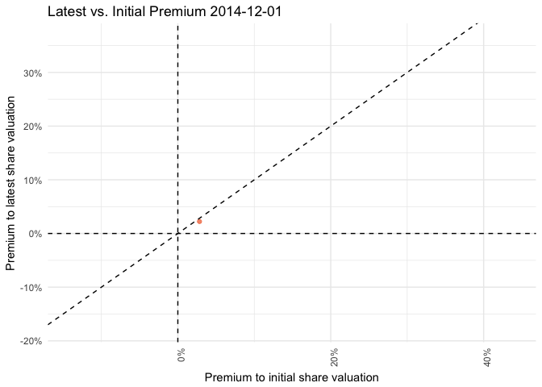<!-- -->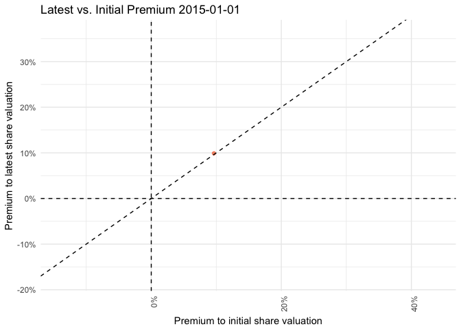<!-- -->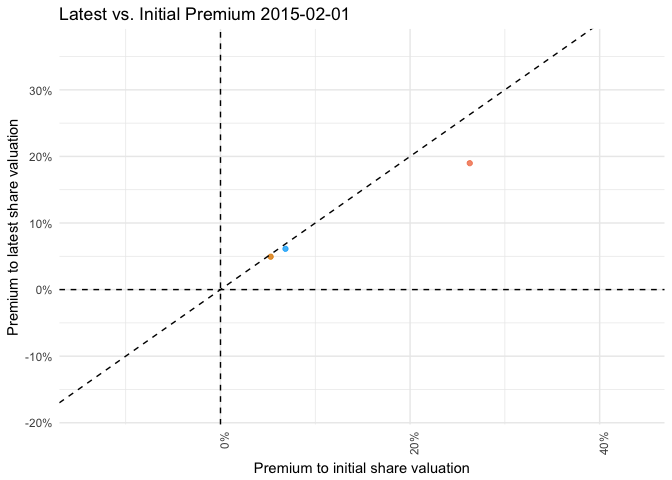<!-- -->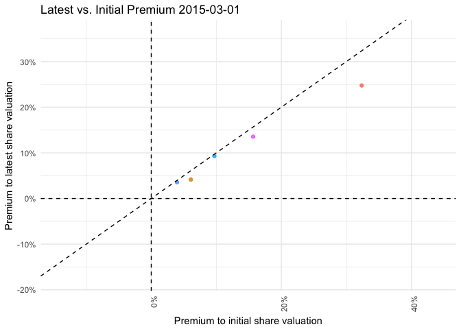<!-- -->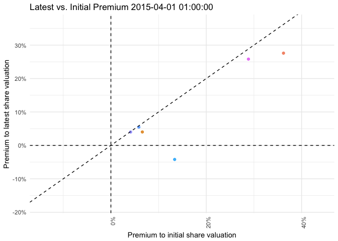<!-- --><!-- -->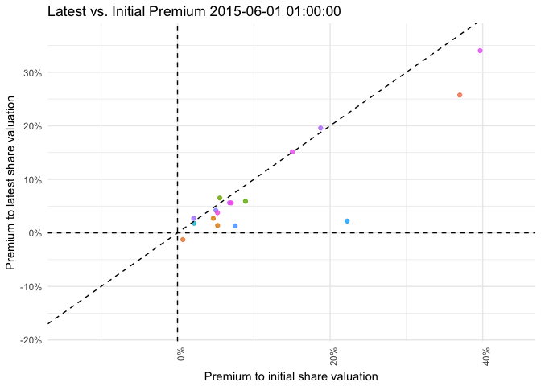<!-- -->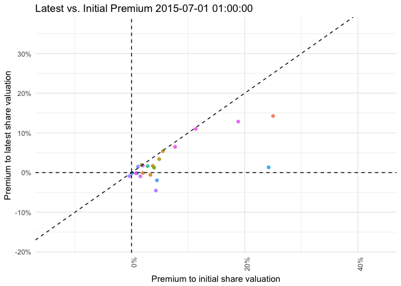<!-- -->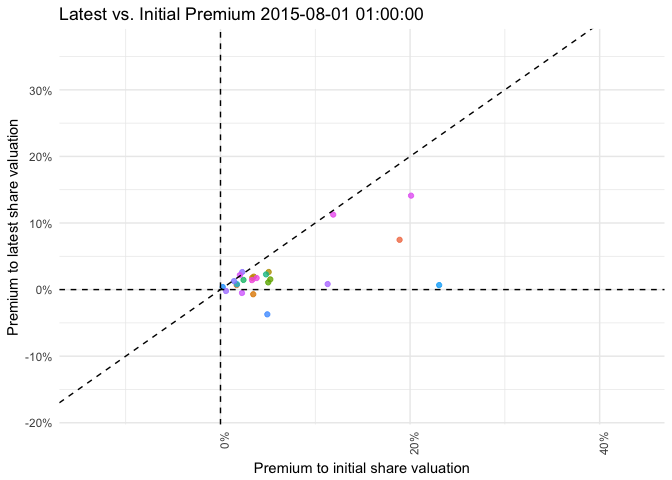<!-- -->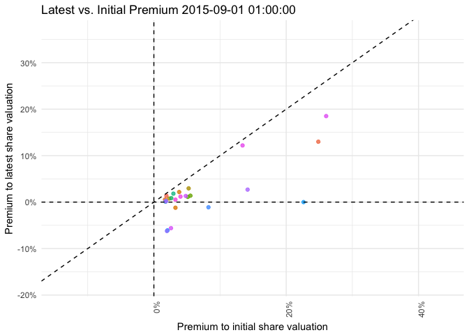<!-- -->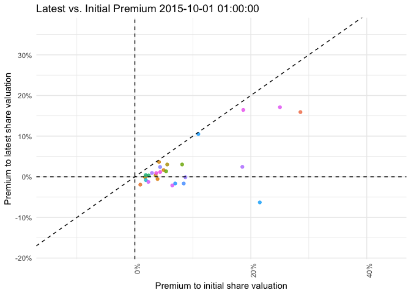<!-- --><!-- -->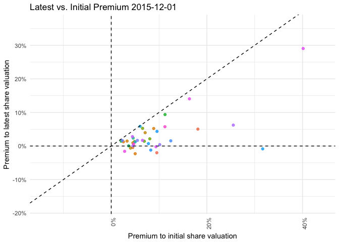<!-- --><!-- -->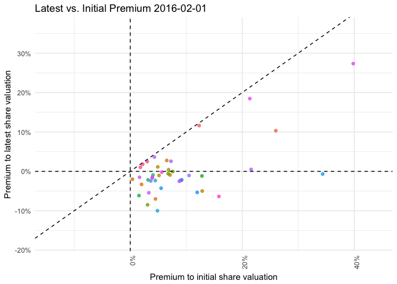<!-- --><!-- --><!-- -->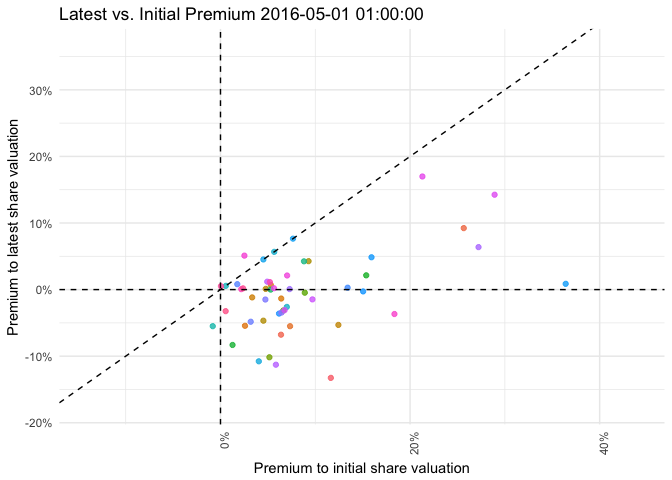<!-- -->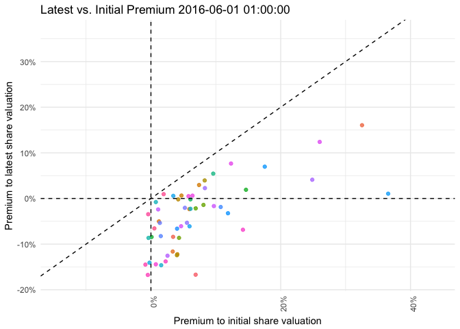<!-- --><!-- -->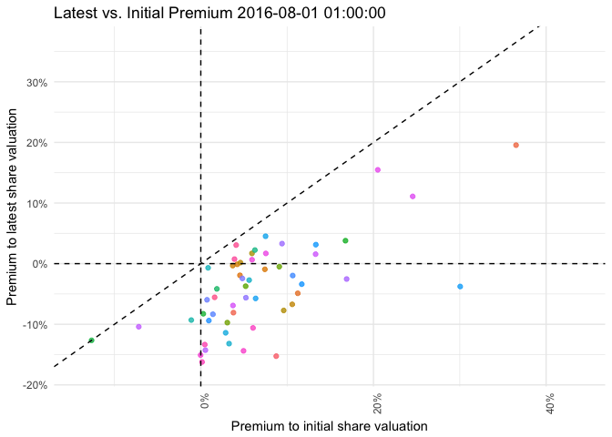<!-- -->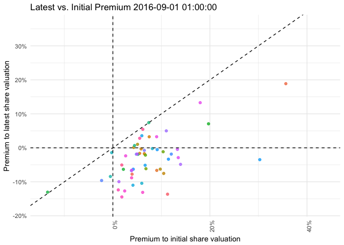<!-- -->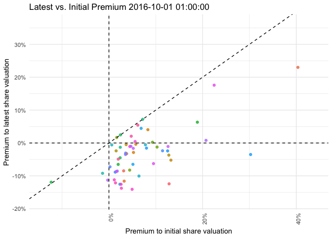<!-- -->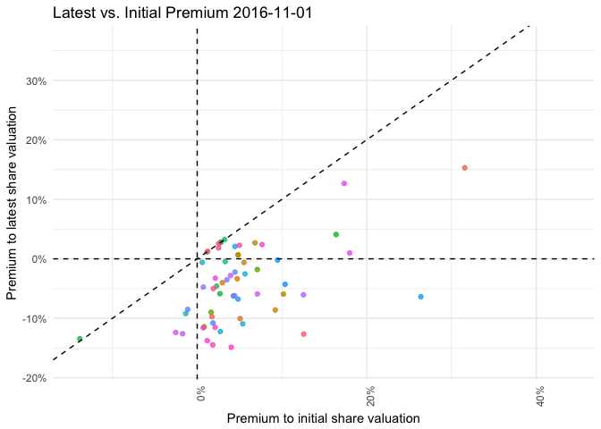<!-- -->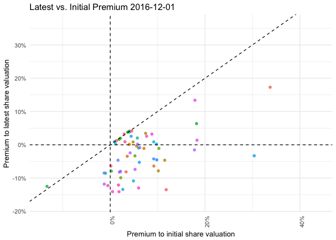<!-- --><!-- -->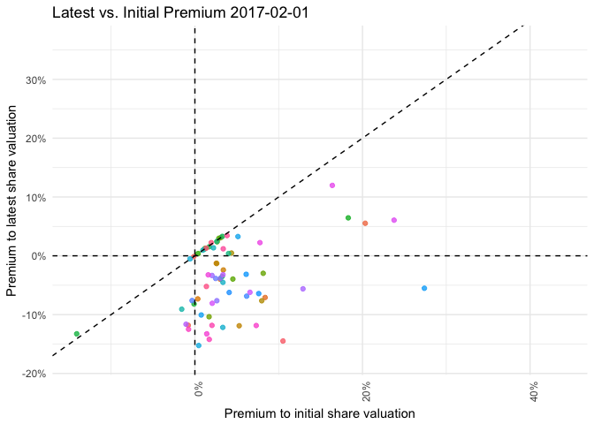<!-- -->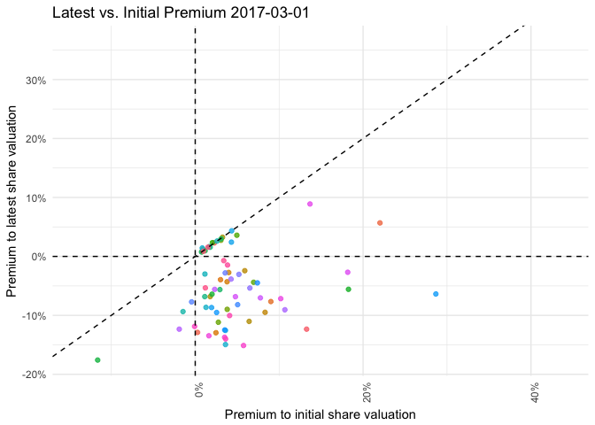<!-- -->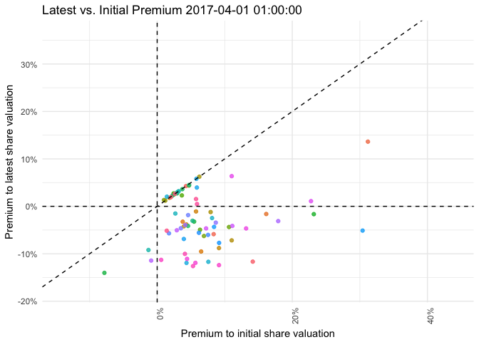<!-- -->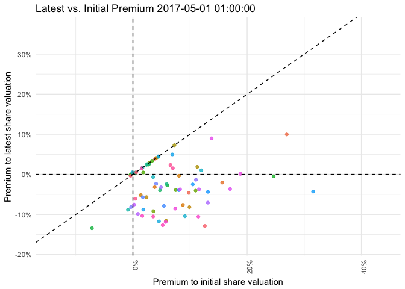<!-- -->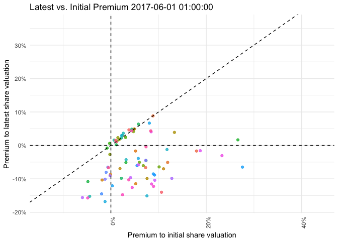<!-- -->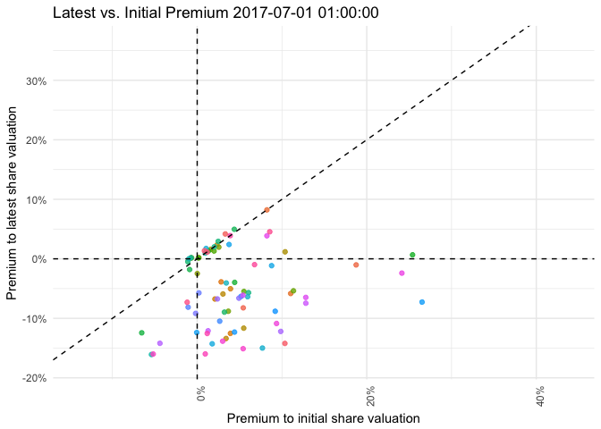<!-- -->

